cola Report for Consensus Partitioning
==================

**Date**: 2019-12-03 12:03:03 CET, **cola version**: 1.3.2

----------------------------------------------------------------

<style type='text/css'>

body, td, th {
   font-family: Arial,Helvetica,sans-serif;
   background-color: white;
   font-size: 13px;
  max-width: 800px;
  margin: auto;
  margin-left:210px;
  padding: 0px 10px 0px 10px;
  border-left: 1px solid #EEEEEE;
  line-height: 150%;
}

tt, code, pre {
   font-family: 'DejaVu Sans Mono', 'Droid Sans Mono', 'Lucida Console', Consolas, Monaco, 

monospace;
}

h1 {
   font-size:2.2em;
}

h2 {
   font-size:1.8em;
}

h3 {
   font-size:1.4em;
}

h4 {
   font-size:1.0em;
}

h5 {
   font-size:0.9em;
}

h6 {
   font-size:0.8em;
}

a {
  text-decoration: none;
  color: #0366d6;
}

a:hover {
  text-decoration: underline;
}

a:visited {
   color: #0366d6;
}

pre, img {
  max-width: 100%;
}
pre {
  overflow-x: auto;
}
pre code {
   display: block; padding: 0.5em;
}

code {
  font-size: 92%;
  border: 1px solid #ccc;
}

code[class] {
  background-color: #F8F8F8;
}

table, td, th {
  border: 1px solid #ccc;
}

blockquote {
   color:#666666;
   margin:0;
   padding-left: 1em;
   border-left: 0.5em #EEE solid;
}

hr {
   height: 0px;
   border-bottom: none;
   border-top-width: thin;
   border-top-style: dotted;
   border-top-color: #999999;
}

@media print {
   * {
      background: transparent !important;
      color: black !important;
      filter:none !important;
      -ms-filter: none !important;
   }

   body {
      font-size:12pt;
      max-width:100%;
   }

   a, a:visited {
      text-decoration: underline;
   }

   hr {
      visibility: hidden;
      page-break-before: always;
   }

   pre, blockquote {
      padding-right: 1em;
      page-break-inside: avoid;
   }

   tr, img {
      page-break-inside: avoid;
   }

   img {
      max-width: 100% !important;
   }

   @page :left {
      margin: 15mm 20mm 15mm 10mm;
   }

   @page :right {
      margin: 15mm 10mm 15mm 20mm;
   }

   p, h2, h3 {
      orphans: 3; widows: 3;
   }

   h2, h3 {
      page-break-after: avoid;
   }
}
</style>


## Summary


All available functions which can be applied to this `res_list` object:


```r
res_list
```

```
#> A 'ConsensusPartitionList' object with 24 methods.
#>   On a matrix with 10597 rows and 76 columns.
#>   Top rows are extracted by 'SD, CV, MAD, ATC' methods.
#>   Subgroups are detected by 'hclust, kmeans, skmeans, pam, mclust, NMF' method.
#>   Number of partitions are tried for k = 2, 3, 4, 5, 6.
#>   Performed in total 30000 partitions by row resampling.
#> 
#> Following methods can be applied to this 'ConsensusPartitionList' object:
#>  [1] "cola_report"           "collect_classes"       "collect_plots"         "collect_stats"        
#>  [5] "colnames"              "functional_enrichment" "get_anno_col"          "get_anno"             
#>  [9] "get_classes"           "get_matrix"            "get_membership"        "get_stats"            
#> [13] "is_best_k"             "is_stable_k"           "ncol"                  "nrow"                 
#> [17] "rownames"              "show"                  "suggest_best_k"        "test_to_known_factors"
#> [21] "top_rows_heatmap"      "top_rows_overlap"     
#> 
#> You can get result for a single method by, e.g. object["SD", "hclust"] or object["SD:hclust"]
#> or a subset of methods by object[c("SD", "CV")], c("hclust", "kmeans")]
```

The call of `run_all_consensus_partition_methods()` was:


```
#> run_all_consensus_partition_methods(data = mat, mc.cores = 4, anno = anno)
```

Dimension of the input matrix:


```r
mat = get_matrix(res_list)
dim(mat)
```

```
#> [1] 10597    76
```

### Density distribution

The density distribution for each sample is visualized as in one column in the
following heatmap. The clustering is based on the distance which is the
Kolmogorov-Smirnov statistic between two distributions.


```r
library(ComplexHeatmap)
densityHeatmap(mat, top_annotation = HeatmapAnnotation(df = get_anno(res_list), 
    col = get_anno_col(res_list)), ylab = "value", cluster_columns = TRUE, show_column_names = FALSE,
    mc.cores = 4)
```

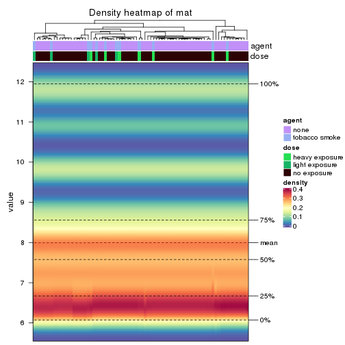


### Suggest the best k


Folowing table shows the best `k` (number of partitions) for each combination
of top-value methods and partition methods. Clicking on the method name in
the table goes to the section for a single combination of methods.

[The cola vignette](http://bioconductor.org/packages/devel/bioc/vignettes/cola/inst/doc/cola.html#toc_13)
explains the definition of the metrics used for determining the best
number of partitions.


```r
suggest_best_k(res_list)
```


|                            | The best k| 1-PAC| Mean silhouette| Concordance|   |
|:---------------------------|----------:|-----:|---------------:|-----------:|:--|
|[SD:kmeans](#SD-kmeans)     |          2| 0.840|           0.883|       0.954|   |
|[ATC:skmeans](#ATC-skmeans) |          2| 0.817|           0.912|       0.963|   |
|[CV:kmeans](#CV-kmeans)     |          2| 0.792|           0.884|       0.955|   |
|[ATC:kmeans](#ATC-kmeans)   |          2| 0.790|           0.901|       0.960|   |
|[CV:pam](#CV-pam)           |          2| 0.742|           0.851|       0.941|   |
|[MAD:kmeans](#MAD-kmeans)   |          2| 0.719|           0.844|       0.936|   |
|[SD:skmeans](#SD-skmeans)   |          2| 0.673|           0.825|       0.931|   |
|[MAD:skmeans](#MAD-skmeans) |          2| 0.673|           0.843|       0.936|   |
|[CV:skmeans](#CV-skmeans)   |          2| 0.656|           0.816|       0.928|   |
|[ATC:pam](#ATC-pam)         |          3| 0.652|           0.782|       0.907|   |
|[ATC:hclust](#ATC-hclust)   |          2| 0.572|           0.783|       0.903|   |
|[ATC:mclust](#ATC-mclust)   |          2| 0.499|           0.857|       0.896|   |
|[MAD:hclust](#MAD-hclust)   |          2| 0.462|           0.736|       0.886|   |
|[SD:hclust](#SD-hclust)     |          2| 0.441|           0.779|       0.889|   |
|[ATC:NMF](#ATC-NMF)         |          2| 0.411|           0.792|       0.888|   |
|[MAD:pam](#MAD-pam)         |          2| 0.410|           0.684|       0.874|   |
|[SD:mclust](#SD-mclust)     |          2| 0.403|           0.796|       0.870|   |
|[CV:hclust](#CV-hclust)     |          2| 0.345|           0.797|       0.876|   |
|[MAD:mclust](#MAD-mclust)   |          3| 0.324|           0.499|       0.714|   |
|[SD:pam](#SD-pam)           |          2| 0.283|           0.664|       0.825|   |
|[SD:NMF](#SD-NMF)           |          2| 0.269|           0.559|       0.791|   |
|[MAD:NMF](#MAD-NMF)         |          2| 0.266|           0.675|       0.833|   |
|[CV:NMF](#CV-NMF)           |          2| 0.248|           0.496|       0.790|   |
|[CV:mclust](#CV-mclust)     |          2| 0.184|           0.589|       0.709|   |

\*\*: 1-PAC > 0.95, \*: 1-PAC > 0.9


### CDF of consensus matrices

Cumulative distribution function curves of consensus matrix for all methods.


```r
collect_plots(res_list, fun = plot_ecdf)
```

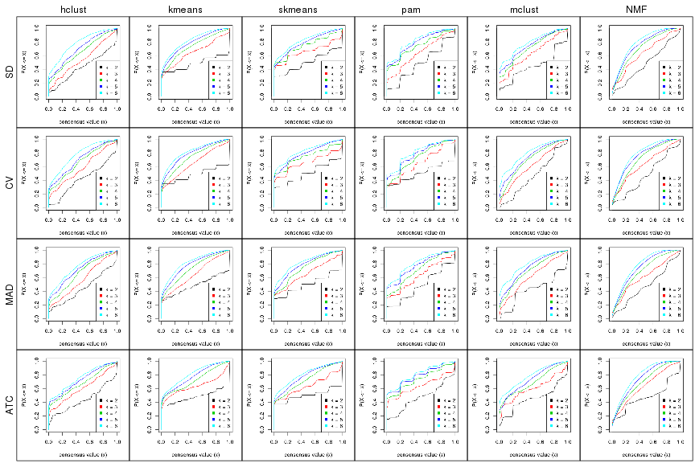


### Consensus heatmap

Consensus heatmaps for all methods. ([What is a consensus heatmap?](http://bioconductor.org/packages/devel/bioc/vignettes/cola/inst/doc/cola.html#toc_9))


<style type='text/css'>


.ui-helper-hidden {
	display: none;
}
.ui-helper-hidden-accessible {
	border: 0;
	clip: rect(0 0 0 0);
	height: 1px;
	margin: -1px;
	overflow: hidden;
	padding: 0;
	position: absolute;
	width: 1px;
}
.ui-helper-reset {
	margin: 0;
	padding: 0;
	border: 0;
	outline: 0;
	line-height: 1.3;
	text-decoration: none;
	font-size: 100%;
	list-style: none;
}
.ui-helper-clearfix:before,
.ui-helper-clearfix:after {
	content: "";
	display: table;
	border-collapse: collapse;
}
.ui-helper-clearfix:after {
	clear: both;
}
.ui-helper-zfix {
	width: 100%;
	height: 100%;
	top: 0;
	left: 0;
	position: absolute;
	opacity: 0;
	filter:Alpha(Opacity=0); 
}

.ui-front {
	z-index: 100;
}


.ui-state-disabled {
	cursor: default !important;
	pointer-events: none;
}


.ui-icon {
	display: inline-block;
	vertical-align: middle;
	margin-top: -.25em;
	position: relative;
	text-indent: -99999px;
	overflow: hidden;
	background-repeat: no-repeat;
}

.ui-widget-icon-block {
	left: 50%;
	margin-left: -8px;
	display: block;
}


.ui-widget-overlay {
	position: fixed;
	top: 0;
	left: 0;
	width: 100%;
	height: 100%;
}
.ui-accordion .ui-accordion-header {
	display: block;
	cursor: pointer;
	position: relative;
	margin: 2px 0 0 0;
	padding: .5em .5em .5em .7em;
	font-size: 100%;
}
.ui-accordion .ui-accordion-content {
	padding: 1em 2.2em;
	border-top: 0;
	overflow: auto;
}
.ui-autocomplete {
	position: absolute;
	top: 0;
	left: 0;
	cursor: default;
}
.ui-menu {
	list-style: none;
	padding: 0;
	margin: 0;
	display: block;
	outline: 0;
}
.ui-menu .ui-menu {
	position: absolute;
}
.ui-menu .ui-menu-item {
	margin: 0;
	cursor: pointer;
	
	list-style-image: url("data:image/gif;base64,R0lGODlhAQABAIAAAAAAAP///yH5BAEAAAAALAAAAAABAAEAAAIBRAA7");
}
.ui-menu .ui-menu-item-wrapper {
	position: relative;
	padding: 3px 1em 3px .4em;
}
.ui-menu .ui-menu-divider {
	margin: 5px 0;
	height: 0;
	font-size: 0;
	line-height: 0;
	border-width: 1px 0 0 0;
}
.ui-menu .ui-state-focus,
.ui-menu .ui-state-active {
	margin: -1px;
}


.ui-menu-icons {
	position: relative;
}
.ui-menu-icons .ui-menu-item-wrapper {
	padding-left: 2em;
}


.ui-menu .ui-icon {
	position: absolute;
	top: 0;
	bottom: 0;
	left: .2em;
	margin: auto 0;
}


.ui-menu .ui-menu-icon {
	left: auto;
	right: 0;
}
.ui-button {
	padding: .4em 1em;
	display: inline-block;
	position: relative;
	line-height: normal;
	margin-right: .1em;
	cursor: pointer;
	vertical-align: middle;
	text-align: center;
	-webkit-user-select: none;
	-moz-user-select: none;
	-ms-user-select: none;
	user-select: none;

	
	overflow: visible;
}

.ui-button,
.ui-button:link,
.ui-button:visited,
.ui-button:hover,
.ui-button:active {
	text-decoration: none;
}


.ui-button-icon-only {
	width: 2em;
	box-sizing: border-box;
	text-indent: -9999px;
	white-space: nowrap;
}


input.ui-button.ui-button-icon-only {
	text-indent: 0;
}


.ui-button-icon-only .ui-icon {
	position: absolute;
	top: 50%;
	left: 50%;
	margin-top: -8px;
	margin-left: -8px;
}

.ui-button.ui-icon-notext .ui-icon {
	padding: 0;
	width: 2.1em;
	height: 2.1em;
	text-indent: -9999px;
	white-space: nowrap;

}

input.ui-button.ui-icon-notext .ui-icon {
	width: auto;
	height: auto;
	text-indent: 0;
	white-space: normal;
	padding: .4em 1em;
}


input.ui-button::-moz-focus-inner,
button.ui-button::-moz-focus-inner {
	border: 0;
	padding: 0;
}
.ui-controlgroup {
	vertical-align: middle;
	display: inline-block;
}
.ui-controlgroup > .ui-controlgroup-item {
	float: left;
	margin-left: 0;
	margin-right: 0;
}
.ui-controlgroup > .ui-controlgroup-item:focus,
.ui-controlgroup > .ui-controlgroup-item.ui-visual-focus {
	z-index: 9999;
}
.ui-controlgroup-vertical > .ui-controlgroup-item {
	display: block;
	float: none;
	width: 100%;
	margin-top: 0;
	margin-bottom: 0;
	text-align: left;
}
.ui-controlgroup-vertical .ui-controlgroup-item {
	box-sizing: border-box;
}
.ui-controlgroup .ui-controlgroup-label {
	padding: .4em 1em;
}
.ui-controlgroup .ui-controlgroup-label span {
	font-size: 80%;
}
.ui-controlgroup-horizontal .ui-controlgroup-label + .ui-controlgroup-item {
	border-left: none;
}
.ui-controlgroup-vertical .ui-controlgroup-label + .ui-controlgroup-item {
	border-top: none;
}
.ui-controlgroup-horizontal .ui-controlgroup-label.ui-widget-content {
	border-right: none;
}
.ui-controlgroup-vertical .ui-controlgroup-label.ui-widget-content {
	border-bottom: none;
}


.ui-controlgroup-vertical .ui-spinner-input {

	
	width: 75%;
	width: calc( 100% - 2.4em );
}
.ui-controlgroup-vertical .ui-spinner .ui-spinner-up {
	border-top-style: solid;
}

.ui-checkboxradio-label .ui-icon-background {
	box-shadow: inset 1px 1px 1px #ccc;
	border-radius: .12em;
	border: none;
}
.ui-checkboxradio-radio-label .ui-icon-background {
	width: 16px;
	height: 16px;
	border-radius: 1em;
	overflow: visible;
	border: none;
}
.ui-checkboxradio-radio-label.ui-checkboxradio-checked .ui-icon,
.ui-checkboxradio-radio-label.ui-checkboxradio-checked:hover .ui-icon {
	background-image: none;
	width: 8px;
	height: 8px;
	border-width: 4px;
	border-style: solid;
}
.ui-checkboxradio-disabled {
	pointer-events: none;
}
.ui-datepicker {
	width: 17em;
	padding: .2em .2em 0;
	display: none;
}
.ui-datepicker .ui-datepicker-header {
	position: relative;
	padding: .2em 0;
}
.ui-datepicker .ui-datepicker-prev,
.ui-datepicker .ui-datepicker-next {
	position: absolute;
	top: 2px;
	width: 1.8em;
	height: 1.8em;
}
.ui-datepicker .ui-datepicker-prev-hover,
.ui-datepicker .ui-datepicker-next-hover {
	top: 1px;
}
.ui-datepicker .ui-datepicker-prev {
	left: 2px;
}
.ui-datepicker .ui-datepicker-next {
	right: 2px;
}
.ui-datepicker .ui-datepicker-prev-hover {
	left: 1px;
}
.ui-datepicker .ui-datepicker-next-hover {
	right: 1px;
}
.ui-datepicker .ui-datepicker-prev span,
.ui-datepicker .ui-datepicker-next span {
	display: block;
	position: absolute;
	left: 50%;
	margin-left: -8px;
	top: 50%;
	margin-top: -8px;
}
.ui-datepicker .ui-datepicker-title {
	margin: 0 2.3em;
	line-height: 1.8em;
	text-align: center;
}
.ui-datepicker .ui-datepicker-title select {
	font-size: 1em;
	margin: 1px 0;
}
.ui-datepicker select.ui-datepicker-month,
.ui-datepicker select.ui-datepicker-year {
	width: 45%;
}
.ui-datepicker table {
	width: 100%;
	font-size: .9em;
	border-collapse: collapse;
	margin: 0 0 .4em;
}
.ui-datepicker th {
	padding: .7em .3em;
	text-align: center;
	font-weight: bold;
	border: 0;
}
.ui-datepicker td {
	border: 0;
	padding: 1px;
}
.ui-datepicker td span,
.ui-datepicker td a {
	display: block;
	padding: .2em;
	text-align: right;
	text-decoration: none;
}
.ui-datepicker .ui-datepicker-buttonpane {
	background-image: none;
	margin: .7em 0 0 0;
	padding: 0 .2em;
	border-left: 0;
	border-right: 0;
	border-bottom: 0;
}
.ui-datepicker .ui-datepicker-buttonpane button {
	float: right;
	margin: .5em .2em .4em;
	cursor: pointer;
	padding: .2em .6em .3em .6em;
	width: auto;
	overflow: visible;
}
.ui-datepicker .ui-datepicker-buttonpane button.ui-datepicker-current {
	float: left;
}


.ui-datepicker.ui-datepicker-multi {
	width: auto;
}
.ui-datepicker-multi .ui-datepicker-group {
	float: left;
}
.ui-datepicker-multi .ui-datepicker-group table {
	width: 95%;
	margin: 0 auto .4em;
}
.ui-datepicker-multi-2 .ui-datepicker-group {
	width: 50%;
}
.ui-datepicker-multi-3 .ui-datepicker-group {
	width: 33.3%;
}
.ui-datepicker-multi-4 .ui-datepicker-group {
	width: 25%;
}
.ui-datepicker-multi .ui-datepicker-group-last .ui-datepicker-header,
.ui-datepicker-multi .ui-datepicker-group-middle .ui-datepicker-header {
	border-left-width: 0;
}
.ui-datepicker-multi .ui-datepicker-buttonpane {
	clear: left;
}
.ui-datepicker-row-break {
	clear: both;
	width: 100%;
	font-size: 0;
}


.ui-datepicker-rtl {
	direction: rtl;
}
.ui-datepicker-rtl .ui-datepicker-prev {
	right: 2px;
	left: auto;
}
.ui-datepicker-rtl .ui-datepicker-next {
	left: 2px;
	right: auto;
}
.ui-datepicker-rtl .ui-datepicker-prev:hover {
	right: 1px;
	left: auto;
}
.ui-datepicker-rtl .ui-datepicker-next:hover {
	left: 1px;
	right: auto;
}
.ui-datepicker-rtl .ui-datepicker-buttonpane {
	clear: right;
}
.ui-datepicker-rtl .ui-datepicker-buttonpane button {
	float: left;
}
.ui-datepicker-rtl .ui-datepicker-buttonpane button.ui-datepicker-current,
.ui-datepicker-rtl .ui-datepicker-group {
	float: right;
}
.ui-datepicker-rtl .ui-datepicker-group-last .ui-datepicker-header,
.ui-datepicker-rtl .ui-datepicker-group-middle .ui-datepicker-header {
	border-right-width: 0;
	border-left-width: 1px;
}


.ui-datepicker .ui-icon {
	display: block;
	text-indent: -99999px;
	overflow: hidden;
	background-repeat: no-repeat;
	left: .5em;
	top: .3em;
}
.ui-dialog {
	position: absolute;
	top: 0;
	left: 0;
	padding: .2em;
	outline: 0;
}
.ui-dialog .ui-dialog-titlebar {
	padding: .4em 1em;
	position: relative;
}
.ui-dialog .ui-dialog-title {
	float: left;
	margin: .1em 0;
	white-space: nowrap;
	width: 90%;
	overflow: hidden;
	text-overflow: ellipsis;
}
.ui-dialog .ui-dialog-titlebar-close {
	position: absolute;
	right: .3em;
	top: 50%;
	width: 20px;
	margin: -10px 0 0 0;
	padding: 1px;
	height: 20px;
}
.ui-dialog .ui-dialog-content {
	position: relative;
	border: 0;
	padding: .5em 1em;
	background: none;
	overflow: auto;
}
.ui-dialog .ui-dialog-buttonpane {
	text-align: left;
	border-width: 1px 0 0 0;
	background-image: none;
	margin-top: .5em;
	padding: .3em 1em .5em .4em;
}
.ui-dialog .ui-dialog-buttonpane .ui-dialog-buttonset {
	float: right;
}
.ui-dialog .ui-dialog-buttonpane button {
	margin: .5em .4em .5em 0;
	cursor: pointer;
}
.ui-dialog .ui-resizable-n {
	height: 2px;
	top: 0;
}
.ui-dialog .ui-resizable-e {
	width: 2px;
	right: 0;
}
.ui-dialog .ui-resizable-s {
	height: 2px;
	bottom: 0;
}
.ui-dialog .ui-resizable-w {
	width: 2px;
	left: 0;
}
.ui-dialog .ui-resizable-se,
.ui-dialog .ui-resizable-sw,
.ui-dialog .ui-resizable-ne,
.ui-dialog .ui-resizable-nw {
	width: 7px;
	height: 7px;
}
.ui-dialog .ui-resizable-se {
	right: 0;
	bottom: 0;
}
.ui-dialog .ui-resizable-sw {
	left: 0;
	bottom: 0;
}
.ui-dialog .ui-resizable-ne {
	right: 0;
	top: 0;
}
.ui-dialog .ui-resizable-nw {
	left: 0;
	top: 0;
}
.ui-draggable .ui-dialog-titlebar {
	cursor: move;
}
.ui-draggable-handle {
	-ms-touch-action: none;
	touch-action: none;
}
.ui-resizable {
	position: relative;
}
.ui-resizable-handle {
	position: absolute;
	font-size: 0.1px;
	display: block;
	-ms-touch-action: none;
	touch-action: none;
}
.ui-resizable-disabled .ui-resizable-handle,
.ui-resizable-autohide .ui-resizable-handle {
	display: none;
}
.ui-resizable-n {
	cursor: n-resize;
	height: 7px;
	width: 100%;
	top: -5px;
	left: 0;
}
.ui-resizable-s {
	cursor: s-resize;
	height: 7px;
	width: 100%;
	bottom: -5px;
	left: 0;
}
.ui-resizable-e {
	cursor: e-resize;
	width: 7px;
	right: -5px;
	top: 0;
	height: 100%;
}
.ui-resizable-w {
	cursor: w-resize;
	width: 7px;
	left: -5px;
	top: 0;
	height: 100%;
}
.ui-resizable-se {
	cursor: se-resize;
	width: 12px;
	height: 12px;
	right: 1px;
	bottom: 1px;
}
.ui-resizable-sw {
	cursor: sw-resize;
	width: 9px;
	height: 9px;
	left: -5px;
	bottom: -5px;
}
.ui-resizable-nw {
	cursor: nw-resize;
	width: 9px;
	height: 9px;
	left: -5px;
	top: -5px;
}
.ui-resizable-ne {
	cursor: ne-resize;
	width: 9px;
	height: 9px;
	right: -5px;
	top: -5px;
}
.ui-progressbar {
	height: 2em;
	text-align: left;
	overflow: hidden;
}
.ui-progressbar .ui-progressbar-value {
	margin: -1px;
	height: 100%;
}
.ui-progressbar .ui-progressbar-overlay {
	background: url("");
	height: 100%;
	filter: alpha(opacity=25); 
	opacity: 0.25;
}
.ui-progressbar-indeterminate .ui-progressbar-value {
	background-image: none;
}
.ui-selectable {
	-ms-touch-action: none;
	touch-action: none;
}
.ui-selectable-helper {
	position: absolute;
	z-index: 100;
	border: 1px dotted black;
}
.ui-selectmenu-menu {
	padding: 0;
	margin: 0;
	position: absolute;
	top: 0;
	left: 0;
	display: none;
}
.ui-selectmenu-menu .ui-menu {
	overflow: auto;
	overflow-x: hidden;
	padding-bottom: 1px;
}
.ui-selectmenu-menu .ui-menu .ui-selectmenu-optgroup {
	font-size: 1em;
	font-weight: bold;
	line-height: 1.5;
	padding: 2px 0.4em;
	margin: 0.5em 0 0 0;
	height: auto;
	border: 0;
}
.ui-selectmenu-open {
	display: block;
}
.ui-selectmenu-text {
	display: block;
	margin-right: 20px;
	overflow: hidden;
	text-overflow: ellipsis;
}
.ui-selectmenu-button.ui-button {
	text-align: left;
	white-space: nowrap;
	width: 14em;
}
.ui-selectmenu-icon.ui-icon {
	float: right;
	margin-top: 0;
}
.ui-slider {
	position: relative;
	text-align: left;
}
.ui-slider .ui-slider-handle {
	position: absolute;
	z-index: 2;
	width: 1.2em;
	height: 1.2em;
	cursor: default;
	-ms-touch-action: none;
	touch-action: none;
}
.ui-slider .ui-slider-range {
	position: absolute;
	z-index: 1;
	font-size: .7em;
	display: block;
	border: 0;
	background-position: 0 0;
}


.ui-slider.ui-state-disabled .ui-slider-handle,
.ui-slider.ui-state-disabled .ui-slider-range {
	filter: inherit;
}

.ui-slider-horizontal {
	height: .8em;
}
.ui-slider-horizontal .ui-slider-handle {
	top: -.3em;
	margin-left: -.6em;
}
.ui-slider-horizontal .ui-slider-range {
	top: 0;
	height: 100%;
}
.ui-slider-horizontal .ui-slider-range-min {
	left: 0;
}
.ui-slider-horizontal .ui-slider-range-max {
	right: 0;
}

.ui-slider-vertical {
	width: .8em;
	height: 100px;
}
.ui-slider-vertical .ui-slider-handle {
	left: -.3em;
	margin-left: 0;
	margin-bottom: -.6em;
}
.ui-slider-vertical .ui-slider-range {
	left: 0;
	width: 100%;
}
.ui-slider-vertical .ui-slider-range-min {
	bottom: 0;
}
.ui-slider-vertical .ui-slider-range-max {
	top: 0;
}
.ui-sortable-handle {
	-ms-touch-action: none;
	touch-action: none;
}
.ui-spinner {
	position: relative;
	display: inline-block;
	overflow: hidden;
	padding: 0;
	vertical-align: middle;
}
.ui-spinner-input {
	border: none;
	background: none;
	color: inherit;
	padding: .222em 0;
	margin: .2em 0;
	vertical-align: middle;
	margin-left: .4em;
	margin-right: 2em;
}
.ui-spinner-button {
	width: 1.6em;
	height: 50%;
	font-size: .5em;
	padding: 0;
	margin: 0;
	text-align: center;
	position: absolute;
	cursor: default;
	display: block;
	overflow: hidden;
	right: 0;
}

.ui-spinner a.ui-spinner-button {
	border-top-style: none;
	border-bottom-style: none;
	border-right-style: none;
}
.ui-spinner-up {
	top: 0;
}
.ui-spinner-down {
	bottom: 0;
}
.ui-tabs {
	position: relative;
	padding: .2em;
}
.ui-tabs .ui-tabs-nav {
	margin: 0;
	padding: .2em .2em 0;
}
.ui-tabs .ui-tabs-nav li {
	list-style: none;
	float: left;
	position: relative;
	top: 0;
	margin: 1px .2em 0 0;
	border-bottom-width: 0;
	padding: 0;
	white-space: nowrap;
}
.ui-tabs .ui-tabs-nav .ui-tabs-anchor {
	float: left;
	padding: .5em 1em;
	text-decoration: none;
}
.ui-tabs .ui-tabs-nav li.ui-tabs-active {
	margin-bottom: -1px;
	padding-bottom: 1px;
}
.ui-tabs .ui-tabs-nav li.ui-tabs-active .ui-tabs-anchor,
.ui-tabs .ui-tabs-nav li.ui-state-disabled .ui-tabs-anchor,
.ui-tabs .ui-tabs-nav li.ui-tabs-loading .ui-tabs-anchor {
	cursor: text;
}
.ui-tabs-collapsible .ui-tabs-nav li.ui-tabs-active .ui-tabs-anchor {
	cursor: pointer;
}
.ui-tabs .ui-tabs-panel {
	display: block;
	border-width: 0;
	padding: 1em 1.4em;
	background: none;
}
.ui-tooltip {
	padding: 8px;
	position: absolute;
	z-index: 9999;
	max-width: 300px;
}
body .ui-tooltip {
	border-width: 2px;
}

.ui-widget {
	font-family: Arial,Helvetica,sans-serif;
	font-size: 1em;
}
.ui-widget .ui-widget {
	font-size: 1em;
}
.ui-widget input,
.ui-widget select,
.ui-widget textarea,
.ui-widget button {
	font-family: Arial,Helvetica,sans-serif;
	font-size: 1em;
}
.ui-widget.ui-widget-content {
	border: 1px solid #c5c5c5;
}
.ui-widget-content {
	border: 1px solid #dddddd;
	background: #ffffff;
	color: #333333;
}
.ui-widget-content a {
	color: #333333;
}
.ui-widget-header {
	border: 1px solid #dddddd;
	background: #e9e9e9;
	color: #333333;
	font-weight: bold;
}
.ui-widget-header a {
	color: #333333;
}


.ui-state-default,
.ui-widget-content .ui-state-default,
.ui-widget-header .ui-state-default,
.ui-button,


html .ui-button.ui-state-disabled:hover,
html .ui-button.ui-state-disabled:active {
	border: 1px solid #c5c5c5;
	background: #f6f6f6;
	font-weight: normal;
	color: #454545;
}
.ui-state-default a,
.ui-state-default a:link,
.ui-state-default a:visited,
a.ui-button,
a:link.ui-button,
a:visited.ui-button,
.ui-button {
	color: #454545;
	text-decoration: none;
}
.ui-state-hover,
.ui-widget-content .ui-state-hover,
.ui-widget-header .ui-state-hover,
.ui-state-focus,
.ui-widget-content .ui-state-focus,
.ui-widget-header .ui-state-focus,
.ui-button:hover,
.ui-button:focus {
	border: 1px solid #cccccc;
	background: #ededed;
	font-weight: normal;
	color: #2b2b2b;
}
.ui-state-hover a,
.ui-state-hover a:hover,
.ui-state-hover a:link,
.ui-state-hover a:visited,
.ui-state-focus a,
.ui-state-focus a:hover,
.ui-state-focus a:link,
.ui-state-focus a:visited,
a.ui-button:hover,
a.ui-button:focus {
	color: #2b2b2b;
	text-decoration: none;
}

.ui-visual-focus {
	box-shadow: 0 0 3px 1px rgb(94, 158, 214);
}
.ui-state-active,
.ui-widget-content .ui-state-active,
.ui-widget-header .ui-state-active,
a.ui-button:active,
.ui-button:active,
.ui-button.ui-state-active:hover {
	border: 1px solid #003eff;
	background: #007fff;
	font-weight: normal;
	color: #ffffff;
}
.ui-icon-background,
.ui-state-active .ui-icon-background {
	border: #003eff;
	background-color: #ffffff;
}
.ui-state-active a,
.ui-state-active a:link,
.ui-state-active a:visited {
	color: #ffffff;
	text-decoration: none;
}


.ui-state-highlight,
.ui-widget-content .ui-state-highlight,
.ui-widget-header .ui-state-highlight {
	border: 1px solid #dad55e;
	background: #fffa90;
	color: #777620;
}
.ui-state-checked {
	border: 1px solid #dad55e;
	background: #fffa90;
}
.ui-state-highlight a,
.ui-widget-content .ui-state-highlight a,
.ui-widget-header .ui-state-highlight a {
	color: #777620;
}
.ui-state-error,
.ui-widget-content .ui-state-error,
.ui-widget-header .ui-state-error {
	border: 1px solid #f1a899;
	background: #fddfdf;
	color: #5f3f3f;
}
.ui-state-error a,
.ui-widget-content .ui-state-error a,
.ui-widget-header .ui-state-error a {
	color: #5f3f3f;
}
.ui-state-error-text,
.ui-widget-content .ui-state-error-text,
.ui-widget-header .ui-state-error-text {
	color: #5f3f3f;
}
.ui-priority-primary,
.ui-widget-content .ui-priority-primary,
.ui-widget-header .ui-priority-primary {
	font-weight: bold;
}
.ui-priority-secondary,
.ui-widget-content .ui-priority-secondary,
.ui-widget-header .ui-priority-secondary {
	opacity: .7;
	filter:Alpha(Opacity=70); 
	font-weight: normal;
}
.ui-state-disabled,
.ui-widget-content .ui-state-disabled,
.ui-widget-header .ui-state-disabled {
	opacity: .35;
	filter:Alpha(Opacity=35); 
	background-image: none;
}
.ui-state-disabled .ui-icon {
	filter:Alpha(Opacity=35); 
}


.ui-icon {
	width: 16px;
	height: 16px;
}
.ui-icon,
.ui-widget-content .ui-icon {
	background-image: url("images/ui-icons_444444_256x240.png");
}
.ui-widget-header .ui-icon {
	background-image: url("images/ui-icons_444444_256x240.png");
}
.ui-state-hover .ui-icon,
.ui-state-focus .ui-icon,
.ui-button:hover .ui-icon,
.ui-button:focus .ui-icon {
	background-image: url("images/ui-icons_555555_256x240.png");
}
.ui-state-active .ui-icon,
.ui-button:active .ui-icon {
	background-image: url("images/ui-icons_ffffff_256x240.png");
}
.ui-state-highlight .ui-icon,
.ui-button .ui-state-highlight.ui-icon {
	background-image: url("images/ui-icons_777620_256x240.png");
}
.ui-state-error .ui-icon,
.ui-state-error-text .ui-icon {
	background-image: url("images/ui-icons_cc0000_256x240.png");
}
.ui-button .ui-icon {
	background-image: url("images/ui-icons_777777_256x240.png");
}


.ui-icon-blank { background-position: 16px 16px; }
.ui-icon-caret-1-n { background-position: 0 0; }
.ui-icon-caret-1-ne { background-position: -16px 0; }
.ui-icon-caret-1-e { background-position: -32px 0; }
.ui-icon-caret-1-se { background-position: -48px 0; }
.ui-icon-caret-1-s { background-position: -65px 0; }
.ui-icon-caret-1-sw { background-position: -80px 0; }
.ui-icon-caret-1-w { background-position: -96px 0; }
.ui-icon-caret-1-nw { background-position: -112px 0; }
.ui-icon-caret-2-n-s { background-position: -128px 0; }
.ui-icon-caret-2-e-w { background-position: -144px 0; }
.ui-icon-triangle-1-n { background-position: 0 -16px; }
.ui-icon-triangle-1-ne { background-position: -16px -16px; }
.ui-icon-triangle-1-e { background-position: -32px -16px; }
.ui-icon-triangle-1-se { background-position: -48px -16px; }
.ui-icon-triangle-1-s { background-position: -65px -16px; }
.ui-icon-triangle-1-sw { background-position: -80px -16px; }
.ui-icon-triangle-1-w { background-position: -96px -16px; }
.ui-icon-triangle-1-nw { background-position: -112px -16px; }
.ui-icon-triangle-2-n-s { background-position: -128px -16px; }
.ui-icon-triangle-2-e-w { background-position: -144px -16px; }
.ui-icon-arrow-1-n { background-position: 0 -32px; }
.ui-icon-arrow-1-ne { background-position: -16px -32px; }
.ui-icon-arrow-1-e { background-position: -32px -32px; }
.ui-icon-arrow-1-se { background-position: -48px -32px; }
.ui-icon-arrow-1-s { background-position: -65px -32px; }
.ui-icon-arrow-1-sw { background-position: -80px -32px; }
.ui-icon-arrow-1-w { background-position: -96px -32px; }
.ui-icon-arrow-1-nw { background-position: -112px -32px; }
.ui-icon-arrow-2-n-s { background-position: -128px -32px; }
.ui-icon-arrow-2-ne-sw { background-position: -144px -32px; }
.ui-icon-arrow-2-e-w { background-position: -160px -32px; }
.ui-icon-arrow-2-se-nw { background-position: -176px -32px; }
.ui-icon-arrowstop-1-n { background-position: -192px -32px; }
.ui-icon-arrowstop-1-e { background-position: -208px -32px; }
.ui-icon-arrowstop-1-s { background-position: -224px -32px; }
.ui-icon-arrowstop-1-w { background-position: -240px -32px; }
.ui-icon-arrowthick-1-n { background-position: 1px -48px; }
.ui-icon-arrowthick-1-ne { background-position: -16px -48px; }
.ui-icon-arrowthick-1-e { background-position: -32px -48px; }
.ui-icon-arrowthick-1-se { background-position: -48px -48px; }
.ui-icon-arrowthick-1-s { background-position: -64px -48px; }
.ui-icon-arrowthick-1-sw { background-position: -80px -48px; }
.ui-icon-arrowthick-1-w { background-position: -96px -48px; }
.ui-icon-arrowthick-1-nw { background-position: -112px -48px; }
.ui-icon-arrowthick-2-n-s { background-position: -128px -48px; }
.ui-icon-arrowthick-2-ne-sw { background-position: -144px -48px; }
.ui-icon-arrowthick-2-e-w { background-position: -160px -48px; }
.ui-icon-arrowthick-2-se-nw { background-position: -176px -48px; }
.ui-icon-arrowthickstop-1-n { background-position: -192px -48px; }
.ui-icon-arrowthickstop-1-e { background-position: -208px -48px; }
.ui-icon-arrowthickstop-1-s { background-position: -224px -48px; }
.ui-icon-arrowthickstop-1-w { background-position: -240px -48px; }
.ui-icon-arrowreturnthick-1-w { background-position: 0 -64px; }
.ui-icon-arrowreturnthick-1-n { background-position: -16px -64px; }
.ui-icon-arrowreturnthick-1-e { background-position: -32px -64px; }
.ui-icon-arrowreturnthick-1-s { background-position: -48px -64px; }
.ui-icon-arrowreturn-1-w { background-position: -64px -64px; }
.ui-icon-arrowreturn-1-n { background-position: -80px -64px; }
.ui-icon-arrowreturn-1-e { background-position: -96px -64px; }
.ui-icon-arrowreturn-1-s { background-position: -112px -64px; }
.ui-icon-arrowrefresh-1-w { background-position: -128px -64px; }
.ui-icon-arrowrefresh-1-n { background-position: -144px -64px; }
.ui-icon-arrowrefresh-1-e { background-position: -160px -64px; }
.ui-icon-arrowrefresh-1-s { background-position: -176px -64px; }
.ui-icon-arrow-4 { background-position: 0 -80px; }
.ui-icon-arrow-4-diag { background-position: -16px -80px; }
.ui-icon-extlink { background-position: -32px -80px; }
.ui-icon-newwin { background-position: -48px -80px; }
.ui-icon-refresh { background-position: -64px -80px; }
.ui-icon-shuffle { background-position: -80px -80px; }
.ui-icon-transfer-e-w { background-position: -96px -80px; }
.ui-icon-transferthick-e-w { background-position: -112px -80px; }
.ui-icon-folder-collapsed { background-position: 0 -96px; }
.ui-icon-folder-open { background-position: -16px -96px; }
.ui-icon-document { background-position: -32px -96px; }
.ui-icon-document-b { background-position: -48px -96px; }
.ui-icon-note { background-position: -64px -96px; }
.ui-icon-mail-closed { background-position: -80px -96px; }
.ui-icon-mail-open { background-position: -96px -96px; }
.ui-icon-suitcase { background-position: -112px -96px; }
.ui-icon-comment { background-position: -128px -96px; }
.ui-icon-person { background-position: -144px -96px; }
.ui-icon-print { background-position: -160px -96px; }
.ui-icon-trash { background-position: -176px -96px; }
.ui-icon-locked { background-position: -192px -96px; }
.ui-icon-unlocked { background-position: -208px -96px; }
.ui-icon-bookmark { background-position: -224px -96px; }
.ui-icon-tag { background-position: -240px -96px; }
.ui-icon-home { background-position: 0 -112px; }
.ui-icon-flag { background-position: -16px -112px; }
.ui-icon-calendar { background-position: -32px -112px; }
.ui-icon-cart { background-position: -48px -112px; }
.ui-icon-pencil { background-position: -64px -112px; }
.ui-icon-clock { background-position: -80px -112px; }
.ui-icon-disk { background-position: -96px -112px; }
.ui-icon-calculator { background-position: -112px -112px; }
.ui-icon-zoomin { background-position: -128px -112px; }
.ui-icon-zoomout { background-position: -144px -112px; }
.ui-icon-search { background-position: -160px -112px; }
.ui-icon-wrench { background-position: -176px -112px; }
.ui-icon-gear { background-position: -192px -112px; }
.ui-icon-heart { background-position: -208px -112px; }
.ui-icon-star { background-position: -224px -112px; }
.ui-icon-link { background-position: -240px -112px; }
.ui-icon-cancel { background-position: 0 -128px; }
.ui-icon-plus { background-position: -16px -128px; }
.ui-icon-plusthick { background-position: -32px -128px; }
.ui-icon-minus { background-position: -48px -128px; }
.ui-icon-minusthick { background-position: -64px -128px; }
.ui-icon-close { background-position: -80px -128px; }
.ui-icon-closethick { background-position: -96px -128px; }
.ui-icon-key { background-position: -112px -128px; }
.ui-icon-lightbulb { background-position: -128px -128px; }
.ui-icon-scissors { background-position: -144px -128px; }
.ui-icon-clipboard { background-position: -160px -128px; }
.ui-icon-copy { background-position: -176px -128px; }
.ui-icon-contact { background-position: -192px -128px; }
.ui-icon-image { background-position: -208px -128px; }
.ui-icon-video { background-position: -224px -128px; }
.ui-icon-script { background-position: -240px -128px; }
.ui-icon-alert { background-position: 0 -144px; }
.ui-icon-info { background-position: -16px -144px; }
.ui-icon-notice { background-position: -32px -144px; }
.ui-icon-help { background-position: -48px -144px; }
.ui-icon-check { background-position: -64px -144px; }
.ui-icon-bullet { background-position: -80px -144px; }
.ui-icon-radio-on { background-position: -96px -144px; }
.ui-icon-radio-off { background-position: -112px -144px; }
.ui-icon-pin-w { background-position: -128px -144px; }
.ui-icon-pin-s { background-position: -144px -144px; }
.ui-icon-play { background-position: 0 -160px; }
.ui-icon-pause { background-position: -16px -160px; }
.ui-icon-seek-next { background-position: -32px -160px; }
.ui-icon-seek-prev { background-position: -48px -160px; }
.ui-icon-seek-end { background-position: -64px -160px; }
.ui-icon-seek-start { background-position: -80px -160px; }

.ui-icon-seek-first { background-position: -80px -160px; }
.ui-icon-stop { background-position: -96px -160px; }
.ui-icon-eject { background-position: -112px -160px; }
.ui-icon-volume-off { background-position: -128px -160px; }
.ui-icon-volume-on { background-position: -144px -160px; }
.ui-icon-power { background-position: 0 -176px; }
.ui-icon-signal-diag { background-position: -16px -176px; }
.ui-icon-signal { background-position: -32px -176px; }
.ui-icon-battery-0 { background-position: -48px -176px; }
.ui-icon-battery-1 { background-position: -64px -176px; }
.ui-icon-battery-2 { background-position: -80px -176px; }
.ui-icon-battery-3 { background-position: -96px -176px; }
.ui-icon-circle-plus { background-position: 0 -192px; }
.ui-icon-circle-minus { background-position: -16px -192px; }
.ui-icon-circle-close { background-position: -32px -192px; }
.ui-icon-circle-triangle-e { background-position: -48px -192px; }
.ui-icon-circle-triangle-s { background-position: -64px -192px; }
.ui-icon-circle-triangle-w { background-position: -80px -192px; }
.ui-icon-circle-triangle-n { background-position: -96px -192px; }
.ui-icon-circle-arrow-e { background-position: -112px -192px; }
.ui-icon-circle-arrow-s { background-position: -128px -192px; }
.ui-icon-circle-arrow-w { background-position: -144px -192px; }
.ui-icon-circle-arrow-n { background-position: -160px -192px; }
.ui-icon-circle-zoomin { background-position: -176px -192px; }
.ui-icon-circle-zoomout { background-position: -192px -192px; }
.ui-icon-circle-check { background-position: -208px -192px; }
.ui-icon-circlesmall-plus { background-position: 0 -208px; }
.ui-icon-circlesmall-minus { background-position: -16px -208px; }
.ui-icon-circlesmall-close { background-position: -32px -208px; }
.ui-icon-squaresmall-plus { background-position: -48px -208px; }
.ui-icon-squaresmall-minus { background-position: -64px -208px; }
.ui-icon-squaresmall-close { background-position: -80px -208px; }
.ui-icon-grip-dotted-vertical { background-position: 0 -224px; }
.ui-icon-grip-dotted-horizontal { background-position: -16px -224px; }
.ui-icon-grip-solid-vertical { background-position: -32px -224px; }
.ui-icon-grip-solid-horizontal { background-position: -48px -224px; }
.ui-icon-gripsmall-diagonal-se { background-position: -64px -224px; }
.ui-icon-grip-diagonal-se { background-position: -80px -224px; }


.ui-corner-all,
.ui-corner-top,
.ui-corner-left,
.ui-corner-tl {
	border-top-left-radius: 3px;
}
.ui-corner-all,
.ui-corner-top,
.ui-corner-right,
.ui-corner-tr {
	border-top-right-radius: 3px;
}
.ui-corner-all,
.ui-corner-bottom,
.ui-corner-left,
.ui-corner-bl {
	border-bottom-left-radius: 3px;
}
.ui-corner-all,
.ui-corner-bottom,
.ui-corner-right,
.ui-corner-br {
	border-bottom-right-radius: 3px;
}


.ui-widget-overlay {
	background: #aaaaaa;
	opacity: .3;
	filter: Alpha(Opacity=30); 
}
.ui-widget-shadow {
	-webkit-box-shadow: 0px 0px 5px #666666;
	box-shadow: 0px 0px 5px #666666;
} 
</style>
<script src='js/jquery-1.12.4.js'></script>
<script src='js/jquery-ui.js'></script>

<script>
$( function() {
	$( '#tabs-collect-consensus-heatmap' ).tabs();
} );
</script>
<div id='tabs-collect-consensus-heatmap'>
<ul>
<li><a href='#tab-collect-consensus-heatmap-1'>k = 2</a></li>
<li><a href='#tab-collect-consensus-heatmap-2'>k = 3</a></li>
<li><a href='#tab-collect-consensus-heatmap-3'>k = 4</a></li>
<li><a href='#tab-collect-consensus-heatmap-4'>k = 5</a></li>
<li><a href='#tab-collect-consensus-heatmap-5'>k = 6</a></li>
</ul>
<div id='tab-collect-consensus-heatmap-1'>
<pre><code class="r">collect_plots(res_list, k = 2, fun = consensus_heatmap, mc.cores = 4)
</code></pre>

<p>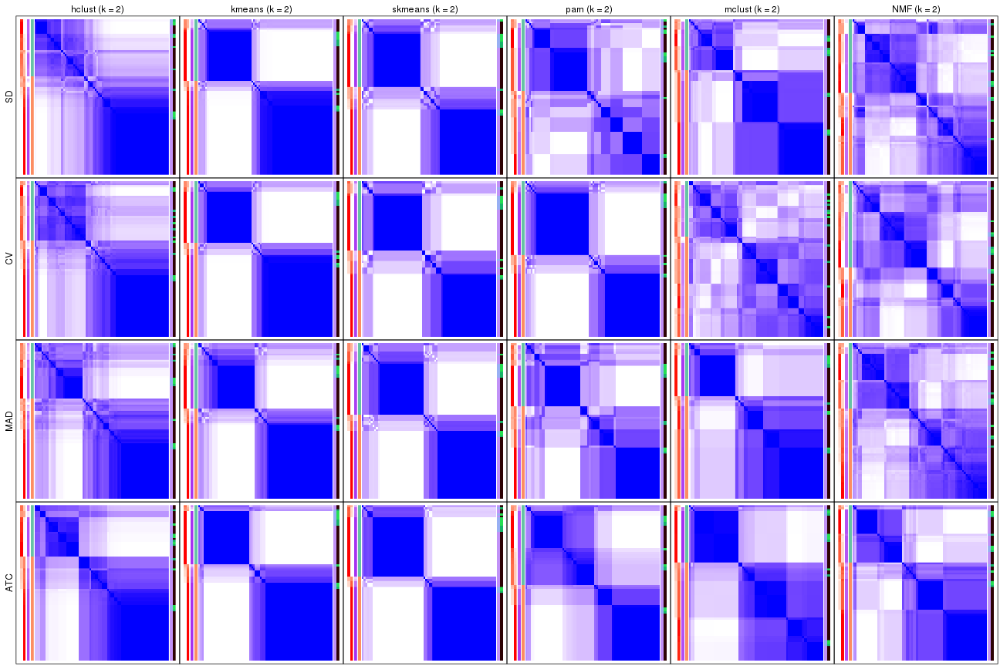</p>

</div>
<div id='tab-collect-consensus-heatmap-2'>
<pre><code class="r">collect_plots(res_list, k = 3, fun = consensus_heatmap, mc.cores = 4)
</code></pre>

<p>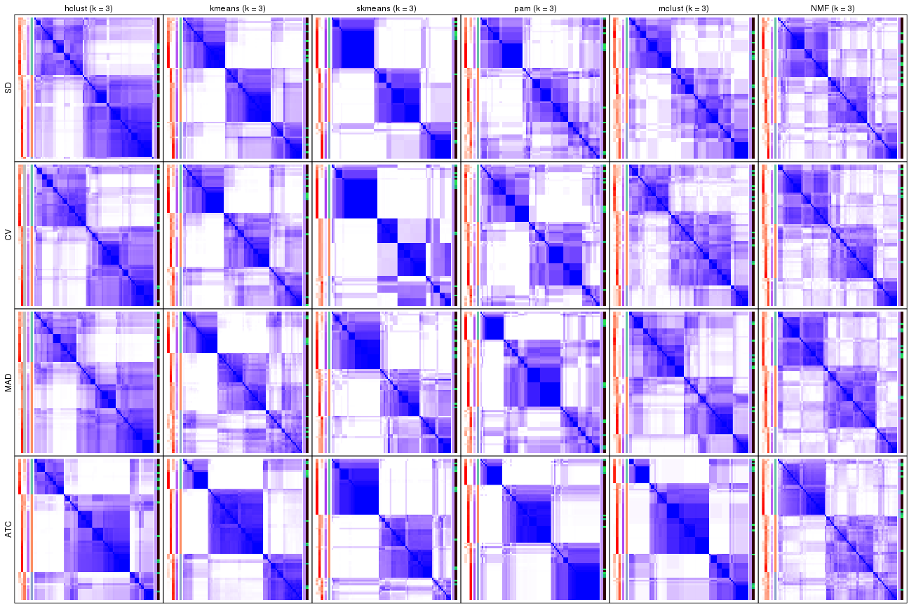</p>

</div>
<div id='tab-collect-consensus-heatmap-3'>
<pre><code class="r">collect_plots(res_list, k = 4, fun = consensus_heatmap, mc.cores = 4)
</code></pre>

<p>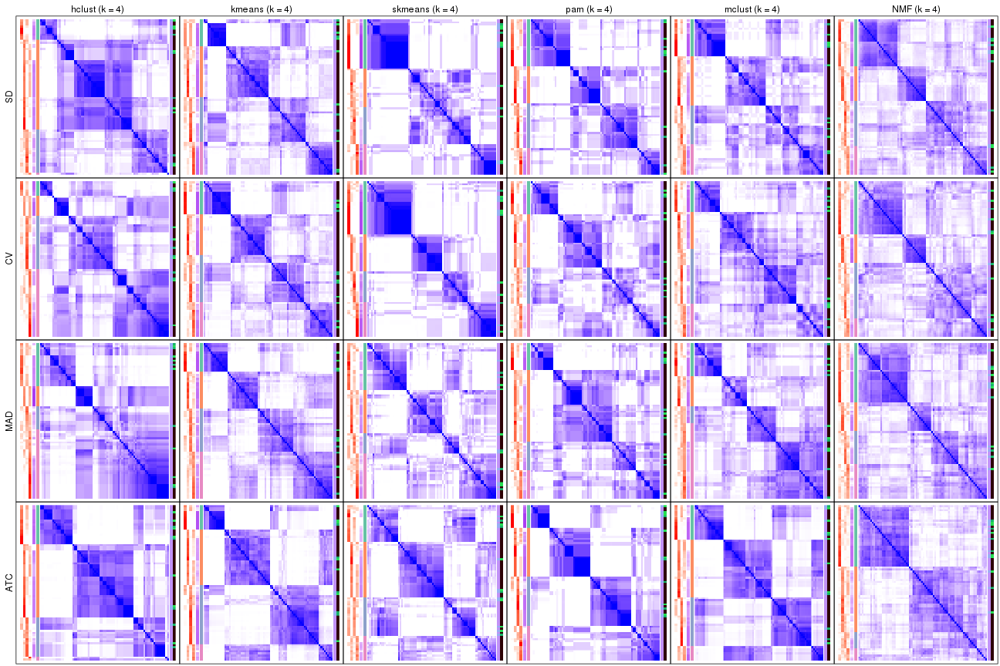</p>

</div>
<div id='tab-collect-consensus-heatmap-4'>
<pre><code class="r">collect_plots(res_list, k = 5, fun = consensus_heatmap, mc.cores = 4)
</code></pre>

<p>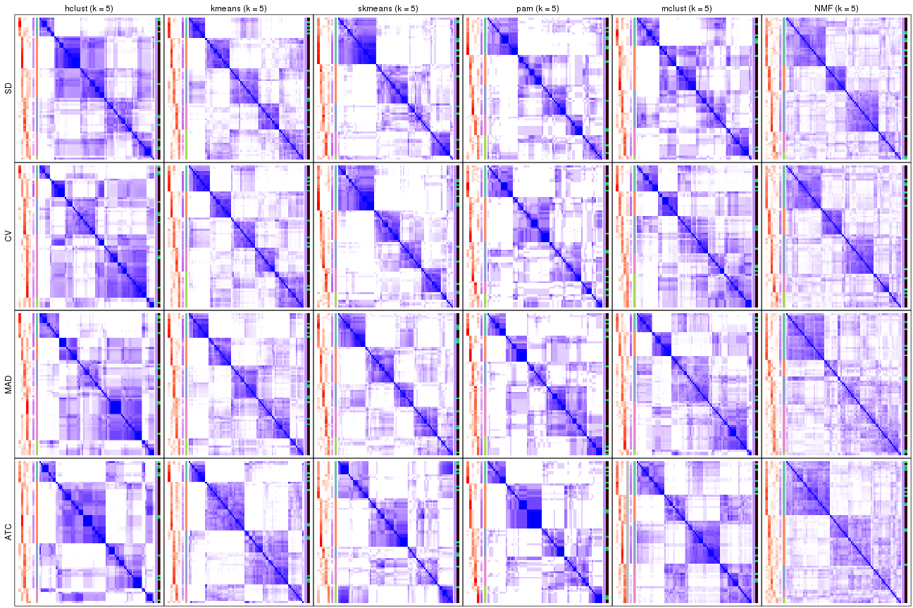</p>

</div>
<div id='tab-collect-consensus-heatmap-5'>
<pre><code class="r">collect_plots(res_list, k = 6, fun = consensus_heatmap, mc.cores = 4)
</code></pre>

<p>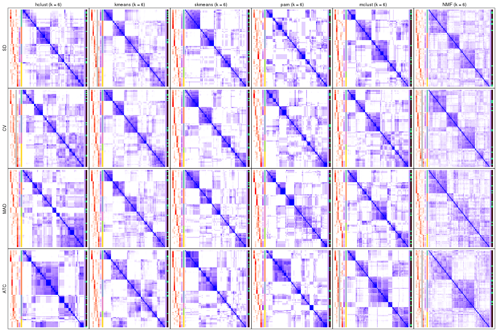</p>

</div>
</div>


### Membership heatmap

Membership heatmaps for all methods. ([What is a membership heatmap?](http://bioconductor.org/packages/devel/bioc/vignettes/cola/inst/doc/cola.html#toc_12))


<script>
$( function() {
	$( '#tabs-collect-membership-heatmap' ).tabs();
} );
</script>
<div id='tabs-collect-membership-heatmap'>
<ul>
<li><a href='#tab-collect-membership-heatmap-1'>k = 2</a></li>
<li><a href='#tab-collect-membership-heatmap-2'>k = 3</a></li>
<li><a href='#tab-collect-membership-heatmap-3'>k = 4</a></li>
<li><a href='#tab-collect-membership-heatmap-4'>k = 5</a></li>
<li><a href='#tab-collect-membership-heatmap-5'>k = 6</a></li>
</ul>
<div id='tab-collect-membership-heatmap-1'>
<pre><code class="r">collect_plots(res_list, k = 2, fun = membership_heatmap, mc.cores = 4)
</code></pre>

<p>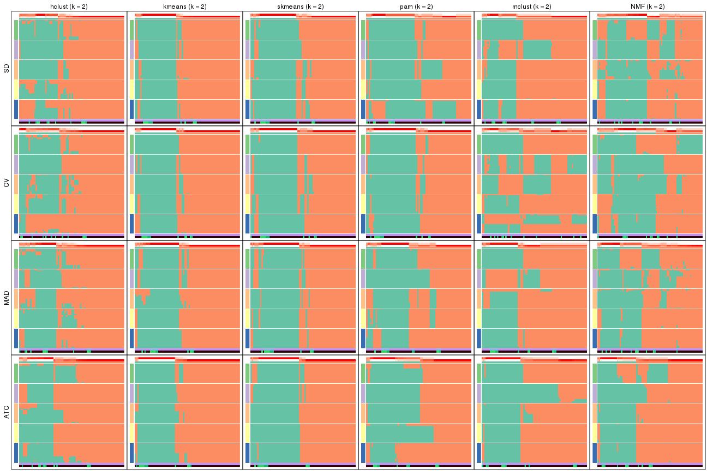</p>

</div>
<div id='tab-collect-membership-heatmap-2'>
<pre><code class="r">collect_plots(res_list, k = 3, fun = membership_heatmap, mc.cores = 4)
</code></pre>

<p>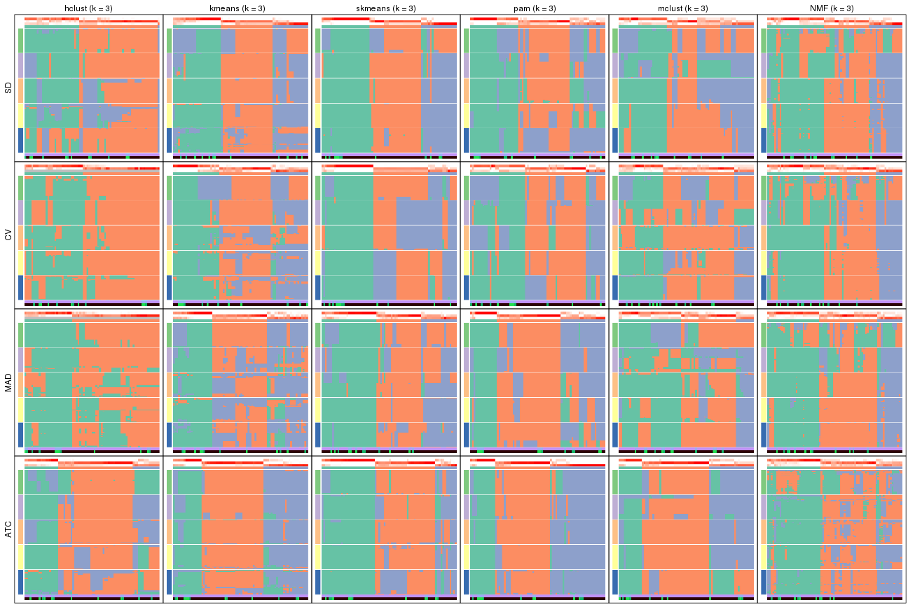</p>

</div>
<div id='tab-collect-membership-heatmap-3'>
<pre><code class="r">collect_plots(res_list, k = 4, fun = membership_heatmap, mc.cores = 4)
</code></pre>

<p>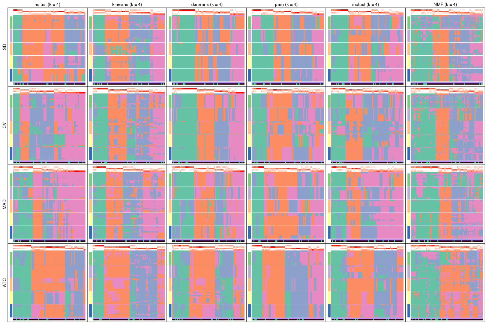</p>

</div>
<div id='tab-collect-membership-heatmap-4'>
<pre><code class="r">collect_plots(res_list, k = 5, fun = membership_heatmap, mc.cores = 4)
</code></pre>

<p>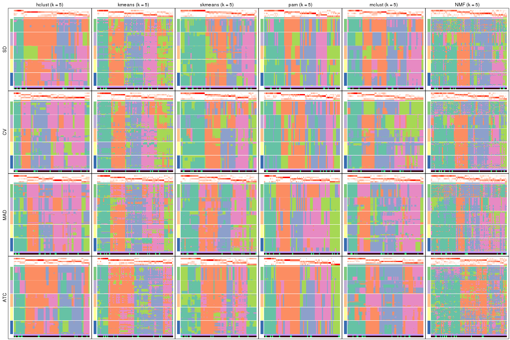</p>

</div>
<div id='tab-collect-membership-heatmap-5'>
<pre><code class="r">collect_plots(res_list, k = 6, fun = membership_heatmap, mc.cores = 4)
</code></pre>

<p>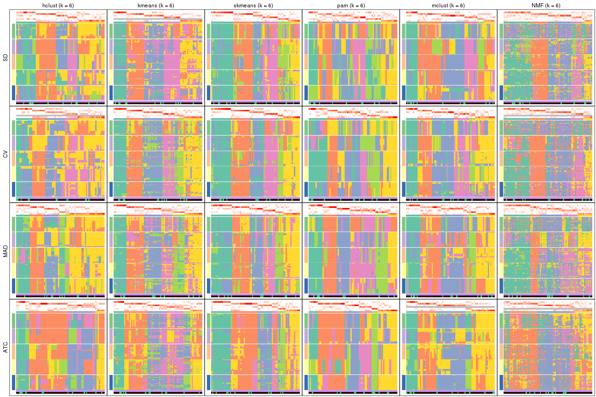</p>

</div>
</div>


### Signature heatmap

Signature heatmaps for all methods. ([What is a signature heatmap?](http://bioconductor.org/packages/devel/bioc/vignettes/cola/inst/doc/cola.html#toc_22))


Note in following heatmaps, rows are scaled.


<script>
$( function() {
	$( '#tabs-collect-get-signatures' ).tabs();
} );
</script>
<div id='tabs-collect-get-signatures'>
<ul>
<li><a href='#tab-collect-get-signatures-1'>k = 2</a></li>
<li><a href='#tab-collect-get-signatures-2'>k = 3</a></li>
<li><a href='#tab-collect-get-signatures-3'>k = 4</a></li>
<li><a href='#tab-collect-get-signatures-4'>k = 5</a></li>
<li><a href='#tab-collect-get-signatures-5'>k = 6</a></li>
</ul>
<div id='tab-collect-get-signatures-1'>
<pre><code class="r">collect_plots(res_list, k = 2, fun = get_signatures, mc.cores = 4)
</code></pre>

<p>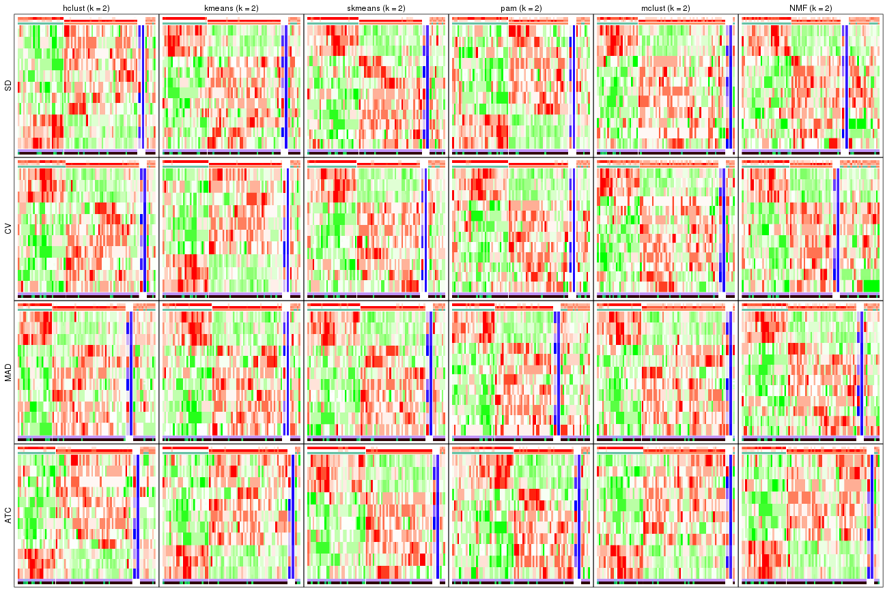</p>

</div>
<div id='tab-collect-get-signatures-2'>
<pre><code class="r">collect_plots(res_list, k = 3, fun = get_signatures, mc.cores = 4)
</code></pre>

<p>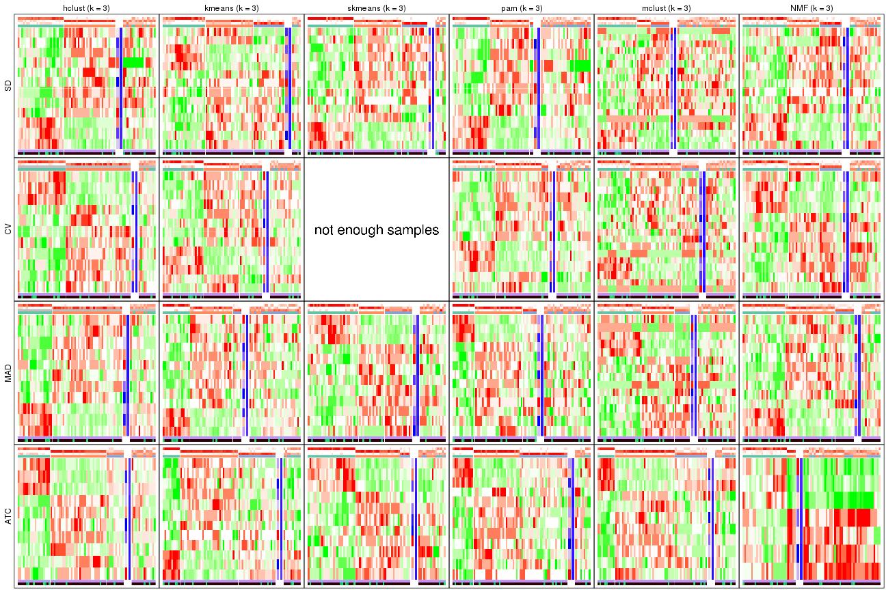</p>

</div>
<div id='tab-collect-get-signatures-3'>
<pre><code class="r">collect_plots(res_list, k = 4, fun = get_signatures, mc.cores = 4)
</code></pre>

<p>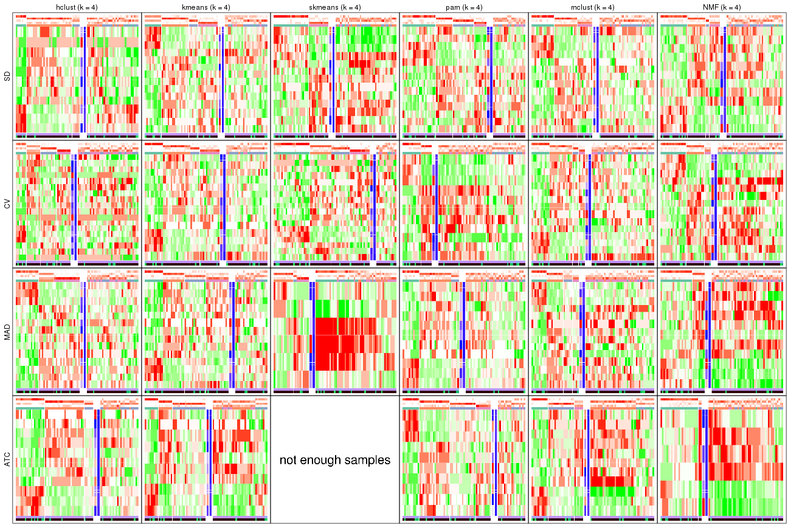</p>

</div>
<div id='tab-collect-get-signatures-4'>
<pre><code class="r">collect_plots(res_list, k = 5, fun = get_signatures, mc.cores = 4)
</code></pre>

<p>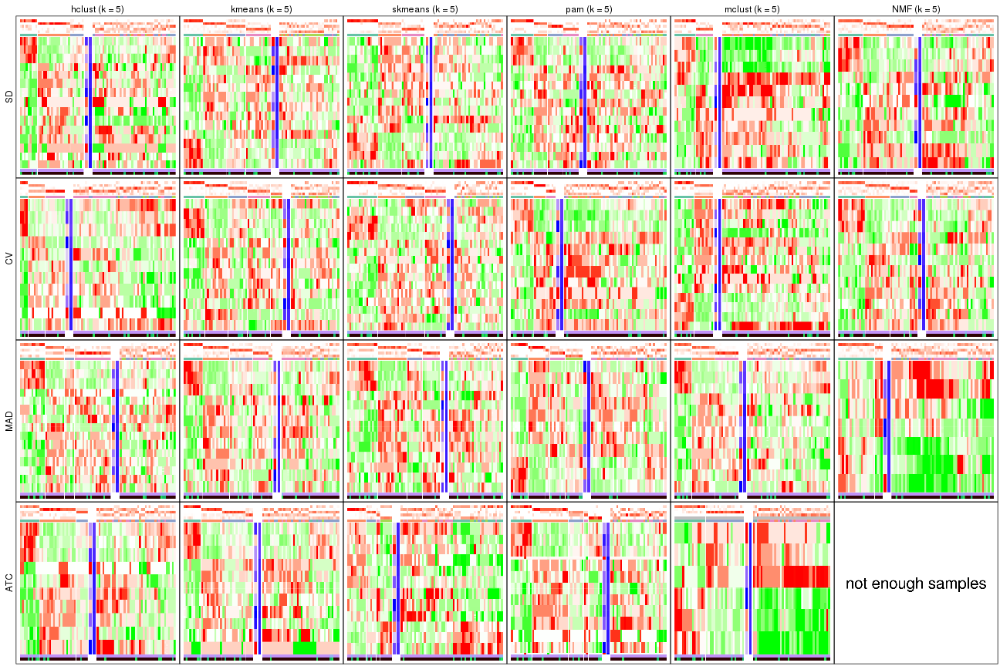</p>

</div>
<div id='tab-collect-get-signatures-5'>
<pre><code class="r">collect_plots(res_list, k = 6, fun = get_signatures, mc.cores = 4)
</code></pre>

<p>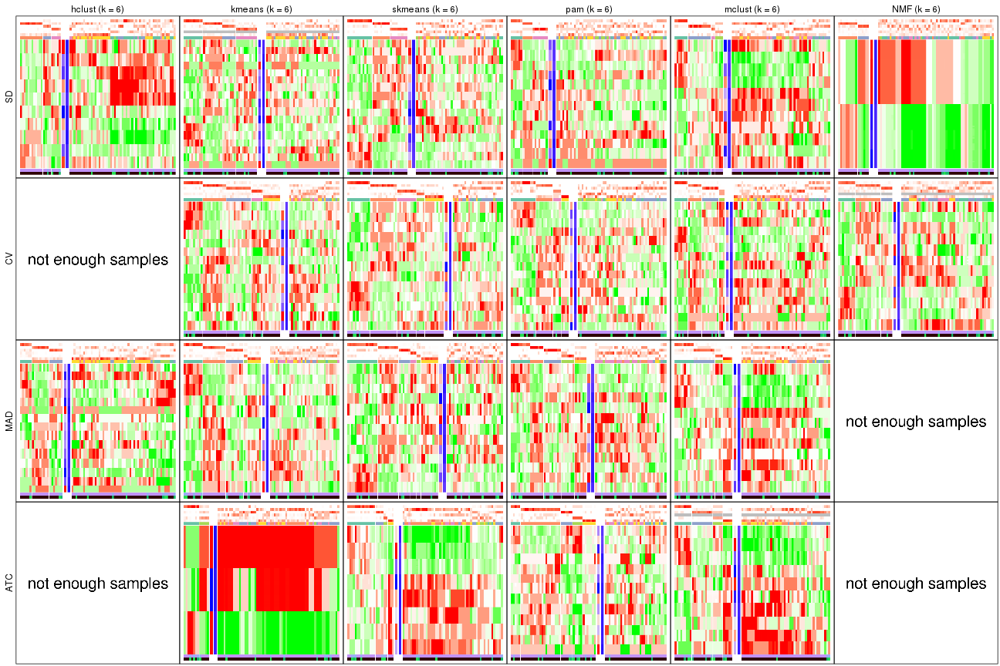</p>

</div>
</div>


### Statistics table

The statistics used for measuring the stability of consensus partitioning.
([How are they
defined?](http://bioconductor.org/packages/devel/bioc/vignettes/cola/inst/doc/cola.html#toc_13))


<script>
$( function() {
	$( '#tabs-get-stats-from-consensus-partition-list' ).tabs();
} );
</script>
<div id='tabs-get-stats-from-consensus-partition-list'>
<ul>
<li><a href='#tab-get-stats-from-consensus-partition-list-1'>k = 2</a></li>
<li><a href='#tab-get-stats-from-consensus-partition-list-2'>k = 3</a></li>
<li><a href='#tab-get-stats-from-consensus-partition-list-3'>k = 4</a></li>
<li><a href='#tab-get-stats-from-consensus-partition-list-4'>k = 5</a></li>
<li><a href='#tab-get-stats-from-consensus-partition-list-5'>k = 6</a></li>
</ul>
<div id='tab-get-stats-from-consensus-partition-list-1'>
<pre><code class="r">get_stats(res_list, k = 2)
</code></pre>

<pre><code>#&gt;             k 1-PAC mean_silhouette concordance area_increased  Rand Jaccard
#&gt; SD:NMF      2 0.269           0.559       0.791          0.486 0.495   0.495
#&gt; CV:NMF      2 0.248           0.496       0.790          0.477 0.499   0.499
#&gt; MAD:NMF     2 0.266           0.675       0.833          0.482 0.506   0.506
#&gt; ATC:NMF     2 0.411           0.792       0.888          0.476 0.528   0.528
#&gt; SD:skmeans  2 0.673           0.825       0.931          0.503 0.502   0.502
#&gt; CV:skmeans  2 0.656           0.816       0.928          0.503 0.499   0.499
#&gt; MAD:skmeans 2 0.673           0.843       0.936          0.502 0.496   0.496
#&gt; ATC:skmeans 2 0.817           0.912       0.963          0.504 0.496   0.496
#&gt; SD:mclust   2 0.403           0.796       0.870          0.449 0.553   0.553
#&gt; CV:mclust   2 0.184           0.589       0.709          0.469 0.536   0.536
#&gt; MAD:mclust  2 0.405           0.848       0.866          0.426 0.544   0.544
#&gt; ATC:mclust  2 0.499           0.857       0.896          0.453 0.528   0.528
#&gt; SD:kmeans   2 0.840           0.883       0.954          0.483 0.516   0.516
#&gt; CV:kmeans   2 0.792           0.884       0.955          0.485 0.516   0.516
#&gt; MAD:kmeans  2 0.719           0.844       0.936          0.488 0.506   0.506
#&gt; ATC:kmeans  2 0.790           0.901       0.960          0.481 0.522   0.522
#&gt; SD:pam      2 0.283           0.664       0.825          0.489 0.496   0.496
#&gt; CV:pam      2 0.742           0.851       0.941          0.506 0.495   0.495
#&gt; MAD:pam     2 0.410           0.684       0.874          0.484 0.511   0.511
#&gt; ATC:pam     2 0.449           0.816       0.897          0.468 0.494   0.494
#&gt; SD:hclust   2 0.441           0.779       0.889          0.428 0.528   0.528
#&gt; CV:hclust   2 0.345           0.797       0.876          0.417 0.522   0.522
#&gt; MAD:hclust  2 0.462           0.736       0.886          0.448 0.536   0.536
#&gt; ATC:hclust  2 0.572           0.783       0.903          0.437 0.553   0.553
</code></pre>

</div>
<div id='tab-get-stats-from-consensus-partition-list-2'>
<pre><code class="r">get_stats(res_list, k = 3)
</code></pre>

<pre><code>#&gt;             k 1-PAC mean_silhouette concordance area_increased  Rand Jaccard
#&gt; SD:NMF      3 0.278           0.547       0.757          0.312 0.720   0.497
#&gt; CV:NMF      3 0.306           0.577       0.780          0.325 0.640   0.406
#&gt; MAD:NMF     3 0.295           0.607       0.780          0.277 0.727   0.521
#&gt; ATC:NMF     3 0.297           0.455       0.730          0.336 0.785   0.608
#&gt; SD:skmeans  3 0.650           0.802       0.880          0.313 0.740   0.524
#&gt; CV:skmeans  3 0.638           0.424       0.734          0.309 0.810   0.634
#&gt; MAD:skmeans 3 0.530           0.619       0.792          0.310 0.781   0.583
#&gt; ATC:skmeans 3 0.626           0.696       0.855          0.271 0.852   0.708
#&gt; SD:mclust   3 0.333           0.496       0.737          0.410 0.712   0.511
#&gt; CV:mclust   3 0.279           0.582       0.731          0.307 0.809   0.661
#&gt; MAD:mclust  3 0.324           0.499       0.714          0.448 0.680   0.488
#&gt; ATC:mclust  3 0.585           0.720       0.837          0.335 0.746   0.562
#&gt; SD:kmeans   3 0.515           0.699       0.815          0.351 0.781   0.589
#&gt; CV:kmeans   3 0.454           0.564       0.745          0.351 0.767   0.568
#&gt; MAD:kmeans  3 0.423           0.492       0.713          0.336 0.736   0.521
#&gt; ATC:kmeans  3 0.665           0.770       0.879          0.329 0.725   0.523
#&gt; SD:pam      3 0.389           0.512       0.757          0.305 0.768   0.563
#&gt; CV:pam      3 0.457           0.533       0.763          0.290 0.824   0.665
#&gt; MAD:pam     3 0.480           0.570       0.812          0.302 0.752   0.557
#&gt; ATC:pam     3 0.652           0.782       0.907          0.368 0.759   0.559
#&gt; SD:hclust   3 0.353           0.553       0.774          0.285 0.908   0.835
#&gt; CV:hclust   3 0.354           0.655       0.768          0.410 0.899   0.820
#&gt; MAD:hclust  3 0.338           0.606       0.749          0.288 1.000   1.000
#&gt; ATC:hclust  3 0.418           0.608       0.736          0.391 0.808   0.665
</code></pre>

</div>
<div id='tab-get-stats-from-consensus-partition-list-3'>
<pre><code class="r">get_stats(res_list, k = 4)
</code></pre>

<pre><code>#&gt;             k 1-PAC mean_silhouette concordance area_increased  Rand Jaccard
#&gt; SD:NMF      4 0.263           0.469       0.669         0.1190 0.760   0.421
#&gt; CV:NMF      4 0.250           0.382       0.655         0.1228 0.767   0.463
#&gt; MAD:NMF     4 0.267           0.389       0.650         0.1304 0.854   0.621
#&gt; ATC:NMF     4 0.316           0.398       0.629         0.0979 0.831   0.609
#&gt; SD:skmeans  4 0.576           0.453       0.747         0.1332 0.821   0.528
#&gt; CV:skmeans  4 0.626           0.672       0.825         0.1320 0.800   0.500
#&gt; MAD:skmeans 4 0.457           0.375       0.697         0.1360 0.850   0.597
#&gt; ATC:skmeans 4 0.511           0.259       0.638         0.1473 0.791   0.504
#&gt; SD:mclust   4 0.428           0.444       0.716         0.1298 0.754   0.406
#&gt; CV:mclust   4 0.312           0.425       0.665         0.1444 0.684   0.349
#&gt; MAD:mclust  4 0.355           0.395       0.674         0.1427 0.699   0.405
#&gt; ATC:mclust  4 0.486           0.432       0.741         0.1476 0.825   0.582
#&gt; SD:kmeans   4 0.482           0.531       0.703         0.1312 0.820   0.532
#&gt; CV:kmeans   4 0.470           0.514       0.738         0.1290 0.785   0.455
#&gt; MAD:kmeans  4 0.463           0.554       0.712         0.1278 0.742   0.385
#&gt; ATC:kmeans  4 0.558           0.499       0.742         0.1393 0.872   0.674
#&gt; SD:pam      4 0.515           0.554       0.769         0.1583 0.804   0.496
#&gt; CV:pam      4 0.437           0.320       0.653         0.1243 0.749   0.431
#&gt; MAD:pam     4 0.448           0.440       0.691         0.1347 0.822   0.576
#&gt; ATC:pam     4 0.557           0.587       0.797         0.1522 0.809   0.529
#&gt; SD:hclust   4 0.379           0.446       0.702         0.1917 0.926   0.851
#&gt; CV:hclust   4 0.336           0.414       0.714         0.1409 0.820   0.642
#&gt; MAD:hclust  4 0.370           0.431       0.689         0.1622 0.726   0.508
#&gt; ATC:hclust  4 0.504           0.514       0.754         0.1208 0.900   0.763
</code></pre>

</div>
<div id='tab-get-stats-from-consensus-partition-list-4'>
<pre><code class="r">get_stats(res_list, k = 5)
</code></pre>

<pre><code>#&gt;             k 1-PAC mean_silhouette concordance area_increased  Rand Jaccard
#&gt; SD:NMF      5 0.335           0.450       0.653         0.0599 0.921   0.723
#&gt; CV:NMF      5 0.356           0.446       0.656         0.0698 0.848   0.534
#&gt; MAD:NMF     5 0.294           0.310       0.597         0.0734 0.762   0.375
#&gt; ATC:NMF     5 0.322           0.306       0.540         0.0650 0.888   0.702
#&gt; SD:skmeans  5 0.575           0.433       0.709         0.0554 0.873   0.588
#&gt; CV:skmeans  5 0.581           0.526       0.711         0.0609 0.936   0.759
#&gt; MAD:skmeans 5 0.529           0.504       0.703         0.0609 0.842   0.487
#&gt; ATC:skmeans 5 0.537           0.284       0.620         0.0630 0.812   0.449
#&gt; SD:mclust   5 0.459           0.296       0.677         0.0515 0.901   0.661
#&gt; CV:mclust   5 0.423           0.364       0.630         0.0577 0.827   0.448
#&gt; MAD:mclust  5 0.399           0.419       0.645         0.0588 0.775   0.440
#&gt; ATC:mclust  5 0.480           0.414       0.670         0.0630 0.881   0.634
#&gt; SD:kmeans   5 0.531           0.532       0.708         0.0680 0.884   0.592
#&gt; CV:kmeans   5 0.539           0.543       0.699         0.0720 0.848   0.486
#&gt; MAD:kmeans  5 0.499           0.510       0.664         0.0731 0.908   0.662
#&gt; ATC:kmeans  5 0.547           0.383       0.668         0.0688 0.936   0.803
#&gt; SD:pam      5 0.537           0.431       0.708         0.0669 0.864   0.534
#&gt; CV:pam      5 0.503           0.337       0.685         0.0635 0.789   0.395
#&gt; MAD:pam     5 0.531           0.491       0.735         0.0825 0.809   0.464
#&gt; ATC:pam     5 0.594           0.497       0.758         0.0632 0.906   0.668
#&gt; SD:hclust   5 0.397           0.391       0.677         0.0748 0.823   0.598
#&gt; CV:hclust   5 0.384           0.361       0.683         0.0552 0.945   0.834
#&gt; MAD:hclust  5 0.399           0.448       0.668         0.0811 0.862   0.594
#&gt; ATC:hclust  5 0.469           0.323       0.664         0.0683 0.859   0.644
</code></pre>

</div>
<div id='tab-get-stats-from-consensus-partition-list-5'>
<pre><code class="r">get_stats(res_list, k = 6)
</code></pre>

<pre><code>#&gt;             k 1-PAC mean_silhouette concordance area_increased  Rand Jaccard
#&gt; SD:NMF      6 0.361          0.3164       0.575         0.0459 0.927   0.723
#&gt; CV:NMF      6 0.356          0.3965       0.594         0.0391 0.941   0.765
#&gt; MAD:NMF     6 0.329          0.2311       0.522         0.0436 0.872   0.570
#&gt; ATC:NMF     6 0.365          0.2861       0.501         0.0541 0.953   0.846
#&gt; SD:skmeans  6 0.617          0.4276       0.703         0.0461 0.874   0.535
#&gt; CV:skmeans  6 0.644          0.5407       0.743         0.0451 0.909   0.619
#&gt; MAD:skmeans 6 0.599          0.4814       0.702         0.0439 0.891   0.542
#&gt; ATC:skmeans 6 0.604          0.3627       0.681         0.0417 0.867   0.524
#&gt; SD:mclust   6 0.537          0.3083       0.663         0.0547 0.819   0.401
#&gt; CV:mclust   6 0.549          0.3388       0.662         0.0784 0.846   0.419
#&gt; MAD:mclust  6 0.549          0.3199       0.639         0.0758 0.806   0.392
#&gt; ATC:mclust  6 0.555          0.4250       0.671         0.0683 0.825   0.467
#&gt; SD:kmeans   6 0.576          0.4990       0.634         0.0438 0.946   0.756
#&gt; CV:kmeans   6 0.597          0.5473       0.692         0.0401 0.934   0.690
#&gt; MAD:kmeans  6 0.568          0.4902       0.655         0.0450 0.934   0.694
#&gt; ATC:kmeans  6 0.578          0.2550       0.560         0.0473 0.806   0.414
#&gt; SD:pam      6 0.526          0.2051       0.609         0.0358 0.796   0.280
#&gt; CV:pam      6 0.530          0.3953       0.667         0.0379 0.846   0.452
#&gt; MAD:pam     6 0.577          0.4803       0.715         0.0498 0.894   0.579
#&gt; ATC:pam     6 0.595          0.4589       0.724         0.0327 0.846   0.448
#&gt; SD:hclust   6 0.427          0.2537       0.598         0.1166 0.779   0.381
#&gt; CV:hclust   6 0.462          0.2574       0.563         0.1035 0.794   0.414
#&gt; MAD:hclust  6 0.466          0.2894       0.645         0.0576 0.898   0.642
#&gt; ATC:hclust  6 0.491          0.0992       0.631         0.0407 0.899   0.709
</code></pre>

</div>
</div>

Following heatmap plots the partition for each combination of methods and the
lightness correspond to the silhouette scores for samples in each method. On
top the consensus subgroup is inferred from all methods by taking the mean
silhouette scores as weight.


<script>
$( function() {
	$( '#tabs-collect-stats-from-consensus-partition-list' ).tabs();
} );
</script>
<div id='tabs-collect-stats-from-consensus-partition-list'>
<ul>
<li><a href='#tab-collect-stats-from-consensus-partition-list-1'>k = 2</a></li>
<li><a href='#tab-collect-stats-from-consensus-partition-list-2'>k = 3</a></li>
<li><a href='#tab-collect-stats-from-consensus-partition-list-3'>k = 4</a></li>
<li><a href='#tab-collect-stats-from-consensus-partition-list-4'>k = 5</a></li>
<li><a href='#tab-collect-stats-from-consensus-partition-list-5'>k = 6</a></li>
</ul>
<div id='tab-collect-stats-from-consensus-partition-list-1'>
<pre><code class="r">collect_stats(res_list, k = 2)
</code></pre>

<p>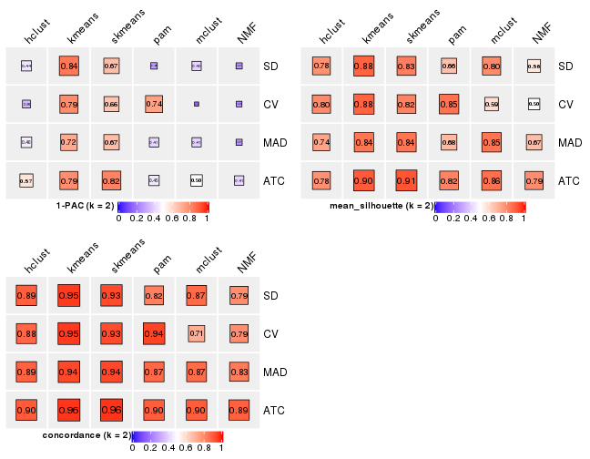</p>

</div>
<div id='tab-collect-stats-from-consensus-partition-list-2'>
<pre><code class="r">collect_stats(res_list, k = 3)
</code></pre>

<p>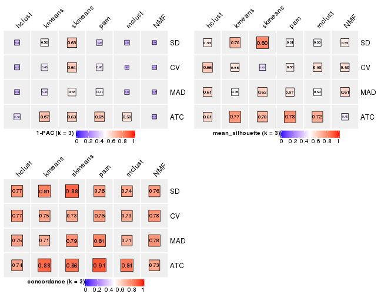</p>

</div>
<div id='tab-collect-stats-from-consensus-partition-list-3'>
<pre><code class="r">collect_stats(res_list, k = 4)
</code></pre>

<p>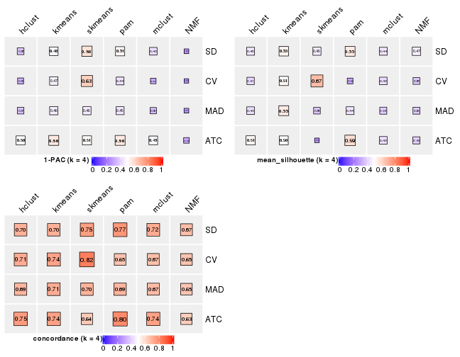</p>

</div>
<div id='tab-collect-stats-from-consensus-partition-list-4'>
<pre><code class="r">collect_stats(res_list, k = 5)
</code></pre>

<p>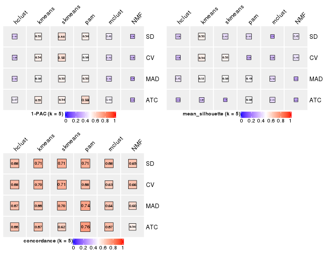</p>

</div>
<div id='tab-collect-stats-from-consensus-partition-list-5'>
<pre><code class="r">collect_stats(res_list, k = 6)
</code></pre>

<p>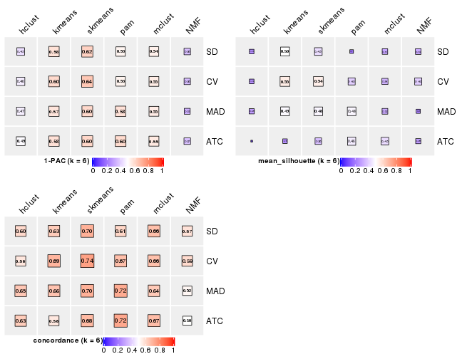</p>

</div>
</div>

### Partition from all methods


Collect partitions from all methods:


<script>
$( function() {
	$( '#tabs-collect-classes-from-consensus-partition-list' ).tabs();
} );
</script>
<div id='tabs-collect-classes-from-consensus-partition-list'>
<ul>
<li><a href='#tab-collect-classes-from-consensus-partition-list-1'>k = 2</a></li>
<li><a href='#tab-collect-classes-from-consensus-partition-list-2'>k = 3</a></li>
<li><a href='#tab-collect-classes-from-consensus-partition-list-3'>k = 4</a></li>
<li><a href='#tab-collect-classes-from-consensus-partition-list-4'>k = 5</a></li>
<li><a href='#tab-collect-classes-from-consensus-partition-list-5'>k = 6</a></li>
</ul>
<div id='tab-collect-classes-from-consensus-partition-list-1'>
<pre><code class="r">collect_classes(res_list, k = 2)
</code></pre>

<p>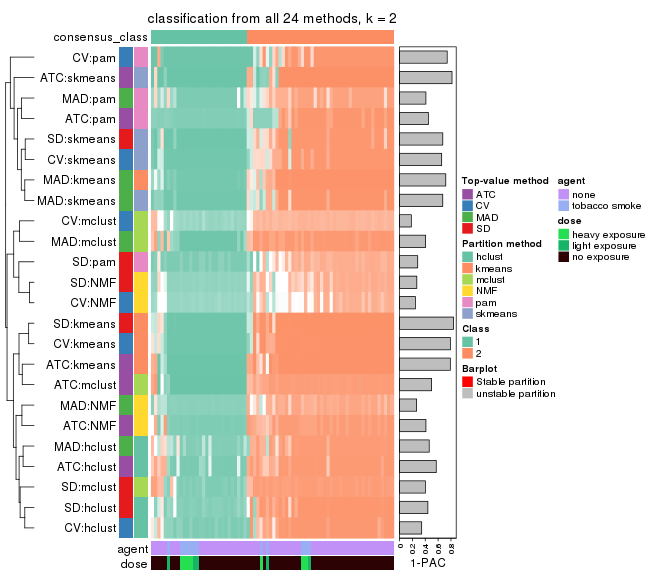</p>

</div>
<div id='tab-collect-classes-from-consensus-partition-list-2'>
<pre><code class="r">collect_classes(res_list, k = 3)
</code></pre>

<p>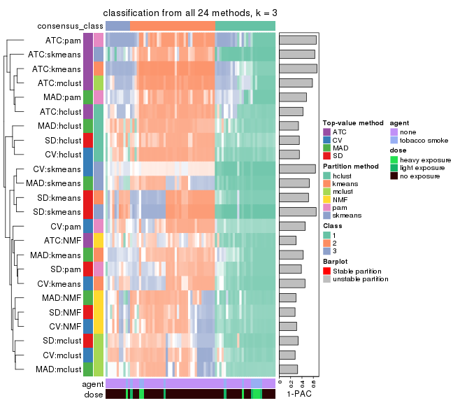</p>

</div>
<div id='tab-collect-classes-from-consensus-partition-list-3'>
<pre><code class="r">collect_classes(res_list, k = 4)
</code></pre>

<p>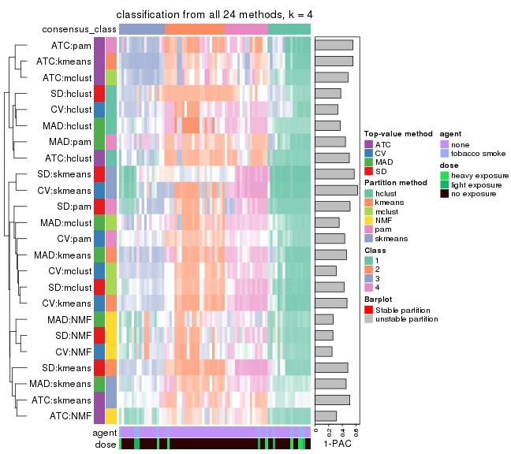</p>

</div>
<div id='tab-collect-classes-from-consensus-partition-list-4'>
<pre><code class="r">collect_classes(res_list, k = 5)
</code></pre>

<p>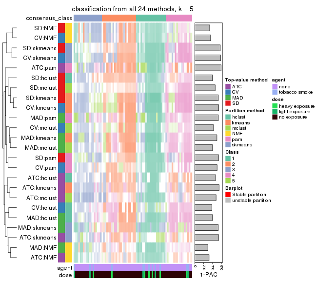</p>

</div>
<div id='tab-collect-classes-from-consensus-partition-list-5'>
<pre><code class="r">collect_classes(res_list, k = 6)
</code></pre>

<p>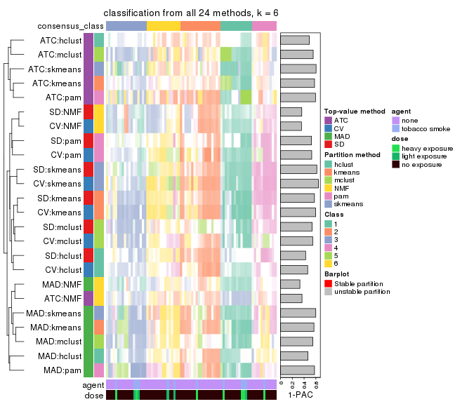</p>

</div>
</div>


### Top rows overlap


Overlap of top rows from different top-row methods:


<script>
$( function() {
	$( '#tabs-top-rows-overlap-by-euler' ).tabs();
} );
</script>
<div id='tabs-top-rows-overlap-by-euler'>
<ul>
<li><a href='#tab-top-rows-overlap-by-euler-1'>top_n = 1000</a></li>
<li><a href='#tab-top-rows-overlap-by-euler-2'>top_n = 2000</a></li>
<li><a href='#tab-top-rows-overlap-by-euler-3'>top_n = 3000</a></li>
<li><a href='#tab-top-rows-overlap-by-euler-4'>top_n = 4000</a></li>
<li><a href='#tab-top-rows-overlap-by-euler-5'>top_n = 5000</a></li>
</ul>
<div id='tab-top-rows-overlap-by-euler-1'>
<pre><code class="r">top_rows_overlap(res_list, top_n = 1000, method = &quot;euler&quot;)
</code></pre>

<p>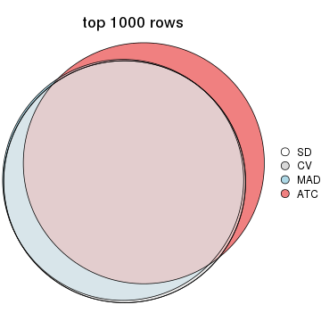</p>

</div>
<div id='tab-top-rows-overlap-by-euler-2'>
<pre><code class="r">top_rows_overlap(res_list, top_n = 2000, method = &quot;euler&quot;)
</code></pre>

<p>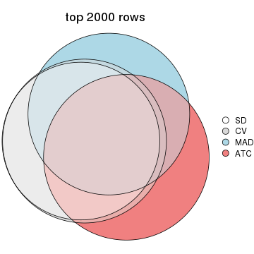</p>

</div>
<div id='tab-top-rows-overlap-by-euler-3'>
<pre><code class="r">top_rows_overlap(res_list, top_n = 3000, method = &quot;euler&quot;)
</code></pre>

<p>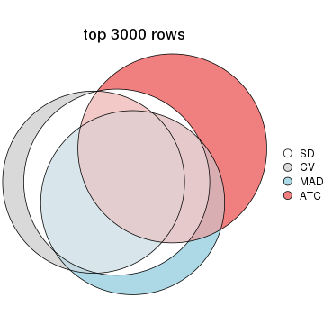</p>

</div>
<div id='tab-top-rows-overlap-by-euler-4'>
<pre><code class="r">top_rows_overlap(res_list, top_n = 4000, method = &quot;euler&quot;)
</code></pre>

<p>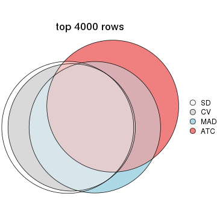</p>

</div>
<div id='tab-top-rows-overlap-by-euler-5'>
<pre><code class="r">top_rows_overlap(res_list, top_n = 5000, method = &quot;euler&quot;)
</code></pre>

<p>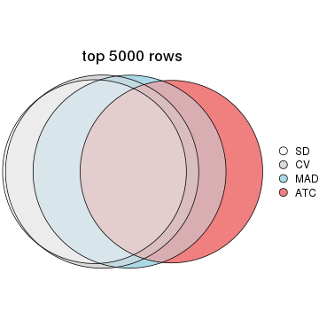</p>

</div>
</div>

Also visualize the correspondance of rankings between different top-row methods:


<script>
$( function() {
	$( '#tabs-top-rows-overlap-by-correspondance' ).tabs();
} );
</script>
<div id='tabs-top-rows-overlap-by-correspondance'>
<ul>
<li><a href='#tab-top-rows-overlap-by-correspondance-1'>top_n = 1000</a></li>
<li><a href='#tab-top-rows-overlap-by-correspondance-2'>top_n = 2000</a></li>
<li><a href='#tab-top-rows-overlap-by-correspondance-3'>top_n = 3000</a></li>
<li><a href='#tab-top-rows-overlap-by-correspondance-4'>top_n = 4000</a></li>
<li><a href='#tab-top-rows-overlap-by-correspondance-5'>top_n = 5000</a></li>
</ul>
<div id='tab-top-rows-overlap-by-correspondance-1'>
<pre><code class="r">top_rows_overlap(res_list, top_n = 1000, method = &quot;correspondance&quot;)
</code></pre>

<p>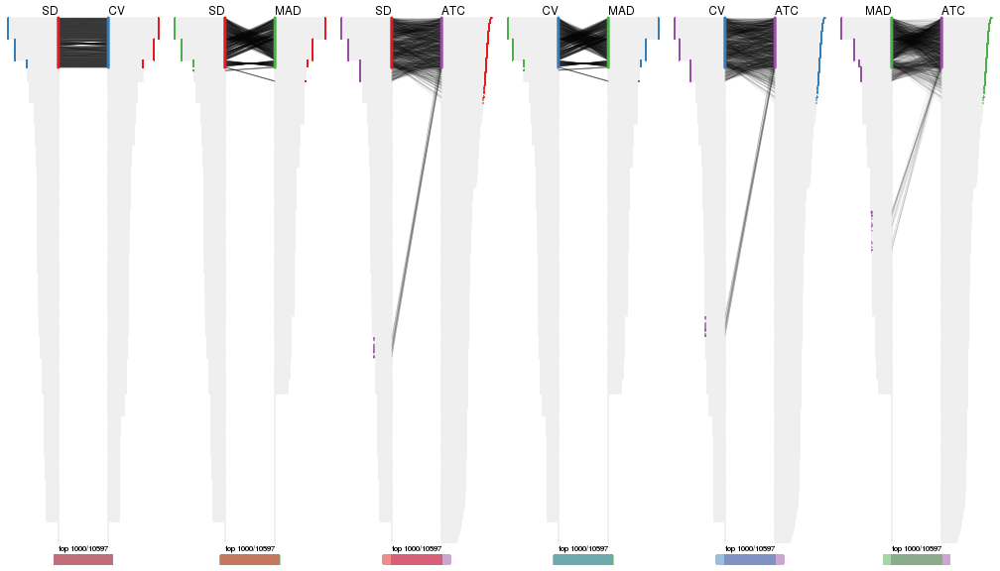</p>

</div>
<div id='tab-top-rows-overlap-by-correspondance-2'>
<pre><code class="r">top_rows_overlap(res_list, top_n = 2000, method = &quot;correspondance&quot;)
</code></pre>

<p>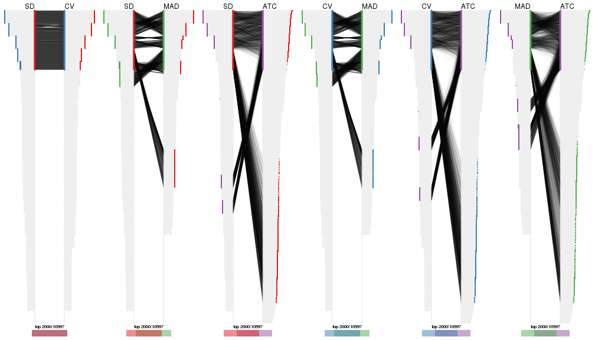</p>

</div>
<div id='tab-top-rows-overlap-by-correspondance-3'>
<pre><code class="r">top_rows_overlap(res_list, top_n = 3000, method = &quot;correspondance&quot;)
</code></pre>

<p>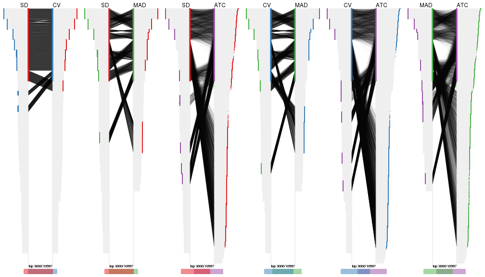</p>

</div>
<div id='tab-top-rows-overlap-by-correspondance-4'>
<pre><code class="r">top_rows_overlap(res_list, top_n = 4000, method = &quot;correspondance&quot;)
</code></pre>

<p>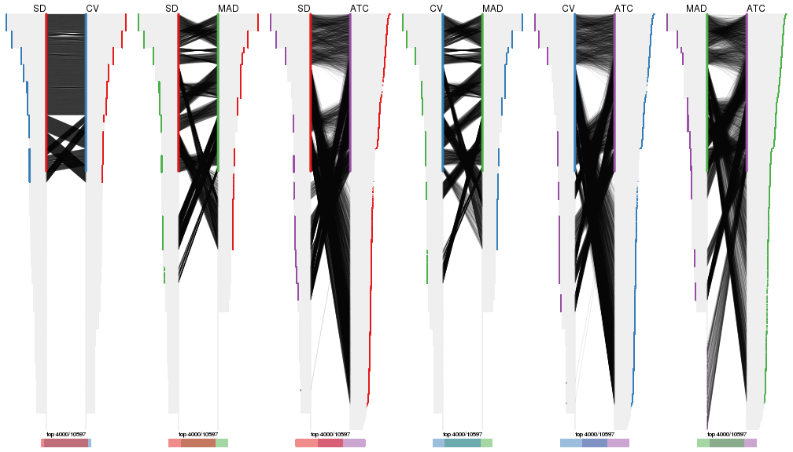</p>

</div>
<div id='tab-top-rows-overlap-by-correspondance-5'>
<pre><code class="r">top_rows_overlap(res_list, top_n = 5000, method = &quot;correspondance&quot;)
</code></pre>

<p>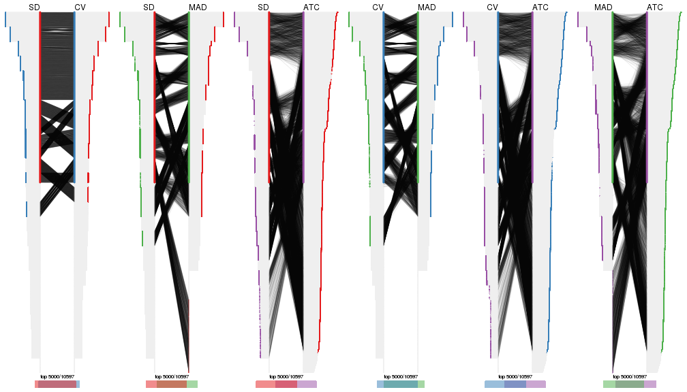</p>

</div>
</div>


Heatmaps of the top rows:


<script>
$( function() {
	$( '#tabs-top-rows-heatmap' ).tabs();
} );
</script>
<div id='tabs-top-rows-heatmap'>
<ul>
<li><a href='#tab-top-rows-heatmap-1'>top_n = 1000</a></li>
<li><a href='#tab-top-rows-heatmap-2'>top_n = 2000</a></li>
<li><a href='#tab-top-rows-heatmap-3'>top_n = 3000</a></li>
<li><a href='#tab-top-rows-heatmap-4'>top_n = 4000</a></li>
<li><a href='#tab-top-rows-heatmap-5'>top_n = 5000</a></li>
</ul>
<div id='tab-top-rows-heatmap-1'>
<pre><code class="r">top_rows_heatmap(res_list, top_n = 1000)
</code></pre>

<p>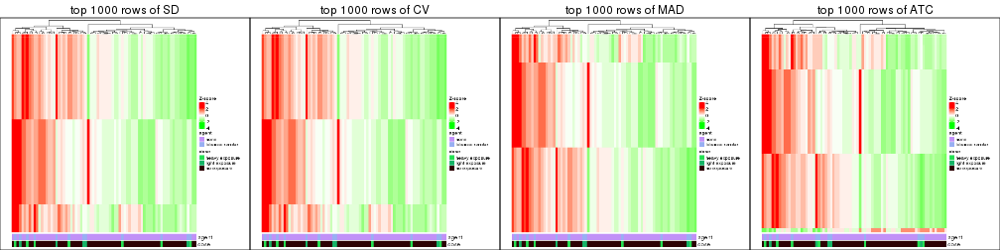</p>

</div>
<div id='tab-top-rows-heatmap-2'>
<pre><code class="r">top_rows_heatmap(res_list, top_n = 2000)
</code></pre>

<p>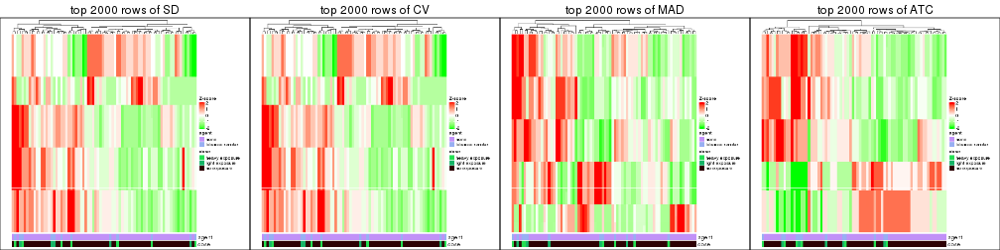</p>

</div>
<div id='tab-top-rows-heatmap-3'>
<pre><code class="r">top_rows_heatmap(res_list, top_n = 3000)
</code></pre>

<p>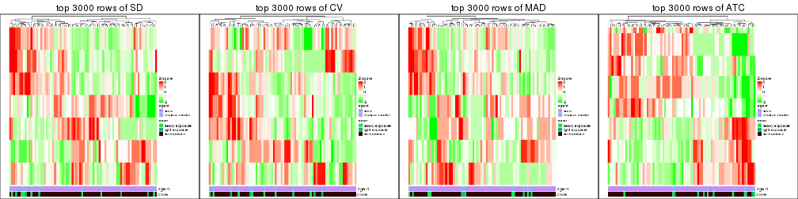</p>

</div>
<div id='tab-top-rows-heatmap-4'>
<pre><code class="r">top_rows_heatmap(res_list, top_n = 4000)
</code></pre>

<p>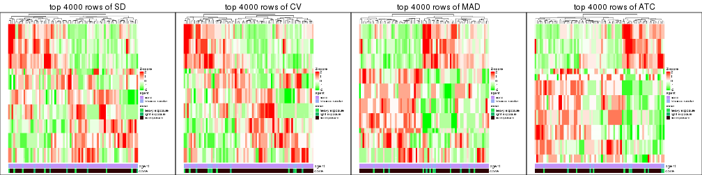</p>

</div>
<div id='tab-top-rows-heatmap-5'>
<pre><code class="r">top_rows_heatmap(res_list, top_n = 5000)
</code></pre>

<p>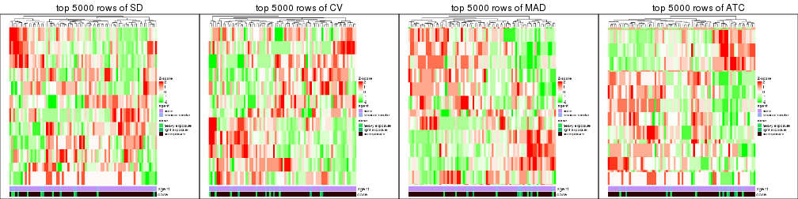</p>

</div>
</div>


### Test to known annotations


Test correlation between subgroups and known annotations. If the known
annotation is numeric, one-way ANOVA test is applied, and if the known
annotation is discrete, chi-squared contingency table test is applied.


<script>
$( function() {
	$( '#tabs-test-to-known-factors-from-consensus-partition-list' ).tabs();
} );
</script>
<div id='tabs-test-to-known-factors-from-consensus-partition-list'>
<ul>
<li><a href='#tab-test-to-known-factors-from-consensus-partition-list-1'>k = 2</a></li>
<li><a href='#tab-test-to-known-factors-from-consensus-partition-list-2'>k = 3</a></li>
<li><a href='#tab-test-to-known-factors-from-consensus-partition-list-3'>k = 4</a></li>
<li><a href='#tab-test-to-known-factors-from-consensus-partition-list-4'>k = 5</a></li>
<li><a href='#tab-test-to-known-factors-from-consensus-partition-list-5'>k = 6</a></li>
</ul>
<div id='tab-test-to-known-factors-from-consensus-partition-list-1'>
<pre><code class="r">test_to_known_factors(res_list, k = 2)
</code></pre>

<pre><code>#&gt;              n agent(p) dose(p) k
#&gt; SD:NMF      58   0.1469  0.1239 2
#&gt; CV:NMF      53   0.0805  0.0887 2
#&gt; MAD:NMF     67   0.1646  0.2198 2
#&gt; ATC:NMF     73   0.0777  0.0912 2
#&gt; SD:skmeans  67   0.1632  0.2131 2
#&gt; CV:skmeans  66   0.1452  0.1904 2
#&gt; MAD:skmeans 69   0.1782  0.2312 2
#&gt; ATC:skmeans 73   0.0653  0.0931 2
#&gt; SD:mclust   75   0.0725  0.1021 2
#&gt; CV:mclust   71   0.1315  0.1832 2
#&gt; MAD:mclust  75   0.2474  0.3156 2
#&gt; ATC:mclust  75   0.1526  0.2119 2
#&gt; SD:kmeans   69   0.1948  0.2660 2
#&gt; CV:kmeans   70   0.2227  0.3016 2
#&gt; MAD:kmeans  70   0.1035  0.1382 2
#&gt; ATC:kmeans  73   0.0482  0.0642 2
#&gt; SD:pam      68   0.1543  0.1949 2
#&gt; CV:pam      68   0.1268  0.1674 2
#&gt; MAD:pam     59   0.2165  0.2771 2
#&gt; ATC:pam     71   0.1260  0.1741 2
#&gt; SD:hclust   70   0.2227  0.3016 2
#&gt; CV:hclust   71   0.1468  0.1977 2
#&gt; MAD:hclust  63   0.0850  0.1071 2
#&gt; ATC:hclust  67   0.0425  0.0491 2
</code></pre>

</div>
<div id='tab-test-to-known-factors-from-consensus-partition-list-2'>
<pre><code class="r">test_to_known_factors(res_list, k = 3)
</code></pre>

<pre><code>#&gt;              n agent(p) dose(p) k
#&gt; SD:NMF      58   0.1084  0.2901 3
#&gt; CV:NMF      58   0.0398  0.1296 3
#&gt; MAD:NMF     65   0.0509  0.1890 3
#&gt; ATC:NMF     31   0.4625  0.4192 3
#&gt; SD:skmeans  70   0.0601  0.2059 3
#&gt; CV:skmeans  26       NA      NA 3
#&gt; MAD:skmeans 61   0.0792  0.2008 3
#&gt; ATC:skmeans 60   0.2131  0.5304 3
#&gt; SD:mclust   42   0.1244  0.3786 3
#&gt; CV:mclust   59   0.1992  0.5206 3
#&gt; MAD:mclust  54   0.2753  0.6304 3
#&gt; ATC:mclust  64   0.2207  0.3917 3
#&gt; SD:kmeans   71   0.0487  0.1436 3
#&gt; CV:kmeans   58   0.0264  0.1206 3
#&gt; MAD:kmeans  46   0.0289  0.1234 3
#&gt; ATC:kmeans  66   0.0523  0.1022 3
#&gt; SD:pam      47   0.0810  0.2610 3
#&gt; CV:pam      56   0.0921  0.2135 3
#&gt; MAD:pam     49   0.2642  0.4636 3
#&gt; ATC:pam     67   0.2071  0.4211 3
#&gt; SD:hclust   57   0.1037  0.0882 3
#&gt; CV:hclust   66   0.2205  0.2892 3
#&gt; MAD:hclust  61   0.1017  0.1284 3
#&gt; ATC:hclust  62   0.0890  0.1978 3
</code></pre>

</div>
<div id='tab-test-to-known-factors-from-consensus-partition-list-3'>
<pre><code class="r">test_to_known_factors(res_list, k = 4)
</code></pre>

<pre><code>#&gt;              n agent(p) dose(p) k
#&gt; SD:NMF      39   0.1268  0.4272 4
#&gt; CV:NMF      33   0.1205  0.2043 4
#&gt; MAD:NMF     29   0.1647  0.1725 4
#&gt; ATC:NMF     27   1.0000  0.7345 4
#&gt; SD:skmeans  36   0.5478  0.5983 4
#&gt; CV:skmeans  63   0.0966  0.3392 4
#&gt; MAD:skmeans 23   0.1283  0.3917 4
#&gt; ATC:skmeans 16       NA      NA 4
#&gt; SD:mclust   40   0.0542  0.2060 4
#&gt; CV:mclust   35   0.0689  0.1017 4
#&gt; MAD:mclust  31   0.0523  0.0893 4
#&gt; ATC:mclust  34   0.1902  0.3046 4
#&gt; SD:kmeans   48   0.0632  0.1182 4
#&gt; CV:kmeans   49   0.0859  0.2684 4
#&gt; MAD:kmeans  55   0.1312  0.4137 4
#&gt; ATC:kmeans  41   0.6014  0.8495 4
#&gt; SD:pam      55   0.2551  0.6219 4
#&gt; CV:pam      19   0.2560  0.2281 4
#&gt; MAD:pam     37   0.1212  0.0477 4
#&gt; ATC:pam     58   0.1065  0.3050 4
#&gt; SD:hclust   42   0.0197  0.0532 4
#&gt; CV:hclust   36   0.1416  0.3118 4
#&gt; MAD:hclust  43   0.3408  0.7537 4
#&gt; ATC:hclust  51   0.1156  0.1960 4
</code></pre>

</div>
<div id='tab-test-to-known-factors-from-consensus-partition-list-4'>
<pre><code class="r">test_to_known_factors(res_list, k = 5)
</code></pre>

<pre><code>#&gt;              n agent(p) dose(p) k
#&gt; SD:NMF      39   0.0519  0.1534 5
#&gt; CV:NMF      41   0.0842  0.2285 5
#&gt; MAD:NMF     23   0.9717  0.6955 5
#&gt; ATC:NMF     15       NA      NA 5
#&gt; SD:skmeans  40   0.0980  0.3177 5
#&gt; CV:skmeans  51   0.0430  0.2207 5
#&gt; MAD:skmeans 48   0.0131  0.0702 5
#&gt; ATC:skmeans 23   0.3194  0.7426 5
#&gt; SD:mclust   20   0.8445  0.6676 5
#&gt; CV:mclust   20   0.0935  0.0821 5
#&gt; MAD:mclust  34   0.0646  0.2538 5
#&gt; ATC:mclust  36   0.4461  0.3937 5
#&gt; SD:kmeans   45   0.1088  0.3280 5
#&gt; CV:kmeans   51   0.1088  0.2741 5
#&gt; MAD:kmeans  46   0.0830  0.2393 5
#&gt; ATC:kmeans  36   0.5843  0.8313 5
#&gt; SD:pam      35   0.1291  0.3933 5
#&gt; CV:pam      23   0.7050  0.8722 5
#&gt; MAD:pam     37   0.2057  0.4452 5
#&gt; ATC:pam     47   0.4577  0.8067 5
#&gt; SD:hclust   33   0.1778  0.2626 5
#&gt; CV:hclust   23   0.0440  0.0440 5
#&gt; MAD:hclust  47   0.1562  0.5048 5
#&gt; ATC:hclust  35   0.1647  0.3520 5
</code></pre>

</div>
<div id='tab-test-to-known-factors-from-consensus-partition-list-5'>
<pre><code class="r">test_to_known_factors(res_list, k = 6)
</code></pre>

<pre><code>#&gt;              n agent(p) dose(p) k
#&gt; SD:NMF      16   0.7897  0.7897 6
#&gt; CV:NMF      28   0.0880  0.2389 6
#&gt; MAD:NMF      9       NA      NA 6
#&gt; ATC:NMF     10       NA      NA 6
#&gt; SD:skmeans  32   0.4278  0.7736 6
#&gt; CV:skmeans  51   0.0162  0.0458 6
#&gt; MAD:skmeans 47   0.3970  0.7701 6
#&gt; ATC:skmeans 24   0.6394  0.8682 6
#&gt; SD:mclust   25   0.2760  0.6689 6
#&gt; CV:mclust   26   0.2811  0.5714 6
#&gt; MAD:mclust  30   0.4790  0.6561 6
#&gt; ATC:mclust  30   0.9049  0.9337 6
#&gt; SD:kmeans   39   0.2412  0.6129 6
#&gt; CV:kmeans   50   0.0593  0.1880 6
#&gt; MAD:kmeans  41   0.1844  0.3672 6
#&gt; ATC:kmeans  13   0.9621  0.6722 6
#&gt; SD:pam      19   0.1713  0.4462 6
#&gt; CV:pam      30   0.1983  0.5245 6
#&gt; MAD:pam     39   0.1411  0.2507 6
#&gt; ATC:pam     44   0.1597  0.4759 6
#&gt; SD:hclust   21   0.0791  0.1556 6
#&gt; CV:hclust   11       NA      NA 6
#&gt; MAD:hclust  22   0.2474  0.4158 6
#&gt; ATC:hclust   4       NA      NA 6
</code></pre>

</div>
</div>


 
## Results for each method


---------------------------------------------------


### SD:hclust


The object with results only for a single top-value method and a single partition method 
can be extracted as:

```r
res = res_list["SD", "hclust"]
# you can also extract it by
# res = res_list["SD:hclust"]
```

A summary of `res` and all the functions that can be applied to it:

```r
res
```

```
#> A 'ConsensusPartition' object with k = 2, 3, 4, 5, 6.
#>   On a matrix with 10597 rows and 76 columns.
#>   Top rows (1000, 2000, 3000, 4000, 5000) are extracted by 'SD' method.
#>   Subgroups are detected by 'hclust' method.
#>   Performed in total 1250 partitions by row resampling.
#>   Best k for subgroups seems to be 2.
#> 
#> Following methods can be applied to this 'ConsensusPartition' object:
#>  [1] "cola_report"             "collect_classes"         "collect_plots"          
#>  [4] "collect_stats"           "colnames"                "compare_signatures"     
#>  [7] "consensus_heatmap"       "dimension_reduction"     "functional_enrichment"  
#> [10] "get_anno_col"            "get_anno"                "get_classes"            
#> [13] "get_consensus"           "get_matrix"              "get_membership"         
#> [16] "get_param"               "get_signatures"          "get_stats"              
#> [19] "is_best_k"               "is_stable_k"             "membership_heatmap"     
#> [22] "ncol"                    "nrow"                    "plot_ecdf"              
#> [25] "rownames"                "select_partition_number" "show"                   
#> [28] "suggest_best_k"          "test_to_known_factors"
```

`collect_plots()` function collects all the plots made from `res` for all `k` (number of partitions)
into one single page to provide an easy and fast comparison between different `k`.

```r
collect_plots(res)
```

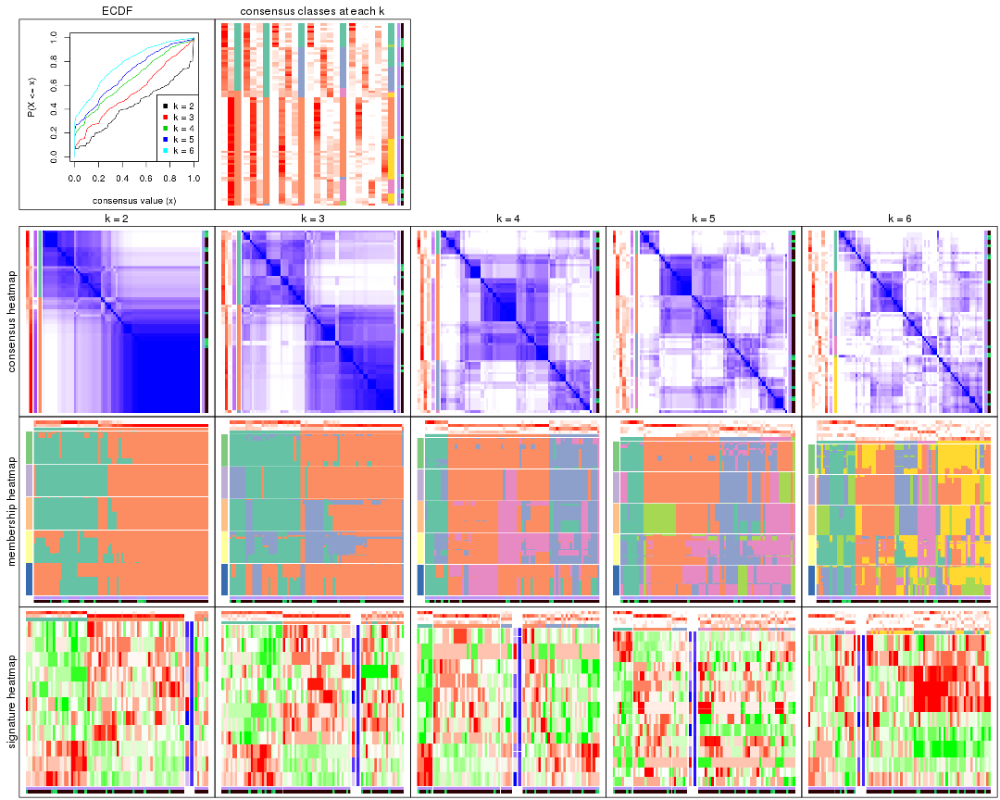

The plots are:

- The first row: a plot of the ECDF (Empirical cumulative distribution
  function) curves of the consensus matrix for each `k` and the heatmap of
  predicted classes for each `k`.
- The second row: heatmaps of the consensus matrix for each `k`.
- The third row: heatmaps of the membership matrix for each `k`.
- The fouth row: heatmaps of the signatures for each `k`.

All the plots in panels can be made by individual functions and they are
plotted later in this section.

`select_partition_number()` produces several plots showing different
statistics for choosing "optimized" `k`. There are following statistics:

- ECDF curves of the consensus matrix for each `k`;
- 1-PAC. [The PAC
  score](https://en.wikipedia.org/wiki/Consensus_clustering#Over-interpretation_potential_of_consensus_clustering)
  measures the proportion of the ambiguous subgrouping.
- Mean silhouette score.
- Concordance. The mean probability of fiting the consensus class ids in all
  partitions.
- Area increased. Denote $A_k$ as the area under the ECDF curve for current
  `k`, the area increased is defined as $A_k - A_{k-1}$.
- Rand index. The percent of pairs of samples that are both in a same cluster
  or both are not in a same cluster in the partition of k and k-1.
- Jaccard index. The ratio of pairs of samples are both in a same cluster in
  the partition of k and k-1 and the pairs of samples are both in a same
  cluster in the partition k or k-1.

The detailed explanations of these statistics can be found in [the cola
vignette](http://bioconductor.org/packages/devel/bioc/vignettes/cola/inst/doc/cola.html#toc_13).

Generally speaking, lower PAC score, higher mean silhouette score or higher
concordance corresponds to better partition. Rand index and Jaccard index
measure how similar the current partition is compared to partition with `k-1`.
If they are too similar, we won't accept `k` is better than `k-1`.

```r
select_partition_number(res)
```

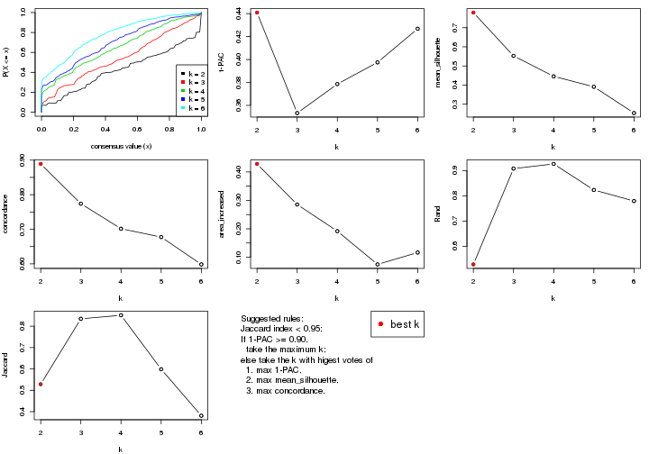

The numeric values for all these statistics can be obtained by `get_stats()`.

```r
get_stats(res)
```

```
#>   k 1-PAC mean_silhouette concordance area_increased  Rand Jaccard
#> 2 2 0.441           0.779       0.889         0.4283 0.528   0.528
#> 3 3 0.353           0.553       0.774         0.2854 0.908   0.835
#> 4 4 0.379           0.446       0.702         0.1917 0.926   0.851
#> 5 5 0.397           0.391       0.677         0.0748 0.823   0.598
#> 6 6 0.427           0.254       0.598         0.1166 0.779   0.381
```

`suggest_best_k()` suggests the best $k$ based on these statistics. The rules are as follows:

- All $k$ with Jaccard index larger than 0.95 are removed because the increase of
  the partition number does not provides enough extra information. If all $k$ are removed,
  the best $k$ is assigned by `NA`.
- For $k$ with 1-PAC larger than 0.9, the maximal $k$ is taken as the "best k". Other $k$ is called "optional k".
- If it does not fit the second rule. The $k$ with the highest vote of highest
  1-PAC, mean silhouette and concordance is taken as the "best k".

```r
suggest_best_k(res)
```

```
#> [1] 2
```


Following shows the table of the partitions (You need to click the **show/hide
code output** link to see it). The membership matrix (columns with name `p*`)
is inferred by
[`clue::cl_consensus()`](https://www.rdocumentation.org/link/cl_consensus?package=clue)
function with the `SE` method. Basically the value in the membership matrix
represents the probability to belong to a certain group. The finall class
label for an item is determined with the group with highest probability it
belongs to.

In `get_classes()` function, the entropy is calculated from the membership
matrix and the silhouette score is calculated from the consensus matrix.


<script>
$( function() {
	$( '#tabs-SD-hclust-get-classes' ).tabs();
} );
</script>
<div id='tabs-SD-hclust-get-classes'>
<ul>
<li><a href='#tab-SD-hclust-get-classes-1'>k = 2</a></li>
<li><a href='#tab-SD-hclust-get-classes-2'>k = 3</a></li>
<li><a href='#tab-SD-hclust-get-classes-3'>k = 4</a></li>
<li><a href='#tab-SD-hclust-get-classes-4'>k = 5</a></li>
<li><a href='#tab-SD-hclust-get-classes-5'>k = 6</a></li>
</ul>

<div id='tab-SD-hclust-get-classes-1'>
<p><a id='tab-SD-hclust-get-classes-1-a' style='color:#0366d6' href='#'>show/hide code output</a></p>
<pre><code class="r">cbind(get_classes(res, k = 2), get_membership(res, k = 2))
</code></pre>

<pre><code>#&gt;           class entropy silhouette    p1    p2
#&gt; GSM451162     1  1.0000     0.2870 0.504 0.496
#&gt; GSM451163     2  0.0000     0.9114 0.000 1.000
#&gt; GSM451164     2  0.0000     0.9114 0.000 1.000
#&gt; GSM451165     2  0.0000     0.9114 0.000 1.000
#&gt; GSM451167     2  0.2236     0.8851 0.036 0.964
#&gt; GSM451168     2  0.0000     0.9114 0.000 1.000
#&gt; GSM451169     2  0.9286     0.3049 0.344 0.656
#&gt; GSM451170     1  0.8499     0.7703 0.724 0.276
#&gt; GSM451171     2  0.0000     0.9114 0.000 1.000
#&gt; GSM451172     2  0.0000     0.9114 0.000 1.000
#&gt; GSM451173     1  0.9323     0.6838 0.652 0.348
#&gt; GSM451174     2  0.0000     0.9114 0.000 1.000
#&gt; GSM451175     1  0.9460     0.6601 0.636 0.364
#&gt; GSM451177     2  0.0000     0.9114 0.000 1.000
#&gt; GSM451178     2  0.0000     0.9114 0.000 1.000
#&gt; GSM451179     2  0.9922    -0.0194 0.448 0.552
#&gt; GSM451180     2  0.0000     0.9114 0.000 1.000
#&gt; GSM451181     2  0.0376     0.9090 0.004 0.996
#&gt; GSM451182     1  0.8499     0.7703 0.724 0.276
#&gt; GSM451183     1  0.5519     0.8238 0.872 0.128
#&gt; GSM451184     1  0.5842     0.8238 0.860 0.140
#&gt; GSM451185     1  0.0000     0.7755 1.000 0.000
#&gt; GSM451186     2  0.0672     0.9054 0.008 0.992
#&gt; GSM451187     2  0.0000     0.9114 0.000 1.000
#&gt; GSM451188     2  0.0000     0.9114 0.000 1.000
#&gt; GSM451189     1  0.5519     0.8238 0.872 0.128
#&gt; GSM451190     1  0.8081     0.7855 0.752 0.248
#&gt; GSM451191     1  0.8555     0.7668 0.720 0.280
#&gt; GSM451193     2  0.7376     0.6780 0.208 0.792
#&gt; GSM451195     1  0.7815     0.7868 0.768 0.232
#&gt; GSM451196     1  0.0000     0.7755 1.000 0.000
#&gt; GSM451197     1  0.0000     0.7755 1.000 0.000
#&gt; GSM451199     1  0.6438     0.8192 0.836 0.164
#&gt; GSM451201     1  0.0000     0.7755 1.000 0.000
#&gt; GSM451202     2  0.0000     0.9114 0.000 1.000
#&gt; GSM451203     1  0.8909     0.7364 0.692 0.308
#&gt; GSM451204     2  0.5059     0.7916 0.112 0.888
#&gt; GSM451205     2  0.0000     0.9114 0.000 1.000
#&gt; GSM451206     2  0.0000     0.9114 0.000 1.000
#&gt; GSM451207     2  0.6531     0.7120 0.168 0.832
#&gt; GSM451208     2  0.0000     0.9114 0.000 1.000
#&gt; GSM451209     2  0.2043     0.8882 0.032 0.968
#&gt; GSM451210     2  0.0000     0.9114 0.000 1.000
#&gt; GSM451212     2  0.0000     0.9114 0.000 1.000
#&gt; GSM451213     2  0.0000     0.9114 0.000 1.000
#&gt; GSM451214     2  0.2043     0.8882 0.032 0.968
#&gt; GSM451215     2  0.0000     0.9114 0.000 1.000
#&gt; GSM451216     2  0.0000     0.9114 0.000 1.000
#&gt; GSM451217     2  0.0000     0.9114 0.000 1.000
#&gt; GSM451219     1  0.9209     0.7049 0.664 0.336
#&gt; GSM451220     1  0.9323     0.6838 0.652 0.348
#&gt; GSM451221     1  0.6438     0.8192 0.836 0.164
#&gt; GSM451222     2  0.9922    -0.1156 0.448 0.552
#&gt; GSM451224     2  0.0000     0.9114 0.000 1.000
#&gt; GSM451225     2  0.9491     0.2004 0.368 0.632
#&gt; GSM451226     1  0.9044     0.6768 0.680 0.320
#&gt; GSM451227     2  0.2043     0.8882 0.032 0.968
#&gt; GSM451228     2  0.4431     0.8271 0.092 0.908
#&gt; GSM451230     2  0.9922    -0.1156 0.448 0.552
#&gt; GSM451231     2  0.7219     0.6378 0.200 0.800
#&gt; GSM451233     2  0.0000     0.9114 0.000 1.000
#&gt; GSM451234     2  0.0000     0.9114 0.000 1.000
#&gt; GSM451235     2  0.0000     0.9114 0.000 1.000
#&gt; GSM451236     2  0.0000     0.9114 0.000 1.000
#&gt; GSM451166     2  0.6531     0.7174 0.168 0.832
#&gt; GSM451194     1  0.9522     0.6461 0.628 0.372
#&gt; GSM451198     1  0.4431     0.8153 0.908 0.092
#&gt; GSM451218     2  0.0000     0.9114 0.000 1.000
#&gt; GSM451232     1  0.2236     0.7929 0.964 0.036
#&gt; GSM451176     1  0.0000     0.7755 1.000 0.000
#&gt; GSM451192     1  0.4431     0.8161 0.908 0.092
#&gt; GSM451200     1  0.5737     0.8238 0.864 0.136
#&gt; GSM451211     2  0.0000     0.9114 0.000 1.000
#&gt; GSM451223     2  0.0376     0.9090 0.004 0.996
#&gt; GSM451229     1  0.0000     0.7755 1.000 0.000
#&gt; GSM451237     2  0.0000     0.9114 0.000 1.000
</code></pre>

<script>
$('#tab-SD-hclust-get-classes-1-a').parent().next().next().hide();
$('#tab-SD-hclust-get-classes-1-a').click(function(){
  $('#tab-SD-hclust-get-classes-1-a').parent().next().next().toggle();
  return(false);
});
</script>
</div>

<div id='tab-SD-hclust-get-classes-2'>
<p><a id='tab-SD-hclust-get-classes-2-a' style='color:#0366d6' href='#'>show/hide code output</a></p>
<pre><code class="r">cbind(get_classes(res, k = 3), get_membership(res, k = 3))
</code></pre>

<pre><code>#&gt;           class entropy silhouette    p1    p2    p3
#&gt; GSM451162     1  0.6925    0.22890 0.532 0.452 0.016
#&gt; GSM451163     2  0.1643    0.72150 0.000 0.956 0.044
#&gt; GSM451164     2  0.1529    0.72268 0.000 0.960 0.040
#&gt; GSM451165     2  0.6665    0.27234 0.036 0.688 0.276
#&gt; GSM451167     2  0.1832    0.71418 0.036 0.956 0.008
#&gt; GSM451168     2  0.4342    0.65215 0.024 0.856 0.120
#&gt; GSM451169     2  0.6686    0.21876 0.372 0.612 0.016
#&gt; GSM451170     1  0.5244    0.59881 0.756 0.004 0.240
#&gt; GSM451171     2  0.2261    0.71595 0.000 0.932 0.068
#&gt; GSM451172     2  0.6375    0.29371 0.036 0.720 0.244
#&gt; GSM451173     1  0.7248    0.54776 0.676 0.256 0.068
#&gt; GSM451174     2  0.2400    0.70588 0.004 0.932 0.064
#&gt; GSM451175     1  0.7565    0.53818 0.660 0.256 0.084
#&gt; GSM451177     2  0.2356    0.71393 0.000 0.928 0.072
#&gt; GSM451178     2  0.2400    0.70588 0.004 0.932 0.064
#&gt; GSM451179     2  0.6948    0.00419 0.472 0.512 0.016
#&gt; GSM451180     2  0.2356    0.71393 0.000 0.928 0.072
#&gt; GSM451181     2  0.0237    0.72593 0.004 0.996 0.000
#&gt; GSM451182     1  0.5244    0.59881 0.756 0.004 0.240
#&gt; GSM451183     1  0.7153    0.62546 0.708 0.092 0.200
#&gt; GSM451184     1  0.3377    0.69583 0.896 0.092 0.012
#&gt; GSM451185     1  0.4974    0.56486 0.764 0.000 0.236
#&gt; GSM451186     3  0.6621    0.00000 0.032 0.284 0.684
#&gt; GSM451187     2  0.2356    0.71429 0.000 0.928 0.072
#&gt; GSM451188     2  0.2448    0.71179 0.000 0.924 0.076
#&gt; GSM451189     1  0.7153    0.62546 0.708 0.092 0.200
#&gt; GSM451190     1  0.4883    0.64004 0.788 0.208 0.004
#&gt; GSM451191     1  0.5378    0.59592 0.756 0.008 0.236
#&gt; GSM451193     2  0.7022    0.42104 0.232 0.700 0.068
#&gt; GSM451195     1  0.5851    0.65039 0.792 0.140 0.068
#&gt; GSM451196     1  0.4974    0.56486 0.764 0.000 0.236
#&gt; GSM451197     1  0.1411    0.65594 0.964 0.000 0.036
#&gt; GSM451199     1  0.4174    0.69383 0.872 0.092 0.036
#&gt; GSM451201     1  0.1411    0.65594 0.964 0.000 0.036
#&gt; GSM451202     2  0.1753    0.72658 0.000 0.952 0.048
#&gt; GSM451203     1  0.5992    0.59056 0.716 0.268 0.016
#&gt; GSM451204     2  0.6788    0.52972 0.136 0.744 0.120
#&gt; GSM451205     2  0.2356    0.71393 0.000 0.928 0.072
#&gt; GSM451206     2  0.2400    0.70588 0.004 0.932 0.064
#&gt; GSM451207     2  0.6488    0.50303 0.192 0.744 0.064
#&gt; GSM451208     2  0.2356    0.71393 0.000 0.928 0.072
#&gt; GSM451209     2  0.7308    0.33950 0.056 0.648 0.296
#&gt; GSM451210     2  0.1529    0.72268 0.000 0.960 0.040
#&gt; GSM451212     2  0.2682    0.70203 0.004 0.920 0.076
#&gt; GSM451213     2  0.2496    0.70377 0.004 0.928 0.068
#&gt; GSM451214     2  0.3889    0.69678 0.032 0.884 0.084
#&gt; GSM451215     2  0.2356    0.71393 0.000 0.928 0.072
#&gt; GSM451216     2  0.2496    0.70377 0.004 0.928 0.068
#&gt; GSM451217     2  0.1529    0.72268 0.000 0.960 0.040
#&gt; GSM451219     1  0.6805    0.58128 0.688 0.268 0.044
#&gt; GSM451220     1  0.7295    0.54976 0.676 0.252 0.072
#&gt; GSM451221     1  0.4174    0.69383 0.872 0.092 0.036
#&gt; GSM451222     1  0.9606    0.16559 0.472 0.288 0.240
#&gt; GSM451224     2  0.2448    0.71179 0.000 0.924 0.076
#&gt; GSM451225     1  0.9924   -0.06227 0.392 0.288 0.320
#&gt; GSM451226     1  0.5884    0.50284 0.716 0.272 0.012
#&gt; GSM451227     2  0.3889    0.69678 0.032 0.884 0.084
#&gt; GSM451228     2  0.5538    0.61149 0.116 0.812 0.072
#&gt; GSM451230     1  0.9606    0.16559 0.472 0.288 0.240
#&gt; GSM451231     2  0.9537   -0.19620 0.224 0.480 0.296
#&gt; GSM451233     2  0.6482    0.39061 0.024 0.680 0.296
#&gt; GSM451234     2  0.6420    0.40034 0.024 0.688 0.288
#&gt; GSM451235     2  0.6420    0.40034 0.024 0.688 0.288
#&gt; GSM451236     2  0.6420    0.40034 0.024 0.688 0.288
#&gt; GSM451166     2  0.6955    0.40457 0.172 0.728 0.100
#&gt; GSM451194     1  0.7279    0.53675 0.652 0.056 0.292
#&gt; GSM451198     1  0.4232    0.69551 0.872 0.084 0.044
#&gt; GSM451218     2  0.6420    0.40034 0.024 0.688 0.288
#&gt; GSM451232     1  0.4978    0.58251 0.780 0.004 0.216
#&gt; GSM451176     1  0.4974    0.56486 0.764 0.000 0.236
#&gt; GSM451192     1  0.3765    0.69579 0.888 0.084 0.028
#&gt; GSM451200     1  0.3213    0.69596 0.900 0.092 0.008
#&gt; GSM451211     2  0.2066    0.72659 0.000 0.940 0.060
#&gt; GSM451223     2  0.0661    0.72611 0.004 0.988 0.008
#&gt; GSM451229     1  0.4974    0.56486 0.764 0.000 0.236
#&gt; GSM451237     2  0.6420    0.40034 0.024 0.688 0.288
</code></pre>

<script>
$('#tab-SD-hclust-get-classes-2-a').parent().next().next().hide();
$('#tab-SD-hclust-get-classes-2-a').click(function(){
  $('#tab-SD-hclust-get-classes-2-a').parent().next().next().toggle();
  return(false);
});
</script>
</div>

<div id='tab-SD-hclust-get-classes-3'>
<p><a id='tab-SD-hclust-get-classes-3-a' style='color:#0366d6' href='#'>show/hide code output</a></p>
<pre><code class="r">cbind(get_classes(res, k = 4), get_membership(res, k = 4))
</code></pre>

<pre><code>#&gt;           class entropy silhouette    p1    p2    p3    p4
#&gt; GSM451162     3  0.5992    0.28701 0.000 0.444 0.516 0.040
#&gt; GSM451163     2  0.3751    0.64726 0.000 0.800 0.004 0.196
#&gt; GSM451164     2  0.3975    0.64189 0.000 0.760 0.000 0.240
#&gt; GSM451165     2  0.6495    0.52556 0.000 0.624 0.252 0.124
#&gt; GSM451167     2  0.4149    0.64347 0.000 0.812 0.036 0.152
#&gt; GSM451168     2  0.3569    0.59589 0.000 0.804 0.000 0.196
#&gt; GSM451169     2  0.5125    0.19599 0.000 0.604 0.388 0.008
#&gt; GSM451170     3  0.3736    0.41967 0.108 0.016 0.856 0.020
#&gt; GSM451171     2  0.4661    0.61953 0.000 0.652 0.000 0.348
#&gt; GSM451172     2  0.6112    0.53669 0.000 0.656 0.248 0.096
#&gt; GSM451173     3  0.7813    0.53820 0.088 0.320 0.532 0.060
#&gt; GSM451174     2  0.0000    0.61573 0.000 1.000 0.000 0.000
#&gt; GSM451175     3  0.7682    0.53393 0.088 0.320 0.540 0.052
#&gt; GSM451177     2  0.4679    0.61752 0.000 0.648 0.000 0.352
#&gt; GSM451178     2  0.0000    0.61573 0.000 1.000 0.000 0.000
#&gt; GSM451179     2  0.8223    0.00754 0.204 0.512 0.244 0.040
#&gt; GSM451180     2  0.4679    0.61752 0.000 0.648 0.000 0.352
#&gt; GSM451181     2  0.3157    0.64918 0.000 0.852 0.004 0.144
#&gt; GSM451182     3  0.3736    0.41967 0.108 0.016 0.856 0.020
#&gt; GSM451183     1  0.5756    0.61511 0.692 0.084 0.224 0.000
#&gt; GSM451184     3  0.5790    0.46225 0.120 0.084 0.756 0.040
#&gt; GSM451185     1  0.0000    0.66095 1.000 0.000 0.000 0.000
#&gt; GSM451186     4  0.6705    0.00000 0.000 0.148 0.244 0.608
#&gt; GSM451187     2  0.4018    0.64499 0.000 0.772 0.004 0.224
#&gt; GSM451188     2  0.4855    0.61631 0.000 0.644 0.004 0.352
#&gt; GSM451189     1  0.5756    0.61511 0.692 0.084 0.224 0.000
#&gt; GSM451190     3  0.6615    0.19758 0.148 0.004 0.640 0.208
#&gt; GSM451191     3  0.0707    0.40055 0.020 0.000 0.980 0.000
#&gt; GSM451193     2  0.5592    0.49848 0.116 0.764 0.092 0.028
#&gt; GSM451195     3  0.8318    0.50794 0.204 0.204 0.532 0.060
#&gt; GSM451196     1  0.0000    0.66095 1.000 0.000 0.000 0.000
#&gt; GSM451197     1  0.4804    0.47247 0.616 0.000 0.384 0.000
#&gt; GSM451199     3  0.4856    0.45259 0.136 0.084 0.780 0.000
#&gt; GSM451201     1  0.4790    0.47921 0.620 0.000 0.380 0.000
#&gt; GSM451202     2  0.4331    0.63730 0.000 0.712 0.000 0.288
#&gt; GSM451203     3  0.8173    0.54382 0.088 0.192 0.572 0.148
#&gt; GSM451204     2  0.4401    0.47588 0.000 0.812 0.112 0.076
#&gt; GSM451205     2  0.4679    0.61752 0.000 0.648 0.000 0.352
#&gt; GSM451206     2  0.0000    0.61573 0.000 1.000 0.000 0.000
#&gt; GSM451207     2  0.4050    0.46927 0.000 0.808 0.168 0.024
#&gt; GSM451208     2  0.4679    0.61752 0.000 0.648 0.000 0.352
#&gt; GSM451209     2  0.5055    0.30104 0.000 0.712 0.032 0.256
#&gt; GSM451210     2  0.4522    0.62697 0.000 0.680 0.000 0.320
#&gt; GSM451212     2  0.0469    0.61164 0.000 0.988 0.000 0.012
#&gt; GSM451213     2  0.0188    0.61364 0.000 0.996 0.000 0.004
#&gt; GSM451214     2  0.5698    0.60723 0.000 0.608 0.036 0.356
#&gt; GSM451215     2  0.4679    0.61752 0.000 0.648 0.000 0.352
#&gt; GSM451216     2  0.0188    0.61364 0.000 0.996 0.000 0.004
#&gt; GSM451217     2  0.4500    0.62890 0.000 0.684 0.000 0.316
#&gt; GSM451219     3  0.6149    0.46533 0.016 0.072 0.684 0.228
#&gt; GSM451220     3  0.7798    0.53885 0.088 0.316 0.536 0.060
#&gt; GSM451221     3  0.4856    0.45259 0.136 0.084 0.780 0.000
#&gt; GSM451222     3  0.7740    0.29070 0.000 0.348 0.416 0.236
#&gt; GSM451224     2  0.4855    0.61631 0.000 0.644 0.004 0.352
#&gt; GSM451225     3  0.8274    0.11955 0.016 0.352 0.384 0.248
#&gt; GSM451226     3  0.7628    0.32938 0.100 0.168 0.628 0.104
#&gt; GSM451227     2  0.5698    0.60723 0.000 0.608 0.036 0.356
#&gt; GSM451228     2  0.3182    0.54461 0.000 0.876 0.096 0.028
#&gt; GSM451230     3  0.7740    0.29070 0.000 0.348 0.416 0.236
#&gt; GSM451231     2  0.7227   -0.16253 0.000 0.544 0.200 0.256
#&gt; GSM451233     2  0.4103    0.33294 0.000 0.744 0.000 0.256
#&gt; GSM451234     2  0.4961   -0.19451 0.000 0.552 0.000 0.448
#&gt; GSM451235     2  0.4961   -0.19451 0.000 0.552 0.000 0.448
#&gt; GSM451236     2  0.4961   -0.19451 0.000 0.552 0.000 0.448
#&gt; GSM451166     2  0.3791    0.41166 0.000 0.796 0.200 0.004
#&gt; GSM451194     3  0.5384    0.48750 0.088 0.120 0.772 0.020
#&gt; GSM451198     3  0.7556    0.15834 0.364 0.084 0.512 0.040
#&gt; GSM451218     2  0.4961   -0.19451 0.000 0.552 0.000 0.448
#&gt; GSM451232     1  0.4278    0.68405 0.816 0.016 0.148 0.020
#&gt; GSM451176     1  0.2921    0.62083 0.860 0.000 0.140 0.000
#&gt; GSM451192     1  0.6592    0.26745 0.524 0.084 0.392 0.000
#&gt; GSM451200     3  0.7414    0.21353 0.320 0.084 0.556 0.040
#&gt; GSM451211     2  0.2408    0.64462 0.000 0.896 0.000 0.104
#&gt; GSM451223     2  0.3257    0.64914 0.000 0.844 0.004 0.152
#&gt; GSM451229     1  0.0000    0.66095 1.000 0.000 0.000 0.000
#&gt; GSM451237     2  0.4961   -0.19451 0.000 0.552 0.000 0.448
</code></pre>

<script>
$('#tab-SD-hclust-get-classes-3-a').parent().next().next().hide();
$('#tab-SD-hclust-get-classes-3-a').click(function(){
  $('#tab-SD-hclust-get-classes-3-a').parent().next().next().toggle();
  return(false);
});
</script>
</div>

<div id='tab-SD-hclust-get-classes-4'>
<p><a id='tab-SD-hclust-get-classes-4-a' style='color:#0366d6' href='#'>show/hide code output</a></p>
<pre><code class="r">cbind(get_classes(res, k = 5), get_membership(res, k = 5))
</code></pre>

<pre><code>#&gt;           class entropy silhouette    p1    p2    p3    p4    p5
#&gt; GSM451162     3  0.6577     0.1592 0.000 0.204 0.488 0.304 0.004
#&gt; GSM451163     2  0.5327     0.5234 0.000 0.664 0.000 0.120 0.216
#&gt; GSM451164     2  0.3980     0.4841 0.000 0.708 0.000 0.008 0.284
#&gt; GSM451165     2  0.5720     0.0462 0.000 0.600 0.124 0.000 0.276
#&gt; GSM451167     2  0.6728     0.4997 0.000 0.572 0.040 0.176 0.212
#&gt; GSM451168     2  0.6220     0.3513 0.000 0.524 0.000 0.168 0.308
#&gt; GSM451169     3  0.6844    -0.2063 0.000 0.364 0.388 0.244 0.004
#&gt; GSM451170     3  0.5003     0.4961 0.084 0.000 0.752 0.036 0.128
#&gt; GSM451171     2  0.0162     0.5379 0.000 0.996 0.000 0.004 0.000
#&gt; GSM451172     5  0.6055    -0.3940 0.000 0.408 0.120 0.000 0.472
#&gt; GSM451173     4  0.5576    -0.2382 0.084 0.000 0.308 0.604 0.004
#&gt; GSM451174     2  0.6523     0.3956 0.000 0.480 0.000 0.232 0.288
#&gt; GSM451175     3  0.5824     0.4357 0.084 0.000 0.520 0.392 0.004
#&gt; GSM451177     2  0.0000     0.5358 0.000 1.000 0.000 0.000 0.000
#&gt; GSM451178     2  0.6523     0.3956 0.000 0.480 0.000 0.232 0.288
#&gt; GSM451179     2  0.7883    -0.0409 0.084 0.372 0.368 0.172 0.004
#&gt; GSM451180     2  0.0000     0.5358 0.000 1.000 0.000 0.000 0.000
#&gt; GSM451181     2  0.6012     0.5168 0.000 0.612 0.008 0.168 0.212
#&gt; GSM451182     3  0.5003     0.4961 0.084 0.000 0.752 0.036 0.128
#&gt; GSM451183     1  0.5523     0.5044 0.572 0.000 0.348 0.080 0.000
#&gt; GSM451184     3  0.2561     0.5511 0.000 0.000 0.856 0.144 0.000
#&gt; GSM451185     1  0.0162     0.6991 0.996 0.000 0.000 0.000 0.004
#&gt; GSM451186     5  0.5509    -0.2482 0.000 0.000 0.076 0.360 0.564
#&gt; GSM451187     2  0.2563     0.5363 0.000 0.872 0.000 0.120 0.008
#&gt; GSM451188     2  0.0566     0.5309 0.000 0.984 0.004 0.000 0.012
#&gt; GSM451189     1  0.5486     0.5002 0.572 0.000 0.352 0.076 0.000
#&gt; GSM451190     3  0.5890     0.3110 0.144 0.196 0.644 0.016 0.000
#&gt; GSM451191     3  0.2329     0.4981 0.000 0.000 0.876 0.000 0.124
#&gt; GSM451193     2  0.8409     0.1897 0.000 0.364 0.216 0.224 0.196
#&gt; GSM451195     3  0.5466     0.5388 0.084 0.000 0.628 0.284 0.004
#&gt; GSM451196     1  0.0000     0.6990 1.000 0.000 0.000 0.000 0.000
#&gt; GSM451197     1  0.5774     0.6362 0.612 0.000 0.156 0.232 0.000
#&gt; GSM451199     3  0.1671     0.5533 0.000 0.000 0.924 0.076 0.000
#&gt; GSM451201     1  0.5740     0.6389 0.616 0.000 0.152 0.232 0.000
#&gt; GSM451202     2  0.1764     0.5380 0.000 0.928 0.000 0.064 0.008
#&gt; GSM451203     3  0.7110     0.5215 0.084 0.088 0.548 0.272 0.008
#&gt; GSM451204     2  0.7694     0.1069 0.000 0.404 0.116 0.360 0.120
#&gt; GSM451205     2  0.0000     0.5358 0.000 1.000 0.000 0.000 0.000
#&gt; GSM451206     2  0.6523     0.3956 0.000 0.480 0.000 0.232 0.288
#&gt; GSM451207     2  0.7728     0.1260 0.000 0.404 0.172 0.340 0.084
#&gt; GSM451208     2  0.0000     0.5358 0.000 1.000 0.000 0.000 0.000
#&gt; GSM451209     4  0.5769     0.2186 0.000 0.360 0.036 0.568 0.036
#&gt; GSM451210     2  0.3333     0.5189 0.000 0.788 0.000 0.004 0.208
#&gt; GSM451212     2  0.6749     0.3676 0.000 0.468 0.008 0.312 0.212
#&gt; GSM451213     2  0.6728     0.3754 0.000 0.476 0.008 0.304 0.212
#&gt; GSM451214     2  0.1731     0.5092 0.000 0.940 0.040 0.008 0.012
#&gt; GSM451215     2  0.0000     0.5358 0.000 1.000 0.000 0.000 0.000
#&gt; GSM451216     2  0.6728     0.3754 0.000 0.476 0.008 0.304 0.212
#&gt; GSM451217     2  0.3366     0.5184 0.000 0.784 0.000 0.004 0.212
#&gt; GSM451219     3  0.4893     0.5163 0.000 0.208 0.704 0.088 0.000
#&gt; GSM451220     3  0.5948     0.4405 0.084 0.000 0.508 0.400 0.008
#&gt; GSM451221     3  0.1671     0.5533 0.000 0.000 0.924 0.076 0.000
#&gt; GSM451222     4  0.3074     0.2204 0.000 0.000 0.196 0.804 0.000
#&gt; GSM451224     2  0.0566     0.5309 0.000 0.984 0.004 0.000 0.012
#&gt; GSM451225     4  0.5122     0.2507 0.000 0.000 0.200 0.688 0.112
#&gt; GSM451226     3  0.3916     0.4388 0.000 0.256 0.732 0.012 0.000
#&gt; GSM451227     2  0.1731     0.5092 0.000 0.940 0.040 0.008 0.012
#&gt; GSM451228     2  0.7962     0.1937 0.000 0.364 0.096 0.340 0.200
#&gt; GSM451230     4  0.3039     0.2267 0.000 0.000 0.192 0.808 0.000
#&gt; GSM451231     4  0.4109     0.4228 0.000 0.192 0.004 0.768 0.036
#&gt; GSM451233     4  0.5158     0.1671 0.000 0.392 0.004 0.568 0.036
#&gt; GSM451234     4  0.6433     0.4067 0.000 0.200 0.000 0.488 0.312
#&gt; GSM451235     4  0.6433     0.4067 0.000 0.200 0.000 0.488 0.312
#&gt; GSM451236     4  0.6433     0.4067 0.000 0.200 0.000 0.488 0.312
#&gt; GSM451166     4  0.8485    -0.0574 0.000 0.276 0.192 0.320 0.212
#&gt; GSM451194     3  0.6530     0.5134 0.084 0.000 0.632 0.156 0.128
#&gt; GSM451198     3  0.6535     0.0836 0.244 0.000 0.480 0.276 0.000
#&gt; GSM451218     4  0.6102     0.4263 0.000 0.200 0.000 0.568 0.232
#&gt; GSM451232     1  0.3573     0.6866 0.812 0.000 0.152 0.036 0.000
#&gt; GSM451176     1  0.2674     0.6149 0.856 0.000 0.140 0.000 0.004
#&gt; GSM451192     1  0.6756     0.4291 0.404 0.000 0.288 0.308 0.000
#&gt; GSM451200     3  0.5452     0.3635 0.200 0.000 0.656 0.144 0.000
#&gt; GSM451211     2  0.3480     0.4962 0.000 0.752 0.000 0.248 0.000
#&gt; GSM451223     2  0.6075     0.5155 0.000 0.604 0.008 0.176 0.212
#&gt; GSM451229     1  0.0162     0.6991 0.996 0.000 0.000 0.000 0.004
#&gt; GSM451237     4  0.6433     0.4067 0.000 0.200 0.000 0.488 0.312
</code></pre>

<script>
$('#tab-SD-hclust-get-classes-4-a').parent().next().next().hide();
$('#tab-SD-hclust-get-classes-4-a').click(function(){
  $('#tab-SD-hclust-get-classes-4-a').parent().next().next().toggle();
  return(false);
});
</script>
</div>

<div id='tab-SD-hclust-get-classes-5'>
<p><a id='tab-SD-hclust-get-classes-5-a' style='color:#0366d6' href='#'>show/hide code output</a></p>
<pre><code class="r">cbind(get_classes(res, k = 6), get_membership(res, k = 6))
</code></pre>

<pre><code>#&gt;           class entropy silhouette    p1    p2    p3    p4    p5    p6
#&gt; GSM451162     1  0.9009  -0.222520 0.228 0.184 0.140 0.004 0.224 0.220
#&gt; GSM451163     6  0.4226  -0.083493 0.000 0.484 0.004 0.008 0.000 0.504
#&gt; GSM451164     2  0.5059   0.228853 0.000 0.528 0.000 0.080 0.000 0.392
#&gt; GSM451165     2  0.5414   0.344006 0.032 0.560 0.360 0.008 0.000 0.040
#&gt; GSM451167     6  0.3996   0.210242 0.000 0.352 0.004 0.008 0.000 0.636
#&gt; GSM451168     6  0.6068  -0.048678 0.000 0.360 0.000 0.264 0.000 0.376
#&gt; GSM451169     6  0.7860   0.184327 0.228 0.184 0.012 0.004 0.192 0.380
#&gt; GSM451170     3  0.3037   0.471414 0.176 0.000 0.808 0.000 0.016 0.000
#&gt; GSM451171     2  0.3189   0.668681 0.000 0.760 0.000 0.004 0.000 0.236
#&gt; GSM451172     6  0.6794   0.107102 0.032 0.220 0.360 0.008 0.000 0.380
#&gt; GSM451173     3  0.7751   0.342667 0.060 0.000 0.364 0.052 0.232 0.292
#&gt; GSM451174     6  0.4174   0.376737 0.000 0.184 0.000 0.084 0.000 0.732
#&gt; GSM451175     3  0.5239   0.530007 0.064 0.000 0.576 0.000 0.020 0.340
#&gt; GSM451177     2  0.1501   0.695796 0.000 0.924 0.000 0.000 0.000 0.076
#&gt; GSM451178     6  0.4454   0.345260 0.000 0.224 0.000 0.084 0.000 0.692
#&gt; GSM451179     6  0.7663  -0.000942 0.296 0.152 0.236 0.004 0.000 0.312
#&gt; GSM451180     2  0.1501   0.695796 0.000 0.924 0.000 0.000 0.000 0.076
#&gt; GSM451181     6  0.4184   0.076169 0.000 0.432 0.004 0.008 0.000 0.556
#&gt; GSM451182     3  0.3037   0.471414 0.176 0.000 0.808 0.000 0.016 0.000
#&gt; GSM451183     1  0.0363   0.088010 0.988 0.000 0.012 0.000 0.000 0.000
#&gt; GSM451184     1  0.6851  -0.181004 0.396 0.004 0.332 0.000 0.224 0.044
#&gt; GSM451185     1  0.5108  -0.712267 0.484 0.000 0.080 0.000 0.436 0.000
#&gt; GSM451186     4  0.3171   0.497867 0.000 0.000 0.204 0.784 0.000 0.012
#&gt; GSM451187     2  0.4034   0.488389 0.000 0.624 0.004 0.008 0.000 0.364
#&gt; GSM451188     2  0.0146   0.683996 0.000 0.996 0.000 0.004 0.000 0.000
#&gt; GSM451189     1  0.0458   0.089100 0.984 0.000 0.016 0.000 0.000 0.000
#&gt; GSM451190     1  0.7674  -0.025977 0.360 0.200 0.232 0.000 0.204 0.004
#&gt; GSM451191     3  0.5555   0.220490 0.212 0.004 0.576 0.000 0.208 0.000
#&gt; GSM451193     6  0.5986   0.361634 0.252 0.140 0.040 0.000 0.000 0.568
#&gt; GSM451195     3  0.5942   0.477970 0.256 0.000 0.564 0.000 0.032 0.148
#&gt; GSM451196     1  0.3810  -0.568958 0.572 0.000 0.000 0.000 0.428 0.000
#&gt; GSM451197     1  0.3860  -0.137271 0.528 0.000 0.000 0.000 0.472 0.000
#&gt; GSM451199     1  0.6163  -0.153561 0.408 0.004 0.376 0.000 0.208 0.004
#&gt; GSM451201     1  0.3862  -0.144163 0.524 0.000 0.000 0.000 0.476 0.000
#&gt; GSM451202     2  0.3341   0.674355 0.000 0.816 0.000 0.068 0.000 0.116
#&gt; GSM451203     3  0.6935   0.523315 0.100 0.088 0.564 0.008 0.032 0.208
#&gt; GSM451204     6  0.5893   0.094661 0.000 0.056 0.112 0.236 0.000 0.596
#&gt; GSM451205     2  0.3050   0.668966 0.000 0.764 0.000 0.000 0.000 0.236
#&gt; GSM451206     6  0.4454   0.345260 0.000 0.224 0.000 0.084 0.000 0.692
#&gt; GSM451207     6  0.5412   0.339628 0.052 0.040 0.152 0.052 0.000 0.704
#&gt; GSM451208     2  0.2003   0.704545 0.000 0.884 0.000 0.000 0.000 0.116
#&gt; GSM451209     6  0.3823  -0.270213 0.000 0.000 0.000 0.436 0.000 0.564
#&gt; GSM451210     2  0.2994   0.519277 0.000 0.788 0.000 0.004 0.000 0.208
#&gt; GSM451212     6  0.2814   0.391490 0.008 0.172 0.000 0.000 0.000 0.820
#&gt; GSM451213     6  0.1462   0.449903 0.008 0.056 0.000 0.000 0.000 0.936
#&gt; GSM451214     2  0.2964   0.622327 0.000 0.792 0.000 0.004 0.000 0.204
#&gt; GSM451215     2  0.1501   0.695796 0.000 0.924 0.000 0.000 0.000 0.076
#&gt; GSM451216     6  0.1462   0.449903 0.008 0.056 0.000 0.000 0.000 0.936
#&gt; GSM451217     2  0.3190   0.496483 0.000 0.772 0.000 0.008 0.000 0.220
#&gt; GSM451219     3  0.8017   0.259585 0.108 0.212 0.416 0.004 0.208 0.052
#&gt; GSM451220     3  0.5899   0.537516 0.140 0.000 0.568 0.000 0.032 0.260
#&gt; GSM451221     1  0.6163  -0.153561 0.408 0.004 0.376 0.000 0.208 0.004
#&gt; GSM451222     6  0.8350  -0.199859 0.060 0.000 0.168 0.200 0.232 0.340
#&gt; GSM451224     2  0.2442   0.666767 0.000 0.852 0.000 0.004 0.000 0.144
#&gt; GSM451225     4  0.5872   0.482954 0.012 0.000 0.172 0.588 0.216 0.012
#&gt; GSM451226     1  0.8689  -0.122175 0.300 0.100 0.204 0.000 0.192 0.204
#&gt; GSM451227     2  0.2964   0.622327 0.000 0.792 0.000 0.004 0.000 0.204
#&gt; GSM451228     6  0.5281   0.413915 0.136 0.140 0.044 0.000 0.000 0.680
#&gt; GSM451230     6  0.8372  -0.196047 0.052 0.000 0.168 0.252 0.232 0.296
#&gt; GSM451231     4  0.6474   0.342085 0.000 0.032 0.000 0.436 0.200 0.332
#&gt; GSM451233     6  0.4509  -0.275853 0.000 0.032 0.000 0.436 0.000 0.532
#&gt; GSM451234     4  0.3542   0.694591 0.000 0.160 0.000 0.788 0.000 0.052
#&gt; GSM451235     4  0.3456   0.590663 0.000 0.040 0.000 0.788 0.000 0.172
#&gt; GSM451236     4  0.3141   0.676868 0.000 0.200 0.000 0.788 0.000 0.012
#&gt; GSM451166     6  0.5040   0.388143 0.020 0.140 0.156 0.000 0.000 0.684
#&gt; GSM451194     3  0.3602   0.549922 0.072 0.000 0.792 0.000 0.000 0.136
#&gt; GSM451198     1  0.5461   0.148717 0.572 0.000 0.228 0.000 0.200 0.000
#&gt; GSM451218     4  0.5481   0.532876 0.000 0.200 0.000 0.568 0.000 0.232
#&gt; GSM451232     1  0.3884  -0.351441 0.724 0.000 0.036 0.000 0.240 0.000
#&gt; GSM451176     5  0.5931   0.000000 0.388 0.000 0.212 0.000 0.400 0.000
#&gt; GSM451192     1  0.3221   0.149522 0.736 0.000 0.000 0.000 0.264 0.000
#&gt; GSM451200     1  0.5085  -0.035914 0.600 0.000 0.328 0.000 0.032 0.040
#&gt; GSM451211     2  0.4382   0.402937 0.000 0.676 0.000 0.060 0.000 0.264
#&gt; GSM451223     6  0.4172   0.089208 0.000 0.424 0.004 0.008 0.000 0.564
#&gt; GSM451229     1  0.5108  -0.712267 0.484 0.000 0.080 0.000 0.436 0.000
#&gt; GSM451237     4  0.3542   0.694591 0.000 0.160 0.000 0.788 0.000 0.052
</code></pre>

<script>
$('#tab-SD-hclust-get-classes-5-a').parent().next().next().hide();
$('#tab-SD-hclust-get-classes-5-a').click(function(){
  $('#tab-SD-hclust-get-classes-5-a').parent().next().next().toggle();
  return(false);
});
</script>
</div>
</div>

Heatmaps for the consensus matrix. It visualizes the probability of two
samples to be in a same group.


<script>
$( function() {
	$( '#tabs-SD-hclust-consensus-heatmap' ).tabs();
} );
</script>
<div id='tabs-SD-hclust-consensus-heatmap'>
<ul>
<li><a href='#tab-SD-hclust-consensus-heatmap-1'>k = 2</a></li>
<li><a href='#tab-SD-hclust-consensus-heatmap-2'>k = 3</a></li>
<li><a href='#tab-SD-hclust-consensus-heatmap-3'>k = 4</a></li>
<li><a href='#tab-SD-hclust-consensus-heatmap-4'>k = 5</a></li>
<li><a href='#tab-SD-hclust-consensus-heatmap-5'>k = 6</a></li>
</ul>
<div id='tab-SD-hclust-consensus-heatmap-1'>
<pre><code class="r">consensus_heatmap(res, k = 2)
</code></pre>

<p>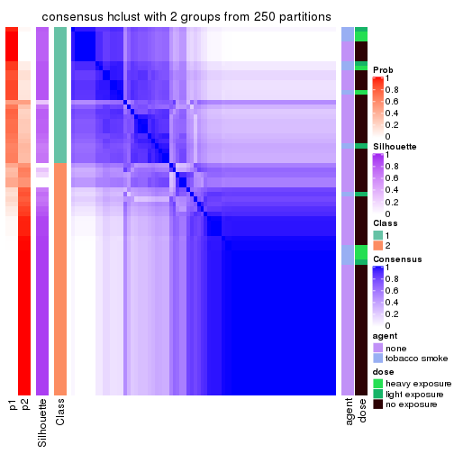</p>

</div>
<div id='tab-SD-hclust-consensus-heatmap-2'>
<pre><code class="r">consensus_heatmap(res, k = 3)
</code></pre>

<p>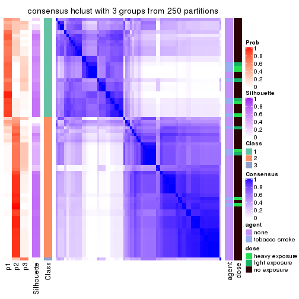</p>

</div>
<div id='tab-SD-hclust-consensus-heatmap-3'>
<pre><code class="r">consensus_heatmap(res, k = 4)
</code></pre>

<p>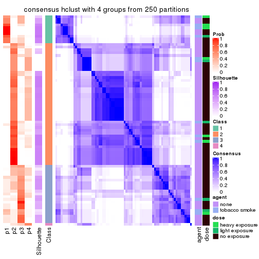</p>

</div>
<div id='tab-SD-hclust-consensus-heatmap-4'>
<pre><code class="r">consensus_heatmap(res, k = 5)
</code></pre>

<p>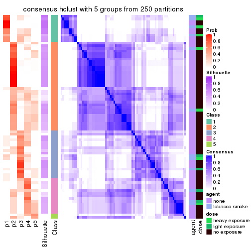</p>

</div>
<div id='tab-SD-hclust-consensus-heatmap-5'>
<pre><code class="r">consensus_heatmap(res, k = 6)
</code></pre>

<p>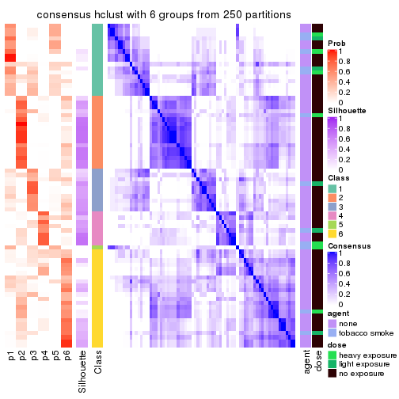</p>

</div>
</div>

Heatmaps for the membership of samples in all partitions to see how consistent they are:


<script>
$( function() {
	$( '#tabs-SD-hclust-membership-heatmap' ).tabs();
} );
</script>
<div id='tabs-SD-hclust-membership-heatmap'>
<ul>
<li><a href='#tab-SD-hclust-membership-heatmap-1'>k = 2</a></li>
<li><a href='#tab-SD-hclust-membership-heatmap-2'>k = 3</a></li>
<li><a href='#tab-SD-hclust-membership-heatmap-3'>k = 4</a></li>
<li><a href='#tab-SD-hclust-membership-heatmap-4'>k = 5</a></li>
<li><a href='#tab-SD-hclust-membership-heatmap-5'>k = 6</a></li>
</ul>
<div id='tab-SD-hclust-membership-heatmap-1'>
<pre><code class="r">membership_heatmap(res, k = 2)
</code></pre>

<p>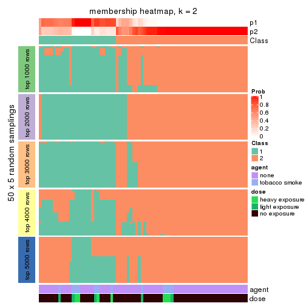</p>

</div>
<div id='tab-SD-hclust-membership-heatmap-2'>
<pre><code class="r">membership_heatmap(res, k = 3)
</code></pre>

<p>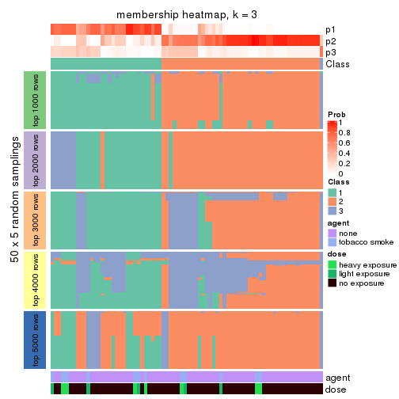</p>

</div>
<div id='tab-SD-hclust-membership-heatmap-3'>
<pre><code class="r">membership_heatmap(res, k = 4)
</code></pre>

<p>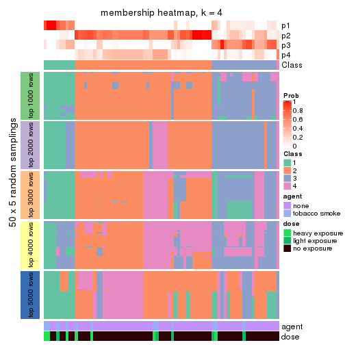</p>

</div>
<div id='tab-SD-hclust-membership-heatmap-4'>
<pre><code class="r">membership_heatmap(res, k = 5)
</code></pre>

<p>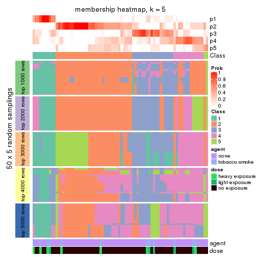</p>

</div>
<div id='tab-SD-hclust-membership-heatmap-5'>
<pre><code class="r">membership_heatmap(res, k = 6)
</code></pre>

<p>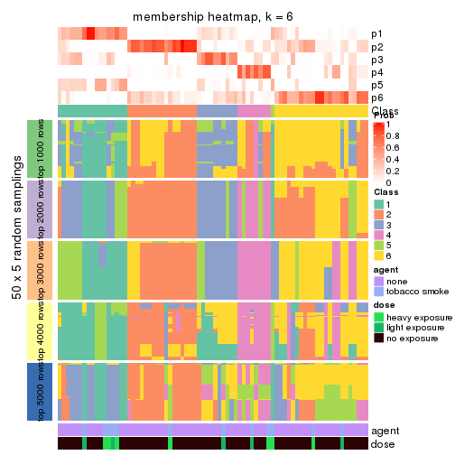</p>

</div>
</div>

As soon as we have had the classes for columns, we can look for signatures
which are significantly different between classes which can be candidate marks
for certain classes. Following are the heatmaps for signatures.


Signature heatmaps where rows are scaled:


<script>
$( function() {
	$( '#tabs-SD-hclust-get-signatures' ).tabs();
} );
</script>
<div id='tabs-SD-hclust-get-signatures'>
<ul>
<li><a href='#tab-SD-hclust-get-signatures-1'>k = 2</a></li>
<li><a href='#tab-SD-hclust-get-signatures-2'>k = 3</a></li>
<li><a href='#tab-SD-hclust-get-signatures-3'>k = 4</a></li>
<li><a href='#tab-SD-hclust-get-signatures-4'>k = 5</a></li>
<li><a href='#tab-SD-hclust-get-signatures-5'>k = 6</a></li>
</ul>
<div id='tab-SD-hclust-get-signatures-1'>
<pre><code class="r">get_signatures(res, k = 2)
</code></pre>

<p>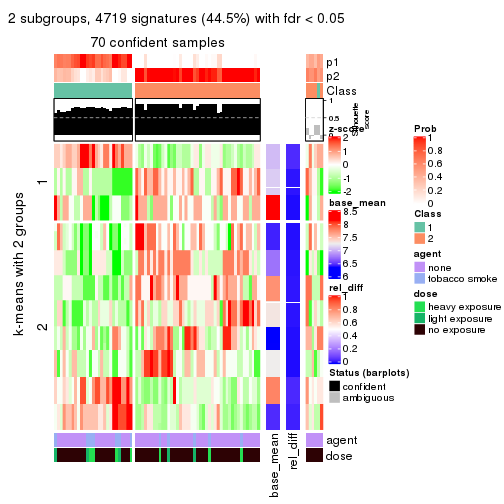</p>

</div>
<div id='tab-SD-hclust-get-signatures-2'>
<pre><code class="r">get_signatures(res, k = 3)
</code></pre>

<p>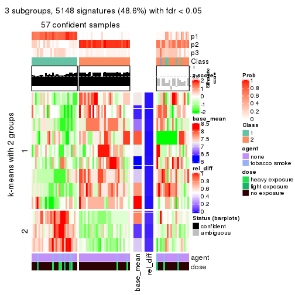</p>

</div>
<div id='tab-SD-hclust-get-signatures-3'>
<pre><code class="r">get_signatures(res, k = 4)
</code></pre>

<p>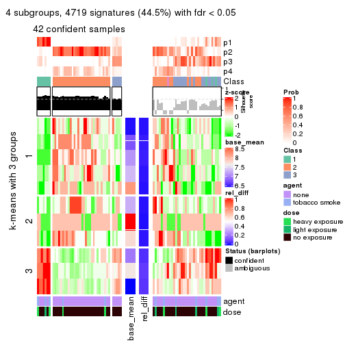</p>

</div>
<div id='tab-SD-hclust-get-signatures-4'>
<pre><code class="r">get_signatures(res, k = 5)
</code></pre>

<p>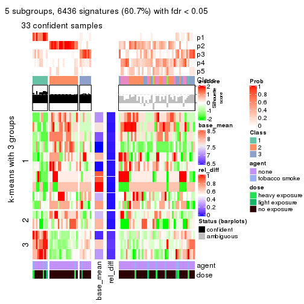</p>

</div>
<div id='tab-SD-hclust-get-signatures-5'>
<pre><code class="r">get_signatures(res, k = 6)
</code></pre>

<p>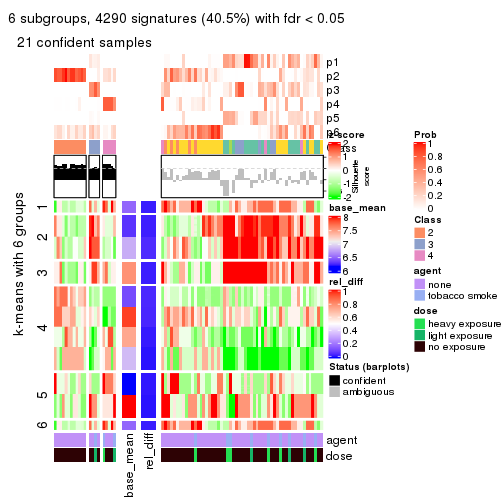</p>

</div>
</div>


Signature heatmaps where rows are not scaled:


<script>
$( function() {
	$( '#tabs-SD-hclust-get-signatures-no-scale' ).tabs();
} );
</script>
<div id='tabs-SD-hclust-get-signatures-no-scale'>
<ul>
<li><a href='#tab-SD-hclust-get-signatures-no-scale-1'>k = 2</a></li>
<li><a href='#tab-SD-hclust-get-signatures-no-scale-2'>k = 3</a></li>
<li><a href='#tab-SD-hclust-get-signatures-no-scale-3'>k = 4</a></li>
<li><a href='#tab-SD-hclust-get-signatures-no-scale-4'>k = 5</a></li>
<li><a href='#tab-SD-hclust-get-signatures-no-scale-5'>k = 6</a></li>
</ul>
<div id='tab-SD-hclust-get-signatures-no-scale-1'>
<pre><code class="r">get_signatures(res, k = 2, scale_rows = FALSE)
</code></pre>

<p>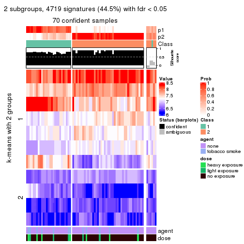</p>

</div>
<div id='tab-SD-hclust-get-signatures-no-scale-2'>
<pre><code class="r">get_signatures(res, k = 3, scale_rows = FALSE)
</code></pre>

<p>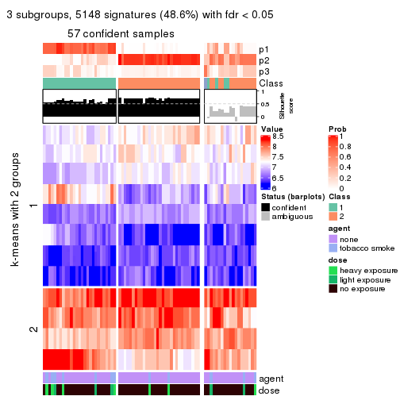</p>

</div>
<div id='tab-SD-hclust-get-signatures-no-scale-3'>
<pre><code class="r">get_signatures(res, k = 4, scale_rows = FALSE)
</code></pre>

<p>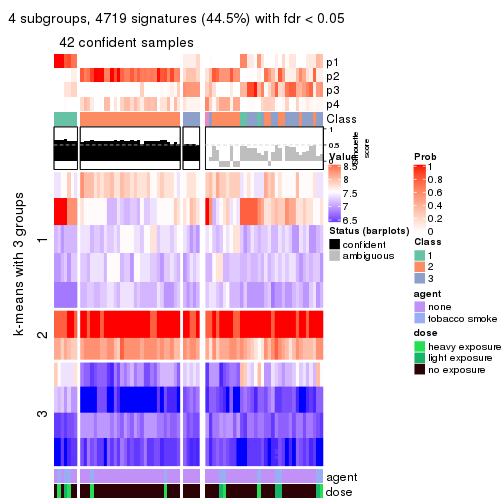</p>

</div>
<div id='tab-SD-hclust-get-signatures-no-scale-4'>
<pre><code class="r">get_signatures(res, k = 5, scale_rows = FALSE)
</code></pre>

<p>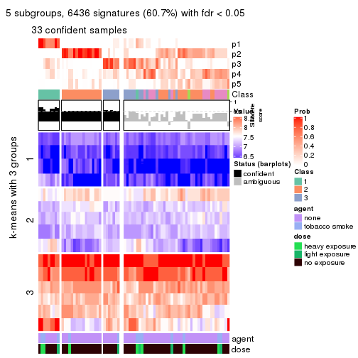</p>

</div>
<div id='tab-SD-hclust-get-signatures-no-scale-5'>
<pre><code class="r">get_signatures(res, k = 6, scale_rows = FALSE)
</code></pre>

<p>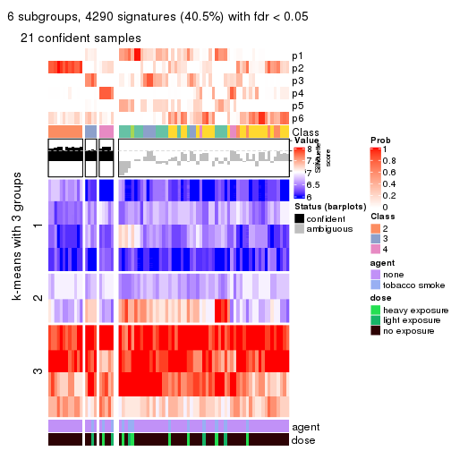</p>

</div>
</div>


Compare the overlap of signatures from different k:

```r
compare_signatures(res)
```

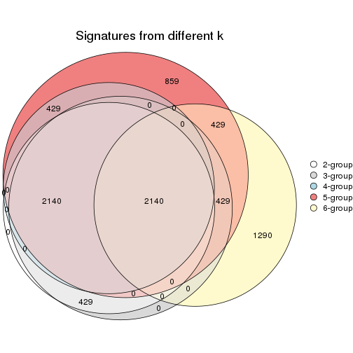

`get_signature()` returns a data frame invisibly. TO get the list of signatures, the function
call should be assigned to a variable explicitly. In following code, if `plot` argument is set
to `FALSE`, no heatmap is plotted while only the differential analysis is performed.

```r
# code only for demonstration
tb = get_signature(res, k = ..., plot = FALSE)
```

An example of the output of `tb` is:

```
#>   which_row         fdr    mean_1    mean_2 scaled_mean_1 scaled_mean_2 km
#> 1        38 0.042760348  8.373488  9.131774    -0.5533452     0.5164555  1
#> 2        40 0.018707592  7.106213  8.469186    -0.6173731     0.5762149  1
#> 3        55 0.019134737 10.221463 11.207825    -0.6159697     0.5749050  1
#> 4        59 0.006059896  5.921854  7.869574    -0.6899429     0.6439467  1
#> 5        60 0.018055526  8.928898 10.211722    -0.6204761     0.5791110  1
#> 6        98 0.009384629 15.714769 14.887706     0.6635654    -0.6193277  2
...
```

The columns in `tb` are:

1. `which_row`: row indices corresponding to the input matrix.
2. `fdr`: FDR for the differential test. 
3. `mean_x`: The mean value in group x.
4. `scaled_mean_x`: The mean value in group x after rows are scaled.
5. `km`: Row groups if k-means clustering is applied to rows.


UMAP plot which shows how samples are separated.


<script>
$( function() {
	$( '#tabs-SD-hclust-dimension-reduction' ).tabs();
} );
</script>
<div id='tabs-SD-hclust-dimension-reduction'>
<ul>
<li><a href='#tab-SD-hclust-dimension-reduction-1'>k = 2</a></li>
<li><a href='#tab-SD-hclust-dimension-reduction-2'>k = 3</a></li>
<li><a href='#tab-SD-hclust-dimension-reduction-3'>k = 4</a></li>
<li><a href='#tab-SD-hclust-dimension-reduction-4'>k = 5</a></li>
<li><a href='#tab-SD-hclust-dimension-reduction-5'>k = 6</a></li>
</ul>
<div id='tab-SD-hclust-dimension-reduction-1'>
<pre><code class="r">dimension_reduction(res, k = 2, method = &quot;UMAP&quot;)
</code></pre>

<p>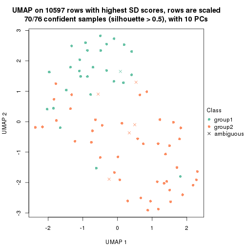</p>

</div>
<div id='tab-SD-hclust-dimension-reduction-2'>
<pre><code class="r">dimension_reduction(res, k = 3, method = &quot;UMAP&quot;)
</code></pre>

<p>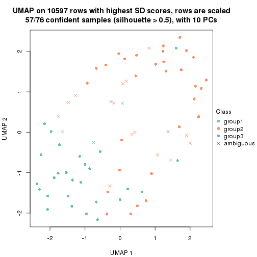</p>

</div>
<div id='tab-SD-hclust-dimension-reduction-3'>
<pre><code class="r">dimension_reduction(res, k = 4, method = &quot;UMAP&quot;)
</code></pre>

<p>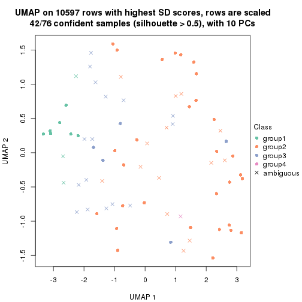</p>

</div>
<div id='tab-SD-hclust-dimension-reduction-4'>
<pre><code class="r">dimension_reduction(res, k = 5, method = &quot;UMAP&quot;)
</code></pre>

<p>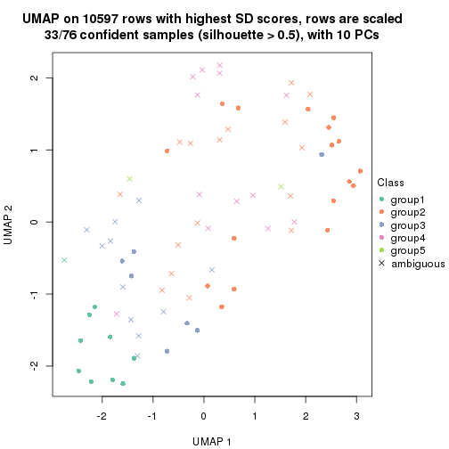</p>

</div>
<div id='tab-SD-hclust-dimension-reduction-5'>
<pre><code class="r">dimension_reduction(res, k = 6, method = &quot;UMAP&quot;)
</code></pre>

<p>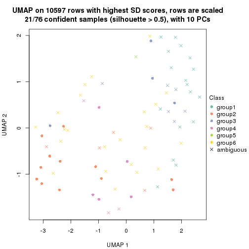</p>

</div>
</div>


Following heatmap shows how subgroups are split when increasing `k`:

```r
collect_classes(res)
```

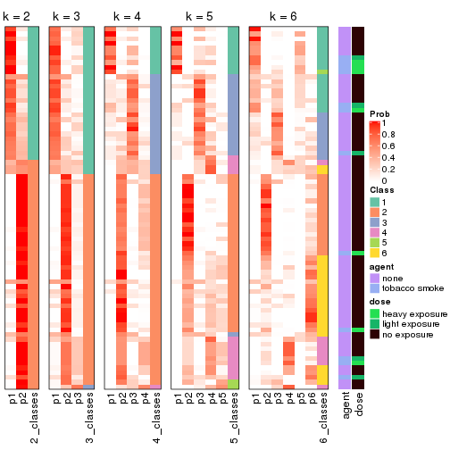


Test correlation between subgroups and known annotations. If the known
annotation is numeric, one-way ANOVA test is applied, and if the known
annotation is discrete, chi-squared contingency table test is applied.

```r
test_to_known_factors(res)
```

```
#>            n agent(p) dose(p) k
#> SD:hclust 70   0.2227  0.3016 2
#> SD:hclust 57   0.1037  0.0882 3
#> SD:hclust 42   0.0197  0.0532 4
#> SD:hclust 33   0.1778  0.2626 5
#> SD:hclust 21   0.0791  0.1556 6
```


If matrix rows can be associated to genes, consider to use `GO_Enrichment(res,
...)` to perform function enrichment for the signature genes.


 

---------------------------------------------------


### SD:kmeans


The object with results only for a single top-value method and a single partition method 
can be extracted as:

```r
res = res_list["SD", "kmeans"]
# you can also extract it by
# res = res_list["SD:kmeans"]
```

A summary of `res` and all the functions that can be applied to it:

```r
res
```

```
#> A 'ConsensusPartition' object with k = 2, 3, 4, 5, 6.
#>   On a matrix with 10597 rows and 76 columns.
#>   Top rows (1000, 2000, 3000, 4000, 5000) are extracted by 'SD' method.
#>   Subgroups are detected by 'kmeans' method.
#>   Performed in total 1250 partitions by row resampling.
#>   Best k for subgroups seems to be 2.
#> 
#> Following methods can be applied to this 'ConsensusPartition' object:
#>  [1] "cola_report"             "collect_classes"         "collect_plots"          
#>  [4] "collect_stats"           "colnames"                "compare_signatures"     
#>  [7] "consensus_heatmap"       "dimension_reduction"     "functional_enrichment"  
#> [10] "get_anno_col"            "get_anno"                "get_classes"            
#> [13] "get_consensus"           "get_matrix"              "get_membership"         
#> [16] "get_param"               "get_signatures"          "get_stats"              
#> [19] "is_best_k"               "is_stable_k"             "membership_heatmap"     
#> [22] "ncol"                    "nrow"                    "plot_ecdf"              
#> [25] "rownames"                "select_partition_number" "show"                   
#> [28] "suggest_best_k"          "test_to_known_factors"
```

`collect_plots()` function collects all the plots made from `res` for all `k` (number of partitions)
into one single page to provide an easy and fast comparison between different `k`.

```r
collect_plots(res)
```

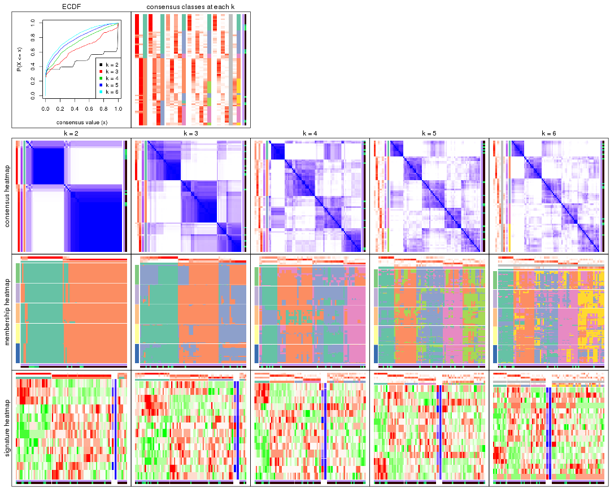

The plots are:

- The first row: a plot of the ECDF (Empirical cumulative distribution
  function) curves of the consensus matrix for each `k` and the heatmap of
  predicted classes for each `k`.
- The second row: heatmaps of the consensus matrix for each `k`.
- The third row: heatmaps of the membership matrix for each `k`.
- The fouth row: heatmaps of the signatures for each `k`.

All the plots in panels can be made by individual functions and they are
plotted later in this section.

`select_partition_number()` produces several plots showing different
statistics for choosing "optimized" `k`. There are following statistics:

- ECDF curves of the consensus matrix for each `k`;
- 1-PAC. [The PAC
  score](https://en.wikipedia.org/wiki/Consensus_clustering#Over-interpretation_potential_of_consensus_clustering)
  measures the proportion of the ambiguous subgrouping.
- Mean silhouette score.
- Concordance. The mean probability of fiting the consensus class ids in all
  partitions.
- Area increased. Denote $A_k$ as the area under the ECDF curve for current
  `k`, the area increased is defined as $A_k - A_{k-1}$.
- Rand index. The percent of pairs of samples that are both in a same cluster
  or both are not in a same cluster in the partition of k and k-1.
- Jaccard index. The ratio of pairs of samples are both in a same cluster in
  the partition of k and k-1 and the pairs of samples are both in a same
  cluster in the partition k or k-1.

The detailed explanations of these statistics can be found in [the cola
vignette](http://bioconductor.org/packages/devel/bioc/vignettes/cola/inst/doc/cola.html#toc_13).

Generally speaking, lower PAC score, higher mean silhouette score or higher
concordance corresponds to better partition. Rand index and Jaccard index
measure how similar the current partition is compared to partition with `k-1`.
If they are too similar, we won't accept `k` is better than `k-1`.

```r
select_partition_number(res)
```

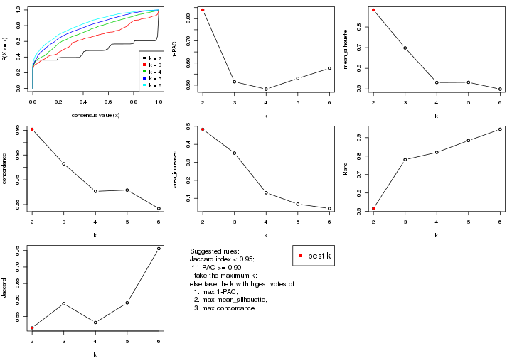

The numeric values for all these statistics can be obtained by `get_stats()`.

```r
get_stats(res)
```

```
#>   k 1-PAC mean_silhouette concordance area_increased  Rand Jaccard
#> 2 2 0.840           0.883       0.954         0.4835 0.516   0.516
#> 3 3 0.515           0.699       0.815         0.3511 0.781   0.589
#> 4 4 0.482           0.531       0.703         0.1312 0.820   0.532
#> 5 5 0.531           0.532       0.708         0.0680 0.884   0.592
#> 6 6 0.576           0.499       0.634         0.0438 0.946   0.756
```

`suggest_best_k()` suggests the best $k$ based on these statistics. The rules are as follows:

- All $k$ with Jaccard index larger than 0.95 are removed because the increase of
  the partition number does not provides enough extra information. If all $k$ are removed,
  the best $k$ is assigned by `NA`.
- For $k$ with 1-PAC larger than 0.9, the maximal $k$ is taken as the "best k". Other $k$ is called "optional k".
- If it does not fit the second rule. The $k$ with the highest vote of highest
  1-PAC, mean silhouette and concordance is taken as the "best k".

```r
suggest_best_k(res)
```

```
#> [1] 2
```


Following shows the table of the partitions (You need to click the **show/hide
code output** link to see it). The membership matrix (columns with name `p*`)
is inferred by
[`clue::cl_consensus()`](https://www.rdocumentation.org/link/cl_consensus?package=clue)
function with the `SE` method. Basically the value in the membership matrix
represents the probability to belong to a certain group. The finall class
label for an item is determined with the group with highest probability it
belongs to.

In `get_classes()` function, the entropy is calculated from the membership
matrix and the silhouette score is calculated from the consensus matrix.


<script>
$( function() {
	$( '#tabs-SD-kmeans-get-classes' ).tabs();
} );
</script>
<div id='tabs-SD-kmeans-get-classes'>
<ul>
<li><a href='#tab-SD-kmeans-get-classes-1'>k = 2</a></li>
<li><a href='#tab-SD-kmeans-get-classes-2'>k = 3</a></li>
<li><a href='#tab-SD-kmeans-get-classes-3'>k = 4</a></li>
<li><a href='#tab-SD-kmeans-get-classes-4'>k = 5</a></li>
<li><a href='#tab-SD-kmeans-get-classes-5'>k = 6</a></li>
</ul>

<div id='tab-SD-kmeans-get-classes-1'>
<p><a id='tab-SD-kmeans-get-classes-1-a' style='color:#0366d6' href='#'>show/hide code output</a></p>
<pre><code class="r">cbind(get_classes(res, k = 2), get_membership(res, k = 2))
</code></pre>

<pre><code>#&gt;           class entropy silhouette    p1    p2
#&gt; GSM451162     2  0.9552      0.375 0.376 0.624
#&gt; GSM451163     2  0.0000      0.959 0.000 1.000
#&gt; GSM451164     2  0.0000      0.959 0.000 1.000
#&gt; GSM451165     2  0.0672      0.953 0.008 0.992
#&gt; GSM451167     2  0.0000      0.959 0.000 1.000
#&gt; GSM451168     2  0.0000      0.959 0.000 1.000
#&gt; GSM451169     2  0.1414      0.944 0.020 0.980
#&gt; GSM451170     1  0.0000      0.934 1.000 0.000
#&gt; GSM451171     2  0.0000      0.959 0.000 1.000
#&gt; GSM451172     2  0.0672      0.953 0.008 0.992
#&gt; GSM451173     1  0.0000      0.934 1.000 0.000
#&gt; GSM451174     2  0.0000      0.959 0.000 1.000
#&gt; GSM451175     1  0.0000      0.934 1.000 0.000
#&gt; GSM451177     2  0.0000      0.959 0.000 1.000
#&gt; GSM451178     2  0.0000      0.959 0.000 1.000
#&gt; GSM451179     1  0.9710      0.350 0.600 0.400
#&gt; GSM451180     2  0.0000      0.959 0.000 1.000
#&gt; GSM451181     2  0.0000      0.959 0.000 1.000
#&gt; GSM451182     1  0.0000      0.934 1.000 0.000
#&gt; GSM451183     1  0.0000      0.934 1.000 0.000
#&gt; GSM451184     1  0.7219      0.723 0.800 0.200
#&gt; GSM451185     1  0.0000      0.934 1.000 0.000
#&gt; GSM451186     1  0.9580      0.378 0.620 0.380
#&gt; GSM451187     2  0.0000      0.959 0.000 1.000
#&gt; GSM451188     2  0.0000      0.959 0.000 1.000
#&gt; GSM451189     1  0.0000      0.934 1.000 0.000
#&gt; GSM451190     1  0.0000      0.934 1.000 0.000
#&gt; GSM451191     1  0.0000      0.934 1.000 0.000
#&gt; GSM451193     2  0.9686      0.292 0.396 0.604
#&gt; GSM451195     1  0.0000      0.934 1.000 0.000
#&gt; GSM451196     1  0.0000      0.934 1.000 0.000
#&gt; GSM451197     1  0.0000      0.934 1.000 0.000
#&gt; GSM451199     1  0.0000      0.934 1.000 0.000
#&gt; GSM451201     1  0.0000      0.934 1.000 0.000
#&gt; GSM451202     2  0.0000      0.959 0.000 1.000
#&gt; GSM451203     1  0.9635      0.387 0.612 0.388
#&gt; GSM451204     2  0.0000      0.959 0.000 1.000
#&gt; GSM451205     2  0.0000      0.959 0.000 1.000
#&gt; GSM451206     2  0.0000      0.959 0.000 1.000
#&gt; GSM451207     2  0.0000      0.959 0.000 1.000
#&gt; GSM451208     2  0.0000      0.959 0.000 1.000
#&gt; GSM451209     2  0.0672      0.953 0.008 0.992
#&gt; GSM451210     2  0.0000      0.959 0.000 1.000
#&gt; GSM451212     2  0.0000      0.959 0.000 1.000
#&gt; GSM451213     2  0.0000      0.959 0.000 1.000
#&gt; GSM451214     2  0.0000      0.959 0.000 1.000
#&gt; GSM451215     2  0.0000      0.959 0.000 1.000
#&gt; GSM451216     2  0.0000      0.959 0.000 1.000
#&gt; GSM451217     2  0.0000      0.959 0.000 1.000
#&gt; GSM451219     1  0.0000      0.934 1.000 0.000
#&gt; GSM451220     1  0.0000      0.934 1.000 0.000
#&gt; GSM451221     1  0.0000      0.934 1.000 0.000
#&gt; GSM451222     1  0.1633      0.915 0.976 0.024
#&gt; GSM451224     2  0.0000      0.959 0.000 1.000
#&gt; GSM451225     2  0.9815      0.247 0.420 0.580
#&gt; GSM451226     2  0.1184      0.947 0.016 0.984
#&gt; GSM451227     2  0.1184      0.947 0.016 0.984
#&gt; GSM451228     2  0.0000      0.959 0.000 1.000
#&gt; GSM451230     1  0.9710      0.339 0.600 0.400
#&gt; GSM451231     2  0.7219      0.720 0.200 0.800
#&gt; GSM451233     2  0.0000      0.959 0.000 1.000
#&gt; GSM451234     2  0.0000      0.959 0.000 1.000
#&gt; GSM451235     2  0.0000      0.959 0.000 1.000
#&gt; GSM451236     2  0.0000      0.959 0.000 1.000
#&gt; GSM451166     2  0.7219      0.719 0.200 0.800
#&gt; GSM451194     1  0.0000      0.934 1.000 0.000
#&gt; GSM451198     1  0.0000      0.934 1.000 0.000
#&gt; GSM451218     2  0.0000      0.959 0.000 1.000
#&gt; GSM451232     1  0.0000      0.934 1.000 0.000
#&gt; GSM451176     1  0.0000      0.934 1.000 0.000
#&gt; GSM451192     1  0.0000      0.934 1.000 0.000
#&gt; GSM451200     1  0.0000      0.934 1.000 0.000
#&gt; GSM451211     2  0.0000      0.959 0.000 1.000
#&gt; GSM451223     2  0.1414      0.944 0.020 0.980
#&gt; GSM451229     1  0.0000      0.934 1.000 0.000
#&gt; GSM451237     2  0.0000      0.959 0.000 1.000
</code></pre>

<script>
$('#tab-SD-kmeans-get-classes-1-a').parent().next().next().hide();
$('#tab-SD-kmeans-get-classes-1-a').click(function(){
  $('#tab-SD-kmeans-get-classes-1-a').parent().next().next().toggle();
  return(false);
});
</script>
</div>

<div id='tab-SD-kmeans-get-classes-2'>
<p><a id='tab-SD-kmeans-get-classes-2-a' style='color:#0366d6' href='#'>show/hide code output</a></p>
<pre><code class="r">cbind(get_classes(res, k = 3), get_membership(res, k = 3))
</code></pre>

<pre><code>#&gt;           class entropy silhouette    p1    p2    p3
#&gt; GSM451162     2  0.3263      0.577 0.040 0.912 0.048
#&gt; GSM451163     2  0.5529      0.814 0.000 0.704 0.296
#&gt; GSM451164     2  0.5431      0.820 0.000 0.716 0.284
#&gt; GSM451165     2  0.5480      0.764 0.004 0.732 0.264
#&gt; GSM451167     2  0.3038      0.674 0.000 0.896 0.104
#&gt; GSM451168     2  0.5431      0.820 0.000 0.716 0.284
#&gt; GSM451169     2  0.2590      0.625 0.004 0.924 0.072
#&gt; GSM451170     1  0.2066      0.807 0.940 0.060 0.000
#&gt; GSM451171     2  0.5529      0.818 0.000 0.704 0.296
#&gt; GSM451172     2  0.5443      0.763 0.004 0.736 0.260
#&gt; GSM451173     1  0.9599      0.424 0.472 0.236 0.292
#&gt; GSM451174     2  0.6280      0.561 0.000 0.540 0.460
#&gt; GSM451175     1  0.5318      0.771 0.780 0.204 0.016
#&gt; GSM451177     2  0.5529      0.819 0.000 0.704 0.296
#&gt; GSM451178     2  0.6252      0.581 0.000 0.556 0.444
#&gt; GSM451179     1  0.9131      0.551 0.520 0.312 0.168
#&gt; GSM451180     2  0.5529      0.819 0.000 0.704 0.296
#&gt; GSM451181     2  0.5465      0.820 0.000 0.712 0.288
#&gt; GSM451182     1  0.0237      0.815 0.996 0.004 0.000
#&gt; GSM451183     1  0.0237      0.815 0.996 0.004 0.000
#&gt; GSM451184     1  0.6280      0.544 0.540 0.460 0.000
#&gt; GSM451185     1  0.0237      0.814 0.996 0.004 0.000
#&gt; GSM451186     3  0.7246      0.584 0.060 0.276 0.664
#&gt; GSM451187     2  0.5733      0.799 0.000 0.676 0.324
#&gt; GSM451188     2  0.5465      0.820 0.000 0.712 0.288
#&gt; GSM451189     1  0.0237      0.815 0.996 0.004 0.000
#&gt; GSM451190     1  0.0892      0.814 0.980 0.020 0.000
#&gt; GSM451191     1  0.2448      0.803 0.924 0.076 0.000
#&gt; GSM451193     2  0.7525      0.130 0.096 0.676 0.228
#&gt; GSM451195     1  0.7880      0.689 0.648 0.244 0.108
#&gt; GSM451196     1  0.0237      0.814 0.996 0.004 0.000
#&gt; GSM451197     1  0.0237      0.814 0.996 0.004 0.000
#&gt; GSM451199     1  0.4887      0.771 0.772 0.228 0.000
#&gt; GSM451201     1  0.0000      0.814 1.000 0.000 0.000
#&gt; GSM451202     2  0.5465      0.820 0.000 0.712 0.288
#&gt; GSM451203     1  0.9239      0.516 0.500 0.328 0.172
#&gt; GSM451204     3  0.0892      0.757 0.000 0.020 0.980
#&gt; GSM451205     2  0.5465      0.820 0.000 0.712 0.288
#&gt; GSM451206     2  0.6307      0.551 0.000 0.512 0.488
#&gt; GSM451207     3  0.3619      0.625 0.000 0.136 0.864
#&gt; GSM451208     2  0.5529      0.818 0.000 0.704 0.296
#&gt; GSM451209     3  0.4702      0.710 0.000 0.212 0.788
#&gt; GSM451210     2  0.5465      0.820 0.000 0.712 0.288
#&gt; GSM451212     3  0.2711      0.704 0.000 0.088 0.912
#&gt; GSM451213     3  0.2711      0.704 0.000 0.088 0.912
#&gt; GSM451214     2  0.1860      0.661 0.000 0.948 0.052
#&gt; GSM451215     2  0.5497      0.819 0.000 0.708 0.292
#&gt; GSM451216     3  0.0424      0.756 0.000 0.008 0.992
#&gt; GSM451217     2  0.5465      0.820 0.000 0.712 0.288
#&gt; GSM451219     1  0.5138      0.766 0.748 0.252 0.000
#&gt; GSM451220     1  0.9901      0.228 0.392 0.272 0.336
#&gt; GSM451221     1  0.5254      0.761 0.736 0.264 0.000
#&gt; GSM451222     3  0.9367      0.279 0.292 0.204 0.504
#&gt; GSM451224     2  0.5431      0.820 0.000 0.716 0.284
#&gt; GSM451225     3  0.5171      0.706 0.012 0.204 0.784
#&gt; GSM451226     2  0.2448      0.635 0.000 0.924 0.076
#&gt; GSM451227     2  0.1753      0.658 0.000 0.952 0.048
#&gt; GSM451228     3  0.6192      0.553 0.000 0.420 0.580
#&gt; GSM451230     3  0.5826      0.690 0.032 0.204 0.764
#&gt; GSM451231     3  0.4978      0.708 0.004 0.216 0.780
#&gt; GSM451233     3  0.0892      0.757 0.000 0.020 0.980
#&gt; GSM451234     3  0.0747      0.758 0.000 0.016 0.984
#&gt; GSM451235     3  0.0892      0.757 0.000 0.020 0.980
#&gt; GSM451236     3  0.0747      0.756 0.000 0.016 0.984
#&gt; GSM451166     3  0.6090      0.681 0.020 0.264 0.716
#&gt; GSM451194     1  0.8839      0.618 0.572 0.256 0.172
#&gt; GSM451198     1  0.4555      0.778 0.800 0.200 0.000
#&gt; GSM451218     3  0.0592      0.755 0.000 0.012 0.988
#&gt; GSM451232     1  0.0000      0.814 1.000 0.000 0.000
#&gt; GSM451176     1  0.0424      0.815 0.992 0.008 0.000
#&gt; GSM451192     1  0.0000      0.814 1.000 0.000 0.000
#&gt; GSM451200     1  0.5058      0.766 0.756 0.244 0.000
#&gt; GSM451211     3  0.6204     -0.372 0.000 0.424 0.576
#&gt; GSM451223     2  0.1753      0.638 0.000 0.952 0.048
#&gt; GSM451229     1  0.0237      0.814 0.996 0.004 0.000
#&gt; GSM451237     3  0.0892      0.757 0.000 0.020 0.980
</code></pre>

<script>
$('#tab-SD-kmeans-get-classes-2-a').parent().next().next().hide();
$('#tab-SD-kmeans-get-classes-2-a').click(function(){
  $('#tab-SD-kmeans-get-classes-2-a').parent().next().next().toggle();
  return(false);
});
</script>
</div>

<div id='tab-SD-kmeans-get-classes-3'>
<p><a id='tab-SD-kmeans-get-classes-3-a' style='color:#0366d6' href='#'>show/hide code output</a></p>
<pre><code class="r">cbind(get_classes(res, k = 4), get_membership(res, k = 4))
</code></pre>

<pre><code>#&gt;           class entropy silhouette    p1    p2    p3    p4
#&gt; GSM451162     3   0.682     0.4205 0.364 0.084 0.544 0.008
#&gt; GSM451163     2   0.454     0.6857 0.248 0.740 0.004 0.008
#&gt; GSM451164     2   0.247     0.7358 0.108 0.892 0.000 0.000
#&gt; GSM451165     2   0.920     0.4286 0.324 0.396 0.172 0.108
#&gt; GSM451167     2   0.822     0.3376 0.216 0.504 0.244 0.036
#&gt; GSM451168     2   0.317     0.7270 0.016 0.868 0.000 0.116
#&gt; GSM451169     3   0.765     0.3955 0.352 0.100 0.512 0.036
#&gt; GSM451170     3   0.509     0.0567 0.228 0.000 0.728 0.044
#&gt; GSM451171     2   0.130     0.7334 0.044 0.956 0.000 0.000
#&gt; GSM451172     2   0.783     0.4755 0.308 0.512 0.156 0.024
#&gt; GSM451173     3   0.614    -0.0592 0.048 0.000 0.496 0.456
#&gt; GSM451174     2   0.890     0.3669 0.332 0.404 0.068 0.196
#&gt; GSM451175     3   0.391     0.2922 0.148 0.000 0.824 0.028
#&gt; GSM451177     2   0.158     0.7345 0.004 0.948 0.000 0.048
#&gt; GSM451178     2   0.871     0.3879 0.332 0.436 0.068 0.164
#&gt; GSM451179     3   0.497     0.5518 0.136 0.004 0.780 0.080
#&gt; GSM451180     2   0.112     0.7348 0.036 0.964 0.000 0.000
#&gt; GSM451181     2   0.358     0.7172 0.180 0.816 0.000 0.004
#&gt; GSM451182     1   0.541     0.6512 0.500 0.000 0.488 0.012
#&gt; GSM451183     1   0.494     0.7271 0.564 0.000 0.436 0.000
#&gt; GSM451184     3   0.420     0.5277 0.068 0.096 0.832 0.004
#&gt; GSM451185     1   0.522     0.7329 0.568 0.000 0.424 0.008
#&gt; GSM451186     4   0.466     0.6166 0.112 0.000 0.092 0.796
#&gt; GSM451187     2   0.452     0.6552 0.264 0.728 0.004 0.004
#&gt; GSM451188     2   0.381     0.7198 0.072 0.864 0.016 0.048
#&gt; GSM451189     1   0.525     0.7246 0.552 0.000 0.440 0.008
#&gt; GSM451190     3   0.465    -0.2268 0.312 0.000 0.684 0.004
#&gt; GSM451191     3   0.472     0.0275 0.300 0.000 0.692 0.008
#&gt; GSM451193     3   0.760     0.4411 0.340 0.072 0.532 0.056
#&gt; GSM451195     3   0.111     0.4915 0.028 0.000 0.968 0.004
#&gt; GSM451196     1   0.492     0.7333 0.576 0.000 0.424 0.000
#&gt; GSM451197     1   0.492     0.7333 0.576 0.000 0.424 0.000
#&gt; GSM451199     3   0.287     0.4148 0.072 0.000 0.896 0.032
#&gt; GSM451201     1   0.492     0.7333 0.576 0.000 0.424 0.000
#&gt; GSM451202     2   0.201     0.7292 0.000 0.920 0.000 0.080
#&gt; GSM451203     3   0.349     0.5563 0.156 0.004 0.836 0.004
#&gt; GSM451204     4   0.432     0.7336 0.000 0.204 0.020 0.776
#&gt; GSM451205     2   0.000     0.7347 0.000 1.000 0.000 0.000
#&gt; GSM451206     2   0.735     0.4929 0.264 0.544 0.004 0.188
#&gt; GSM451207     1   0.986    -0.4416 0.288 0.264 0.168 0.280
#&gt; GSM451208     2   0.329     0.7261 0.044 0.876 0.000 0.080
#&gt; GSM451209     4   0.316     0.7058 0.000 0.012 0.124 0.864
#&gt; GSM451210     2   0.381     0.7198 0.072 0.864 0.016 0.048
#&gt; GSM451212     4   0.982     0.1565 0.284 0.192 0.200 0.324
#&gt; GSM451213     4   0.960     0.1584 0.284 0.176 0.168 0.372
#&gt; GSM451214     2   0.608     0.5895 0.072 0.724 0.168 0.036
#&gt; GSM451215     2   0.267     0.7319 0.044 0.908 0.000 0.048
#&gt; GSM451216     4   0.373     0.7424 0.028 0.120 0.004 0.848
#&gt; GSM451217     2   0.297     0.7277 0.144 0.856 0.000 0.000
#&gt; GSM451219     3   0.408     0.4822 0.068 0.004 0.840 0.088
#&gt; GSM451220     3   0.523     0.5226 0.312 0.000 0.664 0.024
#&gt; GSM451221     3   0.293     0.5203 0.052 0.000 0.896 0.052
#&gt; GSM451222     4   0.675     0.4781 0.132 0.000 0.280 0.588
#&gt; GSM451224     2   0.472     0.7044 0.072 0.812 0.016 0.100
#&gt; GSM451225     4   0.280     0.7127 0.000 0.012 0.100 0.888
#&gt; GSM451226     3   0.818     0.4187 0.248 0.152 0.540 0.060
#&gt; GSM451227     2   0.656     0.5839 0.072 0.708 0.144 0.076
#&gt; GSM451228     3   0.918     0.1351 0.332 0.084 0.368 0.216
#&gt; GSM451230     4   0.405     0.6695 0.004 0.004 0.208 0.784
#&gt; GSM451231     4   0.338     0.6972 0.000 0.012 0.140 0.848
#&gt; GSM451233     4   0.393     0.7342 0.004 0.196 0.004 0.796
#&gt; GSM451234     4   0.228     0.7545 0.000 0.096 0.000 0.904
#&gt; GSM451235     4   0.276     0.7477 0.000 0.128 0.000 0.872
#&gt; GSM451236     4   0.414     0.7221 0.024 0.176 0.000 0.800
#&gt; GSM451166     1   0.925    -0.3871 0.320 0.076 0.316 0.288
#&gt; GSM451194     3   0.333     0.5132 0.024 0.000 0.864 0.112
#&gt; GSM451198     3   0.358     0.2195 0.180 0.000 0.816 0.004
#&gt; GSM451218     4   0.309     0.7457 0.008 0.128 0.000 0.864
#&gt; GSM451232     1   0.522     0.7329 0.568 0.000 0.424 0.008
#&gt; GSM451176     1   0.529     0.6827 0.520 0.000 0.472 0.008
#&gt; GSM451192     1   0.492     0.7323 0.572 0.000 0.428 0.000
#&gt; GSM451200     3   0.100     0.4738 0.024 0.000 0.972 0.004
#&gt; GSM451211     2   0.762     0.3959 0.232 0.504 0.004 0.260
#&gt; GSM451223     3   0.792     0.3947 0.272 0.156 0.536 0.036
#&gt; GSM451229     1   0.522     0.7329 0.568 0.000 0.424 0.008
#&gt; GSM451237     4   0.259     0.7501 0.000 0.116 0.000 0.884
</code></pre>

<script>
$('#tab-SD-kmeans-get-classes-3-a').parent().next().next().hide();
$('#tab-SD-kmeans-get-classes-3-a').click(function(){
  $('#tab-SD-kmeans-get-classes-3-a').parent().next().next().toggle();
  return(false);
});
</script>
</div>

<div id='tab-SD-kmeans-get-classes-4'>
<p><a id='tab-SD-kmeans-get-classes-4-a' style='color:#0366d6' href='#'>show/hide code output</a></p>
<pre><code class="r">cbind(get_classes(res, k = 5), get_membership(res, k = 5))
</code></pre>

<pre><code>#&gt;           class entropy silhouette    p1    p2    p3    p4    p5
#&gt; GSM451162     3  0.5009    -0.0431 0.000 0.032 0.540 0.000 0.428
#&gt; GSM451163     5  0.5492     0.1298 0.000 0.432 0.064 0.000 0.504
#&gt; GSM451164     2  0.4498     0.4845 0.000 0.688 0.032 0.000 0.280
#&gt; GSM451165     2  0.7894    -0.1503 0.000 0.384 0.232 0.080 0.304
#&gt; GSM451167     5  0.6249     0.3064 0.000 0.284 0.164 0.004 0.548
#&gt; GSM451168     2  0.4892     0.6216 0.000 0.744 0.020 0.076 0.160
#&gt; GSM451169     5  0.5089     0.1715 0.000 0.028 0.432 0.004 0.536
#&gt; GSM451170     3  0.6493     0.2035 0.396 0.000 0.476 0.104 0.024
#&gt; GSM451171     2  0.2966     0.6694 0.000 0.816 0.000 0.000 0.184
#&gt; GSM451172     5  0.6365     0.3676 0.000 0.260 0.196 0.004 0.540
#&gt; GSM451173     3  0.6576     0.1699 0.048 0.000 0.512 0.360 0.080
#&gt; GSM451174     5  0.6329     0.4672 0.000 0.232 0.048 0.104 0.616
#&gt; GSM451175     3  0.6006     0.5387 0.252 0.000 0.624 0.028 0.096
#&gt; GSM451177     2  0.1124     0.7110 0.000 0.960 0.000 0.004 0.036
#&gt; GSM451178     5  0.5279     0.4941 0.000 0.252 0.028 0.044 0.676
#&gt; GSM451179     3  0.6145     0.5589 0.068 0.004 0.636 0.052 0.240
#&gt; GSM451180     2  0.2773     0.6806 0.000 0.836 0.000 0.000 0.164
#&gt; GSM451181     5  0.5458     0.0531 0.000 0.464 0.060 0.000 0.476
#&gt; GSM451182     1  0.5087     0.4908 0.644 0.000 0.292 0.064 0.000
#&gt; GSM451183     1  0.1648     0.8507 0.940 0.000 0.040 0.000 0.020
#&gt; GSM451184     3  0.4303     0.6311 0.124 0.068 0.792 0.000 0.016
#&gt; GSM451185     1  0.2130     0.8502 0.924 0.000 0.016 0.044 0.016
#&gt; GSM451186     4  0.4353     0.6154 0.016 0.000 0.100 0.792 0.092
#&gt; GSM451187     5  0.4757     0.2757 0.000 0.380 0.024 0.000 0.596
#&gt; GSM451188     2  0.1525     0.7118 0.000 0.948 0.036 0.004 0.012
#&gt; GSM451189     1  0.4302     0.6522 0.744 0.000 0.208 0.048 0.000
#&gt; GSM451190     3  0.5149     0.3422 0.388 0.000 0.572 0.004 0.036
#&gt; GSM451191     3  0.5514     0.3401 0.336 0.004 0.600 0.008 0.052
#&gt; GSM451193     5  0.5029     0.0208 0.000 0.024 0.444 0.004 0.528
#&gt; GSM451195     3  0.4933     0.6376 0.200 0.000 0.712 0.004 0.084
#&gt; GSM451196     1  0.0671     0.8531 0.980 0.000 0.004 0.000 0.016
#&gt; GSM451197     1  0.1914     0.8513 0.932 0.000 0.032 0.004 0.032
#&gt; GSM451199     3  0.5260     0.5593 0.288 0.000 0.652 0.036 0.024
#&gt; GSM451201     1  0.1743     0.8509 0.940 0.000 0.028 0.004 0.028
#&gt; GSM451202     2  0.2729     0.6899 0.000 0.884 0.000 0.056 0.060
#&gt; GSM451203     3  0.4878     0.5807 0.060 0.012 0.720 0.000 0.208
#&gt; GSM451204     4  0.5074     0.6922 0.000 0.088 0.016 0.724 0.172
#&gt; GSM451205     2  0.2516     0.6833 0.000 0.860 0.000 0.000 0.140
#&gt; GSM451206     5  0.5592     0.4079 0.000 0.356 0.012 0.056 0.576
#&gt; GSM451207     5  0.5677     0.4983 0.000 0.088 0.084 0.116 0.712
#&gt; GSM451208     2  0.3622     0.6612 0.000 0.820 0.000 0.056 0.124
#&gt; GSM451209     4  0.4158     0.7117 0.000 0.004 0.120 0.792 0.084
#&gt; GSM451210     2  0.1525     0.7118 0.000 0.948 0.036 0.004 0.012
#&gt; GSM451212     5  0.4743     0.4772 0.000 0.020 0.096 0.120 0.764
#&gt; GSM451213     5  0.5961     0.4143 0.000 0.096 0.048 0.192 0.664
#&gt; GSM451214     2  0.5244     0.5201 0.000 0.688 0.196 0.004 0.112
#&gt; GSM451215     2  0.2011     0.6923 0.000 0.908 0.000 0.004 0.088
#&gt; GSM451216     4  0.6377     0.5934 0.000 0.100 0.048 0.604 0.248
#&gt; GSM451217     2  0.5260     0.2600 0.000 0.604 0.064 0.000 0.332
#&gt; GSM451219     3  0.6079     0.5858 0.176 0.012 0.668 0.116 0.028
#&gt; GSM451220     3  0.4165     0.4307 0.008 0.000 0.672 0.000 0.320
#&gt; GSM451221     3  0.4337     0.6325 0.152 0.004 0.784 0.048 0.012
#&gt; GSM451222     4  0.7400     0.4790 0.124 0.000 0.276 0.500 0.100
#&gt; GSM451224     2  0.4492     0.6492 0.000 0.796 0.084 0.076 0.044
#&gt; GSM451225     4  0.1798     0.7281 0.000 0.004 0.064 0.928 0.004
#&gt; GSM451226     3  0.4953     0.4889 0.000 0.056 0.748 0.040 0.156
#&gt; GSM451227     2  0.5577     0.4801 0.000 0.672 0.232 0.048 0.048
#&gt; GSM451228     5  0.4168     0.4922 0.000 0.000 0.184 0.052 0.764
#&gt; GSM451230     4  0.5178     0.6249 0.004 0.000 0.280 0.652 0.064
#&gt; GSM451231     4  0.4510     0.6931 0.000 0.004 0.164 0.756 0.076
#&gt; GSM451233     4  0.5100     0.7025 0.000 0.076 0.028 0.732 0.164
#&gt; GSM451234     4  0.3117     0.7407 0.000 0.100 0.004 0.860 0.036
#&gt; GSM451235     4  0.3446     0.7409 0.000 0.108 0.004 0.840 0.048
#&gt; GSM451236     4  0.5393     0.6400 0.000 0.204 0.004 0.672 0.120
#&gt; GSM451166     5  0.5815     0.2804 0.000 0.004 0.300 0.108 0.588
#&gt; GSM451194     3  0.5508     0.6395 0.188 0.000 0.700 0.060 0.052
#&gt; GSM451198     3  0.5743     0.2701 0.444 0.000 0.480 0.004 0.072
#&gt; GSM451218     4  0.5337     0.6802 0.000 0.124 0.024 0.716 0.136
#&gt; GSM451232     1  0.1522     0.8523 0.944 0.000 0.000 0.044 0.012
#&gt; GSM451176     1  0.3996     0.7728 0.808 0.000 0.132 0.044 0.016
#&gt; GSM451192     1  0.2299     0.8408 0.912 0.000 0.052 0.004 0.032
#&gt; GSM451200     3  0.4524     0.6169 0.236 0.000 0.720 0.004 0.040
#&gt; GSM451211     5  0.6465     0.1090 0.000 0.428 0.016 0.116 0.440
#&gt; GSM451223     3  0.5533     0.1014 0.000 0.060 0.540 0.004 0.396
#&gt; GSM451229     1  0.1701     0.8543 0.944 0.000 0.012 0.028 0.016
#&gt; GSM451237     4  0.3183     0.7390 0.000 0.108 0.008 0.856 0.028
</code></pre>

<script>
$('#tab-SD-kmeans-get-classes-4-a').parent().next().next().hide();
$('#tab-SD-kmeans-get-classes-4-a').click(function(){
  $('#tab-SD-kmeans-get-classes-4-a').parent().next().next().toggle();
  return(false);
});
</script>
</div>

<div id='tab-SD-kmeans-get-classes-5'>
<p><a id='tab-SD-kmeans-get-classes-5-a' style='color:#0366d6' href='#'>show/hide code output</a></p>
<pre><code class="r">cbind(get_classes(res, k = 6), get_membership(res, k = 6))
</code></pre>

<pre><code>#&gt;           class entropy silhouette    p1    p2    p3    p4 p5    p6
#&gt; GSM451162     6  0.5640     0.1932 0.000 0.004 0.328 0.000 NA 0.520
#&gt; GSM451163     6  0.4623     0.4161 0.000 0.200 0.016 0.000 NA 0.708
#&gt; GSM451164     6  0.5927     0.0436 0.000 0.368 0.024 0.000 NA 0.488
#&gt; GSM451165     2  0.8565     0.0566 0.000 0.308 0.176 0.092 NA 0.260
#&gt; GSM451167     6  0.4765     0.4773 0.000 0.152 0.088 0.000 NA 0.724
#&gt; GSM451168     2  0.5952     0.4411 0.000 0.620 0.016 0.096 NA 0.220
#&gt; GSM451169     6  0.3595     0.4583 0.000 0.004 0.180 0.000 NA 0.780
#&gt; GSM451170     3  0.6725     0.1517 0.360 0.000 0.436 0.056 NA 0.008
#&gt; GSM451171     2  0.3376     0.6078 0.000 0.816 0.000 0.000 NA 0.092
#&gt; GSM451172     6  0.5575     0.4562 0.000 0.084 0.112 0.004 NA 0.676
#&gt; GSM451173     3  0.5124     0.3930 0.044 0.000 0.676 0.208 NA 0.000
#&gt; GSM451174     6  0.6459     0.4454 0.000 0.168 0.028 0.092 NA 0.608
#&gt; GSM451175     3  0.5861     0.4939 0.124 0.000 0.596 0.008 NA 0.028
#&gt; GSM451177     2  0.0260     0.6683 0.000 0.992 0.000 0.000 NA 0.000
#&gt; GSM451178     6  0.6717     0.4286 0.000 0.196 0.028 0.048 NA 0.548
#&gt; GSM451179     3  0.5867     0.2733 0.016 0.000 0.504 0.024 NA 0.388
#&gt; GSM451180     2  0.2688     0.6285 0.000 0.868 0.000 0.000 NA 0.068
#&gt; GSM451181     6  0.5074     0.3911 0.000 0.228 0.020 0.000 NA 0.660
#&gt; GSM451182     1  0.5115     0.3908 0.596 0.000 0.332 0.016 NA 0.004
#&gt; GSM451183     1  0.2876     0.8029 0.860 0.000 0.080 0.000 NA 0.004
#&gt; GSM451184     3  0.5355     0.5822 0.072 0.012 0.684 0.000 NA 0.048
#&gt; GSM451185     1  0.2208     0.8092 0.912 0.000 0.016 0.012 NA 0.008
#&gt; GSM451186     4  0.4834     0.5640 0.008 0.000 0.076 0.740 NA 0.048
#&gt; GSM451187     6  0.5407     0.2995 0.000 0.324 0.008 0.000 NA 0.560
#&gt; GSM451188     2  0.4069     0.6314 0.000 0.796 0.060 0.000 NA 0.068
#&gt; GSM451189     1  0.4532     0.5514 0.680 0.000 0.264 0.008 NA 0.004
#&gt; GSM451190     3  0.6102     0.3330 0.316 0.000 0.472 0.000 NA 0.012
#&gt; GSM451191     3  0.6359     0.2178 0.300 0.000 0.428 0.000 NA 0.016
#&gt; GSM451193     6  0.4546     0.2674 0.000 0.004 0.356 0.004 NA 0.608
#&gt; GSM451195     3  0.3348     0.6122 0.152 0.000 0.812 0.000 NA 0.016
#&gt; GSM451196     1  0.0713     0.8191 0.972 0.000 0.000 0.000 NA 0.000
#&gt; GSM451197     1  0.2179     0.8156 0.900 0.000 0.036 0.000 NA 0.000
#&gt; GSM451199     3  0.4456     0.5789 0.192 0.000 0.732 0.012 NA 0.008
#&gt; GSM451201     1  0.2250     0.8153 0.896 0.000 0.040 0.000 NA 0.000
#&gt; GSM451202     2  0.1983     0.6570 0.000 0.908 0.000 0.072 NA 0.000
#&gt; GSM451203     3  0.4630     0.4570 0.012 0.000 0.660 0.000 NA 0.280
#&gt; GSM451204     4  0.5989     0.6238 0.000 0.056 0.060 0.672 NA 0.104
#&gt; GSM451205     2  0.2712     0.6247 0.000 0.864 0.000 0.000 NA 0.088
#&gt; GSM451206     6  0.6181     0.3655 0.000 0.296 0.004 0.020 NA 0.508
#&gt; GSM451207     6  0.6620     0.3604 0.000 0.048 0.056 0.056 NA 0.488
#&gt; GSM451208     2  0.2575     0.6476 0.000 0.880 0.000 0.072 NA 0.004
#&gt; GSM451209     4  0.4997     0.6355 0.000 0.000 0.092 0.720 NA 0.116
#&gt; GSM451210     2  0.4775     0.6146 0.000 0.740 0.068 0.000 NA 0.096
#&gt; GSM451212     6  0.5702     0.3305 0.000 0.004 0.028 0.076 NA 0.532
#&gt; GSM451213     6  0.7212     0.2434 0.000 0.104 0.008 0.148 NA 0.380
#&gt; GSM451214     2  0.7032     0.3460 0.000 0.460 0.124 0.000 NA 0.252
#&gt; GSM451215     2  0.0603     0.6655 0.000 0.980 0.000 0.000 NA 0.004
#&gt; GSM451216     4  0.6972     0.3883 0.000 0.100 0.016 0.408 NA 0.092
#&gt; GSM451217     6  0.5388     0.2398 0.000 0.328 0.020 0.000 NA 0.572
#&gt; GSM451219     3  0.7532     0.5202 0.076 0.000 0.476 0.060 NA 0.164
#&gt; GSM451220     3  0.3825     0.4794 0.000 0.000 0.744 0.004 NA 0.220
#&gt; GSM451221     3  0.5740     0.5795 0.076 0.000 0.644 0.040 NA 0.024
#&gt; GSM451222     4  0.7343     0.3286 0.052 0.000 0.328 0.336 NA 0.020
#&gt; GSM451224     2  0.6203     0.5956 0.000 0.656 0.060 0.084 NA 0.084
#&gt; GSM451225     4  0.2971     0.6608 0.000 0.000 0.052 0.860 NA 0.012
#&gt; GSM451226     3  0.5973     0.3060 0.000 0.008 0.516 0.004 NA 0.292
#&gt; GSM451227     2  0.7534     0.3608 0.000 0.464 0.132 0.028 NA 0.208
#&gt; GSM451228     6  0.4255     0.5299 0.000 0.000 0.112 0.024 NA 0.768
#&gt; GSM451230     4  0.6101     0.4125 0.000 0.000 0.336 0.424 NA 0.004
#&gt; GSM451231     4  0.6437     0.5726 0.000 0.000 0.196 0.560 NA 0.100
#&gt; GSM451233     4  0.6137     0.6135 0.000 0.004 0.068 0.600 NA 0.136
#&gt; GSM451234     4  0.1814     0.6767 0.000 0.100 0.000 0.900 NA 0.000
#&gt; GSM451235     4  0.2003     0.6751 0.000 0.116 0.000 0.884 NA 0.000
#&gt; GSM451236     4  0.5190     0.5933 0.000 0.204 0.000 0.648 NA 0.012
#&gt; GSM451166     6  0.6896     0.2575 0.000 0.004 0.204 0.052 NA 0.380
#&gt; GSM451194     3  0.3718     0.6223 0.128 0.000 0.812 0.016 NA 0.020
#&gt; GSM451198     3  0.4845     0.3832 0.328 0.000 0.604 0.000 NA 0.004
#&gt; GSM451218     4  0.5163     0.6023 0.000 0.120 0.000 0.676 NA 0.028
#&gt; GSM451232     1  0.0984     0.8232 0.968 0.000 0.008 0.012 NA 0.000
#&gt; GSM451176     1  0.4067     0.7176 0.776 0.000 0.128 0.008 NA 0.004
#&gt; GSM451192     1  0.3277     0.7895 0.824 0.000 0.092 0.000 NA 0.000
#&gt; GSM451200     3  0.3109     0.5994 0.168 0.000 0.812 0.000 NA 0.004
#&gt; GSM451211     2  0.6933     0.1514 0.000 0.496 0.004 0.112 NA 0.236
#&gt; GSM451223     6  0.4967     0.2684 0.000 0.004 0.268 0.000 NA 0.632
#&gt; GSM451229     1  0.1194     0.8172 0.956 0.000 0.008 0.000 NA 0.004
#&gt; GSM451237     4  0.2053     0.6750 0.000 0.108 0.000 0.888 NA 0.000
</code></pre>

<script>
$('#tab-SD-kmeans-get-classes-5-a').parent().next().next().hide();
$('#tab-SD-kmeans-get-classes-5-a').click(function(){
  $('#tab-SD-kmeans-get-classes-5-a').parent().next().next().toggle();
  return(false);
});
</script>
</div>
</div>

Heatmaps for the consensus matrix. It visualizes the probability of two
samples to be in a same group.


<script>
$( function() {
	$( '#tabs-SD-kmeans-consensus-heatmap' ).tabs();
} );
</script>
<div id='tabs-SD-kmeans-consensus-heatmap'>
<ul>
<li><a href='#tab-SD-kmeans-consensus-heatmap-1'>k = 2</a></li>
<li><a href='#tab-SD-kmeans-consensus-heatmap-2'>k = 3</a></li>
<li><a href='#tab-SD-kmeans-consensus-heatmap-3'>k = 4</a></li>
<li><a href='#tab-SD-kmeans-consensus-heatmap-4'>k = 5</a></li>
<li><a href='#tab-SD-kmeans-consensus-heatmap-5'>k = 6</a></li>
</ul>
<div id='tab-SD-kmeans-consensus-heatmap-1'>
<pre><code class="r">consensus_heatmap(res, k = 2)
</code></pre>

<p>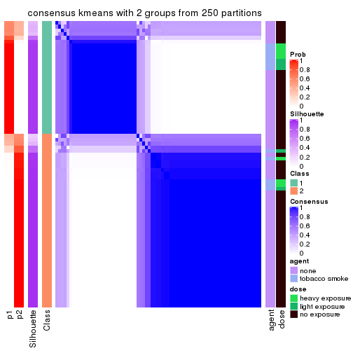</p>

</div>
<div id='tab-SD-kmeans-consensus-heatmap-2'>
<pre><code class="r">consensus_heatmap(res, k = 3)
</code></pre>

<p>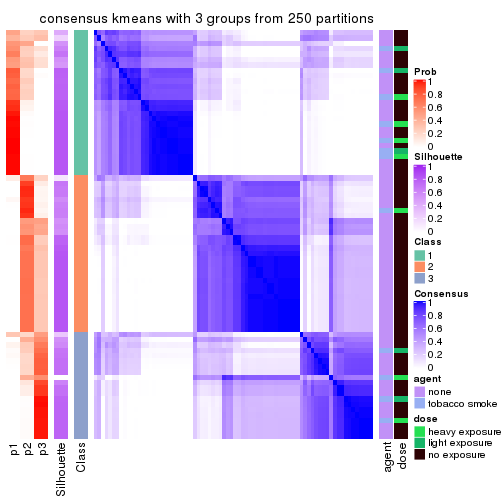</p>

</div>
<div id='tab-SD-kmeans-consensus-heatmap-3'>
<pre><code class="r">consensus_heatmap(res, k = 4)
</code></pre>

<p>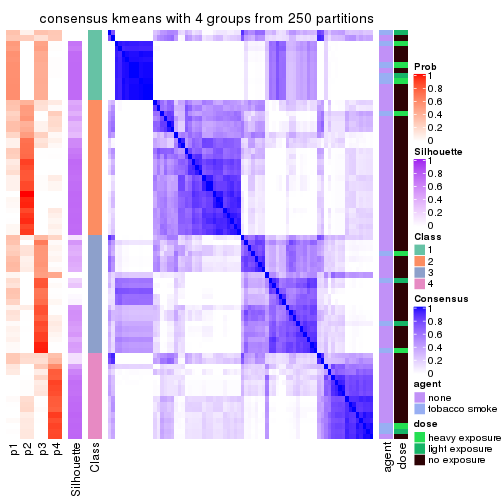</p>

</div>
<div id='tab-SD-kmeans-consensus-heatmap-4'>
<pre><code class="r">consensus_heatmap(res, k = 5)
</code></pre>

<p>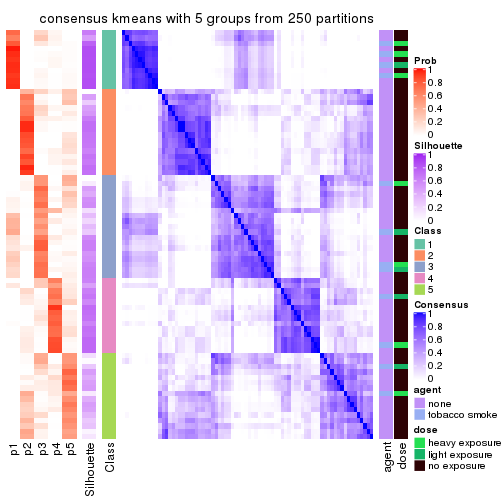</p>

</div>
<div id='tab-SD-kmeans-consensus-heatmap-5'>
<pre><code class="r">consensus_heatmap(res, k = 6)
</code></pre>

<p>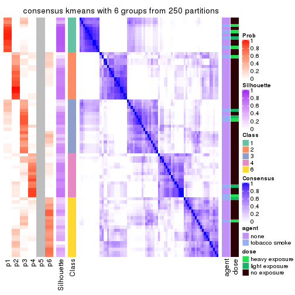</p>

</div>
</div>

Heatmaps for the membership of samples in all partitions to see how consistent they are:


<script>
$( function() {
	$( '#tabs-SD-kmeans-membership-heatmap' ).tabs();
} );
</script>
<div id='tabs-SD-kmeans-membership-heatmap'>
<ul>
<li><a href='#tab-SD-kmeans-membership-heatmap-1'>k = 2</a></li>
<li><a href='#tab-SD-kmeans-membership-heatmap-2'>k = 3</a></li>
<li><a href='#tab-SD-kmeans-membership-heatmap-3'>k = 4</a></li>
<li><a href='#tab-SD-kmeans-membership-heatmap-4'>k = 5</a></li>
<li><a href='#tab-SD-kmeans-membership-heatmap-5'>k = 6</a></li>
</ul>
<div id='tab-SD-kmeans-membership-heatmap-1'>
<pre><code class="r">membership_heatmap(res, k = 2)
</code></pre>

<p>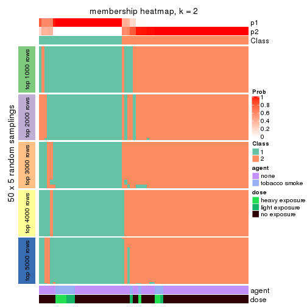</p>

</div>
<div id='tab-SD-kmeans-membership-heatmap-2'>
<pre><code class="r">membership_heatmap(res, k = 3)
</code></pre>

<p>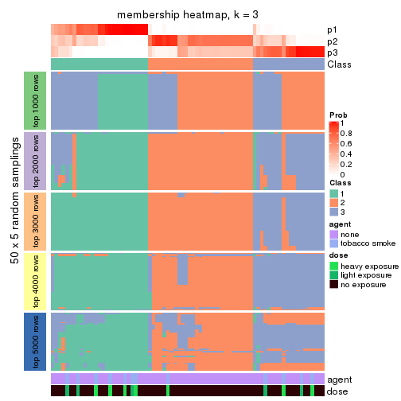</p>

</div>
<div id='tab-SD-kmeans-membership-heatmap-3'>
<pre><code class="r">membership_heatmap(res, k = 4)
</code></pre>

<p>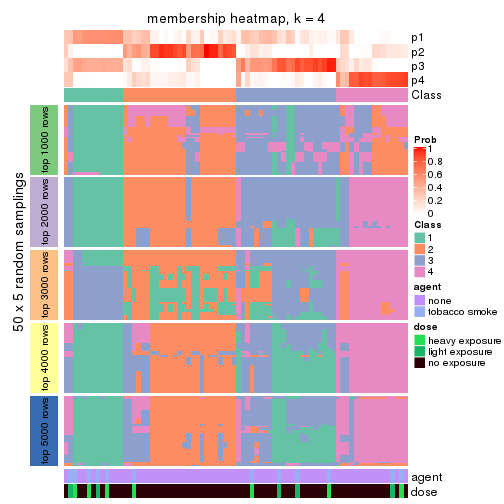</p>

</div>
<div id='tab-SD-kmeans-membership-heatmap-4'>
<pre><code class="r">membership_heatmap(res, k = 5)
</code></pre>

<p>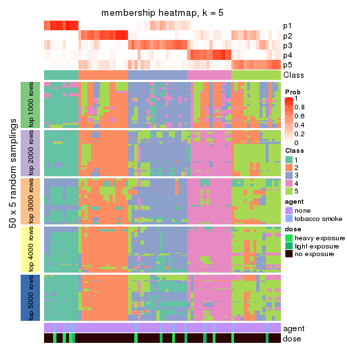</p>

</div>
<div id='tab-SD-kmeans-membership-heatmap-5'>
<pre><code class="r">membership_heatmap(res, k = 6)
</code></pre>

<p>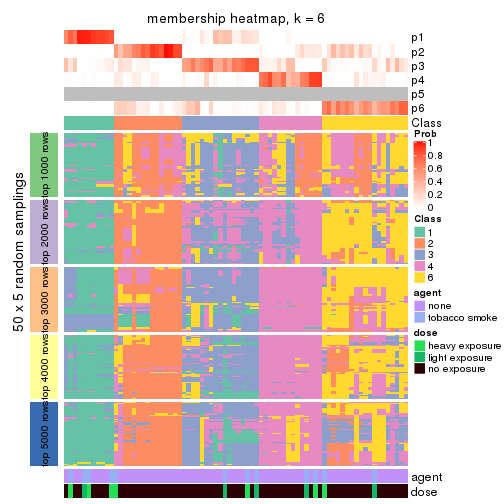</p>

</div>
</div>

As soon as we have had the classes for columns, we can look for signatures
which are significantly different between classes which can be candidate marks
for certain classes. Following are the heatmaps for signatures.


Signature heatmaps where rows are scaled:


<script>
$( function() {
	$( '#tabs-SD-kmeans-get-signatures' ).tabs();
} );
</script>
<div id='tabs-SD-kmeans-get-signatures'>
<ul>
<li><a href='#tab-SD-kmeans-get-signatures-1'>k = 2</a></li>
<li><a href='#tab-SD-kmeans-get-signatures-2'>k = 3</a></li>
<li><a href='#tab-SD-kmeans-get-signatures-3'>k = 4</a></li>
<li><a href='#tab-SD-kmeans-get-signatures-4'>k = 5</a></li>
<li><a href='#tab-SD-kmeans-get-signatures-5'>k = 6</a></li>
</ul>
<div id='tab-SD-kmeans-get-signatures-1'>
<pre><code class="r">get_signatures(res, k = 2)
</code></pre>

<p>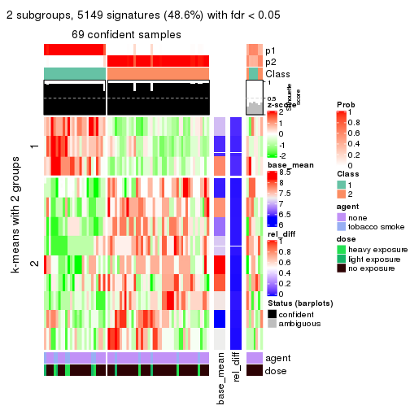</p>

</div>
<div id='tab-SD-kmeans-get-signatures-2'>
<pre><code class="r">get_signatures(res, k = 3)
</code></pre>

<p>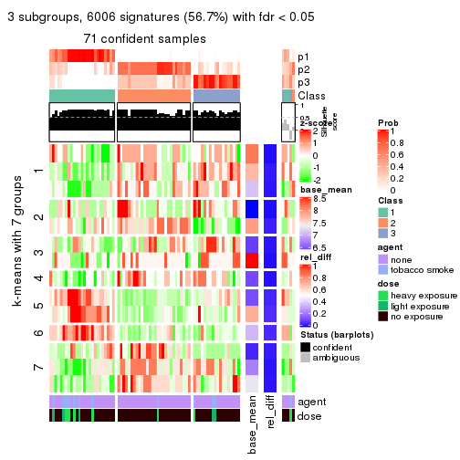</p>

</div>
<div id='tab-SD-kmeans-get-signatures-3'>
<pre><code class="r">get_signatures(res, k = 4)
</code></pre>

<p>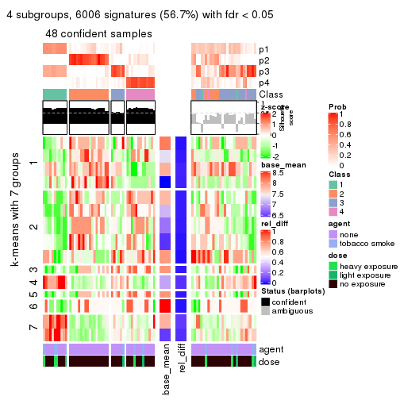</p>

</div>
<div id='tab-SD-kmeans-get-signatures-4'>
<pre><code class="r">get_signatures(res, k = 5)
</code></pre>

<p>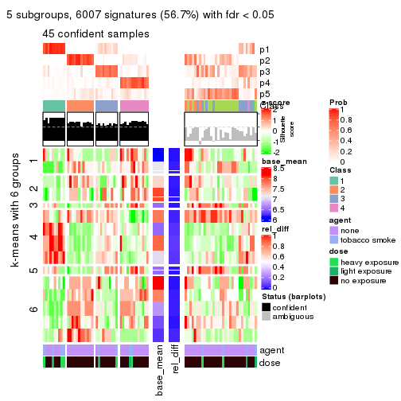</p>

</div>
<div id='tab-SD-kmeans-get-signatures-5'>
<pre><code class="r">get_signatures(res, k = 6)
</code></pre>

<p>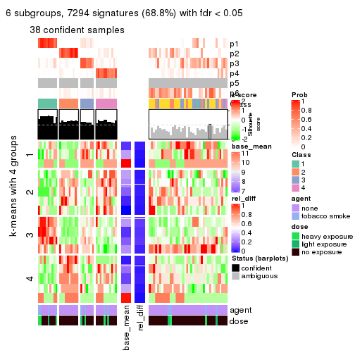</p>

</div>
</div>


Signature heatmaps where rows are not scaled:


<script>
$( function() {
	$( '#tabs-SD-kmeans-get-signatures-no-scale' ).tabs();
} );
</script>
<div id='tabs-SD-kmeans-get-signatures-no-scale'>
<ul>
<li><a href='#tab-SD-kmeans-get-signatures-no-scale-1'>k = 2</a></li>
<li><a href='#tab-SD-kmeans-get-signatures-no-scale-2'>k = 3</a></li>
<li><a href='#tab-SD-kmeans-get-signatures-no-scale-3'>k = 4</a></li>
<li><a href='#tab-SD-kmeans-get-signatures-no-scale-4'>k = 5</a></li>
<li><a href='#tab-SD-kmeans-get-signatures-no-scale-5'>k = 6</a></li>
</ul>
<div id='tab-SD-kmeans-get-signatures-no-scale-1'>
<pre><code class="r">get_signatures(res, k = 2, scale_rows = FALSE)
</code></pre>

<p>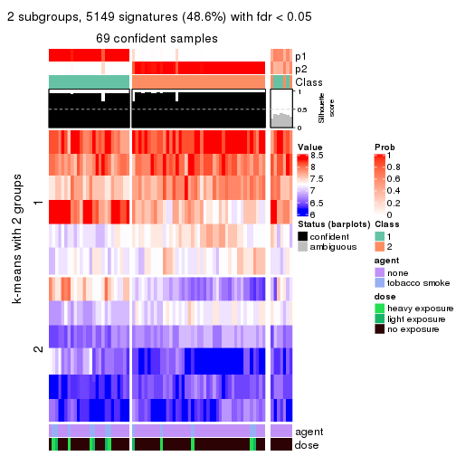</p>

</div>
<div id='tab-SD-kmeans-get-signatures-no-scale-2'>
<pre><code class="r">get_signatures(res, k = 3, scale_rows = FALSE)
</code></pre>

<p>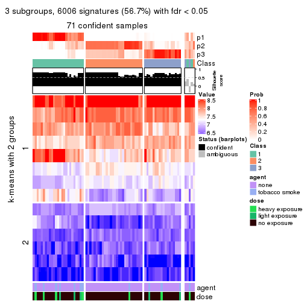</p>

</div>
<div id='tab-SD-kmeans-get-signatures-no-scale-3'>
<pre><code class="r">get_signatures(res, k = 4, scale_rows = FALSE)
</code></pre>

<p>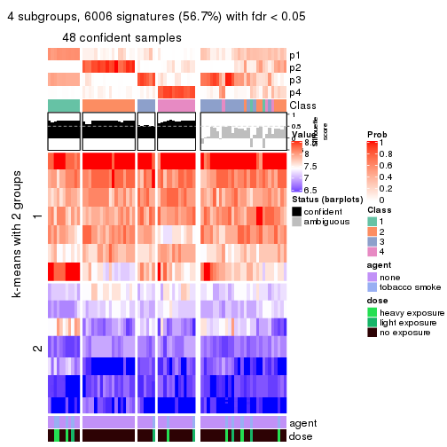</p>

</div>
<div id='tab-SD-kmeans-get-signatures-no-scale-4'>
<pre><code class="r">get_signatures(res, k = 5, scale_rows = FALSE)
</code></pre>

<p>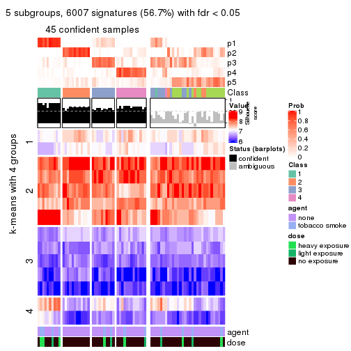</p>

</div>
<div id='tab-SD-kmeans-get-signatures-no-scale-5'>
<pre><code class="r">get_signatures(res, k = 6, scale_rows = FALSE)
</code></pre>

<p>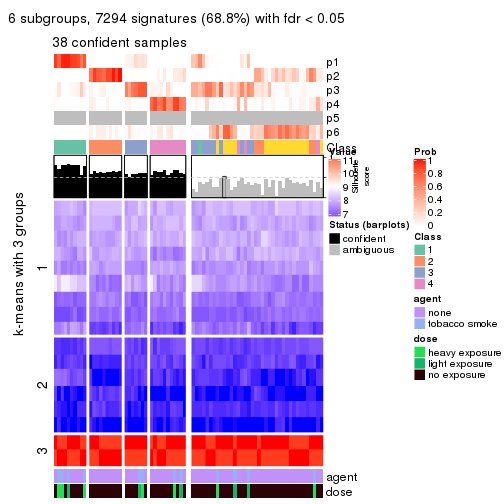</p>

</div>
</div>


Compare the overlap of signatures from different k:

```r
compare_signatures(res)
```

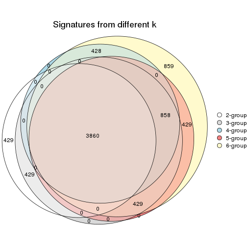

`get_signature()` returns a data frame invisibly. TO get the list of signatures, the function
call should be assigned to a variable explicitly. In following code, if `plot` argument is set
to `FALSE`, no heatmap is plotted while only the differential analysis is performed.

```r
# code only for demonstration
tb = get_signature(res, k = ..., plot = FALSE)
```

An example of the output of `tb` is:

```
#>   which_row         fdr    mean_1    mean_2 scaled_mean_1 scaled_mean_2 km
#> 1        38 0.042760348  8.373488  9.131774    -0.5533452     0.5164555  1
#> 2        40 0.018707592  7.106213  8.469186    -0.6173731     0.5762149  1
#> 3        55 0.019134737 10.221463 11.207825    -0.6159697     0.5749050  1
#> 4        59 0.006059896  5.921854  7.869574    -0.6899429     0.6439467  1
#> 5        60 0.018055526  8.928898 10.211722    -0.6204761     0.5791110  1
#> 6        98 0.009384629 15.714769 14.887706     0.6635654    -0.6193277  2
...
```

The columns in `tb` are:

1. `which_row`: row indices corresponding to the input matrix.
2. `fdr`: FDR for the differential test. 
3. `mean_x`: The mean value in group x.
4. `scaled_mean_x`: The mean value in group x after rows are scaled.
5. `km`: Row groups if k-means clustering is applied to rows.


UMAP plot which shows how samples are separated.


<script>
$( function() {
	$( '#tabs-SD-kmeans-dimension-reduction' ).tabs();
} );
</script>
<div id='tabs-SD-kmeans-dimension-reduction'>
<ul>
<li><a href='#tab-SD-kmeans-dimension-reduction-1'>k = 2</a></li>
<li><a href='#tab-SD-kmeans-dimension-reduction-2'>k = 3</a></li>
<li><a href='#tab-SD-kmeans-dimension-reduction-3'>k = 4</a></li>
<li><a href='#tab-SD-kmeans-dimension-reduction-4'>k = 5</a></li>
<li><a href='#tab-SD-kmeans-dimension-reduction-5'>k = 6</a></li>
</ul>
<div id='tab-SD-kmeans-dimension-reduction-1'>
<pre><code class="r">dimension_reduction(res, k = 2, method = &quot;UMAP&quot;)
</code></pre>

<p>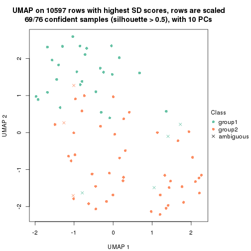</p>

</div>
<div id='tab-SD-kmeans-dimension-reduction-2'>
<pre><code class="r">dimension_reduction(res, k = 3, method = &quot;UMAP&quot;)
</code></pre>

<p>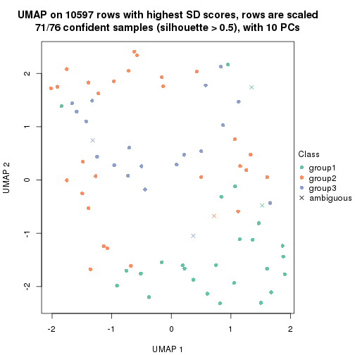</p>

</div>
<div id='tab-SD-kmeans-dimension-reduction-3'>
<pre><code class="r">dimension_reduction(res, k = 4, method = &quot;UMAP&quot;)
</code></pre>

<p>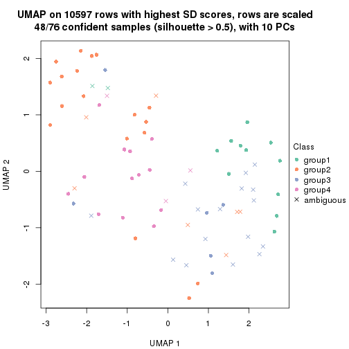</p>

</div>
<div id='tab-SD-kmeans-dimension-reduction-4'>
<pre><code class="r">dimension_reduction(res, k = 5, method = &quot;UMAP&quot;)
</code></pre>

<p>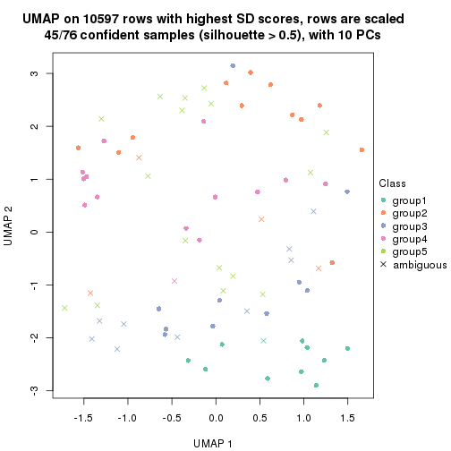</p>

</div>
<div id='tab-SD-kmeans-dimension-reduction-5'>
<pre><code class="r">dimension_reduction(res, k = 6, method = &quot;UMAP&quot;)
</code></pre>

<p>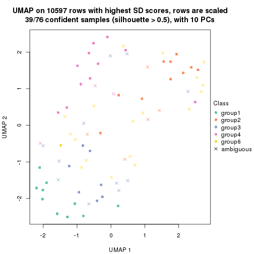</p>

</div>
</div>


Following heatmap shows how subgroups are split when increasing `k`:

```r
collect_classes(res)
```

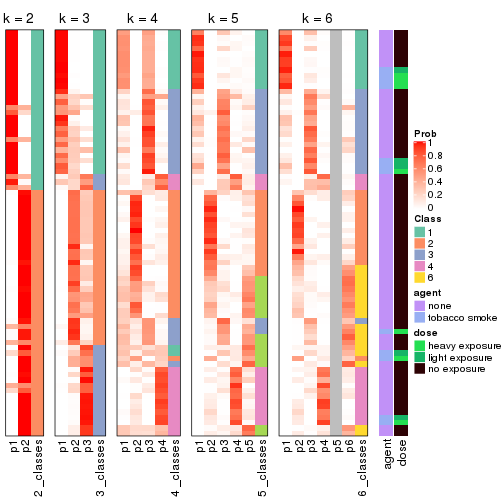


Test correlation between subgroups and known annotations. If the known
annotation is numeric, one-way ANOVA test is applied, and if the known
annotation is discrete, chi-squared contingency table test is applied.

```r
test_to_known_factors(res)
```

```
#>            n agent(p) dose(p) k
#> SD:kmeans 69   0.1948   0.266 2
#> SD:kmeans 71   0.0487   0.144 3
#> SD:kmeans 48   0.0632   0.118 4
#> SD:kmeans 45   0.1088   0.328 5
#> SD:kmeans 39   0.2412   0.613 6
```


If matrix rows can be associated to genes, consider to use `GO_Enrichment(res,
...)` to perform function enrichment for the signature genes.


 

---------------------------------------------------


### SD:skmeans


The object with results only for a single top-value method and a single partition method 
can be extracted as:

```r
res = res_list["SD", "skmeans"]
# you can also extract it by
# res = res_list["SD:skmeans"]
```

A summary of `res` and all the functions that can be applied to it:

```r
res
```

```
#> A 'ConsensusPartition' object with k = 2, 3, 4, 5, 6.
#>   On a matrix with 10597 rows and 76 columns.
#>   Top rows (1000, 2000, 3000, 4000, 5000) are extracted by 'SD' method.
#>   Subgroups are detected by 'skmeans' method.
#>   Performed in total 1250 partitions by row resampling.
#>   Best k for subgroups seems to be 2.
#> 
#> Following methods can be applied to this 'ConsensusPartition' object:
#>  [1] "cola_report"             "collect_classes"         "collect_plots"          
#>  [4] "collect_stats"           "colnames"                "compare_signatures"     
#>  [7] "consensus_heatmap"       "dimension_reduction"     "functional_enrichment"  
#> [10] "get_anno_col"            "get_anno"                "get_classes"            
#> [13] "get_consensus"           "get_matrix"              "get_membership"         
#> [16] "get_param"               "get_signatures"          "get_stats"              
#> [19] "is_best_k"               "is_stable_k"             "membership_heatmap"     
#> [22] "ncol"                    "nrow"                    "plot_ecdf"              
#> [25] "rownames"                "select_partition_number" "show"                   
#> [28] "suggest_best_k"          "test_to_known_factors"
```

`collect_plots()` function collects all the plots made from `res` for all `k` (number of partitions)
into one single page to provide an easy and fast comparison between different `k`.

```r
collect_plots(res)
```

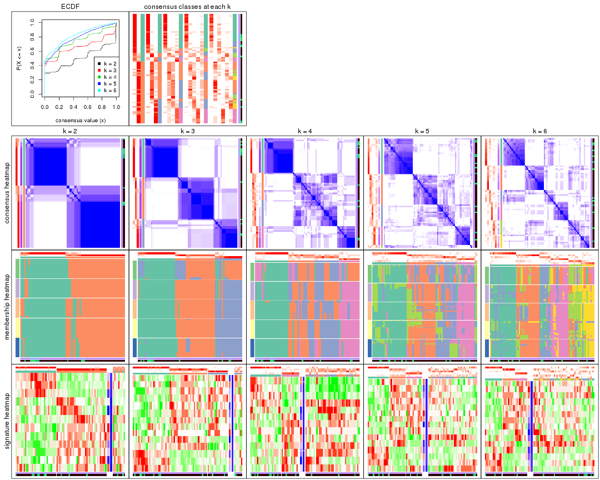

The plots are:

- The first row: a plot of the ECDF (Empirical cumulative distribution
  function) curves of the consensus matrix for each `k` and the heatmap of
  predicted classes for each `k`.
- The second row: heatmaps of the consensus matrix for each `k`.
- The third row: heatmaps of the membership matrix for each `k`.
- The fouth row: heatmaps of the signatures for each `k`.

All the plots in panels can be made by individual functions and they are
plotted later in this section.

`select_partition_number()` produces several plots showing different
statistics for choosing "optimized" `k`. There are following statistics:

- ECDF curves of the consensus matrix for each `k`;
- 1-PAC. [The PAC
  score](https://en.wikipedia.org/wiki/Consensus_clustering#Over-interpretation_potential_of_consensus_clustering)
  measures the proportion of the ambiguous subgrouping.
- Mean silhouette score.
- Concordance. The mean probability of fiting the consensus class ids in all
  partitions.
- Area increased. Denote $A_k$ as the area under the ECDF curve for current
  `k`, the area increased is defined as $A_k - A_{k-1}$.
- Rand index. The percent of pairs of samples that are both in a same cluster
  or both are not in a same cluster in the partition of k and k-1.
- Jaccard index. The ratio of pairs of samples are both in a same cluster in
  the partition of k and k-1 and the pairs of samples are both in a same
  cluster in the partition k or k-1.

The detailed explanations of these statistics can be found in [the cola
vignette](http://bioconductor.org/packages/devel/bioc/vignettes/cola/inst/doc/cola.html#toc_13).

Generally speaking, lower PAC score, higher mean silhouette score or higher
concordance corresponds to better partition. Rand index and Jaccard index
measure how similar the current partition is compared to partition with `k-1`.
If they are too similar, we won't accept `k` is better than `k-1`.

```r
select_partition_number(res)
```

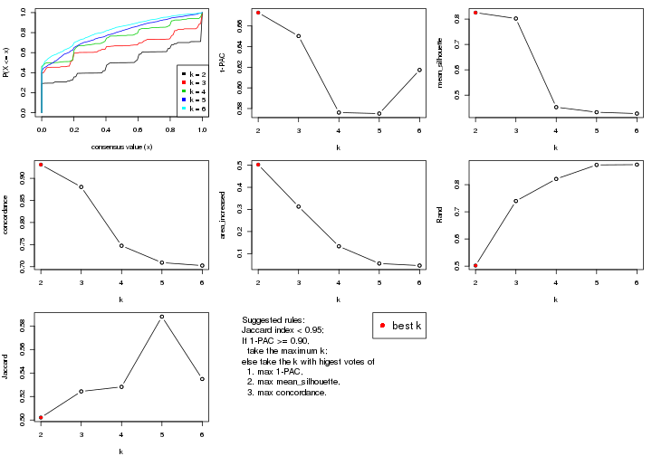

The numeric values for all these statistics can be obtained by `get_stats()`.

```r
get_stats(res)
```

```
#>   k 1-PAC mean_silhouette concordance area_increased  Rand Jaccard
#> 2 2 0.673           0.825       0.931         0.5026 0.502   0.502
#> 3 3 0.650           0.802       0.880         0.3128 0.740   0.524
#> 4 4 0.576           0.453       0.747         0.1332 0.821   0.528
#> 5 5 0.575           0.433       0.709         0.0554 0.873   0.588
#> 6 6 0.617           0.428       0.703         0.0461 0.874   0.535
```

`suggest_best_k()` suggests the best $k$ based on these statistics. The rules are as follows:

- All $k$ with Jaccard index larger than 0.95 are removed because the increase of
  the partition number does not provides enough extra information. If all $k$ are removed,
  the best $k$ is assigned by `NA`.
- For $k$ with 1-PAC larger than 0.9, the maximal $k$ is taken as the "best k". Other $k$ is called "optional k".
- If it does not fit the second rule. The $k$ with the highest vote of highest
  1-PAC, mean silhouette and concordance is taken as the "best k".

```r
suggest_best_k(res)
```

```
#> [1] 2
```


Following shows the table of the partitions (You need to click the **show/hide
code output** link to see it). The membership matrix (columns with name `p*`)
is inferred by
[`clue::cl_consensus()`](https://www.rdocumentation.org/link/cl_consensus?package=clue)
function with the `SE` method. Basically the value in the membership matrix
represents the probability to belong to a certain group. The finall class
label for an item is determined with the group with highest probability it
belongs to.

In `get_classes()` function, the entropy is calculated from the membership
matrix and the silhouette score is calculated from the consensus matrix.


<script>
$( function() {
	$( '#tabs-SD-skmeans-get-classes' ).tabs();
} );
</script>
<div id='tabs-SD-skmeans-get-classes'>
<ul>
<li><a href='#tab-SD-skmeans-get-classes-1'>k = 2</a></li>
<li><a href='#tab-SD-skmeans-get-classes-2'>k = 3</a></li>
<li><a href='#tab-SD-skmeans-get-classes-3'>k = 4</a></li>
<li><a href='#tab-SD-skmeans-get-classes-4'>k = 5</a></li>
<li><a href='#tab-SD-skmeans-get-classes-5'>k = 6</a></li>
</ul>

<div id='tab-SD-skmeans-get-classes-1'>
<p><a id='tab-SD-skmeans-get-classes-1-a' style='color:#0366d6' href='#'>show/hide code output</a></p>
<pre><code class="r">cbind(get_classes(res, k = 2), get_membership(res, k = 2))
</code></pre>

<pre><code>#&gt;           class entropy silhouette    p1    p2
#&gt; GSM451162     1   0.760      0.681 0.780 0.220
#&gt; GSM451163     2   0.000      0.909 0.000 1.000
#&gt; GSM451164     2   0.000      0.909 0.000 1.000
#&gt; GSM451165     2   0.958      0.395 0.380 0.620
#&gt; GSM451167     2   0.000      0.909 0.000 1.000
#&gt; GSM451168     2   0.000      0.909 0.000 1.000
#&gt; GSM451169     1   0.760      0.681 0.780 0.220
#&gt; GSM451170     1   0.000      0.932 1.000 0.000
#&gt; GSM451171     2   0.000      0.909 0.000 1.000
#&gt; GSM451172     2   0.722      0.711 0.200 0.800
#&gt; GSM451173     1   0.000      0.932 1.000 0.000
#&gt; GSM451174     2   0.000      0.909 0.000 1.000
#&gt; GSM451175     1   0.000      0.932 1.000 0.000
#&gt; GSM451177     2   0.000      0.909 0.000 1.000
#&gt; GSM451178     2   0.000      0.909 0.000 1.000
#&gt; GSM451179     1   0.373      0.867 0.928 0.072
#&gt; GSM451180     2   0.000      0.909 0.000 1.000
#&gt; GSM451181     2   0.000      0.909 0.000 1.000
#&gt; GSM451182     1   0.000      0.932 1.000 0.000
#&gt; GSM451183     1   0.000      0.932 1.000 0.000
#&gt; GSM451184     1   0.000      0.932 1.000 0.000
#&gt; GSM451185     1   0.000      0.932 1.000 0.000
#&gt; GSM451186     1   0.958      0.330 0.620 0.380
#&gt; GSM451187     2   0.000      0.909 0.000 1.000
#&gt; GSM451188     2   0.000      0.909 0.000 1.000
#&gt; GSM451189     1   0.000      0.932 1.000 0.000
#&gt; GSM451190     1   0.000      0.932 1.000 0.000
#&gt; GSM451191     1   0.000      0.932 1.000 0.000
#&gt; GSM451193     2   0.971      0.325 0.400 0.600
#&gt; GSM451195     1   0.000      0.932 1.000 0.000
#&gt; GSM451196     1   0.000      0.932 1.000 0.000
#&gt; GSM451197     1   0.000      0.932 1.000 0.000
#&gt; GSM451199     1   0.000      0.932 1.000 0.000
#&gt; GSM451201     1   0.000      0.932 1.000 0.000
#&gt; GSM451202     2   0.000      0.909 0.000 1.000
#&gt; GSM451203     1   0.000      0.932 1.000 0.000
#&gt; GSM451204     2   0.000      0.909 0.000 1.000
#&gt; GSM451205     2   0.000      0.909 0.000 1.000
#&gt; GSM451206     2   0.000      0.909 0.000 1.000
#&gt; GSM451207     2   0.000      0.909 0.000 1.000
#&gt; GSM451208     2   0.000      0.909 0.000 1.000
#&gt; GSM451209     2   0.722      0.709 0.200 0.800
#&gt; GSM451210     2   0.000      0.909 0.000 1.000
#&gt; GSM451212     2   0.000      0.909 0.000 1.000
#&gt; GSM451213     2   0.000      0.909 0.000 1.000
#&gt; GSM451214     2   0.680      0.735 0.180 0.820
#&gt; GSM451215     2   0.000      0.909 0.000 1.000
#&gt; GSM451216     2   0.000      0.909 0.000 1.000
#&gt; GSM451217     2   0.000      0.909 0.000 1.000
#&gt; GSM451219     1   0.000      0.932 1.000 0.000
#&gt; GSM451220     1   0.000      0.932 1.000 0.000
#&gt; GSM451221     1   0.000      0.932 1.000 0.000
#&gt; GSM451222     1   0.706      0.716 0.808 0.192
#&gt; GSM451224     2   0.000      0.909 0.000 1.000
#&gt; GSM451225     2   0.981      0.276 0.420 0.580
#&gt; GSM451226     2   0.971      0.331 0.400 0.600
#&gt; GSM451227     2   0.978      0.299 0.412 0.588
#&gt; GSM451228     2   0.615      0.771 0.152 0.848
#&gt; GSM451230     1   0.971      0.297 0.600 0.400
#&gt; GSM451231     2   0.760      0.685 0.220 0.780
#&gt; GSM451233     2   0.000      0.909 0.000 1.000
#&gt; GSM451234     2   0.000      0.909 0.000 1.000
#&gt; GSM451235     2   0.000      0.909 0.000 1.000
#&gt; GSM451236     2   0.000      0.909 0.000 1.000
#&gt; GSM451166     2   0.971      0.327 0.400 0.600
#&gt; GSM451194     1   0.000      0.932 1.000 0.000
#&gt; GSM451198     1   0.000      0.932 1.000 0.000
#&gt; GSM451218     2   0.000      0.909 0.000 1.000
#&gt; GSM451232     1   0.000      0.932 1.000 0.000
#&gt; GSM451176     1   0.000      0.932 1.000 0.000
#&gt; GSM451192     1   0.000      0.932 1.000 0.000
#&gt; GSM451200     1   0.000      0.932 1.000 0.000
#&gt; GSM451211     2   0.000      0.909 0.000 1.000
#&gt; GSM451223     1   0.971      0.279 0.600 0.400
#&gt; GSM451229     1   0.000      0.932 1.000 0.000
#&gt; GSM451237     2   0.000      0.909 0.000 1.000
</code></pre>

<script>
$('#tab-SD-skmeans-get-classes-1-a').parent().next().next().hide();
$('#tab-SD-skmeans-get-classes-1-a').click(function(){
  $('#tab-SD-skmeans-get-classes-1-a').parent().next().next().toggle();
  return(false);
});
</script>
</div>

<div id='tab-SD-skmeans-get-classes-2'>
<p><a id='tab-SD-skmeans-get-classes-2-a' style='color:#0366d6' href='#'>show/hide code output</a></p>
<pre><code class="r">cbind(get_classes(res, k = 3), get_membership(res, k = 3))
</code></pre>

<pre><code>#&gt;           class entropy silhouette    p1    p2    p3
#&gt; GSM451162     2   0.440      0.601 0.188 0.812 0.000
#&gt; GSM451163     2   0.000      0.768 0.000 1.000 0.000
#&gt; GSM451164     2   0.418      0.866 0.000 0.828 0.172
#&gt; GSM451165     2   0.512      0.861 0.012 0.788 0.200
#&gt; GSM451167     2   0.000      0.768 0.000 1.000 0.000
#&gt; GSM451168     2   0.455      0.865 0.000 0.800 0.200
#&gt; GSM451169     2   0.000      0.768 0.000 1.000 0.000
#&gt; GSM451170     1   0.000      0.948 1.000 0.000 0.000
#&gt; GSM451171     2   0.418      0.866 0.000 0.828 0.172
#&gt; GSM451172     2   0.475      0.864 0.012 0.816 0.172
#&gt; GSM451173     1   0.327      0.824 0.884 0.000 0.116
#&gt; GSM451174     2   0.590      0.702 0.000 0.648 0.352
#&gt; GSM451175     1   0.000      0.948 1.000 0.000 0.000
#&gt; GSM451177     2   0.455      0.865 0.000 0.800 0.200
#&gt; GSM451178     2   0.590      0.702 0.000 0.648 0.352
#&gt; GSM451179     1   0.153      0.915 0.960 0.000 0.040
#&gt; GSM451180     2   0.418      0.866 0.000 0.828 0.172
#&gt; GSM451181     2   0.418      0.866 0.000 0.828 0.172
#&gt; GSM451182     1   0.000      0.948 1.000 0.000 0.000
#&gt; GSM451183     1   0.000      0.948 1.000 0.000 0.000
#&gt; GSM451184     1   0.601      0.523 0.628 0.372 0.000
#&gt; GSM451185     1   0.000      0.948 1.000 0.000 0.000
#&gt; GSM451186     3   0.601      0.429 0.372 0.000 0.628
#&gt; GSM451187     2   0.418      0.866 0.000 0.828 0.172
#&gt; GSM451188     2   0.455      0.865 0.000 0.800 0.200
#&gt; GSM451189     1   0.000      0.948 1.000 0.000 0.000
#&gt; GSM451190     1   0.000      0.948 1.000 0.000 0.000
#&gt; GSM451191     1   0.000      0.948 1.000 0.000 0.000
#&gt; GSM451193     2   0.613      0.101 0.400 0.600 0.000
#&gt; GSM451195     1   0.000      0.948 1.000 0.000 0.000
#&gt; GSM451196     1   0.000      0.948 1.000 0.000 0.000
#&gt; GSM451197     1   0.000      0.948 1.000 0.000 0.000
#&gt; GSM451199     1   0.000      0.948 1.000 0.000 0.000
#&gt; GSM451201     1   0.000      0.948 1.000 0.000 0.000
#&gt; GSM451202     2   0.455      0.865 0.000 0.800 0.200
#&gt; GSM451203     1   0.435      0.810 0.816 0.184 0.000
#&gt; GSM451204     3   0.000      0.835 0.000 0.000 1.000
#&gt; GSM451205     2   0.418      0.866 0.000 0.828 0.172
#&gt; GSM451206     2   0.590      0.702 0.000 0.648 0.352
#&gt; GSM451207     3   0.116      0.824 0.000 0.028 0.972
#&gt; GSM451208     2   0.455      0.865 0.000 0.800 0.200
#&gt; GSM451209     3   0.000      0.835 0.000 0.000 1.000
#&gt; GSM451210     2   0.455      0.865 0.000 0.800 0.200
#&gt; GSM451212     3   0.116      0.824 0.000 0.028 0.972
#&gt; GSM451213     3   0.000      0.835 0.000 0.000 1.000
#&gt; GSM451214     2   0.000      0.768 0.000 1.000 0.000
#&gt; GSM451215     2   0.455      0.865 0.000 0.800 0.200
#&gt; GSM451216     3   0.000      0.835 0.000 0.000 1.000
#&gt; GSM451217     2   0.418      0.866 0.000 0.828 0.172
#&gt; GSM451219     1   0.000      0.948 1.000 0.000 0.000
#&gt; GSM451220     1   0.418      0.819 0.828 0.172 0.000
#&gt; GSM451221     1   0.000      0.948 1.000 0.000 0.000
#&gt; GSM451222     3   0.613      0.408 0.400 0.000 0.600
#&gt; GSM451224     2   0.455      0.865 0.000 0.800 0.200
#&gt; GSM451225     3   0.455      0.689 0.200 0.000 0.800
#&gt; GSM451226     2   0.455      0.553 0.200 0.800 0.000
#&gt; GSM451227     2   0.455      0.865 0.000 0.800 0.200
#&gt; GSM451228     3   0.613      0.494 0.000 0.400 0.600
#&gt; GSM451230     3   0.529      0.706 0.028 0.172 0.800
#&gt; GSM451231     3   0.000      0.835 0.000 0.000 1.000
#&gt; GSM451233     3   0.116      0.824 0.000 0.028 0.972
#&gt; GSM451234     3   0.000      0.835 0.000 0.000 1.000
#&gt; GSM451235     3   0.000      0.835 0.000 0.000 1.000
#&gt; GSM451236     3   0.000      0.835 0.000 0.000 1.000
#&gt; GSM451166     3   0.613      0.408 0.400 0.000 0.600
#&gt; GSM451194     1   0.000      0.948 1.000 0.000 0.000
#&gt; GSM451198     1   0.418      0.819 0.828 0.172 0.000
#&gt; GSM451218     3   0.000      0.835 0.000 0.000 1.000
#&gt; GSM451232     1   0.000      0.948 1.000 0.000 0.000
#&gt; GSM451176     1   0.000      0.948 1.000 0.000 0.000
#&gt; GSM451192     1   0.000      0.948 1.000 0.000 0.000
#&gt; GSM451200     1   0.418      0.819 0.828 0.172 0.000
#&gt; GSM451211     3   0.627     -0.264 0.000 0.452 0.548
#&gt; GSM451223     2   0.000      0.768 0.000 1.000 0.000
#&gt; GSM451229     1   0.000      0.948 1.000 0.000 0.000
#&gt; GSM451237     3   0.000      0.835 0.000 0.000 1.000
</code></pre>

<script>
$('#tab-SD-skmeans-get-classes-2-a').parent().next().next().hide();
$('#tab-SD-skmeans-get-classes-2-a').click(function(){
  $('#tab-SD-skmeans-get-classes-2-a').parent().next().next().toggle();
  return(false);
});
</script>
</div>

<div id='tab-SD-skmeans-get-classes-3'>
<p><a id='tab-SD-skmeans-get-classes-3-a' style='color:#0366d6' href='#'>show/hide code output</a></p>
<pre><code class="r">cbind(get_classes(res, k = 4), get_membership(res, k = 4))
</code></pre>

<pre><code>#&gt;           class entropy silhouette    p1    p2    p3    p4
#&gt; GSM451162     2  0.5356     0.2045 0.000 0.728 0.072 0.200
#&gt; GSM451163     2  0.4916    -0.2074 0.000 0.576 0.424 0.000
#&gt; GSM451164     3  0.4790     0.3485 0.000 0.380 0.620 0.000
#&gt; GSM451165     2  0.0000     0.1876 0.000 1.000 0.000 0.000
#&gt; GSM451167     3  0.0000     0.2556 0.000 0.000 1.000 0.000
#&gt; GSM451168     2  0.6918    -0.2216 0.000 0.472 0.420 0.108
#&gt; GSM451169     2  0.6975     0.2115 0.000 0.584 0.216 0.200
#&gt; GSM451170     1  0.0000     0.9101 1.000 0.000 0.000 0.000
#&gt; GSM451171     3  0.3610     0.3733 0.000 0.200 0.800 0.000
#&gt; GSM451172     2  0.3801     0.0693 0.000 0.780 0.220 0.000
#&gt; GSM451173     4  0.3873     0.4757 0.228 0.000 0.000 0.772
#&gt; GSM451174     2  0.4855     0.2278 0.000 0.600 0.400 0.000
#&gt; GSM451175     1  0.0000     0.9101 1.000 0.000 0.000 0.000
#&gt; GSM451177     3  0.4985     0.2268 0.000 0.468 0.532 0.000
#&gt; GSM451178     2  0.4855     0.2278 0.000 0.600 0.400 0.000
#&gt; GSM451179     1  0.6855     0.4408 0.600 0.200 0.200 0.000
#&gt; GSM451180     3  0.3610     0.3733 0.000 0.200 0.800 0.000
#&gt; GSM451181     3  0.3266     0.2659 0.000 0.168 0.832 0.000
#&gt; GSM451182     1  0.0000     0.9101 1.000 0.000 0.000 0.000
#&gt; GSM451183     1  0.0000     0.9101 1.000 0.000 0.000 0.000
#&gt; GSM451184     2  0.7610    -0.1242 0.400 0.400 0.000 0.200
#&gt; GSM451185     1  0.0000     0.9101 1.000 0.000 0.000 0.000
#&gt; GSM451186     4  0.5587     0.4090 0.372 0.028 0.000 0.600
#&gt; GSM451187     2  0.4855     0.0686 0.000 0.600 0.400 0.000
#&gt; GSM451188     2  0.4855    -0.2044 0.000 0.600 0.400 0.000
#&gt; GSM451189     1  0.0000     0.9101 1.000 0.000 0.000 0.000
#&gt; GSM451190     1  0.2542     0.8656 0.904 0.012 0.000 0.084
#&gt; GSM451191     1  0.0592     0.9028 0.984 0.016 0.000 0.000
#&gt; GSM451193     2  0.4898     0.1205 0.000 0.584 0.416 0.000
#&gt; GSM451195     1  0.3610     0.7893 0.800 0.000 0.000 0.200
#&gt; GSM451196     1  0.0000     0.9101 1.000 0.000 0.000 0.000
#&gt; GSM451197     1  0.0000     0.9101 1.000 0.000 0.000 0.000
#&gt; GSM451199     1  0.0000     0.9101 1.000 0.000 0.000 0.000
#&gt; GSM451201     1  0.0000     0.9101 1.000 0.000 0.000 0.000
#&gt; GSM451202     3  0.4989     0.2247 0.000 0.472 0.528 0.000
#&gt; GSM451203     1  0.6823     0.5771 0.604 0.000 0.196 0.200
#&gt; GSM451204     4  0.3610     0.7813 0.000 0.200 0.000 0.800
#&gt; GSM451205     3  0.4193     0.3776 0.000 0.268 0.732 0.000
#&gt; GSM451206     2  0.4855     0.2278 0.000 0.600 0.400 0.000
#&gt; GSM451207     3  0.6975    -0.0826 0.000 0.200 0.584 0.216
#&gt; GSM451208     3  0.4855     0.2306 0.000 0.400 0.600 0.000
#&gt; GSM451209     4  0.3610     0.7813 0.000 0.200 0.000 0.800
#&gt; GSM451210     2  0.4888    -0.2133 0.000 0.588 0.412 0.000
#&gt; GSM451212     3  0.6975    -0.0826 0.000 0.200 0.584 0.216
#&gt; GSM451213     2  0.7683     0.0791 0.000 0.400 0.384 0.216
#&gt; GSM451214     3  0.4855     0.3417 0.000 0.400 0.600 0.000
#&gt; GSM451215     3  0.4855     0.2306 0.000 0.400 0.600 0.000
#&gt; GSM451216     4  0.6686     0.6126 0.000 0.200 0.180 0.620
#&gt; GSM451217     3  0.4790     0.3490 0.000 0.380 0.620 0.000
#&gt; GSM451219     1  0.0592     0.9028 0.984 0.016 0.000 0.000
#&gt; GSM451220     2  0.9609     0.1794 0.204 0.400 0.196 0.200
#&gt; GSM451221     1  0.0707     0.9005 0.980 0.020 0.000 0.000
#&gt; GSM451222     4  0.3649     0.5270 0.204 0.000 0.000 0.796
#&gt; GSM451224     2  0.4855    -0.2044 0.000 0.600 0.400 0.000
#&gt; GSM451225     4  0.3610     0.6626 0.200 0.000 0.000 0.800
#&gt; GSM451226     3  0.5028     0.3402 0.000 0.400 0.596 0.004
#&gt; GSM451227     2  0.4855    -0.2044 0.000 0.600 0.400 0.000
#&gt; GSM451228     3  0.4855    -0.1722 0.000 0.400 0.600 0.000
#&gt; GSM451230     4  0.0000     0.6674 0.000 0.000 0.000 1.000
#&gt; GSM451231     4  0.3610     0.7813 0.000 0.200 0.000 0.800
#&gt; GSM451233     4  0.3610     0.6147 0.000 0.000 0.200 0.800
#&gt; GSM451234     4  0.3610     0.7813 0.000 0.200 0.000 0.800
#&gt; GSM451235     4  0.3610     0.7813 0.000 0.200 0.000 0.800
#&gt; GSM451236     4  0.6686     0.6126 0.000 0.200 0.180 0.620
#&gt; GSM451166     3  0.9684    -0.1525 0.200 0.212 0.384 0.204
#&gt; GSM451194     1  0.3569     0.6959 0.804 0.000 0.000 0.196
#&gt; GSM451198     1  0.3610     0.7893 0.800 0.000 0.000 0.200
#&gt; GSM451218     4  0.3610     0.7813 0.000 0.200 0.000 0.800
#&gt; GSM451232     1  0.0000     0.9101 1.000 0.000 0.000 0.000
#&gt; GSM451176     1  0.0000     0.9101 1.000 0.000 0.000 0.000
#&gt; GSM451192     1  0.3569     0.7922 0.804 0.000 0.000 0.196
#&gt; GSM451200     1  0.3610     0.7893 0.800 0.000 0.000 0.200
#&gt; GSM451211     2  0.3610     0.1798 0.000 0.800 0.200 0.000
#&gt; GSM451223     3  0.4830     0.0268 0.000 0.392 0.608 0.000
#&gt; GSM451229     1  0.0000     0.9101 1.000 0.000 0.000 0.000
#&gt; GSM451237     4  0.3610     0.7813 0.000 0.200 0.000 0.800
</code></pre>

<script>
$('#tab-SD-skmeans-get-classes-3-a').parent().next().next().hide();
$('#tab-SD-skmeans-get-classes-3-a').click(function(){
  $('#tab-SD-skmeans-get-classes-3-a').parent().next().next().toggle();
  return(false);
});
</script>
</div>

<div id='tab-SD-skmeans-get-classes-4'>
<p><a id='tab-SD-skmeans-get-classes-4-a' style='color:#0366d6' href='#'>show/hide code output</a></p>
<pre><code class="r">cbind(get_classes(res, k = 5), get_membership(res, k = 5))
</code></pre>

<pre><code>#&gt;           class entropy silhouette    p1    p2    p3    p4    p5
#&gt; GSM451162     3  0.6774    -0.1575 0.000 0.288 0.392 0.000 0.320
#&gt; GSM451163     2  0.6287     0.2284 0.000 0.536 0.240 0.000 0.224
#&gt; GSM451164     2  0.4197     0.5010 0.000 0.728 0.028 0.000 0.244
#&gt; GSM451165     3  0.7864     0.0324 0.000 0.272 0.396 0.076 0.256
#&gt; GSM451167     2  0.5987     0.1886 0.000 0.544 0.324 0.000 0.132
#&gt; GSM451168     2  0.7614     0.5402 0.000 0.432 0.136 0.096 0.336
#&gt; GSM451169     3  0.6448     0.1164 0.000 0.272 0.500 0.000 0.228
#&gt; GSM451170     1  0.0290     0.7252 0.992 0.000 0.000 0.000 0.008
#&gt; GSM451171     2  0.5964     0.5454 0.000 0.536 0.124 0.000 0.340
#&gt; GSM451172     3  0.6802     0.0643 0.000 0.352 0.356 0.000 0.292
#&gt; GSM451173     1  0.6322     0.0894 0.500 0.000 0.000 0.324 0.176
#&gt; GSM451174     3  0.3597     0.3373 0.000 0.012 0.800 0.008 0.180
#&gt; GSM451175     1  0.2605     0.5973 0.852 0.000 0.000 0.000 0.148
#&gt; GSM451177     2  0.6626     0.5485 0.000 0.432 0.228 0.000 0.340
#&gt; GSM451178     3  0.0000     0.4662 0.000 0.000 1.000 0.000 0.000
#&gt; GSM451179     1  0.7718     0.0670 0.528 0.020 0.200 0.172 0.080
#&gt; GSM451180     2  0.6166     0.5495 0.000 0.512 0.148 0.000 0.340
#&gt; GSM451181     2  0.6131     0.2336 0.000 0.548 0.352 0.028 0.072
#&gt; GSM451182     1  0.0794     0.7216 0.972 0.000 0.000 0.000 0.028
#&gt; GSM451183     1  0.0703     0.7218 0.976 0.000 0.000 0.000 0.024
#&gt; GSM451184     5  0.6667     0.3487 0.232 0.364 0.000 0.000 0.404
#&gt; GSM451185     1  0.0865     0.7207 0.972 0.004 0.000 0.000 0.024
#&gt; GSM451186     4  0.3387     0.5255 0.196 0.000 0.004 0.796 0.004
#&gt; GSM451187     2  0.6815     0.1462 0.000 0.356 0.308 0.000 0.336
#&gt; GSM451188     2  0.5335     0.5279 0.000 0.668 0.200 0.000 0.132
#&gt; GSM451189     1  0.0000     0.7248 1.000 0.000 0.000 0.000 0.000
#&gt; GSM451190     1  0.4797     0.5009 0.724 0.172 0.000 0.000 0.104
#&gt; GSM451191     1  0.5864     0.2077 0.600 0.236 0.000 0.000 0.164
#&gt; GSM451193     3  0.6731     0.1655 0.008 0.280 0.484 0.000 0.228
#&gt; GSM451195     1  0.3949     0.4059 0.668 0.000 0.000 0.000 0.332
#&gt; GSM451196     1  0.0290     0.7248 0.992 0.000 0.000 0.000 0.008
#&gt; GSM451197     1  0.1544     0.7078 0.932 0.000 0.000 0.000 0.068
#&gt; GSM451199     1  0.1764     0.7112 0.928 0.008 0.000 0.000 0.064
#&gt; GSM451201     1  0.0963     0.7172 0.964 0.000 0.000 0.000 0.036
#&gt; GSM451202     2  0.6842     0.5488 0.000 0.432 0.220 0.008 0.340
#&gt; GSM451203     1  0.7052    -0.0222 0.500 0.052 0.136 0.000 0.312
#&gt; GSM451204     4  0.2852     0.7560 0.000 0.000 0.172 0.828 0.000
#&gt; GSM451205     2  0.4703     0.5274 0.000 0.632 0.028 0.000 0.340
#&gt; GSM451206     3  0.3675     0.3159 0.000 0.024 0.788 0.000 0.188
#&gt; GSM451207     3  0.6216     0.4349 0.000 0.096 0.660 0.084 0.160
#&gt; GSM451208     2  0.6903     0.5413 0.000 0.416 0.236 0.008 0.340
#&gt; GSM451209     4  0.2852     0.7560 0.000 0.000 0.172 0.828 0.000
#&gt; GSM451210     2  0.5728     0.5487 0.000 0.624 0.200 0.000 0.176
#&gt; GSM451212     3  0.6181     0.4362 0.000 0.096 0.664 0.084 0.156
#&gt; GSM451213     3  0.4035     0.4209 0.000 0.000 0.784 0.060 0.156
#&gt; GSM451214     2  0.0703     0.3877 0.000 0.976 0.000 0.000 0.024
#&gt; GSM451215     2  0.6685     0.5403 0.000 0.416 0.244 0.000 0.340
#&gt; GSM451216     3  0.6308    -0.2854 0.000 0.000 0.456 0.388 0.156
#&gt; GSM451217     2  0.6243     0.5420 0.000 0.544 0.240 0.000 0.216
#&gt; GSM451219     1  0.5285     0.2950 0.632 0.288 0.000 0.000 0.080
#&gt; GSM451220     5  0.6646     0.3024 0.224 0.000 0.380 0.000 0.396
#&gt; GSM451221     1  0.6071     0.1547 0.572 0.236 0.000 0.000 0.192
#&gt; GSM451222     4  0.6634     0.2212 0.260 0.000 0.000 0.452 0.288
#&gt; GSM451224     2  0.3387     0.4389 0.000 0.796 0.196 0.004 0.004
#&gt; GSM451225     4  0.2074     0.6945 0.104 0.000 0.000 0.896 0.000
#&gt; GSM451226     2  0.6131    -0.2816 0.008 0.584 0.004 0.120 0.284
#&gt; GSM451227     2  0.4447     0.3511 0.000 0.768 0.028 0.172 0.032
#&gt; GSM451228     3  0.3652     0.3928 0.000 0.200 0.784 0.004 0.012
#&gt; GSM451230     4  0.3636     0.6170 0.000 0.000 0.000 0.728 0.272
#&gt; GSM451231     4  0.1792     0.7476 0.000 0.000 0.084 0.916 0.000
#&gt; GSM451233     4  0.3586     0.7063 0.000 0.096 0.076 0.828 0.000
#&gt; GSM451234     4  0.2329     0.7513 0.000 0.000 0.124 0.876 0.000
#&gt; GSM451235     4  0.3109     0.7432 0.000 0.000 0.200 0.800 0.000
#&gt; GSM451236     4  0.4367     0.5078 0.000 0.000 0.416 0.580 0.004
#&gt; GSM451166     3  0.6424     0.2175 0.200 0.000 0.608 0.036 0.156
#&gt; GSM451194     1  0.2773     0.6188 0.836 0.000 0.000 0.000 0.164
#&gt; GSM451198     1  0.3730     0.4773 0.712 0.000 0.000 0.000 0.288
#&gt; GSM451218     4  0.5739     0.5879 0.000 0.000 0.280 0.596 0.124
#&gt; GSM451232     1  0.0000     0.7248 1.000 0.000 0.000 0.000 0.000
#&gt; GSM451176     1  0.0404     0.7252 0.988 0.000 0.000 0.000 0.012
#&gt; GSM451192     1  0.2516     0.6438 0.860 0.000 0.000 0.000 0.140
#&gt; GSM451200     1  0.4171     0.2567 0.604 0.000 0.000 0.000 0.396
#&gt; GSM451211     3  0.5710    -0.0310 0.000 0.076 0.576 0.008 0.340
#&gt; GSM451223     2  0.6442    -0.1399 0.000 0.508 0.364 0.024 0.104
#&gt; GSM451229     1  0.0880     0.7212 0.968 0.000 0.000 0.000 0.032
#&gt; GSM451237     4  0.2329     0.7513 0.000 0.000 0.124 0.876 0.000
</code></pre>

<script>
$('#tab-SD-skmeans-get-classes-4-a').parent().next().next().hide();
$('#tab-SD-skmeans-get-classes-4-a').click(function(){
  $('#tab-SD-skmeans-get-classes-4-a').parent().next().next().toggle();
  return(false);
});
</script>
</div>

<div id='tab-SD-skmeans-get-classes-5'>
<p><a id='tab-SD-skmeans-get-classes-5-a' style='color:#0366d6' href='#'>show/hide code output</a></p>
<pre><code class="r">cbind(get_classes(res, k = 6), get_membership(res, k = 6))
</code></pre>

<pre><code>#&gt;           class entropy silhouette    p1    p2    p3    p4    p5    p6
#&gt; GSM451162     5  0.4961     0.3168 0.000 0.008 0.348 0.000 0.584 0.060
#&gt; GSM451163     5  0.3271     0.4314 0.000 0.232 0.008 0.000 0.760 0.000
#&gt; GSM451164     5  0.4556     0.0223 0.000 0.456 0.008 0.000 0.516 0.020
#&gt; GSM451165     2  0.6971     0.0757 0.000 0.392 0.336 0.008 0.216 0.048
#&gt; GSM451167     5  0.5016     0.3751 0.000 0.324 0.000 0.000 0.584 0.092
#&gt; GSM451168     2  0.0260     0.6590 0.000 0.992 0.000 0.008 0.000 0.000
#&gt; GSM451169     5  0.1908     0.4905 0.000 0.000 0.004 0.000 0.900 0.096
#&gt; GSM451170     1  0.1462     0.6973 0.936 0.000 0.056 0.000 0.000 0.008
#&gt; GSM451171     2  0.2536     0.5644 0.000 0.864 0.000 0.000 0.116 0.020
#&gt; GSM451172     5  0.5859     0.4837 0.000 0.152 0.160 0.000 0.624 0.064
#&gt; GSM451173     3  0.5972     0.2800 0.268 0.000 0.448 0.284 0.000 0.000
#&gt; GSM451174     6  0.6544     0.3613 0.000 0.288 0.016 0.008 0.252 0.436
#&gt; GSM451175     1  0.3920     0.4786 0.736 0.000 0.048 0.000 0.000 0.216
#&gt; GSM451177     2  0.0000     0.6583 0.000 1.000 0.000 0.000 0.000 0.000
#&gt; GSM451178     6  0.5868     0.4086 0.000 0.200 0.016 0.000 0.228 0.556
#&gt; GSM451179     6  0.8494    -0.2810 0.272 0.000 0.184 0.088 0.144 0.312
#&gt; GSM451180     2  0.0692     0.6506 0.000 0.976 0.000 0.000 0.004 0.020
#&gt; GSM451181     5  0.7750     0.2198 0.000 0.280 0.020 0.104 0.328 0.268
#&gt; GSM451182     1  0.2212     0.6752 0.880 0.000 0.112 0.000 0.000 0.008
#&gt; GSM451183     1  0.0547     0.7016 0.980 0.000 0.020 0.000 0.000 0.000
#&gt; GSM451184     3  0.4062     0.3027 0.068 0.056 0.796 0.000 0.080 0.000
#&gt; GSM451185     1  0.1556     0.6920 0.920 0.000 0.080 0.000 0.000 0.000
#&gt; GSM451186     4  0.4840     0.5518 0.112 0.000 0.048 0.728 0.000 0.112
#&gt; GSM451187     2  0.4882     0.1533 0.000 0.568 0.016 0.000 0.380 0.036
#&gt; GSM451188     2  0.4156     0.5589 0.000 0.732 0.188 0.000 0.080 0.000
#&gt; GSM451189     1  0.0458     0.7036 0.984 0.000 0.016 0.000 0.000 0.000
#&gt; GSM451190     1  0.4200     0.5807 0.744 0.000 0.164 0.000 0.088 0.004
#&gt; GSM451191     1  0.4317     0.1417 0.520 0.000 0.464 0.000 0.008 0.008
#&gt; GSM451193     5  0.5016     0.4135 0.000 0.000 0.312 0.000 0.592 0.096
#&gt; GSM451195     3  0.4875     0.2966 0.400 0.000 0.552 0.000 0.024 0.024
#&gt; GSM451196     1  0.0865     0.7026 0.964 0.000 0.036 0.000 0.000 0.000
#&gt; GSM451197     1  0.2668     0.6471 0.828 0.000 0.168 0.000 0.000 0.004
#&gt; GSM451199     1  0.3198     0.5631 0.740 0.000 0.260 0.000 0.000 0.000
#&gt; GSM451201     1  0.2320     0.6285 0.864 0.000 0.132 0.000 0.000 0.004
#&gt; GSM451202     2  0.0260     0.6590 0.000 0.992 0.000 0.008 0.000 0.000
#&gt; GSM451203     1  0.6755    -0.2316 0.396 0.000 0.372 0.000 0.168 0.064
#&gt; GSM451204     4  0.2558     0.6442 0.000 0.004 0.000 0.840 0.000 0.156
#&gt; GSM451205     2  0.3088     0.4932 0.000 0.808 0.000 0.000 0.172 0.020
#&gt; GSM451206     6  0.6330     0.3592 0.000 0.304 0.016 0.000 0.244 0.436
#&gt; GSM451207     6  0.2654     0.4859 0.000 0.008 0.004 0.116 0.008 0.864
#&gt; GSM451208     2  0.0260     0.6590 0.000 0.992 0.000 0.008 0.000 0.000
#&gt; GSM451209     4  0.2009     0.6869 0.000 0.024 0.000 0.908 0.000 0.068
#&gt; GSM451210     2  0.4085     0.5683 0.000 0.748 0.156 0.000 0.096 0.000
#&gt; GSM451212     6  0.2566     0.4894 0.000 0.012 0.000 0.112 0.008 0.868
#&gt; GSM451213     6  0.2846     0.5299 0.000 0.140 0.000 0.016 0.004 0.840
#&gt; GSM451214     2  0.5911     0.2247 0.000 0.432 0.212 0.000 0.356 0.000
#&gt; GSM451215     2  0.0000     0.6583 0.000 1.000 0.000 0.000 0.000 0.000
#&gt; GSM451216     6  0.4889     0.3579 0.000 0.140 0.004 0.184 0.000 0.672
#&gt; GSM451217     2  0.4053     0.4030 0.000 0.676 0.020 0.000 0.300 0.004
#&gt; GSM451219     1  0.5365     0.2843 0.552 0.000 0.332 0.000 0.112 0.004
#&gt; GSM451220     3  0.6485     0.3875 0.220 0.000 0.548 0.000 0.124 0.108
#&gt; GSM451221     3  0.4165    -0.0803 0.420 0.000 0.568 0.000 0.008 0.004
#&gt; GSM451222     4  0.6962     0.1550 0.068 0.000 0.332 0.384 0.000 0.216
#&gt; GSM451224     2  0.6167     0.4499 0.000 0.588 0.196 0.004 0.156 0.056
#&gt; GSM451225     4  0.2218     0.6573 0.012 0.000 0.000 0.884 0.000 0.104
#&gt; GSM451226     3  0.6086    -0.1882 0.000 0.132 0.500 0.032 0.336 0.000
#&gt; GSM451227     2  0.8150     0.2483 0.000 0.408 0.216 0.092 0.180 0.104
#&gt; GSM451228     5  0.4246    -0.0381 0.000 0.000 0.016 0.000 0.532 0.452
#&gt; GSM451230     4  0.4975     0.4502 0.000 0.000 0.312 0.596 0.000 0.092
#&gt; GSM451231     4  0.1501     0.6817 0.000 0.000 0.000 0.924 0.000 0.076
#&gt; GSM451233     4  0.2153     0.6766 0.000 0.008 0.004 0.900 0.004 0.084
#&gt; GSM451234     4  0.2597     0.6633 0.000 0.176 0.000 0.824 0.000 0.000
#&gt; GSM451235     4  0.2793     0.6539 0.000 0.200 0.000 0.800 0.000 0.000
#&gt; GSM451236     4  0.5723     0.2397 0.000 0.200 0.000 0.508 0.000 0.292
#&gt; GSM451166     6  0.4765     0.3367 0.204 0.000 0.000 0.004 0.112 0.680
#&gt; GSM451194     1  0.4573     0.4384 0.672 0.000 0.272 0.044 0.004 0.008
#&gt; GSM451198     3  0.4975     0.1396 0.444 0.000 0.500 0.000 0.048 0.008
#&gt; GSM451218     4  0.5763     0.2120 0.000 0.188 0.000 0.480 0.000 0.332
#&gt; GSM451232     1  0.0146     0.7049 0.996 0.000 0.000 0.000 0.000 0.004
#&gt; GSM451176     1  0.2760     0.6617 0.872 0.000 0.052 0.000 0.068 0.008
#&gt; GSM451192     1  0.3330     0.2772 0.716 0.000 0.284 0.000 0.000 0.000
#&gt; GSM451200     3  0.3979     0.2322 0.456 0.000 0.540 0.000 0.004 0.000
#&gt; GSM451211     2  0.5374     0.2848 0.000 0.656 0.016 0.008 0.188 0.132
#&gt; GSM451223     5  0.5412     0.4172 0.000 0.016 0.064 0.104 0.704 0.112
#&gt; GSM451229     1  0.1444     0.7007 0.928 0.000 0.072 0.000 0.000 0.000
#&gt; GSM451237     4  0.2730     0.6548 0.000 0.192 0.000 0.808 0.000 0.000
</code></pre>

<script>
$('#tab-SD-skmeans-get-classes-5-a').parent().next().next().hide();
$('#tab-SD-skmeans-get-classes-5-a').click(function(){
  $('#tab-SD-skmeans-get-classes-5-a').parent().next().next().toggle();
  return(false);
});
</script>
</div>
</div>

Heatmaps for the consensus matrix. It visualizes the probability of two
samples to be in a same group.


<script>
$( function() {
	$( '#tabs-SD-skmeans-consensus-heatmap' ).tabs();
} );
</script>
<div id='tabs-SD-skmeans-consensus-heatmap'>
<ul>
<li><a href='#tab-SD-skmeans-consensus-heatmap-1'>k = 2</a></li>
<li><a href='#tab-SD-skmeans-consensus-heatmap-2'>k = 3</a></li>
<li><a href='#tab-SD-skmeans-consensus-heatmap-3'>k = 4</a></li>
<li><a href='#tab-SD-skmeans-consensus-heatmap-4'>k = 5</a></li>
<li><a href='#tab-SD-skmeans-consensus-heatmap-5'>k = 6</a></li>
</ul>
<div id='tab-SD-skmeans-consensus-heatmap-1'>
<pre><code class="r">consensus_heatmap(res, k = 2)
</code></pre>

<p>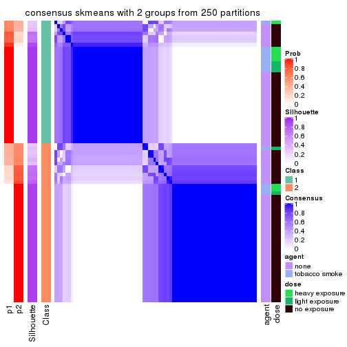</p>

</div>
<div id='tab-SD-skmeans-consensus-heatmap-2'>
<pre><code class="r">consensus_heatmap(res, k = 3)
</code></pre>

<p>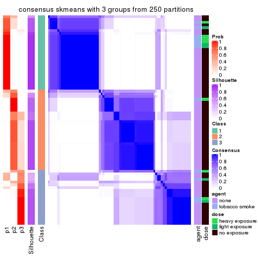</p>

</div>
<div id='tab-SD-skmeans-consensus-heatmap-3'>
<pre><code class="r">consensus_heatmap(res, k = 4)
</code></pre>

<p>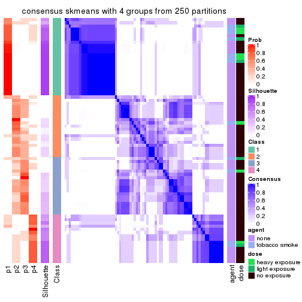</p>

</div>
<div id='tab-SD-skmeans-consensus-heatmap-4'>
<pre><code class="r">consensus_heatmap(res, k = 5)
</code></pre>

<p>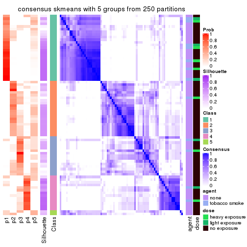</p>

</div>
<div id='tab-SD-skmeans-consensus-heatmap-5'>
<pre><code class="r">consensus_heatmap(res, k = 6)
</code></pre>

<p>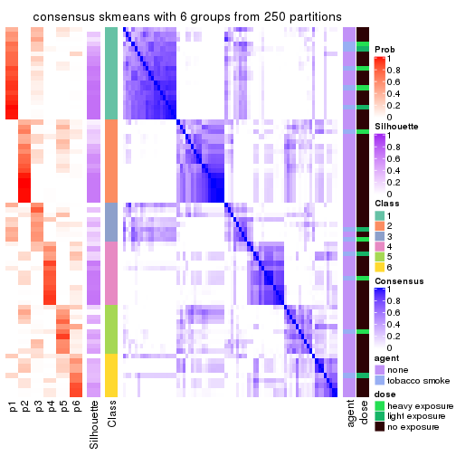</p>

</div>
</div>

Heatmaps for the membership of samples in all partitions to see how consistent they are:


<script>
$( function() {
	$( '#tabs-SD-skmeans-membership-heatmap' ).tabs();
} );
</script>
<div id='tabs-SD-skmeans-membership-heatmap'>
<ul>
<li><a href='#tab-SD-skmeans-membership-heatmap-1'>k = 2</a></li>
<li><a href='#tab-SD-skmeans-membership-heatmap-2'>k = 3</a></li>
<li><a href='#tab-SD-skmeans-membership-heatmap-3'>k = 4</a></li>
<li><a href='#tab-SD-skmeans-membership-heatmap-4'>k = 5</a></li>
<li><a href='#tab-SD-skmeans-membership-heatmap-5'>k = 6</a></li>
</ul>
<div id='tab-SD-skmeans-membership-heatmap-1'>
<pre><code class="r">membership_heatmap(res, k = 2)
</code></pre>

<p>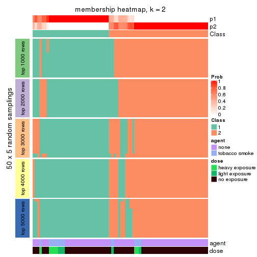</p>

</div>
<div id='tab-SD-skmeans-membership-heatmap-2'>
<pre><code class="r">membership_heatmap(res, k = 3)
</code></pre>

<p>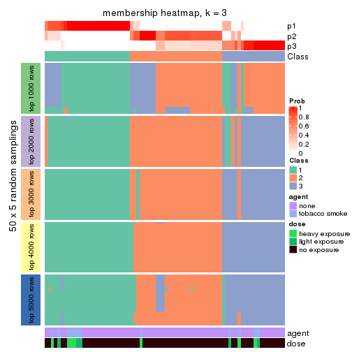</p>

</div>
<div id='tab-SD-skmeans-membership-heatmap-3'>
<pre><code class="r">membership_heatmap(res, k = 4)
</code></pre>

<p>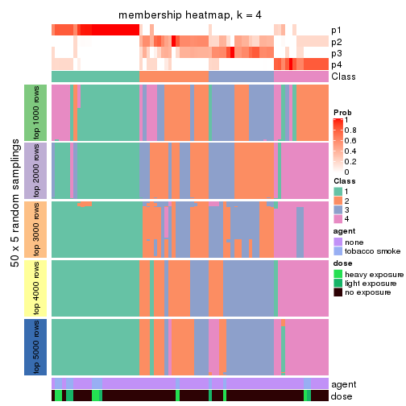</p>

</div>
<div id='tab-SD-skmeans-membership-heatmap-4'>
<pre><code class="r">membership_heatmap(res, k = 5)
</code></pre>

<p>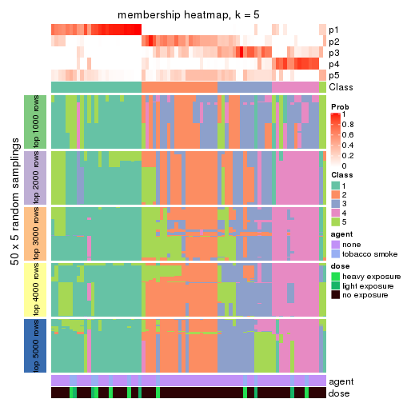</p>

</div>
<div id='tab-SD-skmeans-membership-heatmap-5'>
<pre><code class="r">membership_heatmap(res, k = 6)
</code></pre>

<p>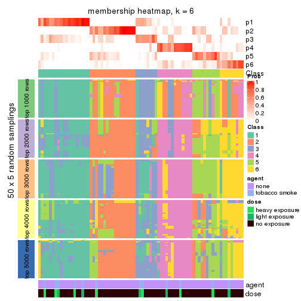</p>

</div>
</div>

As soon as we have had the classes for columns, we can look for signatures
which are significantly different between classes which can be candidate marks
for certain classes. Following are the heatmaps for signatures.


Signature heatmaps where rows are scaled:


<script>
$( function() {
	$( '#tabs-SD-skmeans-get-signatures' ).tabs();
} );
</script>
<div id='tabs-SD-skmeans-get-signatures'>
<ul>
<li><a href='#tab-SD-skmeans-get-signatures-1'>k = 2</a></li>
<li><a href='#tab-SD-skmeans-get-signatures-2'>k = 3</a></li>
<li><a href='#tab-SD-skmeans-get-signatures-3'>k = 4</a></li>
<li><a href='#tab-SD-skmeans-get-signatures-4'>k = 5</a></li>
<li><a href='#tab-SD-skmeans-get-signatures-5'>k = 6</a></li>
</ul>
<div id='tab-SD-skmeans-get-signatures-1'>
<pre><code class="r">get_signatures(res, k = 2)
</code></pre>

<p>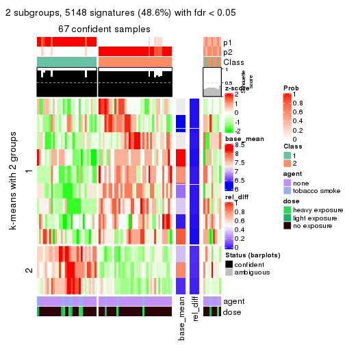</p>

</div>
<div id='tab-SD-skmeans-get-signatures-2'>
<pre><code class="r">get_signatures(res, k = 3)
</code></pre>

<p>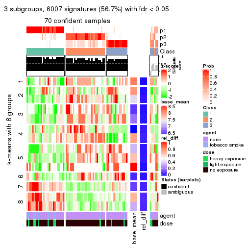</p>

</div>
<div id='tab-SD-skmeans-get-signatures-3'>
<pre><code class="r">get_signatures(res, k = 4)
</code></pre>

<p>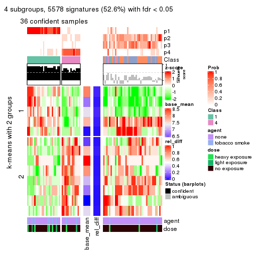</p>

</div>
<div id='tab-SD-skmeans-get-signatures-4'>
<pre><code class="r">get_signatures(res, k = 5)
</code></pre>

<p>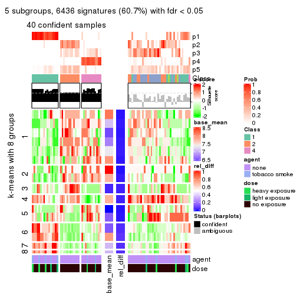</p>

</div>
<div id='tab-SD-skmeans-get-signatures-5'>
<pre><code class="r">get_signatures(res, k = 6)
</code></pre>

<p>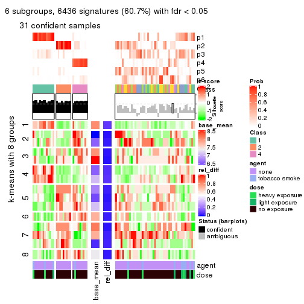</p>

</div>
</div>


Signature heatmaps where rows are not scaled:


<script>
$( function() {
	$( '#tabs-SD-skmeans-get-signatures-no-scale' ).tabs();
} );
</script>
<div id='tabs-SD-skmeans-get-signatures-no-scale'>
<ul>
<li><a href='#tab-SD-skmeans-get-signatures-no-scale-1'>k = 2</a></li>
<li><a href='#tab-SD-skmeans-get-signatures-no-scale-2'>k = 3</a></li>
<li><a href='#tab-SD-skmeans-get-signatures-no-scale-3'>k = 4</a></li>
<li><a href='#tab-SD-skmeans-get-signatures-no-scale-4'>k = 5</a></li>
<li><a href='#tab-SD-skmeans-get-signatures-no-scale-5'>k = 6</a></li>
</ul>
<div id='tab-SD-skmeans-get-signatures-no-scale-1'>
<pre><code class="r">get_signatures(res, k = 2, scale_rows = FALSE)
</code></pre>

<p>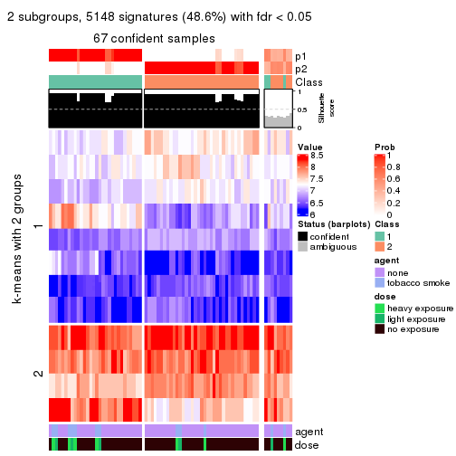</p>

</div>
<div id='tab-SD-skmeans-get-signatures-no-scale-2'>
<pre><code class="r">get_signatures(res, k = 3, scale_rows = FALSE)
</code></pre>

<p>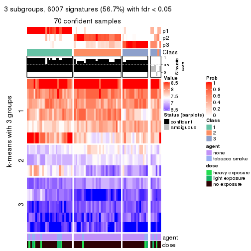</p>

</div>
<div id='tab-SD-skmeans-get-signatures-no-scale-3'>
<pre><code class="r">get_signatures(res, k = 4, scale_rows = FALSE)
</code></pre>

<p>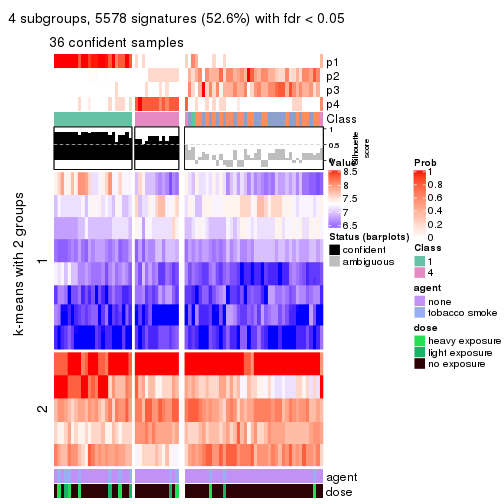</p>

</div>
<div id='tab-SD-skmeans-get-signatures-no-scale-4'>
<pre><code class="r">get_signatures(res, k = 5, scale_rows = FALSE)
</code></pre>

<p>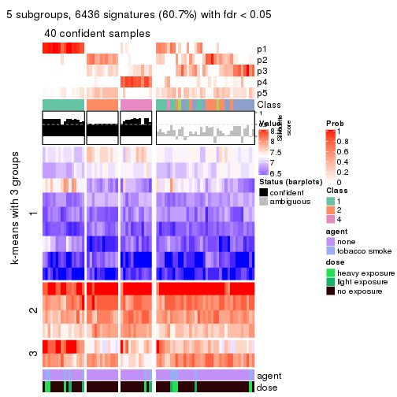</p>

</div>
<div id='tab-SD-skmeans-get-signatures-no-scale-5'>
<pre><code class="r">get_signatures(res, k = 6, scale_rows = FALSE)
</code></pre>

<p>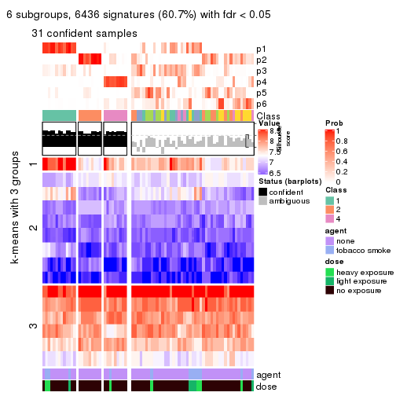</p>

</div>
</div>


Compare the overlap of signatures from different k:

```r
compare_signatures(res)
```

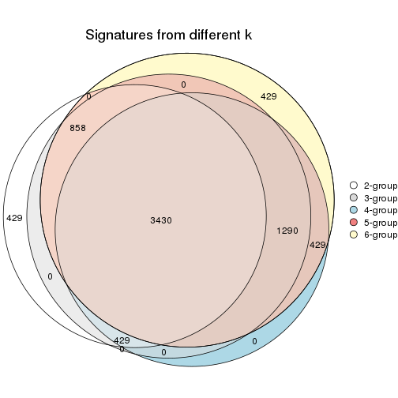

`get_signature()` returns a data frame invisibly. TO get the list of signatures, the function
call should be assigned to a variable explicitly. In following code, if `plot` argument is set
to `FALSE`, no heatmap is plotted while only the differential analysis is performed.

```r
# code only for demonstration
tb = get_signature(res, k = ..., plot = FALSE)
```

An example of the output of `tb` is:

```
#>   which_row         fdr    mean_1    mean_2 scaled_mean_1 scaled_mean_2 km
#> 1        38 0.042760348  8.373488  9.131774    -0.5533452     0.5164555  1
#> 2        40 0.018707592  7.106213  8.469186    -0.6173731     0.5762149  1
#> 3        55 0.019134737 10.221463 11.207825    -0.6159697     0.5749050  1
#> 4        59 0.006059896  5.921854  7.869574    -0.6899429     0.6439467  1
#> 5        60 0.018055526  8.928898 10.211722    -0.6204761     0.5791110  1
#> 6        98 0.009384629 15.714769 14.887706     0.6635654    -0.6193277  2
...
```

The columns in `tb` are:

1. `which_row`: row indices corresponding to the input matrix.
2. `fdr`: FDR for the differential test. 
3. `mean_x`: The mean value in group x.
4. `scaled_mean_x`: The mean value in group x after rows are scaled.
5. `km`: Row groups if k-means clustering is applied to rows.


UMAP plot which shows how samples are separated.


<script>
$( function() {
	$( '#tabs-SD-skmeans-dimension-reduction' ).tabs();
} );
</script>
<div id='tabs-SD-skmeans-dimension-reduction'>
<ul>
<li><a href='#tab-SD-skmeans-dimension-reduction-1'>k = 2</a></li>
<li><a href='#tab-SD-skmeans-dimension-reduction-2'>k = 3</a></li>
<li><a href='#tab-SD-skmeans-dimension-reduction-3'>k = 4</a></li>
<li><a href='#tab-SD-skmeans-dimension-reduction-4'>k = 5</a></li>
<li><a href='#tab-SD-skmeans-dimension-reduction-5'>k = 6</a></li>
</ul>
<div id='tab-SD-skmeans-dimension-reduction-1'>
<pre><code class="r">dimension_reduction(res, k = 2, method = &quot;UMAP&quot;)
</code></pre>

<p>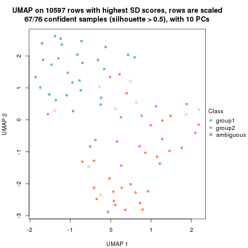</p>

</div>
<div id='tab-SD-skmeans-dimension-reduction-2'>
<pre><code class="r">dimension_reduction(res, k = 3, method = &quot;UMAP&quot;)
</code></pre>

<p>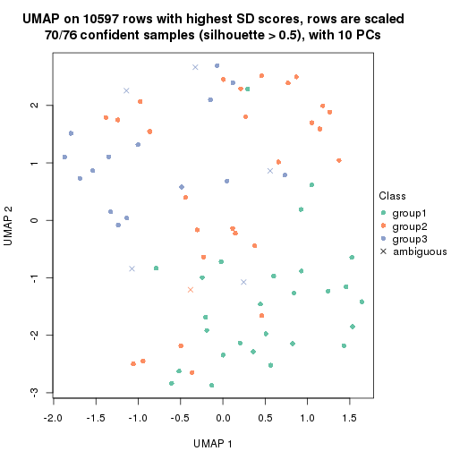</p>

</div>
<div id='tab-SD-skmeans-dimension-reduction-3'>
<pre><code class="r">dimension_reduction(res, k = 4, method = &quot;UMAP&quot;)
</code></pre>

<p>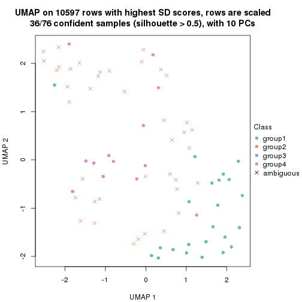</p>

</div>
<div id='tab-SD-skmeans-dimension-reduction-4'>
<pre><code class="r">dimension_reduction(res, k = 5, method = &quot;UMAP&quot;)
</code></pre>

<p>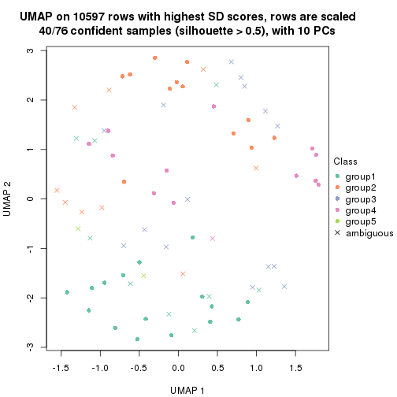</p>

</div>
<div id='tab-SD-skmeans-dimension-reduction-5'>
<pre><code class="r">dimension_reduction(res, k = 6, method = &quot;UMAP&quot;)
</code></pre>

<p>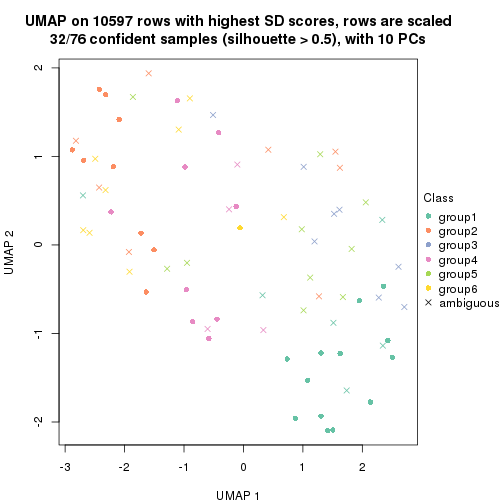</p>

</div>
</div>


Following heatmap shows how subgroups are split when increasing `k`:

```r
collect_classes(res)
```

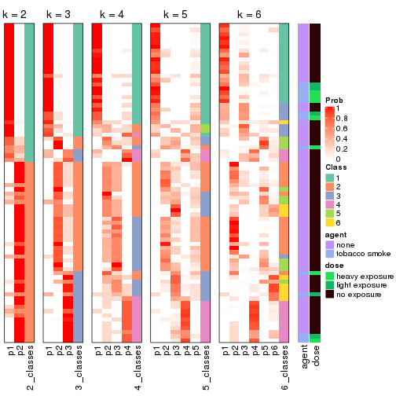


Test correlation between subgroups and known annotations. If the known
annotation is numeric, one-way ANOVA test is applied, and if the known
annotation is discrete, chi-squared contingency table test is applied.

```r
test_to_known_factors(res)
```

```
#>             n agent(p) dose(p) k
#> SD:skmeans 67   0.1632   0.213 2
#> SD:skmeans 70   0.0601   0.206 3
#> SD:skmeans 36   0.5478   0.598 4
#> SD:skmeans 40   0.0980   0.318 5
#> SD:skmeans 32   0.4278   0.774 6
```


If matrix rows can be associated to genes, consider to use `GO_Enrichment(res,
...)` to perform function enrichment for the signature genes.


 

---------------------------------------------------


### SD:pam


The object with results only for a single top-value method and a single partition method 
can be extracted as:

```r
res = res_list["SD", "pam"]
# you can also extract it by
# res = res_list["SD:pam"]
```

A summary of `res` and all the functions that can be applied to it:

```r
res
```

```
#> A 'ConsensusPartition' object with k = 2, 3, 4, 5, 6.
#>   On a matrix with 10597 rows and 76 columns.
#>   Top rows (1000, 2000, 3000, 4000, 5000) are extracted by 'SD' method.
#>   Subgroups are detected by 'pam' method.
#>   Performed in total 1250 partitions by row resampling.
#>   Best k for subgroups seems to be 2.
#> 
#> Following methods can be applied to this 'ConsensusPartition' object:
#>  [1] "cola_report"             "collect_classes"         "collect_plots"          
#>  [4] "collect_stats"           "colnames"                "compare_signatures"     
#>  [7] "consensus_heatmap"       "dimension_reduction"     "functional_enrichment"  
#> [10] "get_anno_col"            "get_anno"                "get_classes"            
#> [13] "get_consensus"           "get_matrix"              "get_membership"         
#> [16] "get_param"               "get_signatures"          "get_stats"              
#> [19] "is_best_k"               "is_stable_k"             "membership_heatmap"     
#> [22] "ncol"                    "nrow"                    "plot_ecdf"              
#> [25] "rownames"                "select_partition_number" "show"                   
#> [28] "suggest_best_k"          "test_to_known_factors"
```

`collect_plots()` function collects all the plots made from `res` for all `k` (number of partitions)
into one single page to provide an easy and fast comparison between different `k`.

```r
collect_plots(res)
```

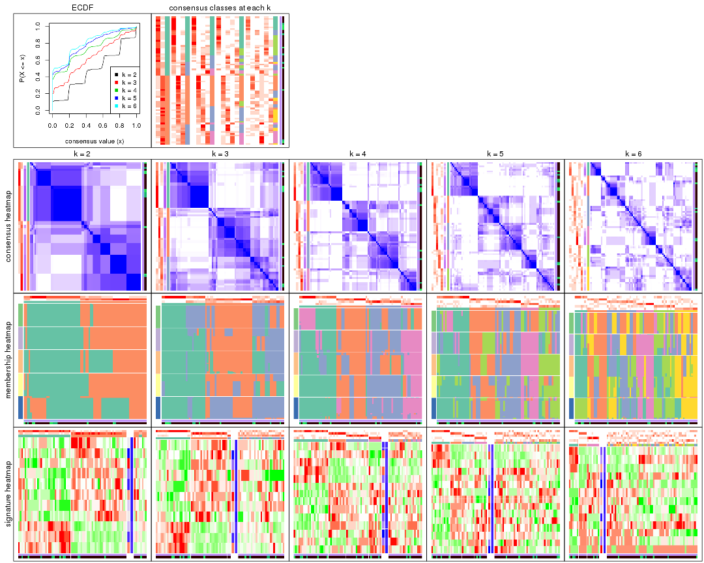

The plots are:

- The first row: a plot of the ECDF (Empirical cumulative distribution
  function) curves of the consensus matrix for each `k` and the heatmap of
  predicted classes for each `k`.
- The second row: heatmaps of the consensus matrix for each `k`.
- The third row: heatmaps of the membership matrix for each `k`.
- The fouth row: heatmaps of the signatures for each `k`.

All the plots in panels can be made by individual functions and they are
plotted later in this section.

`select_partition_number()` produces several plots showing different
statistics for choosing "optimized" `k`. There are following statistics:

- ECDF curves of the consensus matrix for each `k`;
- 1-PAC. [The PAC
  score](https://en.wikipedia.org/wiki/Consensus_clustering#Over-interpretation_potential_of_consensus_clustering)
  measures the proportion of the ambiguous subgrouping.
- Mean silhouette score.
- Concordance. The mean probability of fiting the consensus class ids in all
  partitions.
- Area increased. Denote $A_k$ as the area under the ECDF curve for current
  `k`, the area increased is defined as $A_k - A_{k-1}$.
- Rand index. The percent of pairs of samples that are both in a same cluster
  or both are not in a same cluster in the partition of k and k-1.
- Jaccard index. The ratio of pairs of samples are both in a same cluster in
  the partition of k and k-1 and the pairs of samples are both in a same
  cluster in the partition k or k-1.

The detailed explanations of these statistics can be found in [the cola
vignette](http://bioconductor.org/packages/devel/bioc/vignettes/cola/inst/doc/cola.html#toc_13).

Generally speaking, lower PAC score, higher mean silhouette score or higher
concordance corresponds to better partition. Rand index and Jaccard index
measure how similar the current partition is compared to partition with `k-1`.
If they are too similar, we won't accept `k` is better than `k-1`.

```r
select_partition_number(res)
```

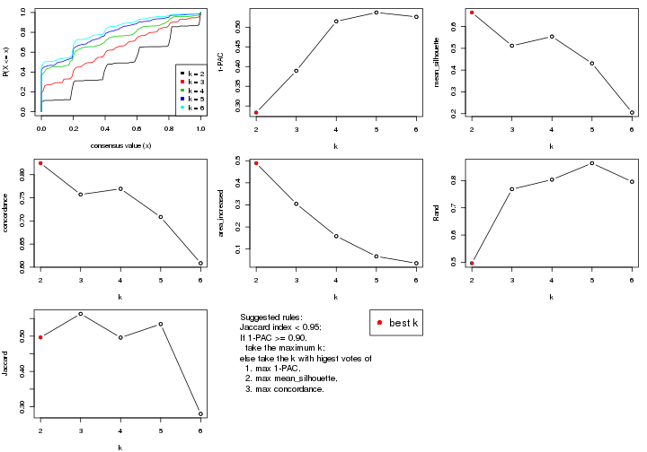

The numeric values for all these statistics can be obtained by `get_stats()`.

```r
get_stats(res)
```

```
#>   k 1-PAC mean_silhouette concordance area_increased  Rand Jaccard
#> 2 2 0.283           0.664       0.825         0.4889 0.496   0.496
#> 3 3 0.389           0.512       0.757         0.3049 0.768   0.563
#> 4 4 0.515           0.554       0.769         0.1583 0.804   0.496
#> 5 5 0.537           0.431       0.708         0.0669 0.864   0.534
#> 6 6 0.526           0.205       0.609         0.0358 0.796   0.280
```

`suggest_best_k()` suggests the best $k$ based on these statistics. The rules are as follows:

- All $k$ with Jaccard index larger than 0.95 are removed because the increase of
  the partition number does not provides enough extra information. If all $k$ are removed,
  the best $k$ is assigned by `NA`.
- For $k$ with 1-PAC larger than 0.9, the maximal $k$ is taken as the "best k". Other $k$ is called "optional k".
- If it does not fit the second rule. The $k$ with the highest vote of highest
  1-PAC, mean silhouette and concordance is taken as the "best k".

```r
suggest_best_k(res)
```

```
#> [1] 2
```


Following shows the table of the partitions (You need to click the **show/hide
code output** link to see it). The membership matrix (columns with name `p*`)
is inferred by
[`clue::cl_consensus()`](https://www.rdocumentation.org/link/cl_consensus?package=clue)
function with the `SE` method. Basically the value in the membership matrix
represents the probability to belong to a certain group. The finall class
label for an item is determined with the group with highest probability it
belongs to.

In `get_classes()` function, the entropy is calculated from the membership
matrix and the silhouette score is calculated from the consensus matrix.


<script>
$( function() {
	$( '#tabs-SD-pam-get-classes' ).tabs();
} );
</script>
<div id='tabs-SD-pam-get-classes'>
<ul>
<li><a href='#tab-SD-pam-get-classes-1'>k = 2</a></li>
<li><a href='#tab-SD-pam-get-classes-2'>k = 3</a></li>
<li><a href='#tab-SD-pam-get-classes-3'>k = 4</a></li>
<li><a href='#tab-SD-pam-get-classes-4'>k = 5</a></li>
<li><a href='#tab-SD-pam-get-classes-5'>k = 6</a></li>
</ul>

<div id='tab-SD-pam-get-classes-1'>
<p><a id='tab-SD-pam-get-classes-1-a' style='color:#0366d6' href='#'>show/hide code output</a></p>
<pre><code class="r">cbind(get_classes(res, k = 2), get_membership(res, k = 2))
</code></pre>

<pre><code>#&gt;           class entropy silhouette    p1    p2
#&gt; GSM451162     2   0.971     0.1807 0.400 0.600
#&gt; GSM451163     2   0.000     0.7280 0.000 1.000
#&gt; GSM451164     2   0.697     0.7122 0.188 0.812
#&gt; GSM451165     2   0.722     0.6293 0.200 0.800
#&gt; GSM451167     2   0.722     0.6293 0.200 0.800
#&gt; GSM451168     2   0.697     0.7122 0.188 0.812
#&gt; GSM451169     2   0.966     0.2089 0.392 0.608
#&gt; GSM451170     1   0.697     0.8537 0.812 0.188
#&gt; GSM451171     2   0.697     0.7122 0.188 0.812
#&gt; GSM451172     2   0.000     0.7280 0.000 1.000
#&gt; GSM451173     1   0.697     0.8537 0.812 0.188
#&gt; GSM451174     2   0.000     0.7280 0.000 1.000
#&gt; GSM451175     1   0.697     0.8537 0.812 0.188
#&gt; GSM451177     2   0.697     0.7122 0.188 0.812
#&gt; GSM451178     2   0.722     0.6293 0.200 0.800
#&gt; GSM451179     1   0.697     0.8537 0.812 0.188
#&gt; GSM451180     2   0.697     0.7122 0.188 0.812
#&gt; GSM451181     2   0.963     0.6320 0.388 0.612
#&gt; GSM451182     1   0.697     0.8537 0.812 0.188
#&gt; GSM451183     1   0.697     0.8537 0.812 0.188
#&gt; GSM451184     1   0.000     0.7461 1.000 0.000
#&gt; GSM451185     1   0.000     0.7461 1.000 0.000
#&gt; GSM451186     1   0.697     0.8537 0.812 0.188
#&gt; GSM451187     2   0.000     0.7280 0.000 1.000
#&gt; GSM451188     2   0.697     0.7122 0.188 0.812
#&gt; GSM451189     1   0.697     0.8537 0.812 0.188
#&gt; GSM451190     1   0.000     0.7461 1.000 0.000
#&gt; GSM451191     1   0.000     0.7461 1.000 0.000
#&gt; GSM451193     2   0.971     0.2107 0.400 0.600
#&gt; GSM451195     1   0.697     0.8537 0.812 0.188
#&gt; GSM451196     1   0.697     0.8537 0.812 0.188
#&gt; GSM451197     1   0.697     0.8537 0.812 0.188
#&gt; GSM451199     1   0.000     0.7461 1.000 0.000
#&gt; GSM451201     1   0.697     0.8537 0.812 0.188
#&gt; GSM451202     2   0.697     0.7122 0.188 0.812
#&gt; GSM451203     1   0.373     0.7820 0.928 0.072
#&gt; GSM451204     2   0.971     0.1745 0.400 0.600
#&gt; GSM451205     2   0.697     0.7122 0.188 0.812
#&gt; GSM451206     2   0.000     0.7280 0.000 1.000
#&gt; GSM451207     2   0.722     0.6293 0.200 0.800
#&gt; GSM451208     2   0.697     0.7122 0.188 0.812
#&gt; GSM451209     2   0.971    -0.0244 0.400 0.600
#&gt; GSM451210     2   0.697     0.7122 0.188 0.812
#&gt; GSM451212     2   0.722     0.6293 0.200 0.800
#&gt; GSM451213     2   0.722     0.6293 0.200 0.800
#&gt; GSM451214     2   0.963     0.6320 0.388 0.612
#&gt; GSM451215     2   0.697     0.7122 0.188 0.812
#&gt; GSM451216     2   0.000     0.7280 0.000 1.000
#&gt; GSM451217     2   0.963     0.6320 0.388 0.612
#&gt; GSM451219     1   0.000     0.7461 1.000 0.000
#&gt; GSM451220     1   0.697     0.8537 0.812 0.188
#&gt; GSM451221     1   0.000     0.7461 1.000 0.000
#&gt; GSM451222     1   0.697     0.8537 0.812 0.188
#&gt; GSM451224     2   0.963     0.6320 0.388 0.612
#&gt; GSM451225     1   0.722     0.8431 0.800 0.200
#&gt; GSM451226     1   0.978    -0.3155 0.588 0.412
#&gt; GSM451227     2   0.963     0.6320 0.388 0.612
#&gt; GSM451228     2   0.722     0.6293 0.200 0.800
#&gt; GSM451230     1   0.971     0.5540 0.600 0.400
#&gt; GSM451231     1   0.722     0.8431 0.800 0.200
#&gt; GSM451233     2   0.971    -0.0244 0.400 0.600
#&gt; GSM451234     2   0.722     0.5318 0.200 0.800
#&gt; GSM451235     2   0.000     0.7280 0.000 1.000
#&gt; GSM451236     2   0.000     0.7280 0.000 1.000
#&gt; GSM451166     1   0.971     0.5049 0.600 0.400
#&gt; GSM451194     1   0.697     0.8537 0.812 0.188
#&gt; GSM451198     1   0.697     0.8537 0.812 0.188
#&gt; GSM451218     2   0.000     0.7280 0.000 1.000
#&gt; GSM451232     1   0.697     0.8537 0.812 0.188
#&gt; GSM451176     1   0.000     0.7461 1.000 0.000
#&gt; GSM451192     1   0.697     0.8537 0.812 0.188
#&gt; GSM451200     1   0.697     0.8537 0.812 0.188
#&gt; GSM451211     2   0.000     0.7280 0.000 1.000
#&gt; GSM451223     1   0.943    -0.1228 0.640 0.360
#&gt; GSM451229     1   0.000     0.7461 1.000 0.000
#&gt; GSM451237     2   0.722     0.5318 0.200 0.800
</code></pre>

<script>
$('#tab-SD-pam-get-classes-1-a').parent().next().next().hide();
$('#tab-SD-pam-get-classes-1-a').click(function(){
  $('#tab-SD-pam-get-classes-1-a').parent().next().next().toggle();
  return(false);
});
</script>
</div>

<div id='tab-SD-pam-get-classes-2'>
<p><a id='tab-SD-pam-get-classes-2-a' style='color:#0366d6' href='#'>show/hide code output</a></p>
<pre><code class="r">cbind(get_classes(res, k = 3), get_membership(res, k = 3))
</code></pre>

<pre><code>#&gt;           class entropy silhouette    p1    p2    p3
#&gt; GSM451162     2  0.9599    -0.2170 0.200 0.412 0.388
#&gt; GSM451163     2  0.5115     0.6165 0.016 0.796 0.188
#&gt; GSM451164     2  0.4195     0.6188 0.012 0.852 0.136
#&gt; GSM451165     2  0.5253     0.6136 0.020 0.792 0.188
#&gt; GSM451167     2  0.7054     0.1624 0.020 0.524 0.456
#&gt; GSM451168     2  0.6079     0.5238 0.000 0.612 0.388
#&gt; GSM451169     3  0.9531     0.2779 0.200 0.344 0.456
#&gt; GSM451170     1  0.0000     0.7872 1.000 0.000 0.000
#&gt; GSM451171     2  0.0000     0.6731 0.000 1.000 0.000
#&gt; GSM451172     2  0.4399     0.6241 0.000 0.812 0.188
#&gt; GSM451173     3  0.5905     0.2710 0.352 0.000 0.648
#&gt; GSM451174     2  0.6016     0.5418 0.020 0.724 0.256
#&gt; GSM451175     1  0.4555     0.7070 0.800 0.000 0.200
#&gt; GSM451177     2  0.0000     0.6731 0.000 1.000 0.000
#&gt; GSM451178     2  0.5178     0.5601 0.000 0.744 0.256
#&gt; GSM451179     1  0.6291     0.1636 0.532 0.000 0.468
#&gt; GSM451180     2  0.0000     0.6731 0.000 1.000 0.000
#&gt; GSM451181     2  0.6143     0.5366 0.024 0.720 0.256
#&gt; GSM451182     1  0.0000     0.7872 1.000 0.000 0.000
#&gt; GSM451183     1  0.0000     0.7872 1.000 0.000 0.000
#&gt; GSM451184     1  0.6585     0.6552 0.736 0.064 0.200
#&gt; GSM451185     1  0.0000     0.7872 1.000 0.000 0.000
#&gt; GSM451186     3  0.6126     0.3151 0.400 0.000 0.600
#&gt; GSM451187     2  0.4399     0.6241 0.000 0.812 0.188
#&gt; GSM451188     2  0.3619     0.6191 0.000 0.864 0.136
#&gt; GSM451189     1  0.0000     0.7872 1.000 0.000 0.000
#&gt; GSM451190     1  0.3619     0.6623 0.864 0.000 0.136
#&gt; GSM451191     1  0.0000     0.7872 1.000 0.000 0.000
#&gt; GSM451193     3  0.9568     0.3474 0.336 0.208 0.456
#&gt; GSM451195     1  0.5254     0.6381 0.736 0.000 0.264
#&gt; GSM451196     1  0.0000     0.7872 1.000 0.000 0.000
#&gt; GSM451197     1  0.0000     0.7872 1.000 0.000 0.000
#&gt; GSM451199     1  0.4555     0.7070 0.800 0.000 0.200
#&gt; GSM451201     1  0.0000     0.7872 1.000 0.000 0.000
#&gt; GSM451202     2  0.0000     0.6731 0.000 1.000 0.000
#&gt; GSM451203     1  0.6799     0.1533 0.532 0.012 0.456
#&gt; GSM451204     3  0.5882     0.2534 0.000 0.348 0.652
#&gt; GSM451205     2  0.3619     0.6191 0.000 0.864 0.136
#&gt; GSM451206     2  0.5178     0.5601 0.000 0.744 0.256
#&gt; GSM451207     2  0.9599    -0.2253 0.200 0.412 0.388
#&gt; GSM451208     2  0.0000     0.6731 0.000 1.000 0.000
#&gt; GSM451209     3  0.3619     0.5097 0.136 0.000 0.864
#&gt; GSM451210     2  0.3851     0.6193 0.004 0.860 0.136
#&gt; GSM451212     3  0.8765     0.4504 0.200 0.212 0.588
#&gt; GSM451213     2  0.6016     0.5418 0.020 0.724 0.256
#&gt; GSM451214     2  0.5810     0.3982 0.000 0.664 0.336
#&gt; GSM451215     2  0.0000     0.6731 0.000 1.000 0.000
#&gt; GSM451216     3  0.6168     0.1425 0.000 0.412 0.588
#&gt; GSM451217     2  0.0892     0.6690 0.020 0.980 0.000
#&gt; GSM451219     1  0.3619     0.6623 0.864 0.000 0.136
#&gt; GSM451220     1  0.6267     0.2031 0.548 0.000 0.452
#&gt; GSM451221     1  0.4555     0.7070 0.800 0.000 0.200
#&gt; GSM451222     1  0.6286     0.3557 0.536 0.000 0.464
#&gt; GSM451224     2  0.3619     0.6191 0.000 0.864 0.136
#&gt; GSM451225     3  0.6140     0.3081 0.404 0.000 0.596
#&gt; GSM451226     3  0.9568     0.3474 0.336 0.208 0.456
#&gt; GSM451227     2  0.9268     0.0772 0.172 0.492 0.336
#&gt; GSM451228     3  0.9531     0.2779 0.200 0.344 0.456
#&gt; GSM451230     3  0.3619     0.5097 0.136 0.000 0.864
#&gt; GSM451231     3  0.4796     0.4542 0.220 0.000 0.780
#&gt; GSM451233     3  0.7875     0.4518 0.136 0.200 0.664
#&gt; GSM451234     3  0.7875     0.4518 0.136 0.200 0.664
#&gt; GSM451235     3  0.5810     0.2675 0.000 0.336 0.664
#&gt; GSM451236     2  0.6168     0.1074 0.000 0.588 0.412
#&gt; GSM451166     3  0.9585     0.3247 0.332 0.212 0.456
#&gt; GSM451194     1  0.6154     0.4268 0.592 0.000 0.408
#&gt; GSM451198     1  0.5016     0.6687 0.760 0.000 0.240
#&gt; GSM451218     3  0.6126     0.1664 0.000 0.400 0.600
#&gt; GSM451232     1  0.0000     0.7872 1.000 0.000 0.000
#&gt; GSM451176     1  0.0000     0.7872 1.000 0.000 0.000
#&gt; GSM451192     1  0.0000     0.7872 1.000 0.000 0.000
#&gt; GSM451200     1  0.4555     0.7070 0.800 0.000 0.200
#&gt; GSM451211     2  0.4399     0.6241 0.000 0.812 0.188
#&gt; GSM451223     3  0.7940     0.1987 0.332 0.076 0.592
#&gt; GSM451229     1  0.0000     0.7872 1.000 0.000 0.000
#&gt; GSM451237     3  0.7875     0.4518 0.136 0.200 0.664
</code></pre>

<script>
$('#tab-SD-pam-get-classes-2-a').parent().next().next().hide();
$('#tab-SD-pam-get-classes-2-a').click(function(){
  $('#tab-SD-pam-get-classes-2-a').parent().next().next().toggle();
  return(false);
});
</script>
</div>

<div id='tab-SD-pam-get-classes-3'>
<p><a id='tab-SD-pam-get-classes-3-a' style='color:#0366d6' href='#'>show/hide code output</a></p>
<pre><code class="r">cbind(get_classes(res, k = 4), get_membership(res, k = 4))
</code></pre>

<pre><code>#&gt;           class entropy silhouette    p1    p2    p3    p4
#&gt; GSM451162     3  0.3400     0.6591 0.000 0.180 0.820 0.000
#&gt; GSM451163     3  0.3649     0.6450 0.000 0.204 0.796 0.000
#&gt; GSM451164     2  0.3554     0.5774 0.000 0.844 0.020 0.136
#&gt; GSM451165     3  0.4855     0.0417 0.000 0.400 0.600 0.000
#&gt; GSM451167     3  0.3400     0.6591 0.000 0.180 0.820 0.000
#&gt; GSM451168     2  0.6504     0.3409 0.000 0.636 0.216 0.148
#&gt; GSM451169     3  0.0000     0.6315 0.000 0.000 1.000 0.000
#&gt; GSM451170     1  0.3610     0.7850 0.800 0.000 0.000 0.200
#&gt; GSM451171     2  0.0336     0.6937 0.000 0.992 0.000 0.008
#&gt; GSM451172     3  0.4855     0.3812 0.000 0.400 0.600 0.000
#&gt; GSM451173     4  0.7644    -0.3090 0.380 0.000 0.208 0.412
#&gt; GSM451174     3  0.4866     0.3980 0.000 0.404 0.596 0.000
#&gt; GSM451175     1  0.4387     0.7803 0.776 0.000 0.024 0.200
#&gt; GSM451177     2  0.0336     0.6937 0.000 0.992 0.000 0.008
#&gt; GSM451178     3  0.4916     0.3698 0.000 0.424 0.576 0.000
#&gt; GSM451179     3  0.3486     0.5184 0.000 0.000 0.812 0.188
#&gt; GSM451180     2  0.0336     0.6937 0.000 0.992 0.000 0.008
#&gt; GSM451181     3  0.7186     0.2104 0.000 0.420 0.444 0.136
#&gt; GSM451182     1  0.3610     0.7850 0.800 0.000 0.000 0.200
#&gt; GSM451183     1  0.0000     0.7824 1.000 0.000 0.000 0.000
#&gt; GSM451184     3  0.5659    -0.1065 0.368 0.032 0.600 0.000
#&gt; GSM451185     1  0.0000     0.7824 1.000 0.000 0.000 0.000
#&gt; GSM451186     4  0.0336     0.6105 0.000 0.000 0.008 0.992
#&gt; GSM451187     2  0.4855     0.0550 0.000 0.600 0.400 0.000
#&gt; GSM451188     2  0.3400     0.5747 0.000 0.820 0.180 0.000
#&gt; GSM451189     1  0.3610     0.7850 0.800 0.000 0.000 0.200
#&gt; GSM451190     1  0.5349     0.7739 0.744 0.032 0.024 0.200
#&gt; GSM451191     1  0.3400     0.6913 0.820 0.000 0.180 0.000
#&gt; GSM451193     3  0.0000     0.6315 0.000 0.000 1.000 0.000
#&gt; GSM451195     1  0.5510     0.6317 0.600 0.000 0.024 0.376
#&gt; GSM451196     1  0.0000     0.7824 1.000 0.000 0.000 0.000
#&gt; GSM451197     1  0.0000     0.7824 1.000 0.000 0.000 0.000
#&gt; GSM451199     1  0.6686     0.7002 0.620 0.000 0.180 0.200
#&gt; GSM451201     1  0.0000     0.7824 1.000 0.000 0.000 0.000
#&gt; GSM451202     2  0.0336     0.6937 0.000 0.992 0.000 0.008
#&gt; GSM451203     3  0.2282     0.6019 0.000 0.024 0.924 0.052
#&gt; GSM451204     4  0.7269     0.4301 0.000 0.200 0.264 0.536
#&gt; GSM451205     2  0.0336     0.6937 0.000 0.992 0.000 0.008
#&gt; GSM451206     2  0.4855     0.0550 0.000 0.600 0.400 0.000
#&gt; GSM451207     3  0.6058     0.5756 0.000 0.180 0.684 0.136
#&gt; GSM451208     2  0.0336     0.6937 0.000 0.992 0.000 0.008
#&gt; GSM451209     4  0.3688     0.5749 0.000 0.000 0.208 0.792
#&gt; GSM451210     2  0.3610     0.5698 0.000 0.800 0.200 0.000
#&gt; GSM451212     3  0.3400     0.6591 0.000 0.180 0.820 0.000
#&gt; GSM451213     3  0.5428     0.4244 0.000 0.380 0.600 0.020
#&gt; GSM451214     2  0.4830     0.3707 0.000 0.608 0.392 0.000
#&gt; GSM451215     2  0.0336     0.6937 0.000 0.992 0.000 0.008
#&gt; GSM451216     4  0.7227     0.4387 0.000 0.200 0.256 0.544
#&gt; GSM451217     2  0.6663     0.3005 0.000 0.612 0.244 0.144
#&gt; GSM451219     1  0.7595     0.6795 0.588 0.032 0.180 0.200
#&gt; GSM451220     3  0.3400     0.5854 0.180 0.000 0.820 0.000
#&gt; GSM451221     1  0.7031     0.6747 0.576 0.000 0.224 0.200
#&gt; GSM451222     1  0.4941     0.5676 0.564 0.000 0.000 0.436
#&gt; GSM451224     2  0.3400     0.5747 0.000 0.820 0.180 0.000
#&gt; GSM451225     4  0.0336     0.6105 0.000 0.000 0.008 0.992
#&gt; GSM451226     3  0.1022     0.6201 0.000 0.032 0.968 0.000
#&gt; GSM451227     2  0.4790     0.3827 0.000 0.620 0.380 0.000
#&gt; GSM451228     3  0.3400     0.6591 0.000 0.180 0.820 0.000
#&gt; GSM451230     3  0.4888     0.0935 0.000 0.000 0.588 0.412
#&gt; GSM451231     4  0.7609     0.2533 0.000 0.200 0.396 0.404
#&gt; GSM451233     4  0.6855     0.4863 0.000 0.200 0.200 0.600
#&gt; GSM451234     4  0.3933     0.6620 0.000 0.200 0.008 0.792
#&gt; GSM451235     4  0.3610     0.6606 0.000 0.200 0.000 0.800
#&gt; GSM451236     4  0.3726     0.6534 0.000 0.212 0.000 0.788
#&gt; GSM451166     3  0.5091     0.6409 0.000 0.180 0.752 0.068
#&gt; GSM451194     1  0.7746     0.4527 0.392 0.000 0.232 0.376
#&gt; GSM451198     1  0.4072     0.6052 0.748 0.000 0.252 0.000
#&gt; GSM451218     4  0.4284     0.6589 0.000 0.200 0.020 0.780
#&gt; GSM451232     1  0.0000     0.7824 1.000 0.000 0.000 0.000
#&gt; GSM451176     1  0.3610     0.7850 0.800 0.000 0.000 0.200
#&gt; GSM451192     1  0.0000     0.7824 1.000 0.000 0.000 0.000
#&gt; GSM451200     1  0.7568     0.5350 0.448 0.000 0.352 0.200
#&gt; GSM451211     2  0.4855     0.0550 0.000 0.600 0.400 0.000
#&gt; GSM451223     3  0.1022     0.6201 0.000 0.032 0.968 0.000
#&gt; GSM451229     1  0.0000     0.7824 1.000 0.000 0.000 0.000
#&gt; GSM451237     4  0.3610     0.6606 0.000 0.200 0.000 0.800
</code></pre>

<script>
$('#tab-SD-pam-get-classes-3-a').parent().next().next().hide();
$('#tab-SD-pam-get-classes-3-a').click(function(){
  $('#tab-SD-pam-get-classes-3-a').parent().next().next().toggle();
  return(false);
});
</script>
</div>

<div id='tab-SD-pam-get-classes-4'>
<p><a id='tab-SD-pam-get-classes-4-a' style='color:#0366d6' href='#'>show/hide code output</a></p>
<pre><code class="r">cbind(get_classes(res, k = 5), get_membership(res, k = 5))
</code></pre>

<pre><code>#&gt;           class entropy silhouette    p1    p2    p3    p4    p5
#&gt; GSM451162     3  0.0162     0.6424 0.000 0.004 0.996 0.000 0.000
#&gt; GSM451163     3  0.5107     0.5050 0.000 0.204 0.688 0.000 0.108
#&gt; GSM451164     2  0.3366     0.3788 0.000 0.768 0.000 0.000 0.232
#&gt; GSM451165     5  0.6725    -0.2614 0.000 0.292 0.288 0.000 0.420
#&gt; GSM451167     3  0.5013     0.5384 0.000 0.204 0.696 0.000 0.100
#&gt; GSM451168     2  0.3769     0.4595 0.000 0.796 0.172 0.004 0.028
#&gt; GSM451169     3  0.0162     0.6424 0.000 0.004 0.996 0.000 0.000
#&gt; GSM451170     1  0.3109     0.6173 0.800 0.000 0.000 0.000 0.200
#&gt; GSM451171     2  0.1851     0.5850 0.000 0.912 0.088 0.000 0.000
#&gt; GSM451172     3  0.5673     0.2236 0.000 0.292 0.596 0.000 0.112
#&gt; GSM451173     1  0.7482     0.2646 0.508 0.000 0.200 0.204 0.088
#&gt; GSM451174     3  0.4192     0.1961 0.000 0.404 0.596 0.000 0.000
#&gt; GSM451175     1  0.5904     0.4781 0.600 0.000 0.200 0.000 0.200
#&gt; GSM451177     2  0.4832     0.6171 0.000 0.712 0.088 0.000 0.200
#&gt; GSM451178     3  0.4192     0.1961 0.000 0.404 0.596 0.000 0.000
#&gt; GSM451179     5  0.3607     0.4314 0.004 0.000 0.244 0.000 0.752
#&gt; GSM451180     2  0.4832     0.6171 0.000 0.712 0.088 0.000 0.200
#&gt; GSM451181     2  0.6554    -0.1786 0.000 0.404 0.396 0.000 0.200
#&gt; GSM451182     1  0.0000     0.7020 1.000 0.000 0.000 0.000 0.000
#&gt; GSM451183     1  0.0000     0.7020 1.000 0.000 0.000 0.000 0.000
#&gt; GSM451184     5  0.4182     0.3482 0.000 0.000 0.400 0.000 0.600
#&gt; GSM451185     1  0.3109     0.6787 0.800 0.000 0.000 0.200 0.000
#&gt; GSM451186     4  0.3109     0.5874 0.000 0.000 0.000 0.800 0.200
#&gt; GSM451187     2  0.4171     0.2014 0.000 0.604 0.396 0.000 0.000
#&gt; GSM451188     2  0.4249     0.3664 0.000 0.568 0.000 0.000 0.432
#&gt; GSM451189     1  0.0000     0.7020 1.000 0.000 0.000 0.000 0.000
#&gt; GSM451190     1  0.5790     0.3854 0.616 0.000 0.200 0.000 0.184
#&gt; GSM451191     1  0.4171     0.1580 0.604 0.000 0.000 0.000 0.396
#&gt; GSM451193     3  0.1851     0.5645 0.000 0.000 0.912 0.000 0.088
#&gt; GSM451195     1  0.5996     0.3218 0.512 0.000 0.368 0.000 0.120
#&gt; GSM451196     1  0.3109     0.6787 0.800 0.000 0.000 0.200 0.000
#&gt; GSM451197     1  0.1851     0.6671 0.912 0.000 0.000 0.000 0.088
#&gt; GSM451199     5  0.4074     0.0829 0.364 0.000 0.000 0.000 0.636
#&gt; GSM451201     1  0.4021     0.6734 0.764 0.000 0.000 0.200 0.036
#&gt; GSM451202     2  0.1851     0.5850 0.000 0.912 0.088 0.000 0.000
#&gt; GSM451203     3  0.4299     0.0832 0.004 0.000 0.608 0.000 0.388
#&gt; GSM451204     3  0.8270     0.0879 0.000 0.228 0.396 0.204 0.172
#&gt; GSM451205     2  0.3143     0.5601 0.000 0.796 0.000 0.000 0.204
#&gt; GSM451206     2  0.4182     0.1934 0.000 0.600 0.400 0.000 0.000
#&gt; GSM451207     3  0.2852     0.4890 0.000 0.000 0.828 0.000 0.172
#&gt; GSM451208     2  0.4832     0.6171 0.000 0.712 0.088 0.000 0.200
#&gt; GSM451209     4  0.3109     0.5581 0.000 0.000 0.200 0.800 0.000
#&gt; GSM451210     2  0.4249     0.3664 0.000 0.568 0.000 0.000 0.432
#&gt; GSM451212     3  0.0510     0.6388 0.000 0.000 0.984 0.000 0.016
#&gt; GSM451213     3  0.3596     0.4584 0.000 0.200 0.784 0.000 0.016
#&gt; GSM451214     5  0.6244     0.2037 0.000 0.260 0.200 0.000 0.540
#&gt; GSM451215     2  0.4832     0.6171 0.000 0.712 0.088 0.000 0.200
#&gt; GSM451216     4  0.7067     0.1624 0.000 0.228 0.356 0.400 0.016
#&gt; GSM451217     5  0.5778    -0.1226 0.000 0.448 0.088 0.000 0.464
#&gt; GSM451219     5  0.4953     0.3815 0.216 0.088 0.000 0.000 0.696
#&gt; GSM451220     3  0.2011     0.5621 0.004 0.000 0.908 0.000 0.088
#&gt; GSM451221     5  0.4757     0.0860 0.380 0.000 0.024 0.000 0.596
#&gt; GSM451222     1  0.5375     0.4656 0.664 0.000 0.136 0.200 0.000
#&gt; GSM451224     2  0.4249     0.3664 0.000 0.568 0.000 0.000 0.432
#&gt; GSM451225     4  0.3109     0.5874 0.000 0.000 0.000 0.800 0.200
#&gt; GSM451226     5  0.4367     0.3401 0.000 0.004 0.416 0.000 0.580
#&gt; GSM451227     5  0.3561     0.1912 0.000 0.260 0.000 0.000 0.740
#&gt; GSM451228     3  0.0000     0.6416 0.000 0.000 1.000 0.000 0.000
#&gt; GSM451230     4  0.8167     0.2548 0.200 0.000 0.144 0.404 0.252
#&gt; GSM451231     5  0.5872     0.2954 0.000 0.000 0.168 0.232 0.600
#&gt; GSM451233     4  0.8137     0.2051 0.000 0.136 0.200 0.404 0.260
#&gt; GSM451234     4  0.3109     0.6875 0.000 0.200 0.000 0.800 0.000
#&gt; GSM451235     4  0.3109     0.6875 0.000 0.200 0.000 0.800 0.000
#&gt; GSM451236     4  0.3521     0.6633 0.000 0.232 0.004 0.764 0.000
#&gt; GSM451166     3  0.3109     0.4987 0.000 0.000 0.800 0.000 0.200
#&gt; GSM451194     5  0.5930     0.3213 0.196 0.000 0.208 0.000 0.596
#&gt; GSM451198     1  0.6166     0.3258 0.556 0.000 0.200 0.000 0.244
#&gt; GSM451218     4  0.3266     0.6865 0.000 0.200 0.004 0.796 0.000
#&gt; GSM451232     1  0.3109     0.6787 0.800 0.000 0.000 0.200 0.000
#&gt; GSM451176     1  0.1270     0.7032 0.948 0.000 0.000 0.052 0.000
#&gt; GSM451192     1  0.0000     0.7020 1.000 0.000 0.000 0.000 0.000
#&gt; GSM451200     1  0.6244     0.2323 0.540 0.000 0.200 0.000 0.260
#&gt; GSM451211     2  0.4171     0.2014 0.000 0.604 0.396 0.000 0.000
#&gt; GSM451223     5  0.5757     0.3498 0.000 0.088 0.416 0.000 0.496
#&gt; GSM451229     1  0.3109     0.6787 0.800 0.000 0.000 0.200 0.000
#&gt; GSM451237     4  0.3109     0.6875 0.000 0.200 0.000 0.800 0.000
</code></pre>

<script>
$('#tab-SD-pam-get-classes-4-a').parent().next().next().hide();
$('#tab-SD-pam-get-classes-4-a').click(function(){
  $('#tab-SD-pam-get-classes-4-a').parent().next().next().toggle();
  return(false);
});
</script>
</div>

<div id='tab-SD-pam-get-classes-5'>
<p><a id='tab-SD-pam-get-classes-5-a' style='color:#0366d6' href='#'>show/hide code output</a></p>
<pre><code class="r">cbind(get_classes(res, k = 6), get_membership(res, k = 6))
</code></pre>

<pre><code>#&gt;           class entropy silhouette    p1    p2    p3    p4    p5    p6
#&gt; GSM451162     6  0.5458    0.16708 0.000 0.008 0.400 0.000 0.096 0.496
#&gt; GSM451163     6  0.5351    0.28106 0.000 0.208 0.200 0.000 0.000 0.592
#&gt; GSM451164     3  0.5715    0.00689 0.000 0.016 0.584 0.200 0.000 0.200
#&gt; GSM451165     6  0.6979    0.14549 0.000 0.120 0.000 0.200 0.200 0.480
#&gt; GSM451167     6  0.5444    0.27125 0.000 0.208 0.216 0.000 0.000 0.576
#&gt; GSM451168     3  0.5397    0.02125 0.000 0.000 0.584 0.200 0.000 0.216
#&gt; GSM451169     3  0.5917   -0.25467 0.000 0.208 0.400 0.000 0.000 0.392
#&gt; GSM451170     5  0.3857   -0.43652 0.468 0.000 0.000 0.000 0.532 0.000
#&gt; GSM451171     2  0.5304    0.48242 0.000 0.600 0.000 0.200 0.000 0.200
#&gt; GSM451172     2  0.4256   -0.31479 0.000 0.520 0.000 0.000 0.016 0.464
#&gt; GSM451173     3  0.7544    0.05091 0.004 0.000 0.400 0.196 0.200 0.200
#&gt; GSM451174     6  0.3043    0.40869 0.000 0.008 0.000 0.200 0.000 0.792
#&gt; GSM451175     1  0.5742    0.30728 0.484 0.000 0.332 0.000 0.184 0.000
#&gt; GSM451177     2  0.2793    0.60505 0.000 0.800 0.000 0.200 0.000 0.000
#&gt; GSM451178     6  0.3043    0.40869 0.000 0.008 0.000 0.200 0.000 0.792
#&gt; GSM451179     3  0.7368    0.01529 0.000 0.200 0.416 0.000 0.200 0.184
#&gt; GSM451180     2  0.2793    0.60505 0.000 0.800 0.000 0.200 0.000 0.000
#&gt; GSM451181     3  0.7604   -0.02144 0.184 0.008 0.404 0.200 0.000 0.204
#&gt; GSM451182     5  0.3857   -0.43652 0.468 0.000 0.000 0.000 0.532 0.000
#&gt; GSM451183     1  0.5788    0.50943 0.484 0.000 0.000 0.000 0.316 0.200
#&gt; GSM451184     3  0.3515    0.07117 0.000 0.000 0.676 0.000 0.324 0.000
#&gt; GSM451185     1  0.2697    0.73097 0.812 0.000 0.000 0.000 0.188 0.000
#&gt; GSM451186     4  0.2912    0.56656 0.000 0.000 0.000 0.784 0.216 0.000
#&gt; GSM451187     6  0.5888   -0.31610 0.000 0.400 0.000 0.200 0.000 0.400
#&gt; GSM451188     2  0.7450    0.27956 0.000 0.396 0.204 0.200 0.200 0.000
#&gt; GSM451189     5  0.4473   -0.48113 0.484 0.000 0.028 0.000 0.488 0.000
#&gt; GSM451190     3  0.3833   -0.28990 0.444 0.000 0.556 0.000 0.000 0.000
#&gt; GSM451191     5  0.4386    0.17146 0.092 0.000 0.000 0.000 0.708 0.200
#&gt; GSM451193     3  0.7190   -0.10461 0.000 0.200 0.400 0.000 0.108 0.292
#&gt; GSM451195     3  0.6076   -0.36337 0.308 0.000 0.400 0.000 0.292 0.000
#&gt; GSM451196     1  0.2697    0.73097 0.812 0.000 0.000 0.000 0.188 0.000
#&gt; GSM451197     5  0.5304   -0.09717 0.200 0.000 0.000 0.000 0.600 0.200
#&gt; GSM451199     5  0.1387    0.30487 0.000 0.000 0.068 0.000 0.932 0.000
#&gt; GSM451201     5  0.5723   -0.30617 0.292 0.000 0.000 0.000 0.508 0.200
#&gt; GSM451202     2  0.5304    0.48242 0.000 0.600 0.000 0.200 0.000 0.200
#&gt; GSM451203     3  0.5971    0.07782 0.184 0.000 0.616 0.000 0.108 0.092
#&gt; GSM451204     4  0.6215   -0.19585 0.188 0.000 0.016 0.404 0.000 0.392
#&gt; GSM451205     2  0.3043    0.60204 0.000 0.792 0.008 0.200 0.000 0.000
#&gt; GSM451206     6  0.3043    0.40869 0.000 0.008 0.000 0.200 0.000 0.792
#&gt; GSM451207     6  0.7428    0.29163 0.184 0.200 0.216 0.000 0.000 0.400
#&gt; GSM451208     2  0.2793    0.60505 0.000 0.800 0.000 0.200 0.000 0.000
#&gt; GSM451209     4  0.4524    0.51895 0.004 0.200 0.000 0.704 0.092 0.000
#&gt; GSM451210     3  0.7492   -0.18411 0.000 0.216 0.384 0.200 0.200 0.000
#&gt; GSM451212     6  0.7368    0.30479 0.184 0.200 0.200 0.000 0.000 0.416
#&gt; GSM451213     6  0.7368    0.34094 0.184 0.000 0.200 0.200 0.000 0.416
#&gt; GSM451214     2  0.5884   -0.06811 0.000 0.416 0.384 0.000 0.200 0.000
#&gt; GSM451215     2  0.2793    0.60505 0.000 0.800 0.000 0.200 0.000 0.000
#&gt; GSM451216     6  0.5837    0.08044 0.188 0.000 0.000 0.396 0.000 0.416
#&gt; GSM451217     3  0.5935    0.00295 0.000 0.028 0.572 0.200 0.000 0.200
#&gt; GSM451219     5  0.3857   -0.00730 0.000 0.000 0.468 0.000 0.532 0.000
#&gt; GSM451220     3  0.3975   -0.14727 0.000 0.000 0.600 0.000 0.008 0.392
#&gt; GSM451221     5  0.3118    0.25263 0.092 0.000 0.072 0.000 0.836 0.000
#&gt; GSM451222     5  0.8845    0.04169 0.140 0.000 0.200 0.176 0.276 0.208
#&gt; GSM451224     3  0.7492   -0.18411 0.000 0.216 0.384 0.200 0.200 0.000
#&gt; GSM451225     4  0.2933    0.57450 0.004 0.000 0.000 0.796 0.200 0.000
#&gt; GSM451226     3  0.5768    0.16209 0.000 0.200 0.492 0.000 0.308 0.000
#&gt; GSM451227     2  0.5884   -0.06811 0.000 0.416 0.384 0.000 0.200 0.000
#&gt; GSM451228     6  0.5304    0.35731 0.000 0.200 0.200 0.000 0.000 0.600
#&gt; GSM451230     4  0.7445    0.25252 0.188 0.000 0.216 0.396 0.200 0.000
#&gt; GSM451231     5  0.7748   -0.14639 0.188 0.200 0.016 0.196 0.400 0.000
#&gt; GSM451233     4  0.7951    0.29458 0.188 0.200 0.016 0.396 0.192 0.008
#&gt; GSM451234     4  0.0000    0.66033 0.000 0.000 0.000 1.000 0.000 0.000
#&gt; GSM451235     4  0.0000    0.66033 0.000 0.000 0.000 1.000 0.000 0.000
#&gt; GSM451236     4  0.0508    0.65273 0.004 0.012 0.000 0.984 0.000 0.000
#&gt; GSM451166     6  0.5304    0.35731 0.000 0.200 0.200 0.000 0.000 0.600
#&gt; GSM451194     5  0.3890    0.16602 0.000 0.000 0.400 0.000 0.596 0.004
#&gt; GSM451198     3  0.5884   -0.30847 0.200 0.000 0.416 0.000 0.384 0.000
#&gt; GSM451218     4  0.0363    0.65776 0.000 0.000 0.000 0.988 0.000 0.012
#&gt; GSM451232     1  0.3482    0.65406 0.684 0.000 0.000 0.000 0.316 0.000
#&gt; GSM451176     1  0.2697    0.73097 0.812 0.000 0.000 0.000 0.188 0.000
#&gt; GSM451192     1  0.5884    0.42898 0.416 0.000 0.000 0.000 0.384 0.200
#&gt; GSM451200     5  0.5548    0.18254 0.136 0.000 0.400 0.000 0.464 0.000
#&gt; GSM451211     2  0.5888    0.19654 0.000 0.400 0.000 0.200 0.000 0.400
#&gt; GSM451223     3  0.2793    0.18263 0.000 0.200 0.800 0.000 0.000 0.000
#&gt; GSM451229     1  0.2697    0.73097 0.812 0.000 0.000 0.000 0.188 0.000
#&gt; GSM451237     4  0.0000    0.66033 0.000 0.000 0.000 1.000 0.000 0.000
</code></pre>

<script>
$('#tab-SD-pam-get-classes-5-a').parent().next().next().hide();
$('#tab-SD-pam-get-classes-5-a').click(function(){
  $('#tab-SD-pam-get-classes-5-a').parent().next().next().toggle();
  return(false);
});
</script>
</div>
</div>

Heatmaps for the consensus matrix. It visualizes the probability of two
samples to be in a same group.


<script>
$( function() {
	$( '#tabs-SD-pam-consensus-heatmap' ).tabs();
} );
</script>
<div id='tabs-SD-pam-consensus-heatmap'>
<ul>
<li><a href='#tab-SD-pam-consensus-heatmap-1'>k = 2</a></li>
<li><a href='#tab-SD-pam-consensus-heatmap-2'>k = 3</a></li>
<li><a href='#tab-SD-pam-consensus-heatmap-3'>k = 4</a></li>
<li><a href='#tab-SD-pam-consensus-heatmap-4'>k = 5</a></li>
<li><a href='#tab-SD-pam-consensus-heatmap-5'>k = 6</a></li>
</ul>
<div id='tab-SD-pam-consensus-heatmap-1'>
<pre><code class="r">consensus_heatmap(res, k = 2)
</code></pre>

<p>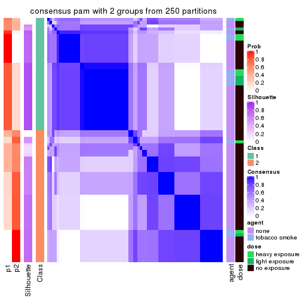</p>

</div>
<div id='tab-SD-pam-consensus-heatmap-2'>
<pre><code class="r">consensus_heatmap(res, k = 3)
</code></pre>

<p>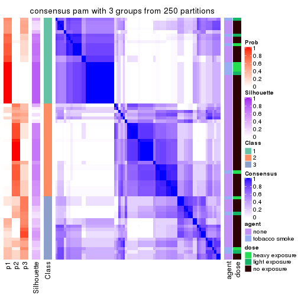</p>

</div>
<div id='tab-SD-pam-consensus-heatmap-3'>
<pre><code class="r">consensus_heatmap(res, k = 4)
</code></pre>

<p>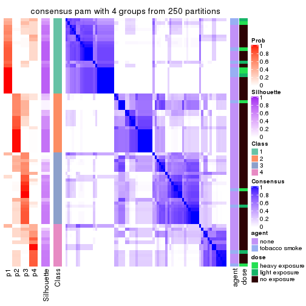</p>

</div>
<div id='tab-SD-pam-consensus-heatmap-4'>
<pre><code class="r">consensus_heatmap(res, k = 5)
</code></pre>

<p>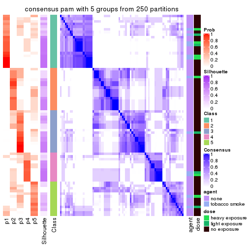</p>

</div>
<div id='tab-SD-pam-consensus-heatmap-5'>
<pre><code class="r">consensus_heatmap(res, k = 6)
</code></pre>

<p>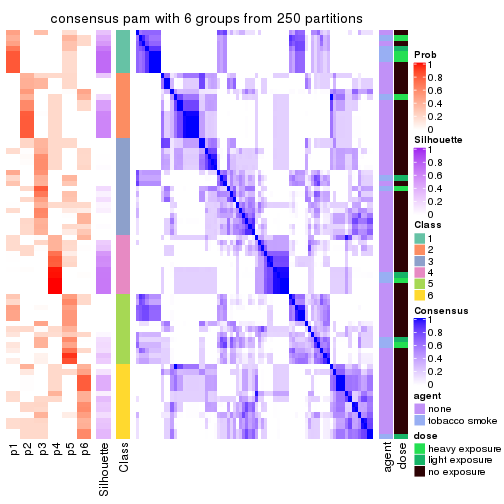</p>

</div>
</div>

Heatmaps for the membership of samples in all partitions to see how consistent they are:


<script>
$( function() {
	$( '#tabs-SD-pam-membership-heatmap' ).tabs();
} );
</script>
<div id='tabs-SD-pam-membership-heatmap'>
<ul>
<li><a href='#tab-SD-pam-membership-heatmap-1'>k = 2</a></li>
<li><a href='#tab-SD-pam-membership-heatmap-2'>k = 3</a></li>
<li><a href='#tab-SD-pam-membership-heatmap-3'>k = 4</a></li>
<li><a href='#tab-SD-pam-membership-heatmap-4'>k = 5</a></li>
<li><a href='#tab-SD-pam-membership-heatmap-5'>k = 6</a></li>
</ul>
<div id='tab-SD-pam-membership-heatmap-1'>
<pre><code class="r">membership_heatmap(res, k = 2)
</code></pre>

<p>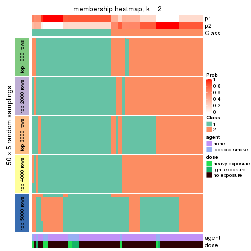</p>

</div>
<div id='tab-SD-pam-membership-heatmap-2'>
<pre><code class="r">membership_heatmap(res, k = 3)
</code></pre>

<p>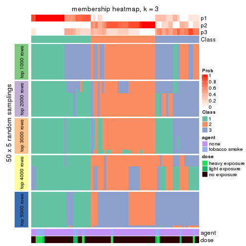</p>

</div>
<div id='tab-SD-pam-membership-heatmap-3'>
<pre><code class="r">membership_heatmap(res, k = 4)
</code></pre>

<p>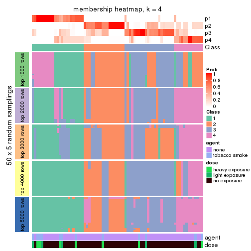</p>

</div>
<div id='tab-SD-pam-membership-heatmap-4'>
<pre><code class="r">membership_heatmap(res, k = 5)
</code></pre>

<p>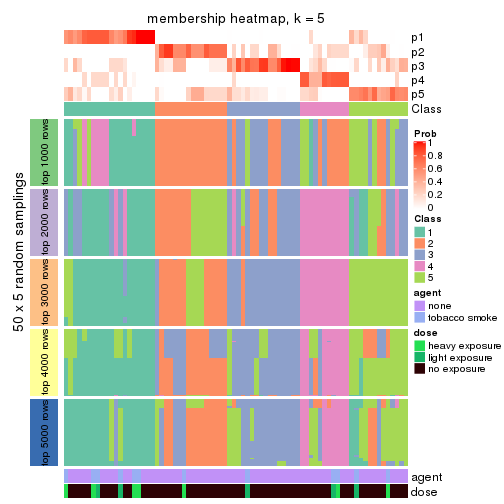</p>

</div>
<div id='tab-SD-pam-membership-heatmap-5'>
<pre><code class="r">membership_heatmap(res, k = 6)
</code></pre>

<p>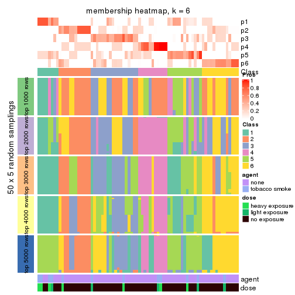</p>

</div>
</div>

As soon as we have had the classes for columns, we can look for signatures
which are significantly different between classes which can be candidate marks
for certain classes. Following are the heatmaps for signatures.


Signature heatmaps where rows are scaled:


<script>
$( function() {
	$( '#tabs-SD-pam-get-signatures' ).tabs();
} );
</script>
<div id='tabs-SD-pam-get-signatures'>
<ul>
<li><a href='#tab-SD-pam-get-signatures-1'>k = 2</a></li>
<li><a href='#tab-SD-pam-get-signatures-2'>k = 3</a></li>
<li><a href='#tab-SD-pam-get-signatures-3'>k = 4</a></li>
<li><a href='#tab-SD-pam-get-signatures-4'>k = 5</a></li>
<li><a href='#tab-SD-pam-get-signatures-5'>k = 6</a></li>
</ul>
<div id='tab-SD-pam-get-signatures-1'>
<pre><code class="r">get_signatures(res, k = 2)
</code></pre>

<p>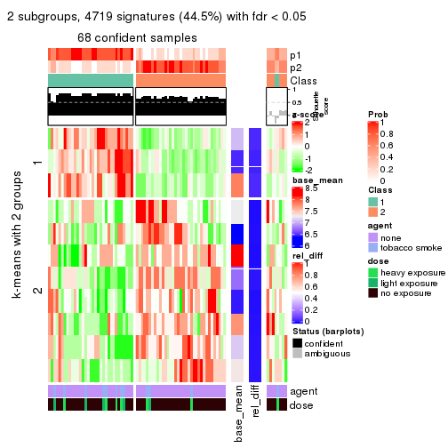</p>

</div>
<div id='tab-SD-pam-get-signatures-2'>
<pre><code class="r">get_signatures(res, k = 3)
</code></pre>

<p>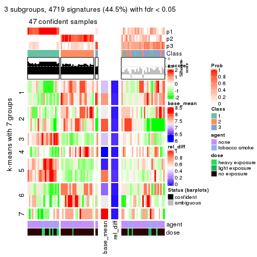</p>

</div>
<div id='tab-SD-pam-get-signatures-3'>
<pre><code class="r">get_signatures(res, k = 4)
</code></pre>

<p>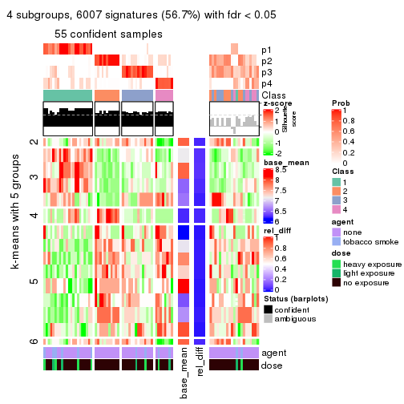</p>

</div>
<div id='tab-SD-pam-get-signatures-4'>
<pre><code class="r">get_signatures(res, k = 5)
</code></pre>

<p>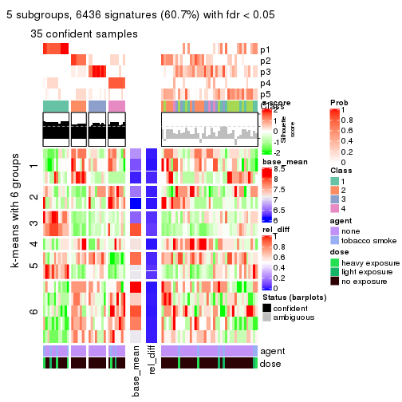</p>

</div>
<div id='tab-SD-pam-get-signatures-5'>
<pre><code class="r">get_signatures(res, k = 6)
</code></pre>

<p>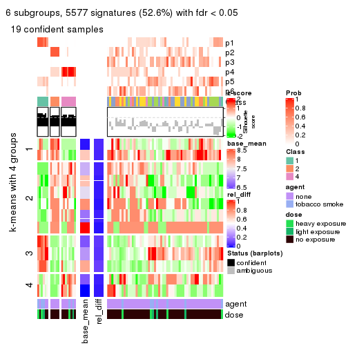</p>

</div>
</div>


Signature heatmaps where rows are not scaled:


<script>
$( function() {
	$( '#tabs-SD-pam-get-signatures-no-scale' ).tabs();
} );
</script>
<div id='tabs-SD-pam-get-signatures-no-scale'>
<ul>
<li><a href='#tab-SD-pam-get-signatures-no-scale-1'>k = 2</a></li>
<li><a href='#tab-SD-pam-get-signatures-no-scale-2'>k = 3</a></li>
<li><a href='#tab-SD-pam-get-signatures-no-scale-3'>k = 4</a></li>
<li><a href='#tab-SD-pam-get-signatures-no-scale-4'>k = 5</a></li>
<li><a href='#tab-SD-pam-get-signatures-no-scale-5'>k = 6</a></li>
</ul>
<div id='tab-SD-pam-get-signatures-no-scale-1'>
<pre><code class="r">get_signatures(res, k = 2, scale_rows = FALSE)
</code></pre>

<p>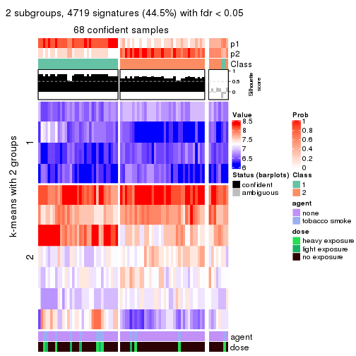</p>

</div>
<div id='tab-SD-pam-get-signatures-no-scale-2'>
<pre><code class="r">get_signatures(res, k = 3, scale_rows = FALSE)
</code></pre>

<p>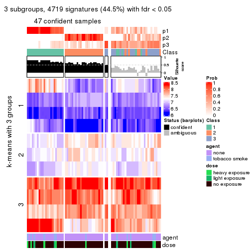</p>

</div>
<div id='tab-SD-pam-get-signatures-no-scale-3'>
<pre><code class="r">get_signatures(res, k = 4, scale_rows = FALSE)
</code></pre>

<p>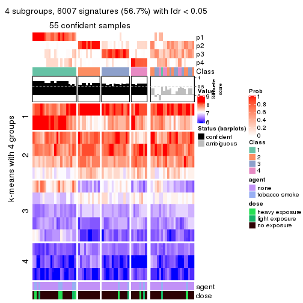</p>

</div>
<div id='tab-SD-pam-get-signatures-no-scale-4'>
<pre><code class="r">get_signatures(res, k = 5, scale_rows = FALSE)
</code></pre>

<p>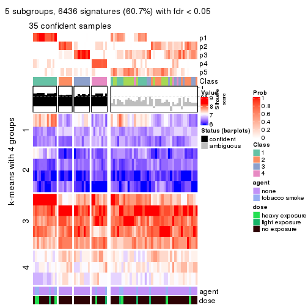</p>

</div>
<div id='tab-SD-pam-get-signatures-no-scale-5'>
<pre><code class="r">get_signatures(res, k = 6, scale_rows = FALSE)
</code></pre>

<p>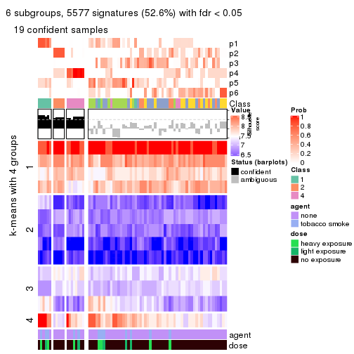</p>

</div>
</div>


Compare the overlap of signatures from different k:

```r
compare_signatures(res)
```

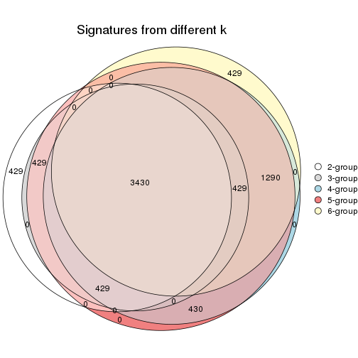

`get_signature()` returns a data frame invisibly. TO get the list of signatures, the function
call should be assigned to a variable explicitly. In following code, if `plot` argument is set
to `FALSE`, no heatmap is plotted while only the differential analysis is performed.

```r
# code only for demonstration
tb = get_signature(res, k = ..., plot = FALSE)
```

An example of the output of `tb` is:

```
#>   which_row         fdr    mean_1    mean_2 scaled_mean_1 scaled_mean_2 km
#> 1        38 0.042760348  8.373488  9.131774    -0.5533452     0.5164555  1
#> 2        40 0.018707592  7.106213  8.469186    -0.6173731     0.5762149  1
#> 3        55 0.019134737 10.221463 11.207825    -0.6159697     0.5749050  1
#> 4        59 0.006059896  5.921854  7.869574    -0.6899429     0.6439467  1
#> 5        60 0.018055526  8.928898 10.211722    -0.6204761     0.5791110  1
#> 6        98 0.009384629 15.714769 14.887706     0.6635654    -0.6193277  2
...
```

The columns in `tb` are:

1. `which_row`: row indices corresponding to the input matrix.
2. `fdr`: FDR for the differential test. 
3. `mean_x`: The mean value in group x.
4. `scaled_mean_x`: The mean value in group x after rows are scaled.
5. `km`: Row groups if k-means clustering is applied to rows.


UMAP plot which shows how samples are separated.


<script>
$( function() {
	$( '#tabs-SD-pam-dimension-reduction' ).tabs();
} );
</script>
<div id='tabs-SD-pam-dimension-reduction'>
<ul>
<li><a href='#tab-SD-pam-dimension-reduction-1'>k = 2</a></li>
<li><a href='#tab-SD-pam-dimension-reduction-2'>k = 3</a></li>
<li><a href='#tab-SD-pam-dimension-reduction-3'>k = 4</a></li>
<li><a href='#tab-SD-pam-dimension-reduction-4'>k = 5</a></li>
<li><a href='#tab-SD-pam-dimension-reduction-5'>k = 6</a></li>
</ul>
<div id='tab-SD-pam-dimension-reduction-1'>
<pre><code class="r">dimension_reduction(res, k = 2, method = &quot;UMAP&quot;)
</code></pre>

<p>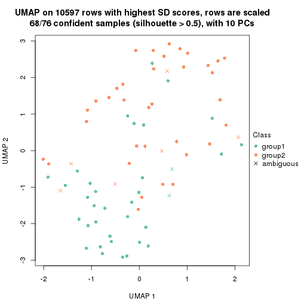</p>

</div>
<div id='tab-SD-pam-dimension-reduction-2'>
<pre><code class="r">dimension_reduction(res, k = 3, method = &quot;UMAP&quot;)
</code></pre>

<p>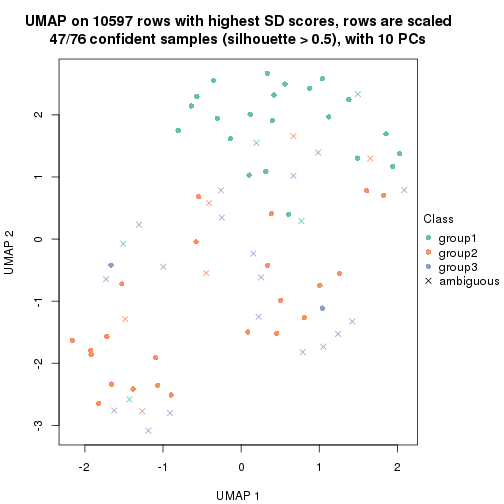</p>

</div>
<div id='tab-SD-pam-dimension-reduction-3'>
<pre><code class="r">dimension_reduction(res, k = 4, method = &quot;UMAP&quot;)
</code></pre>

<p>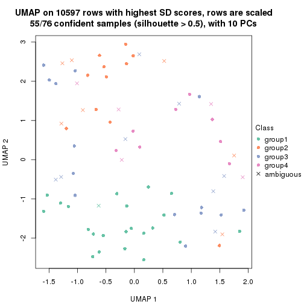</p>

</div>
<div id='tab-SD-pam-dimension-reduction-4'>
<pre><code class="r">dimension_reduction(res, k = 5, method = &quot;UMAP&quot;)
</code></pre>

<p>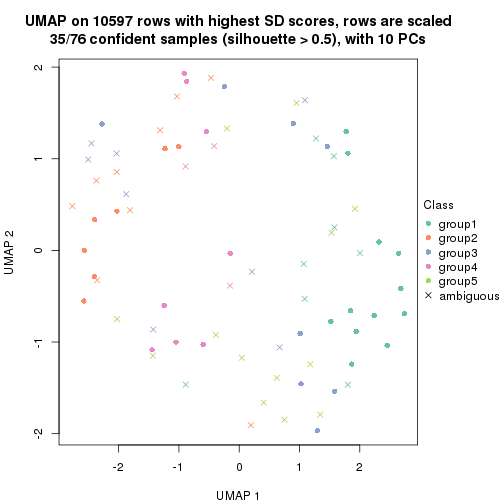</p>

</div>
<div id='tab-SD-pam-dimension-reduction-5'>
<pre><code class="r">dimension_reduction(res, k = 6, method = &quot;UMAP&quot;)
</code></pre>

<p>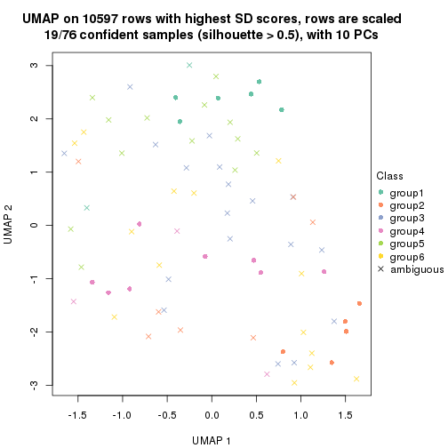</p>

</div>
</div>


Following heatmap shows how subgroups are split when increasing `k`:

```r
collect_classes(res)
```

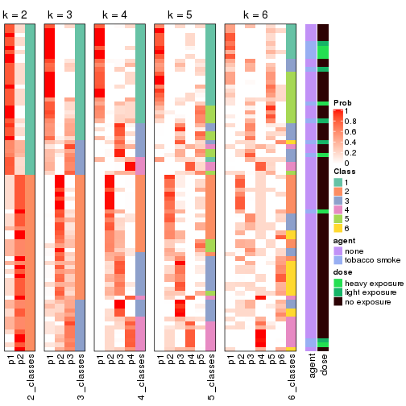


Test correlation between subgroups and known annotations. If the known
annotation is numeric, one-way ANOVA test is applied, and if the known
annotation is discrete, chi-squared contingency table test is applied.

```r
test_to_known_factors(res)
```

```
#>         n agent(p) dose(p) k
#> SD:pam 68    0.154   0.195 2
#> SD:pam 47    0.081   0.261 3
#> SD:pam 55    0.255   0.622 4
#> SD:pam 35    0.129   0.393 5
#> SD:pam 19    0.171   0.446 6
```


If matrix rows can be associated to genes, consider to use `GO_Enrichment(res,
...)` to perform function enrichment for the signature genes.


 

---------------------------------------------------


### SD:mclust


The object with results only for a single top-value method and a single partition method 
can be extracted as:

```r
res = res_list["SD", "mclust"]
# you can also extract it by
# res = res_list["SD:mclust"]
```

A summary of `res` and all the functions that can be applied to it:

```r
res
```

```
#> A 'ConsensusPartition' object with k = 2, 3, 4, 5, 6.
#>   On a matrix with 10597 rows and 76 columns.
#>   Top rows (1000, 2000, 3000, 4000, 5000) are extracted by 'SD' method.
#>   Subgroups are detected by 'mclust' method.
#>   Performed in total 1250 partitions by row resampling.
#>   Best k for subgroups seems to be 2.
#> 
#> Following methods can be applied to this 'ConsensusPartition' object:
#>  [1] "cola_report"             "collect_classes"         "collect_plots"          
#>  [4] "collect_stats"           "colnames"                "compare_signatures"     
#>  [7] "consensus_heatmap"       "dimension_reduction"     "functional_enrichment"  
#> [10] "get_anno_col"            "get_anno"                "get_classes"            
#> [13] "get_consensus"           "get_matrix"              "get_membership"         
#> [16] "get_param"               "get_signatures"          "get_stats"              
#> [19] "is_best_k"               "is_stable_k"             "membership_heatmap"     
#> [22] "ncol"                    "nrow"                    "plot_ecdf"              
#> [25] "rownames"                "select_partition_number" "show"                   
#> [28] "suggest_best_k"          "test_to_known_factors"
```

`collect_plots()` function collects all the plots made from `res` for all `k` (number of partitions)
into one single page to provide an easy and fast comparison between different `k`.

```r
collect_plots(res)
```

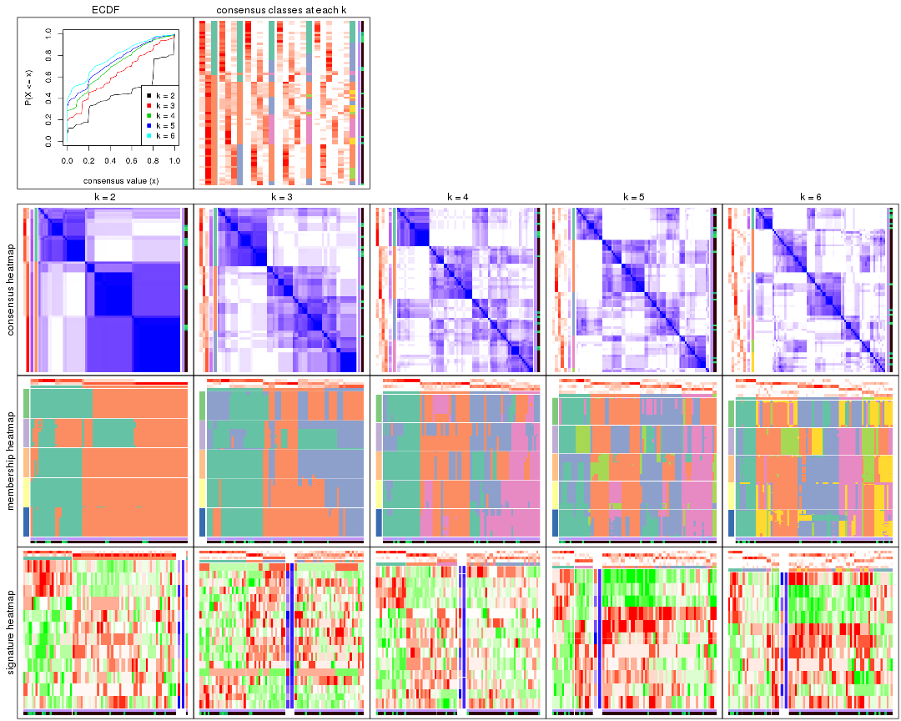

The plots are:

- The first row: a plot of the ECDF (Empirical cumulative distribution
  function) curves of the consensus matrix for each `k` and the heatmap of
  predicted classes for each `k`.
- The second row: heatmaps of the consensus matrix for each `k`.
- The third row: heatmaps of the membership matrix for each `k`.
- The fouth row: heatmaps of the signatures for each `k`.

All the plots in panels can be made by individual functions and they are
plotted later in this section.

`select_partition_number()` produces several plots showing different
statistics for choosing "optimized" `k`. There are following statistics:

- ECDF curves of the consensus matrix for each `k`;
- 1-PAC. [The PAC
  score](https://en.wikipedia.org/wiki/Consensus_clustering#Over-interpretation_potential_of_consensus_clustering)
  measures the proportion of the ambiguous subgrouping.
- Mean silhouette score.
- Concordance. The mean probability of fiting the consensus class ids in all
  partitions.
- Area increased. Denote $A_k$ as the area under the ECDF curve for current
  `k`, the area increased is defined as $A_k - A_{k-1}$.
- Rand index. The percent of pairs of samples that are both in a same cluster
  or both are not in a same cluster in the partition of k and k-1.
- Jaccard index. The ratio of pairs of samples are both in a same cluster in
  the partition of k and k-1 and the pairs of samples are both in a same
  cluster in the partition k or k-1.

The detailed explanations of these statistics can be found in [the cola
vignette](http://bioconductor.org/packages/devel/bioc/vignettes/cola/inst/doc/cola.html#toc_13).

Generally speaking, lower PAC score, higher mean silhouette score or higher
concordance corresponds to better partition. Rand index and Jaccard index
measure how similar the current partition is compared to partition with `k-1`.
If they are too similar, we won't accept `k` is better than `k-1`.

```r
select_partition_number(res)
```

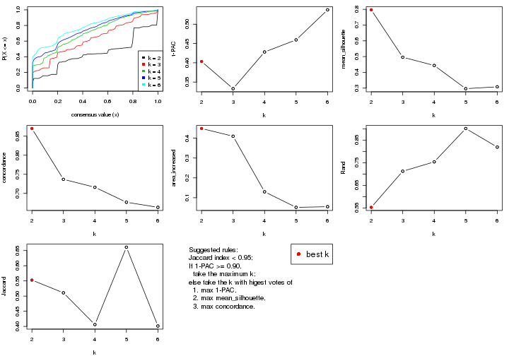

The numeric values for all these statistics can be obtained by `get_stats()`.

```r
get_stats(res)
```

```
#>   k 1-PAC mean_silhouette concordance area_increased  Rand Jaccard
#> 2 2 0.403           0.796       0.870         0.4488 0.553   0.553
#> 3 3 0.333           0.496       0.737         0.4099 0.712   0.511
#> 4 4 0.428           0.444       0.716         0.1298 0.754   0.406
#> 5 5 0.459           0.296       0.677         0.0515 0.901   0.661
#> 6 6 0.537           0.308       0.663         0.0547 0.819   0.401
```

`suggest_best_k()` suggests the best $k$ based on these statistics. The rules are as follows:

- All $k$ with Jaccard index larger than 0.95 are removed because the increase of
  the partition number does not provides enough extra information. If all $k$ are removed,
  the best $k$ is assigned by `NA`.
- For $k$ with 1-PAC larger than 0.9, the maximal $k$ is taken as the "best k". Other $k$ is called "optional k".
- If it does not fit the second rule. The $k$ with the highest vote of highest
  1-PAC, mean silhouette and concordance is taken as the "best k".

```r
suggest_best_k(res)
```

```
#> [1] 2
```


Following shows the table of the partitions (You need to click the **show/hide
code output** link to see it). The membership matrix (columns with name `p*`)
is inferred by
[`clue::cl_consensus()`](https://www.rdocumentation.org/link/cl_consensus?package=clue)
function with the `SE` method. Basically the value in the membership matrix
represents the probability to belong to a certain group. The finall class
label for an item is determined with the group with highest probability it
belongs to.

In `get_classes()` function, the entropy is calculated from the membership
matrix and the silhouette score is calculated from the consensus matrix.


<script>
$( function() {
	$( '#tabs-SD-mclust-get-classes' ).tabs();
} );
</script>
<div id='tabs-SD-mclust-get-classes'>
<ul>
<li><a href='#tab-SD-mclust-get-classes-1'>k = 2</a></li>
<li><a href='#tab-SD-mclust-get-classes-2'>k = 3</a></li>
<li><a href='#tab-SD-mclust-get-classes-3'>k = 4</a></li>
<li><a href='#tab-SD-mclust-get-classes-4'>k = 5</a></li>
<li><a href='#tab-SD-mclust-get-classes-5'>k = 6</a></li>
</ul>

<div id='tab-SD-mclust-get-classes-1'>
<p><a id='tab-SD-mclust-get-classes-1-a' style='color:#0366d6' href='#'>show/hide code output</a></p>
<pre><code class="r">cbind(get_classes(res, k = 2), get_membership(res, k = 2))
</code></pre>

<pre><code>#&gt;           class entropy silhouette    p1    p2
#&gt; GSM451162     2  0.7376     0.5836 0.208 0.792
#&gt; GSM451163     2  0.7219     0.8233 0.200 0.800
#&gt; GSM451164     2  0.7219     0.8233 0.200 0.800
#&gt; GSM451165     2  0.0376     0.8570 0.004 0.996
#&gt; GSM451167     2  0.7219     0.8233 0.200 0.800
#&gt; GSM451168     2  0.0000     0.8593 0.000 1.000
#&gt; GSM451169     2  0.7299     0.8216 0.204 0.796
#&gt; GSM451170     1  0.3733     0.8146 0.928 0.072
#&gt; GSM451171     2  0.0000     0.8593 0.000 1.000
#&gt; GSM451172     2  0.0376     0.8570 0.004 0.996
#&gt; GSM451173     1  0.9460     0.6415 0.636 0.364
#&gt; GSM451174     2  0.7219     0.8233 0.200 0.800
#&gt; GSM451175     1  0.8955     0.6380 0.688 0.312
#&gt; GSM451177     2  0.0000     0.8593 0.000 1.000
#&gt; GSM451178     2  0.7219     0.8233 0.200 0.800
#&gt; GSM451179     2  0.7299     0.8216 0.204 0.796
#&gt; GSM451180     2  0.0000     0.8593 0.000 1.000
#&gt; GSM451181     2  0.7219     0.8233 0.200 0.800
#&gt; GSM451182     1  0.7219     0.8428 0.800 0.200
#&gt; GSM451183     1  0.0376     0.7836 0.996 0.004
#&gt; GSM451184     1  0.9661     0.6480 0.608 0.392
#&gt; GSM451185     1  0.7219     0.8428 0.800 0.200
#&gt; GSM451186     2  0.7219     0.5885 0.200 0.800
#&gt; GSM451187     2  0.3274     0.8511 0.060 0.940
#&gt; GSM451188     2  0.0000     0.8593 0.000 1.000
#&gt; GSM451189     1  0.0376     0.7836 0.996 0.004
#&gt; GSM451190     1  0.3114     0.8094 0.944 0.056
#&gt; GSM451191     1  0.7219     0.8428 0.800 0.200
#&gt; GSM451193     2  0.7299     0.8216 0.204 0.796
#&gt; GSM451195     1  0.0000     0.7804 1.000 0.000
#&gt; GSM451196     1  0.7219     0.8428 0.800 0.200
#&gt; GSM451197     1  0.7219     0.8428 0.800 0.200
#&gt; GSM451199     1  0.7219     0.8428 0.800 0.200
#&gt; GSM451201     1  0.7219     0.8428 0.800 0.200
#&gt; GSM451202     2  0.0000     0.8593 0.000 1.000
#&gt; GSM451203     2  0.7299     0.8216 0.204 0.796
#&gt; GSM451204     2  0.7219     0.8233 0.200 0.800
#&gt; GSM451205     2  0.0000     0.8593 0.000 1.000
#&gt; GSM451206     2  0.7219     0.8233 0.200 0.800
#&gt; GSM451207     2  0.7219     0.8233 0.200 0.800
#&gt; GSM451208     2  0.0000     0.8593 0.000 1.000
#&gt; GSM451209     2  0.0000     0.8593 0.000 1.000
#&gt; GSM451210     2  0.0000     0.8593 0.000 1.000
#&gt; GSM451212     2  0.7219     0.8233 0.200 0.800
#&gt; GSM451213     2  0.7219     0.8233 0.200 0.800
#&gt; GSM451214     2  0.0000     0.8593 0.000 1.000
#&gt; GSM451215     2  0.0000     0.8593 0.000 1.000
#&gt; GSM451216     2  0.7139     0.8242 0.196 0.804
#&gt; GSM451217     2  0.7139     0.8242 0.196 0.804
#&gt; GSM451219     1  0.9710     0.6320 0.600 0.400
#&gt; GSM451220     2  0.9732     0.5632 0.404 0.596
#&gt; GSM451221     1  0.8327     0.8062 0.736 0.264
#&gt; GSM451222     1  0.9866    -0.0827 0.568 0.432
#&gt; GSM451224     2  0.0000     0.8593 0.000 1.000
#&gt; GSM451225     2  0.7219     0.5885 0.200 0.800
#&gt; GSM451226     2  0.0376     0.8570 0.004 0.996
#&gt; GSM451227     2  0.0000     0.8593 0.000 1.000
#&gt; GSM451228     2  0.7219     0.8233 0.200 0.800
#&gt; GSM451230     2  0.7219     0.5885 0.200 0.800
#&gt; GSM451231     2  0.0000     0.8593 0.000 1.000
#&gt; GSM451233     2  0.0000     0.8593 0.000 1.000
#&gt; GSM451234     2  0.0000     0.8593 0.000 1.000
#&gt; GSM451235     2  0.0000     0.8593 0.000 1.000
#&gt; GSM451236     2  0.0000     0.8593 0.000 1.000
#&gt; GSM451166     2  0.7219     0.8233 0.200 0.800
#&gt; GSM451194     1  0.8555     0.7931 0.720 0.280
#&gt; GSM451198     1  0.0000     0.7804 1.000 0.000
#&gt; GSM451218     2  0.0000     0.8593 0.000 1.000
#&gt; GSM451232     1  0.7219     0.8428 0.800 0.200
#&gt; GSM451176     1  0.0376     0.7836 0.996 0.004
#&gt; GSM451192     1  0.7219     0.8428 0.800 0.200
#&gt; GSM451200     1  0.0376     0.7836 0.996 0.004
#&gt; GSM451211     2  0.0000     0.8593 0.000 1.000
#&gt; GSM451223     2  0.7219     0.8233 0.200 0.800
#&gt; GSM451229     1  0.7219     0.8428 0.800 0.200
#&gt; GSM451237     2  0.0000     0.8593 0.000 1.000
</code></pre>

<script>
$('#tab-SD-mclust-get-classes-1-a').parent().next().next().hide();
$('#tab-SD-mclust-get-classes-1-a').click(function(){
  $('#tab-SD-mclust-get-classes-1-a').parent().next().next().toggle();
  return(false);
});
</script>
</div>

<div id='tab-SD-mclust-get-classes-2'>
<p><a id='tab-SD-mclust-get-classes-2-a' style='color:#0366d6' href='#'>show/hide code output</a></p>
<pre><code class="r">cbind(get_classes(res, k = 3), get_membership(res, k = 3))
</code></pre>

<pre><code>#&gt;           class entropy silhouette    p1    p2    p3
#&gt; GSM451162     2  0.9982     0.2670 0.344 0.352 0.304
#&gt; GSM451163     3  0.9049     0.2313 0.136 0.400 0.464
#&gt; GSM451164     3  0.8906     0.3546 0.136 0.344 0.520
#&gt; GSM451165     2  0.6260    -0.0517 0.000 0.552 0.448
#&gt; GSM451167     3  0.9509     0.1085 0.336 0.200 0.464
#&gt; GSM451168     3  0.6126     0.4373 0.000 0.400 0.600
#&gt; GSM451169     2  0.9993     0.2528 0.336 0.348 0.316
#&gt; GSM451170     1  0.4555     0.7875 0.800 0.000 0.200
#&gt; GSM451171     2  0.6295    -0.2927 0.000 0.528 0.472
#&gt; GSM451172     2  0.8720     0.2788 0.136 0.560 0.304
#&gt; GSM451173     1  0.4555     0.4158 0.800 0.200 0.000
#&gt; GSM451174     2  0.8460     0.3660 0.136 0.600 0.264
#&gt; GSM451175     1  0.0000     0.7264 1.000 0.000 0.000
#&gt; GSM451177     3  0.4555     0.6746 0.000 0.200 0.800
#&gt; GSM451178     2  0.8460     0.3660 0.136 0.600 0.264
#&gt; GSM451179     1  0.6585     0.2868 0.736 0.200 0.064
#&gt; GSM451180     3  0.4555     0.6746 0.000 0.200 0.800
#&gt; GSM451181     3  0.9037     0.2522 0.136 0.392 0.472
#&gt; GSM451182     1  0.5810     0.7533 0.664 0.000 0.336
#&gt; GSM451183     1  0.4555     0.7875 0.800 0.000 0.200
#&gt; GSM451184     1  0.4555     0.6461 0.800 0.000 0.200
#&gt; GSM451185     1  0.5810     0.7533 0.664 0.000 0.336
#&gt; GSM451186     2  0.5147     0.4320 0.020 0.800 0.180
#&gt; GSM451187     2  0.8784     0.2471 0.136 0.548 0.316
#&gt; GSM451188     3  0.4555     0.6746 0.000 0.200 0.800
#&gt; GSM451189     1  0.4555     0.7875 0.800 0.000 0.200
#&gt; GSM451190     1  0.4291     0.7866 0.820 0.000 0.180
#&gt; GSM451191     1  0.5810     0.7533 0.664 0.000 0.336
#&gt; GSM451193     2  0.9872     0.3424 0.336 0.400 0.264
#&gt; GSM451195     1  0.0000     0.7264 1.000 0.000 0.000
#&gt; GSM451196     1  0.4555     0.7875 0.800 0.000 0.200
#&gt; GSM451197     1  0.5810     0.7533 0.664 0.000 0.336
#&gt; GSM451199     1  0.3619     0.7081 0.864 0.000 0.136
#&gt; GSM451201     1  0.7530     0.7506 0.664 0.084 0.252
#&gt; GSM451202     3  0.4555     0.6746 0.000 0.200 0.800
#&gt; GSM451203     1  0.6585     0.2868 0.736 0.200 0.064
#&gt; GSM451204     2  0.3619     0.5304 0.136 0.864 0.000
#&gt; GSM451205     3  0.4555     0.6746 0.000 0.200 0.800
#&gt; GSM451206     2  0.8460     0.3660 0.136 0.600 0.264
#&gt; GSM451207     2  0.8460     0.3660 0.136 0.600 0.264
#&gt; GSM451208     3  0.4555     0.6746 0.000 0.200 0.800
#&gt; GSM451209     2  0.5016     0.4633 0.240 0.760 0.000
#&gt; GSM451210     3  0.4555     0.6746 0.000 0.200 0.800
#&gt; GSM451212     2  0.8231     0.3973 0.136 0.628 0.236
#&gt; GSM451213     2  0.8399     0.3762 0.136 0.608 0.256
#&gt; GSM451214     3  0.4555     0.5008 0.200 0.000 0.800
#&gt; GSM451215     3  0.4555     0.6746 0.000 0.200 0.800
#&gt; GSM451216     2  0.3619     0.5304 0.136 0.864 0.000
#&gt; GSM451217     3  0.9049     0.2313 0.136 0.400 0.464
#&gt; GSM451219     1  0.5902     0.7565 0.680 0.004 0.316
#&gt; GSM451220     1  0.6126    -0.1850 0.600 0.400 0.000
#&gt; GSM451221     1  0.3619     0.7081 0.864 0.000 0.136
#&gt; GSM451222     2  0.8623     0.4117 0.224 0.600 0.176
#&gt; GSM451224     3  0.4555     0.6746 0.000 0.200 0.800
#&gt; GSM451225     2  0.5147     0.4320 0.020 0.800 0.180
#&gt; GSM451226     3  0.9531    -0.0578 0.200 0.344 0.456
#&gt; GSM451227     3  0.4555     0.5008 0.200 0.000 0.800
#&gt; GSM451228     2  0.9872     0.3424 0.336 0.400 0.264
#&gt; GSM451230     2  0.4555     0.4522 0.200 0.800 0.000
#&gt; GSM451231     2  0.4784     0.4519 0.200 0.796 0.004
#&gt; GSM451233     2  0.3619     0.5304 0.136 0.864 0.000
#&gt; GSM451234     2  0.0000     0.5001 0.000 1.000 0.000
#&gt; GSM451235     2  0.0000     0.5001 0.000 1.000 0.000
#&gt; GSM451236     2  0.0000     0.5001 0.000 1.000 0.000
#&gt; GSM451166     2  0.9804     0.3589 0.336 0.416 0.248
#&gt; GSM451194     1  0.0424     0.7232 0.992 0.008 0.000
#&gt; GSM451198     1  0.4291     0.7866 0.820 0.000 0.180
#&gt; GSM451218     2  0.0000     0.5001 0.000 1.000 0.000
#&gt; GSM451232     1  0.4555     0.7875 0.800 0.000 0.200
#&gt; GSM451176     1  0.4555     0.7875 0.800 0.000 0.200
#&gt; GSM451192     1  0.5178     0.7853 0.744 0.000 0.256
#&gt; GSM451200     1  0.0000     0.7264 1.000 0.000 0.000
#&gt; GSM451211     2  0.6126     0.1069 0.000 0.600 0.400
#&gt; GSM451223     3  0.9509     0.1085 0.336 0.200 0.464
#&gt; GSM451229     1  0.5810     0.7533 0.664 0.000 0.336
#&gt; GSM451237     2  0.0000     0.5001 0.000 1.000 0.000
</code></pre>

<script>
$('#tab-SD-mclust-get-classes-2-a').parent().next().next().hide();
$('#tab-SD-mclust-get-classes-2-a').click(function(){
  $('#tab-SD-mclust-get-classes-2-a').parent().next().next().toggle();
  return(false);
});
</script>
</div>

<div id='tab-SD-mclust-get-classes-3'>
<p><a id='tab-SD-mclust-get-classes-3-a' style='color:#0366d6' href='#'>show/hide code output</a></p>
<pre><code class="r">cbind(get_classes(res, k = 4), get_membership(res, k = 4))
</code></pre>

<pre><code>#&gt;           class entropy silhouette    p1    p2    p3    p4
#&gt; GSM451162     3  0.5056     0.4134 0.044 0.224 0.732 0.000
#&gt; GSM451163     2  0.6404     0.5104 0.000 0.644 0.220 0.136
#&gt; GSM451164     2  0.6656     0.5402 0.000 0.608 0.256 0.136
#&gt; GSM451165     3  0.7304    -0.2581 0.000 0.400 0.448 0.152
#&gt; GSM451167     2  0.6130     0.1518 0.000 0.512 0.440 0.048
#&gt; GSM451168     2  0.3401     0.5346 0.000 0.840 0.152 0.008
#&gt; GSM451169     3  0.4431     0.2760 0.000 0.304 0.696 0.000
#&gt; GSM451170     1  0.4830     0.4631 0.608 0.000 0.392 0.000
#&gt; GSM451171     2  0.5217     0.5924 0.000 0.756 0.108 0.136
#&gt; GSM451172     2  0.7883     0.1850 0.000 0.376 0.336 0.288
#&gt; GSM451173     3  0.6031     0.2865 0.388 0.000 0.564 0.048
#&gt; GSM451174     2  0.7437    -0.0720 0.000 0.512 0.240 0.248
#&gt; GSM451175     1  0.4981     0.1624 0.536 0.000 0.464 0.000
#&gt; GSM451177     2  0.0000     0.6322 0.000 1.000 0.000 0.000
#&gt; GSM451178     2  0.7390    -0.0181 0.000 0.512 0.284 0.204
#&gt; GSM451179     3  0.5322     0.3900 0.312 0.000 0.660 0.028
#&gt; GSM451180     2  0.2868     0.6214 0.000 0.864 0.000 0.136
#&gt; GSM451181     2  0.5609     0.5615 0.000 0.712 0.088 0.200
#&gt; GSM451182     1  0.0469     0.7997 0.988 0.000 0.012 0.000
#&gt; GSM451183     1  0.2149     0.7747 0.912 0.000 0.088 0.000
#&gt; GSM451184     3  0.5940     0.2226 0.240 0.088 0.672 0.000
#&gt; GSM451185     1  0.0000     0.8017 1.000 0.000 0.000 0.000
#&gt; GSM451186     4  0.6414     0.4445 0.240 0.000 0.124 0.636
#&gt; GSM451187     2  0.6823     0.4516 0.000 0.596 0.244 0.160
#&gt; GSM451188     2  0.3610     0.5462 0.000 0.800 0.200 0.000
#&gt; GSM451189     1  0.2149     0.7747 0.912 0.000 0.088 0.000
#&gt; GSM451190     1  0.3649     0.6957 0.796 0.000 0.204 0.000
#&gt; GSM451191     1  0.4655     0.5611 0.684 0.000 0.312 0.004
#&gt; GSM451193     3  0.3610     0.3849 0.000 0.200 0.800 0.000
#&gt; GSM451195     3  0.4961    -0.0205 0.448 0.000 0.552 0.000
#&gt; GSM451196     1  0.0000     0.8017 1.000 0.000 0.000 0.000
#&gt; GSM451197     1  0.0000     0.8017 1.000 0.000 0.000 0.000
#&gt; GSM451199     1  0.4477     0.4563 0.688 0.000 0.312 0.000
#&gt; GSM451201     1  0.0000     0.8017 1.000 0.000 0.000 0.000
#&gt; GSM451202     2  0.0000     0.6322 0.000 1.000 0.000 0.000
#&gt; GSM451203     3  0.4994     0.4698 0.208 0.000 0.744 0.048
#&gt; GSM451204     4  0.5420     0.5004 0.000 0.024 0.352 0.624
#&gt; GSM451205     2  0.2868     0.6214 0.000 0.864 0.000 0.136
#&gt; GSM451206     2  0.7437    -0.0720 0.000 0.512 0.240 0.248
#&gt; GSM451207     4  0.7609     0.1315 0.000 0.200 0.396 0.404
#&gt; GSM451208     2  0.0000     0.6322 0.000 1.000 0.000 0.000
#&gt; GSM451209     4  0.4713     0.5674 0.000 0.000 0.360 0.640
#&gt; GSM451210     2  0.3610     0.5462 0.000 0.800 0.200 0.000
#&gt; GSM451212     3  0.6946     0.0536 0.000 0.200 0.588 0.212
#&gt; GSM451213     3  0.7896    -0.3107 0.000 0.336 0.368 0.296
#&gt; GSM451214     2  0.4855     0.3773 0.000 0.600 0.400 0.000
#&gt; GSM451215     2  0.0000     0.6322 0.000 1.000 0.000 0.000
#&gt; GSM451216     4  0.7632     0.4751 0.000 0.288 0.244 0.468
#&gt; GSM451217     2  0.2589     0.6021 0.000 0.884 0.116 0.000
#&gt; GSM451219     1  0.6158     0.5216 0.640 0.088 0.272 0.000
#&gt; GSM451220     3  0.3610     0.4813 0.200 0.000 0.800 0.000
#&gt; GSM451221     3  0.6536     0.1320 0.352 0.088 0.560 0.000
#&gt; GSM451222     4  0.7008     0.3864 0.116 0.000 0.436 0.448
#&gt; GSM451224     2  0.5218     0.5255 0.000 0.736 0.200 0.064
#&gt; GSM451225     4  0.6373     0.5981 0.136 0.000 0.216 0.648
#&gt; GSM451226     3  0.3505     0.3162 0.000 0.088 0.864 0.048
#&gt; GSM451227     2  0.4855     0.3773 0.000 0.600 0.400 0.000
#&gt; GSM451228     3  0.6855     0.0777 0.000 0.200 0.600 0.200
#&gt; GSM451230     4  0.4679     0.5698 0.000 0.000 0.352 0.648
#&gt; GSM451231     4  0.4981     0.4199 0.000 0.000 0.464 0.536
#&gt; GSM451233     4  0.3873     0.6018 0.000 0.000 0.228 0.772
#&gt; GSM451234     4  0.6416     0.6598 0.000 0.200 0.152 0.648
#&gt; GSM451235     4  0.6416     0.6598 0.000 0.200 0.152 0.648
#&gt; GSM451236     4  0.7181     0.5178 0.000 0.336 0.152 0.512
#&gt; GSM451166     3  0.7182    -0.0250 0.000 0.200 0.552 0.248
#&gt; GSM451194     3  0.4746     0.1521 0.368 0.000 0.632 0.000
#&gt; GSM451198     1  0.3610     0.6985 0.800 0.000 0.200 0.000
#&gt; GSM451218     4  0.6416     0.6598 0.000 0.200 0.152 0.648
#&gt; GSM451232     1  0.0000     0.8017 1.000 0.000 0.000 0.000
#&gt; GSM451176     1  0.2149     0.7747 0.912 0.000 0.088 0.000
#&gt; GSM451192     1  0.0000     0.8017 1.000 0.000 0.000 0.000
#&gt; GSM451200     3  0.4933     0.0147 0.432 0.000 0.568 0.000
#&gt; GSM451211     2  0.6771     0.0320 0.000 0.600 0.152 0.248
#&gt; GSM451223     3  0.2408     0.3634 0.000 0.104 0.896 0.000
#&gt; GSM451229     1  0.0000     0.8017 1.000 0.000 0.000 0.000
#&gt; GSM451237     4  0.6416     0.6598 0.000 0.200 0.152 0.648
</code></pre>

<script>
$('#tab-SD-mclust-get-classes-3-a').parent().next().next().hide();
$('#tab-SD-mclust-get-classes-3-a').click(function(){
  $('#tab-SD-mclust-get-classes-3-a').parent().next().next().toggle();
  return(false);
});
</script>
</div>

<div id='tab-SD-mclust-get-classes-4'>
<p><a id='tab-SD-mclust-get-classes-4-a' style='color:#0366d6' href='#'>show/hide code output</a></p>
<pre><code class="r">cbind(get_classes(res, k = 5), get_membership(res, k = 5))
</code></pre>

<pre><code>#&gt;           class entropy silhouette    p1    p2    p3    p4    p5
#&gt; GSM451162     3  0.3246    0.33474 0.008 0.184 0.808 0.000 0.000
#&gt; GSM451163     2  0.4135    0.18029 0.000 0.656 0.340 0.004 0.000
#&gt; GSM451164     2  0.5905    0.10086 0.000 0.572 0.292 0.000 0.136
#&gt; GSM451165     5  0.6196    0.30147 0.000 0.388 0.100 0.012 0.500
#&gt; GSM451167     3  0.4632   -0.16637 0.000 0.448 0.540 0.012 0.000
#&gt; GSM451168     2  0.4927    0.19373 0.000 0.744 0.136 0.016 0.104
#&gt; GSM451169     3  0.3246    0.33530 0.008 0.184 0.808 0.000 0.000
#&gt; GSM451170     1  0.6554    0.45085 0.408 0.000 0.392 0.000 0.200
#&gt; GSM451171     2  0.0000    0.33955 0.000 1.000 0.000 0.000 0.000
#&gt; GSM451172     5  0.6626    0.23717 0.000 0.340 0.228 0.000 0.432
#&gt; GSM451173     3  0.8004   -0.04358 0.104 0.000 0.384 0.312 0.200
#&gt; GSM451174     2  0.7458    0.05238 0.000 0.388 0.344 0.228 0.040
#&gt; GSM451175     3  0.7921   -0.18780 0.240 0.000 0.444 0.116 0.200
#&gt; GSM451177     2  0.2020    0.27273 0.000 0.900 0.000 0.000 0.100
#&gt; GSM451178     2  0.7449    0.05041 0.000 0.384 0.352 0.224 0.040
#&gt; GSM451179     3  0.1768    0.46359 0.072 0.000 0.924 0.004 0.000
#&gt; GSM451180     2  0.0000    0.33955 0.000 1.000 0.000 0.000 0.000
#&gt; GSM451181     2  0.3143    0.24745 0.000 0.796 0.204 0.000 0.000
#&gt; GSM451182     1  0.3999    0.51345 0.656 0.000 0.344 0.000 0.000
#&gt; GSM451183     1  0.5631    0.62632 0.636 0.000 0.164 0.000 0.200
#&gt; GSM451184     3  0.5487    0.22938 0.132 0.200 0.664 0.000 0.004
#&gt; GSM451185     1  0.2471    0.61579 0.864 0.000 0.136 0.000 0.000
#&gt; GSM451186     4  0.5405    0.36966 0.076 0.000 0.016 0.672 0.236
#&gt; GSM451187     2  0.4135    0.18029 0.000 0.656 0.340 0.004 0.000
#&gt; GSM451188     2  0.4255    0.15311 0.000 0.788 0.060 0.012 0.140
#&gt; GSM451189     1  0.6398    0.55260 0.500 0.000 0.300 0.000 0.200
#&gt; GSM451190     3  0.8071   -0.33489 0.316 0.000 0.372 0.112 0.200
#&gt; GSM451191     1  0.5627    0.42309 0.548 0.000 0.368 0.000 0.084
#&gt; GSM451193     3  0.3854    0.32826 0.008 0.180 0.792 0.004 0.016
#&gt; GSM451195     3  0.5211    0.23909 0.212 0.000 0.676 0.112 0.000
#&gt; GSM451196     1  0.3109    0.62758 0.800 0.000 0.000 0.000 0.200
#&gt; GSM451197     1  0.0000    0.61105 1.000 0.000 0.000 0.000 0.000
#&gt; GSM451199     1  0.6002    0.17369 0.452 0.000 0.436 0.112 0.000
#&gt; GSM451201     1  0.0162    0.61148 0.996 0.000 0.004 0.000 0.000
#&gt; GSM451202     2  0.2248    0.27396 0.000 0.900 0.000 0.012 0.088
#&gt; GSM451203     3  0.1831    0.46180 0.076 0.000 0.920 0.004 0.000
#&gt; GSM451204     4  0.6343    0.34558 0.000 0.200 0.284 0.516 0.000
#&gt; GSM451205     2  0.0290    0.33675 0.000 0.992 0.000 0.000 0.008
#&gt; GSM451206     2  0.7241   -0.03478 0.000 0.388 0.280 0.312 0.020
#&gt; GSM451207     2  0.7589    0.04401 0.000 0.384 0.344 0.220 0.052
#&gt; GSM451208     2  0.0404    0.33711 0.000 0.988 0.000 0.012 0.000
#&gt; GSM451209     4  0.3109    0.57341 0.000 0.000 0.200 0.800 0.000
#&gt; GSM451210     2  0.3821    0.16441 0.000 0.800 0.052 0.000 0.148
#&gt; GSM451212     2  0.8119   -0.02196 0.000 0.332 0.320 0.248 0.100
#&gt; GSM451213     4  0.8000    0.14081 0.000 0.324 0.204 0.372 0.100
#&gt; GSM451214     2  0.5791   -0.04288 0.000 0.600 0.260 0.000 0.140
#&gt; GSM451215     2  0.0404    0.33724 0.000 0.988 0.000 0.000 0.012
#&gt; GSM451216     4  0.7566    0.23417 0.000 0.304 0.204 0.432 0.060
#&gt; GSM451217     2  0.3109    0.24830 0.000 0.800 0.200 0.000 0.000
#&gt; GSM451219     3  0.7186    0.10914 0.260 0.100 0.532 0.108 0.000
#&gt; GSM451220     3  0.3420    0.43485 0.084 0.000 0.840 0.076 0.000
#&gt; GSM451221     3  0.3999    0.13766 0.344 0.000 0.656 0.000 0.000
#&gt; GSM451222     4  0.4933    0.42520 0.004 0.000 0.084 0.712 0.200
#&gt; GSM451224     2  0.4255    0.15311 0.000 0.788 0.060 0.012 0.140
#&gt; GSM451225     4  0.3391    0.57723 0.012 0.000 0.188 0.800 0.000
#&gt; GSM451226     3  0.4212    0.29008 0.000 0.236 0.736 0.024 0.004
#&gt; GSM451227     2  0.5791   -0.04288 0.000 0.600 0.260 0.000 0.140
#&gt; GSM451228     3  0.7153   -0.01515 0.000 0.152 0.552 0.212 0.084
#&gt; GSM451230     4  0.1851    0.57076 0.000 0.000 0.088 0.912 0.000
#&gt; GSM451231     4  0.3612    0.53786 0.000 0.000 0.268 0.732 0.000
#&gt; GSM451233     4  0.3496    0.62433 0.000 0.200 0.012 0.788 0.000
#&gt; GSM451234     4  0.3282    0.62749 0.000 0.188 0.008 0.804 0.000
#&gt; GSM451235     4  0.3282    0.62749 0.000 0.188 0.008 0.804 0.000
#&gt; GSM451236     4  0.5219    0.49416 0.000 0.300 0.004 0.636 0.060
#&gt; GSM451166     3  0.7069   -0.05202 0.000 0.136 0.544 0.248 0.072
#&gt; GSM451194     3  0.6441    0.06488 0.188 0.000 0.612 0.040 0.160
#&gt; GSM451198     1  0.8227    0.38884 0.324 0.000 0.288 0.112 0.276
#&gt; GSM451218     4  0.4270    0.61672 0.000 0.188 0.008 0.764 0.040
#&gt; GSM451232     1  0.3266    0.62833 0.796 0.000 0.004 0.000 0.200
#&gt; GSM451176     1  0.5375    0.64091 0.664 0.000 0.136 0.000 0.200
#&gt; GSM451192     1  0.5597    0.62723 0.640 0.000 0.160 0.000 0.200
#&gt; GSM451200     3  0.7742   -0.13651 0.208 0.000 0.480 0.112 0.200
#&gt; GSM451211     2  0.6529   -0.00569 0.000 0.588 0.132 0.240 0.040
#&gt; GSM451223     3  0.4524    0.15097 0.008 0.132 0.768 0.000 0.092
#&gt; GSM451229     1  0.0000    0.61105 1.000 0.000 0.000 0.000 0.000
#&gt; GSM451237     4  0.3282    0.62749 0.000 0.188 0.008 0.804 0.000
</code></pre>

<script>
$('#tab-SD-mclust-get-classes-4-a').parent().next().next().hide();
$('#tab-SD-mclust-get-classes-4-a').click(function(){
  $('#tab-SD-mclust-get-classes-4-a').parent().next().next().toggle();
  return(false);
});
</script>
</div>

<div id='tab-SD-mclust-get-classes-5'>
<p><a id='tab-SD-mclust-get-classes-5-a' style='color:#0366d6' href='#'>show/hide code output</a></p>
<pre><code class="r">cbind(get_classes(res, k = 6), get_membership(res, k = 6))
</code></pre>

<pre><code>#&gt;           class entropy silhouette    p1    p2    p3    p4    p5    p6
#&gt; GSM451162     3  0.3923    0.34189 0.000 0.416 0.580 0.000 0.000 0.004
#&gt; GSM451163     2  0.0790    0.38555 0.000 0.968 0.000 0.000 0.000 0.032
#&gt; GSM451164     2  0.0790    0.35912 0.000 0.968 0.000 0.000 0.032 0.000
#&gt; GSM451165     5  0.6259    0.14063 0.048 0.196 0.000 0.000 0.548 0.208
#&gt; GSM451167     2  0.4386    0.17987 0.000 0.708 0.200 0.000 0.000 0.092
#&gt; GSM451168     2  0.5656   -0.07585 0.000 0.584 0.000 0.012 0.200 0.204
#&gt; GSM451169     3  0.3975    0.28103 0.000 0.452 0.544 0.000 0.000 0.004
#&gt; GSM451170     3  0.5351    0.34278 0.200 0.000 0.592 0.000 0.000 0.208
#&gt; GSM451171     2  0.3265    0.03404 0.000 0.748 0.000 0.000 0.248 0.004
#&gt; GSM451172     2  0.5425    0.14216 0.048 0.548 0.000 0.000 0.364 0.040
#&gt; GSM451173     4  0.5917   -0.10894 0.000 0.000 0.392 0.400 0.000 0.208
#&gt; GSM451174     2  0.4260   -0.29012 0.000 0.512 0.000 0.016 0.000 0.472
#&gt; GSM451175     3  0.3777    0.60983 0.008 0.000 0.756 0.028 0.000 0.208
#&gt; GSM451177     2  0.4578   -0.27756 0.000 0.520 0.000 0.000 0.444 0.036
#&gt; GSM451178     6  0.4181    0.20691 0.000 0.476 0.000 0.012 0.000 0.512
#&gt; GSM451179     3  0.3101    0.58565 0.000 0.244 0.756 0.000 0.000 0.000
#&gt; GSM451180     2  0.3448   -0.03441 0.000 0.716 0.000 0.000 0.280 0.004
#&gt; GSM451181     2  0.1444    0.32695 0.000 0.928 0.000 0.000 0.072 0.000
#&gt; GSM451182     3  0.4032    0.06640 0.420 0.000 0.572 0.000 0.000 0.008
#&gt; GSM451183     1  0.5618    0.43612 0.540 0.000 0.252 0.000 0.000 0.208
#&gt; GSM451184     3  0.0363    0.62754 0.012 0.000 0.988 0.000 0.000 0.000
#&gt; GSM451185     1  0.3050    0.63569 0.764 0.000 0.236 0.000 0.000 0.000
#&gt; GSM451186     4  0.7816    0.22495 0.164 0.004 0.044 0.452 0.120 0.216
#&gt; GSM451187     2  0.2597    0.20861 0.000 0.824 0.000 0.000 0.000 0.176
#&gt; GSM451188     5  0.5675    0.58568 0.000 0.344 0.000 0.000 0.488 0.168
#&gt; GSM451189     3  0.5873   -0.04968 0.340 0.000 0.452 0.000 0.000 0.208
#&gt; GSM451190     3  0.5788    0.05814 0.316 0.000 0.484 0.000 0.000 0.200
#&gt; GSM451191     3  0.4756    0.19927 0.212 0.000 0.684 0.000 0.096 0.008
#&gt; GSM451193     2  0.6157   -0.14925 0.000 0.436 0.384 0.164 0.008 0.008
#&gt; GSM451195     3  0.2854    0.62319 0.000 0.000 0.792 0.000 0.000 0.208
#&gt; GSM451196     1  0.1267    0.76048 0.940 0.000 0.060 0.000 0.000 0.000
#&gt; GSM451197     1  0.1075    0.75606 0.952 0.000 0.048 0.000 0.000 0.000
#&gt; GSM451199     3  0.0622    0.62702 0.012 0.000 0.980 0.000 0.000 0.008
#&gt; GSM451201     1  0.1333    0.75821 0.944 0.000 0.048 0.000 0.000 0.008
#&gt; GSM451202     2  0.5740   -0.25538 0.000 0.540 0.000 0.008 0.284 0.168
#&gt; GSM451203     3  0.3101    0.58565 0.000 0.244 0.756 0.000 0.000 0.000
#&gt; GSM451204     2  0.5462   -0.33053 0.000 0.476 0.000 0.400 0.000 0.124
#&gt; GSM451205     2  0.3309   -0.03204 0.000 0.720 0.000 0.000 0.280 0.000
#&gt; GSM451206     2  0.7004   -0.20133 0.000 0.488 0.000 0.180 0.164 0.168
#&gt; GSM451207     2  0.3819   -0.10396 0.000 0.672 0.000 0.012 0.000 0.316
#&gt; GSM451208     2  0.5544   -0.24591 0.000 0.544 0.000 0.000 0.280 0.176
#&gt; GSM451209     4  0.4680    0.50957 0.000 0.000 0.200 0.680 0.000 0.120
#&gt; GSM451210     5  0.4105    0.53975 0.000 0.348 0.000 0.000 0.632 0.020
#&gt; GSM451212     6  0.4260    0.33178 0.000 0.472 0.000 0.016 0.000 0.512
#&gt; GSM451213     6  0.4843    0.47129 0.000 0.232 0.000 0.116 0.000 0.652
#&gt; GSM451214     5  0.6305    0.55757 0.000 0.312 0.036 0.164 0.488 0.000
#&gt; GSM451215     2  0.4453   -0.27132 0.000 0.528 0.000 0.000 0.444 0.028
#&gt; GSM451216     6  0.5927    0.29410 0.000 0.232 0.000 0.316 0.000 0.452
#&gt; GSM451217     2  0.1462    0.34412 0.000 0.936 0.000 0.000 0.056 0.008
#&gt; GSM451219     3  0.0260    0.62748 0.008 0.000 0.992 0.000 0.000 0.000
#&gt; GSM451220     3  0.3916    0.63690 0.000 0.064 0.752 0.000 0.000 0.184
#&gt; GSM451221     3  0.0363    0.62754 0.012 0.000 0.988 0.000 0.000 0.000
#&gt; GSM451222     4  0.5304    0.43511 0.000 0.000 0.200 0.600 0.000 0.200
#&gt; GSM451224     5  0.5675    0.58568 0.000 0.344 0.000 0.000 0.488 0.168
#&gt; GSM451225     4  0.3319    0.49726 0.164 0.000 0.036 0.800 0.000 0.000
#&gt; GSM451226     3  0.4966    0.53772 0.000 0.084 0.692 0.000 0.192 0.032
#&gt; GSM451227     5  0.5779    0.45521 0.000 0.312 0.200 0.000 0.488 0.000
#&gt; GSM451228     6  0.6446    0.35278 0.000 0.352 0.036 0.176 0.000 0.436
#&gt; GSM451230     4  0.2793    0.53094 0.000 0.000 0.200 0.800 0.000 0.000
#&gt; GSM451231     4  0.5514    0.47635 0.000 0.044 0.200 0.644 0.000 0.112
#&gt; GSM451233     4  0.2933    0.42239 0.000 0.200 0.000 0.796 0.000 0.004
#&gt; GSM451234     4  0.4264    0.37606 0.000 0.032 0.000 0.636 0.000 0.332
#&gt; GSM451235     4  0.4264    0.37606 0.000 0.032 0.000 0.636 0.000 0.332
#&gt; GSM451236     6  0.4535   -0.14602 0.000 0.032 0.000 0.480 0.000 0.488
#&gt; GSM451166     6  0.6200    0.33941 0.000 0.276 0.228 0.016 0.000 0.480
#&gt; GSM451194     3  0.3352    0.62801 0.000 0.000 0.792 0.032 0.000 0.176
#&gt; GSM451198     1  0.6591    0.17820 0.396 0.000 0.360 0.000 0.036 0.208
#&gt; GSM451218     6  0.3833   -0.16897 0.000 0.000 0.000 0.444 0.000 0.556
#&gt; GSM451232     1  0.1524    0.76033 0.932 0.000 0.060 0.000 0.000 0.008
#&gt; GSM451176     1  0.5501    0.47313 0.564 0.000 0.236 0.000 0.000 0.200
#&gt; GSM451192     1  0.3398    0.61813 0.740 0.000 0.252 0.000 0.000 0.008
#&gt; GSM451200     3  0.2793    0.62585 0.000 0.000 0.800 0.000 0.000 0.200
#&gt; GSM451211     6  0.6082    0.00534 0.000 0.280 0.000 0.016 0.200 0.504
#&gt; GSM451223     3  0.4147    0.32551 0.000 0.436 0.552 0.000 0.012 0.000
#&gt; GSM451229     1  0.1267    0.76048 0.940 0.000 0.060 0.000 0.000 0.000
#&gt; GSM451237     4  0.4026    0.37974 0.000 0.016 0.000 0.636 0.000 0.348
</code></pre>

<script>
$('#tab-SD-mclust-get-classes-5-a').parent().next().next().hide();
$('#tab-SD-mclust-get-classes-5-a').click(function(){
  $('#tab-SD-mclust-get-classes-5-a').parent().next().next().toggle();
  return(false);
});
</script>
</div>
</div>

Heatmaps for the consensus matrix. It visualizes the probability of two
samples to be in a same group.


<script>
$( function() {
	$( '#tabs-SD-mclust-consensus-heatmap' ).tabs();
} );
</script>
<div id='tabs-SD-mclust-consensus-heatmap'>
<ul>
<li><a href='#tab-SD-mclust-consensus-heatmap-1'>k = 2</a></li>
<li><a href='#tab-SD-mclust-consensus-heatmap-2'>k = 3</a></li>
<li><a href='#tab-SD-mclust-consensus-heatmap-3'>k = 4</a></li>
<li><a href='#tab-SD-mclust-consensus-heatmap-4'>k = 5</a></li>
<li><a href='#tab-SD-mclust-consensus-heatmap-5'>k = 6</a></li>
</ul>
<div id='tab-SD-mclust-consensus-heatmap-1'>
<pre><code class="r">consensus_heatmap(res, k = 2)
</code></pre>

<p>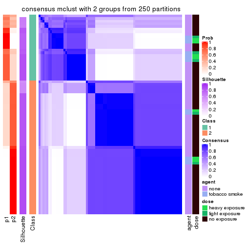</p>

</div>
<div id='tab-SD-mclust-consensus-heatmap-2'>
<pre><code class="r">consensus_heatmap(res, k = 3)
</code></pre>

<p>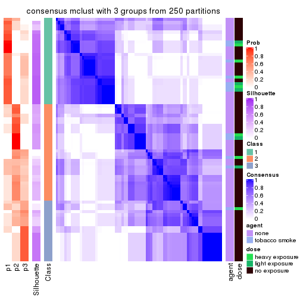</p>

</div>
<div id='tab-SD-mclust-consensus-heatmap-3'>
<pre><code class="r">consensus_heatmap(res, k = 4)
</code></pre>

<p>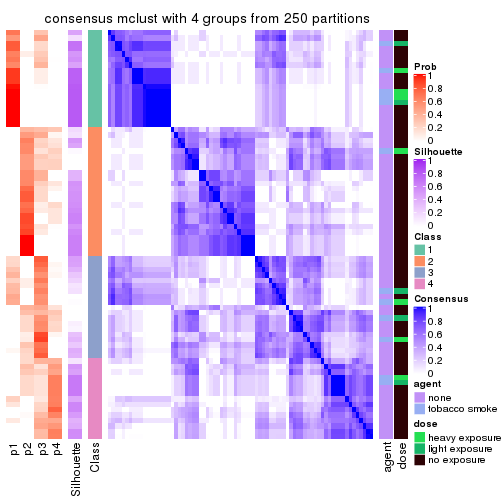</p>

</div>
<div id='tab-SD-mclust-consensus-heatmap-4'>
<pre><code class="r">consensus_heatmap(res, k = 5)
</code></pre>

<p>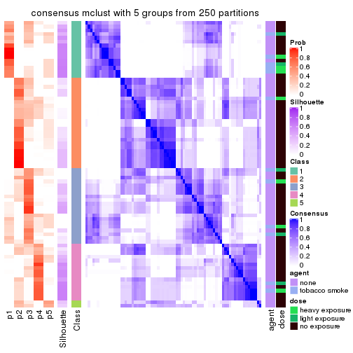</p>

</div>
<div id='tab-SD-mclust-consensus-heatmap-5'>
<pre><code class="r">consensus_heatmap(res, k = 6)
</code></pre>

<p>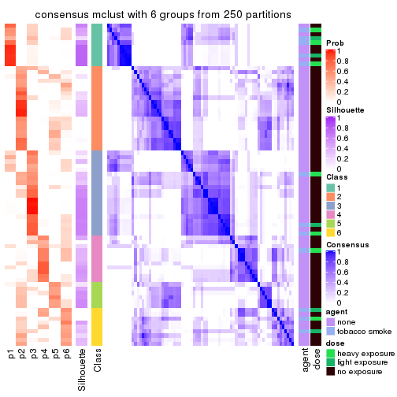</p>

</div>
</div>

Heatmaps for the membership of samples in all partitions to see how consistent they are:


<script>
$( function() {
	$( '#tabs-SD-mclust-membership-heatmap' ).tabs();
} );
</script>
<div id='tabs-SD-mclust-membership-heatmap'>
<ul>
<li><a href='#tab-SD-mclust-membership-heatmap-1'>k = 2</a></li>
<li><a href='#tab-SD-mclust-membership-heatmap-2'>k = 3</a></li>
<li><a href='#tab-SD-mclust-membership-heatmap-3'>k = 4</a></li>
<li><a href='#tab-SD-mclust-membership-heatmap-4'>k = 5</a></li>
<li><a href='#tab-SD-mclust-membership-heatmap-5'>k = 6</a></li>
</ul>
<div id='tab-SD-mclust-membership-heatmap-1'>
<pre><code class="r">membership_heatmap(res, k = 2)
</code></pre>

<p>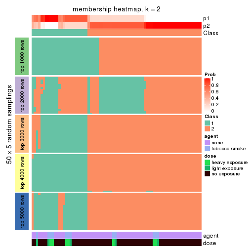</p>

</div>
<div id='tab-SD-mclust-membership-heatmap-2'>
<pre><code class="r">membership_heatmap(res, k = 3)
</code></pre>

<p>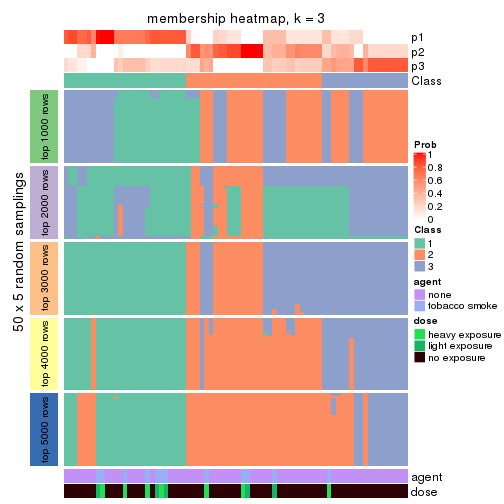</p>

</div>
<div id='tab-SD-mclust-membership-heatmap-3'>
<pre><code class="r">membership_heatmap(res, k = 4)
</code></pre>

<p>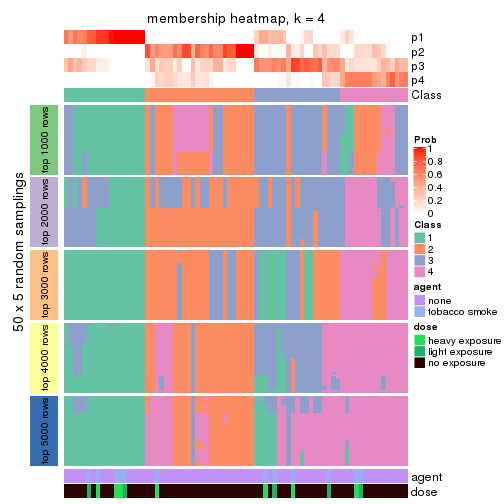</p>

</div>
<div id='tab-SD-mclust-membership-heatmap-4'>
<pre><code class="r">membership_heatmap(res, k = 5)
</code></pre>

<p>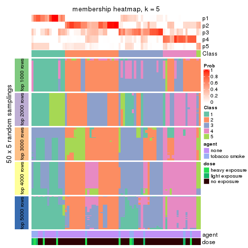</p>

</div>
<div id='tab-SD-mclust-membership-heatmap-5'>
<pre><code class="r">membership_heatmap(res, k = 6)
</code></pre>

<p>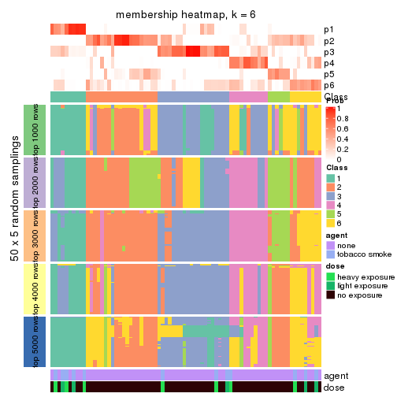</p>

</div>
</div>

As soon as we have had the classes for columns, we can look for signatures
which are significantly different between classes which can be candidate marks
for certain classes. Following are the heatmaps for signatures.


Signature heatmaps where rows are scaled:


<script>
$( function() {
	$( '#tabs-SD-mclust-get-signatures' ).tabs();
} );
</script>
<div id='tabs-SD-mclust-get-signatures'>
<ul>
<li><a href='#tab-SD-mclust-get-signatures-1'>k = 2</a></li>
<li><a href='#tab-SD-mclust-get-signatures-2'>k = 3</a></li>
<li><a href='#tab-SD-mclust-get-signatures-3'>k = 4</a></li>
<li><a href='#tab-SD-mclust-get-signatures-4'>k = 5</a></li>
<li><a href='#tab-SD-mclust-get-signatures-5'>k = 6</a></li>
</ul>
<div id='tab-SD-mclust-get-signatures-1'>
<pre><code class="r">get_signatures(res, k = 2)
</code></pre>

<p>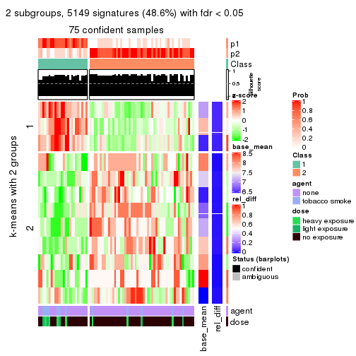</p>

</div>
<div id='tab-SD-mclust-get-signatures-2'>
<pre><code class="r">get_signatures(res, k = 3)
</code></pre>

<p>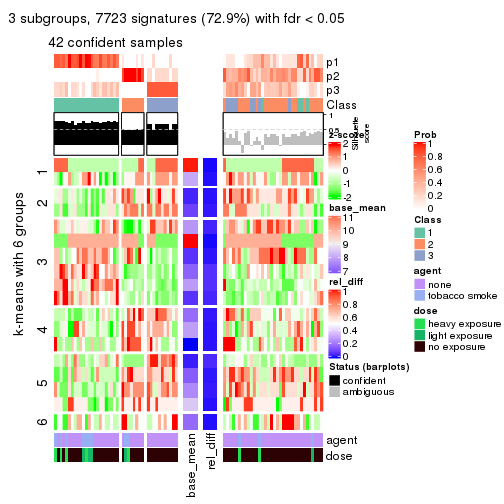</p>

</div>
<div id='tab-SD-mclust-get-signatures-3'>
<pre><code class="r">get_signatures(res, k = 4)
</code></pre>

<p>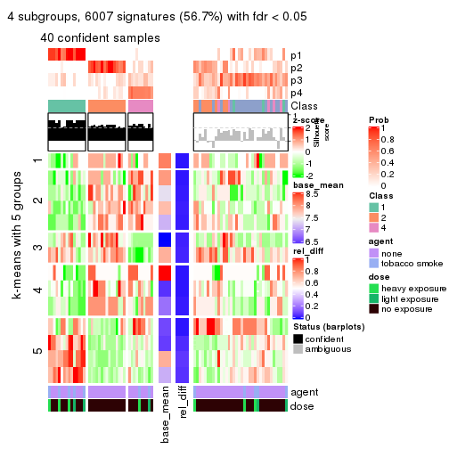</p>

</div>
<div id='tab-SD-mclust-get-signatures-4'>
<pre><code class="r">get_signatures(res, k = 5)
</code></pre>

<p>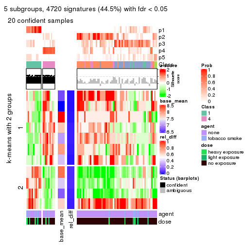</p>

</div>
<div id='tab-SD-mclust-get-signatures-5'>
<pre><code class="r">get_signatures(res, k = 6)
</code></pre>

<p>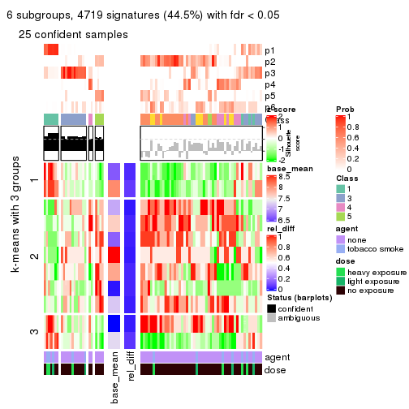</p>

</div>
</div>


Signature heatmaps where rows are not scaled:


<script>
$( function() {
	$( '#tabs-SD-mclust-get-signatures-no-scale' ).tabs();
} );
</script>
<div id='tabs-SD-mclust-get-signatures-no-scale'>
<ul>
<li><a href='#tab-SD-mclust-get-signatures-no-scale-1'>k = 2</a></li>
<li><a href='#tab-SD-mclust-get-signatures-no-scale-2'>k = 3</a></li>
<li><a href='#tab-SD-mclust-get-signatures-no-scale-3'>k = 4</a></li>
<li><a href='#tab-SD-mclust-get-signatures-no-scale-4'>k = 5</a></li>
<li><a href='#tab-SD-mclust-get-signatures-no-scale-5'>k = 6</a></li>
</ul>
<div id='tab-SD-mclust-get-signatures-no-scale-1'>
<pre><code class="r">get_signatures(res, k = 2, scale_rows = FALSE)
</code></pre>

<p>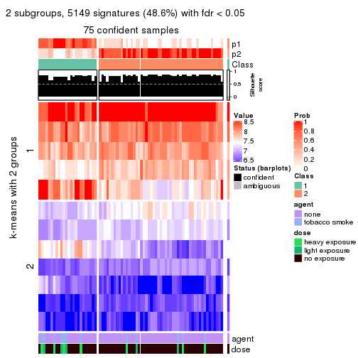</p>

</div>
<div id='tab-SD-mclust-get-signatures-no-scale-2'>
<pre><code class="r">get_signatures(res, k = 3, scale_rows = FALSE)
</code></pre>

<p>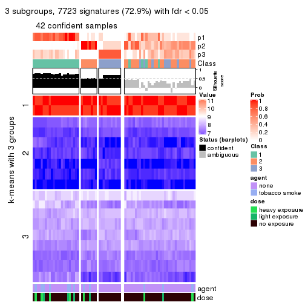</p>

</div>
<div id='tab-SD-mclust-get-signatures-no-scale-3'>
<pre><code class="r">get_signatures(res, k = 4, scale_rows = FALSE)
</code></pre>

<p>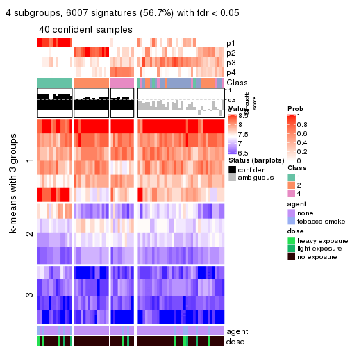</p>

</div>
<div id='tab-SD-mclust-get-signatures-no-scale-4'>
<pre><code class="r">get_signatures(res, k = 5, scale_rows = FALSE)
</code></pre>

<p>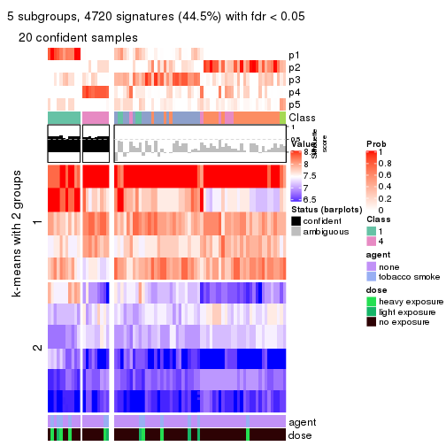</p>

</div>
<div id='tab-SD-mclust-get-signatures-no-scale-5'>
<pre><code class="r">get_signatures(res, k = 6, scale_rows = FALSE)
</code></pre>

<p>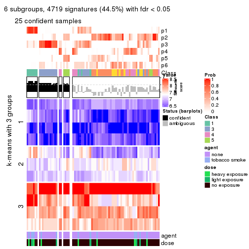</p>

</div>
</div>


Compare the overlap of signatures from different k:

```r
compare_signatures(res)
```

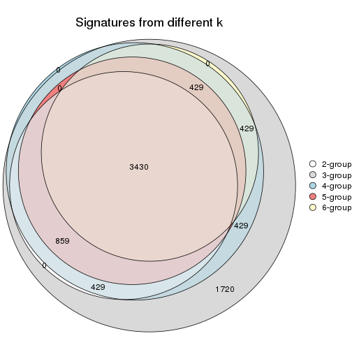

`get_signature()` returns a data frame invisibly. TO get the list of signatures, the function
call should be assigned to a variable explicitly. In following code, if `plot` argument is set
to `FALSE`, no heatmap is plotted while only the differential analysis is performed.

```r
# code only for demonstration
tb = get_signature(res, k = ..., plot = FALSE)
```

An example of the output of `tb` is:

```
#>   which_row         fdr    mean_1    mean_2 scaled_mean_1 scaled_mean_2 km
#> 1        38 0.042760348  8.373488  9.131774    -0.5533452     0.5164555  1
#> 2        40 0.018707592  7.106213  8.469186    -0.6173731     0.5762149  1
#> 3        55 0.019134737 10.221463 11.207825    -0.6159697     0.5749050  1
#> 4        59 0.006059896  5.921854  7.869574    -0.6899429     0.6439467  1
#> 5        60 0.018055526  8.928898 10.211722    -0.6204761     0.5791110  1
#> 6        98 0.009384629 15.714769 14.887706     0.6635654    -0.6193277  2
...
```

The columns in `tb` are:

1. `which_row`: row indices corresponding to the input matrix.
2. `fdr`: FDR for the differential test. 
3. `mean_x`: The mean value in group x.
4. `scaled_mean_x`: The mean value in group x after rows are scaled.
5. `km`: Row groups if k-means clustering is applied to rows.


UMAP plot which shows how samples are separated.


<script>
$( function() {
	$( '#tabs-SD-mclust-dimension-reduction' ).tabs();
} );
</script>
<div id='tabs-SD-mclust-dimension-reduction'>
<ul>
<li><a href='#tab-SD-mclust-dimension-reduction-1'>k = 2</a></li>
<li><a href='#tab-SD-mclust-dimension-reduction-2'>k = 3</a></li>
<li><a href='#tab-SD-mclust-dimension-reduction-3'>k = 4</a></li>
<li><a href='#tab-SD-mclust-dimension-reduction-4'>k = 5</a></li>
<li><a href='#tab-SD-mclust-dimension-reduction-5'>k = 6</a></li>
</ul>
<div id='tab-SD-mclust-dimension-reduction-1'>
<pre><code class="r">dimension_reduction(res, k = 2, method = &quot;UMAP&quot;)
</code></pre>

<p>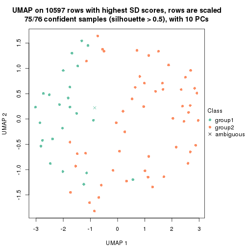</p>

</div>
<div id='tab-SD-mclust-dimension-reduction-2'>
<pre><code class="r">dimension_reduction(res, k = 3, method = &quot;UMAP&quot;)
</code></pre>

<p>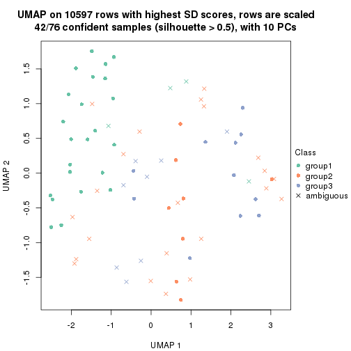</p>

</div>
<div id='tab-SD-mclust-dimension-reduction-3'>
<pre><code class="r">dimension_reduction(res, k = 4, method = &quot;UMAP&quot;)
</code></pre>

<p>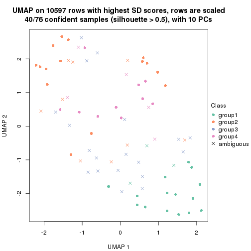</p>

</div>
<div id='tab-SD-mclust-dimension-reduction-4'>
<pre><code class="r">dimension_reduction(res, k = 5, method = &quot;UMAP&quot;)
</code></pre>

<p>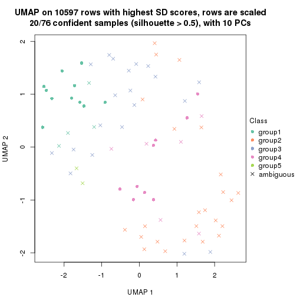</p>

</div>
<div id='tab-SD-mclust-dimension-reduction-5'>
<pre><code class="r">dimension_reduction(res, k = 6, method = &quot;UMAP&quot;)
</code></pre>

<p>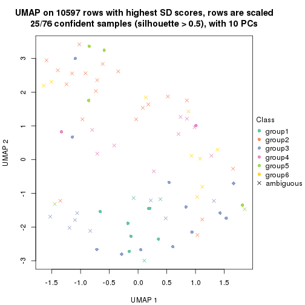</p>

</div>
</div>


Following heatmap shows how subgroups are split when increasing `k`:

```r
collect_classes(res)
```

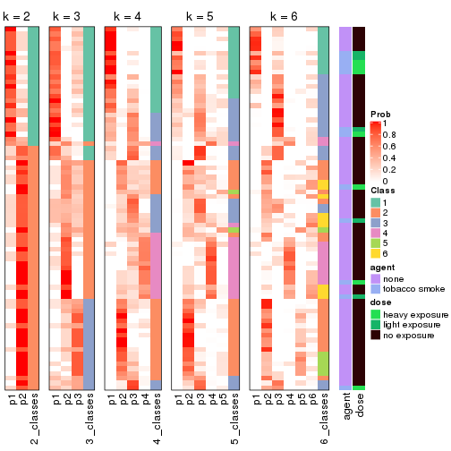


Test correlation between subgroups and known annotations. If the known
annotation is numeric, one-way ANOVA test is applied, and if the known
annotation is discrete, chi-squared contingency table test is applied.

```r
test_to_known_factors(res)
```

```
#>            n agent(p) dose(p) k
#> SD:mclust 75   0.0725   0.102 2
#> SD:mclust 42   0.1244   0.379 3
#> SD:mclust 40   0.0542   0.206 4
#> SD:mclust 20   0.8445   0.668 5
#> SD:mclust 25   0.2760   0.669 6
```


If matrix rows can be associated to genes, consider to use `GO_Enrichment(res,
...)` to perform function enrichment for the signature genes.


 

---------------------------------------------------


### SD:NMF


The object with results only for a single top-value method and a single partition method 
can be extracted as:

```r
res = res_list["SD", "NMF"]
# you can also extract it by
# res = res_list["SD:NMF"]
```

A summary of `res` and all the functions that can be applied to it:

```r
res
```

```
#> A 'ConsensusPartition' object with k = 2, 3, 4, 5, 6.
#>   On a matrix with 10597 rows and 76 columns.
#>   Top rows (1000, 2000, 3000, 4000, 5000) are extracted by 'SD' method.
#>   Subgroups are detected by 'NMF' method.
#>   Performed in total 1250 partitions by row resampling.
#>   Best k for subgroups seems to be 2.
#> 
#> Following methods can be applied to this 'ConsensusPartition' object:
#>  [1] "cola_report"             "collect_classes"         "collect_plots"          
#>  [4] "collect_stats"           "colnames"                "compare_signatures"     
#>  [7] "consensus_heatmap"       "dimension_reduction"     "functional_enrichment"  
#> [10] "get_anno_col"            "get_anno"                "get_classes"            
#> [13] "get_consensus"           "get_matrix"              "get_membership"         
#> [16] "get_param"               "get_signatures"          "get_stats"              
#> [19] "is_best_k"               "is_stable_k"             "membership_heatmap"     
#> [22] "ncol"                    "nrow"                    "plot_ecdf"              
#> [25] "rownames"                "select_partition_number" "show"                   
#> [28] "suggest_best_k"          "test_to_known_factors"
```

`collect_plots()` function collects all the plots made from `res` for all `k` (number of partitions)
into one single page to provide an easy and fast comparison between different `k`.

```r
collect_plots(res)
```

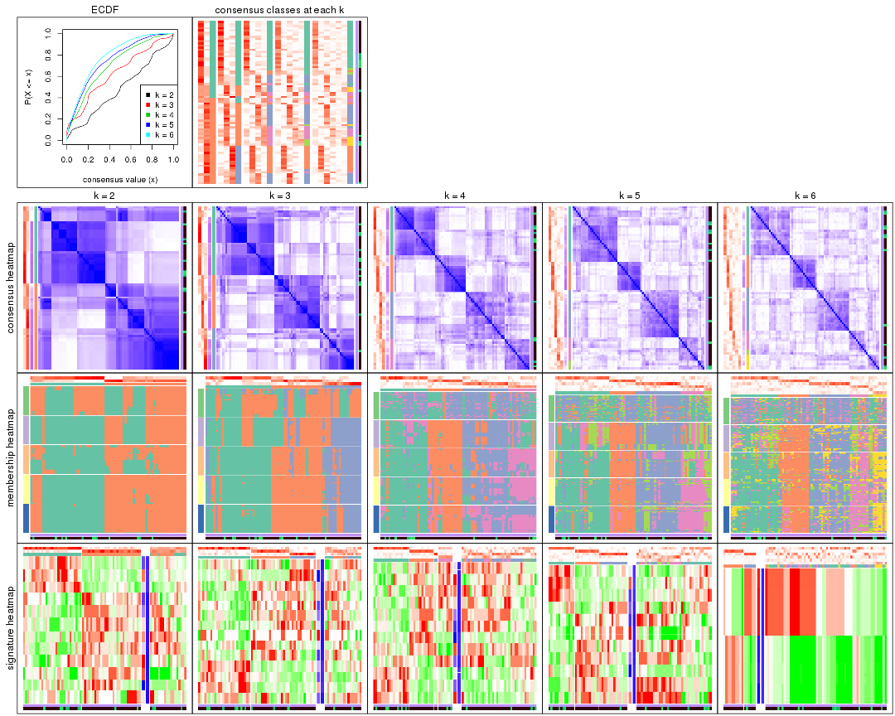

The plots are:

- The first row: a plot of the ECDF (Empirical cumulative distribution
  function) curves of the consensus matrix for each `k` and the heatmap of
  predicted classes for each `k`.
- The second row: heatmaps of the consensus matrix for each `k`.
- The third row: heatmaps of the membership matrix for each `k`.
- The fouth row: heatmaps of the signatures for each `k`.

All the plots in panels can be made by individual functions and they are
plotted later in this section.

`select_partition_number()` produces several plots showing different
statistics for choosing "optimized" `k`. There are following statistics:

- ECDF curves of the consensus matrix for each `k`;
- 1-PAC. [The PAC
  score](https://en.wikipedia.org/wiki/Consensus_clustering#Over-interpretation_potential_of_consensus_clustering)
  measures the proportion of the ambiguous subgrouping.
- Mean silhouette score.
- Concordance. The mean probability of fiting the consensus class ids in all
  partitions.
- Area increased. Denote $A_k$ as the area under the ECDF curve for current
  `k`, the area increased is defined as $A_k - A_{k-1}$.
- Rand index. The percent of pairs of samples that are both in a same cluster
  or both are not in a same cluster in the partition of k and k-1.
- Jaccard index. The ratio of pairs of samples are both in a same cluster in
  the partition of k and k-1 and the pairs of samples are both in a same
  cluster in the partition k or k-1.

The detailed explanations of these statistics can be found in [the cola
vignette](http://bioconductor.org/packages/devel/bioc/vignettes/cola/inst/doc/cola.html#toc_13).

Generally speaking, lower PAC score, higher mean silhouette score or higher
concordance corresponds to better partition. Rand index and Jaccard index
measure how similar the current partition is compared to partition with `k-1`.
If they are too similar, we won't accept `k` is better than `k-1`.

```r
select_partition_number(res)
```

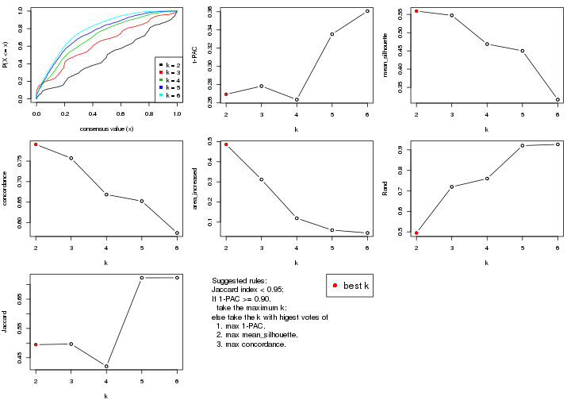

The numeric values for all these statistics can be obtained by `get_stats()`.

```r
get_stats(res)
```

```
#>   k 1-PAC mean_silhouette concordance area_increased  Rand Jaccard
#> 2 2 0.269           0.559       0.791         0.4863 0.495   0.495
#> 3 3 0.278           0.547       0.757         0.3117 0.720   0.497
#> 4 4 0.263           0.469       0.669         0.1190 0.760   0.421
#> 5 5 0.335           0.450       0.653         0.0599 0.921   0.723
#> 6 6 0.361           0.316       0.575         0.0459 0.927   0.723
```

`suggest_best_k()` suggests the best $k$ based on these statistics. The rules are as follows:

- All $k$ with Jaccard index larger than 0.95 are removed because the increase of
  the partition number does not provides enough extra information. If all $k$ are removed,
  the best $k$ is assigned by `NA`.
- For $k$ with 1-PAC larger than 0.9, the maximal $k$ is taken as the "best k". Other $k$ is called "optional k".
- If it does not fit the second rule. The $k$ with the highest vote of highest
  1-PAC, mean silhouette and concordance is taken as the "best k".

```r
suggest_best_k(res)
```

```
#> [1] 2
```


Following shows the table of the partitions (You need to click the **show/hide
code output** link to see it). The membership matrix (columns with name `p*`)
is inferred by
[`clue::cl_consensus()`](https://www.rdocumentation.org/link/cl_consensus?package=clue)
function with the `SE` method. Basically the value in the membership matrix
represents the probability to belong to a certain group. The finall class
label for an item is determined with the group with highest probability it
belongs to.

In `get_classes()` function, the entropy is calculated from the membership
matrix and the silhouette score is calculated from the consensus matrix.


<script>
$( function() {
	$( '#tabs-SD-NMF-get-classes' ).tabs();
} );
</script>
<div id='tabs-SD-NMF-get-classes'>
<ul>
<li><a href='#tab-SD-NMF-get-classes-1'>k = 2</a></li>
<li><a href='#tab-SD-NMF-get-classes-2'>k = 3</a></li>
<li><a href='#tab-SD-NMF-get-classes-3'>k = 4</a></li>
<li><a href='#tab-SD-NMF-get-classes-4'>k = 5</a></li>
<li><a href='#tab-SD-NMF-get-classes-5'>k = 6</a></li>
</ul>

<div id='tab-SD-NMF-get-classes-1'>
<p><a id='tab-SD-NMF-get-classes-1-a' style='color:#0366d6' href='#'>show/hide code output</a></p>
<pre><code class="r">cbind(get_classes(res, k = 2), get_membership(res, k = 2))
</code></pre>

<pre><code>#&gt;           class entropy silhouette    p1    p2
#&gt; GSM451162     2  1.0000     0.3547 0.496 0.504
#&gt; GSM451163     2  0.7219     0.7347 0.200 0.800
#&gt; GSM451164     2  0.7219     0.7347 0.200 0.800
#&gt; GSM451165     2  0.1414     0.6694 0.020 0.980
#&gt; GSM451167     2  0.8499     0.7088 0.276 0.724
#&gt; GSM451168     2  0.0000     0.6748 0.000 1.000
#&gt; GSM451169     2  0.9552     0.6368 0.376 0.624
#&gt; GSM451170     1  0.7219     0.6999 0.800 0.200
#&gt; GSM451171     2  0.7299     0.7343 0.204 0.796
#&gt; GSM451172     2  0.7219     0.7347 0.200 0.800
#&gt; GSM451173     1  0.0938     0.7192 0.988 0.012
#&gt; GSM451174     2  0.4562     0.6494 0.096 0.904
#&gt; GSM451175     1  0.2236     0.7240 0.964 0.036
#&gt; GSM451177     2  0.7453     0.7320 0.212 0.788
#&gt; GSM451178     2  0.3274     0.6679 0.060 0.940
#&gt; GSM451179     1  0.7219     0.6999 0.800 0.200
#&gt; GSM451180     2  0.7219     0.7347 0.200 0.800
#&gt; GSM451181     2  0.7815     0.7257 0.232 0.768
#&gt; GSM451182     1  0.7219     0.6999 0.800 0.200
#&gt; GSM451183     1  0.0000     0.7231 1.000 0.000
#&gt; GSM451184     1  0.9323     0.1537 0.652 0.348
#&gt; GSM451185     1  0.7815     0.6905 0.768 0.232
#&gt; GSM451186     1  0.7528     0.6962 0.784 0.216
#&gt; GSM451187     2  0.7219     0.7347 0.200 0.800
#&gt; GSM451188     2  0.7528     0.7307 0.216 0.784
#&gt; GSM451189     1  0.6531     0.7154 0.832 0.168
#&gt; GSM451190     1  0.2043     0.7064 0.968 0.032
#&gt; GSM451191     1  0.7745     0.6934 0.772 0.228
#&gt; GSM451193     1  0.4690     0.6318 0.900 0.100
#&gt; GSM451195     1  0.0000     0.7231 1.000 0.000
#&gt; GSM451196     1  0.6531     0.7154 0.832 0.168
#&gt; GSM451197     1  0.1414     0.7143 0.980 0.020
#&gt; GSM451199     1  0.7219     0.7072 0.800 0.200
#&gt; GSM451201     1  0.1184     0.7271 0.984 0.016
#&gt; GSM451202     2  0.0000     0.6748 0.000 1.000
#&gt; GSM451203     1  0.0000     0.7231 1.000 0.000
#&gt; GSM451204     1  1.0000    -0.4291 0.504 0.496
#&gt; GSM451205     2  0.7299     0.7341 0.204 0.796
#&gt; GSM451206     2  0.6247     0.7270 0.156 0.844
#&gt; GSM451207     2  0.9909     0.5192 0.444 0.556
#&gt; GSM451208     2  0.0376     0.6754 0.004 0.996
#&gt; GSM451209     2  0.9944     0.3909 0.456 0.544
#&gt; GSM451210     2  0.7528     0.7307 0.216 0.784
#&gt; GSM451212     1  1.0000    -0.4291 0.504 0.496
#&gt; GSM451213     2  0.8861     0.3768 0.304 0.696
#&gt; GSM451214     2  0.7602     0.7292 0.220 0.780
#&gt; GSM451215     2  0.7219     0.7347 0.200 0.800
#&gt; GSM451216     2  0.8861     0.3768 0.304 0.696
#&gt; GSM451217     2  0.7219     0.7347 0.200 0.800
#&gt; GSM451219     1  0.7815     0.6905 0.768 0.232
#&gt; GSM451220     1  0.1184     0.7172 0.984 0.016
#&gt; GSM451221     1  0.7815     0.6905 0.768 0.232
#&gt; GSM451222     1  0.1184     0.7172 0.984 0.016
#&gt; GSM451224     2  0.1414     0.6694 0.020 0.980
#&gt; GSM451225     2  0.9963    -0.0974 0.464 0.536
#&gt; GSM451226     2  0.9000     0.6545 0.316 0.684
#&gt; GSM451227     2  0.1414     0.6694 0.020 0.980
#&gt; GSM451228     1  1.0000    -0.4291 0.504 0.496
#&gt; GSM451230     1  0.8861     0.1538 0.696 0.304
#&gt; GSM451231     2  0.9996     0.3435 0.488 0.512
#&gt; GSM451233     1  1.0000    -0.4291 0.504 0.496
#&gt; GSM451234     2  0.9580     0.1962 0.380 0.620
#&gt; GSM451235     2  0.9922     0.4059 0.448 0.552
#&gt; GSM451236     2  1.0000     0.4149 0.496 0.504
#&gt; GSM451166     1  0.9963    -0.3057 0.536 0.464
#&gt; GSM451194     1  0.1843     0.7279 0.972 0.028
#&gt; GSM451198     1  0.0000     0.7231 1.000 0.000
#&gt; GSM451218     2  0.8861     0.3768 0.304 0.696
#&gt; GSM451232     1  0.7453     0.6975 0.788 0.212
#&gt; GSM451176     1  0.6531     0.7154 0.832 0.168
#&gt; GSM451192     1  0.0000     0.7231 1.000 0.000
#&gt; GSM451200     1  0.0000     0.7231 1.000 0.000
#&gt; GSM451211     2  0.2043     0.6748 0.032 0.968
#&gt; GSM451223     2  0.9087     0.6799 0.324 0.676
#&gt; GSM451229     1  0.7219     0.6999 0.800 0.200
#&gt; GSM451237     2  0.9129     0.3259 0.328 0.672
</code></pre>

<script>
$('#tab-SD-NMF-get-classes-1-a').parent().next().next().hide();
$('#tab-SD-NMF-get-classes-1-a').click(function(){
  $('#tab-SD-NMF-get-classes-1-a').parent().next().next().toggle();
  return(false);
});
</script>
</div>

<div id='tab-SD-NMF-get-classes-2'>
<p><a id='tab-SD-NMF-get-classes-2-a' style='color:#0366d6' href='#'>show/hide code output</a></p>
<pre><code class="r">cbind(get_classes(res, k = 3), get_membership(res, k = 3))
</code></pre>

<pre><code>#&gt;           class entropy silhouette    p1    p2    p3
#&gt; GSM451162     3  0.9724    0.06014 0.268 0.280 0.452
#&gt; GSM451163     3  0.6154    0.18161 0.000 0.408 0.592
#&gt; GSM451164     3  0.4555    0.55453 0.000 0.200 0.800
#&gt; GSM451165     3  0.8568    0.43671 0.200 0.192 0.608
#&gt; GSM451167     2  0.4555    0.66348 0.000 0.800 0.200
#&gt; GSM451168     3  0.9579    0.05342 0.200 0.368 0.432
#&gt; GSM451169     2  0.8728    0.44154 0.208 0.592 0.200
#&gt; GSM451170     1  0.0000    0.70079 1.000 0.000 0.000
#&gt; GSM451171     2  0.6154    0.46697 0.000 0.592 0.408
#&gt; GSM451172     3  0.6095   -0.00318 0.000 0.392 0.608
#&gt; GSM451173     1  0.4645    0.70094 0.816 0.008 0.176
#&gt; GSM451174     2  0.4555    0.65757 0.200 0.800 0.000
#&gt; GSM451175     1  0.4485    0.71349 0.844 0.020 0.136
#&gt; GSM451177     3  0.4605    0.62252 0.000 0.204 0.796
#&gt; GSM451178     2  0.3412    0.67337 0.124 0.876 0.000
#&gt; GSM451179     1  0.4605    0.58507 0.796 0.204 0.000
#&gt; GSM451180     3  0.2796    0.66252 0.000 0.092 0.908
#&gt; GSM451181     2  0.3941    0.67700 0.000 0.844 0.156
#&gt; GSM451182     1  0.0000    0.70079 1.000 0.000 0.000
#&gt; GSM451183     1  0.4413    0.70737 0.832 0.008 0.160
#&gt; GSM451184     3  0.0000    0.70365 0.000 0.000 1.000
#&gt; GSM451185     1  0.0000    0.70079 1.000 0.000 0.000
#&gt; GSM451186     1  0.4346    0.52219 0.816 0.184 0.000
#&gt; GSM451187     2  0.5988    0.48843 0.000 0.632 0.368
#&gt; GSM451188     3  0.0000    0.70365 0.000 0.000 1.000
#&gt; GSM451189     1  0.0661    0.70558 0.988 0.004 0.008
#&gt; GSM451190     1  0.7271    0.53148 0.608 0.040 0.352
#&gt; GSM451191     1  0.5926    0.24134 0.644 0.000 0.356
#&gt; GSM451193     1  0.8838    0.52555 0.580 0.220 0.200
#&gt; GSM451195     1  0.8576    0.54642 0.600 0.240 0.160
#&gt; GSM451196     1  0.0424    0.70467 0.992 0.000 0.008
#&gt; GSM451197     1  0.4291    0.70179 0.820 0.000 0.180
#&gt; GSM451199     1  0.0892    0.70873 0.980 0.000 0.020
#&gt; GSM451201     1  0.4062    0.70830 0.836 0.000 0.164
#&gt; GSM451202     3  0.4861    0.60944 0.192 0.008 0.800
#&gt; GSM451203     1  0.8685    0.54216 0.596 0.212 0.192
#&gt; GSM451204     2  0.0892    0.65070 0.000 0.980 0.020
#&gt; GSM451205     3  0.0424    0.70269 0.000 0.008 0.992
#&gt; GSM451206     2  0.0000    0.63747 0.000 1.000 0.000
#&gt; GSM451207     2  0.4002    0.67569 0.000 0.840 0.160
#&gt; GSM451208     2  0.8647    0.49296 0.192 0.600 0.208
#&gt; GSM451209     2  0.8168    0.59676 0.280 0.612 0.108
#&gt; GSM451210     3  0.1529    0.69765 0.000 0.040 0.960
#&gt; GSM451212     2  0.4531    0.67739 0.008 0.824 0.168
#&gt; GSM451213     2  0.3686    0.67254 0.140 0.860 0.000
#&gt; GSM451214     3  0.0000    0.70365 0.000 0.000 1.000
#&gt; GSM451215     3  0.4796    0.52685 0.000 0.220 0.780
#&gt; GSM451216     2  0.3686    0.67254 0.140 0.860 0.000
#&gt; GSM451217     2  0.6267    0.26455 0.000 0.548 0.452
#&gt; GSM451219     1  0.4291    0.56100 0.820 0.000 0.180
#&gt; GSM451220     1  0.9149    0.42764 0.516 0.316 0.168
#&gt; GSM451221     1  0.6235   -0.02373 0.564 0.000 0.436
#&gt; GSM451222     1  0.7388    0.63757 0.704 0.136 0.160
#&gt; GSM451224     3  0.5667    0.62175 0.140 0.060 0.800
#&gt; GSM451225     1  0.6180   -0.14646 0.584 0.416 0.000
#&gt; GSM451226     3  0.0000    0.70365 0.000 0.000 1.000
#&gt; GSM451227     3  0.4555    0.60497 0.200 0.000 0.800
#&gt; GSM451228     2  0.4555    0.66348 0.000 0.800 0.200
#&gt; GSM451230     1  0.9579   -0.03910 0.432 0.368 0.200
#&gt; GSM451231     1  0.8631   -0.09656 0.468 0.432 0.100
#&gt; GSM451233     2  0.8199    0.60351 0.200 0.640 0.160
#&gt; GSM451234     2  0.6192    0.50410 0.420 0.580 0.000
#&gt; GSM451235     2  0.8285    0.59298 0.288 0.600 0.112
#&gt; GSM451236     2  0.5239    0.68542 0.032 0.808 0.160
#&gt; GSM451166     2  0.5913    0.69235 0.068 0.788 0.144
#&gt; GSM451194     1  0.3752    0.71346 0.856 0.000 0.144
#&gt; GSM451198     1  0.8650    0.54415 0.600 0.200 0.200
#&gt; GSM451218     2  0.6126    0.53068 0.400 0.600 0.000
#&gt; GSM451232     1  0.0000    0.70079 1.000 0.000 0.000
#&gt; GSM451176     1  0.1950    0.70430 0.952 0.040 0.008
#&gt; GSM451192     1  0.4555    0.69053 0.800 0.000 0.200
#&gt; GSM451200     1  0.4861    0.69186 0.800 0.008 0.192
#&gt; GSM451211     2  0.8650    0.49109 0.200 0.600 0.200
#&gt; GSM451223     3  0.7880    0.43564 0.096 0.268 0.636
#&gt; GSM451229     1  0.0000    0.70079 1.000 0.000 0.000
#&gt; GSM451237     2  0.6126    0.53068 0.400 0.600 0.000
</code></pre>

<script>
$('#tab-SD-NMF-get-classes-2-a').parent().next().next().hide();
$('#tab-SD-NMF-get-classes-2-a').click(function(){
  $('#tab-SD-NMF-get-classes-2-a').parent().next().next().toggle();
  return(false);
});
</script>
</div>

<div id='tab-SD-NMF-get-classes-3'>
<p><a id='tab-SD-NMF-get-classes-3-a' style='color:#0366d6' href='#'>show/hide code output</a></p>
<pre><code class="r">cbind(get_classes(res, k = 4), get_membership(res, k = 4))
</code></pre>

<pre><code>#&gt;           class entropy silhouette    p1    p2    p3    p4
#&gt; GSM451162     3   0.538     0.4241 0.048 0.216 0.728 0.008
#&gt; GSM451163     3   0.616     0.3899 0.000 0.232 0.660 0.108
#&gt; GSM451164     3   0.524     0.2164 0.000 0.356 0.628 0.016
#&gt; GSM451165     2   0.730     0.3924 0.148 0.548 0.296 0.008
#&gt; GSM451167     3   0.484     0.3917 0.000 0.028 0.732 0.240
#&gt; GSM451168     2   0.891     0.1360 0.148 0.448 0.100 0.304
#&gt; GSM451169     3   0.222     0.5146 0.040 0.032 0.928 0.000
#&gt; GSM451170     1   0.471     0.6175 0.812 0.028 0.120 0.040
#&gt; GSM451171     4   0.761     0.1761 0.000 0.236 0.292 0.472
#&gt; GSM451172     3   0.597     0.0378 0.020 0.428 0.540 0.012
#&gt; GSM451173     1   0.543     0.6950 0.744 0.004 0.164 0.088
#&gt; GSM451174     3   0.737     0.2347 0.156 0.032 0.612 0.200
#&gt; GSM451175     1   0.459     0.7098 0.804 0.012 0.144 0.040
#&gt; GSM451177     2   0.293     0.6388 0.000 0.880 0.012 0.108
#&gt; GSM451178     3   0.585     0.3629 0.108 0.012 0.728 0.152
#&gt; GSM451179     3   0.576     0.1390 0.452 0.004 0.524 0.020
#&gt; GSM451180     2   0.412     0.6658 0.000 0.772 0.220 0.008
#&gt; GSM451181     3   0.439     0.4655 0.000 0.052 0.804 0.144
#&gt; GSM451182     1   0.221     0.6818 0.932 0.024 0.004 0.040
#&gt; GSM451183     1   0.472     0.7068 0.772 0.000 0.180 0.048
#&gt; GSM451184     2   0.386     0.6841 0.004 0.812 0.176 0.008
#&gt; GSM451185     1   0.230     0.6902 0.924 0.028 0.000 0.048
#&gt; GSM451186     1   0.633     0.4203 0.704 0.028 0.100 0.168
#&gt; GSM451187     3   0.727     0.2844 0.000 0.244 0.540 0.216
#&gt; GSM451188     2   0.350     0.6960 0.036 0.860 0.104 0.000
#&gt; GSM451189     1   0.217     0.7143 0.936 0.008 0.032 0.024
#&gt; GSM451190     1   0.841     0.3767 0.480 0.232 0.248 0.040
#&gt; GSM451191     2   0.788     0.2709 0.380 0.448 0.152 0.020
#&gt; GSM451193     3   0.492     0.4320 0.208 0.016 0.756 0.020
#&gt; GSM451195     1   0.672     0.4770 0.576 0.028 0.348 0.048
#&gt; GSM451196     1   0.192     0.7175 0.944 0.008 0.036 0.012
#&gt; GSM451197     1   0.479     0.7169 0.800 0.028 0.140 0.032
#&gt; GSM451199     1   0.390     0.7120 0.860 0.076 0.044 0.020
#&gt; GSM451201     1   0.428     0.7203 0.824 0.016 0.132 0.028
#&gt; GSM451202     2   0.563     0.6030 0.144 0.740 0.008 0.108
#&gt; GSM451203     3   0.523     0.1504 0.368 0.008 0.620 0.004
#&gt; GSM451204     4   0.664     0.3223 0.040 0.044 0.292 0.624
#&gt; GSM451205     2   0.344     0.6788 0.000 0.816 0.184 0.000
#&gt; GSM451206     3   0.660     0.0740 0.000 0.080 0.484 0.436
#&gt; GSM451207     3   0.554     0.3821 0.032 0.032 0.736 0.200
#&gt; GSM451208     2   0.888     0.1716 0.148 0.484 0.116 0.252
#&gt; GSM451209     4   0.750     0.5613 0.284 0.012 0.164 0.540
#&gt; GSM451210     2   0.491     0.6570 0.008 0.764 0.192 0.036
#&gt; GSM451212     3   0.483     0.3568 0.008 0.012 0.728 0.252
#&gt; GSM451213     3   0.746     0.0720 0.128 0.016 0.524 0.332
#&gt; GSM451214     2   0.327     0.6848 0.000 0.832 0.168 0.000
#&gt; GSM451215     2   0.377     0.6816 0.000 0.808 0.184 0.008
#&gt; GSM451216     4   0.761     0.1246 0.128 0.016 0.412 0.444
#&gt; GSM451217     3   0.719     0.3545 0.000 0.272 0.544 0.184
#&gt; GSM451219     1   0.550    -0.0845 0.524 0.460 0.000 0.016
#&gt; GSM451220     3   0.504     0.3834 0.248 0.012 0.724 0.016
#&gt; GSM451221     2   0.631     0.3426 0.412 0.540 0.032 0.016
#&gt; GSM451222     1   0.737     0.5590 0.608 0.028 0.168 0.196
#&gt; GSM451224     2   0.415     0.6626 0.124 0.828 0.004 0.044
#&gt; GSM451225     4   0.609     0.5054 0.448 0.012 0.024 0.516
#&gt; GSM451226     2   0.434     0.6795 0.012 0.784 0.196 0.008
#&gt; GSM451227     2   0.340     0.6601 0.164 0.832 0.000 0.004
#&gt; GSM451228     3   0.221     0.5110 0.000 0.028 0.928 0.044
#&gt; GSM451230     4   0.785     0.1964 0.284 0.012 0.212 0.492
#&gt; GSM451231     4   0.723     0.5215 0.348 0.040 0.064 0.548
#&gt; GSM451233     4   0.619     0.3693 0.048 0.024 0.264 0.664
#&gt; GSM451234     4   0.655     0.5651 0.364 0.032 0.032 0.572
#&gt; GSM451235     4   0.789     0.5659 0.276 0.032 0.160 0.532
#&gt; GSM451236     4   0.623     0.1477 0.036 0.008 0.460 0.496
#&gt; GSM451166     3   0.679     0.2694 0.084 0.024 0.628 0.264
#&gt; GSM451194     1   0.456     0.7141 0.792 0.020 0.172 0.016
#&gt; GSM451198     1   0.734     0.4686 0.540 0.012 0.316 0.132
#&gt; GSM451218     4   0.735     0.5458 0.264 0.028 0.120 0.588
#&gt; GSM451232     1   0.139     0.6834 0.960 0.012 0.000 0.028
#&gt; GSM451176     1   0.358     0.6904 0.868 0.004 0.060 0.068
#&gt; GSM451192     1   0.669     0.6546 0.680 0.032 0.164 0.124
#&gt; GSM451200     1   0.695     0.6022 0.616 0.012 0.236 0.136
#&gt; GSM451211     4   0.893     0.3990 0.160 0.220 0.128 0.492
#&gt; GSM451223     3   0.600     0.3596 0.012 0.260 0.672 0.056
#&gt; GSM451229     1   0.104     0.6902 0.972 0.008 0.000 0.020
#&gt; GSM451237     4   0.610     0.5738 0.324 0.008 0.048 0.620
</code></pre>

<script>
$('#tab-SD-NMF-get-classes-3-a').parent().next().next().hide();
$('#tab-SD-NMF-get-classes-3-a').click(function(){
  $('#tab-SD-NMF-get-classes-3-a').parent().next().next().toggle();
  return(false);
});
</script>
</div>

<div id='tab-SD-NMF-get-classes-4'>
<p><a id='tab-SD-NMF-get-classes-4-a' style='color:#0366d6' href='#'>show/hide code output</a></p>
<pre><code class="r">cbind(get_classes(res, k = 5), get_membership(res, k = 5))
</code></pre>

<pre><code>#&gt;           class entropy silhouette    p1    p2    p3    p4    p5
#&gt; GSM451162     3  0.2445   0.651023 0.056 0.020 0.908 0.000 0.016
#&gt; GSM451163     3  0.1617   0.657154 0.000 0.020 0.948 0.020 0.012
#&gt; GSM451164     3  0.4983   0.481585 0.000 0.060 0.680 0.256 0.004
#&gt; GSM451165     3  0.7288  -0.020012 0.160 0.356 0.440 0.004 0.040
#&gt; GSM451167     3  0.4079   0.613524 0.004 0.028 0.792 0.164 0.012
#&gt; GSM451168     4  0.7351   0.230927 0.164 0.152 0.108 0.568 0.008
#&gt; GSM451169     3  0.1568   0.657067 0.036 0.020 0.944 0.000 0.000
#&gt; GSM451170     1  0.6618   0.355261 0.568 0.028 0.224 0.000 0.180
#&gt; GSM451171     4  0.8219   0.107181 0.000 0.264 0.296 0.328 0.112
#&gt; GSM451172     3  0.4566   0.584920 0.036 0.160 0.772 0.004 0.028
#&gt; GSM451173     1  0.5687   0.575898 0.728 0.032 0.140 0.056 0.044
#&gt; GSM451174     3  0.4815   0.504844 0.168 0.020 0.760 0.032 0.020
#&gt; GSM451175     1  0.7783   0.464329 0.532 0.020 0.100 0.180 0.168
#&gt; GSM451177     2  0.3110   0.668963 0.000 0.856 0.004 0.112 0.028
#&gt; GSM451178     3  0.5385   0.502103 0.040 0.032 0.744 0.144 0.040
#&gt; GSM451179     3  0.6679   0.434219 0.252 0.016 0.580 0.132 0.020
#&gt; GSM451180     2  0.4454   0.715646 0.000 0.708 0.260 0.004 0.028
#&gt; GSM451181     3  0.5167   0.567463 0.008 0.032 0.688 0.252 0.020
#&gt; GSM451182     1  0.4312   0.525416 0.780 0.028 0.004 0.020 0.168
#&gt; GSM451183     1  0.5043   0.594912 0.764 0.024 0.120 0.076 0.016
#&gt; GSM451184     2  0.3843   0.755567 0.012 0.788 0.184 0.016 0.000
#&gt; GSM451185     1  0.5166   0.553838 0.744 0.092 0.000 0.120 0.044
#&gt; GSM451186     1  0.8142   0.035025 0.464 0.016 0.108 0.180 0.232
#&gt; GSM451187     3  0.4166   0.568676 0.000 0.144 0.792 0.012 0.052
#&gt; GSM451188     2  0.3199   0.731045 0.056 0.876 0.048 0.008 0.012
#&gt; GSM451189     1  0.4579   0.572399 0.740 0.004 0.048 0.204 0.004
#&gt; GSM451190     1  0.6994   0.434665 0.528 0.184 0.256 0.008 0.024
#&gt; GSM451191     1  0.7755   0.111682 0.400 0.348 0.188 0.008 0.056
#&gt; GSM451193     3  0.4045   0.649872 0.048 0.012 0.836 0.068 0.036
#&gt; GSM451195     1  0.7084   0.468444 0.492 0.016 0.252 0.232 0.008
#&gt; GSM451196     1  0.4404   0.576987 0.796 0.016 0.028 0.136 0.024
#&gt; GSM451197     1  0.4138   0.594699 0.808 0.036 0.120 0.000 0.036
#&gt; GSM451199     1  0.4986   0.546387 0.752 0.168 0.028 0.020 0.032
#&gt; GSM451201     1  0.3905   0.598728 0.840 0.044 0.076 0.008 0.032
#&gt; GSM451202     2  0.5805   0.496809 0.140 0.652 0.004 0.196 0.008
#&gt; GSM451203     3  0.5368   0.400116 0.300 0.016 0.644 0.028 0.012
#&gt; GSM451204     4  0.3902   0.189046 0.012 0.028 0.096 0.836 0.028
#&gt; GSM451205     2  0.3231   0.753868 0.000 0.800 0.196 0.004 0.000
#&gt; GSM451206     3  0.7334  -0.019963 0.000 0.056 0.416 0.376 0.152
#&gt; GSM451207     3  0.7168   0.259010 0.008 0.028 0.496 0.288 0.180
#&gt; GSM451208     2  0.6490   0.529067 0.156 0.660 0.024 0.048 0.112
#&gt; GSM451209     4  0.4872   0.333596 0.132 0.020 0.068 0.768 0.012
#&gt; GSM451210     2  0.6194   0.564523 0.004 0.588 0.168 0.236 0.004
#&gt; GSM451212     3  0.5939   0.360409 0.004 0.016 0.616 0.088 0.276
#&gt; GSM451213     5  0.7849   0.355280 0.072 0.020 0.288 0.148 0.472
#&gt; GSM451214     2  0.3109   0.754707 0.000 0.800 0.200 0.000 0.000
#&gt; GSM451215     2  0.3697   0.756150 0.000 0.796 0.180 0.016 0.008
#&gt; GSM451216     5  0.6850   0.454210 0.052 0.008 0.108 0.260 0.572
#&gt; GSM451217     3  0.4877   0.553269 0.004 0.032 0.732 0.204 0.028
#&gt; GSM451219     1  0.6273  -0.051837 0.464 0.444 0.020 0.008 0.064
#&gt; GSM451220     3  0.4972   0.593200 0.140 0.016 0.748 0.092 0.004
#&gt; GSM451221     1  0.7310   0.293388 0.516 0.320 0.072 0.036 0.056
#&gt; GSM451222     1  0.7999   0.404015 0.480 0.012 0.112 0.228 0.168
#&gt; GSM451224     2  0.4254   0.666188 0.068 0.808 0.000 0.092 0.032
#&gt; GSM451225     4  0.6927   0.287258 0.376 0.008 0.000 0.380 0.236
#&gt; GSM451226     2  0.5820   0.638663 0.012 0.632 0.268 0.080 0.008
#&gt; GSM451227     2  0.3035   0.676201 0.144 0.844 0.004 0.004 0.004
#&gt; GSM451228     3  0.0968   0.651907 0.004 0.012 0.972 0.000 0.012
#&gt; GSM451230     1  0.8030   0.308112 0.504 0.020 0.180 0.120 0.176
#&gt; GSM451231     4  0.6860   0.253304 0.216 0.044 0.032 0.612 0.096
#&gt; GSM451233     4  0.4961   0.296082 0.044 0.016 0.144 0.764 0.032
#&gt; GSM451234     4  0.7468   0.267544 0.320 0.012 0.012 0.332 0.324
#&gt; GSM451235     4  0.8612   0.296766 0.272 0.028 0.104 0.384 0.212
#&gt; GSM451236     4  0.7736  -0.000664 0.028 0.016 0.340 0.372 0.244
#&gt; GSM451166     3  0.6739   0.210501 0.068 0.036 0.552 0.024 0.320
#&gt; GSM451194     1  0.5182   0.571076 0.736 0.028 0.180 0.024 0.032
#&gt; GSM451198     1  0.5545   0.356438 0.564 0.012 0.384 0.008 0.032
#&gt; GSM451218     5  0.6646   0.189993 0.108 0.008 0.016 0.428 0.440
#&gt; GSM451232     1  0.3693   0.529410 0.804 0.012 0.000 0.016 0.168
#&gt; GSM451176     1  0.5595   0.481626 0.592 0.016 0.020 0.352 0.020
#&gt; GSM451192     1  0.4479   0.568506 0.760 0.016 0.180 0.000 0.044
#&gt; GSM451200     1  0.5728   0.320542 0.536 0.016 0.408 0.016 0.024
#&gt; GSM451211     5  0.9306   0.114109 0.136 0.204 0.068 0.276 0.316
#&gt; GSM451223     3  0.4083   0.646188 0.020 0.048 0.816 0.112 0.004
#&gt; GSM451229     1  0.4650   0.556566 0.780 0.032 0.000 0.096 0.092
#&gt; GSM451237     4  0.7075   0.279732 0.200 0.012 0.012 0.484 0.292
</code></pre>

<script>
$('#tab-SD-NMF-get-classes-4-a').parent().next().next().hide();
$('#tab-SD-NMF-get-classes-4-a').click(function(){
  $('#tab-SD-NMF-get-classes-4-a').parent().next().next().toggle();
  return(false);
});
</script>
</div>

<div id='tab-SD-NMF-get-classes-5'>
<p><a id='tab-SD-NMF-get-classes-5-a' style='color:#0366d6' href='#'>show/hide code output</a></p>
<pre><code class="r">cbind(get_classes(res, k = 6), get_membership(res, k = 6))
</code></pre>

<pre><code>#&gt;           class entropy silhouette    p1    p2    p3    p4    p5    p6
#&gt; GSM451162     3   0.542     0.4902 0.028 0.056 0.708 0.000 0.080 0.128
#&gt; GSM451163     3   0.359     0.5434 0.004 0.040 0.848 0.020 0.040 0.048
#&gt; GSM451164     3   0.540     0.4277 0.000 0.020 0.664 0.224 0.052 0.040
#&gt; GSM451165     2   0.772    -0.1096 0.112 0.396 0.308 0.004 0.152 0.028
#&gt; GSM451167     3   0.426     0.5255 0.004 0.036 0.804 0.080 0.052 0.024
#&gt; GSM451168     4   0.772     0.3424 0.104 0.176 0.088 0.528 0.080 0.024
#&gt; GSM451169     3   0.292     0.5422 0.012 0.040 0.884 0.004 0.028 0.032
#&gt; GSM451170     1   0.703    -0.2749 0.448 0.052 0.216 0.004 0.272 0.008
#&gt; GSM451171     3   0.863    -0.1572 0.000 0.244 0.268 0.252 0.104 0.132
#&gt; GSM451172     3   0.630     0.4166 0.020 0.144 0.624 0.004 0.144 0.064
#&gt; GSM451173     1   0.648     0.4579 0.640 0.020 0.156 0.084 0.052 0.048
#&gt; GSM451174     3   0.724     0.2733 0.120 0.056 0.596 0.040 0.084 0.104
#&gt; GSM451175     1   0.743     0.3500 0.552 0.036 0.056 0.144 0.048 0.164
#&gt; GSM451177     2   0.363     0.5885 0.000 0.796 0.004 0.152 0.004 0.044
#&gt; GSM451178     3   0.652     0.3244 0.076 0.008 0.636 0.112 0.048 0.120
#&gt; GSM451179     3   0.729     0.2728 0.232 0.052 0.548 0.056 0.056 0.056
#&gt; GSM451180     2   0.478     0.6369 0.000 0.700 0.220 0.012 0.016 0.052
#&gt; GSM451181     3   0.577     0.4578 0.008 0.008 0.672 0.152 0.068 0.092
#&gt; GSM451182     1   0.541     0.0703 0.592 0.044 0.008 0.020 0.328 0.008
#&gt; GSM451183     1   0.561     0.4738 0.696 0.016 0.156 0.040 0.020 0.072
#&gt; GSM451184     2   0.464     0.6392 0.008 0.744 0.172 0.016 0.044 0.016
#&gt; GSM451185     1   0.593     0.1651 0.644 0.152 0.000 0.088 0.108 0.008
#&gt; GSM451186     5   0.746     0.1949 0.256 0.040 0.072 0.132 0.488 0.012
#&gt; GSM451187     3   0.600     0.3862 0.008 0.164 0.648 0.028 0.028 0.124
#&gt; GSM451188     2   0.266     0.6336 0.020 0.892 0.060 0.008 0.016 0.004
#&gt; GSM451189     1   0.482     0.4246 0.772 0.040 0.016 0.100 0.040 0.032
#&gt; GSM451190     1   0.757     0.2932 0.452 0.120 0.296 0.008 0.064 0.060
#&gt; GSM451191     5   0.784     0.2641 0.264 0.288 0.148 0.000 0.288 0.012
#&gt; GSM451193     3   0.507     0.5059 0.000 0.024 0.736 0.068 0.116 0.056
#&gt; GSM451195     1   0.846     0.1321 0.344 0.016 0.300 0.168 0.084 0.088
#&gt; GSM451196     1   0.322     0.4194 0.872 0.016 0.012 0.040 0.036 0.024
#&gt; GSM451197     1   0.608     0.4043 0.680 0.072 0.084 0.008 0.100 0.056
#&gt; GSM451199     1   0.667     0.0821 0.576 0.228 0.016 0.040 0.112 0.028
#&gt; GSM451201     1   0.539     0.4390 0.740 0.048 0.088 0.028 0.068 0.028
#&gt; GSM451202     2   0.493     0.4821 0.084 0.712 0.008 0.176 0.016 0.004
#&gt; GSM451203     3   0.613     0.3786 0.228 0.008 0.624 0.044 0.056 0.040
#&gt; GSM451204     4   0.455     0.3148 0.028 0.004 0.080 0.780 0.024 0.084
#&gt; GSM451205     2   0.432     0.6452 0.004 0.732 0.212 0.036 0.012 0.004
#&gt; GSM451206     3   0.692    -0.1601 0.000 0.016 0.368 0.332 0.024 0.260
#&gt; GSM451207     3   0.848     0.0668 0.120 0.012 0.360 0.232 0.064 0.212
#&gt; GSM451208     2   0.643     0.4632 0.112 0.652 0.012 0.068 0.056 0.100
#&gt; GSM451209     4   0.614     0.4367 0.184 0.032 0.040 0.656 0.036 0.052
#&gt; GSM451210     2   0.676     0.4987 0.012 0.532 0.136 0.264 0.032 0.024
#&gt; GSM451212     6   0.622     0.0409 0.040 0.032 0.428 0.024 0.016 0.460
#&gt; GSM451213     6   0.663     0.3841 0.100 0.004 0.224 0.088 0.016 0.568
#&gt; GSM451214     2   0.312     0.6535 0.004 0.800 0.188 0.000 0.004 0.004
#&gt; GSM451215     2   0.515     0.6399 0.000 0.696 0.196 0.028 0.024 0.056
#&gt; GSM451216     6   0.613     0.2687 0.096 0.004 0.056 0.208 0.016 0.620
#&gt; GSM451217     3   0.591     0.4242 0.000 0.040 0.672 0.108 0.120 0.060
#&gt; GSM451219     1   0.680    -0.3045 0.388 0.376 0.068 0.000 0.168 0.000
#&gt; GSM451220     3   0.653     0.3982 0.184 0.012 0.616 0.052 0.040 0.096
#&gt; GSM451221     2   0.785    -0.4342 0.292 0.356 0.096 0.020 0.228 0.008
#&gt; GSM451222     1   0.776     0.3376 0.472 0.020 0.096 0.204 0.028 0.180
#&gt; GSM451224     2   0.430     0.5851 0.076 0.788 0.004 0.088 0.004 0.040
#&gt; GSM451225     4   0.754     0.3163 0.292 0.036 0.000 0.416 0.176 0.080
#&gt; GSM451226     2   0.664     0.5368 0.016 0.564 0.248 0.092 0.068 0.012
#&gt; GSM451227     2   0.303     0.5823 0.116 0.848 0.020 0.000 0.012 0.004
#&gt; GSM451228     3   0.350     0.5254 0.020 0.012 0.848 0.008 0.040 0.072
#&gt; GSM451230     1   0.901     0.0927 0.336 0.036 0.164 0.184 0.076 0.204
#&gt; GSM451231     4   0.598     0.3609 0.132 0.092 0.004 0.652 0.008 0.112
#&gt; GSM451233     4   0.578     0.2850 0.044 0.004 0.160 0.676 0.032 0.084
#&gt; GSM451234     4   0.829     0.2527 0.216 0.052 0.000 0.324 0.256 0.152
#&gt; GSM451235     4   0.921     0.2609 0.212 0.084 0.060 0.328 0.132 0.184
#&gt; GSM451236     6   0.856     0.1059 0.040 0.024 0.296 0.216 0.128 0.296
#&gt; GSM451166     6   0.726     0.1609 0.088 0.048 0.364 0.000 0.084 0.416
#&gt; GSM451194     1   0.717     0.1608 0.508 0.032 0.196 0.008 0.208 0.048
#&gt; GSM451198     1   0.632     0.3881 0.540 0.004 0.308 0.012 0.052 0.084
#&gt; GSM451218     6   0.720    -0.0618 0.160 0.020 0.004 0.300 0.064 0.452
#&gt; GSM451232     1   0.468     0.2253 0.720 0.044 0.000 0.024 0.200 0.012
#&gt; GSM451176     1   0.654     0.3419 0.572 0.016 0.024 0.264 0.060 0.064
#&gt; GSM451192     1   0.618     0.4400 0.652 0.048 0.160 0.008 0.044 0.088
#&gt; GSM451200     1   0.699     0.1550 0.412 0.008 0.400 0.020 0.076 0.084
#&gt; GSM451211     6   0.898    -0.0824 0.132 0.200 0.032 0.212 0.088 0.336
#&gt; GSM451223     3   0.423     0.5411 0.016 0.020 0.812 0.068 0.028 0.056
#&gt; GSM451229     1   0.455     0.3137 0.780 0.056 0.004 0.040 0.100 0.020
#&gt; GSM451237     4   0.673     0.3892 0.196 0.032 0.000 0.548 0.180 0.044
</code></pre>

<script>
$('#tab-SD-NMF-get-classes-5-a').parent().next().next().hide();
$('#tab-SD-NMF-get-classes-5-a').click(function(){
  $('#tab-SD-NMF-get-classes-5-a').parent().next().next().toggle();
  return(false);
});
</script>
</div>
</div>

Heatmaps for the consensus matrix. It visualizes the probability of two
samples to be in a same group.


<script>
$( function() {
	$( '#tabs-SD-NMF-consensus-heatmap' ).tabs();
} );
</script>
<div id='tabs-SD-NMF-consensus-heatmap'>
<ul>
<li><a href='#tab-SD-NMF-consensus-heatmap-1'>k = 2</a></li>
<li><a href='#tab-SD-NMF-consensus-heatmap-2'>k = 3</a></li>
<li><a href='#tab-SD-NMF-consensus-heatmap-3'>k = 4</a></li>
<li><a href='#tab-SD-NMF-consensus-heatmap-4'>k = 5</a></li>
<li><a href='#tab-SD-NMF-consensus-heatmap-5'>k = 6</a></li>
</ul>
<div id='tab-SD-NMF-consensus-heatmap-1'>
<pre><code class="r">consensus_heatmap(res, k = 2)
</code></pre>

<p>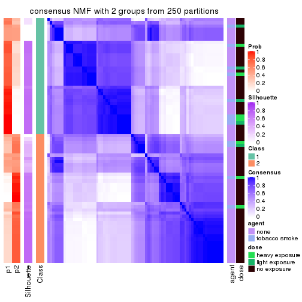</p>

</div>
<div id='tab-SD-NMF-consensus-heatmap-2'>
<pre><code class="r">consensus_heatmap(res, k = 3)
</code></pre>

<p>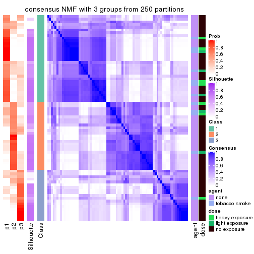</p>

</div>
<div id='tab-SD-NMF-consensus-heatmap-3'>
<pre><code class="r">consensus_heatmap(res, k = 4)
</code></pre>

<p>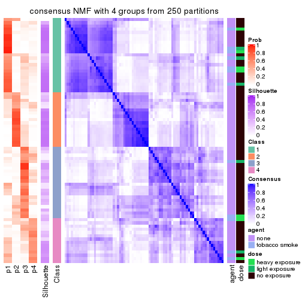</p>

</div>
<div id='tab-SD-NMF-consensus-heatmap-4'>
<pre><code class="r">consensus_heatmap(res, k = 5)
</code></pre>

<p>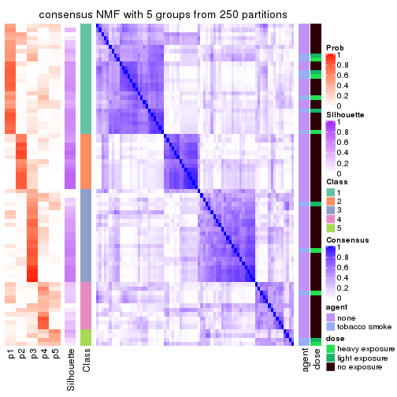</p>

</div>
<div id='tab-SD-NMF-consensus-heatmap-5'>
<pre><code class="r">consensus_heatmap(res, k = 6)
</code></pre>

<p>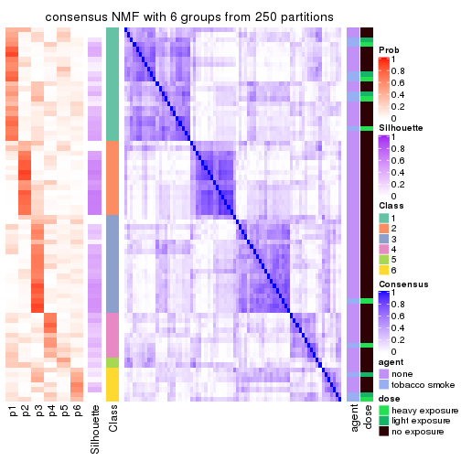</p>

</div>
</div>

Heatmaps for the membership of samples in all partitions to see how consistent they are:


<script>
$( function() {
	$( '#tabs-SD-NMF-membership-heatmap' ).tabs();
} );
</script>
<div id='tabs-SD-NMF-membership-heatmap'>
<ul>
<li><a href='#tab-SD-NMF-membership-heatmap-1'>k = 2</a></li>
<li><a href='#tab-SD-NMF-membership-heatmap-2'>k = 3</a></li>
<li><a href='#tab-SD-NMF-membership-heatmap-3'>k = 4</a></li>
<li><a href='#tab-SD-NMF-membership-heatmap-4'>k = 5</a></li>
<li><a href='#tab-SD-NMF-membership-heatmap-5'>k = 6</a></li>
</ul>
<div id='tab-SD-NMF-membership-heatmap-1'>
<pre><code class="r">membership_heatmap(res, k = 2)
</code></pre>

<p>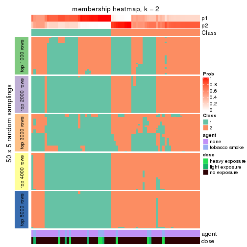</p>

</div>
<div id='tab-SD-NMF-membership-heatmap-2'>
<pre><code class="r">membership_heatmap(res, k = 3)
</code></pre>

<p>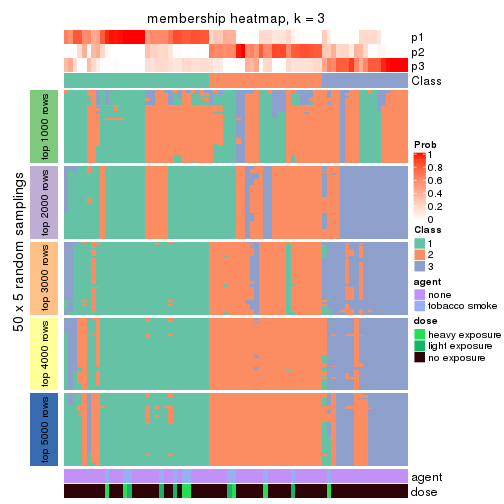</p>

</div>
<div id='tab-SD-NMF-membership-heatmap-3'>
<pre><code class="r">membership_heatmap(res, k = 4)
</code></pre>

<p>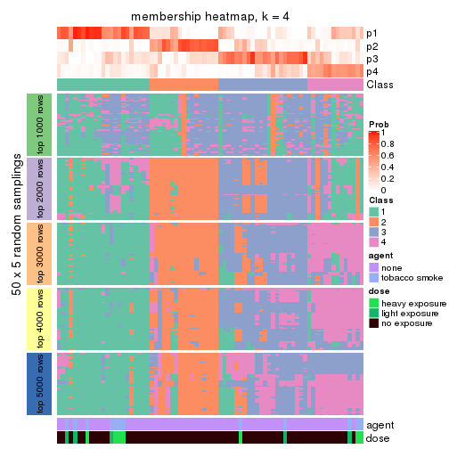</p>

</div>
<div id='tab-SD-NMF-membership-heatmap-4'>
<pre><code class="r">membership_heatmap(res, k = 5)
</code></pre>

<p>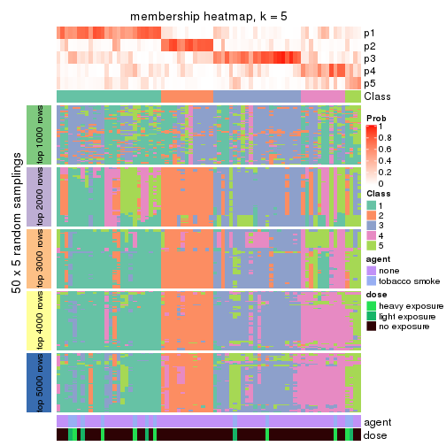</p>

</div>
<div id='tab-SD-NMF-membership-heatmap-5'>
<pre><code class="r">membership_heatmap(res, k = 6)
</code></pre>

<p>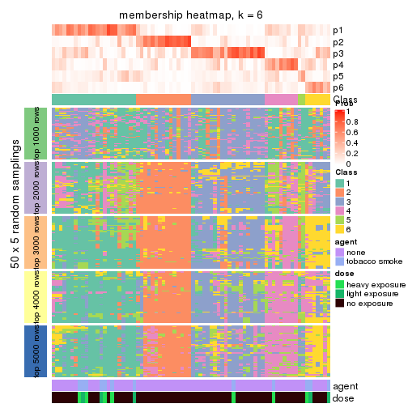</p>

</div>
</div>

As soon as we have had the classes for columns, we can look for signatures
which are significantly different between classes which can be candidate marks
for certain classes. Following are the heatmaps for signatures.


Signature heatmaps where rows are scaled:


<script>
$( function() {
	$( '#tabs-SD-NMF-get-signatures' ).tabs();
} );
</script>
<div id='tabs-SD-NMF-get-signatures'>
<ul>
<li><a href='#tab-SD-NMF-get-signatures-1'>k = 2</a></li>
<li><a href='#tab-SD-NMF-get-signatures-2'>k = 3</a></li>
<li><a href='#tab-SD-NMF-get-signatures-3'>k = 4</a></li>
<li><a href='#tab-SD-NMF-get-signatures-4'>k = 5</a></li>
<li><a href='#tab-SD-NMF-get-signatures-5'>k = 6</a></li>
</ul>
<div id='tab-SD-NMF-get-signatures-1'>
<pre><code class="r">get_signatures(res, k = 2)
</code></pre>

<p>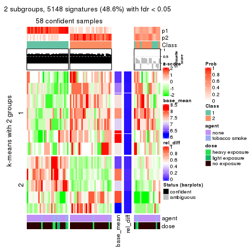</p>

</div>
<div id='tab-SD-NMF-get-signatures-2'>
<pre><code class="r">get_signatures(res, k = 3)
</code></pre>

<p>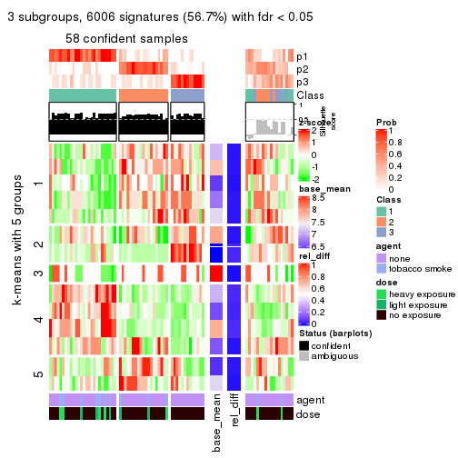</p>

</div>
<div id='tab-SD-NMF-get-signatures-3'>
<pre><code class="r">get_signatures(res, k = 4)
</code></pre>

<p>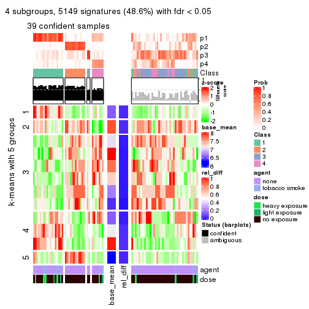</p>

</div>
<div id='tab-SD-NMF-get-signatures-4'>
<pre><code class="r">get_signatures(res, k = 5)
</code></pre>

<p>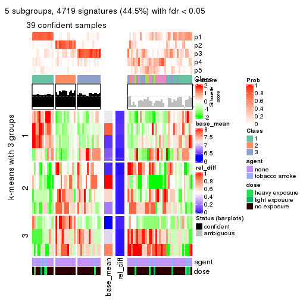</p>

</div>
<div id='tab-SD-NMF-get-signatures-5'>
<pre><code class="r">get_signatures(res, k = 6)
</code></pre>

<p>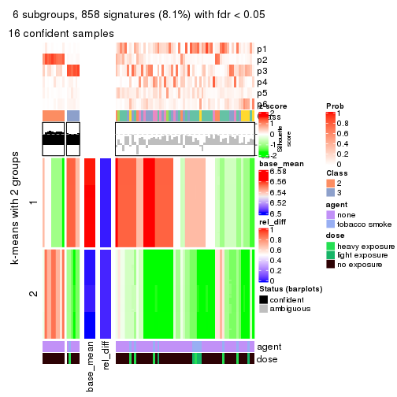</p>

</div>
</div>


Signature heatmaps where rows are not scaled:


<script>
$( function() {
	$( '#tabs-SD-NMF-get-signatures-no-scale' ).tabs();
} );
</script>
<div id='tabs-SD-NMF-get-signatures-no-scale'>
<ul>
<li><a href='#tab-SD-NMF-get-signatures-no-scale-1'>k = 2</a></li>
<li><a href='#tab-SD-NMF-get-signatures-no-scale-2'>k = 3</a></li>
<li><a href='#tab-SD-NMF-get-signatures-no-scale-3'>k = 4</a></li>
<li><a href='#tab-SD-NMF-get-signatures-no-scale-4'>k = 5</a></li>
<li><a href='#tab-SD-NMF-get-signatures-no-scale-5'>k = 6</a></li>
</ul>
<div id='tab-SD-NMF-get-signatures-no-scale-1'>
<pre><code class="r">get_signatures(res, k = 2, scale_rows = FALSE)
</code></pre>

<p>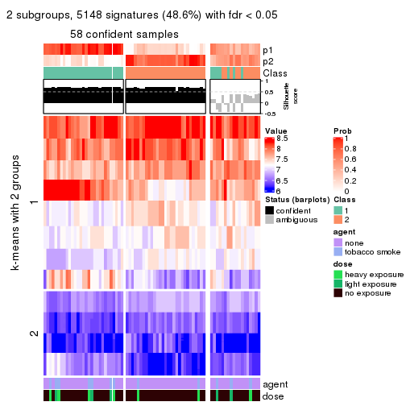</p>

</div>
<div id='tab-SD-NMF-get-signatures-no-scale-2'>
<pre><code class="r">get_signatures(res, k = 3, scale_rows = FALSE)
</code></pre>

<p>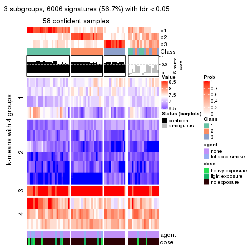</p>

</div>
<div id='tab-SD-NMF-get-signatures-no-scale-3'>
<pre><code class="r">get_signatures(res, k = 4, scale_rows = FALSE)
</code></pre>

<p>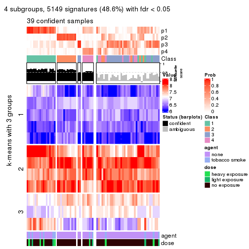</p>

</div>
<div id='tab-SD-NMF-get-signatures-no-scale-4'>
<pre><code class="r">get_signatures(res, k = 5, scale_rows = FALSE)
</code></pre>

<p>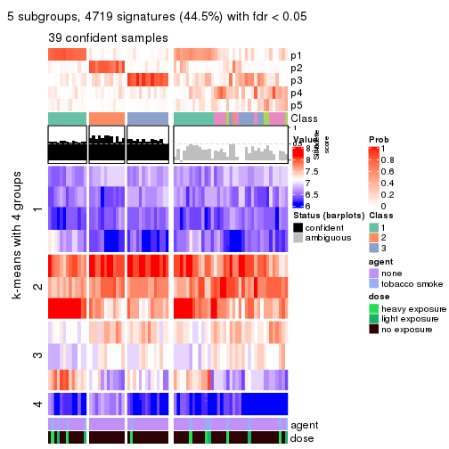</p>

</div>
<div id='tab-SD-NMF-get-signatures-no-scale-5'>
<pre><code class="r">get_signatures(res, k = 6, scale_rows = FALSE)
</code></pre>

<p>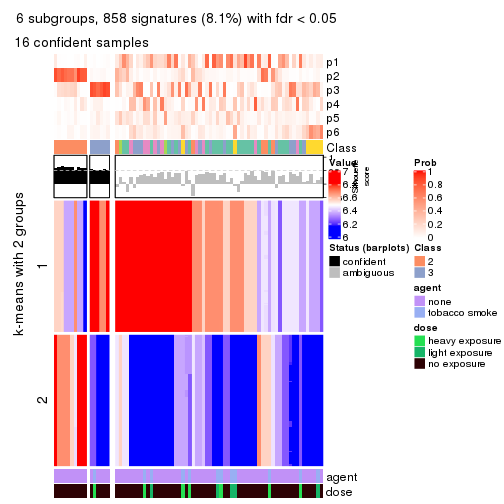</p>

</div>
</div>


Compare the overlap of signatures from different k:

```r
compare_signatures(res)
```

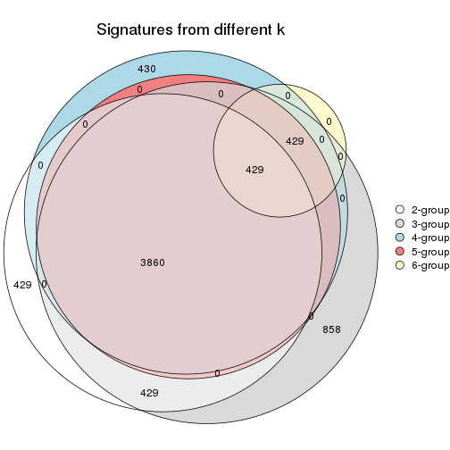

`get_signature()` returns a data frame invisibly. TO get the list of signatures, the function
call should be assigned to a variable explicitly. In following code, if `plot` argument is set
to `FALSE`, no heatmap is plotted while only the differential analysis is performed.

```r
# code only for demonstration
tb = get_signature(res, k = ..., plot = FALSE)
```

An example of the output of `tb` is:

```
#>   which_row         fdr    mean_1    mean_2 scaled_mean_1 scaled_mean_2 km
#> 1        38 0.042760348  8.373488  9.131774    -0.5533452     0.5164555  1
#> 2        40 0.018707592  7.106213  8.469186    -0.6173731     0.5762149  1
#> 3        55 0.019134737 10.221463 11.207825    -0.6159697     0.5749050  1
#> 4        59 0.006059896  5.921854  7.869574    -0.6899429     0.6439467  1
#> 5        60 0.018055526  8.928898 10.211722    -0.6204761     0.5791110  1
#> 6        98 0.009384629 15.714769 14.887706     0.6635654    -0.6193277  2
...
```

The columns in `tb` are:

1. `which_row`: row indices corresponding to the input matrix.
2. `fdr`: FDR for the differential test. 
3. `mean_x`: The mean value in group x.
4. `scaled_mean_x`: The mean value in group x after rows are scaled.
5. `km`: Row groups if k-means clustering is applied to rows.


UMAP plot which shows how samples are separated.


<script>
$( function() {
	$( '#tabs-SD-NMF-dimension-reduction' ).tabs();
} );
</script>
<div id='tabs-SD-NMF-dimension-reduction'>
<ul>
<li><a href='#tab-SD-NMF-dimension-reduction-1'>k = 2</a></li>
<li><a href='#tab-SD-NMF-dimension-reduction-2'>k = 3</a></li>
<li><a href='#tab-SD-NMF-dimension-reduction-3'>k = 4</a></li>
<li><a href='#tab-SD-NMF-dimension-reduction-4'>k = 5</a></li>
<li><a href='#tab-SD-NMF-dimension-reduction-5'>k = 6</a></li>
</ul>
<div id='tab-SD-NMF-dimension-reduction-1'>
<pre><code class="r">dimension_reduction(res, k = 2, method = &quot;UMAP&quot;)
</code></pre>

<p>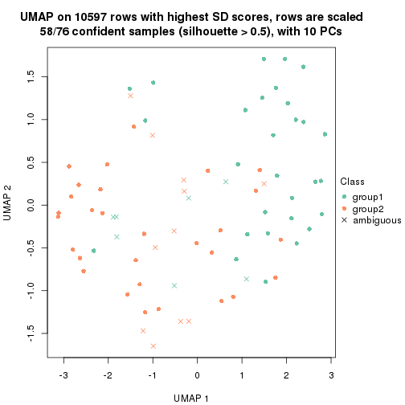</p>

</div>
<div id='tab-SD-NMF-dimension-reduction-2'>
<pre><code class="r">dimension_reduction(res, k = 3, method = &quot;UMAP&quot;)
</code></pre>

<p>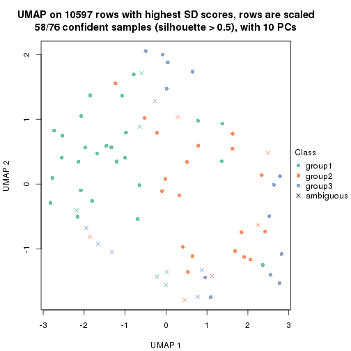</p>

</div>
<div id='tab-SD-NMF-dimension-reduction-3'>
<pre><code class="r">dimension_reduction(res, k = 4, method = &quot;UMAP&quot;)
</code></pre>

<p>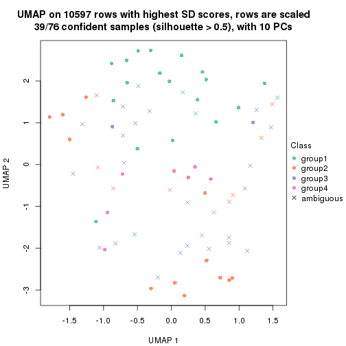</p>

</div>
<div id='tab-SD-NMF-dimension-reduction-4'>
<pre><code class="r">dimension_reduction(res, k = 5, method = &quot;UMAP&quot;)
</code></pre>

<p>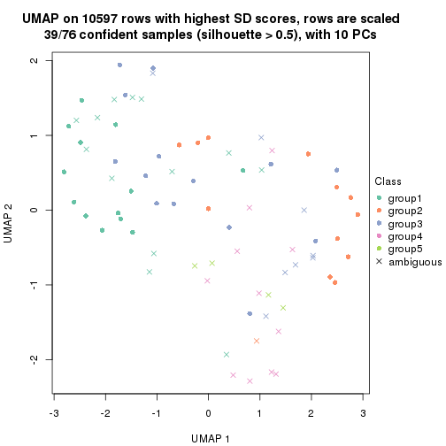</p>

</div>
<div id='tab-SD-NMF-dimension-reduction-5'>
<pre><code class="r">dimension_reduction(res, k = 6, method = &quot;UMAP&quot;)
</code></pre>

<p>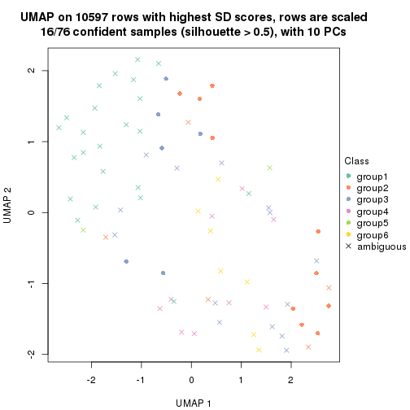</p>

</div>
</div>


Following heatmap shows how subgroups are split when increasing `k`:

```r
collect_classes(res)
```

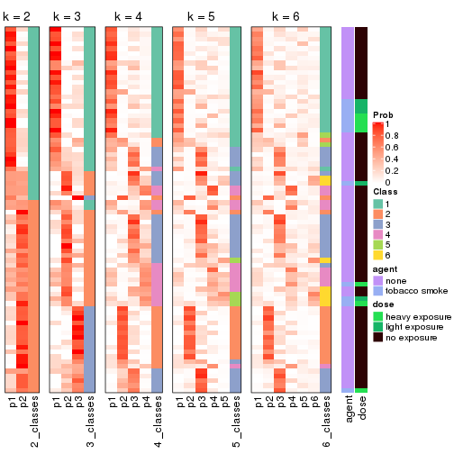


Test correlation between subgroups and known annotations. If the known
annotation is numeric, one-way ANOVA test is applied, and if the known
annotation is discrete, chi-squared contingency table test is applied.

```r
test_to_known_factors(res)
```

```
#>         n agent(p) dose(p) k
#> SD:NMF 58   0.1469   0.124 2
#> SD:NMF 58   0.1084   0.290 3
#> SD:NMF 39   0.1268   0.427 4
#> SD:NMF 39   0.0519   0.153 5
#> SD:NMF 16   0.7897   0.790 6
```


If matrix rows can be associated to genes, consider to use `GO_Enrichment(res,
...)` to perform function enrichment for the signature genes.


 

---------------------------------------------------


### CV:hclust


The object with results only for a single top-value method and a single partition method 
can be extracted as:

```r
res = res_list["CV", "hclust"]
# you can also extract it by
# res = res_list["CV:hclust"]
```

A summary of `res` and all the functions that can be applied to it:

```r
res
```

```
#> A 'ConsensusPartition' object with k = 2, 3, 4, 5, 6.
#>   On a matrix with 10597 rows and 76 columns.
#>   Top rows (1000, 2000, 3000, 4000, 5000) are extracted by 'CV' method.
#>   Subgroups are detected by 'hclust' method.
#>   Performed in total 1250 partitions by row resampling.
#>   Best k for subgroups seems to be 2.
#> 
#> Following methods can be applied to this 'ConsensusPartition' object:
#>  [1] "cola_report"             "collect_classes"         "collect_plots"          
#>  [4] "collect_stats"           "colnames"                "compare_signatures"     
#>  [7] "consensus_heatmap"       "dimension_reduction"     "functional_enrichment"  
#> [10] "get_anno_col"            "get_anno"                "get_classes"            
#> [13] "get_consensus"           "get_matrix"              "get_membership"         
#> [16] "get_param"               "get_signatures"          "get_stats"              
#> [19] "is_best_k"               "is_stable_k"             "membership_heatmap"     
#> [22] "ncol"                    "nrow"                    "plot_ecdf"              
#> [25] "rownames"                "select_partition_number" "show"                   
#> [28] "suggest_best_k"          "test_to_known_factors"
```

`collect_plots()` function collects all the plots made from `res` for all `k` (number of partitions)
into one single page to provide an easy and fast comparison between different `k`.

```r
collect_plots(res)
```

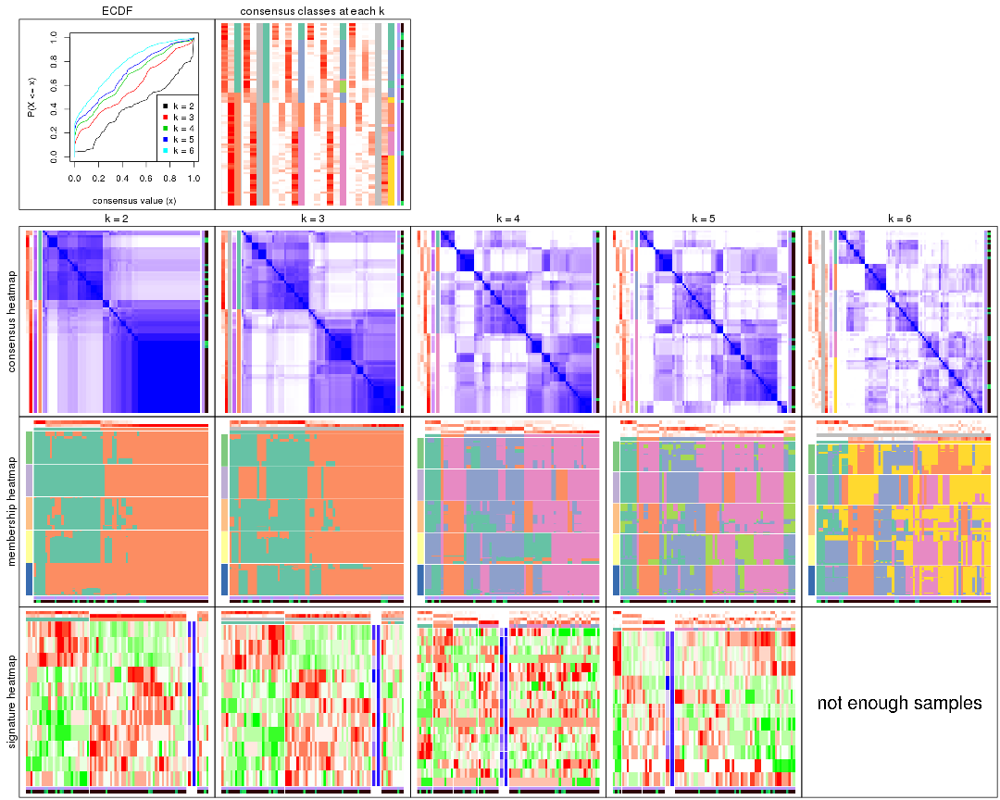

The plots are:

- The first row: a plot of the ECDF (Empirical cumulative distribution
  function) curves of the consensus matrix for each `k` and the heatmap of
  predicted classes for each `k`.
- The second row: heatmaps of the consensus matrix for each `k`.
- The third row: heatmaps of the membership matrix for each `k`.
- The fouth row: heatmaps of the signatures for each `k`.

All the plots in panels can be made by individual functions and they are
plotted later in this section.

`select_partition_number()` produces several plots showing different
statistics for choosing "optimized" `k`. There are following statistics:

- ECDF curves of the consensus matrix for each `k`;
- 1-PAC. [The PAC
  score](https://en.wikipedia.org/wiki/Consensus_clustering#Over-interpretation_potential_of_consensus_clustering)
  measures the proportion of the ambiguous subgrouping.
- Mean silhouette score.
- Concordance. The mean probability of fiting the consensus class ids in all
  partitions.
- Area increased. Denote $A_k$ as the area under the ECDF curve for current
  `k`, the area increased is defined as $A_k - A_{k-1}$.
- Rand index. The percent of pairs of samples that are both in a same cluster
  or both are not in a same cluster in the partition of k and k-1.
- Jaccard index. The ratio of pairs of samples are both in a same cluster in
  the partition of k and k-1 and the pairs of samples are both in a same
  cluster in the partition k or k-1.

The detailed explanations of these statistics can be found in [the cola
vignette](http://bioconductor.org/packages/devel/bioc/vignettes/cola/inst/doc/cola.html#toc_13).

Generally speaking, lower PAC score, higher mean silhouette score or higher
concordance corresponds to better partition. Rand index and Jaccard index
measure how similar the current partition is compared to partition with `k-1`.
If they are too similar, we won't accept `k` is better than `k-1`.

```r
select_partition_number(res)
```

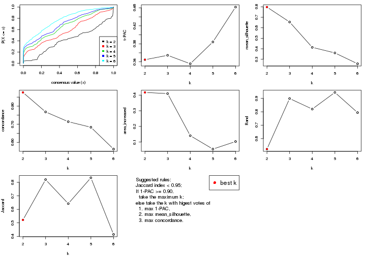

The numeric values for all these statistics can be obtained by `get_stats()`.

```r
get_stats(res)
```

```
#>   k 1-PAC mean_silhouette concordance area_increased  Rand Jaccard
#> 2 2 0.345           0.797       0.876         0.4171 0.522   0.522
#> 3 3 0.354           0.655       0.768         0.4096 0.899   0.820
#> 4 4 0.336           0.414       0.714         0.1409 0.820   0.642
#> 5 5 0.384           0.361       0.683         0.0552 0.945   0.834
#> 6 6 0.462           0.257       0.563         0.1035 0.794   0.414
```

`suggest_best_k()` suggests the best $k$ based on these statistics. The rules are as follows:

- All $k$ with Jaccard index larger than 0.95 are removed because the increase of
  the partition number does not provides enough extra information. If all $k$ are removed,
  the best $k$ is assigned by `NA`.
- For $k$ with 1-PAC larger than 0.9, the maximal $k$ is taken as the "best k". Other $k$ is called "optional k".
- If it does not fit the second rule. The $k$ with the highest vote of highest
  1-PAC, mean silhouette and concordance is taken as the "best k".

```r
suggest_best_k(res)
```

```
#> [1] 2
```


Following shows the table of the partitions (You need to click the **show/hide
code output** link to see it). The membership matrix (columns with name `p*`)
is inferred by
[`clue::cl_consensus()`](https://www.rdocumentation.org/link/cl_consensus?package=clue)
function with the `SE` method. Basically the value in the membership matrix
represents the probability to belong to a certain group. The finall class
label for an item is determined with the group with highest probability it
belongs to.

In `get_classes()` function, the entropy is calculated from the membership
matrix and the silhouette score is calculated from the consensus matrix.


<script>
$( function() {
	$( '#tabs-CV-hclust-get-classes' ).tabs();
} );
</script>
<div id='tabs-CV-hclust-get-classes'>
<ul>
<li><a href='#tab-CV-hclust-get-classes-1'>k = 2</a></li>
<li><a href='#tab-CV-hclust-get-classes-2'>k = 3</a></li>
<li><a href='#tab-CV-hclust-get-classes-3'>k = 4</a></li>
<li><a href='#tab-CV-hclust-get-classes-4'>k = 5</a></li>
<li><a href='#tab-CV-hclust-get-classes-5'>k = 6</a></li>
</ul>

<div id='tab-CV-hclust-get-classes-1'>
<p><a id='tab-CV-hclust-get-classes-1-a' style='color:#0366d6' href='#'>show/hide code output</a></p>
<pre><code class="r">cbind(get_classes(res, k = 2), get_membership(res, k = 2))
</code></pre>

<pre><code>#&gt;           class entropy silhouette    p1    p2
#&gt; GSM451162     2   0.788     0.6138 0.236 0.764
#&gt; GSM451163     2   0.000     0.9070 0.000 1.000
#&gt; GSM451164     2   0.000     0.9070 0.000 1.000
#&gt; GSM451165     2   0.000     0.9070 0.000 1.000
#&gt; GSM451167     2   0.430     0.8382 0.088 0.912
#&gt; GSM451168     2   0.697     0.7053 0.188 0.812
#&gt; GSM451169     2   0.456     0.8325 0.096 0.904
#&gt; GSM451170     1   0.671     0.8527 0.824 0.176
#&gt; GSM451171     2   0.000     0.9070 0.000 1.000
#&gt; GSM451172     2   0.000     0.9070 0.000 1.000
#&gt; GSM451173     1   0.946     0.7176 0.636 0.364
#&gt; GSM451174     2   0.000     0.9070 0.000 1.000
#&gt; GSM451175     1   0.855     0.8055 0.720 0.280
#&gt; GSM451177     2   0.000     0.9070 0.000 1.000
#&gt; GSM451178     2   0.000     0.9070 0.000 1.000
#&gt; GSM451179     2   0.958     0.1953 0.380 0.620
#&gt; GSM451180     2   0.000     0.9070 0.000 1.000
#&gt; GSM451181     2   0.000     0.9070 0.000 1.000
#&gt; GSM451182     1   0.671     0.8527 0.824 0.176
#&gt; GSM451183     1   0.615     0.8481 0.848 0.152
#&gt; GSM451184     1   0.946     0.7209 0.636 0.364
#&gt; GSM451185     1   0.000     0.7388 1.000 0.000
#&gt; GSM451186     2   0.184     0.8841 0.028 0.972
#&gt; GSM451187     2   0.000     0.9070 0.000 1.000
#&gt; GSM451188     2   0.000     0.9070 0.000 1.000
#&gt; GSM451189     1   0.615     0.8481 0.848 0.152
#&gt; GSM451190     1   0.443     0.8076 0.908 0.092
#&gt; GSM451191     1   0.821     0.8288 0.744 0.256
#&gt; GSM451193     2   0.966     0.1495 0.392 0.608
#&gt; GSM451195     1   0.946     0.7176 0.636 0.364
#&gt; GSM451196     1   0.000     0.7388 1.000 0.000
#&gt; GSM451197     1   0.634     0.8509 0.840 0.160
#&gt; GSM451199     1   0.814     0.8305 0.748 0.252
#&gt; GSM451201     1   0.644     0.8520 0.836 0.164
#&gt; GSM451202     2   0.000     0.9070 0.000 1.000
#&gt; GSM451203     1   1.000     0.3671 0.508 0.492
#&gt; GSM451204     2   0.184     0.8883 0.028 0.972
#&gt; GSM451205     2   0.000     0.9070 0.000 1.000
#&gt; GSM451206     2   0.000     0.9070 0.000 1.000
#&gt; GSM451207     2   0.000     0.9070 0.000 1.000
#&gt; GSM451208     2   0.000     0.9070 0.000 1.000
#&gt; GSM451209     2   0.541     0.8000 0.124 0.876
#&gt; GSM451210     2   0.000     0.9070 0.000 1.000
#&gt; GSM451212     2   0.000     0.9070 0.000 1.000
#&gt; GSM451213     2   0.000     0.9070 0.000 1.000
#&gt; GSM451214     2   0.552     0.7941 0.128 0.872
#&gt; GSM451215     2   0.000     0.9070 0.000 1.000
#&gt; GSM451216     2   0.000     0.9070 0.000 1.000
#&gt; GSM451217     2   0.000     0.9070 0.000 1.000
#&gt; GSM451219     1   0.827     0.8253 0.740 0.260
#&gt; GSM451220     1   0.936     0.7144 0.648 0.352
#&gt; GSM451221     1   0.833     0.8227 0.736 0.264
#&gt; GSM451222     1   0.753     0.8483 0.784 0.216
#&gt; GSM451224     2   0.000     0.9070 0.000 1.000
#&gt; GSM451225     2   0.961     0.0725 0.384 0.616
#&gt; GSM451226     1   0.981     0.5703 0.580 0.420
#&gt; GSM451227     2   0.552     0.7941 0.128 0.872
#&gt; GSM451228     2   0.644     0.7438 0.164 0.836
#&gt; GSM451230     1   0.781     0.8424 0.768 0.232
#&gt; GSM451231     2   0.775     0.5747 0.228 0.772
#&gt; GSM451233     2   0.184     0.8883 0.028 0.972
#&gt; GSM451234     2   0.000     0.9070 0.000 1.000
#&gt; GSM451235     2   0.000     0.9070 0.000 1.000
#&gt; GSM451236     2   0.000     0.9070 0.000 1.000
#&gt; GSM451166     2   0.706     0.6853 0.192 0.808
#&gt; GSM451194     1   0.936     0.7281 0.648 0.352
#&gt; GSM451198     1   0.730     0.8503 0.796 0.204
#&gt; GSM451218     2   0.000     0.9070 0.000 1.000
#&gt; GSM451232     1   0.615     0.8481 0.848 0.152
#&gt; GSM451176     1   0.000     0.7388 1.000 0.000
#&gt; GSM451192     1   0.644     0.8520 0.836 0.164
#&gt; GSM451200     1   0.760     0.8465 0.780 0.220
#&gt; GSM451211     2   0.000     0.9070 0.000 1.000
#&gt; GSM451223     2   0.932     0.2975 0.348 0.652
#&gt; GSM451229     1   0.000     0.7388 1.000 0.000
#&gt; GSM451237     2   0.000     0.9070 0.000 1.000
</code></pre>

<script>
$('#tab-CV-hclust-get-classes-1-a').parent().next().next().hide();
$('#tab-CV-hclust-get-classes-1-a').click(function(){
  $('#tab-CV-hclust-get-classes-1-a').parent().next().next().toggle();
  return(false);
});
</script>
</div>

<div id='tab-CV-hclust-get-classes-2'>
<p><a id='tab-CV-hclust-get-classes-2-a' style='color:#0366d6' href='#'>show/hide code output</a></p>
<pre><code class="r">cbind(get_classes(res, k = 3), get_membership(res, k = 3))
</code></pre>

<pre><code>#&gt;           class entropy silhouette    p1    p2 p3
#&gt; GSM451162     1  0.9757    -0.0721 0.388 0.384 NA
#&gt; GSM451163     2  0.4002     0.7516 0.000 0.840 NA
#&gt; GSM451164     2  0.5882     0.7188 0.000 0.652 NA
#&gt; GSM451165     2  0.8199     0.5969 0.160 0.640 NA
#&gt; GSM451167     2  0.6935     0.7076 0.088 0.724 NA
#&gt; GSM451168     2  0.5253     0.6539 0.188 0.792 NA
#&gt; GSM451169     2  0.9298     0.4466 0.248 0.524 NA
#&gt; GSM451170     1  0.1289     0.7784 0.968 0.000 NA
#&gt; GSM451171     2  0.6264     0.7087 0.004 0.616 NA
#&gt; GSM451172     2  0.8199     0.5969 0.160 0.640 NA
#&gt; GSM451173     1  0.5722     0.7272 0.800 0.132 NA
#&gt; GSM451174     2  0.0000     0.7553 0.000 1.000 NA
#&gt; GSM451175     1  0.6624     0.6035 0.708 0.248 NA
#&gt; GSM451177     2  0.6330     0.7016 0.004 0.600 NA
#&gt; GSM451178     2  0.0000     0.7553 0.000 1.000 NA
#&gt; GSM451179     1  0.8257     0.2371 0.544 0.372 NA
#&gt; GSM451180     2  0.6330     0.7016 0.004 0.600 NA
#&gt; GSM451181     2  0.4702     0.7332 0.000 0.788 NA
#&gt; GSM451182     1  0.1289     0.7784 0.968 0.000 NA
#&gt; GSM451183     1  0.4750     0.7272 0.784 0.000 NA
#&gt; GSM451184     1  0.5292     0.7360 0.800 0.028 NA
#&gt; GSM451185     1  0.5988     0.6595 0.632 0.000 NA
#&gt; GSM451186     2  0.8681     0.3917 0.188 0.596 NA
#&gt; GSM451187     2  0.4002     0.7516 0.000 0.840 NA
#&gt; GSM451188     2  0.6398     0.6902 0.004 0.580 NA
#&gt; GSM451189     1  0.4750     0.7272 0.784 0.000 NA
#&gt; GSM451190     1  0.2537     0.7686 0.920 0.000 NA
#&gt; GSM451191     1  0.3234     0.7735 0.908 0.020 NA
#&gt; GSM451193     1  0.7982     0.2545 0.556 0.376 NA
#&gt; GSM451195     1  0.5696     0.7263 0.800 0.136 NA
#&gt; GSM451196     1  0.5988     0.6595 0.632 0.000 NA
#&gt; GSM451197     1  0.0237     0.7771 0.996 0.000 NA
#&gt; GSM451199     1  0.3213     0.7738 0.912 0.028 NA
#&gt; GSM451201     1  0.0475     0.7777 0.992 0.004 NA
#&gt; GSM451202     2  0.6264     0.7087 0.004 0.616 NA
#&gt; GSM451203     1  0.7571     0.2257 0.508 0.452 NA
#&gt; GSM451204     2  0.2031     0.7458 0.032 0.952 NA
#&gt; GSM451205     2  0.6330     0.7016 0.004 0.600 NA
#&gt; GSM451206     2  0.0000     0.7553 0.000 1.000 NA
#&gt; GSM451207     2  0.3851     0.7488 0.004 0.860 NA
#&gt; GSM451208     2  0.6330     0.7016 0.004 0.600 NA
#&gt; GSM451209     2  0.5069     0.6782 0.128 0.828 NA
#&gt; GSM451210     2  0.6264     0.7087 0.004 0.616 NA
#&gt; GSM451212     2  0.1399     0.7476 0.004 0.968 NA
#&gt; GSM451213     2  0.0237     0.7546 0.004 0.996 NA
#&gt; GSM451214     2  0.8872     0.6054 0.132 0.520 NA
#&gt; GSM451215     2  0.6330     0.7016 0.004 0.600 NA
#&gt; GSM451216     2  0.0237     0.7546 0.004 0.996 NA
#&gt; GSM451217     2  0.4002     0.7516 0.000 0.840 NA
#&gt; GSM451219     1  0.3370     0.7721 0.904 0.024 NA
#&gt; GSM451220     1  0.5235     0.7339 0.812 0.036 NA
#&gt; GSM451221     1  0.3415     0.7717 0.900 0.020 NA
#&gt; GSM451222     1  0.5850     0.6657 0.772 0.188 NA
#&gt; GSM451224     2  0.6398     0.6902 0.004 0.580 NA
#&gt; GSM451225     2  0.7222     0.0571 0.388 0.580 NA
#&gt; GSM451226     1  0.6652     0.6392 0.744 0.172 NA
#&gt; GSM451227     2  0.8872     0.6054 0.132 0.520 NA
#&gt; GSM451228     2  0.9030     0.3144 0.328 0.520 NA
#&gt; GSM451230     1  0.5660     0.6578 0.772 0.200 NA
#&gt; GSM451231     2  0.6465     0.4741 0.232 0.724 NA
#&gt; GSM451233     2  0.2918     0.7365 0.032 0.924 NA
#&gt; GSM451234     2  0.0983     0.7505 0.004 0.980 NA
#&gt; GSM451235     2  0.0983     0.7505 0.004 0.980 NA
#&gt; GSM451236     2  0.0983     0.7505 0.004 0.980 NA
#&gt; GSM451166     2  0.5331     0.5502 0.184 0.792 NA
#&gt; GSM451194     1  0.5442     0.7280 0.812 0.132 NA
#&gt; GSM451198     1  0.1711     0.7766 0.960 0.008 NA
#&gt; GSM451218     2  0.0983     0.7505 0.004 0.980 NA
#&gt; GSM451232     1  0.4750     0.7272 0.784 0.000 NA
#&gt; GSM451176     1  0.5988     0.6595 0.632 0.000 NA
#&gt; GSM451192     1  0.0475     0.7779 0.992 0.004 NA
#&gt; GSM451200     1  0.2173     0.7755 0.944 0.008 NA
#&gt; GSM451211     2  0.0237     0.7546 0.004 0.996 NA
#&gt; GSM451223     1  0.8347     0.1395 0.512 0.404 NA
#&gt; GSM451229     1  0.5988     0.6595 0.632 0.000 NA
#&gt; GSM451237     2  0.0983     0.7505 0.004 0.980 NA
</code></pre>

<script>
$('#tab-CV-hclust-get-classes-2-a').parent().next().next().hide();
$('#tab-CV-hclust-get-classes-2-a').click(function(){
  $('#tab-CV-hclust-get-classes-2-a').parent().next().next().toggle();
  return(false);
});
</script>
</div>

<div id='tab-CV-hclust-get-classes-3'>
<p><a id='tab-CV-hclust-get-classes-3-a' style='color:#0366d6' href='#'>show/hide code output</a></p>
<pre><code class="r">cbind(get_classes(res, k = 4), get_membership(res, k = 4))
</code></pre>

<pre><code>#&gt;           class entropy silhouette    p1    p2    p3    p4
#&gt; GSM451162     3  0.7711  -0.000629 0.164 0.012 0.480 0.344
#&gt; GSM451163     4  0.4148   0.455414 0.156 0.016 0.012 0.816
#&gt; GSM451164     4  0.6586  -0.013657 0.156 0.216 0.000 0.628
#&gt; GSM451165     4  0.7221   0.206772 0.160 0.016 0.224 0.600
#&gt; GSM451167     4  0.6267   0.386920 0.156 0.016 0.128 0.700
#&gt; GSM451168     4  0.5572   0.420237 0.048 0.048 0.140 0.764
#&gt; GSM451169     4  0.7701   0.117843 0.164 0.012 0.340 0.484
#&gt; GSM451170     3  0.4839   0.353974 0.200 0.044 0.756 0.000
#&gt; GSM451171     4  0.7340  -0.572997 0.156 0.408 0.000 0.436
#&gt; GSM451172     4  0.7221   0.206772 0.160 0.016 0.224 0.600
#&gt; GSM451173     3  0.2589   0.550390 0.000 0.000 0.884 0.116
#&gt; GSM451174     4  0.0188   0.560598 0.000 0.004 0.000 0.996
#&gt; GSM451175     3  0.6448   0.299047 0.108 0.004 0.640 0.248
#&gt; GSM451177     2  0.4941   0.766252 0.000 0.564 0.000 0.436
#&gt; GSM451178     4  0.0188   0.560598 0.000 0.004 0.000 0.996
#&gt; GSM451179     3  0.6308   0.217795 0.060 0.004 0.580 0.356
#&gt; GSM451180     2  0.4941   0.766252 0.000 0.564 0.000 0.436
#&gt; GSM451181     4  0.4137   0.247356 0.000 0.208 0.012 0.780
#&gt; GSM451182     3  0.4839   0.353974 0.200 0.044 0.756 0.000
#&gt; GSM451183     1  0.4967   0.639626 0.548 0.000 0.452 0.000
#&gt; GSM451184     3  0.4294   0.511156 0.052 0.104 0.832 0.012
#&gt; GSM451185     1  0.3266   0.773431 0.832 0.000 0.168 0.000
#&gt; GSM451186     2  0.7495  -0.222983 0.000 0.448 0.184 0.368
#&gt; GSM451187     4  0.4148   0.455414 0.156 0.016 0.012 0.816
#&gt; GSM451188     2  0.5598   0.759847 0.004 0.564 0.016 0.416
#&gt; GSM451189     1  0.4967   0.639626 0.548 0.000 0.452 0.000
#&gt; GSM451190     3  0.5039   0.037505 0.404 0.004 0.592 0.000
#&gt; GSM451191     3  0.3453   0.530913 0.080 0.052 0.868 0.000
#&gt; GSM451193     3  0.6116   0.230637 0.048 0.004 0.588 0.360
#&gt; GSM451195     3  0.2647   0.550084 0.000 0.000 0.880 0.120
#&gt; GSM451196     1  0.3726   0.776256 0.788 0.000 0.212 0.000
#&gt; GSM451197     3  0.4431   0.168224 0.304 0.000 0.696 0.000
#&gt; GSM451199     3  0.3758   0.538503 0.076 0.048 0.864 0.012
#&gt; GSM451201     3  0.4584   0.178488 0.300 0.000 0.696 0.004
#&gt; GSM451202     4  0.7340  -0.572997 0.156 0.408 0.000 0.436
#&gt; GSM451203     3  0.6561   0.138732 0.056 0.008 0.492 0.444
#&gt; GSM451204     4  0.2032   0.560430 0.000 0.036 0.028 0.936
#&gt; GSM451205     2  0.4941   0.766252 0.000 0.564 0.000 0.436
#&gt; GSM451206     4  0.0188   0.560598 0.000 0.004 0.000 0.996
#&gt; GSM451207     4  0.2868   0.407459 0.000 0.136 0.000 0.864
#&gt; GSM451208     2  0.4941   0.766252 0.000 0.564 0.000 0.436
#&gt; GSM451209     4  0.4149   0.495737 0.000 0.036 0.152 0.812
#&gt; GSM451210     4  0.7340  -0.572997 0.156 0.408 0.000 0.436
#&gt; GSM451212     4  0.1109   0.561812 0.004 0.000 0.028 0.968
#&gt; GSM451213     4  0.0188   0.561342 0.004 0.000 0.000 0.996
#&gt; GSM451214     2  0.8192   0.607504 0.052 0.468 0.124 0.356
#&gt; GSM451215     2  0.4941   0.766252 0.000 0.564 0.000 0.436
#&gt; GSM451216     4  0.0188   0.561342 0.004 0.000 0.000 0.996
#&gt; GSM451217     4  0.4148   0.455414 0.156 0.016 0.012 0.816
#&gt; GSM451219     3  0.3767   0.537687 0.084 0.048 0.860 0.008
#&gt; GSM451220     3  0.2805   0.513776 0.100 0.000 0.888 0.012
#&gt; GSM451221     3  0.3521   0.532765 0.084 0.052 0.864 0.000
#&gt; GSM451222     3  0.5798   0.356837 0.112 0.000 0.704 0.184
#&gt; GSM451224     2  0.5598   0.759847 0.004 0.564 0.016 0.416
#&gt; GSM451225     4  0.7074   0.079850 0.024 0.080 0.332 0.564
#&gt; GSM451226     3  0.4866   0.472622 0.060 0.004 0.780 0.156
#&gt; GSM451227     2  0.8192   0.607504 0.052 0.468 0.124 0.356
#&gt; GSM451228     4  0.6770   0.120851 0.096 0.000 0.408 0.496
#&gt; GSM451230     3  0.5669   0.369776 0.092 0.000 0.708 0.200
#&gt; GSM451231     4  0.5143   0.409135 0.000 0.036 0.256 0.708
#&gt; GSM451233     4  0.2660   0.557033 0.000 0.036 0.056 0.908
#&gt; GSM451234     4  0.3942   0.476067 0.000 0.236 0.000 0.764
#&gt; GSM451235     4  0.3942   0.476067 0.000 0.236 0.000 0.764
#&gt; GSM451236     4  0.4122   0.474665 0.004 0.236 0.000 0.760
#&gt; GSM451166     4  0.4901   0.445391 0.012 0.048 0.156 0.784
#&gt; GSM451194     3  0.3850   0.542926 0.000 0.044 0.840 0.116
#&gt; GSM451198     3  0.1890   0.515959 0.056 0.000 0.936 0.008
#&gt; GSM451218     4  0.4122   0.474665 0.004 0.236 0.000 0.760
#&gt; GSM451232     1  0.4761   0.716195 0.628 0.000 0.372 0.000
#&gt; GSM451176     1  0.4222   0.779323 0.728 0.000 0.272 0.000
#&gt; GSM451192     3  0.4304   0.228733 0.284 0.000 0.716 0.000
#&gt; GSM451200     3  0.1545   0.525969 0.040 0.000 0.952 0.008
#&gt; GSM451211     4  0.0000   0.561492 0.000 0.000 0.000 1.000
#&gt; GSM451223     3  0.6404   0.138917 0.060 0.004 0.548 0.388
#&gt; GSM451229     1  0.3266   0.773431 0.832 0.000 0.168 0.000
#&gt; GSM451237     4  0.3942   0.476067 0.000 0.236 0.000 0.764
</code></pre>

<script>
$('#tab-CV-hclust-get-classes-3-a').parent().next().next().hide();
$('#tab-CV-hclust-get-classes-3-a').click(function(){
  $('#tab-CV-hclust-get-classes-3-a').parent().next().next().toggle();
  return(false);
});
</script>
</div>

<div id='tab-CV-hclust-get-classes-4'>
<p><a id='tab-CV-hclust-get-classes-4-a' style='color:#0366d6' href='#'>show/hide code output</a></p>
<pre><code class="r">cbind(get_classes(res, k = 5), get_membership(res, k = 5))
</code></pre>

<pre><code>#&gt;           class entropy silhouette    p1    p2    p3    p4    p5
#&gt; GSM451162     3  0.6942     0.0231 0.004 0.000 0.356 0.344 0.296
#&gt; GSM451163     4  0.3443     0.4542 0.000 0.008 0.012 0.816 0.164
#&gt; GSM451164     4  0.5752     0.0132 0.000 0.208 0.000 0.620 0.172
#&gt; GSM451165     4  0.5188     0.2284 0.000 0.000 0.056 0.600 0.344
#&gt; GSM451167     4  0.5268     0.3913 0.000 0.008 0.128 0.700 0.164
#&gt; GSM451168     4  0.4325     0.4160 0.000 0.004 0.192 0.756 0.048
#&gt; GSM451169     4  0.6651     0.1303 0.004 0.000 0.268 0.484 0.244
#&gt; GSM451170     3  0.4670     0.2282 0.200 0.000 0.724 0.000 0.076
#&gt; GSM451171     4  0.6346    -0.5531 0.000 0.404 0.000 0.436 0.160
#&gt; GSM451172     4  0.5188     0.2284 0.000 0.000 0.056 0.600 0.344
#&gt; GSM451173     3  0.6031    -0.0370 0.012 0.000 0.580 0.108 0.300
#&gt; GSM451174     4  0.0404     0.5485 0.000 0.000 0.000 0.988 0.012
#&gt; GSM451175     3  0.7734    -0.0903 0.188 0.000 0.472 0.236 0.104
#&gt; GSM451177     2  0.4256     0.7606 0.000 0.564 0.000 0.436 0.000
#&gt; GSM451178     4  0.0404     0.5485 0.000 0.000 0.000 0.988 0.012
#&gt; GSM451179     3  0.4283     0.2633 0.000 0.000 0.644 0.348 0.008
#&gt; GSM451180     2  0.4256     0.7606 0.000 0.564 0.000 0.436 0.000
#&gt; GSM451181     4  0.3686     0.2604 0.000 0.204 0.012 0.780 0.004
#&gt; GSM451182     3  0.4670     0.2282 0.200 0.000 0.724 0.000 0.076
#&gt; GSM451183     1  0.5320     0.2501 0.572 0.000 0.368 0.000 0.060
#&gt; GSM451184     3  0.3323     0.4121 0.000 0.100 0.844 0.000 0.056
#&gt; GSM451185     1  0.0794     0.5987 0.972 0.000 0.028 0.000 0.000
#&gt; GSM451186     2  0.7114    -0.2081 0.000 0.400 0.016 0.336 0.248
#&gt; GSM451187     4  0.3443     0.4542 0.000 0.008 0.012 0.816 0.164
#&gt; GSM451188     2  0.4182     0.7518 0.000 0.600 0.000 0.400 0.000
#&gt; GSM451189     1  0.5176     0.2400 0.572 0.000 0.380 0.000 0.048
#&gt; GSM451190     3  0.4576    -0.0180 0.376 0.000 0.608 0.000 0.016
#&gt; GSM451191     3  0.2338     0.4320 0.004 0.000 0.884 0.000 0.112
#&gt; GSM451193     3  0.4538     0.2603 0.012 0.000 0.636 0.348 0.004
#&gt; GSM451195     3  0.4509     0.3683 0.012 0.000 0.776 0.108 0.104
#&gt; GSM451196     1  0.2304     0.5801 0.892 0.000 0.008 0.000 0.100
#&gt; GSM451197     5  0.6759     0.4751 0.276 0.000 0.328 0.000 0.396
#&gt; GSM451199     3  0.0880     0.4463 0.000 0.000 0.968 0.000 0.032
#&gt; GSM451201     5  0.6749     0.4810 0.272 0.000 0.328 0.000 0.400
#&gt; GSM451202     4  0.6346    -0.5531 0.000 0.404 0.000 0.436 0.160
#&gt; GSM451203     4  0.7171    -0.1311 0.060 0.004 0.388 0.444 0.104
#&gt; GSM451204     4  0.1836     0.5492 0.000 0.000 0.032 0.932 0.036
#&gt; GSM451205     2  0.4256     0.7606 0.000 0.564 0.000 0.436 0.000
#&gt; GSM451206     4  0.0404     0.5485 0.000 0.000 0.000 0.988 0.012
#&gt; GSM451207     4  0.2911     0.4026 0.000 0.136 0.004 0.852 0.008
#&gt; GSM451208     2  0.4256     0.7606 0.000 0.564 0.000 0.436 0.000
#&gt; GSM451209     4  0.3862     0.5023 0.000 0.000 0.104 0.808 0.088
#&gt; GSM451210     4  0.6346    -0.5531 0.000 0.404 0.000 0.436 0.160
#&gt; GSM451212     4  0.1668     0.5489 0.000 0.000 0.032 0.940 0.028
#&gt; GSM451213     4  0.0955     0.5470 0.000 0.000 0.004 0.968 0.028
#&gt; GSM451214     2  0.6254     0.6101 0.000 0.500 0.160 0.340 0.000
#&gt; GSM451215     2  0.4256     0.7606 0.000 0.564 0.000 0.436 0.000
#&gt; GSM451216     4  0.0955     0.5470 0.000 0.000 0.004 0.968 0.028
#&gt; GSM451217     4  0.3443     0.4542 0.000 0.008 0.012 0.816 0.164
#&gt; GSM451219     3  0.0963     0.4499 0.000 0.000 0.964 0.000 0.036
#&gt; GSM451220     3  0.4208     0.3508 0.020 0.000 0.728 0.004 0.248
#&gt; GSM451221     3  0.2280     0.4329 0.000 0.000 0.880 0.000 0.120
#&gt; GSM451222     5  0.8024     0.4103 0.132 0.000 0.280 0.172 0.416
#&gt; GSM451224     2  0.4182     0.7518 0.000 0.600 0.000 0.400 0.000
#&gt; GSM451225     4  0.6234     0.1142 0.000 0.000 0.172 0.524 0.304
#&gt; GSM451226     3  0.2886     0.3976 0.000 0.000 0.844 0.148 0.008
#&gt; GSM451227     2  0.6254     0.6101 0.000 0.500 0.160 0.340 0.000
#&gt; GSM451228     4  0.6178     0.1077 0.012 0.000 0.404 0.488 0.096
#&gt; GSM451230     5  0.7944     0.3949 0.112 0.000 0.284 0.184 0.420
#&gt; GSM451231     4  0.4701     0.4406 0.000 0.000 0.060 0.704 0.236
#&gt; GSM451233     4  0.2359     0.5470 0.000 0.000 0.060 0.904 0.036
#&gt; GSM451234     4  0.4670     0.4573 0.000 0.200 0.000 0.724 0.076
#&gt; GSM451235     4  0.4670     0.4573 0.000 0.200 0.000 0.724 0.076
#&gt; GSM451236     4  0.4433     0.4686 0.000 0.200 0.000 0.740 0.060
#&gt; GSM451166     4  0.4626     0.4398 0.008 0.000 0.152 0.756 0.084
#&gt; GSM451194     3  0.4509     0.3784 0.012 0.000 0.776 0.108 0.104
#&gt; GSM451198     3  0.5203     0.1583 0.080 0.000 0.648 0.000 0.272
#&gt; GSM451218     4  0.4588     0.4689 0.000 0.200 0.004 0.736 0.060
#&gt; GSM451232     1  0.5579     0.2745 0.600 0.000 0.300 0.000 0.100
#&gt; GSM451176     1  0.2962     0.5985 0.868 0.000 0.084 0.000 0.048
#&gt; GSM451192     5  0.6709     0.4907 0.248 0.000 0.352 0.000 0.400
#&gt; GSM451200     3  0.4058     0.3134 0.064 0.000 0.784 0.000 0.152
#&gt; GSM451211     4  0.0451     0.5488 0.000 0.000 0.004 0.988 0.008
#&gt; GSM451223     3  0.4392     0.1994 0.000 0.000 0.612 0.380 0.008
#&gt; GSM451229     1  0.0404     0.6027 0.988 0.000 0.012 0.000 0.000
#&gt; GSM451237     4  0.4670     0.4573 0.000 0.200 0.000 0.724 0.076
</code></pre>

<script>
$('#tab-CV-hclust-get-classes-4-a').parent().next().next().hide();
$('#tab-CV-hclust-get-classes-4-a').click(function(){
  $('#tab-CV-hclust-get-classes-4-a').parent().next().next().toggle();
  return(false);
});
</script>
</div>

<div id='tab-CV-hclust-get-classes-5'>
<p><a id='tab-CV-hclust-get-classes-5-a' style='color:#0366d6' href='#'>show/hide code output</a></p>
<pre><code class="r">cbind(get_classes(res, k = 6), get_membership(res, k = 6))
</code></pre>

<pre><code>#&gt;           class entropy silhouette    p1    p2    p3    p4 p5    p6
#&gt; GSM451162     6  0.5780     0.0474 0.096 0.000 0.364 0.000 NA 0.512
#&gt; GSM451163     6  0.0622     0.3059 0.000 0.008 0.012 0.000 NA 0.980
#&gt; GSM451164     6  0.2854    -0.0951 0.000 0.208 0.000 0.000 NA 0.792
#&gt; GSM451165     6  0.5536     0.1632 0.000 0.120 0.200 0.004 NA 0.644
#&gt; GSM451167     6  0.3546     0.2398 0.000 0.008 0.128 0.056 NA 0.808
#&gt; GSM451168     6  0.6078     0.1121 0.020 0.020 0.172 0.196 NA 0.592
#&gt; GSM451169     6  0.5193     0.2230 0.096 0.000 0.228 0.000 NA 0.652
#&gt; GSM451170     1  0.5070    -0.0922 0.584 0.000 0.316 0.100 NA 0.000
#&gt; GSM451171     6  0.3797    -0.5760 0.000 0.420 0.000 0.000 NA 0.580
#&gt; GSM451172     6  0.3682     0.2487 0.000 0.000 0.200 0.004 NA 0.764
#&gt; GSM451173     3  0.7594     0.2600 0.240 0.000 0.404 0.040 NA 0.064
#&gt; GSM451174     6  0.5203    -0.1712 0.000 0.104 0.000 0.348 NA 0.548
#&gt; GSM451175     3  0.6730     0.1918 0.172 0.000 0.552 0.192 NA 0.060
#&gt; GSM451177     2  0.3309     0.7698 0.000 0.720 0.000 0.000 NA 0.280
#&gt; GSM451178     6  0.5499    -0.1609 0.000 0.140 0.000 0.348 NA 0.512
#&gt; GSM451179     3  0.6984     0.2684 0.304 0.000 0.340 0.056 NA 0.300
#&gt; GSM451180     2  0.3309     0.7698 0.000 0.720 0.000 0.000 NA 0.280
#&gt; GSM451181     6  0.5385     0.1035 0.000 0.204 0.012 0.160 NA 0.624
#&gt; GSM451182     1  0.5070    -0.0922 0.584 0.000 0.316 0.100 NA 0.000
#&gt; GSM451183     1  0.0790     0.4400 0.968 0.000 0.032 0.000 NA 0.000
#&gt; GSM451184     3  0.5233     0.3750 0.296 0.100 0.596 0.000 NA 0.000
#&gt; GSM451185     1  0.4385     0.4029 0.532 0.000 0.024 0.000 NA 0.000
#&gt; GSM451186     4  0.7924     0.1777 0.000 0.244 0.164 0.424 NA 0.076
#&gt; GSM451187     6  0.0820     0.3093 0.000 0.016 0.012 0.000 NA 0.972
#&gt; GSM451188     2  0.3101     0.7550 0.000 0.756 0.000 0.000 NA 0.244
#&gt; GSM451189     1  0.1007     0.4341 0.956 0.000 0.044 0.000 NA 0.000
#&gt; GSM451190     1  0.4859     0.1353 0.584 0.000 0.344 0.000 NA 0.000
#&gt; GSM451191     3  0.5617     0.3442 0.268 0.000 0.600 0.104 NA 0.004
#&gt; GSM451193     3  0.7210     0.2594 0.260 0.000 0.380 0.056 NA 0.292
#&gt; GSM451195     3  0.6223     0.3989 0.240 0.000 0.600 0.040 NA 0.064
#&gt; GSM451196     1  0.3838     0.4210 0.552 0.000 0.000 0.000 NA 0.000
#&gt; GSM451197     1  0.4264     0.3291 0.636 0.000 0.032 0.000 NA 0.000
#&gt; GSM451199     3  0.5242     0.3555 0.328 0.000 0.568 0.100 NA 0.000
#&gt; GSM451201     1  0.4278     0.3264 0.632 0.000 0.032 0.000 NA 0.000
#&gt; GSM451202     2  0.3862     0.6316 0.000 0.524 0.000 0.000 NA 0.476
#&gt; GSM451203     3  0.7318    -0.0764 0.116 0.004 0.428 0.164 NA 0.284
#&gt; GSM451204     4  0.4620     0.4439 0.000 0.004 0.032 0.544 NA 0.420
#&gt; GSM451205     2  0.3797     0.6946 0.000 0.580 0.000 0.000 NA 0.420
#&gt; GSM451206     6  0.5499    -0.1609 0.000 0.140 0.000 0.348 NA 0.512
#&gt; GSM451207     4  0.5478     0.3348 0.000 0.136 0.000 0.512 NA 0.352
#&gt; GSM451208     2  0.3482     0.7678 0.000 0.684 0.000 0.000 NA 0.316
#&gt; GSM451209     4  0.5928     0.4535 0.000 0.000 0.112 0.564 NA 0.280
#&gt; GSM451210     2  0.3828     0.6396 0.000 0.560 0.000 0.000 NA 0.440
#&gt; GSM451212     6  0.4473    -0.2975 0.000 0.000 0.028 0.484 NA 0.488
#&gt; GSM451213     4  0.3852     0.4460 0.000 0.004 0.000 0.612 NA 0.384
#&gt; GSM451214     2  0.5684     0.5618 0.004 0.516 0.156 0.000 NA 0.324
#&gt; GSM451215     2  0.3309     0.7698 0.000 0.720 0.000 0.000 NA 0.280
#&gt; GSM451216     4  0.3852     0.4460 0.000 0.004 0.000 0.612 NA 0.384
#&gt; GSM451217     6  0.2768     0.2466 0.000 0.156 0.012 0.000 NA 0.832
#&gt; GSM451219     3  0.5319     0.3613 0.320 0.000 0.572 0.100 NA 0.008
#&gt; GSM451220     3  0.5693     0.3751 0.212 0.000 0.628 0.000 NA 0.100
#&gt; GSM451221     3  0.5756     0.3487 0.256 0.000 0.604 0.104 NA 0.012
#&gt; GSM451222     3  0.7073     0.0855 0.084 0.000 0.384 0.208 NA 0.000
#&gt; GSM451224     2  0.3706     0.7012 0.000 0.620 0.000 0.000 NA 0.380
#&gt; GSM451225     4  0.7335     0.2112 0.008 0.000 0.096 0.412 NA 0.260
#&gt; GSM451226     3  0.5495     0.3637 0.304 0.000 0.540 0.000 NA 0.156
#&gt; GSM451227     2  0.5684     0.5618 0.004 0.516 0.156 0.000 NA 0.324
#&gt; GSM451228     6  0.6565     0.0957 0.160 0.000 0.248 0.056 NA 0.528
#&gt; GSM451230     3  0.7195     0.0987 0.064 0.000 0.384 0.208 NA 0.012
#&gt; GSM451231     4  0.6842     0.4094 0.000 0.000 0.060 0.384 NA 0.356
#&gt; GSM451233     4  0.4788     0.4739 0.000 0.000 0.060 0.568 NA 0.372
#&gt; GSM451234     6  0.6716    -0.1546 0.000 0.288 0.004 0.328 NA 0.356
#&gt; GSM451235     6  0.6395    -0.2120 0.000 0.184 0.004 0.328 NA 0.460
#&gt; GSM451236     6  0.6106    -0.1780 0.000 0.324 0.000 0.300 NA 0.376
#&gt; GSM451166     4  0.5866     0.2566 0.016 0.000 0.148 0.524 NA 0.312
#&gt; GSM451194     3  0.6762     0.3909 0.248 0.000 0.552 0.084 NA 0.064
#&gt; GSM451198     1  0.5787    -0.1841 0.444 0.000 0.376 0.000 NA 0.000
#&gt; GSM451218     4  0.5787     0.2865 0.000 0.324 0.000 0.480 NA 0.196
#&gt; GSM451232     1  0.1910     0.4559 0.892 0.000 0.000 0.000 NA 0.000
#&gt; GSM451176     1  0.4538     0.4194 0.612 0.000 0.048 0.000 NA 0.000
#&gt; GSM451192     1  0.5238     0.2853 0.584 0.000 0.060 0.024 NA 0.000
#&gt; GSM451200     3  0.4756     0.2800 0.408 0.000 0.540 0.000 NA 0.000
#&gt; GSM451211     6  0.5616    -0.0689 0.000 0.156 0.000 0.352 NA 0.492
#&gt; GSM451223     6  0.6095    -0.2378 0.304 0.000 0.308 0.000 NA 0.388
#&gt; GSM451229     1  0.3833     0.4108 0.556 0.000 0.000 0.000 NA 0.000
#&gt; GSM451237     6  0.6716    -0.1546 0.000 0.288 0.004 0.328 NA 0.356
</code></pre>

<script>
$('#tab-CV-hclust-get-classes-5-a').parent().next().next().hide();
$('#tab-CV-hclust-get-classes-5-a').click(function(){
  $('#tab-CV-hclust-get-classes-5-a').parent().next().next().toggle();
  return(false);
});
</script>
</div>
</div>

Heatmaps for the consensus matrix. It visualizes the probability of two
samples to be in a same group.


<script>
$( function() {
	$( '#tabs-CV-hclust-consensus-heatmap' ).tabs();
} );
</script>
<div id='tabs-CV-hclust-consensus-heatmap'>
<ul>
<li><a href='#tab-CV-hclust-consensus-heatmap-1'>k = 2</a></li>
<li><a href='#tab-CV-hclust-consensus-heatmap-2'>k = 3</a></li>
<li><a href='#tab-CV-hclust-consensus-heatmap-3'>k = 4</a></li>
<li><a href='#tab-CV-hclust-consensus-heatmap-4'>k = 5</a></li>
<li><a href='#tab-CV-hclust-consensus-heatmap-5'>k = 6</a></li>
</ul>
<div id='tab-CV-hclust-consensus-heatmap-1'>
<pre><code class="r">consensus_heatmap(res, k = 2)
</code></pre>

<p>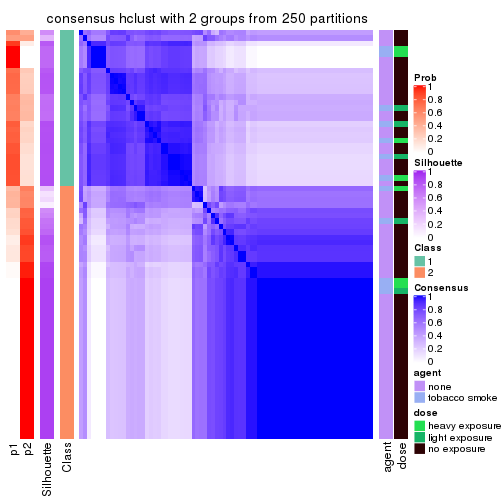</p>

</div>
<div id='tab-CV-hclust-consensus-heatmap-2'>
<pre><code class="r">consensus_heatmap(res, k = 3)
</code></pre>

<p>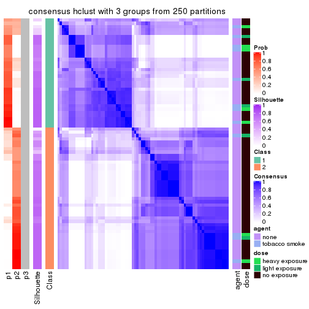</p>

</div>
<div id='tab-CV-hclust-consensus-heatmap-3'>
<pre><code class="r">consensus_heatmap(res, k = 4)
</code></pre>

<p></p>

</div>
<div id='tab-CV-hclust-consensus-heatmap-4'>
<pre><code class="r">consensus_heatmap(res, k = 5)
</code></pre>

<p>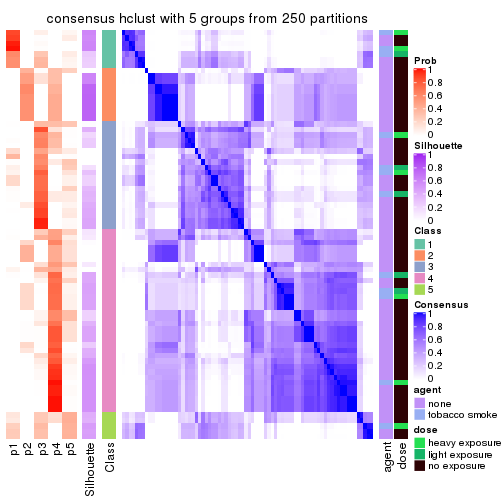</p>

</div>
<div id='tab-CV-hclust-consensus-heatmap-5'>
<pre><code class="r">consensus_heatmap(res, k = 6)
</code></pre>

<p>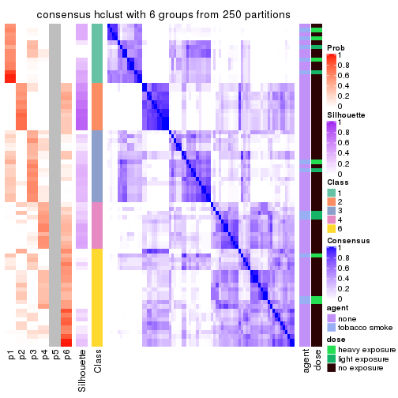</p>

</div>
</div>

Heatmaps for the membership of samples in all partitions to see how consistent they are:


<script>
$( function() {
	$( '#tabs-CV-hclust-membership-heatmap' ).tabs();
} );
</script>
<div id='tabs-CV-hclust-membership-heatmap'>
<ul>
<li><a href='#tab-CV-hclust-membership-heatmap-1'>k = 2</a></li>
<li><a href='#tab-CV-hclust-membership-heatmap-2'>k = 3</a></li>
<li><a href='#tab-CV-hclust-membership-heatmap-3'>k = 4</a></li>
<li><a href='#tab-CV-hclust-membership-heatmap-4'>k = 5</a></li>
<li><a href='#tab-CV-hclust-membership-heatmap-5'>k = 6</a></li>
</ul>
<div id='tab-CV-hclust-membership-heatmap-1'>
<pre><code class="r">membership_heatmap(res, k = 2)
</code></pre>

<p>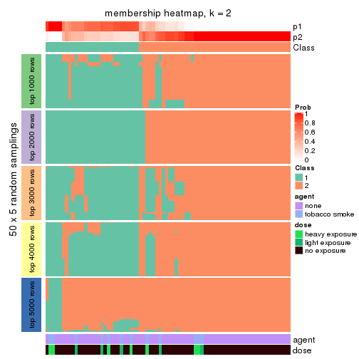</p>

</div>
<div id='tab-CV-hclust-membership-heatmap-2'>
<pre><code class="r">membership_heatmap(res, k = 3)
</code></pre>

<p>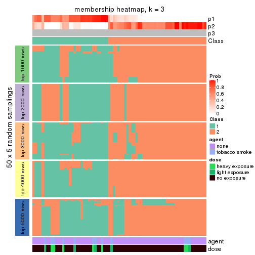</p>

</div>
<div id='tab-CV-hclust-membership-heatmap-3'>
<pre><code class="r">membership_heatmap(res, k = 4)
</code></pre>

<p>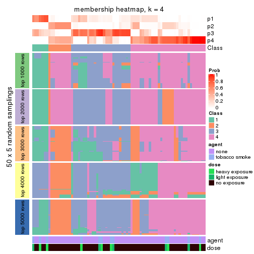</p>

</div>
<div id='tab-CV-hclust-membership-heatmap-4'>
<pre><code class="r">membership_heatmap(res, k = 5)
</code></pre>

<p>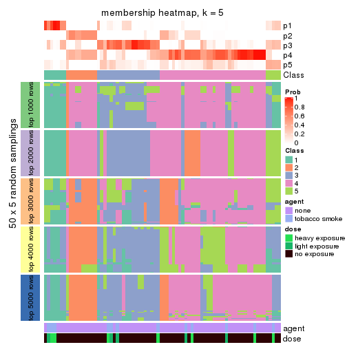</p>

</div>
<div id='tab-CV-hclust-membership-heatmap-5'>
<pre><code class="r">membership_heatmap(res, k = 6)
</code></pre>

<p>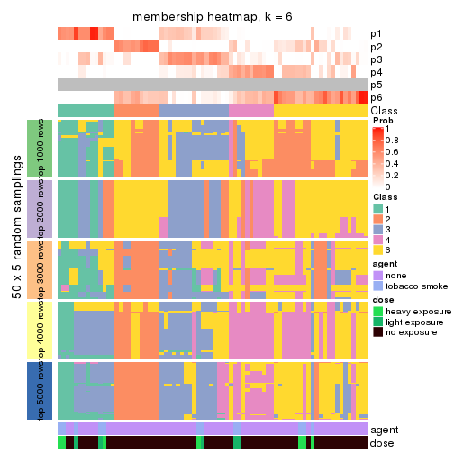</p>

</div>
</div>

As soon as we have had the classes for columns, we can look for signatures
which are significantly different between classes which can be candidate marks
for certain classes. Following are the heatmaps for signatures.


Signature heatmaps where rows are scaled:


<script>
$( function() {
	$( '#tabs-CV-hclust-get-signatures' ).tabs();
} );
</script>
<div id='tabs-CV-hclust-get-signatures'>
<ul>
<li><a href='#tab-CV-hclust-get-signatures-1'>k = 2</a></li>
<li><a href='#tab-CV-hclust-get-signatures-2'>k = 3</a></li>
<li><a href='#tab-CV-hclust-get-signatures-3'>k = 4</a></li>
<li><a href='#tab-CV-hclust-get-signatures-4'>k = 5</a></li>
<li><a href='#tab-CV-hclust-get-signatures-5'>k = 6</a></li>
</ul>
<div id='tab-CV-hclust-get-signatures-1'>
<pre><code class="r">get_signatures(res, k = 2)
</code></pre>

<p>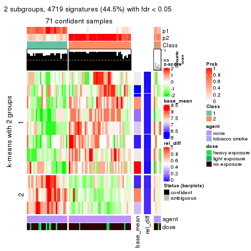</p>

</div>
<div id='tab-CV-hclust-get-signatures-2'>
<pre><code class="r">get_signatures(res, k = 3)
</code></pre>

<p>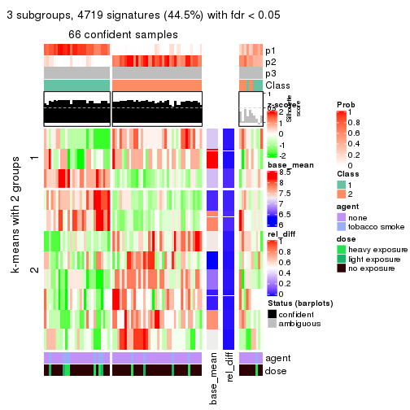</p>

</div>
<div id='tab-CV-hclust-get-signatures-3'>
<pre><code class="r">get_signatures(res, k = 4)
</code></pre>

<p>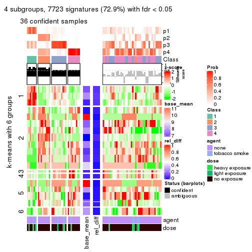</p>

</div>
<div id='tab-CV-hclust-get-signatures-4'>
<pre><code class="r">get_signatures(res, k = 5)
</code></pre>

<p>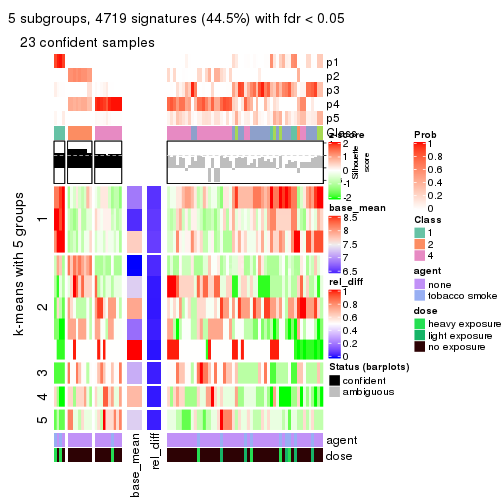</p>

</div>
<div id='tab-CV-hclust-get-signatures-5'>
<pre><code class="r">get_signatures(res, k = 6)
</code></pre>

<p></p>

</div>
</div>


Signature heatmaps where rows are not scaled:


<script>
$( function() {
	$( '#tabs-CV-hclust-get-signatures-no-scale' ).tabs();
} );
</script>
<div id='tabs-CV-hclust-get-signatures-no-scale'>
<ul>
<li><a href='#tab-CV-hclust-get-signatures-no-scale-1'>k = 2</a></li>
<li><a href='#tab-CV-hclust-get-signatures-no-scale-2'>k = 3</a></li>
<li><a href='#tab-CV-hclust-get-signatures-no-scale-3'>k = 4</a></li>
<li><a href='#tab-CV-hclust-get-signatures-no-scale-4'>k = 5</a></li>
<li><a href='#tab-CV-hclust-get-signatures-no-scale-5'>k = 6</a></li>
</ul>
<div id='tab-CV-hclust-get-signatures-no-scale-1'>
<pre><code class="r">get_signatures(res, k = 2, scale_rows = FALSE)
</code></pre>

<p>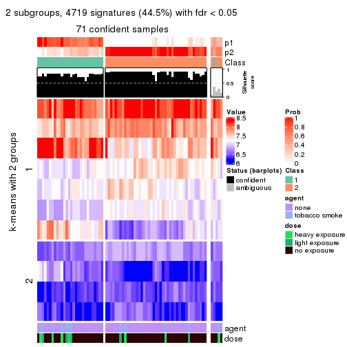</p>

</div>
<div id='tab-CV-hclust-get-signatures-no-scale-2'>
<pre><code class="r">get_signatures(res, k = 3, scale_rows = FALSE)
</code></pre>

<p>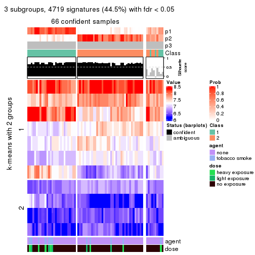</p>

</div>
<div id='tab-CV-hclust-get-signatures-no-scale-3'>
<pre><code class="r">get_signatures(res, k = 4, scale_rows = FALSE)
</code></pre>

<p>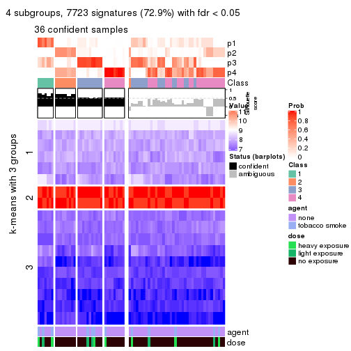</p>

</div>
<div id='tab-CV-hclust-get-signatures-no-scale-4'>
<pre><code class="r">get_signatures(res, k = 5, scale_rows = FALSE)
</code></pre>

<p>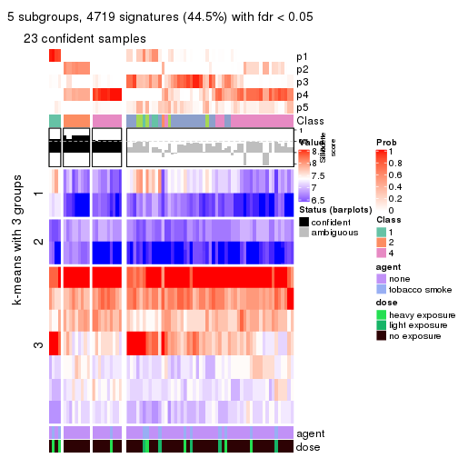</p>

</div>
<div id='tab-CV-hclust-get-signatures-no-scale-5'>
<pre><code class="r">get_signatures(res, k = 6, scale_rows = FALSE)
</code></pre>

<p></p>

</div>
</div>


Compare the overlap of signatures from different k:

```r
compare_signatures(res)
```

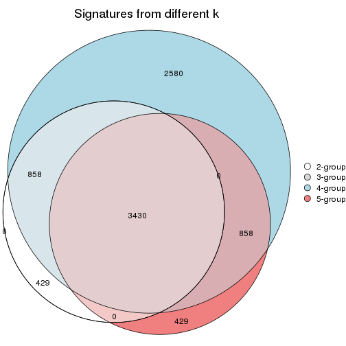

`get_signature()` returns a data frame invisibly. TO get the list of signatures, the function
call should be assigned to a variable explicitly. In following code, if `plot` argument is set
to `FALSE`, no heatmap is plotted while only the differential analysis is performed.

```r
# code only for demonstration
tb = get_signature(res, k = ..., plot = FALSE)
```

An example of the output of `tb` is:

```
#>   which_row         fdr    mean_1    mean_2 scaled_mean_1 scaled_mean_2 km
#> 1        38 0.042760348  8.373488  9.131774    -0.5533452     0.5164555  1
#> 2        40 0.018707592  7.106213  8.469186    -0.6173731     0.5762149  1
#> 3        55 0.019134737 10.221463 11.207825    -0.6159697     0.5749050  1
#> 4        59 0.006059896  5.921854  7.869574    -0.6899429     0.6439467  1
#> 5        60 0.018055526  8.928898 10.211722    -0.6204761     0.5791110  1
#> 6        98 0.009384629 15.714769 14.887706     0.6635654    -0.6193277  2
...
```

The columns in `tb` are:

1. `which_row`: row indices corresponding to the input matrix.
2. `fdr`: FDR for the differential test. 
3. `mean_x`: The mean value in group x.
4. `scaled_mean_x`: The mean value in group x after rows are scaled.
5. `km`: Row groups if k-means clustering is applied to rows.


UMAP plot which shows how samples are separated.


<script>
$( function() {
	$( '#tabs-CV-hclust-dimension-reduction' ).tabs();
} );
</script>
<div id='tabs-CV-hclust-dimension-reduction'>
<ul>
<li><a href='#tab-CV-hclust-dimension-reduction-1'>k = 2</a></li>
<li><a href='#tab-CV-hclust-dimension-reduction-2'>k = 3</a></li>
<li><a href='#tab-CV-hclust-dimension-reduction-3'>k = 4</a></li>
<li><a href='#tab-CV-hclust-dimension-reduction-4'>k = 5</a></li>
<li><a href='#tab-CV-hclust-dimension-reduction-5'>k = 6</a></li>
</ul>
<div id='tab-CV-hclust-dimension-reduction-1'>
<pre><code class="r">dimension_reduction(res, k = 2, method = &quot;UMAP&quot;)
</code></pre>

<p>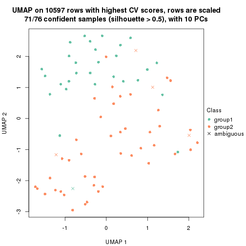</p>

</div>
<div id='tab-CV-hclust-dimension-reduction-2'>
<pre><code class="r">dimension_reduction(res, k = 3, method = &quot;UMAP&quot;)
</code></pre>

<p>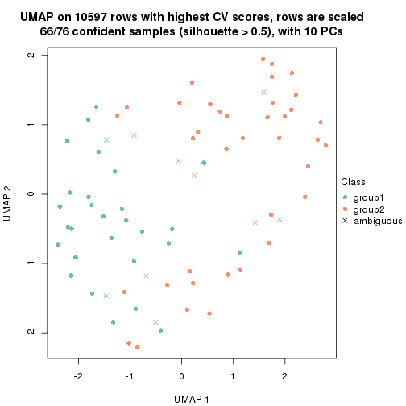</p>

</div>
<div id='tab-CV-hclust-dimension-reduction-3'>
<pre><code class="r">dimension_reduction(res, k = 4, method = &quot;UMAP&quot;)
</code></pre>

<p>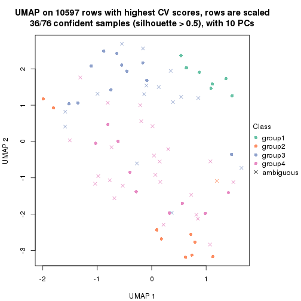</p>

</div>
<div id='tab-CV-hclust-dimension-reduction-4'>
<pre><code class="r">dimension_reduction(res, k = 5, method = &quot;UMAP&quot;)
</code></pre>

<p>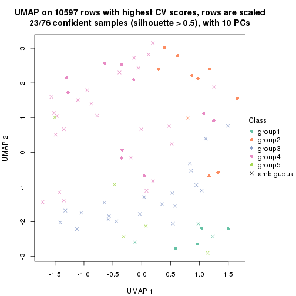</p>

</div>
<div id='tab-CV-hclust-dimension-reduction-5'>
<pre><code class="r">dimension_reduction(res, k = 6, method = &quot;UMAP&quot;)
</code></pre>

<p>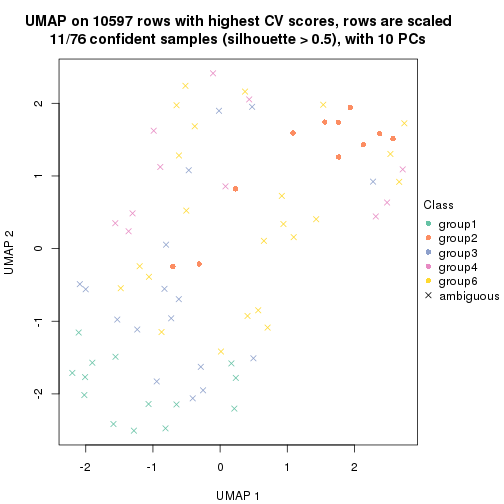</p>

</div>
</div>


Following heatmap shows how subgroups are split when increasing `k`:

```r
collect_classes(res)
```

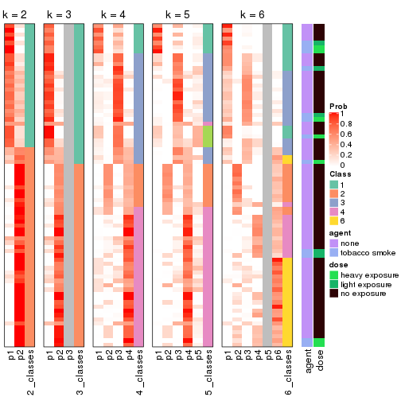


Test correlation between subgroups and known annotations. If the known
annotation is numeric, one-way ANOVA test is applied, and if the known
annotation is discrete, chi-squared contingency table test is applied.

```r
test_to_known_factors(res)
```

```
#>            n agent(p) dose(p) k
#> CV:hclust 71    0.147   0.198 2
#> CV:hclust 66    0.220   0.289 3
#> CV:hclust 36    0.142   0.312 4
#> CV:hclust 23    0.044   0.044 5
#> CV:hclust 11       NA      NA 6
```


If matrix rows can be associated to genes, consider to use `GO_Enrichment(res,
...)` to perform function enrichment for the signature genes.


 

---------------------------------------------------


### CV:kmeans


The object with results only for a single top-value method and a single partition method 
can be extracted as:

```r
res = res_list["CV", "kmeans"]
# you can also extract it by
# res = res_list["CV:kmeans"]
```

A summary of `res` and all the functions that can be applied to it:

```r
res
```

```
#> A 'ConsensusPartition' object with k = 2, 3, 4, 5, 6.
#>   On a matrix with 10597 rows and 76 columns.
#>   Top rows (1000, 2000, 3000, 4000, 5000) are extracted by 'CV' method.
#>   Subgroups are detected by 'kmeans' method.
#>   Performed in total 1250 partitions by row resampling.
#>   Best k for subgroups seems to be 2.
#> 
#> Following methods can be applied to this 'ConsensusPartition' object:
#>  [1] "cola_report"             "collect_classes"         "collect_plots"          
#>  [4] "collect_stats"           "colnames"                "compare_signatures"     
#>  [7] "consensus_heatmap"       "dimension_reduction"     "functional_enrichment"  
#> [10] "get_anno_col"            "get_anno"                "get_classes"            
#> [13] "get_consensus"           "get_matrix"              "get_membership"         
#> [16] "get_param"               "get_signatures"          "get_stats"              
#> [19] "is_best_k"               "is_stable_k"             "membership_heatmap"     
#> [22] "ncol"                    "nrow"                    "plot_ecdf"              
#> [25] "rownames"                "select_partition_number" "show"                   
#> [28] "suggest_best_k"          "test_to_known_factors"
```

`collect_plots()` function collects all the plots made from `res` for all `k` (number of partitions)
into one single page to provide an easy and fast comparison between different `k`.

```r
collect_plots(res)
```

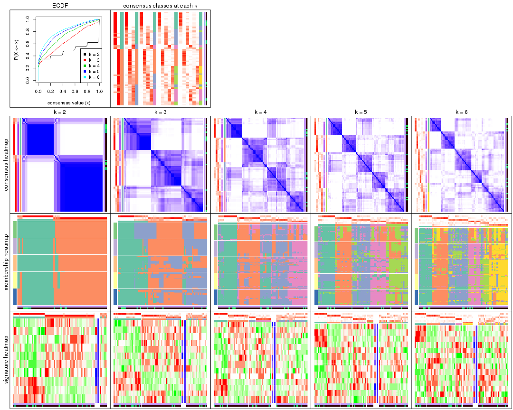

The plots are:

- The first row: a plot of the ECDF (Empirical cumulative distribution
  function) curves of the consensus matrix for each `k` and the heatmap of
  predicted classes for each `k`.
- The second row: heatmaps of the consensus matrix for each `k`.
- The third row: heatmaps of the membership matrix for each `k`.
- The fouth row: heatmaps of the signatures for each `k`.

All the plots in panels can be made by individual functions and they are
plotted later in this section.

`select_partition_number()` produces several plots showing different
statistics for choosing "optimized" `k`. There are following statistics:

- ECDF curves of the consensus matrix for each `k`;
- 1-PAC. [The PAC
  score](https://en.wikipedia.org/wiki/Consensus_clustering#Over-interpretation_potential_of_consensus_clustering)
  measures the proportion of the ambiguous subgrouping.
- Mean silhouette score.
- Concordance. The mean probability of fiting the consensus class ids in all
  partitions.
- Area increased. Denote $A_k$ as the area under the ECDF curve for current
  `k`, the area increased is defined as $A_k - A_{k-1}$.
- Rand index. The percent of pairs of samples that are both in a same cluster
  or both are not in a same cluster in the partition of k and k-1.
- Jaccard index. The ratio of pairs of samples are both in a same cluster in
  the partition of k and k-1 and the pairs of samples are both in a same
  cluster in the partition k or k-1.

The detailed explanations of these statistics can be found in [the cola
vignette](http://bioconductor.org/packages/devel/bioc/vignettes/cola/inst/doc/cola.html#toc_13).

Generally speaking, lower PAC score, higher mean silhouette score or higher
concordance corresponds to better partition. Rand index and Jaccard index
measure how similar the current partition is compared to partition with `k-1`.
If they are too similar, we won't accept `k` is better than `k-1`.

```r
select_partition_number(res)
```

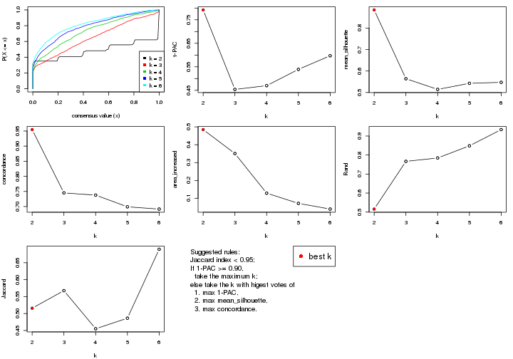

The numeric values for all these statistics can be obtained by `get_stats()`.

```r
get_stats(res)
```

```
#>   k 1-PAC mean_silhouette concordance area_increased  Rand Jaccard
#> 2 2 0.792           0.884       0.955         0.4846 0.516   0.516
#> 3 3 0.454           0.564       0.745         0.3508 0.767   0.568
#> 4 4 0.470           0.514       0.738         0.1290 0.785   0.455
#> 5 5 0.539           0.543       0.699         0.0720 0.848   0.486
#> 6 6 0.597           0.547       0.692         0.0401 0.934   0.690
```

`suggest_best_k()` suggests the best $k$ based on these statistics. The rules are as follows:

- All $k$ with Jaccard index larger than 0.95 are removed because the increase of
  the partition number does not provides enough extra information. If all $k$ are removed,
  the best $k$ is assigned by `NA`.
- For $k$ with 1-PAC larger than 0.9, the maximal $k$ is taken as the "best k". Other $k$ is called "optional k".
- If it does not fit the second rule. The $k$ with the highest vote of highest
  1-PAC, mean silhouette and concordance is taken as the "best k".

```r
suggest_best_k(res)
```

```
#> [1] 2
```


Following shows the table of the partitions (You need to click the **show/hide
code output** link to see it). The membership matrix (columns with name `p*`)
is inferred by
[`clue::cl_consensus()`](https://www.rdocumentation.org/link/cl_consensus?package=clue)
function with the `SE` method. Basically the value in the membership matrix
represents the probability to belong to a certain group. The finall class
label for an item is determined with the group with highest probability it
belongs to.

In `get_classes()` function, the entropy is calculated from the membership
matrix and the silhouette score is calculated from the consensus matrix.


<script>
$( function() {
	$( '#tabs-CV-kmeans-get-classes' ).tabs();
} );
</script>
<div id='tabs-CV-kmeans-get-classes'>
<ul>
<li><a href='#tab-CV-kmeans-get-classes-1'>k = 2</a></li>
<li><a href='#tab-CV-kmeans-get-classes-2'>k = 3</a></li>
<li><a href='#tab-CV-kmeans-get-classes-3'>k = 4</a></li>
<li><a href='#tab-CV-kmeans-get-classes-4'>k = 5</a></li>
<li><a href='#tab-CV-kmeans-get-classes-5'>k = 6</a></li>
</ul>

<div id='tab-CV-kmeans-get-classes-1'>
<p><a id='tab-CV-kmeans-get-classes-1-a' style='color:#0366d6' href='#'>show/hide code output</a></p>
<pre><code class="r">cbind(get_classes(res, k = 2), get_membership(res, k = 2))
</code></pre>

<pre><code>#&gt;           class entropy silhouette    p1    p2
#&gt; GSM451162     2  0.9732      0.297 0.404 0.596
#&gt; GSM451163     2  0.0000      0.955 0.000 1.000
#&gt; GSM451164     2  0.0000      0.955 0.000 1.000
#&gt; GSM451165     2  0.0000      0.955 0.000 1.000
#&gt; GSM451167     2  0.0000      0.955 0.000 1.000
#&gt; GSM451168     2  0.0000      0.955 0.000 1.000
#&gt; GSM451169     2  0.0000      0.955 0.000 1.000
#&gt; GSM451170     1  0.0000      0.941 1.000 0.000
#&gt; GSM451171     2  0.0000      0.955 0.000 1.000
#&gt; GSM451172     2  0.0000      0.955 0.000 1.000
#&gt; GSM451173     1  0.0000      0.941 1.000 0.000
#&gt; GSM451174     2  0.0000      0.955 0.000 1.000
#&gt; GSM451175     1  0.0000      0.941 1.000 0.000
#&gt; GSM451177     2  0.0000      0.955 0.000 1.000
#&gt; GSM451178     2  0.0000      0.955 0.000 1.000
#&gt; GSM451179     2  0.9795      0.262 0.416 0.584
#&gt; GSM451180     2  0.0000      0.955 0.000 1.000
#&gt; GSM451181     2  0.0000      0.955 0.000 1.000
#&gt; GSM451182     1  0.0000      0.941 1.000 0.000
#&gt; GSM451183     1  0.0000      0.941 1.000 0.000
#&gt; GSM451184     1  0.7219      0.723 0.800 0.200
#&gt; GSM451185     1  0.0000      0.941 1.000 0.000
#&gt; GSM451186     1  0.9710      0.347 0.600 0.400
#&gt; GSM451187     2  0.0000      0.955 0.000 1.000
#&gt; GSM451188     2  0.0000      0.955 0.000 1.000
#&gt; GSM451189     1  0.0000      0.941 1.000 0.000
#&gt; GSM451190     1  0.0000      0.941 1.000 0.000
#&gt; GSM451191     1  0.0000      0.941 1.000 0.000
#&gt; GSM451193     2  0.7219      0.721 0.200 0.800
#&gt; GSM451195     1  0.0000      0.941 1.000 0.000
#&gt; GSM451196     1  0.0000      0.941 1.000 0.000
#&gt; GSM451197     1  0.0000      0.941 1.000 0.000
#&gt; GSM451199     1  0.0000      0.941 1.000 0.000
#&gt; GSM451201     1  0.0000      0.941 1.000 0.000
#&gt; GSM451202     2  0.0000      0.955 0.000 1.000
#&gt; GSM451203     1  0.9635      0.374 0.612 0.388
#&gt; GSM451204     2  0.0000      0.955 0.000 1.000
#&gt; GSM451205     2  0.0000      0.955 0.000 1.000
#&gt; GSM451206     2  0.0000      0.955 0.000 1.000
#&gt; GSM451207     2  0.0000      0.955 0.000 1.000
#&gt; GSM451208     2  0.0000      0.955 0.000 1.000
#&gt; GSM451209     2  0.7453      0.703 0.212 0.788
#&gt; GSM451210     2  0.0000      0.955 0.000 1.000
#&gt; GSM451212     2  0.0000      0.955 0.000 1.000
#&gt; GSM451213     2  0.0000      0.955 0.000 1.000
#&gt; GSM451214     2  0.0000      0.955 0.000 1.000
#&gt; GSM451215     2  0.0000      0.955 0.000 1.000
#&gt; GSM451216     2  0.0000      0.955 0.000 1.000
#&gt; GSM451217     2  0.0000      0.955 0.000 1.000
#&gt; GSM451219     1  0.0000      0.941 1.000 0.000
#&gt; GSM451220     1  0.0000      0.941 1.000 0.000
#&gt; GSM451221     1  0.0000      0.941 1.000 0.000
#&gt; GSM451222     1  0.0000      0.941 1.000 0.000
#&gt; GSM451224     2  0.0000      0.955 0.000 1.000
#&gt; GSM451225     1  0.9710      0.347 0.600 0.400
#&gt; GSM451226     2  0.0000      0.955 0.000 1.000
#&gt; GSM451227     2  0.0000      0.955 0.000 1.000
#&gt; GSM451228     2  0.0000      0.955 0.000 1.000
#&gt; GSM451230     1  0.7219      0.728 0.800 0.200
#&gt; GSM451231     2  0.9710      0.299 0.400 0.600
#&gt; GSM451233     2  0.0376      0.952 0.004 0.996
#&gt; GSM451234     2  0.0376      0.952 0.004 0.996
#&gt; GSM451235     2  0.0000      0.955 0.000 1.000
#&gt; GSM451236     2  0.0000      0.955 0.000 1.000
#&gt; GSM451166     2  0.7219      0.720 0.200 0.800
#&gt; GSM451194     1  0.0000      0.941 1.000 0.000
#&gt; GSM451198     1  0.0000      0.941 1.000 0.000
#&gt; GSM451218     2  0.0000      0.955 0.000 1.000
#&gt; GSM451232     1  0.0000      0.941 1.000 0.000
#&gt; GSM451176     1  0.0000      0.941 1.000 0.000
#&gt; GSM451192     1  0.0000      0.941 1.000 0.000
#&gt; GSM451200     1  0.0000      0.941 1.000 0.000
#&gt; GSM451211     2  0.0000      0.955 0.000 1.000
#&gt; GSM451223     2  0.1184      0.941 0.016 0.984
#&gt; GSM451229     1  0.0000      0.941 1.000 0.000
#&gt; GSM451237     2  0.0376      0.952 0.004 0.996
</code></pre>

<script>
$('#tab-CV-kmeans-get-classes-1-a').parent().next().next().hide();
$('#tab-CV-kmeans-get-classes-1-a').click(function(){
  $('#tab-CV-kmeans-get-classes-1-a').parent().next().next().toggle();
  return(false);
});
</script>
</div>

<div id='tab-CV-kmeans-get-classes-2'>
<p><a id='tab-CV-kmeans-get-classes-2-a' style='color:#0366d6' href='#'>show/hide code output</a></p>
<pre><code class="r">cbind(get_classes(res, k = 3), get_membership(res, k = 3))
</code></pre>

<pre><code>#&gt;           class entropy silhouette    p1    p2    p3
#&gt; GSM451162     2  0.8834   0.288901 0.116 0.464 0.420
#&gt; GSM451163     2  0.3941   0.662250 0.000 0.844 0.156
#&gt; GSM451164     2  0.2796   0.692834 0.000 0.908 0.092
#&gt; GSM451165     2  0.5650   0.561632 0.000 0.688 0.312
#&gt; GSM451167     2  0.5882   0.500321 0.000 0.652 0.348
#&gt; GSM451168     2  0.3116   0.690186 0.000 0.892 0.108
#&gt; GSM451169     2  0.6476   0.419499 0.004 0.548 0.448
#&gt; GSM451170     1  0.1411   0.804156 0.964 0.000 0.036
#&gt; GSM451171     2  0.1031   0.698213 0.000 0.976 0.024
#&gt; GSM451172     2  0.5560   0.571586 0.000 0.700 0.300
#&gt; GSM451173     1  0.6225   0.545596 0.568 0.000 0.432
#&gt; GSM451174     2  0.6305   0.140799 0.000 0.516 0.484
#&gt; GSM451175     1  0.4504   0.756653 0.804 0.000 0.196
#&gt; GSM451177     2  0.1031   0.698213 0.000 0.976 0.024
#&gt; GSM451178     2  0.6295   0.166300 0.000 0.528 0.472
#&gt; GSM451179     3  0.8620  -0.132898 0.352 0.112 0.536
#&gt; GSM451180     2  0.1031   0.698213 0.000 0.976 0.024
#&gt; GSM451181     2  0.1964   0.696360 0.000 0.944 0.056
#&gt; GSM451182     1  0.0000   0.809763 1.000 0.000 0.000
#&gt; GSM451183     1  0.0000   0.809763 1.000 0.000 0.000
#&gt; GSM451184     1  0.9901   0.233791 0.392 0.336 0.272
#&gt; GSM451185     1  0.0000   0.809763 1.000 0.000 0.000
#&gt; GSM451186     3  0.2152   0.545924 0.036 0.016 0.948
#&gt; GSM451187     2  0.3551   0.662795 0.000 0.868 0.132
#&gt; GSM451188     2  0.0237   0.698976 0.000 0.996 0.004
#&gt; GSM451189     1  0.0000   0.809763 1.000 0.000 0.000
#&gt; GSM451190     1  0.1170   0.802708 0.976 0.016 0.008
#&gt; GSM451191     1  0.2703   0.793959 0.928 0.016 0.056
#&gt; GSM451193     3  0.8536  -0.000652 0.124 0.300 0.576
#&gt; GSM451195     1  0.5859   0.654436 0.656 0.000 0.344
#&gt; GSM451196     1  0.0000   0.809763 1.000 0.000 0.000
#&gt; GSM451197     1  0.0000   0.809763 1.000 0.000 0.000
#&gt; GSM451199     1  0.5178   0.733082 0.744 0.000 0.256
#&gt; GSM451201     1  0.0000   0.809763 1.000 0.000 0.000
#&gt; GSM451202     2  0.1163   0.697200 0.000 0.972 0.028
#&gt; GSM451203     1  0.9402   0.267204 0.416 0.172 0.412
#&gt; GSM451204     3  0.5431   0.569840 0.000 0.284 0.716
#&gt; GSM451205     2  0.1031   0.698213 0.000 0.976 0.024
#&gt; GSM451206     2  0.6260   0.156588 0.000 0.552 0.448
#&gt; GSM451207     3  0.6299   0.360221 0.000 0.476 0.524
#&gt; GSM451208     2  0.1163   0.697200 0.000 0.972 0.028
#&gt; GSM451209     3  0.2939   0.562140 0.012 0.072 0.916
#&gt; GSM451210     2  0.0237   0.698976 0.000 0.996 0.004
#&gt; GSM451212     3  0.6274   0.373344 0.000 0.456 0.544
#&gt; GSM451213     3  0.6267   0.376726 0.000 0.452 0.548
#&gt; GSM451214     2  0.5098   0.504693 0.000 0.752 0.248
#&gt; GSM451215     2  0.1031   0.698213 0.000 0.976 0.024
#&gt; GSM451216     3  0.5882   0.524627 0.000 0.348 0.652
#&gt; GSM451217     2  0.3686   0.677974 0.000 0.860 0.140
#&gt; GSM451219     1  0.6090   0.722755 0.716 0.020 0.264
#&gt; GSM451220     3  0.6489  -0.362714 0.456 0.004 0.540
#&gt; GSM451221     1  0.6027   0.719678 0.712 0.016 0.272
#&gt; GSM451222     1  0.6079   0.538033 0.612 0.000 0.388
#&gt; GSM451224     2  0.0424   0.698644 0.000 0.992 0.008
#&gt; GSM451225     3  0.5481   0.550049 0.108 0.076 0.816
#&gt; GSM451226     2  0.7990   0.367406 0.064 0.532 0.404
#&gt; GSM451227     2  0.5138   0.503435 0.000 0.748 0.252
#&gt; GSM451228     3  0.4413   0.405315 0.008 0.160 0.832
#&gt; GSM451230     3  0.6004   0.507910 0.156 0.064 0.780
#&gt; GSM451231     3  0.6500   0.531024 0.140 0.100 0.760
#&gt; GSM451233     3  0.5678   0.556387 0.000 0.316 0.684
#&gt; GSM451234     3  0.5327   0.572275 0.000 0.272 0.728
#&gt; GSM451235     3  0.5363   0.571205 0.000 0.276 0.724
#&gt; GSM451236     3  0.5988   0.518529 0.000 0.368 0.632
#&gt; GSM451166     3  0.6341   0.458768 0.032 0.252 0.716
#&gt; GSM451194     1  0.6260   0.529591 0.552 0.000 0.448
#&gt; GSM451198     1  0.4654   0.752769 0.792 0.000 0.208
#&gt; GSM451218     3  0.5138   0.567544 0.000 0.252 0.748
#&gt; GSM451232     1  0.0000   0.809763 1.000 0.000 0.000
#&gt; GSM451176     1  0.0000   0.809763 1.000 0.000 0.000
#&gt; GSM451192     1  0.0000   0.809763 1.000 0.000 0.000
#&gt; GSM451200     1  0.5327   0.725752 0.728 0.000 0.272
#&gt; GSM451211     2  0.6274   0.146824 0.000 0.544 0.456
#&gt; GSM451223     2  0.7940   0.366517 0.060 0.524 0.416
#&gt; GSM451229     1  0.0000   0.809763 1.000 0.000 0.000
#&gt; GSM451237     3  0.5327   0.572275 0.000 0.272 0.728
</code></pre>

<script>
$('#tab-CV-kmeans-get-classes-2-a').parent().next().next().hide();
$('#tab-CV-kmeans-get-classes-2-a').click(function(){
  $('#tab-CV-kmeans-get-classes-2-a').parent().next().next().toggle();
  return(false);
});
</script>
</div>

<div id='tab-CV-kmeans-get-classes-3'>
<p><a id='tab-CV-kmeans-get-classes-3-a' style='color:#0366d6' href='#'>show/hide code output</a></p>
<pre><code class="r">cbind(get_classes(res, k = 4), get_membership(res, k = 4))
</code></pre>

<pre><code>#&gt;           class entropy silhouette    p1    p2    p3    p4
#&gt; GSM451162     3  0.4333     0.4889 0.004 0.120 0.820 0.056
#&gt; GSM451163     2  0.5865     0.5437 0.000 0.612 0.340 0.048
#&gt; GSM451164     2  0.3978     0.7133 0.000 0.796 0.192 0.012
#&gt; GSM451165     3  0.7436    -0.2978 0.000 0.364 0.460 0.176
#&gt; GSM451167     3  0.6186     0.0449 0.000 0.352 0.584 0.064
#&gt; GSM451168     2  0.6037     0.6800 0.000 0.688 0.152 0.160
#&gt; GSM451169     3  0.4301     0.4791 0.000 0.120 0.816 0.064
#&gt; GSM451170     1  0.5649     0.4753 0.664 0.000 0.284 0.052
#&gt; GSM451171     2  0.0707     0.7321 0.000 0.980 0.000 0.020
#&gt; GSM451172     2  0.6449     0.2718 0.000 0.480 0.452 0.068
#&gt; GSM451173     3  0.7630     0.1906 0.312 0.000 0.460 0.228
#&gt; GSM451174     3  0.7846    -0.2402 0.000 0.300 0.404 0.296
#&gt; GSM451175     1  0.5698     0.3258 0.608 0.000 0.356 0.036
#&gt; GSM451177     2  0.1557     0.7340 0.000 0.944 0.000 0.056
#&gt; GSM451178     3  0.7779    -0.2850 0.000 0.356 0.400 0.244
#&gt; GSM451179     3  0.3647     0.5340 0.040 0.004 0.860 0.096
#&gt; GSM451180     2  0.0188     0.7334 0.000 0.996 0.000 0.004
#&gt; GSM451181     2  0.4748     0.6253 0.000 0.716 0.268 0.016
#&gt; GSM451182     1  0.0817     0.8346 0.976 0.000 0.000 0.024
#&gt; GSM451183     1  0.0376     0.8350 0.992 0.000 0.004 0.004
#&gt; GSM451184     3  0.6974     0.4090 0.216 0.152 0.620 0.012
#&gt; GSM451185     1  0.1004     0.8304 0.972 0.000 0.004 0.024
#&gt; GSM451186     4  0.2466     0.6529 0.004 0.000 0.096 0.900
#&gt; GSM451187     2  0.5524     0.5976 0.000 0.676 0.276 0.048
#&gt; GSM451188     2  0.3090     0.7362 0.000 0.888 0.056 0.056
#&gt; GSM451189     1  0.1004     0.8350 0.972 0.000 0.004 0.024
#&gt; GSM451190     1  0.4542     0.6393 0.768 0.004 0.208 0.020
#&gt; GSM451191     1  0.5256     0.2850 0.596 0.000 0.392 0.012
#&gt; GSM451193     3  0.3432     0.5260 0.020 0.036 0.884 0.060
#&gt; GSM451195     3  0.5735     0.2413 0.392 0.000 0.576 0.032
#&gt; GSM451196     1  0.0524     0.8350 0.988 0.000 0.004 0.008
#&gt; GSM451197     1  0.0804     0.8338 0.980 0.000 0.008 0.012
#&gt; GSM451199     3  0.6009     0.2258 0.400 0.004 0.560 0.036
#&gt; GSM451201     1  0.0804     0.8331 0.980 0.000 0.012 0.008
#&gt; GSM451202     2  0.2861     0.7202 0.000 0.888 0.016 0.096
#&gt; GSM451203     3  0.4078     0.5452 0.132 0.004 0.828 0.036
#&gt; GSM451204     4  0.5400     0.6907 0.004 0.208 0.060 0.728
#&gt; GSM451205     2  0.0376     0.7330 0.000 0.992 0.004 0.004
#&gt; GSM451206     2  0.7905     0.1437 0.000 0.368 0.312 0.320
#&gt; GSM451207     4  0.7895     0.3768 0.000 0.308 0.316 0.376
#&gt; GSM451208     2  0.2469     0.7199 0.000 0.892 0.000 0.108
#&gt; GSM451209     4  0.4540     0.5637 0.004 0.008 0.248 0.740
#&gt; GSM451210     2  0.3245     0.7379 0.000 0.880 0.064 0.056
#&gt; GSM451212     4  0.7745     0.3439 0.000 0.236 0.352 0.412
#&gt; GSM451213     4  0.7507     0.4158 0.000 0.204 0.316 0.480
#&gt; GSM451214     2  0.5174     0.5494 0.004 0.716 0.248 0.032
#&gt; GSM451215     2  0.1557     0.7340 0.000 0.944 0.000 0.056
#&gt; GSM451216     4  0.4793     0.6561 0.000 0.204 0.040 0.756
#&gt; GSM451217     2  0.5182     0.6125 0.000 0.684 0.288 0.028
#&gt; GSM451219     3  0.6472     0.3121 0.320 0.004 0.596 0.080
#&gt; GSM451220     3  0.2892     0.5457 0.068 0.000 0.896 0.036
#&gt; GSM451221     3  0.5730     0.3088 0.344 0.000 0.616 0.040
#&gt; GSM451222     1  0.7654     0.1711 0.464 0.000 0.252 0.284
#&gt; GSM451224     2  0.4220     0.7136 0.004 0.828 0.056 0.112
#&gt; GSM451225     4  0.4132     0.6061 0.012 0.008 0.176 0.804
#&gt; GSM451226     3  0.3860     0.5318 0.012 0.104 0.852 0.032
#&gt; GSM451227     2  0.5582     0.5248 0.004 0.696 0.248 0.052
#&gt; GSM451228     3  0.4679     0.4198 0.000 0.044 0.772 0.184
#&gt; GSM451230     4  0.6049     0.5390 0.028 0.028 0.292 0.652
#&gt; GSM451231     4  0.5788     0.5519 0.028 0.028 0.252 0.692
#&gt; GSM451233     4  0.5993     0.6857 0.004 0.224 0.088 0.684
#&gt; GSM451234     4  0.3862     0.7010 0.004 0.084 0.060 0.852
#&gt; GSM451235     4  0.3734     0.6965 0.000 0.108 0.044 0.848
#&gt; GSM451236     4  0.4422     0.6358 0.000 0.256 0.008 0.736
#&gt; GSM451166     3  0.7729    -0.0829 0.036 0.108 0.508 0.348
#&gt; GSM451194     3  0.6774     0.3296 0.312 0.000 0.568 0.120
#&gt; GSM451198     3  0.5590     0.0956 0.456 0.000 0.524 0.020
#&gt; GSM451218     4  0.2814     0.6826 0.000 0.132 0.000 0.868
#&gt; GSM451232     1  0.0895     0.8349 0.976 0.000 0.004 0.020
#&gt; GSM451176     1  0.0707     0.8339 0.980 0.000 0.000 0.020
#&gt; GSM451192     1  0.0804     0.8331 0.980 0.000 0.012 0.008
#&gt; GSM451200     3  0.5523     0.2575 0.380 0.000 0.596 0.024
#&gt; GSM451211     4  0.7740    -0.1465 0.000 0.364 0.232 0.404
#&gt; GSM451223     3  0.2975     0.5353 0.008 0.060 0.900 0.032
#&gt; GSM451229     1  0.0895     0.8327 0.976 0.000 0.004 0.020
#&gt; GSM451237     4  0.4056     0.7009 0.004 0.096 0.060 0.840
</code></pre>

<script>
$('#tab-CV-kmeans-get-classes-3-a').parent().next().next().hide();
$('#tab-CV-kmeans-get-classes-3-a').click(function(){
  $('#tab-CV-kmeans-get-classes-3-a').parent().next().next().toggle();
  return(false);
});
</script>
</div>

<div id='tab-CV-kmeans-get-classes-4'>
<p><a id='tab-CV-kmeans-get-classes-4-a' style='color:#0366d6' href='#'>show/hide code output</a></p>
<pre><code class="r">cbind(get_classes(res, k = 5), get_membership(res, k = 5))
</code></pre>

<pre><code>#&gt;           class entropy silhouette    p1    p2    p3    p4    p5
#&gt; GSM451162     5  0.4415    0.28259 0.000 0.008 0.388 0.000 0.604
#&gt; GSM451163     5  0.4197    0.51669 0.000 0.244 0.028 0.000 0.728
#&gt; GSM451164     2  0.5764    0.25114 0.000 0.548 0.084 0.004 0.364
#&gt; GSM451165     5  0.6742    0.41105 0.000 0.324 0.088 0.060 0.528
#&gt; GSM451167     5  0.5237    0.52108 0.000 0.160 0.140 0.004 0.696
#&gt; GSM451168     2  0.6532    0.43384 0.000 0.604 0.096 0.068 0.232
#&gt; GSM451169     5  0.3989    0.45281 0.000 0.008 0.260 0.004 0.728
#&gt; GSM451170     1  0.6235   -0.03673 0.480 0.000 0.416 0.084 0.020
#&gt; GSM451171     2  0.3218    0.74802 0.000 0.856 0.020 0.016 0.108
#&gt; GSM451172     5  0.4747    0.55203 0.000 0.196 0.084 0.000 0.720
#&gt; GSM451173     3  0.5963    0.54892 0.156 0.000 0.656 0.160 0.028
#&gt; GSM451174     5  0.5704    0.53802 0.000 0.212 0.028 0.092 0.668
#&gt; GSM451175     1  0.6580    0.02107 0.444 0.000 0.436 0.068 0.052
#&gt; GSM451177     2  0.0404    0.78464 0.000 0.988 0.000 0.000 0.012
#&gt; GSM451178     5  0.5286    0.55421 0.000 0.240 0.036 0.040 0.684
#&gt; GSM451179     3  0.5640    0.41154 0.000 0.000 0.592 0.104 0.304
#&gt; GSM451180     2  0.2575    0.75697 0.000 0.884 0.012 0.004 0.100
#&gt; GSM451181     5  0.4651    0.33761 0.000 0.372 0.020 0.000 0.608
#&gt; GSM451182     1  0.3449    0.70080 0.812 0.000 0.164 0.024 0.000
#&gt; GSM451183     1  0.0960    0.80176 0.972 0.000 0.008 0.004 0.016
#&gt; GSM451184     3  0.5065    0.61706 0.124 0.092 0.748 0.000 0.036
#&gt; GSM451185     1  0.1306    0.79837 0.960 0.000 0.008 0.016 0.016
#&gt; GSM451186     4  0.2208    0.69843 0.000 0.000 0.072 0.908 0.020
#&gt; GSM451187     5  0.3913    0.45329 0.000 0.324 0.000 0.000 0.676
#&gt; GSM451188     2  0.1278    0.78760 0.000 0.960 0.020 0.004 0.016
#&gt; GSM451189     1  0.1568    0.79871 0.944 0.000 0.036 0.020 0.000
#&gt; GSM451190     1  0.5669    0.10492 0.512 0.008 0.428 0.004 0.048
#&gt; GSM451191     3  0.5477    0.23666 0.412 0.012 0.536 0.000 0.040
#&gt; GSM451193     5  0.4264    0.25236 0.000 0.000 0.376 0.004 0.620
#&gt; GSM451195     3  0.4645    0.61864 0.200 0.000 0.736 0.008 0.056
#&gt; GSM451196     1  0.1082    0.80037 0.964 0.000 0.008 0.000 0.028
#&gt; GSM451197     1  0.3267    0.75585 0.844 0.000 0.112 0.000 0.044
#&gt; GSM451199     3  0.4918    0.60543 0.204 0.000 0.716 0.072 0.008
#&gt; GSM451201     1  0.2214    0.79413 0.916 0.000 0.052 0.004 0.028
#&gt; GSM451202     2  0.1836    0.76732 0.000 0.932 0.000 0.036 0.032
#&gt; GSM451203     3  0.4584    0.55175 0.032 0.000 0.732 0.016 0.220
#&gt; GSM451204     4  0.6264    0.68956 0.000 0.104 0.092 0.660 0.144
#&gt; GSM451205     2  0.2389    0.74896 0.000 0.880 0.000 0.004 0.116
#&gt; GSM451206     5  0.5532    0.52964 0.000 0.284 0.008 0.080 0.628
#&gt; GSM451207     5  0.7815    0.12772 0.000 0.152 0.184 0.180 0.484
#&gt; GSM451208     2  0.2751    0.75665 0.000 0.896 0.020 0.040 0.044
#&gt; GSM451209     4  0.4465    0.67457 0.000 0.004 0.148 0.764 0.084
#&gt; GSM451210     2  0.1461    0.78669 0.000 0.952 0.028 0.004 0.016
#&gt; GSM451212     5  0.7410    0.10813 0.000 0.088 0.192 0.200 0.520
#&gt; GSM451213     5  0.8183   -0.00975 0.000 0.176 0.168 0.248 0.408
#&gt; GSM451214     2  0.5531    0.57817 0.000 0.664 0.164 0.004 0.168
#&gt; GSM451215     2  0.1074    0.77950 0.000 0.968 0.012 0.004 0.016
#&gt; GSM451216     4  0.7530    0.58371 0.000 0.180 0.160 0.524 0.136
#&gt; GSM451217     5  0.4940    0.31668 0.000 0.392 0.032 0.000 0.576
#&gt; GSM451219     3  0.7201    0.58152 0.132 0.012 0.596 0.136 0.124
#&gt; GSM451220     3  0.4111    0.48929 0.004 0.000 0.708 0.008 0.280
#&gt; GSM451221     3  0.6092    0.61100 0.176 0.012 0.676 0.092 0.044
#&gt; GSM451222     3  0.7591   -0.04544 0.348 0.000 0.408 0.176 0.068
#&gt; GSM451224     2  0.3795    0.74223 0.000 0.840 0.036 0.064 0.060
#&gt; GSM451225     4  0.2270    0.71215 0.000 0.004 0.072 0.908 0.016
#&gt; GSM451226     3  0.5485    0.41281 0.000 0.056 0.640 0.020 0.284
#&gt; GSM451227     2  0.6215    0.57775 0.000 0.664 0.144 0.104 0.088
#&gt; GSM451228     5  0.3388    0.49847 0.000 0.000 0.200 0.008 0.792
#&gt; GSM451230     4  0.6016    0.45645 0.000 0.012 0.412 0.496 0.080
#&gt; GSM451231     4  0.5433    0.63665 0.000 0.008 0.232 0.664 0.096
#&gt; GSM451233     4  0.6707    0.65919 0.000 0.064 0.148 0.600 0.188
#&gt; GSM451234     4  0.3880    0.74244 0.000 0.112 0.028 0.824 0.036
#&gt; GSM451235     4  0.4352    0.74026 0.000 0.116 0.028 0.796 0.060
#&gt; GSM451236     4  0.5944    0.65382 0.000 0.244 0.072 0.640 0.044
#&gt; GSM451166     3  0.8310   -0.09077 0.024 0.068 0.356 0.216 0.336
#&gt; GSM451194     3  0.5936    0.62800 0.164 0.000 0.676 0.108 0.052
#&gt; GSM451198     3  0.4631    0.55981 0.252 0.000 0.704 0.004 0.040
#&gt; GSM451218     4  0.4469    0.72189 0.000 0.136 0.036 0.784 0.044
#&gt; GSM451232     1  0.1200    0.80129 0.964 0.000 0.008 0.016 0.012
#&gt; GSM451176     1  0.2130    0.79385 0.924 0.000 0.044 0.016 0.016
#&gt; GSM451192     1  0.2214    0.79413 0.916 0.000 0.052 0.004 0.028
#&gt; GSM451200     3  0.4132    0.61626 0.204 0.000 0.760 0.004 0.032
#&gt; GSM451211     5  0.6078    0.36247 0.000 0.356 0.004 0.116 0.524
#&gt; GSM451223     5  0.4789    0.15744 0.000 0.016 0.400 0.004 0.580
#&gt; GSM451229     1  0.1153    0.79989 0.964 0.000 0.004 0.008 0.024
#&gt; GSM451237     4  0.3929    0.73974 0.000 0.116 0.028 0.820 0.036
</code></pre>

<script>
$('#tab-CV-kmeans-get-classes-4-a').parent().next().next().hide();
$('#tab-CV-kmeans-get-classes-4-a').click(function(){
  $('#tab-CV-kmeans-get-classes-4-a').parent().next().next().toggle();
  return(false);
});
</script>
</div>

<div id='tab-CV-kmeans-get-classes-5'>
<p><a id='tab-CV-kmeans-get-classes-5-a' style='color:#0366d6' href='#'>show/hide code output</a></p>
<pre><code class="r">cbind(get_classes(res, k = 6), get_membership(res, k = 6))
</code></pre>

<pre><code>#&gt;           class entropy silhouette    p1    p2    p3    p4    p5    p6
#&gt; GSM451162     6  0.4300     0.4436 0.000 0.000 0.324 0.000 0.036 0.640
#&gt; GSM451163     6  0.3988     0.6164 0.000 0.108 0.028 0.000 0.072 0.792
#&gt; GSM451164     2  0.6502     0.2004 0.000 0.448 0.080 0.000 0.104 0.368
#&gt; GSM451165     6  0.6496     0.4698 0.000 0.272 0.040 0.124 0.024 0.540
#&gt; GSM451167     6  0.4910     0.5503 0.000 0.148 0.104 0.000 0.036 0.712
#&gt; GSM451168     2  0.7574     0.2738 0.000 0.460 0.096 0.120 0.060 0.264
#&gt; GSM451169     6  0.3017     0.5509 0.000 0.000 0.164 0.000 0.020 0.816
#&gt; GSM451170     3  0.6316     0.3893 0.324 0.000 0.524 0.052 0.084 0.016
#&gt; GSM451171     2  0.3607     0.7105 0.000 0.796 0.000 0.000 0.092 0.112
#&gt; GSM451172     6  0.3229     0.6308 0.000 0.088 0.028 0.008 0.024 0.852
#&gt; GSM451173     3  0.5321     0.6573 0.088 0.000 0.700 0.064 0.140 0.008
#&gt; GSM451174     6  0.5478     0.5878 0.000 0.148 0.012 0.092 0.060 0.688
#&gt; GSM451175     3  0.6412    -0.0313 0.304 0.000 0.344 0.000 0.340 0.012
#&gt; GSM451177     2  0.0291     0.7557 0.000 0.992 0.000 0.000 0.004 0.004
#&gt; GSM451178     6  0.5271     0.5943 0.000 0.176 0.024 0.048 0.052 0.700
#&gt; GSM451179     3  0.5848     0.4899 0.000 0.000 0.604 0.052 0.120 0.224
#&gt; GSM451180     2  0.3227     0.7215 0.000 0.828 0.000 0.000 0.088 0.084
#&gt; GSM451181     6  0.6065     0.3840 0.000 0.244 0.036 0.000 0.164 0.556
#&gt; GSM451182     1  0.4420     0.3453 0.604 0.000 0.360 0.000 0.036 0.000
#&gt; GSM451183     1  0.1297     0.8465 0.948 0.000 0.012 0.000 0.040 0.000
#&gt; GSM451184     3  0.4092     0.6686 0.052 0.044 0.820 0.004 0.044 0.036
#&gt; GSM451185     1  0.2715     0.8288 0.872 0.000 0.028 0.000 0.088 0.012
#&gt; GSM451186     4  0.2884     0.5665 0.004 0.000 0.032 0.864 0.092 0.008
#&gt; GSM451187     6  0.4214     0.6045 0.000 0.168 0.012 0.004 0.060 0.756
#&gt; GSM451188     2  0.1377     0.7569 0.000 0.952 0.024 0.004 0.016 0.004
#&gt; GSM451189     1  0.2199     0.8211 0.892 0.000 0.088 0.000 0.020 0.000
#&gt; GSM451190     3  0.5939     0.0463 0.376 0.000 0.480 0.000 0.120 0.024
#&gt; GSM451191     3  0.4958     0.5096 0.244 0.000 0.664 0.000 0.068 0.024
#&gt; GSM451193     6  0.4846     0.2430 0.000 0.000 0.344 0.004 0.060 0.592
#&gt; GSM451195     3  0.4927     0.6860 0.104 0.000 0.728 0.012 0.128 0.028
#&gt; GSM451196     1  0.1584     0.8442 0.928 0.000 0.000 0.000 0.064 0.008
#&gt; GSM451197     1  0.4420     0.6855 0.716 0.000 0.192 0.000 0.088 0.004
#&gt; GSM451199     3  0.3613     0.7021 0.080 0.000 0.828 0.012 0.068 0.012
#&gt; GSM451201     1  0.2230     0.8309 0.892 0.000 0.024 0.000 0.084 0.000
#&gt; GSM451202     2  0.1895     0.7402 0.000 0.912 0.000 0.072 0.000 0.016
#&gt; GSM451203     3  0.5273     0.5430 0.016 0.000 0.656 0.008 0.220 0.100
#&gt; GSM451204     4  0.6159     0.2697 0.000 0.064 0.012 0.504 0.364 0.056
#&gt; GSM451205     2  0.2712     0.7297 0.000 0.864 0.000 0.000 0.048 0.088
#&gt; GSM451206     6  0.4873     0.6000 0.000 0.228 0.004 0.020 0.064 0.684
#&gt; GSM451207     5  0.6063     0.4345 0.000 0.068 0.016 0.076 0.608 0.232
#&gt; GSM451208     2  0.2879     0.7319 0.000 0.868 0.000 0.072 0.044 0.016
#&gt; GSM451209     4  0.4831     0.4903 0.000 0.000 0.088 0.736 0.076 0.100
#&gt; GSM451210     2  0.2604     0.7429 0.000 0.888 0.056 0.000 0.024 0.032
#&gt; GSM451212     5  0.6107     0.4654 0.000 0.012 0.024 0.116 0.528 0.320
#&gt; GSM451213     5  0.6860     0.3812 0.000 0.088 0.004 0.184 0.500 0.224
#&gt; GSM451214     2  0.5906     0.5293 0.000 0.604 0.184 0.000 0.048 0.164
#&gt; GSM451215     2  0.1152     0.7475 0.000 0.952 0.000 0.000 0.044 0.004
#&gt; GSM451216     5  0.6065     0.1415 0.000 0.088 0.000 0.348 0.508 0.056
#&gt; GSM451217     6  0.5223     0.4381 0.000 0.268 0.032 0.000 0.068 0.632
#&gt; GSM451219     3  0.4700     0.6332 0.032 0.000 0.772 0.056 0.080 0.060
#&gt; GSM451220     3  0.4870     0.6155 0.004 0.000 0.704 0.012 0.136 0.144
#&gt; GSM451221     3  0.4060     0.6765 0.060 0.000 0.816 0.032 0.052 0.040
#&gt; GSM451222     5  0.6982     0.1687 0.292 0.000 0.256 0.052 0.396 0.004
#&gt; GSM451224     2  0.4222     0.7184 0.000 0.792 0.040 0.112 0.036 0.020
#&gt; GSM451225     4  0.3151     0.5681 0.004 0.000 0.072 0.856 0.052 0.016
#&gt; GSM451226     3  0.4133     0.5625 0.000 0.012 0.748 0.004 0.040 0.196
#&gt; GSM451227     2  0.6400     0.5597 0.000 0.612 0.164 0.040 0.052 0.132
#&gt; GSM451228     6  0.3211     0.5442 0.000 0.000 0.120 0.000 0.056 0.824
#&gt; GSM451230     5  0.6580     0.1888 0.004 0.000 0.240 0.276 0.452 0.028
#&gt; GSM451231     4  0.6713    -0.0461 0.000 0.000 0.112 0.416 0.376 0.096
#&gt; GSM451233     4  0.6582     0.1264 0.000 0.032 0.028 0.436 0.396 0.108
#&gt; GSM451234     4  0.1757     0.6269 0.000 0.076 0.000 0.916 0.000 0.008
#&gt; GSM451235     4  0.2056     0.6275 0.000 0.080 0.000 0.904 0.004 0.012
#&gt; GSM451236     4  0.6132     0.3482 0.000 0.212 0.000 0.512 0.256 0.020
#&gt; GSM451166     5  0.7461     0.4570 0.040 0.012 0.204 0.060 0.496 0.188
#&gt; GSM451194     3  0.4893     0.6933 0.088 0.000 0.748 0.028 0.104 0.032
#&gt; GSM451198     3  0.5015     0.6693 0.144 0.000 0.680 0.008 0.164 0.004
#&gt; GSM451218     4  0.4263     0.5651 0.000 0.132 0.000 0.744 0.120 0.004
#&gt; GSM451232     1  0.0632     0.8474 0.976 0.000 0.000 0.000 0.024 0.000
#&gt; GSM451176     1  0.3528     0.8086 0.816 0.000 0.092 0.000 0.084 0.008
#&gt; GSM451192     1  0.2487     0.8267 0.876 0.000 0.032 0.000 0.092 0.000
#&gt; GSM451200     3  0.4515     0.6959 0.104 0.000 0.756 0.008 0.112 0.020
#&gt; GSM451211     6  0.6079     0.4653 0.000 0.304 0.012 0.080 0.048 0.556
#&gt; GSM451223     6  0.4807     0.2151 0.000 0.000 0.392 0.004 0.048 0.556
#&gt; GSM451229     1  0.2002     0.8388 0.908 0.000 0.004 0.000 0.076 0.012
#&gt; GSM451237     4  0.1812     0.6263 0.000 0.080 0.000 0.912 0.000 0.008
</code></pre>

<script>
$('#tab-CV-kmeans-get-classes-5-a').parent().next().next().hide();
$('#tab-CV-kmeans-get-classes-5-a').click(function(){
  $('#tab-CV-kmeans-get-classes-5-a').parent().next().next().toggle();
  return(false);
});
</script>
</div>
</div>

Heatmaps for the consensus matrix. It visualizes the probability of two
samples to be in a same group.


<script>
$( function() {
	$( '#tabs-CV-kmeans-consensus-heatmap' ).tabs();
} );
</script>
<div id='tabs-CV-kmeans-consensus-heatmap'>
<ul>
<li><a href='#tab-CV-kmeans-consensus-heatmap-1'>k = 2</a></li>
<li><a href='#tab-CV-kmeans-consensus-heatmap-2'>k = 3</a></li>
<li><a href='#tab-CV-kmeans-consensus-heatmap-3'>k = 4</a></li>
<li><a href='#tab-CV-kmeans-consensus-heatmap-4'>k = 5</a></li>
<li><a href='#tab-CV-kmeans-consensus-heatmap-5'>k = 6</a></li>
</ul>
<div id='tab-CV-kmeans-consensus-heatmap-1'>
<pre><code class="r">consensus_heatmap(res, k = 2)
</code></pre>

<p>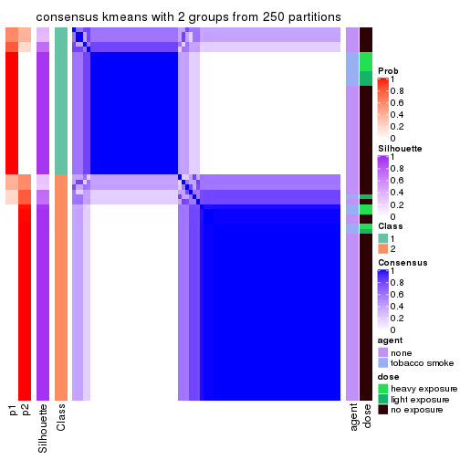</p>

</div>
<div id='tab-CV-kmeans-consensus-heatmap-2'>
<pre><code class="r">consensus_heatmap(res, k = 3)
</code></pre>

<p>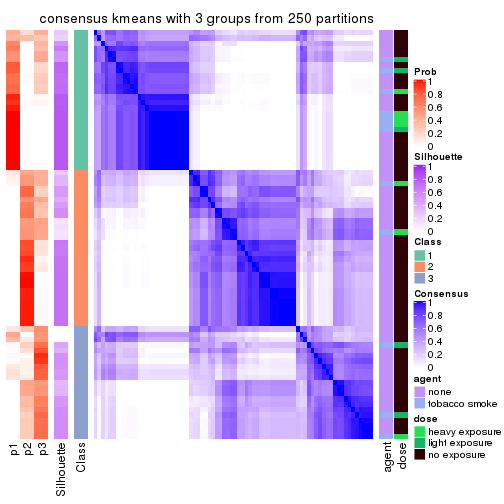</p>

</div>
<div id='tab-CV-kmeans-consensus-heatmap-3'>
<pre><code class="r">consensus_heatmap(res, k = 4)
</code></pre>

<p>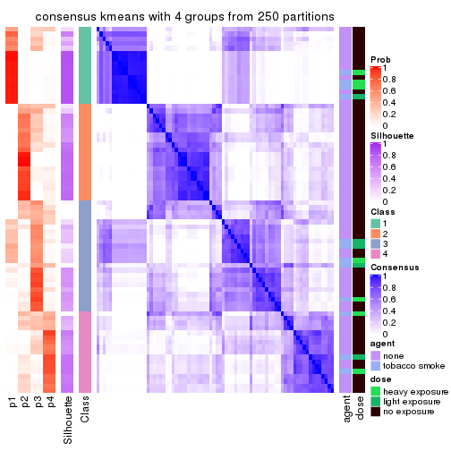</p>

</div>
<div id='tab-CV-kmeans-consensus-heatmap-4'>
<pre><code class="r">consensus_heatmap(res, k = 5)
</code></pre>

<p>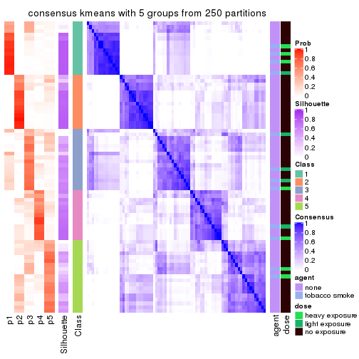</p>

</div>
<div id='tab-CV-kmeans-consensus-heatmap-5'>
<pre><code class="r">consensus_heatmap(res, k = 6)
</code></pre>

<p>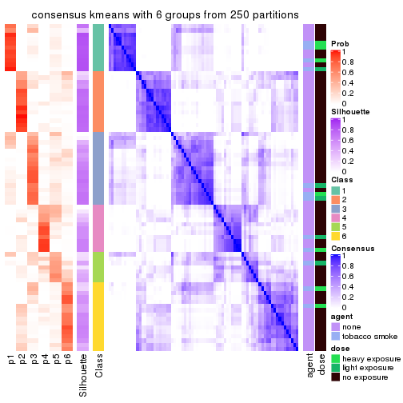</p>

</div>
</div>

Heatmaps for the membership of samples in all partitions to see how consistent they are:


<script>
$( function() {
	$( '#tabs-CV-kmeans-membership-heatmap' ).tabs();
} );
</script>
<div id='tabs-CV-kmeans-membership-heatmap'>
<ul>
<li><a href='#tab-CV-kmeans-membership-heatmap-1'>k = 2</a></li>
<li><a href='#tab-CV-kmeans-membership-heatmap-2'>k = 3</a></li>
<li><a href='#tab-CV-kmeans-membership-heatmap-3'>k = 4</a></li>
<li><a href='#tab-CV-kmeans-membership-heatmap-4'>k = 5</a></li>
<li><a href='#tab-CV-kmeans-membership-heatmap-5'>k = 6</a></li>
</ul>
<div id='tab-CV-kmeans-membership-heatmap-1'>
<pre><code class="r">membership_heatmap(res, k = 2)
</code></pre>

<p>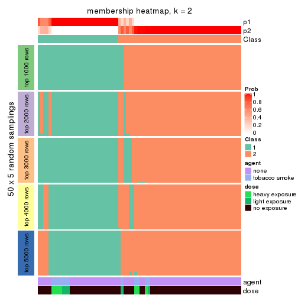</p>

</div>
<div id='tab-CV-kmeans-membership-heatmap-2'>
<pre><code class="r">membership_heatmap(res, k = 3)
</code></pre>

<p>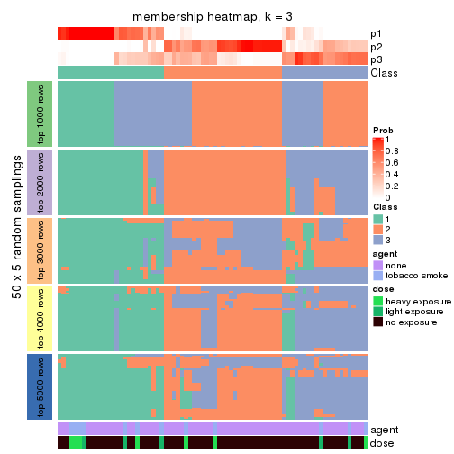</p>

</div>
<div id='tab-CV-kmeans-membership-heatmap-3'>
<pre><code class="r">membership_heatmap(res, k = 4)
</code></pre>

<p>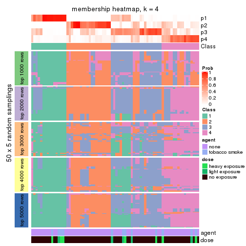</p>

</div>
<div id='tab-CV-kmeans-membership-heatmap-4'>
<pre><code class="r">membership_heatmap(res, k = 5)
</code></pre>

<p>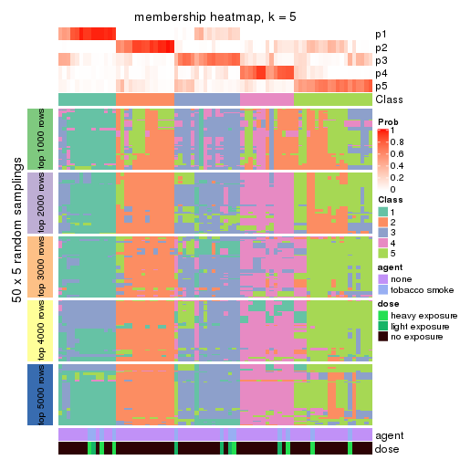</p>

</div>
<div id='tab-CV-kmeans-membership-heatmap-5'>
<pre><code class="r">membership_heatmap(res, k = 6)
</code></pre>

<p>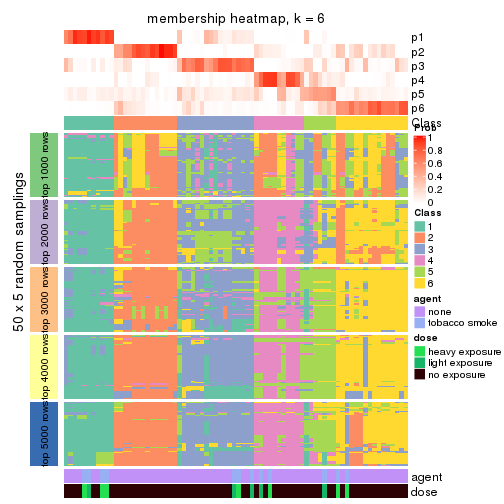</p>

</div>
</div>

As soon as we have had the classes for columns, we can look for signatures
which are significantly different between classes which can be candidate marks
for certain classes. Following are the heatmaps for signatures.


Signature heatmaps where rows are scaled:


<script>
$( function() {
	$( '#tabs-CV-kmeans-get-signatures' ).tabs();
} );
</script>
<div id='tabs-CV-kmeans-get-signatures'>
<ul>
<li><a href='#tab-CV-kmeans-get-signatures-1'>k = 2</a></li>
<li><a href='#tab-CV-kmeans-get-signatures-2'>k = 3</a></li>
<li><a href='#tab-CV-kmeans-get-signatures-3'>k = 4</a></li>
<li><a href='#tab-CV-kmeans-get-signatures-4'>k = 5</a></li>
<li><a href='#tab-CV-kmeans-get-signatures-5'>k = 6</a></li>
</ul>
<div id='tab-CV-kmeans-get-signatures-1'>
<pre><code class="r">get_signatures(res, k = 2)
</code></pre>

<p>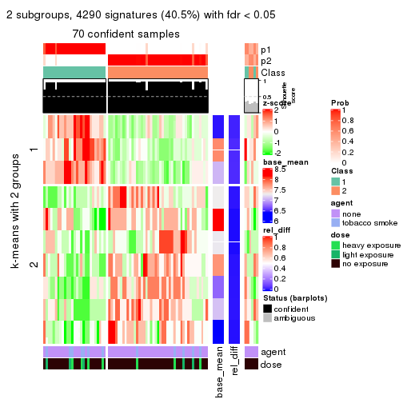</p>

</div>
<div id='tab-CV-kmeans-get-signatures-2'>
<pre><code class="r">get_signatures(res, k = 3)
</code></pre>

<p>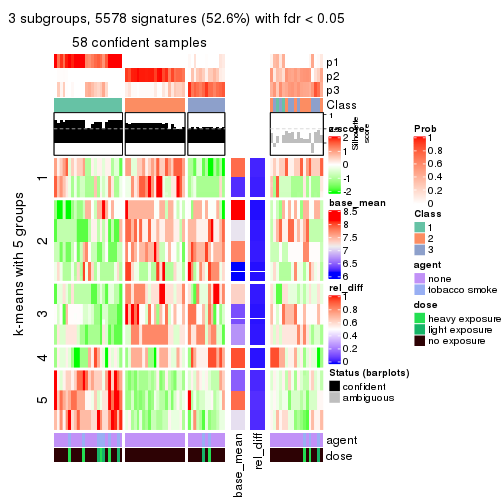</p>

</div>
<div id='tab-CV-kmeans-get-signatures-3'>
<pre><code class="r">get_signatures(res, k = 4)
</code></pre>

<p>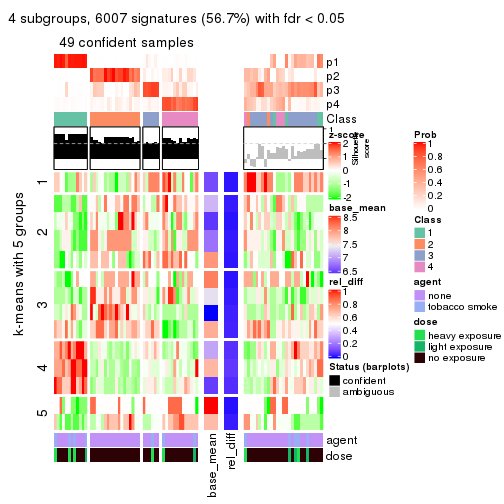</p>

</div>
<div id='tab-CV-kmeans-get-signatures-4'>
<pre><code class="r">get_signatures(res, k = 5)
</code></pre>

<p>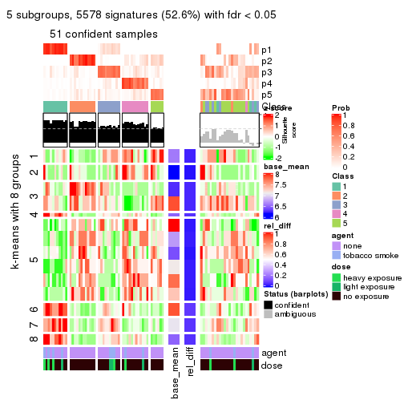</p>

</div>
<div id='tab-CV-kmeans-get-signatures-5'>
<pre><code class="r">get_signatures(res, k = 6)
</code></pre>

<p>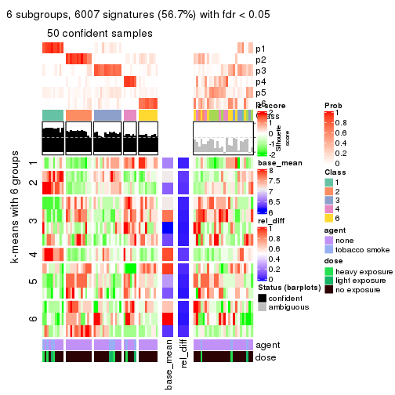</p>

</div>
</div>


Signature heatmaps where rows are not scaled:


<script>
$( function() {
	$( '#tabs-CV-kmeans-get-signatures-no-scale' ).tabs();
} );
</script>
<div id='tabs-CV-kmeans-get-signatures-no-scale'>
<ul>
<li><a href='#tab-CV-kmeans-get-signatures-no-scale-1'>k = 2</a></li>
<li><a href='#tab-CV-kmeans-get-signatures-no-scale-2'>k = 3</a></li>
<li><a href='#tab-CV-kmeans-get-signatures-no-scale-3'>k = 4</a></li>
<li><a href='#tab-CV-kmeans-get-signatures-no-scale-4'>k = 5</a></li>
<li><a href='#tab-CV-kmeans-get-signatures-no-scale-5'>k = 6</a></li>
</ul>
<div id='tab-CV-kmeans-get-signatures-no-scale-1'>
<pre><code class="r">get_signatures(res, k = 2, scale_rows = FALSE)
</code></pre>

<p>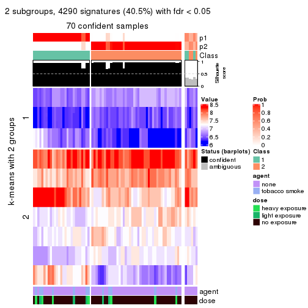</p>

</div>
<div id='tab-CV-kmeans-get-signatures-no-scale-2'>
<pre><code class="r">get_signatures(res, k = 3, scale_rows = FALSE)
</code></pre>

<p>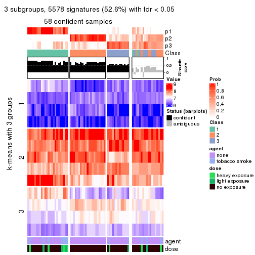</p>

</div>
<div id='tab-CV-kmeans-get-signatures-no-scale-3'>
<pre><code class="r">get_signatures(res, k = 4, scale_rows = FALSE)
</code></pre>

<p>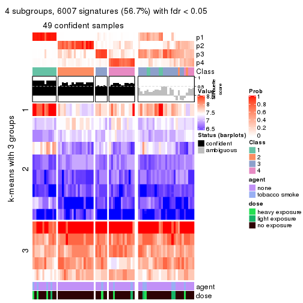</p>

</div>
<div id='tab-CV-kmeans-get-signatures-no-scale-4'>
<pre><code class="r">get_signatures(res, k = 5, scale_rows = FALSE)
</code></pre>

<p>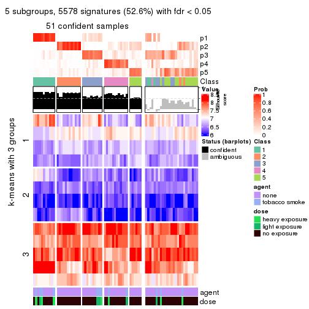</p>

</div>
<div id='tab-CV-kmeans-get-signatures-no-scale-5'>
<pre><code class="r">get_signatures(res, k = 6, scale_rows = FALSE)
</code></pre>

<p>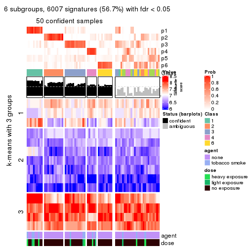</p>

</div>
</div>


Compare the overlap of signatures from different k:

```r
compare_signatures(res)
```

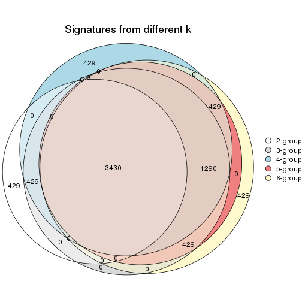

`get_signature()` returns a data frame invisibly. TO get the list of signatures, the function
call should be assigned to a variable explicitly. In following code, if `plot` argument is set
to `FALSE`, no heatmap is plotted while only the differential analysis is performed.

```r
# code only for demonstration
tb = get_signature(res, k = ..., plot = FALSE)
```

An example of the output of `tb` is:

```
#>   which_row         fdr    mean_1    mean_2 scaled_mean_1 scaled_mean_2 km
#> 1        38 0.042760348  8.373488  9.131774    -0.5533452     0.5164555  1
#> 2        40 0.018707592  7.106213  8.469186    -0.6173731     0.5762149  1
#> 3        55 0.019134737 10.221463 11.207825    -0.6159697     0.5749050  1
#> 4        59 0.006059896  5.921854  7.869574    -0.6899429     0.6439467  1
#> 5        60 0.018055526  8.928898 10.211722    -0.6204761     0.5791110  1
#> 6        98 0.009384629 15.714769 14.887706     0.6635654    -0.6193277  2
...
```

The columns in `tb` are:

1. `which_row`: row indices corresponding to the input matrix.
2. `fdr`: FDR for the differential test. 
3. `mean_x`: The mean value in group x.
4. `scaled_mean_x`: The mean value in group x after rows are scaled.
5. `km`: Row groups if k-means clustering is applied to rows.


UMAP plot which shows how samples are separated.


<script>
$( function() {
	$( '#tabs-CV-kmeans-dimension-reduction' ).tabs();
} );
</script>
<div id='tabs-CV-kmeans-dimension-reduction'>
<ul>
<li><a href='#tab-CV-kmeans-dimension-reduction-1'>k = 2</a></li>
<li><a href='#tab-CV-kmeans-dimension-reduction-2'>k = 3</a></li>
<li><a href='#tab-CV-kmeans-dimension-reduction-3'>k = 4</a></li>
<li><a href='#tab-CV-kmeans-dimension-reduction-4'>k = 5</a></li>
<li><a href='#tab-CV-kmeans-dimension-reduction-5'>k = 6</a></li>
</ul>
<div id='tab-CV-kmeans-dimension-reduction-1'>
<pre><code class="r">dimension_reduction(res, k = 2, method = &quot;UMAP&quot;)
</code></pre>

<p>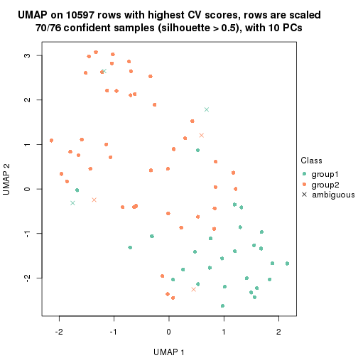</p>

</div>
<div id='tab-CV-kmeans-dimension-reduction-2'>
<pre><code class="r">dimension_reduction(res, k = 3, method = &quot;UMAP&quot;)
</code></pre>

<p>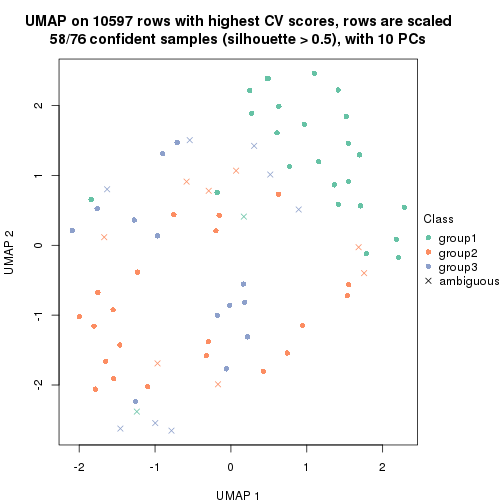</p>

</div>
<div id='tab-CV-kmeans-dimension-reduction-3'>
<pre><code class="r">dimension_reduction(res, k = 4, method = &quot;UMAP&quot;)
</code></pre>

<p>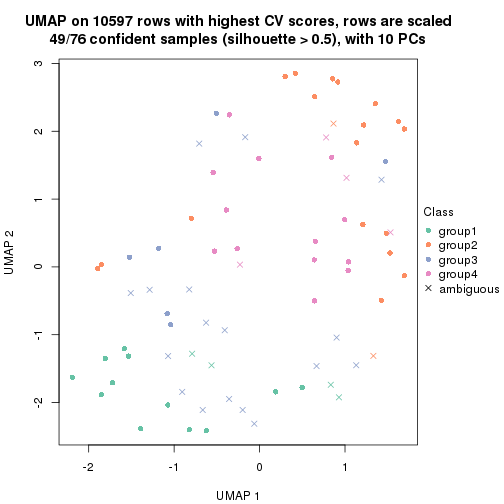</p>

</div>
<div id='tab-CV-kmeans-dimension-reduction-4'>
<pre><code class="r">dimension_reduction(res, k = 5, method = &quot;UMAP&quot;)
</code></pre>

<p>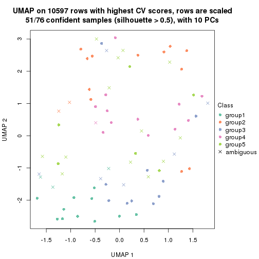</p>

</div>
<div id='tab-CV-kmeans-dimension-reduction-5'>
<pre><code class="r">dimension_reduction(res, k = 6, method = &quot;UMAP&quot;)
</code></pre>

<p>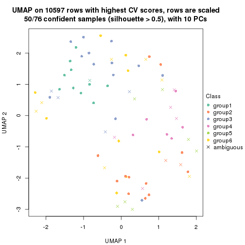</p>

</div>
</div>


Following heatmap shows how subgroups are split when increasing `k`:

```r
collect_classes(res)
```

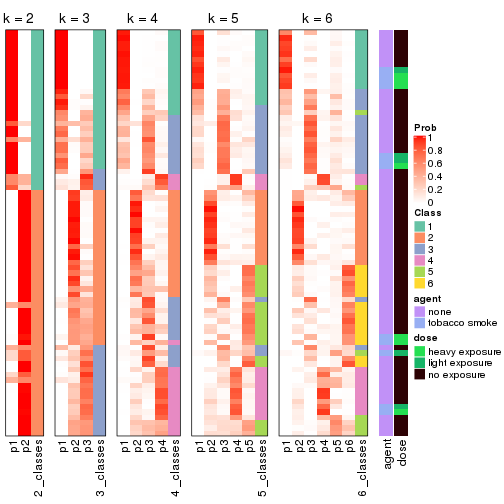


Test correlation between subgroups and known annotations. If the known
annotation is numeric, one-way ANOVA test is applied, and if the known
annotation is discrete, chi-squared contingency table test is applied.

```r
test_to_known_factors(res)
```

```
#>            n agent(p) dose(p) k
#> CV:kmeans 70   0.2227   0.302 2
#> CV:kmeans 58   0.0264   0.121 3
#> CV:kmeans 49   0.0859   0.268 4
#> CV:kmeans 51   0.1088   0.274 5
#> CV:kmeans 50   0.0593   0.188 6
```


If matrix rows can be associated to genes, consider to use `GO_Enrichment(res,
...)` to perform function enrichment for the signature genes.


 

---------------------------------------------------


### CV:skmeans


The object with results only for a single top-value method and a single partition method 
can be extracted as:

```r
res = res_list["CV", "skmeans"]
# you can also extract it by
# res = res_list["CV:skmeans"]
```

A summary of `res` and all the functions that can be applied to it:

```r
res
```

```
#> A 'ConsensusPartition' object with k = 2, 3, 4, 5, 6.
#>   On a matrix with 10597 rows and 76 columns.
#>   Top rows (1000, 2000, 3000, 4000, 5000) are extracted by 'CV' method.
#>   Subgroups are detected by 'skmeans' method.
#>   Performed in total 1250 partitions by row resampling.
#>   Best k for subgroups seems to be 2.
#> 
#> Following methods can be applied to this 'ConsensusPartition' object:
#>  [1] "cola_report"             "collect_classes"         "collect_plots"          
#>  [4] "collect_stats"           "colnames"                "compare_signatures"     
#>  [7] "consensus_heatmap"       "dimension_reduction"     "functional_enrichment"  
#> [10] "get_anno_col"            "get_anno"                "get_classes"            
#> [13] "get_consensus"           "get_matrix"              "get_membership"         
#> [16] "get_param"               "get_signatures"          "get_stats"              
#> [19] "is_best_k"               "is_stable_k"             "membership_heatmap"     
#> [22] "ncol"                    "nrow"                    "plot_ecdf"              
#> [25] "rownames"                "select_partition_number" "show"                   
#> [28] "suggest_best_k"          "test_to_known_factors"
```

`collect_plots()` function collects all the plots made from `res` for all `k` (number of partitions)
into one single page to provide an easy and fast comparison between different `k`.

```r
collect_plots(res)
```

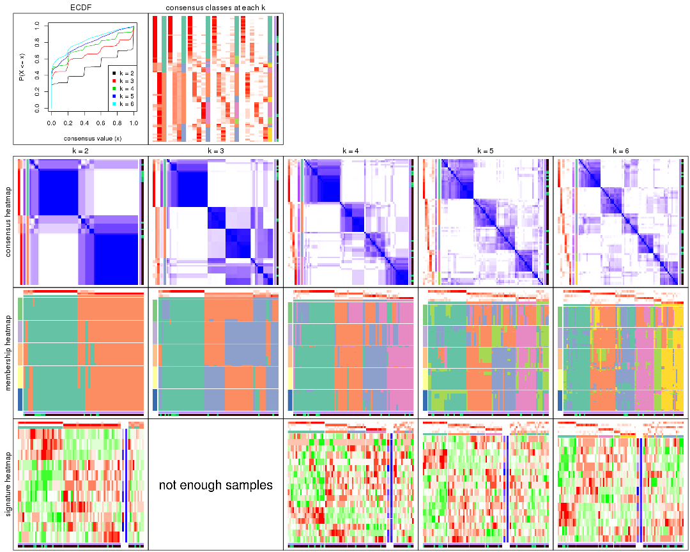

The plots are:

- The first row: a plot of the ECDF (Empirical cumulative distribution
  function) curves of the consensus matrix for each `k` and the heatmap of
  predicted classes for each `k`.
- The second row: heatmaps of the consensus matrix for each `k`.
- The third row: heatmaps of the membership matrix for each `k`.
- The fouth row: heatmaps of the signatures for each `k`.

All the plots in panels can be made by individual functions and they are
plotted later in this section.

`select_partition_number()` produces several plots showing different
statistics for choosing "optimized" `k`. There are following statistics:

- ECDF curves of the consensus matrix for each `k`;
- 1-PAC. [The PAC
  score](https://en.wikipedia.org/wiki/Consensus_clustering#Over-interpretation_potential_of_consensus_clustering)
  measures the proportion of the ambiguous subgrouping.
- Mean silhouette score.
- Concordance. The mean probability of fiting the consensus class ids in all
  partitions.
- Area increased. Denote $A_k$ as the area under the ECDF curve for current
  `k`, the area increased is defined as $A_k - A_{k-1}$.
- Rand index. The percent of pairs of samples that are both in a same cluster
  or both are not in a same cluster in the partition of k and k-1.
- Jaccard index. The ratio of pairs of samples are both in a same cluster in
  the partition of k and k-1 and the pairs of samples are both in a same
  cluster in the partition k or k-1.

The detailed explanations of these statistics can be found in [the cola
vignette](http://bioconductor.org/packages/devel/bioc/vignettes/cola/inst/doc/cola.html#toc_13).

Generally speaking, lower PAC score, higher mean silhouette score or higher
concordance corresponds to better partition. Rand index and Jaccard index
measure how similar the current partition is compared to partition with `k-1`.
If they are too similar, we won't accept `k` is better than `k-1`.

```r
select_partition_number(res)
```

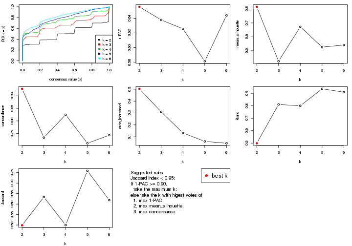

The numeric values for all these statistics can be obtained by `get_stats()`.

```r
get_stats(res)
```

```
#>   k 1-PAC mean_silhouette concordance area_increased  Rand Jaccard
#> 2 2 0.656           0.816       0.928         0.5035 0.499   0.499
#> 3 3 0.638           0.424       0.734         0.3092 0.810   0.634
#> 4 4 0.626           0.672       0.825         0.1320 0.800   0.500
#> 5 5 0.581           0.526       0.711         0.0609 0.936   0.759
#> 6 6 0.644           0.541       0.743         0.0451 0.909   0.619
```

`suggest_best_k()` suggests the best $k$ based on these statistics. The rules are as follows:

- All $k$ with Jaccard index larger than 0.95 are removed because the increase of
  the partition number does not provides enough extra information. If all $k$ are removed,
  the best $k$ is assigned by `NA`.
- For $k$ with 1-PAC larger than 0.9, the maximal $k$ is taken as the "best k". Other $k$ is called "optional k".
- If it does not fit the second rule. The $k$ with the highest vote of highest
  1-PAC, mean silhouette and concordance is taken as the "best k".

```r
suggest_best_k(res)
```

```
#> [1] 2
```


Following shows the table of the partitions (You need to click the **show/hide
code output** link to see it). The membership matrix (columns with name `p*`)
is inferred by
[`clue::cl_consensus()`](https://www.rdocumentation.org/link/cl_consensus?package=clue)
function with the `SE` method. Basically the value in the membership matrix
represents the probability to belong to a certain group. The finall class
label for an item is determined with the group with highest probability it
belongs to.

In `get_classes()` function, the entropy is calculated from the membership
matrix and the silhouette score is calculated from the consensus matrix.


<script>
$( function() {
	$( '#tabs-CV-skmeans-get-classes' ).tabs();
} );
</script>
<div id='tabs-CV-skmeans-get-classes'>
<ul>
<li><a href='#tab-CV-skmeans-get-classes-1'>k = 2</a></li>
<li><a href='#tab-CV-skmeans-get-classes-2'>k = 3</a></li>
<li><a href='#tab-CV-skmeans-get-classes-3'>k = 4</a></li>
<li><a href='#tab-CV-skmeans-get-classes-4'>k = 5</a></li>
<li><a href='#tab-CV-skmeans-get-classes-5'>k = 6</a></li>
</ul>

<div id='tab-CV-skmeans-get-classes-1'>
<p><a id='tab-CV-skmeans-get-classes-1-a' style='color:#0366d6' href='#'>show/hide code output</a></p>
<pre><code class="r">cbind(get_classes(res, k = 2), get_membership(res, k = 2))
</code></pre>

<pre><code>#&gt;           class entropy silhouette    p1    p2
#&gt; GSM451162     1   0.971      0.286 0.600 0.400
#&gt; GSM451163     2   0.000      0.909 0.000 1.000
#&gt; GSM451164     2   0.000      0.909 0.000 1.000
#&gt; GSM451165     2   0.000      0.909 0.000 1.000
#&gt; GSM451167     2   0.000      0.909 0.000 1.000
#&gt; GSM451168     2   0.000      0.909 0.000 1.000
#&gt; GSM451169     1   0.973      0.275 0.596 0.404
#&gt; GSM451170     1   0.000      0.921 1.000 0.000
#&gt; GSM451171     2   0.000      0.909 0.000 1.000
#&gt; GSM451172     2   0.000      0.909 0.000 1.000
#&gt; GSM451173     1   0.000      0.921 1.000 0.000
#&gt; GSM451174     2   0.000      0.909 0.000 1.000
#&gt; GSM451175     1   0.000      0.921 1.000 0.000
#&gt; GSM451177     2   0.000      0.909 0.000 1.000
#&gt; GSM451178     2   0.000      0.909 0.000 1.000
#&gt; GSM451179     1   0.402      0.845 0.920 0.080
#&gt; GSM451180     2   0.000      0.909 0.000 1.000
#&gt; GSM451181     2   0.000      0.909 0.000 1.000
#&gt; GSM451182     1   0.000      0.921 1.000 0.000
#&gt; GSM451183     1   0.000      0.921 1.000 0.000
#&gt; GSM451184     1   0.000      0.921 1.000 0.000
#&gt; GSM451185     1   0.000      0.921 1.000 0.000
#&gt; GSM451186     1   0.966      0.329 0.608 0.392
#&gt; GSM451187     2   0.000      0.909 0.000 1.000
#&gt; GSM451188     2   0.000      0.909 0.000 1.000
#&gt; GSM451189     1   0.000      0.921 1.000 0.000
#&gt; GSM451190     1   0.000      0.921 1.000 0.000
#&gt; GSM451191     1   0.000      0.921 1.000 0.000
#&gt; GSM451193     2   0.722      0.708 0.200 0.800
#&gt; GSM451195     1   0.000      0.921 1.000 0.000
#&gt; GSM451196     1   0.000      0.921 1.000 0.000
#&gt; GSM451197     1   0.000      0.921 1.000 0.000
#&gt; GSM451199     1   0.000      0.921 1.000 0.000
#&gt; GSM451201     1   0.000      0.921 1.000 0.000
#&gt; GSM451202     2   0.000      0.909 0.000 1.000
#&gt; GSM451203     1   0.000      0.921 1.000 0.000
#&gt; GSM451204     2   0.163      0.892 0.024 0.976
#&gt; GSM451205     2   0.000      0.909 0.000 1.000
#&gt; GSM451206     2   0.000      0.909 0.000 1.000
#&gt; GSM451207     2   0.000      0.909 0.000 1.000
#&gt; GSM451208     2   0.000      0.909 0.000 1.000
#&gt; GSM451209     2   0.971      0.313 0.400 0.600
#&gt; GSM451210     2   0.000      0.909 0.000 1.000
#&gt; GSM451212     2   0.000      0.909 0.000 1.000
#&gt; GSM451213     2   0.000      0.909 0.000 1.000
#&gt; GSM451214     2   0.722      0.711 0.200 0.800
#&gt; GSM451215     2   0.000      0.909 0.000 1.000
#&gt; GSM451216     2   0.000      0.909 0.000 1.000
#&gt; GSM451217     2   0.000      0.909 0.000 1.000
#&gt; GSM451219     1   0.000      0.921 1.000 0.000
#&gt; GSM451220     1   0.000      0.921 1.000 0.000
#&gt; GSM451221     1   0.000      0.921 1.000 0.000
#&gt; GSM451222     1   0.000      0.921 1.000 0.000
#&gt; GSM451224     2   0.000      0.909 0.000 1.000
#&gt; GSM451225     1   0.971      0.308 0.600 0.400
#&gt; GSM451226     2   0.971      0.341 0.400 0.600
#&gt; GSM451227     2   0.969      0.351 0.396 0.604
#&gt; GSM451228     2   0.722      0.711 0.200 0.800
#&gt; GSM451230     1   0.722      0.694 0.800 0.200
#&gt; GSM451231     2   0.971      0.313 0.400 0.600
#&gt; GSM451233     2   0.722      0.713 0.200 0.800
#&gt; GSM451234     2   0.722      0.713 0.200 0.800
#&gt; GSM451235     2   0.000      0.909 0.000 1.000
#&gt; GSM451236     2   0.000      0.909 0.000 1.000
#&gt; GSM451166     1   0.971      0.329 0.600 0.400
#&gt; GSM451194     1   0.000      0.921 1.000 0.000
#&gt; GSM451198     1   0.000      0.921 1.000 0.000
#&gt; GSM451218     2   0.000      0.909 0.000 1.000
#&gt; GSM451232     1   0.000      0.921 1.000 0.000
#&gt; GSM451176     1   0.000      0.921 1.000 0.000
#&gt; GSM451192     1   0.000      0.921 1.000 0.000
#&gt; GSM451200     1   0.000      0.921 1.000 0.000
#&gt; GSM451211     2   0.000      0.909 0.000 1.000
#&gt; GSM451223     2   0.971      0.341 0.400 0.600
#&gt; GSM451229     1   0.000      0.921 1.000 0.000
#&gt; GSM451237     2   0.722      0.713 0.200 0.800
</code></pre>

<script>
$('#tab-CV-skmeans-get-classes-1-a').parent().next().next().hide();
$('#tab-CV-skmeans-get-classes-1-a').click(function(){
  $('#tab-CV-skmeans-get-classes-1-a').parent().next().next().toggle();
  return(false);
});
</script>
</div>

<div id='tab-CV-skmeans-get-classes-2'>
<p><a id='tab-CV-skmeans-get-classes-2-a' style='color:#0366d6' href='#'>show/hide code output</a></p>
<pre><code class="r">cbind(get_classes(res, k = 3), get_membership(res, k = 3))
</code></pre>

<pre><code>#&gt;           class entropy silhouette    p1    p2    p3
#&gt; GSM451162     3   0.891     0.2851 0.228 0.200 0.572
#&gt; GSM451163     3   0.613     0.1448 0.000 0.400 0.600
#&gt; GSM451164     2   0.621     0.1850 0.000 0.572 0.428
#&gt; GSM451165     2   0.613     0.1996 0.000 0.600 0.400
#&gt; GSM451167     3   0.613     0.1448 0.000 0.400 0.600
#&gt; GSM451168     2   0.613     0.1996 0.000 0.600 0.400
#&gt; GSM451169     3   0.613     0.1448 0.000 0.400 0.600
#&gt; GSM451170     1   0.000     0.9164 1.000 0.000 0.000
#&gt; GSM451171     2   0.618     0.1926 0.000 0.584 0.416
#&gt; GSM451172     2   0.621     0.1850 0.000 0.572 0.428
#&gt; GSM451173     1   0.000     0.9164 1.000 0.000 0.000
#&gt; GSM451174     3   0.455     0.1314 0.000 0.200 0.800
#&gt; GSM451175     1   0.000     0.9164 1.000 0.000 0.000
#&gt; GSM451177     2   0.608     0.2086 0.000 0.612 0.388
#&gt; GSM451178     3   0.455     0.1314 0.000 0.200 0.800
#&gt; GSM451179     1   0.228     0.8699 0.940 0.052 0.008
#&gt; GSM451180     2   0.618     0.1926 0.000 0.584 0.416
#&gt; GSM451181     2   0.618     0.1926 0.000 0.584 0.416
#&gt; GSM451182     1   0.000     0.9164 1.000 0.000 0.000
#&gt; GSM451183     1   0.000     0.9164 1.000 0.000 0.000
#&gt; GSM451184     1   0.601     0.4369 0.628 0.000 0.372
#&gt; GSM451185     1   0.000     0.9164 1.000 0.000 0.000
#&gt; GSM451186     3   0.985     0.0120 0.256 0.340 0.404
#&gt; GSM451187     2   0.620     0.1881 0.000 0.576 0.424
#&gt; GSM451188     2   0.608     0.2086 0.000 0.612 0.388
#&gt; GSM451189     1   0.000     0.9164 1.000 0.000 0.000
#&gt; GSM451190     1   0.000     0.9164 1.000 0.000 0.000
#&gt; GSM451191     1   0.000     0.9164 1.000 0.000 0.000
#&gt; GSM451193     3   0.455     0.2865 0.200 0.000 0.800
#&gt; GSM451195     1   0.000     0.9164 1.000 0.000 0.000
#&gt; GSM451196     1   0.000     0.9164 1.000 0.000 0.000
#&gt; GSM451197     1   0.000     0.9164 1.000 0.000 0.000
#&gt; GSM451199     1   0.000     0.9164 1.000 0.000 0.000
#&gt; GSM451201     1   0.000     0.9164 1.000 0.000 0.000
#&gt; GSM451202     2   0.608     0.2086 0.000 0.612 0.388
#&gt; GSM451203     1   0.441     0.7812 0.824 0.004 0.172
#&gt; GSM451204     2   0.613     0.1650 0.000 0.600 0.400
#&gt; GSM451205     2   0.618     0.1926 0.000 0.584 0.416
#&gt; GSM451206     3   0.455     0.1314 0.000 0.200 0.800
#&gt; GSM451207     2   0.621     0.1508 0.000 0.572 0.428
#&gt; GSM451208     2   0.608     0.2086 0.000 0.612 0.388
#&gt; GSM451209     2   0.653     0.1594 0.008 0.588 0.404
#&gt; GSM451210     2   0.608     0.2086 0.000 0.612 0.388
#&gt; GSM451212     2   0.621     0.1508 0.000 0.572 0.428
#&gt; GSM451213     2   0.613     0.1650 0.000 0.600 0.400
#&gt; GSM451214     3   0.615     0.1381 0.000 0.408 0.592
#&gt; GSM451215     2   0.608     0.2086 0.000 0.612 0.388
#&gt; GSM451216     2   0.613     0.1650 0.000 0.600 0.400
#&gt; GSM451217     2   0.621     0.1850 0.000 0.572 0.428
#&gt; GSM451219     1   0.000     0.9164 1.000 0.000 0.000
#&gt; GSM451220     1   0.418     0.7842 0.828 0.000 0.172
#&gt; GSM451221     1   0.000     0.9164 1.000 0.000 0.000
#&gt; GSM451222     1   0.853     0.4080 0.612 0.188 0.200
#&gt; GSM451224     2   0.608     0.2086 0.000 0.612 0.388
#&gt; GSM451225     3   0.967    -0.0154 0.212 0.388 0.400
#&gt; GSM451226     3   0.865     0.2883 0.200 0.200 0.600
#&gt; GSM451227     2   0.610     0.2063 0.000 0.608 0.392
#&gt; GSM451228     3   0.103     0.2444 0.024 0.000 0.976
#&gt; GSM451230     3   0.734    -0.0204 0.036 0.392 0.572
#&gt; GSM451231     2   0.666     0.1573 0.012 0.588 0.400
#&gt; GSM451233     2   0.621     0.1508 0.000 0.572 0.428
#&gt; GSM451234     2   0.637     0.1606 0.004 0.588 0.408
#&gt; GSM451235     2   0.617     0.1603 0.000 0.588 0.412
#&gt; GSM451236     2   0.613     0.1650 0.000 0.600 0.400
#&gt; GSM451166     1   0.959     0.0221 0.424 0.200 0.376
#&gt; GSM451194     1   0.000     0.9164 1.000 0.000 0.000
#&gt; GSM451198     1   0.418     0.7842 0.828 0.000 0.172
#&gt; GSM451218     2   0.613     0.1650 0.000 0.600 0.400
#&gt; GSM451232     1   0.000     0.9164 1.000 0.000 0.000
#&gt; GSM451176     1   0.000     0.9164 1.000 0.000 0.000
#&gt; GSM451192     1   0.000     0.9164 1.000 0.000 0.000
#&gt; GSM451200     1   0.418     0.7842 0.828 0.000 0.172
#&gt; GSM451211     3   0.455     0.1314 0.000 0.200 0.800
#&gt; GSM451223     3   0.865     0.2872 0.196 0.204 0.600
#&gt; GSM451229     1   0.000     0.9164 1.000 0.000 0.000
#&gt; GSM451237     2   0.637     0.1606 0.004 0.588 0.408
</code></pre>

<script>
$('#tab-CV-skmeans-get-classes-2-a').parent().next().next().hide();
$('#tab-CV-skmeans-get-classes-2-a').click(function(){
  $('#tab-CV-skmeans-get-classes-2-a').parent().next().next().toggle();
  return(false);
});
</script>
</div>

<div id='tab-CV-skmeans-get-classes-3'>
<p><a id='tab-CV-skmeans-get-classes-3-a' style='color:#0366d6' href='#'>show/hide code output</a></p>
<pre><code class="r">cbind(get_classes(res, k = 4), get_membership(res, k = 4))
</code></pre>

<pre><code>#&gt;           class entropy silhouette    p1    p2    p3    p4
#&gt; GSM451162     3  0.4855     0.5624 0.000 0.400 0.600 0.000
#&gt; GSM451163     3  0.4193     0.4974 0.000 0.268 0.732 0.000
#&gt; GSM451164     2  0.3764     0.6836 0.000 0.784 0.216 0.000
#&gt; GSM451165     3  0.6855     0.5108 0.000 0.200 0.600 0.200
#&gt; GSM451167     3  0.3610     0.5087 0.000 0.200 0.800 0.000
#&gt; GSM451168     2  0.4175     0.7446 0.000 0.784 0.016 0.200
#&gt; GSM451169     3  0.3649     0.6198 0.000 0.204 0.796 0.000
#&gt; GSM451170     1  0.0000     0.8758 1.000 0.000 0.000 0.000
#&gt; GSM451171     2  0.3933     0.6935 0.000 0.792 0.200 0.008
#&gt; GSM451172     3  0.3610     0.5749 0.000 0.200 0.800 0.000
#&gt; GSM451173     1  0.7090     0.5788 0.588 0.200 0.004 0.208
#&gt; GSM451174     3  0.3688     0.6256 0.000 0.000 0.792 0.208
#&gt; GSM451175     1  0.0000     0.8758 1.000 0.000 0.000 0.000
#&gt; GSM451177     2  0.3688     0.7541 0.000 0.792 0.000 0.208
#&gt; GSM451178     3  0.3649     0.6280 0.000 0.000 0.796 0.204
#&gt; GSM451179     1  0.7299     0.2715 0.520 0.000 0.296 0.184
#&gt; GSM451180     2  0.3933     0.6935 0.000 0.792 0.200 0.008
#&gt; GSM451181     2  0.5161     0.4356 0.000 0.592 0.400 0.008
#&gt; GSM451182     1  0.0000     0.8758 1.000 0.000 0.000 0.000
#&gt; GSM451183     1  0.0000     0.8758 1.000 0.000 0.000 0.000
#&gt; GSM451184     2  0.5465    -0.1230 0.392 0.588 0.020 0.000
#&gt; GSM451185     1  0.0000     0.8758 1.000 0.000 0.000 0.000
#&gt; GSM451186     4  0.4605     0.4915 0.336 0.000 0.000 0.664
#&gt; GSM451187     3  0.3907     0.5464 0.000 0.232 0.768 0.000
#&gt; GSM451188     2  0.3610     0.7547 0.000 0.800 0.000 0.200
#&gt; GSM451189     1  0.0000     0.8758 1.000 0.000 0.000 0.000
#&gt; GSM451190     1  0.2704     0.8248 0.876 0.124 0.000 0.000
#&gt; GSM451191     1  0.1042     0.8656 0.972 0.008 0.020 0.000
#&gt; GSM451193     3  0.0000     0.6632 0.000 0.000 1.000 0.000
#&gt; GSM451195     1  0.4284     0.7659 0.780 0.200 0.020 0.000
#&gt; GSM451196     1  0.0000     0.8758 1.000 0.000 0.000 0.000
#&gt; GSM451197     1  0.0000     0.8758 1.000 0.000 0.000 0.000
#&gt; GSM451199     1  0.0336     0.8733 0.992 0.000 0.008 0.000
#&gt; GSM451201     1  0.0000     0.8758 1.000 0.000 0.000 0.000
#&gt; GSM451202     2  0.3688     0.7541 0.000 0.792 0.000 0.208
#&gt; GSM451203     1  0.6886     0.5563 0.596 0.204 0.200 0.000
#&gt; GSM451204     4  0.0000     0.7943 0.000 0.000 0.000 1.000
#&gt; GSM451205     2  0.3933     0.6935 0.000 0.792 0.200 0.008
#&gt; GSM451206     3  0.4018     0.6127 0.000 0.004 0.772 0.224
#&gt; GSM451207     4  0.5279     0.4710 0.000 0.012 0.400 0.588
#&gt; GSM451208     2  0.3688     0.7541 0.000 0.792 0.000 0.208
#&gt; GSM451209     4  0.0336     0.7937 0.008 0.000 0.000 0.992
#&gt; GSM451210     2  0.3610     0.7547 0.000 0.800 0.000 0.200
#&gt; GSM451212     4  0.5279     0.4710 0.000 0.012 0.400 0.588
#&gt; GSM451213     4  0.4576     0.5473 0.000 0.012 0.260 0.728
#&gt; GSM451214     2  0.3610     0.6924 0.000 0.800 0.200 0.000
#&gt; GSM451215     2  0.3688     0.7541 0.000 0.792 0.000 0.208
#&gt; GSM451216     4  0.0469     0.7890 0.000 0.012 0.000 0.988
#&gt; GSM451217     2  0.5016     0.4094 0.000 0.600 0.396 0.004
#&gt; GSM451219     1  0.0336     0.8722 0.992 0.008 0.000 0.000
#&gt; GSM451220     3  0.7442     0.1609 0.304 0.200 0.496 0.000
#&gt; GSM451221     1  0.1042     0.8656 0.972 0.008 0.020 0.000
#&gt; GSM451222     1  0.7608     0.0208 0.408 0.200 0.000 0.392
#&gt; GSM451224     2  0.3610     0.7547 0.000 0.800 0.000 0.200
#&gt; GSM451225     4  0.3688     0.6584 0.208 0.000 0.000 0.792
#&gt; GSM451226     2  0.6907     0.4694 0.172 0.588 0.240 0.000
#&gt; GSM451227     2  0.3610     0.7547 0.000 0.800 0.000 0.200
#&gt; GSM451228     3  0.0000     0.6632 0.000 0.000 1.000 0.000
#&gt; GSM451230     4  0.3933     0.6564 0.008 0.200 0.000 0.792
#&gt; GSM451231     4  0.0336     0.7937 0.008 0.000 0.000 0.992
#&gt; GSM451233     4  0.3610     0.6461 0.000 0.000 0.200 0.800
#&gt; GSM451234     4  0.0336     0.7933 0.000 0.000 0.008 0.992
#&gt; GSM451235     4  0.0336     0.7933 0.000 0.000 0.008 0.992
#&gt; GSM451236     4  0.0000     0.7943 0.000 0.000 0.000 1.000
#&gt; GSM451166     4  0.8102     0.2301 0.224 0.012 0.372 0.392
#&gt; GSM451194     1  0.3751     0.6999 0.800 0.000 0.004 0.196
#&gt; GSM451198     1  0.3610     0.7750 0.800 0.200 0.000 0.000
#&gt; GSM451218     4  0.0000     0.7943 0.000 0.000 0.000 1.000
#&gt; GSM451232     1  0.0000     0.8758 1.000 0.000 0.000 0.000
#&gt; GSM451176     1  0.0000     0.8758 1.000 0.000 0.000 0.000
#&gt; GSM451192     1  0.3610     0.7750 0.800 0.200 0.000 0.000
#&gt; GSM451200     1  0.4284     0.7659 0.780 0.200 0.020 0.000
#&gt; GSM451211     3  0.7058     0.4992 0.000 0.200 0.572 0.228
#&gt; GSM451223     3  0.2271     0.6363 0.076 0.008 0.916 0.000
#&gt; GSM451229     1  0.0000     0.8758 1.000 0.000 0.000 0.000
#&gt; GSM451237     4  0.0336     0.7933 0.000 0.000 0.008 0.992
</code></pre>

<script>
$('#tab-CV-skmeans-get-classes-3-a').parent().next().next().hide();
$('#tab-CV-skmeans-get-classes-3-a').click(function(){
  $('#tab-CV-skmeans-get-classes-3-a').parent().next().next().toggle();
  return(false);
});
</script>
</div>

<div id='tab-CV-skmeans-get-classes-4'>
<p><a id='tab-CV-skmeans-get-classes-4-a' style='color:#0366d6' href='#'>show/hide code output</a></p>
<pre><code class="r">cbind(get_classes(res, k = 5), get_membership(res, k = 5))
</code></pre>

<pre><code>#&gt;           class entropy silhouette    p1    p2    p3    p4    p5
#&gt; GSM451162     3  0.5725     0.4497 0.000 0.156 0.620 0.000 0.224
#&gt; GSM451163     3  0.3452     0.6389 0.000 0.244 0.756 0.000 0.000
#&gt; GSM451164     2  0.2732     0.5767 0.000 0.840 0.160 0.000 0.000
#&gt; GSM451165     3  0.3297     0.5767 0.000 0.068 0.848 0.084 0.000
#&gt; GSM451167     3  0.6164     0.4933 0.000 0.388 0.476 0.000 0.136
#&gt; GSM451168     2  0.5167     0.6454 0.000 0.664 0.248 0.088 0.000
#&gt; GSM451169     3  0.5115     0.5563 0.000 0.092 0.676 0.000 0.232
#&gt; GSM451170     1  0.0162     0.7333 0.996 0.000 0.000 0.000 0.004
#&gt; GSM451171     2  0.5756     0.6423 0.000 0.620 0.204 0.000 0.176
#&gt; GSM451172     3  0.3534     0.6328 0.000 0.256 0.744 0.000 0.000
#&gt; GSM451173     1  0.6102     0.4221 0.568 0.000 0.000 0.200 0.232
#&gt; GSM451174     3  0.0566     0.6077 0.000 0.004 0.984 0.012 0.000
#&gt; GSM451175     1  0.3274     0.4959 0.780 0.000 0.000 0.000 0.220
#&gt; GSM451177     2  0.6311     0.6623 0.000 0.504 0.320 0.000 0.176
#&gt; GSM451178     3  0.2818     0.5621 0.000 0.012 0.856 0.000 0.132
#&gt; GSM451179     5  0.8466     0.1889 0.232 0.000 0.180 0.256 0.332
#&gt; GSM451180     2  0.5886     0.6508 0.000 0.600 0.224 0.000 0.176
#&gt; GSM451181     2  0.6463     0.4520 0.000 0.556 0.144 0.020 0.280
#&gt; GSM451182     1  0.0703     0.7308 0.976 0.000 0.000 0.000 0.024
#&gt; GSM451183     1  0.0609     0.7303 0.980 0.000 0.000 0.000 0.020
#&gt; GSM451184     5  0.6553    -0.0286 0.204 0.364 0.000 0.000 0.432
#&gt; GSM451185     1  0.0703     0.7308 0.976 0.000 0.000 0.000 0.024
#&gt; GSM451186     4  0.0771     0.6822 0.020 0.000 0.000 0.976 0.004
#&gt; GSM451187     3  0.5096     0.5755 0.000 0.272 0.656 0.000 0.072
#&gt; GSM451188     2  0.3895     0.6762 0.000 0.680 0.320 0.000 0.000
#&gt; GSM451189     1  0.0000     0.7333 1.000 0.000 0.000 0.000 0.000
#&gt; GSM451190     1  0.5144     0.5596 0.692 0.132 0.000 0.000 0.176
#&gt; GSM451191     1  0.6436     0.3451 0.504 0.264 0.000 0.000 0.232
#&gt; GSM451193     3  0.5847     0.5493 0.000 0.188 0.608 0.000 0.204
#&gt; GSM451195     1  0.3635     0.6155 0.748 0.000 0.000 0.004 0.248
#&gt; GSM451196     1  0.0000     0.7333 1.000 0.000 0.000 0.000 0.000
#&gt; GSM451197     1  0.3003     0.6798 0.812 0.000 0.000 0.000 0.188
#&gt; GSM451199     1  0.4803     0.6016 0.712 0.064 0.000 0.004 0.220
#&gt; GSM451201     1  0.0794     0.7271 0.972 0.000 0.000 0.000 0.028
#&gt; GSM451202     2  0.6046     0.6810 0.000 0.560 0.320 0.008 0.112
#&gt; GSM451203     5  0.4670    -0.2235 0.440 0.008 0.004 0.000 0.548
#&gt; GSM451204     4  0.4376     0.7654 0.000 0.012 0.172 0.768 0.048
#&gt; GSM451205     2  0.4970     0.5999 0.000 0.712 0.140 0.000 0.148
#&gt; GSM451206     3  0.0404     0.6069 0.000 0.012 0.988 0.000 0.000
#&gt; GSM451207     5  0.7360     0.0948 0.000 0.108 0.140 0.220 0.532
#&gt; GSM451208     2  0.6566     0.6628 0.000 0.496 0.320 0.008 0.176
#&gt; GSM451209     4  0.3093     0.7725 0.000 0.008 0.168 0.824 0.000
#&gt; GSM451210     2  0.3895     0.6762 0.000 0.680 0.320 0.000 0.000
#&gt; GSM451212     5  0.7352     0.0919 0.000 0.104 0.144 0.220 0.532
#&gt; GSM451213     5  0.6502    -0.0490 0.000 0.008 0.260 0.200 0.532
#&gt; GSM451214     2  0.1012     0.5146 0.000 0.968 0.012 0.000 0.020
#&gt; GSM451215     2  0.6311     0.6623 0.000 0.504 0.320 0.000 0.176
#&gt; GSM451216     4  0.6745     0.3785 0.000 0.008 0.188 0.404 0.400
#&gt; GSM451217     3  0.4300    -0.4857 0.000 0.476 0.524 0.000 0.000
#&gt; GSM451219     1  0.5918     0.4315 0.592 0.240 0.000 0.000 0.168
#&gt; GSM451220     5  0.6784     0.1330 0.308 0.000 0.248 0.004 0.440
#&gt; GSM451221     1  0.6482     0.3260 0.492 0.276 0.000 0.000 0.232
#&gt; GSM451222     1  0.5486     0.2681 0.572 0.000 0.000 0.076 0.352
#&gt; GSM451224     2  0.3246     0.6253 0.000 0.808 0.184 0.008 0.000
#&gt; GSM451225     4  0.2074     0.6480 0.104 0.000 0.000 0.896 0.000
#&gt; GSM451226     2  0.4916     0.1500 0.032 0.668 0.012 0.000 0.288
#&gt; GSM451227     2  0.4094     0.5249 0.000 0.780 0.020 0.180 0.020
#&gt; GSM451228     3  0.5283     0.5796 0.000 0.188 0.676 0.000 0.136
#&gt; GSM451230     4  0.4268     0.4325 0.000 0.000 0.000 0.556 0.444
#&gt; GSM451231     4  0.3212     0.7492 0.004 0.008 0.076 0.868 0.044
#&gt; GSM451233     4  0.5667     0.6740 0.000 0.108 0.072 0.712 0.108
#&gt; GSM451234     4  0.2179     0.7513 0.000 0.000 0.112 0.888 0.000
#&gt; GSM451235     4  0.3391     0.7657 0.000 0.012 0.188 0.800 0.000
#&gt; GSM451236     4  0.6384     0.5830 0.000 0.012 0.188 0.568 0.232
#&gt; GSM451166     5  0.6131     0.2466 0.364 0.000 0.064 0.032 0.540
#&gt; GSM451194     1  0.5180     0.5248 0.684 0.000 0.000 0.196 0.120
#&gt; GSM451198     1  0.4367     0.4670 0.580 0.000 0.000 0.004 0.416
#&gt; GSM451218     4  0.4136     0.7656 0.000 0.000 0.188 0.764 0.048
#&gt; GSM451232     1  0.0000     0.7333 1.000 0.000 0.000 0.000 0.000
#&gt; GSM451176     1  0.0000     0.7333 1.000 0.000 0.000 0.000 0.000
#&gt; GSM451192     1  0.2424     0.6733 0.868 0.000 0.000 0.000 0.132
#&gt; GSM451200     1  0.4367     0.4670 0.580 0.000 0.000 0.004 0.416
#&gt; GSM451211     3  0.3449     0.4900 0.000 0.068 0.852 0.012 0.068
#&gt; GSM451223     3  0.7123     0.3923 0.008 0.204 0.468 0.016 0.304
#&gt; GSM451229     1  0.0703     0.7308 0.976 0.000 0.000 0.000 0.024
#&gt; GSM451237     4  0.2230     0.7524 0.000 0.000 0.116 0.884 0.000
</code></pre>

<script>
$('#tab-CV-skmeans-get-classes-4-a').parent().next().next().hide();
$('#tab-CV-skmeans-get-classes-4-a').click(function(){
  $('#tab-CV-skmeans-get-classes-4-a').parent().next().next().toggle();
  return(false);
});
</script>
</div>

<div id='tab-CV-skmeans-get-classes-5'>
<p><a id='tab-CV-skmeans-get-classes-5-a' style='color:#0366d6' href='#'>show/hide code output</a></p>
<pre><code class="r">cbind(get_classes(res, k = 6), get_membership(res, k = 6))
</code></pre>

<pre><code>#&gt;           class entropy silhouette    p1    p2    p3    p4    p5    p6
#&gt; GSM451162     6  0.3738    0.55815 0.000 0.000 0.208 0.000 0.040 0.752
#&gt; GSM451163     6  0.1788    0.66069 0.000 0.076 0.004 0.000 0.004 0.916
#&gt; GSM451164     2  0.5045    0.47700 0.000 0.612 0.036 0.000 0.036 0.316
#&gt; GSM451165     6  0.4343    0.46811 0.000 0.396 0.012 0.004 0.004 0.584
#&gt; GSM451167     6  0.2948    0.52513 0.000 0.188 0.000 0.000 0.008 0.804
#&gt; GSM451168     2  0.1668    0.74130 0.000 0.928 0.060 0.004 0.008 0.000
#&gt; GSM451169     6  0.0725    0.64324 0.000 0.000 0.012 0.000 0.012 0.976
#&gt; GSM451170     1  0.0603    0.72326 0.980 0.000 0.016 0.000 0.004 0.000
#&gt; GSM451171     2  0.4666    0.65457 0.000 0.688 0.000 0.000 0.168 0.144
#&gt; GSM451172     6  0.1588    0.66326 0.000 0.072 0.000 0.000 0.004 0.924
#&gt; GSM451173     3  0.4470    0.49173 0.228 0.000 0.696 0.072 0.004 0.000
#&gt; GSM451174     6  0.5410    0.54138 0.000 0.208 0.000 0.012 0.160 0.620
#&gt; GSM451175     1  0.3420    0.51157 0.748 0.000 0.012 0.000 0.240 0.000
#&gt; GSM451177     2  0.1327    0.74582 0.000 0.936 0.000 0.000 0.064 0.000
#&gt; GSM451178     6  0.5035    0.53715 0.000 0.192 0.000 0.000 0.168 0.640
#&gt; GSM451179     3  0.7273    0.32734 0.068 0.000 0.452 0.104 0.320 0.056
#&gt; GSM451180     2  0.2968    0.70488 0.000 0.816 0.000 0.000 0.168 0.016
#&gt; GSM451181     2  0.6835    0.10976 0.000 0.416 0.012 0.128 0.380 0.064
#&gt; GSM451182     1  0.1219    0.71457 0.948 0.000 0.048 0.000 0.004 0.000
#&gt; GSM451183     1  0.0458    0.72095 0.984 0.000 0.016 0.000 0.000 0.000
#&gt; GSM451184     3  0.4496    0.37747 0.024 0.244 0.696 0.000 0.036 0.000
#&gt; GSM451185     1  0.1531    0.70385 0.928 0.000 0.068 0.000 0.004 0.000
#&gt; GSM451186     4  0.2219    0.67950 0.000 0.000 0.000 0.864 0.136 0.000
#&gt; GSM451187     6  0.4020    0.50638 0.000 0.276 0.000 0.000 0.032 0.692
#&gt; GSM451188     2  0.0935    0.74968 0.000 0.964 0.032 0.000 0.004 0.000
#&gt; GSM451189     1  0.0363    0.72177 0.988 0.000 0.012 0.000 0.000 0.000
#&gt; GSM451190     1  0.3315    0.56860 0.780 0.000 0.200 0.000 0.020 0.000
#&gt; GSM451191     3  0.4009    0.30546 0.356 0.004 0.632 0.000 0.008 0.000
#&gt; GSM451193     6  0.2941    0.48105 0.000 0.000 0.220 0.000 0.000 0.780
#&gt; GSM451195     3  0.3797    0.45818 0.292 0.000 0.692 0.000 0.016 0.000
#&gt; GSM451196     1  0.0260    0.72385 0.992 0.000 0.008 0.000 0.000 0.000
#&gt; GSM451197     1  0.3807    0.28905 0.628 0.000 0.368 0.000 0.004 0.000
#&gt; GSM451199     3  0.3930    0.23859 0.420 0.000 0.576 0.000 0.004 0.000
#&gt; GSM451201     1  0.2191    0.64481 0.876 0.000 0.120 0.000 0.004 0.000
#&gt; GSM451202     2  0.0363    0.75141 0.000 0.988 0.000 0.000 0.012 0.000
#&gt; GSM451203     1  0.6297    0.05551 0.456 0.004 0.392 0.000 0.092 0.056
#&gt; GSM451204     4  0.3230    0.57881 0.000 0.012 0.000 0.776 0.212 0.000
#&gt; GSM451205     2  0.4046    0.65867 0.000 0.748 0.000 0.000 0.084 0.168
#&gt; GSM451206     6  0.5377    0.53828 0.000 0.208 0.000 0.008 0.168 0.616
#&gt; GSM451207     5  0.3628    0.68252 0.000 0.004 0.000 0.168 0.784 0.044
#&gt; GSM451208     2  0.2178    0.70944 0.000 0.868 0.000 0.000 0.132 0.000
#&gt; GSM451209     4  0.1777    0.71302 0.000 0.044 0.004 0.928 0.024 0.000
#&gt; GSM451210     2  0.1151    0.75152 0.000 0.956 0.032 0.000 0.012 0.000
#&gt; GSM451212     5  0.3593    0.68377 0.000 0.004 0.000 0.164 0.788 0.044
#&gt; GSM451213     5  0.4136    0.62717 0.000 0.172 0.000 0.036 0.760 0.032
#&gt; GSM451214     2  0.5552    0.55781 0.000 0.640 0.116 0.000 0.044 0.200
#&gt; GSM451215     2  0.2260    0.70709 0.000 0.860 0.000 0.000 0.140 0.000
#&gt; GSM451216     5  0.4862    0.50598 0.000 0.172 0.000 0.164 0.664 0.000
#&gt; GSM451217     2  0.4050    0.50499 0.000 0.728 0.016 0.000 0.024 0.232
#&gt; GSM451219     1  0.4579    0.26669 0.584 0.008 0.380 0.000 0.028 0.000
#&gt; GSM451220     3  0.5143    0.47775 0.212 0.000 0.656 0.000 0.016 0.116
#&gt; GSM451221     3  0.4009    0.30546 0.356 0.004 0.632 0.000 0.008 0.000
#&gt; GSM451222     1  0.6410    0.04490 0.420 0.000 0.324 0.020 0.236 0.000
#&gt; GSM451224     2  0.2344    0.73682 0.000 0.896 0.048 0.004 0.052 0.000
#&gt; GSM451225     4  0.2362    0.67902 0.004 0.000 0.000 0.860 0.136 0.000
#&gt; GSM451226     3  0.6544    0.00246 0.000 0.320 0.452 0.000 0.044 0.184
#&gt; GSM451227     2  0.5799    0.53935 0.000 0.628 0.140 0.060 0.172 0.000
#&gt; GSM451228     6  0.0146    0.64247 0.000 0.000 0.000 0.000 0.004 0.996
#&gt; GSM451230     4  0.6023    0.12483 0.000 0.000 0.292 0.428 0.280 0.000
#&gt; GSM451231     4  0.1267    0.68905 0.000 0.000 0.000 0.940 0.060 0.000
#&gt; GSM451233     4  0.3142    0.62054 0.000 0.004 0.004 0.820 0.156 0.016
#&gt; GSM451234     4  0.2762    0.70856 0.000 0.196 0.000 0.804 0.000 0.000
#&gt; GSM451235     4  0.2793    0.70746 0.000 0.200 0.000 0.800 0.000 0.000
#&gt; GSM451236     4  0.5516    0.43531 0.000 0.196 0.000 0.560 0.244 0.000
#&gt; GSM451166     5  0.5629    0.42159 0.228 0.000 0.004 0.004 0.580 0.184
#&gt; GSM451194     3  0.5571    0.29915 0.408 0.000 0.476 0.108 0.008 0.000
#&gt; GSM451198     3  0.3398    0.47528 0.252 0.000 0.740 0.000 0.008 0.000
#&gt; GSM451218     4  0.4235    0.68113 0.000 0.192 0.000 0.724 0.084 0.000
#&gt; GSM451232     1  0.0146    0.72378 0.996 0.000 0.000 0.000 0.004 0.000
#&gt; GSM451176     1  0.2402    0.63260 0.868 0.000 0.120 0.000 0.012 0.000
#&gt; GSM451192     1  0.3244    0.43155 0.732 0.000 0.268 0.000 0.000 0.000
#&gt; GSM451200     3  0.2941    0.50910 0.220 0.000 0.780 0.000 0.000 0.000
#&gt; GSM451211     6  0.4385    0.41245 0.000 0.440 0.000 0.012 0.008 0.540
#&gt; GSM451223     6  0.6793    0.11644 0.000 0.012 0.332 0.124 0.068 0.464
#&gt; GSM451229     1  0.1411    0.71028 0.936 0.000 0.060 0.000 0.004 0.000
#&gt; GSM451237     4  0.2762    0.70856 0.000 0.196 0.000 0.804 0.000 0.000
</code></pre>

<script>
$('#tab-CV-skmeans-get-classes-5-a').parent().next().next().hide();
$('#tab-CV-skmeans-get-classes-5-a').click(function(){
  $('#tab-CV-skmeans-get-classes-5-a').parent().next().next().toggle();
  return(false);
});
</script>
</div>
</div>

Heatmaps for the consensus matrix. It visualizes the probability of two
samples to be in a same group.


<script>
$( function() {
	$( '#tabs-CV-skmeans-consensus-heatmap' ).tabs();
} );
</script>
<div id='tabs-CV-skmeans-consensus-heatmap'>
<ul>
<li><a href='#tab-CV-skmeans-consensus-heatmap-1'>k = 2</a></li>
<li><a href='#tab-CV-skmeans-consensus-heatmap-2'>k = 3</a></li>
<li><a href='#tab-CV-skmeans-consensus-heatmap-3'>k = 4</a></li>
<li><a href='#tab-CV-skmeans-consensus-heatmap-4'>k = 5</a></li>
<li><a href='#tab-CV-skmeans-consensus-heatmap-5'>k = 6</a></li>
</ul>
<div id='tab-CV-skmeans-consensus-heatmap-1'>
<pre><code class="r">consensus_heatmap(res, k = 2)
</code></pre>

<p>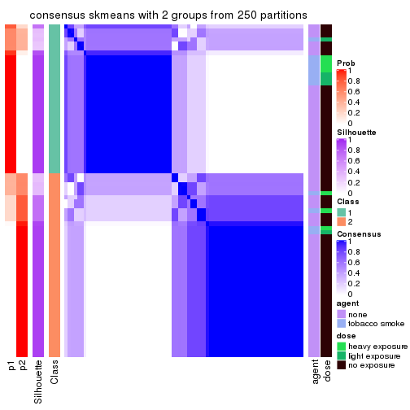</p>

</div>
<div id='tab-CV-skmeans-consensus-heatmap-2'>
<pre><code class="r">consensus_heatmap(res, k = 3)
</code></pre>

<p>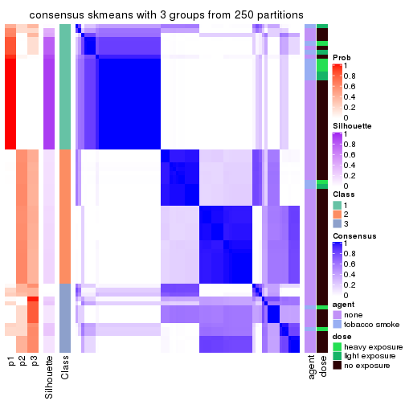</p>

</div>
<div id='tab-CV-skmeans-consensus-heatmap-3'>
<pre><code class="r">consensus_heatmap(res, k = 4)
</code></pre>

<p>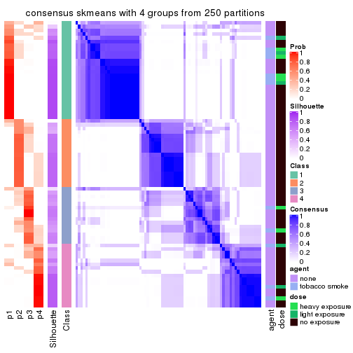</p>

</div>
<div id='tab-CV-skmeans-consensus-heatmap-4'>
<pre><code class="r">consensus_heatmap(res, k = 5)
</code></pre>

<p>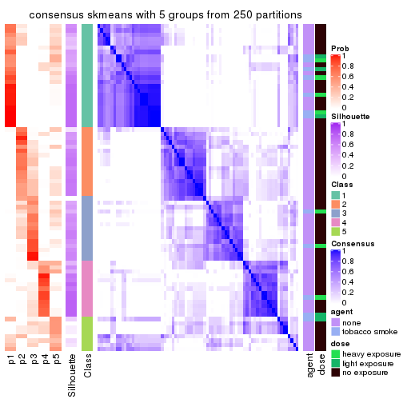</p>

</div>
<div id='tab-CV-skmeans-consensus-heatmap-5'>
<pre><code class="r">consensus_heatmap(res, k = 6)
</code></pre>

<p>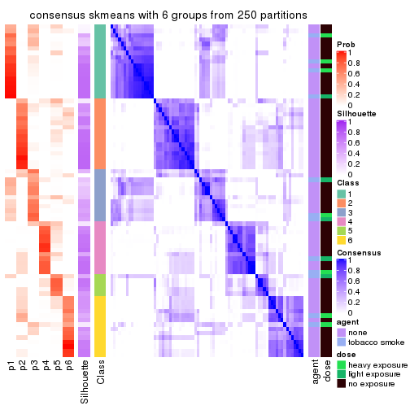</p>

</div>
</div>

Heatmaps for the membership of samples in all partitions to see how consistent they are:


<script>
$( function() {
	$( '#tabs-CV-skmeans-membership-heatmap' ).tabs();
} );
</script>
<div id='tabs-CV-skmeans-membership-heatmap'>
<ul>
<li><a href='#tab-CV-skmeans-membership-heatmap-1'>k = 2</a></li>
<li><a href='#tab-CV-skmeans-membership-heatmap-2'>k = 3</a></li>
<li><a href='#tab-CV-skmeans-membership-heatmap-3'>k = 4</a></li>
<li><a href='#tab-CV-skmeans-membership-heatmap-4'>k = 5</a></li>
<li><a href='#tab-CV-skmeans-membership-heatmap-5'>k = 6</a></li>
</ul>
<div id='tab-CV-skmeans-membership-heatmap-1'>
<pre><code class="r">membership_heatmap(res, k = 2)
</code></pre>

<p>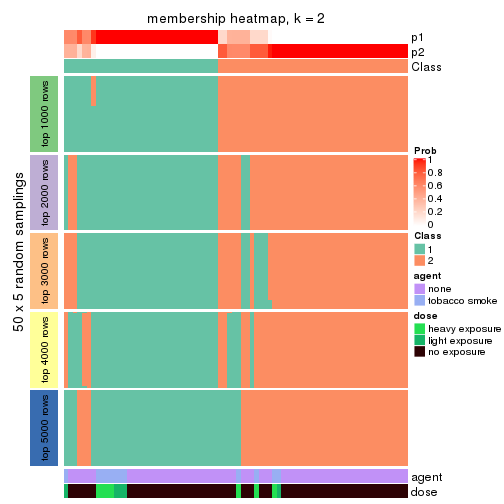</p>

</div>
<div id='tab-CV-skmeans-membership-heatmap-2'>
<pre><code class="r">membership_heatmap(res, k = 3)
</code></pre>

<p>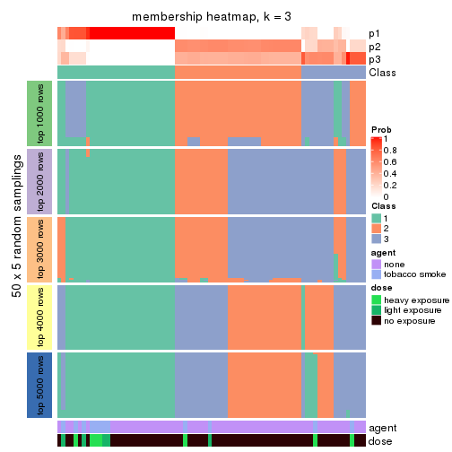</p>

</div>
<div id='tab-CV-skmeans-membership-heatmap-3'>
<pre><code class="r">membership_heatmap(res, k = 4)
</code></pre>

<p>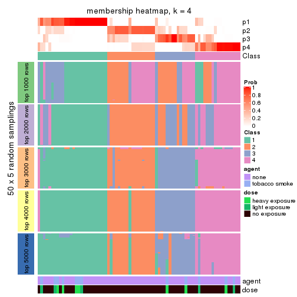</p>

</div>
<div id='tab-CV-skmeans-membership-heatmap-4'>
<pre><code class="r">membership_heatmap(res, k = 5)
</code></pre>

<p>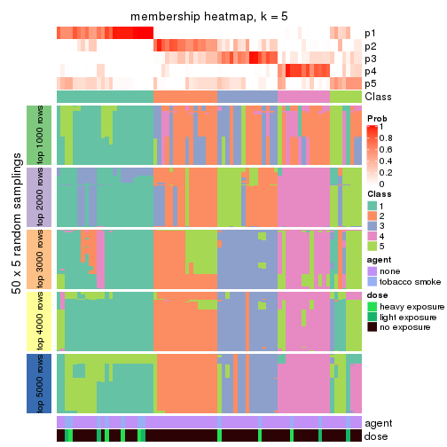</p>

</div>
<div id='tab-CV-skmeans-membership-heatmap-5'>
<pre><code class="r">membership_heatmap(res, k = 6)
</code></pre>

<p>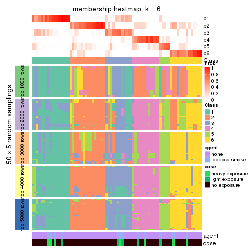</p>

</div>
</div>

As soon as we have had the classes for columns, we can look for signatures
which are significantly different between classes which can be candidate marks
for certain classes. Following are the heatmaps for signatures.


Signature heatmaps where rows are scaled:


<script>
$( function() {
	$( '#tabs-CV-skmeans-get-signatures' ).tabs();
} );
</script>
<div id='tabs-CV-skmeans-get-signatures'>
<ul>
<li><a href='#tab-CV-skmeans-get-signatures-1'>k = 2</a></li>
<li><a href='#tab-CV-skmeans-get-signatures-2'>k = 3</a></li>
<li><a href='#tab-CV-skmeans-get-signatures-3'>k = 4</a></li>
<li><a href='#tab-CV-skmeans-get-signatures-4'>k = 5</a></li>
<li><a href='#tab-CV-skmeans-get-signatures-5'>k = 6</a></li>
</ul>
<div id='tab-CV-skmeans-get-signatures-1'>
<pre><code class="r">get_signatures(res, k = 2)
</code></pre>

<p>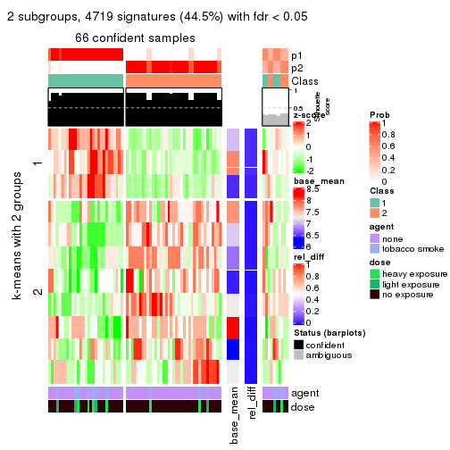</p>

</div>
<div id='tab-CV-skmeans-get-signatures-2'>
<pre><code class="r">get_signatures(res, k = 3)
</code></pre>

<p></p>

</div>
<div id='tab-CV-skmeans-get-signatures-3'>
<pre><code class="r">get_signatures(res, k = 4)
</code></pre>

<p>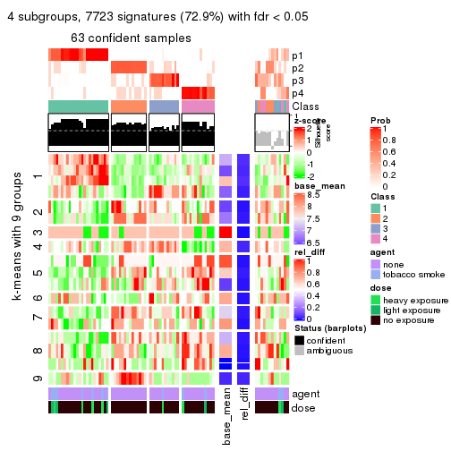</p>

</div>
<div id='tab-CV-skmeans-get-signatures-4'>
<pre><code class="r">get_signatures(res, k = 5)
</code></pre>

<p>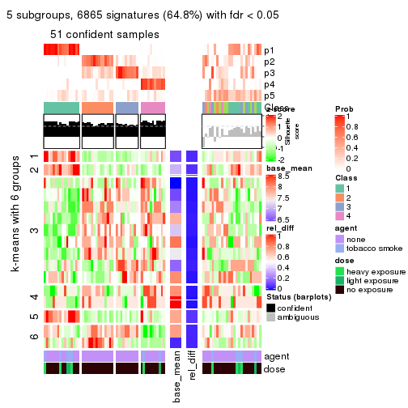</p>

</div>
<div id='tab-CV-skmeans-get-signatures-5'>
<pre><code class="r">get_signatures(res, k = 6)
</code></pre>

<p>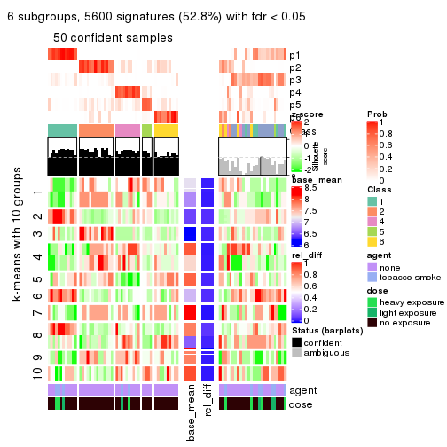</p>

</div>
</div>


Signature heatmaps where rows are not scaled:


<script>
$( function() {
	$( '#tabs-CV-skmeans-get-signatures-no-scale' ).tabs();
} );
</script>
<div id='tabs-CV-skmeans-get-signatures-no-scale'>
<ul>
<li><a href='#tab-CV-skmeans-get-signatures-no-scale-1'>k = 2</a></li>
<li><a href='#tab-CV-skmeans-get-signatures-no-scale-2'>k = 3</a></li>
<li><a href='#tab-CV-skmeans-get-signatures-no-scale-3'>k = 4</a></li>
<li><a href='#tab-CV-skmeans-get-signatures-no-scale-4'>k = 5</a></li>
<li><a href='#tab-CV-skmeans-get-signatures-no-scale-5'>k = 6</a></li>
</ul>
<div id='tab-CV-skmeans-get-signatures-no-scale-1'>
<pre><code class="r">get_signatures(res, k = 2, scale_rows = FALSE)
</code></pre>

<p>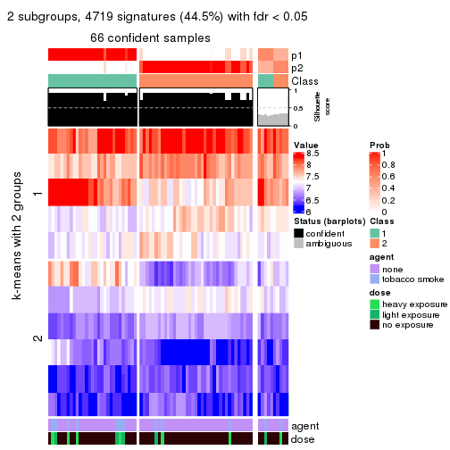</p>

</div>
<div id='tab-CV-skmeans-get-signatures-no-scale-2'>
<pre><code class="r">get_signatures(res, k = 3, scale_rows = FALSE)
</code></pre>

<p></p>

</div>
<div id='tab-CV-skmeans-get-signatures-no-scale-3'>
<pre><code class="r">get_signatures(res, k = 4, scale_rows = FALSE)
</code></pre>

<p>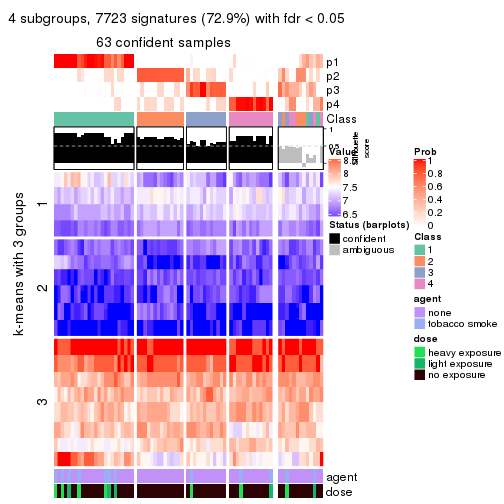</p>

</div>
<div id='tab-CV-skmeans-get-signatures-no-scale-4'>
<pre><code class="r">get_signatures(res, k = 5, scale_rows = FALSE)
</code></pre>

<p>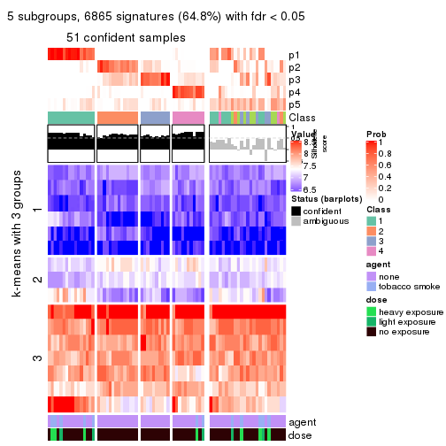</p>

</div>
<div id='tab-CV-skmeans-get-signatures-no-scale-5'>
<pre><code class="r">get_signatures(res, k = 6, scale_rows = FALSE)
</code></pre>

<p>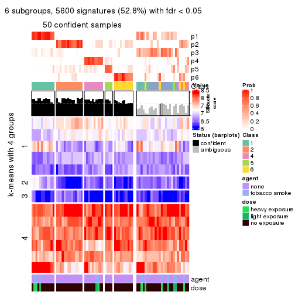</p>

</div>
</div>


Compare the overlap of signatures from different k:

```r
compare_signatures(res)
```

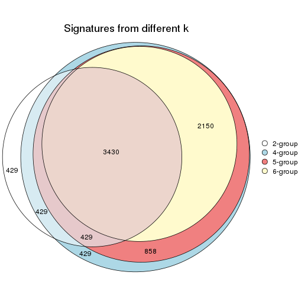

`get_signature()` returns a data frame invisibly. TO get the list of signatures, the function
call should be assigned to a variable explicitly. In following code, if `plot` argument is set
to `FALSE`, no heatmap is plotted while only the differential analysis is performed.

```r
# code only for demonstration
tb = get_signature(res, k = ..., plot = FALSE)
```

An example of the output of `tb` is:

```
#>   which_row         fdr    mean_1    mean_2 scaled_mean_1 scaled_mean_2 km
#> 1        38 0.042760348  8.373488  9.131774    -0.5533452     0.5164555  1
#> 2        40 0.018707592  7.106213  8.469186    -0.6173731     0.5762149  1
#> 3        55 0.019134737 10.221463 11.207825    -0.6159697     0.5749050  1
#> 4        59 0.006059896  5.921854  7.869574    -0.6899429     0.6439467  1
#> 5        60 0.018055526  8.928898 10.211722    -0.6204761     0.5791110  1
#> 6        98 0.009384629 15.714769 14.887706     0.6635654    -0.6193277  2
...
```

The columns in `tb` are:

1. `which_row`: row indices corresponding to the input matrix.
2. `fdr`: FDR for the differential test. 
3. `mean_x`: The mean value in group x.
4. `scaled_mean_x`: The mean value in group x after rows are scaled.
5. `km`: Row groups if k-means clustering is applied to rows.


UMAP plot which shows how samples are separated.


<script>
$( function() {
	$( '#tabs-CV-skmeans-dimension-reduction' ).tabs();
} );
</script>
<div id='tabs-CV-skmeans-dimension-reduction'>
<ul>
<li><a href='#tab-CV-skmeans-dimension-reduction-1'>k = 2</a></li>
<li><a href='#tab-CV-skmeans-dimension-reduction-2'>k = 3</a></li>
<li><a href='#tab-CV-skmeans-dimension-reduction-3'>k = 4</a></li>
<li><a href='#tab-CV-skmeans-dimension-reduction-4'>k = 5</a></li>
<li><a href='#tab-CV-skmeans-dimension-reduction-5'>k = 6</a></li>
</ul>
<div id='tab-CV-skmeans-dimension-reduction-1'>
<pre><code class="r">dimension_reduction(res, k = 2, method = &quot;UMAP&quot;)
</code></pre>

<p>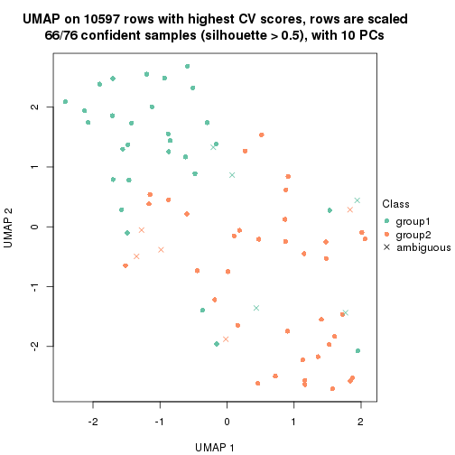</p>

</div>
<div id='tab-CV-skmeans-dimension-reduction-2'>
<pre><code class="r">dimension_reduction(res, k = 3, method = &quot;UMAP&quot;)
</code></pre>

<p>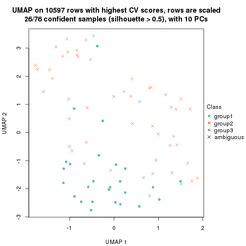</p>

</div>
<div id='tab-CV-skmeans-dimension-reduction-3'>
<pre><code class="r">dimension_reduction(res, k = 4, method = &quot;UMAP&quot;)
</code></pre>

<p>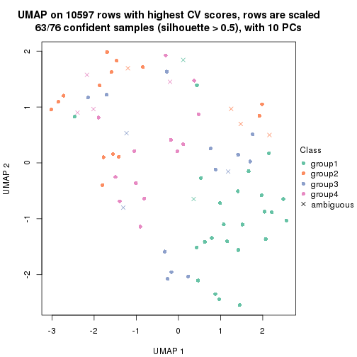</p>

</div>
<div id='tab-CV-skmeans-dimension-reduction-4'>
<pre><code class="r">dimension_reduction(res, k = 5, method = &quot;UMAP&quot;)
</code></pre>

<p>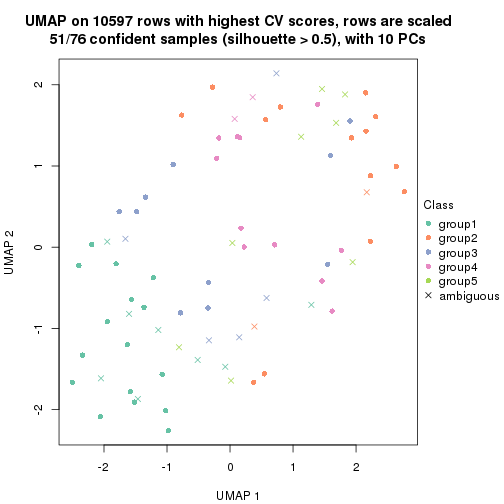</p>

</div>
<div id='tab-CV-skmeans-dimension-reduction-5'>
<pre><code class="r">dimension_reduction(res, k = 6, method = &quot;UMAP&quot;)
</code></pre>

<p>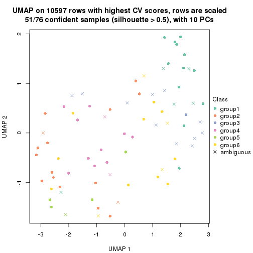</p>

</div>
</div>


Following heatmap shows how subgroups are split when increasing `k`:

```r
collect_classes(res)
```

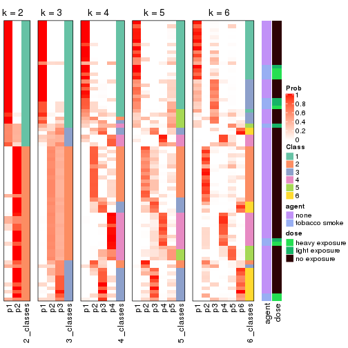


Test correlation between subgroups and known annotations. If the known
annotation is numeric, one-way ANOVA test is applied, and if the known
annotation is discrete, chi-squared contingency table test is applied.

```r
test_to_known_factors(res)
```

```
#>             n agent(p) dose(p) k
#> CV:skmeans 66   0.1452  0.1904 2
#> CV:skmeans 26       NA      NA 3
#> CV:skmeans 63   0.0966  0.3392 4
#> CV:skmeans 51   0.0430  0.2207 5
#> CV:skmeans 51   0.0162  0.0458 6
```


If matrix rows can be associated to genes, consider to use `GO_Enrichment(res,
...)` to perform function enrichment for the signature genes.


 

---------------------------------------------------


### CV:pam


The object with results only for a single top-value method and a single partition method 
can be extracted as:

```r
res = res_list["CV", "pam"]
# you can also extract it by
# res = res_list["CV:pam"]
```

A summary of `res` and all the functions that can be applied to it:

```r
res
```

```
#> A 'ConsensusPartition' object with k = 2, 3, 4, 5, 6.
#>   On a matrix with 10597 rows and 76 columns.
#>   Top rows (1000, 2000, 3000, 4000, 5000) are extracted by 'CV' method.
#>   Subgroups are detected by 'pam' method.
#>   Performed in total 1250 partitions by row resampling.
#>   Best k for subgroups seems to be 2.
#> 
#> Following methods can be applied to this 'ConsensusPartition' object:
#>  [1] "cola_report"             "collect_classes"         "collect_plots"          
#>  [4] "collect_stats"           "colnames"                "compare_signatures"     
#>  [7] "consensus_heatmap"       "dimension_reduction"     "functional_enrichment"  
#> [10] "get_anno_col"            "get_anno"                "get_classes"            
#> [13] "get_consensus"           "get_matrix"              "get_membership"         
#> [16] "get_param"               "get_signatures"          "get_stats"              
#> [19] "is_best_k"               "is_stable_k"             "membership_heatmap"     
#> [22] "ncol"                    "nrow"                    "plot_ecdf"              
#> [25] "rownames"                "select_partition_number" "show"                   
#> [28] "suggest_best_k"          "test_to_known_factors"
```

`collect_plots()` function collects all the plots made from `res` for all `k` (number of partitions)
into one single page to provide an easy and fast comparison between different `k`.

```r
collect_plots(res)
```

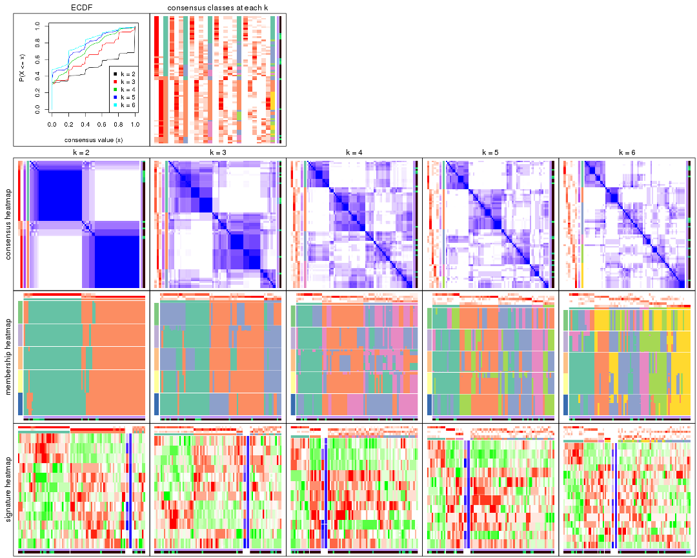

The plots are:

- The first row: a plot of the ECDF (Empirical cumulative distribution
  function) curves of the consensus matrix for each `k` and the heatmap of
  predicted classes for each `k`.
- The second row: heatmaps of the consensus matrix for each `k`.
- The third row: heatmaps of the membership matrix for each `k`.
- The fouth row: heatmaps of the signatures for each `k`.

All the plots in panels can be made by individual functions and they are
plotted later in this section.

`select_partition_number()` produces several plots showing different
statistics for choosing "optimized" `k`. There are following statistics:

- ECDF curves of the consensus matrix for each `k`;
- 1-PAC. [The PAC
  score](https://en.wikipedia.org/wiki/Consensus_clustering#Over-interpretation_potential_of_consensus_clustering)
  measures the proportion of the ambiguous subgrouping.
- Mean silhouette score.
- Concordance. The mean probability of fiting the consensus class ids in all
  partitions.
- Area increased. Denote $A_k$ as the area under the ECDF curve for current
  `k`, the area increased is defined as $A_k - A_{k-1}$.
- Rand index. The percent of pairs of samples that are both in a same cluster
  or both are not in a same cluster in the partition of k and k-1.
- Jaccard index. The ratio of pairs of samples are both in a same cluster in
  the partition of k and k-1 and the pairs of samples are both in a same
  cluster in the partition k or k-1.

The detailed explanations of these statistics can be found in [the cola
vignette](http://bioconductor.org/packages/devel/bioc/vignettes/cola/inst/doc/cola.html#toc_13).

Generally speaking, lower PAC score, higher mean silhouette score or higher
concordance corresponds to better partition. Rand index and Jaccard index
measure how similar the current partition is compared to partition with `k-1`.
If they are too similar, we won't accept `k` is better than `k-1`.

```r
select_partition_number(res)
```

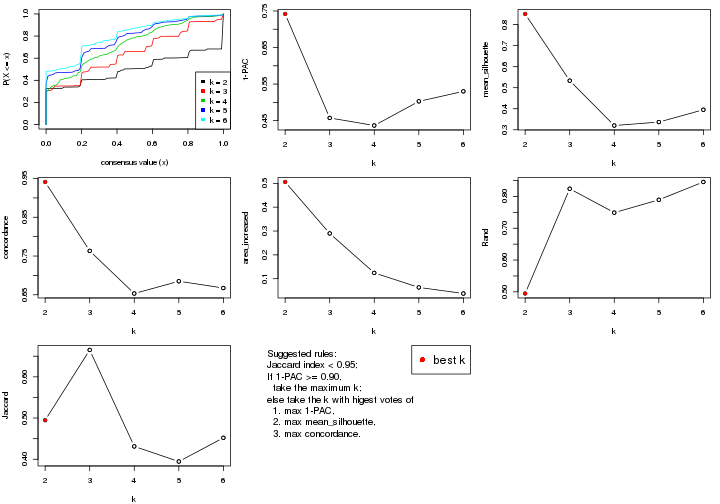

The numeric values for all these statistics can be obtained by `get_stats()`.

```r
get_stats(res)
```

```
#>   k 1-PAC mean_silhouette concordance area_increased  Rand Jaccard
#> 2 2 0.742           0.851       0.941         0.5058 0.495   0.495
#> 3 3 0.457           0.533       0.763         0.2898 0.824   0.665
#> 4 4 0.437           0.320       0.653         0.1243 0.749   0.431
#> 5 5 0.503           0.337       0.685         0.0635 0.789   0.395
#> 6 6 0.530           0.395       0.667         0.0379 0.846   0.452
```

`suggest_best_k()` suggests the best $k$ based on these statistics. The rules are as follows:

- All $k$ with Jaccard index larger than 0.95 are removed because the increase of
  the partition number does not provides enough extra information. If all $k$ are removed,
  the best $k$ is assigned by `NA`.
- For $k$ with 1-PAC larger than 0.9, the maximal $k$ is taken as the "best k". Other $k$ is called "optional k".
- If it does not fit the second rule. The $k$ with the highest vote of highest
  1-PAC, mean silhouette and concordance is taken as the "best k".

```r
suggest_best_k(res)
```

```
#> [1] 2
```


Following shows the table of the partitions (You need to click the **show/hide
code output** link to see it). The membership matrix (columns with name `p*`)
is inferred by
[`clue::cl_consensus()`](https://www.rdocumentation.org/link/cl_consensus?package=clue)
function with the `SE` method. Basically the value in the membership matrix
represents the probability to belong to a certain group. The finall class
label for an item is determined with the group with highest probability it
belongs to.

In `get_classes()` function, the entropy is calculated from the membership
matrix and the silhouette score is calculated from the consensus matrix.


<script>
$( function() {
	$( '#tabs-CV-pam-get-classes' ).tabs();
} );
</script>
<div id='tabs-CV-pam-get-classes'>
<ul>
<li><a href='#tab-CV-pam-get-classes-1'>k = 2</a></li>
<li><a href='#tab-CV-pam-get-classes-2'>k = 3</a></li>
<li><a href='#tab-CV-pam-get-classes-3'>k = 4</a></li>
<li><a href='#tab-CV-pam-get-classes-4'>k = 5</a></li>
<li><a href='#tab-CV-pam-get-classes-5'>k = 6</a></li>
</ul>

<div id='tab-CV-pam-get-classes-1'>
<p><a id='tab-CV-pam-get-classes-1-a' style='color:#0366d6' href='#'>show/hide code output</a></p>
<pre><code class="r">cbind(get_classes(res, k = 2), get_membership(res, k = 2))
</code></pre>

<pre><code>#&gt;           class entropy silhouette    p1    p2
#&gt; GSM451162     2   0.722      0.718 0.200 0.800
#&gt; GSM451163     2   0.000      0.920 0.000 1.000
#&gt; GSM451164     2   0.000      0.920 0.000 1.000
#&gt; GSM451165     2   0.000      0.920 0.000 1.000
#&gt; GSM451167     2   0.000      0.920 0.000 1.000
#&gt; GSM451168     2   0.000      0.920 0.000 1.000
#&gt; GSM451169     2   0.689      0.740 0.184 0.816
#&gt; GSM451170     1   0.000      0.946 1.000 0.000
#&gt; GSM451171     2   0.000      0.920 0.000 1.000
#&gt; GSM451172     2   0.000      0.920 0.000 1.000
#&gt; GSM451173     1   0.000      0.946 1.000 0.000
#&gt; GSM451174     2   0.000      0.920 0.000 1.000
#&gt; GSM451175     1   0.000      0.946 1.000 0.000
#&gt; GSM451177     2   0.000      0.920 0.000 1.000
#&gt; GSM451178     2   0.000      0.920 0.000 1.000
#&gt; GSM451179     1   0.000      0.946 1.000 0.000
#&gt; GSM451180     2   0.000      0.920 0.000 1.000
#&gt; GSM451181     2   0.000      0.920 0.000 1.000
#&gt; GSM451182     1   0.000      0.946 1.000 0.000
#&gt; GSM451183     1   0.000      0.946 1.000 0.000
#&gt; GSM451184     1   0.000      0.946 1.000 0.000
#&gt; GSM451185     1   0.000      0.946 1.000 0.000
#&gt; GSM451186     1   0.000      0.946 1.000 0.000
#&gt; GSM451187     2   0.000      0.920 0.000 1.000
#&gt; GSM451188     2   0.000      0.920 0.000 1.000
#&gt; GSM451189     1   0.000      0.946 1.000 0.000
#&gt; GSM451190     1   0.000      0.946 1.000 0.000
#&gt; GSM451191     1   0.000      0.946 1.000 0.000
#&gt; GSM451193     2   0.971      0.347 0.400 0.600
#&gt; GSM451195     1   0.000      0.946 1.000 0.000
#&gt; GSM451196     1   0.000      0.946 1.000 0.000
#&gt; GSM451197     1   0.000      0.946 1.000 0.000
#&gt; GSM451199     1   0.000      0.946 1.000 0.000
#&gt; GSM451201     1   0.000      0.946 1.000 0.000
#&gt; GSM451202     2   0.000      0.920 0.000 1.000
#&gt; GSM451203     1   0.000      0.946 1.000 0.000
#&gt; GSM451204     2   0.971      0.328 0.400 0.600
#&gt; GSM451205     2   0.000      0.920 0.000 1.000
#&gt; GSM451206     2   0.000      0.920 0.000 1.000
#&gt; GSM451207     2   0.000      0.920 0.000 1.000
#&gt; GSM451208     2   0.000      0.920 0.000 1.000
#&gt; GSM451209     1   0.722      0.712 0.800 0.200
#&gt; GSM451210     2   0.000      0.920 0.000 1.000
#&gt; GSM451212     2   0.000      0.920 0.000 1.000
#&gt; GSM451213     2   0.000      0.920 0.000 1.000
#&gt; GSM451214     2   0.000      0.920 0.000 1.000
#&gt; GSM451215     2   0.000      0.920 0.000 1.000
#&gt; GSM451216     2   0.000      0.920 0.000 1.000
#&gt; GSM451217     2   0.000      0.920 0.000 1.000
#&gt; GSM451219     1   0.000      0.946 1.000 0.000
#&gt; GSM451220     1   0.000      0.946 1.000 0.000
#&gt; GSM451221     1   0.000      0.946 1.000 0.000
#&gt; GSM451222     1   0.000      0.946 1.000 0.000
#&gt; GSM451224     2   0.000      0.920 0.000 1.000
#&gt; GSM451225     1   0.443      0.857 0.908 0.092
#&gt; GSM451226     1   0.971      0.283 0.600 0.400
#&gt; GSM451227     2   0.000      0.920 0.000 1.000
#&gt; GSM451228     2   0.722      0.720 0.200 0.800
#&gt; GSM451230     1   0.000      0.946 1.000 0.000
#&gt; GSM451231     1   0.722      0.715 0.800 0.200
#&gt; GSM451233     1   0.925      0.472 0.660 0.340
#&gt; GSM451234     2   0.971      0.333 0.400 0.600
#&gt; GSM451235     2   0.722      0.718 0.200 0.800
#&gt; GSM451236     2   0.000      0.920 0.000 1.000
#&gt; GSM451166     1   0.990      0.165 0.560 0.440
#&gt; GSM451194     1   0.000      0.946 1.000 0.000
#&gt; GSM451198     1   0.000      0.946 1.000 0.000
#&gt; GSM451218     2   0.000      0.920 0.000 1.000
#&gt; GSM451232     1   0.000      0.946 1.000 0.000
#&gt; GSM451176     1   0.000      0.946 1.000 0.000
#&gt; GSM451192     1   0.000      0.946 1.000 0.000
#&gt; GSM451200     1   0.000      0.946 1.000 0.000
#&gt; GSM451211     2   0.000      0.920 0.000 1.000
#&gt; GSM451223     2   0.983      0.280 0.424 0.576
#&gt; GSM451229     1   0.000      0.946 1.000 0.000
#&gt; GSM451237     2   0.971      0.333 0.400 0.600
</code></pre>

<script>
$('#tab-CV-pam-get-classes-1-a').parent().next().next().hide();
$('#tab-CV-pam-get-classes-1-a').click(function(){
  $('#tab-CV-pam-get-classes-1-a').parent().next().next().toggle();
  return(false);
});
</script>
</div>

<div id='tab-CV-pam-get-classes-2'>
<p><a id='tab-CV-pam-get-classes-2-a' style='color:#0366d6' href='#'>show/hide code output</a></p>
<pre><code class="r">cbind(get_classes(res, k = 3), get_membership(res, k = 3))
</code></pre>

<pre><code>#&gt;           class entropy silhouette    p1    p2    p3
#&gt; GSM451162     2   0.455     0.5975 0.200 0.800 0.000
#&gt; GSM451163     2   0.000     0.7386 0.000 1.000 0.000
#&gt; GSM451164     2   0.000     0.7386 0.000 1.000 0.000
#&gt; GSM451165     2   0.000     0.7386 0.000 1.000 0.000
#&gt; GSM451167     2   0.611     0.5716 0.200 0.756 0.044
#&gt; GSM451168     2   0.613     0.3958 0.000 0.600 0.400
#&gt; GSM451169     2   0.611     0.5716 0.200 0.756 0.044
#&gt; GSM451170     1   0.613     0.6025 0.600 0.000 0.400
#&gt; GSM451171     2   0.455     0.6909 0.000 0.800 0.200
#&gt; GSM451172     2   0.000     0.7386 0.000 1.000 0.000
#&gt; GSM451173     3   0.615     0.2745 0.408 0.000 0.592
#&gt; GSM451174     2   0.164     0.7259 0.000 0.956 0.044
#&gt; GSM451175     1   0.000     0.5818 1.000 0.000 0.000
#&gt; GSM451177     2   0.455     0.6909 0.000 0.800 0.200
#&gt; GSM451178     2   0.164     0.7259 0.000 0.956 0.044
#&gt; GSM451179     1   0.506     0.5439 0.756 0.000 0.244
#&gt; GSM451180     2   0.000     0.7386 0.000 1.000 0.000
#&gt; GSM451181     2   0.164     0.7259 0.000 0.956 0.044
#&gt; GSM451182     1   0.613     0.6025 0.600 0.000 0.400
#&gt; GSM451183     1   0.455     0.6220 0.800 0.000 0.200
#&gt; GSM451184     1   0.589     0.5575 0.764 0.036 0.200
#&gt; GSM451185     1   0.455     0.6220 0.800 0.000 0.200
#&gt; GSM451186     3   0.497     0.1251 0.236 0.000 0.764
#&gt; GSM451187     2   0.000     0.7386 0.000 1.000 0.000
#&gt; GSM451188     2   0.455     0.6909 0.000 0.800 0.200
#&gt; GSM451189     1   0.455     0.6220 0.800 0.000 0.200
#&gt; GSM451190     1   0.455     0.6220 0.800 0.000 0.200
#&gt; GSM451191     1   0.613     0.6025 0.600 0.000 0.400
#&gt; GSM451193     1   0.755     0.1001 0.560 0.396 0.044
#&gt; GSM451195     1   0.497     0.5522 0.764 0.000 0.236
#&gt; GSM451196     1   0.455     0.6220 0.800 0.000 0.200
#&gt; GSM451197     1   0.613     0.6025 0.600 0.000 0.400
#&gt; GSM451199     1   0.455     0.5799 0.800 0.000 0.200
#&gt; GSM451201     1   0.613     0.6025 0.600 0.000 0.400
#&gt; GSM451202     2   0.455     0.6909 0.000 0.800 0.200
#&gt; GSM451203     1   0.164     0.5535 0.956 0.000 0.044
#&gt; GSM451204     3   0.613     0.4522 0.000 0.400 0.600
#&gt; GSM451205     2   0.455     0.6909 0.000 0.800 0.200
#&gt; GSM451206     2   0.153     0.7275 0.000 0.960 0.040
#&gt; GSM451207     2   0.865     0.2761 0.200 0.600 0.200
#&gt; GSM451208     2   0.455     0.6909 0.000 0.800 0.200
#&gt; GSM451209     3   0.613     0.2864 0.400 0.000 0.600
#&gt; GSM451210     2   0.455     0.6909 0.000 0.800 0.200
#&gt; GSM451212     2   0.960    -0.0234 0.400 0.400 0.200
#&gt; GSM451213     2   0.611     0.5412 0.200 0.756 0.044
#&gt; GSM451214     2   0.455     0.5975 0.200 0.800 0.000
#&gt; GSM451215     2   0.455     0.6909 0.000 0.800 0.200
#&gt; GSM451216     2   0.865     0.2761 0.200 0.600 0.200
#&gt; GSM451217     2   0.000     0.7386 0.000 1.000 0.000
#&gt; GSM451219     1   0.613     0.6025 0.600 0.000 0.400
#&gt; GSM451220     1   0.497     0.5522 0.764 0.000 0.236
#&gt; GSM451221     1   0.455     0.5799 0.800 0.000 0.200
#&gt; GSM451222     1   0.455     0.3236 0.800 0.000 0.200
#&gt; GSM451224     2   0.455     0.6909 0.000 0.800 0.200
#&gt; GSM451225     3   0.164     0.4779 0.044 0.000 0.956
#&gt; GSM451226     1   0.982    -0.0659 0.400 0.356 0.244
#&gt; GSM451227     2   0.865     0.5172 0.200 0.600 0.200
#&gt; GSM451228     2   0.756     0.3025 0.400 0.556 0.044
#&gt; GSM451230     3   0.455     0.5519 0.200 0.000 0.800
#&gt; GSM451231     3   0.615     0.4440 0.408 0.000 0.592
#&gt; GSM451233     3   0.455     0.5814 0.000 0.200 0.800
#&gt; GSM451234     3   0.455     0.5814 0.000 0.200 0.800
#&gt; GSM451235     3   0.613     0.4522 0.000 0.400 0.600
#&gt; GSM451236     2   0.613     0.4809 0.000 0.600 0.400
#&gt; GSM451166     1   0.756    -0.0608 0.556 0.400 0.044
#&gt; GSM451194     1   0.613     0.2339 0.600 0.000 0.400
#&gt; GSM451198     1   0.489     0.5597 0.772 0.000 0.228
#&gt; GSM451218     2   0.613     0.1338 0.000 0.600 0.400
#&gt; GSM451232     1   0.455     0.6220 0.800 0.000 0.200
#&gt; GSM451176     1   0.455     0.6220 0.800 0.000 0.200
#&gt; GSM451192     1   0.455     0.6220 0.800 0.000 0.200
#&gt; GSM451200     1   0.455     0.5799 0.800 0.000 0.200
#&gt; GSM451211     2   0.000     0.7386 0.000 1.000 0.000
#&gt; GSM451223     1   0.756     0.0812 0.556 0.400 0.044
#&gt; GSM451229     1   0.455     0.6220 0.800 0.000 0.200
#&gt; GSM451237     3   0.455     0.5814 0.000 0.200 0.800
</code></pre>

<script>
$('#tab-CV-pam-get-classes-2-a').parent().next().next().hide();
$('#tab-CV-pam-get-classes-2-a').click(function(){
  $('#tab-CV-pam-get-classes-2-a').parent().next().next().toggle();
  return(false);
});
</script>
</div>

<div id='tab-CV-pam-get-classes-3'>
<p><a id='tab-CV-pam-get-classes-3-a' style='color:#0366d6' href='#'>show/hide code output</a></p>
<pre><code class="r">cbind(get_classes(res, k = 4), get_membership(res, k = 4))
</code></pre>

<pre><code>#&gt;           class entropy silhouette    p1    p2    p3    p4
#&gt; GSM451162     4   0.761     0.1072 0.000 0.384 0.200 0.416
#&gt; GSM451163     4   0.745     0.0485 0.000 0.412 0.172 0.416
#&gt; GSM451164     2   0.659     0.4883 0.000 0.628 0.156 0.216
#&gt; GSM451165     2   0.678     0.4801 0.000 0.608 0.176 0.216
#&gt; GSM451167     4   0.761     0.1072 0.000 0.384 0.200 0.416
#&gt; GSM451168     2   0.507     0.3894 0.000 0.664 0.320 0.016
#&gt; GSM451169     4   0.772     0.1132 0.000 0.356 0.228 0.416
#&gt; GSM451170     1   0.492     0.3852 0.576 0.000 0.424 0.000
#&gt; GSM451171     2   0.000     0.5534 0.000 1.000 0.000 0.000
#&gt; GSM451172     2   0.490     0.2260 0.000 0.584 0.000 0.416
#&gt; GSM451173     3   0.760     0.2045 0.212 0.000 0.452 0.336
#&gt; GSM451174     2   0.674     0.3156 0.000 0.612 0.172 0.216
#&gt; GSM451175     1   0.419     0.6378 0.764 0.000 0.228 0.008
#&gt; GSM451177     2   0.000     0.5534 0.000 1.000 0.000 0.000
#&gt; GSM451178     2   0.674     0.3156 0.000 0.612 0.172 0.216
#&gt; GSM451179     3   0.612     0.3543 0.172 0.000 0.680 0.148
#&gt; GSM451180     2   0.361     0.4974 0.000 0.800 0.000 0.200
#&gt; GSM451181     2   0.703     0.2618 0.000 0.576 0.196 0.228
#&gt; GSM451182     1   0.384     0.6446 0.776 0.000 0.224 0.000
#&gt; GSM451183     1   0.000     0.6860 1.000 0.000 0.000 0.000
#&gt; GSM451184     3   0.661     0.4119 0.172 0.000 0.628 0.200
#&gt; GSM451185     1   0.000     0.6860 1.000 0.000 0.000 0.000
#&gt; GSM451186     3   0.473     0.2566 0.000 0.000 0.636 0.364
#&gt; GSM451187     2   0.376     0.4944 0.000 0.784 0.000 0.216
#&gt; GSM451188     2   0.336     0.4988 0.000 0.824 0.176 0.000
#&gt; GSM451189     1   0.361     0.6568 0.800 0.000 0.200 0.000
#&gt; GSM451190     1   0.387     0.6412 0.772 0.000 0.228 0.000
#&gt; GSM451191     1   0.492     0.1369 0.572 0.000 0.428 0.000
#&gt; GSM451193     3   0.796     0.3390 0.144 0.064 0.576 0.216
#&gt; GSM451195     3   0.758     0.1286 0.284 0.000 0.480 0.236
#&gt; GSM451196     1   0.000     0.6860 1.000 0.000 0.000 0.000
#&gt; GSM451197     1   0.450     0.3695 0.684 0.000 0.316 0.000
#&gt; GSM451199     3   0.485    -0.0813 0.400 0.000 0.600 0.000
#&gt; GSM451201     1   0.376     0.5197 0.784 0.000 0.216 0.000
#&gt; GSM451202     2   0.302     0.5138 0.000 0.852 0.148 0.000
#&gt; GSM451203     3   0.652     0.1188 0.080 0.000 0.536 0.384
#&gt; GSM451204     4   0.443     0.2416 0.000 0.228 0.016 0.756
#&gt; GSM451205     2   0.000     0.5534 0.000 1.000 0.000 0.000
#&gt; GSM451206     2   0.376     0.4944 0.000 0.784 0.000 0.216
#&gt; GSM451207     4   0.758     0.3942 0.080 0.100 0.200 0.620
#&gt; GSM451208     2   0.112     0.5345 0.000 0.964 0.000 0.036
#&gt; GSM451209     4   0.494    -0.1902 0.000 0.000 0.436 0.564
#&gt; GSM451210     2   0.393     0.5020 0.000 0.808 0.176 0.016
#&gt; GSM451212     4   0.758     0.3942 0.080 0.100 0.200 0.620
#&gt; GSM451213     4   0.901     0.2014 0.080 0.300 0.200 0.420
#&gt; GSM451214     2   0.747     0.2018 0.000 0.424 0.176 0.400
#&gt; GSM451215     2   0.000     0.5534 0.000 1.000 0.000 0.000
#&gt; GSM451216     4   0.620     0.2107 0.080 0.300 0.000 0.620
#&gt; GSM451217     2   0.674     0.3156 0.000 0.612 0.172 0.216
#&gt; GSM451219     3   0.485    -0.0934 0.400 0.000 0.600 0.000
#&gt; GSM451220     3   0.771     0.3552 0.268 0.000 0.452 0.280
#&gt; GSM451221     3   0.466     0.0334 0.348 0.000 0.652 0.000
#&gt; GSM451222     1   0.760     0.1806 0.428 0.000 0.200 0.372
#&gt; GSM451224     2   0.336     0.4988 0.000 0.824 0.176 0.000
#&gt; GSM451225     3   0.798     0.0235 0.012 0.200 0.424 0.364
#&gt; GSM451226     3   0.661     0.1574 0.000 0.172 0.628 0.200
#&gt; GSM451227     2   0.665     0.2664 0.000 0.624 0.176 0.200
#&gt; GSM451228     3   0.768    -0.1619 0.000 0.384 0.400 0.216
#&gt; GSM451230     4   0.763     0.1904 0.064 0.200 0.124 0.612
#&gt; GSM451231     4   0.812     0.1792 0.080 0.200 0.148 0.572
#&gt; GSM451233     4   0.522     0.1779 0.000 0.200 0.064 0.736
#&gt; GSM451234     2   0.776    -0.1017 0.000 0.400 0.236 0.364
#&gt; GSM451235     4   0.712     0.1590 0.000 0.212 0.224 0.564
#&gt; GSM451236     2   0.494    -0.0651 0.000 0.564 0.000 0.436
#&gt; GSM451166     4   0.792     0.3854 0.080 0.100 0.248 0.572
#&gt; GSM451194     3   0.725     0.2671 0.172 0.000 0.520 0.308
#&gt; GSM451198     3   0.680     0.1233 0.452 0.000 0.452 0.096
#&gt; GSM451218     4   0.361     0.2455 0.000 0.200 0.000 0.800
#&gt; GSM451232     1   0.000     0.6860 1.000 0.000 0.000 0.000
#&gt; GSM451176     1   0.361     0.6568 0.800 0.000 0.200 0.000
#&gt; GSM451192     1   0.349     0.5524 0.812 0.000 0.188 0.000
#&gt; GSM451200     3   0.376     0.3061 0.216 0.000 0.784 0.000
#&gt; GSM451211     2   0.376     0.4944 0.000 0.784 0.000 0.216
#&gt; GSM451223     3   0.704     0.0825 0.000 0.208 0.576 0.216
#&gt; GSM451229     1   0.000     0.6860 1.000 0.000 0.000 0.000
#&gt; GSM451237     2   0.776    -0.1017 0.000 0.400 0.236 0.364
</code></pre>

<script>
$('#tab-CV-pam-get-classes-3-a').parent().next().next().hide();
$('#tab-CV-pam-get-classes-3-a').click(function(){
  $('#tab-CV-pam-get-classes-3-a').parent().next().next().toggle();
  return(false);
});
</script>
</div>

<div id='tab-CV-pam-get-classes-4'>
<p><a id='tab-CV-pam-get-classes-4-a' style='color:#0366d6' href='#'>show/hide code output</a></p>
<pre><code class="r">cbind(get_classes(res, k = 5), get_membership(res, k = 5))
</code></pre>

<pre><code>#&gt;           class entropy silhouette    p1    p2    p3    p4    p5
#&gt; GSM451162     2  0.4182     0.1895 0.000 0.600 0.400 0.000 0.000
#&gt; GSM451163     2  0.3424     0.4392 0.000 0.760 0.240 0.000 0.000
#&gt; GSM451164     2  0.3366     0.3839 0.000 0.768 0.232 0.000 0.000
#&gt; GSM451165     2  0.5990    -0.0320 0.000 0.500 0.384 0.000 0.116
#&gt; GSM451167     2  0.3109     0.4433 0.000 0.800 0.200 0.000 0.000
#&gt; GSM451168     2  0.6141     0.1693 0.000 0.560 0.196 0.000 0.244
#&gt; GSM451169     3  0.4273     0.0609 0.000 0.448 0.552 0.000 0.000
#&gt; GSM451170     1  0.5904     0.4920 0.600 0.000 0.200 0.200 0.000
#&gt; GSM451171     2  0.3715     0.4195 0.000 0.736 0.004 0.000 0.260
#&gt; GSM451172     2  0.5167     0.4130 0.000 0.684 0.200 0.000 0.116
#&gt; GSM451173     1  0.8342     0.4306 0.384 0.000 0.204 0.212 0.200
#&gt; GSM451174     2  0.0000     0.5680 0.000 1.000 0.000 0.000 0.000
#&gt; GSM451175     1  0.5904     0.4344 0.600 0.000 0.200 0.200 0.000
#&gt; GSM451177     2  0.4434     0.2922 0.000 0.536 0.004 0.000 0.460
#&gt; GSM451178     2  0.0000     0.5680 0.000 1.000 0.000 0.000 0.000
#&gt; GSM451179     3  0.4042     0.3638 0.000 0.032 0.756 0.212 0.000
#&gt; GSM451180     2  0.3715     0.4670 0.000 0.736 0.004 0.000 0.260
#&gt; GSM451181     2  0.3109     0.4847 0.000 0.800 0.000 0.000 0.200
#&gt; GSM451182     1  0.3388     0.7013 0.792 0.000 0.008 0.000 0.200
#&gt; GSM451183     1  0.3109     0.7021 0.800 0.000 0.000 0.000 0.200
#&gt; GSM451184     3  0.0000     0.4320 0.000 0.000 1.000 0.000 0.000
#&gt; GSM451185     1  0.0000     0.6880 1.000 0.000 0.000 0.000 0.000
#&gt; GSM451186     4  0.3039     0.4047 0.000 0.000 0.192 0.808 0.000
#&gt; GSM451187     2  0.0000     0.5680 0.000 1.000 0.000 0.000 0.000
#&gt; GSM451188     5  0.6552     0.3877 0.000 0.200 0.388 0.000 0.412
#&gt; GSM451189     1  0.3109     0.7021 0.800 0.000 0.000 0.000 0.200
#&gt; GSM451190     1  0.5904     0.5307 0.600 0.000 0.200 0.000 0.200
#&gt; GSM451191     3  0.5931     0.1456 0.204 0.000 0.596 0.000 0.200
#&gt; GSM451193     3  0.1478     0.4325 0.000 0.064 0.936 0.000 0.000
#&gt; GSM451195     3  0.5195    -0.0535 0.388 0.000 0.564 0.048 0.000
#&gt; GSM451196     1  0.0000     0.6880 1.000 0.000 0.000 0.000 0.000
#&gt; GSM451197     1  0.5983     0.5903 0.588 0.000 0.212 0.000 0.200
#&gt; GSM451199     1  0.6571     0.0800 0.400 0.000 0.396 0.204 0.000
#&gt; GSM451201     1  0.3109     0.5904 0.800 0.000 0.200 0.000 0.000
#&gt; GSM451202     2  0.6166     0.1655 0.000 0.552 0.188 0.000 0.260
#&gt; GSM451203     3  0.3402     0.3874 0.008 0.004 0.804 0.000 0.184
#&gt; GSM451204     2  0.6569    -0.0563 0.000 0.448 0.000 0.216 0.336
#&gt; GSM451205     2  0.4434     0.2922 0.000 0.536 0.004 0.000 0.460
#&gt; GSM451206     2  0.0000     0.5680 0.000 1.000 0.000 0.000 0.000
#&gt; GSM451207     3  0.7082     0.0932 0.008 0.248 0.400 0.004 0.340
#&gt; GSM451208     2  0.4434     0.2922 0.000 0.536 0.004 0.000 0.460
#&gt; GSM451209     4  0.3143     0.5169 0.000 0.000 0.204 0.796 0.000
#&gt; GSM451210     5  0.6570     0.3857 0.000 0.204 0.388 0.000 0.408
#&gt; GSM451212     3  0.7082     0.0932 0.008 0.248 0.400 0.004 0.340
#&gt; GSM451213     2  0.6891     0.0529 0.008 0.448 0.200 0.004 0.340
#&gt; GSM451214     3  0.5983    -0.0297 0.000 0.200 0.588 0.000 0.212
#&gt; GSM451215     2  0.4434     0.2922 0.000 0.536 0.004 0.000 0.460
#&gt; GSM451216     2  0.6815    -0.0589 0.008 0.400 0.000 0.204 0.388
#&gt; GSM451217     2  0.1197     0.5545 0.000 0.952 0.048 0.000 0.000
#&gt; GSM451219     3  0.5958     0.2532 0.208 0.000 0.592 0.200 0.000
#&gt; GSM451220     3  0.5218     0.0976 0.336 0.060 0.604 0.000 0.000
#&gt; GSM451221     3  0.5728     0.2745 0.176 0.000 0.624 0.200 0.000
#&gt; GSM451222     1  0.6519     0.3160 0.448 0.000 0.000 0.200 0.352
#&gt; GSM451224     5  0.6498     0.3591 0.000 0.200 0.340 0.000 0.460
#&gt; GSM451225     4  0.0162     0.5585 0.000 0.000 0.004 0.996 0.000
#&gt; GSM451226     3  0.0162     0.4332 0.000 0.004 0.996 0.000 0.000
#&gt; GSM451227     5  0.6554     0.1966 0.000 0.000 0.396 0.200 0.404
#&gt; GSM451228     3  0.4182     0.1663 0.000 0.400 0.600 0.000 0.000
#&gt; GSM451230     5  0.4667    -0.0904 0.008 0.048 0.004 0.200 0.740
#&gt; GSM451231     3  0.6427    -0.1396 0.008 0.000 0.548 0.244 0.200
#&gt; GSM451233     3  0.7515    -0.1876 0.000 0.048 0.388 0.212 0.352
#&gt; GSM451234     4  0.3266     0.6515 0.000 0.200 0.004 0.796 0.000
#&gt; GSM451235     4  0.3266     0.6515 0.000 0.200 0.004 0.796 0.000
#&gt; GSM451236     5  0.6255    -0.1046 0.000 0.208 0.000 0.252 0.540
#&gt; GSM451166     5  0.8682    -0.1269 0.008 0.248 0.200 0.204 0.340
#&gt; GSM451194     3  0.3210     0.3553 0.000 0.000 0.788 0.212 0.000
#&gt; GSM451198     3  0.6797    -0.3597 0.388 0.008 0.404 0.000 0.200
#&gt; GSM451218     4  0.6318     0.2355 0.000 0.400 0.000 0.444 0.156
#&gt; GSM451232     1  0.0000     0.6880 1.000 0.000 0.000 0.000 0.000
#&gt; GSM451176     1  0.2753     0.7070 0.856 0.000 0.008 0.000 0.136
#&gt; GSM451192     1  0.5819     0.6094 0.612 0.000 0.188 0.000 0.200
#&gt; GSM451200     3  0.6406    -0.0251 0.240 0.008 0.552 0.000 0.200
#&gt; GSM451211     2  0.0000     0.5680 0.000 1.000 0.000 0.000 0.000
#&gt; GSM451223     3  0.0510     0.4325 0.000 0.016 0.984 0.000 0.000
#&gt; GSM451229     1  0.0000     0.6880 1.000 0.000 0.000 0.000 0.000
#&gt; GSM451237     4  0.3266     0.6515 0.000 0.200 0.004 0.796 0.000
</code></pre>

<script>
$('#tab-CV-pam-get-classes-4-a').parent().next().next().hide();
$('#tab-CV-pam-get-classes-4-a').click(function(){
  $('#tab-CV-pam-get-classes-4-a').parent().next().next().toggle();
  return(false);
});
</script>
</div>

<div id='tab-CV-pam-get-classes-5'>
<p><a id='tab-CV-pam-get-classes-5-a' style='color:#0366d6' href='#'>show/hide code output</a></p>
<pre><code class="r">cbind(get_classes(res, k = 6), get_membership(res, k = 6))
</code></pre>

<pre><code>#&gt;           class entropy silhouette    p1    p2    p3    p4    p5    p6
#&gt; GSM451162     6   0.530    0.11686 0.000 0.000 0.200 0.000 0.200 0.600
#&gt; GSM451163     6   0.372    0.35586 0.000 0.000 0.384 0.000 0.000 0.616
#&gt; GSM451164     6   0.507    0.11403 0.000 0.080 0.396 0.000 0.000 0.524
#&gt; GSM451165     6   0.540    0.12330 0.000 0.116 0.400 0.000 0.000 0.484
#&gt; GSM451167     6   0.279    0.45662 0.000 0.000 0.200 0.000 0.000 0.800
#&gt; GSM451168     6   0.606   -0.36450 0.000 0.328 0.272 0.000 0.000 0.400
#&gt; GSM451169     6   0.376    0.18930 0.000 0.000 0.400 0.000 0.000 0.600
#&gt; GSM451170     1   0.720    0.51204 0.448 0.200 0.200 0.152 0.000 0.000
#&gt; GSM451171     2   0.376    0.68236 0.000 0.600 0.000 0.000 0.000 0.400
#&gt; GSM451172     6   0.464    0.41280 0.000 0.116 0.200 0.000 0.000 0.684
#&gt; GSM451173     1   0.589    0.38451 0.400 0.000 0.200 0.000 0.400 0.000
#&gt; GSM451174     6   0.000    0.58111 0.000 0.000 0.000 0.000 0.000 1.000
#&gt; GSM451175     1   0.500    0.51986 0.644 0.000 0.156 0.000 0.200 0.000
#&gt; GSM451177     2   0.279    0.86039 0.000 0.800 0.000 0.000 0.000 0.200
#&gt; GSM451178     6   0.000    0.58111 0.000 0.000 0.000 0.000 0.000 1.000
#&gt; GSM451179     3   0.343    0.21821 0.000 0.000 0.696 0.000 0.000 0.304
#&gt; GSM451180     2   0.350    0.72302 0.000 0.680 0.000 0.000 0.000 0.320
#&gt; GSM451181     6   0.279    0.42869 0.000 0.000 0.000 0.000 0.200 0.800
#&gt; GSM451182     1   0.496    0.62461 0.648 0.200 0.000 0.152 0.000 0.000
#&gt; GSM451183     1   0.362    0.63852 0.648 0.000 0.000 0.352 0.000 0.000
#&gt; GSM451184     3   0.279    0.41134 0.000 0.000 0.800 0.000 0.200 0.000
#&gt; GSM451185     1   0.000    0.63536 1.000 0.000 0.000 0.000 0.000 0.000
#&gt; GSM451186     4   0.737    0.44647 0.000 0.200 0.188 0.416 0.196 0.000
#&gt; GSM451187     6   0.000    0.58111 0.000 0.000 0.000 0.000 0.000 1.000
#&gt; GSM451188     2   0.530    0.61876 0.000 0.600 0.200 0.000 0.000 0.200
#&gt; GSM451189     1   0.563    0.64305 0.648 0.144 0.000 0.152 0.056 0.000
#&gt; GSM451190     1   0.643    0.43962 0.552 0.000 0.168 0.000 0.200 0.080
#&gt; GSM451191     3   0.388    0.24802 0.004 0.000 0.600 0.396 0.000 0.000
#&gt; GSM451193     3   0.376    0.11932 0.000 0.000 0.600 0.000 0.000 0.400
#&gt; GSM451195     1   0.589    0.26071 0.400 0.000 0.400 0.000 0.200 0.000
#&gt; GSM451196     1   0.000    0.63536 1.000 0.000 0.000 0.000 0.000 0.000
#&gt; GSM451197     1   0.589    0.52470 0.404 0.000 0.200 0.396 0.000 0.000
#&gt; GSM451199     3   0.722   -0.11509 0.204 0.200 0.444 0.152 0.000 0.000
#&gt; GSM451201     1   0.589    0.52470 0.404 0.000 0.200 0.396 0.000 0.000
#&gt; GSM451202     2   0.376    0.68236 0.000 0.600 0.000 0.000 0.000 0.400
#&gt; GSM451203     3   0.568    0.26375 0.000 0.000 0.520 0.000 0.200 0.280
#&gt; GSM451204     5   0.350    0.31663 0.000 0.000 0.000 0.000 0.680 0.320
#&gt; GSM451205     2   0.279    0.86039 0.000 0.800 0.000 0.000 0.000 0.200
#&gt; GSM451206     6   0.000    0.58111 0.000 0.000 0.000 0.000 0.000 1.000
#&gt; GSM451207     5   0.376    0.42147 0.000 0.000 0.400 0.000 0.600 0.000
#&gt; GSM451208     2   0.279    0.86039 0.000 0.800 0.000 0.000 0.000 0.200
#&gt; GSM451209     4   0.530    0.48373 0.000 0.000 0.200 0.600 0.200 0.000
#&gt; GSM451210     3   0.589   -0.38965 0.000 0.400 0.400 0.000 0.000 0.200
#&gt; GSM451212     5   0.376    0.42147 0.000 0.000 0.400 0.000 0.600 0.000
#&gt; GSM451213     5   0.530    0.43787 0.000 0.000 0.200 0.000 0.600 0.200
#&gt; GSM451214     3   0.530    0.07450 0.000 0.200 0.600 0.000 0.000 0.200
#&gt; GSM451215     2   0.279    0.86039 0.000 0.800 0.000 0.000 0.000 0.200
#&gt; GSM451216     5   0.279    0.36787 0.000 0.000 0.000 0.000 0.800 0.200
#&gt; GSM451217     6   0.279    0.48126 0.000 0.000 0.200 0.000 0.000 0.800
#&gt; GSM451219     3   0.645    0.33528 0.004 0.200 0.564 0.152 0.000 0.080
#&gt; GSM451220     3   0.589    0.16495 0.000 0.000 0.400 0.000 0.200 0.400
#&gt; GSM451221     3   0.496    0.31664 0.004 0.200 0.660 0.136 0.000 0.000
#&gt; GSM451222     5   0.378   -0.15182 0.412 0.000 0.000 0.000 0.588 0.000
#&gt; GSM451224     2   0.279    0.86039 0.000 0.800 0.000 0.000 0.000 0.200
#&gt; GSM451225     4   0.530    0.59255 0.000 0.200 0.000 0.600 0.200 0.000
#&gt; GSM451226     3   0.000    0.39956 0.000 0.000 1.000 0.000 0.000 0.000
#&gt; GSM451227     3   0.462    0.13151 0.000 0.348 0.600 0.000 0.000 0.052
#&gt; GSM451228     3   0.386   -0.00981 0.000 0.000 0.520 0.000 0.000 0.480
#&gt; GSM451230     5   0.256    0.31400 0.000 0.172 0.000 0.000 0.828 0.000
#&gt; GSM451231     3   0.530    0.04404 0.000 0.200 0.600 0.000 0.200 0.000
#&gt; GSM451233     5   0.589    0.16692 0.000 0.200 0.400 0.000 0.400 0.000
#&gt; GSM451234     4   0.528    0.66520 0.000 0.000 0.000 0.604 0.196 0.200
#&gt; GSM451235     4   0.528    0.66520 0.000 0.000 0.000 0.604 0.196 0.200
#&gt; GSM451236     5   0.468    0.32653 0.000 0.120 0.000 0.000 0.680 0.200
#&gt; GSM451166     5   0.376    0.42147 0.000 0.000 0.400 0.000 0.600 0.000
#&gt; GSM451194     3   0.279    0.41134 0.000 0.000 0.800 0.000 0.200 0.000
#&gt; GSM451198     3   0.589   -0.34339 0.400 0.000 0.400 0.000 0.200 0.000
#&gt; GSM451218     5   0.533    0.03315 0.000 0.000 0.000 0.204 0.596 0.200
#&gt; GSM451232     1   0.238    0.65765 0.848 0.000 0.000 0.152 0.000 0.000
#&gt; GSM451176     1   0.000    0.63536 1.000 0.000 0.000 0.000 0.000 0.000
#&gt; GSM451192     1   0.584    0.53567 0.416 0.000 0.188 0.396 0.000 0.000
#&gt; GSM451200     3   0.550    0.00982 0.236 0.000 0.564 0.000 0.200 0.000
#&gt; GSM451211     6   0.156    0.49109 0.000 0.080 0.000 0.000 0.000 0.920
#&gt; GSM451223     3   0.331    0.20960 0.000 0.000 0.720 0.000 0.000 0.280
#&gt; GSM451229     1   0.000    0.63536 1.000 0.000 0.000 0.000 0.000 0.000
#&gt; GSM451237     4   0.528    0.66520 0.000 0.000 0.000 0.604 0.196 0.200
</code></pre>

<script>
$('#tab-CV-pam-get-classes-5-a').parent().next().next().hide();
$('#tab-CV-pam-get-classes-5-a').click(function(){
  $('#tab-CV-pam-get-classes-5-a').parent().next().next().toggle();
  return(false);
});
</script>
</div>
</div>

Heatmaps for the consensus matrix. It visualizes the probability of two
samples to be in a same group.


<script>
$( function() {
	$( '#tabs-CV-pam-consensus-heatmap' ).tabs();
} );
</script>
<div id='tabs-CV-pam-consensus-heatmap'>
<ul>
<li><a href='#tab-CV-pam-consensus-heatmap-1'>k = 2</a></li>
<li><a href='#tab-CV-pam-consensus-heatmap-2'>k = 3</a></li>
<li><a href='#tab-CV-pam-consensus-heatmap-3'>k = 4</a></li>
<li><a href='#tab-CV-pam-consensus-heatmap-4'>k = 5</a></li>
<li><a href='#tab-CV-pam-consensus-heatmap-5'>k = 6</a></li>
</ul>
<div id='tab-CV-pam-consensus-heatmap-1'>
<pre><code class="r">consensus_heatmap(res, k = 2)
</code></pre>

<p>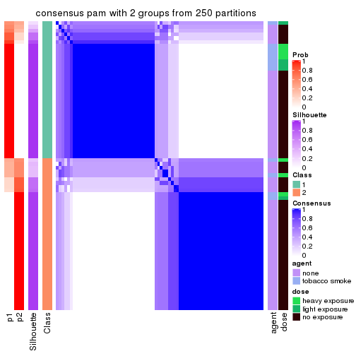</p>

</div>
<div id='tab-CV-pam-consensus-heatmap-2'>
<pre><code class="r">consensus_heatmap(res, k = 3)
</code></pre>

<p>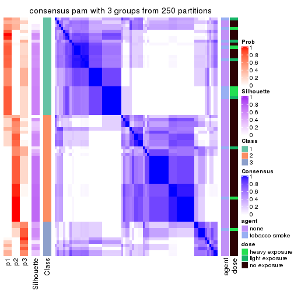</p>

</div>
<div id='tab-CV-pam-consensus-heatmap-3'>
<pre><code class="r">consensus_heatmap(res, k = 4)
</code></pre>

<p>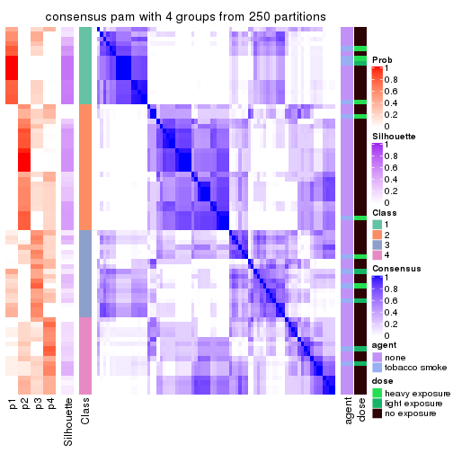</p>

</div>
<div id='tab-CV-pam-consensus-heatmap-4'>
<pre><code class="r">consensus_heatmap(res, k = 5)
</code></pre>

<p>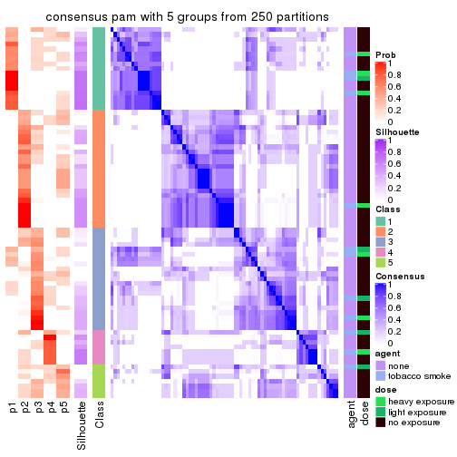</p>

</div>
<div id='tab-CV-pam-consensus-heatmap-5'>
<pre><code class="r">consensus_heatmap(res, k = 6)
</code></pre>

<p>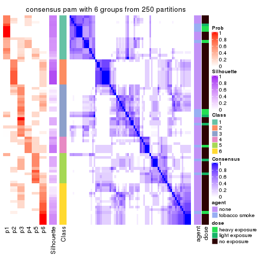</p>

</div>
</div>

Heatmaps for the membership of samples in all partitions to see how consistent they are:


<script>
$( function() {
	$( '#tabs-CV-pam-membership-heatmap' ).tabs();
} );
</script>
<div id='tabs-CV-pam-membership-heatmap'>
<ul>
<li><a href='#tab-CV-pam-membership-heatmap-1'>k = 2</a></li>
<li><a href='#tab-CV-pam-membership-heatmap-2'>k = 3</a></li>
<li><a href='#tab-CV-pam-membership-heatmap-3'>k = 4</a></li>
<li><a href='#tab-CV-pam-membership-heatmap-4'>k = 5</a></li>
<li><a href='#tab-CV-pam-membership-heatmap-5'>k = 6</a></li>
</ul>
<div id='tab-CV-pam-membership-heatmap-1'>
<pre><code class="r">membership_heatmap(res, k = 2)
</code></pre>

<p>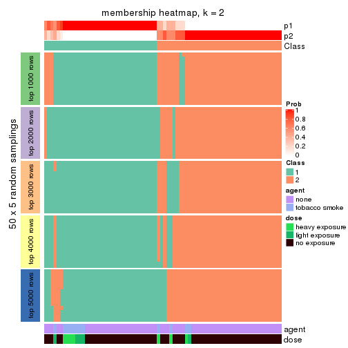</p>

</div>
<div id='tab-CV-pam-membership-heatmap-2'>
<pre><code class="r">membership_heatmap(res, k = 3)
</code></pre>

<p>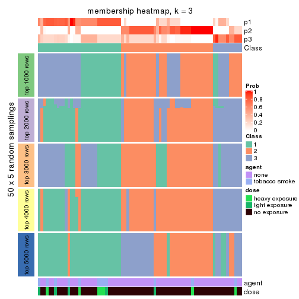</p>

</div>
<div id='tab-CV-pam-membership-heatmap-3'>
<pre><code class="r">membership_heatmap(res, k = 4)
</code></pre>

<p>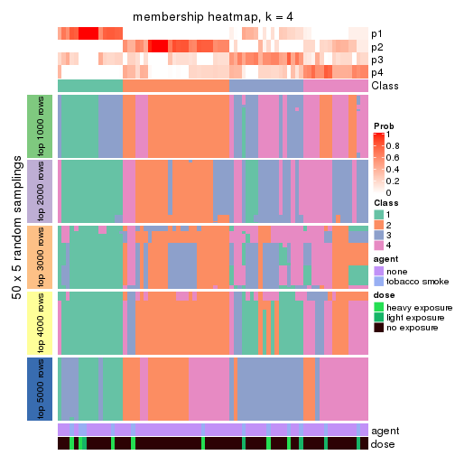</p>

</div>
<div id='tab-CV-pam-membership-heatmap-4'>
<pre><code class="r">membership_heatmap(res, k = 5)
</code></pre>

<p>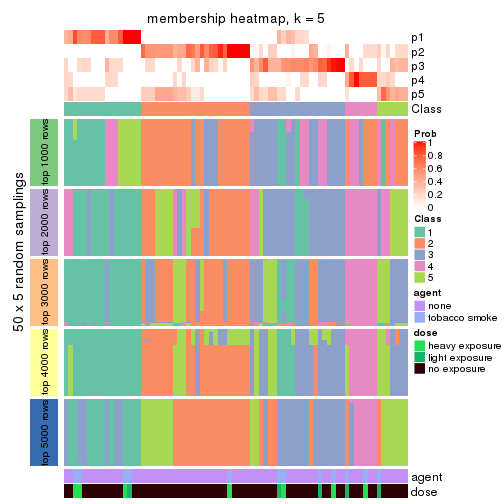</p>

</div>
<div id='tab-CV-pam-membership-heatmap-5'>
<pre><code class="r">membership_heatmap(res, k = 6)
</code></pre>

<p>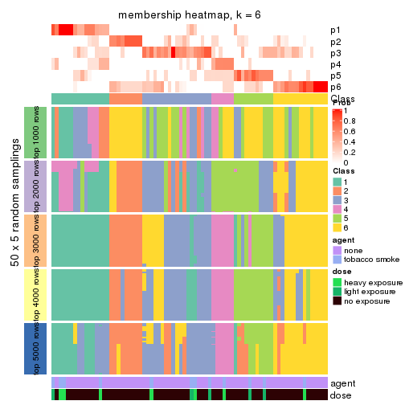</p>

</div>
</div>

As soon as we have had the classes for columns, we can look for signatures
which are significantly different between classes which can be candidate marks
for certain classes. Following are the heatmaps for signatures.


Signature heatmaps where rows are scaled:


<script>
$( function() {
	$( '#tabs-CV-pam-get-signatures' ).tabs();
} );
</script>
<div id='tabs-CV-pam-get-signatures'>
<ul>
<li><a href='#tab-CV-pam-get-signatures-1'>k = 2</a></li>
<li><a href='#tab-CV-pam-get-signatures-2'>k = 3</a></li>
<li><a href='#tab-CV-pam-get-signatures-3'>k = 4</a></li>
<li><a href='#tab-CV-pam-get-signatures-4'>k = 5</a></li>
<li><a href='#tab-CV-pam-get-signatures-5'>k = 6</a></li>
</ul>
<div id='tab-CV-pam-get-signatures-1'>
<pre><code class="r">get_signatures(res, k = 2)
</code></pre>

<p>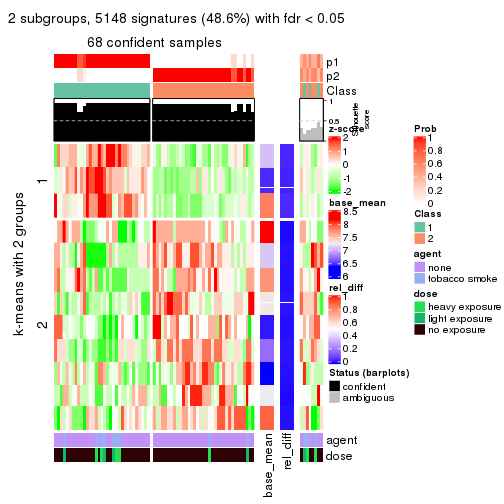</p>

</div>
<div id='tab-CV-pam-get-signatures-2'>
<pre><code class="r">get_signatures(res, k = 3)
</code></pre>

<p>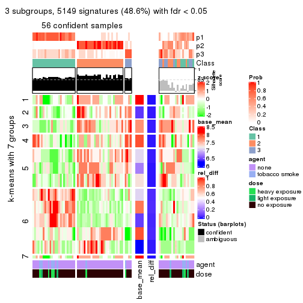</p>

</div>
<div id='tab-CV-pam-get-signatures-3'>
<pre><code class="r">get_signatures(res, k = 4)
</code></pre>

<p>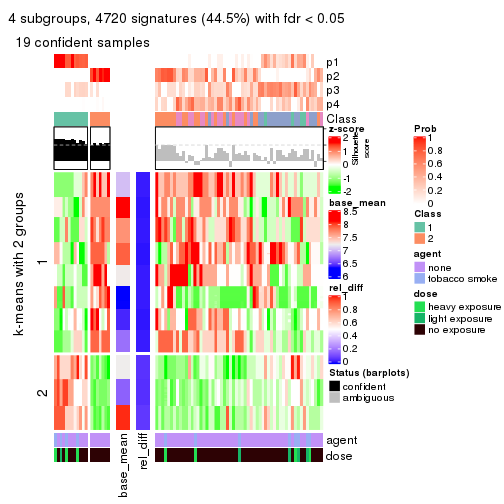</p>

</div>
<div id='tab-CV-pam-get-signatures-4'>
<pre><code class="r">get_signatures(res, k = 5)
</code></pre>

<p>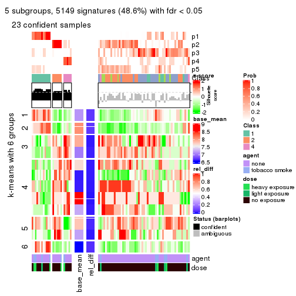</p>

</div>
<div id='tab-CV-pam-get-signatures-5'>
<pre><code class="r">get_signatures(res, k = 6)
</code></pre>

<p>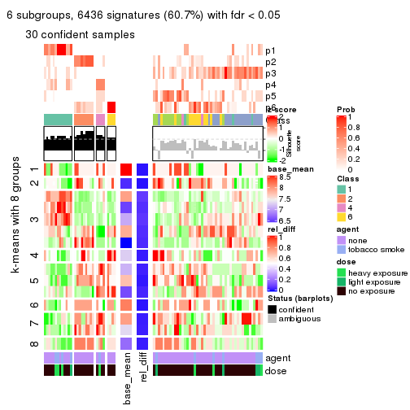</p>

</div>
</div>


Signature heatmaps where rows are not scaled:


<script>
$( function() {
	$( '#tabs-CV-pam-get-signatures-no-scale' ).tabs();
} );
</script>
<div id='tabs-CV-pam-get-signatures-no-scale'>
<ul>
<li><a href='#tab-CV-pam-get-signatures-no-scale-1'>k = 2</a></li>
<li><a href='#tab-CV-pam-get-signatures-no-scale-2'>k = 3</a></li>
<li><a href='#tab-CV-pam-get-signatures-no-scale-3'>k = 4</a></li>
<li><a href='#tab-CV-pam-get-signatures-no-scale-4'>k = 5</a></li>
<li><a href='#tab-CV-pam-get-signatures-no-scale-5'>k = 6</a></li>
</ul>
<div id='tab-CV-pam-get-signatures-no-scale-1'>
<pre><code class="r">get_signatures(res, k = 2, scale_rows = FALSE)
</code></pre>

<p>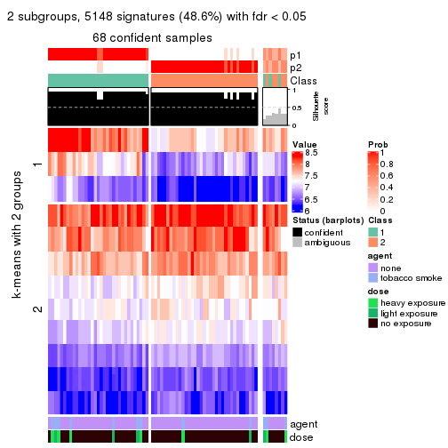</p>

</div>
<div id='tab-CV-pam-get-signatures-no-scale-2'>
<pre><code class="r">get_signatures(res, k = 3, scale_rows = FALSE)
</code></pre>

<p>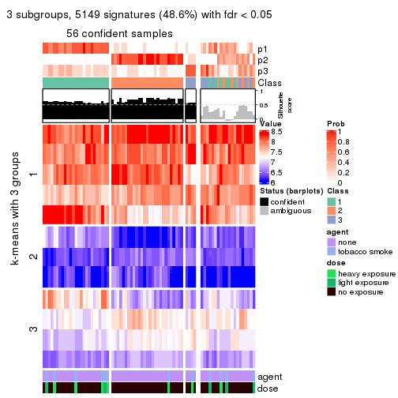</p>

</div>
<div id='tab-CV-pam-get-signatures-no-scale-3'>
<pre><code class="r">get_signatures(res, k = 4, scale_rows = FALSE)
</code></pre>

<p>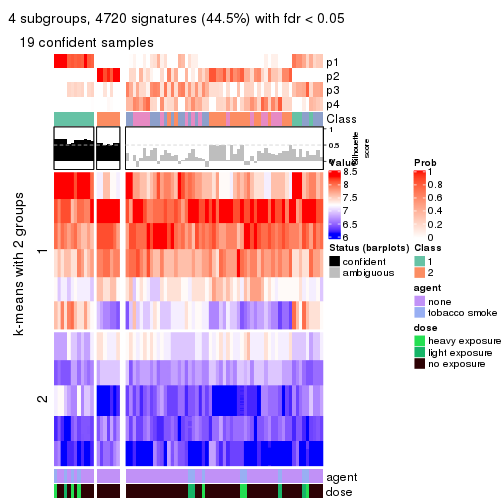</p>

</div>
<div id='tab-CV-pam-get-signatures-no-scale-4'>
<pre><code class="r">get_signatures(res, k = 5, scale_rows = FALSE)
</code></pre>

<p>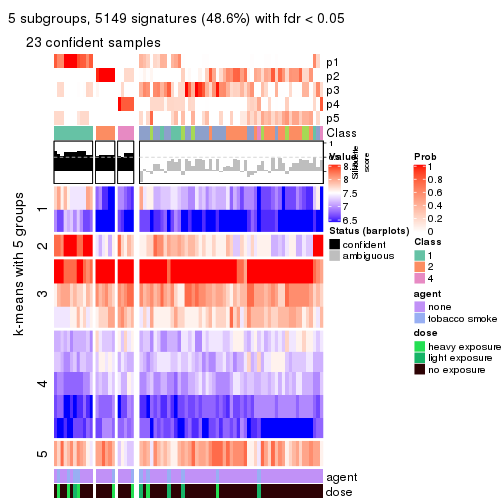</p>

</div>
<div id='tab-CV-pam-get-signatures-no-scale-5'>
<pre><code class="r">get_signatures(res, k = 6, scale_rows = FALSE)
</code></pre>

<p>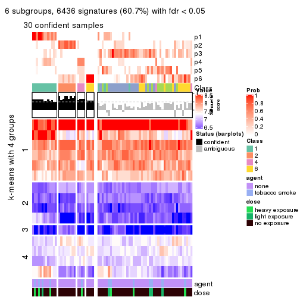</p>

</div>
</div>


Compare the overlap of signatures from different k:

```r
compare_signatures(res)
```

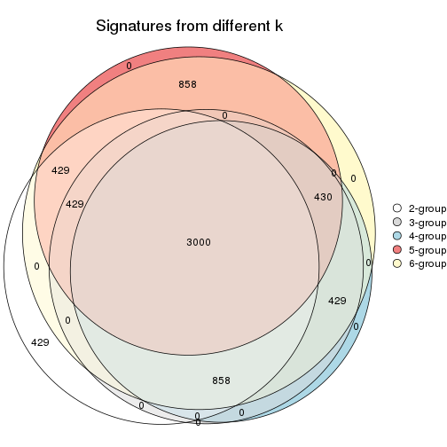

`get_signature()` returns a data frame invisibly. TO get the list of signatures, the function
call should be assigned to a variable explicitly. In following code, if `plot` argument is set
to `FALSE`, no heatmap is plotted while only the differential analysis is performed.

```r
# code only for demonstration
tb = get_signature(res, k = ..., plot = FALSE)
```

An example of the output of `tb` is:

```
#>   which_row         fdr    mean_1    mean_2 scaled_mean_1 scaled_mean_2 km
#> 1        38 0.042760348  8.373488  9.131774    -0.5533452     0.5164555  1
#> 2        40 0.018707592  7.106213  8.469186    -0.6173731     0.5762149  1
#> 3        55 0.019134737 10.221463 11.207825    -0.6159697     0.5749050  1
#> 4        59 0.006059896  5.921854  7.869574    -0.6899429     0.6439467  1
#> 5        60 0.018055526  8.928898 10.211722    -0.6204761     0.5791110  1
#> 6        98 0.009384629 15.714769 14.887706     0.6635654    -0.6193277  2
...
```

The columns in `tb` are:

1. `which_row`: row indices corresponding to the input matrix.
2. `fdr`: FDR for the differential test. 
3. `mean_x`: The mean value in group x.
4. `scaled_mean_x`: The mean value in group x after rows are scaled.
5. `km`: Row groups if k-means clustering is applied to rows.


UMAP plot which shows how samples are separated.


<script>
$( function() {
	$( '#tabs-CV-pam-dimension-reduction' ).tabs();
} );
</script>
<div id='tabs-CV-pam-dimension-reduction'>
<ul>
<li><a href='#tab-CV-pam-dimension-reduction-1'>k = 2</a></li>
<li><a href='#tab-CV-pam-dimension-reduction-2'>k = 3</a></li>
<li><a href='#tab-CV-pam-dimension-reduction-3'>k = 4</a></li>
<li><a href='#tab-CV-pam-dimension-reduction-4'>k = 5</a></li>
<li><a href='#tab-CV-pam-dimension-reduction-5'>k = 6</a></li>
</ul>
<div id='tab-CV-pam-dimension-reduction-1'>
<pre><code class="r">dimension_reduction(res, k = 2, method = &quot;UMAP&quot;)
</code></pre>

<p>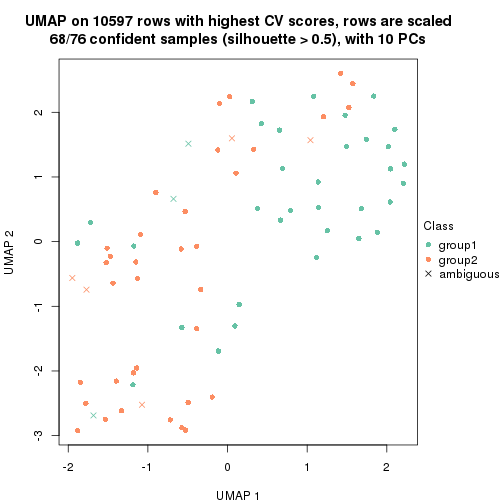</p>

</div>
<div id='tab-CV-pam-dimension-reduction-2'>
<pre><code class="r">dimension_reduction(res, k = 3, method = &quot;UMAP&quot;)
</code></pre>

<p>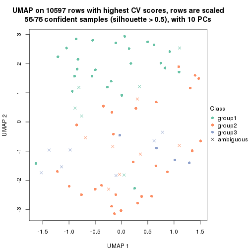</p>

</div>
<div id='tab-CV-pam-dimension-reduction-3'>
<pre><code class="r">dimension_reduction(res, k = 4, method = &quot;UMAP&quot;)
</code></pre>

<p>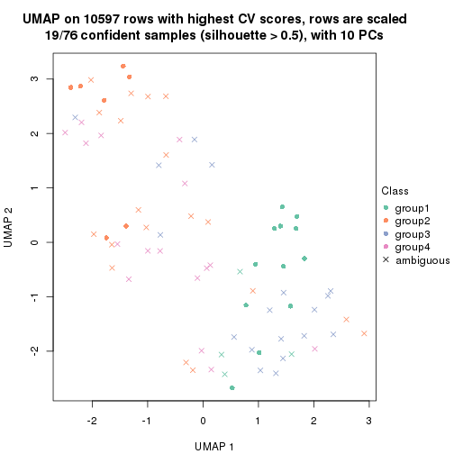</p>

</div>
<div id='tab-CV-pam-dimension-reduction-4'>
<pre><code class="r">dimension_reduction(res, k = 5, method = &quot;UMAP&quot;)
</code></pre>

<p>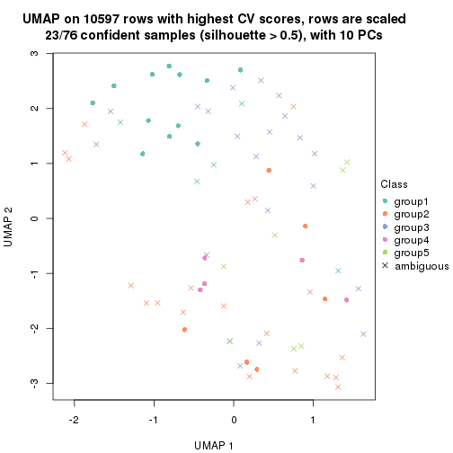</p>

</div>
<div id='tab-CV-pam-dimension-reduction-5'>
<pre><code class="r">dimension_reduction(res, k = 6, method = &quot;UMAP&quot;)
</code></pre>

<p>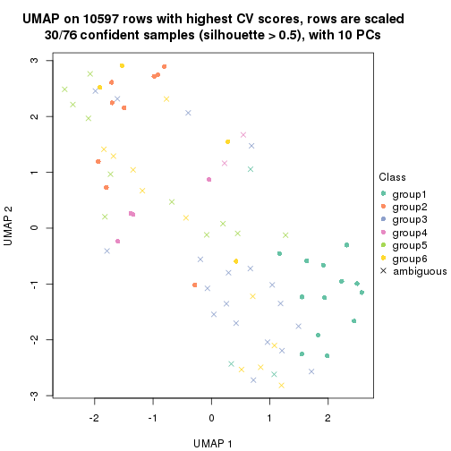</p>

</div>
</div>


Following heatmap shows how subgroups are split when increasing `k`:

```r
collect_classes(res)
```

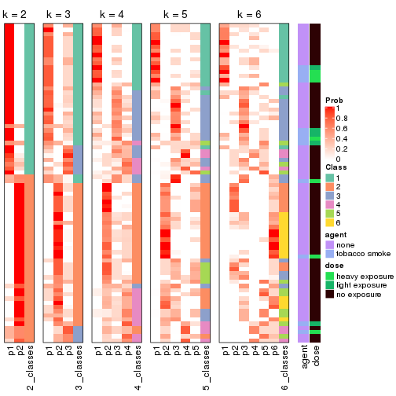


Test correlation between subgroups and known annotations. If the known
annotation is numeric, one-way ANOVA test is applied, and if the known
annotation is discrete, chi-squared contingency table test is applied.

```r
test_to_known_factors(res)
```

```
#>         n agent(p) dose(p) k
#> CV:pam 68   0.1268   0.167 2
#> CV:pam 56   0.0921   0.213 3
#> CV:pam 19   0.2560   0.228 4
#> CV:pam 23   0.7050   0.872 5
#> CV:pam 30   0.1983   0.524 6
```


If matrix rows can be associated to genes, consider to use `GO_Enrichment(res,
...)` to perform function enrichment for the signature genes.


 

---------------------------------------------------


### CV:mclust


The object with results only for a single top-value method and a single partition method 
can be extracted as:

```r
res = res_list["CV", "mclust"]
# you can also extract it by
# res = res_list["CV:mclust"]
```

A summary of `res` and all the functions that can be applied to it:

```r
res
```

```
#> A 'ConsensusPartition' object with k = 2, 3, 4, 5, 6.
#>   On a matrix with 10597 rows and 76 columns.
#>   Top rows (1000, 2000, 3000, 4000, 5000) are extracted by 'CV' method.
#>   Subgroups are detected by 'mclust' method.
#>   Performed in total 1250 partitions by row resampling.
#>   Best k for subgroups seems to be 2.
#> 
#> Following methods can be applied to this 'ConsensusPartition' object:
#>  [1] "cola_report"             "collect_classes"         "collect_plots"          
#>  [4] "collect_stats"           "colnames"                "compare_signatures"     
#>  [7] "consensus_heatmap"       "dimension_reduction"     "functional_enrichment"  
#> [10] "get_anno_col"            "get_anno"                "get_classes"            
#> [13] "get_consensus"           "get_matrix"              "get_membership"         
#> [16] "get_param"               "get_signatures"          "get_stats"              
#> [19] "is_best_k"               "is_stable_k"             "membership_heatmap"     
#> [22] "ncol"                    "nrow"                    "plot_ecdf"              
#> [25] "rownames"                "select_partition_number" "show"                   
#> [28] "suggest_best_k"          "test_to_known_factors"
```

`collect_plots()` function collects all the plots made from `res` for all `k` (number of partitions)
into one single page to provide an easy and fast comparison between different `k`.

```r
collect_plots(res)
```

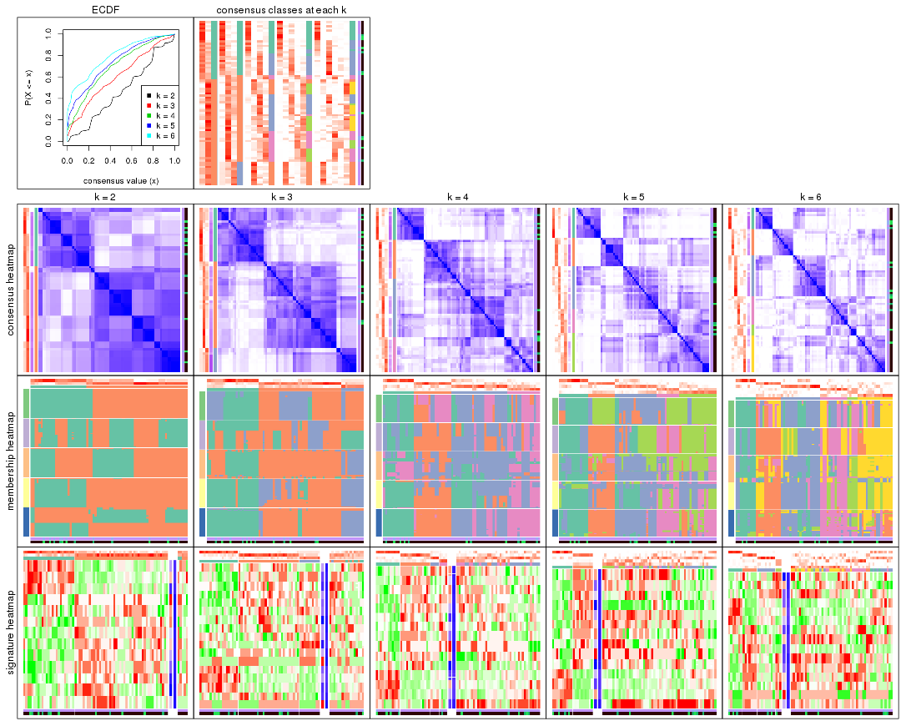

The plots are:

- The first row: a plot of the ECDF (Empirical cumulative distribution
  function) curves of the consensus matrix for each `k` and the heatmap of
  predicted classes for each `k`.
- The second row: heatmaps of the consensus matrix for each `k`.
- The third row: heatmaps of the membership matrix for each `k`.
- The fouth row: heatmaps of the signatures for each `k`.

All the plots in panels can be made by individual functions and they are
plotted later in this section.

`select_partition_number()` produces several plots showing different
statistics for choosing "optimized" `k`. There are following statistics:

- ECDF curves of the consensus matrix for each `k`;
- 1-PAC. [The PAC
  score](https://en.wikipedia.org/wiki/Consensus_clustering#Over-interpretation_potential_of_consensus_clustering)
  measures the proportion of the ambiguous subgrouping.
- Mean silhouette score.
- Concordance. The mean probability of fiting the consensus class ids in all
  partitions.
- Area increased. Denote $A_k$ as the area under the ECDF curve for current
  `k`, the area increased is defined as $A_k - A_{k-1}$.
- Rand index. The percent of pairs of samples that are both in a same cluster
  or both are not in a same cluster in the partition of k and k-1.
- Jaccard index. The ratio of pairs of samples are both in a same cluster in
  the partition of k and k-1 and the pairs of samples are both in a same
  cluster in the partition k or k-1.

The detailed explanations of these statistics can be found in [the cola
vignette](http://bioconductor.org/packages/devel/bioc/vignettes/cola/inst/doc/cola.html#toc_13).

Generally speaking, lower PAC score, higher mean silhouette score or higher
concordance corresponds to better partition. Rand index and Jaccard index
measure how similar the current partition is compared to partition with `k-1`.
If they are too similar, we won't accept `k` is better than `k-1`.

```r
select_partition_number(res)
```

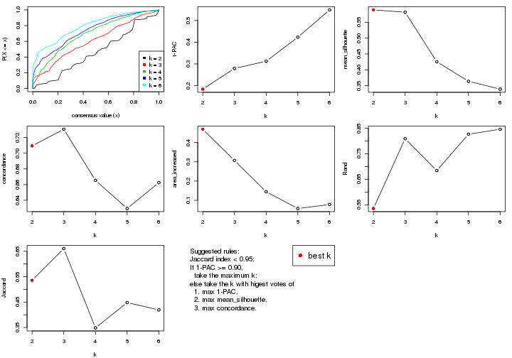

The numeric values for all these statistics can be obtained by `get_stats()`.

```r
get_stats(res)
```

```
#>   k 1-PAC mean_silhouette concordance area_increased  Rand Jaccard
#> 2 2 0.184           0.589       0.709         0.4687 0.536   0.536
#> 3 3 0.279           0.582       0.731         0.3067 0.809   0.661
#> 4 4 0.312           0.425       0.665         0.1444 0.684   0.349
#> 5 5 0.423           0.364       0.630         0.0577 0.827   0.448
#> 6 6 0.549           0.339       0.662         0.0784 0.846   0.419
```

`suggest_best_k()` suggests the best $k$ based on these statistics. The rules are as follows:

- All $k$ with Jaccard index larger than 0.95 are removed because the increase of
  the partition number does not provides enough extra information. If all $k$ are removed,
  the best $k$ is assigned by `NA`.
- For $k$ with 1-PAC larger than 0.9, the maximal $k$ is taken as the "best k". Other $k$ is called "optional k".
- If it does not fit the second rule. The $k$ with the highest vote of highest
  1-PAC, mean silhouette and concordance is taken as the "best k".

```r
suggest_best_k(res)
```

```
#> [1] 2
```


Following shows the table of the partitions (You need to click the **show/hide
code output** link to see it). The membership matrix (columns with name `p*`)
is inferred by
[`clue::cl_consensus()`](https://www.rdocumentation.org/link/cl_consensus?package=clue)
function with the `SE` method. Basically the value in the membership matrix
represents the probability to belong to a certain group. The finall class
label for an item is determined with the group with highest probability it
belongs to.

In `get_classes()` function, the entropy is calculated from the membership
matrix and the silhouette score is calculated from the consensus matrix.


<script>
$( function() {
	$( '#tabs-CV-mclust-get-classes' ).tabs();
} );
</script>
<div id='tabs-CV-mclust-get-classes'>
<ul>
<li><a href='#tab-CV-mclust-get-classes-1'>k = 2</a></li>
<li><a href='#tab-CV-mclust-get-classes-2'>k = 3</a></li>
<li><a href='#tab-CV-mclust-get-classes-3'>k = 4</a></li>
<li><a href='#tab-CV-mclust-get-classes-4'>k = 5</a></li>
<li><a href='#tab-CV-mclust-get-classes-5'>k = 6</a></li>
</ul>

<div id='tab-CV-mclust-get-classes-1'>
<p><a id='tab-CV-mclust-get-classes-1-a' style='color:#0366d6' href='#'>show/hide code output</a></p>
<pre><code class="r">cbind(get_classes(res, k = 2), get_membership(res, k = 2))
</code></pre>

<pre><code>#&gt;           class entropy silhouette    p1    p2
#&gt; GSM451162     2  0.9977     0.0143 0.472 0.528
#&gt; GSM451163     2  0.0000     0.6513 0.000 1.000
#&gt; GSM451164     2  0.0000     0.6513 0.000 1.000
#&gt; GSM451165     2  0.8713     0.5902 0.292 0.708
#&gt; GSM451167     2  0.0000     0.6513 0.000 1.000
#&gt; GSM451168     2  0.7219     0.6761 0.200 0.800
#&gt; GSM451169     2  0.4431     0.5752 0.092 0.908
#&gt; GSM451170     1  0.9170     0.6739 0.668 0.332
#&gt; GSM451171     2  0.9686     0.6421 0.396 0.604
#&gt; GSM451172     2  0.8608     0.5926 0.284 0.716
#&gt; GSM451173     1  0.8144     0.6957 0.748 0.252
#&gt; GSM451174     2  0.0000     0.6513 0.000 1.000
#&gt; GSM451175     1  0.5408     0.6557 0.876 0.124
#&gt; GSM451177     2  0.9754     0.6383 0.408 0.592
#&gt; GSM451178     2  0.3114     0.6126 0.056 0.944
#&gt; GSM451179     2  0.4431     0.5752 0.092 0.908
#&gt; GSM451180     2  0.9754     0.6383 0.408 0.592
#&gt; GSM451181     2  0.7139     0.6231 0.196 0.804
#&gt; GSM451182     1  0.7602     0.6946 0.780 0.220
#&gt; GSM451183     1  0.7602     0.5953 0.780 0.220
#&gt; GSM451184     1  0.9000     0.5746 0.684 0.316
#&gt; GSM451185     1  0.1633     0.6641 0.976 0.024
#&gt; GSM451186     2  0.9954     0.1141 0.460 0.540
#&gt; GSM451187     2  0.6048     0.6850 0.148 0.852
#&gt; GSM451188     2  0.7219     0.6761 0.200 0.800
#&gt; GSM451189     1  0.9795     0.6272 0.584 0.416
#&gt; GSM451190     1  0.5519     0.6554 0.872 0.128
#&gt; GSM451191     1  0.7602     0.6946 0.780 0.220
#&gt; GSM451193     2  0.4431     0.5752 0.092 0.908
#&gt; GSM451195     1  0.9815     0.6235 0.580 0.420
#&gt; GSM451196     1  0.1843     0.6657 0.972 0.028
#&gt; GSM451197     1  0.7602     0.6946 0.780 0.220
#&gt; GSM451199     1  0.7602     0.6946 0.780 0.220
#&gt; GSM451201     1  0.1633     0.6641 0.976 0.024
#&gt; GSM451202     2  0.9686     0.6421 0.396 0.604
#&gt; GSM451203     2  0.8016     0.5976 0.244 0.756
#&gt; GSM451204     2  0.7219     0.6238 0.200 0.800
#&gt; GSM451205     2  0.9754     0.6383 0.408 0.592
#&gt; GSM451206     2  0.0000     0.6513 0.000 1.000
#&gt; GSM451207     2  0.7139     0.6231 0.196 0.804
#&gt; GSM451208     2  0.9686     0.6421 0.396 0.604
#&gt; GSM451209     2  0.7139     0.6772 0.196 0.804
#&gt; GSM451210     2  0.7139     0.6772 0.196 0.804
#&gt; GSM451212     2  0.7376     0.6185 0.208 0.792
#&gt; GSM451213     2  0.7376     0.6185 0.208 0.792
#&gt; GSM451214     2  0.7219     0.6761 0.200 0.800
#&gt; GSM451215     2  0.9754     0.6383 0.408 0.592
#&gt; GSM451216     2  0.7219     0.6245 0.200 0.800
#&gt; GSM451217     2  0.0672     0.6549 0.008 0.992
#&gt; GSM451219     1  0.9209     0.5367 0.664 0.336
#&gt; GSM451220     2  0.9635    -0.3022 0.388 0.612
#&gt; GSM451221     1  0.7602     0.6946 0.780 0.220
#&gt; GSM451222     1  0.8081     0.5792 0.752 0.248
#&gt; GSM451224     2  0.9686     0.6421 0.396 0.604
#&gt; GSM451225     1  0.9661    -0.2709 0.608 0.392
#&gt; GSM451226     2  0.8713     0.5902 0.292 0.708
#&gt; GSM451227     2  0.7219     0.6761 0.200 0.800
#&gt; GSM451228     2  0.4431     0.5752 0.092 0.908
#&gt; GSM451230     1  0.9661    -0.2709 0.608 0.392
#&gt; GSM451231     2  0.9754     0.6382 0.408 0.592
#&gt; GSM451233     2  0.9635     0.6457 0.388 0.612
#&gt; GSM451234     2  0.7453     0.6759 0.212 0.788
#&gt; GSM451235     2  0.7453     0.6759 0.212 0.788
#&gt; GSM451236     2  0.9661     0.6432 0.392 0.608
#&gt; GSM451166     2  0.7745     0.6082 0.228 0.772
#&gt; GSM451194     1  0.7674     0.6948 0.776 0.224
#&gt; GSM451198     1  0.9815     0.6235 0.580 0.420
#&gt; GSM451218     2  0.9754     0.6382 0.408 0.592
#&gt; GSM451232     1  0.1843     0.6657 0.972 0.028
#&gt; GSM451176     1  0.9795     0.6272 0.584 0.416
#&gt; GSM451192     1  0.1843     0.6657 0.972 0.028
#&gt; GSM451200     1  0.9795     0.6272 0.584 0.416
#&gt; GSM451211     2  0.7219     0.6761 0.200 0.800
#&gt; GSM451223     2  0.4431     0.5752 0.092 0.908
#&gt; GSM451229     1  0.1633     0.6641 0.976 0.024
#&gt; GSM451237     2  0.7453     0.6759 0.212 0.788
</code></pre>

<script>
$('#tab-CV-mclust-get-classes-1-a').parent().next().next().hide();
$('#tab-CV-mclust-get-classes-1-a').click(function(){
  $('#tab-CV-mclust-get-classes-1-a').parent().next().next().toggle();
  return(false);
});
</script>
</div>

<div id='tab-CV-mclust-get-classes-2'>
<p><a id='tab-CV-mclust-get-classes-2-a' style='color:#0366d6' href='#'>show/hide code output</a></p>
<pre><code class="r">cbind(get_classes(res, k = 3), get_membership(res, k = 3))
</code></pre>

<pre><code>#&gt;           class entropy silhouette    p1    p2    p3
#&gt; GSM451162     2  0.9802     0.0966 0.240 0.400 0.360
#&gt; GSM451163     2  0.4702     0.5372 0.000 0.788 0.212
#&gt; GSM451164     2  0.6252    -0.1221 0.000 0.556 0.444
#&gt; GSM451165     2  0.7944     0.3207 0.132 0.656 0.212
#&gt; GSM451167     2  0.5678     0.6015 0.000 0.684 0.316
#&gt; GSM451168     2  0.7860     0.3387 0.132 0.664 0.204
#&gt; GSM451169     2  0.6154     0.5389 0.000 0.592 0.408
#&gt; GSM451170     1  0.5111     0.7562 0.808 0.168 0.024
#&gt; GSM451171     2  0.7015     0.3559 0.024 0.584 0.392
#&gt; GSM451172     2  0.4702     0.5372 0.000 0.788 0.212
#&gt; GSM451173     1  0.9606     0.4336 0.448 0.340 0.212
#&gt; GSM451174     2  0.2261     0.6430 0.000 0.932 0.068
#&gt; GSM451175     1  0.8085     0.6718 0.648 0.148 0.204
#&gt; GSM451177     3  0.8063     0.8653 0.132 0.224 0.644
#&gt; GSM451178     2  0.2261     0.6430 0.000 0.932 0.068
#&gt; GSM451179     2  0.8727     0.4537 0.148 0.572 0.280
#&gt; GSM451180     3  0.8063     0.8653 0.132 0.224 0.644
#&gt; GSM451181     2  0.6345     0.0704 0.004 0.596 0.400
#&gt; GSM451182     1  0.1525     0.7008 0.964 0.032 0.004
#&gt; GSM451183     1  0.3686     0.7531 0.860 0.140 0.000
#&gt; GSM451184     1  0.9337     0.3264 0.512 0.208 0.280
#&gt; GSM451185     1  0.0237     0.6901 0.996 0.000 0.004
#&gt; GSM451186     2  0.7880     0.5174 0.164 0.668 0.168
#&gt; GSM451187     2  0.4702     0.5372 0.000 0.788 0.212
#&gt; GSM451188     3  0.8375     0.8498 0.132 0.260 0.608
#&gt; GSM451189     1  0.4002     0.7566 0.840 0.160 0.000
#&gt; GSM451190     1  0.5267     0.7552 0.816 0.140 0.044
#&gt; GSM451191     1  0.2229     0.7006 0.944 0.044 0.012
#&gt; GSM451193     2  0.7433     0.5750 0.072 0.660 0.268
#&gt; GSM451195     1  0.9653     0.4518 0.448 0.328 0.224
#&gt; GSM451196     1  0.3784     0.7500 0.864 0.132 0.004
#&gt; GSM451197     1  0.1289     0.7004 0.968 0.032 0.000
#&gt; GSM451199     1  0.7403     0.6161 0.688 0.096 0.216
#&gt; GSM451201     1  0.3129     0.6986 0.904 0.008 0.088
#&gt; GSM451202     3  0.9102     0.5000 0.140 0.408 0.452
#&gt; GSM451203     2  0.8770     0.4809 0.156 0.572 0.272
#&gt; GSM451204     2  0.0237     0.6457 0.004 0.996 0.000
#&gt; GSM451205     3  0.8063     0.8653 0.132 0.224 0.644
#&gt; GSM451206     2  0.2261     0.6430 0.000 0.932 0.068
#&gt; GSM451207     2  0.3415     0.6390 0.020 0.900 0.080
#&gt; GSM451208     3  0.8321     0.8595 0.148 0.228 0.624
#&gt; GSM451209     2  0.5431     0.5846 0.000 0.716 0.284
#&gt; GSM451210     3  0.8375     0.8498 0.132 0.260 0.608
#&gt; GSM451212     2  0.3415     0.6390 0.020 0.900 0.080
#&gt; GSM451213     2  0.3415     0.6390 0.020 0.900 0.080
#&gt; GSM451214     3  0.5538     0.6181 0.132 0.060 0.808
#&gt; GSM451215     3  0.8120     0.8644 0.136 0.224 0.640
#&gt; GSM451216     2  0.1482     0.6361 0.020 0.968 0.012
#&gt; GSM451217     2  0.4974     0.5046 0.000 0.764 0.236
#&gt; GSM451219     1  0.6348     0.6041 0.740 0.212 0.048
#&gt; GSM451220     2  0.9641    -0.1787 0.324 0.452 0.224
#&gt; GSM451221     1  0.8841     0.4751 0.580 0.204 0.216
#&gt; GSM451222     1  0.7334     0.5502 0.624 0.328 0.048
#&gt; GSM451224     3  0.8392     0.8613 0.148 0.236 0.616
#&gt; GSM451225     2  0.8076     0.5088 0.180 0.652 0.168
#&gt; GSM451226     2  0.9021     0.3654 0.132 0.452 0.416
#&gt; GSM451227     3  0.5538     0.6181 0.132 0.060 0.808
#&gt; GSM451228     2  0.5291     0.6110 0.000 0.732 0.268
#&gt; GSM451230     2  0.6673     0.5472 0.020 0.636 0.344
#&gt; GSM451231     2  0.7091     0.5497 0.040 0.640 0.320
#&gt; GSM451233     2  0.0661     0.6445 0.008 0.988 0.004
#&gt; GSM451234     2  0.3551     0.5819 0.000 0.868 0.132
#&gt; GSM451235     2  0.3551     0.5819 0.000 0.868 0.132
#&gt; GSM451236     2  0.4615     0.5620 0.020 0.836 0.144
#&gt; GSM451166     2  0.6229     0.6102 0.020 0.700 0.280
#&gt; GSM451194     1  0.9674     0.4420 0.440 0.336 0.224
#&gt; GSM451198     1  0.6138     0.7494 0.768 0.172 0.060
#&gt; GSM451218     2  0.4615     0.5620 0.020 0.836 0.144
#&gt; GSM451232     1  0.3551     0.7502 0.868 0.132 0.000
#&gt; GSM451176     1  0.4062     0.7565 0.836 0.164 0.000
#&gt; GSM451192     1  0.2682     0.7398 0.920 0.076 0.004
#&gt; GSM451200     1  0.9653     0.4518 0.448 0.328 0.224
#&gt; GSM451211     2  0.5722     0.5262 0.132 0.800 0.068
#&gt; GSM451223     2  0.6192     0.5335 0.000 0.580 0.420
#&gt; GSM451229     1  0.0237     0.6902 0.996 0.000 0.004
#&gt; GSM451237     2  0.3551     0.5819 0.000 0.868 0.132
</code></pre>

<script>
$('#tab-CV-mclust-get-classes-2-a').parent().next().next().hide();
$('#tab-CV-mclust-get-classes-2-a').click(function(){
  $('#tab-CV-mclust-get-classes-2-a').parent().next().next().toggle();
  return(false);
});
</script>
</div>

<div id='tab-CV-mclust-get-classes-3'>
<p><a id='tab-CV-mclust-get-classes-3-a' style='color:#0366d6' href='#'>show/hide code output</a></p>
<pre><code class="r">cbind(get_classes(res, k = 4), get_membership(res, k = 4))
</code></pre>

<pre><code>#&gt;           class entropy silhouette    p1    p2    p3    p4
#&gt; GSM451162     3   0.421     0.4787 0.028 0.136 0.824 0.012
#&gt; GSM451163     2   0.519     0.5110 0.000 0.640 0.344 0.016
#&gt; GSM451164     2   0.495     0.5180 0.000 0.648 0.344 0.008
#&gt; GSM451165     3   0.721    -0.2939 0.000 0.408 0.452 0.140
#&gt; GSM451167     3   0.719     0.0826 0.000 0.272 0.544 0.184
#&gt; GSM451168     2   0.698     0.5640 0.000 0.576 0.252 0.172
#&gt; GSM451169     3   0.425     0.3741 0.000 0.220 0.768 0.012
#&gt; GSM451170     3   0.515    -0.0791 0.464 0.004 0.532 0.000
#&gt; GSM451171     2   0.392     0.6250 0.000 0.840 0.056 0.104
#&gt; GSM451172     3   0.537    -0.0778 0.000 0.444 0.544 0.012
#&gt; GSM451173     3   0.398     0.4398 0.240 0.000 0.760 0.000
#&gt; GSM451174     3   0.767    -0.2490 0.000 0.220 0.428 0.352
#&gt; GSM451175     1   0.742     0.2472 0.464 0.016 0.412 0.108
#&gt; GSM451177     2   0.331     0.6260 0.000 0.840 0.004 0.156
#&gt; GSM451178     3   0.763    -0.2146 0.000 0.220 0.452 0.328
#&gt; GSM451179     3   0.208     0.5220 0.084 0.000 0.916 0.000
#&gt; GSM451180     2   0.111     0.6035 0.000 0.968 0.004 0.028
#&gt; GSM451181     2   0.594     0.5580 0.000 0.676 0.232 0.092
#&gt; GSM451182     1   0.241     0.7299 0.896 0.000 0.104 0.000
#&gt; GSM451183     1   0.394     0.7538 0.840 0.000 0.100 0.060
#&gt; GSM451184     3   0.628     0.5014 0.180 0.128 0.684 0.008
#&gt; GSM451185     1   0.164     0.7754 0.940 0.000 0.000 0.060
#&gt; GSM451186     4   0.800     0.3282 0.200 0.012 0.380 0.408
#&gt; GSM451187     2   0.737     0.2056 0.000 0.484 0.344 0.172
#&gt; GSM451188     2   0.585     0.6623 0.000 0.704 0.160 0.136
#&gt; GSM451189     1   0.307     0.7305 0.848 0.000 0.152 0.000
#&gt; GSM451190     1   0.539     0.6578 0.712 0.000 0.228 0.060
#&gt; GSM451191     3   0.551    -0.0451 0.488 0.016 0.496 0.000
#&gt; GSM451193     3   0.350     0.5142 0.084 0.036 0.872 0.008
#&gt; GSM451195     3   0.416     0.4361 0.240 0.004 0.756 0.000
#&gt; GSM451196     1   0.247     0.7724 0.892 0.000 0.000 0.108
#&gt; GSM451197     1   0.234     0.7315 0.900 0.000 0.100 0.000
#&gt; GSM451199     3   0.460     0.3333 0.336 0.000 0.664 0.000
#&gt; GSM451201     1   0.164     0.7754 0.940 0.000 0.000 0.060
#&gt; GSM451202     2   0.542     0.6706 0.000 0.740 0.112 0.148
#&gt; GSM451203     3   0.588     0.4467 0.164 0.032 0.736 0.068
#&gt; GSM451204     3   0.831    -0.3902 0.048 0.140 0.424 0.388
#&gt; GSM451205     2   0.111     0.6035 0.000 0.968 0.004 0.028
#&gt; GSM451206     3   0.767    -0.2490 0.000 0.220 0.428 0.352
#&gt; GSM451207     4   0.658     0.4403 0.000 0.144 0.232 0.624
#&gt; GSM451208     2   0.455     0.6498 0.000 0.784 0.044 0.172
#&gt; GSM451209     3   0.557    -0.2533 0.000 0.024 0.580 0.396
#&gt; GSM451210     2   0.590     0.6607 0.000 0.700 0.164 0.136
#&gt; GSM451212     4   0.540     0.3296 0.000 0.016 0.404 0.580
#&gt; GSM451213     4   0.421     0.4934 0.000 0.016 0.204 0.780
#&gt; GSM451214     2   0.504     0.4786 0.000 0.628 0.364 0.008
#&gt; GSM451215     2   0.331     0.6260 0.000 0.840 0.004 0.156
#&gt; GSM451216     4   0.370     0.5473 0.000 0.016 0.156 0.828
#&gt; GSM451217     2   0.713     0.5145 0.000 0.512 0.344 0.144
#&gt; GSM451219     3   0.645     0.3938 0.268 0.112 0.620 0.000
#&gt; GSM451220     3   0.227     0.5218 0.084 0.004 0.912 0.000
#&gt; GSM451221     3   0.607     0.4954 0.180 0.112 0.700 0.008
#&gt; GSM451222     1   0.773     0.3415 0.440 0.000 0.304 0.256
#&gt; GSM451224     2   0.562     0.6106 0.000 0.668 0.052 0.280
#&gt; GSM451225     4   0.791     0.4634 0.184 0.028 0.256 0.532
#&gt; GSM451226     3   0.416     0.4233 0.000 0.224 0.768 0.008
#&gt; GSM451227     2   0.504     0.4786 0.000 0.628 0.364 0.008
#&gt; GSM451228     3   0.211     0.4419 0.000 0.044 0.932 0.024
#&gt; GSM451230     4   0.509     0.4816 0.008 0.016 0.272 0.704
#&gt; GSM451231     4   0.686     0.3592 0.068 0.016 0.380 0.536
#&gt; GSM451233     4   0.707     0.5029 0.048 0.160 0.132 0.660
#&gt; GSM451234     4   0.660     0.3894 0.000 0.100 0.328 0.572
#&gt; GSM451235     4   0.660     0.3894 0.000 0.100 0.328 0.572
#&gt; GSM451236     4   0.342     0.5088 0.000 0.088 0.044 0.868
#&gt; GSM451166     4   0.549     0.2392 0.000 0.016 0.452 0.532
#&gt; GSM451194     3   0.416     0.4361 0.240 0.004 0.756 0.000
#&gt; GSM451198     1   0.500     0.3951 0.604 0.004 0.392 0.000
#&gt; GSM451218     4   0.351     0.5088 0.000 0.088 0.048 0.864
#&gt; GSM451232     1   0.164     0.7754 0.940 0.000 0.000 0.060
#&gt; GSM451176     1   0.353     0.6923 0.808 0.000 0.192 0.000
#&gt; GSM451192     1   0.247     0.7724 0.892 0.000 0.000 0.108
#&gt; GSM451200     3   0.416     0.4361 0.240 0.004 0.756 0.000
#&gt; GSM451211     4   0.792    -0.0434 0.000 0.316 0.332 0.352
#&gt; GSM451223     3   0.309     0.4773 0.000 0.128 0.864 0.008
#&gt; GSM451229     1   0.247     0.7724 0.892 0.000 0.000 0.108
#&gt; GSM451237     4   0.660     0.3894 0.000 0.100 0.328 0.572
</code></pre>

<script>
$('#tab-CV-mclust-get-classes-3-a').parent().next().next().hide();
$('#tab-CV-mclust-get-classes-3-a').click(function(){
  $('#tab-CV-mclust-get-classes-3-a').parent().next().next().toggle();
  return(false);
});
</script>
</div>

<div id='tab-CV-mclust-get-classes-4'>
<p><a id='tab-CV-mclust-get-classes-4-a' style='color:#0366d6' href='#'>show/hide code output</a></p>
<pre><code class="r">cbind(get_classes(res, k = 5), get_membership(res, k = 5))
</code></pre>

<pre><code>#&gt;           class entropy silhouette    p1    p2    p3    p4    p5
#&gt; GSM451162     3  0.4310     0.2818 0.004 0.000 0.604 0.000 0.392
#&gt; GSM451163     5  0.4150     0.4475 0.000 0.036 0.216 0.000 0.748
#&gt; GSM451164     5  0.5928     0.3200 0.000 0.192 0.212 0.000 0.596
#&gt; GSM451165     5  0.6414     0.0446 0.000 0.204 0.260 0.004 0.532
#&gt; GSM451167     3  0.7441    -0.1954 0.000 0.092 0.412 0.112 0.384
#&gt; GSM451168     2  0.7219     0.2266 0.000 0.388 0.208 0.028 0.376
#&gt; GSM451169     3  0.4161     0.2751 0.000 0.000 0.608 0.000 0.392
#&gt; GSM451170     1  0.4249     0.2242 0.568 0.000 0.432 0.000 0.000
#&gt; GSM451171     2  0.5802     0.6544 0.004 0.580 0.012 0.064 0.340
#&gt; GSM451172     5  0.3967     0.4382 0.000 0.012 0.264 0.000 0.724
#&gt; GSM451173     3  0.7349     0.2154 0.376 0.096 0.456 0.020 0.052
#&gt; GSM451174     5  0.4151     0.2249 0.000 0.004 0.000 0.344 0.652
#&gt; GSM451175     1  0.6498     0.3058 0.608 0.096 0.240 0.004 0.052
#&gt; GSM451177     2  0.4161     0.7315 0.000 0.752 0.000 0.040 0.208
#&gt; GSM451178     5  0.4547     0.3045 0.000 0.000 0.044 0.252 0.704
#&gt; GSM451179     3  0.4244     0.4441 0.016 0.000 0.712 0.004 0.268
#&gt; GSM451180     2  0.4316     0.7332 0.000 0.748 0.004 0.040 0.208
#&gt; GSM451181     5  0.6432     0.0540 0.004 0.320 0.152 0.004 0.520
#&gt; GSM451182     3  0.4300    -0.4219 0.476 0.000 0.524 0.000 0.000
#&gt; GSM451183     1  0.0162     0.7188 0.996 0.000 0.004 0.000 0.000
#&gt; GSM451184     3  0.6948     0.4365 0.148 0.200 0.576 0.000 0.076
#&gt; GSM451185     1  0.3846     0.6575 0.776 0.000 0.200 0.004 0.020
#&gt; GSM451186     4  0.4696     0.4270 0.012 0.000 0.172 0.748 0.068
#&gt; GSM451187     5  0.6416     0.4566 0.000 0.084 0.204 0.084 0.628
#&gt; GSM451188     2  0.4726     0.7387 0.004 0.704 0.012 0.024 0.256
#&gt; GSM451189     1  0.2813     0.6612 0.832 0.000 0.168 0.000 0.000
#&gt; GSM451190     1  0.6228     0.2612 0.580 0.096 0.300 0.004 0.020
#&gt; GSM451191     3  0.5113    -0.1089 0.380 0.000 0.576 0.000 0.044
#&gt; GSM451193     5  0.5000    -0.1094 0.012 0.000 0.460 0.012 0.516
#&gt; GSM451195     3  0.7337     0.4231 0.168 0.096 0.536 0.000 0.200
#&gt; GSM451196     1  0.0771     0.7132 0.976 0.000 0.000 0.004 0.020
#&gt; GSM451197     1  0.3895     0.6156 0.680 0.000 0.320 0.000 0.000
#&gt; GSM451199     3  0.5268     0.2346 0.172 0.096 0.712 0.000 0.020
#&gt; GSM451201     1  0.3143     0.6636 0.796 0.000 0.204 0.000 0.000
#&gt; GSM451202     2  0.4762     0.7202 0.004 0.672 0.008 0.020 0.296
#&gt; GSM451203     3  0.4194     0.4355 0.012 0.000 0.708 0.004 0.276
#&gt; GSM451204     5  0.5628     0.2109 0.004 0.000 0.072 0.368 0.556
#&gt; GSM451205     2  0.4316     0.7332 0.000 0.748 0.004 0.040 0.208
#&gt; GSM451206     5  0.4390     0.1348 0.000 0.004 0.000 0.428 0.568
#&gt; GSM451207     5  0.4047     0.1545 0.004 0.000 0.000 0.320 0.676
#&gt; GSM451208     2  0.5482     0.7117 0.004 0.644 0.008 0.068 0.276
#&gt; GSM451209     4  0.5950     0.3782 0.008 0.000 0.316 0.572 0.104
#&gt; GSM451210     2  0.4935     0.6751 0.000 0.616 0.040 0.000 0.344
#&gt; GSM451212     5  0.4299     0.1567 0.004 0.000 0.008 0.316 0.672
#&gt; GSM451213     5  0.4047     0.1524 0.004 0.000 0.000 0.320 0.676
#&gt; GSM451214     2  0.6133     0.3556 0.004 0.548 0.356 0.020 0.072
#&gt; GSM451215     2  0.4161     0.7315 0.000 0.752 0.000 0.040 0.208
#&gt; GSM451216     5  0.4047     0.1524 0.004 0.000 0.000 0.320 0.676
#&gt; GSM451217     5  0.5986     0.3453 0.000 0.176 0.216 0.004 0.604
#&gt; GSM451219     3  0.5051     0.4883 0.020 0.184 0.724 0.000 0.072
#&gt; GSM451220     3  0.5432     0.4604 0.016 0.048 0.688 0.016 0.232
#&gt; GSM451221     3  0.4294     0.3951 0.148 0.004 0.776 0.000 0.072
#&gt; GSM451222     1  0.7202     0.3802 0.604 0.096 0.108 0.024 0.168
#&gt; GSM451224     2  0.4620     0.7398 0.004 0.708 0.008 0.024 0.256
#&gt; GSM451225     4  0.5663     0.4214 0.016 0.000 0.304 0.612 0.068
#&gt; GSM451226     3  0.5819     0.2654 0.000 0.200 0.612 0.000 0.188
#&gt; GSM451227     2  0.6133     0.3556 0.004 0.548 0.356 0.020 0.072
#&gt; GSM451228     3  0.5716     0.2365 0.004 0.000 0.552 0.080 0.364
#&gt; GSM451230     4  0.7865     0.3558 0.028 0.096 0.104 0.492 0.280
#&gt; GSM451231     4  0.7624     0.3396 0.060 0.000 0.316 0.412 0.212
#&gt; GSM451233     5  0.5696    -0.2663 0.004 0.000 0.072 0.400 0.524
#&gt; GSM451234     4  0.4286     0.3902 0.000 0.004 0.004 0.652 0.340
#&gt; GSM451235     4  0.4101     0.3926 0.000 0.000 0.004 0.664 0.332
#&gt; GSM451236     4  0.4586     0.2896 0.004 0.004 0.000 0.524 0.468
#&gt; GSM451166     5  0.6670    -0.0202 0.004 0.000 0.256 0.260 0.480
#&gt; GSM451194     3  0.5251     0.2811 0.308 0.000 0.632 0.052 0.008
#&gt; GSM451198     3  0.6515    -0.1005 0.388 0.192 0.420 0.000 0.000
#&gt; GSM451218     4  0.4196     0.3668 0.004 0.000 0.000 0.640 0.356
#&gt; GSM451232     1  0.0162     0.7188 0.996 0.000 0.004 0.000 0.000
#&gt; GSM451176     1  0.3516     0.6667 0.812 0.000 0.164 0.004 0.020
#&gt; GSM451192     1  0.0162     0.7188 0.996 0.000 0.004 0.000 0.000
#&gt; GSM451200     3  0.5708     0.1508 0.348 0.096 0.556 0.000 0.000
#&gt; GSM451211     4  0.6919     0.0653 0.004 0.200 0.008 0.428 0.360
#&gt; GSM451223     3  0.4151     0.3524 0.004 0.000 0.652 0.000 0.344
#&gt; GSM451229     1  0.3846     0.6575 0.776 0.000 0.200 0.004 0.020
#&gt; GSM451237     4  0.4101     0.3987 0.000 0.000 0.004 0.664 0.332
</code></pre>

<script>
$('#tab-CV-mclust-get-classes-4-a').parent().next().next().hide();
$('#tab-CV-mclust-get-classes-4-a').click(function(){
  $('#tab-CV-mclust-get-classes-4-a').parent().next().next().toggle();
  return(false);
});
</script>
</div>

<div id='tab-CV-mclust-get-classes-5'>
<p><a id='tab-CV-mclust-get-classes-5-a' style='color:#0366d6' href='#'>show/hide code output</a></p>
<pre><code class="r">cbind(get_classes(res, k = 6), get_membership(res, k = 6))
</code></pre>

<pre><code>#&gt;           class entropy silhouette    p1    p2    p3    p4    p5    p6
#&gt; GSM451162     3  0.3804    0.10172 0.000 0.000 0.576 0.000 0.000 0.424
#&gt; GSM451163     6  0.2342    0.44656 0.000 0.040 0.032 0.024 0.000 0.904
#&gt; GSM451164     6  0.3248    0.37294 0.000 0.164 0.032 0.000 0.000 0.804
#&gt; GSM451165     6  0.6982   -0.02428 0.000 0.200 0.064 0.176 0.032 0.528
#&gt; GSM451167     6  0.5628    0.40325 0.000 0.124 0.232 0.032 0.000 0.612
#&gt; GSM451168     6  0.6480   -0.21552 0.000 0.336 0.032 0.200 0.000 0.432
#&gt; GSM451169     6  0.3695    0.32811 0.000 0.000 0.376 0.000 0.000 0.624
#&gt; GSM451170     3  0.2996    0.39985 0.228 0.000 0.772 0.000 0.000 0.000
#&gt; GSM451171     2  0.4906    0.53107 0.000 0.612 0.000 0.064 0.008 0.316
#&gt; GSM451172     6  0.3615    0.37742 0.000 0.080 0.064 0.000 0.032 0.824
#&gt; GSM451173     3  0.1728    0.61226 0.064 0.000 0.924 0.004 0.000 0.008
#&gt; GSM451174     6  0.6102   -0.09782 0.000 0.000 0.004 0.256 0.300 0.440
#&gt; GSM451175     3  0.4704   -0.12630 0.468 0.000 0.488 0.044 0.000 0.000
#&gt; GSM451177     2  0.2030    0.59686 0.000 0.908 0.000 0.064 0.000 0.028
#&gt; GSM451178     6  0.6895   -0.02980 0.000 0.020 0.032 0.212 0.288 0.448
#&gt; GSM451179     3  0.3290    0.47432 0.000 0.000 0.744 0.004 0.000 0.252
#&gt; GSM451180     2  0.4095    0.59402 0.000 0.724 0.000 0.060 0.000 0.216
#&gt; GSM451181     6  0.2994    0.35008 0.000 0.164 0.000 0.008 0.008 0.820
#&gt; GSM451182     1  0.3971    0.00959 0.548 0.000 0.448 0.000 0.000 0.004
#&gt; GSM451183     1  0.3543    0.61830 0.768 0.000 0.200 0.000 0.000 0.032
#&gt; GSM451184     3  0.4844    0.55966 0.008 0.000 0.680 0.000 0.200 0.112
#&gt; GSM451185     1  0.1196    0.75291 0.952 0.000 0.000 0.008 0.040 0.000
#&gt; GSM451186     5  0.8100    0.22003 0.164 0.000 0.168 0.296 0.332 0.040
#&gt; GSM451187     6  0.2939    0.40993 0.000 0.100 0.000 0.032 0.012 0.856
#&gt; GSM451188     2  0.6977    0.40123 0.016 0.492 0.016 0.176 0.032 0.268
#&gt; GSM451189     3  0.4574   -0.10308 0.440 0.000 0.524 0.000 0.000 0.036
#&gt; GSM451190     1  0.4546    0.34163 0.572 0.000 0.396 0.008 0.024 0.000
#&gt; GSM451191     3  0.6158    0.37216 0.244 0.000 0.528 0.000 0.200 0.028
#&gt; GSM451193     6  0.6212    0.22846 0.000 0.000 0.304 0.024 0.184 0.488
#&gt; GSM451195     3  0.0547    0.62327 0.020 0.000 0.980 0.000 0.000 0.000
#&gt; GSM451196     1  0.1720    0.75693 0.928 0.000 0.000 0.032 0.040 0.000
#&gt; GSM451197     1  0.3769    0.27697 0.640 0.000 0.356 0.000 0.000 0.004
#&gt; GSM451199     3  0.3543    0.60649 0.032 0.000 0.768 0.000 0.200 0.000
#&gt; GSM451201     1  0.0790    0.75803 0.968 0.000 0.000 0.000 0.000 0.032
#&gt; GSM451202     2  0.5659    0.49259 0.000 0.568 0.000 0.184 0.008 0.240
#&gt; GSM451203     3  0.4265    0.37730 0.000 0.000 0.660 0.040 0.000 0.300
#&gt; GSM451204     6  0.5486    0.04984 0.000 0.000 0.000 0.224 0.208 0.568
#&gt; GSM451205     2  0.4000    0.58685 0.000 0.724 0.000 0.048 0.000 0.228
#&gt; GSM451206     6  0.7385   -0.11730 0.000 0.220 0.000 0.124 0.328 0.328
#&gt; GSM451207     4  0.3765    0.36611 0.000 0.000 0.000 0.596 0.000 0.404
#&gt; GSM451208     2  0.4332    0.57101 0.000 0.672 0.000 0.276 0.000 0.052
#&gt; GSM451209     4  0.6086   -0.18274 0.000 0.000 0.328 0.388 0.284 0.000
#&gt; GSM451210     2  0.4980    0.26844 0.000 0.564 0.032 0.012 0.008 0.384
#&gt; GSM451212     4  0.3756    0.37028 0.000 0.000 0.000 0.600 0.000 0.400
#&gt; GSM451213     4  0.2969    0.37358 0.000 0.000 0.000 0.776 0.000 0.224
#&gt; GSM451214     2  0.6837    0.27344 0.000 0.444 0.068 0.000 0.204 0.284
#&gt; GSM451215     2  0.2119    0.60100 0.000 0.904 0.000 0.060 0.000 0.036
#&gt; GSM451216     4  0.2969    0.37358 0.000 0.000 0.000 0.776 0.000 0.224
#&gt; GSM451217     6  0.3333    0.39871 0.000 0.136 0.032 0.012 0.000 0.820
#&gt; GSM451219     3  0.4325    0.60155 0.012 0.000 0.728 0.000 0.200 0.060
#&gt; GSM451220     3  0.0632    0.63283 0.000 0.000 0.976 0.000 0.000 0.024
#&gt; GSM451221     3  0.4229    0.60182 0.008 0.000 0.732 0.000 0.200 0.060
#&gt; GSM451222     3  0.5990   -0.10188 0.368 0.000 0.400 0.232 0.000 0.000
#&gt; GSM451224     2  0.5272    0.57051 0.032 0.700 0.000 0.176 0.032 0.060
#&gt; GSM451225     4  0.7727   -0.31324 0.208 0.000 0.092 0.372 0.296 0.032
#&gt; GSM451226     6  0.6242    0.17617 0.000 0.180 0.376 0.000 0.020 0.424
#&gt; GSM451227     2  0.6932    0.16598 0.016 0.448 0.216 0.000 0.040 0.280
#&gt; GSM451228     5  0.6492   -0.24182 0.000 0.000 0.196 0.032 0.408 0.364
#&gt; GSM451230     4  0.3612    0.31975 0.036 0.000 0.200 0.764 0.000 0.000
#&gt; GSM451231     4  0.5366    0.23599 0.080 0.000 0.268 0.620 0.000 0.032
#&gt; GSM451233     4  0.3819    0.26049 0.000 0.000 0.004 0.624 0.000 0.372
#&gt; GSM451234     5  0.4700    0.52225 0.000 0.000 0.008 0.476 0.488 0.028
#&gt; GSM451235     5  0.4700    0.52225 0.000 0.000 0.008 0.476 0.488 0.028
#&gt; GSM451236     4  0.2085    0.24147 0.000 0.056 0.000 0.912 0.008 0.024
#&gt; GSM451166     4  0.5746    0.26238 0.000 0.000 0.264 0.512 0.000 0.224
#&gt; GSM451194     3  0.1092    0.62591 0.020 0.000 0.960 0.020 0.000 0.000
#&gt; GSM451198     3  0.4299    0.33754 0.264 0.016 0.696 0.020 0.000 0.004
#&gt; GSM451218     4  0.1549    0.21497 0.000 0.020 0.000 0.936 0.044 0.000
#&gt; GSM451232     1  0.0790    0.75803 0.968 0.000 0.000 0.000 0.000 0.032
#&gt; GSM451176     3  0.4584   -0.04912 0.404 0.000 0.556 0.000 0.040 0.000
#&gt; GSM451192     1  0.0937    0.75724 0.960 0.000 0.000 0.040 0.000 0.000
#&gt; GSM451200     3  0.0000    0.62907 0.000 0.000 1.000 0.000 0.000 0.000
#&gt; GSM451211     4  0.7676   -0.22787 0.000 0.252 0.000 0.300 0.252 0.196
#&gt; GSM451223     6  0.3789    0.24504 0.000 0.000 0.416 0.000 0.000 0.584
#&gt; GSM451229     1  0.1865    0.75529 0.920 0.000 0.000 0.040 0.040 0.000
#&gt; GSM451237     5  0.4807    0.51665 0.000 0.016 0.008 0.476 0.488 0.012
</code></pre>

<script>
$('#tab-CV-mclust-get-classes-5-a').parent().next().next().hide();
$('#tab-CV-mclust-get-classes-5-a').click(function(){
  $('#tab-CV-mclust-get-classes-5-a').parent().next().next().toggle();
  return(false);
});
</script>
</div>
</div>

Heatmaps for the consensus matrix. It visualizes the probability of two
samples to be in a same group.


<script>
$( function() {
	$( '#tabs-CV-mclust-consensus-heatmap' ).tabs();
} );
</script>
<div id='tabs-CV-mclust-consensus-heatmap'>
<ul>
<li><a href='#tab-CV-mclust-consensus-heatmap-1'>k = 2</a></li>
<li><a href='#tab-CV-mclust-consensus-heatmap-2'>k = 3</a></li>
<li><a href='#tab-CV-mclust-consensus-heatmap-3'>k = 4</a></li>
<li><a href='#tab-CV-mclust-consensus-heatmap-4'>k = 5</a></li>
<li><a href='#tab-CV-mclust-consensus-heatmap-5'>k = 6</a></li>
</ul>
<div id='tab-CV-mclust-consensus-heatmap-1'>
<pre><code class="r">consensus_heatmap(res, k = 2)
</code></pre>

<p>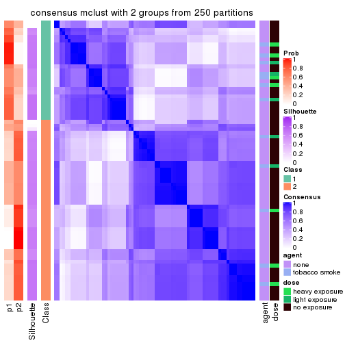</p>

</div>
<div id='tab-CV-mclust-consensus-heatmap-2'>
<pre><code class="r">consensus_heatmap(res, k = 3)
</code></pre>

<p>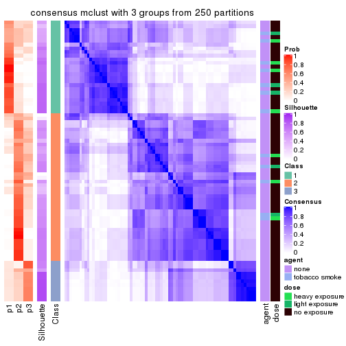</p>

</div>
<div id='tab-CV-mclust-consensus-heatmap-3'>
<pre><code class="r">consensus_heatmap(res, k = 4)
</code></pre>

<p>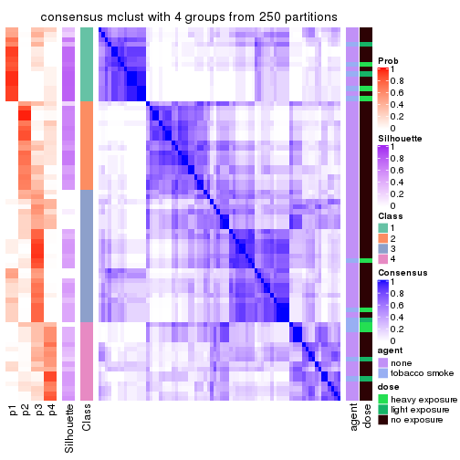</p>

</div>
<div id='tab-CV-mclust-consensus-heatmap-4'>
<pre><code class="r">consensus_heatmap(res, k = 5)
</code></pre>

<p>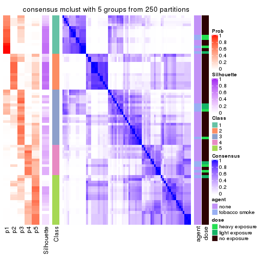</p>

</div>
<div id='tab-CV-mclust-consensus-heatmap-5'>
<pre><code class="r">consensus_heatmap(res, k = 6)
</code></pre>

<p>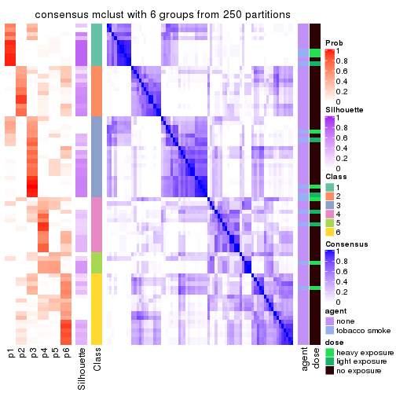</p>

</div>
</div>

Heatmaps for the membership of samples in all partitions to see how consistent they are:


<script>
$( function() {
	$( '#tabs-CV-mclust-membership-heatmap' ).tabs();
} );
</script>
<div id='tabs-CV-mclust-membership-heatmap'>
<ul>
<li><a href='#tab-CV-mclust-membership-heatmap-1'>k = 2</a></li>
<li><a href='#tab-CV-mclust-membership-heatmap-2'>k = 3</a></li>
<li><a href='#tab-CV-mclust-membership-heatmap-3'>k = 4</a></li>
<li><a href='#tab-CV-mclust-membership-heatmap-4'>k = 5</a></li>
<li><a href='#tab-CV-mclust-membership-heatmap-5'>k = 6</a></li>
</ul>
<div id='tab-CV-mclust-membership-heatmap-1'>
<pre><code class="r">membership_heatmap(res, k = 2)
</code></pre>

<p>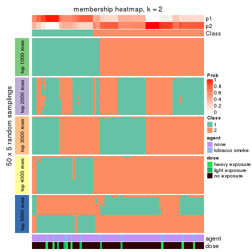</p>

</div>
<div id='tab-CV-mclust-membership-heatmap-2'>
<pre><code class="r">membership_heatmap(res, k = 3)
</code></pre>

<p>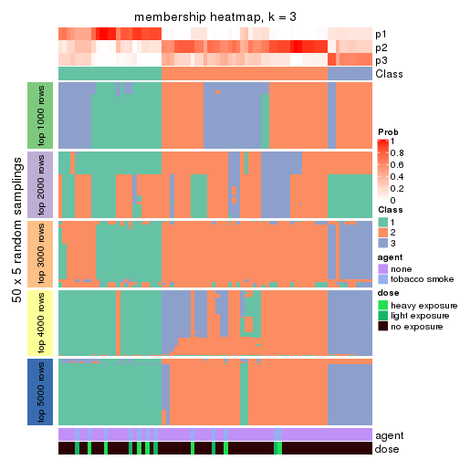</p>

</div>
<div id='tab-CV-mclust-membership-heatmap-3'>
<pre><code class="r">membership_heatmap(res, k = 4)
</code></pre>

<p>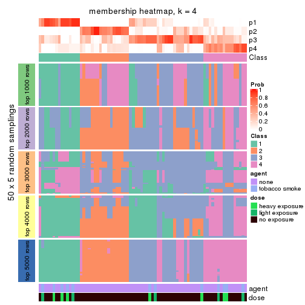</p>

</div>
<div id='tab-CV-mclust-membership-heatmap-4'>
<pre><code class="r">membership_heatmap(res, k = 5)
</code></pre>

<p>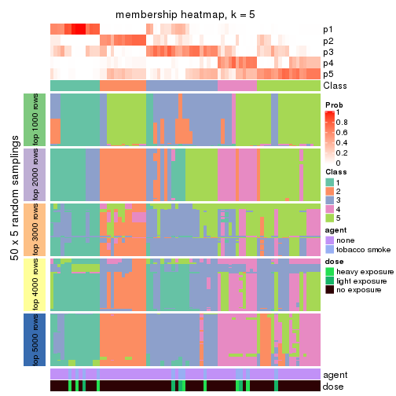</p>

</div>
<div id='tab-CV-mclust-membership-heatmap-5'>
<pre><code class="r">membership_heatmap(res, k = 6)
</code></pre>

<p>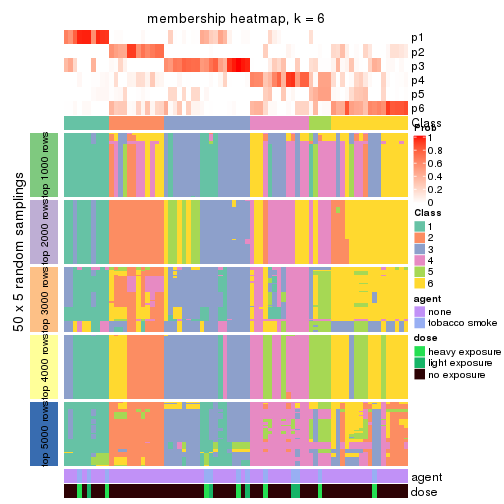</p>

</div>
</div>

As soon as we have had the classes for columns, we can look for signatures
which are significantly different between classes which can be candidate marks
for certain classes. Following are the heatmaps for signatures.


Signature heatmaps where rows are scaled:


<script>
$( function() {
	$( '#tabs-CV-mclust-get-signatures' ).tabs();
} );
</script>
<div id='tabs-CV-mclust-get-signatures'>
<ul>
<li><a href='#tab-CV-mclust-get-signatures-1'>k = 2</a></li>
<li><a href='#tab-CV-mclust-get-signatures-2'>k = 3</a></li>
<li><a href='#tab-CV-mclust-get-signatures-3'>k = 4</a></li>
<li><a href='#tab-CV-mclust-get-signatures-4'>k = 5</a></li>
<li><a href='#tab-CV-mclust-get-signatures-5'>k = 6</a></li>
</ul>
<div id='tab-CV-mclust-get-signatures-1'>
<pre><code class="r">get_signatures(res, k = 2)
</code></pre>

<p>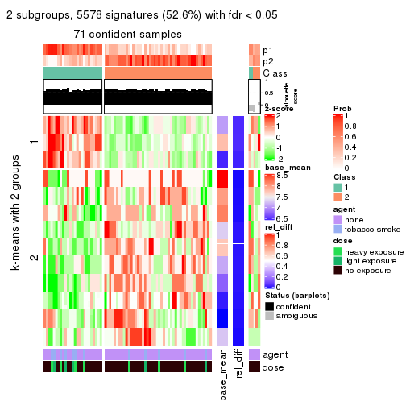</p>

</div>
<div id='tab-CV-mclust-get-signatures-2'>
<pre><code class="r">get_signatures(res, k = 3)
</code></pre>

<p>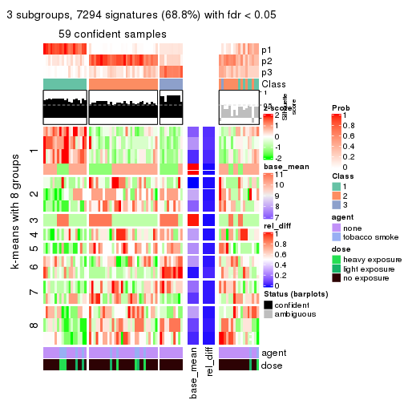</p>

</div>
<div id='tab-CV-mclust-get-signatures-3'>
<pre><code class="r">get_signatures(res, k = 4)
</code></pre>

<p>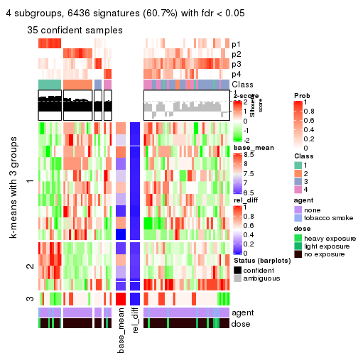</p>

</div>
<div id='tab-CV-mclust-get-signatures-4'>
<pre><code class="r">get_signatures(res, k = 5)
</code></pre>

<p>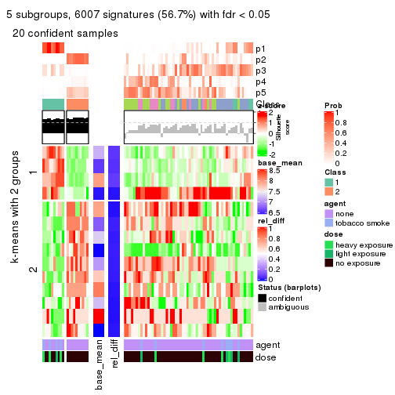</p>

</div>
<div id='tab-CV-mclust-get-signatures-5'>
<pre><code class="r">get_signatures(res, k = 6)
</code></pre>

<p>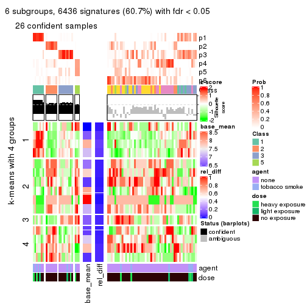</p>

</div>
</div>


Signature heatmaps where rows are not scaled:


<script>
$( function() {
	$( '#tabs-CV-mclust-get-signatures-no-scale' ).tabs();
} );
</script>
<div id='tabs-CV-mclust-get-signatures-no-scale'>
<ul>
<li><a href='#tab-CV-mclust-get-signatures-no-scale-1'>k = 2</a></li>
<li><a href='#tab-CV-mclust-get-signatures-no-scale-2'>k = 3</a></li>
<li><a href='#tab-CV-mclust-get-signatures-no-scale-3'>k = 4</a></li>
<li><a href='#tab-CV-mclust-get-signatures-no-scale-4'>k = 5</a></li>
<li><a href='#tab-CV-mclust-get-signatures-no-scale-5'>k = 6</a></li>
</ul>
<div id='tab-CV-mclust-get-signatures-no-scale-1'>
<pre><code class="r">get_signatures(res, k = 2, scale_rows = FALSE)
</code></pre>

<p>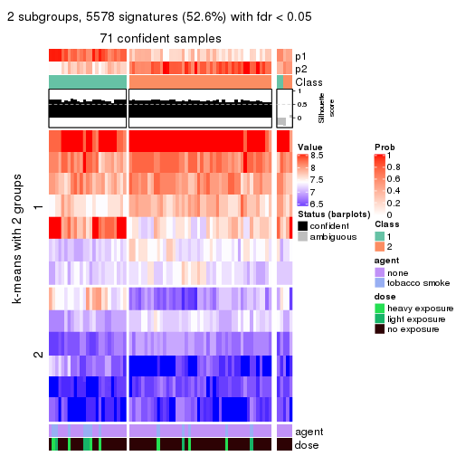</p>

</div>
<div id='tab-CV-mclust-get-signatures-no-scale-2'>
<pre><code class="r">get_signatures(res, k = 3, scale_rows = FALSE)
</code></pre>

<p>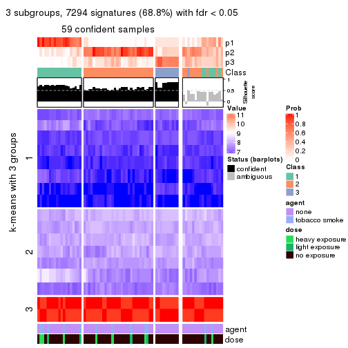</p>

</div>
<div id='tab-CV-mclust-get-signatures-no-scale-3'>
<pre><code class="r">get_signatures(res, k = 4, scale_rows = FALSE)
</code></pre>

<p>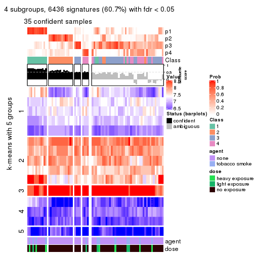</p>

</div>
<div id='tab-CV-mclust-get-signatures-no-scale-4'>
<pre><code class="r">get_signatures(res, k = 5, scale_rows = FALSE)
</code></pre>

<p>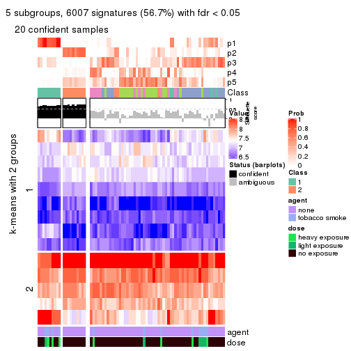</p>

</div>
<div id='tab-CV-mclust-get-signatures-no-scale-5'>
<pre><code class="r">get_signatures(res, k = 6, scale_rows = FALSE)
</code></pre>

<p>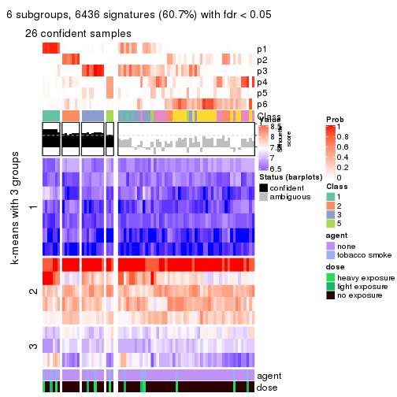</p>

</div>
</div>


Compare the overlap of signatures from different k:

```r
compare_signatures(res)
```

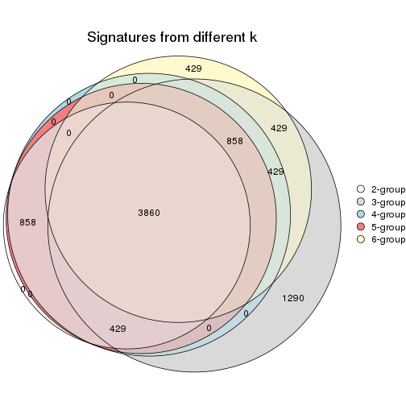

`get_signature()` returns a data frame invisibly. TO get the list of signatures, the function
call should be assigned to a variable explicitly. In following code, if `plot` argument is set
to `FALSE`, no heatmap is plotted while only the differential analysis is performed.

```r
# code only for demonstration
tb = get_signature(res, k = ..., plot = FALSE)
```

An example of the output of `tb` is:

```
#>   which_row         fdr    mean_1    mean_2 scaled_mean_1 scaled_mean_2 km
#> 1        38 0.042760348  8.373488  9.131774    -0.5533452     0.5164555  1
#> 2        40 0.018707592  7.106213  8.469186    -0.6173731     0.5762149  1
#> 3        55 0.019134737 10.221463 11.207825    -0.6159697     0.5749050  1
#> 4        59 0.006059896  5.921854  7.869574    -0.6899429     0.6439467  1
#> 5        60 0.018055526  8.928898 10.211722    -0.6204761     0.5791110  1
#> 6        98 0.009384629 15.714769 14.887706     0.6635654    -0.6193277  2
...
```

The columns in `tb` are:

1. `which_row`: row indices corresponding to the input matrix.
2. `fdr`: FDR for the differential test. 
3. `mean_x`: The mean value in group x.
4. `scaled_mean_x`: The mean value in group x after rows are scaled.
5. `km`: Row groups if k-means clustering is applied to rows.


UMAP plot which shows how samples are separated.


<script>
$( function() {
	$( '#tabs-CV-mclust-dimension-reduction' ).tabs();
} );
</script>
<div id='tabs-CV-mclust-dimension-reduction'>
<ul>
<li><a href='#tab-CV-mclust-dimension-reduction-1'>k = 2</a></li>
<li><a href='#tab-CV-mclust-dimension-reduction-2'>k = 3</a></li>
<li><a href='#tab-CV-mclust-dimension-reduction-3'>k = 4</a></li>
<li><a href='#tab-CV-mclust-dimension-reduction-4'>k = 5</a></li>
<li><a href='#tab-CV-mclust-dimension-reduction-5'>k = 6</a></li>
</ul>
<div id='tab-CV-mclust-dimension-reduction-1'>
<pre><code class="r">dimension_reduction(res, k = 2, method = &quot;UMAP&quot;)
</code></pre>

<p>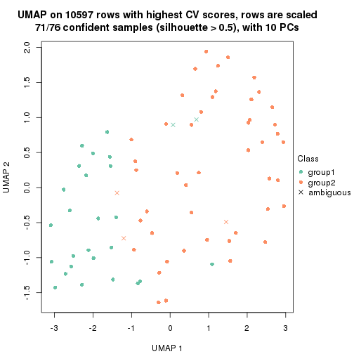</p>

</div>
<div id='tab-CV-mclust-dimension-reduction-2'>
<pre><code class="r">dimension_reduction(res, k = 3, method = &quot;UMAP&quot;)
</code></pre>

<p>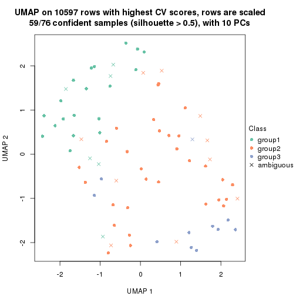</p>

</div>
<div id='tab-CV-mclust-dimension-reduction-3'>
<pre><code class="r">dimension_reduction(res, k = 4, method = &quot;UMAP&quot;)
</code></pre>

<p>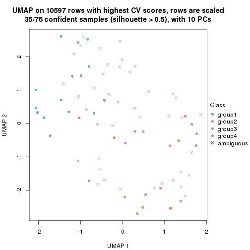</p>

</div>
<div id='tab-CV-mclust-dimension-reduction-4'>
<pre><code class="r">dimension_reduction(res, k = 5, method = &quot;UMAP&quot;)
</code></pre>

<p>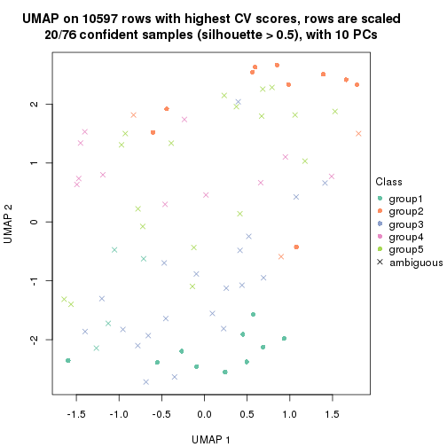</p>

</div>
<div id='tab-CV-mclust-dimension-reduction-5'>
<pre><code class="r">dimension_reduction(res, k = 6, method = &quot;UMAP&quot;)
</code></pre>

<p>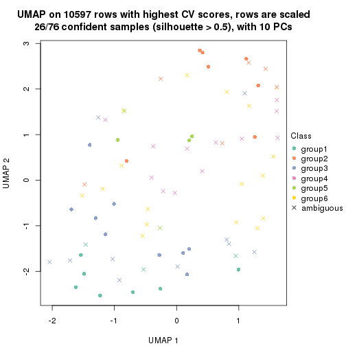</p>

</div>
</div>


Following heatmap shows how subgroups are split when increasing `k`:

```r
collect_classes(res)
```

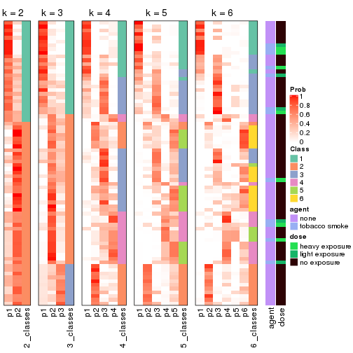


Test correlation between subgroups and known annotations. If the known
annotation is numeric, one-way ANOVA test is applied, and if the known
annotation is discrete, chi-squared contingency table test is applied.

```r
test_to_known_factors(res)
```

```
#>            n agent(p) dose(p) k
#> CV:mclust 71   0.1315  0.1832 2
#> CV:mclust 59   0.1992  0.5206 3
#> CV:mclust 35   0.0689  0.1017 4
#> CV:mclust 20   0.0935  0.0821 5
#> CV:mclust 26   0.2811  0.5714 6
```


If matrix rows can be associated to genes, consider to use `GO_Enrichment(res,
...)` to perform function enrichment for the signature genes.


 

---------------------------------------------------


### CV:NMF


The object with results only for a single top-value method and a single partition method 
can be extracted as:

```r
res = res_list["CV", "NMF"]
# you can also extract it by
# res = res_list["CV:NMF"]
```

A summary of `res` and all the functions that can be applied to it:

```r
res
```

```
#> A 'ConsensusPartition' object with k = 2, 3, 4, 5, 6.
#>   On a matrix with 10597 rows and 76 columns.
#>   Top rows (1000, 2000, 3000, 4000, 5000) are extracted by 'CV' method.
#>   Subgroups are detected by 'NMF' method.
#>   Performed in total 1250 partitions by row resampling.
#>   Best k for subgroups seems to be 2.
#> 
#> Following methods can be applied to this 'ConsensusPartition' object:
#>  [1] "cola_report"             "collect_classes"         "collect_plots"          
#>  [4] "collect_stats"           "colnames"                "compare_signatures"     
#>  [7] "consensus_heatmap"       "dimension_reduction"     "functional_enrichment"  
#> [10] "get_anno_col"            "get_anno"                "get_classes"            
#> [13] "get_consensus"           "get_matrix"              "get_membership"         
#> [16] "get_param"               "get_signatures"          "get_stats"              
#> [19] "is_best_k"               "is_stable_k"             "membership_heatmap"     
#> [22] "ncol"                    "nrow"                    "plot_ecdf"              
#> [25] "rownames"                "select_partition_number" "show"                   
#> [28] "suggest_best_k"          "test_to_known_factors"
```

`collect_plots()` function collects all the plots made from `res` for all `k` (number of partitions)
into one single page to provide an easy and fast comparison between different `k`.

```r
collect_plots(res)
```

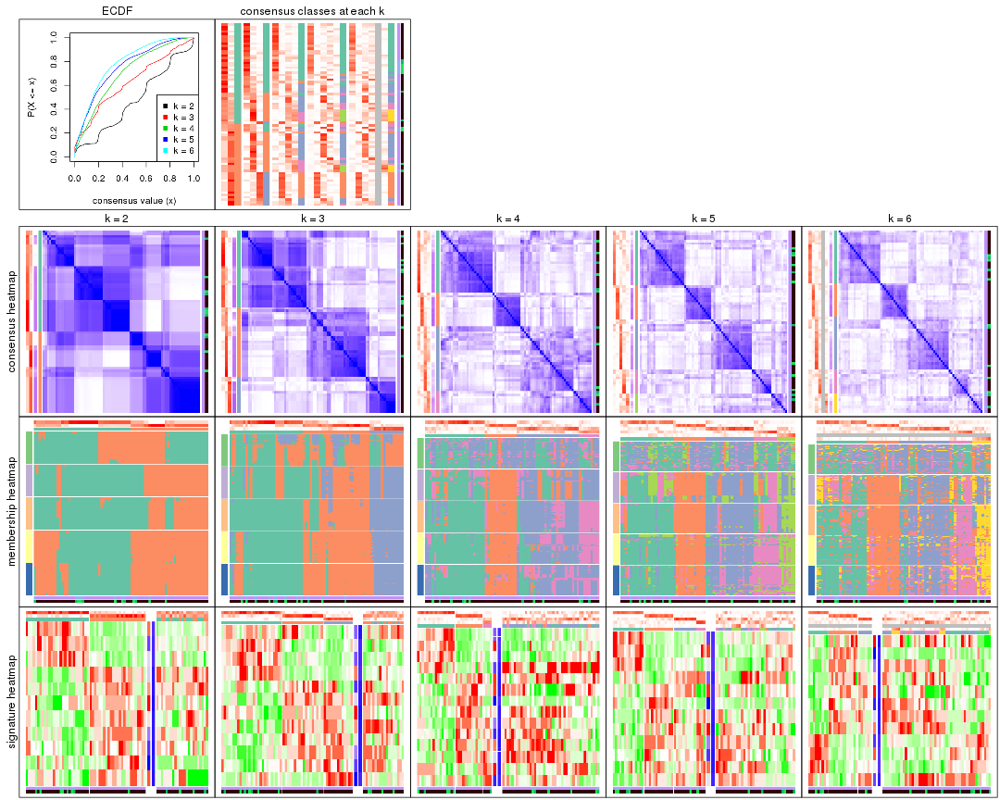

The plots are:

- The first row: a plot of the ECDF (Empirical cumulative distribution
  function) curves of the consensus matrix for each `k` and the heatmap of
  predicted classes for each `k`.
- The second row: heatmaps of the consensus matrix for each `k`.
- The third row: heatmaps of the membership matrix for each `k`.
- The fouth row: heatmaps of the signatures for each `k`.

All the plots in panels can be made by individual functions and they are
plotted later in this section.

`select_partition_number()` produces several plots showing different
statistics for choosing "optimized" `k`. There are following statistics:

- ECDF curves of the consensus matrix for each `k`;
- 1-PAC. [The PAC
  score](https://en.wikipedia.org/wiki/Consensus_clustering#Over-interpretation_potential_of_consensus_clustering)
  measures the proportion of the ambiguous subgrouping.
- Mean silhouette score.
- Concordance. The mean probability of fiting the consensus class ids in all
  partitions.
- Area increased. Denote $A_k$ as the area under the ECDF curve for current
  `k`, the area increased is defined as $A_k - A_{k-1}$.
- Rand index. The percent of pairs of samples that are both in a same cluster
  or both are not in a same cluster in the partition of k and k-1.
- Jaccard index. The ratio of pairs of samples are both in a same cluster in
  the partition of k and k-1 and the pairs of samples are both in a same
  cluster in the partition k or k-1.

The detailed explanations of these statistics can be found in [the cola
vignette](http://bioconductor.org/packages/devel/bioc/vignettes/cola/inst/doc/cola.html#toc_13).

Generally speaking, lower PAC score, higher mean silhouette score or higher
concordance corresponds to better partition. Rand index and Jaccard index
measure how similar the current partition is compared to partition with `k-1`.
If they are too similar, we won't accept `k` is better than `k-1`.

```r
select_partition_number(res)
```

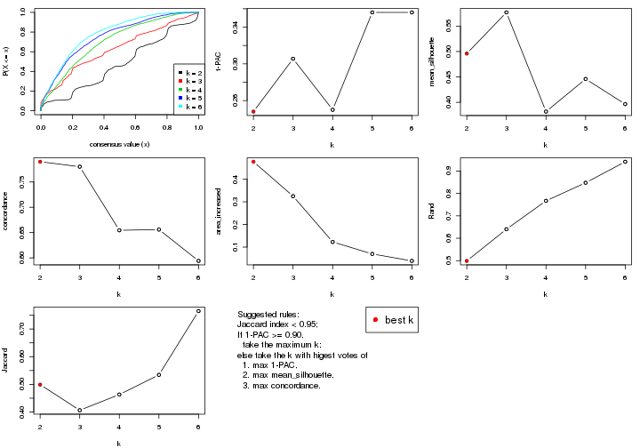

The numeric values for all these statistics can be obtained by `get_stats()`.

```r
get_stats(res)
```

```
#>   k 1-PAC mean_silhouette concordance area_increased  Rand Jaccard
#> 2 2 0.248           0.496       0.790         0.4769 0.499   0.499
#> 3 3 0.306           0.577       0.780         0.3249 0.640   0.406
#> 4 4 0.250           0.382       0.655         0.1228 0.767   0.463
#> 5 5 0.356           0.446       0.656         0.0698 0.848   0.534
#> 6 6 0.356           0.397       0.594         0.0391 0.941   0.765
```

`suggest_best_k()` suggests the best $k$ based on these statistics. The rules are as follows:

- All $k$ with Jaccard index larger than 0.95 are removed because the increase of
  the partition number does not provides enough extra information. If all $k$ are removed,
  the best $k$ is assigned by `NA`.
- For $k$ with 1-PAC larger than 0.9, the maximal $k$ is taken as the "best k". Other $k$ is called "optional k".
- If it does not fit the second rule. The $k$ with the highest vote of highest
  1-PAC, mean silhouette and concordance is taken as the "best k".

```r
suggest_best_k(res)
```

```
#> [1] 2
```


Following shows the table of the partitions (You need to click the **show/hide
code output** link to see it). The membership matrix (columns with name `p*`)
is inferred by
[`clue::cl_consensus()`](https://www.rdocumentation.org/link/cl_consensus?package=clue)
function with the `SE` method. Basically the value in the membership matrix
represents the probability to belong to a certain group. The finall class
label for an item is determined with the group with highest probability it
belongs to.

In `get_classes()` function, the entropy is calculated from the membership
matrix and the silhouette score is calculated from the consensus matrix.


<script>
$( function() {
	$( '#tabs-CV-NMF-get-classes' ).tabs();
} );
</script>
<div id='tabs-CV-NMF-get-classes'>
<ul>
<li><a href='#tab-CV-NMF-get-classes-1'>k = 2</a></li>
<li><a href='#tab-CV-NMF-get-classes-2'>k = 3</a></li>
<li><a href='#tab-CV-NMF-get-classes-3'>k = 4</a></li>
<li><a href='#tab-CV-NMF-get-classes-4'>k = 5</a></li>
<li><a href='#tab-CV-NMF-get-classes-5'>k = 6</a></li>
</ul>

<div id='tab-CV-NMF-get-classes-1'>
<p><a id='tab-CV-NMF-get-classes-1-a' style='color:#0366d6' href='#'>show/hide code output</a></p>
<pre><code class="r">cbind(get_classes(res, k = 2), get_membership(res, k = 2))
</code></pre>

<pre><code>#&gt;           class entropy silhouette    p1    p2
#&gt; GSM451162     1  0.9833    -0.1126 0.576 0.424
#&gt; GSM451163     2  0.7299     0.7120 0.204 0.796
#&gt; GSM451164     2  0.7219     0.7129 0.200 0.800
#&gt; GSM451165     2  0.0000     0.6467 0.000 1.000
#&gt; GSM451167     2  0.9710     0.5112 0.400 0.600
#&gt; GSM451168     2  0.0000     0.6467 0.000 1.000
#&gt; GSM451169     2  0.9732     0.5066 0.404 0.596
#&gt; GSM451170     1  0.7219     0.6420 0.800 0.200
#&gt; GSM451171     2  0.7219     0.7129 0.200 0.800
#&gt; GSM451172     2  0.7219     0.7129 0.200 0.800
#&gt; GSM451173     1  0.0000     0.6780 1.000 0.000
#&gt; GSM451174     2  0.7219     0.4898 0.200 0.800
#&gt; GSM451175     1  0.0938     0.6796 0.988 0.012
#&gt; GSM451177     2  0.7219     0.7129 0.200 0.800
#&gt; GSM451178     2  0.7219     0.4898 0.200 0.800
#&gt; GSM451179     1  0.7139     0.6446 0.804 0.196
#&gt; GSM451180     2  0.7219     0.7129 0.200 0.800
#&gt; GSM451181     2  0.7602     0.7040 0.220 0.780
#&gt; GSM451182     1  0.7219     0.6420 0.800 0.200
#&gt; GSM451183     1  0.0000     0.6780 1.000 0.000
#&gt; GSM451184     1  0.9933    -0.1162 0.548 0.452
#&gt; GSM451185     1  0.7602     0.6352 0.780 0.220
#&gt; GSM451186     1  0.8555     0.6037 0.720 0.280
#&gt; GSM451187     2  0.7299     0.7120 0.204 0.796
#&gt; GSM451188     2  0.7219     0.7129 0.200 0.800
#&gt; GSM451189     1  0.6623     0.6554 0.828 0.172
#&gt; GSM451190     1  0.1633     0.6659 0.976 0.024
#&gt; GSM451191     1  0.8327     0.6045 0.736 0.264
#&gt; GSM451193     1  0.7453     0.4714 0.788 0.212
#&gt; GSM451195     1  0.0000     0.6780 1.000 0.000
#&gt; GSM451196     1  0.6973     0.6490 0.812 0.188
#&gt; GSM451197     1  0.0000     0.6780 1.000 0.000
#&gt; GSM451199     1  0.6887     0.6538 0.816 0.184
#&gt; GSM451201     1  0.0672     0.6793 0.992 0.008
#&gt; GSM451202     2  0.0000     0.6467 0.000 1.000
#&gt; GSM451203     1  0.5408     0.5858 0.876 0.124
#&gt; GSM451204     1  0.9710     0.0318 0.600 0.400
#&gt; GSM451205     2  0.7219     0.7129 0.200 0.800
#&gt; GSM451206     2  0.9000     0.5283 0.316 0.684
#&gt; GSM451207     1  0.9954    -0.1835 0.540 0.460
#&gt; GSM451208     2  0.0000     0.6467 0.000 1.000
#&gt; GSM451209     1  0.9909     0.0269 0.556 0.444
#&gt; GSM451210     2  0.7219     0.7129 0.200 0.800
#&gt; GSM451212     1  0.9710     0.0318 0.600 0.400
#&gt; GSM451213     2  0.9710     0.0297 0.400 0.600
#&gt; GSM451214     2  0.7219     0.7129 0.200 0.800
#&gt; GSM451215     2  0.7219     0.7129 0.200 0.800
#&gt; GSM451216     2  0.9710     0.0297 0.400 0.600
#&gt; GSM451217     2  0.7376     0.7104 0.208 0.792
#&gt; GSM451219     1  0.7453     0.6388 0.788 0.212
#&gt; GSM451220     1  0.0000     0.6780 1.000 0.000
#&gt; GSM451221     1  0.7883     0.6264 0.764 0.236
#&gt; GSM451222     1  0.0000     0.6780 1.000 0.000
#&gt; GSM451224     2  0.0000     0.6467 0.000 1.000
#&gt; GSM451225     2  0.9922    -0.1276 0.448 0.552
#&gt; GSM451226     2  0.8081     0.6733 0.248 0.752
#&gt; GSM451227     2  0.0000     0.6467 0.000 1.000
#&gt; GSM451228     1  0.9608     0.0768 0.616 0.384
#&gt; GSM451230     1  0.7602     0.4550 0.780 0.220
#&gt; GSM451231     1  0.9866     0.0308 0.568 0.432
#&gt; GSM451233     1  0.9710     0.0318 0.600 0.400
#&gt; GSM451234     2  0.9710     0.0297 0.400 0.600
#&gt; GSM451235     1  0.9944     0.0211 0.544 0.456
#&gt; GSM451236     1  0.9710     0.0318 0.600 0.400
#&gt; GSM451166     1  0.7815     0.4480 0.768 0.232
#&gt; GSM451194     1  0.0938     0.6796 0.988 0.012
#&gt; GSM451198     1  0.0000     0.6780 1.000 0.000
#&gt; GSM451218     2  0.9710     0.0297 0.400 0.600
#&gt; GSM451232     1  0.7219     0.6420 0.800 0.200
#&gt; GSM451176     1  0.6801     0.6526 0.820 0.180
#&gt; GSM451192     1  0.0000     0.6780 1.000 0.000
#&gt; GSM451200     1  0.0000     0.6780 1.000 0.000
#&gt; GSM451211     2  0.1414     0.6439 0.020 0.980
#&gt; GSM451223     2  0.9954     0.4116 0.460 0.540
#&gt; GSM451229     1  0.7219     0.6420 0.800 0.200
#&gt; GSM451237     2  0.9710     0.0297 0.400 0.600
</code></pre>

<script>
$('#tab-CV-NMF-get-classes-1-a').parent().next().next().hide();
$('#tab-CV-NMF-get-classes-1-a').click(function(){
  $('#tab-CV-NMF-get-classes-1-a').parent().next().next().toggle();
  return(false);
});
</script>
</div>

<div id='tab-CV-NMF-get-classes-2'>
<p><a id='tab-CV-NMF-get-classes-2-a' style='color:#0366d6' href='#'>show/hide code output</a></p>
<pre><code class="r">cbind(get_classes(res, k = 3), get_membership(res, k = 3))
</code></pre>

<pre><code>#&gt;           class entropy silhouette    p1    p2    p3
#&gt; GSM451162     2  0.9210     0.1932 0.296 0.520 0.184
#&gt; GSM451163     2  0.2796     0.6711 0.000 0.908 0.092
#&gt; GSM451164     3  0.5835     0.5476 0.000 0.340 0.660
#&gt; GSM451165     3  0.9187     0.2915 0.196 0.272 0.532
#&gt; GSM451167     2  0.2165     0.6807 0.000 0.936 0.064
#&gt; GSM451168     3  0.9541    -0.0735 0.192 0.384 0.424
#&gt; GSM451169     2  0.3045     0.6780 0.020 0.916 0.064
#&gt; GSM451170     1  0.0237     0.7235 0.996 0.000 0.004
#&gt; GSM451171     2  0.5835     0.3477 0.000 0.660 0.340
#&gt; GSM451172     2  0.6062     0.2955 0.000 0.616 0.384
#&gt; GSM451173     1  0.4521     0.7241 0.816 0.180 0.004
#&gt; GSM451174     2  0.4555     0.6400 0.200 0.800 0.000
#&gt; GSM451175     1  0.3941     0.7338 0.844 0.156 0.000
#&gt; GSM451177     3  0.2165     0.7163 0.000 0.064 0.936
#&gt; GSM451178     2  0.4249     0.6647 0.108 0.864 0.028
#&gt; GSM451179     1  0.4931     0.5607 0.768 0.232 0.000
#&gt; GSM451180     3  0.3752     0.7880 0.000 0.144 0.856
#&gt; GSM451181     2  0.0000     0.6869 0.000 1.000 0.000
#&gt; GSM451182     1  0.0237     0.7235 0.996 0.000 0.004
#&gt; GSM451183     1  0.4178     0.7288 0.828 0.172 0.000
#&gt; GSM451184     3  0.3619     0.7909 0.000 0.136 0.864
#&gt; GSM451185     1  0.0000     0.7221 1.000 0.000 0.000
#&gt; GSM451186     1  0.5926     0.0789 0.644 0.356 0.000
#&gt; GSM451187     2  0.3116     0.6552 0.000 0.892 0.108
#&gt; GSM451188     3  0.3619     0.7909 0.000 0.136 0.864
#&gt; GSM451189     1  0.1643     0.7354 0.956 0.044 0.000
#&gt; GSM451190     1  0.8792     0.5308 0.580 0.176 0.244
#&gt; GSM451191     1  0.4733     0.6404 0.800 0.004 0.196
#&gt; GSM451193     2  0.7980    -0.1062 0.400 0.536 0.064
#&gt; GSM451195     1  0.6126     0.5408 0.600 0.400 0.000
#&gt; GSM451196     1  0.0892     0.7321 0.980 0.020 0.000
#&gt; GSM451197     1  0.5538     0.7165 0.808 0.132 0.060
#&gt; GSM451199     1  0.1031     0.7336 0.976 0.024 0.000
#&gt; GSM451201     1  0.4519     0.7345 0.852 0.116 0.032
#&gt; GSM451202     3  0.4291     0.7016 0.180 0.000 0.820
#&gt; GSM451203     1  0.7032     0.5433 0.604 0.368 0.028
#&gt; GSM451204     2  0.4335     0.6691 0.036 0.864 0.100
#&gt; GSM451205     3  0.4235     0.7837 0.000 0.176 0.824
#&gt; GSM451206     2  0.3619     0.6393 0.000 0.864 0.136
#&gt; GSM451207     2  0.0000     0.6869 0.000 1.000 0.000
#&gt; GSM451208     2  0.8668     0.4732 0.180 0.596 0.224
#&gt; GSM451209     2  0.6291     0.1202 0.468 0.532 0.000
#&gt; GSM451210     3  0.4555     0.7758 0.000 0.200 0.800
#&gt; GSM451212     2  0.0424     0.6905 0.008 0.992 0.000
#&gt; GSM451213     2  0.4099     0.6604 0.140 0.852 0.008
#&gt; GSM451214     3  0.3619     0.7909 0.000 0.136 0.864
#&gt; GSM451215     3  0.4750     0.7679 0.000 0.216 0.784
#&gt; GSM451216     2  0.4099     0.6604 0.140 0.852 0.008
#&gt; GSM451217     2  0.3551     0.6547 0.000 0.868 0.132
#&gt; GSM451219     1  0.1964     0.7087 0.944 0.000 0.056
#&gt; GSM451220     1  0.6126     0.5408 0.600 0.400 0.000
#&gt; GSM451221     1  0.4504     0.5875 0.804 0.000 0.196
#&gt; GSM451222     1  0.4555     0.7174 0.800 0.200 0.000
#&gt; GSM451224     3  0.5473     0.7117 0.140 0.052 0.808
#&gt; GSM451225     1  0.6126    -0.0703 0.600 0.400 0.000
#&gt; GSM451226     3  0.3619     0.7909 0.000 0.136 0.864
#&gt; GSM451227     3  0.4452     0.6932 0.192 0.000 0.808
#&gt; GSM451228     2  0.2165     0.6807 0.000 0.936 0.064
#&gt; GSM451230     1  0.7727     0.4525 0.600 0.336 0.064
#&gt; GSM451231     2  0.6948     0.0194 0.472 0.512 0.016
#&gt; GSM451233     2  0.6111     0.1789 0.396 0.604 0.000
#&gt; GSM451234     2  0.6267     0.4129 0.452 0.548 0.000
#&gt; GSM451235     2  0.6597     0.5674 0.268 0.696 0.036
#&gt; GSM451236     2  0.1289     0.6974 0.032 0.968 0.000
#&gt; GSM451166     2  0.3752     0.6965 0.096 0.884 0.020
#&gt; GSM451194     1  0.4636     0.7345 0.852 0.104 0.044
#&gt; GSM451198     1  0.7727     0.5357 0.600 0.336 0.064
#&gt; GSM451218     2  0.6126     0.4911 0.400 0.600 0.000
#&gt; GSM451232     1  0.0000     0.7221 1.000 0.000 0.000
#&gt; GSM451176     1  0.2625     0.7336 0.916 0.084 0.000
#&gt; GSM451192     1  0.5696     0.7113 0.800 0.136 0.064
#&gt; GSM451200     1  0.5470     0.7146 0.796 0.168 0.036
#&gt; GSM451211     2  0.8650     0.4729 0.200 0.600 0.200
#&gt; GSM451223     1  0.8527     0.4554 0.504 0.400 0.096
#&gt; GSM451229     1  0.0000     0.7221 1.000 0.000 0.000
#&gt; GSM451237     1  0.6126    -0.0703 0.600 0.400 0.000
</code></pre>

<script>
$('#tab-CV-NMF-get-classes-2-a').parent().next().next().hide();
$('#tab-CV-NMF-get-classes-2-a').click(function(){
  $('#tab-CV-NMF-get-classes-2-a').parent().next().next().toggle();
  return(false);
});
</script>
</div>

<div id='tab-CV-NMF-get-classes-3'>
<p><a id='tab-CV-NMF-get-classes-3-a' style='color:#0366d6' href='#'>show/hide code output</a></p>
<pre><code class="r">cbind(get_classes(res, k = 4), get_membership(res, k = 4))
</code></pre>

<pre><code>#&gt;           class entropy silhouette    p1    p2    p3    p4
#&gt; GSM451162     3  0.9087    0.21858 0.120 0.192 0.468 0.220
#&gt; GSM451163     3  0.3545    0.35667 0.000 0.164 0.828 0.008
#&gt; GSM451164     3  0.3982    0.29620 0.000 0.220 0.776 0.004
#&gt; GSM451165     3  0.7013    0.27197 0.152 0.292 0.556 0.000
#&gt; GSM451167     3  0.3367    0.23933 0.000 0.028 0.864 0.108
#&gt; GSM451168     3  0.9188    0.15330 0.152 0.264 0.444 0.140
#&gt; GSM451169     3  0.4800    0.29220 0.044 0.024 0.804 0.128
#&gt; GSM451170     1  0.4126    0.63343 0.848 0.040 0.088 0.024
#&gt; GSM451171     3  0.7836   -0.13861 0.000 0.272 0.400 0.328
#&gt; GSM451172     3  0.5713    0.33747 0.020 0.256 0.692 0.032
#&gt; GSM451173     1  0.6215    0.61167 0.700 0.020 0.188 0.092
#&gt; GSM451174     3  0.6101    0.19497 0.164 0.036 0.724 0.076
#&gt; GSM451175     1  0.4100    0.67577 0.852 0.032 0.080 0.036
#&gt; GSM451177     2  0.3402    0.68575 0.000 0.832 0.004 0.164
#&gt; GSM451178     3  0.7085   -0.29406 0.096 0.008 0.468 0.428
#&gt; GSM451179     3  0.6119    0.22453 0.372 0.028 0.584 0.016
#&gt; GSM451180     2  0.4755    0.74115 0.000 0.760 0.200 0.040
#&gt; GSM451181     3  0.5543   -0.32218 0.000 0.028 0.612 0.360
#&gt; GSM451182     1  0.2505    0.66320 0.920 0.052 0.008 0.020
#&gt; GSM451183     1  0.5267    0.62908 0.760 0.012 0.168 0.060
#&gt; GSM451184     2  0.3636    0.76088 0.000 0.820 0.172 0.008
#&gt; GSM451185     1  0.1724    0.66540 0.948 0.032 0.000 0.020
#&gt; GSM451186     1  0.7664   -0.07732 0.464 0.024 0.396 0.116
#&gt; GSM451187     3  0.7463   -0.16748 0.000 0.180 0.456 0.364
#&gt; GSM451188     2  0.3380    0.75231 0.028 0.876 0.088 0.008
#&gt; GSM451189     1  0.2634    0.68133 0.920 0.020 0.032 0.028
#&gt; GSM451190     2  0.8604    0.22781 0.284 0.460 0.204 0.052
#&gt; GSM451191     1  0.7866    0.20406 0.496 0.256 0.236 0.012
#&gt; GSM451193     3  0.3736    0.34749 0.124 0.012 0.848 0.016
#&gt; GSM451195     3  0.6933   -0.13612 0.416 0.024 0.504 0.056
#&gt; GSM451196     1  0.2170    0.68132 0.936 0.016 0.036 0.012
#&gt; GSM451197     1  0.5334    0.65403 0.780 0.040 0.128 0.052
#&gt; GSM451199     1  0.3699    0.67380 0.864 0.048 0.080 0.008
#&gt; GSM451201     1  0.4462    0.67028 0.828 0.024 0.104 0.044
#&gt; GSM451202     2  0.4889    0.65717 0.152 0.788 0.044 0.016
#&gt; GSM451203     1  0.6078    0.30559 0.552 0.008 0.408 0.032
#&gt; GSM451204     3  0.6697   -0.41128 0.024 0.040 0.484 0.452
#&gt; GSM451205     2  0.3810    0.75173 0.000 0.804 0.188 0.008
#&gt; GSM451206     4  0.6376    0.40475 0.000 0.064 0.432 0.504
#&gt; GSM451207     4  0.6002    0.49234 0.016 0.016 0.448 0.520
#&gt; GSM451208     2  0.7730    0.03156 0.156 0.436 0.012 0.396
#&gt; GSM451209     3  0.7957    0.14871 0.308 0.012 0.464 0.216
#&gt; GSM451210     2  0.4647    0.75306 0.012 0.796 0.156 0.036
#&gt; GSM451212     4  0.5486    0.50362 0.016 0.004 0.376 0.604
#&gt; GSM451213     4  0.6650    0.57405 0.116 0.020 0.200 0.664
#&gt; GSM451214     2  0.3486    0.75272 0.000 0.812 0.188 0.000
#&gt; GSM451215     2  0.5929    0.69159 0.004 0.708 0.164 0.124
#&gt; GSM451216     4  0.6796    0.57377 0.128 0.020 0.200 0.652
#&gt; GSM451217     3  0.4538    0.34433 0.004 0.148 0.800 0.048
#&gt; GSM451219     1  0.6698    0.40266 0.632 0.208 0.156 0.004
#&gt; GSM451220     3  0.5775    0.25557 0.260 0.012 0.684 0.044
#&gt; GSM451221     1  0.6751    0.35583 0.576 0.328 0.088 0.008
#&gt; GSM451222     1  0.6097    0.61987 0.720 0.020 0.128 0.132
#&gt; GSM451224     2  0.4205    0.69999 0.124 0.820 0.000 0.056
#&gt; GSM451225     1  0.7783    0.10439 0.556 0.028 0.220 0.196
#&gt; GSM451226     2  0.4502    0.71236 0.016 0.748 0.236 0.000
#&gt; GSM451227     2  0.3182    0.68793 0.132 0.860 0.004 0.004
#&gt; GSM451228     3  0.3907    0.23934 0.004 0.008 0.808 0.180
#&gt; GSM451230     1  0.8343    0.14622 0.376 0.016 0.284 0.324
#&gt; GSM451231     1  0.7810    0.26126 0.536 0.024 0.180 0.260
#&gt; GSM451233     3  0.7928    0.00919 0.244 0.004 0.408 0.344
#&gt; GSM451234     3  0.8726    0.00395 0.348 0.040 0.364 0.248
#&gt; GSM451235     3  0.8283    0.17906 0.228 0.044 0.512 0.216
#&gt; GSM451236     4  0.5933    0.49956 0.036 0.000 0.464 0.500
#&gt; GSM451166     4  0.7414    0.52202 0.084 0.040 0.320 0.556
#&gt; GSM451194     1  0.6004    0.58963 0.700 0.032 0.224 0.044
#&gt; GSM451198     3  0.7441   -0.18982 0.404 0.004 0.444 0.148
#&gt; GSM451218     4  0.7420    0.33305 0.296 0.028 0.112 0.564
#&gt; GSM451232     1  0.1406    0.66122 0.960 0.024 0.000 0.016
#&gt; GSM451176     1  0.3561    0.66971 0.876 0.016 0.040 0.068
#&gt; GSM451192     1  0.6638    0.57088 0.672 0.020 0.168 0.140
#&gt; GSM451200     1  0.7770    0.29499 0.448 0.012 0.376 0.164
#&gt; GSM451211     4  0.9195    0.27675 0.168 0.212 0.156 0.464
#&gt; GSM451223     3  0.4772    0.34425 0.092 0.064 0.816 0.028
#&gt; GSM451229     1  0.0804    0.66617 0.980 0.008 0.000 0.012
#&gt; GSM451237     3  0.7753    0.12213 0.388 0.012 0.440 0.160
</code></pre>

<script>
$('#tab-CV-NMF-get-classes-3-a').parent().next().next().hide();
$('#tab-CV-NMF-get-classes-3-a').click(function(){
  $('#tab-CV-NMF-get-classes-3-a').parent().next().next().toggle();
  return(false);
});
</script>
</div>

<div id='tab-CV-NMF-get-classes-4'>
<p><a id='tab-CV-NMF-get-classes-4-a' style='color:#0366d6' href='#'>show/hide code output</a></p>
<pre><code class="r">cbind(get_classes(res, k = 5), get_membership(res, k = 5))
</code></pre>

<pre><code>#&gt;           class entropy silhouette    p1    p2    p3    p4    p5
#&gt; GSM451162     3   0.302    0.59481 0.064 0.008 0.880 0.004 0.044
#&gt; GSM451163     3   0.171    0.60851 0.004 0.016 0.944 0.032 0.004
#&gt; GSM451164     3   0.438    0.45172 0.004 0.032 0.756 0.200 0.008
#&gt; GSM451165     3   0.700   -0.00185 0.032 0.132 0.444 0.388 0.004
#&gt; GSM451167     3   0.341    0.54874 0.008 0.004 0.840 0.128 0.020
#&gt; GSM451168     4   0.768    0.13388 0.044 0.312 0.156 0.464 0.024
#&gt; GSM451169     3   0.185    0.60642 0.036 0.020 0.936 0.008 0.000
#&gt; GSM451170     1   0.702    0.23824 0.372 0.004 0.260 0.360 0.004
#&gt; GSM451171     3   0.826   -0.13495 0.008 0.264 0.356 0.284 0.088
#&gt; GSM451172     3   0.452    0.56504 0.072 0.076 0.804 0.040 0.008
#&gt; GSM451173     1   0.435    0.59422 0.780 0.012 0.160 0.044 0.004
#&gt; GSM451174     3   0.483    0.42225 0.028 0.004 0.696 0.260 0.012
#&gt; GSM451175     1   0.561    0.57564 0.696 0.004 0.068 0.040 0.192
#&gt; GSM451177     2   0.280    0.66424 0.016 0.876 0.000 0.008 0.100
#&gt; GSM451178     3   0.586    0.40750 0.048 0.036 0.712 0.048 0.156
#&gt; GSM451179     3   0.631    0.40747 0.092 0.008 0.652 0.192 0.056
#&gt; GSM451180     2   0.519    0.67116 0.004 0.676 0.256 0.008 0.056
#&gt; GSM451181     3   0.561    0.47320 0.024 0.032 0.732 0.100 0.112
#&gt; GSM451182     1   0.446    0.49654 0.632 0.000 0.004 0.356 0.008
#&gt; GSM451183     1   0.411    0.60831 0.804 0.008 0.136 0.008 0.044
#&gt; GSM451184     2   0.431    0.72713 0.036 0.776 0.168 0.020 0.000
#&gt; GSM451185     1   0.578    0.55769 0.688 0.052 0.000 0.168 0.092
#&gt; GSM451186     4   0.249    0.53837 0.056 0.000 0.032 0.904 0.008
#&gt; GSM451187     3   0.473    0.50771 0.004 0.128 0.776 0.032 0.060
#&gt; GSM451188     2   0.344    0.71777 0.080 0.852 0.056 0.012 0.000
#&gt; GSM451189     1   0.541    0.58577 0.724 0.008 0.024 0.100 0.144
#&gt; GSM451190     1   0.692    0.24525 0.472 0.264 0.252 0.004 0.008
#&gt; GSM451191     2   0.864   -0.10721 0.296 0.304 0.152 0.240 0.008
#&gt; GSM451193     3   0.441    0.58738 0.060 0.008 0.796 0.120 0.016
#&gt; GSM451195     1   0.720    0.28977 0.456 0.008 0.336 0.024 0.176
#&gt; GSM451196     1   0.497    0.59482 0.740 0.000 0.016 0.140 0.104
#&gt; GSM451197     1   0.414    0.60978 0.808 0.012 0.116 0.060 0.004
#&gt; GSM451199     1   0.696    0.38708 0.544 0.124 0.036 0.284 0.012
#&gt; GSM451201     1   0.412    0.61189 0.816 0.016 0.072 0.092 0.004
#&gt; GSM451202     2   0.509    0.56934 0.044 0.688 0.008 0.252 0.008
#&gt; GSM451203     3   0.523    0.38366 0.304 0.016 0.648 0.016 0.016
#&gt; GSM451204     5   0.843    0.14506 0.036 0.052 0.292 0.288 0.332
#&gt; GSM451205     2   0.351    0.72174 0.004 0.792 0.196 0.000 0.008
#&gt; GSM451206     3   0.799   -0.07342 0.004 0.096 0.436 0.220 0.244
#&gt; GSM451207     5   0.773    0.26053 0.040 0.024 0.364 0.160 0.412
#&gt; GSM451208     2   0.615    0.58622 0.040 0.664 0.008 0.176 0.112
#&gt; GSM451209     4   0.686    0.36613 0.152 0.008 0.060 0.604 0.176
#&gt; GSM451210     2   0.673    0.62260 0.048 0.652 0.168 0.072 0.060
#&gt; GSM451212     5   0.703    0.29375 0.056 0.020 0.396 0.060 0.468
#&gt; GSM451213     5   0.590    0.44624 0.064 0.008 0.160 0.072 0.696
#&gt; GSM451214     2   0.395    0.72323 0.028 0.776 0.192 0.004 0.000
#&gt; GSM451215     2   0.501    0.71966 0.020 0.748 0.164 0.012 0.056
#&gt; GSM451216     5   0.470    0.36232 0.052 0.012 0.052 0.088 0.796
#&gt; GSM451217     3   0.364    0.58115 0.020 0.012 0.832 0.128 0.008
#&gt; GSM451219     1   0.755    0.07901 0.340 0.336 0.028 0.292 0.004
#&gt; GSM451220     3   0.402    0.49818 0.196 0.008 0.772 0.000 0.024
#&gt; GSM451221     1   0.819    0.14370 0.356 0.316 0.072 0.244 0.012
#&gt; GSM451222     1   0.552    0.51340 0.636 0.008 0.084 0.000 0.272
#&gt; GSM451224     2   0.429    0.66558 0.028 0.804 0.000 0.076 0.092
#&gt; GSM451225     4   0.398    0.53600 0.132 0.004 0.012 0.812 0.040
#&gt; GSM451226     2   0.510    0.61676 0.024 0.636 0.320 0.020 0.000
#&gt; GSM451227     2   0.373    0.67106 0.056 0.820 0.004 0.120 0.000
#&gt; GSM451228     3   0.218    0.60545 0.028 0.012 0.928 0.008 0.024
#&gt; GSM451230     1   0.692    0.40360 0.596 0.008 0.180 0.156 0.060
#&gt; GSM451231     4   0.847    0.24199 0.320 0.092 0.020 0.348 0.220
#&gt; GSM451233     4   0.852    0.09273 0.292 0.008 0.132 0.336 0.232
#&gt; GSM451234     4   0.254    0.53962 0.036 0.008 0.028 0.912 0.016
#&gt; GSM451235     4   0.638    0.42270 0.248 0.016 0.084 0.620 0.032
#&gt; GSM451236     5   0.778    0.31637 0.032 0.012 0.328 0.280 0.348
#&gt; GSM451166     5   0.719    0.33259 0.084 0.016 0.368 0.056 0.476
#&gt; GSM451194     1   0.516    0.59437 0.736 0.012 0.132 0.112 0.008
#&gt; GSM451198     3   0.536    0.18870 0.424 0.012 0.536 0.004 0.024
#&gt; GSM451218     5   0.505    0.05942 0.040 0.000 0.008 0.308 0.644
#&gt; GSM451232     1   0.432    0.52732 0.688 0.008 0.000 0.296 0.008
#&gt; GSM451176     1   0.603    0.53236 0.640 0.016 0.016 0.084 0.244
#&gt; GSM451192     1   0.367    0.58920 0.812 0.004 0.160 0.012 0.012
#&gt; GSM451200     1   0.522    0.29777 0.572 0.012 0.392 0.004 0.020
#&gt; GSM451211     4   0.741    0.23182 0.020 0.128 0.056 0.528 0.268
#&gt; GSM451223     3   0.304    0.60183 0.044 0.020 0.888 0.008 0.040
#&gt; GSM451229     1   0.477    0.56133 0.708 0.000 0.000 0.220 0.072
#&gt; GSM451237     4   0.270    0.53605 0.040 0.000 0.032 0.900 0.028
</code></pre>

<script>
$('#tab-CV-NMF-get-classes-4-a').parent().next().next().hide();
$('#tab-CV-NMF-get-classes-4-a').click(function(){
  $('#tab-CV-NMF-get-classes-4-a').parent().next().next().toggle();
  return(false);
});
</script>
</div>

<div id='tab-CV-NMF-get-classes-5'>
<p><a id='tab-CV-NMF-get-classes-5-a' style='color:#0366d6' href='#'>show/hide code output</a></p>
<pre><code class="r">cbind(get_classes(res, k = 6), get_membership(res, k = 6))
</code></pre>

<pre><code>#&gt;           class entropy silhouette    p1    p2    p3    p4 p5    p6
#&gt; GSM451162     3   0.512     0.4996 0.016 0.076 0.756 0.028 NA 0.056
#&gt; GSM451163     3   0.385     0.5315 0.000 0.040 0.816 0.072 NA 0.004
#&gt; GSM451164     3   0.537     0.4603 0.004 0.056 0.712 0.140 NA 0.020
#&gt; GSM451165     4   0.810     0.1515 0.072 0.196 0.296 0.364 NA 0.008
#&gt; GSM451167     3   0.425     0.5095 0.000 0.036 0.788 0.120 NA 0.024
#&gt; GSM451168     2   0.871    -0.0706 0.072 0.324 0.128 0.324 NA 0.044
#&gt; GSM451169     3   0.288     0.5371 0.012 0.044 0.884 0.004 NA 0.016
#&gt; GSM451170     1   0.721     0.3043 0.460 0.016 0.216 0.252 NA 0.012
#&gt; GSM451171     3   0.845    -0.1713 0.000 0.284 0.312 0.188 NA 0.120
#&gt; GSM451172     3   0.618     0.4442 0.044 0.152 0.660 0.040 NA 0.016
#&gt; GSM451173     1   0.616     0.5104 0.644 0.008 0.148 0.116 NA 0.016
#&gt; GSM451174     3   0.706     0.2150 0.080 0.008 0.536 0.252 NA 0.072
#&gt; GSM451175     1   0.689     0.4329 0.580 0.028 0.060 0.032 NA 0.216
#&gt; GSM451177     2   0.346     0.6470 0.000 0.812 0.000 0.008 NA 0.132
#&gt; GSM451178     3   0.608     0.3144 0.048 0.020 0.652 0.024 NA 0.188
#&gt; GSM451179     3   0.751     0.2939 0.120 0.024 0.544 0.176 NA 0.072
#&gt; GSM451180     2   0.455     0.6947 0.000 0.716 0.208 0.016 NA 0.056
#&gt; GSM451181     3   0.648     0.3661 0.008 0.040 0.636 0.080 NA 0.120
#&gt; GSM451182     1   0.532     0.4861 0.652 0.020 0.016 0.252 NA 0.004
#&gt; GSM451183     1   0.482     0.5495 0.756 0.032 0.140 0.016 NA 0.028
#&gt; GSM451184     2   0.497     0.6883 0.016 0.712 0.176 0.012 NA 0.004
#&gt; GSM451185     1   0.591     0.4850 0.668 0.112 0.000 0.124 NA 0.032
#&gt; GSM451186     4   0.485     0.4628 0.136 0.004 0.008 0.728 NA 0.016
#&gt; GSM451187     3   0.557     0.4444 0.008 0.120 0.708 0.024 NA 0.080
#&gt; GSM451188     2   0.289     0.7080 0.036 0.880 0.052 0.020 NA 0.000
#&gt; GSM451189     1   0.470     0.5464 0.776 0.004 0.040 0.068 NA 0.080
#&gt; GSM451190     1   0.640     0.4460 0.580 0.152 0.204 0.012 NA 0.004
#&gt; GSM451191     1   0.867     0.0946 0.300 0.244 0.144 0.220 NA 0.004
#&gt; GSM451193     3   0.559     0.4777 0.020 0.024 0.716 0.076 NA 0.052
#&gt; GSM451195     3   0.810     0.1141 0.284 0.016 0.396 0.040 NA 0.148
#&gt; GSM451196     1   0.313     0.5482 0.856 0.012 0.004 0.096 NA 0.024
#&gt; GSM451197     1   0.565     0.5445 0.700 0.044 0.108 0.080 NA 0.000
#&gt; GSM451199     1   0.720     0.3219 0.492 0.172 0.032 0.232 NA 0.000
#&gt; GSM451201     1   0.490     0.5646 0.748 0.020 0.096 0.092 NA 0.000
#&gt; GSM451202     2   0.524     0.5660 0.072 0.676 0.000 0.212 NA 0.020
#&gt; GSM451203     3   0.682     0.3431 0.236 0.024 0.564 0.068 NA 0.016
#&gt; GSM451204     6   0.896     0.0966 0.076 0.032 0.164 0.288 NA 0.288
#&gt; GSM451205     2   0.528     0.6876 0.008 0.676 0.216 0.068 NA 0.008
#&gt; GSM451206     3   0.766    -0.1111 0.000 0.036 0.404 0.180 NA 0.288
#&gt; GSM451207     6   0.799     0.1513 0.040 0.036 0.360 0.080 NA 0.372
#&gt; GSM451208     2   0.644     0.5291 0.056 0.604 0.012 0.168 NA 0.148
#&gt; GSM451209     4   0.760     0.3661 0.168 0.016 0.080 0.536 NA 0.104
#&gt; GSM451210     2   0.691     0.6258 0.028 0.608 0.148 0.112 NA 0.048
#&gt; GSM451212     6   0.642     0.3219 0.024 0.012 0.348 0.056 NA 0.516
#&gt; GSM451213     6   0.618     0.4555 0.088 0.016 0.148 0.020 NA 0.656
#&gt; GSM451214     2   0.317     0.7150 0.008 0.812 0.168 0.008 NA 0.000
#&gt; GSM451215     2   0.508     0.7103 0.020 0.724 0.172 0.036 NA 0.032
#&gt; GSM451216     6   0.423     0.3992 0.076 0.008 0.052 0.036 NA 0.808
#&gt; GSM451217     3   0.577     0.4475 0.012 0.052 0.668 0.168 NA 0.008
#&gt; GSM451219     1   0.764     0.1470 0.364 0.264 0.084 0.268 NA 0.004
#&gt; GSM451220     3   0.448     0.5081 0.084 0.016 0.788 0.008 NA 0.036
#&gt; GSM451221     1   0.804     0.1638 0.368 0.328 0.108 0.120 NA 0.004
#&gt; GSM451222     1   0.656     0.4030 0.568 0.012 0.092 0.020 NA 0.256
#&gt; GSM451224     2   0.396     0.6538 0.052 0.800 0.000 0.024 NA 0.116
#&gt; GSM451225     4   0.494     0.4746 0.236 0.008 0.000 0.680 NA 0.052
#&gt; GSM451226     2   0.630     0.6001 0.036 0.604 0.220 0.072 NA 0.000
#&gt; GSM451227     2   0.355     0.6547 0.084 0.832 0.008 0.064 NA 0.008
#&gt; GSM451228     3   0.336     0.5309 0.020 0.020 0.864 0.012 NA 0.048
#&gt; GSM451230     1   0.899     0.1473 0.360 0.044 0.152 0.124 NA 0.096
#&gt; GSM451231     4   0.864     0.1822 0.240 0.092 0.016 0.328 NA 0.236
#&gt; GSM451233     4   0.928    -0.0578 0.212 0.016 0.168 0.212 NA 0.196
#&gt; GSM451234     4   0.403     0.4901 0.120 0.008 0.004 0.800 NA 0.028
#&gt; GSM451235     4   0.656     0.3707 0.156 0.040 0.060 0.628 NA 0.016
#&gt; GSM451236     6   0.817     0.3654 0.044 0.024 0.240 0.228 NA 0.392
#&gt; GSM451166     6   0.785     0.3611 0.120 0.036 0.256 0.052 NA 0.472
#&gt; GSM451194     1   0.693     0.4784 0.564 0.024 0.160 0.144 NA 0.004
#&gt; GSM451198     3   0.626     0.0150 0.388 0.012 0.424 0.000 NA 0.008
#&gt; GSM451218     6   0.623    -0.1077 0.108 0.000 0.000 0.340 NA 0.496
#&gt; GSM451232     1   0.415     0.5048 0.748 0.016 0.000 0.200 NA 0.008
#&gt; GSM451176     1   0.643     0.4566 0.624 0.008 0.032 0.060 NA 0.168
#&gt; GSM451192     1   0.521     0.5222 0.700 0.036 0.132 0.008 NA 0.000
#&gt; GSM451200     3   0.688     0.1470 0.300 0.012 0.448 0.020 NA 0.012
#&gt; GSM451211     4   0.819     0.1209 0.076 0.148 0.016 0.360 NA 0.328
#&gt; GSM451223     3   0.368     0.5298 0.020 0.036 0.848 0.024 NA 0.052
#&gt; GSM451229     1   0.396     0.5232 0.768 0.028 0.000 0.176 NA 0.000
#&gt; GSM451237     4   0.309     0.4921 0.148 0.000 0.004 0.828 NA 0.008
</code></pre>

<script>
$('#tab-CV-NMF-get-classes-5-a').parent().next().next().hide();
$('#tab-CV-NMF-get-classes-5-a').click(function(){
  $('#tab-CV-NMF-get-classes-5-a').parent().next().next().toggle();
  return(false);
});
</script>
</div>
</div>

Heatmaps for the consensus matrix. It visualizes the probability of two
samples to be in a same group.


<script>
$( function() {
	$( '#tabs-CV-NMF-consensus-heatmap' ).tabs();
} );
</script>
<div id='tabs-CV-NMF-consensus-heatmap'>
<ul>
<li><a href='#tab-CV-NMF-consensus-heatmap-1'>k = 2</a></li>
<li><a href='#tab-CV-NMF-consensus-heatmap-2'>k = 3</a></li>
<li><a href='#tab-CV-NMF-consensus-heatmap-3'>k = 4</a></li>
<li><a href='#tab-CV-NMF-consensus-heatmap-4'>k = 5</a></li>
<li><a href='#tab-CV-NMF-consensus-heatmap-5'>k = 6</a></li>
</ul>
<div id='tab-CV-NMF-consensus-heatmap-1'>
<pre><code class="r">consensus_heatmap(res, k = 2)
</code></pre>

<p>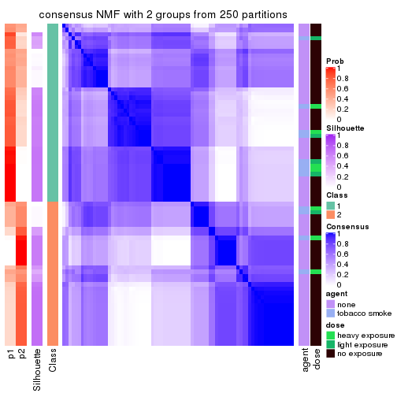</p>

</div>
<div id='tab-CV-NMF-consensus-heatmap-2'>
<pre><code class="r">consensus_heatmap(res, k = 3)
</code></pre>

<p>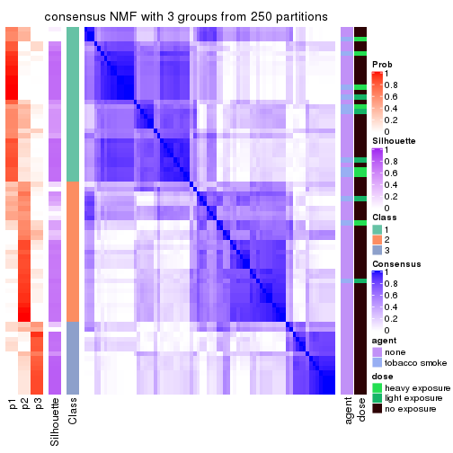</p>

</div>
<div id='tab-CV-NMF-consensus-heatmap-3'>
<pre><code class="r">consensus_heatmap(res, k = 4)
</code></pre>

<p>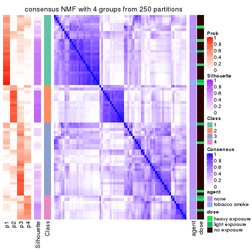</p>

</div>
<div id='tab-CV-NMF-consensus-heatmap-4'>
<pre><code class="r">consensus_heatmap(res, k = 5)
</code></pre>

<p>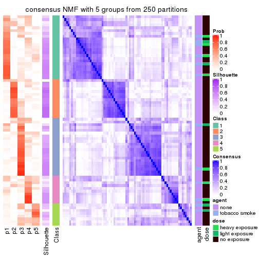</p>

</div>
<div id='tab-CV-NMF-consensus-heatmap-5'>
<pre><code class="r">consensus_heatmap(res, k = 6)
</code></pre>

<p>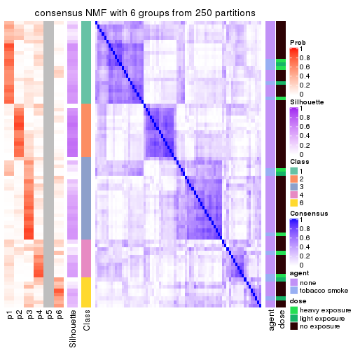</p>

</div>
</div>

Heatmaps for the membership of samples in all partitions to see how consistent they are:


<script>
$( function() {
	$( '#tabs-CV-NMF-membership-heatmap' ).tabs();
} );
</script>
<div id='tabs-CV-NMF-membership-heatmap'>
<ul>
<li><a href='#tab-CV-NMF-membership-heatmap-1'>k = 2</a></li>
<li><a href='#tab-CV-NMF-membership-heatmap-2'>k = 3</a></li>
<li><a href='#tab-CV-NMF-membership-heatmap-3'>k = 4</a></li>
<li><a href='#tab-CV-NMF-membership-heatmap-4'>k = 5</a></li>
<li><a href='#tab-CV-NMF-membership-heatmap-5'>k = 6</a></li>
</ul>
<div id='tab-CV-NMF-membership-heatmap-1'>
<pre><code class="r">membership_heatmap(res, k = 2)
</code></pre>

<p>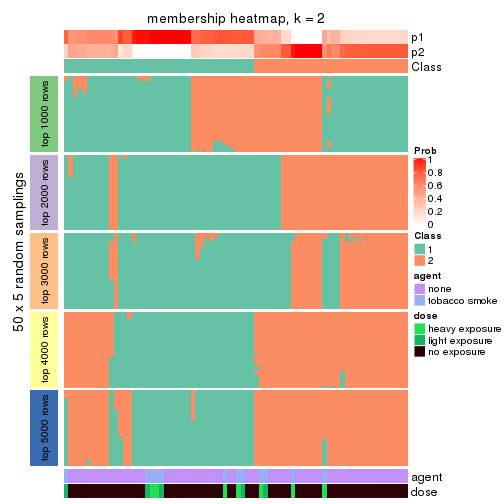</p>

</div>
<div id='tab-CV-NMF-membership-heatmap-2'>
<pre><code class="r">membership_heatmap(res, k = 3)
</code></pre>

<p>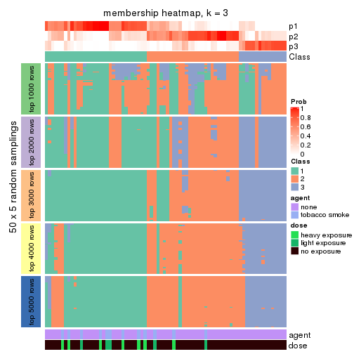</p>

</div>
<div id='tab-CV-NMF-membership-heatmap-3'>
<pre><code class="r">membership_heatmap(res, k = 4)
</code></pre>

<p>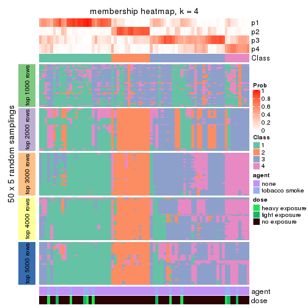</p>

</div>
<div id='tab-CV-NMF-membership-heatmap-4'>
<pre><code class="r">membership_heatmap(res, k = 5)
</code></pre>

<p>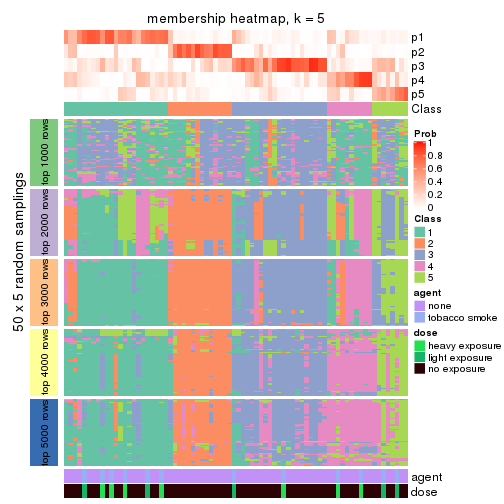</p>

</div>
<div id='tab-CV-NMF-membership-heatmap-5'>
<pre><code class="r">membership_heatmap(res, k = 6)
</code></pre>

<p>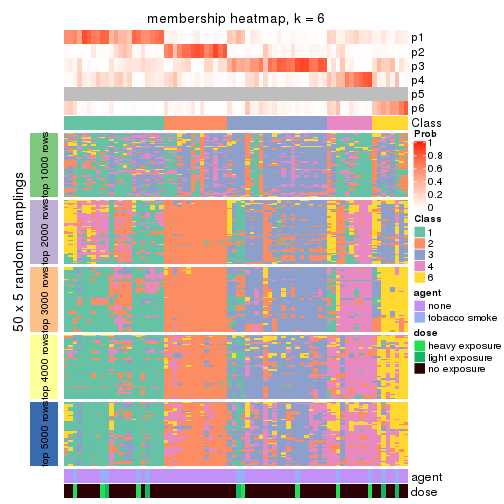</p>

</div>
</div>

As soon as we have had the classes for columns, we can look for signatures
which are significantly different between classes which can be candidate marks
for certain classes. Following are the heatmaps for signatures.


Signature heatmaps where rows are scaled:


<script>
$( function() {
	$( '#tabs-CV-NMF-get-signatures' ).tabs();
} );
</script>
<div id='tabs-CV-NMF-get-signatures'>
<ul>
<li><a href='#tab-CV-NMF-get-signatures-1'>k = 2</a></li>
<li><a href='#tab-CV-NMF-get-signatures-2'>k = 3</a></li>
<li><a href='#tab-CV-NMF-get-signatures-3'>k = 4</a></li>
<li><a href='#tab-CV-NMF-get-signatures-4'>k = 5</a></li>
<li><a href='#tab-CV-NMF-get-signatures-5'>k = 6</a></li>
</ul>
<div id='tab-CV-NMF-get-signatures-1'>
<pre><code class="r">get_signatures(res, k = 2)
</code></pre>

<p>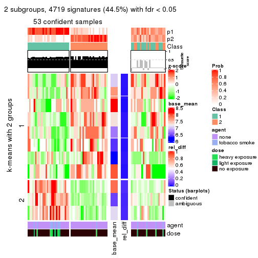</p>

</div>
<div id='tab-CV-NMF-get-signatures-2'>
<pre><code class="r">get_signatures(res, k = 3)
</code></pre>

<p>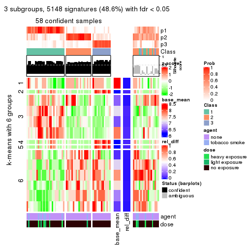</p>

</div>
<div id='tab-CV-NMF-get-signatures-3'>
<pre><code class="r">get_signatures(res, k = 4)
</code></pre>

<p>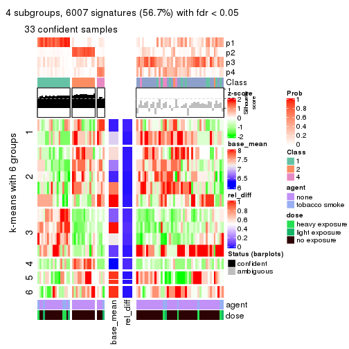</p>

</div>
<div id='tab-CV-NMF-get-signatures-4'>
<pre><code class="r">get_signatures(res, k = 5)
</code></pre>

<p>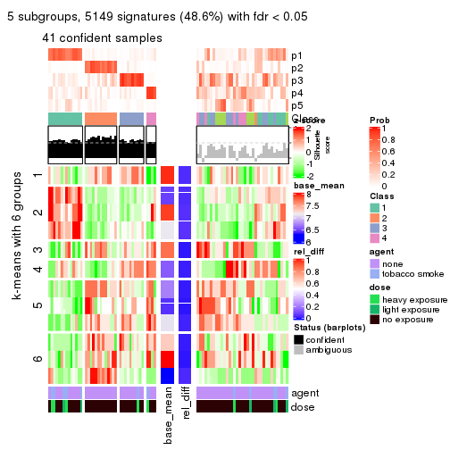</p>

</div>
<div id='tab-CV-NMF-get-signatures-5'>
<pre><code class="r">get_signatures(res, k = 6)
</code></pre>

<p>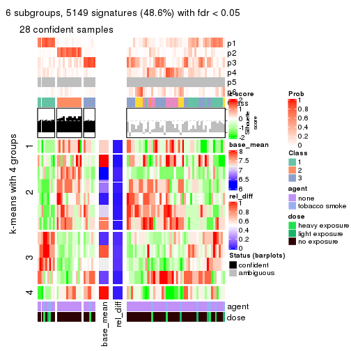</p>

</div>
</div>


Signature heatmaps where rows are not scaled:


<script>
$( function() {
	$( '#tabs-CV-NMF-get-signatures-no-scale' ).tabs();
} );
</script>
<div id='tabs-CV-NMF-get-signatures-no-scale'>
<ul>
<li><a href='#tab-CV-NMF-get-signatures-no-scale-1'>k = 2</a></li>
<li><a href='#tab-CV-NMF-get-signatures-no-scale-2'>k = 3</a></li>
<li><a href='#tab-CV-NMF-get-signatures-no-scale-3'>k = 4</a></li>
<li><a href='#tab-CV-NMF-get-signatures-no-scale-4'>k = 5</a></li>
<li><a href='#tab-CV-NMF-get-signatures-no-scale-5'>k = 6</a></li>
</ul>
<div id='tab-CV-NMF-get-signatures-no-scale-1'>
<pre><code class="r">get_signatures(res, k = 2, scale_rows = FALSE)
</code></pre>

<p>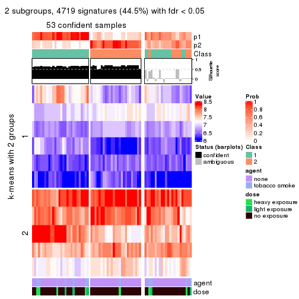</p>

</div>
<div id='tab-CV-NMF-get-signatures-no-scale-2'>
<pre><code class="r">get_signatures(res, k = 3, scale_rows = FALSE)
</code></pre>

<p>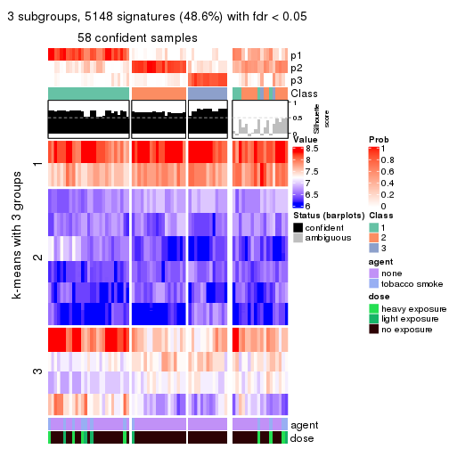</p>

</div>
<div id='tab-CV-NMF-get-signatures-no-scale-3'>
<pre><code class="r">get_signatures(res, k = 4, scale_rows = FALSE)
</code></pre>

<p>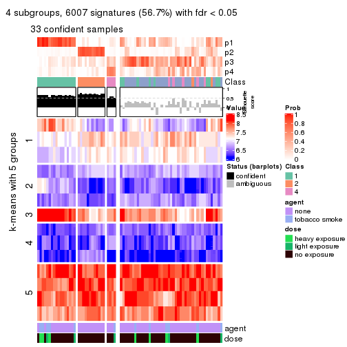</p>

</div>
<div id='tab-CV-NMF-get-signatures-no-scale-4'>
<pre><code class="r">get_signatures(res, k = 5, scale_rows = FALSE)
</code></pre>

<p>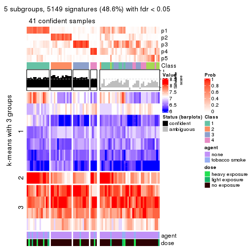</p>

</div>
<div id='tab-CV-NMF-get-signatures-no-scale-5'>
<pre><code class="r">get_signatures(res, k = 6, scale_rows = FALSE)
</code></pre>

<p>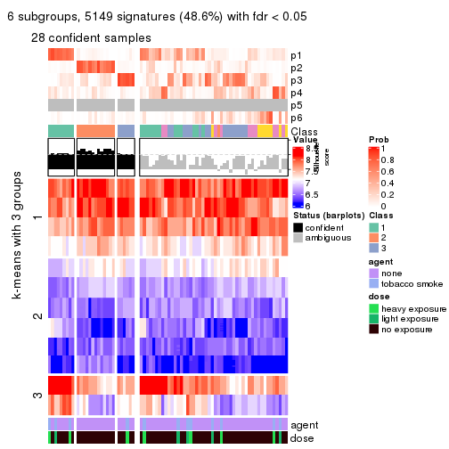</p>

</div>
</div>


Compare the overlap of signatures from different k:

```r
compare_signatures(res)
```

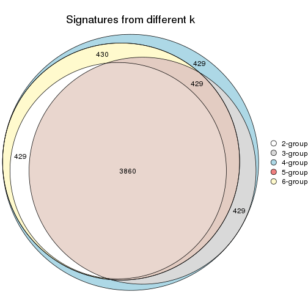

`get_signature()` returns a data frame invisibly. TO get the list of signatures, the function
call should be assigned to a variable explicitly. In following code, if `plot` argument is set
to `FALSE`, no heatmap is plotted while only the differential analysis is performed.

```r
# code only for demonstration
tb = get_signature(res, k = ..., plot = FALSE)
```

An example of the output of `tb` is:

```
#>   which_row         fdr    mean_1    mean_2 scaled_mean_1 scaled_mean_2 km
#> 1        38 0.042760348  8.373488  9.131774    -0.5533452     0.5164555  1
#> 2        40 0.018707592  7.106213  8.469186    -0.6173731     0.5762149  1
#> 3        55 0.019134737 10.221463 11.207825    -0.6159697     0.5749050  1
#> 4        59 0.006059896  5.921854  7.869574    -0.6899429     0.6439467  1
#> 5        60 0.018055526  8.928898 10.211722    -0.6204761     0.5791110  1
#> 6        98 0.009384629 15.714769 14.887706     0.6635654    -0.6193277  2
...
```

The columns in `tb` are:

1. `which_row`: row indices corresponding to the input matrix.
2. `fdr`: FDR for the differential test. 
3. `mean_x`: The mean value in group x.
4. `scaled_mean_x`: The mean value in group x after rows are scaled.
5. `km`: Row groups if k-means clustering is applied to rows.


UMAP plot which shows how samples are separated.


<script>
$( function() {
	$( '#tabs-CV-NMF-dimension-reduction' ).tabs();
} );
</script>
<div id='tabs-CV-NMF-dimension-reduction'>
<ul>
<li><a href='#tab-CV-NMF-dimension-reduction-1'>k = 2</a></li>
<li><a href='#tab-CV-NMF-dimension-reduction-2'>k = 3</a></li>
<li><a href='#tab-CV-NMF-dimension-reduction-3'>k = 4</a></li>
<li><a href='#tab-CV-NMF-dimension-reduction-4'>k = 5</a></li>
<li><a href='#tab-CV-NMF-dimension-reduction-5'>k = 6</a></li>
</ul>
<div id='tab-CV-NMF-dimension-reduction-1'>
<pre><code class="r">dimension_reduction(res, k = 2, method = &quot;UMAP&quot;)
</code></pre>

<p>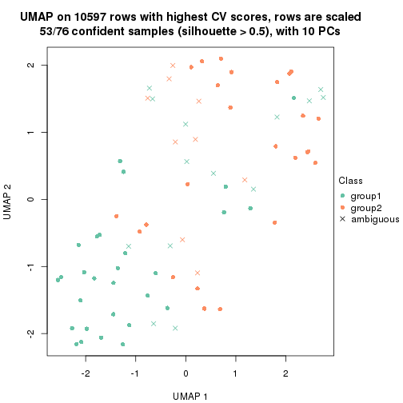</p>

</div>
<div id='tab-CV-NMF-dimension-reduction-2'>
<pre><code class="r">dimension_reduction(res, k = 3, method = &quot;UMAP&quot;)
</code></pre>

<p>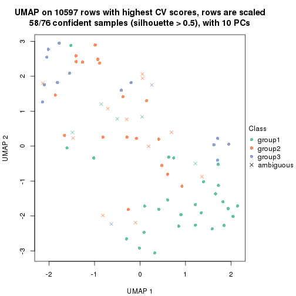</p>

</div>
<div id='tab-CV-NMF-dimension-reduction-3'>
<pre><code class="r">dimension_reduction(res, k = 4, method = &quot;UMAP&quot;)
</code></pre>

<p>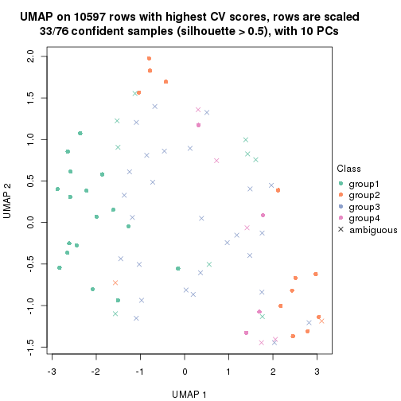</p>

</div>
<div id='tab-CV-NMF-dimension-reduction-4'>
<pre><code class="r">dimension_reduction(res, k = 5, method = &quot;UMAP&quot;)
</code></pre>

<p>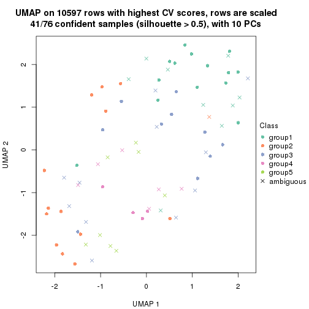</p>

</div>
<div id='tab-CV-NMF-dimension-reduction-5'>
<pre><code class="r">dimension_reduction(res, k = 6, method = &quot;UMAP&quot;)
</code></pre>

<p>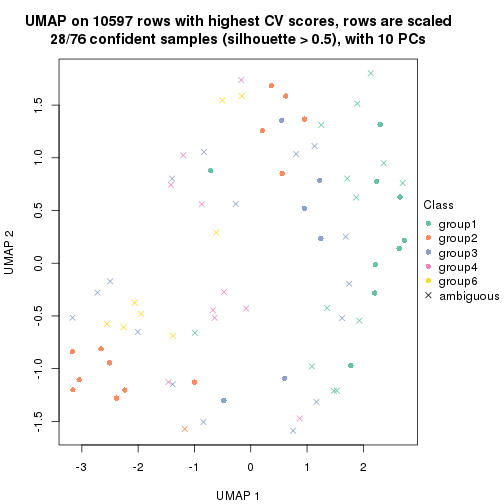</p>

</div>
</div>


Following heatmap shows how subgroups are split when increasing `k`:

```r
collect_classes(res)
```

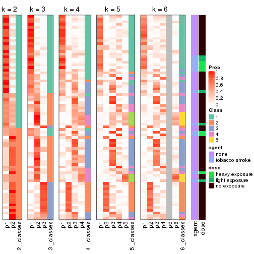


Test correlation between subgroups and known annotations. If the known
annotation is numeric, one-way ANOVA test is applied, and if the known
annotation is discrete, chi-squared contingency table test is applied.

```r
test_to_known_factors(res)
```

```
#>         n agent(p) dose(p) k
#> CV:NMF 53   0.0805  0.0887 2
#> CV:NMF 58   0.0398  0.1296 3
#> CV:NMF 33   0.1205  0.2043 4
#> CV:NMF 41   0.0842  0.2285 5
#> CV:NMF 28   0.0880  0.2389 6
```


If matrix rows can be associated to genes, consider to use `GO_Enrichment(res,
...)` to perform function enrichment for the signature genes.


 

---------------------------------------------------


### MAD:hclust


The object with results only for a single top-value method and a single partition method 
can be extracted as:

```r
res = res_list["MAD", "hclust"]
# you can also extract it by
# res = res_list["MAD:hclust"]
```

A summary of `res` and all the functions that can be applied to it:

```r
res
```

```
#> A 'ConsensusPartition' object with k = 2, 3, 4, 5, 6.
#>   On a matrix with 10597 rows and 76 columns.
#>   Top rows (1000, 2000, 3000, 4000, 5000) are extracted by 'MAD' method.
#>   Subgroups are detected by 'hclust' method.
#>   Performed in total 1250 partitions by row resampling.
#>   Best k for subgroups seems to be 2.
#> 
#> Following methods can be applied to this 'ConsensusPartition' object:
#>  [1] "cola_report"             "collect_classes"         "collect_plots"          
#>  [4] "collect_stats"           "colnames"                "compare_signatures"     
#>  [7] "consensus_heatmap"       "dimension_reduction"     "functional_enrichment"  
#> [10] "get_anno_col"            "get_anno"                "get_classes"            
#> [13] "get_consensus"           "get_matrix"              "get_membership"         
#> [16] "get_param"               "get_signatures"          "get_stats"              
#> [19] "is_best_k"               "is_stable_k"             "membership_heatmap"     
#> [22] "ncol"                    "nrow"                    "plot_ecdf"              
#> [25] "rownames"                "select_partition_number" "show"                   
#> [28] "suggest_best_k"          "test_to_known_factors"
```

`collect_plots()` function collects all the plots made from `res` for all `k` (number of partitions)
into one single page to provide an easy and fast comparison between different `k`.

```r
collect_plots(res)
```

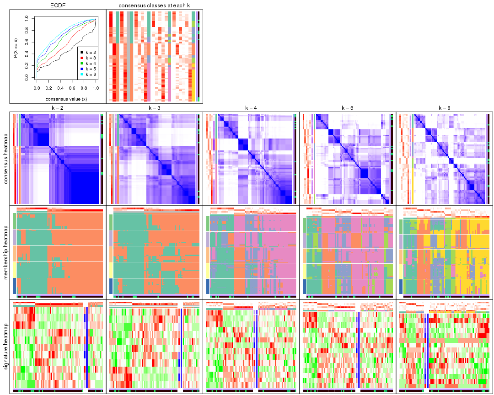

The plots are:

- The first row: a plot of the ECDF (Empirical cumulative distribution
  function) curves of the consensus matrix for each `k` and the heatmap of
  predicted classes for each `k`.
- The second row: heatmaps of the consensus matrix for each `k`.
- The third row: heatmaps of the membership matrix for each `k`.
- The fouth row: heatmaps of the signatures for each `k`.

All the plots in panels can be made by individual functions and they are
plotted later in this section.

`select_partition_number()` produces several plots showing different
statistics for choosing "optimized" `k`. There are following statistics:

- ECDF curves of the consensus matrix for each `k`;
- 1-PAC. [The PAC
  score](https://en.wikipedia.org/wiki/Consensus_clustering#Over-interpretation_potential_of_consensus_clustering)
  measures the proportion of the ambiguous subgrouping.
- Mean silhouette score.
- Concordance. The mean probability of fiting the consensus class ids in all
  partitions.
- Area increased. Denote $A_k$ as the area under the ECDF curve for current
  `k`, the area increased is defined as $A_k - A_{k-1}$.
- Rand index. The percent of pairs of samples that are both in a same cluster
  or both are not in a same cluster in the partition of k and k-1.
- Jaccard index. The ratio of pairs of samples are both in a same cluster in
  the partition of k and k-1 and the pairs of samples are both in a same
  cluster in the partition k or k-1.

The detailed explanations of these statistics can be found in [the cola
vignette](http://bioconductor.org/packages/devel/bioc/vignettes/cola/inst/doc/cola.html#toc_13).

Generally speaking, lower PAC score, higher mean silhouette score or higher
concordance corresponds to better partition. Rand index and Jaccard index
measure how similar the current partition is compared to partition with `k-1`.
If they are too similar, we won't accept `k` is better than `k-1`.

```r
select_partition_number(res)
```

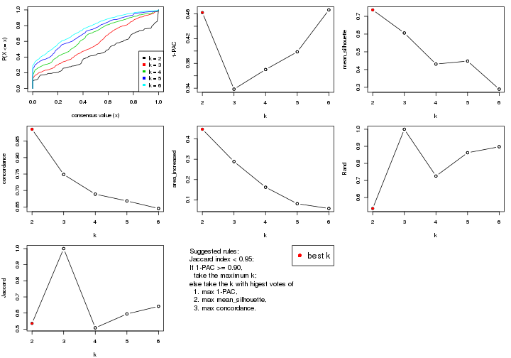

The numeric values for all these statistics can be obtained by `get_stats()`.

```r
get_stats(res)
```

```
#>   k 1-PAC mean_silhouette concordance area_increased  Rand Jaccard
#> 2 2 0.462           0.736       0.886         0.4475 0.536   0.536
#> 3 3 0.338           0.606       0.749         0.2884 1.000   1.000
#> 4 4 0.370           0.431       0.689         0.1622 0.726   0.508
#> 5 5 0.399           0.448       0.668         0.0811 0.862   0.594
#> 6 6 0.466           0.289       0.645         0.0576 0.898   0.642
```

`suggest_best_k()` suggests the best $k$ based on these statistics. The rules are as follows:

- All $k$ with Jaccard index larger than 0.95 are removed because the increase of
  the partition number does not provides enough extra information. If all $k$ are removed,
  the best $k$ is assigned by `NA`.
- For $k$ with 1-PAC larger than 0.9, the maximal $k$ is taken as the "best k". Other $k$ is called "optional k".
- If it does not fit the second rule. The $k$ with the highest vote of highest
  1-PAC, mean silhouette and concordance is taken as the "best k".

```r
suggest_best_k(res)
```

```
#> [1] 2
```


Following shows the table of the partitions (You need to click the **show/hide
code output** link to see it). The membership matrix (columns with name `p*`)
is inferred by
[`clue::cl_consensus()`](https://www.rdocumentation.org/link/cl_consensus?package=clue)
function with the `SE` method. Basically the value in the membership matrix
represents the probability to belong to a certain group. The finall class
label for an item is determined with the group with highest probability it
belongs to.

In `get_classes()` function, the entropy is calculated from the membership
matrix and the silhouette score is calculated from the consensus matrix.


<script>
$( function() {
	$( '#tabs-MAD-hclust-get-classes' ).tabs();
} );
</script>
<div id='tabs-MAD-hclust-get-classes'>
<ul>
<li><a href='#tab-MAD-hclust-get-classes-1'>k = 2</a></li>
<li><a href='#tab-MAD-hclust-get-classes-2'>k = 3</a></li>
<li><a href='#tab-MAD-hclust-get-classes-3'>k = 4</a></li>
<li><a href='#tab-MAD-hclust-get-classes-4'>k = 5</a></li>
<li><a href='#tab-MAD-hclust-get-classes-5'>k = 6</a></li>
</ul>

<div id='tab-MAD-hclust-get-classes-1'>
<p><a id='tab-MAD-hclust-get-classes-1-a' style='color:#0366d6' href='#'>show/hide code output</a></p>
<pre><code class="r">cbind(get_classes(res, k = 2), get_membership(res, k = 2))
</code></pre>

<pre><code>#&gt;           class entropy silhouette    p1    p2
#&gt; GSM451162     1  0.9635     0.4181 0.612 0.388
#&gt; GSM451163     2  0.0000     0.8803 0.000 1.000
#&gt; GSM451164     2  0.0000     0.8803 0.000 1.000
#&gt; GSM451165     2  0.2948     0.8492 0.052 0.948
#&gt; GSM451167     2  0.2423     0.8596 0.040 0.960
#&gt; GSM451168     2  0.0000     0.8803 0.000 1.000
#&gt; GSM451169     2  0.9248     0.4469 0.340 0.660
#&gt; GSM451170     1  0.2948     0.8054 0.948 0.052
#&gt; GSM451171     2  0.0000     0.8803 0.000 1.000
#&gt; GSM451172     2  0.0000     0.8803 0.000 1.000
#&gt; GSM451173     1  0.9710     0.4277 0.600 0.400
#&gt; GSM451174     2  0.0000     0.8803 0.000 1.000
#&gt; GSM451175     1  0.7950     0.6941 0.760 0.240
#&gt; GSM451177     2  0.0000     0.8803 0.000 1.000
#&gt; GSM451178     2  0.0000     0.8803 0.000 1.000
#&gt; GSM451179     2  0.8499     0.5838 0.276 0.724
#&gt; GSM451180     2  0.0000     0.8803 0.000 1.000
#&gt; GSM451181     2  0.0938     0.8747 0.012 0.988
#&gt; GSM451182     1  0.2778     0.8061 0.952 0.048
#&gt; GSM451183     1  0.0000     0.8120 1.000 0.000
#&gt; GSM451184     2  0.9661     0.3057 0.392 0.608
#&gt; GSM451185     1  0.0000     0.8120 1.000 0.000
#&gt; GSM451186     2  0.6887     0.6922 0.184 0.816
#&gt; GSM451187     2  0.0000     0.8803 0.000 1.000
#&gt; GSM451188     2  0.0000     0.8803 0.000 1.000
#&gt; GSM451189     1  0.0000     0.8120 1.000 0.000
#&gt; GSM451190     1  0.0672     0.8115 0.992 0.008
#&gt; GSM451191     1  0.2778     0.8061 0.952 0.048
#&gt; GSM451193     2  0.6343     0.7552 0.160 0.840
#&gt; GSM451195     2  0.9795     0.2156 0.416 0.584
#&gt; GSM451196     1  0.0000     0.8120 1.000 0.000
#&gt; GSM451197     1  0.0000     0.8120 1.000 0.000
#&gt; GSM451199     1  0.9881     0.2880 0.564 0.436
#&gt; GSM451201     1  0.0000     0.8120 1.000 0.000
#&gt; GSM451202     2  0.0000     0.8803 0.000 1.000
#&gt; GSM451203     2  0.9998    -0.0868 0.492 0.508
#&gt; GSM451204     2  0.1633     0.8709 0.024 0.976
#&gt; GSM451205     2  0.0000     0.8803 0.000 1.000
#&gt; GSM451206     2  0.0000     0.8803 0.000 1.000
#&gt; GSM451207     2  0.2948     0.8552 0.052 0.948
#&gt; GSM451208     2  0.0000     0.8803 0.000 1.000
#&gt; GSM451209     2  0.2948     0.8542 0.052 0.948
#&gt; GSM451210     2  0.0000     0.8803 0.000 1.000
#&gt; GSM451212     2  0.7528     0.6570 0.216 0.784
#&gt; GSM451213     2  0.0000     0.8803 0.000 1.000
#&gt; GSM451214     2  0.7815     0.6657 0.232 0.768
#&gt; GSM451215     2  0.0000     0.8803 0.000 1.000
#&gt; GSM451216     2  0.0000     0.8803 0.000 1.000
#&gt; GSM451217     2  0.0000     0.8803 0.000 1.000
#&gt; GSM451219     1  0.9661     0.4133 0.608 0.392
#&gt; GSM451220     1  0.9710     0.4277 0.600 0.400
#&gt; GSM451221     1  0.2778     0.8061 0.952 0.048
#&gt; GSM451222     1  0.7453     0.7165 0.788 0.212
#&gt; GSM451224     2  0.0000     0.8803 0.000 1.000
#&gt; GSM451225     2  0.9323     0.3819 0.348 0.652
#&gt; GSM451226     2  0.7815     0.6657 0.232 0.768
#&gt; GSM451227     2  0.7815     0.6657 0.232 0.768
#&gt; GSM451228     2  0.9795     0.2304 0.416 0.584
#&gt; GSM451230     1  0.7883     0.6954 0.764 0.236
#&gt; GSM451231     2  0.2423     0.8616 0.040 0.960
#&gt; GSM451233     2  0.5059     0.8034 0.112 0.888
#&gt; GSM451234     2  0.0000     0.8803 0.000 1.000
#&gt; GSM451235     2  0.0000     0.8803 0.000 1.000
#&gt; GSM451236     2  0.0000     0.8803 0.000 1.000
#&gt; GSM451166     1  0.9580     0.4702 0.620 0.380
#&gt; GSM451194     1  0.9608     0.4631 0.616 0.384
#&gt; GSM451198     1  0.5294     0.7743 0.880 0.120
#&gt; GSM451218     2  0.0000     0.8803 0.000 1.000
#&gt; GSM451232     1  0.0000     0.8120 1.000 0.000
#&gt; GSM451176     1  0.0000     0.8120 1.000 0.000
#&gt; GSM451192     1  0.0000     0.8120 1.000 0.000
#&gt; GSM451200     1  0.8909     0.5824 0.692 0.308
#&gt; GSM451211     2  0.0000     0.8803 0.000 1.000
#&gt; GSM451223     2  0.7883     0.6516 0.236 0.764
#&gt; GSM451229     1  0.0000     0.8120 1.000 0.000
#&gt; GSM451237     2  0.0000     0.8803 0.000 1.000
</code></pre>

<script>
$('#tab-MAD-hclust-get-classes-1-a').parent().next().next().hide();
$('#tab-MAD-hclust-get-classes-1-a').click(function(){
  $('#tab-MAD-hclust-get-classes-1-a').parent().next().next().toggle();
  return(false);
});
</script>
</div>

<div id='tab-MAD-hclust-get-classes-2'>
<p><a id='tab-MAD-hclust-get-classes-2-a' style='color:#0366d6' href='#'>show/hide code output</a></p>
<pre><code class="r">cbind(get_classes(res, k = 3), get_membership(res, k = 3))
</code></pre>

<pre><code>#&gt;           class entropy silhouette    p1    p2 p3
#&gt; GSM451162     1  0.9408      0.373 0.488 0.316 NA
#&gt; GSM451163     2  0.3192      0.718 0.000 0.888 NA
#&gt; GSM451164     2  0.6045      0.618 0.000 0.620 NA
#&gt; GSM451165     2  0.4861      0.701 0.008 0.800 NA
#&gt; GSM451167     2  0.4960      0.715 0.040 0.832 NA
#&gt; GSM451168     2  0.4931      0.687 0.000 0.768 NA
#&gt; GSM451169     2  0.8681      0.409 0.216 0.596 NA
#&gt; GSM451170     1  0.2339      0.761 0.940 0.012 NA
#&gt; GSM451171     2  0.5859      0.647 0.000 0.656 NA
#&gt; GSM451172     2  0.0592      0.729 0.000 0.988 NA
#&gt; GSM451173     1  0.8886      0.366 0.516 0.352 NA
#&gt; GSM451174     2  0.0000      0.727 0.000 1.000 NA
#&gt; GSM451175     1  0.7710      0.642 0.680 0.176 NA
#&gt; GSM451177     2  0.6286      0.575 0.000 0.536 NA
#&gt; GSM451178     2  0.1529      0.727 0.000 0.960 NA
#&gt; GSM451179     2  0.7843      0.496 0.192 0.668 NA
#&gt; GSM451180     2  0.6286      0.575 0.000 0.536 NA
#&gt; GSM451181     2  0.0592      0.725 0.012 0.988 NA
#&gt; GSM451182     1  0.2680      0.758 0.924 0.008 NA
#&gt; GSM451183     1  0.0424      0.762 0.992 0.000 NA
#&gt; GSM451184     2  0.9460      0.184 0.260 0.500 NA
#&gt; GSM451185     1  0.3879      0.727 0.848 0.000 NA
#&gt; GSM451186     2  0.8521      0.327 0.164 0.608 NA
#&gt; GSM451187     2  0.3879      0.713 0.000 0.848 NA
#&gt; GSM451188     2  0.6215      0.587 0.000 0.572 NA
#&gt; GSM451189     1  0.0424      0.762 0.992 0.000 NA
#&gt; GSM451190     1  0.1950      0.762 0.952 0.008 NA
#&gt; GSM451191     1  0.2955      0.756 0.912 0.008 NA
#&gt; GSM451193     2  0.5608      0.637 0.072 0.808 NA
#&gt; GSM451195     2  0.8375      0.092 0.368 0.540 NA
#&gt; GSM451196     1  0.3941      0.726 0.844 0.000 NA
#&gt; GSM451197     1  0.2356      0.763 0.928 0.000 NA
#&gt; GSM451199     1  0.9871      0.330 0.412 0.308 NA
#&gt; GSM451201     1  0.2261      0.763 0.932 0.000 NA
#&gt; GSM451202     2  0.6215      0.587 0.000 0.572 NA
#&gt; GSM451203     2  0.9305     -0.100 0.380 0.456 NA
#&gt; GSM451204     2  0.2773      0.725 0.024 0.928 NA
#&gt; GSM451205     2  0.6286      0.575 0.000 0.536 NA
#&gt; GSM451206     2  0.1529      0.727 0.000 0.960 NA
#&gt; GSM451207     2  0.2982      0.712 0.024 0.920 NA
#&gt; GSM451208     2  0.6286      0.575 0.000 0.536 NA
#&gt; GSM451209     2  0.5659      0.707 0.052 0.796 NA
#&gt; GSM451210     2  0.6215      0.587 0.000 0.572 NA
#&gt; GSM451212     2  0.6254      0.552 0.188 0.756 NA
#&gt; GSM451213     2  0.1529      0.727 0.000 0.960 NA
#&gt; GSM451214     2  0.7884      0.547 0.104 0.644 NA
#&gt; GSM451215     2  0.6286      0.575 0.000 0.536 NA
#&gt; GSM451216     2  0.1529      0.727 0.000 0.960 NA
#&gt; GSM451217     2  0.4555      0.705 0.000 0.800 NA
#&gt; GSM451219     1  0.9006      0.460 0.536 0.304 NA
#&gt; GSM451220     1  0.8886      0.366 0.516 0.352 NA
#&gt; GSM451221     1  0.2955      0.756 0.912 0.008 NA
#&gt; GSM451222     1  0.7493      0.654 0.696 0.168 NA
#&gt; GSM451224     2  0.6215      0.587 0.000 0.572 NA
#&gt; GSM451225     2  0.7867      0.139 0.348 0.584 NA
#&gt; GSM451226     2  0.7884      0.547 0.104 0.644 NA
#&gt; GSM451227     2  0.7884      0.547 0.104 0.644 NA
#&gt; GSM451228     2  0.8434      0.235 0.336 0.560 NA
#&gt; GSM451230     1  0.7620      0.633 0.684 0.188 NA
#&gt; GSM451231     2  0.3120      0.705 0.012 0.908 NA
#&gt; GSM451233     2  0.4683      0.662 0.024 0.836 NA
#&gt; GSM451234     2  0.0000      0.727 0.000 1.000 NA
#&gt; GSM451235     2  0.0000      0.727 0.000 1.000 NA
#&gt; GSM451236     2  0.1529      0.727 0.000 0.960 NA
#&gt; GSM451166     1  0.8756      0.445 0.540 0.332 NA
#&gt; GSM451194     1  0.9305      0.433 0.504 0.308 NA
#&gt; GSM451198     1  0.5416      0.725 0.820 0.080 NA
#&gt; GSM451218     2  0.1529      0.727 0.000 0.960 NA
#&gt; GSM451232     1  0.3941      0.726 0.844 0.000 NA
#&gt; GSM451176     1  0.3879      0.727 0.848 0.000 NA
#&gt; GSM451192     1  0.0892      0.762 0.980 0.000 NA
#&gt; GSM451200     1  0.7948      0.544 0.632 0.268 NA
#&gt; GSM451211     2  0.1529      0.727 0.000 0.960 NA
#&gt; GSM451223     2  0.7337      0.562 0.152 0.708 NA
#&gt; GSM451229     1  0.3941      0.726 0.844 0.000 NA
#&gt; GSM451237     2  0.0000      0.727 0.000 1.000 NA
</code></pre>

<script>
$('#tab-MAD-hclust-get-classes-2-a').parent().next().next().hide();
$('#tab-MAD-hclust-get-classes-2-a').click(function(){
  $('#tab-MAD-hclust-get-classes-2-a').parent().next().next().toggle();
  return(false);
});
</script>
</div>

<div id='tab-MAD-hclust-get-classes-3'>
<p><a id='tab-MAD-hclust-get-classes-3-a' style='color:#0366d6' href='#'>show/hide code output</a></p>
<pre><code class="r">cbind(get_classes(res, k = 4), get_membership(res, k = 4))
</code></pre>

<pre><code>#&gt;           class entropy silhouette    p1    p2    p3    p4
#&gt; GSM451162     3  0.5148     0.2690 0.248 0.012 0.720 0.020
#&gt; GSM451163     4  0.2589     0.4893 0.000 0.116 0.000 0.884
#&gt; GSM451164     2  0.5290     0.8245 0.000 0.516 0.008 0.476
#&gt; GSM451165     4  0.7646    -0.3142 0.000 0.208 0.384 0.408
#&gt; GSM451167     4  0.4055     0.5259 0.000 0.108 0.060 0.832
#&gt; GSM451168     4  0.5055    -0.4173 0.000 0.368 0.008 0.624
#&gt; GSM451169     4  0.7396    -0.1824 0.120 0.012 0.380 0.488
#&gt; GSM451170     1  0.5223     0.5659 0.764 0.060 0.164 0.012
#&gt; GSM451171     4  0.5143    -0.5398 0.000 0.456 0.004 0.540
#&gt; GSM451172     4  0.3768     0.4641 0.000 0.008 0.184 0.808
#&gt; GSM451173     4  0.8373    -0.4292 0.296 0.016 0.344 0.344
#&gt; GSM451174     4  0.0000     0.6061 0.000 0.000 0.000 1.000
#&gt; GSM451175     1  0.8170     0.0907 0.464 0.032 0.336 0.168
#&gt; GSM451177     2  0.4950     0.9325 0.000 0.620 0.004 0.376
#&gt; GSM451178     4  0.1389     0.6003 0.000 0.048 0.000 0.952
#&gt; GSM451179     4  0.7275    -0.1203 0.096 0.016 0.404 0.484
#&gt; GSM451180     2  0.4950     0.9325 0.000 0.620 0.004 0.376
#&gt; GSM451181     4  0.0469     0.6083 0.012 0.000 0.000 0.988
#&gt; GSM451182     1  0.6412     0.5650 0.584 0.060 0.348 0.008
#&gt; GSM451183     1  0.2011     0.6207 0.920 0.000 0.080 0.000
#&gt; GSM451184     3  0.5622     0.5429 0.020 0.048 0.728 0.204
#&gt; GSM451185     1  0.4423     0.5980 0.788 0.176 0.036 0.000
#&gt; GSM451186     4  0.6991     0.1586 0.000 0.188 0.232 0.580
#&gt; GSM451187     4  0.3266     0.4530 0.000 0.168 0.000 0.832
#&gt; GSM451188     2  0.5080     0.9262 0.000 0.576 0.004 0.420
#&gt; GSM451189     1  0.2011     0.6207 0.920 0.000 0.080 0.000
#&gt; GSM451190     1  0.4955     0.5850 0.648 0.000 0.344 0.008
#&gt; GSM451191     1  0.6515     0.5477 0.552 0.060 0.380 0.008
#&gt; GSM451193     4  0.5349     0.2293 0.012 0.004 0.368 0.616
#&gt; GSM451195     3  0.7843     0.4233 0.168 0.016 0.472 0.344
#&gt; GSM451196     1  0.3539     0.6006 0.820 0.176 0.004 0.000
#&gt; GSM451197     1  0.4500     0.5932 0.684 0.000 0.316 0.000
#&gt; GSM451199     3  0.4013     0.2689 0.036 0.108 0.844 0.012
#&gt; GSM451201     1  0.4477     0.5948 0.688 0.000 0.312 0.000
#&gt; GSM451202     2  0.5080     0.9262 0.000 0.576 0.004 0.420
#&gt; GSM451203     3  0.7835     0.3873 0.160 0.016 0.452 0.372
#&gt; GSM451204     4  0.3057     0.5735 0.024 0.068 0.012 0.896
#&gt; GSM451205     2  0.4950     0.9325 0.000 0.620 0.004 0.376
#&gt; GSM451206     4  0.1389     0.6003 0.000 0.048 0.000 0.952
#&gt; GSM451207     4  0.2807     0.5946 0.024 0.020 0.044 0.912
#&gt; GSM451208     2  0.4950     0.9325 0.000 0.620 0.004 0.376
#&gt; GSM451209     4  0.5730     0.3054 0.012 0.200 0.068 0.720
#&gt; GSM451210     2  0.5080     0.9262 0.000 0.576 0.004 0.420
#&gt; GSM451212     4  0.5269     0.4751 0.180 0.008 0.060 0.752
#&gt; GSM451213     4  0.1389     0.6003 0.000 0.048 0.000 0.952
#&gt; GSM451214     3  0.6340     0.3535 0.000 0.076 0.580 0.344
#&gt; GSM451215     2  0.4950     0.9325 0.000 0.620 0.004 0.376
#&gt; GSM451216     4  0.1389     0.6003 0.000 0.048 0.000 0.952
#&gt; GSM451217     4  0.4584    -0.0716 0.000 0.300 0.004 0.696
#&gt; GSM451219     3  0.5478     0.0459 0.168 0.072 0.748 0.012
#&gt; GSM451220     3  0.8373     0.2643 0.296 0.016 0.344 0.344
#&gt; GSM451221     1  0.6525     0.5468 0.548 0.060 0.384 0.008
#&gt; GSM451222     1  0.7867     0.1099 0.480 0.020 0.340 0.160
#&gt; GSM451224     2  0.5080     0.9262 0.000 0.576 0.004 0.420
#&gt; GSM451225     4  0.8288     0.0586 0.212 0.064 0.184 0.540
#&gt; GSM451226     3  0.6219     0.3623 0.000 0.068 0.588 0.344
#&gt; GSM451227     3  0.6340     0.3535 0.000 0.076 0.580 0.344
#&gt; GSM451228     4  0.7171     0.1529 0.232 0.000 0.212 0.556
#&gt; GSM451230     1  0.7937     0.0573 0.456 0.016 0.348 0.180
#&gt; GSM451231     4  0.3196     0.5850 0.012 0.008 0.104 0.876
#&gt; GSM451233     4  0.4132     0.5420 0.012 0.008 0.176 0.804
#&gt; GSM451234     4  0.0000     0.6061 0.000 0.000 0.000 1.000
#&gt; GSM451235     4  0.0000     0.6061 0.000 0.000 0.000 1.000
#&gt; GSM451236     4  0.1389     0.6003 0.000 0.048 0.000 0.952
#&gt; GSM451166     1  0.9067    -0.1498 0.332 0.060 0.280 0.328
#&gt; GSM451194     3  0.9118     0.2645 0.296 0.080 0.400 0.224
#&gt; GSM451198     1  0.5326     0.3558 0.604 0.016 0.380 0.000
#&gt; GSM451218     4  0.1389     0.6003 0.000 0.048 0.000 0.952
#&gt; GSM451232     1  0.3539     0.6006 0.820 0.176 0.004 0.000
#&gt; GSM451176     1  0.4578     0.6105 0.788 0.160 0.052 0.000
#&gt; GSM451192     1  0.2530     0.6192 0.888 0.000 0.112 0.000
#&gt; GSM451200     1  0.8018    -0.0976 0.428 0.016 0.368 0.188
#&gt; GSM451211     4  0.1389     0.6003 0.000 0.048 0.000 0.952
#&gt; GSM451223     4  0.7196     0.0200 0.096 0.016 0.364 0.524
#&gt; GSM451229     1  0.3539     0.6006 0.820 0.176 0.004 0.000
#&gt; GSM451237     4  0.0000     0.6061 0.000 0.000 0.000 1.000
</code></pre>

<script>
$('#tab-MAD-hclust-get-classes-3-a').parent().next().next().hide();
$('#tab-MAD-hclust-get-classes-3-a').click(function(){
  $('#tab-MAD-hclust-get-classes-3-a').parent().next().next().toggle();
  return(false);
});
</script>
</div>

<div id='tab-MAD-hclust-get-classes-4'>
<p><a id='tab-MAD-hclust-get-classes-4-a' style='color:#0366d6' href='#'>show/hide code output</a></p>
<pre><code class="r">cbind(get_classes(res, k = 5), get_membership(res, k = 5))
</code></pre>

<pre><code>#&gt;           class entropy silhouette    p1    p2    p3    p4    p5
#&gt; GSM451162     3  0.4121     0.1760 0.000 0.012 0.720 0.004 0.264
#&gt; GSM451163     4  0.4130     0.5274 0.000 0.292 0.012 0.696 0.000
#&gt; GSM451164     2  0.3814     0.6293 0.000 0.720 0.004 0.276 0.000
#&gt; GSM451165     2  0.8069     0.1272 0.000 0.412 0.124 0.204 0.260
#&gt; GSM451167     4  0.5159     0.5464 0.000 0.284 0.072 0.644 0.000
#&gt; GSM451168     2  0.4383     0.2755 0.000 0.572 0.004 0.424 0.000
#&gt; GSM451169     3  0.7514     0.1897 0.000 0.188 0.452 0.296 0.064
#&gt; GSM451170     1  0.6050     0.5162 0.544 0.000 0.312 0.000 0.144
#&gt; GSM451171     4  0.4227    -0.4362 0.000 0.420 0.000 0.580 0.000
#&gt; GSM451172     4  0.6042     0.4766 0.000 0.184 0.012 0.620 0.184
#&gt; GSM451173     3  0.5749     0.5493 0.000 0.176 0.656 0.156 0.012
#&gt; GSM451174     4  0.3280     0.6282 0.000 0.176 0.012 0.812 0.000
#&gt; GSM451175     3  0.3767     0.5332 0.008 0.000 0.800 0.168 0.024
#&gt; GSM451177     2  0.4219     0.6883 0.000 0.584 0.000 0.416 0.000
#&gt; GSM451178     4  0.0162     0.5787 0.000 0.000 0.000 0.996 0.004
#&gt; GSM451179     3  0.8384     0.1820 0.000 0.176 0.336 0.296 0.192
#&gt; GSM451180     2  0.4219     0.6883 0.000 0.584 0.000 0.416 0.000
#&gt; GSM451181     4  0.3565     0.6270 0.000 0.176 0.024 0.800 0.000
#&gt; GSM451182     1  0.5862     0.5035 0.544 0.000 0.112 0.000 0.344
#&gt; GSM451183     1  0.4779     0.6835 0.716 0.000 0.200 0.000 0.084
#&gt; GSM451184     5  0.6564     0.1453 0.000 0.212 0.344 0.000 0.444
#&gt; GSM451185     1  0.0880     0.7159 0.968 0.000 0.000 0.000 0.032
#&gt; GSM451186     4  0.6265     0.2336 0.000 0.164 0.004 0.544 0.288
#&gt; GSM451187     4  0.2377     0.4159 0.000 0.128 0.000 0.872 0.000
#&gt; GSM451188     2  0.3242     0.7006 0.000 0.784 0.000 0.216 0.000
#&gt; GSM451189     1  0.4732     0.6816 0.716 0.000 0.208 0.000 0.076
#&gt; GSM451190     1  0.5929     0.5129 0.492 0.016 0.064 0.000 0.428
#&gt; GSM451191     5  0.6387    -0.4282 0.380 0.016 0.112 0.000 0.492
#&gt; GSM451193     4  0.7799     0.2119 0.000 0.176 0.096 0.428 0.300
#&gt; GSM451195     3  0.9204     0.3485 0.068 0.176 0.376 0.156 0.224
#&gt; GSM451196     1  0.1386     0.7076 0.952 0.000 0.032 0.000 0.016
#&gt; GSM451197     1  0.6005     0.6134 0.568 0.000 0.156 0.000 0.276
#&gt; GSM451199     5  0.3890     0.2891 0.000 0.012 0.252 0.000 0.736
#&gt; GSM451201     1  0.5939     0.6191 0.576 0.000 0.148 0.000 0.276
#&gt; GSM451202     2  0.3242     0.7006 0.000 0.784 0.000 0.216 0.000
#&gt; GSM451203     3  0.5610     0.4684 0.000 0.176 0.640 0.184 0.000
#&gt; GSM451204     4  0.4707     0.5880 0.000 0.228 0.064 0.708 0.000
#&gt; GSM451205     2  0.4219     0.6883 0.000 0.584 0.000 0.416 0.000
#&gt; GSM451206     4  0.0162     0.5787 0.000 0.000 0.000 0.996 0.004
#&gt; GSM451207     4  0.5189     0.6094 0.000 0.176 0.064 0.724 0.036
#&gt; GSM451208     2  0.4219     0.6883 0.000 0.584 0.000 0.416 0.000
#&gt; GSM451209     4  0.5700     0.3283 0.000 0.380 0.088 0.532 0.000
#&gt; GSM451210     2  0.3242     0.7006 0.000 0.784 0.000 0.216 0.000
#&gt; GSM451212     4  0.4254     0.5346 0.000 0.000 0.220 0.740 0.040
#&gt; GSM451213     4  0.0162     0.5787 0.000 0.000 0.000 0.996 0.004
#&gt; GSM451214     5  0.8102     0.2533 0.000 0.240 0.200 0.140 0.420
#&gt; GSM451215     2  0.4219     0.6883 0.000 0.584 0.000 0.416 0.000
#&gt; GSM451216     4  0.0162     0.5787 0.000 0.000 0.000 0.996 0.004
#&gt; GSM451217     4  0.4656     0.0394 0.000 0.480 0.012 0.508 0.000
#&gt; GSM451219     5  0.5963     0.2131 0.136 0.012 0.232 0.000 0.620
#&gt; GSM451220     3  0.5645     0.5492 0.000 0.176 0.660 0.156 0.008
#&gt; GSM451221     5  0.6381    -0.4252 0.376 0.016 0.112 0.000 0.496
#&gt; GSM451222     3  0.3809     0.5285 0.020 0.000 0.804 0.160 0.016
#&gt; GSM451224     2  0.4305     0.6817 0.000 0.744 0.004 0.216 0.036
#&gt; GSM451225     4  0.6191     0.0494 0.000 0.000 0.308 0.528 0.164
#&gt; GSM451226     5  0.8073     0.2528 0.000 0.232 0.200 0.140 0.428
#&gt; GSM451227     5  0.8102     0.2533 0.000 0.240 0.200 0.140 0.420
#&gt; GSM451228     4  0.4283     0.0855 0.000 0.000 0.456 0.544 0.000
#&gt; GSM451230     3  0.2813     0.5413 0.000 0.000 0.832 0.168 0.000
#&gt; GSM451231     4  0.5716     0.5959 0.000 0.176 0.044 0.688 0.092
#&gt; GSM451233     4  0.6536     0.5442 0.000 0.176 0.056 0.616 0.152
#&gt; GSM451234     4  0.3280     0.6282 0.000 0.176 0.012 0.812 0.000
#&gt; GSM451235     4  0.3280     0.6282 0.000 0.176 0.012 0.812 0.000
#&gt; GSM451236     4  0.0162     0.5787 0.000 0.000 0.000 0.996 0.004
#&gt; GSM451166     3  0.5359     0.4538 0.000 0.000 0.608 0.316 0.076
#&gt; GSM451194     3  0.5505     0.4526 0.000 0.180 0.700 0.036 0.084
#&gt; GSM451198     3  0.5190     0.2071 0.104 0.060 0.748 0.000 0.088
#&gt; GSM451218     4  0.0162     0.5787 0.000 0.000 0.000 0.996 0.004
#&gt; GSM451232     1  0.1386     0.7076 0.952 0.000 0.032 0.000 0.016
#&gt; GSM451176     1  0.1800     0.7191 0.932 0.000 0.020 0.000 0.048
#&gt; GSM451192     1  0.6546     0.6119 0.552 0.016 0.192 0.000 0.240
#&gt; GSM451200     3  0.5624     0.3369 0.096 0.176 0.692 0.000 0.036
#&gt; GSM451211     4  0.0162     0.5787 0.000 0.000 0.000 0.996 0.004
#&gt; GSM451223     4  0.8384    -0.1354 0.000 0.176 0.296 0.336 0.192
#&gt; GSM451229     1  0.1106     0.7101 0.964 0.000 0.024 0.000 0.012
#&gt; GSM451237     4  0.3280     0.6282 0.000 0.176 0.012 0.812 0.000
</code></pre>

<script>
$('#tab-MAD-hclust-get-classes-4-a').parent().next().next().hide();
$('#tab-MAD-hclust-get-classes-4-a').click(function(){
  $('#tab-MAD-hclust-get-classes-4-a').parent().next().next().toggle();
  return(false);
});
</script>
</div>

<div id='tab-MAD-hclust-get-classes-5'>
<p><a id='tab-MAD-hclust-get-classes-5-a' style='color:#0366d6' href='#'>show/hide code output</a></p>
<pre><code class="r">cbind(get_classes(res, k = 6), get_membership(res, k = 6))
</code></pre>

<pre><code>#&gt;           class entropy silhouette    p1    p2    p3    p4    p5    p6
#&gt; GSM451162     3  0.4974     0.3719 0.004 0.004 0.636 0.048 0.296 0.012
#&gt; GSM451163     6  0.2003     0.3671 0.000 0.116 0.000 0.000 0.000 0.884
#&gt; GSM451164     2  0.5934     0.4625 0.000 0.488 0.044 0.084 0.000 0.384
#&gt; GSM451165     2  0.7905     0.2214 0.000 0.300 0.056 0.064 0.296 0.284
#&gt; GSM451167     6  0.3138     0.3509 0.000 0.108 0.060 0.000 0.000 0.832
#&gt; GSM451168     6  0.5793    -0.1908 0.000 0.352 0.044 0.076 0.000 0.528
#&gt; GSM451169     6  0.6241    -0.1660 0.000 0.004 0.368 0.048 0.100 0.480
#&gt; GSM451170     1  0.3947     0.5179 0.716 0.000 0.256 0.000 0.016 0.012
#&gt; GSM451171     2  0.3737     0.3259 0.000 0.608 0.000 0.000 0.000 0.392
#&gt; GSM451172     6  0.2915     0.2939 0.000 0.008 0.000 0.000 0.184 0.808
#&gt; GSM451173     3  0.3791     0.5740 0.000 0.000 0.688 0.008 0.004 0.300
#&gt; GSM451174     6  0.1610     0.3418 0.000 0.084 0.000 0.000 0.000 0.916
#&gt; GSM451175     3  0.2865     0.5751 0.020 0.000 0.852 0.004 0.004 0.120
#&gt; GSM451177     2  0.1444     0.6292 0.000 0.928 0.000 0.000 0.000 0.072
#&gt; GSM451178     6  0.3668     0.0782 0.000 0.328 0.000 0.004 0.000 0.668
#&gt; GSM451179     6  0.6023    -0.2208 0.000 0.000 0.368 0.008 0.184 0.440
#&gt; GSM451180     2  0.1444     0.6292 0.000 0.928 0.000 0.000 0.000 0.072
#&gt; GSM451181     6  0.0547     0.3754 0.000 0.000 0.020 0.000 0.000 0.980
#&gt; GSM451182     1  0.1838     0.5643 0.916 0.000 0.068 0.000 0.016 0.000
#&gt; GSM451183     1  0.5053     0.4696 0.636 0.000 0.204 0.000 0.160 0.000
#&gt; GSM451184     5  0.8425    -0.1397 0.028 0.016 0.260 0.220 0.312 0.164
#&gt; GSM451185     5  0.3833    -0.0405 0.444 0.000 0.000 0.000 0.556 0.000
#&gt; GSM451186     4  0.4935     0.0000 0.020 0.000 0.008 0.524 0.016 0.432
#&gt; GSM451187     6  0.3482     0.1712 0.000 0.316 0.000 0.000 0.000 0.684
#&gt; GSM451188     2  0.3627     0.6553 0.000 0.752 0.004 0.020 0.000 0.224
#&gt; GSM451189     1  0.5102     0.4716 0.628 0.000 0.212 0.000 0.160 0.000
#&gt; GSM451190     1  0.5242     0.5609 0.692 0.000 0.060 0.108 0.140 0.000
#&gt; GSM451191     1  0.4274     0.5689 0.776 0.000 0.068 0.108 0.048 0.000
#&gt; GSM451193     6  0.6268     0.1344 0.004 0.000 0.080 0.132 0.196 0.588
#&gt; GSM451195     3  0.7315     0.4322 0.088 0.000 0.408 0.012 0.192 0.300
#&gt; GSM451196     5  0.3706     0.0180 0.380 0.000 0.000 0.000 0.620 0.000
#&gt; GSM451197     1  0.5053     0.4574 0.680 0.008 0.120 0.008 0.184 0.000
#&gt; GSM451199     1  0.7448     0.1088 0.356 0.004 0.124 0.200 0.316 0.000
#&gt; GSM451201     1  0.5032     0.4542 0.680 0.008 0.112 0.008 0.192 0.000
#&gt; GSM451202     2  0.3957     0.6299 0.000 0.696 0.004 0.020 0.000 0.280
#&gt; GSM451203     3  0.3925     0.4945 0.000 0.000 0.656 0.004 0.008 0.332
#&gt; GSM451204     6  0.3140     0.3620 0.000 0.036 0.096 0.020 0.000 0.848
#&gt; GSM451205     2  0.2883     0.6208 0.000 0.788 0.000 0.000 0.000 0.212
#&gt; GSM451206     6  0.3867     0.0784 0.000 0.328 0.000 0.012 0.000 0.660
#&gt; GSM451207     6  0.2679     0.3576 0.000 0.000 0.096 0.040 0.000 0.864
#&gt; GSM451208     2  0.2135     0.6484 0.000 0.872 0.000 0.000 0.000 0.128
#&gt; GSM451209     6  0.5556     0.2041 0.000 0.160 0.112 0.068 0.000 0.660
#&gt; GSM451210     2  0.3627     0.6553 0.000 0.752 0.004 0.020 0.000 0.224
#&gt; GSM451212     6  0.3802     0.0677 0.000 0.000 0.208 0.044 0.000 0.748
#&gt; GSM451213     6  0.3046     0.2022 0.000 0.188 0.000 0.012 0.000 0.800
#&gt; GSM451214     5  0.8571     0.0486 0.028 0.044 0.116 0.204 0.304 0.304
#&gt; GSM451215     2  0.1444     0.6292 0.000 0.928 0.000 0.000 0.000 0.072
#&gt; GSM451216     6  0.3046     0.2022 0.000 0.188 0.000 0.012 0.000 0.800
#&gt; GSM451217     6  0.3833    -0.0196 0.000 0.444 0.000 0.000 0.000 0.556
#&gt; GSM451219     1  0.6247     0.2729 0.516 0.004 0.120 0.044 0.316 0.000
#&gt; GSM451220     3  0.3653     0.5738 0.000 0.000 0.692 0.008 0.000 0.300
#&gt; GSM451221     1  0.4335     0.5685 0.772 0.000 0.068 0.108 0.052 0.000
#&gt; GSM451222     3  0.2760     0.5746 0.004 0.000 0.856 0.000 0.024 0.116
#&gt; GSM451224     2  0.4951     0.5379 0.000 0.568 0.004 0.064 0.000 0.364
#&gt; GSM451225     6  0.7863    -0.4893 0.128 0.000 0.264 0.260 0.020 0.328
#&gt; GSM451226     5  0.8480     0.0464 0.028 0.036 0.116 0.204 0.312 0.304
#&gt; GSM451227     5  0.8571     0.0486 0.028 0.044 0.116 0.204 0.304 0.304
#&gt; GSM451228     6  0.3966    -0.0627 0.000 0.000 0.444 0.004 0.000 0.552
#&gt; GSM451230     3  0.2320     0.5805 0.000 0.000 0.864 0.004 0.000 0.132
#&gt; GSM451231     6  0.2920     0.3367 0.000 0.000 0.040 0.080 0.016 0.864
#&gt; GSM451233     6  0.3859     0.2808 0.000 0.000 0.040 0.168 0.016 0.776
#&gt; GSM451234     6  0.3428     0.2855 0.000 0.084 0.008 0.084 0.000 0.824
#&gt; GSM451235     6  0.0260     0.3769 0.000 0.000 0.000 0.008 0.000 0.992
#&gt; GSM451236     6  0.3867     0.0784 0.000 0.328 0.000 0.012 0.000 0.660
#&gt; GSM451166     3  0.5063     0.2758 0.072 0.000 0.596 0.004 0.004 0.324
#&gt; GSM451194     3  0.4781     0.5814 0.072 0.004 0.716 0.008 0.012 0.188
#&gt; GSM451198     3  0.5327     0.2155 0.164 0.060 0.692 0.008 0.076 0.000
#&gt; GSM451218     6  0.3867     0.0784 0.000 0.328 0.000 0.012 0.000 0.660
#&gt; GSM451232     5  0.3706     0.0180 0.380 0.000 0.000 0.000 0.620 0.000
#&gt; GSM451176     5  0.4318    -0.0858 0.448 0.000 0.020 0.000 0.532 0.000
#&gt; GSM451192     1  0.6803     0.5083 0.536 0.008 0.196 0.108 0.152 0.000
#&gt; GSM451200     3  0.5809     0.5250 0.120 0.000 0.636 0.008 0.048 0.188
#&gt; GSM451211     6  0.3867     0.0784 0.000 0.328 0.000 0.012 0.000 0.660
#&gt; GSM451223     6  0.5961    -0.1139 0.000 0.000 0.328 0.008 0.184 0.480
#&gt; GSM451229     5  0.3737     0.0149 0.392 0.000 0.000 0.000 0.608 0.000
#&gt; GSM451237     6  0.3428     0.2855 0.000 0.084 0.008 0.084 0.000 0.824
</code></pre>

<script>
$('#tab-MAD-hclust-get-classes-5-a').parent().next().next().hide();
$('#tab-MAD-hclust-get-classes-5-a').click(function(){
  $('#tab-MAD-hclust-get-classes-5-a').parent().next().next().toggle();
  return(false);
});
</script>
</div>
</div>

Heatmaps for the consensus matrix. It visualizes the probability of two
samples to be in a same group.


<script>
$( function() {
	$( '#tabs-MAD-hclust-consensus-heatmap' ).tabs();
} );
</script>
<div id='tabs-MAD-hclust-consensus-heatmap'>
<ul>
<li><a href='#tab-MAD-hclust-consensus-heatmap-1'>k = 2</a></li>
<li><a href='#tab-MAD-hclust-consensus-heatmap-2'>k = 3</a></li>
<li><a href='#tab-MAD-hclust-consensus-heatmap-3'>k = 4</a></li>
<li><a href='#tab-MAD-hclust-consensus-heatmap-4'>k = 5</a></li>
<li><a href='#tab-MAD-hclust-consensus-heatmap-5'>k = 6</a></li>
</ul>
<div id='tab-MAD-hclust-consensus-heatmap-1'>
<pre><code class="r">consensus_heatmap(res, k = 2)
</code></pre>

<p>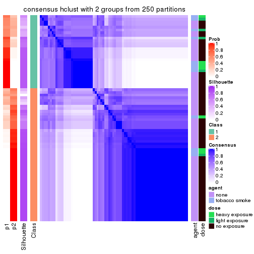</p>

</div>
<div id='tab-MAD-hclust-consensus-heatmap-2'>
<pre><code class="r">consensus_heatmap(res, k = 3)
</code></pre>

<p>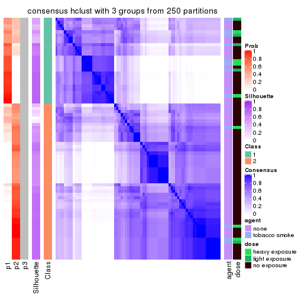</p>

</div>
<div id='tab-MAD-hclust-consensus-heatmap-3'>
<pre><code class="r">consensus_heatmap(res, k = 4)
</code></pre>

<p>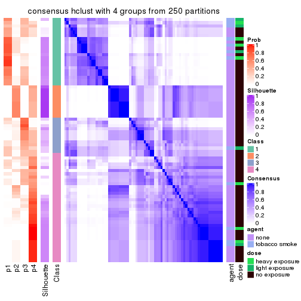</p>

</div>
<div id='tab-MAD-hclust-consensus-heatmap-4'>
<pre><code class="r">consensus_heatmap(res, k = 5)
</code></pre>

<p>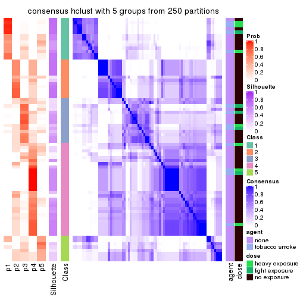</p>

</div>
<div id='tab-MAD-hclust-consensus-heatmap-5'>
<pre><code class="r">consensus_heatmap(res, k = 6)
</code></pre>

<p>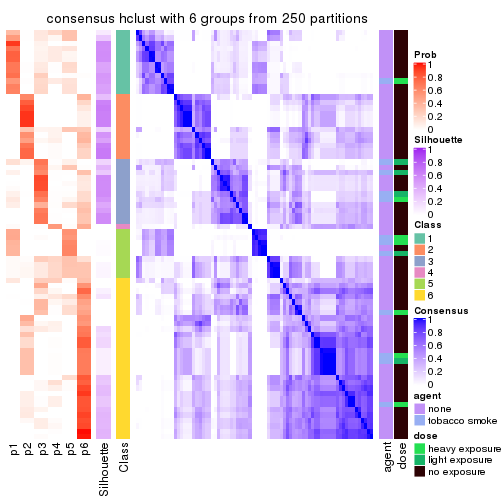</p>

</div>
</div>

Heatmaps for the membership of samples in all partitions to see how consistent they are:


<script>
$( function() {
	$( '#tabs-MAD-hclust-membership-heatmap' ).tabs();
} );
</script>
<div id='tabs-MAD-hclust-membership-heatmap'>
<ul>
<li><a href='#tab-MAD-hclust-membership-heatmap-1'>k = 2</a></li>
<li><a href='#tab-MAD-hclust-membership-heatmap-2'>k = 3</a></li>
<li><a href='#tab-MAD-hclust-membership-heatmap-3'>k = 4</a></li>
<li><a href='#tab-MAD-hclust-membership-heatmap-4'>k = 5</a></li>
<li><a href='#tab-MAD-hclust-membership-heatmap-5'>k = 6</a></li>
</ul>
<div id='tab-MAD-hclust-membership-heatmap-1'>
<pre><code class="r">membership_heatmap(res, k = 2)
</code></pre>

<p>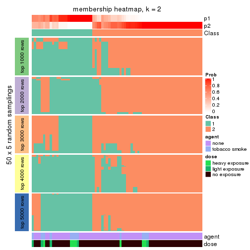</p>

</div>
<div id='tab-MAD-hclust-membership-heatmap-2'>
<pre><code class="r">membership_heatmap(res, k = 3)
</code></pre>

<p>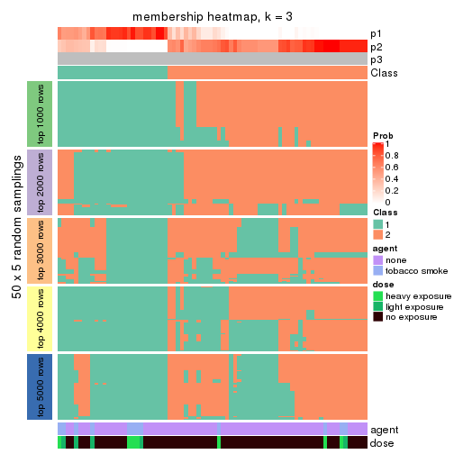</p>

</div>
<div id='tab-MAD-hclust-membership-heatmap-3'>
<pre><code class="r">membership_heatmap(res, k = 4)
</code></pre>

<p>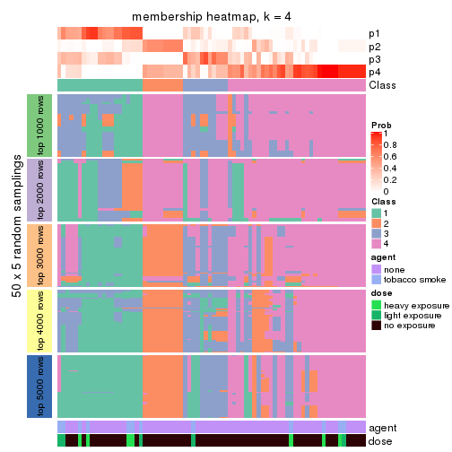</p>

</div>
<div id='tab-MAD-hclust-membership-heatmap-4'>
<pre><code class="r">membership_heatmap(res, k = 5)
</code></pre>

<p>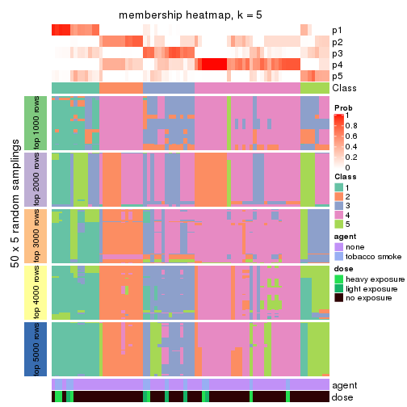</p>

</div>
<div id='tab-MAD-hclust-membership-heatmap-5'>
<pre><code class="r">membership_heatmap(res, k = 6)
</code></pre>

<p>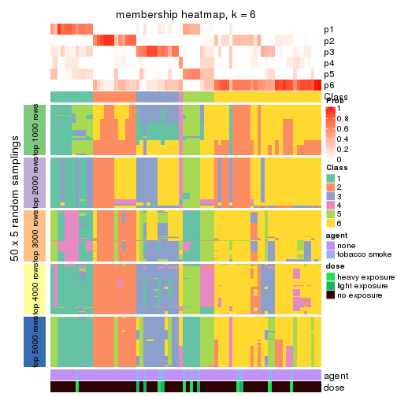</p>

</div>
</div>

As soon as we have had the classes for columns, we can look for signatures
which are significantly different between classes which can be candidate marks
for certain classes. Following are the heatmaps for signatures.


Signature heatmaps where rows are scaled:


<script>
$( function() {
	$( '#tabs-MAD-hclust-get-signatures' ).tabs();
} );
</script>
<div id='tabs-MAD-hclust-get-signatures'>
<ul>
<li><a href='#tab-MAD-hclust-get-signatures-1'>k = 2</a></li>
<li><a href='#tab-MAD-hclust-get-signatures-2'>k = 3</a></li>
<li><a href='#tab-MAD-hclust-get-signatures-3'>k = 4</a></li>
<li><a href='#tab-MAD-hclust-get-signatures-4'>k = 5</a></li>
<li><a href='#tab-MAD-hclust-get-signatures-5'>k = 6</a></li>
</ul>
<div id='tab-MAD-hclust-get-signatures-1'>
<pre><code class="r">get_signatures(res, k = 2)
</code></pre>

<p>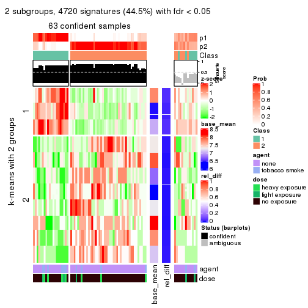</p>

</div>
<div id='tab-MAD-hclust-get-signatures-2'>
<pre><code class="r">get_signatures(res, k = 3)
</code></pre>

<p>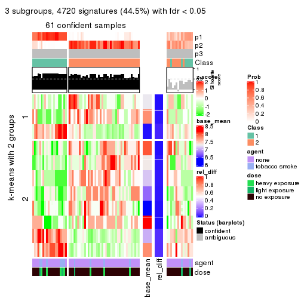</p>

</div>
<div id='tab-MAD-hclust-get-signatures-3'>
<pre><code class="r">get_signatures(res, k = 4)
</code></pre>

<p>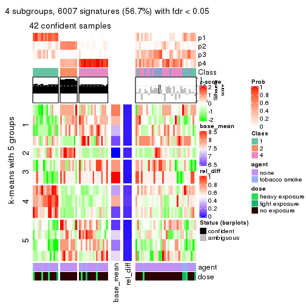</p>

</div>
<div id='tab-MAD-hclust-get-signatures-4'>
<pre><code class="r">get_signatures(res, k = 5)
</code></pre>

<p>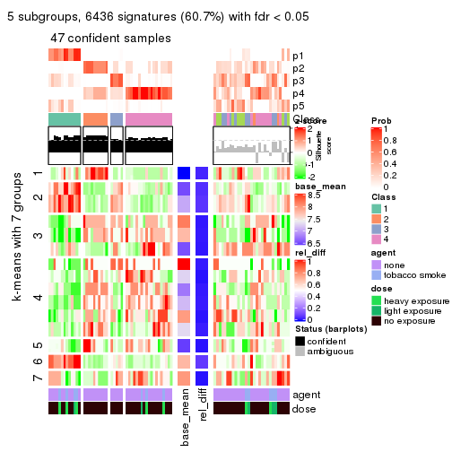</p>

</div>
<div id='tab-MAD-hclust-get-signatures-5'>
<pre><code class="r">get_signatures(res, k = 6)
</code></pre>

<p>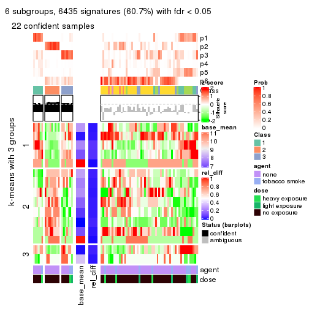</p>

</div>
</div>


Signature heatmaps where rows are not scaled:


<script>
$( function() {
	$( '#tabs-MAD-hclust-get-signatures-no-scale' ).tabs();
} );
</script>
<div id='tabs-MAD-hclust-get-signatures-no-scale'>
<ul>
<li><a href='#tab-MAD-hclust-get-signatures-no-scale-1'>k = 2</a></li>
<li><a href='#tab-MAD-hclust-get-signatures-no-scale-2'>k = 3</a></li>
<li><a href='#tab-MAD-hclust-get-signatures-no-scale-3'>k = 4</a></li>
<li><a href='#tab-MAD-hclust-get-signatures-no-scale-4'>k = 5</a></li>
<li><a href='#tab-MAD-hclust-get-signatures-no-scale-5'>k = 6</a></li>
</ul>
<div id='tab-MAD-hclust-get-signatures-no-scale-1'>
<pre><code class="r">get_signatures(res, k = 2, scale_rows = FALSE)
</code></pre>

<p>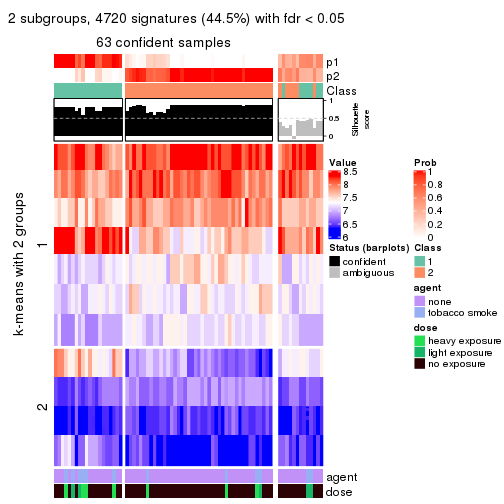</p>

</div>
<div id='tab-MAD-hclust-get-signatures-no-scale-2'>
<pre><code class="r">get_signatures(res, k = 3, scale_rows = FALSE)
</code></pre>

<p>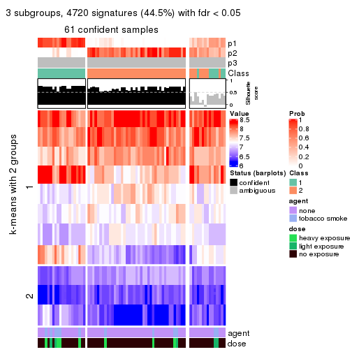</p>

</div>
<div id='tab-MAD-hclust-get-signatures-no-scale-3'>
<pre><code class="r">get_signatures(res, k = 4, scale_rows = FALSE)
</code></pre>

<p></p>

</div>
<div id='tab-MAD-hclust-get-signatures-no-scale-4'>
<pre><code class="r">get_signatures(res, k = 5, scale_rows = FALSE)
</code></pre>

<p>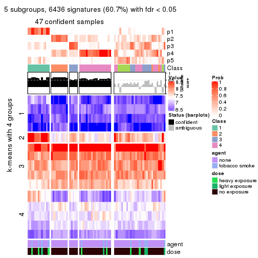</p>

</div>
<div id='tab-MAD-hclust-get-signatures-no-scale-5'>
<pre><code class="r">get_signatures(res, k = 6, scale_rows = FALSE)
</code></pre>

<p>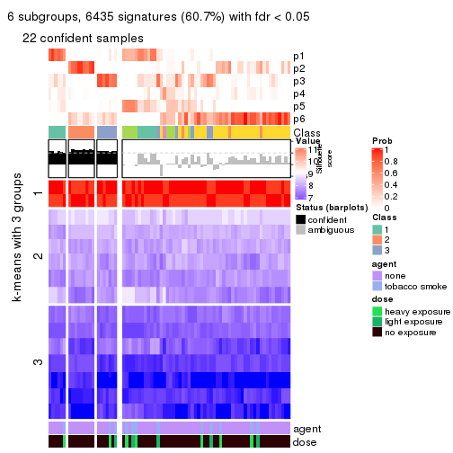</p>

</div>
</div>


Compare the overlap of signatures from different k:

```r
compare_signatures(res)
```

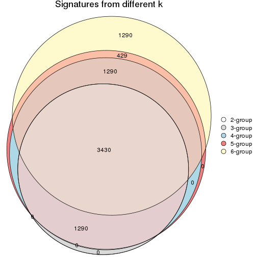

`get_signature()` returns a data frame invisibly. TO get the list of signatures, the function
call should be assigned to a variable explicitly. In following code, if `plot` argument is set
to `FALSE`, no heatmap is plotted while only the differential analysis is performed.

```r
# code only for demonstration
tb = get_signature(res, k = ..., plot = FALSE)
```

An example of the output of `tb` is:

```
#>   which_row         fdr    mean_1    mean_2 scaled_mean_1 scaled_mean_2 km
#> 1        38 0.042760348  8.373488  9.131774    -0.5533452     0.5164555  1
#> 2        40 0.018707592  7.106213  8.469186    -0.6173731     0.5762149  1
#> 3        55 0.019134737 10.221463 11.207825    -0.6159697     0.5749050  1
#> 4        59 0.006059896  5.921854  7.869574    -0.6899429     0.6439467  1
#> 5        60 0.018055526  8.928898 10.211722    -0.6204761     0.5791110  1
#> 6        98 0.009384629 15.714769 14.887706     0.6635654    -0.6193277  2
...
```

The columns in `tb` are:

1. `which_row`: row indices corresponding to the input matrix.
2. `fdr`: FDR for the differential test. 
3. `mean_x`: The mean value in group x.
4. `scaled_mean_x`: The mean value in group x after rows are scaled.
5. `km`: Row groups if k-means clustering is applied to rows.


UMAP plot which shows how samples are separated.


<script>
$( function() {
	$( '#tabs-MAD-hclust-dimension-reduction' ).tabs();
} );
</script>
<div id='tabs-MAD-hclust-dimension-reduction'>
<ul>
<li><a href='#tab-MAD-hclust-dimension-reduction-1'>k = 2</a></li>
<li><a href='#tab-MAD-hclust-dimension-reduction-2'>k = 3</a></li>
<li><a href='#tab-MAD-hclust-dimension-reduction-3'>k = 4</a></li>
<li><a href='#tab-MAD-hclust-dimension-reduction-4'>k = 5</a></li>
<li><a href='#tab-MAD-hclust-dimension-reduction-5'>k = 6</a></li>
</ul>
<div id='tab-MAD-hclust-dimension-reduction-1'>
<pre><code class="r">dimension_reduction(res, k = 2, method = &quot;UMAP&quot;)
</code></pre>

<p>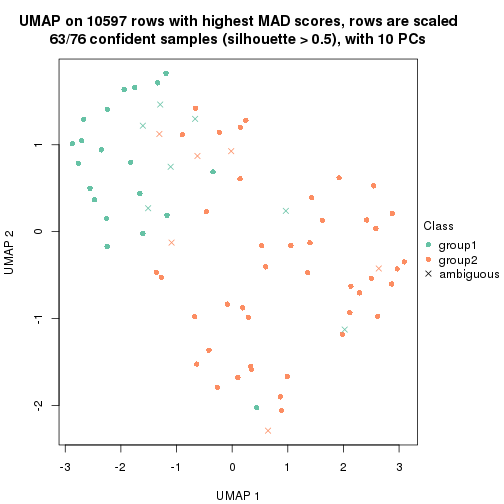</p>

</div>
<div id='tab-MAD-hclust-dimension-reduction-2'>
<pre><code class="r">dimension_reduction(res, k = 3, method = &quot;UMAP&quot;)
</code></pre>

<p>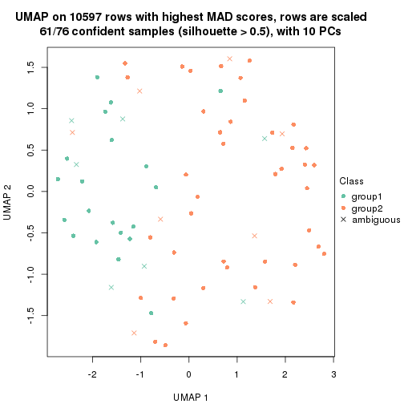</p>

</div>
<div id='tab-MAD-hclust-dimension-reduction-3'>
<pre><code class="r">dimension_reduction(res, k = 4, method = &quot;UMAP&quot;)
</code></pre>

<p>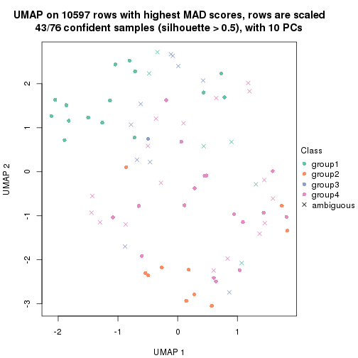</p>

</div>
<div id='tab-MAD-hclust-dimension-reduction-4'>
<pre><code class="r">dimension_reduction(res, k = 5, method = &quot;UMAP&quot;)
</code></pre>

<p>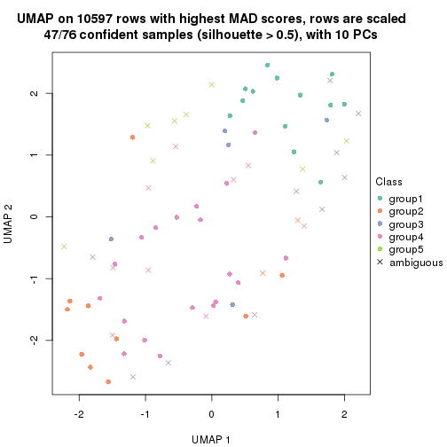</p>

</div>
<div id='tab-MAD-hclust-dimension-reduction-5'>
<pre><code class="r">dimension_reduction(res, k = 6, method = &quot;UMAP&quot;)
</code></pre>

<p>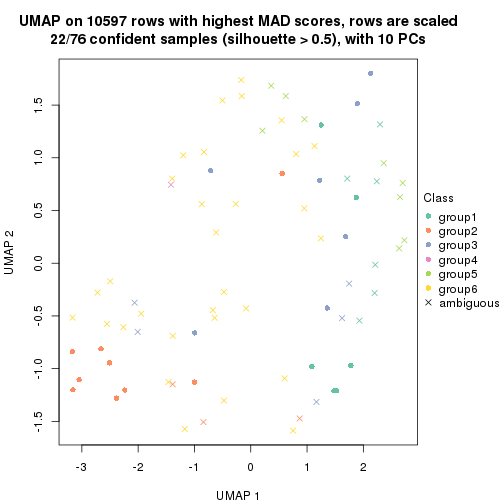</p>

</div>
</div>


Following heatmap shows how subgroups are split when increasing `k`:

```r
collect_classes(res)
```

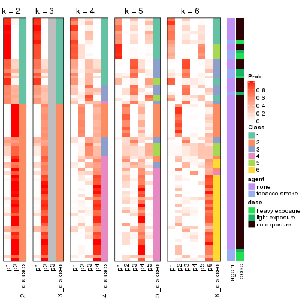


Test correlation between subgroups and known annotations. If the known
annotation is numeric, one-way ANOVA test is applied, and if the known
annotation is discrete, chi-squared contingency table test is applied.

```r
test_to_known_factors(res)
```

```
#>             n agent(p) dose(p) k
#> MAD:hclust 63    0.085   0.107 2
#> MAD:hclust 61    0.102   0.128 3
#> MAD:hclust 43    0.341   0.754 4
#> MAD:hclust 47    0.156   0.505 5
#> MAD:hclust 22    0.247   0.416 6
```


If matrix rows can be associated to genes, consider to use `GO_Enrichment(res,
...)` to perform function enrichment for the signature genes.


 

---------------------------------------------------


### MAD:kmeans


The object with results only for a single top-value method and a single partition method 
can be extracted as:

```r
res = res_list["MAD", "kmeans"]
# you can also extract it by
# res = res_list["MAD:kmeans"]
```

A summary of `res` and all the functions that can be applied to it:

```r
res
```

```
#> A 'ConsensusPartition' object with k = 2, 3, 4, 5, 6.
#>   On a matrix with 10597 rows and 76 columns.
#>   Top rows (1000, 2000, 3000, 4000, 5000) are extracted by 'MAD' method.
#>   Subgroups are detected by 'kmeans' method.
#>   Performed in total 1250 partitions by row resampling.
#>   Best k for subgroups seems to be 2.
#> 
#> Following methods can be applied to this 'ConsensusPartition' object:
#>  [1] "cola_report"             "collect_classes"         "collect_plots"          
#>  [4] "collect_stats"           "colnames"                "compare_signatures"     
#>  [7] "consensus_heatmap"       "dimension_reduction"     "functional_enrichment"  
#> [10] "get_anno_col"            "get_anno"                "get_classes"            
#> [13] "get_consensus"           "get_matrix"              "get_membership"         
#> [16] "get_param"               "get_signatures"          "get_stats"              
#> [19] "is_best_k"               "is_stable_k"             "membership_heatmap"     
#> [22] "ncol"                    "nrow"                    "plot_ecdf"              
#> [25] "rownames"                "select_partition_number" "show"                   
#> [28] "suggest_best_k"          "test_to_known_factors"
```

`collect_plots()` function collects all the plots made from `res` for all `k` (number of partitions)
into one single page to provide an easy and fast comparison between different `k`.

```r
collect_plots(res)
```

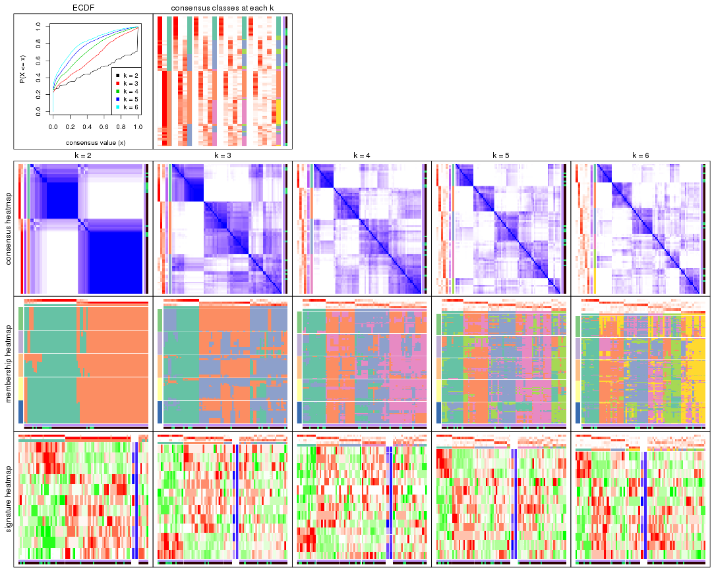

The plots are:

- The first row: a plot of the ECDF (Empirical cumulative distribution
  function) curves of the consensus matrix for each `k` and the heatmap of
  predicted classes for each `k`.
- The second row: heatmaps of the consensus matrix for each `k`.
- The third row: heatmaps of the membership matrix for each `k`.
- The fouth row: heatmaps of the signatures for each `k`.

All the plots in panels can be made by individual functions and they are
plotted later in this section.

`select_partition_number()` produces several plots showing different
statistics for choosing "optimized" `k`. There are following statistics:

- ECDF curves of the consensus matrix for each `k`;
- 1-PAC. [The PAC
  score](https://en.wikipedia.org/wiki/Consensus_clustering#Over-interpretation_potential_of_consensus_clustering)
  measures the proportion of the ambiguous subgrouping.
- Mean silhouette score.
- Concordance. The mean probability of fiting the consensus class ids in all
  partitions.
- Area increased. Denote $A_k$ as the area under the ECDF curve for current
  `k`, the area increased is defined as $A_k - A_{k-1}$.
- Rand index. The percent of pairs of samples that are both in a same cluster
  or both are not in a same cluster in the partition of k and k-1.
- Jaccard index. The ratio of pairs of samples are both in a same cluster in
  the partition of k and k-1 and the pairs of samples are both in a same
  cluster in the partition k or k-1.

The detailed explanations of these statistics can be found in [the cola
vignette](http://bioconductor.org/packages/devel/bioc/vignettes/cola/inst/doc/cola.html#toc_13).

Generally speaking, lower PAC score, higher mean silhouette score or higher
concordance corresponds to better partition. Rand index and Jaccard index
measure how similar the current partition is compared to partition with `k-1`.
If they are too similar, we won't accept `k` is better than `k-1`.

```r
select_partition_number(res)
```

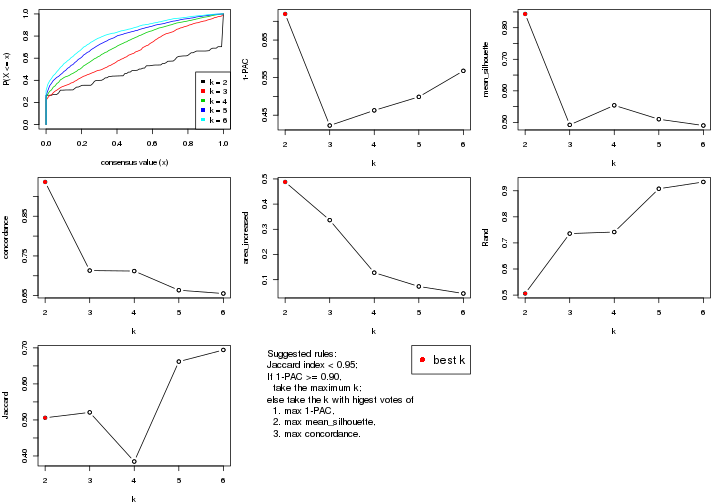

The numeric values for all these statistics can be obtained by `get_stats()`.

```r
get_stats(res)
```

```
#>   k 1-PAC mean_silhouette concordance area_increased  Rand Jaccard
#> 2 2 0.719           0.844       0.936         0.4879 0.506   0.506
#> 3 3 0.423           0.492       0.713         0.3365 0.736   0.521
#> 4 4 0.463           0.554       0.712         0.1278 0.742   0.385
#> 5 5 0.499           0.510       0.664         0.0731 0.908   0.662
#> 6 6 0.568           0.490       0.655         0.0450 0.934   0.694
```

`suggest_best_k()` suggests the best $k$ based on these statistics. The rules are as follows:

- All $k$ with Jaccard index larger than 0.95 are removed because the increase of
  the partition number does not provides enough extra information. If all $k$ are removed,
  the best $k$ is assigned by `NA`.
- For $k$ with 1-PAC larger than 0.9, the maximal $k$ is taken as the "best k". Other $k$ is called "optional k".
- If it does not fit the second rule. The $k$ with the highest vote of highest
  1-PAC, mean silhouette and concordance is taken as the "best k".

```r
suggest_best_k(res)
```

```
#> [1] 2
```


Following shows the table of the partitions (You need to click the **show/hide
code output** link to see it). The membership matrix (columns with name `p*`)
is inferred by
[`clue::cl_consensus()`](https://www.rdocumentation.org/link/cl_consensus?package=clue)
function with the `SE` method. Basically the value in the membership matrix
represents the probability to belong to a certain group. The finall class
label for an item is determined with the group with highest probability it
belongs to.

In `get_classes()` function, the entropy is calculated from the membership
matrix and the silhouette score is calculated from the consensus matrix.


<script>
$( function() {
	$( '#tabs-MAD-kmeans-get-classes' ).tabs();
} );
</script>
<div id='tabs-MAD-kmeans-get-classes'>
<ul>
<li><a href='#tab-MAD-kmeans-get-classes-1'>k = 2</a></li>
<li><a href='#tab-MAD-kmeans-get-classes-2'>k = 3</a></li>
<li><a href='#tab-MAD-kmeans-get-classes-3'>k = 4</a></li>
<li><a href='#tab-MAD-kmeans-get-classes-4'>k = 5</a></li>
<li><a href='#tab-MAD-kmeans-get-classes-5'>k = 6</a></li>
</ul>

<div id='tab-MAD-kmeans-get-classes-1'>
<p><a id='tab-MAD-kmeans-get-classes-1-a' style='color:#0366d6' href='#'>show/hide code output</a></p>
<pre><code class="r">cbind(get_classes(res, k = 2), get_membership(res, k = 2))
</code></pre>

<pre><code>#&gt;           class entropy silhouette    p1    p2
#&gt; GSM451162     1   0.839     0.6445 0.732 0.268
#&gt; GSM451163     2   0.000     0.9445 0.000 1.000
#&gt; GSM451164     2   0.000     0.9445 0.000 1.000
#&gt; GSM451165     2   0.000     0.9445 0.000 1.000
#&gt; GSM451167     2   0.000     0.9445 0.000 1.000
#&gt; GSM451168     2   0.000     0.9445 0.000 1.000
#&gt; GSM451169     2   0.224     0.9119 0.036 0.964
#&gt; GSM451170     1   0.000     0.9029 1.000 0.000
#&gt; GSM451171     2   0.000     0.9445 0.000 1.000
#&gt; GSM451172     2   0.000     0.9445 0.000 1.000
#&gt; GSM451173     1   0.358     0.8657 0.932 0.068
#&gt; GSM451174     2   0.000     0.9445 0.000 1.000
#&gt; GSM451175     1   0.373     0.8633 0.928 0.072
#&gt; GSM451177     2   0.000     0.9445 0.000 1.000
#&gt; GSM451178     2   0.000     0.9445 0.000 1.000
#&gt; GSM451179     1   0.827     0.6545 0.740 0.260
#&gt; GSM451180     2   0.000     0.9445 0.000 1.000
#&gt; GSM451181     2   0.000     0.9445 0.000 1.000
#&gt; GSM451182     1   0.000     0.9029 1.000 0.000
#&gt; GSM451183     1   0.000     0.9029 1.000 0.000
#&gt; GSM451184     1   0.000     0.9029 1.000 0.000
#&gt; GSM451185     1   0.000     0.9029 1.000 0.000
#&gt; GSM451186     2   0.988     0.1763 0.436 0.564
#&gt; GSM451187     2   0.000     0.9445 0.000 1.000
#&gt; GSM451188     2   0.000     0.9445 0.000 1.000
#&gt; GSM451189     1   0.000     0.9029 1.000 0.000
#&gt; GSM451190     1   0.000     0.9029 1.000 0.000
#&gt; GSM451191     1   0.000     0.9029 1.000 0.000
#&gt; GSM451193     2   0.833     0.5973 0.264 0.736
#&gt; GSM451195     1   0.000     0.9029 1.000 0.000
#&gt; GSM451196     1   0.000     0.9029 1.000 0.000
#&gt; GSM451197     1   0.000     0.9029 1.000 0.000
#&gt; GSM451199     1   0.000     0.9029 1.000 0.000
#&gt; GSM451201     1   0.000     0.9029 1.000 0.000
#&gt; GSM451202     2   0.000     0.9445 0.000 1.000
#&gt; GSM451203     1   0.999     0.0847 0.520 0.480
#&gt; GSM451204     2   0.000     0.9445 0.000 1.000
#&gt; GSM451205     2   0.000     0.9445 0.000 1.000
#&gt; GSM451206     2   0.000     0.9445 0.000 1.000
#&gt; GSM451207     2   0.000     0.9445 0.000 1.000
#&gt; GSM451208     2   0.000     0.9445 0.000 1.000
#&gt; GSM451209     2   0.697     0.7281 0.188 0.812
#&gt; GSM451210     2   0.000     0.9445 0.000 1.000
#&gt; GSM451212     2   0.000     0.9445 0.000 1.000
#&gt; GSM451213     2   0.000     0.9445 0.000 1.000
#&gt; GSM451214     2   0.000     0.9445 0.000 1.000
#&gt; GSM451215     2   0.000     0.9445 0.000 1.000
#&gt; GSM451216     2   0.000     0.9445 0.000 1.000
#&gt; GSM451217     2   0.000     0.9445 0.000 1.000
#&gt; GSM451219     1   0.000     0.9029 1.000 0.000
#&gt; GSM451220     1   0.373     0.8633 0.928 0.072
#&gt; GSM451221     1   0.000     0.9029 1.000 0.000
#&gt; GSM451222     1   0.634     0.7905 0.840 0.160
#&gt; GSM451224     2   0.000     0.9445 0.000 1.000
#&gt; GSM451225     1   0.990     0.2157 0.560 0.440
#&gt; GSM451226     1   0.995     0.2142 0.540 0.460
#&gt; GSM451227     2   0.900     0.4944 0.316 0.684
#&gt; GSM451228     2   0.000     0.9445 0.000 1.000
#&gt; GSM451230     2   0.936     0.4161 0.352 0.648
#&gt; GSM451231     2   0.850     0.5896 0.276 0.724
#&gt; GSM451233     2   0.000     0.9445 0.000 1.000
#&gt; GSM451234     2   0.000     0.9445 0.000 1.000
#&gt; GSM451235     2   0.000     0.9445 0.000 1.000
#&gt; GSM451236     2   0.000     0.9445 0.000 1.000
#&gt; GSM451166     2   0.722     0.7063 0.200 0.800
#&gt; GSM451194     1   0.644     0.7864 0.836 0.164
#&gt; GSM451198     1   0.000     0.9029 1.000 0.000
#&gt; GSM451218     2   0.000     0.9445 0.000 1.000
#&gt; GSM451232     1   0.000     0.9029 1.000 0.000
#&gt; GSM451176     1   0.000     0.9029 1.000 0.000
#&gt; GSM451192     1   0.000     0.9029 1.000 0.000
#&gt; GSM451200     1   0.000     0.9029 1.000 0.000
#&gt; GSM451211     2   0.000     0.9445 0.000 1.000
#&gt; GSM451223     1   0.913     0.5464 0.672 0.328
#&gt; GSM451229     1   0.000     0.9029 1.000 0.000
#&gt; GSM451237     2   0.000     0.9445 0.000 1.000
</code></pre>

<script>
$('#tab-MAD-kmeans-get-classes-1-a').parent().next().next().hide();
$('#tab-MAD-kmeans-get-classes-1-a').click(function(){
  $('#tab-MAD-kmeans-get-classes-1-a').parent().next().next().toggle();
  return(false);
});
</script>
</div>

<div id='tab-MAD-kmeans-get-classes-2'>
<p><a id='tab-MAD-kmeans-get-classes-2-a' style='color:#0366d6' href='#'>show/hide code output</a></p>
<pre><code class="r">cbind(get_classes(res, k = 3), get_membership(res, k = 3))
</code></pre>

<pre><code>#&gt;           class entropy silhouette    p1    p2    p3
#&gt; GSM451162     3  0.8779     0.3699 0.248 0.172 0.580
#&gt; GSM451163     2  0.4605     0.6390 0.000 0.796 0.204
#&gt; GSM451164     2  0.4452     0.5507 0.000 0.808 0.192
#&gt; GSM451165     2  0.6126     0.4432 0.000 0.600 0.400
#&gt; GSM451167     3  0.6045     0.0395 0.000 0.380 0.620
#&gt; GSM451168     2  0.5138     0.5372 0.000 0.748 0.252
#&gt; GSM451169     3  0.3340     0.5101 0.000 0.120 0.880
#&gt; GSM451170     1  0.2796     0.7561 0.908 0.000 0.092
#&gt; GSM451171     2  0.0000     0.6475 0.000 1.000 0.000
#&gt; GSM451172     2  0.5859     0.5562 0.000 0.656 0.344
#&gt; GSM451173     3  0.6274    -0.1103 0.456 0.000 0.544
#&gt; GSM451174     2  0.6204     0.4985 0.000 0.576 0.424
#&gt; GSM451175     1  0.6286     0.2217 0.536 0.000 0.464
#&gt; GSM451177     2  0.1411     0.6404 0.000 0.964 0.036
#&gt; GSM451178     2  0.6286     0.4368 0.000 0.536 0.464
#&gt; GSM451179     3  0.4887     0.3962 0.228 0.000 0.772
#&gt; GSM451180     2  0.0000     0.6475 0.000 1.000 0.000
#&gt; GSM451181     2  0.6267     0.5041 0.000 0.548 0.452
#&gt; GSM451182     1  0.1289     0.7809 0.968 0.000 0.032
#&gt; GSM451183     1  0.0000     0.7854 1.000 0.000 0.000
#&gt; GSM451184     3  0.7158    -0.0527 0.372 0.032 0.596
#&gt; GSM451185     1  0.0000     0.7854 1.000 0.000 0.000
#&gt; GSM451186     3  0.5000     0.4839 0.044 0.124 0.832
#&gt; GSM451187     2  0.2261     0.6561 0.000 0.932 0.068
#&gt; GSM451188     2  0.5216     0.4749 0.000 0.740 0.260
#&gt; GSM451189     1  0.0000     0.7854 1.000 0.000 0.000
#&gt; GSM451190     1  0.1964     0.7729 0.944 0.000 0.056
#&gt; GSM451191     1  0.4178     0.6988 0.828 0.000 0.172
#&gt; GSM451193     3  0.0892     0.5430 0.000 0.020 0.980
#&gt; GSM451195     1  0.6180     0.4327 0.584 0.000 0.416
#&gt; GSM451196     1  0.0000     0.7854 1.000 0.000 0.000
#&gt; GSM451197     1  0.0424     0.7853 0.992 0.000 0.008
#&gt; GSM451199     1  0.6168     0.4609 0.588 0.000 0.412
#&gt; GSM451201     1  0.0237     0.7856 0.996 0.000 0.004
#&gt; GSM451202     2  0.3340     0.6133 0.000 0.880 0.120
#&gt; GSM451203     3  0.4658     0.5590 0.068 0.076 0.856
#&gt; GSM451204     2  0.6291     0.4502 0.000 0.532 0.468
#&gt; GSM451205     2  0.1411     0.6404 0.000 0.964 0.036
#&gt; GSM451206     2  0.6008     0.5531 0.000 0.628 0.372
#&gt; GSM451207     2  0.6045     0.5494 0.000 0.620 0.380
#&gt; GSM451208     2  0.0424     0.6469 0.000 0.992 0.008
#&gt; GSM451209     3  0.4575     0.4240 0.012 0.160 0.828
#&gt; GSM451210     2  0.4931     0.5109 0.000 0.768 0.232
#&gt; GSM451212     2  0.5810     0.5679 0.000 0.664 0.336
#&gt; GSM451213     2  0.5859     0.5675 0.000 0.656 0.344
#&gt; GSM451214     3  0.6079     0.2660 0.000 0.388 0.612
#&gt; GSM451215     2  0.0000     0.6475 0.000 1.000 0.000
#&gt; GSM451216     2  0.5835     0.5706 0.000 0.660 0.340
#&gt; GSM451217     2  0.2959     0.6233 0.000 0.900 0.100
#&gt; GSM451219     1  0.6260     0.4026 0.552 0.000 0.448
#&gt; GSM451220     3  0.5988     0.1556 0.368 0.000 0.632
#&gt; GSM451221     1  0.6286     0.3514 0.536 0.000 0.464
#&gt; GSM451222     1  0.7366     0.2405 0.564 0.036 0.400
#&gt; GSM451224     2  0.5397     0.4558 0.000 0.720 0.280
#&gt; GSM451225     3  0.6977     0.5109 0.212 0.076 0.712
#&gt; GSM451226     3  0.7164     0.1132 0.316 0.044 0.640
#&gt; GSM451227     3  0.6045     0.2681 0.000 0.380 0.620
#&gt; GSM451228     3  0.5431     0.3164 0.000 0.284 0.716
#&gt; GSM451230     3  0.6416     0.3523 0.032 0.260 0.708
#&gt; GSM451231     3  0.3780     0.5397 0.044 0.064 0.892
#&gt; GSM451233     3  0.6111    -0.3215 0.000 0.396 0.604
#&gt; GSM451234     2  0.6095     0.5458 0.000 0.608 0.392
#&gt; GSM451235     2  0.6045     0.5470 0.000 0.620 0.380
#&gt; GSM451236     2  0.5733     0.5773 0.000 0.676 0.324
#&gt; GSM451166     3  0.6434     0.1893 0.008 0.380 0.612
#&gt; GSM451194     3  0.5929     0.2708 0.320 0.004 0.676
#&gt; GSM451198     1  0.5397     0.5977 0.720 0.000 0.280
#&gt; GSM451218     2  0.6079     0.5423 0.000 0.612 0.388
#&gt; GSM451232     1  0.0000     0.7854 1.000 0.000 0.000
#&gt; GSM451176     1  0.0000     0.7854 1.000 0.000 0.000
#&gt; GSM451192     1  0.0237     0.7848 0.996 0.000 0.004
#&gt; GSM451200     1  0.5948     0.5125 0.640 0.000 0.360
#&gt; GSM451211     2  0.4887     0.6320 0.000 0.772 0.228
#&gt; GSM451223     3  0.4808     0.4333 0.188 0.008 0.804
#&gt; GSM451229     1  0.0000     0.7854 1.000 0.000 0.000
#&gt; GSM451237     3  0.6215    -0.4047 0.000 0.428 0.572
</code></pre>

<script>
$('#tab-MAD-kmeans-get-classes-2-a').parent().next().next().hide();
$('#tab-MAD-kmeans-get-classes-2-a').click(function(){
  $('#tab-MAD-kmeans-get-classes-2-a').parent().next().next().toggle();
  return(false);
});
</script>
</div>

<div id='tab-MAD-kmeans-get-classes-3'>
<p><a id='tab-MAD-kmeans-get-classes-3-a' style='color:#0366d6' href='#'>show/hide code output</a></p>
<pre><code class="r">cbind(get_classes(res, k = 4), get_membership(res, k = 4))
</code></pre>

<pre><code>#&gt;           class entropy silhouette    p1    p2    p3    p4
#&gt; GSM451162     3  0.5602     0.5316 0.040 0.020 0.720 0.220
#&gt; GSM451163     2  0.4799     0.6103 0.000 0.744 0.032 0.224
#&gt; GSM451164     2  0.2830     0.6979 0.000 0.900 0.040 0.060
#&gt; GSM451165     2  0.7039     0.3907 0.000 0.568 0.256 0.176
#&gt; GSM451167     4  0.6747     0.5429 0.000 0.140 0.264 0.596
#&gt; GSM451168     2  0.6135     0.2775 0.000 0.568 0.056 0.376
#&gt; GSM451169     3  0.4877     0.5547 0.000 0.044 0.752 0.204
#&gt; GSM451170     1  0.6292     0.5316 0.592 0.000 0.332 0.076
#&gt; GSM451171     2  0.3569     0.6819 0.000 0.804 0.000 0.196
#&gt; GSM451172     2  0.6570     0.4825 0.000 0.632 0.164 0.204
#&gt; GSM451173     3  0.5288     0.6420 0.200 0.000 0.732 0.068
#&gt; GSM451174     4  0.4244     0.5985 0.000 0.168 0.032 0.800
#&gt; GSM451175     3  0.6500     0.5962 0.260 0.000 0.620 0.120
#&gt; GSM451177     2  0.3444     0.7110 0.000 0.816 0.000 0.184
#&gt; GSM451178     4  0.4720     0.6004 0.000 0.188 0.044 0.768
#&gt; GSM451179     3  0.4791     0.6318 0.024 0.028 0.792 0.156
#&gt; GSM451180     2  0.3610     0.6798 0.000 0.800 0.000 0.200
#&gt; GSM451181     4  0.7081     0.5223 0.000 0.388 0.128 0.484
#&gt; GSM451182     1  0.5365     0.6439 0.692 0.000 0.264 0.044
#&gt; GSM451183     1  0.0000     0.8263 1.000 0.000 0.000 0.000
#&gt; GSM451184     3  0.5677     0.5601 0.072 0.176 0.736 0.016
#&gt; GSM451185     1  0.1936     0.8237 0.940 0.000 0.032 0.028
#&gt; GSM451186     4  0.6216     0.3943 0.000 0.108 0.240 0.652
#&gt; GSM451187     2  0.4040     0.6316 0.000 0.752 0.000 0.248
#&gt; GSM451188     2  0.2197     0.6969 0.000 0.928 0.024 0.048
#&gt; GSM451189     1  0.0817     0.8276 0.976 0.000 0.000 0.024
#&gt; GSM451190     1  0.5663     0.3758 0.536 0.000 0.440 0.024
#&gt; GSM451191     1  0.6334     0.4014 0.536 0.024 0.416 0.024
#&gt; GSM451193     3  0.5304     0.5733 0.000 0.104 0.748 0.148
#&gt; GSM451195     3  0.4744     0.6160 0.240 0.000 0.736 0.024
#&gt; GSM451196     1  0.0469     0.8219 0.988 0.000 0.012 0.000
#&gt; GSM451197     1  0.1890     0.8166 0.936 0.000 0.056 0.008
#&gt; GSM451199     3  0.6524     0.4377 0.212 0.044 0.680 0.064
#&gt; GSM451201     1  0.1118     0.8190 0.964 0.000 0.036 0.000
#&gt; GSM451202     2  0.2814     0.7116 0.000 0.868 0.000 0.132
#&gt; GSM451203     3  0.5789     0.5733 0.024 0.064 0.732 0.180
#&gt; GSM451204     4  0.7145     0.5485 0.000 0.348 0.144 0.508
#&gt; GSM451205     2  0.2760     0.7163 0.000 0.872 0.000 0.128
#&gt; GSM451206     4  0.4574     0.5607 0.000 0.220 0.024 0.756
#&gt; GSM451207     4  0.7084     0.5556 0.000 0.340 0.140 0.520
#&gt; GSM451208     2  0.4477     0.6217 0.000 0.688 0.000 0.312
#&gt; GSM451209     4  0.5657     0.1947 0.000 0.024 0.436 0.540
#&gt; GSM451210     2  0.2256     0.6957 0.000 0.924 0.020 0.056
#&gt; GSM451212     4  0.5636     0.5776 0.000 0.260 0.060 0.680
#&gt; GSM451213     4  0.4434     0.5625 0.000 0.228 0.016 0.756
#&gt; GSM451214     2  0.5906    -0.0462 0.000 0.528 0.436 0.036
#&gt; GSM451215     2  0.4193     0.6519 0.000 0.732 0.000 0.268
#&gt; GSM451216     4  0.4228     0.5503 0.000 0.232 0.008 0.760
#&gt; GSM451217     2  0.2530     0.7157 0.000 0.896 0.004 0.100
#&gt; GSM451219     3  0.7415     0.3704 0.212 0.044 0.616 0.128
#&gt; GSM451220     3  0.5309     0.6594 0.164 0.000 0.744 0.092
#&gt; GSM451221     3  0.7263     0.3732 0.236 0.064 0.624 0.076
#&gt; GSM451222     3  0.7253     0.3299 0.424 0.000 0.432 0.144
#&gt; GSM451224     2  0.4083     0.6478 0.000 0.832 0.068 0.100
#&gt; GSM451225     4  0.6648     0.2621 0.044 0.032 0.328 0.596
#&gt; GSM451226     3  0.5597     0.5820 0.032 0.188 0.740 0.040
#&gt; GSM451227     3  0.6568     0.2241 0.000 0.408 0.512 0.080
#&gt; GSM451228     4  0.6038     0.1991 0.000 0.044 0.424 0.532
#&gt; GSM451230     3  0.5667     0.0662 0.012 0.008 0.540 0.440
#&gt; GSM451231     4  0.6491     0.0539 0.000 0.072 0.432 0.496
#&gt; GSM451233     4  0.7551     0.5301 0.000 0.288 0.228 0.484
#&gt; GSM451234     4  0.4174     0.6085 0.000 0.140 0.044 0.816
#&gt; GSM451235     4  0.4418     0.5883 0.000 0.184 0.032 0.784
#&gt; GSM451236     4  0.4382     0.4953 0.000 0.296 0.000 0.704
#&gt; GSM451166     4  0.6258     0.3164 0.000 0.076 0.324 0.600
#&gt; GSM451194     3  0.5834     0.6587 0.172 0.000 0.704 0.124
#&gt; GSM451198     3  0.5174     0.4829 0.368 0.000 0.620 0.012
#&gt; GSM451218     4  0.3402     0.5976 0.000 0.164 0.004 0.832
#&gt; GSM451232     1  0.1174     0.8243 0.968 0.000 0.012 0.020
#&gt; GSM451176     1  0.1388     0.8269 0.960 0.000 0.012 0.028
#&gt; GSM451192     1  0.2589     0.7704 0.884 0.000 0.116 0.000
#&gt; GSM451200     3  0.4718     0.5856 0.280 0.000 0.708 0.012
#&gt; GSM451211     4  0.5311     0.2693 0.000 0.328 0.024 0.648
#&gt; GSM451223     3  0.4220     0.6394 0.008 0.068 0.836 0.088
#&gt; GSM451229     1  0.0779     0.8270 0.980 0.000 0.004 0.016
#&gt; GSM451237     4  0.6497     0.5838 0.000 0.200 0.160 0.640
</code></pre>

<script>
$('#tab-MAD-kmeans-get-classes-3-a').parent().next().next().hide();
$('#tab-MAD-kmeans-get-classes-3-a').click(function(){
  $('#tab-MAD-kmeans-get-classes-3-a').parent().next().next().toggle();
  return(false);
});
</script>
</div>

<div id='tab-MAD-kmeans-get-classes-4'>
<p><a id='tab-MAD-kmeans-get-classes-4-a' style='color:#0366d6' href='#'>show/hide code output</a></p>
<pre><code class="r">cbind(get_classes(res, k = 5), get_membership(res, k = 5))
</code></pre>

<pre><code>#&gt;           class entropy silhouette    p1    p2    p3    p4    p5
#&gt; GSM451162     3  0.6946     0.3376 0.016 0.032 0.564 0.136 0.252
#&gt; GSM451163     2  0.5864     0.5078 0.000 0.644 0.060 0.248 0.048
#&gt; GSM451164     2  0.4864     0.6707 0.000 0.768 0.060 0.056 0.116
#&gt; GSM451165     5  0.7192    -0.1958 0.000 0.332 0.024 0.228 0.416
#&gt; GSM451167     4  0.6583     0.2993 0.000 0.088 0.328 0.536 0.048
#&gt; GSM451168     4  0.7879     0.1048 0.000 0.276 0.092 0.420 0.212
#&gt; GSM451169     3  0.5667     0.5734 0.000 0.016 0.672 0.168 0.144
#&gt; GSM451170     1  0.6011     0.2364 0.500 0.000 0.080 0.012 0.408
#&gt; GSM451171     2  0.2074     0.7259 0.000 0.896 0.000 0.104 0.000
#&gt; GSM451172     2  0.6864     0.3449 0.000 0.548 0.048 0.260 0.144
#&gt; GSM451173     3  0.3748     0.6579 0.100 0.000 0.832 0.016 0.052
#&gt; GSM451174     4  0.2732     0.5506 0.000 0.088 0.020 0.884 0.008
#&gt; GSM451175     3  0.4358     0.6525 0.120 0.000 0.796 0.036 0.048
#&gt; GSM451177     2  0.2233     0.7364 0.000 0.892 0.000 0.104 0.004
#&gt; GSM451178     4  0.3080     0.5399 0.000 0.140 0.008 0.844 0.008
#&gt; GSM451179     3  0.5000     0.5556 0.004 0.012 0.720 0.060 0.204
#&gt; GSM451180     2  0.2074     0.7259 0.000 0.896 0.000 0.104 0.000
#&gt; GSM451181     4  0.7928     0.4683 0.000 0.248 0.296 0.376 0.080
#&gt; GSM451182     1  0.5532     0.4949 0.628 0.000 0.080 0.008 0.284
#&gt; GSM451183     1  0.0671     0.8073 0.980 0.000 0.000 0.004 0.016
#&gt; GSM451184     5  0.5032     0.4784 0.020 0.020 0.292 0.004 0.664
#&gt; GSM451185     1  0.1809     0.8065 0.928 0.000 0.000 0.012 0.060
#&gt; GSM451186     4  0.6812     0.3195 0.000 0.012 0.200 0.464 0.324
#&gt; GSM451187     2  0.2753     0.6959 0.000 0.856 0.000 0.136 0.008
#&gt; GSM451188     2  0.5412     0.6482 0.000 0.684 0.020 0.080 0.216
#&gt; GSM451189     1  0.1430     0.8093 0.944 0.000 0.000 0.004 0.052
#&gt; GSM451190     1  0.6513    -0.0101 0.424 0.000 0.164 0.004 0.408
#&gt; GSM451191     5  0.5889     0.0712 0.392 0.000 0.080 0.008 0.520
#&gt; GSM451193     3  0.7378     0.2668 0.000 0.044 0.456 0.232 0.268
#&gt; GSM451195     3  0.3543     0.6464 0.112 0.000 0.828 0.000 0.060
#&gt; GSM451196     1  0.0740     0.8059 0.980 0.000 0.008 0.004 0.008
#&gt; GSM451197     1  0.3579     0.7431 0.836 0.000 0.080 0.004 0.080
#&gt; GSM451199     5  0.6109     0.4789 0.172 0.000 0.272 0.000 0.556
#&gt; GSM451201     1  0.2102     0.7739 0.916 0.000 0.068 0.004 0.012
#&gt; GSM451202     2  0.4281     0.7026 0.000 0.768 0.004 0.172 0.056
#&gt; GSM451203     3  0.2853     0.6491 0.008 0.004 0.888 0.068 0.032
#&gt; GSM451204     4  0.7609     0.4771 0.000 0.220 0.292 0.428 0.060
#&gt; GSM451205     2  0.0794     0.7367 0.000 0.972 0.000 0.028 0.000
#&gt; GSM451206     4  0.3519     0.4977 0.000 0.216 0.000 0.776 0.008
#&gt; GSM451207     4  0.7436     0.3939 0.000 0.228 0.324 0.408 0.040
#&gt; GSM451208     2  0.3662     0.6429 0.000 0.744 0.000 0.252 0.004
#&gt; GSM451209     4  0.6748     0.1284 0.000 0.016 0.408 0.420 0.156
#&gt; GSM451210     2  0.5808     0.6394 0.000 0.656 0.028 0.096 0.220
#&gt; GSM451212     4  0.6245     0.5317 0.000 0.160 0.148 0.644 0.048
#&gt; GSM451213     4  0.5177     0.5186 0.000 0.168 0.068 0.728 0.036
#&gt; GSM451214     5  0.6760     0.3856 0.000 0.292 0.156 0.028 0.524
#&gt; GSM451215     2  0.2970     0.7041 0.000 0.828 0.000 0.168 0.004
#&gt; GSM451216     4  0.5189     0.5116 0.000 0.176 0.064 0.724 0.036
#&gt; GSM451217     2  0.4702     0.6992 0.000 0.780 0.052 0.108 0.060
#&gt; GSM451219     5  0.5937     0.4748 0.176 0.000 0.192 0.008 0.624
#&gt; GSM451220     3  0.3129     0.6681 0.076 0.000 0.872 0.020 0.032
#&gt; GSM451221     5  0.5790     0.5074 0.184 0.000 0.200 0.000 0.616
#&gt; GSM451222     3  0.6033     0.4309 0.324 0.000 0.572 0.084 0.020
#&gt; GSM451224     2  0.6511     0.5024 0.000 0.544 0.020 0.144 0.292
#&gt; GSM451225     4  0.6967     0.1893 0.012 0.000 0.340 0.420 0.228
#&gt; GSM451226     5  0.6309     0.4805 0.012 0.084 0.240 0.036 0.628
#&gt; GSM451227     5  0.5993     0.5247 0.004 0.168 0.128 0.032 0.668
#&gt; GSM451228     3  0.5907     0.4064 0.000 0.040 0.576 0.340 0.044
#&gt; GSM451230     3  0.4039     0.5437 0.004 0.000 0.776 0.184 0.036
#&gt; GSM451231     3  0.6708    -0.1283 0.000 0.012 0.480 0.328 0.180
#&gt; GSM451233     4  0.7990     0.3696 0.000 0.156 0.328 0.388 0.128
#&gt; GSM451234     4  0.4146     0.5706 0.000 0.052 0.056 0.820 0.072
#&gt; GSM451235     4  0.3320     0.5341 0.000 0.124 0.016 0.844 0.016
#&gt; GSM451236     4  0.5602     0.4100 0.000 0.296 0.060 0.624 0.020
#&gt; GSM451166     4  0.6118    -0.0611 0.000 0.020 0.452 0.456 0.072
#&gt; GSM451194     3  0.4261     0.6591 0.076 0.000 0.804 0.024 0.096
#&gt; GSM451198     3  0.4588     0.5721 0.200 0.000 0.736 0.004 0.060
#&gt; GSM451218     4  0.4206     0.5392 0.000 0.128 0.048 0.800 0.024
#&gt; GSM451232     1  0.1393     0.8074 0.956 0.000 0.008 0.012 0.024
#&gt; GSM451176     1  0.2037     0.8068 0.920 0.000 0.012 0.004 0.064
#&gt; GSM451192     1  0.2536     0.7503 0.868 0.000 0.000 0.004 0.128
#&gt; GSM451200     3  0.4190     0.5981 0.172 0.000 0.768 0.000 0.060
#&gt; GSM451211     4  0.4118     0.2236 0.000 0.336 0.000 0.660 0.004
#&gt; GSM451223     3  0.5103     0.5397 0.000 0.036 0.720 0.048 0.196
#&gt; GSM451229     1  0.0693     0.8092 0.980 0.000 0.000 0.008 0.012
#&gt; GSM451237     4  0.6583     0.4911 0.000 0.056 0.240 0.592 0.112
</code></pre>

<script>
$('#tab-MAD-kmeans-get-classes-4-a').parent().next().next().hide();
$('#tab-MAD-kmeans-get-classes-4-a').click(function(){
  $('#tab-MAD-kmeans-get-classes-4-a').parent().next().next().toggle();
  return(false);
});
</script>
</div>

<div id='tab-MAD-kmeans-get-classes-5'>
<p><a id='tab-MAD-kmeans-get-classes-5-a' style='color:#0366d6' href='#'>show/hide code output</a></p>
<pre><code class="r">cbind(get_classes(res, k = 6), get_membership(res, k = 6))
</code></pre>

<pre><code>#&gt;           class entropy silhouette    p1    p2    p3    p4    p5    p6
#&gt; GSM451162     3  0.6337     0.3420 0.004 0.040 0.584 0.068 0.260 0.044
#&gt; GSM451163     2  0.6287     0.4466 0.000 0.564 0.052 0.288 0.052 0.044
#&gt; GSM451164     2  0.4709     0.6296 0.000 0.696 0.024 0.220 0.060 0.000
#&gt; GSM451165     5  0.8317    -0.1794 0.000 0.256 0.052 0.208 0.320 0.164
#&gt; GSM451167     4  0.7963     0.0839 0.000 0.052 0.252 0.332 0.080 0.284
#&gt; GSM451168     4  0.6481     0.1552 0.000 0.208 0.008 0.536 0.044 0.204
#&gt; GSM451169     3  0.6289     0.4163 0.000 0.008 0.596 0.180 0.140 0.076
#&gt; GSM451170     5  0.6248     0.0530 0.348 0.000 0.096 0.040 0.504 0.012
#&gt; GSM451171     2  0.2358     0.6682 0.000 0.876 0.000 0.000 0.016 0.108
#&gt; GSM451172     2  0.7615     0.2884 0.000 0.460 0.056 0.252 0.128 0.104
#&gt; GSM451173     3  0.2675     0.6843 0.052 0.000 0.888 0.020 0.036 0.004
#&gt; GSM451174     6  0.5374     0.5237 0.000 0.064 0.032 0.192 0.028 0.684
#&gt; GSM451175     3  0.4080     0.6676 0.068 0.000 0.812 0.032 0.060 0.028
#&gt; GSM451177     2  0.2306     0.6937 0.000 0.888 0.000 0.016 0.004 0.092
#&gt; GSM451178     6  0.5163     0.5595 0.000 0.084 0.024 0.136 0.036 0.720
#&gt; GSM451179     3  0.5362     0.4923 0.000 0.004 0.656 0.180 0.140 0.020
#&gt; GSM451180     2  0.2003     0.6701 0.000 0.884 0.000 0.000 0.000 0.116
#&gt; GSM451181     6  0.7542    -0.0904 0.000 0.184 0.136 0.304 0.008 0.368
#&gt; GSM451182     1  0.5297     0.1415 0.476 0.000 0.076 0.008 0.440 0.000
#&gt; GSM451183     1  0.1769     0.8059 0.924 0.000 0.004 0.012 0.060 0.000
#&gt; GSM451184     5  0.5548     0.4536 0.000 0.012 0.272 0.120 0.592 0.004
#&gt; GSM451185     1  0.1719     0.8041 0.924 0.000 0.000 0.016 0.060 0.000
#&gt; GSM451186     4  0.6275     0.4247 0.000 0.000 0.084 0.576 0.196 0.144
#&gt; GSM451187     2  0.4527     0.6061 0.000 0.772 0.020 0.048 0.044 0.116
#&gt; GSM451188     2  0.6009     0.6059 0.000 0.636 0.012 0.164 0.116 0.072
#&gt; GSM451189     1  0.1700     0.8098 0.916 0.000 0.004 0.000 0.080 0.000
#&gt; GSM451190     5  0.5893     0.3358 0.216 0.000 0.180 0.020 0.580 0.004
#&gt; GSM451191     5  0.4741     0.3210 0.252 0.000 0.060 0.016 0.672 0.000
#&gt; GSM451193     4  0.6940     0.2785 0.000 0.020 0.304 0.464 0.160 0.052
#&gt; GSM451195     3  0.3084     0.6832 0.056 0.000 0.860 0.028 0.056 0.000
#&gt; GSM451196     1  0.1053     0.8102 0.964 0.000 0.004 0.020 0.012 0.000
#&gt; GSM451197     1  0.5184     0.6118 0.660 0.000 0.148 0.016 0.176 0.000
#&gt; GSM451199     5  0.5081     0.4712 0.060 0.000 0.260 0.032 0.648 0.000
#&gt; GSM451201     1  0.4216     0.7096 0.768 0.000 0.132 0.024 0.076 0.000
#&gt; GSM451202     2  0.4771     0.6564 0.000 0.720 0.000 0.104 0.028 0.148
#&gt; GSM451203     3  0.4112     0.6109 0.000 0.000 0.784 0.048 0.048 0.120
#&gt; GSM451204     6  0.7534     0.0493 0.000 0.160 0.176 0.204 0.016 0.444
#&gt; GSM451205     2  0.0914     0.6928 0.000 0.968 0.000 0.016 0.000 0.016
#&gt; GSM451206     6  0.5219     0.5591 0.000 0.132 0.016 0.120 0.028 0.704
#&gt; GSM451207     6  0.7229     0.0778 0.000 0.164 0.220 0.152 0.004 0.460
#&gt; GSM451208     2  0.3394     0.6120 0.000 0.752 0.000 0.012 0.000 0.236
#&gt; GSM451209     4  0.6137     0.5288 0.000 0.004 0.248 0.576 0.060 0.112
#&gt; GSM451210     2  0.6116     0.6050 0.000 0.616 0.012 0.196 0.104 0.072
#&gt; GSM451212     6  0.4714     0.4347 0.000 0.056 0.032 0.120 0.032 0.760
#&gt; GSM451213     6  0.2052     0.5786 0.000 0.056 0.004 0.028 0.000 0.912
#&gt; GSM451214     5  0.7394     0.2511 0.000 0.240 0.104 0.240 0.408 0.008
#&gt; GSM451215     2  0.3053     0.6521 0.000 0.812 0.000 0.012 0.004 0.172
#&gt; GSM451216     6  0.1801     0.5790 0.000 0.056 0.004 0.016 0.000 0.924
#&gt; GSM451217     2  0.5370     0.6227 0.000 0.704 0.032 0.156 0.056 0.052
#&gt; GSM451219     5  0.4987     0.5386 0.068 0.000 0.152 0.044 0.724 0.012
#&gt; GSM451220     3  0.1786     0.6868 0.032 0.000 0.932 0.028 0.004 0.004
#&gt; GSM451221     5  0.4758     0.5359 0.088 0.000 0.136 0.036 0.736 0.004
#&gt; GSM451222     3  0.5415     0.5101 0.232 0.000 0.652 0.020 0.020 0.076
#&gt; GSM451224     2  0.7126     0.4801 0.000 0.508 0.012 0.160 0.160 0.160
#&gt; GSM451225     4  0.6965     0.4866 0.004 0.000 0.240 0.492 0.136 0.128
#&gt; GSM451226     5  0.6442     0.4399 0.000 0.080 0.148 0.204 0.564 0.004
#&gt; GSM451227     5  0.6825     0.4200 0.000 0.108 0.100 0.220 0.548 0.024
#&gt; GSM451228     3  0.6862     0.2574 0.000 0.024 0.528 0.156 0.064 0.228
#&gt; GSM451230     3  0.5202     0.4241 0.000 0.004 0.640 0.076 0.020 0.260
#&gt; GSM451231     4  0.7086     0.4651 0.000 0.004 0.264 0.440 0.084 0.208
#&gt; GSM451233     4  0.7158     0.4402 0.000 0.096 0.164 0.496 0.020 0.224
#&gt; GSM451234     6  0.4792     0.3363 0.000 0.036 0.008 0.360 0.004 0.592
#&gt; GSM451235     6  0.5430     0.4818 0.000 0.084 0.012 0.248 0.020 0.636
#&gt; GSM451236     6  0.3767     0.5588 0.000 0.172 0.000 0.028 0.020 0.780
#&gt; GSM451166     6  0.6017     0.1435 0.000 0.004 0.288 0.104 0.044 0.560
#&gt; GSM451194     3  0.3150     0.6789 0.032 0.000 0.860 0.036 0.068 0.004
#&gt; GSM451198     3  0.3671     0.6386 0.104 0.000 0.820 0.028 0.044 0.004
#&gt; GSM451218     6  0.1745     0.5830 0.000 0.056 0.000 0.020 0.000 0.924
#&gt; GSM451232     1  0.0837     0.8107 0.972 0.000 0.004 0.020 0.004 0.000
#&gt; GSM451176     1  0.2169     0.7963 0.900 0.000 0.012 0.008 0.080 0.000
#&gt; GSM451192     1  0.4628     0.6194 0.676 0.000 0.024 0.028 0.268 0.004
#&gt; GSM451200     3  0.3020     0.6629 0.100 0.000 0.856 0.016 0.024 0.004
#&gt; GSM451211     6  0.6028     0.2049 0.000 0.340 0.016 0.100 0.020 0.524
#&gt; GSM451223     3  0.5399     0.4640 0.000 0.016 0.632 0.168 0.184 0.000
#&gt; GSM451229     1  0.0547     0.8113 0.980 0.000 0.000 0.020 0.000 0.000
#&gt; GSM451237     4  0.6169     0.2885 0.000 0.040 0.116 0.548 0.008 0.288
</code></pre>

<script>
$('#tab-MAD-kmeans-get-classes-5-a').parent().next().next().hide();
$('#tab-MAD-kmeans-get-classes-5-a').click(function(){
  $('#tab-MAD-kmeans-get-classes-5-a').parent().next().next().toggle();
  return(false);
});
</script>
</div>
</div>

Heatmaps for the consensus matrix. It visualizes the probability of two
samples to be in a same group.


<script>
$( function() {
	$( '#tabs-MAD-kmeans-consensus-heatmap' ).tabs();
} );
</script>
<div id='tabs-MAD-kmeans-consensus-heatmap'>
<ul>
<li><a href='#tab-MAD-kmeans-consensus-heatmap-1'>k = 2</a></li>
<li><a href='#tab-MAD-kmeans-consensus-heatmap-2'>k = 3</a></li>
<li><a href='#tab-MAD-kmeans-consensus-heatmap-3'>k = 4</a></li>
<li><a href='#tab-MAD-kmeans-consensus-heatmap-4'>k = 5</a></li>
<li><a href='#tab-MAD-kmeans-consensus-heatmap-5'>k = 6</a></li>
</ul>
<div id='tab-MAD-kmeans-consensus-heatmap-1'>
<pre><code class="r">consensus_heatmap(res, k = 2)
</code></pre>

<p>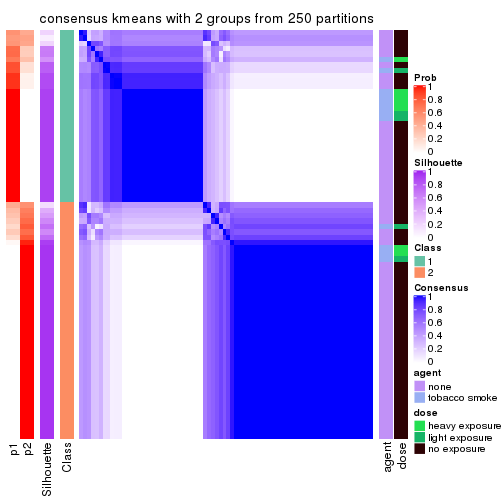</p>

</div>
<div id='tab-MAD-kmeans-consensus-heatmap-2'>
<pre><code class="r">consensus_heatmap(res, k = 3)
</code></pre>

<p>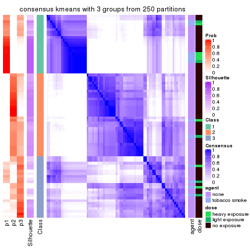</p>

</div>
<div id='tab-MAD-kmeans-consensus-heatmap-3'>
<pre><code class="r">consensus_heatmap(res, k = 4)
</code></pre>

<p>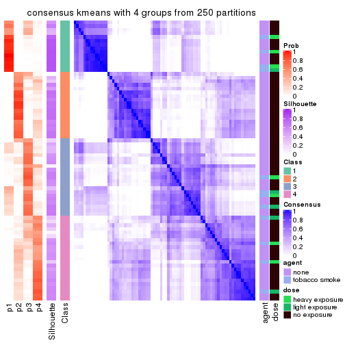</p>

</div>
<div id='tab-MAD-kmeans-consensus-heatmap-4'>
<pre><code class="r">consensus_heatmap(res, k = 5)
</code></pre>

<p></p>

</div>
<div id='tab-MAD-kmeans-consensus-heatmap-5'>
<pre><code class="r">consensus_heatmap(res, k = 6)
</code></pre>

<p>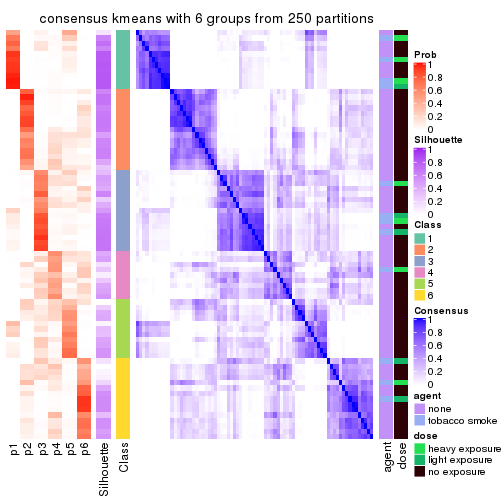</p>

</div>
</div>

Heatmaps for the membership of samples in all partitions to see how consistent they are:


<script>
$( function() {
	$( '#tabs-MAD-kmeans-membership-heatmap' ).tabs();
} );
</script>
<div id='tabs-MAD-kmeans-membership-heatmap'>
<ul>
<li><a href='#tab-MAD-kmeans-membership-heatmap-1'>k = 2</a></li>
<li><a href='#tab-MAD-kmeans-membership-heatmap-2'>k = 3</a></li>
<li><a href='#tab-MAD-kmeans-membership-heatmap-3'>k = 4</a></li>
<li><a href='#tab-MAD-kmeans-membership-heatmap-4'>k = 5</a></li>
<li><a href='#tab-MAD-kmeans-membership-heatmap-5'>k = 6</a></li>
</ul>
<div id='tab-MAD-kmeans-membership-heatmap-1'>
<pre><code class="r">membership_heatmap(res, k = 2)
</code></pre>

<p>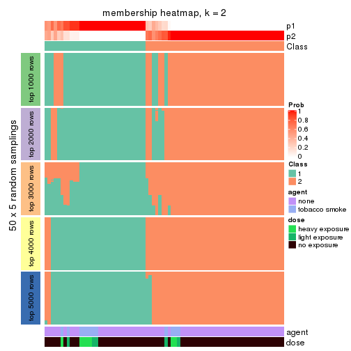</p>

</div>
<div id='tab-MAD-kmeans-membership-heatmap-2'>
<pre><code class="r">membership_heatmap(res, k = 3)
</code></pre>

<p>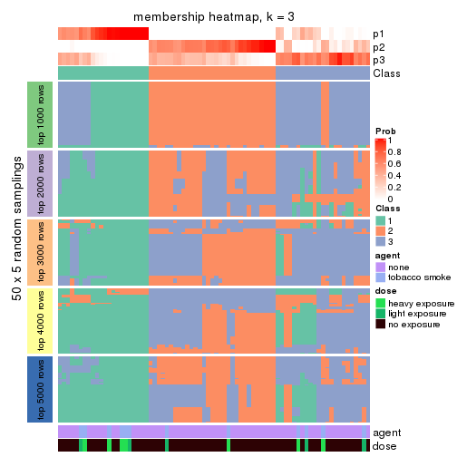</p>

</div>
<div id='tab-MAD-kmeans-membership-heatmap-3'>
<pre><code class="r">membership_heatmap(res, k = 4)
</code></pre>

<p>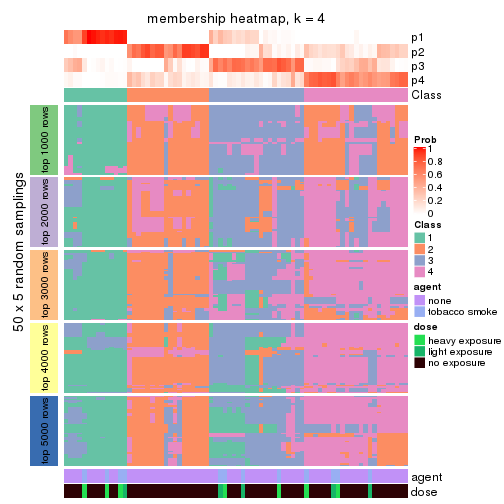</p>

</div>
<div id='tab-MAD-kmeans-membership-heatmap-4'>
<pre><code class="r">membership_heatmap(res, k = 5)
</code></pre>

<p>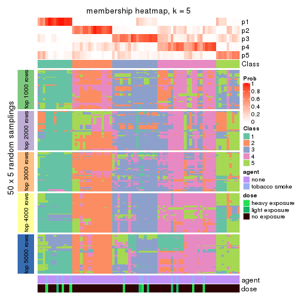</p>

</div>
<div id='tab-MAD-kmeans-membership-heatmap-5'>
<pre><code class="r">membership_heatmap(res, k = 6)
</code></pre>

<p>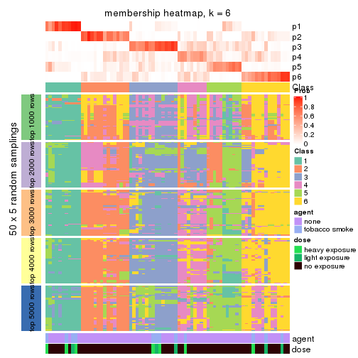</p>

</div>
</div>

As soon as we have had the classes for columns, we can look for signatures
which are significantly different between classes which can be candidate marks
for certain classes. Following are the heatmaps for signatures.


Signature heatmaps where rows are scaled:


<script>
$( function() {
	$( '#tabs-MAD-kmeans-get-signatures' ).tabs();
} );
</script>
<div id='tabs-MAD-kmeans-get-signatures'>
<ul>
<li><a href='#tab-MAD-kmeans-get-signatures-1'>k = 2</a></li>
<li><a href='#tab-MAD-kmeans-get-signatures-2'>k = 3</a></li>
<li><a href='#tab-MAD-kmeans-get-signatures-3'>k = 4</a></li>
<li><a href='#tab-MAD-kmeans-get-signatures-4'>k = 5</a></li>
<li><a href='#tab-MAD-kmeans-get-signatures-5'>k = 6</a></li>
</ul>
<div id='tab-MAD-kmeans-get-signatures-1'>
<pre><code class="r">get_signatures(res, k = 2)
</code></pre>

<p>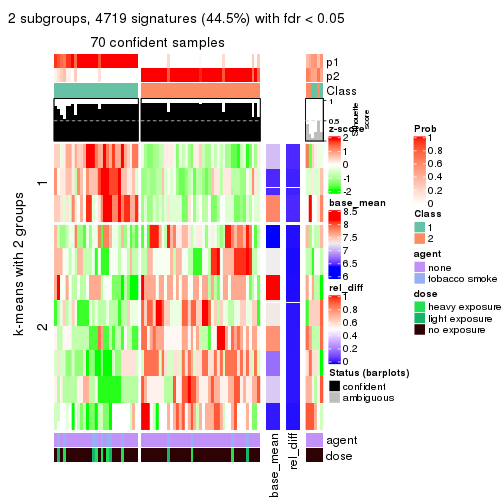</p>

</div>
<div id='tab-MAD-kmeans-get-signatures-2'>
<pre><code class="r">get_signatures(res, k = 3)
</code></pre>

<p>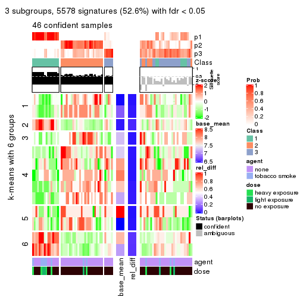</p>

</div>
<div id='tab-MAD-kmeans-get-signatures-3'>
<pre><code class="r">get_signatures(res, k = 4)
</code></pre>

<p>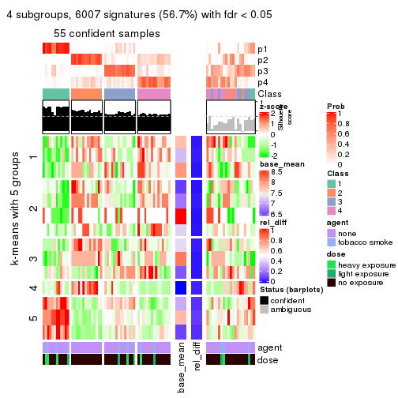</p>

</div>
<div id='tab-MAD-kmeans-get-signatures-4'>
<pre><code class="r">get_signatures(res, k = 5)
</code></pre>

<p>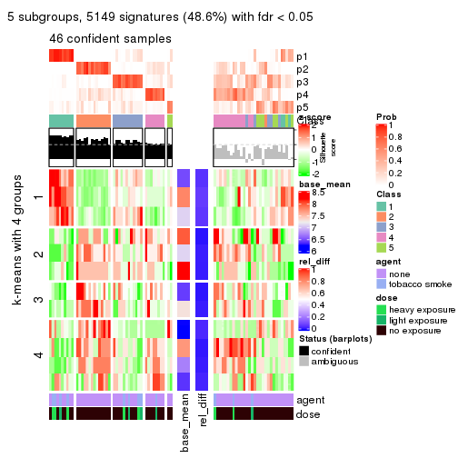</p>

</div>
<div id='tab-MAD-kmeans-get-signatures-5'>
<pre><code class="r">get_signatures(res, k = 6)
</code></pre>

<p>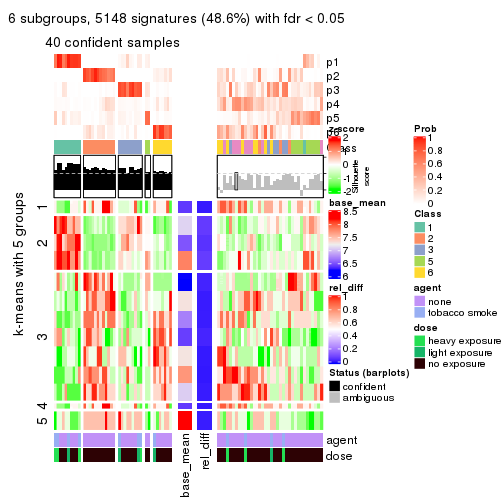</p>

</div>
</div>


Signature heatmaps where rows are not scaled:


<script>
$( function() {
	$( '#tabs-MAD-kmeans-get-signatures-no-scale' ).tabs();
} );
</script>
<div id='tabs-MAD-kmeans-get-signatures-no-scale'>
<ul>
<li><a href='#tab-MAD-kmeans-get-signatures-no-scale-1'>k = 2</a></li>
<li><a href='#tab-MAD-kmeans-get-signatures-no-scale-2'>k = 3</a></li>
<li><a href='#tab-MAD-kmeans-get-signatures-no-scale-3'>k = 4</a></li>
<li><a href='#tab-MAD-kmeans-get-signatures-no-scale-4'>k = 5</a></li>
<li><a href='#tab-MAD-kmeans-get-signatures-no-scale-5'>k = 6</a></li>
</ul>
<div id='tab-MAD-kmeans-get-signatures-no-scale-1'>
<pre><code class="r">get_signatures(res, k = 2, scale_rows = FALSE)
</code></pre>

<p>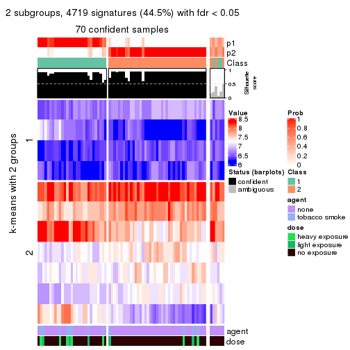</p>

</div>
<div id='tab-MAD-kmeans-get-signatures-no-scale-2'>
<pre><code class="r">get_signatures(res, k = 3, scale_rows = FALSE)
</code></pre>

<p>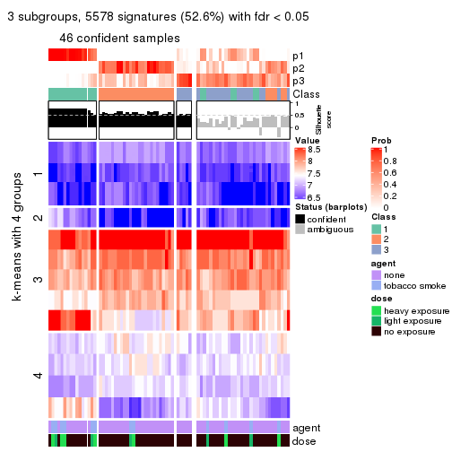</p>

</div>
<div id='tab-MAD-kmeans-get-signatures-no-scale-3'>
<pre><code class="r">get_signatures(res, k = 4, scale_rows = FALSE)
</code></pre>

<p>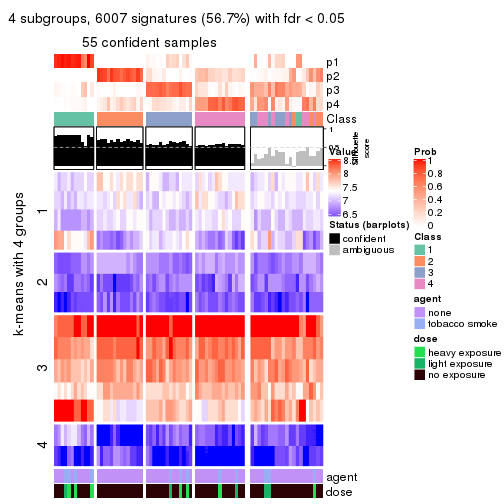</p>

</div>
<div id='tab-MAD-kmeans-get-signatures-no-scale-4'>
<pre><code class="r">get_signatures(res, k = 5, scale_rows = FALSE)
</code></pre>

<p>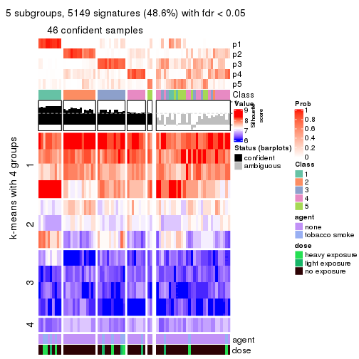</p>

</div>
<div id='tab-MAD-kmeans-get-signatures-no-scale-5'>
<pre><code class="r">get_signatures(res, k = 6, scale_rows = FALSE)
</code></pre>

<p>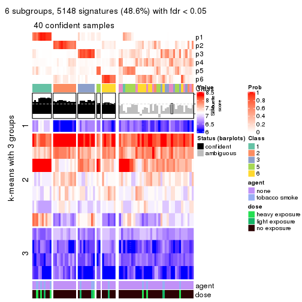</p>

</div>
</div>


Compare the overlap of signatures from different k:

```r
compare_signatures(res)
```

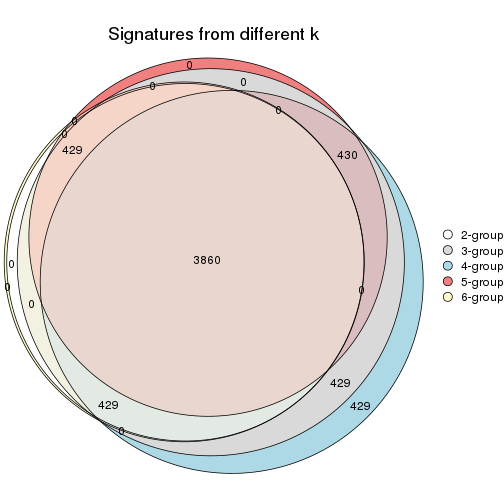

`get_signature()` returns a data frame invisibly. TO get the list of signatures, the function
call should be assigned to a variable explicitly. In following code, if `plot` argument is set
to `FALSE`, no heatmap is plotted while only the differential analysis is performed.

```r
# code only for demonstration
tb = get_signature(res, k = ..., plot = FALSE)
```

An example of the output of `tb` is:

```
#>   which_row         fdr    mean_1    mean_2 scaled_mean_1 scaled_mean_2 km
#> 1        38 0.042760348  8.373488  9.131774    -0.5533452     0.5164555  1
#> 2        40 0.018707592  7.106213  8.469186    -0.6173731     0.5762149  1
#> 3        55 0.019134737 10.221463 11.207825    -0.6159697     0.5749050  1
#> 4        59 0.006059896  5.921854  7.869574    -0.6899429     0.6439467  1
#> 5        60 0.018055526  8.928898 10.211722    -0.6204761     0.5791110  1
#> 6        98 0.009384629 15.714769 14.887706     0.6635654    -0.6193277  2
...
```

The columns in `tb` are:

1. `which_row`: row indices corresponding to the input matrix.
2. `fdr`: FDR for the differential test. 
3. `mean_x`: The mean value in group x.
4. `scaled_mean_x`: The mean value in group x after rows are scaled.
5. `km`: Row groups if k-means clustering is applied to rows.


UMAP plot which shows how samples are separated.


<script>
$( function() {
	$( '#tabs-MAD-kmeans-dimension-reduction' ).tabs();
} );
</script>
<div id='tabs-MAD-kmeans-dimension-reduction'>
<ul>
<li><a href='#tab-MAD-kmeans-dimension-reduction-1'>k = 2</a></li>
<li><a href='#tab-MAD-kmeans-dimension-reduction-2'>k = 3</a></li>
<li><a href='#tab-MAD-kmeans-dimension-reduction-3'>k = 4</a></li>
<li><a href='#tab-MAD-kmeans-dimension-reduction-4'>k = 5</a></li>
<li><a href='#tab-MAD-kmeans-dimension-reduction-5'>k = 6</a></li>
</ul>
<div id='tab-MAD-kmeans-dimension-reduction-1'>
<pre><code class="r">dimension_reduction(res, k = 2, method = &quot;UMAP&quot;)
</code></pre>

<p>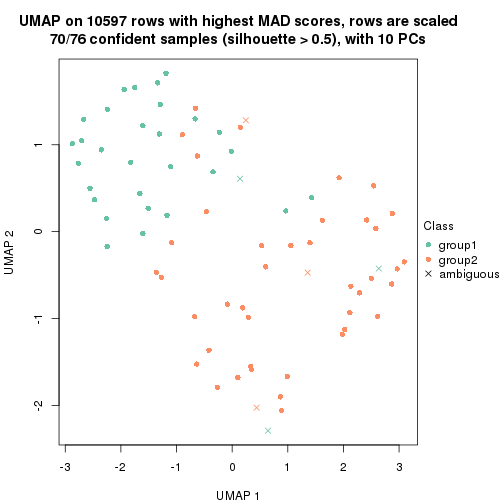</p>

</div>
<div id='tab-MAD-kmeans-dimension-reduction-2'>
<pre><code class="r">dimension_reduction(res, k = 3, method = &quot;UMAP&quot;)
</code></pre>

<p>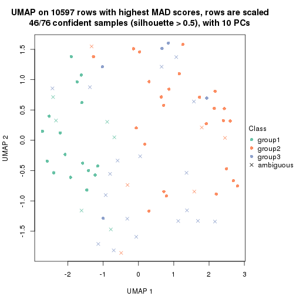</p>

</div>
<div id='tab-MAD-kmeans-dimension-reduction-3'>
<pre><code class="r">dimension_reduction(res, k = 4, method = &quot;UMAP&quot;)
</code></pre>

<p>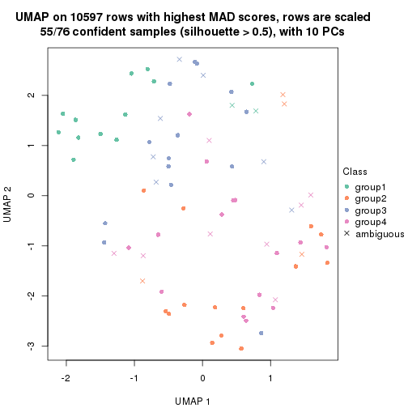</p>

</div>
<div id='tab-MAD-kmeans-dimension-reduction-4'>
<pre><code class="r">dimension_reduction(res, k = 5, method = &quot;UMAP&quot;)
</code></pre>

<p>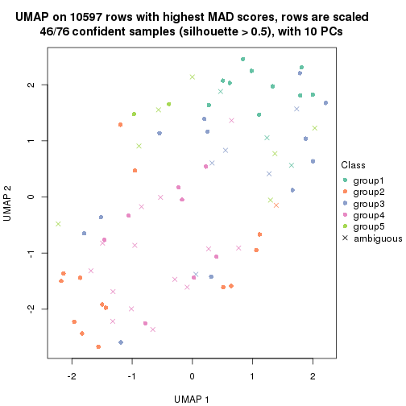</p>

</div>
<div id='tab-MAD-kmeans-dimension-reduction-5'>
<pre><code class="r">dimension_reduction(res, k = 6, method = &quot;UMAP&quot;)
</code></pre>

<p>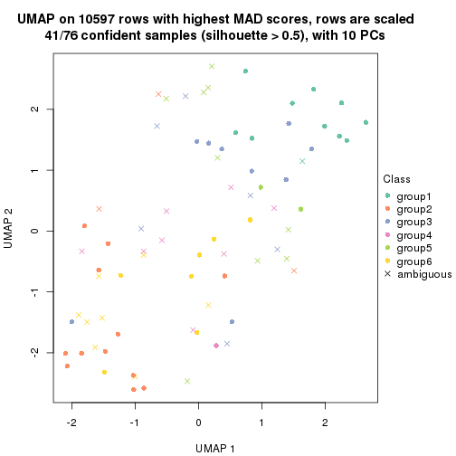</p>

</div>
</div>


Following heatmap shows how subgroups are split when increasing `k`:

```r
collect_classes(res)
```

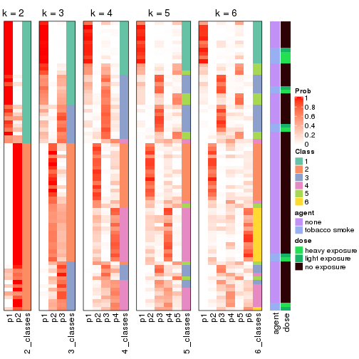


Test correlation between subgroups and known annotations. If the known
annotation is numeric, one-way ANOVA test is applied, and if the known
annotation is discrete, chi-squared contingency table test is applied.

```r
test_to_known_factors(res)
```

```
#>             n agent(p) dose(p) k
#> MAD:kmeans 70   0.1035   0.138 2
#> MAD:kmeans 46   0.0289   0.123 3
#> MAD:kmeans 55   0.1312   0.414 4
#> MAD:kmeans 46   0.0830   0.239 5
#> MAD:kmeans 41   0.1844   0.367 6
```


If matrix rows can be associated to genes, consider to use `GO_Enrichment(res,
...)` to perform function enrichment for the signature genes.


 

---------------------------------------------------


### MAD:skmeans


The object with results only for a single top-value method and a single partition method 
can be extracted as:

```r
res = res_list["MAD", "skmeans"]
# you can also extract it by
# res = res_list["MAD:skmeans"]
```

A summary of `res` and all the functions that can be applied to it:

```r
res
```

```
#> A 'ConsensusPartition' object with k = 2, 3, 4, 5, 6.
#>   On a matrix with 10597 rows and 76 columns.
#>   Top rows (1000, 2000, 3000, 4000, 5000) are extracted by 'MAD' method.
#>   Subgroups are detected by 'skmeans' method.
#>   Performed in total 1250 partitions by row resampling.
#>   Best k for subgroups seems to be 2.
#> 
#> Following methods can be applied to this 'ConsensusPartition' object:
#>  [1] "cola_report"             "collect_classes"         "collect_plots"          
#>  [4] "collect_stats"           "colnames"                "compare_signatures"     
#>  [7] "consensus_heatmap"       "dimension_reduction"     "functional_enrichment"  
#> [10] "get_anno_col"            "get_anno"                "get_classes"            
#> [13] "get_consensus"           "get_matrix"              "get_membership"         
#> [16] "get_param"               "get_signatures"          "get_stats"              
#> [19] "is_best_k"               "is_stable_k"             "membership_heatmap"     
#> [22] "ncol"                    "nrow"                    "plot_ecdf"              
#> [25] "rownames"                "select_partition_number" "show"                   
#> [28] "suggest_best_k"          "test_to_known_factors"
```

`collect_plots()` function collects all the plots made from `res` for all `k` (number of partitions)
into one single page to provide an easy and fast comparison between different `k`.

```r
collect_plots(res)
```

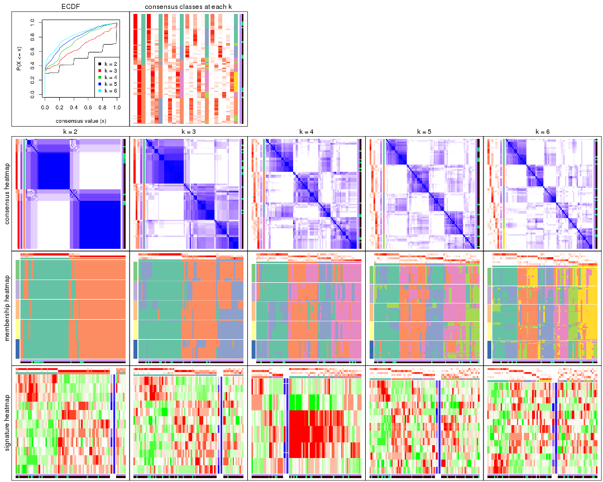

The plots are:

- The first row: a plot of the ECDF (Empirical cumulative distribution
  function) curves of the consensus matrix for each `k` and the heatmap of
  predicted classes for each `k`.
- The second row: heatmaps of the consensus matrix for each `k`.
- The third row: heatmaps of the membership matrix for each `k`.
- The fouth row: heatmaps of the signatures for each `k`.

All the plots in panels can be made by individual functions and they are
plotted later in this section.

`select_partition_number()` produces several plots showing different
statistics for choosing "optimized" `k`. There are following statistics:

- ECDF curves of the consensus matrix for each `k`;
- 1-PAC. [The PAC
  score](https://en.wikipedia.org/wiki/Consensus_clustering#Over-interpretation_potential_of_consensus_clustering)
  measures the proportion of the ambiguous subgrouping.
- Mean silhouette score.
- Concordance. The mean probability of fiting the consensus class ids in all
  partitions.
- Area increased. Denote $A_k$ as the area under the ECDF curve for current
  `k`, the area increased is defined as $A_k - A_{k-1}$.
- Rand index. The percent of pairs of samples that are both in a same cluster
  or both are not in a same cluster in the partition of k and k-1.
- Jaccard index. The ratio of pairs of samples are both in a same cluster in
  the partition of k and k-1 and the pairs of samples are both in a same
  cluster in the partition k or k-1.

The detailed explanations of these statistics can be found in [the cola
vignette](http://bioconductor.org/packages/devel/bioc/vignettes/cola/inst/doc/cola.html#toc_13).

Generally speaking, lower PAC score, higher mean silhouette score or higher
concordance corresponds to better partition. Rand index and Jaccard index
measure how similar the current partition is compared to partition with `k-1`.
If they are too similar, we won't accept `k` is better than `k-1`.

```r
select_partition_number(res)
```

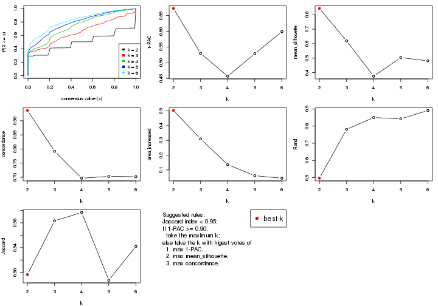

The numeric values for all these statistics can be obtained by `get_stats()`.

```r
get_stats(res)
```

```
#>   k 1-PAC mean_silhouette concordance area_increased  Rand Jaccard
#> 2 2 0.673           0.843       0.936         0.5024 0.496   0.496
#> 3 3 0.530           0.619       0.792         0.3099 0.781   0.583
#> 4 4 0.457           0.375       0.697         0.1360 0.850   0.597
#> 5 5 0.529           0.504       0.703         0.0609 0.842   0.487
#> 6 6 0.599           0.481       0.702         0.0439 0.891   0.542
```

`suggest_best_k()` suggests the best $k$ based on these statistics. The rules are as follows:

- All $k$ with Jaccard index larger than 0.95 are removed because the increase of
  the partition number does not provides enough extra information. If all $k$ are removed,
  the best $k$ is assigned by `NA`.
- For $k$ with 1-PAC larger than 0.9, the maximal $k$ is taken as the "best k". Other $k$ is called "optional k".
- If it does not fit the second rule. The $k$ with the highest vote of highest
  1-PAC, mean silhouette and concordance is taken as the "best k".

```r
suggest_best_k(res)
```

```
#> [1] 2
```


Following shows the table of the partitions (You need to click the **show/hide
code output** link to see it). The membership matrix (columns with name `p*`)
is inferred by
[`clue::cl_consensus()`](https://www.rdocumentation.org/link/cl_consensus?package=clue)
function with the `SE` method. Basically the value in the membership matrix
represents the probability to belong to a certain group. The finall class
label for an item is determined with the group with highest probability it
belongs to.

In `get_classes()` function, the entropy is calculated from the membership
matrix and the silhouette score is calculated from the consensus matrix.


<script>
$( function() {
	$( '#tabs-MAD-skmeans-get-classes' ).tabs();
} );
</script>
<div id='tabs-MAD-skmeans-get-classes'>
<ul>
<li><a href='#tab-MAD-skmeans-get-classes-1'>k = 2</a></li>
<li><a href='#tab-MAD-skmeans-get-classes-2'>k = 3</a></li>
<li><a href='#tab-MAD-skmeans-get-classes-3'>k = 4</a></li>
<li><a href='#tab-MAD-skmeans-get-classes-4'>k = 5</a></li>
<li><a href='#tab-MAD-skmeans-get-classes-5'>k = 6</a></li>
</ul>

<div id='tab-MAD-skmeans-get-classes-1'>
<p><a id='tab-MAD-skmeans-get-classes-1-a' style='color:#0366d6' href='#'>show/hide code output</a></p>
<pre><code class="r">cbind(get_classes(res, k = 2), get_membership(res, k = 2))
</code></pre>

<pre><code>#&gt;           class entropy silhouette    p1    p2
#&gt; GSM451162     1   0.722      0.720 0.800 0.200
#&gt; GSM451163     2   0.000      0.937 0.000 1.000
#&gt; GSM451164     2   0.000      0.937 0.000 1.000
#&gt; GSM451165     2   0.697      0.727 0.188 0.812
#&gt; GSM451167     2   0.000      0.937 0.000 1.000
#&gt; GSM451168     2   0.000      0.937 0.000 1.000
#&gt; GSM451169     2   0.971      0.310 0.400 0.600
#&gt; GSM451170     1   0.000      0.912 1.000 0.000
#&gt; GSM451171     2   0.000      0.937 0.000 1.000
#&gt; GSM451172     2   0.000      0.937 0.000 1.000
#&gt; GSM451173     1   0.000      0.912 1.000 0.000
#&gt; GSM451174     2   0.000      0.937 0.000 1.000
#&gt; GSM451175     1   0.000      0.912 1.000 0.000
#&gt; GSM451177     2   0.000      0.937 0.000 1.000
#&gt; GSM451178     2   0.000      0.937 0.000 1.000
#&gt; GSM451179     1   0.327      0.869 0.940 0.060
#&gt; GSM451180     2   0.000      0.937 0.000 1.000
#&gt; GSM451181     2   0.000      0.937 0.000 1.000
#&gt; GSM451182     1   0.000      0.912 1.000 0.000
#&gt; GSM451183     1   0.000      0.912 1.000 0.000
#&gt; GSM451184     1   0.000      0.912 1.000 0.000
#&gt; GSM451185     1   0.000      0.912 1.000 0.000
#&gt; GSM451186     1   0.971      0.305 0.600 0.400
#&gt; GSM451187     2   0.000      0.937 0.000 1.000
#&gt; GSM451188     2   0.000      0.937 0.000 1.000
#&gt; GSM451189     1   0.000      0.912 1.000 0.000
#&gt; GSM451190     1   0.000      0.912 1.000 0.000
#&gt; GSM451191     1   0.000      0.912 1.000 0.000
#&gt; GSM451193     1   0.971      0.369 0.600 0.400
#&gt; GSM451195     1   0.000      0.912 1.000 0.000
#&gt; GSM451196     1   0.000      0.912 1.000 0.000
#&gt; GSM451197     1   0.000      0.912 1.000 0.000
#&gt; GSM451199     1   0.000      0.912 1.000 0.000
#&gt; GSM451201     1   0.000      0.912 1.000 0.000
#&gt; GSM451202     2   0.000      0.937 0.000 1.000
#&gt; GSM451203     1   0.722      0.713 0.800 0.200
#&gt; GSM451204     2   0.000      0.937 0.000 1.000
#&gt; GSM451205     2   0.000      0.937 0.000 1.000
#&gt; GSM451206     2   0.000      0.937 0.000 1.000
#&gt; GSM451207     2   0.000      0.937 0.000 1.000
#&gt; GSM451208     2   0.000      0.937 0.000 1.000
#&gt; GSM451209     2   0.722      0.711 0.200 0.800
#&gt; GSM451210     2   0.000      0.937 0.000 1.000
#&gt; GSM451212     2   0.000      0.937 0.000 1.000
#&gt; GSM451213     2   0.000      0.937 0.000 1.000
#&gt; GSM451214     2   0.730      0.699 0.204 0.796
#&gt; GSM451215     2   0.000      0.937 0.000 1.000
#&gt; GSM451216     2   0.000      0.937 0.000 1.000
#&gt; GSM451217     2   0.000      0.937 0.000 1.000
#&gt; GSM451219     1   0.000      0.912 1.000 0.000
#&gt; GSM451220     1   0.000      0.912 1.000 0.000
#&gt; GSM451221     1   0.000      0.912 1.000 0.000
#&gt; GSM451222     1   0.697      0.730 0.812 0.188
#&gt; GSM451224     2   0.000      0.937 0.000 1.000
#&gt; GSM451225     1   0.722      0.713 0.800 0.200
#&gt; GSM451226     1   0.971      0.369 0.600 0.400
#&gt; GSM451227     1   0.971      0.369 0.600 0.400
#&gt; GSM451228     2   0.722      0.705 0.200 0.800
#&gt; GSM451230     2   0.971      0.313 0.400 0.600
#&gt; GSM451231     2   0.971      0.305 0.400 0.600
#&gt; GSM451233     2   0.000      0.937 0.000 1.000
#&gt; GSM451234     2   0.000      0.937 0.000 1.000
#&gt; GSM451235     2   0.000      0.937 0.000 1.000
#&gt; GSM451236     2   0.000      0.937 0.000 1.000
#&gt; GSM451166     2   0.722      0.713 0.200 0.800
#&gt; GSM451194     1   0.000      0.912 1.000 0.000
#&gt; GSM451198     1   0.000      0.912 1.000 0.000
#&gt; GSM451218     2   0.000      0.937 0.000 1.000
#&gt; GSM451232     1   0.000      0.912 1.000 0.000
#&gt; GSM451176     1   0.000      0.912 1.000 0.000
#&gt; GSM451192     1   0.000      0.912 1.000 0.000
#&gt; GSM451200     1   0.000      0.912 1.000 0.000
#&gt; GSM451211     2   0.000      0.937 0.000 1.000
#&gt; GSM451223     1   0.722      0.722 0.800 0.200
#&gt; GSM451229     1   0.000      0.912 1.000 0.000
#&gt; GSM451237     2   0.000      0.937 0.000 1.000
</code></pre>

<script>
$('#tab-MAD-skmeans-get-classes-1-a').parent().next().next().hide();
$('#tab-MAD-skmeans-get-classes-1-a').click(function(){
  $('#tab-MAD-skmeans-get-classes-1-a').parent().next().next().toggle();
  return(false);
});
</script>
</div>

<div id='tab-MAD-skmeans-get-classes-2'>
<p><a id='tab-MAD-skmeans-get-classes-2-a' style='color:#0366d6' href='#'>show/hide code output</a></p>
<pre><code class="r">cbind(get_classes(res, k = 3), get_membership(res, k = 3))
</code></pre>

<pre><code>#&gt;           class entropy silhouette    p1    p2    p3
#&gt; GSM451162     1  0.9198     0.4819 0.532 0.200 0.268
#&gt; GSM451163     3  0.6008     0.4051 0.000 0.372 0.628
#&gt; GSM451164     3  0.5291     0.6124 0.000 0.268 0.732
#&gt; GSM451165     3  0.5431     0.5426 0.000 0.284 0.716
#&gt; GSM451167     2  0.5760     0.3739 0.000 0.672 0.328
#&gt; GSM451168     3  0.5621     0.6045 0.000 0.308 0.692
#&gt; GSM451169     3  0.9233     0.2439 0.204 0.268 0.528
#&gt; GSM451170     1  0.0424     0.8758 0.992 0.000 0.008
#&gt; GSM451171     3  0.6291     0.5609 0.000 0.468 0.532
#&gt; GSM451172     2  0.6274    -0.5180 0.000 0.544 0.456
#&gt; GSM451173     1  0.0000     0.8758 1.000 0.000 0.000
#&gt; GSM451174     2  0.0000     0.6702 0.000 1.000 0.000
#&gt; GSM451175     1  0.0000     0.8758 1.000 0.000 0.000
#&gt; GSM451177     3  0.6309     0.5487 0.000 0.496 0.504
#&gt; GSM451178     2  0.0237     0.6690 0.000 0.996 0.004
#&gt; GSM451179     1  0.5660     0.7102 0.772 0.028 0.200
#&gt; GSM451180     3  0.6291     0.5609 0.000 0.468 0.532
#&gt; GSM451181     2  0.4842     0.4177 0.000 0.776 0.224
#&gt; GSM451182     1  0.0424     0.8758 0.992 0.000 0.008
#&gt; GSM451183     1  0.0237     0.8760 0.996 0.000 0.004
#&gt; GSM451184     1  0.6291     0.5508 0.532 0.000 0.468
#&gt; GSM451185     1  0.0424     0.8758 0.992 0.000 0.008
#&gt; GSM451186     2  0.9120     0.3048 0.256 0.544 0.200
#&gt; GSM451187     3  0.6291     0.5609 0.000 0.468 0.532
#&gt; GSM451188     3  0.4702     0.5905 0.000 0.212 0.788
#&gt; GSM451189     1  0.0237     0.8760 0.996 0.000 0.004
#&gt; GSM451190     1  0.2878     0.8456 0.904 0.000 0.096
#&gt; GSM451191     1  0.2878     0.8456 0.904 0.000 0.096
#&gt; GSM451193     3  0.9474    -0.0547 0.232 0.272 0.496
#&gt; GSM451195     1  0.0000     0.8758 1.000 0.000 0.000
#&gt; GSM451196     1  0.0000     0.8758 1.000 0.000 0.000
#&gt; GSM451197     1  0.0000     0.8758 1.000 0.000 0.000
#&gt; GSM451199     1  0.2796     0.8470 0.908 0.000 0.092
#&gt; GSM451201     1  0.0000     0.8758 1.000 0.000 0.000
#&gt; GSM451202     3  0.5529     0.6095 0.000 0.296 0.704
#&gt; GSM451203     1  0.5988     0.5573 0.632 0.000 0.368
#&gt; GSM451204     2  0.2537     0.6410 0.000 0.920 0.080
#&gt; GSM451205     3  0.6291     0.5609 0.000 0.468 0.532
#&gt; GSM451206     2  0.0000     0.6702 0.000 1.000 0.000
#&gt; GSM451207     2  0.3116     0.6317 0.000 0.892 0.108
#&gt; GSM451208     3  0.6309     0.5487 0.000 0.496 0.504
#&gt; GSM451209     2  0.4555     0.4820 0.000 0.800 0.200
#&gt; GSM451210     3  0.5529     0.6095 0.000 0.296 0.704
#&gt; GSM451212     2  0.3116     0.6317 0.000 0.892 0.108
#&gt; GSM451213     2  0.2537     0.6410 0.000 0.920 0.080
#&gt; GSM451214     3  0.0000     0.4600 0.000 0.000 1.000
#&gt; GSM451215     3  0.6309     0.5487 0.000 0.496 0.504
#&gt; GSM451216     2  0.2537     0.6410 0.000 0.920 0.080
#&gt; GSM451217     3  0.6291     0.5609 0.000 0.468 0.532
#&gt; GSM451219     1  0.2878     0.8456 0.904 0.000 0.096
#&gt; GSM451220     1  0.4178     0.7905 0.828 0.000 0.172
#&gt; GSM451221     1  0.5529     0.6781 0.704 0.000 0.296
#&gt; GSM451222     1  0.3267     0.7748 0.884 0.116 0.000
#&gt; GSM451224     3  0.4702     0.5905 0.000 0.212 0.788
#&gt; GSM451225     2  0.6307     0.0818 0.488 0.512 0.000
#&gt; GSM451226     1  0.6309     0.5128 0.504 0.000 0.496
#&gt; GSM451227     3  0.6922     0.5268 0.080 0.200 0.720
#&gt; GSM451228     2  0.5122     0.5130 0.012 0.788 0.200
#&gt; GSM451230     2  0.9383     0.3546 0.236 0.512 0.252
#&gt; GSM451231     2  0.8576     0.3471 0.252 0.596 0.152
#&gt; GSM451233     2  0.5529     0.4476 0.000 0.704 0.296
#&gt; GSM451234     2  0.0000     0.6702 0.000 1.000 0.000
#&gt; GSM451235     2  0.0000     0.6702 0.000 1.000 0.000
#&gt; GSM451236     2  0.2537     0.6410 0.000 0.920 0.080
#&gt; GSM451166     2  0.7058     0.5038 0.212 0.708 0.080
#&gt; GSM451194     1  0.0000     0.8758 1.000 0.000 0.000
#&gt; GSM451198     1  0.4178     0.7905 0.828 0.000 0.172
#&gt; GSM451218     2  0.0000     0.6702 0.000 1.000 0.000
#&gt; GSM451232     1  0.0000     0.8758 1.000 0.000 0.000
#&gt; GSM451176     1  0.0237     0.8760 0.996 0.000 0.004
#&gt; GSM451192     1  0.0424     0.8758 0.992 0.000 0.008
#&gt; GSM451200     1  0.4178     0.7905 0.828 0.000 0.172
#&gt; GSM451211     2  0.0424     0.6659 0.000 0.992 0.008
#&gt; GSM451223     1  0.6309     0.5128 0.504 0.000 0.496
#&gt; GSM451229     1  0.0237     0.8760 0.996 0.000 0.004
#&gt; GSM451237     2  0.4555     0.4820 0.000 0.800 0.200
</code></pre>

<script>
$('#tab-MAD-skmeans-get-classes-2-a').parent().next().next().hide();
$('#tab-MAD-skmeans-get-classes-2-a').click(function(){
  $('#tab-MAD-skmeans-get-classes-2-a').parent().next().next().toggle();
  return(false);
});
</script>
</div>

<div id='tab-MAD-skmeans-get-classes-3'>
<p><a id='tab-MAD-skmeans-get-classes-3-a' style='color:#0366d6' href='#'>show/hide code output</a></p>
<pre><code class="r">cbind(get_classes(res, k = 4), get_membership(res, k = 4))
</code></pre>

<pre><code>#&gt;           class entropy silhouette    p1    p2    p3    p4
#&gt; GSM451162     1  0.8125     0.0110 0.428 0.024 0.372 0.176
#&gt; GSM451163     2  0.2760     0.5858 0.000 0.872 0.000 0.128
#&gt; GSM451164     2  0.1109     0.5892 0.000 0.968 0.028 0.004
#&gt; GSM451165     2  0.9452     0.3133 0.180 0.420 0.164 0.236
#&gt; GSM451167     2  0.4961     0.0561 0.000 0.552 0.000 0.448
#&gt; GSM451168     2  0.5827     0.3506 0.000 0.568 0.036 0.396
#&gt; GSM451169     3  0.6814     0.1968 0.008 0.148 0.628 0.216
#&gt; GSM451170     1  0.2408     0.4879 0.896 0.000 0.104 0.000
#&gt; GSM451171     2  0.3444     0.5394 0.000 0.816 0.000 0.184
#&gt; GSM451172     2  0.5326     0.5236 0.000 0.748 0.136 0.116
#&gt; GSM451173     3  0.4855     0.3827 0.400 0.000 0.600 0.000
#&gt; GSM451174     4  0.0469     0.5863 0.000 0.012 0.000 0.988
#&gt; GSM451175     1  0.4888     0.0573 0.588 0.000 0.412 0.000
#&gt; GSM451177     2  0.3975     0.5733 0.000 0.760 0.000 0.240
#&gt; GSM451178     4  0.0524     0.5865 0.000 0.008 0.004 0.988
#&gt; GSM451179     3  0.7248     0.3154 0.284 0.000 0.532 0.184
#&gt; GSM451180     2  0.3444     0.5394 0.000 0.816 0.000 0.184
#&gt; GSM451181     2  0.7568    -0.3391 0.000 0.404 0.192 0.404
#&gt; GSM451182     1  0.1867     0.4857 0.928 0.000 0.072 0.000
#&gt; GSM451183     1  0.3975     0.3955 0.760 0.000 0.240 0.000
#&gt; GSM451184     1  0.7446     0.0674 0.432 0.172 0.396 0.000
#&gt; GSM451185     1  0.0000     0.4877 1.000 0.000 0.000 0.000
#&gt; GSM451186     4  0.6972     0.1385 0.412 0.044 0.036 0.508
#&gt; GSM451187     2  0.3444     0.5394 0.000 0.816 0.000 0.184
#&gt; GSM451188     2  0.4529     0.5753 0.004 0.776 0.024 0.196
#&gt; GSM451189     1  0.3219     0.4469 0.836 0.000 0.164 0.000
#&gt; GSM451190     1  0.4103     0.3753 0.744 0.000 0.256 0.000
#&gt; GSM451191     1  0.3494     0.4313 0.824 0.004 0.172 0.000
#&gt; GSM451193     4  0.9698     0.2520 0.196 0.204 0.220 0.380
#&gt; GSM451195     3  0.3942     0.5056 0.236 0.000 0.764 0.000
#&gt; GSM451196     1  0.4477     0.2952 0.688 0.000 0.312 0.000
#&gt; GSM451197     1  0.4040     0.3837 0.752 0.000 0.248 0.000
#&gt; GSM451199     1  0.0469     0.4877 0.988 0.000 0.012 0.000
#&gt; GSM451201     1  0.4477     0.2952 0.688 0.000 0.312 0.000
#&gt; GSM451202     2  0.3649     0.5774 0.000 0.796 0.000 0.204
#&gt; GSM451203     3  0.4719     0.4347 0.048 0.180 0.772 0.000
#&gt; GSM451204     4  0.6750     0.4421 0.000 0.208 0.180 0.612
#&gt; GSM451205     2  0.1302     0.6006 0.000 0.956 0.000 0.044
#&gt; GSM451206     4  0.0592     0.5863 0.000 0.016 0.000 0.984
#&gt; GSM451207     4  0.7514     0.3031 0.000 0.384 0.184 0.432
#&gt; GSM451208     2  0.4804     0.4577 0.000 0.616 0.000 0.384
#&gt; GSM451209     4  0.4192     0.5232 0.004 0.008 0.208 0.780
#&gt; GSM451210     2  0.4387     0.5722 0.000 0.776 0.024 0.200
#&gt; GSM451212     4  0.5204     0.3308 0.000 0.376 0.012 0.612
#&gt; GSM451213     4  0.3808     0.4884 0.000 0.176 0.012 0.812
#&gt; GSM451214     2  0.5874     0.4343 0.112 0.696 0.192 0.000
#&gt; GSM451215     2  0.4790     0.4602 0.000 0.620 0.000 0.380
#&gt; GSM451216     4  0.3852     0.4842 0.000 0.180 0.012 0.808
#&gt; GSM451217     2  0.1867     0.6044 0.000 0.928 0.000 0.072
#&gt; GSM451219     1  0.3311     0.4330 0.828 0.000 0.172 0.000
#&gt; GSM451220     3  0.3837     0.5101 0.224 0.000 0.776 0.000
#&gt; GSM451221     1  0.4630     0.3934 0.768 0.036 0.196 0.000
#&gt; GSM451222     3  0.7226     0.3635 0.388 0.000 0.468 0.144
#&gt; GSM451224     2  0.6018     0.5434 0.064 0.708 0.024 0.204
#&gt; GSM451225     1  0.5679    -0.0546 0.496 0.004 0.016 0.484
#&gt; GSM451226     1  0.7595     0.0565 0.428 0.372 0.200 0.000
#&gt; GSM451227     2  0.9829     0.2026 0.300 0.308 0.192 0.200
#&gt; GSM451228     4  0.9330     0.1118 0.144 0.204 0.212 0.440
#&gt; GSM451230     4  0.8395     0.1246 0.052 0.144 0.376 0.428
#&gt; GSM451231     4  0.6743     0.3038 0.380 0.044 0.028 0.548
#&gt; GSM451233     4  0.7297     0.4105 0.000 0.244 0.220 0.536
#&gt; GSM451234     4  0.0672     0.5866 0.000 0.008 0.008 0.984
#&gt; GSM451235     4  0.2345     0.5208 0.000 0.100 0.000 0.900
#&gt; GSM451236     4  0.4194     0.4258 0.000 0.228 0.008 0.764
#&gt; GSM451166     4  0.9529     0.1649 0.216 0.160 0.216 0.408
#&gt; GSM451194     1  0.4866     0.0681 0.596 0.000 0.404 0.000
#&gt; GSM451198     3  0.4830     0.3913 0.392 0.000 0.608 0.000
#&gt; GSM451218     4  0.1059     0.5864 0.000 0.016 0.012 0.972
#&gt; GSM451232     1  0.4477     0.2952 0.688 0.000 0.312 0.000
#&gt; GSM451176     1  0.3801     0.4123 0.780 0.000 0.220 0.000
#&gt; GSM451192     1  0.4103     0.2638 0.744 0.000 0.256 0.000
#&gt; GSM451200     3  0.4830     0.3913 0.392 0.000 0.608 0.000
#&gt; GSM451211     4  0.3837     0.3257 0.000 0.224 0.000 0.776
#&gt; GSM451223     3  0.7725    -0.0422 0.336 0.204 0.456 0.004
#&gt; GSM451229     1  0.3907     0.4042 0.768 0.000 0.232 0.000
#&gt; GSM451237     4  0.4137     0.5223 0.000 0.012 0.208 0.780
</code></pre>

<script>
$('#tab-MAD-skmeans-get-classes-3-a').parent().next().next().hide();
$('#tab-MAD-skmeans-get-classes-3-a').click(function(){
  $('#tab-MAD-skmeans-get-classes-3-a').parent().next().next().toggle();
  return(false);
});
</script>
</div>

<div id='tab-MAD-skmeans-get-classes-4'>
<p><a id='tab-MAD-skmeans-get-classes-4-a' style='color:#0366d6' href='#'>show/hide code output</a></p>
<pre><code class="r">cbind(get_classes(res, k = 5), get_membership(res, k = 5))
</code></pre>

<pre><code>#&gt;           class entropy silhouette    p1    p2    p3    p4    p5
#&gt; GSM451162     3  0.7570     0.3856 0.204 0.088 0.544 0.148 0.016
#&gt; GSM451163     2  0.2157     0.5652 0.000 0.920 0.004 0.040 0.036
#&gt; GSM451164     2  0.3980     0.5928 0.000 0.824 0.024 0.072 0.080
#&gt; GSM451165     2  0.8025     0.2698 0.000 0.440 0.232 0.148 0.180
#&gt; GSM451167     2  0.5083    -0.1199 0.000 0.540 0.004 0.428 0.028
#&gt; GSM451168     5  0.7173     0.1928 0.000 0.304 0.068 0.128 0.500
#&gt; GSM451169     2  0.8842     0.0361 0.200 0.384 0.148 0.236 0.032
#&gt; GSM451170     3  0.3904     0.5243 0.156 0.000 0.792 0.000 0.052
#&gt; GSM451171     2  0.3684     0.5904 0.000 0.720 0.000 0.280 0.000
#&gt; GSM451172     2  0.2535     0.5538 0.000 0.908 0.032 0.028 0.032
#&gt; GSM451173     1  0.2179     0.6649 0.888 0.000 0.112 0.000 0.000
#&gt; GSM451174     4  0.4158     0.6150 0.000 0.120 0.004 0.792 0.084
#&gt; GSM451175     1  0.5115     0.6821 0.696 0.000 0.232 0.020 0.052
#&gt; GSM451177     2  0.3707     0.6281 0.000 0.716 0.000 0.284 0.000
#&gt; GSM451178     4  0.3911     0.6253 0.000 0.100 0.004 0.812 0.084
#&gt; GSM451179     1  0.5885     0.3129 0.560 0.016 0.032 0.020 0.372
#&gt; GSM451180     2  0.3636     0.5934 0.000 0.728 0.000 0.272 0.000
#&gt; GSM451181     5  0.6492     0.2365 0.000 0.196 0.000 0.348 0.456
#&gt; GSM451182     3  0.4272     0.4519 0.196 0.000 0.752 0.000 0.052
#&gt; GSM451183     1  0.5193     0.6349 0.584 0.000 0.364 0.000 0.052
#&gt; GSM451184     3  0.4757     0.5249 0.204 0.000 0.716 0.000 0.080
#&gt; GSM451185     3  0.3863     0.5329 0.152 0.000 0.796 0.000 0.052
#&gt; GSM451186     5  0.4923     0.4814 0.020 0.000 0.176 0.068 0.736
#&gt; GSM451187     2  0.2763     0.5630 0.000 0.848 0.004 0.148 0.000
#&gt; GSM451188     2  0.6002     0.6081 0.000 0.608 0.032 0.284 0.076
#&gt; GSM451189     1  0.5204     0.6294 0.580 0.000 0.368 0.000 0.052
#&gt; GSM451190     3  0.1671     0.6544 0.076 0.000 0.924 0.000 0.000
#&gt; GSM451191     3  0.0865     0.6741 0.024 0.000 0.972 0.000 0.004
#&gt; GSM451193     5  0.6590     0.4709 0.028 0.220 0.056 0.064 0.632
#&gt; GSM451195     1  0.3828     0.5808 0.808 0.000 0.072 0.000 0.120
#&gt; GSM451196     1  0.5069     0.6670 0.620 0.000 0.328 0.000 0.052
#&gt; GSM451197     1  0.4227     0.5549 0.580 0.000 0.420 0.000 0.000
#&gt; GSM451199     3  0.2891     0.5420 0.176 0.000 0.824 0.000 0.000
#&gt; GSM451201     1  0.5036     0.6702 0.628 0.000 0.320 0.000 0.052
#&gt; GSM451202     2  0.5140     0.6245 0.000 0.668 0.016 0.272 0.044
#&gt; GSM451203     1  0.4167     0.3988 0.792 0.032 0.000 0.152 0.024
#&gt; GSM451204     4  0.4823     0.3187 0.000 0.052 0.000 0.672 0.276
#&gt; GSM451205     2  0.1908     0.6241 0.000 0.908 0.000 0.092 0.000
#&gt; GSM451206     4  0.3796     0.6248 0.000 0.076 0.004 0.820 0.100
#&gt; GSM451207     4  0.5536     0.3645 0.004 0.140 0.000 0.660 0.196
#&gt; GSM451208     2  0.4564     0.5606 0.000 0.612 0.000 0.372 0.016
#&gt; GSM451209     5  0.4754     0.3867 0.028 0.000 0.004 0.316 0.652
#&gt; GSM451210     2  0.6304     0.5927 0.000 0.576 0.024 0.284 0.116
#&gt; GSM451212     4  0.3396     0.5693 0.004 0.136 0.000 0.832 0.028
#&gt; GSM451213     4  0.1461     0.6267 0.004 0.016 0.000 0.952 0.028
#&gt; GSM451214     2  0.5458     0.3079 0.000 0.608 0.304 0.000 0.088
#&gt; GSM451215     2  0.4138     0.5569 0.000 0.616 0.000 0.384 0.000
#&gt; GSM451216     4  0.1372     0.6272 0.004 0.016 0.000 0.956 0.024
#&gt; GSM451217     2  0.3586     0.6327 0.000 0.736 0.000 0.264 0.000
#&gt; GSM451219     3  0.0955     0.6731 0.028 0.000 0.968 0.000 0.004
#&gt; GSM451220     1  0.0865     0.5984 0.972 0.000 0.004 0.000 0.024
#&gt; GSM451221     3  0.1082     0.6679 0.008 0.000 0.964 0.000 0.028
#&gt; GSM451222     1  0.5730     0.6094 0.696 0.000 0.144 0.112 0.048
#&gt; GSM451224     2  0.6973     0.5656 0.000 0.532 0.080 0.292 0.096
#&gt; GSM451225     5  0.6177     0.3870 0.172 0.000 0.124 0.052 0.652
#&gt; GSM451226     3  0.6642     0.4218 0.112 0.184 0.616 0.000 0.088
#&gt; GSM451227     3  0.6340     0.2825 0.000 0.168 0.552 0.008 0.272
#&gt; GSM451228     4  0.6658     0.4166 0.096 0.284 0.004 0.568 0.048
#&gt; GSM451230     4  0.7290     0.1296 0.388 0.068 0.000 0.420 0.124
#&gt; GSM451231     5  0.6379     0.4482 0.172 0.000 0.036 0.176 0.616
#&gt; GSM451233     5  0.6021     0.4493 0.024 0.120 0.000 0.224 0.632
#&gt; GSM451234     4  0.4210     0.2934 0.000 0.000 0.000 0.588 0.412
#&gt; GSM451235     4  0.5244     0.5648 0.000 0.196 0.004 0.688 0.112
#&gt; GSM451236     4  0.2825     0.5681 0.000 0.124 0.000 0.860 0.016
#&gt; GSM451166     4  0.5117     0.3855 0.096 0.000 0.204 0.696 0.004
#&gt; GSM451194     1  0.3816     0.6111 0.696 0.000 0.304 0.000 0.000
#&gt; GSM451198     1  0.0162     0.6138 0.996 0.000 0.004 0.000 0.000
#&gt; GSM451218     4  0.3003     0.5759 0.000 0.000 0.000 0.812 0.188
#&gt; GSM451232     1  0.5069     0.6670 0.620 0.000 0.328 0.000 0.052
#&gt; GSM451176     1  0.5155     0.6485 0.596 0.000 0.352 0.000 0.052
#&gt; GSM451192     3  0.4109     0.4857 0.288 0.000 0.700 0.000 0.012
#&gt; GSM451200     1  0.0794     0.6243 0.972 0.000 0.028 0.000 0.000
#&gt; GSM451211     4  0.5831     0.3562 0.000 0.304 0.004 0.584 0.108
#&gt; GSM451223     5  0.8589     0.1767 0.156 0.216 0.236 0.012 0.380
#&gt; GSM451229     1  0.5181     0.6398 0.588 0.000 0.360 0.000 0.052
#&gt; GSM451237     5  0.3661     0.4145 0.000 0.000 0.000 0.276 0.724
</code></pre>

<script>
$('#tab-MAD-skmeans-get-classes-4-a').parent().next().next().hide();
$('#tab-MAD-skmeans-get-classes-4-a').click(function(){
  $('#tab-MAD-skmeans-get-classes-4-a').parent().next().next().toggle();
  return(false);
});
</script>
</div>

<div id='tab-MAD-skmeans-get-classes-5'>
<p><a id='tab-MAD-skmeans-get-classes-5-a' style='color:#0366d6' href='#'>show/hide code output</a></p>
<pre><code class="r">cbind(get_classes(res, k = 6), get_membership(res, k = 6))
</code></pre>

<pre><code>#&gt;           class entropy silhouette    p1    p2    p3    p4    p5    p6
#&gt; GSM451162     1  0.8340     0.1256 0.404 0.120 0.200 0.016 0.204 0.056
#&gt; GSM451163     2  0.3166     0.5351 0.000 0.800 0.000 0.008 0.184 0.008
#&gt; GSM451164     2  0.3570     0.4389 0.000 0.792 0.000 0.064 0.144 0.000
#&gt; GSM451165     5  0.5151     0.2930 0.004 0.152 0.000 0.000 0.636 0.208
#&gt; GSM451167     2  0.5290     0.4585 0.000 0.684 0.004 0.036 0.132 0.144
#&gt; GSM451168     4  0.7396     0.0545 0.000 0.212 0.000 0.408 0.180 0.200
#&gt; GSM451169     2  0.7325     0.1304 0.000 0.424 0.248 0.016 0.236 0.076
#&gt; GSM451170     1  0.0603     0.6718 0.980 0.000 0.016 0.000 0.004 0.000
#&gt; GSM451171     2  0.1958     0.6469 0.000 0.896 0.000 0.004 0.000 0.100
#&gt; GSM451172     2  0.3566     0.5214 0.000 0.752 0.000 0.000 0.224 0.024
#&gt; GSM451173     3  0.0547     0.6861 0.020 0.000 0.980 0.000 0.000 0.000
#&gt; GSM451174     6  0.3525     0.6338 0.000 0.012 0.000 0.032 0.156 0.800
#&gt; GSM451175     3  0.5468     0.1378 0.368 0.000 0.544 0.016 0.008 0.064
#&gt; GSM451177     2  0.3580     0.6272 0.000 0.772 0.000 0.004 0.028 0.196
#&gt; GSM451178     6  0.3596     0.6365 0.000 0.012 0.000 0.032 0.164 0.792
#&gt; GSM451179     3  0.5928     0.3886 0.028 0.000 0.572 0.216 0.184 0.000
#&gt; GSM451180     2  0.3329     0.6448 0.000 0.792 0.000 0.004 0.020 0.184
#&gt; GSM451181     4  0.5064     0.4371 0.000 0.216 0.000 0.632 0.000 0.152
#&gt; GSM451182     1  0.1500     0.6762 0.936 0.000 0.052 0.000 0.012 0.000
#&gt; GSM451183     1  0.3482     0.6147 0.684 0.000 0.316 0.000 0.000 0.000
#&gt; GSM451184     5  0.5571     0.4305 0.228 0.000 0.196 0.004 0.572 0.000
#&gt; GSM451185     1  0.1007     0.6776 0.956 0.000 0.044 0.000 0.000 0.000
#&gt; GSM451186     4  0.5578     0.4679 0.164 0.000 0.000 0.612 0.204 0.020
#&gt; GSM451187     2  0.2361     0.5982 0.000 0.884 0.000 0.000 0.088 0.028
#&gt; GSM451188     5  0.5845     0.0739 0.000 0.376 0.000 0.000 0.432 0.192
#&gt; GSM451189     1  0.3351     0.6249 0.712 0.000 0.288 0.000 0.000 0.000
#&gt; GSM451190     1  0.2999     0.6185 0.836 0.000 0.040 0.000 0.124 0.000
#&gt; GSM451191     1  0.3073     0.5500 0.788 0.000 0.008 0.000 0.204 0.000
#&gt; GSM451193     4  0.5866     0.4520 0.000 0.172 0.028 0.628 0.156 0.016
#&gt; GSM451195     3  0.2750     0.6250 0.020 0.000 0.844 0.136 0.000 0.000
#&gt; GSM451196     1  0.3515     0.5929 0.676 0.000 0.324 0.000 0.000 0.000
#&gt; GSM451197     1  0.3898     0.5174 0.652 0.000 0.336 0.000 0.012 0.000
#&gt; GSM451199     1  0.4741     0.6325 0.692 0.000 0.156 0.004 0.148 0.000
#&gt; GSM451201     1  0.3830     0.5461 0.620 0.000 0.376 0.004 0.000 0.000
#&gt; GSM451202     2  0.4668     0.5293 0.000 0.680 0.000 0.000 0.116 0.204
#&gt; GSM451203     3  0.3665     0.5648 0.004 0.024 0.792 0.004 0.008 0.168
#&gt; GSM451204     4  0.5418    -0.0330 0.000 0.120 0.000 0.492 0.000 0.388
#&gt; GSM451205     2  0.0632     0.6013 0.000 0.976 0.000 0.000 0.024 0.000
#&gt; GSM451206     6  0.3617     0.6405 0.000 0.012 0.000 0.044 0.144 0.800
#&gt; GSM451207     6  0.4798     0.2102 0.000 0.052 0.004 0.364 0.000 0.580
#&gt; GSM451208     2  0.3566     0.6278 0.000 0.744 0.000 0.000 0.020 0.236
#&gt; GSM451209     4  0.1719     0.5770 0.000 0.000 0.016 0.924 0.000 0.060
#&gt; GSM451210     2  0.6572    -0.1471 0.000 0.396 0.000 0.040 0.376 0.188
#&gt; GSM451212     6  0.3562     0.5207 0.000 0.040 0.004 0.168 0.000 0.788
#&gt; GSM451213     6  0.1858     0.6176 0.000 0.000 0.004 0.092 0.000 0.904
#&gt; GSM451214     5  0.4913     0.5264 0.092 0.296 0.000 0.000 0.612 0.000
#&gt; GSM451215     2  0.3599     0.6313 0.000 0.756 0.000 0.004 0.020 0.220
#&gt; GSM451216     6  0.1753     0.6178 0.000 0.000 0.004 0.084 0.000 0.912
#&gt; GSM451217     2  0.3263     0.6407 0.000 0.800 0.000 0.004 0.020 0.176
#&gt; GSM451219     1  0.2340     0.6100 0.852 0.000 0.000 0.000 0.148 0.000
#&gt; GSM451220     3  0.0508     0.6889 0.012 0.000 0.984 0.004 0.000 0.000
#&gt; GSM451221     1  0.3217     0.5254 0.768 0.000 0.008 0.000 0.224 0.000
#&gt; GSM451222     3  0.5164     0.4940 0.128 0.000 0.676 0.012 0.008 0.176
#&gt; GSM451224     5  0.6546     0.3288 0.000 0.292 0.000 0.084 0.500 0.124
#&gt; GSM451225     4  0.6387     0.4364 0.112 0.000 0.124 0.596 0.160 0.008
#&gt; GSM451226     5  0.5437     0.5155 0.204 0.180 0.008 0.000 0.608 0.000
#&gt; GSM451227     5  0.4095     0.4897 0.172 0.028 0.000 0.024 0.768 0.008
#&gt; GSM451228     6  0.7552     0.3404 0.000 0.176 0.148 0.020 0.208 0.448
#&gt; GSM451230     3  0.7215     0.0380 0.000 0.188 0.380 0.052 0.024 0.356
#&gt; GSM451231     4  0.4292     0.5104 0.092 0.000 0.120 0.764 0.000 0.024
#&gt; GSM451233     4  0.1932     0.5771 0.000 0.040 0.016 0.924 0.000 0.020
#&gt; GSM451234     6  0.4293     0.4371 0.000 0.024 0.000 0.292 0.012 0.672
#&gt; GSM451235     6  0.5706     0.5125 0.000 0.176 0.000 0.132 0.056 0.636
#&gt; GSM451236     6  0.3388     0.5832 0.000 0.172 0.000 0.036 0.000 0.792
#&gt; GSM451166     6  0.5217     0.3875 0.208 0.000 0.072 0.020 0.020 0.680
#&gt; GSM451194     3  0.4049     0.2923 0.332 0.000 0.648 0.000 0.020 0.000
#&gt; GSM451198     3  0.0260     0.6885 0.008 0.000 0.992 0.000 0.000 0.000
#&gt; GSM451218     6  0.1765     0.6324 0.000 0.000 0.000 0.096 0.000 0.904
#&gt; GSM451232     1  0.3515     0.5929 0.676 0.000 0.324 0.000 0.000 0.000
#&gt; GSM451176     1  0.3421     0.6386 0.736 0.000 0.256 0.008 0.000 0.000
#&gt; GSM451192     1  0.4012     0.3969 0.640 0.000 0.344 0.000 0.016 0.000
#&gt; GSM451200     3  0.0632     0.6814 0.024 0.000 0.976 0.000 0.000 0.000
#&gt; GSM451211     6  0.5617     0.0366 0.000 0.344 0.000 0.028 0.084 0.544
#&gt; GSM451223     4  0.8168     0.1710 0.100 0.100 0.168 0.404 0.228 0.000
#&gt; GSM451229     1  0.3351     0.6249 0.712 0.000 0.288 0.000 0.000 0.000
#&gt; GSM451237     4  0.3619     0.4626 0.000 0.024 0.000 0.744 0.000 0.232
</code></pre>

<script>
$('#tab-MAD-skmeans-get-classes-5-a').parent().next().next().hide();
$('#tab-MAD-skmeans-get-classes-5-a').click(function(){
  $('#tab-MAD-skmeans-get-classes-5-a').parent().next().next().toggle();
  return(false);
});
</script>
</div>
</div>

Heatmaps for the consensus matrix. It visualizes the probability of two
samples to be in a same group.


<script>
$( function() {
	$( '#tabs-MAD-skmeans-consensus-heatmap' ).tabs();
} );
</script>
<div id='tabs-MAD-skmeans-consensus-heatmap'>
<ul>
<li><a href='#tab-MAD-skmeans-consensus-heatmap-1'>k = 2</a></li>
<li><a href='#tab-MAD-skmeans-consensus-heatmap-2'>k = 3</a></li>
<li><a href='#tab-MAD-skmeans-consensus-heatmap-3'>k = 4</a></li>
<li><a href='#tab-MAD-skmeans-consensus-heatmap-4'>k = 5</a></li>
<li><a href='#tab-MAD-skmeans-consensus-heatmap-5'>k = 6</a></li>
</ul>
<div id='tab-MAD-skmeans-consensus-heatmap-1'>
<pre><code class="r">consensus_heatmap(res, k = 2)
</code></pre>

<p>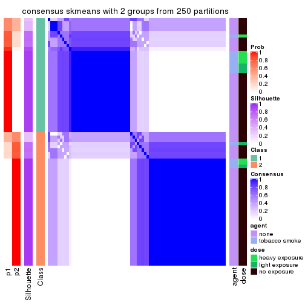</p>

</div>
<div id='tab-MAD-skmeans-consensus-heatmap-2'>
<pre><code class="r">consensus_heatmap(res, k = 3)
</code></pre>

<p>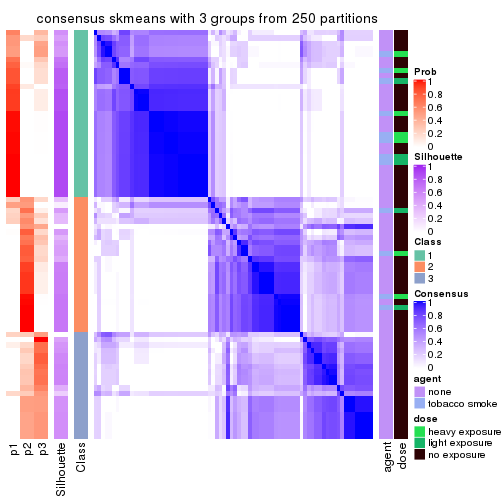</p>

</div>
<div id='tab-MAD-skmeans-consensus-heatmap-3'>
<pre><code class="r">consensus_heatmap(res, k = 4)
</code></pre>

<p>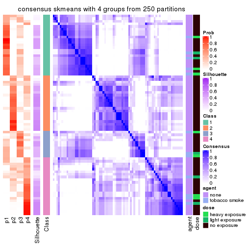</p>

</div>
<div id='tab-MAD-skmeans-consensus-heatmap-4'>
<pre><code class="r">consensus_heatmap(res, k = 5)
</code></pre>

<p>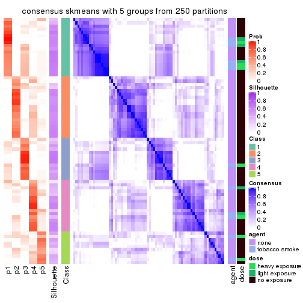</p>

</div>
<div id='tab-MAD-skmeans-consensus-heatmap-5'>
<pre><code class="r">consensus_heatmap(res, k = 6)
</code></pre>

<p>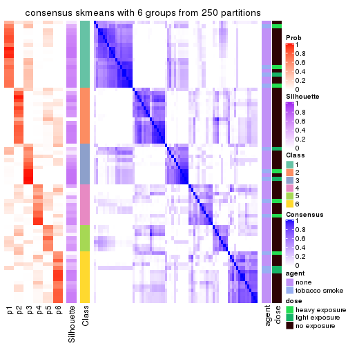</p>

</div>
</div>

Heatmaps for the membership of samples in all partitions to see how consistent they are:


<script>
$( function() {
	$( '#tabs-MAD-skmeans-membership-heatmap' ).tabs();
} );
</script>
<div id='tabs-MAD-skmeans-membership-heatmap'>
<ul>
<li><a href='#tab-MAD-skmeans-membership-heatmap-1'>k = 2</a></li>
<li><a href='#tab-MAD-skmeans-membership-heatmap-2'>k = 3</a></li>
<li><a href='#tab-MAD-skmeans-membership-heatmap-3'>k = 4</a></li>
<li><a href='#tab-MAD-skmeans-membership-heatmap-4'>k = 5</a></li>
<li><a href='#tab-MAD-skmeans-membership-heatmap-5'>k = 6</a></li>
</ul>
<div id='tab-MAD-skmeans-membership-heatmap-1'>
<pre><code class="r">membership_heatmap(res, k = 2)
</code></pre>

<p>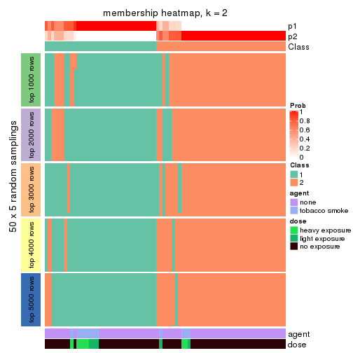</p>

</div>
<div id='tab-MAD-skmeans-membership-heatmap-2'>
<pre><code class="r">membership_heatmap(res, k = 3)
</code></pre>

<p>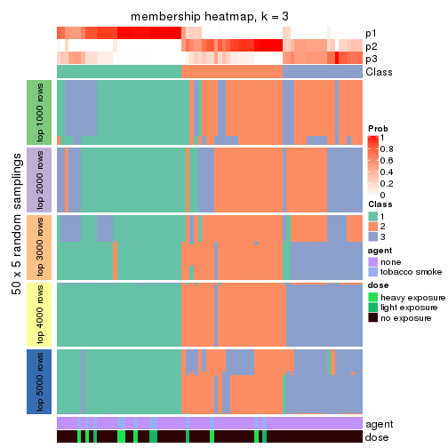</p>

</div>
<div id='tab-MAD-skmeans-membership-heatmap-3'>
<pre><code class="r">membership_heatmap(res, k = 4)
</code></pre>

<p>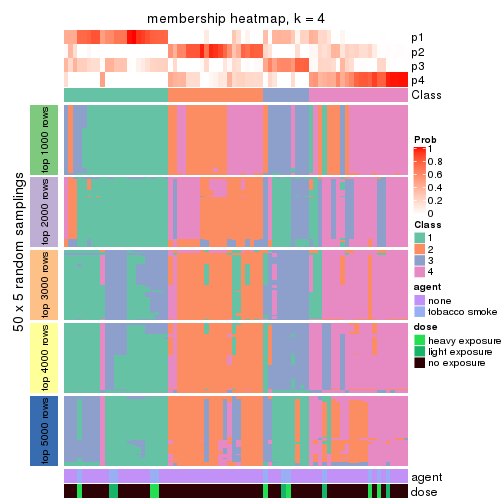</p>

</div>
<div id='tab-MAD-skmeans-membership-heatmap-4'>
<pre><code class="r">membership_heatmap(res, k = 5)
</code></pre>

<p>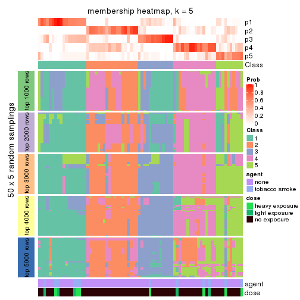</p>

</div>
<div id='tab-MAD-skmeans-membership-heatmap-5'>
<pre><code class="r">membership_heatmap(res, k = 6)
</code></pre>

<p>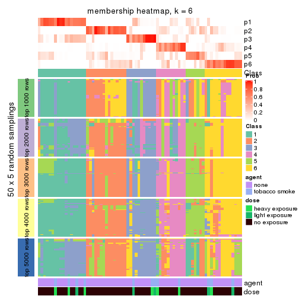</p>

</div>
</div>

As soon as we have had the classes for columns, we can look for signatures
which are significantly different between classes which can be candidate marks
for certain classes. Following are the heatmaps for signatures.


Signature heatmaps where rows are scaled:


<script>
$( function() {
	$( '#tabs-MAD-skmeans-get-signatures' ).tabs();
} );
</script>
<div id='tabs-MAD-skmeans-get-signatures'>
<ul>
<li><a href='#tab-MAD-skmeans-get-signatures-1'>k = 2</a></li>
<li><a href='#tab-MAD-skmeans-get-signatures-2'>k = 3</a></li>
<li><a href='#tab-MAD-skmeans-get-signatures-3'>k = 4</a></li>
<li><a href='#tab-MAD-skmeans-get-signatures-4'>k = 5</a></li>
<li><a href='#tab-MAD-skmeans-get-signatures-5'>k = 6</a></li>
</ul>
<div id='tab-MAD-skmeans-get-signatures-1'>
<pre><code class="r">get_signatures(res, k = 2)
</code></pre>

<p>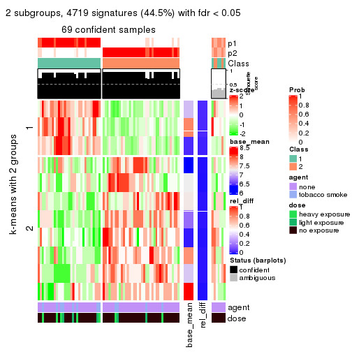</p>

</div>
<div id='tab-MAD-skmeans-get-signatures-2'>
<pre><code class="r">get_signatures(res, k = 3)
</code></pre>

<p>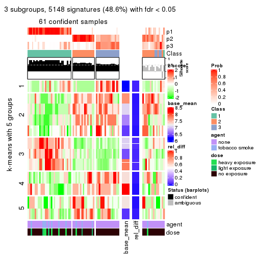</p>

</div>
<div id='tab-MAD-skmeans-get-signatures-3'>
<pre><code class="r">get_signatures(res, k = 4)
</code></pre>

<p>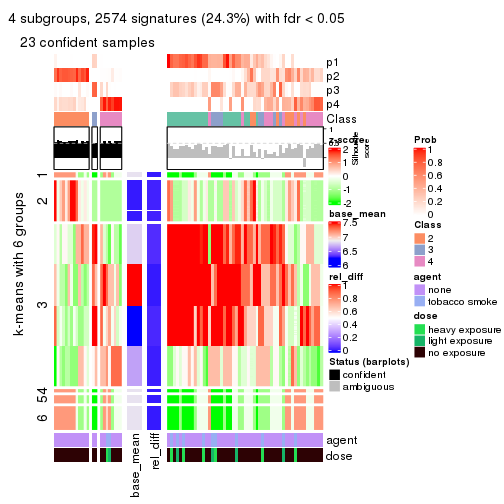</p>

</div>
<div id='tab-MAD-skmeans-get-signatures-4'>
<pre><code class="r">get_signatures(res, k = 5)
</code></pre>

<p>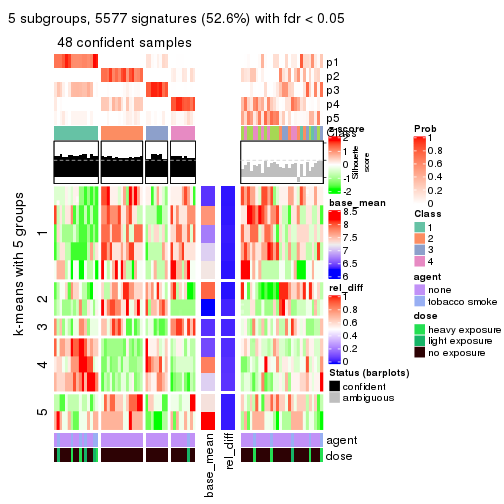</p>

</div>
<div id='tab-MAD-skmeans-get-signatures-5'>
<pre><code class="r">get_signatures(res, k = 6)
</code></pre>

<p>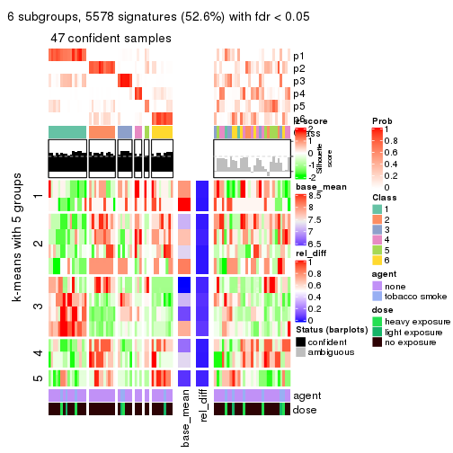</p>

</div>
</div>


Signature heatmaps where rows are not scaled:


<script>
$( function() {
	$( '#tabs-MAD-skmeans-get-signatures-no-scale' ).tabs();
} );
</script>
<div id='tabs-MAD-skmeans-get-signatures-no-scale'>
<ul>
<li><a href='#tab-MAD-skmeans-get-signatures-no-scale-1'>k = 2</a></li>
<li><a href='#tab-MAD-skmeans-get-signatures-no-scale-2'>k = 3</a></li>
<li><a href='#tab-MAD-skmeans-get-signatures-no-scale-3'>k = 4</a></li>
<li><a href='#tab-MAD-skmeans-get-signatures-no-scale-4'>k = 5</a></li>
<li><a href='#tab-MAD-skmeans-get-signatures-no-scale-5'>k = 6</a></li>
</ul>
<div id='tab-MAD-skmeans-get-signatures-no-scale-1'>
<pre><code class="r">get_signatures(res, k = 2, scale_rows = FALSE)
</code></pre>

<p>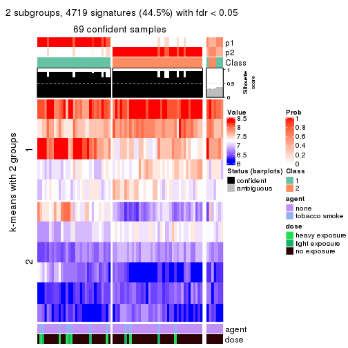</p>

</div>
<div id='tab-MAD-skmeans-get-signatures-no-scale-2'>
<pre><code class="r">get_signatures(res, k = 3, scale_rows = FALSE)
</code></pre>

<p>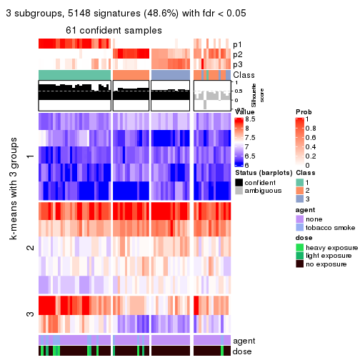</p>

</div>
<div id='tab-MAD-skmeans-get-signatures-no-scale-3'>
<pre><code class="r">get_signatures(res, k = 4, scale_rows = FALSE)
</code></pre>

<p>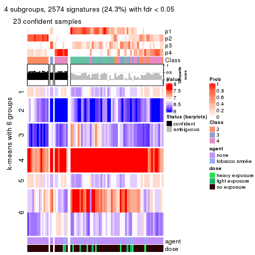</p>

</div>
<div id='tab-MAD-skmeans-get-signatures-no-scale-4'>
<pre><code class="r">get_signatures(res, k = 5, scale_rows = FALSE)
</code></pre>

<p>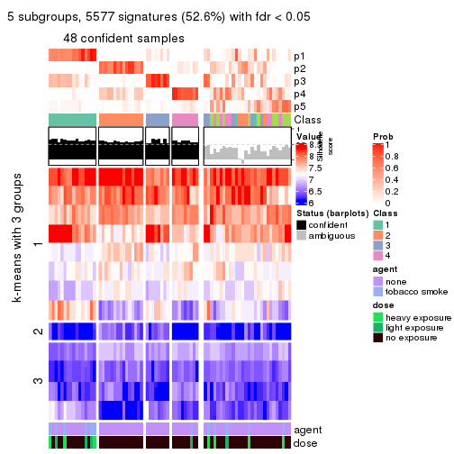</p>

</div>
<div id='tab-MAD-skmeans-get-signatures-no-scale-5'>
<pre><code class="r">get_signatures(res, k = 6, scale_rows = FALSE)
</code></pre>

<p>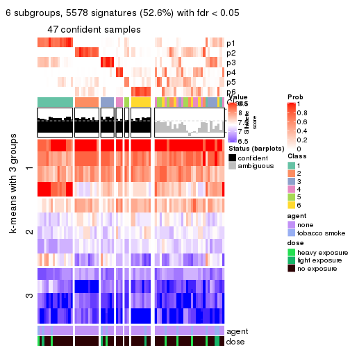</p>

</div>
</div>


Compare the overlap of signatures from different k:

```r
compare_signatures(res)
```

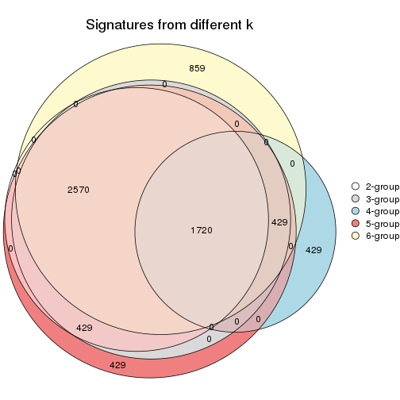

`get_signature()` returns a data frame invisibly. TO get the list of signatures, the function
call should be assigned to a variable explicitly. In following code, if `plot` argument is set
to `FALSE`, no heatmap is plotted while only the differential analysis is performed.

```r
# code only for demonstration
tb = get_signature(res, k = ..., plot = FALSE)
```

An example of the output of `tb` is:

```
#>   which_row         fdr    mean_1    mean_2 scaled_mean_1 scaled_mean_2 km
#> 1        38 0.042760348  8.373488  9.131774    -0.5533452     0.5164555  1
#> 2        40 0.018707592  7.106213  8.469186    -0.6173731     0.5762149  1
#> 3        55 0.019134737 10.221463 11.207825    -0.6159697     0.5749050  1
#> 4        59 0.006059896  5.921854  7.869574    -0.6899429     0.6439467  1
#> 5        60 0.018055526  8.928898 10.211722    -0.6204761     0.5791110  1
#> 6        98 0.009384629 15.714769 14.887706     0.6635654    -0.6193277  2
...
```

The columns in `tb` are:

1. `which_row`: row indices corresponding to the input matrix.
2. `fdr`: FDR for the differential test. 
3. `mean_x`: The mean value in group x.
4. `scaled_mean_x`: The mean value in group x after rows are scaled.
5. `km`: Row groups if k-means clustering is applied to rows.


UMAP plot which shows how samples are separated.


<script>
$( function() {
	$( '#tabs-MAD-skmeans-dimension-reduction' ).tabs();
} );
</script>
<div id='tabs-MAD-skmeans-dimension-reduction'>
<ul>
<li><a href='#tab-MAD-skmeans-dimension-reduction-1'>k = 2</a></li>
<li><a href='#tab-MAD-skmeans-dimension-reduction-2'>k = 3</a></li>
<li><a href='#tab-MAD-skmeans-dimension-reduction-3'>k = 4</a></li>
<li><a href='#tab-MAD-skmeans-dimension-reduction-4'>k = 5</a></li>
<li><a href='#tab-MAD-skmeans-dimension-reduction-5'>k = 6</a></li>
</ul>
<div id='tab-MAD-skmeans-dimension-reduction-1'>
<pre><code class="r">dimension_reduction(res, k = 2, method = &quot;UMAP&quot;)
</code></pre>

<p>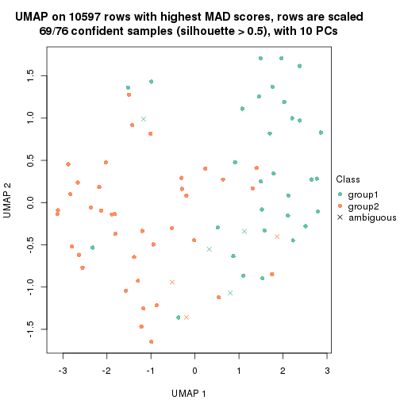</p>

</div>
<div id='tab-MAD-skmeans-dimension-reduction-2'>
<pre><code class="r">dimension_reduction(res, k = 3, method = &quot;UMAP&quot;)
</code></pre>

<p>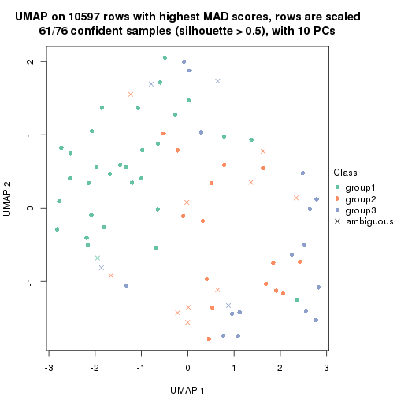</p>

</div>
<div id='tab-MAD-skmeans-dimension-reduction-3'>
<pre><code class="r">dimension_reduction(res, k = 4, method = &quot;UMAP&quot;)
</code></pre>

<p>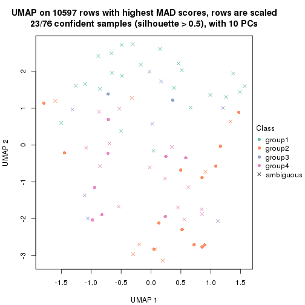</p>

</div>
<div id='tab-MAD-skmeans-dimension-reduction-4'>
<pre><code class="r">dimension_reduction(res, k = 5, method = &quot;UMAP&quot;)
</code></pre>

<p>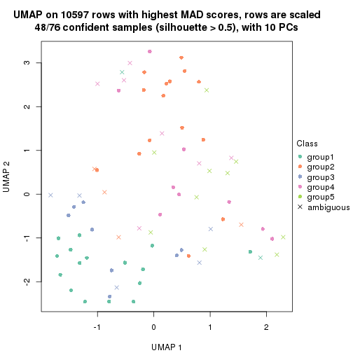</p>

</div>
<div id='tab-MAD-skmeans-dimension-reduction-5'>
<pre><code class="r">dimension_reduction(res, k = 6, method = &quot;UMAP&quot;)
</code></pre>

<p>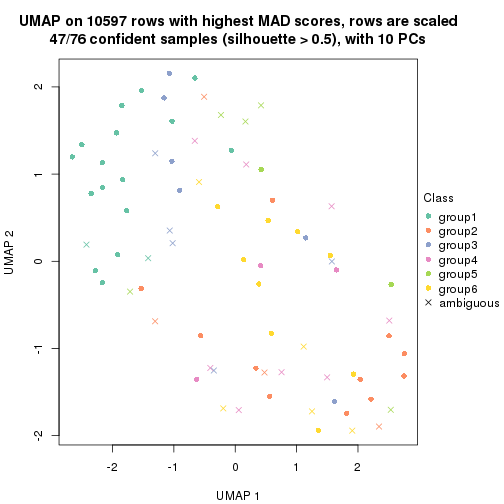</p>

</div>
</div>


Following heatmap shows how subgroups are split when increasing `k`:

```r
collect_classes(res)
```

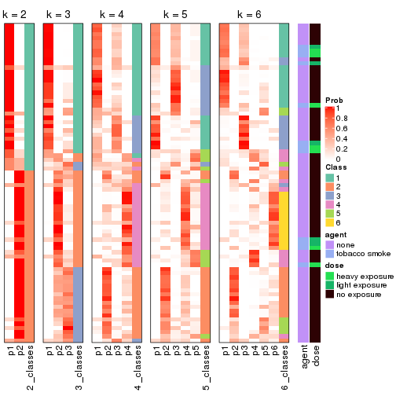


Test correlation between subgroups and known annotations. If the known
annotation is numeric, one-way ANOVA test is applied, and if the known
annotation is discrete, chi-squared contingency table test is applied.

```r
test_to_known_factors(res)
```

```
#>              n agent(p) dose(p) k
#> MAD:skmeans 69   0.1782  0.2312 2
#> MAD:skmeans 61   0.0792  0.2008 3
#> MAD:skmeans 23   0.1283  0.3917 4
#> MAD:skmeans 48   0.0131  0.0702 5
#> MAD:skmeans 47   0.3970  0.7701 6
```


If matrix rows can be associated to genes, consider to use `GO_Enrichment(res,
...)` to perform function enrichment for the signature genes.


 

---------------------------------------------------


### MAD:pam


The object with results only for a single top-value method and a single partition method 
can be extracted as:

```r
res = res_list["MAD", "pam"]
# you can also extract it by
# res = res_list["MAD:pam"]
```

A summary of `res` and all the functions that can be applied to it:

```r
res
```

```
#> A 'ConsensusPartition' object with k = 2, 3, 4, 5, 6.
#>   On a matrix with 10597 rows and 76 columns.
#>   Top rows (1000, 2000, 3000, 4000, 5000) are extracted by 'MAD' method.
#>   Subgroups are detected by 'pam' method.
#>   Performed in total 1250 partitions by row resampling.
#>   Best k for subgroups seems to be 2.
#> 
#> Following methods can be applied to this 'ConsensusPartition' object:
#>  [1] "cola_report"             "collect_classes"         "collect_plots"          
#>  [4] "collect_stats"           "colnames"                "compare_signatures"     
#>  [7] "consensus_heatmap"       "dimension_reduction"     "functional_enrichment"  
#> [10] "get_anno_col"            "get_anno"                "get_classes"            
#> [13] "get_consensus"           "get_matrix"              "get_membership"         
#> [16] "get_param"               "get_signatures"          "get_stats"              
#> [19] "is_best_k"               "is_stable_k"             "membership_heatmap"     
#> [22] "ncol"                    "nrow"                    "plot_ecdf"              
#> [25] "rownames"                "select_partition_number" "show"                   
#> [28] "suggest_best_k"          "test_to_known_factors"
```

`collect_plots()` function collects all the plots made from `res` for all `k` (number of partitions)
into one single page to provide an easy and fast comparison between different `k`.

```r
collect_plots(res)
```

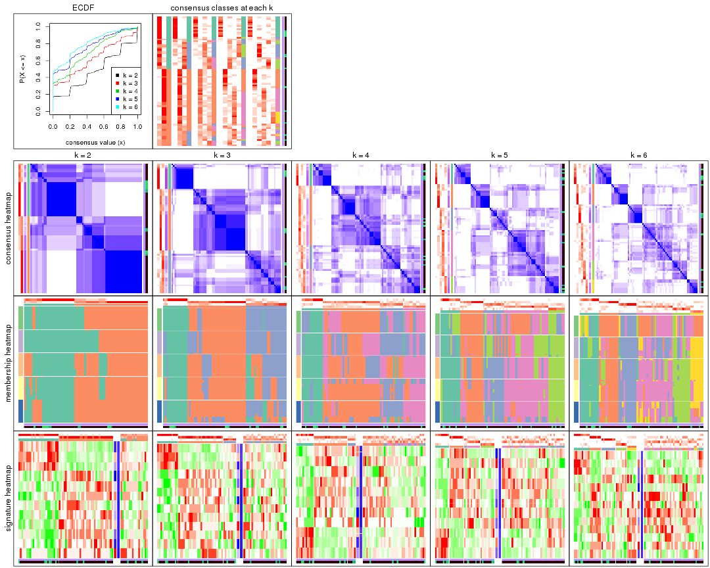

The plots are:

- The first row: a plot of the ECDF (Empirical cumulative distribution
  function) curves of the consensus matrix for each `k` and the heatmap of
  predicted classes for each `k`.
- The second row: heatmaps of the consensus matrix for each `k`.
- The third row: heatmaps of the membership matrix for each `k`.
- The fouth row: heatmaps of the signatures for each `k`.

All the plots in panels can be made by individual functions and they are
plotted later in this section.

`select_partition_number()` produces several plots showing different
statistics for choosing "optimized" `k`. There are following statistics:

- ECDF curves of the consensus matrix for each `k`;
- 1-PAC. [The PAC
  score](https://en.wikipedia.org/wiki/Consensus_clustering#Over-interpretation_potential_of_consensus_clustering)
  measures the proportion of the ambiguous subgrouping.
- Mean silhouette score.
- Concordance. The mean probability of fiting the consensus class ids in all
  partitions.
- Area increased. Denote $A_k$ as the area under the ECDF curve for current
  `k`, the area increased is defined as $A_k - A_{k-1}$.
- Rand index. The percent of pairs of samples that are both in a same cluster
  or both are not in a same cluster in the partition of k and k-1.
- Jaccard index. The ratio of pairs of samples are both in a same cluster in
  the partition of k and k-1 and the pairs of samples are both in a same
  cluster in the partition k or k-1.

The detailed explanations of these statistics can be found in [the cola
vignette](http://bioconductor.org/packages/devel/bioc/vignettes/cola/inst/doc/cola.html#toc_13).

Generally speaking, lower PAC score, higher mean silhouette score or higher
concordance corresponds to better partition. Rand index and Jaccard index
measure how similar the current partition is compared to partition with `k-1`.
If they are too similar, we won't accept `k` is better than `k-1`.

```r
select_partition_number(res)
```

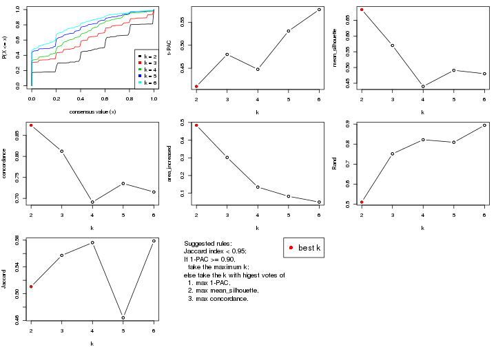

The numeric values for all these statistics can be obtained by `get_stats()`.

```r
get_stats(res)
```

```
#>   k 1-PAC mean_silhouette concordance area_increased  Rand Jaccard
#> 2 2 0.410           0.684       0.874         0.4840 0.511   0.511
#> 3 3 0.480           0.570       0.812         0.3020 0.752   0.557
#> 4 4 0.448           0.440       0.691         0.1347 0.822   0.576
#> 5 5 0.531           0.491       0.735         0.0825 0.809   0.464
#> 6 6 0.577           0.480       0.715         0.0498 0.894   0.579
```

`suggest_best_k()` suggests the best $k$ based on these statistics. The rules are as follows:

- All $k$ with Jaccard index larger than 0.95 are removed because the increase of
  the partition number does not provides enough extra information. If all $k$ are removed,
  the best $k$ is assigned by `NA`.
- For $k$ with 1-PAC larger than 0.9, the maximal $k$ is taken as the "best k". Other $k$ is called "optional k".
- If it does not fit the second rule. The $k$ with the highest vote of highest
  1-PAC, mean silhouette and concordance is taken as the "best k".

```r
suggest_best_k(res)
```

```
#> [1] 2
```


Following shows the table of the partitions (You need to click the **show/hide
code output** link to see it). The membership matrix (columns with name `p*`)
is inferred by
[`clue::cl_consensus()`](https://www.rdocumentation.org/link/cl_consensus?package=clue)
function with the `SE` method. Basically the value in the membership matrix
represents the probability to belong to a certain group. The finall class
label for an item is determined with the group with highest probability it
belongs to.

In `get_classes()` function, the entropy is calculated from the membership
matrix and the silhouette score is calculated from the consensus matrix.


<script>
$( function() {
	$( '#tabs-MAD-pam-get-classes' ).tabs();
} );
</script>
<div id='tabs-MAD-pam-get-classes'>
<ul>
<li><a href='#tab-MAD-pam-get-classes-1'>k = 2</a></li>
<li><a href='#tab-MAD-pam-get-classes-2'>k = 3</a></li>
<li><a href='#tab-MAD-pam-get-classes-3'>k = 4</a></li>
<li><a href='#tab-MAD-pam-get-classes-4'>k = 5</a></li>
<li><a href='#tab-MAD-pam-get-classes-5'>k = 6</a></li>
</ul>

<div id='tab-MAD-pam-get-classes-1'>
<p><a id='tab-MAD-pam-get-classes-1-a' style='color:#0366d6' href='#'>show/hide code output</a></p>
<pre><code class="r">cbind(get_classes(res, k = 2), get_membership(res, k = 2))
</code></pre>

<pre><code>#&gt;           class entropy silhouette    p1    p2
#&gt; GSM451162     1  0.7219     0.6563 0.800 0.200
#&gt; GSM451163     2  0.0000     0.8187 0.000 1.000
#&gt; GSM451164     2  0.0000     0.8187 0.000 1.000
#&gt; GSM451165     2  0.9686     0.2741 0.396 0.604
#&gt; GSM451167     2  0.0000     0.8187 0.000 1.000
#&gt; GSM451168     2  0.0000     0.8187 0.000 1.000
#&gt; GSM451169     2  0.9608     0.3901 0.384 0.616
#&gt; GSM451170     1  0.0000     0.8518 1.000 0.000
#&gt; GSM451171     2  0.0000     0.8187 0.000 1.000
#&gt; GSM451172     2  0.0000     0.8187 0.000 1.000
#&gt; GSM451173     1  0.9393     0.3610 0.644 0.356
#&gt; GSM451174     2  0.0000     0.8187 0.000 1.000
#&gt; GSM451175     1  0.9996    -0.0456 0.512 0.488
#&gt; GSM451177     2  0.0000     0.8187 0.000 1.000
#&gt; GSM451178     2  0.0000     0.8187 0.000 1.000
#&gt; GSM451179     1  0.7299     0.6533 0.796 0.204
#&gt; GSM451180     2  0.0000     0.8187 0.000 1.000
#&gt; GSM451181     2  0.0000     0.8187 0.000 1.000
#&gt; GSM451182     1  0.0000     0.8518 1.000 0.000
#&gt; GSM451183     1  0.0000     0.8518 1.000 0.000
#&gt; GSM451184     1  0.7299     0.6533 0.796 0.204
#&gt; GSM451185     1  0.0000     0.8518 1.000 0.000
#&gt; GSM451186     2  0.9963     0.1909 0.464 0.536
#&gt; GSM451187     2  0.0000     0.8187 0.000 1.000
#&gt; GSM451188     2  0.7139     0.6352 0.196 0.804
#&gt; GSM451189     1  0.0000     0.8518 1.000 0.000
#&gt; GSM451190     1  0.0000     0.8518 1.000 0.000
#&gt; GSM451191     1  0.0000     0.8518 1.000 0.000
#&gt; GSM451193     2  0.9710     0.3921 0.400 0.600
#&gt; GSM451195     1  0.0000     0.8518 1.000 0.000
#&gt; GSM451196     1  0.0000     0.8518 1.000 0.000
#&gt; GSM451197     1  0.0000     0.8518 1.000 0.000
#&gt; GSM451199     1  0.0000     0.8518 1.000 0.000
#&gt; GSM451201     1  0.0000     0.8518 1.000 0.000
#&gt; GSM451202     2  0.0000     0.8187 0.000 1.000
#&gt; GSM451203     2  0.9710     0.3524 0.400 0.600
#&gt; GSM451204     2  0.7219     0.6965 0.200 0.800
#&gt; GSM451205     2  0.0000     0.8187 0.000 1.000
#&gt; GSM451206     2  0.0000     0.8187 0.000 1.000
#&gt; GSM451207     2  0.7219     0.6965 0.200 0.800
#&gt; GSM451208     2  0.0000     0.8187 0.000 1.000
#&gt; GSM451209     2  0.7219     0.6965 0.200 0.800
#&gt; GSM451210     2  0.0000     0.8187 0.000 1.000
#&gt; GSM451212     2  0.7219     0.6965 0.200 0.800
#&gt; GSM451213     2  0.7056     0.7036 0.192 0.808
#&gt; GSM451214     2  0.9686     0.2741 0.396 0.604
#&gt; GSM451215     2  0.0000     0.8187 0.000 1.000
#&gt; GSM451216     2  0.7056     0.7036 0.192 0.808
#&gt; GSM451217     2  0.0000     0.8187 0.000 1.000
#&gt; GSM451219     1  0.0000     0.8518 1.000 0.000
#&gt; GSM451220     1  0.7376     0.6458 0.792 0.208
#&gt; GSM451221     1  0.0000     0.8518 1.000 0.000
#&gt; GSM451222     1  0.8909     0.4728 0.692 0.308
#&gt; GSM451224     2  0.9635     0.2932 0.388 0.612
#&gt; GSM451225     1  0.9608     0.2795 0.616 0.384
#&gt; GSM451226     1  0.9732     0.2124 0.596 0.404
#&gt; GSM451227     2  0.9686     0.2741 0.396 0.604
#&gt; GSM451228     2  0.7219     0.6965 0.200 0.800
#&gt; GSM451230     2  0.9710     0.3524 0.400 0.600
#&gt; GSM451231     1  0.7299     0.6533 0.796 0.204
#&gt; GSM451233     2  0.7219     0.6965 0.200 0.800
#&gt; GSM451234     2  0.0000     0.8187 0.000 1.000
#&gt; GSM451235     2  0.0000     0.8187 0.000 1.000
#&gt; GSM451236     2  0.0000     0.8187 0.000 1.000
#&gt; GSM451166     2  0.9710     0.3524 0.400 0.600
#&gt; GSM451194     2  0.9710     0.3524 0.400 0.600
#&gt; GSM451198     1  0.0000     0.8518 1.000 0.000
#&gt; GSM451218     2  0.0000     0.8187 0.000 1.000
#&gt; GSM451232     1  0.0000     0.8518 1.000 0.000
#&gt; GSM451176     1  0.0000     0.8518 1.000 0.000
#&gt; GSM451192     1  0.0000     0.8518 1.000 0.000
#&gt; GSM451200     1  0.0376     0.8494 0.996 0.004
#&gt; GSM451211     2  0.0000     0.8187 0.000 1.000
#&gt; GSM451223     1  0.9732     0.2124 0.596 0.404
#&gt; GSM451229     1  0.0000     0.8518 1.000 0.000
#&gt; GSM451237     2  0.0000     0.8187 0.000 1.000
</code></pre>

<script>
$('#tab-MAD-pam-get-classes-1-a').parent().next().next().hide();
$('#tab-MAD-pam-get-classes-1-a').click(function(){
  $('#tab-MAD-pam-get-classes-1-a').parent().next().next().toggle();
  return(false);
});
</script>
</div>

<div id='tab-MAD-pam-get-classes-2'>
<p><a id='tab-MAD-pam-get-classes-2-a' style='color:#0366d6' href='#'>show/hide code output</a></p>
<pre><code class="r">cbind(get_classes(res, k = 3), get_membership(res, k = 3))
</code></pre>

<pre><code>#&gt;           class entropy silhouette    p1    p2    p3
#&gt; GSM451162     3  0.1964     0.5676 0.056 0.000 0.944
#&gt; GSM451163     2  0.0000     0.7851 0.000 1.000 0.000
#&gt; GSM451164     2  0.0000     0.7851 0.000 1.000 0.000
#&gt; GSM451165     2  0.6126     0.2761 0.000 0.600 0.400
#&gt; GSM451167     2  0.4555     0.5371 0.000 0.800 0.200
#&gt; GSM451168     2  0.0000     0.7851 0.000 1.000 0.000
#&gt; GSM451169     3  0.6126     0.3463 0.000 0.400 0.600
#&gt; GSM451170     1  0.4555     0.5969 0.800 0.000 0.200
#&gt; GSM451171     2  0.1964     0.7715 0.000 0.944 0.056
#&gt; GSM451172     2  0.4555     0.5885 0.000 0.800 0.200
#&gt; GSM451173     3  0.9120     0.4551 0.256 0.200 0.544
#&gt; GSM451174     2  0.0000     0.7851 0.000 1.000 0.000
#&gt; GSM451175     3  0.8771     0.4594 0.132 0.324 0.544
#&gt; GSM451177     2  0.1964     0.7715 0.000 0.944 0.056
#&gt; GSM451178     2  0.0000     0.7851 0.000 1.000 0.000
#&gt; GSM451179     3  0.1964     0.6010 0.000 0.056 0.944
#&gt; GSM451180     2  0.1964     0.7715 0.000 0.944 0.056
#&gt; GSM451181     2  0.4555     0.5885 0.000 0.800 0.200
#&gt; GSM451182     1  0.0000     0.8910 1.000 0.000 0.000
#&gt; GSM451183     1  0.0000     0.8910 1.000 0.000 0.000
#&gt; GSM451184     3  0.4555     0.5269 0.000 0.200 0.800
#&gt; GSM451185     1  0.0000     0.8910 1.000 0.000 0.000
#&gt; GSM451186     2  0.8650     0.2153 0.200 0.600 0.200
#&gt; GSM451187     2  0.0000     0.7851 0.000 1.000 0.000
#&gt; GSM451188     2  0.6274     0.2664 0.000 0.544 0.456
#&gt; GSM451189     1  0.0000     0.8910 1.000 0.000 0.000
#&gt; GSM451190     1  0.0592     0.8811 0.988 0.000 0.012
#&gt; GSM451191     1  0.6126     0.3363 0.600 0.000 0.400
#&gt; GSM451193     3  0.5178     0.5473 0.000 0.256 0.744
#&gt; GSM451195     3  0.6274     0.1725 0.456 0.000 0.544
#&gt; GSM451196     1  0.0000     0.8910 1.000 0.000 0.000
#&gt; GSM451197     1  0.0000     0.8910 1.000 0.000 0.000
#&gt; GSM451199     3  0.4654     0.4637 0.208 0.000 0.792
#&gt; GSM451201     1  0.0000     0.8910 1.000 0.000 0.000
#&gt; GSM451202     2  0.1964     0.7715 0.000 0.944 0.056
#&gt; GSM451203     3  0.6126     0.3463 0.000 0.400 0.600
#&gt; GSM451204     2  0.4555     0.5607 0.000 0.800 0.200
#&gt; GSM451205     2  0.1964     0.7715 0.000 0.944 0.056
#&gt; GSM451206     2  0.0000     0.7851 0.000 1.000 0.000
#&gt; GSM451207     2  0.4555     0.5607 0.000 0.800 0.200
#&gt; GSM451208     2  0.1964     0.7715 0.000 0.944 0.056
#&gt; GSM451209     3  0.6274     0.3103 0.000 0.456 0.544
#&gt; GSM451210     2  0.6008     0.4093 0.000 0.628 0.372
#&gt; GSM451212     2  0.6126     0.0504 0.000 0.600 0.400
#&gt; GSM451213     2  0.5098     0.5856 0.000 0.752 0.248
#&gt; GSM451214     3  0.5882     0.1839 0.000 0.348 0.652
#&gt; GSM451215     2  0.1964     0.7715 0.000 0.944 0.056
#&gt; GSM451216     2  0.5098     0.5856 0.000 0.752 0.248
#&gt; GSM451217     2  0.0000     0.7851 0.000 1.000 0.000
#&gt; GSM451219     3  0.6126     0.0736 0.400 0.000 0.600
#&gt; GSM451220     3  0.6154     0.2497 0.408 0.000 0.592
#&gt; GSM451221     3  0.4555     0.4675 0.200 0.000 0.800
#&gt; GSM451222     3  0.9120     0.4551 0.256 0.200 0.544
#&gt; GSM451224     2  0.6274     0.2664 0.000 0.544 0.456
#&gt; GSM451225     1  0.9853    -0.2626 0.400 0.256 0.344
#&gt; GSM451226     3  0.1964     0.6010 0.000 0.056 0.944
#&gt; GSM451227     3  0.6126     0.1937 0.000 0.400 0.600
#&gt; GSM451228     3  0.6274     0.3103 0.000 0.456 0.544
#&gt; GSM451230     2  0.6126     0.0504 0.000 0.600 0.400
#&gt; GSM451231     3  0.5178     0.5473 0.000 0.256 0.744
#&gt; GSM451233     2  0.5859     0.2623 0.000 0.656 0.344
#&gt; GSM451234     2  0.0000     0.7851 0.000 1.000 0.000
#&gt; GSM451235     2  0.0000     0.7851 0.000 1.000 0.000
#&gt; GSM451236     2  0.1964     0.7715 0.000 0.944 0.056
#&gt; GSM451166     3  0.6302     0.2603 0.000 0.480 0.520
#&gt; GSM451194     3  0.6274     0.3103 0.000 0.456 0.544
#&gt; GSM451198     3  0.6274     0.1725 0.456 0.000 0.544
#&gt; GSM451218     2  0.0000     0.7851 0.000 1.000 0.000
#&gt; GSM451232     1  0.0000     0.8910 1.000 0.000 0.000
#&gt; GSM451176     1  0.0000     0.8910 1.000 0.000 0.000
#&gt; GSM451192     1  0.0000     0.8910 1.000 0.000 0.000
#&gt; GSM451200     3  0.1964     0.5676 0.056 0.000 0.944
#&gt; GSM451211     2  0.0000     0.7851 0.000 1.000 0.000
#&gt; GSM451223     3  0.1964     0.6010 0.000 0.056 0.944
#&gt; GSM451229     1  0.0000     0.8910 1.000 0.000 0.000
#&gt; GSM451237     2  0.0000     0.7851 0.000 1.000 0.000
</code></pre>

<script>
$('#tab-MAD-pam-get-classes-2-a').parent().next().next().hide();
$('#tab-MAD-pam-get-classes-2-a').click(function(){
  $('#tab-MAD-pam-get-classes-2-a').parent().next().next().toggle();
  return(false);
});
</script>
</div>

<div id='tab-MAD-pam-get-classes-3'>
<p><a id='tab-MAD-pam-get-classes-3-a' style='color:#0366d6' href='#'>show/hide code output</a></p>
<pre><code class="r">cbind(get_classes(res, k = 4), get_membership(res, k = 4))
</code></pre>

<pre><code>#&gt;           class entropy silhouette    p1    p2    p3    p4
#&gt; GSM451162     4  0.4391     0.4916 0.000 0.008 0.252 0.740
#&gt; GSM451163     2  0.5072     0.4009 0.000 0.740 0.052 0.208
#&gt; GSM451164     2  0.0336     0.5847 0.000 0.992 0.000 0.008
#&gt; GSM451165     4  0.6130     0.3349 0.000 0.400 0.052 0.548
#&gt; GSM451167     2  0.7205     0.0727 0.000 0.548 0.252 0.200
#&gt; GSM451168     2  0.3852     0.5470 0.000 0.800 0.192 0.008
#&gt; GSM451169     2  0.7795    -0.2127 0.000 0.404 0.252 0.344
#&gt; GSM451170     1  0.4855     0.3257 0.600 0.000 0.400 0.000
#&gt; GSM451171     2  0.4103     0.5333 0.000 0.744 0.256 0.000
#&gt; GSM451172     2  0.5138     0.1426 0.000 0.600 0.008 0.392
#&gt; GSM451173     3  0.5316     0.6041 0.056 0.192 0.744 0.008
#&gt; GSM451174     2  0.4072     0.5658 0.000 0.748 0.000 0.252
#&gt; GSM451175     3  0.4799     0.6055 0.032 0.224 0.744 0.000
#&gt; GSM451177     2  0.4103     0.5333 0.000 0.744 0.256 0.000
#&gt; GSM451178     2  0.4072     0.5658 0.000 0.748 0.000 0.252
#&gt; GSM451179     3  0.4164     0.3493 0.000 0.000 0.736 0.264
#&gt; GSM451180     2  0.4103     0.5333 0.000 0.744 0.256 0.000
#&gt; GSM451181     2  0.7205     0.2801 0.000 0.548 0.200 0.252
#&gt; GSM451182     1  0.3610     0.7312 0.800 0.000 0.200 0.000
#&gt; GSM451183     1  0.0000     0.7998 1.000 0.000 0.000 0.000
#&gt; GSM451184     4  0.4072     0.4950 0.000 0.000 0.252 0.748
#&gt; GSM451185     1  0.0000     0.7998 1.000 0.000 0.000 0.000
#&gt; GSM451186     3  0.7700    -0.1372 0.000 0.228 0.428 0.344
#&gt; GSM451187     2  0.3610     0.5470 0.000 0.800 0.200 0.000
#&gt; GSM451188     2  0.6200     0.0801 0.000 0.580 0.064 0.356
#&gt; GSM451189     1  0.3610     0.7312 0.800 0.000 0.200 0.000
#&gt; GSM451190     1  0.6946     0.5405 0.588 0.000 0.200 0.212
#&gt; GSM451191     4  0.4977     0.0428 0.460 0.000 0.000 0.540
#&gt; GSM451193     4  0.6886     0.2898 0.000 0.204 0.200 0.596
#&gt; GSM451195     3  0.4360     0.3747 0.248 0.000 0.744 0.008
#&gt; GSM451196     1  0.0000     0.7998 1.000 0.000 0.000 0.000
#&gt; GSM451197     1  0.4643     0.4824 0.656 0.000 0.344 0.000
#&gt; GSM451199     3  0.6627     0.2386 0.112 0.000 0.588 0.300
#&gt; GSM451201     1  0.4356     0.5644 0.708 0.000 0.292 0.000
#&gt; GSM451202     2  0.4103     0.5333 0.000 0.744 0.256 0.000
#&gt; GSM451203     2  0.7803    -0.2173 0.000 0.396 0.252 0.352
#&gt; GSM451204     2  0.4391     0.3811 0.000 0.740 0.252 0.008
#&gt; GSM451205     2  0.4103     0.5333 0.000 0.744 0.256 0.000
#&gt; GSM451206     2  0.6835     0.5765 0.000 0.592 0.156 0.252
#&gt; GSM451207     2  0.7205     0.1351 0.000 0.548 0.200 0.252
#&gt; GSM451208     2  0.4283     0.5343 0.000 0.740 0.256 0.004
#&gt; GSM451209     3  0.7648     0.2756 0.000 0.396 0.396 0.208
#&gt; GSM451210     2  0.5646     0.2818 0.000 0.672 0.056 0.272
#&gt; GSM451212     2  0.4967     0.3896 0.000 0.548 0.000 0.452
#&gt; GSM451213     2  0.5508     0.5716 0.000 0.692 0.056 0.252
#&gt; GSM451214     4  0.4072     0.4929 0.000 0.252 0.000 0.748
#&gt; GSM451215     2  0.4103     0.5333 0.000 0.744 0.256 0.000
#&gt; GSM451216     2  0.5508     0.5716 0.000 0.692 0.056 0.252
#&gt; GSM451217     2  0.1807     0.5722 0.000 0.940 0.052 0.008
#&gt; GSM451219     4  0.5268     0.2489 0.008 0.000 0.452 0.540
#&gt; GSM451220     3  0.8195     0.4759 0.056 0.192 0.544 0.208
#&gt; GSM451221     4  0.6262     0.2433 0.060 0.000 0.400 0.540
#&gt; GSM451222     3  0.5894     0.5883 0.108 0.200 0.692 0.000
#&gt; GSM451224     4  0.6271     0.2081 0.000 0.452 0.056 0.492
#&gt; GSM451225     3  0.8159     0.4140 0.200 0.204 0.544 0.052
#&gt; GSM451226     4  0.4072     0.4950 0.000 0.000 0.252 0.748
#&gt; GSM451227     4  0.4072     0.4929 0.000 0.252 0.000 0.748
#&gt; GSM451228     3  0.7469     0.3984 0.000 0.312 0.488 0.200
#&gt; GSM451230     2  0.7790    -0.2726 0.000 0.408 0.340 0.252
#&gt; GSM451231     4  0.6594     0.3591 0.000 0.148 0.228 0.624
#&gt; GSM451233     4  0.6886     0.2898 0.000 0.204 0.200 0.596
#&gt; GSM451234     2  0.4072     0.5658 0.000 0.748 0.000 0.252
#&gt; GSM451235     2  0.4998     0.5533 0.000 0.748 0.052 0.200
#&gt; GSM451236     2  0.5508     0.5716 0.000 0.692 0.056 0.252
#&gt; GSM451166     2  0.6882     0.3480 0.000 0.548 0.124 0.328
#&gt; GSM451194     3  0.4360     0.5937 0.000 0.248 0.744 0.008
#&gt; GSM451198     3  0.8059     0.5183 0.208 0.192 0.552 0.048
#&gt; GSM451218     2  0.4072     0.5658 0.000 0.748 0.000 0.252
#&gt; GSM451232     1  0.0000     0.7998 1.000 0.000 0.000 0.000
#&gt; GSM451176     1  0.3610     0.7312 0.800 0.000 0.200 0.000
#&gt; GSM451192     1  0.0000     0.7998 1.000 0.000 0.000 0.000
#&gt; GSM451200     3  0.4103     0.3534 0.000 0.000 0.744 0.256
#&gt; GSM451211     2  0.6855     0.5675 0.000 0.600 0.200 0.200
#&gt; GSM451223     4  0.4072     0.4950 0.000 0.000 0.252 0.748
#&gt; GSM451229     1  0.0000     0.7998 1.000 0.000 0.000 0.000
#&gt; GSM451237     2  0.4800     0.4325 0.000 0.760 0.196 0.044
</code></pre>

<script>
$('#tab-MAD-pam-get-classes-3-a').parent().next().next().hide();
$('#tab-MAD-pam-get-classes-3-a').click(function(){
  $('#tab-MAD-pam-get-classes-3-a').parent().next().next().toggle();
  return(false);
});
</script>
</div>

<div id='tab-MAD-pam-get-classes-4'>
<p><a id='tab-MAD-pam-get-classes-4-a' style='color:#0366d6' href='#'>show/hide code output</a></p>
<pre><code class="r">cbind(get_classes(res, k = 5), get_membership(res, k = 5))
</code></pre>

<pre><code>#&gt;           class entropy silhouette    p1    p2    p3    p4    p5
#&gt; GSM451162     3   0.339     0.4806 0.000 0.000 0.792 0.200 0.008
#&gt; GSM451163     4   0.437     0.4530 0.000 0.200 0.056 0.744 0.000
#&gt; GSM451164     4   0.428     0.2110 0.000 0.456 0.000 0.544 0.000
#&gt; GSM451165     3   0.418     0.0618 0.000 0.400 0.600 0.000 0.000
#&gt; GSM451167     4   0.376     0.4907 0.000 0.008 0.248 0.744 0.000
#&gt; GSM451168     2   0.426     0.0512 0.000 0.564 0.000 0.436 0.000
#&gt; GSM451169     4   0.624     0.2421 0.000 0.000 0.248 0.544 0.208
#&gt; GSM451170     1   0.437     0.4484 0.620 0.000 0.372 0.000 0.008
#&gt; GSM451171     2   0.000     0.7523 0.000 1.000 0.000 0.000 0.000
#&gt; GSM451172     4   0.623     0.1227 0.000 0.200 0.256 0.544 0.000
#&gt; GSM451173     5   0.304     0.7876 0.000 0.000 0.192 0.000 0.808
#&gt; GSM451174     4   0.443     0.5003 0.000 0.208 0.056 0.736 0.000
#&gt; GSM451175     5   0.569     0.6953 0.020 0.000 0.372 0.048 0.560
#&gt; GSM451177     2   0.000     0.7523 0.000 1.000 0.000 0.000 0.000
#&gt; GSM451178     4   0.437     0.5022 0.000 0.200 0.056 0.744 0.000
#&gt; GSM451179     5   0.416     0.7281 0.000 0.000 0.392 0.000 0.608
#&gt; GSM451180     2   0.000     0.7523 0.000 1.000 0.000 0.000 0.000
#&gt; GSM451181     4   0.659     0.3947 0.000 0.208 0.392 0.400 0.000
#&gt; GSM451182     1   0.443     0.6689 0.600 0.000 0.008 0.000 0.392
#&gt; GSM451183     1   0.311     0.7550 0.800 0.000 0.000 0.000 0.200
#&gt; GSM451184     3   0.585     0.5593 0.000 0.000 0.608 0.200 0.192
#&gt; GSM451185     1   0.000     0.7561 1.000 0.000 0.000 0.000 0.000
#&gt; GSM451186     4   0.706     0.3705 0.000 0.056 0.208 0.544 0.192
#&gt; GSM451187     2   0.474     0.3846 0.000 0.692 0.056 0.252 0.000
#&gt; GSM451188     2   0.327     0.5925 0.000 0.780 0.220 0.000 0.000
#&gt; GSM451189     1   0.311     0.7550 0.800 0.000 0.000 0.000 0.200
#&gt; GSM451190     1   0.636     0.4848 0.444 0.000 0.164 0.000 0.392
#&gt; GSM451191     3   0.532     0.3529 0.056 0.000 0.552 0.000 0.392
#&gt; GSM451193     4   0.453     0.1813 0.000 0.000 0.448 0.544 0.008
#&gt; GSM451195     5   0.581     0.6834 0.000 0.000 0.232 0.160 0.608
#&gt; GSM451196     1   0.000     0.7561 1.000 0.000 0.000 0.000 0.000
#&gt; GSM451197     5   0.293     0.4692 0.180 0.000 0.000 0.000 0.820
#&gt; GSM451199     3   0.442     0.2493 0.004 0.000 0.548 0.000 0.448
#&gt; GSM451201     1   0.418     0.1634 0.600 0.000 0.000 0.000 0.400
#&gt; GSM451202     2   0.000     0.7523 0.000 1.000 0.000 0.000 0.000
#&gt; GSM451203     4   0.624     0.2421 0.000 0.000 0.248 0.544 0.208
#&gt; GSM451204     4   0.643     0.5106 0.000 0.256 0.192 0.544 0.008
#&gt; GSM451205     2   0.000     0.7523 0.000 1.000 0.000 0.000 0.000
#&gt; GSM451206     4   0.311     0.4977 0.000 0.200 0.000 0.800 0.000
#&gt; GSM451207     4   0.590     0.2468 0.000 0.000 0.192 0.600 0.208
#&gt; GSM451208     2   0.029     0.7493 0.000 0.992 0.000 0.008 0.000
#&gt; GSM451209     4   0.590     0.2503 0.000 0.000 0.192 0.600 0.208
#&gt; GSM451210     2   0.414     0.5227 0.000 0.708 0.276 0.016 0.000
#&gt; GSM451212     4   0.000     0.5532 0.000 0.000 0.000 1.000 0.000
#&gt; GSM451213     4   0.400     0.3262 0.000 0.344 0.000 0.656 0.000
#&gt; GSM451214     3   0.585     0.4743 0.000 0.192 0.608 0.200 0.000
#&gt; GSM451215     2   0.029     0.7493 0.000 0.992 0.000 0.008 0.000
#&gt; GSM451216     4   0.400     0.3262 0.000 0.344 0.000 0.656 0.000
#&gt; GSM451217     2   0.756    -0.1695 0.000 0.400 0.056 0.344 0.200
#&gt; GSM451219     3   0.304     0.5202 0.000 0.000 0.808 0.000 0.192
#&gt; GSM451220     5   0.585     0.6475 0.000 0.000 0.192 0.200 0.608
#&gt; GSM451221     3   0.430     0.4687 0.056 0.000 0.752 0.000 0.192
#&gt; GSM451222     5   0.344     0.7774 0.020 0.000 0.172 0.000 0.808
#&gt; GSM451224     2   0.380     0.4990 0.000 0.700 0.300 0.000 0.000
#&gt; GSM451225     3   0.817    -0.2189 0.200 0.000 0.392 0.272 0.136
#&gt; GSM451226     3   0.339     0.4806 0.000 0.000 0.792 0.200 0.008
#&gt; GSM451227     3   0.304     0.4594 0.000 0.192 0.808 0.000 0.000
#&gt; GSM451228     4   0.540     0.4089 0.000 0.000 0.248 0.644 0.108
#&gt; GSM451230     4   0.590     0.4531 0.000 0.000 0.192 0.600 0.208
#&gt; GSM451231     3   0.448     0.1242 0.000 0.000 0.576 0.416 0.008
#&gt; GSM451233     4   0.332     0.5036 0.000 0.000 0.192 0.800 0.008
#&gt; GSM451234     4   0.318     0.4975 0.000 0.208 0.000 0.792 0.000
#&gt; GSM451235     4   0.437     0.5022 0.000 0.200 0.056 0.744 0.000
#&gt; GSM451236     4   0.400     0.3262 0.000 0.344 0.000 0.656 0.000
#&gt; GSM451166     4   0.311     0.5045 0.000 0.000 0.200 0.800 0.000
#&gt; GSM451194     5   0.416     0.7281 0.000 0.000 0.392 0.000 0.608
#&gt; GSM451198     5   0.304     0.7876 0.000 0.000 0.192 0.000 0.808
#&gt; GSM451218     4   0.342     0.4643 0.000 0.240 0.000 0.760 0.000
#&gt; GSM451232     1   0.000     0.7561 1.000 0.000 0.000 0.000 0.000
#&gt; GSM451176     1   0.415     0.7005 0.676 0.000 0.008 0.000 0.316
#&gt; GSM451192     1   0.311     0.7550 0.800 0.000 0.000 0.000 0.200
#&gt; GSM451200     5   0.304     0.7876 0.000 0.000 0.192 0.000 0.808
#&gt; GSM451211     2   0.400     0.3945 0.000 0.656 0.000 0.344 0.000
#&gt; GSM451223     3   0.508     0.3442 0.000 0.000 0.692 0.200 0.108
#&gt; GSM451229     1   0.000     0.7561 1.000 0.000 0.000 0.000 0.000
#&gt; GSM451237     4   0.621     0.5070 0.000 0.264 0.192 0.544 0.000
</code></pre>

<script>
$('#tab-MAD-pam-get-classes-4-a').parent().next().next().hide();
$('#tab-MAD-pam-get-classes-4-a').click(function(){
  $('#tab-MAD-pam-get-classes-4-a').parent().next().next().toggle();
  return(false);
});
</script>
</div>

<div id='tab-MAD-pam-get-classes-5'>
<p><a id='tab-MAD-pam-get-classes-5-a' style='color:#0366d6' href='#'>show/hide code output</a></p>
<pre><code class="r">cbind(get_classes(res, k = 6), get_membership(res, k = 6))
</code></pre>

<pre><code>#&gt;           class entropy silhouette    p1    p2    p3    p4    p5    p6
#&gt; GSM451162     5   0.376     0.3820 0.000 0.000 0.400 0.000 0.600 0.000
#&gt; GSM451163     4   0.166     0.4315 0.000 0.000 0.000 0.928 0.056 0.016
#&gt; GSM451164     4   0.361     0.3064 0.000 0.256 0.000 0.728 0.000 0.016
#&gt; GSM451165     5   0.530     0.2922 0.000 0.200 0.000 0.200 0.600 0.000
#&gt; GSM451167     4   0.389     0.4777 0.000 0.000 0.144 0.784 0.056 0.016
#&gt; GSM451168     4   0.386    -0.2349 0.000 0.480 0.000 0.520 0.000 0.000
#&gt; GSM451169     4   0.479     0.2523 0.000 0.000 0.400 0.544 0.056 0.000
#&gt; GSM451170     1   0.517     0.5601 0.620 0.000 0.180 0.000 0.200 0.000
#&gt; GSM451171     2   0.000     0.7128 0.000 1.000 0.000 0.000 0.000 0.000
#&gt; GSM451172     4   0.368     0.4229 0.000 0.144 0.000 0.784 0.072 0.000
#&gt; GSM451173     3   0.000     0.8212 0.000 0.000 1.000 0.000 0.000 0.000
#&gt; GSM451174     4   0.609     0.2132 0.000 0.200 0.000 0.584 0.056 0.160
#&gt; GSM451175     3   0.235     0.7421 0.020 0.000 0.880 0.000 0.000 0.100
#&gt; GSM451177     2   0.000     0.7128 0.000 1.000 0.000 0.000 0.000 0.000
#&gt; GSM451178     6   0.597     0.5898 0.000 0.200 0.000 0.144 0.056 0.600
#&gt; GSM451179     3   0.279     0.5887 0.000 0.000 0.800 0.200 0.000 0.000
#&gt; GSM451180     2   0.000     0.7128 0.000 1.000 0.000 0.000 0.000 0.000
#&gt; GSM451181     4   0.861     0.2226 0.000 0.200 0.144 0.344 0.184 0.128
#&gt; GSM451182     1   0.376     0.5865 0.600 0.000 0.000 0.000 0.400 0.000
#&gt; GSM451183     1   0.279     0.7304 0.800 0.000 0.000 0.000 0.000 0.200
#&gt; GSM451184     5   0.279     0.5938 0.000 0.000 0.200 0.000 0.800 0.000
#&gt; GSM451185     1   0.000     0.7672 1.000 0.000 0.000 0.000 0.000 0.000
#&gt; GSM451186     4   0.464     0.3061 0.000 0.000 0.000 0.660 0.256 0.084
#&gt; GSM451187     2   0.453     0.1695 0.000 0.636 0.000 0.308 0.056 0.000
#&gt; GSM451188     2   0.540     0.4905 0.000 0.584 0.000 0.200 0.216 0.000
#&gt; GSM451189     1   0.328     0.7290 0.800 0.000 0.032 0.000 0.168 0.000
#&gt; GSM451190     1   0.586     0.3011 0.444 0.000 0.200 0.000 0.356 0.000
#&gt; GSM451191     5   0.393     0.5233 0.056 0.000 0.000 0.000 0.744 0.200
#&gt; GSM451193     4   0.591     0.2947 0.000 0.000 0.200 0.532 0.256 0.012
#&gt; GSM451195     3   0.000     0.8212 0.000 0.000 1.000 0.000 0.000 0.000
#&gt; GSM451196     1   0.000     0.7672 1.000 0.000 0.000 0.000 0.000 0.000
#&gt; GSM451197     3   0.567     0.3212 0.180 0.000 0.600 0.000 0.020 0.200
#&gt; GSM451199     5   0.331     0.4072 0.004 0.000 0.256 0.000 0.740 0.000
#&gt; GSM451201     1   0.589     0.1282 0.400 0.000 0.400 0.000 0.000 0.200
#&gt; GSM451202     2   0.279     0.6190 0.000 0.800 0.000 0.200 0.000 0.000
#&gt; GSM451203     3   0.466     0.0274 0.000 0.000 0.600 0.344 0.056 0.000
#&gt; GSM451204     4   0.574     0.3976 0.000 0.204 0.200 0.580 0.000 0.016
#&gt; GSM451205     2   0.000     0.7128 0.000 1.000 0.000 0.000 0.000 0.000
#&gt; GSM451206     6   0.530     0.6098 0.000 0.200 0.000 0.200 0.000 0.600
#&gt; GSM451207     4   0.549     0.1935 0.000 0.000 0.400 0.472 0.000 0.128
#&gt; GSM451208     2   0.000     0.7128 0.000 1.000 0.000 0.000 0.000 0.000
#&gt; GSM451209     4   0.376     0.2532 0.000 0.000 0.400 0.600 0.000 0.000
#&gt; GSM451210     2   0.551     0.4751 0.000 0.564 0.000 0.224 0.212 0.000
#&gt; GSM451212     6   0.386     0.1521 0.000 0.000 0.000 0.472 0.000 0.528
#&gt; GSM451213     6   0.333     0.6378 0.000 0.284 0.000 0.000 0.000 0.716
#&gt; GSM451214     5   0.359     0.5906 0.000 0.000 0.000 0.344 0.656 0.000
#&gt; GSM451215     2   0.000     0.7128 0.000 1.000 0.000 0.000 0.000 0.000
#&gt; GSM451216     6   0.333     0.6378 0.000 0.284 0.000 0.000 0.000 0.716
#&gt; GSM451217     4   0.492     0.3424 0.000 0.200 0.048 0.696 0.056 0.000
#&gt; GSM451219     5   0.000     0.5954 0.000 0.000 0.000 0.000 1.000 0.000
#&gt; GSM451220     3   0.000     0.8212 0.000 0.000 1.000 0.000 0.000 0.000
#&gt; GSM451221     5   0.120     0.5420 0.056 0.000 0.000 0.000 0.944 0.000
#&gt; GSM451222     3   0.390     0.6557 0.020 0.000 0.796 0.092 0.000 0.092
#&gt; GSM451224     2   0.537     0.4229 0.000 0.564 0.000 0.144 0.292 0.000
#&gt; GSM451225     4   0.893     0.1432 0.200 0.000 0.200 0.244 0.200 0.156
#&gt; GSM451226     5   0.466     0.5557 0.000 0.000 0.056 0.344 0.600 0.000
#&gt; GSM451227     5   0.359     0.5906 0.000 0.000 0.000 0.344 0.656 0.000
#&gt; GSM451228     4   0.492     0.3899 0.000 0.000 0.300 0.628 0.056 0.016
#&gt; GSM451230     4   0.552     0.2747 0.000 0.000 0.400 0.468 0.000 0.132
#&gt; GSM451231     4   0.683     0.0093 0.000 0.000 0.200 0.396 0.344 0.060
#&gt; GSM451233     4   0.464     0.4405 0.000 0.000 0.200 0.684 0.000 0.116
#&gt; GSM451234     4   0.575     0.0725 0.000 0.200 0.000 0.500 0.000 0.300
#&gt; GSM451235     4   0.554     0.1500 0.000 0.200 0.000 0.556 0.000 0.244
#&gt; GSM451236     6   0.367     0.6367 0.000 0.284 0.000 0.012 0.000 0.704
#&gt; GSM451166     6   0.387     0.1347 0.000 0.000 0.000 0.484 0.000 0.516
#&gt; GSM451194     3   0.000     0.8212 0.000 0.000 1.000 0.000 0.000 0.000
#&gt; GSM451198     3   0.000     0.8212 0.000 0.000 1.000 0.000 0.000 0.000
#&gt; GSM451218     6   0.279     0.6427 0.000 0.200 0.000 0.000 0.000 0.800
#&gt; GSM451232     1   0.000     0.7672 1.000 0.000 0.000 0.000 0.000 0.000
#&gt; GSM451176     1   0.263     0.6878 0.820 0.000 0.000 0.000 0.180 0.000
#&gt; GSM451192     1   0.279     0.7304 0.800 0.000 0.000 0.000 0.000 0.200
#&gt; GSM451200     3   0.000     0.8212 0.000 0.000 1.000 0.000 0.000 0.000
#&gt; GSM451211     2   0.484     0.1504 0.000 0.616 0.000 0.084 0.000 0.300
#&gt; GSM451223     5   0.575     0.3461 0.000 0.000 0.300 0.200 0.500 0.000
#&gt; GSM451229     1   0.000     0.7672 1.000 0.000 0.000 0.000 0.000 0.000
#&gt; GSM451237     4   0.429     0.2920 0.000 0.200 0.000 0.716 0.000 0.084
</code></pre>

<script>
$('#tab-MAD-pam-get-classes-5-a').parent().next().next().hide();
$('#tab-MAD-pam-get-classes-5-a').click(function(){
  $('#tab-MAD-pam-get-classes-5-a').parent().next().next().toggle();
  return(false);
});
</script>
</div>
</div>

Heatmaps for the consensus matrix. It visualizes the probability of two
samples to be in a same group.


<script>
$( function() {
	$( '#tabs-MAD-pam-consensus-heatmap' ).tabs();
} );
</script>
<div id='tabs-MAD-pam-consensus-heatmap'>
<ul>
<li><a href='#tab-MAD-pam-consensus-heatmap-1'>k = 2</a></li>
<li><a href='#tab-MAD-pam-consensus-heatmap-2'>k = 3</a></li>
<li><a href='#tab-MAD-pam-consensus-heatmap-3'>k = 4</a></li>
<li><a href='#tab-MAD-pam-consensus-heatmap-4'>k = 5</a></li>
<li><a href='#tab-MAD-pam-consensus-heatmap-5'>k = 6</a></li>
</ul>
<div id='tab-MAD-pam-consensus-heatmap-1'>
<pre><code class="r">consensus_heatmap(res, k = 2)
</code></pre>

<p>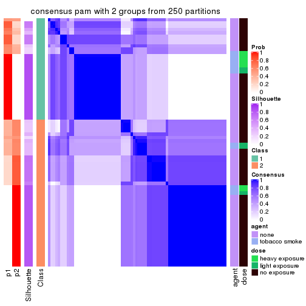</p>

</div>
<div id='tab-MAD-pam-consensus-heatmap-2'>
<pre><code class="r">consensus_heatmap(res, k = 3)
</code></pre>

<p>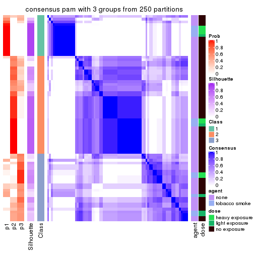</p>

</div>
<div id='tab-MAD-pam-consensus-heatmap-3'>
<pre><code class="r">consensus_heatmap(res, k = 4)
</code></pre>

<p>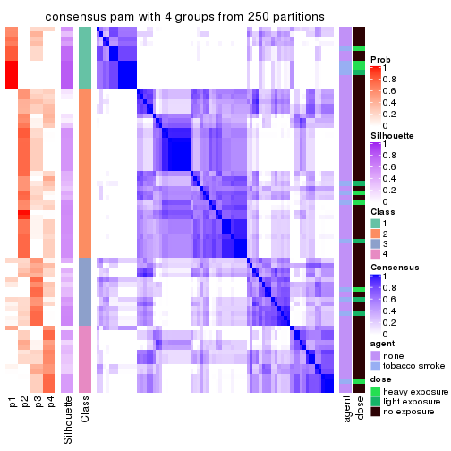</p>

</div>
<div id='tab-MAD-pam-consensus-heatmap-4'>
<pre><code class="r">consensus_heatmap(res, k = 5)
</code></pre>

<p>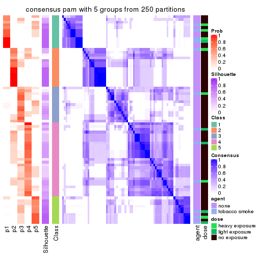</p>

</div>
<div id='tab-MAD-pam-consensus-heatmap-5'>
<pre><code class="r">consensus_heatmap(res, k = 6)
</code></pre>

<p>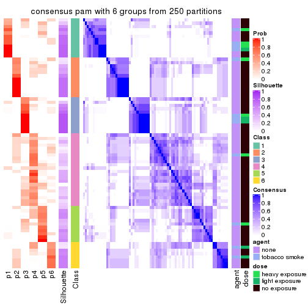</p>

</div>
</div>

Heatmaps for the membership of samples in all partitions to see how consistent they are:


<script>
$( function() {
	$( '#tabs-MAD-pam-membership-heatmap' ).tabs();
} );
</script>
<div id='tabs-MAD-pam-membership-heatmap'>
<ul>
<li><a href='#tab-MAD-pam-membership-heatmap-1'>k = 2</a></li>
<li><a href='#tab-MAD-pam-membership-heatmap-2'>k = 3</a></li>
<li><a href='#tab-MAD-pam-membership-heatmap-3'>k = 4</a></li>
<li><a href='#tab-MAD-pam-membership-heatmap-4'>k = 5</a></li>
<li><a href='#tab-MAD-pam-membership-heatmap-5'>k = 6</a></li>
</ul>
<div id='tab-MAD-pam-membership-heatmap-1'>
<pre><code class="r">membership_heatmap(res, k = 2)
</code></pre>

<p>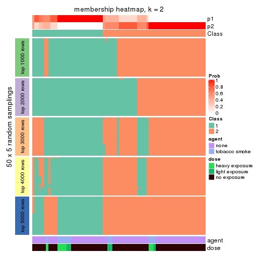</p>

</div>
<div id='tab-MAD-pam-membership-heatmap-2'>
<pre><code class="r">membership_heatmap(res, k = 3)
</code></pre>

<p></p>

</div>
<div id='tab-MAD-pam-membership-heatmap-3'>
<pre><code class="r">membership_heatmap(res, k = 4)
</code></pre>

<p>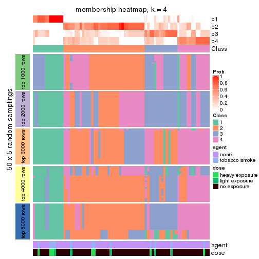</p>

</div>
<div id='tab-MAD-pam-membership-heatmap-4'>
<pre><code class="r">membership_heatmap(res, k = 5)
</code></pre>

<p>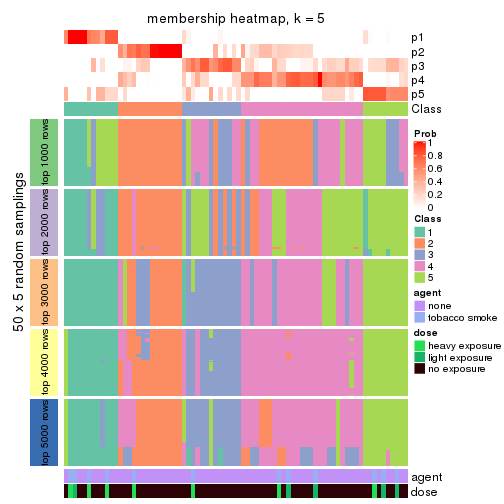</p>

</div>
<div id='tab-MAD-pam-membership-heatmap-5'>
<pre><code class="r">membership_heatmap(res, k = 6)
</code></pre>

<p>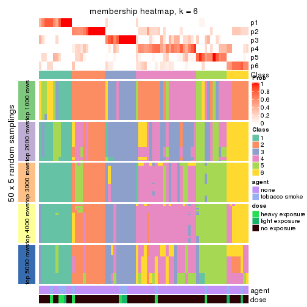</p>

</div>
</div>

As soon as we have had the classes for columns, we can look for signatures
which are significantly different between classes which can be candidate marks
for certain classes. Following are the heatmaps for signatures.


Signature heatmaps where rows are scaled:


<script>
$( function() {
	$( '#tabs-MAD-pam-get-signatures' ).tabs();
} );
</script>
<div id='tabs-MAD-pam-get-signatures'>
<ul>
<li><a href='#tab-MAD-pam-get-signatures-1'>k = 2</a></li>
<li><a href='#tab-MAD-pam-get-signatures-2'>k = 3</a></li>
<li><a href='#tab-MAD-pam-get-signatures-3'>k = 4</a></li>
<li><a href='#tab-MAD-pam-get-signatures-4'>k = 5</a></li>
<li><a href='#tab-MAD-pam-get-signatures-5'>k = 6</a></li>
</ul>
<div id='tab-MAD-pam-get-signatures-1'>
<pre><code class="r">get_signatures(res, k = 2)
</code></pre>

<p>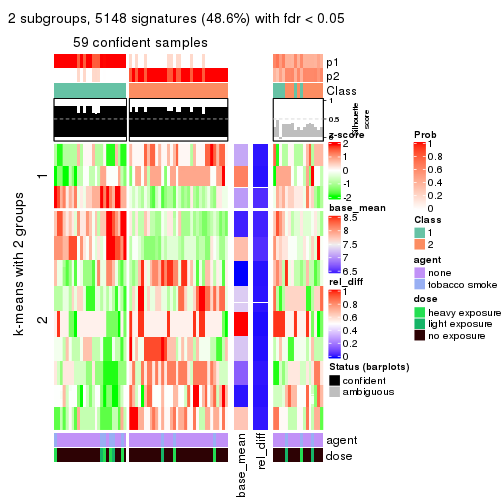</p>

</div>
<div id='tab-MAD-pam-get-signatures-2'>
<pre><code class="r">get_signatures(res, k = 3)
</code></pre>

<p>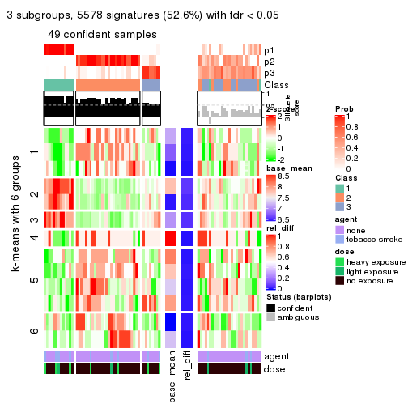</p>

</div>
<div id='tab-MAD-pam-get-signatures-3'>
<pre><code class="r">get_signatures(res, k = 4)
</code></pre>

<p>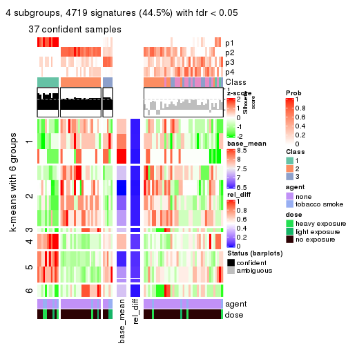</p>

</div>
<div id='tab-MAD-pam-get-signatures-4'>
<pre><code class="r">get_signatures(res, k = 5)
</code></pre>

<p>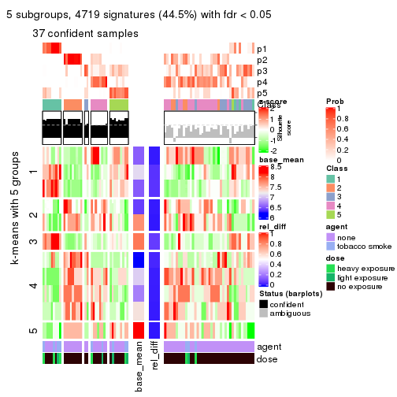</p>

</div>
<div id='tab-MAD-pam-get-signatures-5'>
<pre><code class="r">get_signatures(res, k = 6)
</code></pre>

<p>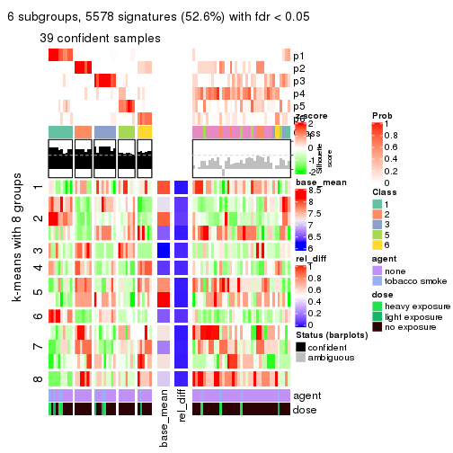</p>

</div>
</div>


Signature heatmaps where rows are not scaled:


<script>
$( function() {
	$( '#tabs-MAD-pam-get-signatures-no-scale' ).tabs();
} );
</script>
<div id='tabs-MAD-pam-get-signatures-no-scale'>
<ul>
<li><a href='#tab-MAD-pam-get-signatures-no-scale-1'>k = 2</a></li>
<li><a href='#tab-MAD-pam-get-signatures-no-scale-2'>k = 3</a></li>
<li><a href='#tab-MAD-pam-get-signatures-no-scale-3'>k = 4</a></li>
<li><a href='#tab-MAD-pam-get-signatures-no-scale-4'>k = 5</a></li>
<li><a href='#tab-MAD-pam-get-signatures-no-scale-5'>k = 6</a></li>
</ul>
<div id='tab-MAD-pam-get-signatures-no-scale-1'>
<pre><code class="r">get_signatures(res, k = 2, scale_rows = FALSE)
</code></pre>

<p>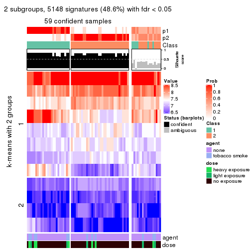</p>

</div>
<div id='tab-MAD-pam-get-signatures-no-scale-2'>
<pre><code class="r">get_signatures(res, k = 3, scale_rows = FALSE)
</code></pre>

<p>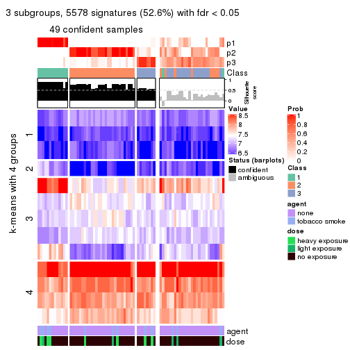</p>

</div>
<div id='tab-MAD-pam-get-signatures-no-scale-3'>
<pre><code class="r">get_signatures(res, k = 4, scale_rows = FALSE)
</code></pre>

<p>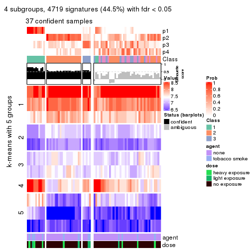</p>

</div>
<div id='tab-MAD-pam-get-signatures-no-scale-4'>
<pre><code class="r">get_signatures(res, k = 5, scale_rows = FALSE)
</code></pre>

<p>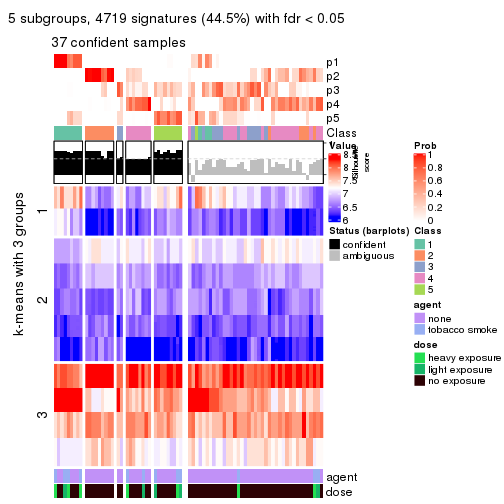</p>

</div>
<div id='tab-MAD-pam-get-signatures-no-scale-5'>
<pre><code class="r">get_signatures(res, k = 6, scale_rows = FALSE)
</code></pre>

<p>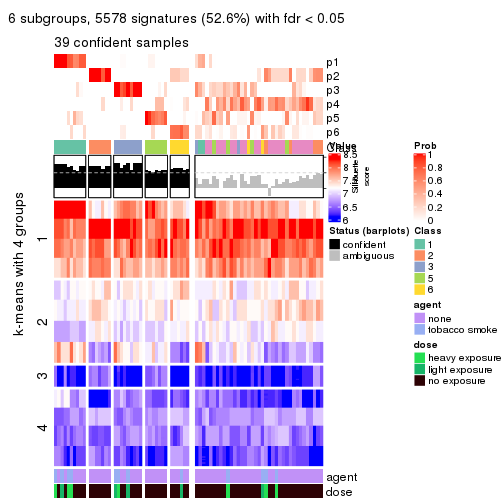</p>

</div>
</div>


Compare the overlap of signatures from different k:

```r
compare_signatures(res)
```

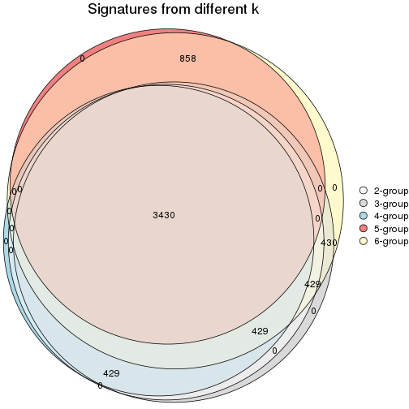

`get_signature()` returns a data frame invisibly. TO get the list of signatures, the function
call should be assigned to a variable explicitly. In following code, if `plot` argument is set
to `FALSE`, no heatmap is plotted while only the differential analysis is performed.

```r
# code only for demonstration
tb = get_signature(res, k = ..., plot = FALSE)
```

An example of the output of `tb` is:

```
#>   which_row         fdr    mean_1    mean_2 scaled_mean_1 scaled_mean_2 km
#> 1        38 0.042760348  8.373488  9.131774    -0.5533452     0.5164555  1
#> 2        40 0.018707592  7.106213  8.469186    -0.6173731     0.5762149  1
#> 3        55 0.019134737 10.221463 11.207825    -0.6159697     0.5749050  1
#> 4        59 0.006059896  5.921854  7.869574    -0.6899429     0.6439467  1
#> 5        60 0.018055526  8.928898 10.211722    -0.6204761     0.5791110  1
#> 6        98 0.009384629 15.714769 14.887706     0.6635654    -0.6193277  2
...
```

The columns in `tb` are:

1. `which_row`: row indices corresponding to the input matrix.
2. `fdr`: FDR for the differential test. 
3. `mean_x`: The mean value in group x.
4. `scaled_mean_x`: The mean value in group x after rows are scaled.
5. `km`: Row groups if k-means clustering is applied to rows.


UMAP plot which shows how samples are separated.


<script>
$( function() {
	$( '#tabs-MAD-pam-dimension-reduction' ).tabs();
} );
</script>
<div id='tabs-MAD-pam-dimension-reduction'>
<ul>
<li><a href='#tab-MAD-pam-dimension-reduction-1'>k = 2</a></li>
<li><a href='#tab-MAD-pam-dimension-reduction-2'>k = 3</a></li>
<li><a href='#tab-MAD-pam-dimension-reduction-3'>k = 4</a></li>
<li><a href='#tab-MAD-pam-dimension-reduction-4'>k = 5</a></li>
<li><a href='#tab-MAD-pam-dimension-reduction-5'>k = 6</a></li>
</ul>
<div id='tab-MAD-pam-dimension-reduction-1'>
<pre><code class="r">dimension_reduction(res, k = 2, method = &quot;UMAP&quot;)
</code></pre>

<p>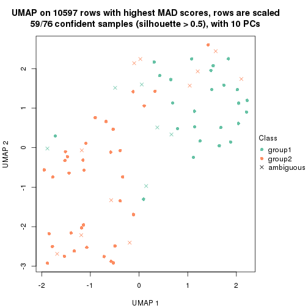</p>

</div>
<div id='tab-MAD-pam-dimension-reduction-2'>
<pre><code class="r">dimension_reduction(res, k = 3, method = &quot;UMAP&quot;)
</code></pre>

<p>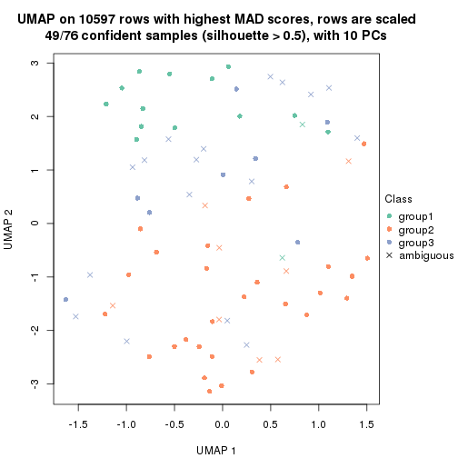</p>

</div>
<div id='tab-MAD-pam-dimension-reduction-3'>
<pre><code class="r">dimension_reduction(res, k = 4, method = &quot;UMAP&quot;)
</code></pre>

<p>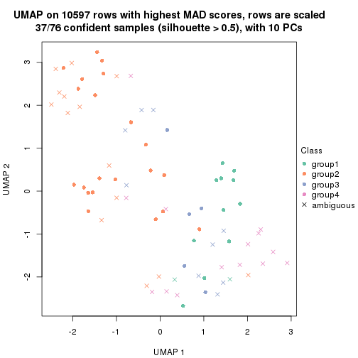</p>

</div>
<div id='tab-MAD-pam-dimension-reduction-4'>
<pre><code class="r">dimension_reduction(res, k = 5, method = &quot;UMAP&quot;)
</code></pre>

<p>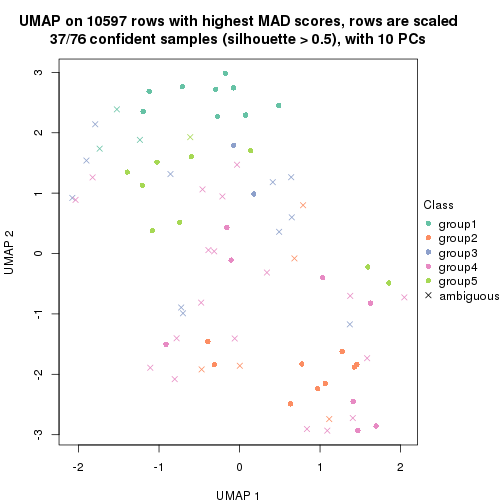</p>

</div>
<div id='tab-MAD-pam-dimension-reduction-5'>
<pre><code class="r">dimension_reduction(res, k = 6, method = &quot;UMAP&quot;)
</code></pre>

<p>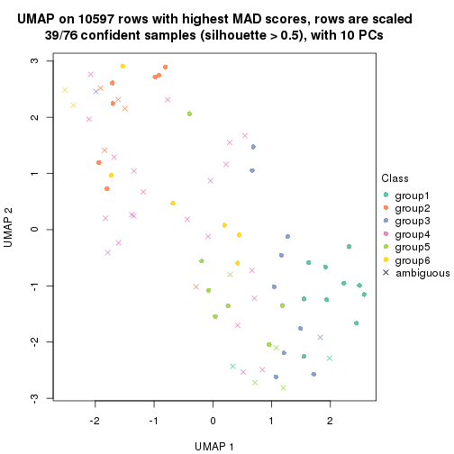</p>

</div>
</div>


Following heatmap shows how subgroups are split when increasing `k`:

```r
collect_classes(res)
```

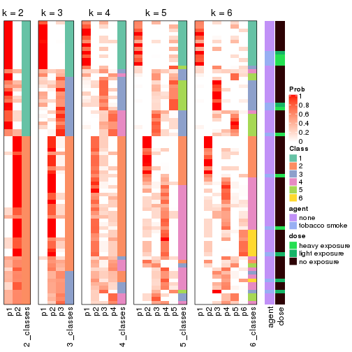


Test correlation between subgroups and known annotations. If the known
annotation is numeric, one-way ANOVA test is applied, and if the known
annotation is discrete, chi-squared contingency table test is applied.

```r
test_to_known_factors(res)
```

```
#>          n agent(p) dose(p) k
#> MAD:pam 59    0.217  0.2771 2
#> MAD:pam 49    0.264  0.4636 3
#> MAD:pam 37    0.121  0.0477 4
#> MAD:pam 37    0.206  0.4452 5
#> MAD:pam 39    0.141  0.2507 6
```


If matrix rows can be associated to genes, consider to use `GO_Enrichment(res,
...)` to perform function enrichment for the signature genes.


 

---------------------------------------------------


### MAD:mclust


The object with results only for a single top-value method and a single partition method 
can be extracted as:

```r
res = res_list["MAD", "mclust"]
# you can also extract it by
# res = res_list["MAD:mclust"]
```

A summary of `res` and all the functions that can be applied to it:

```r
res
```

```
#> A 'ConsensusPartition' object with k = 2, 3, 4, 5, 6.
#>   On a matrix with 10597 rows and 76 columns.
#>   Top rows (1000, 2000, 3000, 4000, 5000) are extracted by 'MAD' method.
#>   Subgroups are detected by 'mclust' method.
#>   Performed in total 1250 partitions by row resampling.
#>   Best k for subgroups seems to be 3.
#> 
#> Following methods can be applied to this 'ConsensusPartition' object:
#>  [1] "cola_report"             "collect_classes"         "collect_plots"          
#>  [4] "collect_stats"           "colnames"                "compare_signatures"     
#>  [7] "consensus_heatmap"       "dimension_reduction"     "functional_enrichment"  
#> [10] "get_anno_col"            "get_anno"                "get_classes"            
#> [13] "get_consensus"           "get_matrix"              "get_membership"         
#> [16] "get_param"               "get_signatures"          "get_stats"              
#> [19] "is_best_k"               "is_stable_k"             "membership_heatmap"     
#> [22] "ncol"                    "nrow"                    "plot_ecdf"              
#> [25] "rownames"                "select_partition_number" "show"                   
#> [28] "suggest_best_k"          "test_to_known_factors"
```

`collect_plots()` function collects all the plots made from `res` for all `k` (number of partitions)
into one single page to provide an easy and fast comparison between different `k`.

```r
collect_plots(res)
```

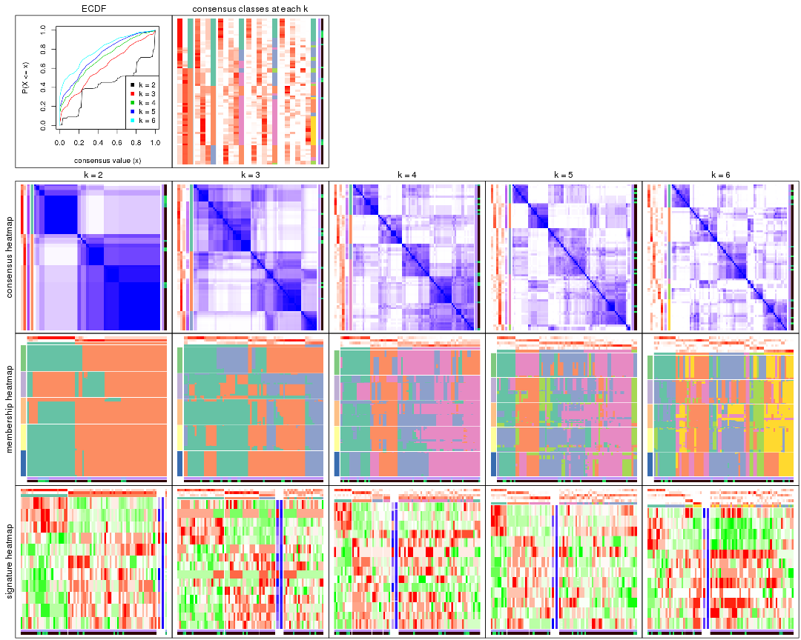

The plots are:

- The first row: a plot of the ECDF (Empirical cumulative distribution
  function) curves of the consensus matrix for each `k` and the heatmap of
  predicted classes for each `k`.
- The second row: heatmaps of the consensus matrix for each `k`.
- The third row: heatmaps of the membership matrix for each `k`.
- The fouth row: heatmaps of the signatures for each `k`.

All the plots in panels can be made by individual functions and they are
plotted later in this section.

`select_partition_number()` produces several plots showing different
statistics for choosing "optimized" `k`. There are following statistics:

- ECDF curves of the consensus matrix for each `k`;
- 1-PAC. [The PAC
  score](https://en.wikipedia.org/wiki/Consensus_clustering#Over-interpretation_potential_of_consensus_clustering)
  measures the proportion of the ambiguous subgrouping.
- Mean silhouette score.
- Concordance. The mean probability of fiting the consensus class ids in all
  partitions.
- Area increased. Denote $A_k$ as the area under the ECDF curve for current
  `k`, the area increased is defined as $A_k - A_{k-1}$.
- Rand index. The percent of pairs of samples that are both in a same cluster
  or both are not in a same cluster in the partition of k and k-1.
- Jaccard index. The ratio of pairs of samples are both in a same cluster in
  the partition of k and k-1 and the pairs of samples are both in a same
  cluster in the partition k or k-1.

The detailed explanations of these statistics can be found in [the cola
vignette](http://bioconductor.org/packages/devel/bioc/vignettes/cola/inst/doc/cola.html#toc_13).

Generally speaking, lower PAC score, higher mean silhouette score or higher
concordance corresponds to better partition. Rand index and Jaccard index
measure how similar the current partition is compared to partition with `k-1`.
If they are too similar, we won't accept `k` is better than `k-1`.

```r
select_partition_number(res)
```

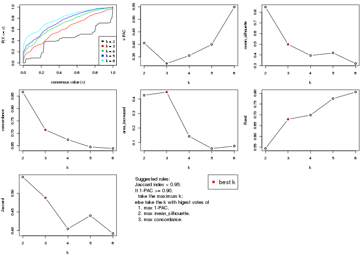

The numeric values for all these statistics can be obtained by `get_stats()`.

```r
get_stats(res)
```

```
#>   k 1-PAC mean_silhouette concordance area_increased  Rand Jaccard
#> 2 2 0.405           0.848       0.866         0.4259 0.544   0.544
#> 3 3 0.324           0.499       0.714         0.4477 0.680   0.488
#> 4 4 0.355           0.395       0.674         0.1427 0.699   0.405
#> 5 5 0.399           0.419       0.645         0.0588 0.775   0.440
#> 6 6 0.549           0.320       0.639         0.0758 0.806   0.392
```

`suggest_best_k()` suggests the best $k$ based on these statistics. The rules are as follows:

- All $k$ with Jaccard index larger than 0.95 are removed because the increase of
  the partition number does not provides enough extra information. If all $k$ are removed,
  the best $k$ is assigned by `NA`.
- For $k$ with 1-PAC larger than 0.9, the maximal $k$ is taken as the "best k". Other $k$ is called "optional k".
- If it does not fit the second rule. The $k$ with the highest vote of highest
  1-PAC, mean silhouette and concordance is taken as the "best k".

```r
suggest_best_k(res)
```

```
#> [1] 3
```


Following shows the table of the partitions (You need to click the **show/hide
code output** link to see it). The membership matrix (columns with name `p*`)
is inferred by
[`clue::cl_consensus()`](https://www.rdocumentation.org/link/cl_consensus?package=clue)
function with the `SE` method. Basically the value in the membership matrix
represents the probability to belong to a certain group. The finall class
label for an item is determined with the group with highest probability it
belongs to.

In `get_classes()` function, the entropy is calculated from the membership
matrix and the silhouette score is calculated from the consensus matrix.


<script>
$( function() {
	$( '#tabs-MAD-mclust-get-classes' ).tabs();
} );
</script>
<div id='tabs-MAD-mclust-get-classes'>
<ul>
<li><a href='#tab-MAD-mclust-get-classes-1'>k = 2</a></li>
<li><a href='#tab-MAD-mclust-get-classes-2'>k = 3</a></li>
<li><a href='#tab-MAD-mclust-get-classes-3'>k = 4</a></li>
<li><a href='#tab-MAD-mclust-get-classes-4'>k = 5</a></li>
<li><a href='#tab-MAD-mclust-get-classes-5'>k = 6</a></li>
</ul>

<div id='tab-MAD-mclust-get-classes-1'>
<p><a id='tab-MAD-mclust-get-classes-1-a' style='color:#0366d6' href='#'>show/hide code output</a></p>
<pre><code class="r">cbind(get_classes(res, k = 2), get_membership(res, k = 2))
</code></pre>

<pre><code>#&gt;           class entropy silhouette    p1    p2
#&gt; GSM451162     1  0.6887      0.712 0.816 0.184
#&gt; GSM451163     2  0.7453      0.885 0.212 0.788
#&gt; GSM451164     2  0.7453      0.885 0.212 0.788
#&gt; GSM451165     2  0.7528      0.896 0.216 0.784
#&gt; GSM451167     2  0.7528      0.896 0.216 0.784
#&gt; GSM451168     2  0.7528      0.896 0.216 0.784
#&gt; GSM451169     2  0.7528      0.896 0.216 0.784
#&gt; GSM451170     1  0.0938      0.932 0.988 0.012
#&gt; GSM451171     2  0.7453      0.885 0.212 0.788
#&gt; GSM451172     2  0.7528      0.896 0.216 0.784
#&gt; GSM451173     1  0.9608      0.607 0.616 0.384
#&gt; GSM451174     2  0.3431      0.809 0.064 0.936
#&gt; GSM451175     1  0.6887      0.712 0.816 0.184
#&gt; GSM451177     2  0.7528      0.896 0.216 0.784
#&gt; GSM451178     2  0.7528      0.896 0.216 0.784
#&gt; GSM451179     2  0.7528      0.517 0.216 0.784
#&gt; GSM451180     2  0.7453      0.885 0.212 0.788
#&gt; GSM451181     2  0.1184      0.775 0.016 0.984
#&gt; GSM451182     1  0.0938      0.932 0.988 0.012
#&gt; GSM451183     1  0.0938      0.932 0.988 0.012
#&gt; GSM451184     1  0.0938      0.932 0.988 0.012
#&gt; GSM451185     1  0.0938      0.932 0.988 0.012
#&gt; GSM451186     2  0.7528      0.533 0.216 0.784
#&gt; GSM451187     2  0.7453      0.885 0.212 0.788
#&gt; GSM451188     2  0.7528      0.896 0.216 0.784
#&gt; GSM451189     1  0.0938      0.932 0.988 0.012
#&gt; GSM451190     1  0.0938      0.932 0.988 0.012
#&gt; GSM451191     1  0.0938      0.932 0.988 0.012
#&gt; GSM451193     2  0.1184      0.775 0.016 0.984
#&gt; GSM451195     1  0.7453      0.724 0.788 0.212
#&gt; GSM451196     1  0.0938      0.932 0.988 0.012
#&gt; GSM451197     1  0.0938      0.932 0.988 0.012
#&gt; GSM451199     1  0.0938      0.932 0.988 0.012
#&gt; GSM451201     1  0.0938      0.932 0.988 0.012
#&gt; GSM451202     2  0.7528      0.896 0.216 0.784
#&gt; GSM451203     2  0.3431      0.809 0.064 0.936
#&gt; GSM451204     2  0.1184      0.775 0.016 0.984
#&gt; GSM451205     2  0.7453      0.885 0.212 0.788
#&gt; GSM451206     2  0.7528      0.896 0.216 0.784
#&gt; GSM451207     2  0.1184      0.775 0.016 0.984
#&gt; GSM451208     2  0.7219      0.891 0.200 0.800
#&gt; GSM451209     2  0.1184      0.775 0.016 0.984
#&gt; GSM451210     2  0.7528      0.896 0.216 0.784
#&gt; GSM451212     2  0.7528      0.896 0.216 0.784
#&gt; GSM451213     2  0.7528      0.896 0.216 0.784
#&gt; GSM451214     2  0.7528      0.896 0.216 0.784
#&gt; GSM451215     2  0.7453      0.885 0.212 0.788
#&gt; GSM451216     2  0.7528      0.896 0.216 0.784
#&gt; GSM451217     2  0.7376      0.887 0.208 0.792
#&gt; GSM451219     1  0.0938      0.932 0.988 0.012
#&gt; GSM451220     1  0.9608      0.607 0.616 0.384
#&gt; GSM451221     1  0.0938      0.932 0.988 0.012
#&gt; GSM451222     1  0.6887      0.712 0.816 0.184
#&gt; GSM451224     2  0.7528      0.896 0.216 0.784
#&gt; GSM451225     2  0.9795      0.597 0.416 0.584
#&gt; GSM451226     2  0.7528      0.896 0.216 0.784
#&gt; GSM451227     2  0.7528      0.896 0.216 0.784
#&gt; GSM451228     2  0.7528      0.896 0.216 0.784
#&gt; GSM451230     2  0.9795      0.597 0.416 0.584
#&gt; GSM451231     2  0.7528      0.896 0.216 0.784
#&gt; GSM451233     2  0.1184      0.775 0.016 0.984
#&gt; GSM451234     2  0.1184      0.775 0.016 0.984
#&gt; GSM451235     2  0.7528      0.896 0.216 0.784
#&gt; GSM451236     2  0.7528      0.896 0.216 0.784
#&gt; GSM451166     2  0.7528      0.896 0.216 0.784
#&gt; GSM451194     2  0.8016      0.485 0.244 0.756
#&gt; GSM451198     1  0.0938      0.932 0.988 0.012
#&gt; GSM451218     2  0.7528      0.896 0.216 0.784
#&gt; GSM451232     1  0.0938      0.932 0.988 0.012
#&gt; GSM451176     1  0.0938      0.932 0.988 0.012
#&gt; GSM451192     1  0.0938      0.932 0.988 0.012
#&gt; GSM451200     1  0.0938      0.932 0.988 0.012
#&gt; GSM451211     2  0.7528      0.896 0.216 0.784
#&gt; GSM451223     2  0.1184      0.775 0.016 0.984
#&gt; GSM451229     1  0.0938      0.932 0.988 0.012
#&gt; GSM451237     2  0.1184      0.775 0.016 0.984
</code></pre>

<script>
$('#tab-MAD-mclust-get-classes-1-a').parent().next().next().hide();
$('#tab-MAD-mclust-get-classes-1-a').click(function(){
  $('#tab-MAD-mclust-get-classes-1-a').parent().next().next().toggle();
  return(false);
});
</script>
</div>

<div id='tab-MAD-mclust-get-classes-2'>
<p><a id='tab-MAD-mclust-get-classes-2-a' style='color:#0366d6' href='#'>show/hide code output</a></p>
<pre><code class="r">cbind(get_classes(res, k = 3), get_membership(res, k = 3))
</code></pre>

<pre><code>#&gt;           class entropy silhouette    p1    p2    p3
#&gt; GSM451162     1  0.3765     0.6309 0.888 0.084 0.028
#&gt; GSM451163     2  0.7184    -0.3392 0.024 0.504 0.472
#&gt; GSM451164     2  0.7671    -0.3527 0.044 0.492 0.464
#&gt; GSM451165     2  0.9506    -0.0214 0.240 0.492 0.268
#&gt; GSM451167     2  0.5431     0.5467 0.284 0.716 0.000
#&gt; GSM451168     2  0.6266     0.5440 0.156 0.768 0.076
#&gt; GSM451169     1  0.6154     0.0342 0.592 0.408 0.000
#&gt; GSM451170     1  0.7136     0.6751 0.704 0.084 0.212
#&gt; GSM451171     3  0.5864     0.8453 0.008 0.288 0.704
#&gt; GSM451172     2  0.6911     0.4539 0.092 0.728 0.180
#&gt; GSM451173     1  0.3686     0.6257 0.860 0.140 0.000
#&gt; GSM451174     2  0.0000     0.6530 0.000 1.000 0.000
#&gt; GSM451175     1  0.3539     0.6143 0.888 0.100 0.012
#&gt; GSM451177     3  0.6062     0.8481 0.016 0.276 0.708
#&gt; GSM451178     2  0.0424     0.6542 0.008 0.992 0.000
#&gt; GSM451179     2  0.6309     0.0907 0.496 0.504 0.000
#&gt; GSM451180     3  0.5831     0.8471 0.008 0.284 0.708
#&gt; GSM451181     2  0.2959     0.6346 0.100 0.900 0.000
#&gt; GSM451182     1  0.5363     0.6681 0.724 0.000 0.276
#&gt; GSM451183     1  0.7801     0.6518 0.636 0.088 0.276
#&gt; GSM451184     1  0.1163     0.6544 0.972 0.028 0.000
#&gt; GSM451185     1  0.5363     0.6681 0.724 0.000 0.276
#&gt; GSM451186     2  0.9167     0.0544 0.320 0.512 0.168
#&gt; GSM451187     2  0.6672    -0.3394 0.008 0.520 0.472
#&gt; GSM451188     3  0.9559     0.5603 0.252 0.264 0.484
#&gt; GSM451189     1  0.7576     0.6574 0.648 0.076 0.276
#&gt; GSM451190     1  0.4291     0.6904 0.820 0.000 0.180
#&gt; GSM451191     1  0.4555     0.6873 0.800 0.000 0.200
#&gt; GSM451193     1  0.6180     0.0287 0.584 0.416 0.000
#&gt; GSM451195     1  0.3412     0.6367 0.876 0.124 0.000
#&gt; GSM451196     1  0.7576     0.6574 0.648 0.076 0.276
#&gt; GSM451197     1  0.5363     0.6681 0.724 0.000 0.276
#&gt; GSM451199     1  0.0000     0.6630 1.000 0.000 0.000
#&gt; GSM451201     1  0.5363     0.6681 0.724 0.000 0.276
#&gt; GSM451202     3  0.7146     0.8255 0.060 0.264 0.676
#&gt; GSM451203     1  0.6180     0.0287 0.584 0.416 0.000
#&gt; GSM451204     2  0.2625     0.6438 0.084 0.916 0.000
#&gt; GSM451205     3  0.5763     0.8447 0.008 0.276 0.716
#&gt; GSM451206     2  0.0424     0.6542 0.008 0.992 0.000
#&gt; GSM451207     2  0.0592     0.6550 0.012 0.988 0.000
#&gt; GSM451208     3  0.5896     0.8422 0.008 0.292 0.700
#&gt; GSM451209     2  0.5560     0.4883 0.300 0.700 0.000
#&gt; GSM451210     3  0.8311     0.7451 0.112 0.292 0.596
#&gt; GSM451212     2  0.0424     0.6542 0.008 0.992 0.000
#&gt; GSM451213     2  0.0424     0.6522 0.000 0.992 0.008
#&gt; GSM451214     1  0.9369     0.0485 0.508 0.212 0.280
#&gt; GSM451215     3  0.5797     0.8469 0.008 0.280 0.712
#&gt; GSM451216     2  0.0424     0.6522 0.000 0.992 0.008
#&gt; GSM451217     2  0.6816    -0.3451 0.012 0.516 0.472
#&gt; GSM451219     1  0.4121     0.6911 0.832 0.000 0.168
#&gt; GSM451220     1  0.3879     0.6162 0.848 0.152 0.000
#&gt; GSM451221     1  0.1163     0.6544 0.972 0.028 0.000
#&gt; GSM451222     1  0.7216     0.6708 0.712 0.112 0.176
#&gt; GSM451224     3  0.9471     0.4867 0.308 0.208 0.484
#&gt; GSM451225     2  0.9229     0.0222 0.336 0.496 0.168
#&gt; GSM451226     1  0.5285     0.3887 0.752 0.244 0.004
#&gt; GSM451227     1  0.9292     0.0677 0.516 0.200 0.284
#&gt; GSM451228     2  0.5058     0.5674 0.244 0.756 0.000
#&gt; GSM451230     2  0.6026     0.4260 0.376 0.624 0.000
#&gt; GSM451231     1  0.6154     0.0342 0.592 0.408 0.000
#&gt; GSM451233     2  0.5327     0.5103 0.272 0.728 0.000
#&gt; GSM451234     2  0.0592     0.6566 0.012 0.988 0.000
#&gt; GSM451235     2  0.0829     0.6537 0.012 0.984 0.004
#&gt; GSM451236     2  0.1031     0.6419 0.000 0.976 0.024
#&gt; GSM451166     2  0.5678     0.4932 0.316 0.684 0.000
#&gt; GSM451194     1  0.6168     0.0399 0.588 0.412 0.000
#&gt; GSM451198     1  0.7267     0.6711 0.708 0.112 0.180
#&gt; GSM451218     2  0.0424     0.6522 0.000 0.992 0.008
#&gt; GSM451232     1  0.7576     0.6574 0.648 0.076 0.276
#&gt; GSM451176     1  0.7801     0.6518 0.636 0.088 0.276
#&gt; GSM451192     1  0.5363     0.6681 0.724 0.000 0.276
#&gt; GSM451200     1  0.0424     0.6613 0.992 0.008 0.000
#&gt; GSM451211     2  0.3682     0.5331 0.008 0.876 0.116
#&gt; GSM451223     1  0.6180     0.0287 0.584 0.416 0.000
#&gt; GSM451229     1  0.5363     0.6681 0.724 0.000 0.276
#&gt; GSM451237     2  0.2711     0.6404 0.088 0.912 0.000
</code></pre>

<script>
$('#tab-MAD-mclust-get-classes-2-a').parent().next().next().hide();
$('#tab-MAD-mclust-get-classes-2-a').click(function(){
  $('#tab-MAD-mclust-get-classes-2-a').parent().next().next().toggle();
  return(false);
});
</script>
</div>

<div id='tab-MAD-mclust-get-classes-3'>
<p><a id='tab-MAD-mclust-get-classes-3-a' style='color:#0366d6' href='#'>show/hide code output</a></p>
<pre><code class="r">cbind(get_classes(res, k = 4), get_membership(res, k = 4))
</code></pre>

<pre><code>#&gt;           class entropy silhouette    p1    p2    p3    p4
#&gt; GSM451162     4  0.6798     -0.533 0.172 0.000 0.224 0.604
#&gt; GSM451163     2  0.7392      0.479 0.004 0.464 0.144 0.388
#&gt; GSM451164     2  0.7431      0.495 0.008 0.504 0.144 0.344
#&gt; GSM451165     2  0.7982      0.338 0.040 0.504 0.132 0.324
#&gt; GSM451167     4  0.2976      0.480 0.008 0.000 0.120 0.872
#&gt; GSM451168     4  0.5693      0.201 0.004 0.316 0.036 0.644
#&gt; GSM451169     4  0.2844      0.308 0.048 0.000 0.052 0.900
#&gt; GSM451170     1  0.5220      0.437 0.568 0.000 0.424 0.008
#&gt; GSM451171     2  0.4541      0.696 0.000 0.796 0.144 0.060
#&gt; GSM451172     4  0.7378      0.208 0.032 0.216 0.144 0.608
#&gt; GSM451173     3  0.7587      0.471 0.196 0.000 0.412 0.392
#&gt; GSM451174     4  0.7249      0.458 0.000 0.200 0.260 0.540
#&gt; GSM451175     4  0.6344     -0.377 0.128 0.000 0.224 0.648
#&gt; GSM451177     2  0.1661      0.717 0.004 0.944 0.000 0.052
#&gt; GSM451178     4  0.7269      0.458 0.000 0.200 0.264 0.536
#&gt; GSM451179     4  0.6788     -0.381 0.096 0.000 0.424 0.480
#&gt; GSM451180     2  0.4387      0.693 0.000 0.804 0.144 0.052
#&gt; GSM451181     4  0.5420      0.468 0.024 0.000 0.352 0.624
#&gt; GSM451182     1  0.4690      0.434 0.712 0.000 0.276 0.012
#&gt; GSM451183     1  0.3024      0.694 0.852 0.000 0.148 0.000
#&gt; GSM451184     3  0.9138      0.691 0.124 0.144 0.416 0.316
#&gt; GSM451185     1  0.0188      0.680 0.996 0.000 0.000 0.004
#&gt; GSM451186     4  0.7085      0.396 0.200 0.000 0.232 0.568
#&gt; GSM451187     2  0.6715      0.577 0.000 0.604 0.144 0.252
#&gt; GSM451188     2  0.5470      0.579 0.040 0.776 0.068 0.116
#&gt; GSM451189     1  0.3208      0.694 0.848 0.000 0.148 0.004
#&gt; GSM451190     1  0.4889      0.331 0.636 0.000 0.360 0.004
#&gt; GSM451191     1  0.5229      0.181 0.564 0.000 0.428 0.008
#&gt; GSM451193     4  0.4927     -0.211 0.024 0.000 0.264 0.712
#&gt; GSM451195     3  0.7795      0.476 0.268 0.000 0.420 0.312
#&gt; GSM451196     1  0.2921      0.697 0.860 0.000 0.140 0.000
#&gt; GSM451197     1  0.3528      0.564 0.808 0.000 0.192 0.000
#&gt; GSM451199     3  0.7773      0.666 0.264 0.000 0.428 0.308
#&gt; GSM451201     1  0.0000      0.679 1.000 0.000 0.000 0.000
#&gt; GSM451202     2  0.0779      0.701 0.016 0.980 0.000 0.004
#&gt; GSM451203     4  0.2919      0.305 0.044 0.000 0.060 0.896
#&gt; GSM451204     4  0.6156      0.493 0.008 0.032 0.480 0.480
#&gt; GSM451205     2  0.4387      0.693 0.000 0.804 0.144 0.052
#&gt; GSM451206     4  0.7277      0.454 0.000 0.204 0.260 0.536
#&gt; GSM451207     4  0.4977      0.449 0.000 0.000 0.460 0.540
#&gt; GSM451208     2  0.1474      0.716 0.000 0.948 0.000 0.052
#&gt; GSM451209     4  0.4500      0.501 0.000 0.000 0.316 0.684
#&gt; GSM451210     2  0.6252      0.537 0.028 0.672 0.052 0.248
#&gt; GSM451212     4  0.4164      0.529 0.000 0.000 0.264 0.736
#&gt; GSM451213     4  0.7039      0.471 0.000 0.144 0.316 0.540
#&gt; GSM451214     3  0.8805      0.590 0.044 0.260 0.372 0.324
#&gt; GSM451215     2  0.1474      0.716 0.000 0.948 0.000 0.052
#&gt; GSM451216     4  0.7039      0.471 0.000 0.144 0.316 0.540
#&gt; GSM451217     2  0.5168      0.328 0.004 0.500 0.000 0.496
#&gt; GSM451219     3  0.7773      0.513 0.264 0.000 0.428 0.308
#&gt; GSM451220     4  0.6990     -0.387 0.116 0.000 0.408 0.476
#&gt; GSM451221     3  0.7768      0.669 0.260 0.000 0.428 0.312
#&gt; GSM451222     1  0.6936      0.208 0.568 0.000 0.148 0.284
#&gt; GSM451224     2  0.6452      0.532 0.040 0.708 0.136 0.116
#&gt; GSM451225     4  0.6646      0.414 0.156 0.000 0.224 0.620
#&gt; GSM451226     4  0.7008     -0.669 0.100 0.004 0.436 0.460
#&gt; GSM451227     3  0.8650      0.644 0.052 0.196 0.436 0.316
#&gt; GSM451228     4  0.4502      0.520 0.016 0.000 0.236 0.748
#&gt; GSM451230     4  0.3545      0.448 0.008 0.000 0.164 0.828
#&gt; GSM451231     4  0.2722      0.322 0.032 0.000 0.064 0.904
#&gt; GSM451233     4  0.4382      0.392 0.000 0.000 0.296 0.704
#&gt; GSM451234     4  0.7439      0.462 0.004 0.200 0.264 0.532
#&gt; GSM451235     4  0.7478      0.421 0.000 0.240 0.256 0.504
#&gt; GSM451236     4  0.7628      0.381 0.000 0.268 0.260 0.472
#&gt; GSM451166     4  0.5041      0.508 0.040 0.000 0.232 0.728
#&gt; GSM451194     4  0.6164     -0.389 0.092 0.000 0.264 0.644
#&gt; GSM451198     1  0.5256      0.478 0.596 0.000 0.392 0.012
#&gt; GSM451218     4  0.7249      0.458 0.000 0.200 0.260 0.540
#&gt; GSM451232     1  0.2921      0.697 0.860 0.000 0.140 0.000
#&gt; GSM451176     1  0.3249      0.696 0.852 0.000 0.140 0.008
#&gt; GSM451192     1  0.1940      0.657 0.924 0.000 0.000 0.076
#&gt; GSM451200     4  0.7707     -0.647 0.272 0.000 0.276 0.452
#&gt; GSM451211     4  0.6909      0.239 0.000 0.364 0.116 0.520
#&gt; GSM451223     4  0.6347     -0.434 0.100 0.000 0.276 0.624
#&gt; GSM451229     1  0.0000      0.679 1.000 0.000 0.000 0.000
#&gt; GSM451237     4  0.7423      0.479 0.000 0.204 0.292 0.504
</code></pre>

<script>
$('#tab-MAD-mclust-get-classes-3-a').parent().next().next().hide();
$('#tab-MAD-mclust-get-classes-3-a').click(function(){
  $('#tab-MAD-mclust-get-classes-3-a').parent().next().next().toggle();
  return(false);
});
</script>
</div>

<div id='tab-MAD-mclust-get-classes-4'>
<p><a id='tab-MAD-mclust-get-classes-4-a' style='color:#0366d6' href='#'>show/hide code output</a></p>
<pre><code class="r">cbind(get_classes(res, k = 5), get_membership(res, k = 5))
</code></pre>

<pre><code>#&gt;           class entropy silhouette    p1    p2    p3    p4    p5
#&gt; GSM451162     3  0.6133   0.483788 0.200 0.028 0.656 0.104 0.012
#&gt; GSM451163     2  0.5762   0.642120 0.000 0.544 0.028 0.388 0.040
#&gt; GSM451164     2  0.6300   0.621205 0.000 0.508 0.036 0.388 0.068
#&gt; GSM451165     4  0.7497  -0.387114 0.000 0.228 0.044 0.400 0.328
#&gt; GSM451167     4  0.5260   0.323411 0.064 0.000 0.332 0.604 0.000
#&gt; GSM451168     4  0.7153   0.262289 0.032 0.076 0.076 0.588 0.228
#&gt; GSM451169     3  0.6252   0.166319 0.064 0.020 0.544 0.360 0.012
#&gt; GSM451170     3  0.4088  -0.163134 0.368 0.000 0.632 0.000 0.000
#&gt; GSM451171     2  0.3003   0.792859 0.000 0.812 0.000 0.188 0.000
#&gt; GSM451172     4  0.5979  -0.099973 0.000 0.312 0.060 0.592 0.036
#&gt; GSM451173     3  0.5693   0.498194 0.016 0.000 0.664 0.196 0.124
#&gt; GSM451174     4  0.0794   0.579193 0.000 0.000 0.028 0.972 0.000
#&gt; GSM451175     3  0.7490   0.357178 0.124 0.000 0.500 0.116 0.260
#&gt; GSM451177     2  0.3586   0.788422 0.000 0.792 0.000 0.188 0.020
#&gt; GSM451178     4  0.0880   0.575185 0.000 0.000 0.000 0.968 0.032
#&gt; GSM451179     3  0.3048   0.496830 0.004 0.000 0.820 0.176 0.000
#&gt; GSM451180     2  0.3003   0.792859 0.000 0.812 0.000 0.188 0.000
#&gt; GSM451181     4  0.6321   0.456783 0.032 0.180 0.152 0.632 0.004
#&gt; GSM451182     3  0.4841  -0.268951 0.416 0.000 0.560 0.000 0.024
#&gt; GSM451183     1  0.5149   0.774938 0.680 0.000 0.216 0.104 0.000
#&gt; GSM451184     3  0.5008  -0.131429 0.004 0.024 0.544 0.000 0.428
#&gt; GSM451185     1  0.3999   0.775379 0.740 0.000 0.240 0.000 0.020
#&gt; GSM451186     4  0.9203   0.231193 0.152 0.188 0.244 0.356 0.060
#&gt; GSM451187     2  0.4161   0.662930 0.000 0.608 0.000 0.392 0.000
#&gt; GSM451188     2  0.6948   0.383371 0.000 0.432 0.016 0.200 0.352
#&gt; GSM451189     1  0.4367   0.700598 0.620 0.000 0.372 0.008 0.000
#&gt; GSM451190     3  0.6374   0.185813 0.280 0.000 0.512 0.000 0.208
#&gt; GSM451191     3  0.6685   0.000674 0.244 0.000 0.416 0.000 0.340
#&gt; GSM451193     3  0.6199   0.286623 0.140 0.000 0.652 0.156 0.052
#&gt; GSM451195     3  0.4315   0.510462 0.020 0.000 0.796 0.072 0.112
#&gt; GSM451196     1  0.4528   0.768748 0.752 0.000 0.144 0.104 0.000
#&gt; GSM451197     1  0.4794   0.422528 0.624 0.000 0.344 0.000 0.032
#&gt; GSM451199     3  0.5182   0.220103 0.044 0.000 0.544 0.000 0.412
#&gt; GSM451201     1  0.2690   0.791558 0.844 0.000 0.156 0.000 0.000
#&gt; GSM451202     2  0.4670   0.759860 0.000 0.724 0.000 0.200 0.076
#&gt; GSM451203     3  0.3638   0.482310 0.008 0.016 0.828 0.136 0.012
#&gt; GSM451204     4  0.4054   0.537781 0.000 0.036 0.204 0.760 0.000
#&gt; GSM451205     2  0.3003   0.792859 0.000 0.812 0.000 0.188 0.000
#&gt; GSM451206     4  0.1670   0.533249 0.000 0.052 0.000 0.936 0.012
#&gt; GSM451207     4  0.4406   0.572880 0.000 0.036 0.036 0.784 0.144
#&gt; GSM451208     2  0.3305   0.776704 0.000 0.776 0.000 0.224 0.000
#&gt; GSM451209     4  0.4649   0.327090 0.016 0.000 0.404 0.580 0.000
#&gt; GSM451210     2  0.7285   0.552362 0.000 0.476 0.044 0.212 0.268
#&gt; GSM451212     4  0.3607   0.566763 0.000 0.028 0.008 0.820 0.144
#&gt; GSM451213     4  0.3241   0.565242 0.000 0.024 0.000 0.832 0.144
#&gt; GSM451214     5  0.5294   0.479238 0.000 0.056 0.380 0.000 0.564
#&gt; GSM451215     2  0.3391   0.790364 0.000 0.800 0.000 0.188 0.012
#&gt; GSM451216     4  0.3241   0.565242 0.000 0.024 0.000 0.832 0.144
#&gt; GSM451217     2  0.5776   0.634599 0.000 0.540 0.032 0.392 0.036
#&gt; GSM451219     3  0.6132   0.308260 0.212 0.000 0.564 0.000 0.224
#&gt; GSM451220     3  0.5094   0.498864 0.008 0.000 0.692 0.228 0.072
#&gt; GSM451221     3  0.4935   0.118522 0.040 0.000 0.616 0.000 0.344
#&gt; GSM451222     4  0.8244  -0.363256 0.260 0.000 0.308 0.316 0.116
#&gt; GSM451224     5  0.6758  -0.189292 0.000 0.256 0.020 0.200 0.524
#&gt; GSM451225     4  0.7702  -0.115711 0.228 0.000 0.332 0.380 0.060
#&gt; GSM451226     3  0.5182  -0.140984 0.000 0.044 0.544 0.000 0.412
#&gt; GSM451227     5  0.5246   0.470884 0.000 0.052 0.384 0.000 0.564
#&gt; GSM451228     4  0.4040   0.393691 0.016 0.000 0.260 0.724 0.000
#&gt; GSM451230     4  0.8274   0.214656 0.072 0.024 0.232 0.416 0.256
#&gt; GSM451231     3  0.6748   0.187313 0.104 0.000 0.536 0.308 0.052
#&gt; GSM451233     4  0.8212   0.402576 0.140 0.036 0.244 0.480 0.100
#&gt; GSM451234     4  0.1725   0.581467 0.000 0.000 0.044 0.936 0.020
#&gt; GSM451235     4  0.0880   0.564813 0.000 0.032 0.000 0.968 0.000
#&gt; GSM451236     4  0.4240   0.436268 0.000 0.228 0.000 0.736 0.036
#&gt; GSM451166     3  0.8116   0.114284 0.080 0.024 0.380 0.372 0.144
#&gt; GSM451194     3  0.2928   0.497414 0.064 0.000 0.872 0.064 0.000
#&gt; GSM451198     3  0.7812   0.141578 0.256 0.000 0.452 0.104 0.188
#&gt; GSM451218     4  0.3241   0.565242 0.000 0.024 0.000 0.832 0.144
#&gt; GSM451232     1  0.4855   0.776084 0.720 0.000 0.168 0.112 0.000
#&gt; GSM451176     1  0.5716   0.750575 0.624 0.000 0.264 0.104 0.008
#&gt; GSM451192     1  0.3395   0.785280 0.764 0.000 0.236 0.000 0.000
#&gt; GSM451200     3  0.5240   0.402915 0.216 0.000 0.672 0.000 0.112
#&gt; GSM451211     4  0.3774   0.178601 0.000 0.296 0.000 0.704 0.000
#&gt; GSM451223     3  0.3348   0.481847 0.004 0.012 0.836 0.140 0.008
#&gt; GSM451229     1  0.2561   0.783767 0.856 0.000 0.144 0.000 0.000
#&gt; GSM451237     4  0.4267   0.552435 0.028 0.000 0.120 0.800 0.052
</code></pre>

<script>
$('#tab-MAD-mclust-get-classes-4-a').parent().next().next().hide();
$('#tab-MAD-mclust-get-classes-4-a').click(function(){
  $('#tab-MAD-mclust-get-classes-4-a').parent().next().next().toggle();
  return(false);
});
</script>
</div>

<div id='tab-MAD-mclust-get-classes-5'>
<p><a id='tab-MAD-mclust-get-classes-5-a' style='color:#0366d6' href='#'>show/hide code output</a></p>
<pre><code class="r">cbind(get_classes(res, k = 6), get_membership(res, k = 6))
</code></pre>

<pre><code>#&gt;           class entropy silhouette    p1    p2    p3    p4    p5    p6
#&gt; GSM451162     3  0.4733    0.54271 0.024 0.000 0.712 0.180 0.000 0.084
#&gt; GSM451163     2  0.0000    0.29995 0.000 1.000 0.000 0.000 0.000 0.000
#&gt; GSM451164     2  0.1265    0.28739 0.000 0.948 0.008 0.000 0.044 0.000
#&gt; GSM451165     2  0.6638    0.09699 0.000 0.452 0.004 0.044 0.324 0.176
#&gt; GSM451167     6  0.5917    0.30922 0.000 0.392 0.208 0.000 0.000 0.400
#&gt; GSM451168     2  0.6800   -0.05268 0.000 0.440 0.004 0.252 0.044 0.260
#&gt; GSM451169     3  0.5174    0.34503 0.000 0.368 0.536 0.000 0.000 0.096
#&gt; GSM451170     3  0.4882   -0.08513 0.428 0.040 0.524 0.004 0.004 0.000
#&gt; GSM451171     2  0.4155   -0.11979 0.000 0.616 0.000 0.364 0.000 0.020
#&gt; GSM451172     2  0.4718    0.23883 0.000 0.676 0.000 0.124 0.000 0.200
#&gt; GSM451173     3  0.4376    0.61931 0.000 0.180 0.724 0.004 0.000 0.092
#&gt; GSM451174     6  0.3789    0.43230 0.000 0.416 0.000 0.000 0.000 0.584
#&gt; GSM451175     3  0.2848    0.59352 0.036 0.000 0.856 0.000 0.004 0.104
#&gt; GSM451177     4  0.4326    0.16522 0.000 0.404 0.000 0.572 0.000 0.024
#&gt; GSM451178     6  0.4331    0.47639 0.000 0.220 0.000 0.076 0.000 0.704
#&gt; GSM451179     3  0.4663    0.62801 0.016 0.180 0.720 0.004 0.000 0.080
#&gt; GSM451180     2  0.3747   -0.14804 0.000 0.604 0.000 0.396 0.000 0.000
#&gt; GSM451181     2  0.6317   -0.12599 0.000 0.392 0.012 0.244 0.000 0.352
#&gt; GSM451182     1  0.6070    0.35154 0.452 0.000 0.380 0.020 0.148 0.000
#&gt; GSM451183     1  0.3356    0.76565 0.808 0.000 0.140 0.052 0.000 0.000
#&gt; GSM451184     5  0.4156    0.56262 0.028 0.004 0.204 0.020 0.744 0.000
#&gt; GSM451185     1  0.1313    0.70584 0.952 0.000 0.028 0.004 0.016 0.000
#&gt; GSM451186     2  0.7268   -0.00369 0.176 0.380 0.020 0.356 0.000 0.068
#&gt; GSM451187     2  0.3017    0.16719 0.000 0.816 0.000 0.164 0.000 0.020
#&gt; GSM451188     5  0.7466   -0.01597 0.000 0.240 0.000 0.200 0.384 0.176
#&gt; GSM451189     1  0.2624    0.75439 0.844 0.000 0.148 0.004 0.004 0.000
#&gt; GSM451190     1  0.6372    0.22117 0.416 0.000 0.196 0.024 0.364 0.000
#&gt; GSM451191     5  0.4397    0.11845 0.376 0.000 0.004 0.024 0.596 0.000
#&gt; GSM451193     4  0.8605   -0.37533 0.008 0.180 0.256 0.316 0.176 0.064
#&gt; GSM451195     3  0.5251    0.62747 0.076 0.180 0.692 0.004 0.004 0.044
#&gt; GSM451196     1  0.3049    0.67743 0.844 0.000 0.104 0.048 0.004 0.000
#&gt; GSM451197     1  0.4978    0.52175 0.496 0.000 0.448 0.048 0.008 0.000
#&gt; GSM451199     3  0.5908    0.15862 0.192 0.000 0.568 0.024 0.216 0.000
#&gt; GSM451201     1  0.4283    0.74619 0.696 0.000 0.252 0.048 0.004 0.000
#&gt; GSM451202     2  0.6808   -0.12067 0.000 0.440 0.000 0.312 0.072 0.176
#&gt; GSM451203     3  0.4599    0.61041 0.000 0.192 0.700 0.004 0.000 0.104
#&gt; GSM451204     2  0.4371   -0.30824 0.000 0.580 0.028 0.000 0.000 0.392
#&gt; GSM451205     2  0.3747   -0.14804 0.000 0.604 0.000 0.396 0.000 0.000
#&gt; GSM451206     6  0.5219    0.46285 0.000 0.212 0.000 0.176 0.000 0.612
#&gt; GSM451207     6  0.4066    0.35000 0.000 0.392 0.012 0.000 0.000 0.596
#&gt; GSM451208     2  0.5781   -0.16847 0.000 0.428 0.000 0.396 0.000 0.176
#&gt; GSM451209     2  0.6819   -0.34438 0.000 0.380 0.220 0.052 0.000 0.348
#&gt; GSM451210     2  0.5422   -0.13473 0.000 0.520 0.000 0.376 0.096 0.008
#&gt; GSM451212     6  0.3023    0.44327 0.000 0.212 0.004 0.000 0.000 0.784
#&gt; GSM451213     6  0.0632    0.55427 0.000 0.024 0.000 0.000 0.000 0.976
#&gt; GSM451214     5  0.1124    0.52495 0.000 0.008 0.036 0.000 0.956 0.000
#&gt; GSM451215     4  0.4032    0.15032 0.000 0.420 0.000 0.572 0.000 0.008
#&gt; GSM451216     6  0.0632    0.55427 0.000 0.024 0.000 0.000 0.000 0.976
#&gt; GSM451217     2  0.0000    0.29995 0.000 1.000 0.000 0.000 0.000 0.000
#&gt; GSM451219     3  0.6021    0.23972 0.196 0.024 0.568 0.004 0.208 0.000
#&gt; GSM451220     3  0.4422    0.61794 0.000 0.180 0.720 0.004 0.000 0.096
#&gt; GSM451221     5  0.6207    0.29455 0.176 0.000 0.320 0.024 0.480 0.000
#&gt; GSM451222     3  0.4293    0.55043 0.096 0.000 0.736 0.000 0.004 0.164
#&gt; GSM451224     5  0.7275    0.09506 0.000 0.180 0.000 0.204 0.436 0.180
#&gt; GSM451225     3  0.7090   -0.05276 0.212 0.000 0.376 0.328 0.000 0.084
#&gt; GSM451226     5  0.3259    0.56177 0.000 0.012 0.216 0.000 0.772 0.000
#&gt; GSM451227     5  0.3023    0.56713 0.000 0.004 0.212 0.000 0.784 0.000
#&gt; GSM451228     3  0.6610    0.29194 0.000 0.052 0.448 0.000 0.176 0.324
#&gt; GSM451230     6  0.5039    0.08213 0.012 0.040 0.404 0.004 0.000 0.540
#&gt; GSM451231     3  0.6063    0.39280 0.012 0.040 0.560 0.296 0.000 0.092
#&gt; GSM451233     2  0.6302    0.01407 0.000 0.444 0.020 0.332 0.000 0.204
#&gt; GSM451234     6  0.4025    0.42683 0.000 0.416 0.008 0.000 0.000 0.576
#&gt; GSM451235     6  0.3409    0.50782 0.000 0.300 0.000 0.000 0.000 0.700
#&gt; GSM451236     6  0.1204    0.53731 0.000 0.056 0.000 0.000 0.000 0.944
#&gt; GSM451166     6  0.4136   -0.09576 0.012 0.000 0.428 0.000 0.000 0.560
#&gt; GSM451194     3  0.3197    0.61725 0.004 0.184 0.800 0.004 0.000 0.008
#&gt; GSM451198     3  0.5464    0.12361 0.240 0.040 0.652 0.040 0.028 0.000
#&gt; GSM451218     6  0.0363    0.54587 0.000 0.000 0.000 0.012 0.000 0.988
#&gt; GSM451232     1  0.4007    0.76155 0.764 0.000 0.176 0.048 0.004 0.008
#&gt; GSM451176     1  0.3304    0.74913 0.804 0.000 0.168 0.020 0.008 0.000
#&gt; GSM451192     1  0.1588    0.74366 0.924 0.000 0.072 0.000 0.004 0.000
#&gt; GSM451200     3  0.1720    0.57388 0.032 0.040 0.928 0.000 0.000 0.000
#&gt; GSM451211     6  0.5400    0.32128 0.000 0.264 0.000 0.164 0.000 0.572
#&gt; GSM451223     3  0.4666    0.62361 0.004 0.180 0.720 0.008 0.004 0.084
#&gt; GSM451229     1  0.3096    0.67661 0.840 0.000 0.108 0.048 0.004 0.000
#&gt; GSM451237     6  0.5798    0.33213 0.000 0.396 0.020 0.108 0.000 0.476
</code></pre>

<script>
$('#tab-MAD-mclust-get-classes-5-a').parent().next().next().hide();
$('#tab-MAD-mclust-get-classes-5-a').click(function(){
  $('#tab-MAD-mclust-get-classes-5-a').parent().next().next().toggle();
  return(false);
});
</script>
</div>
</div>

Heatmaps for the consensus matrix. It visualizes the probability of two
samples to be in a same group.


<script>
$( function() {
	$( '#tabs-MAD-mclust-consensus-heatmap' ).tabs();
} );
</script>
<div id='tabs-MAD-mclust-consensus-heatmap'>
<ul>
<li><a href='#tab-MAD-mclust-consensus-heatmap-1'>k = 2</a></li>
<li><a href='#tab-MAD-mclust-consensus-heatmap-2'>k = 3</a></li>
<li><a href='#tab-MAD-mclust-consensus-heatmap-3'>k = 4</a></li>
<li><a href='#tab-MAD-mclust-consensus-heatmap-4'>k = 5</a></li>
<li><a href='#tab-MAD-mclust-consensus-heatmap-5'>k = 6</a></li>
</ul>
<div id='tab-MAD-mclust-consensus-heatmap-1'>
<pre><code class="r">consensus_heatmap(res, k = 2)
</code></pre>

<p>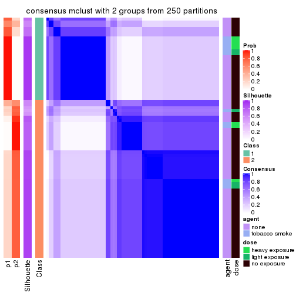</p>

</div>
<div id='tab-MAD-mclust-consensus-heatmap-2'>
<pre><code class="r">consensus_heatmap(res, k = 3)
</code></pre>

<p>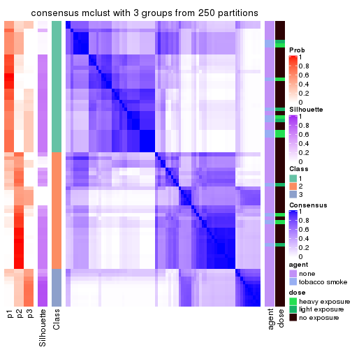</p>

</div>
<div id='tab-MAD-mclust-consensus-heatmap-3'>
<pre><code class="r">consensus_heatmap(res, k = 4)
</code></pre>

<p>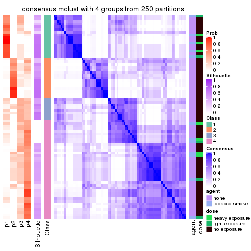</p>

</div>
<div id='tab-MAD-mclust-consensus-heatmap-4'>
<pre><code class="r">consensus_heatmap(res, k = 5)
</code></pre>

<p>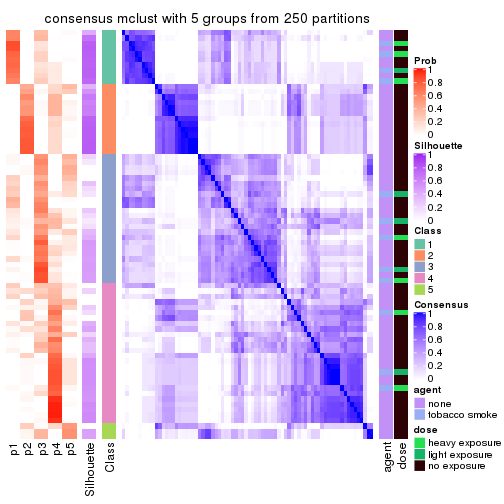</p>

</div>
<div id='tab-MAD-mclust-consensus-heatmap-5'>
<pre><code class="r">consensus_heatmap(res, k = 6)
</code></pre>

<p>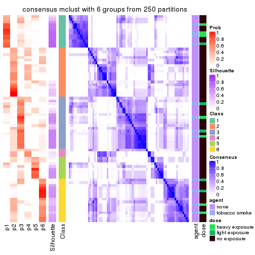</p>

</div>
</div>

Heatmaps for the membership of samples in all partitions to see how consistent they are:


<script>
$( function() {
	$( '#tabs-MAD-mclust-membership-heatmap' ).tabs();
} );
</script>
<div id='tabs-MAD-mclust-membership-heatmap'>
<ul>
<li><a href='#tab-MAD-mclust-membership-heatmap-1'>k = 2</a></li>
<li><a href='#tab-MAD-mclust-membership-heatmap-2'>k = 3</a></li>
<li><a href='#tab-MAD-mclust-membership-heatmap-3'>k = 4</a></li>
<li><a href='#tab-MAD-mclust-membership-heatmap-4'>k = 5</a></li>
<li><a href='#tab-MAD-mclust-membership-heatmap-5'>k = 6</a></li>
</ul>
<div id='tab-MAD-mclust-membership-heatmap-1'>
<pre><code class="r">membership_heatmap(res, k = 2)
</code></pre>

<p>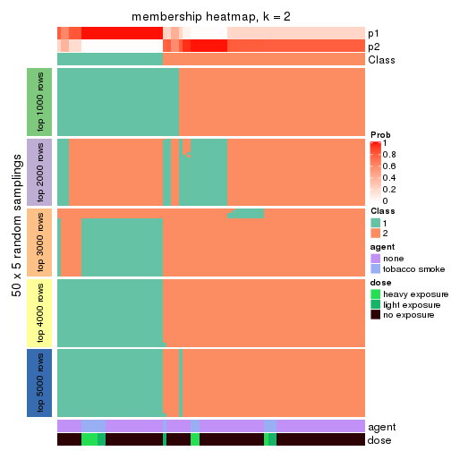</p>

</div>
<div id='tab-MAD-mclust-membership-heatmap-2'>
<pre><code class="r">membership_heatmap(res, k = 3)
</code></pre>

<p>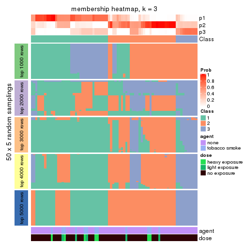</p>

</div>
<div id='tab-MAD-mclust-membership-heatmap-3'>
<pre><code class="r">membership_heatmap(res, k = 4)
</code></pre>

<p>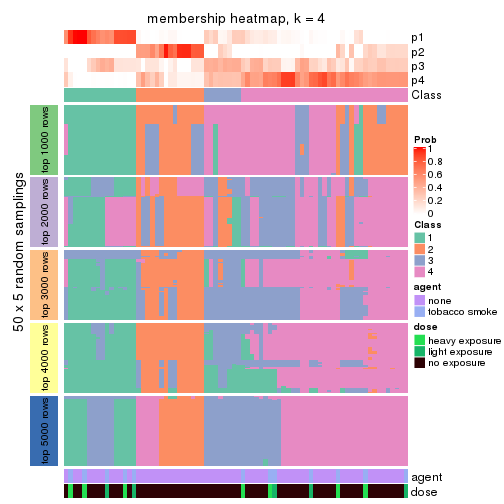</p>

</div>
<div id='tab-MAD-mclust-membership-heatmap-4'>
<pre><code class="r">membership_heatmap(res, k = 5)
</code></pre>

<p></p>

</div>
<div id='tab-MAD-mclust-membership-heatmap-5'>
<pre><code class="r">membership_heatmap(res, k = 6)
</code></pre>

<p>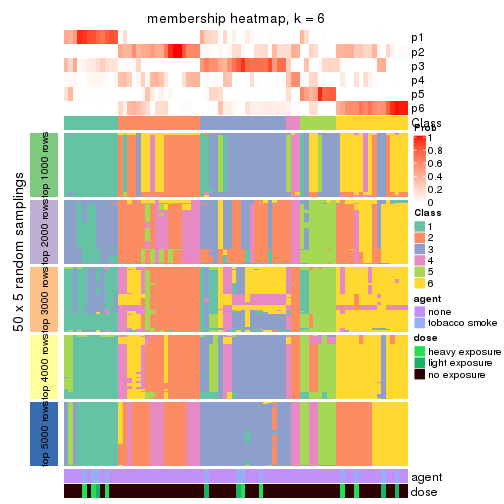</p>

</div>
</div>

As soon as we have had the classes for columns, we can look for signatures
which are significantly different between classes which can be candidate marks
for certain classes. Following are the heatmaps for signatures.


Signature heatmaps where rows are scaled:


<script>
$( function() {
	$( '#tabs-MAD-mclust-get-signatures' ).tabs();
} );
</script>
<div id='tabs-MAD-mclust-get-signatures'>
<ul>
<li><a href='#tab-MAD-mclust-get-signatures-1'>k = 2</a></li>
<li><a href='#tab-MAD-mclust-get-signatures-2'>k = 3</a></li>
<li><a href='#tab-MAD-mclust-get-signatures-3'>k = 4</a></li>
<li><a href='#tab-MAD-mclust-get-signatures-4'>k = 5</a></li>
<li><a href='#tab-MAD-mclust-get-signatures-5'>k = 6</a></li>
</ul>
<div id='tab-MAD-mclust-get-signatures-1'>
<pre><code class="r">get_signatures(res, k = 2)
</code></pre>

<p>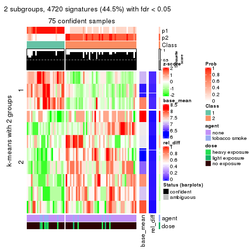</p>

</div>
<div id='tab-MAD-mclust-get-signatures-2'>
<pre><code class="r">get_signatures(res, k = 3)
</code></pre>

<p>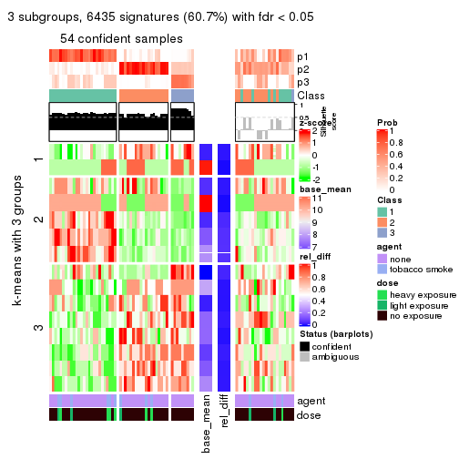</p>

</div>
<div id='tab-MAD-mclust-get-signatures-3'>
<pre><code class="r">get_signatures(res, k = 4)
</code></pre>

<p>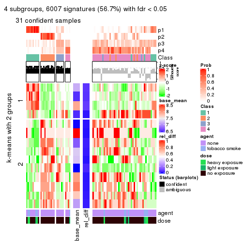</p>

</div>
<div id='tab-MAD-mclust-get-signatures-4'>
<pre><code class="r">get_signatures(res, k = 5)
</code></pre>

<p>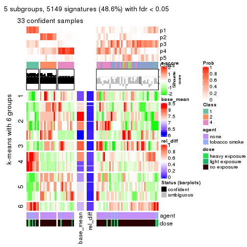</p>

</div>
<div id='tab-MAD-mclust-get-signatures-5'>
<pre><code class="r">get_signatures(res, k = 6)
</code></pre>

<p>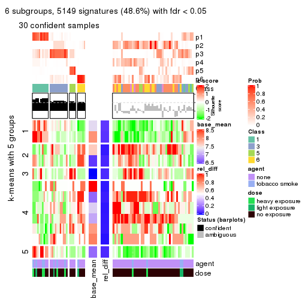</p>

</div>
</div>


Signature heatmaps where rows are not scaled:


<script>
$( function() {
	$( '#tabs-MAD-mclust-get-signatures-no-scale' ).tabs();
} );
</script>
<div id='tabs-MAD-mclust-get-signatures-no-scale'>
<ul>
<li><a href='#tab-MAD-mclust-get-signatures-no-scale-1'>k = 2</a></li>
<li><a href='#tab-MAD-mclust-get-signatures-no-scale-2'>k = 3</a></li>
<li><a href='#tab-MAD-mclust-get-signatures-no-scale-3'>k = 4</a></li>
<li><a href='#tab-MAD-mclust-get-signatures-no-scale-4'>k = 5</a></li>
<li><a href='#tab-MAD-mclust-get-signatures-no-scale-5'>k = 6</a></li>
</ul>
<div id='tab-MAD-mclust-get-signatures-no-scale-1'>
<pre><code class="r">get_signatures(res, k = 2, scale_rows = FALSE)
</code></pre>

<p>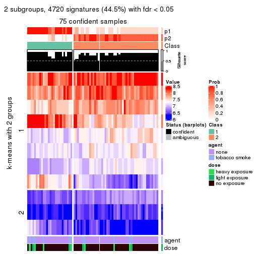</p>

</div>
<div id='tab-MAD-mclust-get-signatures-no-scale-2'>
<pre><code class="r">get_signatures(res, k = 3, scale_rows = FALSE)
</code></pre>

<p>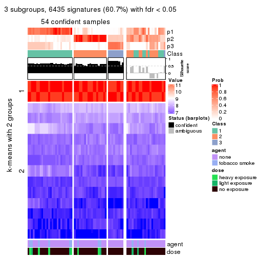</p>

</div>
<div id='tab-MAD-mclust-get-signatures-no-scale-3'>
<pre><code class="r">get_signatures(res, k = 4, scale_rows = FALSE)
</code></pre>

<p>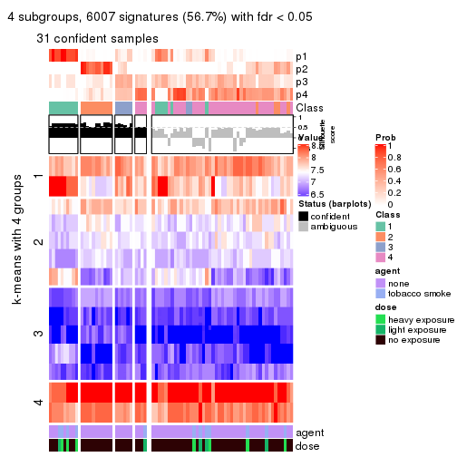</p>

</div>
<div id='tab-MAD-mclust-get-signatures-no-scale-4'>
<pre><code class="r">get_signatures(res, k = 5, scale_rows = FALSE)
</code></pre>

<p>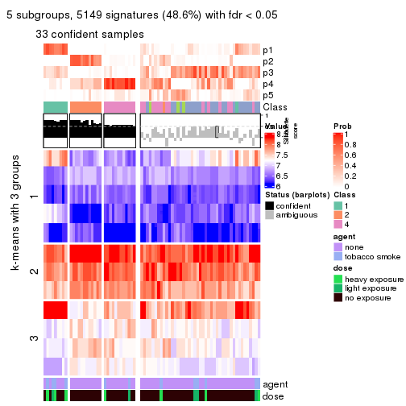</p>

</div>
<div id='tab-MAD-mclust-get-signatures-no-scale-5'>
<pre><code class="r">get_signatures(res, k = 6, scale_rows = FALSE)
</code></pre>

<p>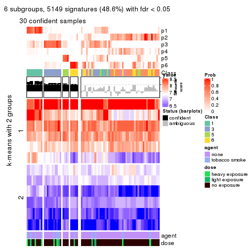</p>

</div>
</div>


Compare the overlap of signatures from different k:

```r
compare_signatures(res)
```

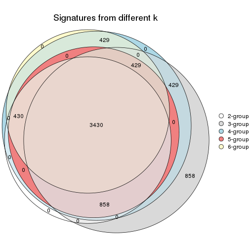

`get_signature()` returns a data frame invisibly. TO get the list of signatures, the function
call should be assigned to a variable explicitly. In following code, if `plot` argument is set
to `FALSE`, no heatmap is plotted while only the differential analysis is performed.

```r
# code only for demonstration
tb = get_signature(res, k = ..., plot = FALSE)
```

An example of the output of `tb` is:

```
#>   which_row         fdr    mean_1    mean_2 scaled_mean_1 scaled_mean_2 km
#> 1        38 0.042760348  8.373488  9.131774    -0.5533452     0.5164555  1
#> 2        40 0.018707592  7.106213  8.469186    -0.6173731     0.5762149  1
#> 3        55 0.019134737 10.221463 11.207825    -0.6159697     0.5749050  1
#> 4        59 0.006059896  5.921854  7.869574    -0.6899429     0.6439467  1
#> 5        60 0.018055526  8.928898 10.211722    -0.6204761     0.5791110  1
#> 6        98 0.009384629 15.714769 14.887706     0.6635654    -0.6193277  2
...
```

The columns in `tb` are:

1. `which_row`: row indices corresponding to the input matrix.
2. `fdr`: FDR for the differential test. 
3. `mean_x`: The mean value in group x.
4. `scaled_mean_x`: The mean value in group x after rows are scaled.
5. `km`: Row groups if k-means clustering is applied to rows.


UMAP plot which shows how samples are separated.


<script>
$( function() {
	$( '#tabs-MAD-mclust-dimension-reduction' ).tabs();
} );
</script>
<div id='tabs-MAD-mclust-dimension-reduction'>
<ul>
<li><a href='#tab-MAD-mclust-dimension-reduction-1'>k = 2</a></li>
<li><a href='#tab-MAD-mclust-dimension-reduction-2'>k = 3</a></li>
<li><a href='#tab-MAD-mclust-dimension-reduction-3'>k = 4</a></li>
<li><a href='#tab-MAD-mclust-dimension-reduction-4'>k = 5</a></li>
<li><a href='#tab-MAD-mclust-dimension-reduction-5'>k = 6</a></li>
</ul>
<div id='tab-MAD-mclust-dimension-reduction-1'>
<pre><code class="r">dimension_reduction(res, k = 2, method = &quot;UMAP&quot;)
</code></pre>

<p>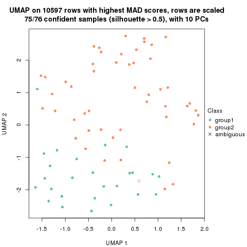</p>

</div>
<div id='tab-MAD-mclust-dimension-reduction-2'>
<pre><code class="r">dimension_reduction(res, k = 3, method = &quot;UMAP&quot;)
</code></pre>

<p>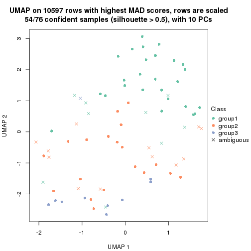</p>

</div>
<div id='tab-MAD-mclust-dimension-reduction-3'>
<pre><code class="r">dimension_reduction(res, k = 4, method = &quot;UMAP&quot;)
</code></pre>

<p>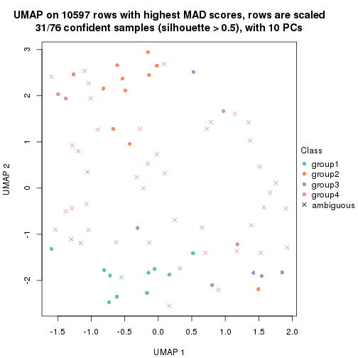</p>

</div>
<div id='tab-MAD-mclust-dimension-reduction-4'>
<pre><code class="r">dimension_reduction(res, k = 5, method = &quot;UMAP&quot;)
</code></pre>

<p>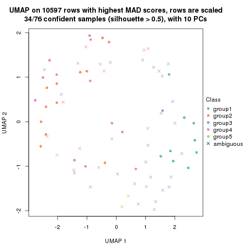</p>

</div>
<div id='tab-MAD-mclust-dimension-reduction-5'>
<pre><code class="r">dimension_reduction(res, k = 6, method = &quot;UMAP&quot;)
</code></pre>

<p>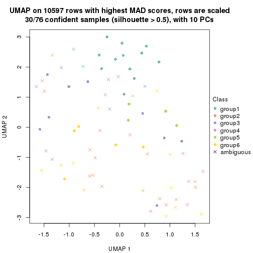</p>

</div>
</div>


Following heatmap shows how subgroups are split when increasing `k`:

```r
collect_classes(res)
```

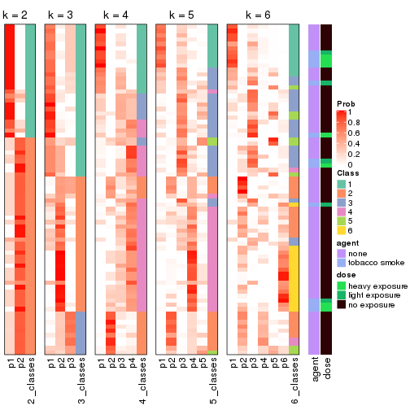


Test correlation between subgroups and known annotations. If the known
annotation is numeric, one-way ANOVA test is applied, and if the known
annotation is discrete, chi-squared contingency table test is applied.

```r
test_to_known_factors(res)
```

```
#>             n agent(p) dose(p) k
#> MAD:mclust 75   0.2474  0.3156 2
#> MAD:mclust 54   0.2753  0.6304 3
#> MAD:mclust 31   0.0523  0.0893 4
#> MAD:mclust 34   0.0646  0.2538 5
#> MAD:mclust 30   0.4790  0.6561 6
```


If matrix rows can be associated to genes, consider to use `GO_Enrichment(res,
...)` to perform function enrichment for the signature genes.


 

---------------------------------------------------


### MAD:NMF


The object with results only for a single top-value method and a single partition method 
can be extracted as:

```r
res = res_list["MAD", "NMF"]
# you can also extract it by
# res = res_list["MAD:NMF"]
```

A summary of `res` and all the functions that can be applied to it:

```r
res
```

```
#> A 'ConsensusPartition' object with k = 2, 3, 4, 5, 6.
#>   On a matrix with 10597 rows and 76 columns.
#>   Top rows (1000, 2000, 3000, 4000, 5000) are extracted by 'MAD' method.
#>   Subgroups are detected by 'NMF' method.
#>   Performed in total 1250 partitions by row resampling.
#>   Best k for subgroups seems to be 2.
#> 
#> Following methods can be applied to this 'ConsensusPartition' object:
#>  [1] "cola_report"             "collect_classes"         "collect_plots"          
#>  [4] "collect_stats"           "colnames"                "compare_signatures"     
#>  [7] "consensus_heatmap"       "dimension_reduction"     "functional_enrichment"  
#> [10] "get_anno_col"            "get_anno"                "get_classes"            
#> [13] "get_consensus"           "get_matrix"              "get_membership"         
#> [16] "get_param"               "get_signatures"          "get_stats"              
#> [19] "is_best_k"               "is_stable_k"             "membership_heatmap"     
#> [22] "ncol"                    "nrow"                    "plot_ecdf"              
#> [25] "rownames"                "select_partition_number" "show"                   
#> [28] "suggest_best_k"          "test_to_known_factors"
```

`collect_plots()` function collects all the plots made from `res` for all `k` (number of partitions)
into one single page to provide an easy and fast comparison between different `k`.

```r
collect_plots(res)
```

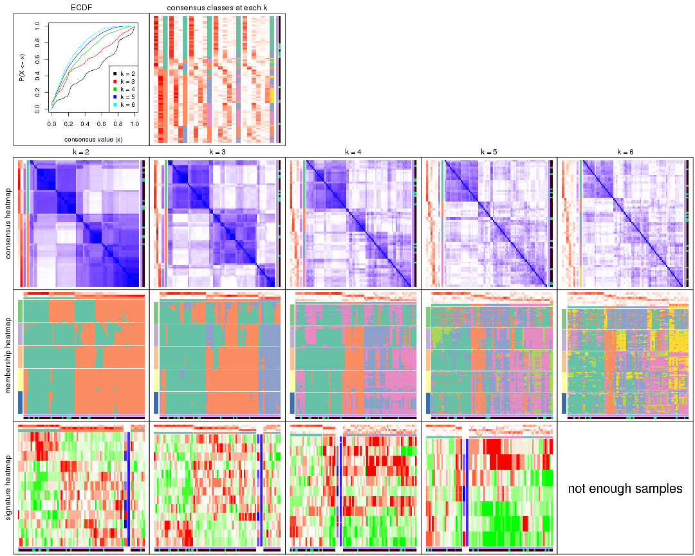

The plots are:

- The first row: a plot of the ECDF (Empirical cumulative distribution
  function) curves of the consensus matrix for each `k` and the heatmap of
  predicted classes for each `k`.
- The second row: heatmaps of the consensus matrix for each `k`.
- The third row: heatmaps of the membership matrix for each `k`.
- The fouth row: heatmaps of the signatures for each `k`.

All the plots in panels can be made by individual functions and they are
plotted later in this section.

`select_partition_number()` produces several plots showing different
statistics for choosing "optimized" `k`. There are following statistics:

- ECDF curves of the consensus matrix for each `k`;
- 1-PAC. [The PAC
  score](https://en.wikipedia.org/wiki/Consensus_clustering#Over-interpretation_potential_of_consensus_clustering)
  measures the proportion of the ambiguous subgrouping.
- Mean silhouette score.
- Concordance. The mean probability of fiting the consensus class ids in all
  partitions.
- Area increased. Denote $A_k$ as the area under the ECDF curve for current
  `k`, the area increased is defined as $A_k - A_{k-1}$.
- Rand index. The percent of pairs of samples that are both in a same cluster
  or both are not in a same cluster in the partition of k and k-1.
- Jaccard index. The ratio of pairs of samples are both in a same cluster in
  the partition of k and k-1 and the pairs of samples are both in a same
  cluster in the partition k or k-1.

The detailed explanations of these statistics can be found in [the cola
vignette](http://bioconductor.org/packages/devel/bioc/vignettes/cola/inst/doc/cola.html#toc_13).

Generally speaking, lower PAC score, higher mean silhouette score or higher
concordance corresponds to better partition. Rand index and Jaccard index
measure how similar the current partition is compared to partition with `k-1`.
If they are too similar, we won't accept `k` is better than `k-1`.

```r
select_partition_number(res)
```

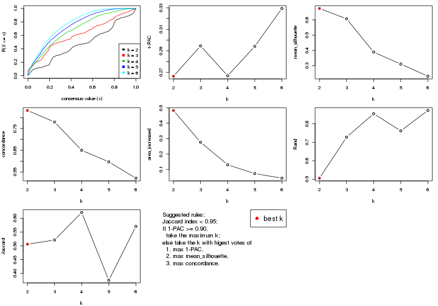

The numeric values for all these statistics can be obtained by `get_stats()`.

```r
get_stats(res)
```

```
#>   k 1-PAC mean_silhouette concordance area_increased  Rand Jaccard
#> 2 2 0.266           0.675       0.833         0.4825 0.506   0.506
#> 3 3 0.295           0.607       0.780         0.2767 0.727   0.521
#> 4 4 0.267           0.389       0.650         0.1304 0.854   0.621
#> 5 5 0.294           0.310       0.597         0.0734 0.762   0.375
#> 6 6 0.329           0.231       0.522         0.0436 0.872   0.570
```

`suggest_best_k()` suggests the best $k$ based on these statistics. The rules are as follows:

- All $k$ with Jaccard index larger than 0.95 are removed because the increase of
  the partition number does not provides enough extra information. If all $k$ are removed,
  the best $k$ is assigned by `NA`.
- For $k$ with 1-PAC larger than 0.9, the maximal $k$ is taken as the "best k". Other $k$ is called "optional k".
- If it does not fit the second rule. The $k$ with the highest vote of highest
  1-PAC, mean silhouette and concordance is taken as the "best k".

```r
suggest_best_k(res)
```

```
#> [1] 2
```


Following shows the table of the partitions (You need to click the **show/hide
code output** link to see it). The membership matrix (columns with name `p*`)
is inferred by
[`clue::cl_consensus()`](https://www.rdocumentation.org/link/cl_consensus?package=clue)
function with the `SE` method. Basically the value in the membership matrix
represents the probability to belong to a certain group. The finall class
label for an item is determined with the group with highest probability it
belongs to.

In `get_classes()` function, the entropy is calculated from the membership
matrix and the silhouette score is calculated from the consensus matrix.


<script>
$( function() {
	$( '#tabs-MAD-NMF-get-classes' ).tabs();
} );
</script>
<div id='tabs-MAD-NMF-get-classes'>
<ul>
<li><a href='#tab-MAD-NMF-get-classes-1'>k = 2</a></li>
<li><a href='#tab-MAD-NMF-get-classes-2'>k = 3</a></li>
<li><a href='#tab-MAD-NMF-get-classes-3'>k = 4</a></li>
<li><a href='#tab-MAD-NMF-get-classes-4'>k = 5</a></li>
<li><a href='#tab-MAD-NMF-get-classes-5'>k = 6</a></li>
</ul>

<div id='tab-MAD-NMF-get-classes-1'>
<p><a id='tab-MAD-NMF-get-classes-1-a' style='color:#0366d6' href='#'>show/hide code output</a></p>
<pre><code class="r">cbind(get_classes(res, k = 2), get_membership(res, k = 2))
</code></pre>

<pre><code>#&gt;           class entropy silhouette    p1    p2
#&gt; GSM451162     1  0.9795      0.532 0.584 0.416
#&gt; GSM451163     2  0.0672      0.785 0.008 0.992
#&gt; GSM451164     2  0.7219      0.688 0.200 0.800
#&gt; GSM451165     2  0.9580      0.546 0.380 0.620
#&gt; GSM451167     2  0.3733      0.773 0.072 0.928
#&gt; GSM451168     2  0.9710      0.587 0.400 0.600
#&gt; GSM451169     2  0.9427      0.349 0.360 0.640
#&gt; GSM451170     1  0.1414      0.769 0.980 0.020
#&gt; GSM451171     2  0.0000      0.783 0.000 1.000
#&gt; GSM451172     2  0.0672      0.785 0.008 0.992
#&gt; GSM451173     1  0.7815      0.758 0.768 0.232
#&gt; GSM451174     2  0.7528      0.705 0.216 0.784
#&gt; GSM451175     1  0.7376      0.768 0.792 0.208
#&gt; GSM451177     2  0.1414      0.780 0.020 0.980
#&gt; GSM451178     2  0.7299      0.705 0.204 0.796
#&gt; GSM451179     1  0.1414      0.769 0.980 0.020
#&gt; GSM451180     2  0.0000      0.783 0.000 1.000
#&gt; GSM451181     2  0.1414      0.785 0.020 0.980
#&gt; GSM451182     1  0.0000      0.766 1.000 0.000
#&gt; GSM451183     1  0.7602      0.764 0.780 0.220
#&gt; GSM451184     1  0.9732      0.441 0.596 0.404
#&gt; GSM451185     1  0.0000      0.766 1.000 0.000
#&gt; GSM451186     1  0.9866     -0.178 0.568 0.432
#&gt; GSM451187     2  0.0000      0.783 0.000 1.000
#&gt; GSM451188     2  0.2603      0.780 0.044 0.956
#&gt; GSM451189     1  0.1843      0.772 0.972 0.028
#&gt; GSM451190     1  0.7219      0.761 0.800 0.200
#&gt; GSM451191     1  0.0000      0.766 1.000 0.000
#&gt; GSM451193     2  0.9460      0.343 0.364 0.636
#&gt; GSM451195     1  0.7602      0.764 0.780 0.220
#&gt; GSM451196     1  0.1633      0.771 0.976 0.024
#&gt; GSM451197     1  0.7219      0.761 0.800 0.200
#&gt; GSM451199     1  0.0938      0.772 0.988 0.012
#&gt; GSM451201     1  0.7453      0.768 0.788 0.212
#&gt; GSM451202     2  0.7815      0.695 0.232 0.768
#&gt; GSM451203     2  0.9661      0.255 0.392 0.608
#&gt; GSM451204     2  0.6973      0.690 0.188 0.812
#&gt; GSM451205     2  0.1633      0.781 0.024 0.976
#&gt; GSM451206     2  0.3274      0.777 0.060 0.940
#&gt; GSM451207     2  0.2778      0.780 0.048 0.952
#&gt; GSM451208     2  0.7219      0.704 0.200 0.800
#&gt; GSM451209     2  0.7745      0.688 0.228 0.772
#&gt; GSM451210     2  0.6148      0.734 0.152 0.848
#&gt; GSM451212     2  0.2778      0.780 0.048 0.952
#&gt; GSM451213     2  0.7299      0.705 0.204 0.796
#&gt; GSM451214     2  0.6247      0.731 0.156 0.844
#&gt; GSM451215     2  0.0000      0.783 0.000 1.000
#&gt; GSM451216     2  0.7299      0.705 0.204 0.796
#&gt; GSM451217     2  0.0376      0.784 0.004 0.996
#&gt; GSM451219     1  0.0000      0.766 1.000 0.000
#&gt; GSM451220     1  0.7815      0.758 0.768 0.232
#&gt; GSM451221     1  0.0000      0.766 1.000 0.000
#&gt; GSM451222     1  0.8081      0.746 0.752 0.248
#&gt; GSM451224     2  0.9393      0.625 0.356 0.644
#&gt; GSM451225     1  0.8207      0.446 0.744 0.256
#&gt; GSM451226     2  0.9795      0.222 0.416 0.584
#&gt; GSM451227     1  0.9983     -0.302 0.524 0.476
#&gt; GSM451228     2  0.4562      0.759 0.096 0.904
#&gt; GSM451230     2  0.5842      0.736 0.140 0.860
#&gt; GSM451231     2  0.8955      0.556 0.312 0.688
#&gt; GSM451233     2  0.7056      0.686 0.192 0.808
#&gt; GSM451234     2  0.8813      0.677 0.300 0.700
#&gt; GSM451235     2  0.3114      0.786 0.056 0.944
#&gt; GSM451236     2  0.0376      0.783 0.004 0.996
#&gt; GSM451166     2  0.7139      0.673 0.196 0.804
#&gt; GSM451194     1  0.7299      0.770 0.796 0.204
#&gt; GSM451198     1  0.7602      0.764 0.780 0.220
#&gt; GSM451218     2  0.7299      0.705 0.204 0.796
#&gt; GSM451232     1  0.1414      0.769 0.980 0.020
#&gt; GSM451176     1  0.1184      0.773 0.984 0.016
#&gt; GSM451192     1  0.7602      0.764 0.780 0.220
#&gt; GSM451200     1  0.7602      0.764 0.780 0.220
#&gt; GSM451211     2  0.7219      0.704 0.200 0.800
#&gt; GSM451223     1  0.9815      0.400 0.580 0.420
#&gt; GSM451229     1  0.0938      0.769 0.988 0.012
#&gt; GSM451237     2  0.9661      0.589 0.392 0.608
</code></pre>

<script>
$('#tab-MAD-NMF-get-classes-1-a').parent().next().next().hide();
$('#tab-MAD-NMF-get-classes-1-a').click(function(){
  $('#tab-MAD-NMF-get-classes-1-a').parent().next().next().toggle();
  return(false);
});
</script>
</div>

<div id='tab-MAD-NMF-get-classes-2'>
<p><a id='tab-MAD-NMF-get-classes-2-a' style='color:#0366d6' href='#'>show/hide code output</a></p>
<pre><code class="r">cbind(get_classes(res, k = 3), get_membership(res, k = 3))
</code></pre>

<pre><code>#&gt;           class entropy silhouette    p1    p2    p3
#&gt; GSM451162     1   0.640    0.55201 0.748 0.192 0.060
#&gt; GSM451163     2   0.877    0.52332 0.140 0.556 0.304
#&gt; GSM451164     2   0.875    0.52995 0.140 0.560 0.300
#&gt; GSM451165     3   0.672    0.64911 0.060 0.220 0.720
#&gt; GSM451167     2   0.748    0.66480 0.296 0.640 0.064
#&gt; GSM451168     2   0.688    0.58036 0.096 0.732 0.172
#&gt; GSM451169     1   0.797   -0.15682 0.540 0.396 0.064
#&gt; GSM451170     1   0.369    0.74034 0.860 0.140 0.000
#&gt; GSM451171     2   0.825    0.60533 0.140 0.628 0.232
#&gt; GSM451172     3   0.909   -0.19961 0.140 0.400 0.460
#&gt; GSM451173     1   0.188    0.77486 0.956 0.032 0.012
#&gt; GSM451174     2   0.207    0.67040 0.060 0.940 0.000
#&gt; GSM451175     1   0.226    0.78081 0.932 0.068 0.000
#&gt; GSM451177     3   0.435    0.62332 0.000 0.184 0.816
#&gt; GSM451178     2   0.129    0.68461 0.000 0.968 0.032
#&gt; GSM451179     1   0.465    0.70821 0.792 0.208 0.000
#&gt; GSM451180     2   0.911    0.20952 0.140 0.436 0.424
#&gt; GSM451181     2   0.392    0.70549 0.140 0.856 0.004
#&gt; GSM451182     1   0.369    0.74034 0.860 0.140 0.000
#&gt; GSM451183     1   0.116    0.77935 0.972 0.028 0.000
#&gt; GSM451184     3   0.369    0.72925 0.140 0.000 0.860
#&gt; GSM451185     1   0.369    0.74034 0.860 0.140 0.000
#&gt; GSM451186     2   0.650    0.09160 0.460 0.536 0.004
#&gt; GSM451187     2   0.802    0.61082 0.140 0.652 0.208
#&gt; GSM451188     3   0.369    0.72925 0.140 0.000 0.860
#&gt; GSM451189     1   0.375    0.75356 0.856 0.144 0.000
#&gt; GSM451190     1   0.550    0.46742 0.708 0.000 0.292
#&gt; GSM451191     3   0.911   -0.04601 0.416 0.140 0.444
#&gt; GSM451193     1   0.797   -0.15682 0.540 0.396 0.064
#&gt; GSM451195     1   0.207    0.76808 0.940 0.060 0.000
#&gt; GSM451196     1   0.348    0.74856 0.872 0.128 0.000
#&gt; GSM451197     1   0.196    0.76175 0.944 0.000 0.056
#&gt; GSM451199     1   0.579    0.70976 0.800 0.116 0.084
#&gt; GSM451201     1   0.148    0.78013 0.968 0.012 0.020
#&gt; GSM451202     3   0.620    0.68002 0.056 0.184 0.760
#&gt; GSM451203     1   0.711    0.00437 0.584 0.388 0.028
#&gt; GSM451204     2   0.786    0.64297 0.228 0.656 0.116
#&gt; GSM451205     3   0.505    0.72614 0.140 0.036 0.824
#&gt; GSM451206     2   0.369    0.65123 0.000 0.860 0.140
#&gt; GSM451207     2   0.392    0.70549 0.140 0.856 0.004
#&gt; GSM451208     2   0.238    0.67301 0.056 0.936 0.008
#&gt; GSM451209     2   0.579    0.62970 0.332 0.668 0.000
#&gt; GSM451210     3   0.567    0.72223 0.140 0.060 0.800
#&gt; GSM451212     2   0.405    0.70890 0.148 0.848 0.004
#&gt; GSM451213     2   0.000    0.68488 0.000 1.000 0.000
#&gt; GSM451214     3   0.369    0.72925 0.140 0.000 0.860
#&gt; GSM451215     2   0.650    0.66664 0.140 0.760 0.100
#&gt; GSM451216     2   0.000    0.68488 0.000 1.000 0.000
#&gt; GSM451217     2   0.678    0.68430 0.140 0.744 0.116
#&gt; GSM451219     1   0.602    0.69393 0.784 0.140 0.076
#&gt; GSM451220     1   0.220    0.76836 0.940 0.056 0.004
#&gt; GSM451221     3   0.873    0.39281 0.296 0.140 0.564
#&gt; GSM451222     1   0.319    0.73900 0.888 0.112 0.000
#&gt; GSM451224     3   0.455    0.70062 0.000 0.200 0.800
#&gt; GSM451225     2   0.628    0.09146 0.460 0.540 0.000
#&gt; GSM451226     3   0.406    0.72295 0.164 0.000 0.836
#&gt; GSM451227     3   0.567    0.68625 0.060 0.140 0.800
#&gt; GSM451228     2   0.685    0.69686 0.232 0.708 0.060
#&gt; GSM451230     2   0.767    0.62084 0.340 0.600 0.060
#&gt; GSM451231     2   0.695    0.17309 0.488 0.496 0.016
#&gt; GSM451233     2   0.606    0.62732 0.340 0.656 0.004
#&gt; GSM451234     2   0.440    0.64846 0.188 0.812 0.000
#&gt; GSM451235     2   0.474    0.72021 0.136 0.836 0.028
#&gt; GSM451236     2   0.418    0.71570 0.172 0.828 0.000
#&gt; GSM451166     2   0.463    0.72083 0.164 0.824 0.012
#&gt; GSM451194     1   0.219    0.78018 0.948 0.024 0.028
#&gt; GSM451198     1   0.207    0.75903 0.940 0.000 0.060
#&gt; GSM451218     2   0.207    0.67040 0.060 0.940 0.000
#&gt; GSM451232     1   0.369    0.74034 0.860 0.140 0.000
#&gt; GSM451176     1   0.440    0.75224 0.812 0.188 0.000
#&gt; GSM451192     1   0.207    0.75903 0.940 0.000 0.060
#&gt; GSM451200     1   0.243    0.76588 0.940 0.024 0.036
#&gt; GSM451211     2   0.230    0.67121 0.060 0.936 0.004
#&gt; GSM451223     1   0.355    0.75504 0.900 0.064 0.036
#&gt; GSM451229     1   0.369    0.74034 0.860 0.140 0.000
#&gt; GSM451237     2   0.522    0.58515 0.260 0.740 0.000
</code></pre>

<script>
$('#tab-MAD-NMF-get-classes-2-a').parent().next().next().hide();
$('#tab-MAD-NMF-get-classes-2-a').click(function(){
  $('#tab-MAD-NMF-get-classes-2-a').parent().next().next().toggle();
  return(false);
});
</script>
</div>

<div id='tab-MAD-NMF-get-classes-3'>
<p><a id='tab-MAD-NMF-get-classes-3-a' style='color:#0366d6' href='#'>show/hide code output</a></p>
<pre><code class="r">cbind(get_classes(res, k = 4), get_membership(res, k = 4))
</code></pre>

<pre><code>#&gt;           class entropy silhouette    p1    p2    p3    p4
#&gt; GSM451162     3   0.716     0.1937 0.416 0.060 0.492 0.032
#&gt; GSM451163     4   0.900     0.1561 0.140 0.268 0.128 0.464
#&gt; GSM451164     4   0.765     0.3678 0.204 0.156 0.044 0.596
#&gt; GSM451165     2   0.639     0.4904 0.044 0.604 0.020 0.332
#&gt; GSM451167     4   0.847     0.1409 0.172 0.056 0.288 0.484
#&gt; GSM451168     4   0.721     0.2969 0.072 0.204 0.080 0.644
#&gt; GSM451169     1   0.873    -0.2604 0.432 0.060 0.188 0.320
#&gt; GSM451170     1   0.530     0.5658 0.684 0.020 0.008 0.288
#&gt; GSM451171     3   0.955     0.0591 0.132 0.216 0.368 0.284
#&gt; GSM451172     2   0.874     0.2503 0.128 0.508 0.128 0.236
#&gt; GSM451173     1   0.228     0.6778 0.932 0.020 0.012 0.036
#&gt; GSM451174     4   0.602    -0.0629 0.028 0.012 0.376 0.584
#&gt; GSM451175     1   0.322     0.6846 0.892 0.012 0.048 0.048
#&gt; GSM451177     2   0.462     0.5153 0.004 0.760 0.216 0.020
#&gt; GSM451178     3   0.481     0.4867 0.032 0.016 0.784 0.168
#&gt; GSM451179     1   0.524     0.3985 0.600 0.000 0.012 0.388
#&gt; GSM451180     2   0.765     0.0952 0.136 0.508 0.336 0.020
#&gt; GSM451181     4   0.876     0.3379 0.236 0.064 0.236 0.464
#&gt; GSM451182     1   0.546     0.5668 0.676 0.016 0.016 0.292
#&gt; GSM451183     1   0.114     0.6870 0.972 0.012 0.008 0.008
#&gt; GSM451184     2   0.371     0.6314 0.152 0.832 0.004 0.012
#&gt; GSM451185     1   0.559     0.5666 0.672 0.004 0.040 0.284
#&gt; GSM451186     4   0.645     0.2055 0.268 0.000 0.112 0.620
#&gt; GSM451187     3   0.930     0.2397 0.132 0.292 0.412 0.164
#&gt; GSM451188     2   0.380     0.6447 0.100 0.852 0.004 0.044
#&gt; GSM451189     1   0.305     0.6815 0.892 0.012 0.016 0.080
#&gt; GSM451190     1   0.564     0.2839 0.608 0.364 0.004 0.024
#&gt; GSM451191     2   0.800     0.2052 0.276 0.444 0.008 0.272
#&gt; GSM451193     1   0.758    -0.1882 0.460 0.056 0.060 0.424
#&gt; GSM451195     1   0.287     0.6736 0.904 0.020 0.012 0.064
#&gt; GSM451196     1   0.312     0.6741 0.880 0.000 0.028 0.092
#&gt; GSM451197     1   0.283     0.6831 0.908 0.048 0.008 0.036
#&gt; GSM451199     1   0.437     0.6411 0.772 0.008 0.008 0.212
#&gt; GSM451201     1   0.207     0.6909 0.940 0.028 0.008 0.024
#&gt; GSM451202     2   0.721     0.2741 0.044 0.540 0.056 0.360
#&gt; GSM451203     1   0.726     0.2193 0.636 0.052 0.108 0.204
#&gt; GSM451204     4   0.870     0.3582 0.244 0.052 0.256 0.448
#&gt; GSM451205     2   0.439     0.6157 0.132 0.820 0.020 0.028
#&gt; GSM451206     3   0.676     0.0756 0.004 0.084 0.520 0.392
#&gt; GSM451207     4   0.852     0.3174 0.280 0.036 0.244 0.440
#&gt; GSM451208     3   0.646     0.4425 0.040 0.100 0.704 0.156
#&gt; GSM451209     4   0.673     0.4062 0.324 0.008 0.088 0.580
#&gt; GSM451210     4   0.786     0.0864 0.136 0.412 0.024 0.428
#&gt; GSM451212     3   0.750     0.3676 0.148 0.036 0.600 0.216
#&gt; GSM451213     3   0.461     0.4964 0.032 0.008 0.788 0.172
#&gt; GSM451214     2   0.338     0.6323 0.136 0.852 0.004 0.008
#&gt; GSM451215     3   0.736     0.1733 0.140 0.392 0.464 0.004
#&gt; GSM451216     3   0.419     0.4882 0.040 0.000 0.812 0.148
#&gt; GSM451217     3   0.873     0.2849 0.132 0.100 0.476 0.292
#&gt; GSM451219     1   0.718     0.4500 0.560 0.120 0.012 0.308
#&gt; GSM451220     1   0.366     0.6486 0.868 0.040 0.012 0.080
#&gt; GSM451221     2   0.806     0.0267 0.320 0.364 0.004 0.312
#&gt; GSM451222     1   0.390     0.6384 0.840 0.020 0.128 0.012
#&gt; GSM451224     2   0.489     0.6004 0.036 0.812 0.064 0.088
#&gt; GSM451225     4   0.660     0.0075 0.328 0.000 0.100 0.572
#&gt; GSM451226     2   0.374     0.6368 0.136 0.840 0.004 0.020
#&gt; GSM451227     2   0.438     0.6011 0.040 0.820 0.012 0.128
#&gt; GSM451228     3   0.777     0.3901 0.196 0.048 0.588 0.168
#&gt; GSM451230     4   0.867     0.3218 0.332 0.056 0.184 0.428
#&gt; GSM451231     1   0.768     0.0543 0.528 0.028 0.128 0.316
#&gt; GSM451233     4   0.810     0.3803 0.316 0.028 0.176 0.480
#&gt; GSM451234     4   0.650    -0.1847 0.052 0.008 0.456 0.484
#&gt; GSM451235     4   0.758     0.0451 0.116 0.028 0.324 0.532
#&gt; GSM451236     3   0.627     0.4906 0.156 0.024 0.708 0.112
#&gt; GSM451166     3   0.460     0.4844 0.176 0.020 0.788 0.016
#&gt; GSM451194     1   0.267     0.6912 0.912 0.032 0.004 0.052
#&gt; GSM451198     1   0.369     0.6376 0.868 0.048 0.012 0.072
#&gt; GSM451218     3   0.523     0.4723 0.028 0.016 0.736 0.220
#&gt; GSM451232     1   0.509     0.5698 0.688 0.004 0.016 0.292
#&gt; GSM451176     1   0.394     0.6718 0.852 0.012 0.044 0.092
#&gt; GSM451192     1   0.364     0.6474 0.868 0.072 0.008 0.052
#&gt; GSM451200     1   0.367     0.6456 0.868 0.044 0.012 0.076
#&gt; GSM451211     3   0.578     0.1400 0.028 0.000 0.492 0.480
#&gt; GSM451223     1   0.659     0.1101 0.556 0.052 0.016 0.376
#&gt; GSM451229     1   0.503     0.5759 0.696 0.004 0.016 0.284
#&gt; GSM451237     4   0.486     0.2794 0.084 0.000 0.136 0.780
</code></pre>

<script>
$('#tab-MAD-NMF-get-classes-3-a').parent().next().next().hide();
$('#tab-MAD-NMF-get-classes-3-a').click(function(){
  $('#tab-MAD-NMF-get-classes-3-a').parent().next().next().toggle();
  return(false);
});
</script>
</div>

<div id='tab-MAD-NMF-get-classes-4'>
<p><a id='tab-MAD-NMF-get-classes-4-a' style='color:#0366d6' href='#'>show/hide code output</a></p>
<pre><code class="r">cbind(get_classes(res, k = 5), get_membership(res, k = 5))
</code></pre>

<pre><code>#&gt;           class entropy silhouette    p1    p2    p3    p4    p5
#&gt; GSM451162     5   0.844    0.41210 0.112 0.040 0.320 0.120 0.408
#&gt; GSM451163     3   0.246    0.34542 0.000 0.008 0.904 0.064 0.024
#&gt; GSM451164     3   0.616    0.29033 0.072 0.008 0.652 0.216 0.052
#&gt; GSM451165     2   0.754    0.35234 0.152 0.416 0.376 0.040 0.016
#&gt; GSM451167     3   0.548    0.04831 0.000 0.016 0.504 0.448 0.032
#&gt; GSM451168     4   0.859    0.25847 0.176 0.172 0.092 0.480 0.080
#&gt; GSM451169     3   0.331    0.32314 0.028 0.024 0.880 0.036 0.032
#&gt; GSM451170     1   0.429    0.61023 0.788 0.020 0.012 0.020 0.160
#&gt; GSM451171     4   0.491   -0.03922 0.000 0.012 0.484 0.496 0.008
#&gt; GSM451172     3   0.762   -0.08724 0.028 0.180 0.524 0.220 0.048
#&gt; GSM451173     1   0.590    0.53573 0.600 0.028 0.324 0.020 0.028
#&gt; GSM451174     4   0.625    0.29241 0.140 0.012 0.200 0.632 0.016
#&gt; GSM451175     1   0.636    0.61141 0.680 0.024 0.108 0.128 0.060
#&gt; GSM451177     2   0.538    0.14329 0.000 0.512 0.012 0.444 0.032
#&gt; GSM451178     4   0.731   -0.23589 0.040 0.016 0.132 0.492 0.320
#&gt; GSM451179     1   0.535    0.50314 0.700 0.016 0.224 0.032 0.028
#&gt; GSM451180     4   0.772   -0.07868 0.000 0.244 0.308 0.388 0.060
#&gt; GSM451181     4   0.777    0.15710 0.092 0.040 0.308 0.488 0.072
#&gt; GSM451182     1   0.392    0.65281 0.824 0.024 0.004 0.032 0.116
#&gt; GSM451183     1   0.495    0.59018 0.692 0.012 0.260 0.008 0.028
#&gt; GSM451184     2   0.574    0.49384 0.080 0.688 0.196 0.016 0.020
#&gt; GSM451185     1   0.280    0.67753 0.892 0.008 0.004 0.036 0.060
#&gt; GSM451186     4   0.836    0.22118 0.328 0.008 0.116 0.344 0.204
#&gt; GSM451187     3   0.559    0.08272 0.000 0.020 0.652 0.252 0.076
#&gt; GSM451188     2   0.515    0.57097 0.048 0.708 0.220 0.012 0.012
#&gt; GSM451189     1   0.335    0.68043 0.868 0.020 0.012 0.024 0.076
#&gt; GSM451190     1   0.653    0.52245 0.572 0.140 0.264 0.008 0.016
#&gt; GSM451191     1   0.630    0.55834 0.664 0.176 0.064 0.012 0.084
#&gt; GSM451193     3   0.710    0.24415 0.124 0.016 0.560 0.252 0.048
#&gt; GSM451195     1   0.657    0.54243 0.624 0.024 0.232 0.048 0.072
#&gt; GSM451196     1   0.416    0.68498 0.832 0.020 0.060 0.028 0.060
#&gt; GSM451197     1   0.561    0.48235 0.560 0.036 0.384 0.008 0.012
#&gt; GSM451199     1   0.495    0.68556 0.788 0.052 0.084 0.044 0.032
#&gt; GSM451201     1   0.496    0.63281 0.712 0.028 0.232 0.008 0.020
#&gt; GSM451202     4   0.808    0.06209 0.144 0.344 0.072 0.412 0.028
#&gt; GSM451203     3   0.628    0.31754 0.200 0.020 0.648 0.108 0.024
#&gt; GSM451204     4   0.831    0.20169 0.132 0.036 0.224 0.480 0.128
#&gt; GSM451205     2   0.576    0.37628 0.000 0.524 0.400 0.068 0.008
#&gt; GSM451206     4   0.498    0.28724 0.000 0.064 0.100 0.764 0.072
#&gt; GSM451207     4   0.715    0.16707 0.100 0.016 0.276 0.548 0.060
#&gt; GSM451208     4   0.710    0.14495 0.144 0.064 0.008 0.572 0.212
#&gt; GSM451209     4   0.821    0.25679 0.232 0.036 0.128 0.488 0.116
#&gt; GSM451210     3   0.818   -0.18218 0.012 0.288 0.328 0.308 0.064
#&gt; GSM451212     4   0.684    0.00621 0.024 0.024 0.160 0.596 0.196
#&gt; GSM451213     4   0.552    0.02820 0.060 0.012 0.008 0.656 0.264
#&gt; GSM451214     2   0.339    0.55564 0.000 0.792 0.200 0.000 0.008
#&gt; GSM451215     4   0.828   -0.21191 0.000 0.284 0.236 0.348 0.132
#&gt; GSM451216     4   0.452    0.24656 0.048 0.016 0.004 0.772 0.160
#&gt; GSM451217     3   0.523    0.18486 0.000 0.036 0.708 0.204 0.052
#&gt; GSM451219     1   0.532    0.60171 0.744 0.060 0.020 0.032 0.144
#&gt; GSM451220     1   0.529    0.43458 0.552 0.008 0.412 0.012 0.016
#&gt; GSM451221     1   0.523    0.61044 0.744 0.148 0.024 0.016 0.068
#&gt; GSM451222     1   0.800    0.44309 0.524 0.028 0.168 0.152 0.128
#&gt; GSM451224     2   0.602    0.51727 0.060 0.700 0.044 0.160 0.036
#&gt; GSM451225     1   0.757    0.10344 0.484 0.000 0.156 0.264 0.096
#&gt; GSM451226     2   0.564    0.37618 0.032 0.504 0.444 0.008 0.012
#&gt; GSM451227     2   0.367    0.50937 0.140 0.824 0.008 0.020 0.008
#&gt; GSM451228     3   0.732   -0.25838 0.040 0.020 0.544 0.180 0.216
#&gt; GSM451230     3   0.581    0.14483 0.012 0.016 0.512 0.428 0.032
#&gt; GSM451231     4   0.750    0.18449 0.312 0.024 0.044 0.488 0.132
#&gt; GSM451233     4   0.753    0.19915 0.144 0.012 0.172 0.556 0.116
#&gt; GSM451234     4   0.584    0.37377 0.160 0.008 0.132 0.680 0.020
#&gt; GSM451235     4   0.712    0.13087 0.092 0.032 0.424 0.428 0.024
#&gt; GSM451236     4   0.784   -0.14346 0.024 0.036 0.268 0.440 0.232
#&gt; GSM451166     5   0.790    0.44268 0.084 0.036 0.108 0.276 0.496
#&gt; GSM451194     1   0.567    0.40571 0.528 0.028 0.412 0.000 0.032
#&gt; GSM451198     3   0.510   -0.25130 0.428 0.016 0.544 0.004 0.008
#&gt; GSM451218     4   0.517    0.23995 0.108 0.000 0.000 0.680 0.212
#&gt; GSM451232     1   0.326    0.65966 0.856 0.016 0.000 0.024 0.104
#&gt; GSM451176     1   0.462    0.65677 0.788 0.004 0.028 0.088 0.092
#&gt; GSM451192     1   0.570    0.49151 0.572 0.032 0.360 0.000 0.036
#&gt; GSM451200     3   0.522   -0.11199 0.372 0.008 0.588 0.004 0.028
#&gt; GSM451211     4   0.343    0.36391 0.136 0.000 0.008 0.832 0.024
#&gt; GSM451223     3   0.673    0.32512 0.216 0.028 0.624 0.060 0.072
#&gt; GSM451229     1   0.271    0.67875 0.904 0.008 0.016 0.036 0.036
#&gt; GSM451237     4   0.843    0.25536 0.200 0.004 0.276 0.364 0.156
</code></pre>

<script>
$('#tab-MAD-NMF-get-classes-4-a').parent().next().next().hide();
$('#tab-MAD-NMF-get-classes-4-a').click(function(){
  $('#tab-MAD-NMF-get-classes-4-a').parent().next().next().toggle();
  return(false);
});
</script>
</div>

<div id='tab-MAD-NMF-get-classes-5'>
<p><a id='tab-MAD-NMF-get-classes-5-a' style='color:#0366d6' href='#'>show/hide code output</a></p>
<pre><code class="r">cbind(get_classes(res, k = 6), get_membership(res, k = 6))
</code></pre>

<pre><code>#&gt;           class entropy silhouette    p1    p2    p3    p4    p5    p6
#&gt; GSM451162     6   0.621    -0.1184 0.052 0.012 0.416 0.000 0.068 0.452
#&gt; GSM451163     3   0.357     0.4116 0.000 0.004 0.836 0.048 0.056 0.056
#&gt; GSM451164     3   0.508     0.2833 0.016 0.016 0.624 0.316 0.012 0.016
#&gt; GSM451165     2   0.867     0.1180 0.164 0.316 0.272 0.036 0.180 0.032
#&gt; GSM451167     3   0.588     0.2300 0.004 0.000 0.588 0.248 0.032 0.128
#&gt; GSM451168     4   0.752    -0.1878 0.196 0.128 0.016 0.520 0.100 0.040
#&gt; GSM451169     3   0.489     0.4054 0.020 0.016 0.760 0.024 0.096 0.084
#&gt; GSM451170     1   0.406     0.3502 0.716 0.004 0.012 0.000 0.252 0.016
#&gt; GSM451171     3   0.744    -0.1678 0.000 0.008 0.344 0.276 0.088 0.284
#&gt; GSM451172     3   0.767     0.1745 0.024 0.060 0.520 0.080 0.120 0.196
#&gt; GSM451173     1   0.676     0.3695 0.496 0.012 0.332 0.092 0.048 0.020
#&gt; GSM451174     6   0.871     0.0583 0.176 0.012 0.176 0.268 0.068 0.300
#&gt; GSM451175     1   0.810     0.4111 0.472 0.012 0.108 0.180 0.112 0.116
#&gt; GSM451177     2   0.627     0.1120 0.000 0.436 0.008 0.384 0.016 0.156
#&gt; GSM451178     6   0.584     0.3846 0.036 0.008 0.112 0.160 0.020 0.664
#&gt; GSM451179     1   0.632     0.3403 0.620 0.020 0.200 0.060 0.088 0.012
#&gt; GSM451180     6   0.731     0.3289 0.000 0.060 0.268 0.208 0.028 0.436
#&gt; GSM451181     4   0.756     0.1810 0.036 0.004 0.232 0.476 0.140 0.112
#&gt; GSM451182     1   0.348     0.4896 0.812 0.016 0.000 0.008 0.148 0.016
#&gt; GSM451183     1   0.607     0.5286 0.632 0.016 0.212 0.084 0.040 0.016
#&gt; GSM451184     2   0.640     0.4003 0.048 0.592 0.240 0.072 0.044 0.004
#&gt; GSM451185     1   0.328     0.5438 0.860 0.016 0.000 0.052 0.044 0.028
#&gt; GSM451186     5   0.721     0.0000 0.312 0.000 0.020 0.272 0.356 0.040
#&gt; GSM451187     3   0.543     0.1681 0.000 0.008 0.624 0.064 0.032 0.272
#&gt; GSM451188     2   0.749     0.4586 0.044 0.552 0.148 0.052 0.152 0.052
#&gt; GSM451189     1   0.474     0.5786 0.776 0.020 0.020 0.100 0.048 0.036
#&gt; GSM451190     1   0.633     0.5070 0.624 0.044 0.204 0.032 0.080 0.016
#&gt; GSM451191     1   0.689     0.3359 0.572 0.120 0.068 0.016 0.200 0.024
#&gt; GSM451193     3   0.712     0.1974 0.116 0.012 0.484 0.284 0.096 0.008
#&gt; GSM451195     1   0.715     0.4052 0.500 0.016 0.260 0.140 0.072 0.012
#&gt; GSM451196     1   0.548     0.5651 0.732 0.012 0.076 0.060 0.072 0.048
#&gt; GSM451197     1   0.597     0.4030 0.552 0.020 0.344 0.016 0.036 0.032
#&gt; GSM451199     1   0.480     0.5602 0.772 0.028 0.104 0.024 0.048 0.024
#&gt; GSM451201     1   0.568     0.5736 0.676 0.024 0.196 0.020 0.044 0.040
#&gt; GSM451202     4   0.767    -0.0101 0.152 0.248 0.020 0.472 0.036 0.072
#&gt; GSM451203     3   0.680     0.3479 0.136 0.008 0.612 0.104 0.072 0.068
#&gt; GSM451204     4   0.693     0.2563 0.056 0.012 0.088 0.604 0.124 0.116
#&gt; GSM451205     2   0.718     0.1827 0.000 0.412 0.356 0.096 0.020 0.116
#&gt; GSM451206     4   0.593    -0.2260 0.000 0.036 0.044 0.484 0.024 0.412
#&gt; GSM451207     4   0.731     0.1661 0.040 0.004 0.252 0.500 0.096 0.108
#&gt; GSM451208     6   0.695     0.3172 0.148 0.036 0.016 0.212 0.036 0.552
#&gt; GSM451209     4   0.697     0.1073 0.156 0.016 0.088 0.592 0.108 0.040
#&gt; GSM451210     4   0.823    -0.1482 0.000 0.256 0.168 0.356 0.164 0.056
#&gt; GSM451212     6   0.608     0.3276 0.004 0.012 0.160 0.296 0.004 0.524
#&gt; GSM451213     6   0.480     0.3491 0.052 0.008 0.000 0.296 0.004 0.640
#&gt; GSM451214     2   0.340     0.4953 0.000 0.800 0.168 0.020 0.000 0.012
#&gt; GSM451215     6   0.645     0.3979 0.000 0.072 0.196 0.100 0.032 0.600
#&gt; GSM451216     6   0.530     0.2897 0.052 0.004 0.000 0.372 0.020 0.552
#&gt; GSM451217     3   0.685     0.1446 0.000 0.004 0.500 0.088 0.176 0.232
#&gt; GSM451219     1   0.560     0.2514 0.652 0.040 0.068 0.008 0.224 0.008
#&gt; GSM451220     3   0.690    -0.1936 0.384 0.012 0.440 0.084 0.060 0.020
#&gt; GSM451221     1   0.483     0.4960 0.756 0.072 0.032 0.008 0.116 0.016
#&gt; GSM451222     1   0.896     0.2141 0.324 0.016 0.132 0.224 0.136 0.168
#&gt; GSM451224     2   0.651     0.3559 0.048 0.568 0.016 0.268 0.020 0.080
#&gt; GSM451225     1   0.766    -0.4419 0.492 0.000 0.076 0.144 0.180 0.108
#&gt; GSM451226     3   0.784    -0.1896 0.072 0.324 0.388 0.036 0.164 0.016
#&gt; GSM451227     2   0.298     0.3806 0.120 0.848 0.000 0.004 0.008 0.020
#&gt; GSM451228     3   0.568     0.1407 0.012 0.012 0.556 0.040 0.024 0.356
#&gt; GSM451230     3   0.654     0.1070 0.000 0.016 0.484 0.348 0.056 0.096
#&gt; GSM451231     4   0.670     0.1041 0.188 0.012 0.024 0.592 0.116 0.068
#&gt; GSM451233     4   0.585     0.3080 0.076 0.008 0.108 0.696 0.064 0.048
#&gt; GSM451234     4   0.839    -0.1284 0.204 0.004 0.060 0.356 0.148 0.228
#&gt; GSM451235     3   0.880    -0.1985 0.088 0.016 0.304 0.168 0.144 0.280
#&gt; GSM451236     6   0.691     0.3556 0.012 0.016 0.204 0.096 0.112 0.560
#&gt; GSM451166     6   0.543     0.3718 0.072 0.020 0.132 0.012 0.048 0.716
#&gt; GSM451194     3   0.642    -0.1948 0.404 0.032 0.468 0.020 0.056 0.020
#&gt; GSM451198     3   0.470     0.2416 0.232 0.008 0.696 0.048 0.016 0.000
#&gt; GSM451218     6   0.629     0.2688 0.108 0.008 0.000 0.296 0.052 0.536
#&gt; GSM451232     1   0.375     0.4866 0.820 0.008 0.008 0.036 0.112 0.016
#&gt; GSM451176     1   0.586     0.5493 0.696 0.024 0.024 0.112 0.092 0.052
#&gt; GSM451192     1   0.633     0.3906 0.532 0.016 0.332 0.032 0.072 0.016
#&gt; GSM451200     3   0.483     0.3172 0.184 0.000 0.720 0.052 0.032 0.012
#&gt; GSM451211     4   0.611    -0.1774 0.168 0.000 0.000 0.436 0.016 0.380
#&gt; GSM451223     3   0.721     0.2348 0.224 0.004 0.492 0.164 0.104 0.012
#&gt; GSM451229     1   0.403     0.5218 0.804 0.004 0.036 0.024 0.116 0.016
#&gt; GSM451237     4   0.784    -0.4038 0.232 0.004 0.088 0.436 0.188 0.052
</code></pre>

<script>
$('#tab-MAD-NMF-get-classes-5-a').parent().next().next().hide();
$('#tab-MAD-NMF-get-classes-5-a').click(function(){
  $('#tab-MAD-NMF-get-classes-5-a').parent().next().next().toggle();
  return(false);
});
</script>
</div>
</div>

Heatmaps for the consensus matrix. It visualizes the probability of two
samples to be in a same group.


<script>
$( function() {
	$( '#tabs-MAD-NMF-consensus-heatmap' ).tabs();
} );
</script>
<div id='tabs-MAD-NMF-consensus-heatmap'>
<ul>
<li><a href='#tab-MAD-NMF-consensus-heatmap-1'>k = 2</a></li>
<li><a href='#tab-MAD-NMF-consensus-heatmap-2'>k = 3</a></li>
<li><a href='#tab-MAD-NMF-consensus-heatmap-3'>k = 4</a></li>
<li><a href='#tab-MAD-NMF-consensus-heatmap-4'>k = 5</a></li>
<li><a href='#tab-MAD-NMF-consensus-heatmap-5'>k = 6</a></li>
</ul>
<div id='tab-MAD-NMF-consensus-heatmap-1'>
<pre><code class="r">consensus_heatmap(res, k = 2)
</code></pre>

<p>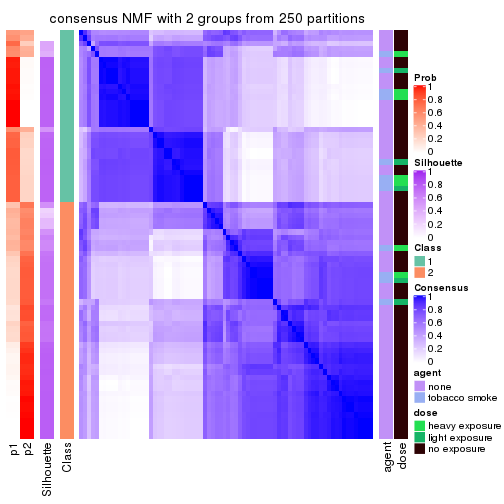</p>

</div>
<div id='tab-MAD-NMF-consensus-heatmap-2'>
<pre><code class="r">consensus_heatmap(res, k = 3)
</code></pre>

<p>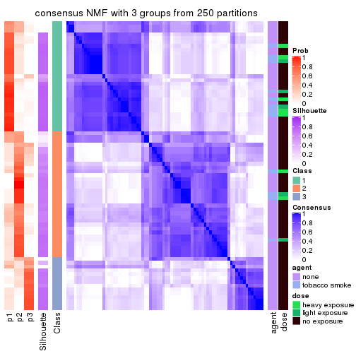</p>

</div>
<div id='tab-MAD-NMF-consensus-heatmap-3'>
<pre><code class="r">consensus_heatmap(res, k = 4)
</code></pre>

<p>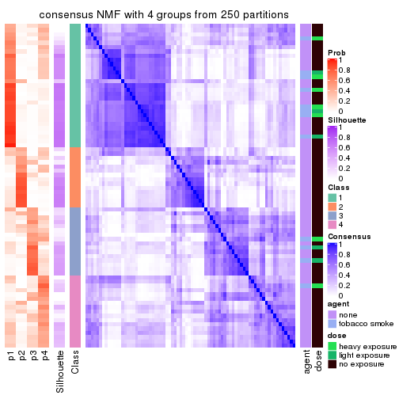</p>

</div>
<div id='tab-MAD-NMF-consensus-heatmap-4'>
<pre><code class="r">consensus_heatmap(res, k = 5)
</code></pre>

<p>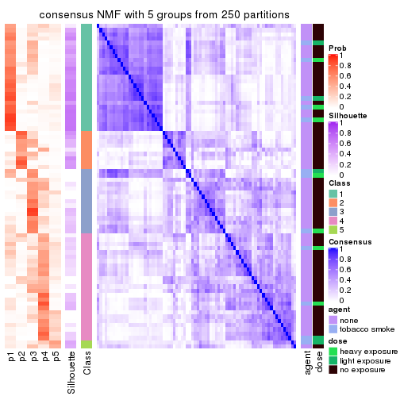</p>

</div>
<div id='tab-MAD-NMF-consensus-heatmap-5'>
<pre><code class="r">consensus_heatmap(res, k = 6)
</code></pre>

<p>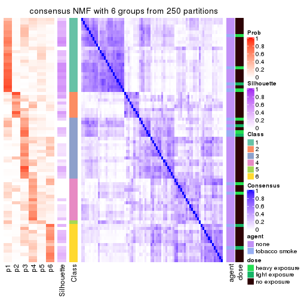</p>

</div>
</div>

Heatmaps for the membership of samples in all partitions to see how consistent they are:


<script>
$( function() {
	$( '#tabs-MAD-NMF-membership-heatmap' ).tabs();
} );
</script>
<div id='tabs-MAD-NMF-membership-heatmap'>
<ul>
<li><a href='#tab-MAD-NMF-membership-heatmap-1'>k = 2</a></li>
<li><a href='#tab-MAD-NMF-membership-heatmap-2'>k = 3</a></li>
<li><a href='#tab-MAD-NMF-membership-heatmap-3'>k = 4</a></li>
<li><a href='#tab-MAD-NMF-membership-heatmap-4'>k = 5</a></li>
<li><a href='#tab-MAD-NMF-membership-heatmap-5'>k = 6</a></li>
</ul>
<div id='tab-MAD-NMF-membership-heatmap-1'>
<pre><code class="r">membership_heatmap(res, k = 2)
</code></pre>

<p>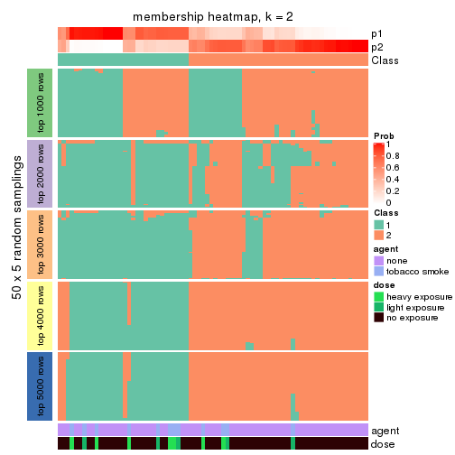</p>

</div>
<div id='tab-MAD-NMF-membership-heatmap-2'>
<pre><code class="r">membership_heatmap(res, k = 3)
</code></pre>

<p>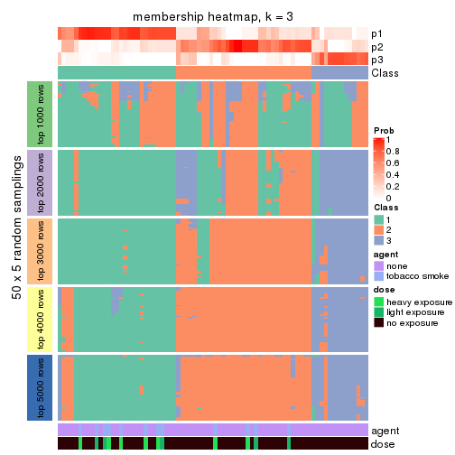</p>

</div>
<div id='tab-MAD-NMF-membership-heatmap-3'>
<pre><code class="r">membership_heatmap(res, k = 4)
</code></pre>

<p>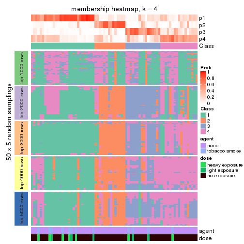</p>

</div>
<div id='tab-MAD-NMF-membership-heatmap-4'>
<pre><code class="r">membership_heatmap(res, k = 5)
</code></pre>

<p>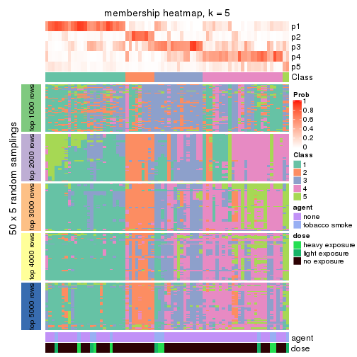</p>

</div>
<div id='tab-MAD-NMF-membership-heatmap-5'>
<pre><code class="r">membership_heatmap(res, k = 6)
</code></pre>

<p>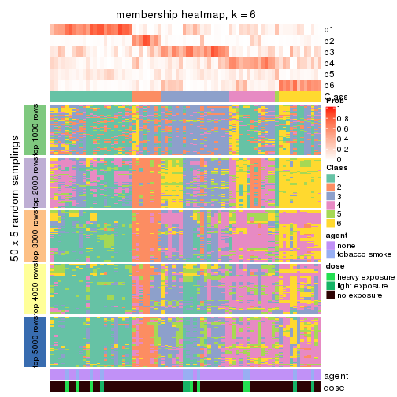</p>

</div>
</div>

As soon as we have had the classes for columns, we can look for signatures
which are significantly different between classes which can be candidate marks
for certain classes. Following are the heatmaps for signatures.


Signature heatmaps where rows are scaled:


<script>
$( function() {
	$( '#tabs-MAD-NMF-get-signatures' ).tabs();
} );
</script>
<div id='tabs-MAD-NMF-get-signatures'>
<ul>
<li><a href='#tab-MAD-NMF-get-signatures-1'>k = 2</a></li>
<li><a href='#tab-MAD-NMF-get-signatures-2'>k = 3</a></li>
<li><a href='#tab-MAD-NMF-get-signatures-3'>k = 4</a></li>
<li><a href='#tab-MAD-NMF-get-signatures-4'>k = 5</a></li>
<li><a href='#tab-MAD-NMF-get-signatures-5'>k = 6</a></li>
</ul>
<div id='tab-MAD-NMF-get-signatures-1'>
<pre><code class="r">get_signatures(res, k = 2)
</code></pre>

<p>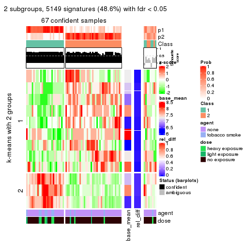</p>

</div>
<div id='tab-MAD-NMF-get-signatures-2'>
<pre><code class="r">get_signatures(res, k = 3)
</code></pre>

<p>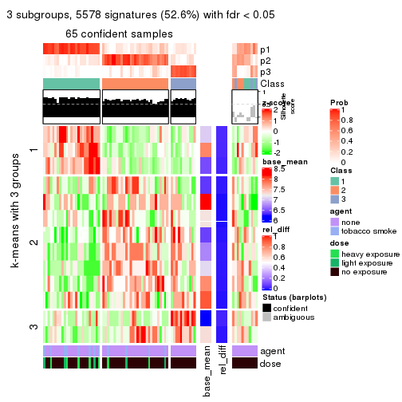</p>

</div>
<div id='tab-MAD-NMF-get-signatures-3'>
<pre><code class="r">get_signatures(res, k = 4)
</code></pre>

<p>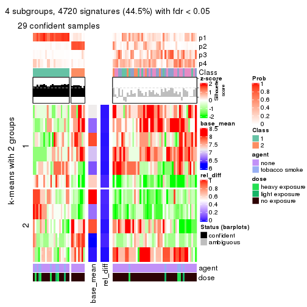</p>

</div>
<div id='tab-MAD-NMF-get-signatures-4'>
<pre><code class="r">get_signatures(res, k = 5)
</code></pre>

<p>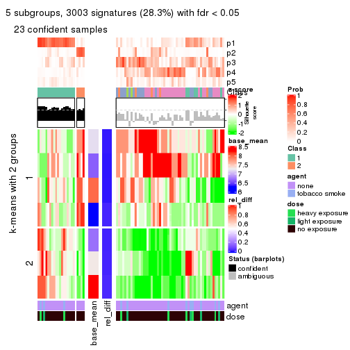</p>

</div>
<div id='tab-MAD-NMF-get-signatures-5'>
<pre><code class="r">get_signatures(res, k = 6)
</code></pre>

<p></p>

</div>
</div>


Signature heatmaps where rows are not scaled:


<script>
$( function() {
	$( '#tabs-MAD-NMF-get-signatures-no-scale' ).tabs();
} );
</script>
<div id='tabs-MAD-NMF-get-signatures-no-scale'>
<ul>
<li><a href='#tab-MAD-NMF-get-signatures-no-scale-1'>k = 2</a></li>
<li><a href='#tab-MAD-NMF-get-signatures-no-scale-2'>k = 3</a></li>
<li><a href='#tab-MAD-NMF-get-signatures-no-scale-3'>k = 4</a></li>
<li><a href='#tab-MAD-NMF-get-signatures-no-scale-4'>k = 5</a></li>
<li><a href='#tab-MAD-NMF-get-signatures-no-scale-5'>k = 6</a></li>
</ul>
<div id='tab-MAD-NMF-get-signatures-no-scale-1'>
<pre><code class="r">get_signatures(res, k = 2, scale_rows = FALSE)
</code></pre>

<p>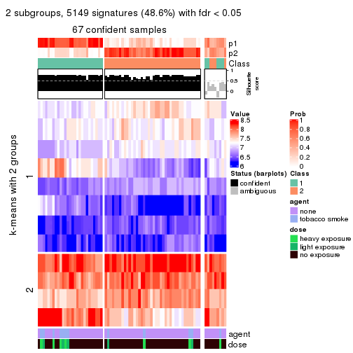</p>

</div>
<div id='tab-MAD-NMF-get-signatures-no-scale-2'>
<pre><code class="r">get_signatures(res, k = 3, scale_rows = FALSE)
</code></pre>

<p>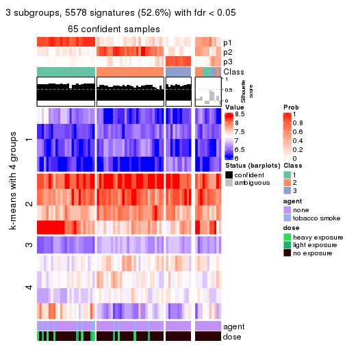</p>

</div>
<div id='tab-MAD-NMF-get-signatures-no-scale-3'>
<pre><code class="r">get_signatures(res, k = 4, scale_rows = FALSE)
</code></pre>

<p>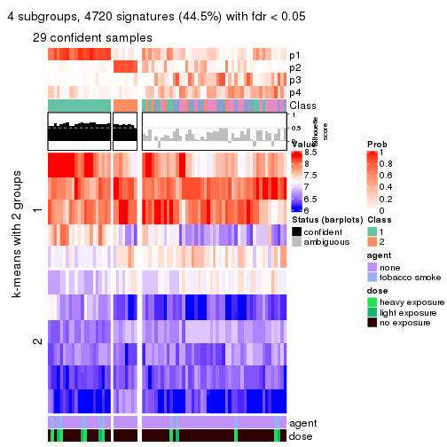</p>

</div>
<div id='tab-MAD-NMF-get-signatures-no-scale-4'>
<pre><code class="r">get_signatures(res, k = 5, scale_rows = FALSE)
</code></pre>

<p>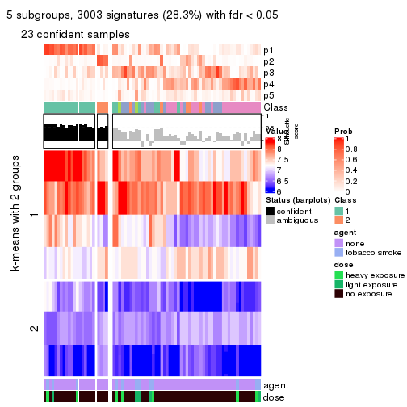</p>

</div>
<div id='tab-MAD-NMF-get-signatures-no-scale-5'>
<pre><code class="r">get_signatures(res, k = 6, scale_rows = FALSE)
</code></pre>

<p></p>

</div>
</div>


Compare the overlap of signatures from different k:

```r
compare_signatures(res)
```

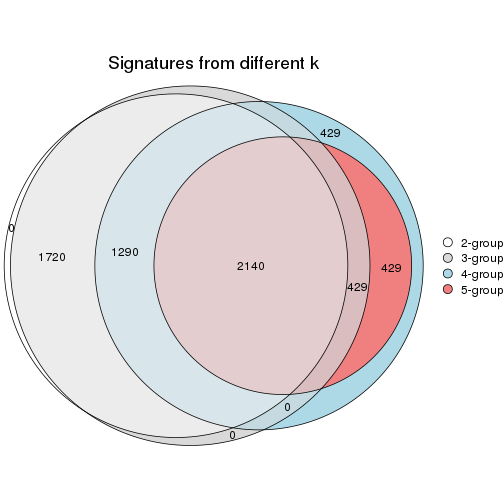

`get_signature()` returns a data frame invisibly. TO get the list of signatures, the function
call should be assigned to a variable explicitly. In following code, if `plot` argument is set
to `FALSE`, no heatmap is plotted while only the differential analysis is performed.

```r
# code only for demonstration
tb = get_signature(res, k = ..., plot = FALSE)
```

An example of the output of `tb` is:

```
#>   which_row         fdr    mean_1    mean_2 scaled_mean_1 scaled_mean_2 km
#> 1        38 0.042760348  8.373488  9.131774    -0.5533452     0.5164555  1
#> 2        40 0.018707592  7.106213  8.469186    -0.6173731     0.5762149  1
#> 3        55 0.019134737 10.221463 11.207825    -0.6159697     0.5749050  1
#> 4        59 0.006059896  5.921854  7.869574    -0.6899429     0.6439467  1
#> 5        60 0.018055526  8.928898 10.211722    -0.6204761     0.5791110  1
#> 6        98 0.009384629 15.714769 14.887706     0.6635654    -0.6193277  2
...
```

The columns in `tb` are:

1. `which_row`: row indices corresponding to the input matrix.
2. `fdr`: FDR for the differential test. 
3. `mean_x`: The mean value in group x.
4. `scaled_mean_x`: The mean value in group x after rows are scaled.
5. `km`: Row groups if k-means clustering is applied to rows.


UMAP plot which shows how samples are separated.


<script>
$( function() {
	$( '#tabs-MAD-NMF-dimension-reduction' ).tabs();
} );
</script>
<div id='tabs-MAD-NMF-dimension-reduction'>
<ul>
<li><a href='#tab-MAD-NMF-dimension-reduction-1'>k = 2</a></li>
<li><a href='#tab-MAD-NMF-dimension-reduction-2'>k = 3</a></li>
<li><a href='#tab-MAD-NMF-dimension-reduction-3'>k = 4</a></li>
<li><a href='#tab-MAD-NMF-dimension-reduction-4'>k = 5</a></li>
<li><a href='#tab-MAD-NMF-dimension-reduction-5'>k = 6</a></li>
</ul>
<div id='tab-MAD-NMF-dimension-reduction-1'>
<pre><code class="r">dimension_reduction(res, k = 2, method = &quot;UMAP&quot;)
</code></pre>

<p>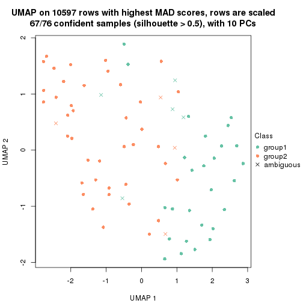</p>

</div>
<div id='tab-MAD-NMF-dimension-reduction-2'>
<pre><code class="r">dimension_reduction(res, k = 3, method = &quot;UMAP&quot;)
</code></pre>

<p>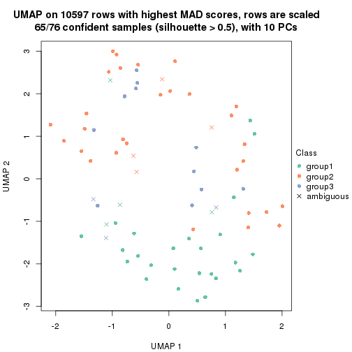</p>

</div>
<div id='tab-MAD-NMF-dimension-reduction-3'>
<pre><code class="r">dimension_reduction(res, k = 4, method = &quot;UMAP&quot;)
</code></pre>

<p>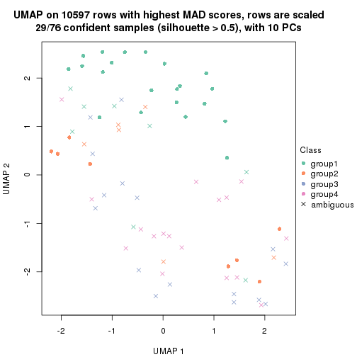</p>

</div>
<div id='tab-MAD-NMF-dimension-reduction-4'>
<pre><code class="r">dimension_reduction(res, k = 5, method = &quot;UMAP&quot;)
</code></pre>

<p>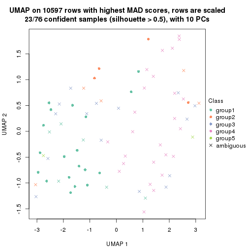</p>

</div>
<div id='tab-MAD-NMF-dimension-reduction-5'>
<pre><code class="r">dimension_reduction(res, k = 6, method = &quot;UMAP&quot;)
</code></pre>

<p>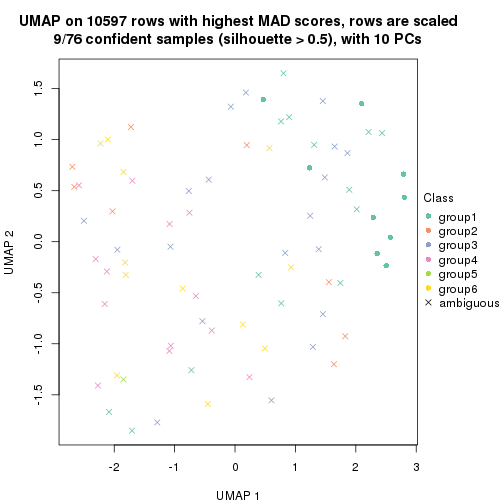</p>

</div>
</div>


Following heatmap shows how subgroups are split when increasing `k`:

```r
collect_classes(res)
```

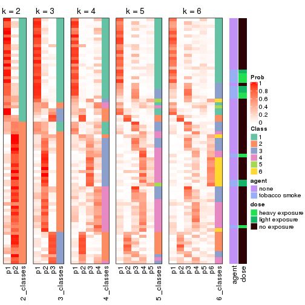


Test correlation between subgroups and known annotations. If the known
annotation is numeric, one-way ANOVA test is applied, and if the known
annotation is discrete, chi-squared contingency table test is applied.

```r
test_to_known_factors(res)
```

```
#>          n agent(p) dose(p) k
#> MAD:NMF 67   0.1646   0.220 2
#> MAD:NMF 65   0.0509   0.189 3
#> MAD:NMF 29   0.1647   0.172 4
#> MAD:NMF 23   0.9717   0.695 5
#> MAD:NMF  9       NA      NA 6
```


If matrix rows can be associated to genes, consider to use `GO_Enrichment(res,
...)` to perform function enrichment for the signature genes.


 

---------------------------------------------------


### ATC:hclust


The object with results only for a single top-value method and a single partition method 
can be extracted as:

```r
res = res_list["ATC", "hclust"]
# you can also extract it by
# res = res_list["ATC:hclust"]
```

A summary of `res` and all the functions that can be applied to it:

```r
res
```

```
#> A 'ConsensusPartition' object with k = 2, 3, 4, 5, 6.
#>   On a matrix with 10597 rows and 76 columns.
#>   Top rows (1000, 2000, 3000, 4000, 5000) are extracted by 'ATC' method.
#>   Subgroups are detected by 'hclust' method.
#>   Performed in total 1250 partitions by row resampling.
#>   Best k for subgroups seems to be 2.
#> 
#> Following methods can be applied to this 'ConsensusPartition' object:
#>  [1] "cola_report"             "collect_classes"         "collect_plots"          
#>  [4] "collect_stats"           "colnames"                "compare_signatures"     
#>  [7] "consensus_heatmap"       "dimension_reduction"     "functional_enrichment"  
#> [10] "get_anno_col"            "get_anno"                "get_classes"            
#> [13] "get_consensus"           "get_matrix"              "get_membership"         
#> [16] "get_param"               "get_signatures"          "get_stats"              
#> [19] "is_best_k"               "is_stable_k"             "membership_heatmap"     
#> [22] "ncol"                    "nrow"                    "plot_ecdf"              
#> [25] "rownames"                "select_partition_number" "show"                   
#> [28] "suggest_best_k"          "test_to_known_factors"
```

`collect_plots()` function collects all the plots made from `res` for all `k` (number of partitions)
into one single page to provide an easy and fast comparison between different `k`.

```r
collect_plots(res)
```

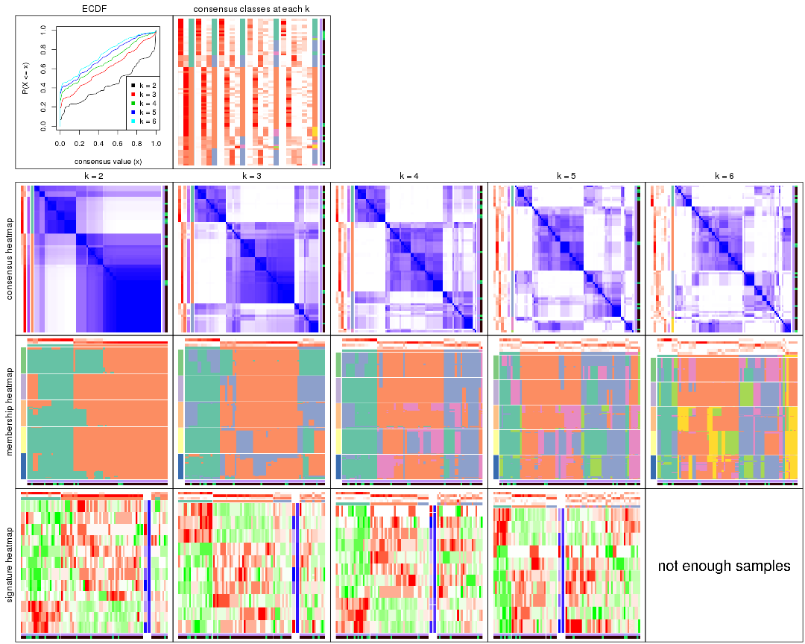

The plots are:

- The first row: a plot of the ECDF (Empirical cumulative distribution
  function) curves of the consensus matrix for each `k` and the heatmap of
  predicted classes for each `k`.
- The second row: heatmaps of the consensus matrix for each `k`.
- The third row: heatmaps of the membership matrix for each `k`.
- The fouth row: heatmaps of the signatures for each `k`.

All the plots in panels can be made by individual functions and they are
plotted later in this section.

`select_partition_number()` produces several plots showing different
statistics for choosing "optimized" `k`. There are following statistics:

- ECDF curves of the consensus matrix for each `k`;
- 1-PAC. [The PAC
  score](https://en.wikipedia.org/wiki/Consensus_clustering#Over-interpretation_potential_of_consensus_clustering)
  measures the proportion of the ambiguous subgrouping.
- Mean silhouette score.
- Concordance. The mean probability of fiting the consensus class ids in all
  partitions.
- Area increased. Denote $A_k$ as the area under the ECDF curve for current
  `k`, the area increased is defined as $A_k - A_{k-1}$.
- Rand index. The percent of pairs of samples that are both in a same cluster
  or both are not in a same cluster in the partition of k and k-1.
- Jaccard index. The ratio of pairs of samples are both in a same cluster in
  the partition of k and k-1 and the pairs of samples are both in a same
  cluster in the partition k or k-1.

The detailed explanations of these statistics can be found in [the cola
vignette](http://bioconductor.org/packages/devel/bioc/vignettes/cola/inst/doc/cola.html#toc_13).

Generally speaking, lower PAC score, higher mean silhouette score or higher
concordance corresponds to better partition. Rand index and Jaccard index
measure how similar the current partition is compared to partition with `k-1`.
If they are too similar, we won't accept `k` is better than `k-1`.

```r
select_partition_number(res)
```

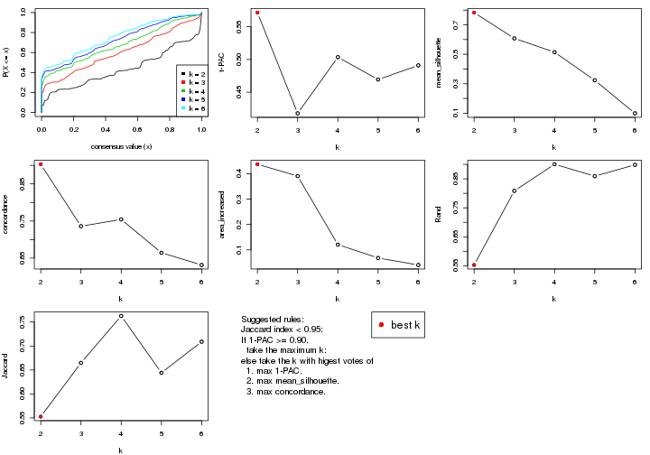

The numeric values for all these statistics can be obtained by `get_stats()`.

```r
get_stats(res)
```

```
#>   k 1-PAC mean_silhouette concordance area_increased  Rand Jaccard
#> 2 2 0.572          0.7830       0.903         0.4371 0.553   0.553
#> 3 3 0.418          0.6081       0.736         0.3906 0.808   0.665
#> 4 4 0.504          0.5143       0.754         0.1208 0.900   0.763
#> 5 5 0.469          0.3233       0.664         0.0683 0.859   0.644
#> 6 6 0.491          0.0992       0.631         0.0407 0.899   0.709
```

`suggest_best_k()` suggests the best $k$ based on these statistics. The rules are as follows:

- All $k$ with Jaccard index larger than 0.95 are removed because the increase of
  the partition number does not provides enough extra information. If all $k$ are removed,
  the best $k$ is assigned by `NA`.
- For $k$ with 1-PAC larger than 0.9, the maximal $k$ is taken as the "best k". Other $k$ is called "optional k".
- If it does not fit the second rule. The $k$ with the highest vote of highest
  1-PAC, mean silhouette and concordance is taken as the "best k".

```r
suggest_best_k(res)
```

```
#> [1] 2
```


Following shows the table of the partitions (You need to click the **show/hide
code output** link to see it). The membership matrix (columns with name `p*`)
is inferred by
[`clue::cl_consensus()`](https://www.rdocumentation.org/link/cl_consensus?package=clue)
function with the `SE` method. Basically the value in the membership matrix
represents the probability to belong to a certain group. The finall class
label for an item is determined with the group with highest probability it
belongs to.

In `get_classes()` function, the entropy is calculated from the membership
matrix and the silhouette score is calculated from the consensus matrix.


<script>
$( function() {
	$( '#tabs-ATC-hclust-get-classes' ).tabs();
} );
</script>
<div id='tabs-ATC-hclust-get-classes'>
<ul>
<li><a href='#tab-ATC-hclust-get-classes-1'>k = 2</a></li>
<li><a href='#tab-ATC-hclust-get-classes-2'>k = 3</a></li>
<li><a href='#tab-ATC-hclust-get-classes-3'>k = 4</a></li>
<li><a href='#tab-ATC-hclust-get-classes-4'>k = 5</a></li>
<li><a href='#tab-ATC-hclust-get-classes-5'>k = 6</a></li>
</ul>

<div id='tab-ATC-hclust-get-classes-1'>
<p><a id='tab-ATC-hclust-get-classes-1-a' style='color:#0366d6' href='#'>show/hide code output</a></p>
<pre><code class="r">cbind(get_classes(res, k = 2), get_membership(res, k = 2))
</code></pre>

<pre><code>#&gt;           class entropy silhouette    p1    p2
#&gt; GSM451162     2  0.9608      0.433 0.384 0.616
#&gt; GSM451163     2  0.0000      0.887 0.000 1.000
#&gt; GSM451164     2  0.0000      0.887 0.000 1.000
#&gt; GSM451165     2  0.0672      0.884 0.008 0.992
#&gt; GSM451167     2  0.6801      0.760 0.180 0.820
#&gt; GSM451168     2  0.0000      0.887 0.000 1.000
#&gt; GSM451169     2  0.6801      0.760 0.180 0.820
#&gt; GSM451170     1  0.2778      0.865 0.952 0.048
#&gt; GSM451171     2  0.0000      0.887 0.000 1.000
#&gt; GSM451172     2  0.0672      0.884 0.008 0.992
#&gt; GSM451173     1  0.4562      0.837 0.904 0.096
#&gt; GSM451174     2  0.0000      0.887 0.000 1.000
#&gt; GSM451175     1  0.9954      0.149 0.540 0.460
#&gt; GSM451177     2  0.0000      0.887 0.000 1.000
#&gt; GSM451178     2  0.0000      0.887 0.000 1.000
#&gt; GSM451179     2  0.9552      0.453 0.376 0.624
#&gt; GSM451180     2  0.0000      0.887 0.000 1.000
#&gt; GSM451181     2  0.0000      0.887 0.000 1.000
#&gt; GSM451182     1  0.2778      0.865 0.952 0.048
#&gt; GSM451183     1  0.0000      0.863 1.000 0.000
#&gt; GSM451184     2  0.8144      0.681 0.252 0.748
#&gt; GSM451185     1  0.0000      0.863 1.000 0.000
#&gt; GSM451186     2  0.2948      0.864 0.052 0.948
#&gt; GSM451187     2  0.0000      0.887 0.000 1.000
#&gt; GSM451188     2  0.0000      0.887 0.000 1.000
#&gt; GSM451189     1  0.1414      0.868 0.980 0.020
#&gt; GSM451190     1  0.2603      0.866 0.956 0.044
#&gt; GSM451191     1  0.2778      0.865 0.952 0.048
#&gt; GSM451193     2  0.8144      0.681 0.252 0.748
#&gt; GSM451195     1  0.9954      0.149 0.540 0.460
#&gt; GSM451196     1  0.0000      0.863 1.000 0.000
#&gt; GSM451197     1  0.0000      0.863 1.000 0.000
#&gt; GSM451199     1  0.9954      0.149 0.540 0.460
#&gt; GSM451201     1  0.0000      0.863 1.000 0.000
#&gt; GSM451202     2  0.0000      0.887 0.000 1.000
#&gt; GSM451203     2  0.6801      0.760 0.180 0.820
#&gt; GSM451204     2  0.1414      0.879 0.020 0.980
#&gt; GSM451205     2  0.0000      0.887 0.000 1.000
#&gt; GSM451206     2  0.0000      0.887 0.000 1.000
#&gt; GSM451207     2  0.0000      0.887 0.000 1.000
#&gt; GSM451208     2  0.0000      0.887 0.000 1.000
#&gt; GSM451209     2  0.7453      0.730 0.212 0.788
#&gt; GSM451210     2  0.0000      0.887 0.000 1.000
#&gt; GSM451212     2  0.0938      0.883 0.012 0.988
#&gt; GSM451213     2  0.0000      0.887 0.000 1.000
#&gt; GSM451214     2  0.9552      0.453 0.376 0.624
#&gt; GSM451215     2  0.0000      0.887 0.000 1.000
#&gt; GSM451216     2  0.0000      0.887 0.000 1.000
#&gt; GSM451217     2  0.0000      0.887 0.000 1.000
#&gt; GSM451219     1  0.8386      0.632 0.732 0.268
#&gt; GSM451220     1  0.4562      0.837 0.904 0.096
#&gt; GSM451221     1  0.8555      0.614 0.720 0.280
#&gt; GSM451222     1  0.2043      0.866 0.968 0.032
#&gt; GSM451224     2  0.1414      0.879 0.020 0.980
#&gt; GSM451225     2  0.8267      0.670 0.260 0.740
#&gt; GSM451226     2  0.8016      0.691 0.244 0.756
#&gt; GSM451227     2  0.9552      0.453 0.376 0.624
#&gt; GSM451228     2  0.9552      0.453 0.376 0.624
#&gt; GSM451230     2  0.7674      0.715 0.224 0.776
#&gt; GSM451231     2  0.2603      0.867 0.044 0.956
#&gt; GSM451233     2  0.0938      0.883 0.012 0.988
#&gt; GSM451234     2  0.0000      0.887 0.000 1.000
#&gt; GSM451235     2  0.0000      0.887 0.000 1.000
#&gt; GSM451236     2  0.0000      0.887 0.000 1.000
#&gt; GSM451166     2  0.9552      0.453 0.376 0.624
#&gt; GSM451194     1  0.8608      0.607 0.716 0.284
#&gt; GSM451198     1  0.1414      0.868 0.980 0.020
#&gt; GSM451218     2  0.0000      0.887 0.000 1.000
#&gt; GSM451232     1  0.0000      0.863 1.000 0.000
#&gt; GSM451176     1  0.1414      0.868 0.980 0.020
#&gt; GSM451192     1  0.2603      0.866 0.956 0.044
#&gt; GSM451200     1  0.1414      0.868 0.980 0.020
#&gt; GSM451211     2  0.0000      0.887 0.000 1.000
#&gt; GSM451223     2  0.7376      0.711 0.208 0.792
#&gt; GSM451229     1  0.0000      0.863 1.000 0.000
#&gt; GSM451237     2  0.0000      0.887 0.000 1.000
</code></pre>

<script>
$('#tab-ATC-hclust-get-classes-1-a').parent().next().next().hide();
$('#tab-ATC-hclust-get-classes-1-a').click(function(){
  $('#tab-ATC-hclust-get-classes-1-a').parent().next().next().toggle();
  return(false);
});
</script>
</div>

<div id='tab-ATC-hclust-get-classes-2'>
<p><a id='tab-ATC-hclust-get-classes-2-a' style='color:#0366d6' href='#'>show/hide code output</a></p>
<pre><code class="r">cbind(get_classes(res, k = 3), get_membership(res, k = 3))
</code></pre>

<pre><code>#&gt;           class entropy silhouette    p1    p2    p3
#&gt; GSM451162     3  0.6772    0.68726 0.032 0.304 0.664
#&gt; GSM451163     2  0.3482    0.73589 0.000 0.872 0.128
#&gt; GSM451164     2  0.3412    0.73601 0.000 0.876 0.124
#&gt; GSM451165     2  0.3686    0.73288 0.000 0.860 0.140
#&gt; GSM451167     2  0.6881    0.34999 0.020 0.592 0.388
#&gt; GSM451168     2  0.2261    0.77361 0.000 0.932 0.068
#&gt; GSM451169     2  0.6937    0.30100 0.020 0.576 0.404
#&gt; GSM451170     1  0.5650    0.69983 0.688 0.000 0.312
#&gt; GSM451171     2  0.1411    0.77563 0.000 0.964 0.036
#&gt; GSM451172     2  0.3619    0.73289 0.000 0.864 0.136
#&gt; GSM451173     1  0.6713    0.53024 0.572 0.012 0.416
#&gt; GSM451174     2  0.0424    0.78000 0.000 0.992 0.008
#&gt; GSM451175     3  0.8603    0.54931 0.232 0.168 0.600
#&gt; GSM451177     2  0.0592    0.77946 0.000 0.988 0.012
#&gt; GSM451178     2  0.0747    0.77927 0.000 0.984 0.016
#&gt; GSM451179     3  0.6625    0.68801 0.024 0.316 0.660
#&gt; GSM451180     2  0.4291    0.69856 0.000 0.820 0.180
#&gt; GSM451181     2  0.0592    0.77946 0.000 0.988 0.012
#&gt; GSM451182     1  0.5650    0.69983 0.688 0.000 0.312
#&gt; GSM451183     1  0.1643    0.76877 0.956 0.000 0.044
#&gt; GSM451184     2  0.6952    0.05671 0.024 0.600 0.376
#&gt; GSM451185     1  0.0000    0.76028 1.000 0.000 0.000
#&gt; GSM451186     2  0.7724    0.28864 0.052 0.552 0.396
#&gt; GSM451187     2  0.0747    0.77927 0.000 0.984 0.016
#&gt; GSM451188     2  0.4452    0.69499 0.000 0.808 0.192
#&gt; GSM451189     1  0.3619    0.76547 0.864 0.000 0.136
#&gt; GSM451190     1  0.5560    0.70556 0.700 0.000 0.300
#&gt; GSM451191     1  0.5650    0.69983 0.688 0.000 0.312
#&gt; GSM451193     2  0.6512    0.29737 0.024 0.676 0.300
#&gt; GSM451195     3  0.8603    0.54931 0.232 0.168 0.600
#&gt; GSM451196     1  0.0000    0.76028 1.000 0.000 0.000
#&gt; GSM451197     1  0.2711    0.78750 0.912 0.000 0.088
#&gt; GSM451199     3  0.8603    0.54931 0.232 0.168 0.600
#&gt; GSM451201     1  0.2711    0.78750 0.912 0.000 0.088
#&gt; GSM451202     2  0.0892    0.77889 0.000 0.980 0.020
#&gt; GSM451203     2  0.6937    0.30100 0.020 0.576 0.404
#&gt; GSM451204     2  0.4883    0.68284 0.004 0.788 0.208
#&gt; GSM451205     2  0.1643    0.77723 0.000 0.956 0.044
#&gt; GSM451206     2  0.0747    0.77927 0.000 0.984 0.016
#&gt; GSM451207     2  0.0592    0.77946 0.000 0.988 0.012
#&gt; GSM451208     2  0.4291    0.69856 0.000 0.820 0.180
#&gt; GSM451209     3  0.6420    0.47546 0.024 0.288 0.688
#&gt; GSM451210     2  0.0892    0.77889 0.000 0.980 0.020
#&gt; GSM451212     2  0.3619    0.73367 0.000 0.864 0.136
#&gt; GSM451213     2  0.0747    0.77927 0.000 0.984 0.016
#&gt; GSM451214     3  0.6625    0.68801 0.024 0.316 0.660
#&gt; GSM451215     2  0.4291    0.69856 0.000 0.820 0.180
#&gt; GSM451216     2  0.0747    0.77927 0.000 0.984 0.016
#&gt; GSM451217     2  0.4452    0.69499 0.000 0.808 0.192
#&gt; GSM451219     3  0.6111   -0.00305 0.396 0.000 0.604
#&gt; GSM451220     1  0.6713    0.53024 0.572 0.012 0.416
#&gt; GSM451221     3  0.6451    0.04564 0.384 0.008 0.608
#&gt; GSM451222     1  0.5360    0.72584 0.768 0.012 0.220
#&gt; GSM451224     2  0.4883    0.68284 0.004 0.788 0.208
#&gt; GSM451225     3  0.6108    0.55391 0.028 0.240 0.732
#&gt; GSM451226     2  0.7186   -0.31893 0.024 0.500 0.476
#&gt; GSM451227     3  0.6625    0.68801 0.024 0.316 0.660
#&gt; GSM451228     3  0.6625    0.68801 0.024 0.316 0.660
#&gt; GSM451230     2  0.6603    0.21355 0.020 0.648 0.332
#&gt; GSM451231     3  0.6513   -0.11904 0.004 0.476 0.520
#&gt; GSM451233     2  0.1163    0.77347 0.000 0.972 0.028
#&gt; GSM451234     2  0.3412    0.73601 0.000 0.876 0.124
#&gt; GSM451235     2  0.4504    0.69354 0.000 0.804 0.196
#&gt; GSM451236     2  0.4504    0.69354 0.000 0.804 0.196
#&gt; GSM451166     3  0.6625    0.68801 0.024 0.316 0.660
#&gt; GSM451194     3  0.6587   -0.04531 0.424 0.008 0.568
#&gt; GSM451198     1  0.4291    0.75941 0.820 0.000 0.180
#&gt; GSM451218     2  0.0747    0.77927 0.000 0.984 0.016
#&gt; GSM451232     1  0.0000    0.76028 1.000 0.000 0.000
#&gt; GSM451176     1  0.3267    0.75340 0.884 0.000 0.116
#&gt; GSM451192     1  0.5560    0.70556 0.700 0.000 0.300
#&gt; GSM451200     1  0.4291    0.75941 0.820 0.000 0.180
#&gt; GSM451211     2  0.0747    0.77927 0.000 0.984 0.016
#&gt; GSM451223     2  0.6521   -0.29111 0.004 0.504 0.492
#&gt; GSM451229     1  0.0000    0.76028 1.000 0.000 0.000
#&gt; GSM451237     2  0.3412    0.73601 0.000 0.876 0.124
</code></pre>

<script>
$('#tab-ATC-hclust-get-classes-2-a').parent().next().next().hide();
$('#tab-ATC-hclust-get-classes-2-a').click(function(){
  $('#tab-ATC-hclust-get-classes-2-a').parent().next().next().toggle();
  return(false);
});
</script>
</div>

<div id='tab-ATC-hclust-get-classes-3'>
<p><a id='tab-ATC-hclust-get-classes-3-a' style='color:#0366d6' href='#'>show/hide code output</a></p>
<pre><code class="r">cbind(get_classes(res, k = 4), get_membership(res, k = 4))
</code></pre>

<pre><code>#&gt;           class entropy silhouette    p1    p2    p3    p4
#&gt; GSM451162     3  0.3768     0.6210 0.008 0.184 0.808 0.000
#&gt; GSM451163     2  0.5137     0.4061 0.000 0.544 0.004 0.452
#&gt; GSM451164     2  0.4977     0.3966 0.000 0.540 0.000 0.460
#&gt; GSM451165     2  0.5257     0.4000 0.000 0.548 0.008 0.444
#&gt; GSM451167     4  0.7874     0.0870 0.000 0.336 0.284 0.380
#&gt; GSM451168     2  0.4153     0.6529 0.000 0.820 0.048 0.132
#&gt; GSM451169     2  0.7671    -0.2504 0.000 0.456 0.300 0.244
#&gt; GSM451170     1  0.4746     0.7020 0.688 0.000 0.304 0.008
#&gt; GSM451171     2  0.4605     0.5596 0.000 0.664 0.000 0.336
#&gt; GSM451172     2  0.5126     0.4015 0.000 0.552 0.004 0.444
#&gt; GSM451173     1  0.4972     0.5051 0.544 0.000 0.456 0.000
#&gt; GSM451174     2  0.4304     0.5965 0.000 0.716 0.000 0.284
#&gt; GSM451175     3  0.5438     0.4594 0.208 0.048 0.732 0.012
#&gt; GSM451177     2  0.1867     0.6445 0.000 0.928 0.000 0.072
#&gt; GSM451178     2  0.0376     0.6500 0.000 0.992 0.004 0.004
#&gt; GSM451179     3  0.3569     0.6230 0.000 0.196 0.804 0.000
#&gt; GSM451180     2  0.4281     0.6265 0.000 0.792 0.180 0.028
#&gt; GSM451181     2  0.1792     0.6459 0.000 0.932 0.000 0.068
#&gt; GSM451182     1  0.4746     0.7020 0.688 0.000 0.304 0.008
#&gt; GSM451183     1  0.1302     0.7589 0.956 0.000 0.044 0.000
#&gt; GSM451184     3  0.5602     0.2151 0.000 0.472 0.508 0.020
#&gt; GSM451185     1  0.0000     0.7507 1.000 0.000 0.000 0.000
#&gt; GSM451186     4  0.1545     0.3633 0.000 0.040 0.008 0.952
#&gt; GSM451187     2  0.3710     0.6187 0.000 0.804 0.004 0.192
#&gt; GSM451188     2  0.4874     0.6349 0.000 0.764 0.180 0.056
#&gt; GSM451189     1  0.3123     0.7486 0.844 0.000 0.156 0.000
#&gt; GSM451190     1  0.4406     0.7075 0.700 0.000 0.300 0.000
#&gt; GSM451191     1  0.4746     0.7020 0.688 0.000 0.304 0.008
#&gt; GSM451193     2  0.5558    -0.1867 0.000 0.548 0.432 0.020
#&gt; GSM451195     3  0.5438     0.4594 0.208 0.048 0.732 0.012
#&gt; GSM451196     1  0.0000     0.7507 1.000 0.000 0.000 0.000
#&gt; GSM451197     1  0.2149     0.7781 0.912 0.000 0.088 0.000
#&gt; GSM451199     3  0.5438     0.4594 0.208 0.048 0.732 0.012
#&gt; GSM451201     1  0.2149     0.7781 0.912 0.000 0.088 0.000
#&gt; GSM451202     2  0.4522     0.5741 0.000 0.680 0.000 0.320
#&gt; GSM451203     2  0.7671    -0.2504 0.000 0.456 0.300 0.244
#&gt; GSM451204     2  0.4155     0.5865 0.000 0.756 0.240 0.004
#&gt; GSM451205     2  0.4452     0.5826 0.000 0.732 0.008 0.260
#&gt; GSM451206     2  0.0376     0.6500 0.000 0.992 0.004 0.004
#&gt; GSM451207     2  0.1792     0.6459 0.000 0.932 0.000 0.068
#&gt; GSM451208     2  0.4281     0.6265 0.000 0.792 0.180 0.028
#&gt; GSM451209     3  0.6027     0.2532 0.000 0.192 0.684 0.124
#&gt; GSM451210     2  0.4522     0.5741 0.000 0.680 0.000 0.320
#&gt; GSM451212     2  0.4546     0.4820 0.000 0.732 0.012 0.256
#&gt; GSM451213     2  0.0376     0.6500 0.000 0.992 0.004 0.004
#&gt; GSM451214     3  0.3569     0.6230 0.000 0.196 0.804 0.000
#&gt; GSM451215     2  0.4281     0.6265 0.000 0.792 0.180 0.028
#&gt; GSM451216     2  0.0376     0.6500 0.000 0.992 0.004 0.004
#&gt; GSM451217     2  0.4874     0.6349 0.000 0.764 0.180 0.056
#&gt; GSM451219     3  0.4761     0.0216 0.372 0.000 0.628 0.000
#&gt; GSM451220     1  0.4972     0.5051 0.544 0.000 0.456 0.000
#&gt; GSM451221     3  0.5024     0.0629 0.360 0.008 0.632 0.000
#&gt; GSM451222     1  0.4134     0.6978 0.740 0.000 0.260 0.000
#&gt; GSM451224     2  0.4155     0.5865 0.000 0.756 0.240 0.004
#&gt; GSM451225     3  0.4181     0.4044 0.000 0.052 0.820 0.128
#&gt; GSM451226     3  0.5936     0.4058 0.000 0.324 0.620 0.056
#&gt; GSM451227     3  0.3569     0.6230 0.000 0.196 0.804 0.000
#&gt; GSM451228     3  0.3569     0.6230 0.000 0.196 0.804 0.000
#&gt; GSM451230     3  0.6506     0.0897 0.000 0.456 0.472 0.072
#&gt; GSM451231     3  0.7028    -0.1438 0.000 0.380 0.496 0.124
#&gt; GSM451233     2  0.2965     0.6208 0.000 0.892 0.036 0.072
#&gt; GSM451234     2  0.4972     0.4066 0.000 0.544 0.000 0.456
#&gt; GSM451235     2  0.3444     0.6206 0.000 0.816 0.184 0.000
#&gt; GSM451236     2  0.3626     0.6183 0.000 0.812 0.184 0.004
#&gt; GSM451166     3  0.3569     0.6230 0.000 0.196 0.804 0.000
#&gt; GSM451194     3  0.5172    -0.0372 0.404 0.008 0.588 0.000
#&gt; GSM451198     1  0.3610     0.7398 0.800 0.000 0.200 0.000
#&gt; GSM451218     2  0.0376     0.6500 0.000 0.992 0.004 0.004
#&gt; GSM451232     1  0.0000     0.7507 1.000 0.000 0.000 0.000
#&gt; GSM451176     1  0.2973     0.7317 0.856 0.000 0.144 0.000
#&gt; GSM451192     1  0.4406     0.7075 0.700 0.000 0.300 0.000
#&gt; GSM451200     1  0.3610     0.7398 0.800 0.000 0.200 0.000
#&gt; GSM451211     2  0.0376     0.6500 0.000 0.992 0.004 0.004
#&gt; GSM451223     3  0.4804     0.3503 0.000 0.384 0.616 0.000
#&gt; GSM451229     1  0.0000     0.7507 1.000 0.000 0.000 0.000
#&gt; GSM451237     2  0.4961     0.4109 0.000 0.552 0.000 0.448
</code></pre>

<script>
$('#tab-ATC-hclust-get-classes-3-a').parent().next().next().hide();
$('#tab-ATC-hclust-get-classes-3-a').click(function(){
  $('#tab-ATC-hclust-get-classes-3-a').parent().next().next().toggle();
  return(false);
});
</script>
</div>

<div id='tab-ATC-hclust-get-classes-4'>
<p><a id='tab-ATC-hclust-get-classes-4-a' style='color:#0366d6' href='#'>show/hide code output</a></p>
<pre><code class="r">cbind(get_classes(res, k = 5), get_membership(res, k = 5))
</code></pre>

<pre><code>#&gt;           class entropy silhouette    p1    p2    p3    p4    p5
#&gt; GSM451162     3  0.2929    0.53290 0.000 0.180 0.820 0.000 0.000
#&gt; GSM451163     4  0.4359    0.00722 0.000 0.412 0.000 0.584 0.004
#&gt; GSM451164     4  0.4182    0.02444 0.000 0.400 0.000 0.600 0.000
#&gt; GSM451165     2  0.4886    0.15821 0.000 0.528 0.000 0.448 0.024
#&gt; GSM451167     4  0.6898   -0.20996 0.000 0.328 0.276 0.392 0.004
#&gt; GSM451168     2  0.4615    0.47653 0.000 0.700 0.000 0.252 0.048
#&gt; GSM451169     2  0.6900    0.03453 0.000 0.436 0.300 0.256 0.008
#&gt; GSM451170     3  0.6266   -0.19173 0.376 0.000 0.472 0.000 0.152
#&gt; GSM451171     2  0.4297    0.20537 0.000 0.528 0.000 0.472 0.000
#&gt; GSM451172     2  0.4807    0.15932 0.000 0.532 0.000 0.448 0.020
#&gt; GSM451173     3  0.6424   -0.16673 0.356 0.000 0.512 0.112 0.020
#&gt; GSM451174     2  0.4067    0.43814 0.000 0.692 0.000 0.300 0.008
#&gt; GSM451175     3  0.4315    0.40651 0.020 0.000 0.796 0.112 0.072
#&gt; GSM451177     2  0.3266    0.50641 0.000 0.796 0.004 0.200 0.000
#&gt; GSM451178     2  0.0162    0.59676 0.000 0.996 0.004 0.000 0.000
#&gt; GSM451179     3  0.3039    0.53298 0.000 0.192 0.808 0.000 0.000
#&gt; GSM451180     2  0.3565    0.57321 0.000 0.800 0.000 0.024 0.176
#&gt; GSM451181     2  0.3231    0.50935 0.000 0.800 0.004 0.196 0.000
#&gt; GSM451182     3  0.6266   -0.19173 0.376 0.000 0.472 0.000 0.152
#&gt; GSM451183     1  0.7110    0.58893 0.560 0.000 0.208 0.088 0.144
#&gt; GSM451184     3  0.5726    0.23673 0.000 0.420 0.512 0.012 0.056
#&gt; GSM451185     1  0.6761    0.70705 0.512 0.000 0.180 0.288 0.020
#&gt; GSM451186     5  0.4430    0.00000 0.000 0.004 0.000 0.456 0.540
#&gt; GSM451187     2  0.3266    0.51404 0.000 0.796 0.004 0.200 0.000
#&gt; GSM451188     2  0.4429    0.57239 0.000 0.744 0.000 0.064 0.192
#&gt; GSM451189     4  0.8189   -0.67633 0.248 0.000 0.208 0.400 0.144
#&gt; GSM451190     3  0.6194   -0.20394 0.388 0.000 0.472 0.000 0.140
#&gt; GSM451191     3  0.6266   -0.19173 0.376 0.000 0.472 0.000 0.152
#&gt; GSM451193     2  0.5742   -0.07519 0.000 0.496 0.436 0.012 0.056
#&gt; GSM451195     3  0.4063    0.41287 0.020 0.000 0.812 0.112 0.056
#&gt; GSM451196     1  0.6761    0.70705 0.512 0.000 0.180 0.288 0.020
#&gt; GSM451197     1  0.3675    0.67654 0.788 0.000 0.188 0.000 0.024
#&gt; GSM451199     3  0.4063    0.41287 0.020 0.000 0.812 0.112 0.056
#&gt; GSM451201     1  0.3675    0.67654 0.788 0.000 0.188 0.000 0.024
#&gt; GSM451202     2  0.4283    0.24284 0.000 0.544 0.000 0.456 0.000
#&gt; GSM451203     2  0.6900    0.03453 0.000 0.436 0.300 0.256 0.008
#&gt; GSM451204     2  0.4325    0.55680 0.000 0.756 0.064 0.000 0.180
#&gt; GSM451205     2  0.3790    0.44201 0.000 0.724 0.000 0.272 0.004
#&gt; GSM451206     2  0.0162    0.59676 0.000 0.996 0.004 0.000 0.000
#&gt; GSM451207     2  0.3160    0.51553 0.000 0.808 0.004 0.188 0.000
#&gt; GSM451208     2  0.3565    0.57321 0.000 0.800 0.000 0.024 0.176
#&gt; GSM451209     3  0.7684    0.18884 0.180 0.132 0.500 0.000 0.188
#&gt; GSM451210     2  0.4283    0.24284 0.000 0.544 0.000 0.456 0.000
#&gt; GSM451212     2  0.4494    0.27578 0.000 0.608 0.012 0.380 0.000
#&gt; GSM451213     2  0.0162    0.59676 0.000 0.996 0.004 0.000 0.000
#&gt; GSM451214     3  0.3039    0.53298 0.000 0.192 0.808 0.000 0.000
#&gt; GSM451215     2  0.3565    0.57321 0.000 0.800 0.000 0.024 0.176
#&gt; GSM451216     2  0.0162    0.59676 0.000 0.996 0.004 0.000 0.000
#&gt; GSM451217     2  0.4429    0.57239 0.000 0.744 0.000 0.064 0.192
#&gt; GSM451219     3  0.5881    0.26394 0.060 0.000 0.688 0.112 0.140
#&gt; GSM451220     3  0.4196   -0.05537 0.356 0.000 0.640 0.000 0.004
#&gt; GSM451221     3  0.6091    0.27754 0.056 0.008 0.684 0.112 0.140
#&gt; GSM451222     1  0.7591    0.52606 0.340 0.000 0.308 0.312 0.040
#&gt; GSM451224     2  0.4325    0.55680 0.000 0.756 0.064 0.000 0.180
#&gt; GSM451225     3  0.7624    0.25466 0.180 0.000 0.500 0.112 0.208
#&gt; GSM451226     3  0.5411    0.37115 0.000 0.304 0.624 0.064 0.008
#&gt; GSM451227     3  0.3039    0.53298 0.000 0.192 0.808 0.000 0.000
#&gt; GSM451228     3  0.3039    0.53298 0.000 0.192 0.808 0.000 0.000
#&gt; GSM451230     3  0.6899    0.13906 0.000 0.324 0.460 0.200 0.016
#&gt; GSM451231     2  0.8394   -0.15892 0.180 0.320 0.312 0.000 0.188
#&gt; GSM451233     2  0.4096    0.48142 0.000 0.760 0.040 0.200 0.000
#&gt; GSM451234     4  0.4481    0.00881 0.000 0.416 0.000 0.576 0.008
#&gt; GSM451235     2  0.3123    0.57100 0.000 0.812 0.000 0.004 0.184
#&gt; GSM451236     2  0.2966    0.56946 0.000 0.816 0.000 0.000 0.184
#&gt; GSM451166     3  0.3039    0.53298 0.000 0.192 0.808 0.000 0.000
#&gt; GSM451194     3  0.4056    0.22580 0.200 0.008 0.768 0.000 0.024
#&gt; GSM451198     1  0.4445    0.60649 0.676 0.000 0.300 0.000 0.024
#&gt; GSM451218     2  0.0162    0.59676 0.000 0.996 0.004 0.000 0.000
#&gt; GSM451232     1  0.6761    0.70705 0.512 0.000 0.180 0.288 0.020
#&gt; GSM451176     4  0.7149   -0.70181 0.368 0.000 0.208 0.400 0.024
#&gt; GSM451192     1  0.6189    0.27276 0.476 0.000 0.384 0.000 0.140
#&gt; GSM451200     1  0.4779    0.51480 0.588 0.000 0.388 0.000 0.024
#&gt; GSM451211     2  0.0162    0.59676 0.000 0.996 0.004 0.000 0.000
#&gt; GSM451223     3  0.4126    0.33327 0.000 0.380 0.620 0.000 0.000
#&gt; GSM451229     1  0.6761    0.70705 0.512 0.000 0.180 0.288 0.020
#&gt; GSM451237     4  0.4219    0.00702 0.000 0.416 0.000 0.584 0.000
</code></pre>

<script>
$('#tab-ATC-hclust-get-classes-4-a').parent().next().next().hide();
$('#tab-ATC-hclust-get-classes-4-a').click(function(){
  $('#tab-ATC-hclust-get-classes-4-a').parent().next().next().toggle();
  return(false);
});
</script>
</div>

<div id='tab-ATC-hclust-get-classes-5'>
<p><a id='tab-ATC-hclust-get-classes-5-a' style='color:#0366d6' href='#'>show/hide code output</a></p>
<pre><code class="r">cbind(get_classes(res, k = 6), get_membership(res, k = 6))
</code></pre>

<pre><code>#&gt;           class entropy silhouette    p1    p2    p3    p4    p5    p6
#&gt; GSM451162     3   0.573    0.00408 0.000 0.184 0.488 0.328 0.000 0.000
#&gt; GSM451163     6   0.389    0.51581 0.000 0.400 0.000 0.000 0.004 0.596
#&gt; GSM451164     6   0.398    0.51777 0.000 0.396 0.000 0.000 0.008 0.596
#&gt; GSM451165     2   0.537   -0.20156 0.000 0.524 0.000 0.016 0.072 0.388
#&gt; GSM451167     6   0.715    0.06816 0.000 0.316 0.088 0.188 0.004 0.404
#&gt; GSM451168     2   0.506    0.12100 0.000 0.620 0.000 0.000 0.128 0.252
#&gt; GSM451169     2   0.790   -0.14183 0.000 0.420 0.096 0.208 0.060 0.216
#&gt; GSM451170     3   0.734   -0.16071 0.140 0.000 0.400 0.252 0.208 0.000
#&gt; GSM451171     6   0.499    0.27723 0.000 0.460 0.000 0.000 0.068 0.472
#&gt; GSM451172     2   0.533   -0.20487 0.000 0.524 0.000 0.016 0.068 0.392
#&gt; GSM451173     3   0.536   -0.14673 0.140 0.000 0.640 0.020 0.200 0.000
#&gt; GSM451174     2   0.514    0.06542 0.000 0.624 0.000 0.004 0.124 0.248
#&gt; GSM451175     3   0.159    0.22402 0.000 0.004 0.924 0.072 0.000 0.000
#&gt; GSM451177     2   0.279    0.25873 0.000 0.800 0.000 0.000 0.000 0.200
#&gt; GSM451178     2   0.000    0.43331 0.000 1.000 0.000 0.000 0.000 0.000
#&gt; GSM451179     3   0.580   -0.00554 0.000 0.196 0.476 0.328 0.000 0.000
#&gt; GSM451180     2   0.383    0.37187 0.000 0.708 0.000 0.000 0.268 0.024
#&gt; GSM451181     2   0.276    0.26272 0.000 0.804 0.000 0.000 0.000 0.196
#&gt; GSM451182     3   0.734   -0.16071 0.140 0.000 0.400 0.252 0.208 0.000
#&gt; GSM451183     1   0.727   -0.40069 0.428 0.000 0.220 0.144 0.208 0.000
#&gt; GSM451184     2   0.638   -0.39300 0.000 0.420 0.300 0.264 0.000 0.016
#&gt; GSM451185     1   0.000    0.42992 1.000 0.000 0.000 0.000 0.000 0.000
#&gt; GSM451186     6   0.351   -0.06403 0.000 0.000 0.000 0.016 0.240 0.744
#&gt; GSM451187     2   0.282    0.23553 0.000 0.796 0.000 0.000 0.000 0.204
#&gt; GSM451188     2   0.420    0.33129 0.000 0.592 0.000 0.004 0.392 0.012
#&gt; GSM451189     1   0.572   -0.04049 0.516 0.000 0.332 0.144 0.008 0.000
#&gt; GSM451190     3   0.697   -0.12102 0.152 0.000 0.488 0.152 0.208 0.000
#&gt; GSM451191     3   0.734   -0.16071 0.140 0.000 0.400 0.252 0.208 0.000
#&gt; GSM451193     2   0.608   -0.23099 0.000 0.496 0.300 0.188 0.000 0.016
#&gt; GSM451195     3   0.135    0.23655 0.000 0.004 0.940 0.056 0.000 0.000
#&gt; GSM451196     1   0.000    0.42992 1.000 0.000 0.000 0.000 0.000 0.000
#&gt; GSM451197     1   0.642   -0.74919 0.448 0.000 0.208 0.028 0.316 0.000
#&gt; GSM451199     3   0.135    0.23655 0.000 0.004 0.940 0.056 0.000 0.000
#&gt; GSM451201     1   0.642   -0.74919 0.448 0.000 0.208 0.028 0.316 0.000
#&gt; GSM451202     2   0.507   -0.35836 0.000 0.468 0.000 0.000 0.076 0.456
#&gt; GSM451203     2   0.790   -0.14183 0.000 0.420 0.096 0.208 0.060 0.216
#&gt; GSM451204     2   0.454    0.37247 0.000 0.684 0.060 0.000 0.248 0.008
#&gt; GSM451205     2   0.460    0.07349 0.000 0.652 0.000 0.000 0.072 0.276
#&gt; GSM451206     2   0.000    0.43331 0.000 1.000 0.000 0.000 0.000 0.000
#&gt; GSM451207     2   0.273    0.27029 0.000 0.808 0.000 0.000 0.000 0.192
#&gt; GSM451208     2   0.383    0.37187 0.000 0.708 0.000 0.000 0.268 0.024
#&gt; GSM451209     4   0.530    0.24073 0.000 0.076 0.168 0.692 0.056 0.008
#&gt; GSM451210     2   0.507   -0.35836 0.000 0.468 0.000 0.000 0.076 0.456
#&gt; GSM451212     2   0.407   -0.05256 0.000 0.596 0.000 0.012 0.000 0.392
#&gt; GSM451213     2   0.000    0.43331 0.000 1.000 0.000 0.000 0.000 0.000
#&gt; GSM451214     3   0.580   -0.00554 0.000 0.196 0.476 0.328 0.000 0.000
#&gt; GSM451215     2   0.383    0.37187 0.000 0.708 0.000 0.000 0.268 0.024
#&gt; GSM451216     2   0.026    0.43414 0.000 0.992 0.000 0.000 0.008 0.000
#&gt; GSM451217     2   0.420    0.33129 0.000 0.592 0.000 0.004 0.392 0.012
#&gt; GSM451219     3   0.458    0.21879 0.028 0.000 0.532 0.436 0.004 0.000
#&gt; GSM451220     3   0.658   -0.01924 0.140 0.000 0.544 0.116 0.200 0.000
#&gt; GSM451221     3   0.481    0.22903 0.028 0.008 0.520 0.440 0.004 0.000
#&gt; GSM451222     1   0.353    0.28066 0.740 0.000 0.244 0.016 0.000 0.000
#&gt; GSM451224     2   0.454    0.37247 0.000 0.684 0.060 0.000 0.248 0.008
#&gt; GSM451225     3   0.387   -0.23742 0.000 0.000 0.508 0.492 0.000 0.000
#&gt; GSM451226     4   0.731    0.08107 0.000 0.304 0.296 0.328 0.060 0.012
#&gt; GSM451227     3   0.580   -0.00554 0.000 0.196 0.476 0.328 0.000 0.000
#&gt; GSM451228     3   0.580   -0.00554 0.000 0.196 0.476 0.328 0.000 0.000
#&gt; GSM451230     2   0.767   -0.32714 0.000 0.312 0.252 0.224 0.000 0.212
#&gt; GSM451231     4   0.711    0.18058 0.000 0.264 0.276 0.396 0.056 0.008
#&gt; GSM451233     2   0.386    0.22814 0.000 0.756 0.024 0.016 0.000 0.204
#&gt; GSM451234     6   0.410    0.51359 0.000 0.408 0.000 0.000 0.012 0.580
#&gt; GSM451235     2   0.379    0.36208 0.000 0.660 0.000 0.000 0.332 0.008
#&gt; GSM451236     2   0.355    0.36248 0.000 0.668 0.000 0.000 0.332 0.000
#&gt; GSM451166     3   0.580   -0.00554 0.000 0.196 0.476 0.328 0.000 0.000
#&gt; GSM451194     3   0.631    0.20245 0.160 0.008 0.472 0.340 0.020 0.000
#&gt; GSM451198     5   0.645    0.00000 0.336 0.000 0.208 0.028 0.428 0.000
#&gt; GSM451218     2   0.000    0.43331 0.000 1.000 0.000 0.000 0.000 0.000
#&gt; GSM451232     1   0.000    0.42992 1.000 0.000 0.000 0.000 0.000 0.000
#&gt; GSM451176     1   0.230    0.36318 0.856 0.000 0.144 0.000 0.000 0.000
#&gt; GSM451192     3   0.725   -0.25995 0.152 0.000 0.400 0.152 0.296 0.000
#&gt; GSM451200     1   0.747   -0.51751 0.336 0.000 0.296 0.140 0.228 0.000
#&gt; GSM451211     2   0.026    0.43414 0.000 0.992 0.000 0.000 0.008 0.000
#&gt; GSM451223     3   0.598   -0.22665 0.000 0.384 0.388 0.228 0.000 0.000
#&gt; GSM451229     1   0.000    0.42992 1.000 0.000 0.000 0.000 0.000 0.000
#&gt; GSM451237     6   0.377    0.51369 0.000 0.408 0.000 0.000 0.000 0.592
</code></pre>

<script>
$('#tab-ATC-hclust-get-classes-5-a').parent().next().next().hide();
$('#tab-ATC-hclust-get-classes-5-a').click(function(){
  $('#tab-ATC-hclust-get-classes-5-a').parent().next().next().toggle();
  return(false);
});
</script>
</div>
</div>

Heatmaps for the consensus matrix. It visualizes the probability of two
samples to be in a same group.


<script>
$( function() {
	$( '#tabs-ATC-hclust-consensus-heatmap' ).tabs();
} );
</script>
<div id='tabs-ATC-hclust-consensus-heatmap'>
<ul>
<li><a href='#tab-ATC-hclust-consensus-heatmap-1'>k = 2</a></li>
<li><a href='#tab-ATC-hclust-consensus-heatmap-2'>k = 3</a></li>
<li><a href='#tab-ATC-hclust-consensus-heatmap-3'>k = 4</a></li>
<li><a href='#tab-ATC-hclust-consensus-heatmap-4'>k = 5</a></li>
<li><a href='#tab-ATC-hclust-consensus-heatmap-5'>k = 6</a></li>
</ul>
<div id='tab-ATC-hclust-consensus-heatmap-1'>
<pre><code class="r">consensus_heatmap(res, k = 2)
</code></pre>

<p>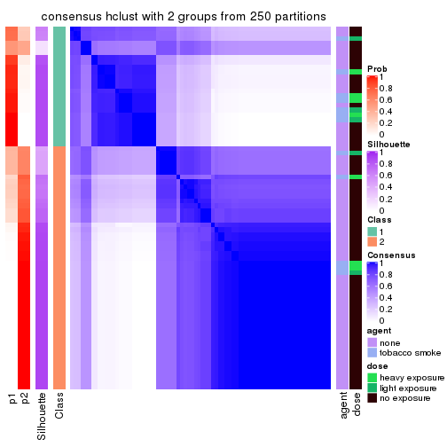</p>

</div>
<div id='tab-ATC-hclust-consensus-heatmap-2'>
<pre><code class="r">consensus_heatmap(res, k = 3)
</code></pre>

<p>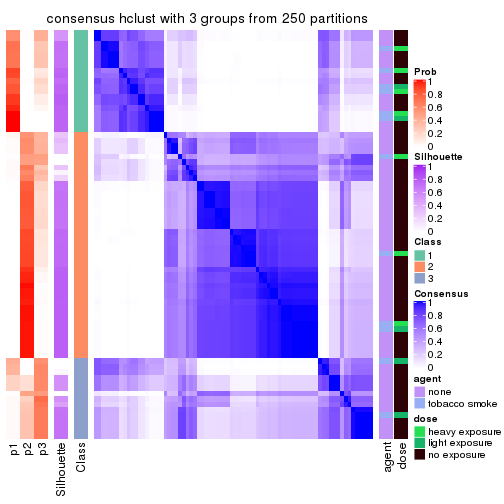</p>

</div>
<div id='tab-ATC-hclust-consensus-heatmap-3'>
<pre><code class="r">consensus_heatmap(res, k = 4)
</code></pre>

<p>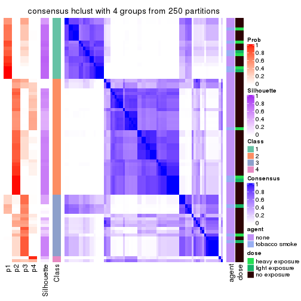</p>

</div>
<div id='tab-ATC-hclust-consensus-heatmap-4'>
<pre><code class="r">consensus_heatmap(res, k = 5)
</code></pre>

<p>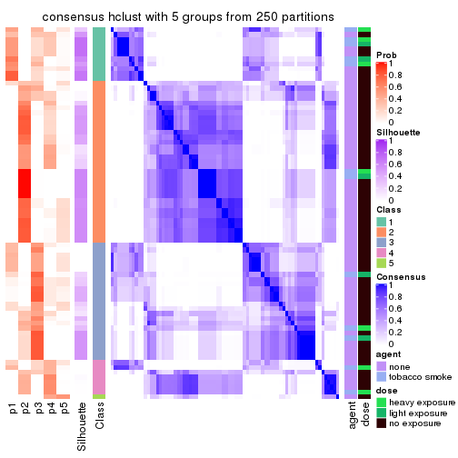</p>

</div>
<div id='tab-ATC-hclust-consensus-heatmap-5'>
<pre><code class="r">consensus_heatmap(res, k = 6)
</code></pre>

<p>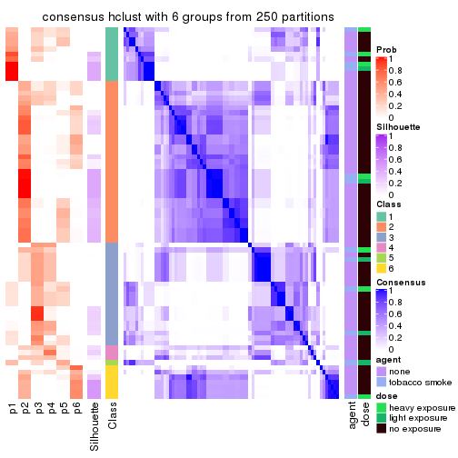</p>

</div>
</div>

Heatmaps for the membership of samples in all partitions to see how consistent they are:


<script>
$( function() {
	$( '#tabs-ATC-hclust-membership-heatmap' ).tabs();
} );
</script>
<div id='tabs-ATC-hclust-membership-heatmap'>
<ul>
<li><a href='#tab-ATC-hclust-membership-heatmap-1'>k = 2</a></li>
<li><a href='#tab-ATC-hclust-membership-heatmap-2'>k = 3</a></li>
<li><a href='#tab-ATC-hclust-membership-heatmap-3'>k = 4</a></li>
<li><a href='#tab-ATC-hclust-membership-heatmap-4'>k = 5</a></li>
<li><a href='#tab-ATC-hclust-membership-heatmap-5'>k = 6</a></li>
</ul>
<div id='tab-ATC-hclust-membership-heatmap-1'>
<pre><code class="r">membership_heatmap(res, k = 2)
</code></pre>

<p>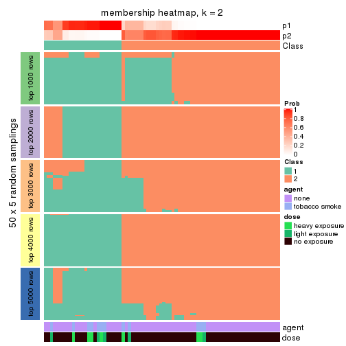</p>

</div>
<div id='tab-ATC-hclust-membership-heatmap-2'>
<pre><code class="r">membership_heatmap(res, k = 3)
</code></pre>

<p>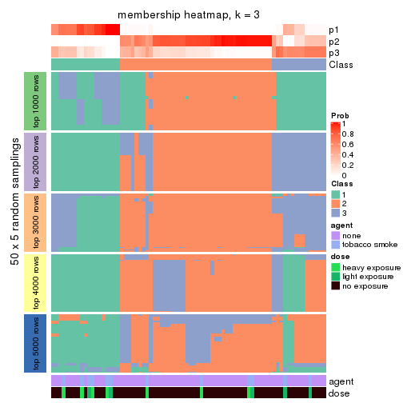</p>

</div>
<div id='tab-ATC-hclust-membership-heatmap-3'>
<pre><code class="r">membership_heatmap(res, k = 4)
</code></pre>

<p>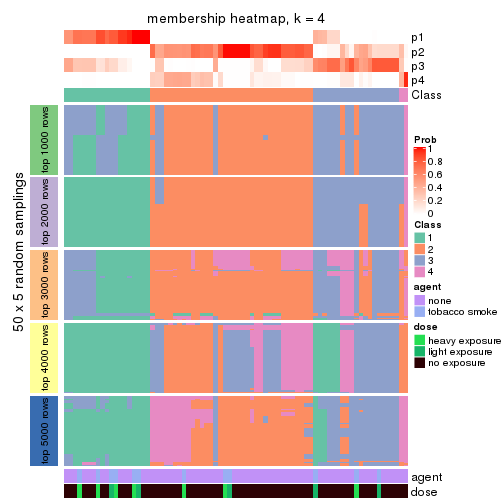</p>

</div>
<div id='tab-ATC-hclust-membership-heatmap-4'>
<pre><code class="r">membership_heatmap(res, k = 5)
</code></pre>

<p>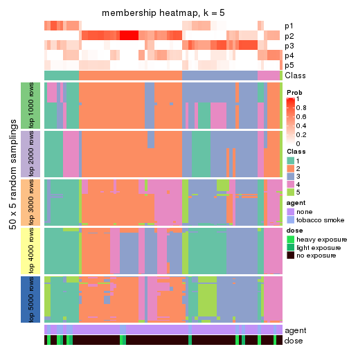</p>

</div>
<div id='tab-ATC-hclust-membership-heatmap-5'>
<pre><code class="r">membership_heatmap(res, k = 6)
</code></pre>

<p>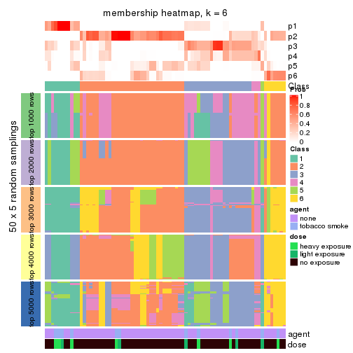</p>

</div>
</div>

As soon as we have had the classes for columns, we can look for signatures
which are significantly different between classes which can be candidate marks
for certain classes. Following are the heatmaps for signatures.


Signature heatmaps where rows are scaled:


<script>
$( function() {
	$( '#tabs-ATC-hclust-get-signatures' ).tabs();
} );
</script>
<div id='tabs-ATC-hclust-get-signatures'>
<ul>
<li><a href='#tab-ATC-hclust-get-signatures-1'>k = 2</a></li>
<li><a href='#tab-ATC-hclust-get-signatures-2'>k = 3</a></li>
<li><a href='#tab-ATC-hclust-get-signatures-3'>k = 4</a></li>
<li><a href='#tab-ATC-hclust-get-signatures-4'>k = 5</a></li>
<li><a href='#tab-ATC-hclust-get-signatures-5'>k = 6</a></li>
</ul>
<div id='tab-ATC-hclust-get-signatures-1'>
<pre><code class="r">get_signatures(res, k = 2)
</code></pre>

<p>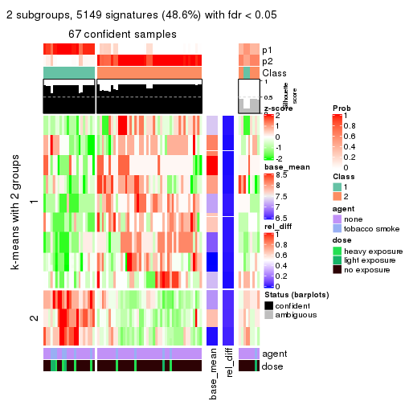</p>

</div>
<div id='tab-ATC-hclust-get-signatures-2'>
<pre><code class="r">get_signatures(res, k = 3)
</code></pre>

<p>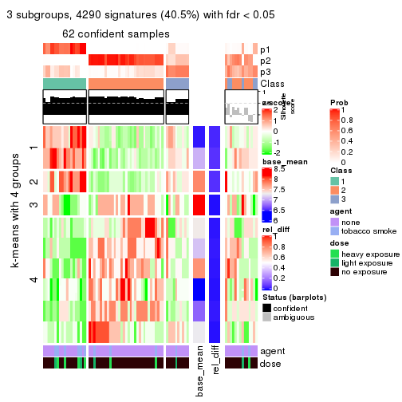</p>

</div>
<div id='tab-ATC-hclust-get-signatures-3'>
<pre><code class="r">get_signatures(res, k = 4)
</code></pre>

<p>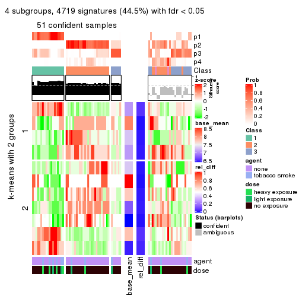</p>

</div>
<div id='tab-ATC-hclust-get-signatures-4'>
<pre><code class="r">get_signatures(res, k = 5)
</code></pre>

<p>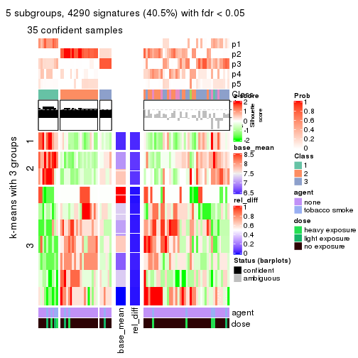</p>

</div>
<div id='tab-ATC-hclust-get-signatures-5'>
<pre><code class="r">get_signatures(res, k = 6)
</code></pre>

<p></p>

</div>
</div>


Signature heatmaps where rows are not scaled:


<script>
$( function() {
	$( '#tabs-ATC-hclust-get-signatures-no-scale' ).tabs();
} );
</script>
<div id='tabs-ATC-hclust-get-signatures-no-scale'>
<ul>
<li><a href='#tab-ATC-hclust-get-signatures-no-scale-1'>k = 2</a></li>
<li><a href='#tab-ATC-hclust-get-signatures-no-scale-2'>k = 3</a></li>
<li><a href='#tab-ATC-hclust-get-signatures-no-scale-3'>k = 4</a></li>
<li><a href='#tab-ATC-hclust-get-signatures-no-scale-4'>k = 5</a></li>
<li><a href='#tab-ATC-hclust-get-signatures-no-scale-5'>k = 6</a></li>
</ul>
<div id='tab-ATC-hclust-get-signatures-no-scale-1'>
<pre><code class="r">get_signatures(res, k = 2, scale_rows = FALSE)
</code></pre>

<p>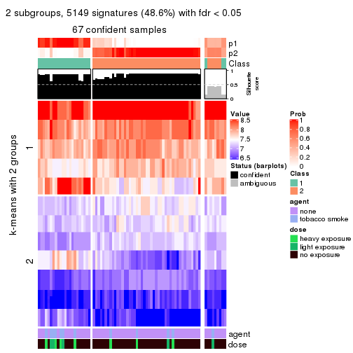</p>

</div>
<div id='tab-ATC-hclust-get-signatures-no-scale-2'>
<pre><code class="r">get_signatures(res, k = 3, scale_rows = FALSE)
</code></pre>

<p>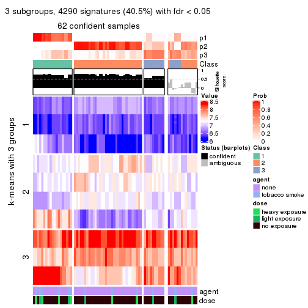</p>

</div>
<div id='tab-ATC-hclust-get-signatures-no-scale-3'>
<pre><code class="r">get_signatures(res, k = 4, scale_rows = FALSE)
</code></pre>

<p>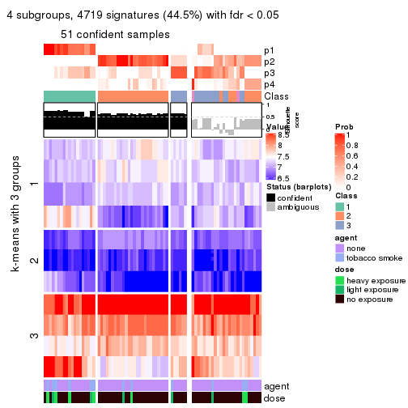</p>

</div>
<div id='tab-ATC-hclust-get-signatures-no-scale-4'>
<pre><code class="r">get_signatures(res, k = 5, scale_rows = FALSE)
</code></pre>

<p>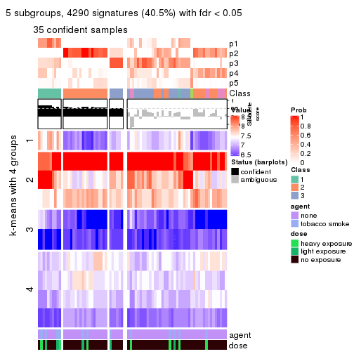</p>

</div>
<div id='tab-ATC-hclust-get-signatures-no-scale-5'>
<pre><code class="r">get_signatures(res, k = 6, scale_rows = FALSE)
</code></pre>

<p></p>

</div>
</div>


Compare the overlap of signatures from different k:

```r
compare_signatures(res)
```

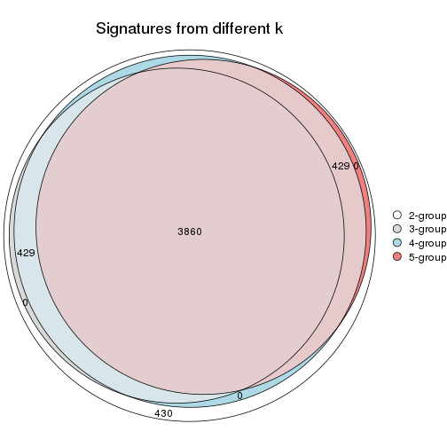

`get_signature()` returns a data frame invisibly. TO get the list of signatures, the function
call should be assigned to a variable explicitly. In following code, if `plot` argument is set
to `FALSE`, no heatmap is plotted while only the differential analysis is performed.

```r
# code only for demonstration
tb = get_signature(res, k = ..., plot = FALSE)
```

An example of the output of `tb` is:

```
#>   which_row         fdr    mean_1    mean_2 scaled_mean_1 scaled_mean_2 km
#> 1        38 0.042760348  8.373488  9.131774    -0.5533452     0.5164555  1
#> 2        40 0.018707592  7.106213  8.469186    -0.6173731     0.5762149  1
#> 3        55 0.019134737 10.221463 11.207825    -0.6159697     0.5749050  1
#> 4        59 0.006059896  5.921854  7.869574    -0.6899429     0.6439467  1
#> 5        60 0.018055526  8.928898 10.211722    -0.6204761     0.5791110  1
#> 6        98 0.009384629 15.714769 14.887706     0.6635654    -0.6193277  2
...
```

The columns in `tb` are:

1. `which_row`: row indices corresponding to the input matrix.
2. `fdr`: FDR for the differential test. 
3. `mean_x`: The mean value in group x.
4. `scaled_mean_x`: The mean value in group x after rows are scaled.
5. `km`: Row groups if k-means clustering is applied to rows.


UMAP plot which shows how samples are separated.


<script>
$( function() {
	$( '#tabs-ATC-hclust-dimension-reduction' ).tabs();
} );
</script>
<div id='tabs-ATC-hclust-dimension-reduction'>
<ul>
<li><a href='#tab-ATC-hclust-dimension-reduction-1'>k = 2</a></li>
<li><a href='#tab-ATC-hclust-dimension-reduction-2'>k = 3</a></li>
<li><a href='#tab-ATC-hclust-dimension-reduction-3'>k = 4</a></li>
<li><a href='#tab-ATC-hclust-dimension-reduction-4'>k = 5</a></li>
<li><a href='#tab-ATC-hclust-dimension-reduction-5'>k = 6</a></li>
</ul>
<div id='tab-ATC-hclust-dimension-reduction-1'>
<pre><code class="r">dimension_reduction(res, k = 2, method = &quot;UMAP&quot;)
</code></pre>

<p>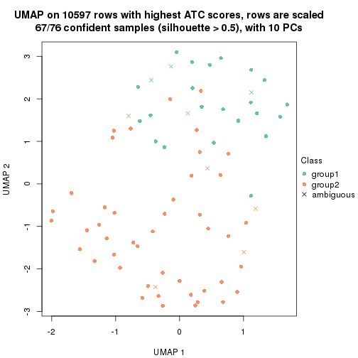</p>

</div>
<div id='tab-ATC-hclust-dimension-reduction-2'>
<pre><code class="r">dimension_reduction(res, k = 3, method = &quot;UMAP&quot;)
</code></pre>

<p>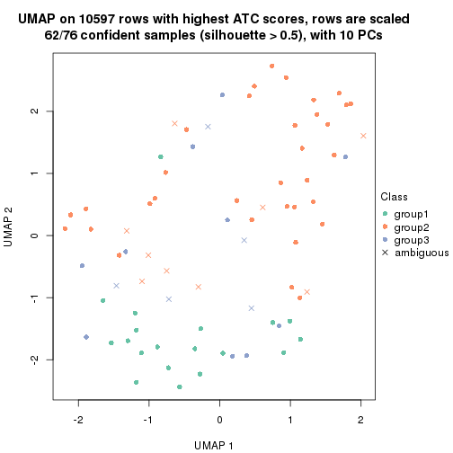</p>

</div>
<div id='tab-ATC-hclust-dimension-reduction-3'>
<pre><code class="r">dimension_reduction(res, k = 4, method = &quot;UMAP&quot;)
</code></pre>

<p>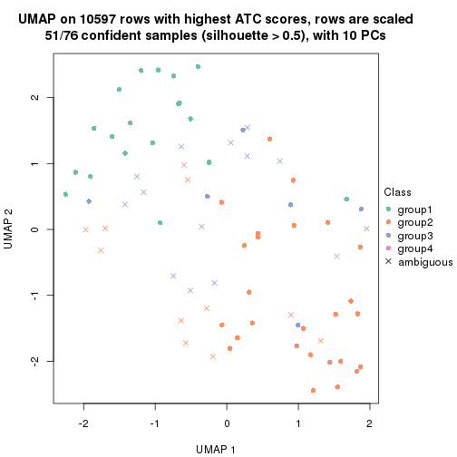</p>

</div>
<div id='tab-ATC-hclust-dimension-reduction-4'>
<pre><code class="r">dimension_reduction(res, k = 5, method = &quot;UMAP&quot;)
</code></pre>

<p>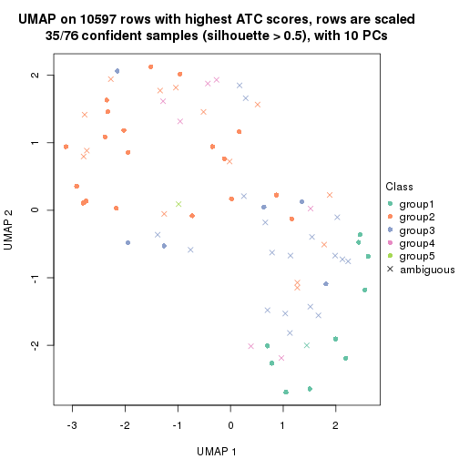</p>

</div>
<div id='tab-ATC-hclust-dimension-reduction-5'>
<pre><code class="r">dimension_reduction(res, k = 6, method = &quot;UMAP&quot;)
</code></pre>

<p>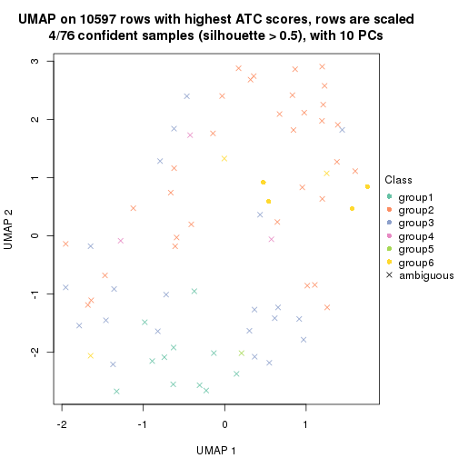</p>

</div>
</div>


Following heatmap shows how subgroups are split when increasing `k`:

```r
collect_classes(res)
```

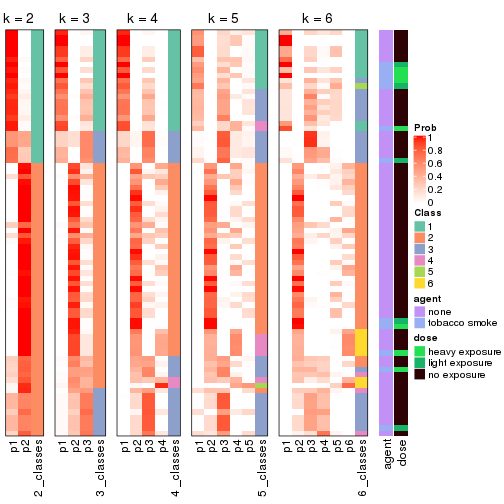


Test correlation between subgroups and known annotations. If the known
annotation is numeric, one-way ANOVA test is applied, and if the known
annotation is discrete, chi-squared contingency table test is applied.

```r
test_to_known_factors(res)
```

```
#>             n agent(p) dose(p) k
#> ATC:hclust 67   0.0425  0.0491 2
#> ATC:hclust 62   0.0890  0.1978 3
#> ATC:hclust 51   0.1156  0.1960 4
#> ATC:hclust 35   0.1647  0.3520 5
#> ATC:hclust  4       NA      NA 6
```


If matrix rows can be associated to genes, consider to use `GO_Enrichment(res,
...)` to perform function enrichment for the signature genes.


 

---------------------------------------------------


### ATC:kmeans


The object with results only for a single top-value method and a single partition method 
can be extracted as:

```r
res = res_list["ATC", "kmeans"]
# you can also extract it by
# res = res_list["ATC:kmeans"]
```

A summary of `res` and all the functions that can be applied to it:

```r
res
```

```
#> A 'ConsensusPartition' object with k = 2, 3, 4, 5, 6.
#>   On a matrix with 10597 rows and 76 columns.
#>   Top rows (1000, 2000, 3000, 4000, 5000) are extracted by 'ATC' method.
#>   Subgroups are detected by 'kmeans' method.
#>   Performed in total 1250 partitions by row resampling.
#>   Best k for subgroups seems to be 2.
#> 
#> Following methods can be applied to this 'ConsensusPartition' object:
#>  [1] "cola_report"             "collect_classes"         "collect_plots"          
#>  [4] "collect_stats"           "colnames"                "compare_signatures"     
#>  [7] "consensus_heatmap"       "dimension_reduction"     "functional_enrichment"  
#> [10] "get_anno_col"            "get_anno"                "get_classes"            
#> [13] "get_consensus"           "get_matrix"              "get_membership"         
#> [16] "get_param"               "get_signatures"          "get_stats"              
#> [19] "is_best_k"               "is_stable_k"             "membership_heatmap"     
#> [22] "ncol"                    "nrow"                    "plot_ecdf"              
#> [25] "rownames"                "select_partition_number" "show"                   
#> [28] "suggest_best_k"          "test_to_known_factors"
```

`collect_plots()` function collects all the plots made from `res` for all `k` (number of partitions)
into one single page to provide an easy and fast comparison between different `k`.

```r
collect_plots(res)
```

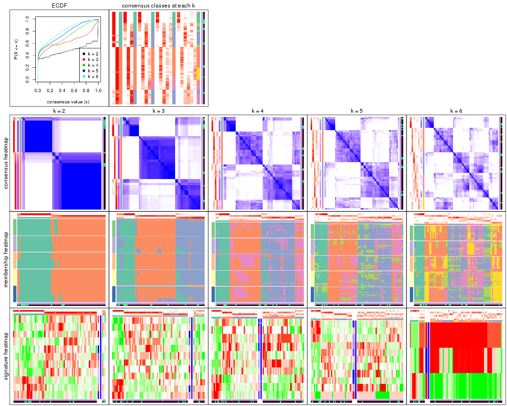

The plots are:

- The first row: a plot of the ECDF (Empirical cumulative distribution
  function) curves of the consensus matrix for each `k` and the heatmap of
  predicted classes for each `k`.
- The second row: heatmaps of the consensus matrix for each `k`.
- The third row: heatmaps of the membership matrix for each `k`.
- The fouth row: heatmaps of the signatures for each `k`.

All the plots in panels can be made by individual functions and they are
plotted later in this section.

`select_partition_number()` produces several plots showing different
statistics for choosing "optimized" `k`. There are following statistics:

- ECDF curves of the consensus matrix for each `k`;
- 1-PAC. [The PAC
  score](https://en.wikipedia.org/wiki/Consensus_clustering#Over-interpretation_potential_of_consensus_clustering)
  measures the proportion of the ambiguous subgrouping.
- Mean silhouette score.
- Concordance. The mean probability of fiting the consensus class ids in all
  partitions.
- Area increased. Denote $A_k$ as the area under the ECDF curve for current
  `k`, the area increased is defined as $A_k - A_{k-1}$.
- Rand index. The percent of pairs of samples that are both in a same cluster
  or both are not in a same cluster in the partition of k and k-1.
- Jaccard index. The ratio of pairs of samples are both in a same cluster in
  the partition of k and k-1 and the pairs of samples are both in a same
  cluster in the partition k or k-1.

The detailed explanations of these statistics can be found in [the cola
vignette](http://bioconductor.org/packages/devel/bioc/vignettes/cola/inst/doc/cola.html#toc_13).

Generally speaking, lower PAC score, higher mean silhouette score or higher
concordance corresponds to better partition. Rand index and Jaccard index
measure how similar the current partition is compared to partition with `k-1`.
If they are too similar, we won't accept `k` is better than `k-1`.

```r
select_partition_number(res)
```

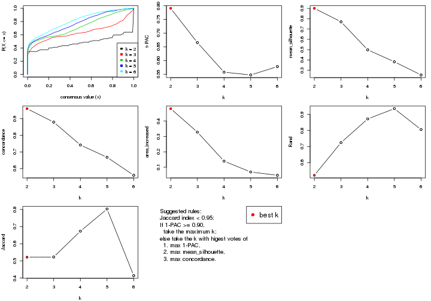

The numeric values for all these statistics can be obtained by `get_stats()`.

```r
get_stats(res)
```

```
#>   k 1-PAC mean_silhouette concordance area_increased  Rand Jaccard
#> 2 2 0.790           0.901       0.960         0.4809 0.522   0.522
#> 3 3 0.665           0.770       0.879         0.3285 0.725   0.523
#> 4 4 0.558           0.499       0.742         0.1393 0.872   0.674
#> 5 5 0.547           0.383       0.668         0.0688 0.936   0.803
#> 6 6 0.578           0.255       0.560         0.0473 0.806   0.414
```

`suggest_best_k()` suggests the best $k$ based on these statistics. The rules are as follows:

- All $k$ with Jaccard index larger than 0.95 are removed because the increase of
  the partition number does not provides enough extra information. If all $k$ are removed,
  the best $k$ is assigned by `NA`.
- For $k$ with 1-PAC larger than 0.9, the maximal $k$ is taken as the "best k". Other $k$ is called "optional k".
- If it does not fit the second rule. The $k$ with the highest vote of highest
  1-PAC, mean silhouette and concordance is taken as the "best k".

```r
suggest_best_k(res)
```

```
#> [1] 2
```


Following shows the table of the partitions (You need to click the **show/hide
code output** link to see it). The membership matrix (columns with name `p*`)
is inferred by
[`clue::cl_consensus()`](https://www.rdocumentation.org/link/cl_consensus?package=clue)
function with the `SE` method. Basically the value in the membership matrix
represents the probability to belong to a certain group. The finall class
label for an item is determined with the group with highest probability it
belongs to.

In `get_classes()` function, the entropy is calculated from the membership
matrix and the silhouette score is calculated from the consensus matrix.


<script>
$( function() {
	$( '#tabs-ATC-kmeans-get-classes' ).tabs();
} );
</script>
<div id='tabs-ATC-kmeans-get-classes'>
<ul>
<li><a href='#tab-ATC-kmeans-get-classes-1'>k = 2</a></li>
<li><a href='#tab-ATC-kmeans-get-classes-2'>k = 3</a></li>
<li><a href='#tab-ATC-kmeans-get-classes-3'>k = 4</a></li>
<li><a href='#tab-ATC-kmeans-get-classes-4'>k = 5</a></li>
<li><a href='#tab-ATC-kmeans-get-classes-5'>k = 6</a></li>
</ul>

<div id='tab-ATC-kmeans-get-classes-1'>
<p><a id='tab-ATC-kmeans-get-classes-1-a' style='color:#0366d6' href='#'>show/hide code output</a></p>
<pre><code class="r">cbind(get_classes(res, k = 2), get_membership(res, k = 2))
</code></pre>

<pre><code>#&gt;           class entropy silhouette    p1    p2
#&gt; GSM451162     1   0.000     0.9559 1.000 0.000
#&gt; GSM451163     2   0.000     0.9554 0.000 1.000
#&gt; GSM451164     2   0.000     0.9554 0.000 1.000
#&gt; GSM451165     2   0.000     0.9554 0.000 1.000
#&gt; GSM451167     2   0.000     0.9554 0.000 1.000
#&gt; GSM451168     2   0.000     0.9554 0.000 1.000
#&gt; GSM451169     2   0.000     0.9554 0.000 1.000
#&gt; GSM451170     1   0.000     0.9559 1.000 0.000
#&gt; GSM451171     2   0.000     0.9554 0.000 1.000
#&gt; GSM451172     2   0.000     0.9554 0.000 1.000
#&gt; GSM451173     1   0.000     0.9559 1.000 0.000
#&gt; GSM451174     2   0.000     0.9554 0.000 1.000
#&gt; GSM451175     1   0.000     0.9559 1.000 0.000
#&gt; GSM451177     2   0.000     0.9554 0.000 1.000
#&gt; GSM451178     2   0.000     0.9554 0.000 1.000
#&gt; GSM451179     2   0.788     0.6948 0.236 0.764
#&gt; GSM451180     2   0.000     0.9554 0.000 1.000
#&gt; GSM451181     2   0.000     0.9554 0.000 1.000
#&gt; GSM451182     1   0.000     0.9559 1.000 0.000
#&gt; GSM451183     1   0.000     0.9559 1.000 0.000
#&gt; GSM451184     1   0.861     0.5767 0.716 0.284
#&gt; GSM451185     1   0.000     0.9559 1.000 0.000
#&gt; GSM451186     2   0.722     0.7430 0.200 0.800
#&gt; GSM451187     2   0.000     0.9554 0.000 1.000
#&gt; GSM451188     2   0.000     0.9554 0.000 1.000
#&gt; GSM451189     1   0.000     0.9559 1.000 0.000
#&gt; GSM451190     1   0.000     0.9559 1.000 0.000
#&gt; GSM451191     1   0.000     0.9559 1.000 0.000
#&gt; GSM451193     2   0.469     0.8688 0.100 0.900
#&gt; GSM451195     1   0.000     0.9559 1.000 0.000
#&gt; GSM451196     1   0.000     0.9559 1.000 0.000
#&gt; GSM451197     1   0.000     0.9559 1.000 0.000
#&gt; GSM451199     1   0.000     0.9559 1.000 0.000
#&gt; GSM451201     1   0.000     0.9559 1.000 0.000
#&gt; GSM451202     2   0.000     0.9554 0.000 1.000
#&gt; GSM451203     2   0.722     0.7430 0.200 0.800
#&gt; GSM451204     2   0.000     0.9554 0.000 1.000
#&gt; GSM451205     2   0.000     0.9554 0.000 1.000
#&gt; GSM451206     2   0.000     0.9554 0.000 1.000
#&gt; GSM451207     2   0.000     0.9554 0.000 1.000
#&gt; GSM451208     2   0.000     0.9554 0.000 1.000
#&gt; GSM451209     2   0.000     0.9554 0.000 1.000
#&gt; GSM451210     2   0.000     0.9554 0.000 1.000
#&gt; GSM451212     2   0.000     0.9554 0.000 1.000
#&gt; GSM451213     2   0.000     0.9554 0.000 1.000
#&gt; GSM451214     2   0.000     0.9554 0.000 1.000
#&gt; GSM451215     2   0.000     0.9554 0.000 1.000
#&gt; GSM451216     2   0.000     0.9554 0.000 1.000
#&gt; GSM451217     2   0.000     0.9554 0.000 1.000
#&gt; GSM451219     1   0.000     0.9559 1.000 0.000
#&gt; GSM451220     1   0.000     0.9559 1.000 0.000
#&gt; GSM451221     1   0.000     0.9559 1.000 0.000
#&gt; GSM451222     1   0.000     0.9559 1.000 0.000
#&gt; GSM451224     2   0.000     0.9554 0.000 1.000
#&gt; GSM451225     1   0.961     0.3320 0.616 0.384
#&gt; GSM451226     2   0.000     0.9554 0.000 1.000
#&gt; GSM451227     2   0.469     0.8688 0.100 0.900
#&gt; GSM451228     2   0.518     0.8507 0.116 0.884
#&gt; GSM451230     2   0.722     0.7430 0.200 0.800
#&gt; GSM451231     2   0.900     0.5474 0.316 0.684
#&gt; GSM451233     2   0.000     0.9554 0.000 1.000
#&gt; GSM451234     2   0.000     0.9554 0.000 1.000
#&gt; GSM451235     2   0.000     0.9554 0.000 1.000
#&gt; GSM451236     2   0.000     0.9554 0.000 1.000
#&gt; GSM451166     1   0.998     0.0505 0.524 0.476
#&gt; GSM451194     1   0.000     0.9559 1.000 0.000
#&gt; GSM451198     1   0.000     0.9559 1.000 0.000
#&gt; GSM451218     2   0.000     0.9554 0.000 1.000
#&gt; GSM451232     1   0.000     0.9559 1.000 0.000
#&gt; GSM451176     1   0.000     0.9559 1.000 0.000
#&gt; GSM451192     1   0.000     0.9559 1.000 0.000
#&gt; GSM451200     1   0.000     0.9559 1.000 0.000
#&gt; GSM451211     2   0.000     0.9554 0.000 1.000
#&gt; GSM451223     2   0.983     0.2709 0.424 0.576
#&gt; GSM451229     1   0.000     0.9559 1.000 0.000
#&gt; GSM451237     2   0.000     0.9554 0.000 1.000
</code></pre>

<script>
$('#tab-ATC-kmeans-get-classes-1-a').parent().next().next().hide();
$('#tab-ATC-kmeans-get-classes-1-a').click(function(){
  $('#tab-ATC-kmeans-get-classes-1-a').parent().next().next().toggle();
  return(false);
});
</script>
</div>

<div id='tab-ATC-kmeans-get-classes-2'>
<p><a id='tab-ATC-kmeans-get-classes-2-a' style='color:#0366d6' href='#'>show/hide code output</a></p>
<pre><code class="r">cbind(get_classes(res, k = 3), get_membership(res, k = 3))
</code></pre>

<pre><code>#&gt;           class entropy silhouette    p1    p2    p3
#&gt; GSM451162     3  0.3412     0.7832 0.124 0.000 0.876
#&gt; GSM451163     2  0.3752     0.8951 0.000 0.856 0.144
#&gt; GSM451164     2  0.3482     0.9044 0.000 0.872 0.128
#&gt; GSM451165     2  0.3412     0.9046 0.000 0.876 0.124
#&gt; GSM451167     2  0.6260     0.3912 0.000 0.552 0.448
#&gt; GSM451168     2  0.1163     0.9315 0.000 0.972 0.028
#&gt; GSM451169     3  0.1411     0.7988 0.000 0.036 0.964
#&gt; GSM451170     1  0.6062     0.3972 0.616 0.000 0.384
#&gt; GSM451171     2  0.1964     0.9298 0.000 0.944 0.056
#&gt; GSM451172     2  0.4555     0.7974 0.000 0.800 0.200
#&gt; GSM451173     3  0.4750     0.7062 0.216 0.000 0.784
#&gt; GSM451174     2  0.0747     0.9296 0.000 0.984 0.016
#&gt; GSM451175     3  0.4504     0.7304 0.196 0.000 0.804
#&gt; GSM451177     2  0.0592     0.9289 0.000 0.988 0.012
#&gt; GSM451178     2  0.1031     0.9283 0.000 0.976 0.024
#&gt; GSM451179     3  0.2793     0.8098 0.044 0.028 0.928
#&gt; GSM451180     2  0.1163     0.9290 0.000 0.972 0.028
#&gt; GSM451181     2  0.0592     0.9289 0.000 0.988 0.012
#&gt; GSM451182     1  0.6062     0.3972 0.616 0.000 0.384
#&gt; GSM451183     1  0.0000     0.7863 1.000 0.000 0.000
#&gt; GSM451184     3  0.3412     0.7832 0.124 0.000 0.876
#&gt; GSM451185     1  0.0000     0.7863 1.000 0.000 0.000
#&gt; GSM451186     2  0.6027     0.6991 0.016 0.712 0.272
#&gt; GSM451187     2  0.0747     0.9296 0.000 0.984 0.016
#&gt; GSM451188     2  0.2356     0.9275 0.000 0.928 0.072
#&gt; GSM451189     1  0.0000     0.7863 1.000 0.000 0.000
#&gt; GSM451190     3  0.6267     0.1224 0.452 0.000 0.548
#&gt; GSM451191     1  0.5882     0.4695 0.652 0.000 0.348
#&gt; GSM451193     3  0.4978     0.6293 0.004 0.216 0.780
#&gt; GSM451195     3  0.4605     0.7226 0.204 0.000 0.796
#&gt; GSM451196     1  0.0000     0.7863 1.000 0.000 0.000
#&gt; GSM451197     1  0.0000     0.7863 1.000 0.000 0.000
#&gt; GSM451199     3  0.6252     0.1878 0.444 0.000 0.556
#&gt; GSM451201     1  0.0000     0.7863 1.000 0.000 0.000
#&gt; GSM451202     2  0.1964     0.9298 0.000 0.944 0.056
#&gt; GSM451203     3  0.1620     0.8041 0.012 0.024 0.964
#&gt; GSM451204     2  0.2537     0.9289 0.000 0.920 0.080
#&gt; GSM451205     2  0.2261     0.9280 0.000 0.932 0.068
#&gt; GSM451206     2  0.1031     0.9283 0.000 0.976 0.024
#&gt; GSM451207     2  0.2261     0.9105 0.000 0.932 0.068
#&gt; GSM451208     2  0.1289     0.9319 0.000 0.968 0.032
#&gt; GSM451209     3  0.3551     0.7438 0.000 0.132 0.868
#&gt; GSM451210     2  0.1643     0.9308 0.000 0.956 0.044
#&gt; GSM451212     2  0.3551     0.9020 0.000 0.868 0.132
#&gt; GSM451213     2  0.1031     0.9283 0.000 0.976 0.024
#&gt; GSM451214     3  0.0892     0.8041 0.000 0.020 0.980
#&gt; GSM451215     2  0.1289     0.9317 0.000 0.968 0.032
#&gt; GSM451216     2  0.1031     0.9283 0.000 0.976 0.024
#&gt; GSM451217     2  0.2537     0.9255 0.000 0.920 0.080
#&gt; GSM451219     3  0.6154     0.2775 0.408 0.000 0.592
#&gt; GSM451220     3  0.4121     0.7487 0.168 0.000 0.832
#&gt; GSM451221     3  0.4399     0.7328 0.188 0.000 0.812
#&gt; GSM451222     1  0.6260     0.0431 0.552 0.000 0.448
#&gt; GSM451224     2  0.2711     0.9287 0.000 0.912 0.088
#&gt; GSM451225     3  0.1453     0.8114 0.024 0.008 0.968
#&gt; GSM451226     3  0.1289     0.8040 0.000 0.032 0.968
#&gt; GSM451227     3  0.1453     0.8077 0.008 0.024 0.968
#&gt; GSM451228     3  0.2400     0.7943 0.004 0.064 0.932
#&gt; GSM451230     3  0.5884     0.5526 0.012 0.272 0.716
#&gt; GSM451231     3  0.1482     0.8100 0.012 0.020 0.968
#&gt; GSM451233     2  0.2537     0.9098 0.000 0.920 0.080
#&gt; GSM451234     2  0.2165     0.9294 0.000 0.936 0.064
#&gt; GSM451235     2  0.3816     0.9006 0.000 0.852 0.148
#&gt; GSM451236     2  0.2711     0.9272 0.000 0.912 0.088
#&gt; GSM451166     3  0.1267     0.8125 0.024 0.004 0.972
#&gt; GSM451194     3  0.3267     0.7867 0.116 0.000 0.884
#&gt; GSM451198     1  0.6079     0.3351 0.612 0.000 0.388
#&gt; GSM451218     2  0.1031     0.9283 0.000 0.976 0.024
#&gt; GSM451232     1  0.0000     0.7863 1.000 0.000 0.000
#&gt; GSM451176     1  0.0000     0.7863 1.000 0.000 0.000
#&gt; GSM451192     1  0.4235     0.6809 0.824 0.000 0.176
#&gt; GSM451200     1  0.6079     0.3351 0.612 0.000 0.388
#&gt; GSM451211     2  0.1031     0.9283 0.000 0.976 0.024
#&gt; GSM451223     3  0.1482     0.8120 0.020 0.012 0.968
#&gt; GSM451229     1  0.0000     0.7863 1.000 0.000 0.000
#&gt; GSM451237     2  0.2356     0.9274 0.000 0.928 0.072
</code></pre>

<script>
$('#tab-ATC-kmeans-get-classes-2-a').parent().next().next().hide();
$('#tab-ATC-kmeans-get-classes-2-a').click(function(){
  $('#tab-ATC-kmeans-get-classes-2-a').parent().next().next().toggle();
  return(false);
});
</script>
</div>

<div id='tab-ATC-kmeans-get-classes-3'>
<p><a id='tab-ATC-kmeans-get-classes-3-a' style='color:#0366d6' href='#'>show/hide code output</a></p>
<pre><code class="r">cbind(get_classes(res, k = 4), get_membership(res, k = 4))
</code></pre>

<pre><code>#&gt;           class entropy silhouette    p1    p2    p3    p4
#&gt; GSM451162     3  0.1059     0.7567 0.016 0.000 0.972 0.012
#&gt; GSM451163     4  0.4343     0.5216 0.000 0.264 0.004 0.732
#&gt; GSM451164     4  0.4978     0.4228 0.000 0.384 0.004 0.612
#&gt; GSM451165     4  0.5511    -0.1300 0.000 0.484 0.016 0.500
#&gt; GSM451167     4  0.6788     0.3991 0.004 0.172 0.200 0.624
#&gt; GSM451168     2  0.2401     0.5246 0.000 0.904 0.004 0.092
#&gt; GSM451169     3  0.4889     0.5171 0.000 0.004 0.636 0.360
#&gt; GSM451170     3  0.6801    -0.1629 0.448 0.000 0.456 0.096
#&gt; GSM451171     2  0.4817     0.2437 0.000 0.612 0.000 0.388
#&gt; GSM451172     4  0.6607     0.3290 0.000 0.400 0.084 0.516
#&gt; GSM451173     3  0.2739     0.7494 0.036 0.000 0.904 0.060
#&gt; GSM451174     2  0.2466     0.5027 0.000 0.900 0.004 0.096
#&gt; GSM451175     3  0.2797     0.7507 0.032 0.000 0.900 0.068
#&gt; GSM451177     2  0.2654     0.5066 0.000 0.888 0.004 0.108
#&gt; GSM451178     2  0.3249     0.5122 0.000 0.852 0.008 0.140
#&gt; GSM451179     3  0.1940     0.7632 0.000 0.000 0.924 0.076
#&gt; GSM451180     2  0.3765     0.4847 0.004 0.812 0.004 0.180
#&gt; GSM451181     2  0.3105     0.4882 0.000 0.856 0.004 0.140
#&gt; GSM451182     1  0.6504     0.1099 0.476 0.000 0.452 0.072
#&gt; GSM451183     1  0.1174     0.8408 0.968 0.000 0.012 0.020
#&gt; GSM451184     3  0.3881     0.7322 0.016 0.000 0.812 0.172
#&gt; GSM451185     1  0.0376     0.8450 0.992 0.000 0.004 0.004
#&gt; GSM451186     2  0.6318     0.0741 0.004 0.560 0.056 0.380
#&gt; GSM451187     2  0.5303    -0.1480 0.004 0.544 0.004 0.448
#&gt; GSM451188     2  0.5137     0.1917 0.004 0.544 0.000 0.452
#&gt; GSM451189     1  0.0804     0.8427 0.980 0.000 0.012 0.008
#&gt; GSM451190     3  0.6153     0.2893 0.328 0.000 0.604 0.068
#&gt; GSM451191     1  0.6693     0.1836 0.488 0.000 0.424 0.088
#&gt; GSM451193     3  0.5805     0.4329 0.000 0.036 0.576 0.388
#&gt; GSM451195     3  0.2908     0.7471 0.040 0.000 0.896 0.064
#&gt; GSM451196     1  0.0376     0.8450 0.992 0.000 0.004 0.004
#&gt; GSM451197     1  0.1520     0.8356 0.956 0.000 0.020 0.024
#&gt; GSM451199     3  0.5222     0.6584 0.132 0.000 0.756 0.112
#&gt; GSM451201     1  0.1929     0.8299 0.940 0.000 0.024 0.036
#&gt; GSM451202     2  0.4277     0.3544 0.000 0.720 0.000 0.280
#&gt; GSM451203     3  0.4122     0.6625 0.000 0.004 0.760 0.236
#&gt; GSM451204     2  0.5429     0.3147 0.004 0.592 0.012 0.392
#&gt; GSM451205     4  0.4761     0.4603 0.004 0.332 0.000 0.664
#&gt; GSM451206     2  0.2831     0.5216 0.000 0.876 0.004 0.120
#&gt; GSM451207     2  0.5125    -0.0252 0.000 0.604 0.008 0.388
#&gt; GSM451208     2  0.4012     0.4801 0.004 0.788 0.004 0.204
#&gt; GSM451209     3  0.6790     0.5202 0.000 0.168 0.604 0.228
#&gt; GSM451210     2  0.4661     0.2996 0.000 0.652 0.000 0.348
#&gt; GSM451212     4  0.5855     0.4141 0.000 0.356 0.044 0.600
#&gt; GSM451213     2  0.3196     0.5000 0.000 0.856 0.008 0.136
#&gt; GSM451214     3  0.3105     0.7446 0.004 0.000 0.856 0.140
#&gt; GSM451215     2  0.4560     0.4189 0.004 0.700 0.000 0.296
#&gt; GSM451216     2  0.2831     0.5150 0.000 0.876 0.004 0.120
#&gt; GSM451217     2  0.5112     0.1969 0.004 0.560 0.000 0.436
#&gt; GSM451219     3  0.5480     0.6151 0.140 0.000 0.736 0.124
#&gt; GSM451220     3  0.2256     0.7550 0.020 0.000 0.924 0.056
#&gt; GSM451221     3  0.2996     0.7333 0.044 0.000 0.892 0.064
#&gt; GSM451222     3  0.6080     0.1585 0.468 0.000 0.488 0.044
#&gt; GSM451224     2  0.5090     0.3899 0.004 0.672 0.012 0.312
#&gt; GSM451225     3  0.3765     0.7427 0.004 0.004 0.812 0.180
#&gt; GSM451226     3  0.2714     0.7541 0.004 0.000 0.884 0.112
#&gt; GSM451227     3  0.2216     0.7605 0.000 0.000 0.908 0.092
#&gt; GSM451228     3  0.2714     0.7537 0.000 0.004 0.884 0.112
#&gt; GSM451230     3  0.7067     0.4068 0.000 0.160 0.552 0.288
#&gt; GSM451231     3  0.3402     0.7514 0.000 0.004 0.832 0.164
#&gt; GSM451233     2  0.5055    -0.0257 0.000 0.624 0.008 0.368
#&gt; GSM451234     2  0.4713     0.2674 0.000 0.640 0.000 0.360
#&gt; GSM451235     4  0.5559     0.3721 0.004 0.400 0.016 0.580
#&gt; GSM451236     2  0.5302     0.3256 0.004 0.628 0.012 0.356
#&gt; GSM451166     3  0.1022     0.7621 0.000 0.000 0.968 0.032
#&gt; GSM451194     3  0.1297     0.7595 0.016 0.000 0.964 0.020
#&gt; GSM451198     3  0.6432     0.2938 0.372 0.000 0.552 0.076
#&gt; GSM451218     2  0.0895     0.5265 0.000 0.976 0.004 0.020
#&gt; GSM451232     1  0.0376     0.8450 0.992 0.000 0.004 0.004
#&gt; GSM451176     1  0.0376     0.8450 0.992 0.000 0.004 0.004
#&gt; GSM451192     1  0.5786     0.4883 0.640 0.000 0.308 0.052
#&gt; GSM451200     3  0.6324     0.3497 0.356 0.000 0.572 0.072
#&gt; GSM451211     2  0.0376     0.5317 0.000 0.992 0.004 0.004
#&gt; GSM451223     3  0.2011     0.7628 0.000 0.000 0.920 0.080
#&gt; GSM451229     1  0.0376     0.8450 0.992 0.000 0.004 0.004
#&gt; GSM451237     2  0.4746     0.2502 0.000 0.632 0.000 0.368
</code></pre>

<script>
$('#tab-ATC-kmeans-get-classes-3-a').parent().next().next().hide();
$('#tab-ATC-kmeans-get-classes-3-a').click(function(){
  $('#tab-ATC-kmeans-get-classes-3-a').parent().next().next().toggle();
  return(false);
});
</script>
</div>

<div id='tab-ATC-kmeans-get-classes-4'>
<p><a id='tab-ATC-kmeans-get-classes-4-a' style='color:#0366d6' href='#'>show/hide code output</a></p>
<pre><code class="r">cbind(get_classes(res, k = 5), get_membership(res, k = 5))
</code></pre>

<pre><code>#&gt;           class entropy silhouette    p1    p2    p3    p4    p5
#&gt; GSM451162     3  0.2069      0.527 0.000 0.000 0.912 0.012 0.076
#&gt; GSM451163     4  0.2189      0.561 0.000 0.084 0.012 0.904 0.000
#&gt; GSM451164     4  0.4209      0.461 0.000 0.224 0.004 0.744 0.028
#&gt; GSM451165     2  0.6600      0.303 0.000 0.488 0.060 0.388 0.064
#&gt; GSM451167     4  0.5964      0.519 0.000 0.064 0.152 0.680 0.104
#&gt; GSM451168     2  0.3946      0.577 0.000 0.800 0.000 0.120 0.080
#&gt; GSM451169     3  0.4856      0.316 0.000 0.004 0.584 0.392 0.020
#&gt; GSM451170     3  0.7062     -0.745 0.224 0.000 0.384 0.016 0.376
#&gt; GSM451171     2  0.5223      0.346 0.000 0.512 0.000 0.444 0.044
#&gt; GSM451172     4  0.6205      0.539 0.000 0.180 0.156 0.632 0.032
#&gt; GSM451173     3  0.4265      0.497 0.008 0.000 0.712 0.012 0.268
#&gt; GSM451174     2  0.2561      0.549 0.000 0.884 0.000 0.096 0.020
#&gt; GSM451175     3  0.4464      0.495 0.008 0.000 0.676 0.012 0.304
#&gt; GSM451177     2  0.2983      0.540 0.000 0.864 0.000 0.096 0.040
#&gt; GSM451178     2  0.3142      0.547 0.000 0.868 0.008 0.068 0.056
#&gt; GSM451179     3  0.2370      0.556 0.000 0.000 0.904 0.040 0.056
#&gt; GSM451180     2  0.4384      0.449 0.000 0.728 0.000 0.228 0.044
#&gt; GSM451181     2  0.4851      0.410 0.000 0.712 0.000 0.196 0.092
#&gt; GSM451182     3  0.7198     -0.857 0.296 0.000 0.372 0.016 0.316
#&gt; GSM451183     1  0.3351      0.606 0.836 0.000 0.004 0.028 0.132
#&gt; GSM451184     3  0.4971      0.531 0.000 0.000 0.712 0.144 0.144
#&gt; GSM451185     1  0.0693      0.711 0.980 0.000 0.000 0.008 0.012
#&gt; GSM451186     2  0.7005      0.224 0.000 0.456 0.016 0.260 0.268
#&gt; GSM451187     4  0.4702      0.331 0.000 0.432 0.000 0.552 0.016
#&gt; GSM451188     2  0.5951      0.433 0.000 0.520 0.000 0.364 0.116
#&gt; GSM451189     1  0.2731      0.642 0.876 0.000 0.004 0.016 0.104
#&gt; GSM451190     3  0.6831     -0.417 0.156 0.000 0.520 0.032 0.292
#&gt; GSM451191     5  0.7348      0.000 0.312 0.000 0.304 0.024 0.360
#&gt; GSM451193     3  0.6817      0.151 0.000 0.036 0.428 0.420 0.116
#&gt; GSM451195     3  0.4780      0.474 0.016 0.000 0.660 0.016 0.308
#&gt; GSM451196     1  0.0000      0.713 1.000 0.000 0.000 0.000 0.000
#&gt; GSM451197     1  0.3111      0.599 0.840 0.000 0.004 0.012 0.144
#&gt; GSM451199     3  0.5329      0.390 0.044 0.000 0.540 0.004 0.412
#&gt; GSM451201     1  0.3815      0.518 0.764 0.000 0.004 0.012 0.220
#&gt; GSM451202     2  0.4541      0.493 0.000 0.680 0.000 0.288 0.032
#&gt; GSM451203     3  0.4550      0.393 0.000 0.004 0.692 0.276 0.028
#&gt; GSM451204     2  0.6387      0.315 0.000 0.440 0.000 0.392 0.168
#&gt; GSM451205     4  0.4571      0.463 0.000 0.188 0.000 0.736 0.076
#&gt; GSM451206     2  0.2905      0.551 0.000 0.868 0.000 0.096 0.036
#&gt; GSM451207     4  0.5286      0.293 0.000 0.448 0.000 0.504 0.048
#&gt; GSM451208     2  0.4836      0.527 0.000 0.716 0.000 0.188 0.096
#&gt; GSM451209     3  0.6764      0.471 0.000 0.088 0.608 0.160 0.144
#&gt; GSM451210     2  0.5066      0.474 0.000 0.608 0.000 0.344 0.048
#&gt; GSM451212     4  0.5658      0.535 0.000 0.180 0.096 0.688 0.036
#&gt; GSM451213     2  0.3622      0.521 0.000 0.832 0.004 0.068 0.096
#&gt; GSM451214     3  0.3684      0.504 0.000 0.004 0.800 0.172 0.024
#&gt; GSM451215     2  0.5449      0.503 0.000 0.636 0.000 0.256 0.108
#&gt; GSM451216     2  0.3297      0.531 0.000 0.848 0.000 0.068 0.084
#&gt; GSM451217     2  0.6037      0.320 0.000 0.448 0.000 0.436 0.116
#&gt; GSM451219     3  0.4744      0.174 0.016 0.000 0.508 0.000 0.476
#&gt; GSM451220     3  0.3663      0.528 0.000 0.000 0.776 0.016 0.208
#&gt; GSM451221     3  0.4679      0.252 0.016 0.000 0.680 0.016 0.288
#&gt; GSM451222     1  0.6874     -0.155 0.420 0.000 0.404 0.024 0.152
#&gt; GSM451224     2  0.6264      0.465 0.000 0.572 0.008 0.244 0.176
#&gt; GSM451225     3  0.5562      0.429 0.000 0.000 0.520 0.072 0.408
#&gt; GSM451226     3  0.3195      0.533 0.000 0.004 0.856 0.100 0.040
#&gt; GSM451227     3  0.3694      0.536 0.000 0.004 0.828 0.084 0.084
#&gt; GSM451228     3  0.2909      0.534 0.000 0.000 0.848 0.140 0.012
#&gt; GSM451230     3  0.7127      0.309 0.000 0.108 0.520 0.288 0.084
#&gt; GSM451231     3  0.5405      0.522 0.000 0.000 0.640 0.104 0.256
#&gt; GSM451233     2  0.5991     -0.369 0.000 0.464 0.016 0.452 0.068
#&gt; GSM451234     2  0.5769      0.399 0.000 0.556 0.000 0.340 0.104
#&gt; GSM451235     4  0.6195      0.268 0.000 0.308 0.016 0.564 0.112
#&gt; GSM451236     2  0.5901      0.459 0.000 0.568 0.000 0.300 0.132
#&gt; GSM451166     3  0.1549      0.545 0.000 0.000 0.944 0.016 0.040
#&gt; GSM451194     3  0.2886      0.513 0.000 0.000 0.844 0.008 0.148
#&gt; GSM451198     3  0.7120      0.131 0.212 0.000 0.436 0.024 0.328
#&gt; GSM451218     2  0.1522      0.554 0.000 0.944 0.000 0.012 0.044
#&gt; GSM451232     1  0.0000      0.713 1.000 0.000 0.000 0.000 0.000
#&gt; GSM451176     1  0.0807      0.711 0.976 0.000 0.000 0.012 0.012
#&gt; GSM451192     1  0.7272     -0.810 0.400 0.000 0.260 0.024 0.316
#&gt; GSM451200     3  0.6856      0.211 0.192 0.000 0.468 0.016 0.324
#&gt; GSM451211     2  0.0693      0.563 0.000 0.980 0.000 0.012 0.008
#&gt; GSM451223     3  0.2208      0.555 0.000 0.000 0.908 0.072 0.020
#&gt; GSM451229     1  0.0000      0.713 1.000 0.000 0.000 0.000 0.000
#&gt; GSM451237     2  0.5530      0.414 0.000 0.556 0.000 0.368 0.076
</code></pre>

<script>
$('#tab-ATC-kmeans-get-classes-4-a').parent().next().next().hide();
$('#tab-ATC-kmeans-get-classes-4-a').click(function(){
  $('#tab-ATC-kmeans-get-classes-4-a').parent().next().next().toggle();
  return(false);
});
</script>
</div>

<div id='tab-ATC-kmeans-get-classes-5'>
<p><a id='tab-ATC-kmeans-get-classes-5-a' style='color:#0366d6' href='#'>show/hide code output</a></p>
<pre><code class="r">cbind(get_classes(res, k = 6), get_membership(res, k = 6))
</code></pre>

<pre><code>#&gt;           class entropy silhouette    p1    p2    p3    p4    p5    p6
#&gt; GSM451162     3   0.585   2.25e-01 0.000 0.000 0.488 0.184 0.324 0.004
#&gt; GSM451163     4   0.577  -5.09e-02 0.000 0.240 0.000 0.596 0.036 0.128
#&gt; GSM451164     4   0.639  -1.82e-01 0.000 0.212 0.000 0.516 0.044 0.228
#&gt; GSM451165     2   0.637   1.94e-01 0.000 0.520 0.000 0.292 0.108 0.080
#&gt; GSM451167     4   0.434   2.93e-01 0.000 0.244 0.024 0.708 0.020 0.004
#&gt; GSM451168     2   0.492   1.75e-01 0.000 0.680 0.004 0.032 0.048 0.236
#&gt; GSM451169     4   0.558   2.60e-01 0.000 0.008 0.156 0.572 0.264 0.000
#&gt; GSM451170     5   0.592   7.33e-01 0.168 0.000 0.188 0.004 0.604 0.036
#&gt; GSM451171     2   0.602   2.66e-01 0.000 0.524 0.000 0.156 0.024 0.296
#&gt; GSM451172     4   0.492   3.12e-01 0.000 0.032 0.020 0.740 0.096 0.112
#&gt; GSM451173     3   0.201   4.46e-01 0.008 0.000 0.920 0.012 0.052 0.008
#&gt; GSM451174     6   0.464   1.09e-01 0.000 0.456 0.000 0.020 0.012 0.512
#&gt; GSM451175     3   0.182   4.44e-01 0.008 0.000 0.924 0.012 0.056 0.000
#&gt; GSM451177     6   0.417   1.10e-01 0.000 0.376 0.000 0.008 0.008 0.608
#&gt; GSM451178     2   0.461  -1.85e-01 0.000 0.572 0.004 0.020 0.008 0.396
#&gt; GSM451179     3   0.627  -1.86e-02 0.000 0.000 0.404 0.316 0.272 0.008
#&gt; GSM451180     2   0.479  -1.04e-01 0.000 0.516 0.000 0.052 0.000 0.432
#&gt; GSM451181     6   0.326   2.70e-01 0.000 0.184 0.000 0.012 0.008 0.796
#&gt; GSM451182     5   0.619   7.30e-01 0.208 0.000 0.192 0.004 0.560 0.036
#&gt; GSM451183     1   0.484   5.96e-01 0.700 0.000 0.040 0.004 0.212 0.044
#&gt; GSM451184     3   0.592   1.74e-01 0.000 0.000 0.516 0.260 0.216 0.008
#&gt; GSM451185     1   0.130   7.85e-01 0.952 0.000 0.004 0.000 0.032 0.012
#&gt; GSM451186     6   0.780  -1.14e-01 0.004 0.224 0.000 0.208 0.276 0.288
#&gt; GSM451187     6   0.616   1.37e-01 0.000 0.216 0.000 0.368 0.008 0.408
#&gt; GSM451188     2   0.383   3.76e-01 0.000 0.792 0.000 0.044 0.024 0.140
#&gt; GSM451189     1   0.442   6.19e-01 0.732 0.000 0.048 0.000 0.192 0.028
#&gt; GSM451190     5   0.627   6.05e-01 0.100 0.000 0.356 0.004 0.488 0.052
#&gt; GSM451191     5   0.672   6.90e-01 0.204 0.000 0.204 0.008 0.520 0.064
#&gt; GSM451193     4   0.515   2.37e-01 0.000 0.008 0.284 0.636 0.040 0.032
#&gt; GSM451195     3   0.117   4.40e-01 0.012 0.000 0.960 0.020 0.008 0.000
#&gt; GSM451196     1   0.000   7.92e-01 1.000 0.000 0.000 0.000 0.000 0.000
#&gt; GSM451197     1   0.549   5.24e-01 0.692 0.000 0.132 0.012 0.072 0.092
#&gt; GSM451199     3   0.264   3.76e-01 0.028 0.000 0.884 0.012 0.072 0.004
#&gt; GSM451201     1   0.565   4.32e-01 0.616 0.000 0.268 0.012 0.052 0.052
#&gt; GSM451202     2   0.537   2.74e-01 0.000 0.652 0.000 0.096 0.040 0.212
#&gt; GSM451203     4   0.625   1.43e-01 0.000 0.008 0.244 0.460 0.284 0.004
#&gt; GSM451204     2   0.477   2.52e-01 0.000 0.700 0.004 0.064 0.020 0.212
#&gt; GSM451205     2   0.553   1.07e-01 0.000 0.500 0.000 0.376 0.004 0.120
#&gt; GSM451206     2   0.423  -1.76e-01 0.000 0.508 0.000 0.008 0.004 0.480
#&gt; GSM451207     6   0.479   2.79e-01 0.000 0.048 0.004 0.336 0.004 0.608
#&gt; GSM451208     2   0.297   3.03e-01 0.000 0.864 0.004 0.032 0.016 0.084
#&gt; GSM451209     4   0.724   2.95e-02 0.000 0.020 0.348 0.400 0.156 0.076
#&gt; GSM451210     2   0.564   2.96e-01 0.000 0.596 0.000 0.108 0.032 0.264
#&gt; GSM451212     4   0.451   2.47e-01 0.000 0.048 0.024 0.728 0.004 0.196
#&gt; GSM451213     6   0.478   2.36e-01 0.000 0.464 0.004 0.012 0.020 0.500
#&gt; GSM451214     4   0.607   8.89e-02 0.000 0.000 0.284 0.404 0.312 0.000
#&gt; GSM451215     2   0.271   3.47e-01 0.000 0.848 0.000 0.012 0.004 0.136
#&gt; GSM451216     6   0.456   2.28e-01 0.000 0.472 0.000 0.008 0.020 0.500
#&gt; GSM451217     2   0.457   3.41e-01 0.000 0.728 0.000 0.088 0.020 0.164
#&gt; GSM451219     3   0.526  -2.82e-01 0.020 0.000 0.512 0.008 0.424 0.036
#&gt; GSM451220     3   0.375   4.63e-01 0.000 0.000 0.792 0.092 0.112 0.004
#&gt; GSM451221     5   0.411   1.87e-01 0.008 0.000 0.308 0.016 0.668 0.000
#&gt; GSM451222     3   0.499   1.10e-01 0.380 0.000 0.568 0.008 0.016 0.028
#&gt; GSM451224     2   0.467   2.35e-01 0.000 0.724 0.004 0.044 0.040 0.188
#&gt; GSM451225     3   0.617   2.63e-01 0.000 0.004 0.516 0.256 0.208 0.016
#&gt; GSM451226     4   0.611   2.53e-02 0.000 0.000 0.300 0.364 0.336 0.000
#&gt; GSM451227     4   0.612   4.12e-03 0.000 0.000 0.328 0.356 0.316 0.000
#&gt; GSM451228     4   0.620   2.82e-05 0.000 0.000 0.352 0.372 0.272 0.004
#&gt; GSM451230     4   0.676   9.20e-02 0.000 0.004 0.372 0.420 0.132 0.072
#&gt; GSM451231     3   0.660   4.59e-02 0.000 0.008 0.452 0.360 0.128 0.052
#&gt; GSM451233     6   0.511   2.88e-01 0.000 0.048 0.004 0.348 0.016 0.584
#&gt; GSM451234     2   0.685   1.61e-01 0.000 0.452 0.000 0.168 0.084 0.296
#&gt; GSM451235     2   0.431   1.42e-01 0.000 0.580 0.000 0.396 0.024 0.000
#&gt; GSM451236     2   0.367   3.55e-01 0.000 0.820 0.004 0.052 0.024 0.100
#&gt; GSM451166     3   0.611  -3.39e-02 0.000 0.000 0.372 0.324 0.304 0.000
#&gt; GSM451194     3   0.539   2.87e-01 0.000 0.000 0.520 0.124 0.356 0.000
#&gt; GSM451198     3   0.532   1.19e-01 0.188 0.000 0.688 0.016 0.056 0.052
#&gt; GSM451218     6   0.434   1.85e-01 0.000 0.488 0.000 0.000 0.020 0.492
#&gt; GSM451232     1   0.000   7.92e-01 1.000 0.000 0.000 0.000 0.000 0.000
#&gt; GSM451176     1   0.220   7.78e-01 0.912 0.000 0.028 0.000 0.032 0.028
#&gt; GSM451192     5   0.731   5.46e-01 0.280 0.000 0.232 0.008 0.396 0.084
#&gt; GSM451200     3   0.394   2.48e-01 0.180 0.000 0.772 0.012 0.020 0.016
#&gt; GSM451211     2   0.407  -2.28e-01 0.000 0.544 0.000 0.000 0.008 0.448
#&gt; GSM451223     3   0.639  -8.45e-02 0.000 0.000 0.356 0.348 0.284 0.012
#&gt; GSM451229     1   0.000   7.92e-01 1.000 0.000 0.000 0.000 0.000 0.000
#&gt; GSM451237     2   0.664   2.01e-01 0.000 0.508 0.000 0.148 0.088 0.256
</code></pre>

<script>
$('#tab-ATC-kmeans-get-classes-5-a').parent().next().next().hide();
$('#tab-ATC-kmeans-get-classes-5-a').click(function(){
  $('#tab-ATC-kmeans-get-classes-5-a').parent().next().next().toggle();
  return(false);
});
</script>
</div>
</div>

Heatmaps for the consensus matrix. It visualizes the probability of two
samples to be in a same group.


<script>
$( function() {
	$( '#tabs-ATC-kmeans-consensus-heatmap' ).tabs();
} );
</script>
<div id='tabs-ATC-kmeans-consensus-heatmap'>
<ul>
<li><a href='#tab-ATC-kmeans-consensus-heatmap-1'>k = 2</a></li>
<li><a href='#tab-ATC-kmeans-consensus-heatmap-2'>k = 3</a></li>
<li><a href='#tab-ATC-kmeans-consensus-heatmap-3'>k = 4</a></li>
<li><a href='#tab-ATC-kmeans-consensus-heatmap-4'>k = 5</a></li>
<li><a href='#tab-ATC-kmeans-consensus-heatmap-5'>k = 6</a></li>
</ul>
<div id='tab-ATC-kmeans-consensus-heatmap-1'>
<pre><code class="r">consensus_heatmap(res, k = 2)
</code></pre>

<p>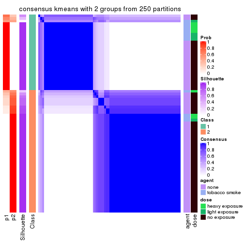</p>

</div>
<div id='tab-ATC-kmeans-consensus-heatmap-2'>
<pre><code class="r">consensus_heatmap(res, k = 3)
</code></pre>

<p>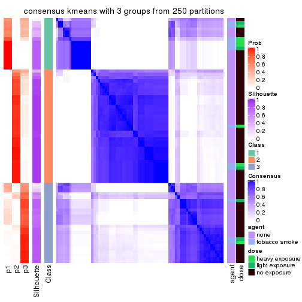</p>

</div>
<div id='tab-ATC-kmeans-consensus-heatmap-3'>
<pre><code class="r">consensus_heatmap(res, k = 4)
</code></pre>

<p>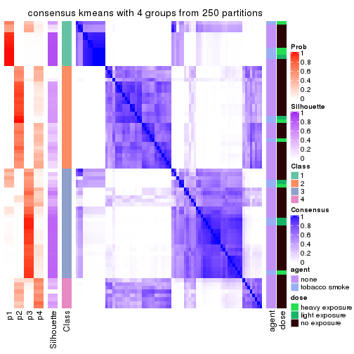</p>

</div>
<div id='tab-ATC-kmeans-consensus-heatmap-4'>
<pre><code class="r">consensus_heatmap(res, k = 5)
</code></pre>

<p>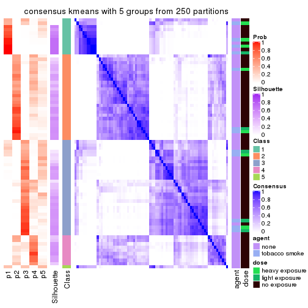</p>

</div>
<div id='tab-ATC-kmeans-consensus-heatmap-5'>
<pre><code class="r">consensus_heatmap(res, k = 6)
</code></pre>

<p>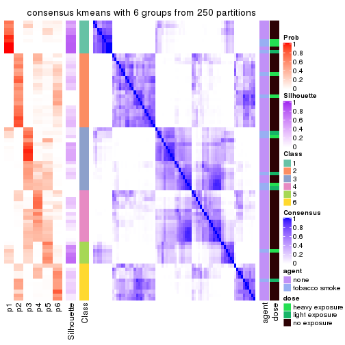</p>

</div>
</div>

Heatmaps for the membership of samples in all partitions to see how consistent they are:


<script>
$( function() {
	$( '#tabs-ATC-kmeans-membership-heatmap' ).tabs();
} );
</script>
<div id='tabs-ATC-kmeans-membership-heatmap'>
<ul>
<li><a href='#tab-ATC-kmeans-membership-heatmap-1'>k = 2</a></li>
<li><a href='#tab-ATC-kmeans-membership-heatmap-2'>k = 3</a></li>
<li><a href='#tab-ATC-kmeans-membership-heatmap-3'>k = 4</a></li>
<li><a href='#tab-ATC-kmeans-membership-heatmap-4'>k = 5</a></li>
<li><a href='#tab-ATC-kmeans-membership-heatmap-5'>k = 6</a></li>
</ul>
<div id='tab-ATC-kmeans-membership-heatmap-1'>
<pre><code class="r">membership_heatmap(res, k = 2)
</code></pre>

<p>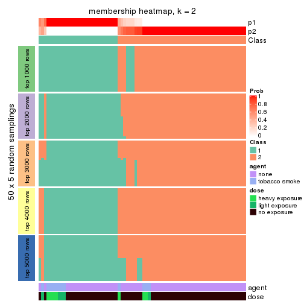</p>

</div>
<div id='tab-ATC-kmeans-membership-heatmap-2'>
<pre><code class="r">membership_heatmap(res, k = 3)
</code></pre>

<p>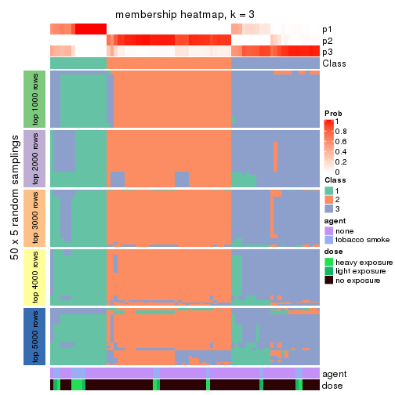</p>

</div>
<div id='tab-ATC-kmeans-membership-heatmap-3'>
<pre><code class="r">membership_heatmap(res, k = 4)
</code></pre>

<p>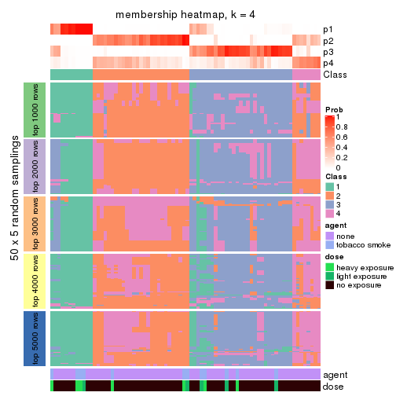</p>

</div>
<div id='tab-ATC-kmeans-membership-heatmap-4'>
<pre><code class="r">membership_heatmap(res, k = 5)
</code></pre>

<p>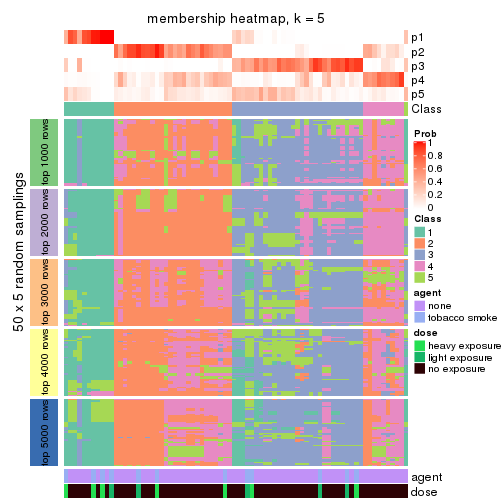</p>

</div>
<div id='tab-ATC-kmeans-membership-heatmap-5'>
<pre><code class="r">membership_heatmap(res, k = 6)
</code></pre>

<p>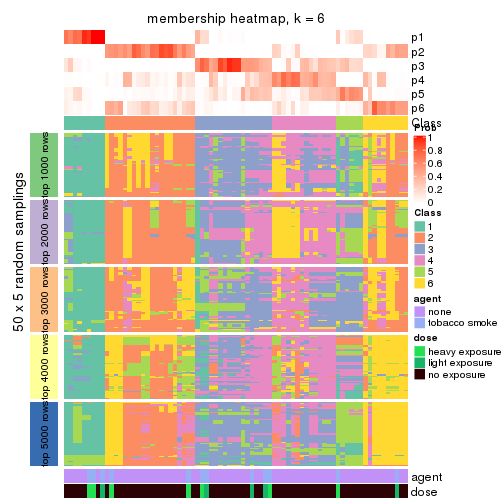</p>

</div>
</div>

As soon as we have had the classes for columns, we can look for signatures
which are significantly different between classes which can be candidate marks
for certain classes. Following are the heatmaps for signatures.


Signature heatmaps where rows are scaled:


<script>
$( function() {
	$( '#tabs-ATC-kmeans-get-signatures' ).tabs();
} );
</script>
<div id='tabs-ATC-kmeans-get-signatures'>
<ul>
<li><a href='#tab-ATC-kmeans-get-signatures-1'>k = 2</a></li>
<li><a href='#tab-ATC-kmeans-get-signatures-2'>k = 3</a></li>
<li><a href='#tab-ATC-kmeans-get-signatures-3'>k = 4</a></li>
<li><a href='#tab-ATC-kmeans-get-signatures-4'>k = 5</a></li>
<li><a href='#tab-ATC-kmeans-get-signatures-5'>k = 6</a></li>
</ul>
<div id='tab-ATC-kmeans-get-signatures-1'>
<pre><code class="r">get_signatures(res, k = 2)
</code></pre>

<p>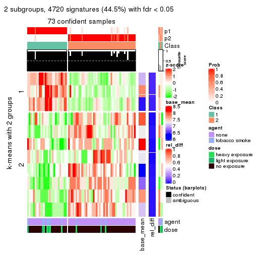</p>

</div>
<div id='tab-ATC-kmeans-get-signatures-2'>
<pre><code class="r">get_signatures(res, k = 3)
</code></pre>

<p>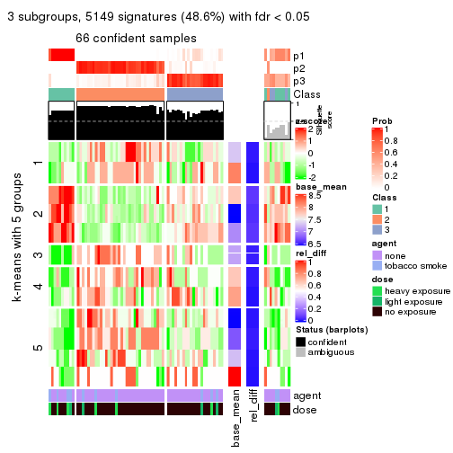</p>

</div>
<div id='tab-ATC-kmeans-get-signatures-3'>
<pre><code class="r">get_signatures(res, k = 4)
</code></pre>

<p>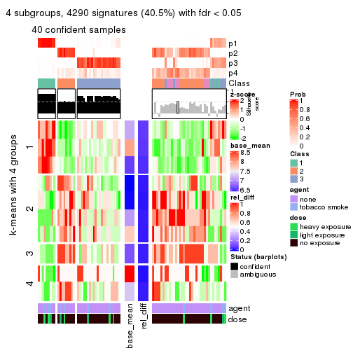</p>

</div>
<div id='tab-ATC-kmeans-get-signatures-4'>
<pre><code class="r">get_signatures(res, k = 5)
</code></pre>

<p>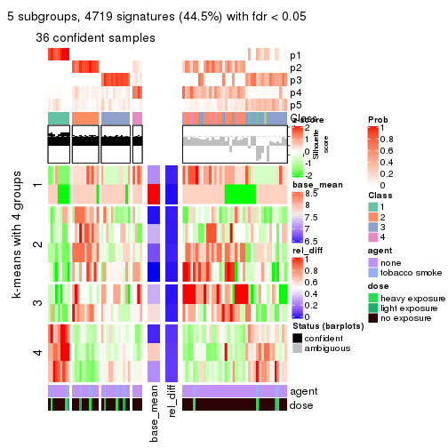</p>

</div>
<div id='tab-ATC-kmeans-get-signatures-5'>
<pre><code class="r">get_signatures(res, k = 6)
</code></pre>

<p>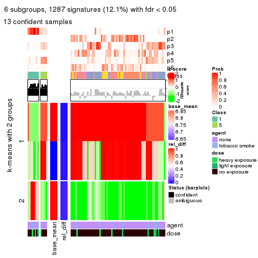</p>

</div>
</div>


Signature heatmaps where rows are not scaled:


<script>
$( function() {
	$( '#tabs-ATC-kmeans-get-signatures-no-scale' ).tabs();
} );
</script>
<div id='tabs-ATC-kmeans-get-signatures-no-scale'>
<ul>
<li><a href='#tab-ATC-kmeans-get-signatures-no-scale-1'>k = 2</a></li>
<li><a href='#tab-ATC-kmeans-get-signatures-no-scale-2'>k = 3</a></li>
<li><a href='#tab-ATC-kmeans-get-signatures-no-scale-3'>k = 4</a></li>
<li><a href='#tab-ATC-kmeans-get-signatures-no-scale-4'>k = 5</a></li>
<li><a href='#tab-ATC-kmeans-get-signatures-no-scale-5'>k = 6</a></li>
</ul>
<div id='tab-ATC-kmeans-get-signatures-no-scale-1'>
<pre><code class="r">get_signatures(res, k = 2, scale_rows = FALSE)
</code></pre>

<p>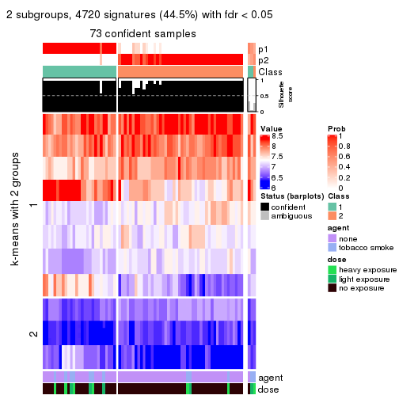</p>

</div>
<div id='tab-ATC-kmeans-get-signatures-no-scale-2'>
<pre><code class="r">get_signatures(res, k = 3, scale_rows = FALSE)
</code></pre>

<p>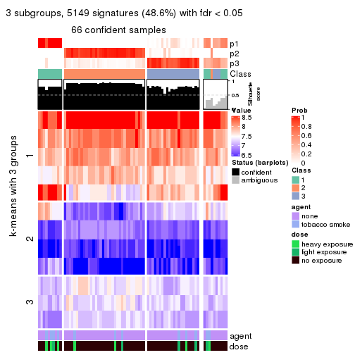</p>

</div>
<div id='tab-ATC-kmeans-get-signatures-no-scale-3'>
<pre><code class="r">get_signatures(res, k = 4, scale_rows = FALSE)
</code></pre>

<p></p>

</div>
<div id='tab-ATC-kmeans-get-signatures-no-scale-4'>
<pre><code class="r">get_signatures(res, k = 5, scale_rows = FALSE)
</code></pre>

<p>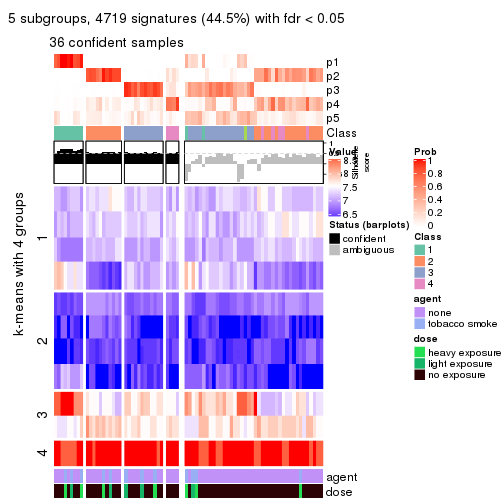</p>

</div>
<div id='tab-ATC-kmeans-get-signatures-no-scale-5'>
<pre><code class="r">get_signatures(res, k = 6, scale_rows = FALSE)
</code></pre>

<p>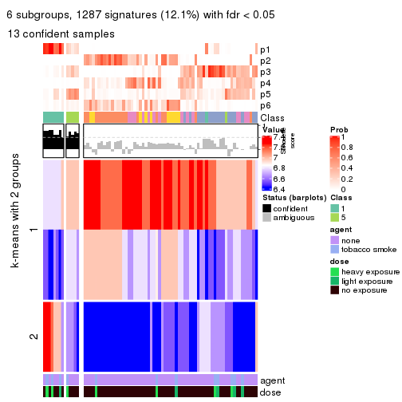</p>

</div>
</div>


Compare the overlap of signatures from different k:

```r
compare_signatures(res)
```

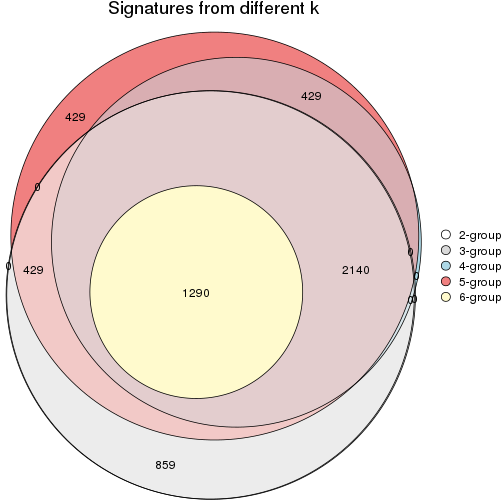

`get_signature()` returns a data frame invisibly. TO get the list of signatures, the function
call should be assigned to a variable explicitly. In following code, if `plot` argument is set
to `FALSE`, no heatmap is plotted while only the differential analysis is performed.

```r
# code only for demonstration
tb = get_signature(res, k = ..., plot = FALSE)
```

An example of the output of `tb` is:

```
#>   which_row         fdr    mean_1    mean_2 scaled_mean_1 scaled_mean_2 km
#> 1        38 0.042760348  8.373488  9.131774    -0.5533452     0.5164555  1
#> 2        40 0.018707592  7.106213  8.469186    -0.6173731     0.5762149  1
#> 3        55 0.019134737 10.221463 11.207825    -0.6159697     0.5749050  1
#> 4        59 0.006059896  5.921854  7.869574    -0.6899429     0.6439467  1
#> 5        60 0.018055526  8.928898 10.211722    -0.6204761     0.5791110  1
#> 6        98 0.009384629 15.714769 14.887706     0.6635654    -0.6193277  2
...
```

The columns in `tb` are:

1. `which_row`: row indices corresponding to the input matrix.
2. `fdr`: FDR for the differential test. 
3. `mean_x`: The mean value in group x.
4. `scaled_mean_x`: The mean value in group x after rows are scaled.
5. `km`: Row groups if k-means clustering is applied to rows.


UMAP plot which shows how samples are separated.


<script>
$( function() {
	$( '#tabs-ATC-kmeans-dimension-reduction' ).tabs();
} );
</script>
<div id='tabs-ATC-kmeans-dimension-reduction'>
<ul>
<li><a href='#tab-ATC-kmeans-dimension-reduction-1'>k = 2</a></li>
<li><a href='#tab-ATC-kmeans-dimension-reduction-2'>k = 3</a></li>
<li><a href='#tab-ATC-kmeans-dimension-reduction-3'>k = 4</a></li>
<li><a href='#tab-ATC-kmeans-dimension-reduction-4'>k = 5</a></li>
<li><a href='#tab-ATC-kmeans-dimension-reduction-5'>k = 6</a></li>
</ul>
<div id='tab-ATC-kmeans-dimension-reduction-1'>
<pre><code class="r">dimension_reduction(res, k = 2, method = &quot;UMAP&quot;)
</code></pre>

<p>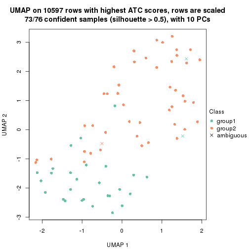</p>

</div>
<div id='tab-ATC-kmeans-dimension-reduction-2'>
<pre><code class="r">dimension_reduction(res, k = 3, method = &quot;UMAP&quot;)
</code></pre>

<p>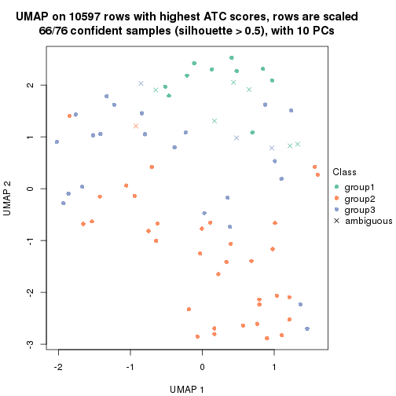</p>

</div>
<div id='tab-ATC-kmeans-dimension-reduction-3'>
<pre><code class="r">dimension_reduction(res, k = 4, method = &quot;UMAP&quot;)
</code></pre>

<p>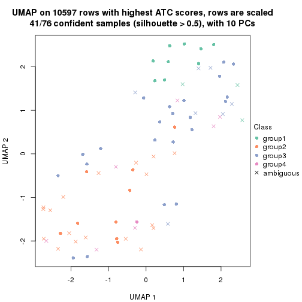</p>

</div>
<div id='tab-ATC-kmeans-dimension-reduction-4'>
<pre><code class="r">dimension_reduction(res, k = 5, method = &quot;UMAP&quot;)
</code></pre>

<p>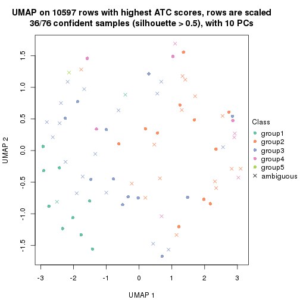</p>

</div>
<div id='tab-ATC-kmeans-dimension-reduction-5'>
<pre><code class="r">dimension_reduction(res, k = 6, method = &quot;UMAP&quot;)
</code></pre>

<p>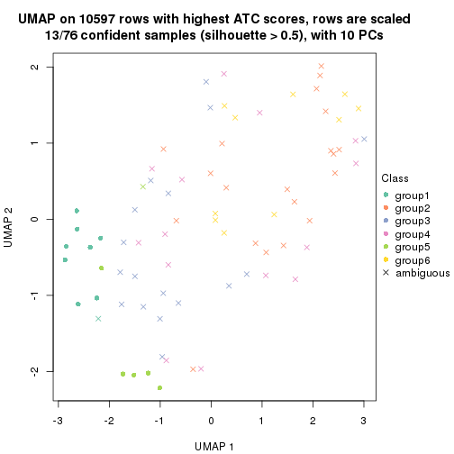</p>

</div>
</div>


Following heatmap shows how subgroups are split when increasing `k`:

```r
collect_classes(res)
```

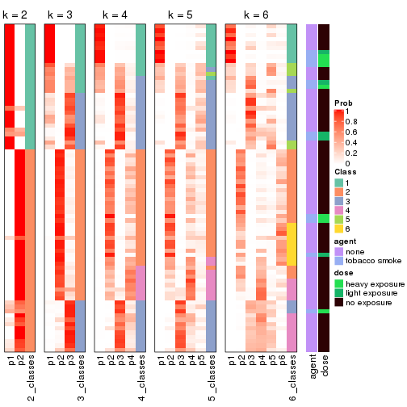


Test correlation between subgroups and known annotations. If the known
annotation is numeric, one-way ANOVA test is applied, and if the known
annotation is discrete, chi-squared contingency table test is applied.

```r
test_to_known_factors(res)
```

```
#>             n agent(p) dose(p) k
#> ATC:kmeans 73   0.0482  0.0642 2
#> ATC:kmeans 66   0.0523  0.1022 3
#> ATC:kmeans 41   0.6014  0.8495 4
#> ATC:kmeans 36   0.5843  0.8313 5
#> ATC:kmeans 13   0.9621  0.6722 6
```


If matrix rows can be associated to genes, consider to use `GO_Enrichment(res,
...)` to perform function enrichment for the signature genes.


 

---------------------------------------------------


### ATC:skmeans


The object with results only for a single top-value method and a single partition method 
can be extracted as:

```r
res = res_list["ATC", "skmeans"]
# you can also extract it by
# res = res_list["ATC:skmeans"]
```

A summary of `res` and all the functions that can be applied to it:

```r
res
```

```
#> A 'ConsensusPartition' object with k = 2, 3, 4, 5, 6.
#>   On a matrix with 10597 rows and 76 columns.
#>   Top rows (1000, 2000, 3000, 4000, 5000) are extracted by 'ATC' method.
#>   Subgroups are detected by 'skmeans' method.
#>   Performed in total 1250 partitions by row resampling.
#>   Best k for subgroups seems to be 2.
#> 
#> Following methods can be applied to this 'ConsensusPartition' object:
#>  [1] "cola_report"             "collect_classes"         "collect_plots"          
#>  [4] "collect_stats"           "colnames"                "compare_signatures"     
#>  [7] "consensus_heatmap"       "dimension_reduction"     "functional_enrichment"  
#> [10] "get_anno_col"            "get_anno"                "get_classes"            
#> [13] "get_consensus"           "get_matrix"              "get_membership"         
#> [16] "get_param"               "get_signatures"          "get_stats"              
#> [19] "is_best_k"               "is_stable_k"             "membership_heatmap"     
#> [22] "ncol"                    "nrow"                    "plot_ecdf"              
#> [25] "rownames"                "select_partition_number" "show"                   
#> [28] "suggest_best_k"          "test_to_known_factors"
```

`collect_plots()` function collects all the plots made from `res` for all `k` (number of partitions)
into one single page to provide an easy and fast comparison between different `k`.

```r
collect_plots(res)
```

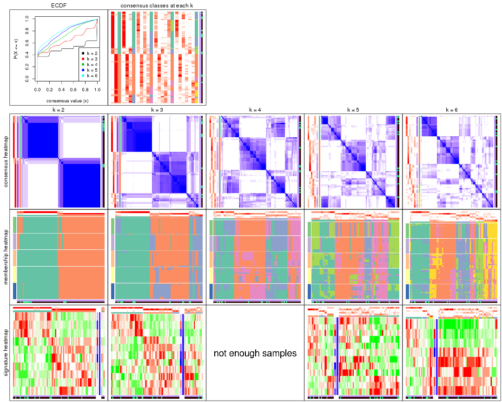

The plots are:

- The first row: a plot of the ECDF (Empirical cumulative distribution
  function) curves of the consensus matrix for each `k` and the heatmap of
  predicted classes for each `k`.
- The second row: heatmaps of the consensus matrix for each `k`.
- The third row: heatmaps of the membership matrix for each `k`.
- The fouth row: heatmaps of the signatures for each `k`.

All the plots in panels can be made by individual functions and they are
plotted later in this section.

`select_partition_number()` produces several plots showing different
statistics for choosing "optimized" `k`. There are following statistics:

- ECDF curves of the consensus matrix for each `k`;
- 1-PAC. [The PAC
  score](https://en.wikipedia.org/wiki/Consensus_clustering#Over-interpretation_potential_of_consensus_clustering)
  measures the proportion of the ambiguous subgrouping.
- Mean silhouette score.
- Concordance. The mean probability of fiting the consensus class ids in all
  partitions.
- Area increased. Denote $A_k$ as the area under the ECDF curve for current
  `k`, the area increased is defined as $A_k - A_{k-1}$.
- Rand index. The percent of pairs of samples that are both in a same cluster
  or both are not in a same cluster in the partition of k and k-1.
- Jaccard index. The ratio of pairs of samples are both in a same cluster in
  the partition of k and k-1 and the pairs of samples are both in a same
  cluster in the partition k or k-1.

The detailed explanations of these statistics can be found in [the cola
vignette](http://bioconductor.org/packages/devel/bioc/vignettes/cola/inst/doc/cola.html#toc_13).

Generally speaking, lower PAC score, higher mean silhouette score or higher
concordance corresponds to better partition. Rand index and Jaccard index
measure how similar the current partition is compared to partition with `k-1`.
If they are too similar, we won't accept `k` is better than `k-1`.

```r
select_partition_number(res)
```

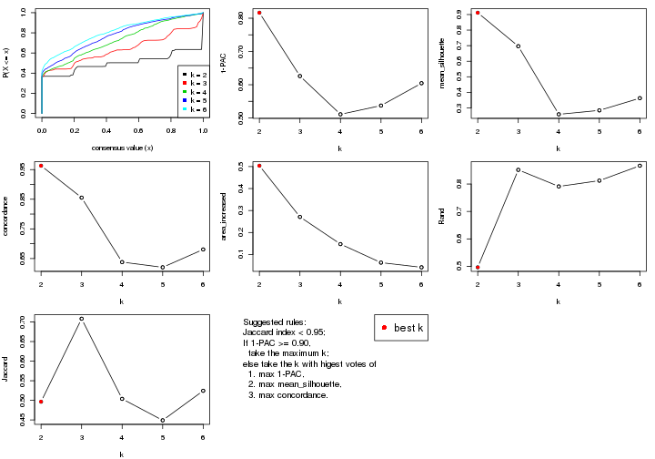

The numeric values for all these statistics can be obtained by `get_stats()`.

```r
get_stats(res)
```

```
#>   k 1-PAC mean_silhouette concordance area_increased  Rand Jaccard
#> 2 2 0.817           0.912       0.963         0.5039 0.496   0.496
#> 3 3 0.626           0.696       0.855         0.2710 0.852   0.708
#> 4 4 0.511           0.259       0.638         0.1473 0.791   0.504
#> 5 5 0.537           0.284       0.620         0.0630 0.812   0.449
#> 6 6 0.604           0.363       0.681         0.0417 0.867   0.524
```

`suggest_best_k()` suggests the best $k$ based on these statistics. The rules are as follows:

- All $k$ with Jaccard index larger than 0.95 are removed because the increase of
  the partition number does not provides enough extra information. If all $k$ are removed,
  the best $k$ is assigned by `NA`.
- For $k$ with 1-PAC larger than 0.9, the maximal $k$ is taken as the "best k". Other $k$ is called "optional k".
- If it does not fit the second rule. The $k$ with the highest vote of highest
  1-PAC, mean silhouette and concordance is taken as the "best k".

```r
suggest_best_k(res)
```

```
#> [1] 2
```


Following shows the table of the partitions (You need to click the **show/hide
code output** link to see it). The membership matrix (columns with name `p*`)
is inferred by
[`clue::cl_consensus()`](https://www.rdocumentation.org/link/cl_consensus?package=clue)
function with the `SE` method. Basically the value in the membership matrix
represents the probability to belong to a certain group. The finall class
label for an item is determined with the group with highest probability it
belongs to.

In `get_classes()` function, the entropy is calculated from the membership
matrix and the silhouette score is calculated from the consensus matrix.


<script>
$( function() {
	$( '#tabs-ATC-skmeans-get-classes' ).tabs();
} );
</script>
<div id='tabs-ATC-skmeans-get-classes'>
<ul>
<li><a href='#tab-ATC-skmeans-get-classes-1'>k = 2</a></li>
<li><a href='#tab-ATC-skmeans-get-classes-2'>k = 3</a></li>
<li><a href='#tab-ATC-skmeans-get-classes-3'>k = 4</a></li>
<li><a href='#tab-ATC-skmeans-get-classes-4'>k = 5</a></li>
<li><a href='#tab-ATC-skmeans-get-classes-5'>k = 6</a></li>
</ul>

<div id='tab-ATC-skmeans-get-classes-1'>
<p><a id='tab-ATC-skmeans-get-classes-1-a' style='color:#0366d6' href='#'>show/hide code output</a></p>
<pre><code class="r">cbind(get_classes(res, k = 2), get_membership(res, k = 2))
</code></pre>

<pre><code>#&gt;           class entropy silhouette    p1    p2
#&gt; GSM451162     1   0.000      0.956 1.000 0.000
#&gt; GSM451163     2   0.000      0.962 0.000 1.000
#&gt; GSM451164     2   0.000      0.962 0.000 1.000
#&gt; GSM451165     2   0.000      0.962 0.000 1.000
#&gt; GSM451167     2   0.000      0.962 0.000 1.000
#&gt; GSM451168     2   0.000      0.962 0.000 1.000
#&gt; GSM451169     2   0.000      0.962 0.000 1.000
#&gt; GSM451170     1   0.000      0.956 1.000 0.000
#&gt; GSM451171     2   0.000      0.962 0.000 1.000
#&gt; GSM451172     2   0.000      0.962 0.000 1.000
#&gt; GSM451173     1   0.000      0.956 1.000 0.000
#&gt; GSM451174     2   0.000      0.962 0.000 1.000
#&gt; GSM451175     1   0.000      0.956 1.000 0.000
#&gt; GSM451177     2   0.000      0.962 0.000 1.000
#&gt; GSM451178     2   0.000      0.962 0.000 1.000
#&gt; GSM451179     1   0.000      0.956 1.000 0.000
#&gt; GSM451180     2   0.000      0.962 0.000 1.000
#&gt; GSM451181     2   0.000      0.962 0.000 1.000
#&gt; GSM451182     1   0.000      0.956 1.000 0.000
#&gt; GSM451183     1   0.000      0.956 1.000 0.000
#&gt; GSM451184     1   0.722      0.741 0.800 0.200
#&gt; GSM451185     1   0.000      0.956 1.000 0.000
#&gt; GSM451186     2   0.722      0.737 0.200 0.800
#&gt; GSM451187     2   0.000      0.962 0.000 1.000
#&gt; GSM451188     2   0.000      0.962 0.000 1.000
#&gt; GSM451189     1   0.000      0.956 1.000 0.000
#&gt; GSM451190     1   0.000      0.956 1.000 0.000
#&gt; GSM451191     1   0.000      0.956 1.000 0.000
#&gt; GSM451193     2   0.971      0.280 0.400 0.600
#&gt; GSM451195     1   0.000      0.956 1.000 0.000
#&gt; GSM451196     1   0.000      0.956 1.000 0.000
#&gt; GSM451197     1   0.000      0.956 1.000 0.000
#&gt; GSM451199     1   0.000      0.956 1.000 0.000
#&gt; GSM451201     1   0.000      0.956 1.000 0.000
#&gt; GSM451202     2   0.000      0.962 0.000 1.000
#&gt; GSM451203     2   0.971      0.355 0.400 0.600
#&gt; GSM451204     2   0.000      0.962 0.000 1.000
#&gt; GSM451205     2   0.000      0.962 0.000 1.000
#&gt; GSM451206     2   0.000      0.962 0.000 1.000
#&gt; GSM451207     2   0.000      0.962 0.000 1.000
#&gt; GSM451208     2   0.000      0.962 0.000 1.000
#&gt; GSM451209     2   0.722      0.730 0.200 0.800
#&gt; GSM451210     2   0.000      0.962 0.000 1.000
#&gt; GSM451212     2   0.000      0.962 0.000 1.000
#&gt; GSM451213     2   0.000      0.962 0.000 1.000
#&gt; GSM451214     2   0.000      0.962 0.000 1.000
#&gt; GSM451215     2   0.000      0.962 0.000 1.000
#&gt; GSM451216     2   0.000      0.962 0.000 1.000
#&gt; GSM451217     2   0.000      0.962 0.000 1.000
#&gt; GSM451219     1   0.000      0.956 1.000 0.000
#&gt; GSM451220     1   0.000      0.956 1.000 0.000
#&gt; GSM451221     1   0.000      0.956 1.000 0.000
#&gt; GSM451222     1   0.000      0.956 1.000 0.000
#&gt; GSM451224     2   0.000      0.962 0.000 1.000
#&gt; GSM451225     1   0.000      0.956 1.000 0.000
#&gt; GSM451226     1   0.971      0.372 0.600 0.400
#&gt; GSM451227     1   0.760      0.726 0.780 0.220
#&gt; GSM451228     1   0.730      0.748 0.796 0.204
#&gt; GSM451230     2   0.730      0.732 0.204 0.796
#&gt; GSM451231     1   0.000      0.956 1.000 0.000
#&gt; GSM451233     2   0.000      0.962 0.000 1.000
#&gt; GSM451234     2   0.000      0.962 0.000 1.000
#&gt; GSM451235     2   0.000      0.962 0.000 1.000
#&gt; GSM451236     2   0.000      0.962 0.000 1.000
#&gt; GSM451166     1   0.680      0.764 0.820 0.180
#&gt; GSM451194     1   0.000      0.956 1.000 0.000
#&gt; GSM451198     1   0.000      0.956 1.000 0.000
#&gt; GSM451218     2   0.000      0.962 0.000 1.000
#&gt; GSM451232     1   0.000      0.956 1.000 0.000
#&gt; GSM451176     1   0.000      0.956 1.000 0.000
#&gt; GSM451192     1   0.000      0.956 1.000 0.000
#&gt; GSM451200     1   0.000      0.956 1.000 0.000
#&gt; GSM451211     2   0.000      0.962 0.000 1.000
#&gt; GSM451223     1   0.722      0.752 0.800 0.200
#&gt; GSM451229     1   0.000      0.956 1.000 0.000
#&gt; GSM451237     2   0.000      0.962 0.000 1.000
</code></pre>

<script>
$('#tab-ATC-skmeans-get-classes-1-a').parent().next().next().hide();
$('#tab-ATC-skmeans-get-classes-1-a').click(function(){
  $('#tab-ATC-skmeans-get-classes-1-a').parent().next().next().toggle();
  return(false);
});
</script>
</div>

<div id='tab-ATC-skmeans-get-classes-2'>
<p><a id='tab-ATC-skmeans-get-classes-2-a' style='color:#0366d6' href='#'>show/hide code output</a></p>
<pre><code class="r">cbind(get_classes(res, k = 3), get_membership(res, k = 3))
</code></pre>

<pre><code>#&gt;           class entropy silhouette    p1    p2    p3
#&gt; GSM451162     1  0.6045    0.40642 0.620 0.000 0.380
#&gt; GSM451163     3  0.4605    0.39856 0.000 0.204 0.796
#&gt; GSM451164     2  0.6244    0.47537 0.000 0.560 0.440
#&gt; GSM451165     2  0.6252    0.41897 0.000 0.556 0.444
#&gt; GSM451167     3  0.6079    0.00303 0.000 0.388 0.612
#&gt; GSM451168     2  0.0747    0.77838 0.000 0.984 0.016
#&gt; GSM451169     3  0.0000    0.59568 0.000 0.000 1.000
#&gt; GSM451170     1  0.1529    0.91573 0.960 0.000 0.040
#&gt; GSM451171     2  0.5138    0.70801 0.000 0.748 0.252
#&gt; GSM451172     2  0.6079    0.27938 0.000 0.612 0.388
#&gt; GSM451173     1  0.0000    0.93225 1.000 0.000 0.000
#&gt; GSM451174     2  0.0892    0.77613 0.000 0.980 0.020
#&gt; GSM451175     1  0.0000    0.93225 1.000 0.000 0.000
#&gt; GSM451177     2  0.0747    0.77550 0.000 0.984 0.016
#&gt; GSM451178     2  0.0000    0.77552 0.000 1.000 0.000
#&gt; GSM451179     1  0.0592    0.92366 0.988 0.012 0.000
#&gt; GSM451180     2  0.0592    0.77399 0.000 0.988 0.012
#&gt; GSM451181     2  0.1163    0.77422 0.000 0.972 0.028
#&gt; GSM451182     1  0.0592    0.92738 0.988 0.000 0.012
#&gt; GSM451183     1  0.0000    0.93225 1.000 0.000 0.000
#&gt; GSM451184     1  0.6095    0.33706 0.608 0.000 0.392
#&gt; GSM451185     1  0.0000    0.93225 1.000 0.000 0.000
#&gt; GSM451186     2  0.8643    0.45554 0.188 0.600 0.212
#&gt; GSM451187     2  0.4750    0.59311 0.000 0.784 0.216
#&gt; GSM451188     2  0.6154    0.48728 0.000 0.592 0.408
#&gt; GSM451189     1  0.0000    0.93225 1.000 0.000 0.000
#&gt; GSM451190     1  0.1529    0.91573 0.960 0.000 0.040
#&gt; GSM451191     1  0.1529    0.91573 0.960 0.000 0.040
#&gt; GSM451193     3  0.9877    0.37798 0.316 0.276 0.408
#&gt; GSM451195     1  0.0000    0.93225 1.000 0.000 0.000
#&gt; GSM451196     1  0.0000    0.93225 1.000 0.000 0.000
#&gt; GSM451197     1  0.0000    0.93225 1.000 0.000 0.000
#&gt; GSM451199     1  0.0000    0.93225 1.000 0.000 0.000
#&gt; GSM451201     1  0.0000    0.93225 1.000 0.000 0.000
#&gt; GSM451202     2  0.4702    0.72908 0.000 0.788 0.212
#&gt; GSM451203     3  0.4555    0.57228 0.200 0.000 0.800
#&gt; GSM451204     2  0.4452    0.73213 0.000 0.808 0.192
#&gt; GSM451205     2  0.6235    0.48024 0.000 0.564 0.436
#&gt; GSM451206     2  0.0000    0.77552 0.000 1.000 0.000
#&gt; GSM451207     2  0.1289    0.77323 0.000 0.968 0.032
#&gt; GSM451208     2  0.0747    0.77838 0.000 0.984 0.016
#&gt; GSM451209     2  0.4555    0.50536 0.200 0.800 0.000
#&gt; GSM451210     2  0.5016    0.71143 0.000 0.760 0.240
#&gt; GSM451212     2  0.4842    0.72784 0.000 0.776 0.224
#&gt; GSM451213     2  0.0000    0.77552 0.000 1.000 0.000
#&gt; GSM451214     3  0.1753    0.59616 0.000 0.048 0.952
#&gt; GSM451215     2  0.1643    0.77491 0.000 0.956 0.044
#&gt; GSM451216     2  0.0000    0.77552 0.000 1.000 0.000
#&gt; GSM451217     2  0.6140    0.48134 0.000 0.596 0.404
#&gt; GSM451219     1  0.0000    0.93225 1.000 0.000 0.000
#&gt; GSM451220     1  0.4399    0.73332 0.812 0.000 0.188
#&gt; GSM451221     1  0.1529    0.91573 0.960 0.000 0.040
#&gt; GSM451222     1  0.0000    0.93225 1.000 0.000 0.000
#&gt; GSM451224     2  0.4062    0.74412 0.000 0.836 0.164
#&gt; GSM451225     1  0.0237    0.93100 0.996 0.000 0.004
#&gt; GSM451226     3  0.1399    0.61020 0.028 0.004 0.968
#&gt; GSM451227     3  0.9034    0.50874 0.244 0.200 0.556
#&gt; GSM451228     3  0.6827    0.53557 0.080 0.192 0.728
#&gt; GSM451230     2  0.6771    0.10612 0.012 0.548 0.440
#&gt; GSM451231     1  0.1163    0.91035 0.972 0.028 0.000
#&gt; GSM451233     2  0.1163    0.77422 0.000 0.972 0.028
#&gt; GSM451234     2  0.4654    0.73084 0.000 0.792 0.208
#&gt; GSM451235     3  0.6192   -0.14402 0.000 0.420 0.580
#&gt; GSM451236     2  0.4555    0.72832 0.000 0.800 0.200
#&gt; GSM451166     3  0.6192    0.29018 0.420 0.000 0.580
#&gt; GSM451194     1  0.1525    0.91807 0.964 0.004 0.032
#&gt; GSM451198     1  0.4399    0.73332 0.812 0.000 0.188
#&gt; GSM451218     2  0.0000    0.77552 0.000 1.000 0.000
#&gt; GSM451232     1  0.0000    0.93225 1.000 0.000 0.000
#&gt; GSM451176     1  0.0000    0.93225 1.000 0.000 0.000
#&gt; GSM451192     1  0.1529    0.91573 0.960 0.000 0.040
#&gt; GSM451200     1  0.4399    0.73332 0.812 0.000 0.188
#&gt; GSM451211     2  0.0000    0.77552 0.000 1.000 0.000
#&gt; GSM451223     3  0.6280    0.03206 0.460 0.000 0.540
#&gt; GSM451229     1  0.0000    0.93225 1.000 0.000 0.000
#&gt; GSM451237     2  0.5016    0.71143 0.000 0.760 0.240
</code></pre>

<script>
$('#tab-ATC-skmeans-get-classes-2-a').parent().next().next().hide();
$('#tab-ATC-skmeans-get-classes-2-a').click(function(){
  $('#tab-ATC-skmeans-get-classes-2-a').parent().next().next().toggle();
  return(false);
});
</script>
</div>

<div id='tab-ATC-skmeans-get-classes-3'>
<p><a id='tab-ATC-skmeans-get-classes-3-a' style='color:#0366d6' href='#'>show/hide code output</a></p>
<pre><code class="r">cbind(get_classes(res, k = 4), get_membership(res, k = 4))
</code></pre>

<pre><code>#&gt;           class entropy silhouette    p1    p2    p3    p4
#&gt; GSM451162     1  0.3726     0.1943 0.788 0.000 0.212 0.000
#&gt; GSM451163     4  0.6367     0.4620 0.000 0.392 0.068 0.540
#&gt; GSM451164     2  0.4998    -0.4954 0.000 0.512 0.000 0.488
#&gt; GSM451165     2  0.4067     0.3758 0.012 0.848 0.080 0.060
#&gt; GSM451167     4  0.4560     0.4364 0.000 0.296 0.004 0.700
#&gt; GSM451168     2  0.5028     0.5750 0.000 0.596 0.004 0.400
#&gt; GSM451169     4  0.7954     0.4409 0.020 0.352 0.168 0.460
#&gt; GSM451170     1  0.3649     0.3707 0.796 0.000 0.204 0.000
#&gt; GSM451171     2  0.3764     0.0363 0.000 0.784 0.000 0.216
#&gt; GSM451172     4  0.6106     0.4528 0.000 0.332 0.064 0.604
#&gt; GSM451173     3  0.4992     0.0782 0.476 0.000 0.524 0.000
#&gt; GSM451174     2  0.4103     0.5442 0.000 0.744 0.000 0.256
#&gt; GSM451175     3  0.4477     0.1579 0.312 0.000 0.688 0.000
#&gt; GSM451177     2  0.4222     0.5531 0.000 0.728 0.000 0.272
#&gt; GSM451178     2  0.4776     0.5840 0.000 0.624 0.000 0.376
#&gt; GSM451179     3  0.4948     0.1374 0.440 0.000 0.560 0.000
#&gt; GSM451180     2  0.4843     0.5791 0.000 0.604 0.000 0.396
#&gt; GSM451181     2  0.4250     0.5503 0.000 0.724 0.000 0.276
#&gt; GSM451182     1  0.3801     0.3609 0.780 0.000 0.220 0.000
#&gt; GSM451183     1  0.3801     0.3397 0.780 0.000 0.220 0.000
#&gt; GSM451184     1  0.5548     0.1707 0.716 0.000 0.084 0.200
#&gt; GSM451185     3  0.5000     0.0954 0.500 0.000 0.500 0.000
#&gt; GSM451186     2  0.5727     0.2340 0.000 0.704 0.200 0.096
#&gt; GSM451187     4  0.4040     0.3988 0.000 0.248 0.000 0.752
#&gt; GSM451188     2  0.3903     0.3863 0.000 0.844 0.076 0.080
#&gt; GSM451189     1  0.5000    -0.1906 0.500 0.000 0.500 0.000
#&gt; GSM451190     1  0.0188     0.3555 0.996 0.000 0.004 0.000
#&gt; GSM451191     1  0.3649     0.3707 0.796 0.000 0.204 0.000
#&gt; GSM451193     4  0.8136     0.4419 0.220 0.224 0.036 0.520
#&gt; GSM451195     1  0.4746    -0.0171 0.632 0.000 0.368 0.000
#&gt; GSM451196     3  0.4999     0.1081 0.492 0.000 0.508 0.000
#&gt; GSM451197     1  0.4164     0.2930 0.736 0.000 0.264 0.000
#&gt; GSM451199     3  0.4948     0.1374 0.440 0.000 0.560 0.000
#&gt; GSM451201     3  0.4977     0.1222 0.460 0.000 0.540 0.000
#&gt; GSM451202     2  0.0336     0.4977 0.000 0.992 0.000 0.008
#&gt; GSM451203     1  0.8664    -0.2663 0.416 0.356 0.168 0.060
#&gt; GSM451204     2  0.4608     0.5393 0.000 0.692 0.004 0.304
#&gt; GSM451205     4  0.5080     0.4629 0.000 0.420 0.004 0.576
#&gt; GSM451206     2  0.4961     0.5149 0.000 0.552 0.000 0.448
#&gt; GSM451207     4  0.4961    -0.0086 0.000 0.448 0.000 0.552
#&gt; GSM451208     2  0.5028     0.5629 0.000 0.596 0.004 0.400
#&gt; GSM451209     4  0.7387    -0.1084 0.000 0.224 0.256 0.520
#&gt; GSM451210     2  0.1022     0.4832 0.000 0.968 0.000 0.032
#&gt; GSM451212     2  0.3726     0.1793 0.000 0.788 0.000 0.212
#&gt; GSM451213     2  0.4776     0.5840 0.000 0.624 0.000 0.376
#&gt; GSM451214     3  0.8944    -0.2601 0.180 0.076 0.384 0.360
#&gt; GSM451215     2  0.5050     0.5627 0.000 0.588 0.004 0.408
#&gt; GSM451216     2  0.4804     0.5825 0.000 0.616 0.000 0.384
#&gt; GSM451217     2  0.4401     0.4056 0.000 0.812 0.076 0.112
#&gt; GSM451219     1  0.4454     0.2747 0.692 0.000 0.308 0.000
#&gt; GSM451220     3  0.4888     0.0875 0.412 0.000 0.588 0.000
#&gt; GSM451221     1  0.3610     0.3705 0.800 0.000 0.200 0.000
#&gt; GSM451222     3  0.4992     0.0782 0.476 0.000 0.524 0.000
#&gt; GSM451224     2  0.4535     0.5469 0.000 0.704 0.004 0.292
#&gt; GSM451225     3  0.7319     0.0644 0.316 0.004 0.524 0.156
#&gt; GSM451226     3  0.8099    -0.0594 0.356 0.008 0.380 0.256
#&gt; GSM451227     1  0.9915    -0.2007 0.308 0.200 0.252 0.240
#&gt; GSM451228     3  0.7717     0.0351 0.264 0.000 0.448 0.288
#&gt; GSM451230     4  0.9277     0.3944 0.200 0.332 0.100 0.368
#&gt; GSM451231     3  0.7150     0.1156 0.204 0.004 0.580 0.212
#&gt; GSM451233     4  0.4855    -0.0737 0.000 0.400 0.000 0.600
#&gt; GSM451234     2  0.0336     0.4977 0.000 0.992 0.000 0.008
#&gt; GSM451235     4  0.5294     0.0995 0.000 0.484 0.008 0.508
#&gt; GSM451236     2  0.4877     0.5138 0.000 0.664 0.008 0.328
#&gt; GSM451166     3  0.5569    -0.0441 0.296 0.044 0.660 0.000
#&gt; GSM451194     1  0.4907     0.1938 0.580 0.000 0.420 0.000
#&gt; GSM451198     1  0.4866    -0.0569 0.596 0.000 0.404 0.000
#&gt; GSM451218     2  0.4776     0.5840 0.000 0.624 0.000 0.376
#&gt; GSM451232     3  0.4999     0.1081 0.492 0.000 0.508 0.000
#&gt; GSM451176     3  0.4948     0.1427 0.440 0.000 0.560 0.000
#&gt; GSM451192     1  0.0000     0.3562 1.000 0.000 0.000 0.000
#&gt; GSM451200     1  0.4746    -0.0171 0.632 0.000 0.368 0.000
#&gt; GSM451211     2  0.4776     0.5840 0.000 0.624 0.000 0.376
#&gt; GSM451223     3  0.6194     0.1207 0.132 0.000 0.668 0.200
#&gt; GSM451229     3  0.4999     0.1081 0.492 0.000 0.508 0.000
#&gt; GSM451237     2  0.0592     0.4867 0.000 0.984 0.000 0.016
</code></pre>

<script>
$('#tab-ATC-skmeans-get-classes-3-a').parent().next().next().hide();
$('#tab-ATC-skmeans-get-classes-3-a').click(function(){
  $('#tab-ATC-skmeans-get-classes-3-a').parent().next().next().toggle();
  return(false);
});
</script>
</div>

<div id='tab-ATC-skmeans-get-classes-4'>
<p><a id='tab-ATC-skmeans-get-classes-4-a' style='color:#0366d6' href='#'>show/hide code output</a></p>
<pre><code class="r">cbind(get_classes(res, k = 5), get_membership(res, k = 5))
</code></pre>

<pre><code>#&gt;           class entropy silhouette    p1    p2    p3    p4    p5
#&gt; GSM451162     3  0.7446   0.341184 0.052 0.000 0.432 0.192 0.324
#&gt; GSM451163     4  0.3491   0.509999 0.000 0.000 0.228 0.768 0.004
#&gt; GSM451164     4  0.4613   0.532861 0.000 0.072 0.200 0.728 0.000
#&gt; GSM451165     4  0.6398  -0.061032 0.000 0.416 0.100 0.464 0.020
#&gt; GSM451167     4  0.7436   0.363029 0.000 0.160 0.280 0.484 0.076
#&gt; GSM451168     2  0.4005   0.555124 0.000 0.828 0.072 0.044 0.056
#&gt; GSM451169     4  0.4570   0.425956 0.000 0.000 0.348 0.632 0.020
#&gt; GSM451170     5  0.4029   0.629226 0.316 0.000 0.004 0.000 0.680
#&gt; GSM451171     4  0.6319   0.320514 0.000 0.272 0.204 0.524 0.000
#&gt; GSM451172     4  0.6283   0.492660 0.000 0.156 0.280 0.556 0.008
#&gt; GSM451173     1  0.7911   0.146586 0.456 0.000 0.224 0.192 0.128
#&gt; GSM451174     2  0.3905   0.430992 0.000 0.752 0.012 0.232 0.004
#&gt; GSM451175     1  0.1981   0.383744 0.924 0.000 0.028 0.000 0.048
#&gt; GSM451177     2  0.2813   0.491434 0.000 0.832 0.000 0.168 0.000
#&gt; GSM451178     2  0.0000   0.590580 0.000 1.000 0.000 0.000 0.000
#&gt; GSM451179     1  0.1410   0.363499 0.940 0.000 0.000 0.000 0.060
#&gt; GSM451180     2  0.1300   0.587698 0.000 0.956 0.016 0.028 0.000
#&gt; GSM451181     2  0.5546   0.361263 0.000 0.648 0.000 0.176 0.176
#&gt; GSM451182     5  0.4126   0.594250 0.380 0.000 0.000 0.000 0.620
#&gt; GSM451183     5  0.4460   0.563714 0.392 0.000 0.004 0.004 0.600
#&gt; GSM451184     1  0.6887   0.139006 0.408 0.000 0.012 0.380 0.200
#&gt; GSM451185     1  0.4451  -0.404447 0.504 0.000 0.004 0.000 0.492
#&gt; GSM451186     2  0.6539  -0.000431 0.200 0.432 0.000 0.368 0.000
#&gt; GSM451187     2  0.6724  -0.237652 0.000 0.408 0.208 0.380 0.004
#&gt; GSM451188     2  0.7015   0.153017 0.000 0.452 0.188 0.336 0.024
#&gt; GSM451189     1  0.4451  -0.404447 0.504 0.000 0.004 0.000 0.492
#&gt; GSM451190     5  0.5308   0.443522 0.140 0.000 0.004 0.168 0.688
#&gt; GSM451191     5  0.4029   0.629226 0.316 0.000 0.004 0.000 0.680
#&gt; GSM451193     4  0.9349   0.122392 0.232 0.092 0.204 0.352 0.120
#&gt; GSM451195     1  0.4028   0.392875 0.768 0.000 0.000 0.192 0.040
#&gt; GSM451196     1  0.4561  -0.397412 0.504 0.000 0.008 0.000 0.488
#&gt; GSM451197     5  0.4504   0.502210 0.428 0.000 0.008 0.000 0.564
#&gt; GSM451199     1  0.1671   0.356352 0.924 0.000 0.000 0.000 0.076
#&gt; GSM451201     1  0.1965   0.343543 0.904 0.000 0.000 0.000 0.096
#&gt; GSM451202     2  0.4451   0.095357 0.000 0.504 0.004 0.492 0.000
#&gt; GSM451203     4  0.5547   0.122312 0.000 0.000 0.148 0.644 0.208
#&gt; GSM451204     2  0.7301   0.368580 0.000 0.532 0.104 0.128 0.236
#&gt; GSM451205     4  0.6159   0.483999 0.000 0.060 0.280 0.604 0.056
#&gt; GSM451206     2  0.0963   0.580730 0.000 0.964 0.000 0.036 0.000
#&gt; GSM451207     2  0.6546   0.172211 0.000 0.528 0.012 0.284 0.176
#&gt; GSM451208     2  0.4563   0.537357 0.000 0.792 0.092 0.060 0.056
#&gt; GSM451209     2  0.8306   0.041095 0.252 0.384 0.036 0.048 0.280
#&gt; GSM451210     2  0.4883   0.138099 0.000 0.516 0.016 0.464 0.004
#&gt; GSM451212     4  0.5447   0.386243 0.000 0.168 0.000 0.660 0.172
#&gt; GSM451213     2  0.0162   0.590436 0.000 0.996 0.000 0.000 0.004
#&gt; GSM451214     3  0.1753   0.546449 0.000 0.000 0.936 0.032 0.032
#&gt; GSM451215     2  0.4295   0.546640 0.000 0.808 0.092 0.052 0.048
#&gt; GSM451216     2  0.0162   0.590436 0.000 0.996 0.000 0.000 0.004
#&gt; GSM451217     2  0.7012   0.196156 0.000 0.480 0.188 0.304 0.028
#&gt; GSM451219     5  0.4410   0.496483 0.440 0.000 0.004 0.000 0.556
#&gt; GSM451220     1  0.7673  -0.010604 0.436 0.000 0.296 0.192 0.076
#&gt; GSM451221     5  0.4029   0.629226 0.316 0.000 0.004 0.000 0.680
#&gt; GSM451222     1  0.7989   0.125930 0.444 0.000 0.228 0.192 0.136
#&gt; GSM451224     2  0.5769   0.483403 0.000 0.704 0.108 0.112 0.076
#&gt; GSM451225     1  0.4792   0.278141 0.704 0.000 0.020 0.028 0.248
#&gt; GSM451226     3  0.3551   0.558211 0.000 0.000 0.820 0.044 0.136
#&gt; GSM451227     5  0.9794  -0.339592 0.132 0.184 0.240 0.168 0.276
#&gt; GSM451228     3  0.4615   0.624029 0.108 0.040 0.784 0.000 0.068
#&gt; GSM451230     4  0.4977   0.366275 0.008 0.216 0.040 0.720 0.016
#&gt; GSM451231     1  0.5860   0.109275 0.588 0.016 0.020 0.036 0.340
#&gt; GSM451233     2  0.6345   0.258833 0.000 0.584 0.016 0.224 0.176
#&gt; GSM451234     2  0.4306   0.093792 0.000 0.508 0.000 0.492 0.000
#&gt; GSM451235     4  0.7662  -0.001999 0.000 0.356 0.172 0.396 0.076
#&gt; GSM451236     2  0.6100   0.452986 0.000 0.672 0.116 0.140 0.072
#&gt; GSM451166     3  0.6279   0.500431 0.224 0.000 0.624 0.048 0.104
#&gt; GSM451194     1  0.5880  -0.279676 0.484 0.000 0.100 0.000 0.416
#&gt; GSM451198     1  0.7084   0.325073 0.560 0.000 0.076 0.192 0.172
#&gt; GSM451218     2  0.0000   0.590580 0.000 1.000 0.000 0.000 0.000
#&gt; GSM451232     1  0.4561  -0.397412 0.504 0.000 0.008 0.000 0.488
#&gt; GSM451176     1  0.4533  -0.323573 0.544 0.000 0.008 0.000 0.448
#&gt; GSM451192     5  0.5296   0.430313 0.132 0.000 0.004 0.176 0.688
#&gt; GSM451200     1  0.4458   0.390732 0.748 0.000 0.004 0.192 0.056
#&gt; GSM451211     2  0.0000   0.590580 0.000 1.000 0.000 0.000 0.000
#&gt; GSM451223     3  0.5942   0.572665 0.108 0.000 0.600 0.012 0.280
#&gt; GSM451229     1  0.4561  -0.397412 0.504 0.000 0.008 0.000 0.488
#&gt; GSM451237     4  0.4307  -0.181887 0.000 0.496 0.000 0.504 0.000
</code></pre>

<script>
$('#tab-ATC-skmeans-get-classes-4-a').parent().next().next().hide();
$('#tab-ATC-skmeans-get-classes-4-a').click(function(){
  $('#tab-ATC-skmeans-get-classes-4-a').parent().next().next().toggle();
  return(false);
});
</script>
</div>

<div id='tab-ATC-skmeans-get-classes-5'>
<p><a id='tab-ATC-skmeans-get-classes-5-a' style='color:#0366d6' href='#'>show/hide code output</a></p>
<pre><code class="r">cbind(get_classes(res, k = 6), get_membership(res, k = 6))
</code></pre>

<pre><code>#&gt;           class entropy silhouette    p1    p2    p3    p4    p5    p6
#&gt; GSM451162     5  0.5729     0.3495 0.312 0.000 0.168 0.004 0.516 0.000
#&gt; GSM451163     6  0.0858     0.5197 0.000 0.000 0.004 0.028 0.000 0.968
#&gt; GSM451164     6  0.1219     0.5157 0.000 0.048 0.000 0.004 0.000 0.948
#&gt; GSM451165     2  0.6449    -0.0072 0.000 0.392 0.012 0.212 0.008 0.376
#&gt; GSM451167     6  0.5467     0.0833 0.000 0.112 0.008 0.332 0.000 0.548
#&gt; GSM451168     2  0.3740     0.1190 0.000 0.740 0.000 0.228 0.000 0.032
#&gt; GSM451169     6  0.4696     0.3280 0.000 0.000 0.008 0.352 0.040 0.600
#&gt; GSM451170     1  0.0146     0.7379 0.996 0.000 0.004 0.000 0.000 0.000
#&gt; GSM451171     6  0.4087     0.1616 0.000 0.276 0.000 0.036 0.000 0.688
#&gt; GSM451172     6  0.4294     0.5022 0.000 0.084 0.004 0.116 0.024 0.772
#&gt; GSM451173     3  0.4847     0.0386 0.048 0.000 0.532 0.004 0.416 0.000
#&gt; GSM451174     2  0.3775     0.3748 0.000 0.780 0.000 0.092 0.000 0.128
#&gt; GSM451175     3  0.4007     0.5454 0.220 0.000 0.728 0.000 0.052 0.000
#&gt; GSM451177     2  0.2750     0.3979 0.000 0.844 0.000 0.020 0.000 0.136
#&gt; GSM451178     2  0.0000     0.4142 0.000 1.000 0.000 0.000 0.000 0.000
#&gt; GSM451179     3  0.4948     0.5452 0.108 0.000 0.700 0.028 0.164 0.000
#&gt; GSM451180     2  0.1625     0.3580 0.000 0.928 0.000 0.060 0.000 0.012
#&gt; GSM451181     2  0.4989     0.2421 0.000 0.640 0.000 0.220 0.000 0.140
#&gt; GSM451182     1  0.0790     0.7492 0.968 0.000 0.032 0.000 0.000 0.000
#&gt; GSM451183     1  0.2624     0.7586 0.856 0.000 0.124 0.000 0.020 0.000
#&gt; GSM451184     3  0.6536     0.3154 0.172 0.000 0.588 0.156 0.040 0.044
#&gt; GSM451185     1  0.3368     0.7274 0.756 0.000 0.232 0.000 0.012 0.000
#&gt; GSM451186     2  0.7029     0.0698 0.032 0.392 0.004 0.024 0.172 0.376
#&gt; GSM451187     6  0.4981     0.2836 0.000 0.340 0.004 0.072 0.000 0.584
#&gt; GSM451188     4  0.6037     0.1909 0.000 0.420 0.008 0.432 0.012 0.128
#&gt; GSM451189     1  0.3342     0.7294 0.760 0.000 0.228 0.000 0.012 0.000
#&gt; GSM451190     1  0.1168     0.7352 0.956 0.000 0.028 0.000 0.016 0.000
#&gt; GSM451191     1  0.0508     0.7349 0.984 0.000 0.004 0.000 0.012 0.000
#&gt; GSM451193     6  0.6361     0.2829 0.084 0.044 0.256 0.012 0.020 0.584
#&gt; GSM451195     3  0.1501     0.5829 0.076 0.000 0.924 0.000 0.000 0.000
#&gt; GSM451196     1  0.3745     0.7119 0.732 0.000 0.240 0.000 0.028 0.000
#&gt; GSM451197     1  0.3422     0.7462 0.792 0.000 0.168 0.000 0.040 0.000
#&gt; GSM451199     3  0.3337     0.4968 0.260 0.000 0.736 0.000 0.004 0.000
#&gt; GSM451201     3  0.3734     0.4736 0.264 0.000 0.716 0.000 0.020 0.000
#&gt; GSM451202     2  0.4529     0.2457 0.000 0.508 0.000 0.032 0.000 0.460
#&gt; GSM451203     6  0.7494     0.1572 0.044 0.000 0.180 0.348 0.056 0.372
#&gt; GSM451204     4  0.4482     0.1959 0.000 0.416 0.000 0.552 0.000 0.032
#&gt; GSM451205     6  0.4019     0.2712 0.000 0.012 0.004 0.332 0.000 0.652
#&gt; GSM451206     2  0.2048     0.3373 0.000 0.880 0.000 0.000 0.000 0.120
#&gt; GSM451207     2  0.5861    -0.0729 0.000 0.444 0.000 0.200 0.000 0.356
#&gt; GSM451208     2  0.4167    -0.0846 0.000 0.632 0.000 0.344 0.000 0.024
#&gt; GSM451209     4  0.7721     0.0255 0.000 0.288 0.220 0.372 0.088 0.032
#&gt; GSM451210     2  0.5152     0.2288 0.000 0.532 0.000 0.092 0.000 0.376
#&gt; GSM451212     6  0.4273     0.3212 0.000 0.204 0.000 0.080 0.000 0.716
#&gt; GSM451213     2  0.0458     0.4107 0.000 0.984 0.000 0.016 0.000 0.000
#&gt; GSM451214     5  0.5280     0.4647 0.000 0.000 0.004 0.176 0.620 0.200
#&gt; GSM451215     2  0.4062    -0.0359 0.000 0.660 0.000 0.316 0.000 0.024
#&gt; GSM451216     2  0.0458     0.4107 0.000 0.984 0.000 0.016 0.000 0.000
#&gt; GSM451217     4  0.5952     0.2036 0.000 0.420 0.008 0.444 0.012 0.116
#&gt; GSM451219     1  0.2278     0.7573 0.868 0.000 0.128 0.000 0.004 0.000
#&gt; GSM451220     5  0.4225    -0.0558 0.008 0.000 0.480 0.004 0.508 0.000
#&gt; GSM451221     1  0.0508     0.7310 0.984 0.000 0.012 0.000 0.004 0.000
#&gt; GSM451222     3  0.4910     0.0208 0.052 0.000 0.520 0.004 0.424 0.000
#&gt; GSM451224     2  0.4477    -0.1421 0.000 0.588 0.004 0.380 0.000 0.028
#&gt; GSM451225     3  0.6690     0.3459 0.096 0.000 0.520 0.188 0.196 0.000
#&gt; GSM451226     5  0.7503     0.3316 0.112 0.000 0.016 0.208 0.424 0.240
#&gt; GSM451227     1  0.9055    -0.2885 0.280 0.032 0.068 0.224 0.224 0.172
#&gt; GSM451228     5  0.3822     0.5606 0.000 0.004 0.032 0.004 0.760 0.200
#&gt; GSM451230     6  0.8339     0.2656 0.000 0.196 0.204 0.160 0.072 0.368
#&gt; GSM451231     3  0.4819     0.3423 0.016 0.000 0.572 0.380 0.032 0.000
#&gt; GSM451233     2  0.5798     0.0332 0.000 0.484 0.000 0.204 0.000 0.312
#&gt; GSM451234     2  0.4466     0.2416 0.000 0.500 0.000 0.020 0.004 0.476
#&gt; GSM451235     4  0.6686     0.2752 0.000 0.316 0.020 0.396 0.008 0.260
#&gt; GSM451236     2  0.4376    -0.1306 0.000 0.604 0.004 0.368 0.000 0.024
#&gt; GSM451166     5  0.3441     0.4638 0.188 0.000 0.024 0.000 0.784 0.004
#&gt; GSM451194     1  0.5039     0.4777 0.640 0.000 0.180 0.000 0.180 0.000
#&gt; GSM451198     3  0.5013     0.4391 0.224 0.000 0.636 0.000 0.140 0.000
#&gt; GSM451218     2  0.0000     0.4142 0.000 1.000 0.000 0.000 0.000 0.000
#&gt; GSM451232     1  0.3614     0.7168 0.752 0.000 0.220 0.000 0.028 0.000
#&gt; GSM451176     1  0.4199     0.6888 0.704 0.000 0.248 0.004 0.044 0.000
#&gt; GSM451192     1  0.1461     0.7272 0.940 0.000 0.044 0.000 0.016 0.000
#&gt; GSM451200     3  0.2660     0.5751 0.084 0.000 0.868 0.000 0.048 0.000
#&gt; GSM451211     2  0.0000     0.4142 0.000 1.000 0.000 0.000 0.000 0.000
#&gt; GSM451223     5  0.3900     0.5163 0.004 0.000 0.032 0.196 0.760 0.008
#&gt; GSM451229     1  0.3745     0.7119 0.732 0.000 0.240 0.000 0.028 0.000
#&gt; GSM451237     2  0.4406     0.2399 0.000 0.500 0.000 0.024 0.000 0.476
</code></pre>

<script>
$('#tab-ATC-skmeans-get-classes-5-a').parent().next().next().hide();
$('#tab-ATC-skmeans-get-classes-5-a').click(function(){
  $('#tab-ATC-skmeans-get-classes-5-a').parent().next().next().toggle();
  return(false);
});
</script>
</div>
</div>

Heatmaps for the consensus matrix. It visualizes the probability of two
samples to be in a same group.


<script>
$( function() {
	$( '#tabs-ATC-skmeans-consensus-heatmap' ).tabs();
} );
</script>
<div id='tabs-ATC-skmeans-consensus-heatmap'>
<ul>
<li><a href='#tab-ATC-skmeans-consensus-heatmap-1'>k = 2</a></li>
<li><a href='#tab-ATC-skmeans-consensus-heatmap-2'>k = 3</a></li>
<li><a href='#tab-ATC-skmeans-consensus-heatmap-3'>k = 4</a></li>
<li><a href='#tab-ATC-skmeans-consensus-heatmap-4'>k = 5</a></li>
<li><a href='#tab-ATC-skmeans-consensus-heatmap-5'>k = 6</a></li>
</ul>
<div id='tab-ATC-skmeans-consensus-heatmap-1'>
<pre><code class="r">consensus_heatmap(res, k = 2)
</code></pre>

<p>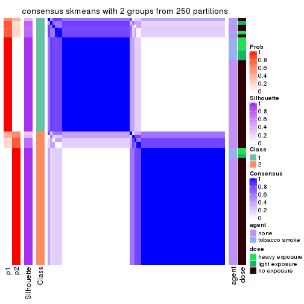</p>

</div>
<div id='tab-ATC-skmeans-consensus-heatmap-2'>
<pre><code class="r">consensus_heatmap(res, k = 3)
</code></pre>

<p>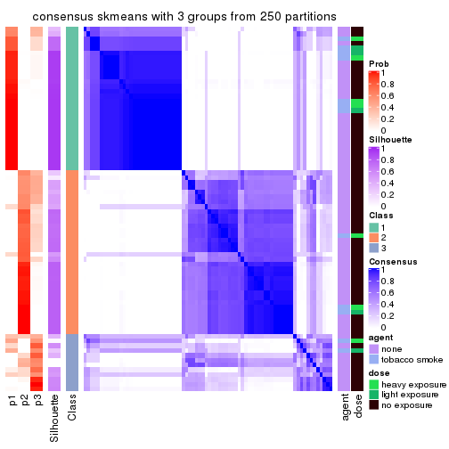</p>

</div>
<div id='tab-ATC-skmeans-consensus-heatmap-3'>
<pre><code class="r">consensus_heatmap(res, k = 4)
</code></pre>

<p>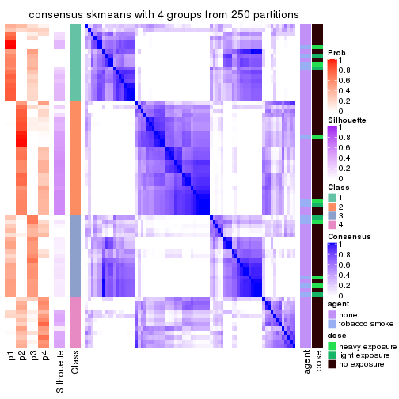</p>

</div>
<div id='tab-ATC-skmeans-consensus-heatmap-4'>
<pre><code class="r">consensus_heatmap(res, k = 5)
</code></pre>

<p>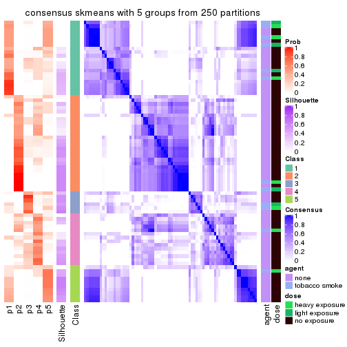</p>

</div>
<div id='tab-ATC-skmeans-consensus-heatmap-5'>
<pre><code class="r">consensus_heatmap(res, k = 6)
</code></pre>

<p>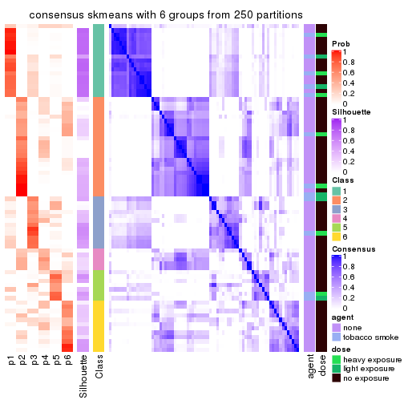</p>

</div>
</div>

Heatmaps for the membership of samples in all partitions to see how consistent they are:


<script>
$( function() {
	$( '#tabs-ATC-skmeans-membership-heatmap' ).tabs();
} );
</script>
<div id='tabs-ATC-skmeans-membership-heatmap'>
<ul>
<li><a href='#tab-ATC-skmeans-membership-heatmap-1'>k = 2</a></li>
<li><a href='#tab-ATC-skmeans-membership-heatmap-2'>k = 3</a></li>
<li><a href='#tab-ATC-skmeans-membership-heatmap-3'>k = 4</a></li>
<li><a href='#tab-ATC-skmeans-membership-heatmap-4'>k = 5</a></li>
<li><a href='#tab-ATC-skmeans-membership-heatmap-5'>k = 6</a></li>
</ul>
<div id='tab-ATC-skmeans-membership-heatmap-1'>
<pre><code class="r">membership_heatmap(res, k = 2)
</code></pre>

<p>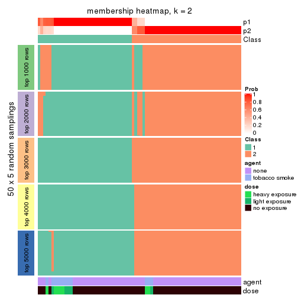</p>

</div>
<div id='tab-ATC-skmeans-membership-heatmap-2'>
<pre><code class="r">membership_heatmap(res, k = 3)
</code></pre>

<p>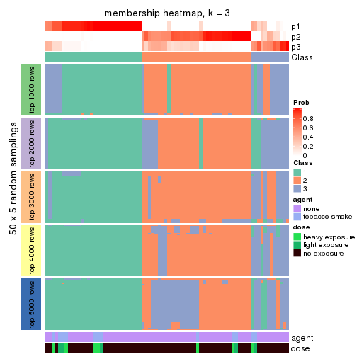</p>

</div>
<div id='tab-ATC-skmeans-membership-heatmap-3'>
<pre><code class="r">membership_heatmap(res, k = 4)
</code></pre>

<p>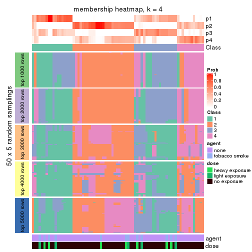</p>

</div>
<div id='tab-ATC-skmeans-membership-heatmap-4'>
<pre><code class="r">membership_heatmap(res, k = 5)
</code></pre>

<p>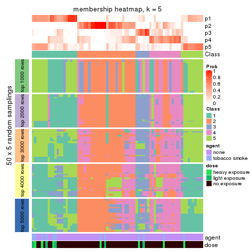</p>

</div>
<div id='tab-ATC-skmeans-membership-heatmap-5'>
<pre><code class="r">membership_heatmap(res, k = 6)
</code></pre>

<p>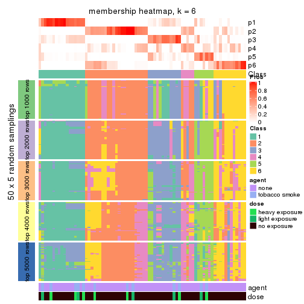</p>

</div>
</div>

As soon as we have had the classes for columns, we can look for signatures
which are significantly different between classes which can be candidate marks
for certain classes. Following are the heatmaps for signatures.


Signature heatmaps where rows are scaled:


<script>
$( function() {
	$( '#tabs-ATC-skmeans-get-signatures' ).tabs();
} );
</script>
<div id='tabs-ATC-skmeans-get-signatures'>
<ul>
<li><a href='#tab-ATC-skmeans-get-signatures-1'>k = 2</a></li>
<li><a href='#tab-ATC-skmeans-get-signatures-2'>k = 3</a></li>
<li><a href='#tab-ATC-skmeans-get-signatures-3'>k = 4</a></li>
<li><a href='#tab-ATC-skmeans-get-signatures-4'>k = 5</a></li>
<li><a href='#tab-ATC-skmeans-get-signatures-5'>k = 6</a></li>
</ul>
<div id='tab-ATC-skmeans-get-signatures-1'>
<pre><code class="r">get_signatures(res, k = 2)
</code></pre>

<p>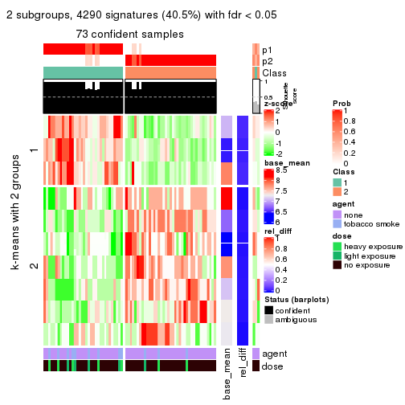</p>

</div>
<div id='tab-ATC-skmeans-get-signatures-2'>
<pre><code class="r">get_signatures(res, k = 3)
</code></pre>

<p>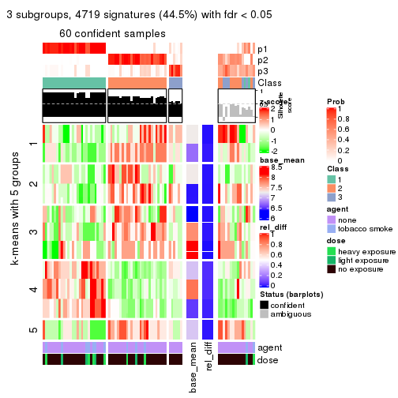</p>

</div>
<div id='tab-ATC-skmeans-get-signatures-3'>
<pre><code class="r">get_signatures(res, k = 4)
</code></pre>

<p></p>

</div>
<div id='tab-ATC-skmeans-get-signatures-4'>
<pre><code class="r">get_signatures(res, k = 5)
</code></pre>

<p>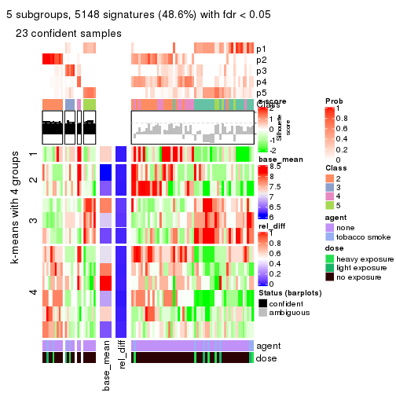</p>

</div>
<div id='tab-ATC-skmeans-get-signatures-5'>
<pre><code class="r">get_signatures(res, k = 6)
</code></pre>

<p>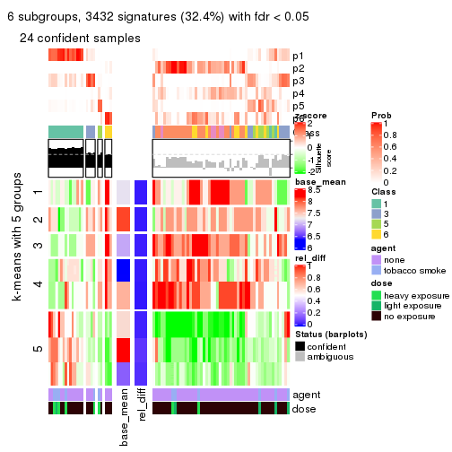</p>

</div>
</div>


Signature heatmaps where rows are not scaled:


<script>
$( function() {
	$( '#tabs-ATC-skmeans-get-signatures-no-scale' ).tabs();
} );
</script>
<div id='tabs-ATC-skmeans-get-signatures-no-scale'>
<ul>
<li><a href='#tab-ATC-skmeans-get-signatures-no-scale-1'>k = 2</a></li>
<li><a href='#tab-ATC-skmeans-get-signatures-no-scale-2'>k = 3</a></li>
<li><a href='#tab-ATC-skmeans-get-signatures-no-scale-3'>k = 4</a></li>
<li><a href='#tab-ATC-skmeans-get-signatures-no-scale-4'>k = 5</a></li>
<li><a href='#tab-ATC-skmeans-get-signatures-no-scale-5'>k = 6</a></li>
</ul>
<div id='tab-ATC-skmeans-get-signatures-no-scale-1'>
<pre><code class="r">get_signatures(res, k = 2, scale_rows = FALSE)
</code></pre>

<p>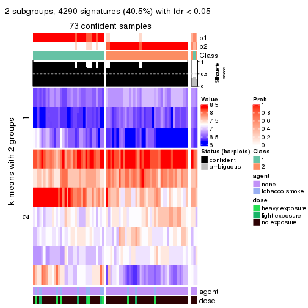</p>

</div>
<div id='tab-ATC-skmeans-get-signatures-no-scale-2'>
<pre><code class="r">get_signatures(res, k = 3, scale_rows = FALSE)
</code></pre>

<p>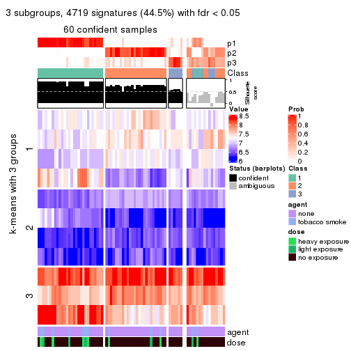</p>

</div>
<div id='tab-ATC-skmeans-get-signatures-no-scale-3'>
<pre><code class="r">get_signatures(res, k = 4, scale_rows = FALSE)
</code></pre>

<p></p>

</div>
<div id='tab-ATC-skmeans-get-signatures-no-scale-4'>
<pre><code class="r">get_signatures(res, k = 5, scale_rows = FALSE)
</code></pre>

<p>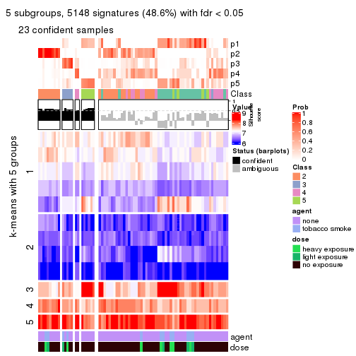</p>

</div>
<div id='tab-ATC-skmeans-get-signatures-no-scale-5'>
<pre><code class="r">get_signatures(res, k = 6, scale_rows = FALSE)
</code></pre>

<p>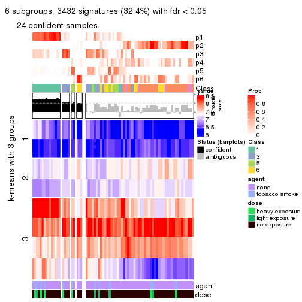</p>

</div>
</div>


Compare the overlap of signatures from different k:

```r
compare_signatures(res)
```

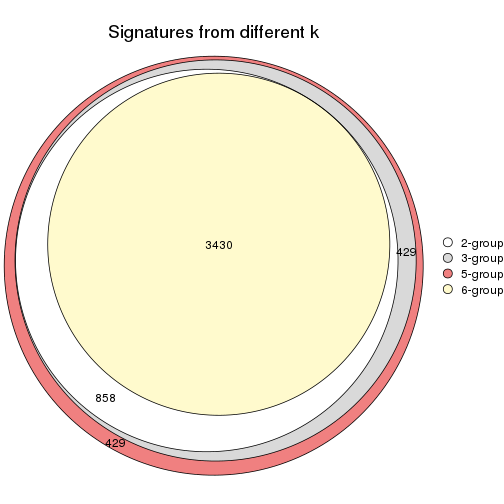

`get_signature()` returns a data frame invisibly. TO get the list of signatures, the function
call should be assigned to a variable explicitly. In following code, if `plot` argument is set
to `FALSE`, no heatmap is plotted while only the differential analysis is performed.

```r
# code only for demonstration
tb = get_signature(res, k = ..., plot = FALSE)
```

An example of the output of `tb` is:

```
#>   which_row         fdr    mean_1    mean_2 scaled_mean_1 scaled_mean_2 km
#> 1        38 0.042760348  8.373488  9.131774    -0.5533452     0.5164555  1
#> 2        40 0.018707592  7.106213  8.469186    -0.6173731     0.5762149  1
#> 3        55 0.019134737 10.221463 11.207825    -0.6159697     0.5749050  1
#> 4        59 0.006059896  5.921854  7.869574    -0.6899429     0.6439467  1
#> 5        60 0.018055526  8.928898 10.211722    -0.6204761     0.5791110  1
#> 6        98 0.009384629 15.714769 14.887706     0.6635654    -0.6193277  2
...
```

The columns in `tb` are:

1. `which_row`: row indices corresponding to the input matrix.
2. `fdr`: FDR for the differential test. 
3. `mean_x`: The mean value in group x.
4. `scaled_mean_x`: The mean value in group x after rows are scaled.
5. `km`: Row groups if k-means clustering is applied to rows.


UMAP plot which shows how samples are separated.


<script>
$( function() {
	$( '#tabs-ATC-skmeans-dimension-reduction' ).tabs();
} );
</script>
<div id='tabs-ATC-skmeans-dimension-reduction'>
<ul>
<li><a href='#tab-ATC-skmeans-dimension-reduction-1'>k = 2</a></li>
<li><a href='#tab-ATC-skmeans-dimension-reduction-2'>k = 3</a></li>
<li><a href='#tab-ATC-skmeans-dimension-reduction-3'>k = 4</a></li>
<li><a href='#tab-ATC-skmeans-dimension-reduction-4'>k = 5</a></li>
<li><a href='#tab-ATC-skmeans-dimension-reduction-5'>k = 6</a></li>
</ul>
<div id='tab-ATC-skmeans-dimension-reduction-1'>
<pre><code class="r">dimension_reduction(res, k = 2, method = &quot;UMAP&quot;)
</code></pre>

<p>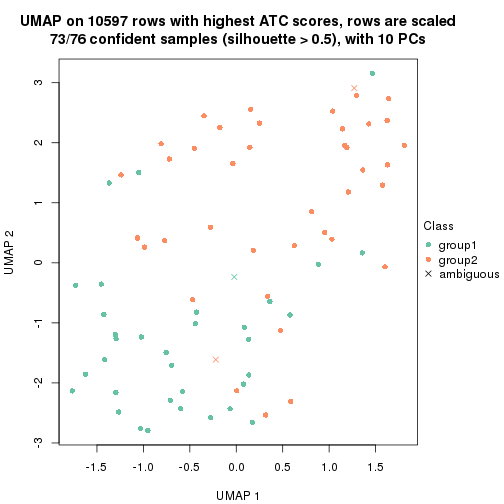</p>

</div>
<div id='tab-ATC-skmeans-dimension-reduction-2'>
<pre><code class="r">dimension_reduction(res, k = 3, method = &quot;UMAP&quot;)
</code></pre>

<p>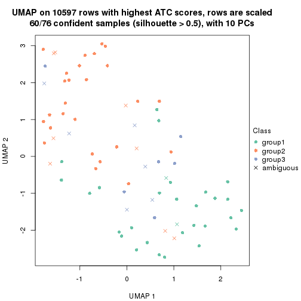</p>

</div>
<div id='tab-ATC-skmeans-dimension-reduction-3'>
<pre><code class="r">dimension_reduction(res, k = 4, method = &quot;UMAP&quot;)
</code></pre>

<p>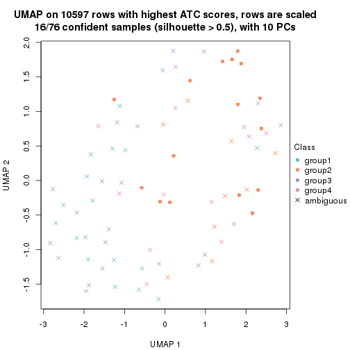</p>

</div>
<div id='tab-ATC-skmeans-dimension-reduction-4'>
<pre><code class="r">dimension_reduction(res, k = 5, method = &quot;UMAP&quot;)
</code></pre>

<p>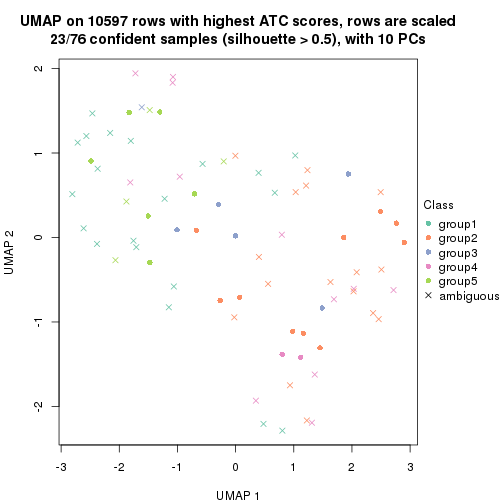</p>

</div>
<div id='tab-ATC-skmeans-dimension-reduction-5'>
<pre><code class="r">dimension_reduction(res, k = 6, method = &quot;UMAP&quot;)
</code></pre>

<p>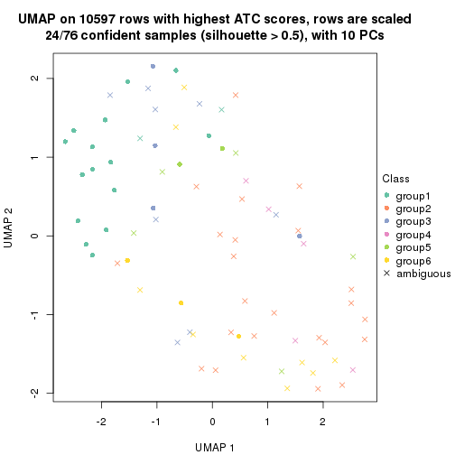</p>

</div>
</div>


Following heatmap shows how subgroups are split when increasing `k`:

```r
collect_classes(res)
```

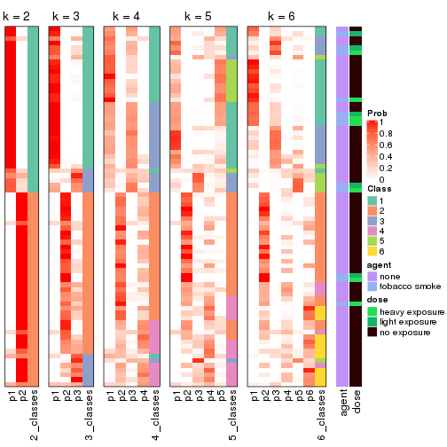


Test correlation between subgroups and known annotations. If the known
annotation is numeric, one-way ANOVA test is applied, and if the known
annotation is discrete, chi-squared contingency table test is applied.

```r
test_to_known_factors(res)
```

```
#>              n agent(p) dose(p) k
#> ATC:skmeans 73   0.0653  0.0931 2
#> ATC:skmeans 60   0.2131  0.5304 3
#> ATC:skmeans 16       NA      NA 4
#> ATC:skmeans 23   0.3194  0.7426 5
#> ATC:skmeans 24   0.6394  0.8682 6
```


If matrix rows can be associated to genes, consider to use `GO_Enrichment(res,
...)` to perform function enrichment for the signature genes.


 

---------------------------------------------------


### ATC:pam


The object with results only for a single top-value method and a single partition method 
can be extracted as:

```r
res = res_list["ATC", "pam"]
# you can also extract it by
# res = res_list["ATC:pam"]
```

A summary of `res` and all the functions that can be applied to it:

```r
res
```

```
#> A 'ConsensusPartition' object with k = 2, 3, 4, 5, 6.
#>   On a matrix with 10597 rows and 76 columns.
#>   Top rows (1000, 2000, 3000, 4000, 5000) are extracted by 'ATC' method.
#>   Subgroups are detected by 'pam' method.
#>   Performed in total 1250 partitions by row resampling.
#>   Best k for subgroups seems to be 3.
#> 
#> Following methods can be applied to this 'ConsensusPartition' object:
#>  [1] "cola_report"             "collect_classes"         "collect_plots"          
#>  [4] "collect_stats"           "colnames"                "compare_signatures"     
#>  [7] "consensus_heatmap"       "dimension_reduction"     "functional_enrichment"  
#> [10] "get_anno_col"            "get_anno"                "get_classes"            
#> [13] "get_consensus"           "get_matrix"              "get_membership"         
#> [16] "get_param"               "get_signatures"          "get_stats"              
#> [19] "is_best_k"               "is_stable_k"             "membership_heatmap"     
#> [22] "ncol"                    "nrow"                    "plot_ecdf"              
#> [25] "rownames"                "select_partition_number" "show"                   
#> [28] "suggest_best_k"          "test_to_known_factors"
```

`collect_plots()` function collects all the plots made from `res` for all `k` (number of partitions)
into one single page to provide an easy and fast comparison between different `k`.

```r
collect_plots(res)
```

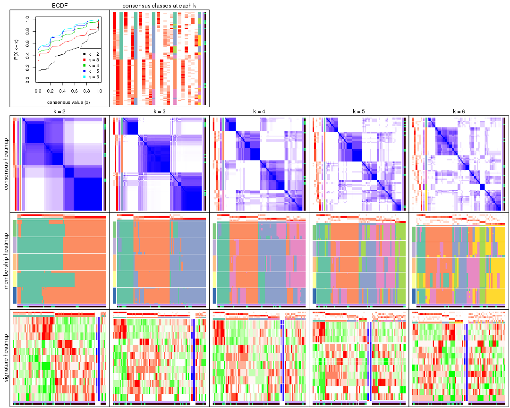

The plots are:

- The first row: a plot of the ECDF (Empirical cumulative distribution
  function) curves of the consensus matrix for each `k` and the heatmap of
  predicted classes for each `k`.
- The second row: heatmaps of the consensus matrix for each `k`.
- The third row: heatmaps of the membership matrix for each `k`.
- The fouth row: heatmaps of the signatures for each `k`.

All the plots in panels can be made by individual functions and they are
plotted later in this section.

`select_partition_number()` produces several plots showing different
statistics for choosing "optimized" `k`. There are following statistics:

- ECDF curves of the consensus matrix for each `k`;
- 1-PAC. [The PAC
  score](https://en.wikipedia.org/wiki/Consensus_clustering#Over-interpretation_potential_of_consensus_clustering)
  measures the proportion of the ambiguous subgrouping.
- Mean silhouette score.
- Concordance. The mean probability of fiting the consensus class ids in all
  partitions.
- Area increased. Denote $A_k$ as the area under the ECDF curve for current
  `k`, the area increased is defined as $A_k - A_{k-1}$.
- Rand index. The percent of pairs of samples that are both in a same cluster
  or both are not in a same cluster in the partition of k and k-1.
- Jaccard index. The ratio of pairs of samples are both in a same cluster in
  the partition of k and k-1 and the pairs of samples are both in a same
  cluster in the partition k or k-1.

The detailed explanations of these statistics can be found in [the cola
vignette](http://bioconductor.org/packages/devel/bioc/vignettes/cola/inst/doc/cola.html#toc_13).

Generally speaking, lower PAC score, higher mean silhouette score or higher
concordance corresponds to better partition. Rand index and Jaccard index
measure how similar the current partition is compared to partition with `k-1`.
If they are too similar, we won't accept `k` is better than `k-1`.

```r
select_partition_number(res)
```

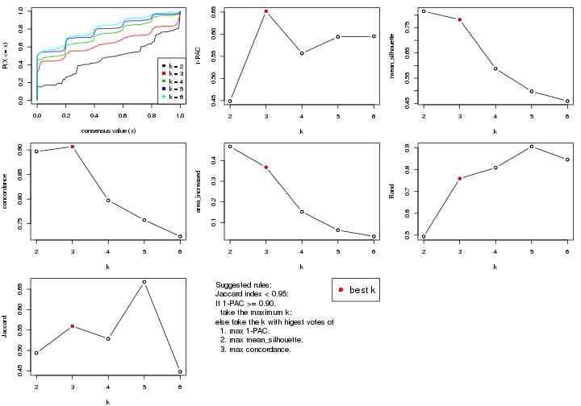

The numeric values for all these statistics can be obtained by `get_stats()`.

```r
get_stats(res)
```

```
#>   k 1-PAC mean_silhouette concordance area_increased  Rand Jaccard
#> 2 2 0.449           0.816       0.897         0.4680 0.494   0.494
#> 3 3 0.652           0.782       0.907         0.3679 0.759   0.559
#> 4 4 0.557           0.587       0.797         0.1522 0.809   0.529
#> 5 5 0.594           0.497       0.758         0.0632 0.906   0.668
#> 6 6 0.595           0.459       0.724         0.0327 0.846   0.448
```

`suggest_best_k()` suggests the best $k$ based on these statistics. The rules are as follows:

- All $k$ with Jaccard index larger than 0.95 are removed because the increase of
  the partition number does not provides enough extra information. If all $k$ are removed,
  the best $k$ is assigned by `NA`.
- For $k$ with 1-PAC larger than 0.9, the maximal $k$ is taken as the "best k". Other $k$ is called "optional k".
- If it does not fit the second rule. The $k$ with the highest vote of highest
  1-PAC, mean silhouette and concordance is taken as the "best k".

```r
suggest_best_k(res)
```

```
#> [1] 3
```


Following shows the table of the partitions (You need to click the **show/hide
code output** link to see it). The membership matrix (columns with name `p*`)
is inferred by
[`clue::cl_consensus()`](https://www.rdocumentation.org/link/cl_consensus?package=clue)
function with the `SE` method. Basically the value in the membership matrix
represents the probability to belong to a certain group. The finall class
label for an item is determined with the group with highest probability it
belongs to.

In `get_classes()` function, the entropy is calculated from the membership
matrix and the silhouette score is calculated from the consensus matrix.


<script>
$( function() {
	$( '#tabs-ATC-pam-get-classes' ).tabs();
} );
</script>
<div id='tabs-ATC-pam-get-classes'>
<ul>
<li><a href='#tab-ATC-pam-get-classes-1'>k = 2</a></li>
<li><a href='#tab-ATC-pam-get-classes-2'>k = 3</a></li>
<li><a href='#tab-ATC-pam-get-classes-3'>k = 4</a></li>
<li><a href='#tab-ATC-pam-get-classes-4'>k = 5</a></li>
<li><a href='#tab-ATC-pam-get-classes-5'>k = 6</a></li>
</ul>

<div id='tab-ATC-pam-get-classes-1'>
<p><a id='tab-ATC-pam-get-classes-1-a' style='color:#0366d6' href='#'>show/hide code output</a></p>
<pre><code class="r">cbind(get_classes(res, k = 2), get_membership(res, k = 2))
</code></pre>

<pre><code>#&gt;           class entropy silhouette    p1    p2
#&gt; GSM451162     1  0.8081      0.779 0.752 0.248
#&gt; GSM451163     2  0.0000      0.925 0.000 1.000
#&gt; GSM451164     2  0.0000      0.925 0.000 1.000
#&gt; GSM451165     2  0.6623      0.775 0.172 0.828
#&gt; GSM451167     2  0.0000      0.925 0.000 1.000
#&gt; GSM451168     2  0.0000      0.925 0.000 1.000
#&gt; GSM451169     2  0.9087      0.454 0.324 0.676
#&gt; GSM451170     1  0.5737      0.816 0.864 0.136
#&gt; GSM451171     2  0.0000      0.925 0.000 1.000
#&gt; GSM451172     2  0.6623      0.775 0.172 0.828
#&gt; GSM451173     1  0.7219      0.800 0.800 0.200
#&gt; GSM451174     2  0.0376      0.923 0.004 0.996
#&gt; GSM451175     1  0.7056      0.803 0.808 0.192
#&gt; GSM451177     2  0.0000      0.925 0.000 1.000
#&gt; GSM451178     2  0.6623      0.775 0.172 0.828
#&gt; GSM451179     1  0.8499      0.760 0.724 0.276
#&gt; GSM451180     2  0.0000      0.925 0.000 1.000
#&gt; GSM451181     2  0.0000      0.925 0.000 1.000
#&gt; GSM451182     1  0.0000      0.821 1.000 0.000
#&gt; GSM451183     1  0.0000      0.821 1.000 0.000
#&gt; GSM451184     1  0.8499      0.760 0.724 0.276
#&gt; GSM451185     1  0.0000      0.821 1.000 0.000
#&gt; GSM451186     2  0.9522      0.355 0.372 0.628
#&gt; GSM451187     2  0.0000      0.925 0.000 1.000
#&gt; GSM451188     2  0.0000      0.925 0.000 1.000
#&gt; GSM451189     1  0.0000      0.821 1.000 0.000
#&gt; GSM451190     1  0.0000      0.821 1.000 0.000
#&gt; GSM451191     1  0.0000      0.821 1.000 0.000
#&gt; GSM451193     1  0.9881      0.453 0.564 0.436
#&gt; GSM451195     1  0.2778      0.818 0.952 0.048
#&gt; GSM451196     1  0.0000      0.821 1.000 0.000
#&gt; GSM451197     1  0.0000      0.821 1.000 0.000
#&gt; GSM451199     1  0.0000      0.821 1.000 0.000
#&gt; GSM451201     1  0.0000      0.821 1.000 0.000
#&gt; GSM451202     2  0.0000      0.925 0.000 1.000
#&gt; GSM451203     1  0.8499      0.760 0.724 0.276
#&gt; GSM451204     2  0.0000      0.925 0.000 1.000
#&gt; GSM451205     2  0.0000      0.925 0.000 1.000
#&gt; GSM451206     2  0.0000      0.925 0.000 1.000
#&gt; GSM451207     2  0.6623      0.775 0.172 0.828
#&gt; GSM451208     2  0.0000      0.925 0.000 1.000
#&gt; GSM451209     1  0.8499      0.760 0.724 0.276
#&gt; GSM451210     2  0.0000      0.925 0.000 1.000
#&gt; GSM451212     2  0.6623      0.775 0.172 0.828
#&gt; GSM451213     2  0.6623      0.775 0.172 0.828
#&gt; GSM451214     2  0.6623      0.775 0.172 0.828
#&gt; GSM451215     2  0.0000      0.925 0.000 1.000
#&gt; GSM451216     2  0.0000      0.925 0.000 1.000
#&gt; GSM451217     2  0.0000      0.925 0.000 1.000
#&gt; GSM451219     1  0.7219      0.800 0.800 0.200
#&gt; GSM451220     1  0.8081      0.779 0.752 0.248
#&gt; GSM451221     1  0.2423      0.823 0.960 0.040
#&gt; GSM451222     1  0.0000      0.821 1.000 0.000
#&gt; GSM451224     2  0.0000      0.925 0.000 1.000
#&gt; GSM451225     1  0.7745      0.788 0.772 0.228
#&gt; GSM451226     1  0.8499      0.760 0.724 0.276
#&gt; GSM451227     1  0.8499      0.760 0.724 0.276
#&gt; GSM451228     1  0.9850      0.474 0.572 0.428
#&gt; GSM451230     1  0.9983      0.311 0.524 0.476
#&gt; GSM451231     1  0.8499      0.760 0.724 0.276
#&gt; GSM451233     2  0.6623      0.775 0.172 0.828
#&gt; GSM451234     2  0.0000      0.925 0.000 1.000
#&gt; GSM451235     2  0.0000      0.925 0.000 1.000
#&gt; GSM451236     2  0.0000      0.925 0.000 1.000
#&gt; GSM451166     1  0.8499      0.760 0.724 0.276
#&gt; GSM451194     1  0.8499      0.760 0.724 0.276
#&gt; GSM451198     1  0.0000      0.821 1.000 0.000
#&gt; GSM451218     2  0.0000      0.925 0.000 1.000
#&gt; GSM451232     1  0.0000      0.821 1.000 0.000
#&gt; GSM451176     1  0.0000      0.821 1.000 0.000
#&gt; GSM451192     1  0.0000      0.821 1.000 0.000
#&gt; GSM451200     1  0.5737      0.816 0.864 0.136
#&gt; GSM451211     2  0.0000      0.925 0.000 1.000
#&gt; GSM451223     1  0.8499      0.760 0.724 0.276
#&gt; GSM451229     1  0.0000      0.821 1.000 0.000
#&gt; GSM451237     2  0.0000      0.925 0.000 1.000
</code></pre>

<script>
$('#tab-ATC-pam-get-classes-1-a').parent().next().next().hide();
$('#tab-ATC-pam-get-classes-1-a').click(function(){
  $('#tab-ATC-pam-get-classes-1-a').parent().next().next().toggle();
  return(false);
});
</script>
</div>

<div id='tab-ATC-pam-get-classes-2'>
<p><a id='tab-ATC-pam-get-classes-2-a' style='color:#0366d6' href='#'>show/hide code output</a></p>
<pre><code class="r">cbind(get_classes(res, k = 3), get_membership(res, k = 3))
</code></pre>

<pre><code>#&gt;           class entropy silhouette    p1    p2    p3
#&gt; GSM451162     3  0.0000      0.884 0.000 0.000 1.000
#&gt; GSM451163     2  0.4750      0.723 0.000 0.784 0.216
#&gt; GSM451164     2  0.1163      0.869 0.000 0.972 0.028
#&gt; GSM451165     3  0.6126      0.248 0.000 0.400 0.600
#&gt; GSM451167     2  0.6215      0.358 0.000 0.572 0.428
#&gt; GSM451168     2  0.0000      0.878 0.000 1.000 0.000
#&gt; GSM451169     3  0.0000      0.884 0.000 0.000 1.000
#&gt; GSM451170     3  0.4654      0.710 0.208 0.000 0.792
#&gt; GSM451171     2  0.0000      0.878 0.000 1.000 0.000
#&gt; GSM451172     3  0.4555      0.693 0.000 0.200 0.800
#&gt; GSM451173     3  0.4555      0.684 0.200 0.000 0.800
#&gt; GSM451174     2  0.0747      0.880 0.000 0.984 0.016
#&gt; GSM451175     3  0.0424      0.880 0.008 0.000 0.992
#&gt; GSM451177     2  0.0000      0.878 0.000 1.000 0.000
#&gt; GSM451178     2  0.6111      0.406 0.000 0.604 0.396
#&gt; GSM451179     3  0.0000      0.884 0.000 0.000 1.000
#&gt; GSM451180     2  0.0592      0.880 0.000 0.988 0.012
#&gt; GSM451181     2  0.0892      0.879 0.000 0.980 0.020
#&gt; GSM451182     1  0.4178      0.754 0.828 0.000 0.172
#&gt; GSM451183     1  0.0000      0.904 1.000 0.000 0.000
#&gt; GSM451184     3  0.0000      0.884 0.000 0.000 1.000
#&gt; GSM451185     1  0.0000      0.904 1.000 0.000 0.000
#&gt; GSM451186     3  0.8765      0.492 0.200 0.212 0.588
#&gt; GSM451187     2  0.0000      0.878 0.000 1.000 0.000
#&gt; GSM451188     2  0.0592      0.879 0.000 0.988 0.012
#&gt; GSM451189     1  0.0000      0.904 1.000 0.000 0.000
#&gt; GSM451190     1  0.6008      0.398 0.628 0.000 0.372
#&gt; GSM451191     3  0.6286      0.115 0.464 0.000 0.536
#&gt; GSM451193     3  0.0000      0.884 0.000 0.000 1.000
#&gt; GSM451195     3  0.1289      0.865 0.032 0.000 0.968
#&gt; GSM451196     1  0.0000      0.904 1.000 0.000 0.000
#&gt; GSM451197     1  0.0000      0.904 1.000 0.000 0.000
#&gt; GSM451199     3  0.4555      0.663 0.200 0.000 0.800
#&gt; GSM451201     1  0.0000      0.904 1.000 0.000 0.000
#&gt; GSM451202     2  0.0000      0.878 0.000 1.000 0.000
#&gt; GSM451203     3  0.0000      0.884 0.000 0.000 1.000
#&gt; GSM451204     2  0.1031      0.878 0.000 0.976 0.024
#&gt; GSM451205     2  0.0592      0.879 0.000 0.988 0.012
#&gt; GSM451206     2  0.0000      0.878 0.000 1.000 0.000
#&gt; GSM451207     2  0.6215      0.236 0.000 0.572 0.428
#&gt; GSM451208     2  0.0592      0.880 0.000 0.988 0.012
#&gt; GSM451209     3  0.0237      0.882 0.000 0.004 0.996
#&gt; GSM451210     2  0.0000      0.878 0.000 1.000 0.000
#&gt; GSM451212     3  0.4178      0.715 0.000 0.172 0.828
#&gt; GSM451213     2  0.5859      0.506 0.000 0.656 0.344
#&gt; GSM451214     3  0.0000      0.884 0.000 0.000 1.000
#&gt; GSM451215     2  0.0000      0.878 0.000 1.000 0.000
#&gt; GSM451216     2  0.0592      0.880 0.000 0.988 0.012
#&gt; GSM451217     2  0.0892      0.878 0.000 0.980 0.020
#&gt; GSM451219     3  0.4555      0.718 0.200 0.000 0.800
#&gt; GSM451220     3  0.0000      0.884 0.000 0.000 1.000
#&gt; GSM451221     3  0.0892      0.873 0.020 0.000 0.980
#&gt; GSM451222     1  0.4555      0.717 0.800 0.000 0.200
#&gt; GSM451224     2  0.4555      0.741 0.000 0.800 0.200
#&gt; GSM451225     3  0.4555      0.718 0.200 0.000 0.800
#&gt; GSM451226     3  0.0000      0.884 0.000 0.000 1.000
#&gt; GSM451227     3  0.0000      0.884 0.000 0.000 1.000
#&gt; GSM451228     3  0.0000      0.884 0.000 0.000 1.000
#&gt; GSM451230     3  0.3619      0.769 0.000 0.136 0.864
#&gt; GSM451231     3  0.0000      0.884 0.000 0.000 1.000
#&gt; GSM451233     2  0.6302      0.171 0.000 0.520 0.480
#&gt; GSM451234     2  0.4235      0.757 0.000 0.824 0.176
#&gt; GSM451235     2  0.4887      0.679 0.000 0.772 0.228
#&gt; GSM451236     2  0.1031      0.878 0.000 0.976 0.024
#&gt; GSM451166     3  0.0000      0.884 0.000 0.000 1.000
#&gt; GSM451194     3  0.0000      0.884 0.000 0.000 1.000
#&gt; GSM451198     1  0.6008      0.478 0.628 0.000 0.372
#&gt; GSM451218     2  0.0592      0.880 0.000 0.988 0.012
#&gt; GSM451232     1  0.0000      0.904 1.000 0.000 0.000
#&gt; GSM451176     1  0.0000      0.904 1.000 0.000 0.000
#&gt; GSM451192     1  0.0000      0.904 1.000 0.000 0.000
#&gt; GSM451200     3  0.0424      0.880 0.008 0.000 0.992
#&gt; GSM451211     2  0.0000      0.878 0.000 1.000 0.000
#&gt; GSM451223     3  0.0000      0.884 0.000 0.000 1.000
#&gt; GSM451229     1  0.0000      0.904 1.000 0.000 0.000
#&gt; GSM451237     2  0.0592      0.879 0.000 0.988 0.012
</code></pre>

<script>
$('#tab-ATC-pam-get-classes-2-a').parent().next().next().hide();
$('#tab-ATC-pam-get-classes-2-a').click(function(){
  $('#tab-ATC-pam-get-classes-2-a').parent().next().next().toggle();
  return(false);
});
</script>
</div>

<div id='tab-ATC-pam-get-classes-3'>
<p><a id='tab-ATC-pam-get-classes-3-a' style='color:#0366d6' href='#'>show/hide code output</a></p>
<pre><code class="r">cbind(get_classes(res, k = 4), get_membership(res, k = 4))
</code></pre>

<pre><code>#&gt;           class entropy silhouette    p1    p2    p3    p4
#&gt; GSM451162     3  0.3311     0.6718 0.000 0.000 0.828 0.172
#&gt; GSM451163     4  0.3610     0.5735 0.000 0.200 0.000 0.800
#&gt; GSM451164     4  0.4843     0.3061 0.000 0.396 0.000 0.604
#&gt; GSM451165     4  0.6855     0.5302 0.000 0.200 0.200 0.600
#&gt; GSM451167     4  0.6855     0.5196 0.000 0.200 0.200 0.600
#&gt; GSM451168     2  0.0000     0.7237 0.000 1.000 0.000 0.000
#&gt; GSM451169     4  0.4855     0.2921 0.000 0.000 0.400 0.600
#&gt; GSM451170     3  0.1302     0.7151 0.044 0.000 0.956 0.000
#&gt; GSM451171     2  0.0000     0.7237 0.000 1.000 0.000 0.000
#&gt; GSM451172     4  0.3610     0.6014 0.000 0.000 0.200 0.800
#&gt; GSM451173     3  0.3569     0.5878 0.196 0.000 0.804 0.000
#&gt; GSM451174     2  0.4989     0.4670 0.000 0.528 0.000 0.472
#&gt; GSM451175     3  0.0336     0.7161 0.008 0.000 0.992 0.000
#&gt; GSM451177     2  0.3610     0.7709 0.000 0.800 0.000 0.200
#&gt; GSM451178     2  0.6215     0.5284 0.000 0.600 0.072 0.328
#&gt; GSM451179     3  0.1302     0.7148 0.000 0.000 0.956 0.044
#&gt; GSM451180     2  0.3610     0.7709 0.000 0.800 0.000 0.200
#&gt; GSM451181     4  0.4855    -0.2257 0.000 0.400 0.000 0.600
#&gt; GSM451182     3  0.4955     0.1150 0.444 0.000 0.556 0.000
#&gt; GSM451183     1  0.0000     0.9144 1.000 0.000 0.000 0.000
#&gt; GSM451184     4  0.4955     0.2659 0.000 0.000 0.444 0.556
#&gt; GSM451185     1  0.0000     0.9144 1.000 0.000 0.000 0.000
#&gt; GSM451186     4  0.8609     0.3899 0.044 0.200 0.356 0.400
#&gt; GSM451187     2  0.4855     0.5848 0.000 0.600 0.000 0.400
#&gt; GSM451188     2  0.0000     0.7237 0.000 1.000 0.000 0.000
#&gt; GSM451189     1  0.3123     0.8223 0.844 0.000 0.156 0.000
#&gt; GSM451190     3  0.4855     0.1884 0.400 0.000 0.600 0.000
#&gt; GSM451191     3  0.4898     0.4140 0.416 0.000 0.584 0.000
#&gt; GSM451193     4  0.3610     0.6014 0.000 0.000 0.200 0.800
#&gt; GSM451195     3  0.3764     0.5827 0.216 0.000 0.784 0.000
#&gt; GSM451196     1  0.0000     0.9144 1.000 0.000 0.000 0.000
#&gt; GSM451197     1  0.0000     0.9144 1.000 0.000 0.000 0.000
#&gt; GSM451199     3  0.4855     0.1884 0.400 0.000 0.600 0.000
#&gt; GSM451201     1  0.0000     0.9144 1.000 0.000 0.000 0.000
#&gt; GSM451202     2  0.3356     0.5707 0.000 0.824 0.000 0.176
#&gt; GSM451203     4  0.4040     0.5877 0.000 0.000 0.248 0.752
#&gt; GSM451204     2  0.3610     0.7709 0.000 0.800 0.000 0.200
#&gt; GSM451205     2  0.3764     0.5032 0.000 0.784 0.000 0.216
#&gt; GSM451206     2  0.3610     0.7709 0.000 0.800 0.000 0.200
#&gt; GSM451207     4  0.0000     0.5690 0.000 0.000 0.000 1.000
#&gt; GSM451208     2  0.3610     0.7709 0.000 0.800 0.000 0.200
#&gt; GSM451209     4  0.4855    -0.0344 0.000 0.000 0.400 0.600
#&gt; GSM451210     2  0.0000     0.7237 0.000 1.000 0.000 0.000
#&gt; GSM451212     4  0.3610     0.6014 0.000 0.000 0.200 0.800
#&gt; GSM451213     4  0.4855    -0.2257 0.000 0.400 0.000 0.600
#&gt; GSM451214     3  0.3610     0.6639 0.000 0.000 0.800 0.200
#&gt; GSM451215     2  0.3610     0.7709 0.000 0.800 0.000 0.200
#&gt; GSM451216     2  0.3610     0.7709 0.000 0.800 0.000 0.200
#&gt; GSM451217     2  0.0000     0.7237 0.000 1.000 0.000 0.000
#&gt; GSM451219     3  0.1302     0.7151 0.044 0.000 0.956 0.000
#&gt; GSM451220     3  0.3123     0.6741 0.000 0.000 0.844 0.156
#&gt; GSM451221     3  0.0000     0.7163 0.000 0.000 1.000 0.000
#&gt; GSM451222     1  0.3610     0.7868 0.800 0.000 0.200 0.000
#&gt; GSM451224     2  0.3610     0.5916 0.000 0.800 0.200 0.000
#&gt; GSM451225     3  0.4839     0.4862 0.044 0.000 0.756 0.200
#&gt; GSM451226     3  0.3610     0.6639 0.000 0.000 0.800 0.200
#&gt; GSM451227     3  0.3610     0.6639 0.000 0.000 0.800 0.200
#&gt; GSM451228     3  0.3610     0.6639 0.000 0.000 0.800 0.200
#&gt; GSM451230     4  0.5159     0.6185 0.000 0.088 0.156 0.756
#&gt; GSM451231     3  0.4103     0.4573 0.000 0.000 0.744 0.256
#&gt; GSM451233     4  0.0000     0.5690 0.000 0.000 0.000 1.000
#&gt; GSM451234     2  0.4907     0.0546 0.000 0.580 0.000 0.420
#&gt; GSM451235     2  0.6855     0.3046 0.000 0.600 0.200 0.200
#&gt; GSM451236     2  0.3610     0.7709 0.000 0.800 0.000 0.200
#&gt; GSM451166     3  0.3610     0.6639 0.000 0.000 0.800 0.200
#&gt; GSM451194     3  0.0000     0.7163 0.000 0.000 1.000 0.000
#&gt; GSM451198     3  0.6052     0.2209 0.396 0.000 0.556 0.048
#&gt; GSM451218     2  0.3610     0.7709 0.000 0.800 0.000 0.200
#&gt; GSM451232     1  0.0000     0.9144 1.000 0.000 0.000 0.000
#&gt; GSM451176     1  0.3123     0.8223 0.844 0.000 0.156 0.000
#&gt; GSM451192     1  0.3610     0.6650 0.800 0.000 0.200 0.000
#&gt; GSM451200     3  0.0000     0.7163 0.000 0.000 1.000 0.000
#&gt; GSM451211     2  0.3726     0.7661 0.000 0.788 0.000 0.212
#&gt; GSM451223     3  0.3610     0.6639 0.000 0.000 0.800 0.200
#&gt; GSM451229     1  0.0000     0.9144 1.000 0.000 0.000 0.000
#&gt; GSM451237     2  0.4855     0.1042 0.000 0.600 0.000 0.400
</code></pre>

<script>
$('#tab-ATC-pam-get-classes-3-a').parent().next().next().hide();
$('#tab-ATC-pam-get-classes-3-a').click(function(){
  $('#tab-ATC-pam-get-classes-3-a').parent().next().next().toggle();
  return(false);
});
</script>
</div>

<div id='tab-ATC-pam-get-classes-4'>
<p><a id='tab-ATC-pam-get-classes-4-a' style='color:#0366d6' href='#'>show/hide code output</a></p>
<pre><code class="r">cbind(get_classes(res, k = 5), get_membership(res, k = 5))
</code></pre>

<pre><code>#&gt;           class entropy silhouette    p1    p2    p3    p4    p5
#&gt; GSM451162     3  0.5896     0.5774 0.000 0.000 0.600 0.216 0.184
#&gt; GSM451163     4  0.3109     0.4879 0.000 0.200 0.000 0.800 0.000
#&gt; GSM451164     4  0.4171     0.2787 0.000 0.396 0.000 0.604 0.000
#&gt; GSM451165     4  0.3266     0.4769 0.000 0.200 0.004 0.796 0.000
#&gt; GSM451167     4  0.3109     0.3831 0.000 0.200 0.000 0.800 0.000
#&gt; GSM451168     2  0.0000     0.7111 0.000 1.000 0.000 0.000 0.000
#&gt; GSM451169     4  0.3109     0.2035 0.000 0.000 0.200 0.800 0.000
#&gt; GSM451170     3  0.5848     0.4280 0.192 0.000 0.608 0.200 0.000
#&gt; GSM451171     2  0.0000     0.7111 0.000 1.000 0.000 0.000 0.000
#&gt; GSM451172     4  0.3039     0.2192 0.000 0.000 0.192 0.808 0.000
#&gt; GSM451173     5  0.4299     0.1838 0.004 0.000 0.388 0.000 0.608
#&gt; GSM451174     2  0.6296     0.4626 0.000 0.528 0.200 0.272 0.000
#&gt; GSM451175     5  0.0162     0.7727 0.000 0.000 0.004 0.000 0.996
#&gt; GSM451177     2  0.3109     0.7604 0.000 0.800 0.200 0.000 0.000
#&gt; GSM451178     2  0.5740     0.5216 0.000 0.600 0.128 0.272 0.000
#&gt; GSM451179     3  0.6555     0.5082 0.000 0.000 0.400 0.400 0.200
#&gt; GSM451180     2  0.3109     0.7604 0.000 0.800 0.200 0.000 0.000
#&gt; GSM451181     4  0.6555    -0.2518 0.000 0.400 0.200 0.400 0.000
#&gt; GSM451182     1  0.4192     0.5751 0.596 0.000 0.404 0.000 0.000
#&gt; GSM451183     1  0.0609     0.7733 0.980 0.000 0.000 0.000 0.020
#&gt; GSM451184     5  0.3487     0.5620 0.000 0.000 0.008 0.212 0.780
#&gt; GSM451185     1  0.0000     0.7717 1.000 0.000 0.000 0.000 0.000
#&gt; GSM451186     4  0.4746     0.1489 0.000 0.024 0.376 0.600 0.000
#&gt; GSM451187     2  0.5904     0.5658 0.000 0.600 0.200 0.200 0.000
#&gt; GSM451188     2  0.0000     0.7111 0.000 1.000 0.000 0.000 0.000
#&gt; GSM451189     1  0.3109     0.7054 0.800 0.000 0.000 0.000 0.200
#&gt; GSM451190     1  0.5958     0.5733 0.592 0.000 0.208 0.000 0.200
#&gt; GSM451191     3  0.8252     0.1191 0.216 0.000 0.404 0.184 0.196
#&gt; GSM451193     4  0.0000     0.4592 0.000 0.000 0.000 1.000 0.000
#&gt; GSM451195     5  0.0162     0.7727 0.000 0.000 0.004 0.000 0.996
#&gt; GSM451196     1  0.0162     0.7712 0.996 0.000 0.000 0.000 0.004
#&gt; GSM451197     1  0.3109     0.6031 0.800 0.000 0.000 0.000 0.200
#&gt; GSM451199     5  0.0880     0.7598 0.000 0.000 0.032 0.000 0.968
#&gt; GSM451201     5  0.3143     0.5709 0.204 0.000 0.000 0.000 0.796
#&gt; GSM451202     2  0.2891     0.5580 0.000 0.824 0.000 0.176 0.000
#&gt; GSM451203     4  0.5931     0.0715 0.000 0.000 0.204 0.596 0.200
#&gt; GSM451204     2  0.3109     0.7604 0.000 0.800 0.200 0.000 0.000
#&gt; GSM451205     2  0.3242     0.4825 0.000 0.784 0.000 0.216 0.000
#&gt; GSM451206     2  0.3109     0.7604 0.000 0.800 0.200 0.000 0.000
#&gt; GSM451207     4  0.3109     0.5083 0.000 0.000 0.200 0.800 0.000
#&gt; GSM451208     2  0.3109     0.7604 0.000 0.800 0.200 0.000 0.000
#&gt; GSM451209     3  0.5931     0.2901 0.000 0.000 0.596 0.204 0.200
#&gt; GSM451210     2  0.0000     0.7111 0.000 1.000 0.000 0.000 0.000
#&gt; GSM451212     4  0.0000     0.4592 0.000 0.000 0.000 1.000 0.000
#&gt; GSM451213     4  0.6555    -0.2518 0.000 0.400 0.200 0.400 0.000
#&gt; GSM451214     3  0.4182     0.6072 0.000 0.000 0.600 0.400 0.000
#&gt; GSM451215     2  0.3109     0.7604 0.000 0.800 0.200 0.000 0.000
#&gt; GSM451216     2  0.3109     0.7604 0.000 0.800 0.200 0.000 0.000
#&gt; GSM451217     2  0.0000     0.7111 0.000 1.000 0.000 0.000 0.000
#&gt; GSM451219     3  0.5877     0.4309 0.000 0.000 0.604 0.200 0.196
#&gt; GSM451220     3  0.6555     0.3261 0.000 0.000 0.400 0.200 0.400
#&gt; GSM451221     3  0.5696     0.5766 0.000 0.000 0.628 0.200 0.172
#&gt; GSM451222     1  0.4201     0.4415 0.592 0.000 0.000 0.000 0.408
#&gt; GSM451224     2  0.3109     0.5958 0.000 0.800 0.000 0.200 0.000
#&gt; GSM451225     3  0.6554     0.1403 0.000 0.000 0.404 0.200 0.396
#&gt; GSM451226     3  0.4182     0.6072 0.000 0.000 0.600 0.400 0.000
#&gt; GSM451227     4  0.4182    -0.3602 0.000 0.000 0.400 0.600 0.000
#&gt; GSM451228     3  0.4182     0.6072 0.000 0.000 0.600 0.400 0.000
#&gt; GSM451230     4  0.4182     0.1587 0.000 0.000 0.000 0.600 0.400
#&gt; GSM451231     5  0.6035    -0.0403 0.000 0.000 0.204 0.216 0.580
#&gt; GSM451233     4  0.3109     0.5083 0.000 0.000 0.200 0.800 0.000
#&gt; GSM451234     2  0.4227     0.0818 0.000 0.580 0.000 0.420 0.000
#&gt; GSM451235     2  0.6519    -0.1286 0.000 0.408 0.192 0.400 0.000
#&gt; GSM451236     2  0.3109     0.7604 0.000 0.800 0.200 0.000 0.000
#&gt; GSM451166     3  0.4182     0.6072 0.000 0.000 0.600 0.400 0.000
#&gt; GSM451194     3  0.4182     0.1904 0.000 0.000 0.600 0.000 0.400
#&gt; GSM451198     5  0.0000     0.7728 0.000 0.000 0.000 0.000 1.000
#&gt; GSM451218     2  0.3109     0.7604 0.000 0.800 0.200 0.000 0.000
#&gt; GSM451232     1  0.2852     0.7355 0.828 0.000 0.172 0.000 0.000
#&gt; GSM451176     1  0.2852     0.7219 0.828 0.000 0.000 0.000 0.172
#&gt; GSM451192     1  0.3977     0.6804 0.764 0.000 0.204 0.000 0.032
#&gt; GSM451200     5  0.0000     0.7728 0.000 0.000 0.000 0.000 1.000
#&gt; GSM451211     2  0.3496     0.7554 0.000 0.788 0.200 0.012 0.000
#&gt; GSM451223     3  0.4182     0.6072 0.000 0.000 0.600 0.400 0.000
#&gt; GSM451229     1  0.0000     0.7717 1.000 0.000 0.000 0.000 0.000
#&gt; GSM451237     2  0.4182     0.1294 0.000 0.600 0.000 0.400 0.000
</code></pre>

<script>
$('#tab-ATC-pam-get-classes-4-a').parent().next().next().hide();
$('#tab-ATC-pam-get-classes-4-a').click(function(){
  $('#tab-ATC-pam-get-classes-4-a').parent().next().next().toggle();
  return(false);
});
</script>
</div>

<div id='tab-ATC-pam-get-classes-5'>
<p><a id='tab-ATC-pam-get-classes-5-a' style='color:#0366d6' href='#'>show/hide code output</a></p>
<pre><code class="r">cbind(get_classes(res, k = 6), get_membership(res, k = 6))
</code></pre>

<pre><code>#&gt;           class entropy silhouette    p1    p2    p3    p4    p5    p6
#&gt; GSM451162     6   0.432    0.34160 0.032 0.000 0.348 0.000 0.000 0.620
#&gt; GSM451163     4   0.300    0.43159 0.000 0.000 0.000 0.772 0.000 0.228
#&gt; GSM451164     4   0.355    0.37065 0.000 0.192 0.000 0.772 0.000 0.036
#&gt; GSM451165     4   0.575    0.18983 0.028 0.368 0.000 0.512 0.000 0.092
#&gt; GSM451167     6   0.530    0.08826 0.000 0.200 0.000 0.200 0.000 0.600
#&gt; GSM451168     2   0.523    0.59480 0.000 0.612 0.000 0.200 0.188 0.000
#&gt; GSM451169     6   0.279    0.36083 0.000 0.000 0.000 0.200 0.000 0.800
#&gt; GSM451170     1   0.270    0.58897 0.812 0.000 0.000 0.000 0.000 0.188
#&gt; GSM451171     2   0.282    0.62563 0.000 0.796 0.000 0.204 0.000 0.000
#&gt; GSM451172     6   0.367    0.23888 0.000 0.000 0.000 0.368 0.000 0.632
#&gt; GSM451173     3   0.375    0.20979 0.000 0.000 0.604 0.000 0.000 0.396
#&gt; GSM451174     2   0.420    0.60828 0.000 0.728 0.000 0.084 0.188 0.000
#&gt; GSM451175     3   0.000    0.63501 0.000 0.000 1.000 0.000 0.000 0.000
#&gt; GSM451177     2   0.270    0.66916 0.000 0.812 0.000 0.000 0.188 0.000
#&gt; GSM451178     2   0.279    0.57325 0.000 0.800 0.000 0.200 0.000 0.000
#&gt; GSM451179     6   0.354    0.47839 0.200 0.000 0.032 0.000 0.000 0.768
#&gt; GSM451180     2   0.000    0.69377 0.000 1.000 0.000 0.000 0.000 0.000
#&gt; GSM451181     2   0.382    0.08290 0.000 0.568 0.000 0.432 0.000 0.000
#&gt; GSM451182     1   0.000    0.59673 1.000 0.000 0.000 0.000 0.000 0.000
#&gt; GSM451183     1   0.752   -0.17594 0.372 0.000 0.196 0.196 0.236 0.000
#&gt; GSM451184     3   0.475    0.36668 0.124 0.000 0.672 0.000 0.000 0.204
#&gt; GSM451185     5   0.270    0.99702 0.188 0.000 0.000 0.000 0.812 0.000
#&gt; GSM451186     4   0.584    0.00930 0.396 0.000 0.000 0.416 0.188 0.000
#&gt; GSM451187     2   0.332    0.56531 0.000 0.796 0.000 0.172 0.000 0.032
#&gt; GSM451188     2   0.279    0.62719 0.000 0.800 0.000 0.200 0.000 0.000
#&gt; GSM451189     3   0.599    0.00112 0.380 0.000 0.388 0.000 0.232 0.000
#&gt; GSM451190     1   0.279    0.48695 0.800 0.000 0.200 0.000 0.000 0.000
#&gt; GSM451191     1   0.144    0.59262 0.928 0.000 0.000 0.072 0.000 0.000
#&gt; GSM451193     4   0.548    0.32497 0.000 0.000 0.200 0.568 0.000 0.232
#&gt; GSM451195     3   0.000    0.63501 0.000 0.000 1.000 0.000 0.000 0.000
#&gt; GSM451196     5   0.270    0.99702 0.188 0.000 0.000 0.000 0.812 0.000
#&gt; GSM451197     3   0.752   -0.05774 0.188 0.000 0.368 0.196 0.248 0.000
#&gt; GSM451199     3   0.276    0.50888 0.196 0.000 0.804 0.000 0.000 0.000
#&gt; GSM451201     3   0.290    0.53803 0.000 0.000 0.800 0.196 0.004 0.000
#&gt; GSM451202     2   0.525    0.59151 0.000 0.608 0.000 0.204 0.188 0.000
#&gt; GSM451203     4   0.650    0.04341 0.032 0.000 0.196 0.400 0.000 0.372
#&gt; GSM451204     2   0.354    0.56646 0.000 0.768 0.000 0.032 0.000 0.200
#&gt; GSM451205     2   0.366    0.54319 0.000 0.752 0.000 0.216 0.000 0.032
#&gt; GSM451206     2   0.485    0.57236 0.000 0.664 0.000 0.148 0.188 0.000
#&gt; GSM451207     4   0.585    0.31518 0.000 0.200 0.000 0.452 0.000 0.348
#&gt; GSM451208     2   0.000    0.69377 0.000 1.000 0.000 0.000 0.000 0.000
#&gt; GSM451209     6   0.079    0.61406 0.000 0.000 0.032 0.000 0.000 0.968
#&gt; GSM451210     2   0.279    0.62719 0.000 0.800 0.000 0.200 0.000 0.000
#&gt; GSM451212     4   0.380    0.32861 0.000 0.000 0.000 0.580 0.000 0.420
#&gt; GSM451213     2   0.394    0.09007 0.000 0.568 0.000 0.428 0.004 0.000
#&gt; GSM451214     6   0.079    0.61676 0.032 0.000 0.000 0.000 0.000 0.968
#&gt; GSM451215     2   0.000    0.69377 0.000 1.000 0.000 0.000 0.000 0.000
#&gt; GSM451216     2   0.345    0.66450 0.000 0.780 0.000 0.032 0.188 0.000
#&gt; GSM451217     2   0.347    0.61228 0.000 0.800 0.000 0.060 0.000 0.140
#&gt; GSM451219     1   0.368    0.26656 0.628 0.000 0.000 0.000 0.000 0.372
#&gt; GSM451220     6   0.376    0.27603 0.000 0.000 0.400 0.000 0.000 0.600
#&gt; GSM451221     1   0.284    0.58863 0.808 0.000 0.004 0.000 0.000 0.188
#&gt; GSM451222     3   0.556    0.30912 0.188 0.000 0.600 0.000 0.200 0.012
#&gt; GSM451224     2   0.354    0.56646 0.000 0.768 0.000 0.032 0.000 0.200
#&gt; GSM451225     3   0.741    0.16292 0.200 0.000 0.400 0.172 0.000 0.228
#&gt; GSM451226     6   0.079    0.61676 0.032 0.000 0.000 0.000 0.000 0.968
#&gt; GSM451227     6   0.000    0.60571 0.000 0.000 0.000 0.000 0.000 1.000
#&gt; GSM451228     6   0.079    0.61676 0.032 0.000 0.000 0.000 0.000 0.968
#&gt; GSM451230     4   0.589    0.08276 0.000 0.000 0.200 0.400 0.000 0.400
#&gt; GSM451231     6   0.379    0.25925 0.000 0.000 0.416 0.000 0.000 0.584
#&gt; GSM451233     6   0.743   -0.26818 0.000 0.200 0.000 0.212 0.188 0.400
#&gt; GSM451234     4   0.367    0.14754 0.000 0.368 0.000 0.632 0.000 0.000
#&gt; GSM451235     6   0.574   -0.00170 0.000 0.400 0.000 0.168 0.000 0.432
#&gt; GSM451236     2   0.226    0.63720 0.000 0.860 0.000 0.000 0.000 0.140
#&gt; GSM451166     6   0.328    0.54021 0.032 0.000 0.168 0.000 0.000 0.800
#&gt; GSM451194     6   0.546    0.30060 0.232 0.000 0.196 0.000 0.000 0.572
#&gt; GSM451198     3   0.000    0.63501 0.000 0.000 1.000 0.000 0.000 0.000
#&gt; GSM451218     2   0.345    0.66450 0.000 0.780 0.000 0.032 0.188 0.000
#&gt; GSM451232     5   0.273    0.99429 0.192 0.000 0.000 0.000 0.808 0.000
#&gt; GSM451176     5   0.284    0.99350 0.188 0.000 0.004 0.000 0.808 0.000
#&gt; GSM451192     1   0.290    0.52358 0.800 0.000 0.000 0.196 0.004 0.000
#&gt; GSM451200     3   0.000    0.63501 0.000 0.000 1.000 0.000 0.000 0.000
#&gt; GSM451211     2   0.270    0.66916 0.000 0.812 0.000 0.000 0.188 0.000
#&gt; GSM451223     6   0.328    0.54021 0.032 0.000 0.168 0.000 0.000 0.800
#&gt; GSM451229     5   0.270    0.99702 0.188 0.000 0.000 0.000 0.812 0.000
#&gt; GSM451237     4   0.367    0.14754 0.000 0.368 0.000 0.632 0.000 0.000
</code></pre>

<script>
$('#tab-ATC-pam-get-classes-5-a').parent().next().next().hide();
$('#tab-ATC-pam-get-classes-5-a').click(function(){
  $('#tab-ATC-pam-get-classes-5-a').parent().next().next().toggle();
  return(false);
});
</script>
</div>
</div>

Heatmaps for the consensus matrix. It visualizes the probability of two
samples to be in a same group.


<script>
$( function() {
	$( '#tabs-ATC-pam-consensus-heatmap' ).tabs();
} );
</script>
<div id='tabs-ATC-pam-consensus-heatmap'>
<ul>
<li><a href='#tab-ATC-pam-consensus-heatmap-1'>k = 2</a></li>
<li><a href='#tab-ATC-pam-consensus-heatmap-2'>k = 3</a></li>
<li><a href='#tab-ATC-pam-consensus-heatmap-3'>k = 4</a></li>
<li><a href='#tab-ATC-pam-consensus-heatmap-4'>k = 5</a></li>
<li><a href='#tab-ATC-pam-consensus-heatmap-5'>k = 6</a></li>
</ul>
<div id='tab-ATC-pam-consensus-heatmap-1'>
<pre><code class="r">consensus_heatmap(res, k = 2)
</code></pre>

<p>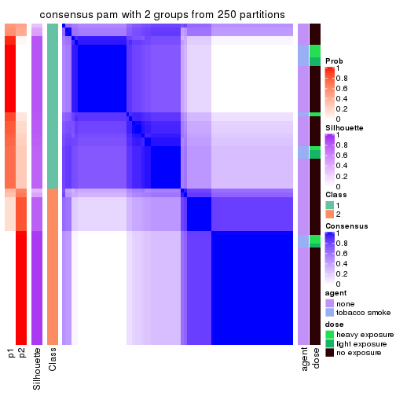</p>

</div>
<div id='tab-ATC-pam-consensus-heatmap-2'>
<pre><code class="r">consensus_heatmap(res, k = 3)
</code></pre>

<p>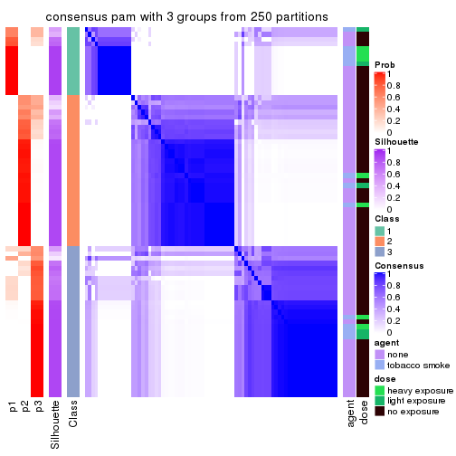</p>

</div>
<div id='tab-ATC-pam-consensus-heatmap-3'>
<pre><code class="r">consensus_heatmap(res, k = 4)
</code></pre>

<p>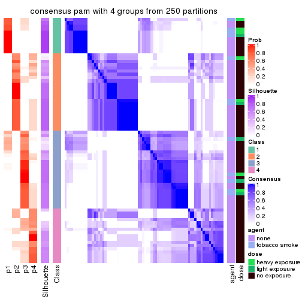</p>

</div>
<div id='tab-ATC-pam-consensus-heatmap-4'>
<pre><code class="r">consensus_heatmap(res, k = 5)
</code></pre>

<p>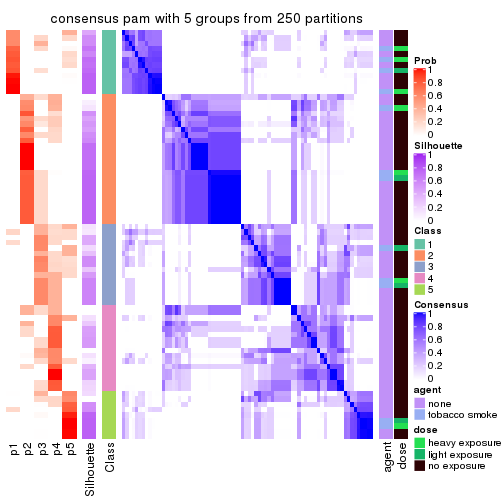</p>

</div>
<div id='tab-ATC-pam-consensus-heatmap-5'>
<pre><code class="r">consensus_heatmap(res, k = 6)
</code></pre>

<p>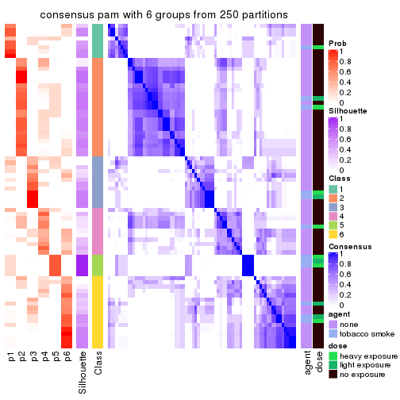</p>

</div>
</div>

Heatmaps for the membership of samples in all partitions to see how consistent they are:


<script>
$( function() {
	$( '#tabs-ATC-pam-membership-heatmap' ).tabs();
} );
</script>
<div id='tabs-ATC-pam-membership-heatmap'>
<ul>
<li><a href='#tab-ATC-pam-membership-heatmap-1'>k = 2</a></li>
<li><a href='#tab-ATC-pam-membership-heatmap-2'>k = 3</a></li>
<li><a href='#tab-ATC-pam-membership-heatmap-3'>k = 4</a></li>
<li><a href='#tab-ATC-pam-membership-heatmap-4'>k = 5</a></li>
<li><a href='#tab-ATC-pam-membership-heatmap-5'>k = 6</a></li>
</ul>
<div id='tab-ATC-pam-membership-heatmap-1'>
<pre><code class="r">membership_heatmap(res, k = 2)
</code></pre>

<p>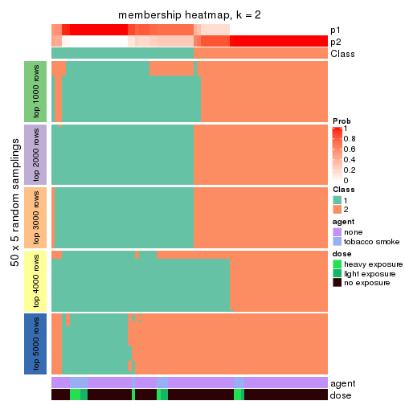</p>

</div>
<div id='tab-ATC-pam-membership-heatmap-2'>
<pre><code class="r">membership_heatmap(res, k = 3)
</code></pre>

<p>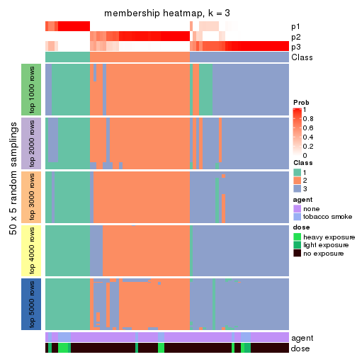</p>

</div>
<div id='tab-ATC-pam-membership-heatmap-3'>
<pre><code class="r">membership_heatmap(res, k = 4)
</code></pre>

<p>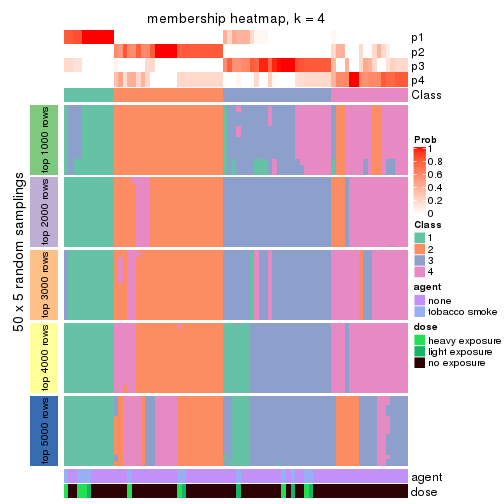</p>

</div>
<div id='tab-ATC-pam-membership-heatmap-4'>
<pre><code class="r">membership_heatmap(res, k = 5)
</code></pre>

<p>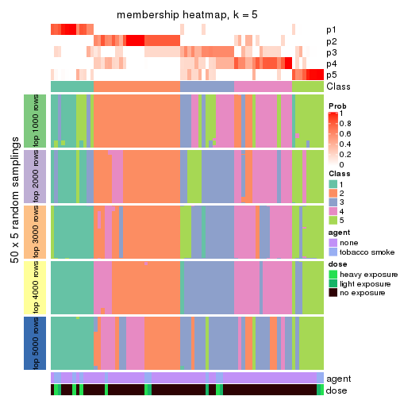</p>

</div>
<div id='tab-ATC-pam-membership-heatmap-5'>
<pre><code class="r">membership_heatmap(res, k = 6)
</code></pre>

<p>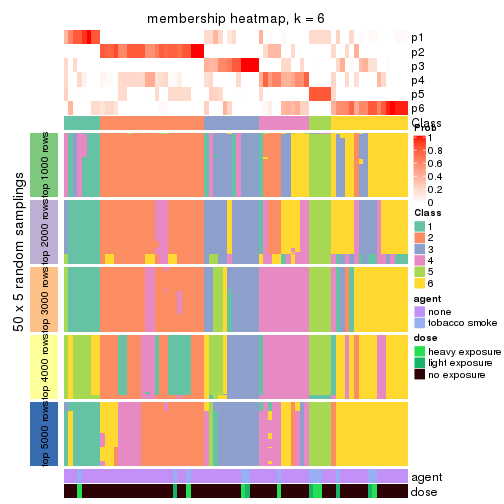</p>

</div>
</div>

As soon as we have had the classes for columns, we can look for signatures
which are significantly different between classes which can be candidate marks
for certain classes. Following are the heatmaps for signatures.


Signature heatmaps where rows are scaled:


<script>
$( function() {
	$( '#tabs-ATC-pam-get-signatures' ).tabs();
} );
</script>
<div id='tabs-ATC-pam-get-signatures'>
<ul>
<li><a href='#tab-ATC-pam-get-signatures-1'>k = 2</a></li>
<li><a href='#tab-ATC-pam-get-signatures-2'>k = 3</a></li>
<li><a href='#tab-ATC-pam-get-signatures-3'>k = 4</a></li>
<li><a href='#tab-ATC-pam-get-signatures-4'>k = 5</a></li>
<li><a href='#tab-ATC-pam-get-signatures-5'>k = 6</a></li>
</ul>
<div id='tab-ATC-pam-get-signatures-1'>
<pre><code class="r">get_signatures(res, k = 2)
</code></pre>

<p>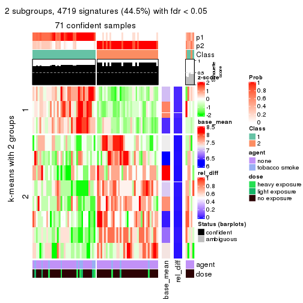</p>

</div>
<div id='tab-ATC-pam-get-signatures-2'>
<pre><code class="r">get_signatures(res, k = 3)
</code></pre>

<p>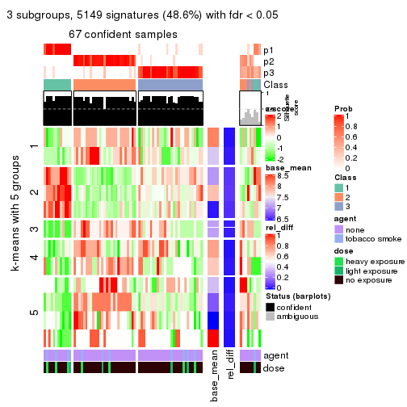</p>

</div>
<div id='tab-ATC-pam-get-signatures-3'>
<pre><code class="r">get_signatures(res, k = 4)
</code></pre>

<p>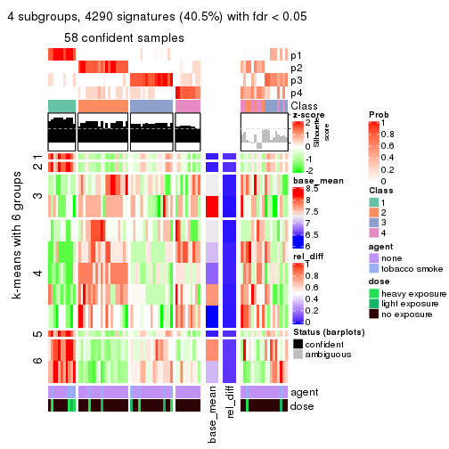</p>

</div>
<div id='tab-ATC-pam-get-signatures-4'>
<pre><code class="r">get_signatures(res, k = 5)
</code></pre>

<p>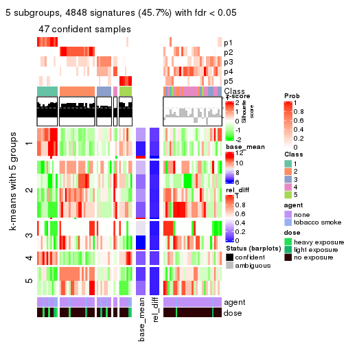</p>

</div>
<div id='tab-ATC-pam-get-signatures-5'>
<pre><code class="r">get_signatures(res, k = 6)
</code></pre>

<p>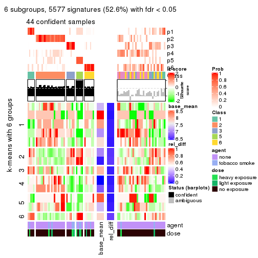</p>

</div>
</div>


Signature heatmaps where rows are not scaled:


<script>
$( function() {
	$( '#tabs-ATC-pam-get-signatures-no-scale' ).tabs();
} );
</script>
<div id='tabs-ATC-pam-get-signatures-no-scale'>
<ul>
<li><a href='#tab-ATC-pam-get-signatures-no-scale-1'>k = 2</a></li>
<li><a href='#tab-ATC-pam-get-signatures-no-scale-2'>k = 3</a></li>
<li><a href='#tab-ATC-pam-get-signatures-no-scale-3'>k = 4</a></li>
<li><a href='#tab-ATC-pam-get-signatures-no-scale-4'>k = 5</a></li>
<li><a href='#tab-ATC-pam-get-signatures-no-scale-5'>k = 6</a></li>
</ul>
<div id='tab-ATC-pam-get-signatures-no-scale-1'>
<pre><code class="r">get_signatures(res, k = 2, scale_rows = FALSE)
</code></pre>

<p>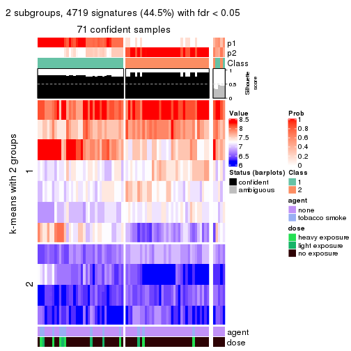</p>

</div>
<div id='tab-ATC-pam-get-signatures-no-scale-2'>
<pre><code class="r">get_signatures(res, k = 3, scale_rows = FALSE)
</code></pre>

<p>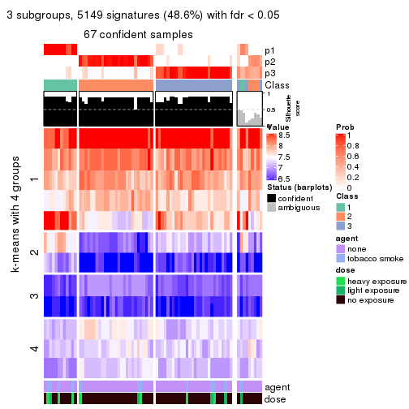</p>

</div>
<div id='tab-ATC-pam-get-signatures-no-scale-3'>
<pre><code class="r">get_signatures(res, k = 4, scale_rows = FALSE)
</code></pre>

<p>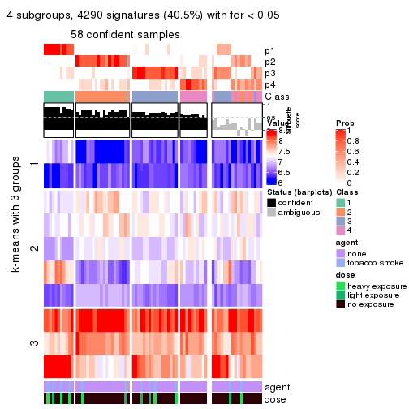</p>

</div>
<div id='tab-ATC-pam-get-signatures-no-scale-4'>
<pre><code class="r">get_signatures(res, k = 5, scale_rows = FALSE)
</code></pre>

<p>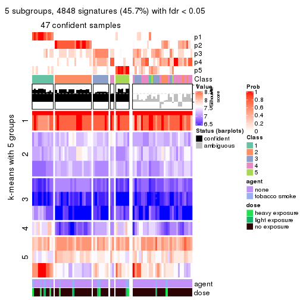</p>

</div>
<div id='tab-ATC-pam-get-signatures-no-scale-5'>
<pre><code class="r">get_signatures(res, k = 6, scale_rows = FALSE)
</code></pre>

<p>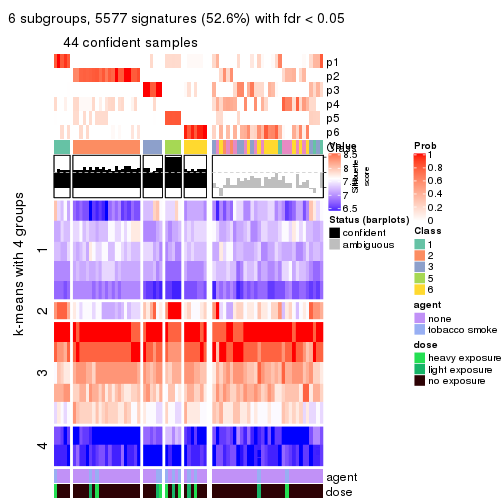</p>

</div>
</div>


Compare the overlap of signatures from different k:

```r
compare_signatures(res)
```

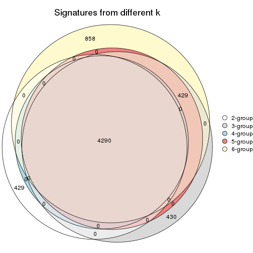

`get_signature()` returns a data frame invisibly. TO get the list of signatures, the function
call should be assigned to a variable explicitly. In following code, if `plot` argument is set
to `FALSE`, no heatmap is plotted while only the differential analysis is performed.

```r
# code only for demonstration
tb = get_signature(res, k = ..., plot = FALSE)
```

An example of the output of `tb` is:

```
#>   which_row         fdr    mean_1    mean_2 scaled_mean_1 scaled_mean_2 km
#> 1        38 0.042760348  8.373488  9.131774    -0.5533452     0.5164555  1
#> 2        40 0.018707592  7.106213  8.469186    -0.6173731     0.5762149  1
#> 3        55 0.019134737 10.221463 11.207825    -0.6159697     0.5749050  1
#> 4        59 0.006059896  5.921854  7.869574    -0.6899429     0.6439467  1
#> 5        60 0.018055526  8.928898 10.211722    -0.6204761     0.5791110  1
#> 6        98 0.009384629 15.714769 14.887706     0.6635654    -0.6193277  2
...
```

The columns in `tb` are:

1. `which_row`: row indices corresponding to the input matrix.
2. `fdr`: FDR for the differential test. 
3. `mean_x`: The mean value in group x.
4. `scaled_mean_x`: The mean value in group x after rows are scaled.
5. `km`: Row groups if k-means clustering is applied to rows.


UMAP plot which shows how samples are separated.


<script>
$( function() {
	$( '#tabs-ATC-pam-dimension-reduction' ).tabs();
} );
</script>
<div id='tabs-ATC-pam-dimension-reduction'>
<ul>
<li><a href='#tab-ATC-pam-dimension-reduction-1'>k = 2</a></li>
<li><a href='#tab-ATC-pam-dimension-reduction-2'>k = 3</a></li>
<li><a href='#tab-ATC-pam-dimension-reduction-3'>k = 4</a></li>
<li><a href='#tab-ATC-pam-dimension-reduction-4'>k = 5</a></li>
<li><a href='#tab-ATC-pam-dimension-reduction-5'>k = 6</a></li>
</ul>
<div id='tab-ATC-pam-dimension-reduction-1'>
<pre><code class="r">dimension_reduction(res, k = 2, method = &quot;UMAP&quot;)
</code></pre>

<p>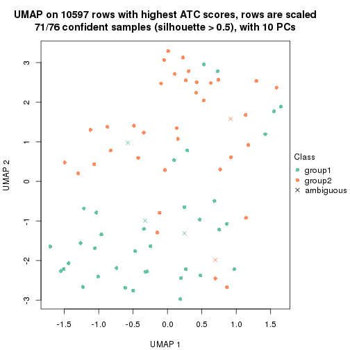</p>

</div>
<div id='tab-ATC-pam-dimension-reduction-2'>
<pre><code class="r">dimension_reduction(res, k = 3, method = &quot;UMAP&quot;)
</code></pre>

<p>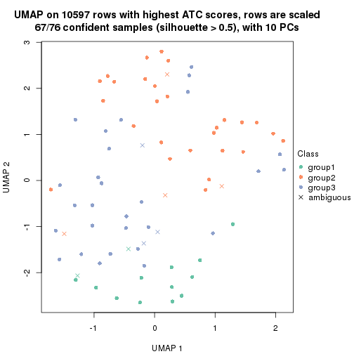</p>

</div>
<div id='tab-ATC-pam-dimension-reduction-3'>
<pre><code class="r">dimension_reduction(res, k = 4, method = &quot;UMAP&quot;)
</code></pre>

<p>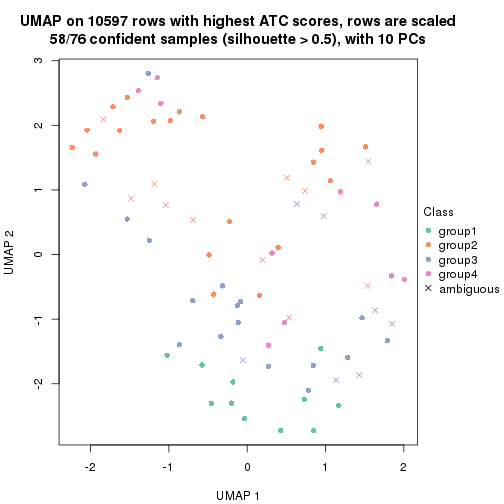</p>

</div>
<div id='tab-ATC-pam-dimension-reduction-4'>
<pre><code class="r">dimension_reduction(res, k = 5, method = &quot;UMAP&quot;)
</code></pre>

<p>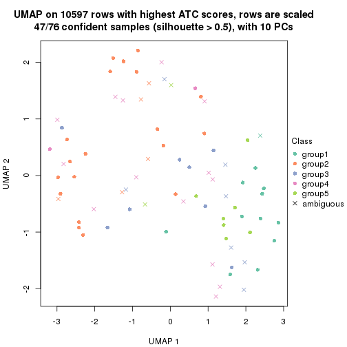</p>

</div>
<div id='tab-ATC-pam-dimension-reduction-5'>
<pre><code class="r">dimension_reduction(res, k = 6, method = &quot;UMAP&quot;)
</code></pre>

<p>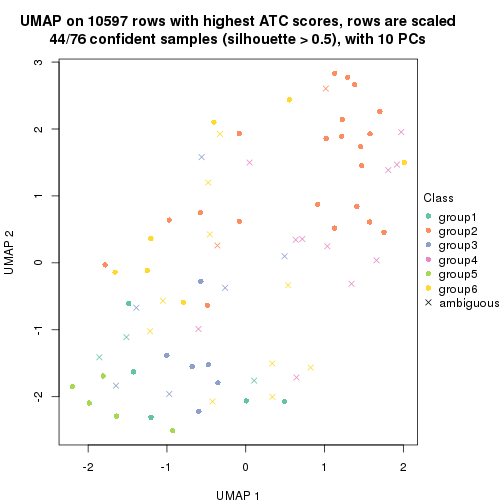</p>

</div>
</div>


Following heatmap shows how subgroups are split when increasing `k`:

```r
collect_classes(res)
```

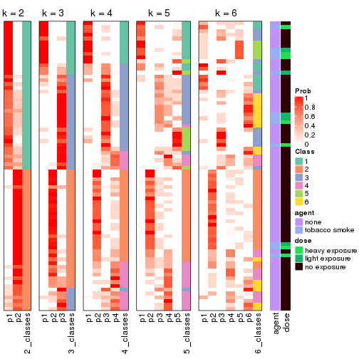


Test correlation between subgroups and known annotations. If the known
annotation is numeric, one-way ANOVA test is applied, and if the known
annotation is discrete, chi-squared contingency table test is applied.

```r
test_to_known_factors(res)
```

```
#>          n agent(p) dose(p) k
#> ATC:pam 71    0.126   0.174 2
#> ATC:pam 67    0.207   0.421 3
#> ATC:pam 58    0.106   0.305 4
#> ATC:pam 47    0.458   0.807 5
#> ATC:pam 44    0.160   0.476 6
```


If matrix rows can be associated to genes, consider to use `GO_Enrichment(res,
...)` to perform function enrichment for the signature genes.


 

---------------------------------------------------


### ATC:mclust


The object with results only for a single top-value method and a single partition method 
can be extracted as:

```r
res = res_list["ATC", "mclust"]
# you can also extract it by
# res = res_list["ATC:mclust"]
```

A summary of `res` and all the functions that can be applied to it:

```r
res
```

```
#> A 'ConsensusPartition' object with k = 2, 3, 4, 5, 6.
#>   On a matrix with 10597 rows and 76 columns.
#>   Top rows (1000, 2000, 3000, 4000, 5000) are extracted by 'ATC' method.
#>   Subgroups are detected by 'mclust' method.
#>   Performed in total 1250 partitions by row resampling.
#>   Best k for subgroups seems to be 2.
#> 
#> Following methods can be applied to this 'ConsensusPartition' object:
#>  [1] "cola_report"             "collect_classes"         "collect_plots"          
#>  [4] "collect_stats"           "colnames"                "compare_signatures"     
#>  [7] "consensus_heatmap"       "dimension_reduction"     "functional_enrichment"  
#> [10] "get_anno_col"            "get_anno"                "get_classes"            
#> [13] "get_consensus"           "get_matrix"              "get_membership"         
#> [16] "get_param"               "get_signatures"          "get_stats"              
#> [19] "is_best_k"               "is_stable_k"             "membership_heatmap"     
#> [22] "ncol"                    "nrow"                    "plot_ecdf"              
#> [25] "rownames"                "select_partition_number" "show"                   
#> [28] "suggest_best_k"          "test_to_known_factors"
```

`collect_plots()` function collects all the plots made from `res` for all `k` (number of partitions)
into one single page to provide an easy and fast comparison between different `k`.

```r
collect_plots(res)
```

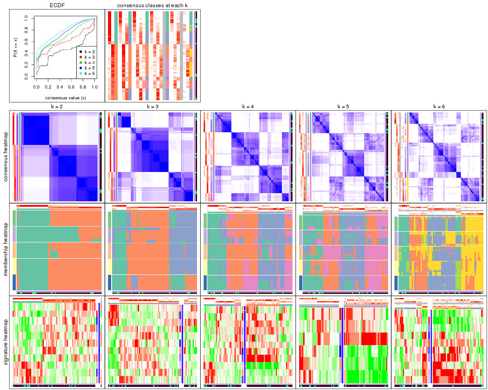

The plots are:

- The first row: a plot of the ECDF (Empirical cumulative distribution
  function) curves of the consensus matrix for each `k` and the heatmap of
  predicted classes for each `k`.
- The second row: heatmaps of the consensus matrix for each `k`.
- The third row: heatmaps of the membership matrix for each `k`.
- The fouth row: heatmaps of the signatures for each `k`.

All the plots in panels can be made by individual functions and they are
plotted later in this section.

`select_partition_number()` produces several plots showing different
statistics for choosing "optimized" `k`. There are following statistics:

- ECDF curves of the consensus matrix for each `k`;
- 1-PAC. [The PAC
  score](https://en.wikipedia.org/wiki/Consensus_clustering#Over-interpretation_potential_of_consensus_clustering)
  measures the proportion of the ambiguous subgrouping.
- Mean silhouette score.
- Concordance. The mean probability of fiting the consensus class ids in all
  partitions.
- Area increased. Denote $A_k$ as the area under the ECDF curve for current
  `k`, the area increased is defined as $A_k - A_{k-1}$.
- Rand index. The percent of pairs of samples that are both in a same cluster
  or both are not in a same cluster in the partition of k and k-1.
- Jaccard index. The ratio of pairs of samples are both in a same cluster in
  the partition of k and k-1 and the pairs of samples are both in a same
  cluster in the partition k or k-1.

The detailed explanations of these statistics can be found in [the cola
vignette](http://bioconductor.org/packages/devel/bioc/vignettes/cola/inst/doc/cola.html#toc_13).

Generally speaking, lower PAC score, higher mean silhouette score or higher
concordance corresponds to better partition. Rand index and Jaccard index
measure how similar the current partition is compared to partition with `k-1`.
If they are too similar, we won't accept `k` is better than `k-1`.

```r
select_partition_number(res)
```

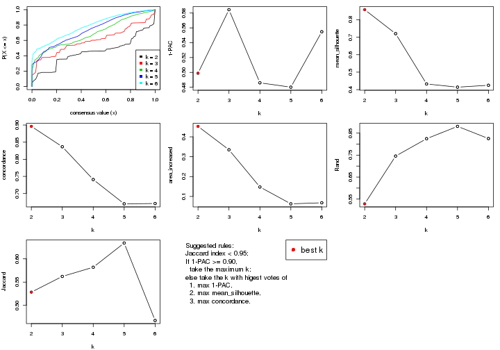

The numeric values for all these statistics can be obtained by `get_stats()`.

```r
get_stats(res)
```

```
#>   k 1-PAC mean_silhouette concordance area_increased  Rand Jaccard
#> 2 2 0.499           0.857       0.896         0.4526 0.528   0.528
#> 3 3 0.585           0.720       0.837         0.3349 0.746   0.562
#> 4 4 0.486           0.432       0.741         0.1476 0.825   0.582
#> 5 5 0.480           0.414       0.670         0.0630 0.881   0.634
#> 6 6 0.555           0.425       0.671         0.0683 0.825   0.467
```

`suggest_best_k()` suggests the best $k$ based on these statistics. The rules are as follows:

- All $k$ with Jaccard index larger than 0.95 are removed because the increase of
  the partition number does not provides enough extra information. If all $k$ are removed,
  the best $k$ is assigned by `NA`.
- For $k$ with 1-PAC larger than 0.9, the maximal $k$ is taken as the "best k". Other $k$ is called "optional k".
- If it does not fit the second rule. The $k$ with the highest vote of highest
  1-PAC, mean silhouette and concordance is taken as the "best k".

```r
suggest_best_k(res)
```

```
#> [1] 2
```


Following shows the table of the partitions (You need to click the **show/hide
code output** link to see it). The membership matrix (columns with name `p*`)
is inferred by
[`clue::cl_consensus()`](https://www.rdocumentation.org/link/cl_consensus?package=clue)
function with the `SE` method. Basically the value in the membership matrix
represents the probability to belong to a certain group. The finall class
label for an item is determined with the group with highest probability it
belongs to.

In `get_classes()` function, the entropy is calculated from the membership
matrix and the silhouette score is calculated from the consensus matrix.


<script>
$( function() {
	$( '#tabs-ATC-mclust-get-classes' ).tabs();
} );
</script>
<div id='tabs-ATC-mclust-get-classes'>
<ul>
<li><a href='#tab-ATC-mclust-get-classes-1'>k = 2</a></li>
<li><a href='#tab-ATC-mclust-get-classes-2'>k = 3</a></li>
<li><a href='#tab-ATC-mclust-get-classes-3'>k = 4</a></li>
<li><a href='#tab-ATC-mclust-get-classes-4'>k = 5</a></li>
<li><a href='#tab-ATC-mclust-get-classes-5'>k = 6</a></li>
</ul>

<div id='tab-ATC-mclust-get-classes-1'>
<p><a id='tab-ATC-mclust-get-classes-1-a' style='color:#0366d6' href='#'>show/hide code output</a></p>
<pre><code class="r">cbind(get_classes(res, k = 2), get_membership(res, k = 2))
</code></pre>

<pre><code>#&gt;           class entropy silhouette    p1    p2
#&gt; GSM451162     1  0.0000    0.96156 1.000 0.000
#&gt; GSM451163     2  0.7139    0.86258 0.196 0.804
#&gt; GSM451164     2  0.7139    0.86258 0.196 0.804
#&gt; GSM451165     2  0.2423    0.85597 0.040 0.960
#&gt; GSM451167     2  0.7219    0.86228 0.200 0.800
#&gt; GSM451168     2  0.1633    0.84677 0.024 0.976
#&gt; GSM451169     2  0.7219    0.86228 0.200 0.800
#&gt; GSM451170     1  0.0000    0.96156 1.000 0.000
#&gt; GSM451171     2  0.7219    0.86228 0.200 0.800
#&gt; GSM451172     2  0.7219    0.86228 0.200 0.800
#&gt; GSM451173     1  0.0376    0.96215 0.996 0.004
#&gt; GSM451174     2  0.2423    0.85597 0.040 0.960
#&gt; GSM451175     1  0.0376    0.96215 0.996 0.004
#&gt; GSM451177     2  0.7139    0.86258 0.196 0.804
#&gt; GSM451178     2  0.2423    0.85597 0.040 0.960
#&gt; GSM451179     2  0.8909    0.75332 0.308 0.692
#&gt; GSM451180     2  0.0376    0.83518 0.004 0.996
#&gt; GSM451181     2  0.2423    0.85597 0.040 0.960
#&gt; GSM451182     1  0.0000    0.96156 1.000 0.000
#&gt; GSM451183     1  0.0000    0.96156 1.000 0.000
#&gt; GSM451184     1  0.6343    0.74183 0.840 0.160
#&gt; GSM451185     1  0.0376    0.96215 0.996 0.004
#&gt; GSM451186     2  0.9686    0.58508 0.396 0.604
#&gt; GSM451187     2  0.7219    0.86228 0.200 0.800
#&gt; GSM451188     2  0.0376    0.83518 0.004 0.996
#&gt; GSM451189     1  0.0376    0.96215 0.996 0.004
#&gt; GSM451190     1  0.0000    0.96156 1.000 0.000
#&gt; GSM451191     1  0.0000    0.96156 1.000 0.000
#&gt; GSM451193     2  0.7139    0.86258 0.196 0.804
#&gt; GSM451195     1  0.0376    0.96215 0.996 0.004
#&gt; GSM451196     1  0.0376    0.96215 0.996 0.004
#&gt; GSM451197     1  0.0000    0.96156 1.000 0.000
#&gt; GSM451199     1  0.0376    0.96215 0.996 0.004
#&gt; GSM451201     1  0.0376    0.96215 0.996 0.004
#&gt; GSM451202     2  0.0376    0.83518 0.004 0.996
#&gt; GSM451203     2  0.7219    0.86228 0.200 0.800
#&gt; GSM451204     2  0.3584    0.85956 0.068 0.932
#&gt; GSM451205     2  0.7139    0.86258 0.196 0.804
#&gt; GSM451206     2  0.7139    0.86258 0.196 0.804
#&gt; GSM451207     2  0.7139    0.86258 0.196 0.804
#&gt; GSM451208     2  0.0376    0.83518 0.004 0.996
#&gt; GSM451209     2  0.7139    0.86258 0.196 0.804
#&gt; GSM451210     2  0.0376    0.83518 0.004 0.996
#&gt; GSM451212     2  0.7139    0.86258 0.196 0.804
#&gt; GSM451213     2  0.2423    0.85597 0.040 0.960
#&gt; GSM451214     2  0.7219    0.86228 0.200 0.800
#&gt; GSM451215     2  0.0376    0.83518 0.004 0.996
#&gt; GSM451216     2  0.2423    0.85597 0.040 0.960
#&gt; GSM451217     2  0.0376    0.83518 0.004 0.996
#&gt; GSM451219     1  0.0000    0.96156 1.000 0.000
#&gt; GSM451220     1  0.0376    0.96215 0.996 0.004
#&gt; GSM451221     1  0.0000    0.96156 1.000 0.000
#&gt; GSM451222     1  0.0376    0.96215 0.996 0.004
#&gt; GSM451224     2  0.2423    0.85597 0.040 0.960
#&gt; GSM451225     1  0.9754   -0.00248 0.592 0.408
#&gt; GSM451226     2  0.8713    0.77916 0.292 0.708
#&gt; GSM451227     2  0.8661    0.77914 0.288 0.712
#&gt; GSM451228     2  0.8713    0.77916 0.292 0.708
#&gt; GSM451230     2  0.9710    0.58483 0.400 0.600
#&gt; GSM451231     2  0.9661    0.60691 0.392 0.608
#&gt; GSM451233     2  0.7139    0.86258 0.196 0.804
#&gt; GSM451234     2  0.1414    0.84700 0.020 0.980
#&gt; GSM451235     2  0.7139    0.86258 0.196 0.804
#&gt; GSM451236     2  0.0376    0.83518 0.004 0.996
#&gt; GSM451166     2  0.8713    0.77916 0.292 0.708
#&gt; GSM451194     1  0.6801    0.70204 0.820 0.180
#&gt; GSM451198     1  0.0000    0.96156 1.000 0.000
#&gt; GSM451218     2  0.2423    0.85597 0.040 0.960
#&gt; GSM451232     1  0.0376    0.96215 0.996 0.004
#&gt; GSM451176     1  0.0376    0.96215 0.996 0.004
#&gt; GSM451192     1  0.0000    0.96156 1.000 0.000
#&gt; GSM451200     1  0.0376    0.96215 0.996 0.004
#&gt; GSM451211     2  0.1414    0.84700 0.020 0.980
#&gt; GSM451223     2  0.9209    0.71726 0.336 0.664
#&gt; GSM451229     1  0.0376    0.96215 0.996 0.004
#&gt; GSM451237     2  0.2423    0.85597 0.040 0.960
</code></pre>

<script>
$('#tab-ATC-mclust-get-classes-1-a').parent().next().next().hide();
$('#tab-ATC-mclust-get-classes-1-a').click(function(){
  $('#tab-ATC-mclust-get-classes-1-a').parent().next().next().toggle();
  return(false);
});
</script>
</div>

<div id='tab-ATC-mclust-get-classes-2'>
<p><a id='tab-ATC-mclust-get-classes-2-a' style='color:#0366d6' href='#'>show/hide code output</a></p>
<pre><code class="r">cbind(get_classes(res, k = 3), get_membership(res, k = 3))
</code></pre>

<pre><code>#&gt;           class entropy silhouette    p1    p2    p3
#&gt; GSM451162     3  0.5058     0.6396 0.244 0.000 0.756
#&gt; GSM451163     2  0.2448     0.8679 0.000 0.924 0.076
#&gt; GSM451164     2  0.2448     0.8679 0.000 0.924 0.076
#&gt; GSM451165     2  0.1289     0.8807 0.000 0.968 0.032
#&gt; GSM451167     2  0.5363     0.6226 0.000 0.724 0.276
#&gt; GSM451168     2  0.0237     0.8860 0.000 0.996 0.004
#&gt; GSM451169     2  0.6126     0.3290 0.000 0.600 0.400
#&gt; GSM451170     3  0.6126     0.3721 0.400 0.000 0.600
#&gt; GSM451171     2  0.1289     0.8807 0.000 0.968 0.032
#&gt; GSM451172     2  0.2448     0.8679 0.000 0.924 0.076
#&gt; GSM451173     3  0.5058     0.6396 0.244 0.000 0.756
#&gt; GSM451174     2  0.1163     0.8821 0.000 0.972 0.028
#&gt; GSM451175     3  0.4555     0.6667 0.200 0.000 0.800
#&gt; GSM451177     2  0.4887     0.7637 0.000 0.772 0.228
#&gt; GSM451178     2  0.4883     0.7767 0.004 0.788 0.208
#&gt; GSM451179     3  0.4504     0.7135 0.000 0.196 0.804
#&gt; GSM451180     2  0.0000     0.8856 0.000 1.000 0.000
#&gt; GSM451181     2  0.5455     0.7602 0.020 0.776 0.204
#&gt; GSM451182     3  0.6126     0.3721 0.400 0.000 0.600
#&gt; GSM451183     1  0.1289     0.8567 0.968 0.000 0.032
#&gt; GSM451184     3  0.4555     0.6667 0.200 0.000 0.800
#&gt; GSM451185     1  0.1289     0.8567 0.968 0.000 0.032
#&gt; GSM451186     2  0.5778     0.6928 0.200 0.768 0.032
#&gt; GSM451187     2  0.2448     0.8679 0.000 0.924 0.076
#&gt; GSM451188     2  0.0000     0.8856 0.000 1.000 0.000
#&gt; GSM451189     1  0.1289     0.8567 0.968 0.000 0.032
#&gt; GSM451190     3  0.6126     0.3721 0.400 0.000 0.600
#&gt; GSM451191     1  0.5926     0.3989 0.644 0.000 0.356
#&gt; GSM451193     2  0.6299     0.0736 0.000 0.524 0.476
#&gt; GSM451195     3  0.5058     0.6396 0.244 0.000 0.756
#&gt; GSM451196     1  0.1289     0.8567 0.968 0.000 0.032
#&gt; GSM451197     1  0.1289     0.8567 0.968 0.000 0.032
#&gt; GSM451199     3  0.5058     0.6396 0.244 0.000 0.756
#&gt; GSM451201     1  0.1289     0.8567 0.968 0.000 0.032
#&gt; GSM451202     2  0.0000     0.8856 0.000 1.000 0.000
#&gt; GSM451203     3  0.5363     0.6329 0.000 0.276 0.724
#&gt; GSM451204     2  0.1289     0.8850 0.032 0.968 0.000
#&gt; GSM451205     2  0.2448     0.8679 0.000 0.924 0.076
#&gt; GSM451206     2  0.4654     0.7813 0.000 0.792 0.208
#&gt; GSM451207     2  0.2448     0.8679 0.000 0.924 0.076
#&gt; GSM451208     2  0.0000     0.8856 0.000 1.000 0.000
#&gt; GSM451209     3  0.6126     0.3522 0.000 0.400 0.600
#&gt; GSM451210     2  0.0000     0.8856 0.000 1.000 0.000
#&gt; GSM451212     2  0.2448     0.8679 0.000 0.924 0.076
#&gt; GSM451213     2  0.1525     0.8843 0.032 0.964 0.004
#&gt; GSM451214     3  0.4504     0.7135 0.000 0.196 0.804
#&gt; GSM451215     2  0.0000     0.8856 0.000 1.000 0.000
#&gt; GSM451216     2  0.1289     0.8850 0.032 0.968 0.000
#&gt; GSM451217     2  0.0000     0.8856 0.000 1.000 0.000
#&gt; GSM451219     3  0.6126     0.3721 0.400 0.000 0.600
#&gt; GSM451220     3  0.5058     0.6396 0.244 0.000 0.756
#&gt; GSM451221     3  0.4555     0.6667 0.200 0.000 0.800
#&gt; GSM451222     1  0.4931     0.6007 0.768 0.000 0.232
#&gt; GSM451224     2  0.1289     0.8850 0.032 0.968 0.000
#&gt; GSM451225     3  0.8996     0.5158 0.244 0.196 0.560
#&gt; GSM451226     3  0.4504     0.7135 0.000 0.196 0.804
#&gt; GSM451227     3  0.4504     0.7135 0.000 0.196 0.804
#&gt; GSM451228     3  0.4504     0.7135 0.000 0.196 0.804
#&gt; GSM451230     2  0.6126     0.3290 0.000 0.600 0.400
#&gt; GSM451231     3  0.4504     0.7135 0.000 0.196 0.804
#&gt; GSM451233     2  0.5327     0.7558 0.000 0.728 0.272
#&gt; GSM451234     2  0.1163     0.8851 0.028 0.972 0.000
#&gt; GSM451235     2  0.2448     0.8679 0.000 0.924 0.076
#&gt; GSM451236     2  0.0000     0.8856 0.000 1.000 0.000
#&gt; GSM451166     3  0.4504     0.7135 0.000 0.196 0.804
#&gt; GSM451194     3  0.5497     0.7130 0.048 0.148 0.804
#&gt; GSM451198     1  0.5926     0.3989 0.644 0.000 0.356
#&gt; GSM451218     2  0.5728     0.7509 0.032 0.772 0.196
#&gt; GSM451232     1  0.1289     0.8567 0.968 0.000 0.032
#&gt; GSM451176     1  0.1289     0.8567 0.968 0.000 0.032
#&gt; GSM451192     1  0.5926     0.3989 0.644 0.000 0.356
#&gt; GSM451200     3  0.6252     0.2396 0.444 0.000 0.556
#&gt; GSM451211     2  0.1585     0.8837 0.028 0.964 0.008
#&gt; GSM451223     3  0.4504     0.7135 0.000 0.196 0.804
#&gt; GSM451229     1  0.1289     0.8567 0.968 0.000 0.032
#&gt; GSM451237     2  0.1289     0.8850 0.032 0.968 0.000
</code></pre>

<script>
$('#tab-ATC-mclust-get-classes-2-a').parent().next().next().hide();
$('#tab-ATC-mclust-get-classes-2-a').click(function(){
  $('#tab-ATC-mclust-get-classes-2-a').parent().next().next().toggle();
  return(false);
});
</script>
</div>

<div id='tab-ATC-mclust-get-classes-3'>
<p><a id='tab-ATC-mclust-get-classes-3-a' style='color:#0366d6' href='#'>show/hide code output</a></p>
<pre><code class="r">cbind(get_classes(res, k = 4), get_membership(res, k = 4))
</code></pre>

<pre><code>#&gt;           class entropy silhouette    p1    p2    p3    p4
#&gt; GSM451162     3  0.3528     0.6465 0.192 0.000 0.808 0.000
#&gt; GSM451163     4  0.6809     0.7659 0.000 0.332 0.116 0.552
#&gt; GSM451164     4  0.6824     0.7595 0.000 0.336 0.116 0.548
#&gt; GSM451165     2  0.6864    -0.3755 0.008 0.528 0.084 0.380
#&gt; GSM451167     4  0.7516     0.6479 0.000 0.328 0.200 0.472
#&gt; GSM451168     2  0.4401     0.3581 0.000 0.724 0.004 0.272
#&gt; GSM451169     3  0.4567     0.5161 0.000 0.008 0.716 0.276
#&gt; GSM451170     1  0.7028     0.2782 0.496 0.000 0.380 0.124
#&gt; GSM451171     4  0.6915     0.6307 0.000 0.416 0.108 0.476
#&gt; GSM451172     2  0.7293    -0.1322 0.008 0.524 0.132 0.336
#&gt; GSM451173     3  0.4781     0.4846 0.336 0.000 0.660 0.004
#&gt; GSM451174     2  0.5147     0.3186 0.000 0.740 0.060 0.200
#&gt; GSM451175     3  0.4761     0.4915 0.332 0.000 0.664 0.004
#&gt; GSM451177     2  0.2530     0.4295 0.000 0.896 0.100 0.004
#&gt; GSM451178     2  0.2281     0.4318 0.000 0.904 0.096 0.000
#&gt; GSM451179     3  0.0592     0.7132 0.016 0.000 0.984 0.000
#&gt; GSM451180     2  0.3219     0.4089 0.000 0.836 0.000 0.164
#&gt; GSM451181     2  0.4039     0.3745 0.000 0.836 0.080 0.084
#&gt; GSM451182     1  0.4978     0.3612 0.612 0.000 0.384 0.004
#&gt; GSM451183     1  0.0707     0.7602 0.980 0.000 0.020 0.000
#&gt; GSM451184     3  0.2651     0.7001 0.096 0.004 0.896 0.004
#&gt; GSM451185     1  0.0524     0.7583 0.988 0.000 0.008 0.004
#&gt; GSM451186     2  0.8100     0.1203 0.184 0.488 0.028 0.300
#&gt; GSM451187     2  0.6980    -0.4363 0.000 0.484 0.116 0.400
#&gt; GSM451188     2  0.4994    -0.1834 0.000 0.520 0.000 0.480
#&gt; GSM451189     1  0.0817     0.7603 0.976 0.000 0.024 0.000
#&gt; GSM451190     1  0.5165     0.0372 0.512 0.000 0.484 0.004
#&gt; GSM451191     1  0.5708     0.6484 0.716 0.000 0.160 0.124
#&gt; GSM451193     3  0.7629     0.4447 0.088 0.228 0.604 0.080
#&gt; GSM451195     3  0.4585     0.4941 0.332 0.000 0.668 0.000
#&gt; GSM451196     1  0.1256     0.7476 0.964 0.000 0.008 0.028
#&gt; GSM451197     1  0.1724     0.7581 0.948 0.000 0.020 0.032
#&gt; GSM451199     3  0.4643     0.4750 0.344 0.000 0.656 0.000
#&gt; GSM451201     1  0.1833     0.7573 0.944 0.000 0.024 0.032
#&gt; GSM451202     2  0.4277     0.3582 0.000 0.720 0.000 0.280
#&gt; GSM451203     3  0.3569     0.6110 0.000 0.000 0.804 0.196
#&gt; GSM451204     4  0.5168     0.3223 0.000 0.496 0.004 0.500
#&gt; GSM451205     4  0.6809     0.7659 0.000 0.332 0.116 0.552
#&gt; GSM451206     2  0.2469     0.4212 0.000 0.892 0.108 0.000
#&gt; GSM451207     2  0.5604     0.2165 0.000 0.724 0.116 0.160
#&gt; GSM451208     2  0.4477     0.2992 0.000 0.688 0.000 0.312
#&gt; GSM451209     3  0.5820     0.5893 0.000 0.084 0.684 0.232
#&gt; GSM451210     2  0.4713     0.1915 0.000 0.640 0.000 0.360
#&gt; GSM451212     2  0.7269    -0.1718 0.000 0.524 0.180 0.296
#&gt; GSM451213     2  0.1118     0.4504 0.000 0.964 0.000 0.036
#&gt; GSM451214     3  0.1109     0.7049 0.000 0.004 0.968 0.028
#&gt; GSM451215     2  0.4994    -0.1834 0.000 0.520 0.000 0.480
#&gt; GSM451216     2  0.2081     0.4570 0.000 0.916 0.000 0.084
#&gt; GSM451217     2  0.5161    -0.1955 0.000 0.520 0.004 0.476
#&gt; GSM451219     3  0.4967     0.1217 0.452 0.000 0.548 0.000
#&gt; GSM451220     3  0.4477     0.5224 0.312 0.000 0.688 0.000
#&gt; GSM451221     3  0.3945     0.6004 0.216 0.000 0.780 0.004
#&gt; GSM451222     1  0.5050     0.2143 0.588 0.000 0.408 0.004
#&gt; GSM451224     2  0.4220     0.3496 0.000 0.748 0.004 0.248
#&gt; GSM451225     3  0.6104     0.5454 0.180 0.000 0.680 0.140
#&gt; GSM451226     3  0.0779     0.7127 0.004 0.000 0.980 0.016
#&gt; GSM451227     3  0.0779     0.7100 0.000 0.004 0.980 0.016
#&gt; GSM451228     3  0.0657     0.7135 0.012 0.000 0.984 0.004
#&gt; GSM451230     3  0.6785    -0.1706 0.000 0.420 0.484 0.096
#&gt; GSM451231     3  0.4841     0.6577 0.080 0.000 0.780 0.140
#&gt; GSM451233     2  0.5604     0.2165 0.000 0.724 0.116 0.160
#&gt; GSM451234     2  0.3569     0.3810 0.000 0.804 0.000 0.196
#&gt; GSM451235     4  0.7030     0.6754 0.000 0.408 0.120 0.472
#&gt; GSM451236     2  0.5161    -0.1955 0.000 0.520 0.004 0.476
#&gt; GSM451166     3  0.1520     0.7131 0.020 0.000 0.956 0.024
#&gt; GSM451194     3  0.2011     0.6892 0.080 0.000 0.920 0.000
#&gt; GSM451198     1  0.5411     0.4796 0.656 0.000 0.312 0.032
#&gt; GSM451218     2  0.1211     0.4500 0.000 0.960 0.000 0.040
#&gt; GSM451232     1  0.0804     0.7548 0.980 0.000 0.008 0.012
#&gt; GSM451176     1  0.0336     0.7579 0.992 0.000 0.008 0.000
#&gt; GSM451192     1  0.3257     0.6996 0.844 0.000 0.152 0.004
#&gt; GSM451200     1  0.5766     0.2377 0.564 0.000 0.404 0.032
#&gt; GSM451211     2  0.0336     0.4574 0.000 0.992 0.000 0.008
#&gt; GSM451223     3  0.0779     0.7133 0.016 0.000 0.980 0.004
#&gt; GSM451229     1  0.1256     0.7476 0.964 0.000 0.008 0.028
#&gt; GSM451237     2  0.4343     0.3273 0.000 0.732 0.004 0.264
</code></pre>

<script>
$('#tab-ATC-mclust-get-classes-3-a').parent().next().next().hide();
$('#tab-ATC-mclust-get-classes-3-a').click(function(){
  $('#tab-ATC-mclust-get-classes-3-a').parent().next().next().toggle();
  return(false);
});
</script>
</div>

<div id='tab-ATC-mclust-get-classes-4'>
<p><a id='tab-ATC-mclust-get-classes-4-a' style='color:#0366d6' href='#'>show/hide code output</a></p>
<pre><code class="r">cbind(get_classes(res, k = 5), get_membership(res, k = 5))
</code></pre>

<pre><code>#&gt;           class entropy silhouette    p1    p2    p3    p4 p5
#&gt; GSM451162     3  0.3305     0.6307 0.224 0.000 0.776 0.000 NA
#&gt; GSM451163     4  0.6210    -0.1424 0.000 0.404 0.140 0.456 NA
#&gt; GSM451164     4  0.6163    -0.0400 0.000 0.312 0.140 0.544 NA
#&gt; GSM451165     2  0.8125    -0.0526 0.000 0.344 0.120 0.340 NA
#&gt; GSM451167     2  0.6748     0.0917 0.000 0.404 0.320 0.276 NA
#&gt; GSM451168     2  0.4331     0.2885 0.000 0.596 0.000 0.400 NA
#&gt; GSM451169     3  0.4067     0.6396 0.016 0.132 0.804 0.048 NA
#&gt; GSM451170     1  0.4670     0.5943 0.724 0.000 0.200 0.000 NA
#&gt; GSM451171     4  0.5819    -0.0843 0.000 0.368 0.088 0.540 NA
#&gt; GSM451172     4  0.6599     0.2116 0.000 0.060 0.136 0.608 NA
#&gt; GSM451173     3  0.5120     0.5581 0.252 0.012 0.680 0.000 NA
#&gt; GSM451174     4  0.5764     0.0254 0.000 0.404 0.068 0.520 NA
#&gt; GSM451175     3  0.4980     0.5701 0.240 0.012 0.696 0.000 NA
#&gt; GSM451177     4  0.6277     0.3261 0.000 0.112 0.080 0.656 NA
#&gt; GSM451178     4  0.5131     0.2973 0.000 0.244 0.060 0.684 NA
#&gt; GSM451179     3  0.1197     0.7277 0.048 0.000 0.952 0.000 NA
#&gt; GSM451180     4  0.4029     0.1137 0.000 0.316 0.000 0.680 NA
#&gt; GSM451181     4  0.3720     0.3419 0.000 0.048 0.020 0.836 NA
#&gt; GSM451182     1  0.4130     0.5033 0.696 0.000 0.292 0.000 NA
#&gt; GSM451183     1  0.0162     0.7061 0.996 0.000 0.000 0.000 NA
#&gt; GSM451184     3  0.1608     0.7216 0.072 0.000 0.928 0.000 NA
#&gt; GSM451185     1  0.2280     0.7018 0.880 0.000 0.000 0.000 NA
#&gt; GSM451186     4  0.8712     0.1311 0.260 0.048 0.084 0.392 NA
#&gt; GSM451187     4  0.5190     0.2010 0.000 0.172 0.140 0.688 NA
#&gt; GSM451188     2  0.3999     0.4112 0.000 0.656 0.000 0.344 NA
#&gt; GSM451189     1  0.2124     0.7076 0.900 0.000 0.004 0.000 NA
#&gt; GSM451190     1  0.5426     0.5771 0.672 0.004 0.192 0.000 NA
#&gt; GSM451191     1  0.4604     0.6187 0.748 0.004 0.168 0.000 NA
#&gt; GSM451193     3  0.4846     0.2439 0.024 0.004 0.612 0.360 NA
#&gt; GSM451195     3  0.4980     0.5701 0.240 0.012 0.696 0.000 NA
#&gt; GSM451196     1  0.4325     0.6876 0.724 0.036 0.000 0.000 NA
#&gt; GSM451197     1  0.5344     0.6774 0.688 0.116 0.008 0.000 NA
#&gt; GSM451199     3  0.4346     0.5188 0.304 0.012 0.680 0.000 NA
#&gt; GSM451201     1  0.6713     0.6420 0.608 0.116 0.088 0.000 NA
#&gt; GSM451202     2  0.4264     0.3088 0.000 0.620 0.000 0.376 NA
#&gt; GSM451203     3  0.4136     0.6612 0.000 0.132 0.800 0.016 NA
#&gt; GSM451204     2  0.6069     0.2758 0.000 0.448 0.000 0.432 NA
#&gt; GSM451205     4  0.6210    -0.1424 0.000 0.404 0.140 0.456 NA
#&gt; GSM451206     4  0.6342     0.2991 0.000 0.112 0.088 0.652 NA
#&gt; GSM451207     4  0.3248     0.3665 0.000 0.004 0.088 0.856 NA
#&gt; GSM451208     2  0.3534     0.4564 0.000 0.744 0.000 0.256 NA
#&gt; GSM451209     3  0.6234     0.5811 0.048 0.072 0.672 0.024 NA
#&gt; GSM451210     2  0.6260     0.2768 0.000 0.476 0.000 0.372 NA
#&gt; GSM451212     4  0.5444     0.0988 0.000 0.204 0.140 0.656 NA
#&gt; GSM451213     4  0.4489     0.2640 0.000 0.192 0.000 0.740 NA
#&gt; GSM451214     3  0.1012     0.7221 0.020 0.000 0.968 0.012 NA
#&gt; GSM451215     2  0.5430     0.4275 0.000 0.660 0.000 0.192 NA
#&gt; GSM451216     4  0.4522     0.2632 0.000 0.196 0.000 0.736 NA
#&gt; GSM451217     2  0.3983     0.4102 0.000 0.660 0.000 0.340 NA
#&gt; GSM451219     1  0.5742     0.1376 0.496 0.012 0.436 0.000 NA
#&gt; GSM451220     3  0.4552     0.6393 0.184 0.012 0.752 0.000 NA
#&gt; GSM451221     3  0.3814     0.5633 0.276 0.000 0.720 0.000 NA
#&gt; GSM451222     1  0.5096     0.5131 0.656 0.000 0.272 0.000 NA
#&gt; GSM451224     2  0.5506     0.3064 0.000 0.528 0.000 0.404 NA
#&gt; GSM451225     3  0.7306     0.2749 0.248 0.052 0.512 0.004 NA
#&gt; GSM451226     3  0.0771     0.7245 0.020 0.004 0.976 0.000 NA
#&gt; GSM451227     3  0.1430     0.7219 0.052 0.000 0.944 0.004 NA
#&gt; GSM451228     3  0.0510     0.7249 0.016 0.000 0.984 0.000 NA
#&gt; GSM451230     3  0.5804    -0.0256 0.064 0.012 0.524 0.400 NA
#&gt; GSM451231     3  0.5819     0.5930 0.048 0.052 0.660 0.004 NA
#&gt; GSM451233     4  0.3483     0.3692 0.000 0.012 0.088 0.848 NA
#&gt; GSM451234     2  0.5295     0.1833 0.000 0.488 0.000 0.464 NA
#&gt; GSM451235     2  0.5475     0.2798 0.000 0.604 0.088 0.308 NA
#&gt; GSM451236     2  0.3074     0.4748 0.000 0.804 0.000 0.196 NA
#&gt; GSM451166     3  0.0609     0.7260 0.020 0.000 0.980 0.000 NA
#&gt; GSM451194     3  0.2471     0.6775 0.136 0.000 0.864 0.000 NA
#&gt; GSM451198     1  0.6754     0.6446 0.616 0.116 0.132 0.000 NA
#&gt; GSM451218     4  0.4618     0.2590 0.000 0.208 0.000 0.724 NA
#&gt; GSM451232     1  0.3424     0.6976 0.760 0.000 0.000 0.000 NA
#&gt; GSM451176     1  0.4168     0.6987 0.764 0.000 0.052 0.000 NA
#&gt; GSM451192     1  0.5227     0.5984 0.696 0.004 0.168 0.000 NA
#&gt; GSM451200     1  0.8013     0.3133 0.404 0.116 0.292 0.000 NA
#&gt; GSM451211     4  0.4817     0.2119 0.000 0.300 0.000 0.656 NA
#&gt; GSM451223     3  0.2054     0.7241 0.028 0.000 0.920 0.000 NA
#&gt; GSM451229     1  0.4325     0.6876 0.724 0.036 0.000 0.000 NA
#&gt; GSM451237     4  0.5605    -0.2301 0.000 0.464 0.000 0.464 NA
</code></pre>

<script>
$('#tab-ATC-mclust-get-classes-4-a').parent().next().next().hide();
$('#tab-ATC-mclust-get-classes-4-a').click(function(){
  $('#tab-ATC-mclust-get-classes-4-a').parent().next().next().toggle();
  return(false);
});
</script>
</div>

<div id='tab-ATC-mclust-get-classes-5'>
<p><a id='tab-ATC-mclust-get-classes-5-a' style='color:#0366d6' href='#'>show/hide code output</a></p>
<pre><code class="r">cbind(get_classes(res, k = 6), get_membership(res, k = 6))
</code></pre>

<pre><code>#&gt;           class entropy silhouette    p1    p2    p3 p4    p5    p6
#&gt; GSM451162     3   0.398    0.57115 0.028 0.048 0.800 NA 0.008 0.000
#&gt; GSM451163     2   0.155    0.47275 0.000 0.932 0.004 NA 0.004 0.060
#&gt; GSM451164     2   0.277    0.43415 0.000 0.816 0.004 NA 0.000 0.180
#&gt; GSM451165     6   0.657   -0.04988 0.000 0.272 0.024 NA 0.000 0.380
#&gt; GSM451167     2   0.320    0.42896 0.000 0.836 0.116 NA 0.004 0.040
#&gt; GSM451168     6   0.357    0.39185 0.000 0.304 0.000 NA 0.000 0.692
#&gt; GSM451169     3   0.562    0.56170 0.000 0.196 0.536 NA 0.000 0.000
#&gt; GSM451170     5   0.595    0.92763 0.228 0.000 0.280 NA 0.488 0.000
#&gt; GSM451171     2   0.397   -0.00385 0.000 0.544 0.004 NA 0.000 0.452
#&gt; GSM451172     2   0.628    0.25887 0.000 0.504 0.060 NA 0.000 0.112
#&gt; GSM451173     3   0.280    0.46970 0.036 0.020 0.880 NA 0.004 0.000
#&gt; GSM451174     6   0.260    0.51594 0.000 0.160 0.000 NA 0.004 0.836
#&gt; GSM451175     3   0.280    0.46970 0.036 0.020 0.880 NA 0.004 0.000
#&gt; GSM451177     6   0.491    0.42159 0.000 0.116 0.000 NA 0.168 0.696
#&gt; GSM451178     6   0.245    0.46013 0.000 0.160 0.000 NA 0.000 0.840
#&gt; GSM451179     3   0.451    0.59938 0.000 0.076 0.744 NA 0.032 0.000
#&gt; GSM451180     6   0.549    0.14786 0.000 0.316 0.000 NA 0.120 0.556
#&gt; GSM451181     6   0.348    0.40236 0.000 0.192 0.032 NA 0.000 0.776
#&gt; GSM451182     5   0.588    0.91138 0.228 0.000 0.304 NA 0.468 0.000
#&gt; GSM451183     1   0.477    0.50684 0.688 0.000 0.156 NA 0.152 0.000
#&gt; GSM451184     3   0.479    0.60971 0.008 0.076 0.660 NA 0.000 0.000
#&gt; GSM451185     1   0.230    0.61885 0.856 0.000 0.000 NA 0.144 0.000
#&gt; GSM451186     6   0.754    0.17242 0.200 0.100 0.020 NA 0.000 0.408
#&gt; GSM451187     2   0.367    0.26702 0.000 0.668 0.004 NA 0.000 0.328
#&gt; GSM451188     2   0.514    0.32064 0.000 0.636 0.000 NA 0.120 0.236
#&gt; GSM451189     1   0.474    0.50856 0.692 0.000 0.160 NA 0.144 0.000
#&gt; GSM451190     5   0.590    0.92930 0.228 0.000 0.312 NA 0.460 0.000
#&gt; GSM451191     5   0.607    0.91656 0.260 0.000 0.280 NA 0.456 0.000
#&gt; GSM451193     2   0.721   -0.14906 0.008 0.372 0.256 NA 0.000 0.064
#&gt; GSM451195     3   0.280    0.46970 0.036 0.020 0.880 NA 0.004 0.000
#&gt; GSM451196     1   0.109    0.67528 0.960 0.000 0.000 NA 0.016 0.000
#&gt; GSM451197     1   0.485    0.58514 0.716 0.020 0.124 NA 0.004 0.000
#&gt; GSM451199     3   0.342    0.46838 0.036 0.020 0.852 NA 0.032 0.000
#&gt; GSM451201     1   0.500    0.56746 0.688 0.020 0.136 NA 0.000 0.000
#&gt; GSM451202     6   0.536    0.37973 0.000 0.204 0.000 NA 0.120 0.648
#&gt; GSM451203     3   0.468    0.60687 0.000 0.084 0.652 NA 0.000 0.000
#&gt; GSM451204     2   0.441    0.18595 0.000 0.588 0.032 NA 0.000 0.380
#&gt; GSM451205     2   0.236    0.45573 0.000 0.860 0.004 NA 0.000 0.136
#&gt; GSM451206     6   0.627    0.29303 0.000 0.240 0.004 NA 0.168 0.548
#&gt; GSM451207     2   0.457    0.00236 0.000 0.524 0.036 NA 0.000 0.440
#&gt; GSM451208     6   0.562    0.08677 0.000 0.372 0.000 NA 0.120 0.500
#&gt; GSM451209     3   0.530    0.48783 0.000 0.100 0.648 NA 0.228 0.004
#&gt; GSM451210     6   0.605    0.23751 0.000 0.224 0.000 NA 0.288 0.480
#&gt; GSM451212     2   0.342    0.30264 0.000 0.748 0.012 NA 0.000 0.240
#&gt; GSM451213     6   0.192    0.52361 0.000 0.052 0.000 NA 0.000 0.916
#&gt; GSM451214     3   0.545    0.48979 0.000 0.104 0.464 NA 0.004 0.000
#&gt; GSM451215     2   0.626    0.08085 0.000 0.412 0.000 NA 0.288 0.292
#&gt; GSM451216     6   0.105    0.53420 0.000 0.008 0.000 NA 0.000 0.960
#&gt; GSM451217     2   0.473    0.39284 0.000 0.700 0.000 NA 0.124 0.168
#&gt; GSM451219     3   0.494    0.40542 0.068 0.020 0.744 NA 0.116 0.000
#&gt; GSM451220     3   0.159    0.51041 0.032 0.020 0.940 NA 0.000 0.000
#&gt; GSM451221     3   0.481    0.45990 0.012 0.000 0.696 NA 0.176 0.000
#&gt; GSM451222     3   0.485    0.10588 0.344 0.000 0.592 NA 0.004 0.000
#&gt; GSM451224     6   0.475    0.12450 0.000 0.416 0.004 NA 0.004 0.544
#&gt; GSM451225     3   0.542    0.06612 0.172 0.004 0.596 NA 0.228 0.000
#&gt; GSM451226     3   0.503    0.59960 0.000 0.104 0.628 NA 0.004 0.000
#&gt; GSM451227     3   0.528    0.60456 0.000 0.076 0.632 NA 0.032 0.000
#&gt; GSM451228     3   0.536    0.49088 0.000 0.108 0.464 NA 0.000 0.000
#&gt; GSM451230     3   0.726    0.18230 0.000 0.208 0.404 NA 0.000 0.268
#&gt; GSM451231     3   0.372    0.45314 0.004 0.036 0.764 NA 0.196 0.000
#&gt; GSM451233     6   0.492    0.18027 0.000 0.364 0.036 NA 0.000 0.580
#&gt; GSM451234     6   0.362    0.42242 0.000 0.244 0.000 NA 0.020 0.736
#&gt; GSM451235     2   0.335    0.34647 0.000 0.752 0.004 NA 0.004 0.240
#&gt; GSM451236     2   0.565    0.10296 0.000 0.496 0.000 NA 0.124 0.372
#&gt; GSM451166     3   0.521    0.60046 0.000 0.076 0.636 NA 0.028 0.000
#&gt; GSM451194     3   0.441    0.56337 0.000 0.032 0.756 NA 0.080 0.000
#&gt; GSM451198     1   0.640    0.28389 0.460 0.020 0.308 NA 0.004 0.000
#&gt; GSM451218     6   0.114    0.53076 0.000 0.000 0.000 NA 0.000 0.948
#&gt; GSM451232     1   0.000    0.68928 1.000 0.000 0.000 NA 0.000 0.000
#&gt; GSM451176     1   0.247    0.66200 0.888 0.000 0.052 NA 0.004 0.000
#&gt; GSM451192     5   0.604    0.91959 0.236 0.000 0.304 NA 0.456 0.000
#&gt; GSM451200     3   0.636   -0.18352 0.292 0.020 0.476 NA 0.004 0.000
#&gt; GSM451211     6   0.109    0.53766 0.000 0.000 0.000 NA 0.020 0.960
#&gt; GSM451223     3   0.457    0.60783 0.000 0.076 0.664 NA 0.000 0.000
#&gt; GSM451229     1   0.109    0.67528 0.960 0.000 0.000 NA 0.016 0.000
#&gt; GSM451237     6   0.285    0.44366 0.000 0.208 0.000 NA 0.000 0.792
</code></pre>

<script>
$('#tab-ATC-mclust-get-classes-5-a').parent().next().next().hide();
$('#tab-ATC-mclust-get-classes-5-a').click(function(){
  $('#tab-ATC-mclust-get-classes-5-a').parent().next().next().toggle();
  return(false);
});
</script>
</div>
</div>

Heatmaps for the consensus matrix. It visualizes the probability of two
samples to be in a same group.


<script>
$( function() {
	$( '#tabs-ATC-mclust-consensus-heatmap' ).tabs();
} );
</script>
<div id='tabs-ATC-mclust-consensus-heatmap'>
<ul>
<li><a href='#tab-ATC-mclust-consensus-heatmap-1'>k = 2</a></li>
<li><a href='#tab-ATC-mclust-consensus-heatmap-2'>k = 3</a></li>
<li><a href='#tab-ATC-mclust-consensus-heatmap-3'>k = 4</a></li>
<li><a href='#tab-ATC-mclust-consensus-heatmap-4'>k = 5</a></li>
<li><a href='#tab-ATC-mclust-consensus-heatmap-5'>k = 6</a></li>
</ul>
<div id='tab-ATC-mclust-consensus-heatmap-1'>
<pre><code class="r">consensus_heatmap(res, k = 2)
</code></pre>

<p>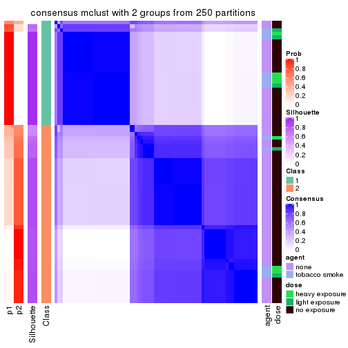</p>

</div>
<div id='tab-ATC-mclust-consensus-heatmap-2'>
<pre><code class="r">consensus_heatmap(res, k = 3)
</code></pre>

<p>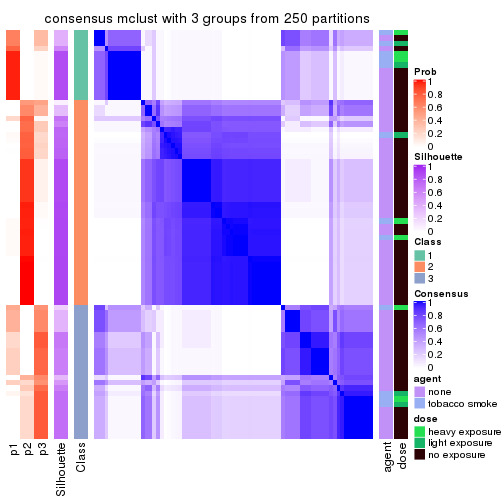</p>

</div>
<div id='tab-ATC-mclust-consensus-heatmap-3'>
<pre><code class="r">consensus_heatmap(res, k = 4)
</code></pre>

<p>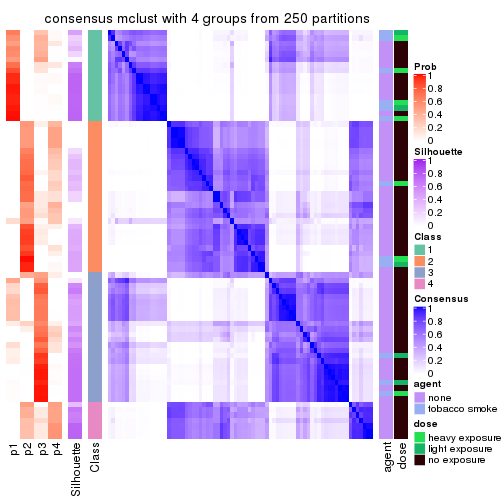</p>

</div>
<div id='tab-ATC-mclust-consensus-heatmap-4'>
<pre><code class="r">consensus_heatmap(res, k = 5)
</code></pre>

<p>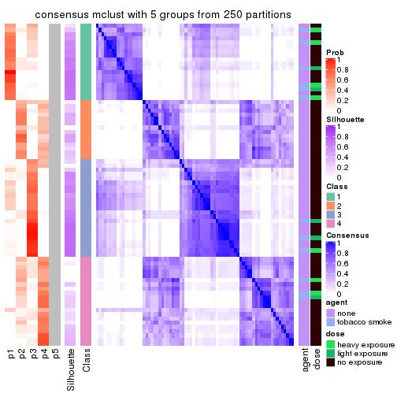</p>

</div>
<div id='tab-ATC-mclust-consensus-heatmap-5'>
<pre><code class="r">consensus_heatmap(res, k = 6)
</code></pre>

<p>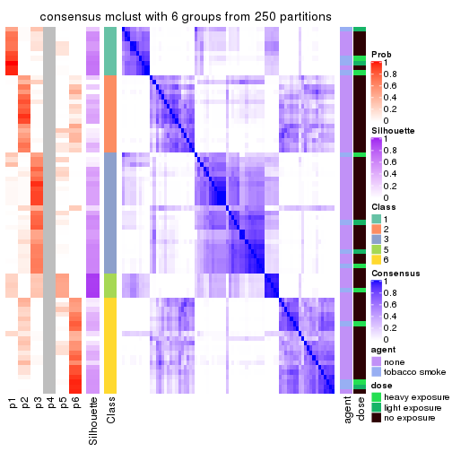</p>

</div>
</div>

Heatmaps for the membership of samples in all partitions to see how consistent they are:


<script>
$( function() {
	$( '#tabs-ATC-mclust-membership-heatmap' ).tabs();
} );
</script>
<div id='tabs-ATC-mclust-membership-heatmap'>
<ul>
<li><a href='#tab-ATC-mclust-membership-heatmap-1'>k = 2</a></li>
<li><a href='#tab-ATC-mclust-membership-heatmap-2'>k = 3</a></li>
<li><a href='#tab-ATC-mclust-membership-heatmap-3'>k = 4</a></li>
<li><a href='#tab-ATC-mclust-membership-heatmap-4'>k = 5</a></li>
<li><a href='#tab-ATC-mclust-membership-heatmap-5'>k = 6</a></li>
</ul>
<div id='tab-ATC-mclust-membership-heatmap-1'>
<pre><code class="r">membership_heatmap(res, k = 2)
</code></pre>

<p>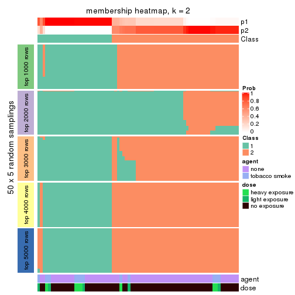</p>

</div>
<div id='tab-ATC-mclust-membership-heatmap-2'>
<pre><code class="r">membership_heatmap(res, k = 3)
</code></pre>

<p>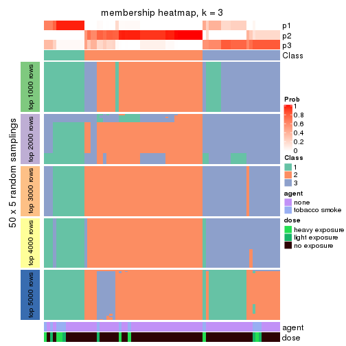</p>

</div>
<div id='tab-ATC-mclust-membership-heatmap-3'>
<pre><code class="r">membership_heatmap(res, k = 4)
</code></pre>

<p>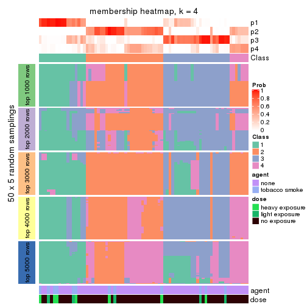</p>

</div>
<div id='tab-ATC-mclust-membership-heatmap-4'>
<pre><code class="r">membership_heatmap(res, k = 5)
</code></pre>

<p>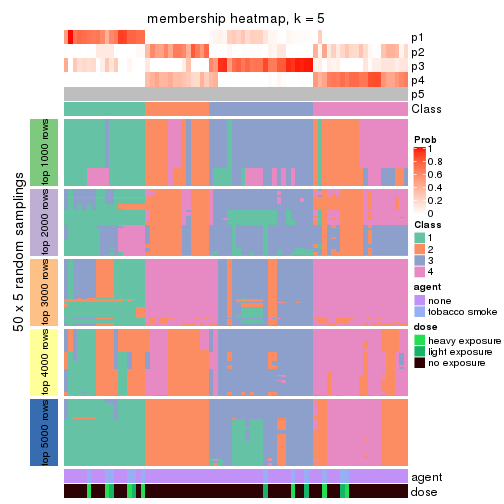</p>

</div>
<div id='tab-ATC-mclust-membership-heatmap-5'>
<pre><code class="r">membership_heatmap(res, k = 6)
</code></pre>

<p>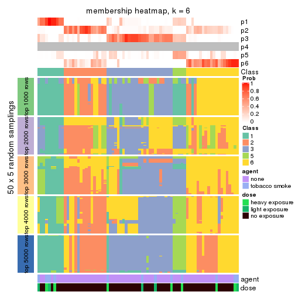</p>

</div>
</div>

As soon as we have had the classes for columns, we can look for signatures
which are significantly different between classes which can be candidate marks
for certain classes. Following are the heatmaps for signatures.


Signature heatmaps where rows are scaled:


<script>
$( function() {
	$( '#tabs-ATC-mclust-get-signatures' ).tabs();
} );
</script>
<div id='tabs-ATC-mclust-get-signatures'>
<ul>
<li><a href='#tab-ATC-mclust-get-signatures-1'>k = 2</a></li>
<li><a href='#tab-ATC-mclust-get-signatures-2'>k = 3</a></li>
<li><a href='#tab-ATC-mclust-get-signatures-3'>k = 4</a></li>
<li><a href='#tab-ATC-mclust-get-signatures-4'>k = 5</a></li>
<li><a href='#tab-ATC-mclust-get-signatures-5'>k = 6</a></li>
</ul>
<div id='tab-ATC-mclust-get-signatures-1'>
<pre><code class="r">get_signatures(res, k = 2)
</code></pre>

<p>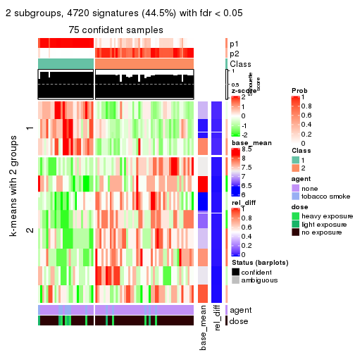</p>

</div>
<div id='tab-ATC-mclust-get-signatures-2'>
<pre><code class="r">get_signatures(res, k = 3)
</code></pre>

<p>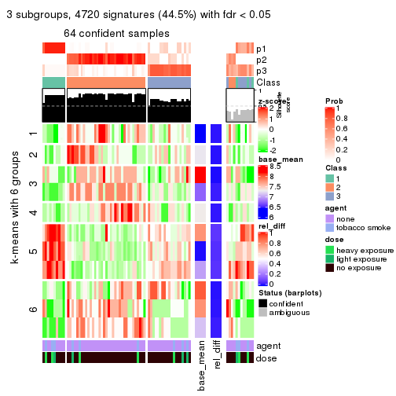</p>

</div>
<div id='tab-ATC-mclust-get-signatures-3'>
<pre><code class="r">get_signatures(res, k = 4)
</code></pre>

<p>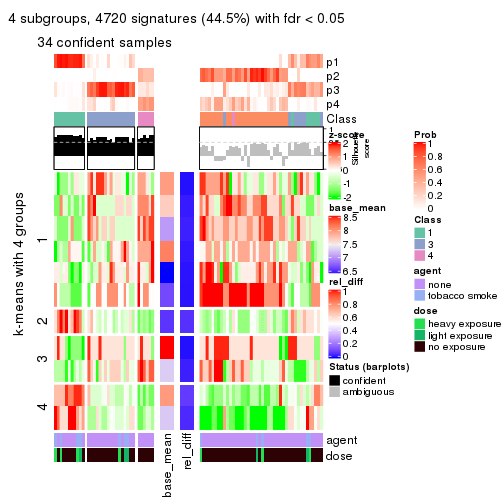</p>

</div>
<div id='tab-ATC-mclust-get-signatures-4'>
<pre><code class="r">get_signatures(res, k = 5)
</code></pre>

<p>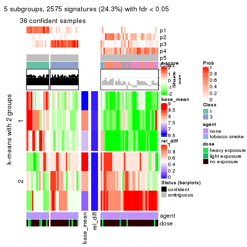</p>

</div>
<div id='tab-ATC-mclust-get-signatures-5'>
<pre><code class="r">get_signatures(res, k = 6)
</code></pre>

<p>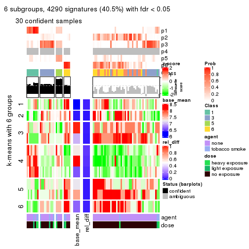</p>

</div>
</div>


Signature heatmaps where rows are not scaled:


<script>
$( function() {
	$( '#tabs-ATC-mclust-get-signatures-no-scale' ).tabs();
} );
</script>
<div id='tabs-ATC-mclust-get-signatures-no-scale'>
<ul>
<li><a href='#tab-ATC-mclust-get-signatures-no-scale-1'>k = 2</a></li>
<li><a href='#tab-ATC-mclust-get-signatures-no-scale-2'>k = 3</a></li>
<li><a href='#tab-ATC-mclust-get-signatures-no-scale-3'>k = 4</a></li>
<li><a href='#tab-ATC-mclust-get-signatures-no-scale-4'>k = 5</a></li>
<li><a href='#tab-ATC-mclust-get-signatures-no-scale-5'>k = 6</a></li>
</ul>
<div id='tab-ATC-mclust-get-signatures-no-scale-1'>
<pre><code class="r">get_signatures(res, k = 2, scale_rows = FALSE)
</code></pre>

<p>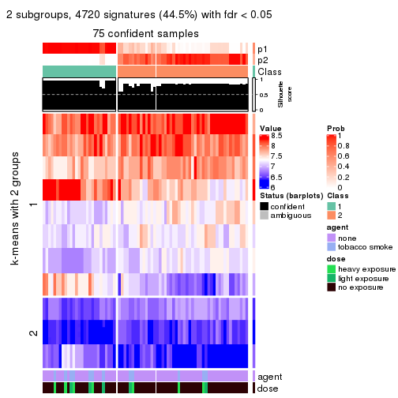</p>

</div>
<div id='tab-ATC-mclust-get-signatures-no-scale-2'>
<pre><code class="r">get_signatures(res, k = 3, scale_rows = FALSE)
</code></pre>

<p>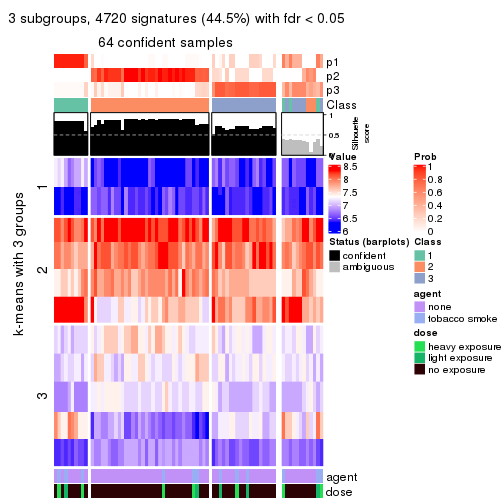</p>

</div>
<div id='tab-ATC-mclust-get-signatures-no-scale-3'>
<pre><code class="r">get_signatures(res, k = 4, scale_rows = FALSE)
</code></pre>

<p>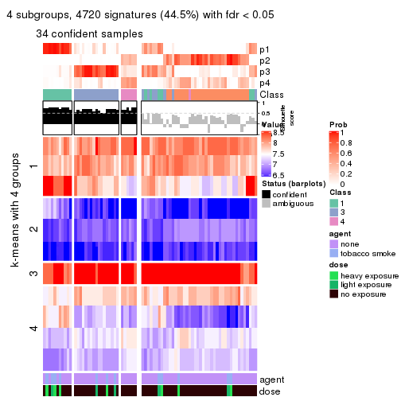</p>

</div>
<div id='tab-ATC-mclust-get-signatures-no-scale-4'>
<pre><code class="r">get_signatures(res, k = 5, scale_rows = FALSE)
</code></pre>

<p>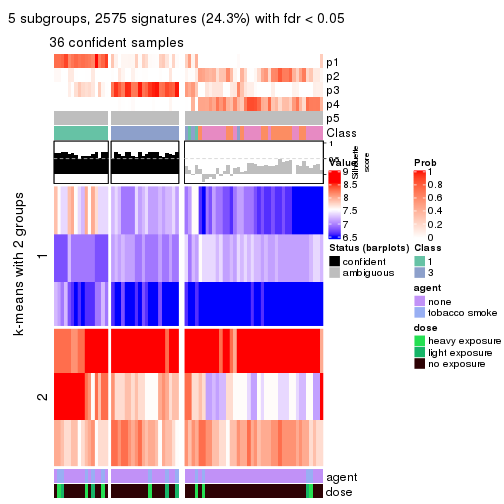</p>

</div>
<div id='tab-ATC-mclust-get-signatures-no-scale-5'>
<pre><code class="r">get_signatures(res, k = 6, scale_rows = FALSE)
</code></pre>

<p>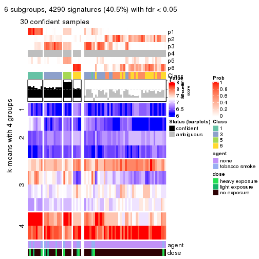</p>

</div>
</div>


Compare the overlap of signatures from different k:

```r
compare_signatures(res)
```

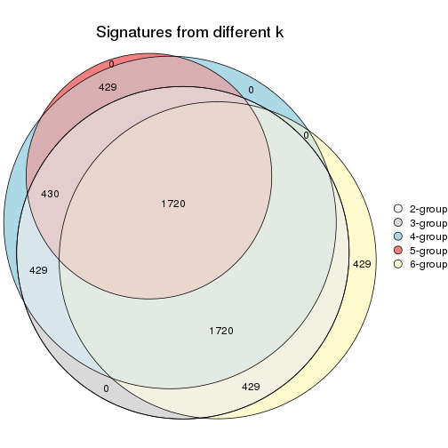

`get_signature()` returns a data frame invisibly. TO get the list of signatures, the function
call should be assigned to a variable explicitly. In following code, if `plot` argument is set
to `FALSE`, no heatmap is plotted while only the differential analysis is performed.

```r
# code only for demonstration
tb = get_signature(res, k = ..., plot = FALSE)
```

An example of the output of `tb` is:

```
#>   which_row         fdr    mean_1    mean_2 scaled_mean_1 scaled_mean_2 km
#> 1        38 0.042760348  8.373488  9.131774    -0.5533452     0.5164555  1
#> 2        40 0.018707592  7.106213  8.469186    -0.6173731     0.5762149  1
#> 3        55 0.019134737 10.221463 11.207825    -0.6159697     0.5749050  1
#> 4        59 0.006059896  5.921854  7.869574    -0.6899429     0.6439467  1
#> 5        60 0.018055526  8.928898 10.211722    -0.6204761     0.5791110  1
#> 6        98 0.009384629 15.714769 14.887706     0.6635654    -0.6193277  2
...
```

The columns in `tb` are:

1. `which_row`: row indices corresponding to the input matrix.
2. `fdr`: FDR for the differential test. 
3. `mean_x`: The mean value in group x.
4. `scaled_mean_x`: The mean value in group x after rows are scaled.
5. `km`: Row groups if k-means clustering is applied to rows.


UMAP plot which shows how samples are separated.


<script>
$( function() {
	$( '#tabs-ATC-mclust-dimension-reduction' ).tabs();
} );
</script>
<div id='tabs-ATC-mclust-dimension-reduction'>
<ul>
<li><a href='#tab-ATC-mclust-dimension-reduction-1'>k = 2</a></li>
<li><a href='#tab-ATC-mclust-dimension-reduction-2'>k = 3</a></li>
<li><a href='#tab-ATC-mclust-dimension-reduction-3'>k = 4</a></li>
<li><a href='#tab-ATC-mclust-dimension-reduction-4'>k = 5</a></li>
<li><a href='#tab-ATC-mclust-dimension-reduction-5'>k = 6</a></li>
</ul>
<div id='tab-ATC-mclust-dimension-reduction-1'>
<pre><code class="r">dimension_reduction(res, k = 2, method = &quot;UMAP&quot;)
</code></pre>

<p>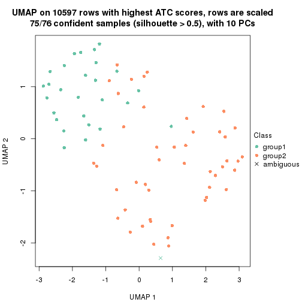</p>

</div>
<div id='tab-ATC-mclust-dimension-reduction-2'>
<pre><code class="r">dimension_reduction(res, k = 3, method = &quot;UMAP&quot;)
</code></pre>

<p>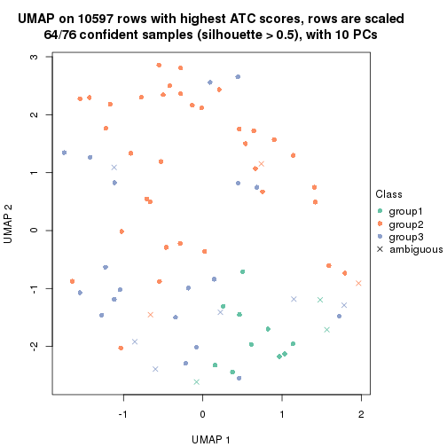</p>

</div>
<div id='tab-ATC-mclust-dimension-reduction-3'>
<pre><code class="r">dimension_reduction(res, k = 4, method = &quot;UMAP&quot;)
</code></pre>

<p>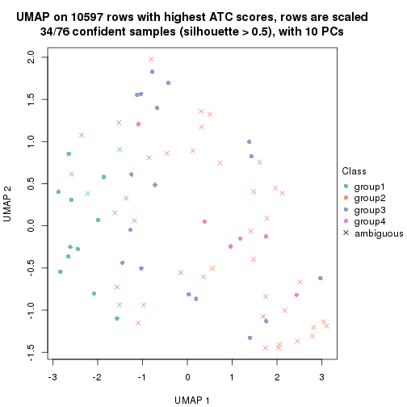</p>

</div>
<div id='tab-ATC-mclust-dimension-reduction-4'>
<pre><code class="r">dimension_reduction(res, k = 5, method = &quot;UMAP&quot;)
</code></pre>

<p>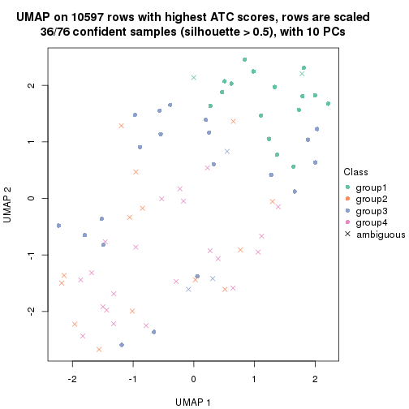</p>

</div>
<div id='tab-ATC-mclust-dimension-reduction-5'>
<pre><code class="r">dimension_reduction(res, k = 6, method = &quot;UMAP&quot;)
</code></pre>

<p>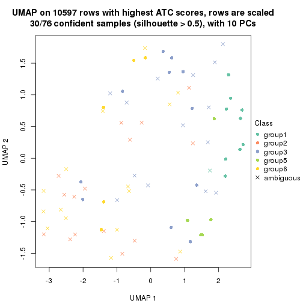</p>

</div>
</div>


Following heatmap shows how subgroups are split when increasing `k`:

```r
collect_classes(res)
```

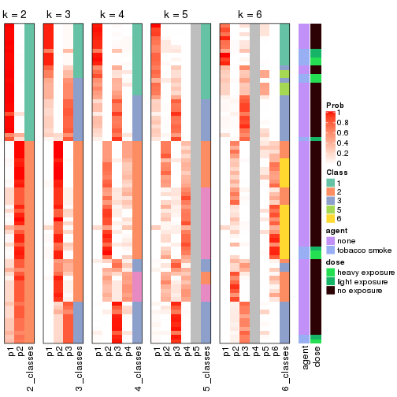


Test correlation between subgroups and known annotations. If the known
annotation is numeric, one-way ANOVA test is applied, and if the known
annotation is discrete, chi-squared contingency table test is applied.

```r
test_to_known_factors(res)
```

```
#>             n agent(p) dose(p) k
#> ATC:mclust 75    0.153   0.212 2
#> ATC:mclust 64    0.221   0.392 3
#> ATC:mclust 34    0.190   0.305 4
#> ATC:mclust 36    0.446   0.394 5
#> ATC:mclust 30    0.905   0.934 6
```


If matrix rows can be associated to genes, consider to use `GO_Enrichment(res,
...)` to perform function enrichment for the signature genes.


 

---------------------------------------------------


### ATC:NMF


The object with results only for a single top-value method and a single partition method 
can be extracted as:

```r
res = res_list["ATC", "NMF"]
# you can also extract it by
# res = res_list["ATC:NMF"]
```

A summary of `res` and all the functions that can be applied to it:

```r
res
```

```
#> A 'ConsensusPartition' object with k = 2, 3, 4, 5, 6.
#>   On a matrix with 10597 rows and 76 columns.
#>   Top rows (1000, 2000, 3000, 4000, 5000) are extracted by 'ATC' method.
#>   Subgroups are detected by 'NMF' method.
#>   Performed in total 1250 partitions by row resampling.
#>   Best k for subgroups seems to be 2.
#> 
#> Following methods can be applied to this 'ConsensusPartition' object:
#>  [1] "cola_report"             "collect_classes"         "collect_plots"          
#>  [4] "collect_stats"           "colnames"                "compare_signatures"     
#>  [7] "consensus_heatmap"       "dimension_reduction"     "functional_enrichment"  
#> [10] "get_anno_col"            "get_anno"                "get_classes"            
#> [13] "get_consensus"           "get_matrix"              "get_membership"         
#> [16] "get_param"               "get_signatures"          "get_stats"              
#> [19] "is_best_k"               "is_stable_k"             "membership_heatmap"     
#> [22] "ncol"                    "nrow"                    "plot_ecdf"              
#> [25] "rownames"                "select_partition_number" "show"                   
#> [28] "suggest_best_k"          "test_to_known_factors"
```

`collect_plots()` function collects all the plots made from `res` for all `k` (number of partitions)
into one single page to provide an easy and fast comparison between different `k`.

```r
collect_plots(res)
```

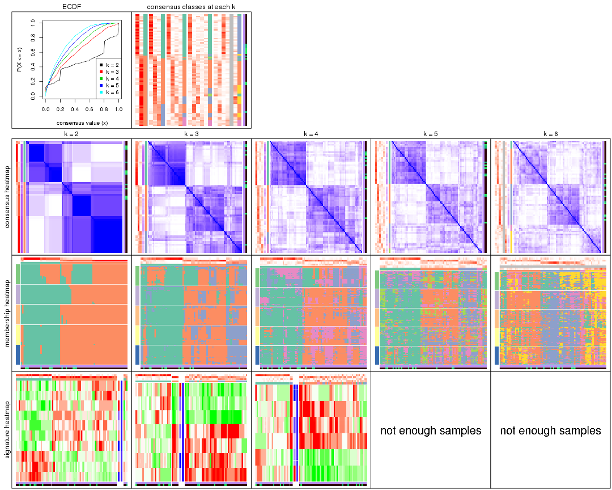

The plots are:

- The first row: a plot of the ECDF (Empirical cumulative distribution
  function) curves of the consensus matrix for each `k` and the heatmap of
  predicted classes for each `k`.
- The second row: heatmaps of the consensus matrix for each `k`.
- The third row: heatmaps of the membership matrix for each `k`.
- The fouth row: heatmaps of the signatures for each `k`.

All the plots in panels can be made by individual functions and they are
plotted later in this section.

`select_partition_number()` produces several plots showing different
statistics for choosing "optimized" `k`. There are following statistics:

- ECDF curves of the consensus matrix for each `k`;
- 1-PAC. [The PAC
  score](https://en.wikipedia.org/wiki/Consensus_clustering#Over-interpretation_potential_of_consensus_clustering)
  measures the proportion of the ambiguous subgrouping.
- Mean silhouette score.
- Concordance. The mean probability of fiting the consensus class ids in all
  partitions.
- Area increased. Denote $A_k$ as the area under the ECDF curve for current
  `k`, the area increased is defined as $A_k - A_{k-1}$.
- Rand index. The percent of pairs of samples that are both in a same cluster
  or both are not in a same cluster in the partition of k and k-1.
- Jaccard index. The ratio of pairs of samples are both in a same cluster in
  the partition of k and k-1 and the pairs of samples are both in a same
  cluster in the partition k or k-1.

The detailed explanations of these statistics can be found in [the cola
vignette](http://bioconductor.org/packages/devel/bioc/vignettes/cola/inst/doc/cola.html#toc_13).

Generally speaking, lower PAC score, higher mean silhouette score or higher
concordance corresponds to better partition. Rand index and Jaccard index
measure how similar the current partition is compared to partition with `k-1`.
If they are too similar, we won't accept `k` is better than `k-1`.

```r
select_partition_number(res)
```

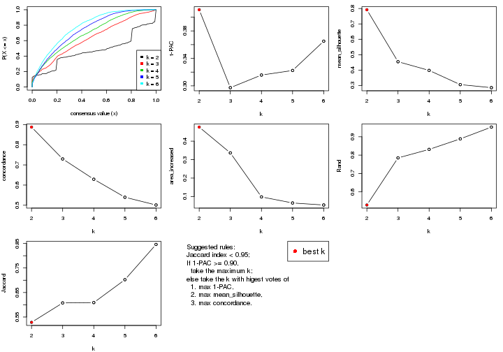

The numeric values for all these statistics can be obtained by `get_stats()`.

```r
get_stats(res)
```

```
#>   k 1-PAC mean_silhouette concordance area_increased  Rand Jaccard
#> 2 2 0.411           0.792       0.888         0.4762 0.528   0.528
#> 3 3 0.297           0.455       0.730         0.3363 0.785   0.608
#> 4 4 0.316           0.398       0.629         0.0979 0.831   0.609
#> 5 5 0.322           0.306       0.540         0.0650 0.888   0.702
#> 6 6 0.365           0.286       0.501         0.0541 0.953   0.846
```

`suggest_best_k()` suggests the best $k$ based on these statistics. The rules are as follows:

- All $k$ with Jaccard index larger than 0.95 are removed because the increase of
  the partition number does not provides enough extra information. If all $k$ are removed,
  the best $k$ is assigned by `NA`.
- For $k$ with 1-PAC larger than 0.9, the maximal $k$ is taken as the "best k". Other $k$ is called "optional k".
- If it does not fit the second rule. The $k$ with the highest vote of highest
  1-PAC, mean silhouette and concordance is taken as the "best k".

```r
suggest_best_k(res)
```

```
#> [1] 2
```


Following shows the table of the partitions (You need to click the **show/hide
code output** link to see it). The membership matrix (columns with name `p*`)
is inferred by
[`clue::cl_consensus()`](https://www.rdocumentation.org/link/cl_consensus?package=clue)
function with the `SE` method. Basically the value in the membership matrix
represents the probability to belong to a certain group. The finall class
label for an item is determined with the group with highest probability it
belongs to.

In `get_classes()` function, the entropy is calculated from the membership
matrix and the silhouette score is calculated from the consensus matrix.


<script>
$( function() {
	$( '#tabs-ATC-NMF-get-classes' ).tabs();
} );
</script>
<div id='tabs-ATC-NMF-get-classes'>
<ul>
<li><a href='#tab-ATC-NMF-get-classes-1'>k = 2</a></li>
<li><a href='#tab-ATC-NMF-get-classes-2'>k = 3</a></li>
<li><a href='#tab-ATC-NMF-get-classes-3'>k = 4</a></li>
<li><a href='#tab-ATC-NMF-get-classes-4'>k = 5</a></li>
<li><a href='#tab-ATC-NMF-get-classes-5'>k = 6</a></li>
</ul>

<div id='tab-ATC-NMF-get-classes-1'>
<p><a id='tab-ATC-NMF-get-classes-1-a' style='color:#0366d6' href='#'>show/hide code output</a></p>
<pre><code class="r">cbind(get_classes(res, k = 2), get_membership(res, k = 2))
</code></pre>

<pre><code>#&gt;           class entropy silhouette    p1    p2
#&gt; GSM451162     1  0.7219      0.822 0.800 0.200
#&gt; GSM451163     2  0.0000      0.869 0.000 1.000
#&gt; GSM451164     2  0.0000      0.869 0.000 1.000
#&gt; GSM451165     2  0.7219      0.799 0.200 0.800
#&gt; GSM451167     2  0.0000      0.869 0.000 1.000
#&gt; GSM451168     2  0.7219      0.799 0.200 0.800
#&gt; GSM451169     2  0.0000      0.869 0.000 1.000
#&gt; GSM451170     1  0.0000      0.840 1.000 0.000
#&gt; GSM451171     2  0.0000      0.869 0.000 1.000
#&gt; GSM451172     2  0.0000      0.869 0.000 1.000
#&gt; GSM451173     1  0.7219      0.822 0.800 0.200
#&gt; GSM451174     2  0.7219      0.799 0.200 0.800
#&gt; GSM451175     1  0.5519      0.839 0.872 0.128
#&gt; GSM451177     2  0.0000      0.869 0.000 1.000
#&gt; GSM451178     2  0.7219      0.799 0.200 0.800
#&gt; GSM451179     1  0.9996     -0.305 0.512 0.488
#&gt; GSM451180     2  0.0000      0.869 0.000 1.000
#&gt; GSM451181     2  0.0000      0.869 0.000 1.000
#&gt; GSM451182     1  0.0000      0.840 1.000 0.000
#&gt; GSM451183     1  0.7139      0.823 0.804 0.196
#&gt; GSM451184     2  0.1843      0.854 0.028 0.972
#&gt; GSM451185     1  0.0000      0.840 1.000 0.000
#&gt; GSM451186     2  0.7219      0.799 0.200 0.800
#&gt; GSM451187     2  0.0000      0.869 0.000 1.000
#&gt; GSM451188     2  0.0000      0.869 0.000 1.000
#&gt; GSM451189     1  0.0000      0.840 1.000 0.000
#&gt; GSM451190     1  0.7139      0.823 0.804 0.196
#&gt; GSM451191     1  0.0000      0.840 1.000 0.000
#&gt; GSM451193     2  0.0000      0.869 0.000 1.000
#&gt; GSM451195     1  0.7219      0.822 0.800 0.200
#&gt; GSM451196     1  0.0000      0.840 1.000 0.000
#&gt; GSM451197     1  0.5946      0.837 0.856 0.144
#&gt; GSM451199     1  0.0000      0.840 1.000 0.000
#&gt; GSM451201     1  0.5294      0.840 0.880 0.120
#&gt; GSM451202     2  0.7219      0.799 0.200 0.800
#&gt; GSM451203     2  0.6623      0.710 0.172 0.828
#&gt; GSM451204     2  0.0000      0.869 0.000 1.000
#&gt; GSM451205     2  0.0000      0.869 0.000 1.000
#&gt; GSM451206     2  0.0000      0.869 0.000 1.000
#&gt; GSM451207     2  0.0000      0.869 0.000 1.000
#&gt; GSM451208     2  0.7219      0.799 0.200 0.800
#&gt; GSM451209     2  0.8608      0.640 0.284 0.716
#&gt; GSM451210     2  0.0000      0.869 0.000 1.000
#&gt; GSM451212     2  0.0000      0.869 0.000 1.000
#&gt; GSM451213     2  0.7219      0.799 0.200 0.800
#&gt; GSM451214     2  0.0376      0.867 0.004 0.996
#&gt; GSM451215     2  0.0000      0.869 0.000 1.000
#&gt; GSM451216     2  0.7219      0.799 0.200 0.800
#&gt; GSM451217     2  0.0000      0.869 0.000 1.000
#&gt; GSM451219     1  0.0000      0.840 1.000 0.000
#&gt; GSM451220     1  0.7219      0.822 0.800 0.200
#&gt; GSM451221     1  0.0938      0.835 0.988 0.012
#&gt; GSM451222     1  0.7219      0.822 0.800 0.200
#&gt; GSM451224     2  0.7219      0.799 0.200 0.800
#&gt; GSM451225     1  0.9286      0.244 0.656 0.344
#&gt; GSM451226     2  0.6148      0.737 0.152 0.848
#&gt; GSM451227     2  0.9710      0.558 0.400 0.600
#&gt; GSM451228     2  0.7219      0.669 0.200 0.800
#&gt; GSM451230     2  0.1843      0.854 0.028 0.972
#&gt; GSM451231     2  0.8555      0.631 0.280 0.720
#&gt; GSM451233     2  0.0000      0.869 0.000 1.000
#&gt; GSM451234     2  0.7219      0.799 0.200 0.800
#&gt; GSM451235     2  0.5519      0.830 0.128 0.872
#&gt; GSM451236     2  0.0000      0.869 0.000 1.000
#&gt; GSM451166     2  0.9552      0.433 0.376 0.624
#&gt; GSM451194     1  0.7602      0.756 0.780 0.220
#&gt; GSM451198     1  0.7219      0.822 0.800 0.200
#&gt; GSM451218     2  0.7219      0.799 0.200 0.800
#&gt; GSM451232     1  0.0000      0.840 1.000 0.000
#&gt; GSM451176     1  0.0000      0.840 1.000 0.000
#&gt; GSM451192     1  0.7219      0.822 0.800 0.200
#&gt; GSM451200     1  0.7219      0.822 0.800 0.200
#&gt; GSM451211     2  0.7219      0.799 0.200 0.800
#&gt; GSM451223     2  0.8016      0.591 0.244 0.756
#&gt; GSM451229     1  0.0000      0.840 1.000 0.000
#&gt; GSM451237     2  0.7219      0.799 0.200 0.800
</code></pre>

<script>
$('#tab-ATC-NMF-get-classes-1-a').parent().next().next().hide();
$('#tab-ATC-NMF-get-classes-1-a').click(function(){
  $('#tab-ATC-NMF-get-classes-1-a').parent().next().next().toggle();
  return(false);
});
</script>
</div>

<div id='tab-ATC-NMF-get-classes-2'>
<p><a id='tab-ATC-NMF-get-classes-2-a' style='color:#0366d6' href='#'>show/hide code output</a></p>
<pre><code class="r">cbind(get_classes(res, k = 3), get_membership(res, k = 3))
</code></pre>

<pre><code>#&gt;           class entropy silhouette    p1    p2    p3
#&gt; GSM451162     1  0.6245     0.7256 0.760 0.180 0.060
#&gt; GSM451163     2  0.5291     0.3747 0.000 0.732 0.268
#&gt; GSM451164     2  0.5621     0.3320 0.000 0.692 0.308
#&gt; GSM451165     2  0.6059     0.4504 0.188 0.764 0.048
#&gt; GSM451167     2  0.5291     0.3846 0.000 0.732 0.268
#&gt; GSM451168     2  0.9320     0.1125 0.184 0.496 0.320
#&gt; GSM451169     2  0.1163     0.5194 0.000 0.972 0.028
#&gt; GSM451170     1  0.0892     0.7789 0.980 0.000 0.020
#&gt; GSM451171     2  0.0424     0.5205 0.000 0.992 0.008
#&gt; GSM451172     2  0.4682     0.4446 0.004 0.804 0.192
#&gt; GSM451173     1  0.5961     0.7462 0.788 0.136 0.076
#&gt; GSM451174     2  0.9424    -0.1835 0.188 0.472 0.340
#&gt; GSM451175     1  0.7190     0.4620 0.636 0.044 0.320
#&gt; GSM451177     3  0.6307     0.3072 0.000 0.488 0.512
#&gt; GSM451178     3  0.7278     0.3378 0.028 0.456 0.516
#&gt; GSM451179     1  0.5298     0.6193 0.804 0.032 0.164
#&gt; GSM451180     2  0.5529    -0.0238 0.000 0.704 0.296
#&gt; GSM451181     3  0.6235     0.3427 0.000 0.436 0.564
#&gt; GSM451182     1  0.0424     0.7834 0.992 0.000 0.008
#&gt; GSM451183     1  0.4994     0.7655 0.836 0.112 0.052
#&gt; GSM451184     3  0.9301     0.2759 0.168 0.360 0.472
#&gt; GSM451185     1  0.0000     0.7851 1.000 0.000 0.000
#&gt; GSM451186     2  0.8250     0.3404 0.232 0.628 0.140
#&gt; GSM451187     2  0.6095     0.1432 0.000 0.608 0.392
#&gt; GSM451188     2  0.1267     0.5233 0.004 0.972 0.024
#&gt; GSM451189     1  0.0592     0.7864 0.988 0.000 0.012
#&gt; GSM451190     1  0.7040     0.6655 0.688 0.252 0.060
#&gt; GSM451191     1  0.0424     0.7834 0.992 0.000 0.008
#&gt; GSM451193     3  0.5465     0.3373 0.000 0.288 0.712
#&gt; GSM451195     1  0.8374     0.6120 0.616 0.144 0.240
#&gt; GSM451196     1  0.0747     0.7873 0.984 0.000 0.016
#&gt; GSM451197     1  0.5067     0.7657 0.832 0.116 0.052
#&gt; GSM451199     1  0.0592     0.7839 0.988 0.000 0.012
#&gt; GSM451201     1  0.4379     0.7797 0.868 0.060 0.072
#&gt; GSM451202     2  0.7327     0.3640 0.160 0.708 0.132
#&gt; GSM451203     2  0.5536     0.4078 0.144 0.804 0.052
#&gt; GSM451204     2  0.5156     0.4190 0.008 0.776 0.216
#&gt; GSM451205     2  0.5431     0.3613 0.000 0.716 0.284
#&gt; GSM451206     3  0.5733     0.4170 0.000 0.324 0.676
#&gt; GSM451207     3  0.5733     0.4241 0.000 0.324 0.676
#&gt; GSM451208     2  0.8703     0.0895 0.160 0.584 0.256
#&gt; GSM451209     3  0.8144     0.2991 0.344 0.084 0.572
#&gt; GSM451210     2  0.4399     0.4285 0.000 0.812 0.188
#&gt; GSM451212     2  0.5763     0.3096 0.016 0.740 0.244
#&gt; GSM451213     3  0.7828     0.3330 0.052 0.448 0.500
#&gt; GSM451214     2  0.3237     0.5094 0.032 0.912 0.056
#&gt; GSM451215     2  0.4062     0.4558 0.000 0.836 0.164
#&gt; GSM451216     3  0.7835     0.3154 0.052 0.456 0.492
#&gt; GSM451217     2  0.0892     0.5227 0.000 0.980 0.020
#&gt; GSM451219     1  0.0237     0.7844 0.996 0.000 0.004
#&gt; GSM451220     1  0.6880     0.7165 0.736 0.156 0.108
#&gt; GSM451221     1  0.1289     0.7763 0.968 0.000 0.032
#&gt; GSM451222     1  0.6168     0.7513 0.780 0.124 0.096
#&gt; GSM451224     2  0.7448     0.1263 0.052 0.616 0.332
#&gt; GSM451225     1  0.9241     0.0864 0.484 0.164 0.352
#&gt; GSM451226     2  0.5330     0.4430 0.144 0.812 0.044
#&gt; GSM451227     1  0.7493    -0.1845 0.488 0.476 0.036
#&gt; GSM451228     3  0.9686     0.2338 0.276 0.264 0.460
#&gt; GSM451230     3  0.5835     0.3246 0.000 0.340 0.660
#&gt; GSM451231     3  0.9374     0.1487 0.316 0.192 0.492
#&gt; GSM451233     3  0.6339     0.4005 0.008 0.360 0.632
#&gt; GSM451234     2  0.5850     0.4564 0.188 0.772 0.040
#&gt; GSM451235     2  0.7954     0.4012 0.148 0.660 0.192
#&gt; GSM451236     2  0.3340     0.4968 0.000 0.880 0.120
#&gt; GSM451166     1  0.6798     0.3069 0.584 0.400 0.016
#&gt; GSM451194     1  0.4838     0.7617 0.848 0.076 0.076
#&gt; GSM451198     1  0.7372     0.6898 0.704 0.168 0.128
#&gt; GSM451218     3  0.8840     0.2663 0.116 0.428 0.456
#&gt; GSM451232     1  0.0000     0.7851 1.000 0.000 0.000
#&gt; GSM451176     1  0.1753     0.7843 0.952 0.000 0.048
#&gt; GSM451192     1  0.6208     0.7296 0.768 0.164 0.068
#&gt; GSM451200     1  0.8436     0.6012 0.616 0.160 0.224
#&gt; GSM451211     2  0.9502    -0.2281 0.188 0.436 0.376
#&gt; GSM451223     2  0.8482    -0.1769 0.408 0.500 0.092
#&gt; GSM451229     1  0.0000     0.7851 1.000 0.000 0.000
#&gt; GSM451237     2  0.5956     0.4506 0.188 0.768 0.044
</code></pre>

<script>
$('#tab-ATC-NMF-get-classes-2-a').parent().next().next().hide();
$('#tab-ATC-NMF-get-classes-2-a').click(function(){
  $('#tab-ATC-NMF-get-classes-2-a').parent().next().next().toggle();
  return(false);
});
</script>
</div>

<div id='tab-ATC-NMF-get-classes-3'>
<p><a id='tab-ATC-NMF-get-classes-3-a' style='color:#0366d6' href='#'>show/hide code output</a></p>
<pre><code class="r">cbind(get_classes(res, k = 4), get_membership(res, k = 4))
</code></pre>

<pre><code>#&gt;           class entropy silhouette    p1    p2    p3    p4
#&gt; GSM451162     1   0.567    0.52462 0.600 0.024 0.372 0.004
#&gt; GSM451163     3   0.607    0.50888 0.028 0.280 0.660 0.032
#&gt; GSM451164     3   0.735    0.52947 0.028 0.292 0.572 0.108
#&gt; GSM451165     2   0.652    0.34811 0.072 0.716 0.104 0.108
#&gt; GSM451167     3   0.731    0.46791 0.032 0.352 0.536 0.080
#&gt; GSM451168     2   0.680    0.37579 0.068 0.580 0.020 0.332
#&gt; GSM451169     2   0.662   -0.00281 0.032 0.588 0.340 0.040
#&gt; GSM451170     1   0.655    0.60376 0.692 0.160 0.032 0.116
#&gt; GSM451171     2   0.499    0.20826 0.000 0.692 0.288 0.020
#&gt; GSM451172     2   0.779   -0.25098 0.036 0.452 0.408 0.104
#&gt; GSM451173     1   0.436    0.68823 0.808 0.000 0.136 0.056
#&gt; GSM451174     2   0.701    0.41971 0.072 0.624 0.044 0.260
#&gt; GSM451175     1   0.561    0.37198 0.652 0.000 0.044 0.304
#&gt; GSM451177     2   0.611    0.21902 0.000 0.528 0.048 0.424
#&gt; GSM451178     2   0.675    0.20937 0.036 0.520 0.032 0.412
#&gt; GSM451179     1   0.555    0.58404 0.752 0.048 0.032 0.168
#&gt; GSM451180     2   0.731    0.27791 0.000 0.520 0.188 0.292
#&gt; GSM451181     2   0.720    0.15975 0.016 0.472 0.088 0.424
#&gt; GSM451182     1   0.524    0.65793 0.788 0.088 0.028 0.096
#&gt; GSM451183     1   0.260    0.70970 0.908 0.000 0.068 0.024
#&gt; GSM451184     3   0.905    0.15510 0.144 0.132 0.460 0.264
#&gt; GSM451185     1   0.192    0.71095 0.944 0.004 0.024 0.028
#&gt; GSM451186     2   0.722    0.36316 0.124 0.660 0.072 0.144
#&gt; GSM451187     3   0.714    0.35995 0.000 0.380 0.484 0.136
#&gt; GSM451188     2   0.412    0.32050 0.000 0.772 0.220 0.008
#&gt; GSM451189     1   0.151    0.71384 0.956 0.000 0.016 0.028
#&gt; GSM451190     1   0.668    0.58191 0.652 0.140 0.196 0.012
#&gt; GSM451191     1   0.650    0.62972 0.712 0.132 0.056 0.100
#&gt; GSM451193     3   0.691    0.13864 0.032 0.044 0.500 0.424
#&gt; GSM451195     1   0.557    0.58314 0.716 0.000 0.088 0.196
#&gt; GSM451196     1   0.106    0.71745 0.972 0.000 0.012 0.016
#&gt; GSM451197     1   0.345    0.70940 0.852 0.012 0.132 0.004
#&gt; GSM451199     1   0.217    0.72163 0.936 0.012 0.016 0.036
#&gt; GSM451201     1   0.341    0.72152 0.860 0.016 0.120 0.004
#&gt; GSM451202     2   0.363    0.48225 0.060 0.872 0.012 0.056
#&gt; GSM451203     2   0.740    0.06692 0.152 0.600 0.220 0.028
#&gt; GSM451204     2   0.610    0.42510 0.080 0.740 0.056 0.124
#&gt; GSM451205     3   0.616    0.40144 0.000 0.412 0.536 0.052
#&gt; GSM451206     4   0.606    0.18906 0.000 0.296 0.072 0.632
#&gt; GSM451207     4   0.750    0.19584 0.016 0.220 0.196 0.568
#&gt; GSM451208     2   0.657    0.46210 0.060 0.676 0.048 0.216
#&gt; GSM451209     4   0.737    0.37737 0.336 0.032 0.088 0.544
#&gt; GSM451210     2   0.299    0.44203 0.000 0.880 0.016 0.104
#&gt; GSM451212     2   0.867    0.06694 0.080 0.500 0.228 0.192
#&gt; GSM451213     2   0.710    0.21658 0.072 0.528 0.024 0.376
#&gt; GSM451214     2   0.712    0.22043 0.040 0.628 0.236 0.096
#&gt; GSM451215     2   0.476    0.45160 0.000 0.768 0.048 0.184
#&gt; GSM451216     2   0.681    0.22544 0.072 0.536 0.012 0.380
#&gt; GSM451217     2   0.470    0.23477 0.000 0.676 0.320 0.004
#&gt; GSM451219     1   0.452    0.68689 0.832 0.084 0.044 0.040
#&gt; GSM451220     1   0.511    0.65288 0.740 0.000 0.204 0.056
#&gt; GSM451221     1   0.633    0.61792 0.712 0.132 0.032 0.124
#&gt; GSM451222     1   0.504    0.64697 0.768 0.000 0.096 0.136
#&gt; GSM451224     2   0.733    0.38672 0.072 0.620 0.072 0.236
#&gt; GSM451225     1   0.933   -0.21967 0.348 0.092 0.324 0.236
#&gt; GSM451226     2   0.764    0.13771 0.072 0.588 0.256 0.084
#&gt; GSM451227     2   0.895    0.03165 0.276 0.460 0.160 0.104
#&gt; GSM451228     4   0.926    0.07166 0.244 0.084 0.316 0.356
#&gt; GSM451230     3   0.784    0.17342 0.032 0.124 0.488 0.356
#&gt; GSM451231     4   0.943    0.21105 0.300 0.116 0.212 0.372
#&gt; GSM451233     4   0.709    0.37589 0.100 0.148 0.080 0.672
#&gt; GSM451234     2   0.427    0.45802 0.072 0.840 0.016 0.072
#&gt; GSM451235     2   0.881   -0.06493 0.080 0.416 0.352 0.152
#&gt; GSM451236     2   0.610    0.34662 0.000 0.664 0.232 0.104
#&gt; GSM451166     1   0.733    0.44266 0.596 0.240 0.140 0.024
#&gt; GSM451194     1   0.624    0.65640 0.732 0.116 0.056 0.096
#&gt; GSM451198     1   0.467    0.61280 0.700 0.000 0.292 0.008
#&gt; GSM451218     2   0.691    0.24992 0.040 0.508 0.036 0.416
#&gt; GSM451232     1   0.263    0.70577 0.920 0.028 0.020 0.032
#&gt; GSM451176     1   0.297    0.70274 0.892 0.000 0.036 0.072
#&gt; GSM451192     1   0.638    0.60337 0.656 0.024 0.260 0.060
#&gt; GSM451200     1   0.601    0.48068 0.588 0.000 0.360 0.052
#&gt; GSM451211     2   0.718    0.28040 0.056 0.548 0.044 0.352
#&gt; GSM451223     1   0.841    0.33242 0.512 0.124 0.280 0.084
#&gt; GSM451229     1   0.162    0.71324 0.952 0.000 0.020 0.028
#&gt; GSM451237     2   0.440    0.46277 0.072 0.840 0.036 0.052
</code></pre>

<script>
$('#tab-ATC-NMF-get-classes-3-a').parent().next().next().hide();
$('#tab-ATC-NMF-get-classes-3-a').click(function(){
  $('#tab-ATC-NMF-get-classes-3-a').parent().next().next().toggle();
  return(false);
});
</script>
</div>

<div id='tab-ATC-NMF-get-classes-4'>
<p><a id='tab-ATC-NMF-get-classes-4-a' style='color:#0366d6' href='#'>show/hide code output</a></p>
<pre><code class="r">cbind(get_classes(res, k = 5), get_membership(res, k = 5))
</code></pre>

<pre><code>#&gt;           class entropy silhouette    p1    p2    p3    p4    p5
#&gt; GSM451162     1   0.693    0.31232 0.488 0.000 0.356 0.080 0.076
#&gt; GSM451163     3   0.363    0.41842 0.024 0.036 0.864 0.036 0.040
#&gt; GSM451164     3   0.552    0.44239 0.016 0.092 0.744 0.088 0.060
#&gt; GSM451165     5   0.788    0.19974 0.060 0.320 0.192 0.012 0.416
#&gt; GSM451167     3   0.685    0.33958 0.032 0.208 0.620 0.056 0.084
#&gt; GSM451168     2   0.868    0.11662 0.060 0.440 0.100 0.164 0.236
#&gt; GSM451169     3   0.749    0.20604 0.064 0.192 0.516 0.008 0.220
#&gt; GSM451170     1   0.556    0.33064 0.520 0.008 0.012 0.028 0.432
#&gt; GSM451171     2   0.694    0.15204 0.004 0.416 0.416 0.024 0.140
#&gt; GSM451172     3   0.817    0.27460 0.052 0.200 0.460 0.044 0.244
#&gt; GSM451173     1   0.544    0.52486 0.700 0.008 0.092 0.188 0.012
#&gt; GSM451174     2   0.667   -0.06311 0.056 0.552 0.040 0.024 0.328
#&gt; GSM451175     1   0.611    0.34980 0.640 0.120 0.036 0.204 0.000
#&gt; GSM451177     2   0.422    0.42251 0.000 0.812 0.036 0.084 0.068
#&gt; GSM451178     2   0.332    0.39908 0.032 0.848 0.000 0.112 0.008
#&gt; GSM451179     1   0.734    0.32099 0.580 0.180 0.016 0.104 0.120
#&gt; GSM451180     2   0.575    0.40405 0.004 0.692 0.184 0.060 0.060
#&gt; GSM451181     2   0.509    0.39559 0.004 0.764 0.060 0.088 0.084
#&gt; GSM451182     1   0.428    0.53960 0.692 0.004 0.000 0.012 0.292
#&gt; GSM451183     1   0.277    0.61437 0.892 0.004 0.068 0.028 0.008
#&gt; GSM451184     3   0.849    0.07043 0.244 0.196 0.436 0.076 0.048
#&gt; GSM451185     1   0.299    0.60244 0.872 0.004 0.000 0.044 0.080
#&gt; GSM451186     5   0.692    0.34828 0.072 0.316 0.036 0.032 0.544
#&gt; GSM451187     3   0.572    0.24165 0.004 0.344 0.588 0.036 0.028
#&gt; GSM451188     2   0.813    0.07961 0.016 0.356 0.312 0.056 0.260
#&gt; GSM451189     1   0.189    0.61142 0.916 0.000 0.000 0.080 0.004
#&gt; GSM451190     1   0.642    0.52640 0.652 0.004 0.152 0.076 0.116
#&gt; GSM451191     1   0.614    0.45764 0.584 0.004 0.060 0.036 0.316
#&gt; GSM451193     3   0.778    0.18045 0.044 0.196 0.532 0.176 0.052
#&gt; GSM451195     1   0.631    0.45936 0.652 0.040 0.144 0.156 0.008
#&gt; GSM451196     1   0.163    0.61712 0.944 0.000 0.004 0.036 0.016
#&gt; GSM451197     1   0.401    0.61308 0.820 0.000 0.080 0.080 0.020
#&gt; GSM451199     1   0.445    0.59641 0.816 0.028 0.040 0.080 0.036
#&gt; GSM451201     1   0.417    0.61971 0.808 0.000 0.096 0.076 0.020
#&gt; GSM451202     2   0.813    0.07350 0.060 0.444 0.168 0.036 0.292
#&gt; GSM451203     3   0.900    0.09990 0.200 0.216 0.324 0.024 0.236
#&gt; GSM451204     2   0.711    0.34203 0.020 0.608 0.168 0.116 0.088
#&gt; GSM451205     3   0.490    0.41971 0.004 0.160 0.752 0.060 0.024
#&gt; GSM451206     2   0.624    0.21599 0.000 0.592 0.084 0.284 0.040
#&gt; GSM451207     2   0.743    0.01880 0.016 0.508 0.212 0.228 0.036
#&gt; GSM451208     2   0.773    0.26840 0.056 0.568 0.096 0.096 0.184
#&gt; GSM451209     4   0.739    0.40154 0.292 0.140 0.032 0.508 0.028
#&gt; GSM451210     2   0.648    0.29783 0.000 0.600 0.108 0.052 0.240
#&gt; GSM451212     2   0.800   -0.08939 0.048 0.396 0.392 0.068 0.096
#&gt; GSM451213     2   0.441    0.38657 0.068 0.804 0.004 0.092 0.032
#&gt; GSM451214     2   0.857    0.08455 0.048 0.356 0.336 0.068 0.192
#&gt; GSM451215     2   0.642    0.35869 0.000 0.636 0.152 0.064 0.148
#&gt; GSM451216     2   0.470    0.39366 0.068 0.760 0.000 0.152 0.020
#&gt; GSM451217     2   0.795    0.17157 0.012 0.380 0.348 0.060 0.200
#&gt; GSM451219     1   0.582    0.49557 0.640 0.028 0.016 0.040 0.276
#&gt; GSM451220     1   0.553    0.49644 0.672 0.000 0.144 0.176 0.008
#&gt; GSM451221     1   0.702    0.36675 0.552 0.164 0.012 0.032 0.240
#&gt; GSM451222     1   0.588    0.31386 0.584 0.016 0.056 0.336 0.008
#&gt; GSM451224     2   0.687    0.33978 0.056 0.656 0.080 0.080 0.128
#&gt; GSM451225     3   0.889   -0.20385 0.276 0.016 0.300 0.208 0.200
#&gt; GSM451226     2   0.890   -0.06543 0.096 0.328 0.264 0.044 0.268
#&gt; GSM451227     5   0.878    0.28018 0.204 0.124 0.264 0.032 0.376
#&gt; GSM451228     4   0.898    0.08675 0.212 0.156 0.256 0.344 0.032
#&gt; GSM451230     3   0.826    0.17581 0.096 0.204 0.484 0.180 0.036
#&gt; GSM451231     4   0.930    0.24439 0.276 0.184 0.164 0.316 0.060
#&gt; GSM451233     4   0.736    0.07203 0.040 0.388 0.136 0.424 0.012
#&gt; GSM451234     2   0.781   -0.11804 0.060 0.444 0.136 0.024 0.336
#&gt; GSM451235     3   0.917   -0.05073 0.084 0.128 0.384 0.160 0.244
#&gt; GSM451236     2   0.796    0.22680 0.012 0.448 0.284 0.084 0.172
#&gt; GSM451166     1   0.867    0.06929 0.404 0.052 0.248 0.076 0.220
#&gt; GSM451194     1   0.705    0.48044 0.628 0.124 0.072 0.036 0.140
#&gt; GSM451198     1   0.511    0.55707 0.712 0.000 0.176 0.104 0.008
#&gt; GSM451218     2   0.545    0.35032 0.052 0.736 0.012 0.140 0.060
#&gt; GSM451232     1   0.314    0.59381 0.832 0.000 0.000 0.016 0.152
#&gt; GSM451176     1   0.325    0.58117 0.840 0.016 0.000 0.136 0.008
#&gt; GSM451192     1   0.580    0.54935 0.684 0.000 0.176 0.088 0.052
#&gt; GSM451200     1   0.621    0.34873 0.536 0.000 0.352 0.092 0.020
#&gt; GSM451211     2   0.643    0.32102 0.056 0.676 0.028 0.116 0.124
#&gt; GSM451223     1   0.850   -0.03440 0.436 0.080 0.212 0.228 0.044
#&gt; GSM451229     1   0.242    0.60879 0.896 0.000 0.000 0.024 0.080
#&gt; GSM451237     2   0.800   -0.00736 0.060 0.464 0.112 0.052 0.312
</code></pre>

<script>
$('#tab-ATC-NMF-get-classes-4-a').parent().next().next().hide();
$('#tab-ATC-NMF-get-classes-4-a').click(function(){
  $('#tab-ATC-NMF-get-classes-4-a').parent().next().next().toggle();
  return(false);
});
</script>
</div>

<div id='tab-ATC-NMF-get-classes-5'>
<p><a id='tab-ATC-NMF-get-classes-5-a' style='color:#0366d6' href='#'>show/hide code output</a></p>
<pre><code class="r">cbind(get_classes(res, k = 6), get_membership(res, k = 6))
</code></pre>

<pre><code>#&gt;           class entropy silhouette    p1    p2    p3    p4 p5    p6
#&gt; GSM451162     3   0.772     0.1931 0.156 0.000 0.360 0.064 NA 0.352
#&gt; GSM451163     6   0.294     0.3934 0.040 0.024 0.008 0.000 NA 0.876
#&gt; GSM451164     6   0.545     0.3992 0.088 0.036 0.004 0.052 NA 0.720
#&gt; GSM451165     1   0.735     0.0272 0.468 0.236 0.048 0.004 NA 0.204
#&gt; GSM451167     6   0.695     0.2834 0.044 0.232 0.008 0.048 NA 0.548
#&gt; GSM451168     2   0.880     0.2786 0.232 0.380 0.044 0.156 NA 0.080
#&gt; GSM451169     6   0.721     0.2356 0.316 0.084 0.024 0.032 NA 0.484
#&gt; GSM451170     1   0.576    -0.1670 0.488 0.016 0.424 0.012 NA 0.012
#&gt; GSM451171     6   0.707     0.0424 0.124 0.320 0.000 0.012 NA 0.444
#&gt; GSM451172     6   0.774     0.2768 0.244 0.132 0.012 0.052 NA 0.472
#&gt; GSM451173     3   0.596     0.4591 0.024 0.000 0.592 0.256 NA 0.108
#&gt; GSM451174     2   0.724     0.2376 0.348 0.464 0.044 0.044 NA 0.048
#&gt; GSM451175     3   0.593     0.3257 0.008 0.072 0.588 0.288 NA 0.032
#&gt; GSM451177     2   0.616     0.4212 0.044 0.640 0.000 0.068 NA 0.076
#&gt; GSM451178     2   0.392     0.4127 0.016 0.804 0.024 0.132 NA 0.008
#&gt; GSM451179     3   0.757     0.2275 0.140 0.176 0.508 0.132 NA 0.032
#&gt; GSM451180     2   0.597     0.3924 0.028 0.620 0.000 0.020 NA 0.148
#&gt; GSM451181     2   0.696     0.2743 0.060 0.596 0.008 0.140 NA 0.100
#&gt; GSM451182     3   0.463     0.3563 0.344 0.008 0.620 0.008 NA 0.004
#&gt; GSM451183     3   0.463     0.5679 0.040 0.004 0.748 0.136 NA 0.072
#&gt; GSM451184     6   0.874    -0.0306 0.044 0.160 0.228 0.104 NA 0.388
#&gt; GSM451185     3   0.286     0.5521 0.088 0.004 0.864 0.040 NA 0.000
#&gt; GSM451186     1   0.627     0.1851 0.624 0.208 0.088 0.020 NA 0.032
#&gt; GSM451187     6   0.585     0.2513 0.024 0.308 0.000 0.032 NA 0.576
#&gt; GSM451188     2   0.819     0.1374 0.196 0.300 0.016 0.008 NA 0.216
#&gt; GSM451189     3   0.250     0.5719 0.028 0.000 0.880 0.088 NA 0.004
#&gt; GSM451190     3   0.741     0.4399 0.172 0.012 0.520 0.104 NA 0.164
#&gt; GSM451191     3   0.601     0.1675 0.392 0.004 0.500 0.016 NA 0.044
#&gt; GSM451193     6   0.714     0.2081 0.024 0.112 0.020 0.100 NA 0.560
#&gt; GSM451195     3   0.645     0.3493 0.008 0.048 0.532 0.288 NA 0.120
#&gt; GSM451196     3   0.141     0.5762 0.012 0.000 0.948 0.032 NA 0.008
#&gt; GSM451197     3   0.506     0.5704 0.068 0.004 0.752 0.052 NA 0.088
#&gt; GSM451199     3   0.413     0.5613 0.040 0.024 0.812 0.080 NA 0.040
#&gt; GSM451201     3   0.476     0.5685 0.040 0.004 0.764 0.048 NA 0.116
#&gt; GSM451202     2   0.804     0.2273 0.336 0.364 0.032 0.020 NA 0.128
#&gt; GSM451203     6   0.878     0.2170 0.264 0.132 0.068 0.080 NA 0.376
#&gt; GSM451204     2   0.669     0.4294 0.056 0.628 0.012 0.120 NA 0.080
#&gt; GSM451205     6   0.496     0.3836 0.008 0.176 0.000 0.020 NA 0.704
#&gt; GSM451206     2   0.697     0.2473 0.024 0.548 0.000 0.172 NA 0.132
#&gt; GSM451207     2   0.778    -0.1497 0.016 0.356 0.016 0.300 NA 0.240
#&gt; GSM451208     2   0.702     0.4380 0.144 0.592 0.036 0.052 NA 0.036
#&gt; GSM451209     4   0.768     0.3475 0.036 0.148 0.224 0.496 NA 0.044
#&gt; GSM451210     2   0.700     0.3282 0.184 0.476 0.000 0.004 NA 0.096
#&gt; GSM451212     6   0.785     0.2767 0.044 0.224 0.040 0.080 NA 0.492
#&gt; GSM451213     2   0.396     0.4091 0.012 0.800 0.040 0.124 NA 0.000
#&gt; GSM451214     2   0.906    -0.0510 0.140 0.288 0.028 0.092 NA 0.244
#&gt; GSM451215     2   0.585     0.4554 0.040 0.596 0.000 0.016 NA 0.072
#&gt; GSM451216     2   0.464     0.4330 0.020 0.776 0.040 0.112 NA 0.012
#&gt; GSM451217     2   0.728     0.1998 0.108 0.364 0.000 0.000 NA 0.220
#&gt; GSM451219     3   0.617     0.2394 0.308 0.084 0.552 0.008 NA 0.008
#&gt; GSM451220     3   0.705     0.3624 0.044 0.000 0.488 0.268 NA 0.160
#&gt; GSM451221     3   0.757     0.2224 0.236 0.140 0.488 0.072 NA 0.008
#&gt; GSM451222     3   0.571     0.3224 0.004 0.024 0.560 0.344 NA 0.052
#&gt; GSM451224     2   0.615     0.4156 0.072 0.672 0.032 0.116 NA 0.016
#&gt; GSM451225     6   0.890    -0.1570 0.152 0.020 0.280 0.168 NA 0.292
#&gt; GSM451226     1   0.919    -0.1933 0.292 0.200 0.048 0.084 NA 0.244
#&gt; GSM451227     1   0.848     0.2293 0.396 0.068 0.188 0.024 NA 0.224
#&gt; GSM451228     4   0.897    -0.0500 0.084 0.112 0.092 0.324 NA 0.304
#&gt; GSM451230     6   0.818     0.2014 0.108 0.112 0.032 0.152 NA 0.492
#&gt; GSM451231     4   0.868     0.2677 0.024 0.224 0.276 0.304 NA 0.112
#&gt; GSM451233     4   0.715     0.1109 0.016 0.328 0.036 0.464 NA 0.120
#&gt; GSM451234     2   0.797     0.2018 0.280 0.392 0.048 0.004 NA 0.176
#&gt; GSM451235     6   0.944    -0.0346 0.204 0.148 0.052 0.112 NA 0.256
#&gt; GSM451236     2   0.730     0.3802 0.068 0.500 0.012 0.036 NA 0.120
#&gt; GSM451166     3   0.877    -0.0823 0.268 0.024 0.316 0.104 NA 0.208
#&gt; GSM451194     3   0.743     0.4092 0.188 0.084 0.556 0.040 NA 0.084
#&gt; GSM451198     3   0.660     0.4604 0.016 0.000 0.552 0.124 NA 0.236
#&gt; GSM451218     2   0.554     0.4142 0.084 0.696 0.052 0.144 NA 0.004
#&gt; GSM451232     3   0.304     0.5350 0.124 0.008 0.844 0.016 NA 0.000
#&gt; GSM451176     3   0.420     0.5137 0.016 0.020 0.772 0.164 NA 0.004
#&gt; GSM451192     3   0.668     0.4958 0.088 0.004 0.588 0.092 NA 0.196
#&gt; GSM451200     3   0.675     0.2888 0.016 0.000 0.444 0.092 NA 0.372
#&gt; GSM451211     2   0.731     0.4176 0.152 0.580 0.044 0.096 NA 0.084
#&gt; GSM451223     3   0.891     0.0138 0.076 0.060 0.336 0.264 NA 0.184
#&gt; GSM451229     3   0.172     0.5676 0.060 0.000 0.924 0.016 NA 0.000
#&gt; GSM451237     2   0.781     0.2503 0.332 0.404 0.048 0.024 NA 0.136
</code></pre>

<script>
$('#tab-ATC-NMF-get-classes-5-a').parent().next().next().hide();
$('#tab-ATC-NMF-get-classes-5-a').click(function(){
  $('#tab-ATC-NMF-get-classes-5-a').parent().next().next().toggle();
  return(false);
});
</script>
</div>
</div>

Heatmaps for the consensus matrix. It visualizes the probability of two
samples to be in a same group.


<script>
$( function() {
	$( '#tabs-ATC-NMF-consensus-heatmap' ).tabs();
} );
</script>
<div id='tabs-ATC-NMF-consensus-heatmap'>
<ul>
<li><a href='#tab-ATC-NMF-consensus-heatmap-1'>k = 2</a></li>
<li><a href='#tab-ATC-NMF-consensus-heatmap-2'>k = 3</a></li>
<li><a href='#tab-ATC-NMF-consensus-heatmap-3'>k = 4</a></li>
<li><a href='#tab-ATC-NMF-consensus-heatmap-4'>k = 5</a></li>
<li><a href='#tab-ATC-NMF-consensus-heatmap-5'>k = 6</a></li>
</ul>
<div id='tab-ATC-NMF-consensus-heatmap-1'>
<pre><code class="r">consensus_heatmap(res, k = 2)
</code></pre>

<p>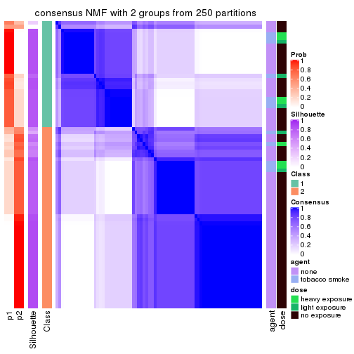</p>

</div>
<div id='tab-ATC-NMF-consensus-heatmap-2'>
<pre><code class="r">consensus_heatmap(res, k = 3)
</code></pre>

<p>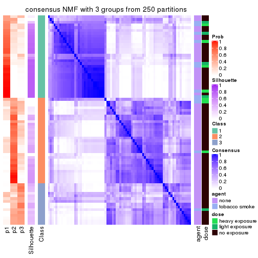</p>

</div>
<div id='tab-ATC-NMF-consensus-heatmap-3'>
<pre><code class="r">consensus_heatmap(res, k = 4)
</code></pre>

<p>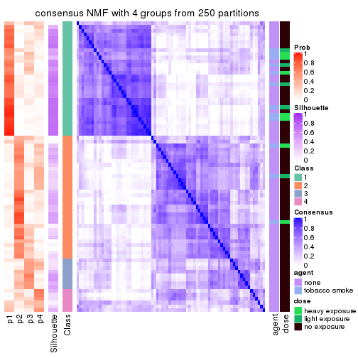</p>

</div>
<div id='tab-ATC-NMF-consensus-heatmap-4'>
<pre><code class="r">consensus_heatmap(res, k = 5)
</code></pre>

<p>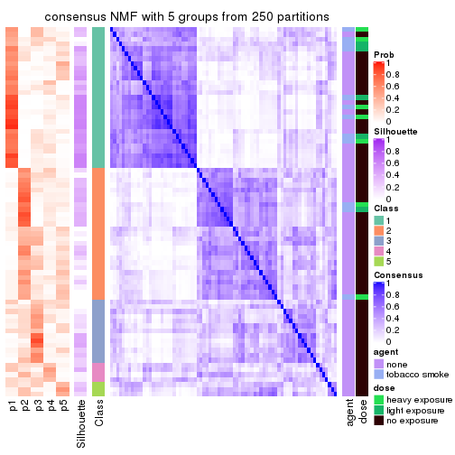</p>

</div>
<div id='tab-ATC-NMF-consensus-heatmap-5'>
<pre><code class="r">consensus_heatmap(res, k = 6)
</code></pre>

<p>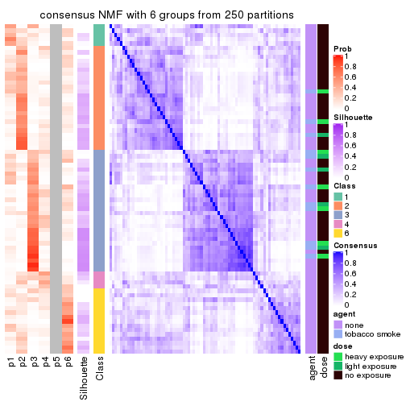</p>

</div>
</div>

Heatmaps for the membership of samples in all partitions to see how consistent they are:


<script>
$( function() {
	$( '#tabs-ATC-NMF-membership-heatmap' ).tabs();
} );
</script>
<div id='tabs-ATC-NMF-membership-heatmap'>
<ul>
<li><a href='#tab-ATC-NMF-membership-heatmap-1'>k = 2</a></li>
<li><a href='#tab-ATC-NMF-membership-heatmap-2'>k = 3</a></li>
<li><a href='#tab-ATC-NMF-membership-heatmap-3'>k = 4</a></li>
<li><a href='#tab-ATC-NMF-membership-heatmap-4'>k = 5</a></li>
<li><a href='#tab-ATC-NMF-membership-heatmap-5'>k = 6</a></li>
</ul>
<div id='tab-ATC-NMF-membership-heatmap-1'>
<pre><code class="r">membership_heatmap(res, k = 2)
</code></pre>

<p>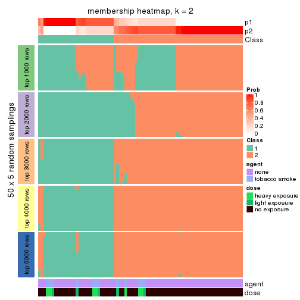</p>

</div>
<div id='tab-ATC-NMF-membership-heatmap-2'>
<pre><code class="r">membership_heatmap(res, k = 3)
</code></pre>

<p>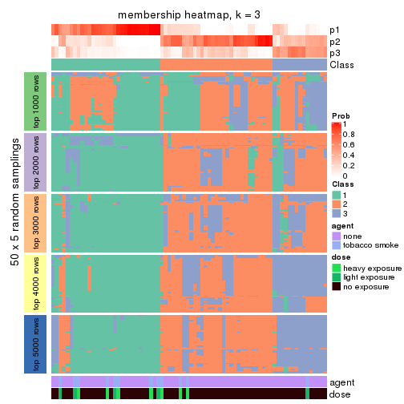</p>

</div>
<div id='tab-ATC-NMF-membership-heatmap-3'>
<pre><code class="r">membership_heatmap(res, k = 4)
</code></pre>

<p>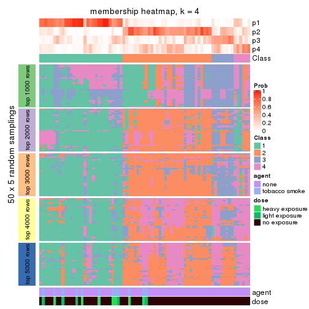</p>

</div>
<div id='tab-ATC-NMF-membership-heatmap-4'>
<pre><code class="r">membership_heatmap(res, k = 5)
</code></pre>

<p>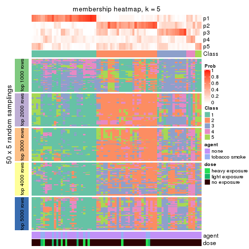</p>

</div>
<div id='tab-ATC-NMF-membership-heatmap-5'>
<pre><code class="r">membership_heatmap(res, k = 6)
</code></pre>

<p>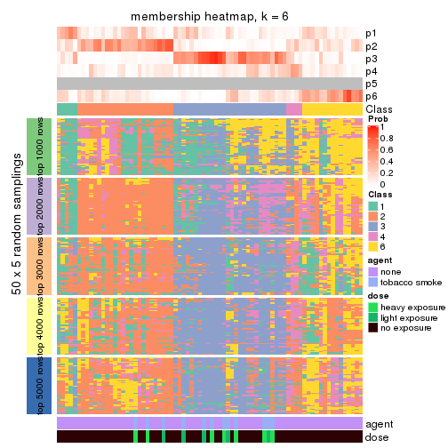</p>

</div>
</div>

As soon as we have had the classes for columns, we can look for signatures
which are significantly different between classes which can be candidate marks
for certain classes. Following are the heatmaps for signatures.


Signature heatmaps where rows are scaled:


<script>
$( function() {
	$( '#tabs-ATC-NMF-get-signatures' ).tabs();
} );
</script>
<div id='tabs-ATC-NMF-get-signatures'>
<ul>
<li><a href='#tab-ATC-NMF-get-signatures-1'>k = 2</a></li>
<li><a href='#tab-ATC-NMF-get-signatures-2'>k = 3</a></li>
<li><a href='#tab-ATC-NMF-get-signatures-3'>k = 4</a></li>
<li><a href='#tab-ATC-NMF-get-signatures-4'>k = 5</a></li>
<li><a href='#tab-ATC-NMF-get-signatures-5'>k = 6</a></li>
</ul>
<div id='tab-ATC-NMF-get-signatures-1'>
<pre><code class="r">get_signatures(res, k = 2)
</code></pre>

<p>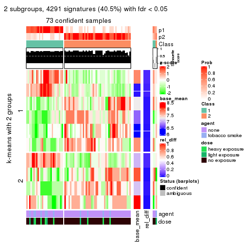</p>

</div>
<div id='tab-ATC-NMF-get-signatures-2'>
<pre><code class="r">get_signatures(res, k = 3)
</code></pre>

<p>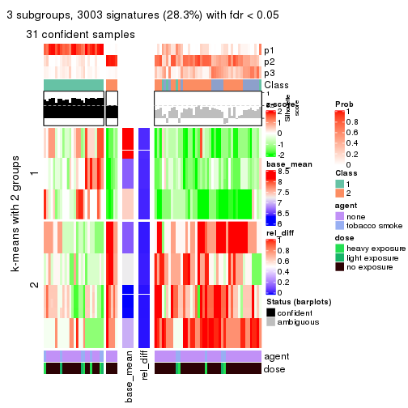</p>

</div>
<div id='tab-ATC-NMF-get-signatures-3'>
<pre><code class="r">get_signatures(res, k = 4)
</code></pre>

<p>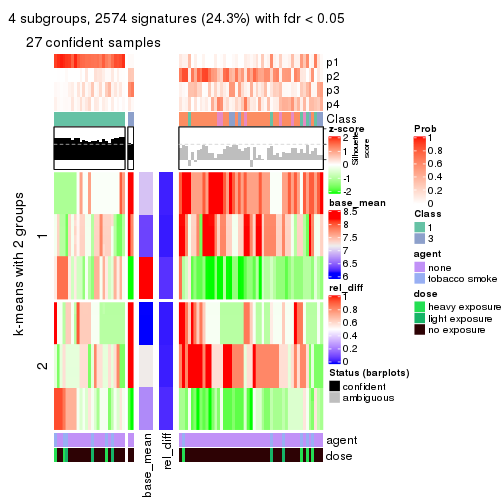</p>

</div>
<div id='tab-ATC-NMF-get-signatures-4'>
<pre><code class="r">get_signatures(res, k = 5)
</code></pre>

<p></p>

</div>
<div id='tab-ATC-NMF-get-signatures-5'>
<pre><code class="r">get_signatures(res, k = 6)
</code></pre>

<p></p>

</div>
</div>


Signature heatmaps where rows are not scaled:


<script>
$( function() {
	$( '#tabs-ATC-NMF-get-signatures-no-scale' ).tabs();
} );
</script>
<div id='tabs-ATC-NMF-get-signatures-no-scale'>
<ul>
<li><a href='#tab-ATC-NMF-get-signatures-no-scale-1'>k = 2</a></li>
<li><a href='#tab-ATC-NMF-get-signatures-no-scale-2'>k = 3</a></li>
<li><a href='#tab-ATC-NMF-get-signatures-no-scale-3'>k = 4</a></li>
<li><a href='#tab-ATC-NMF-get-signatures-no-scale-4'>k = 5</a></li>
<li><a href='#tab-ATC-NMF-get-signatures-no-scale-5'>k = 6</a></li>
</ul>
<div id='tab-ATC-NMF-get-signatures-no-scale-1'>
<pre><code class="r">get_signatures(res, k = 2, scale_rows = FALSE)
</code></pre>

<p>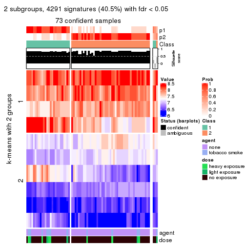</p>

</div>
<div id='tab-ATC-NMF-get-signatures-no-scale-2'>
<pre><code class="r">get_signatures(res, k = 3, scale_rows = FALSE)
</code></pre>

<p>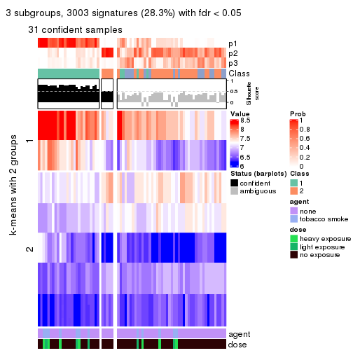</p>

</div>
<div id='tab-ATC-NMF-get-signatures-no-scale-3'>
<pre><code class="r">get_signatures(res, k = 4, scale_rows = FALSE)
</code></pre>

<p>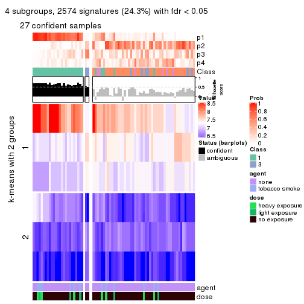</p>

</div>
<div id='tab-ATC-NMF-get-signatures-no-scale-4'>
<pre><code class="r">get_signatures(res, k = 5, scale_rows = FALSE)
</code></pre>

<p></p>

</div>
<div id='tab-ATC-NMF-get-signatures-no-scale-5'>
<pre><code class="r">get_signatures(res, k = 6, scale_rows = FALSE)
</code></pre>

<p></p>

</div>
</div>


Compare the overlap of signatures from different k:

```r
compare_signatures(res)
```

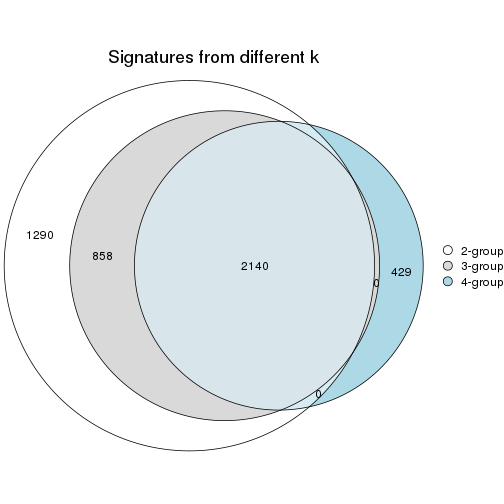

`get_signature()` returns a data frame invisibly. TO get the list of signatures, the function
call should be assigned to a variable explicitly. In following code, if `plot` argument is set
to `FALSE`, no heatmap is plotted while only the differential analysis is performed.

```r
# code only for demonstration
tb = get_signature(res, k = ..., plot = FALSE)
```

An example of the output of `tb` is:

```
#>   which_row         fdr    mean_1    mean_2 scaled_mean_1 scaled_mean_2 km
#> 1        38 0.042760348  8.373488  9.131774    -0.5533452     0.5164555  1
#> 2        40 0.018707592  7.106213  8.469186    -0.6173731     0.5762149  1
#> 3        55 0.019134737 10.221463 11.207825    -0.6159697     0.5749050  1
#> 4        59 0.006059896  5.921854  7.869574    -0.6899429     0.6439467  1
#> 5        60 0.018055526  8.928898 10.211722    -0.6204761     0.5791110  1
#> 6        98 0.009384629 15.714769 14.887706     0.6635654    -0.6193277  2
...
```

The columns in `tb` are:

1. `which_row`: row indices corresponding to the input matrix.
2. `fdr`: FDR for the differential test. 
3. `mean_x`: The mean value in group x.
4. `scaled_mean_x`: The mean value in group x after rows are scaled.
5. `km`: Row groups if k-means clustering is applied to rows.


UMAP plot which shows how samples are separated.


<script>
$( function() {
	$( '#tabs-ATC-NMF-dimension-reduction' ).tabs();
} );
</script>
<div id='tabs-ATC-NMF-dimension-reduction'>
<ul>
<li><a href='#tab-ATC-NMF-dimension-reduction-1'>k = 2</a></li>
<li><a href='#tab-ATC-NMF-dimension-reduction-2'>k = 3</a></li>
<li><a href='#tab-ATC-NMF-dimension-reduction-3'>k = 4</a></li>
<li><a href='#tab-ATC-NMF-dimension-reduction-4'>k = 5</a></li>
<li><a href='#tab-ATC-NMF-dimension-reduction-5'>k = 6</a></li>
</ul>
<div id='tab-ATC-NMF-dimension-reduction-1'>
<pre><code class="r">dimension_reduction(res, k = 2, method = &quot;UMAP&quot;)
</code></pre>

<p>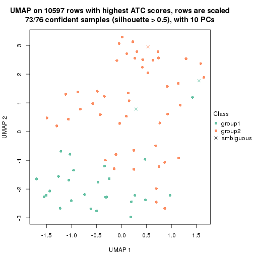</p>

</div>
<div id='tab-ATC-NMF-dimension-reduction-2'>
<pre><code class="r">dimension_reduction(res, k = 3, method = &quot;UMAP&quot;)
</code></pre>

<p>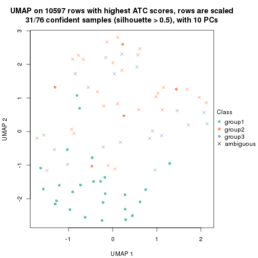</p>

</div>
<div id='tab-ATC-NMF-dimension-reduction-3'>
<pre><code class="r">dimension_reduction(res, k = 4, method = &quot;UMAP&quot;)
</code></pre>

<p>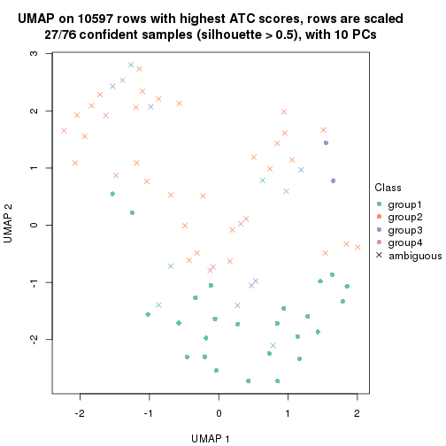</p>

</div>
<div id='tab-ATC-NMF-dimension-reduction-4'>
<pre><code class="r">dimension_reduction(res, k = 5, method = &quot;UMAP&quot;)
</code></pre>

<p>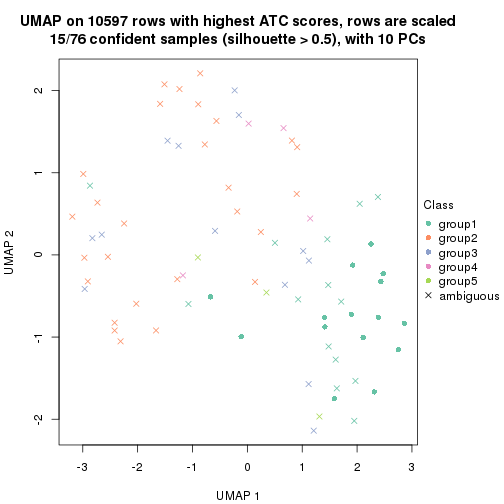</p>

</div>
<div id='tab-ATC-NMF-dimension-reduction-5'>
<pre><code class="r">dimension_reduction(res, k = 6, method = &quot;UMAP&quot;)
</code></pre>

<p>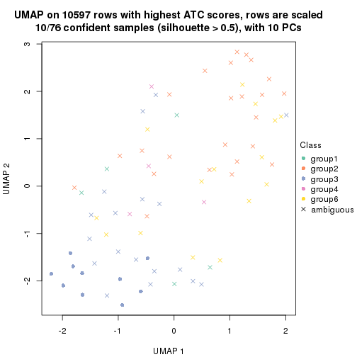</p>

</div>
</div>


Following heatmap shows how subgroups are split when increasing `k`:

```r
collect_classes(res)
```

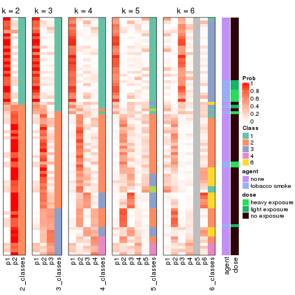


Test correlation between subgroups and known annotations. If the known
annotation is numeric, one-way ANOVA test is applied, and if the known
annotation is discrete, chi-squared contingency table test is applied.

```r
test_to_known_factors(res)
```

```
#>          n agent(p) dose(p) k
#> ATC:NMF 73   0.0777  0.0912 2
#> ATC:NMF 31   0.4625  0.4192 3
#> ATC:NMF 27   1.0000  0.7345 4
#> ATC:NMF 15       NA      NA 5
#> ATC:NMF 10       NA      NA 6
```


If matrix rows can be associated to genes, consider to use `GO_Enrichment(res,
...)` to perform function enrichment for the signature genes.


 

## Session info


```r
sessionInfo()
```

```
#> R version 3.6.0 (2019-04-26)
#> Platform: x86_64-pc-linux-gnu (64-bit)
#> Running under: CentOS Linux 7 (Core)
#> 
#> Matrix products: default
#> BLAS:   /usr/lib64/libblas.so.3.4.2
#> LAPACK: /usr/lib64/liblapack.so.3.4.2
#> 
#> locale:
#>  [1] LC_CTYPE=en_GB.UTF-8       LC_NUMERIC=C               LC_TIME=en_GB.UTF-8       
#>  [4] LC_COLLATE=en_GB.UTF-8     LC_MONETARY=en_GB.UTF-8    LC_MESSAGES=en_GB.UTF-8   
#>  [7] LC_PAPER=en_GB.UTF-8       LC_NAME=C                  LC_ADDRESS=C              
#> [10] LC_TELEPHONE=C             LC_MEASUREMENT=en_GB.UTF-8 LC_IDENTIFICATION=C       
#> 
#> attached base packages:
#> [1] grid      parallel  stats     graphics  grDevices utils     datasets  methods   base     
#> 
#> other attached packages:
#>  [1] genefilter_1.66.0     ComplexHeatmap_2.1.1  markdown_1.1          knitr_1.26           
#>  [5] preprocessCore_1.46.0 cola_1.3.2            GEOquery_2.52.0       Biobase_2.44.0       
#>  [9] BiocGenerics_0.30.0   GetoptLong_0.1.7     
#> 
#> loaded via a namespace (and not attached):
#>  [1] bitops_1.0-6         matrixStats_0.55.0   bit64_0.9-7          doParallel_1.0.15   
#>  [5] RColorBrewer_1.1-2   httr_1.4.1           tools_3.6.0          backports_1.1.5     
#>  [9] R6_2.4.1             DBI_1.0.0            lazyeval_0.2.2       colorspace_1.4-1    
#> [13] withr_2.1.2          tidyselect_0.2.5     gridExtra_2.3        bit_1.1-14          
#> [17] compiler_3.6.0       xml2_1.2.2           microbenchmark_1.4-7 pkgmaker_0.28       
#> [21] slam_0.1-46          scales_1.1.0         readr_1.3.1          NMF_0.23.6          
#> [25] stringr_1.4.0        digest_0.6.23        pkgconfig_2.0.3      bibtex_0.4.2        
#> [29] highr_0.8            limma_3.40.6         rlang_0.4.2          GlobalOptions_0.1.1 
#> [33] RSQLite_2.1.2        impute_1.58.0        shape_1.4.4          mclust_5.4.5        
#> [37] dendextend_1.12.0    dplyr_0.8.3          RCurl_1.95-4.12      magrittr_1.5        
#> [41] Matrix_1.2-17        Rcpp_1.0.3           munsell_0.5.0        S4Vectors_0.22.1    
#> [45] viridis_0.5.1        lifecycle_0.1.0      stringi_1.4.3        plyr_1.8.4          
#> [49] blob_1.2.0           crayon_1.3.4         lattice_0.20-38      splines_3.6.0       
#> [53] annotate_1.62.0      circlize_0.4.9       hms_0.5.2            zeallot_0.1.0       
#> [57] pillar_1.4.2         rjson_0.2.20         rngtools_1.4         reshape2_1.4.3      
#> [61] codetools_0.2-16     stats4_3.6.0         XML_3.98-1.20        glue_1.3.1          
#> [65] evaluate_0.14        png_0.1-7            vctrs_0.2.0          foreach_1.4.7       
#> [69] polyclip_1.10-0      gtable_0.3.0         purrr_0.3.3          tidyr_1.0.0         
#> [73] clue_0.3-57          assertthat_0.2.1     ggplot2_3.2.1        xfun_0.11           
#> [77] gridBase_0.4-7       eulerr_6.0.0         xtable_1.8-4         skmeans_0.2-11      
#> [81] survival_2.44-1.1    viridisLite_0.3.0    tibble_2.1.3         iterators_1.0.12    
#> [85] AnnotationDbi_1.46.1 registry_0.5-1       memoise_1.1.0        IRanges_2.18.3      
#> [89] cluster_2.1.0        brew_1.0-6
```


